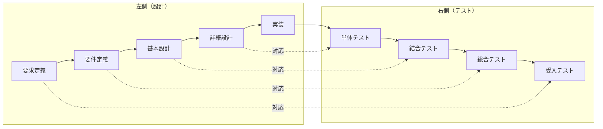
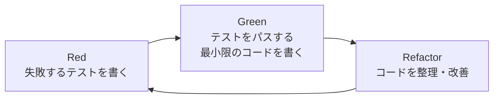

# TANREN バイブコーディング 統合開発ルールブック v1.2
## Claude Code × Cursor 共存・共栄ガイドライン
## V字モデル・テスト駆動開発（TDD）対応版
## Next.js App Router ・ Server Actions 完全準拠版

---

## 🎯 はじめに

このファイルは、**TANREN株式会社 CEO 佐藤勝彦様**の非エンジニア向けバイブコーディング支援のために作成された統合ルールブックです。Claude CodeとCursorの両方で同じ見解・理解を共有し、どちらのツールを使っても整合性の取れた開発ができるよう設計されています。

**重要原則**：
- すべての処理・成果物は**完全な日本語**で実行
- Docker環境をベースとしたコンテナ駆動開発
- 非エンジニアでも簡単にCloud Runへデプロイ可能な仕組み

---

## 📁 プロジェクト構造とフォルダ管理

### 標準ディレクトリ構成
```
vibe-coding/ (プロジェクトルート)
├── app/                      # メインNext.jsアプリケーション
│   ├── api/                  # APIルート
│   ├── components/           # UIコンポーネント
│   ├── lib/                  # 共通ライブラリ
│   └── [その他Next.js標準]
├── apps/                     # 【推奨】今後のCloud Runサービス格納場所
│   └── [サービス名]/         # 例: portal-web/, image-editor/
├── backend/                  # Python等のバックエンドアプリ
├── packages/                 # 【推奨】共有ライブラリ・UIキット
│   ├── ui-kit/              # 共通UIコンポーネント
│   └── core-lib/            # 共通ビジネスロジック
├── docker/                   # 【新規】Docker関連設定の集約場所
│   ├── dev/                 # 開発環境用設定
│   ├── prod/                # 本番環境用設定
│   └── templates/           # Dockerfileテンプレート
├── sato_managed_contents/    # 執筆・ビジネス文書関連
│   ├── AI超独学/            # 書籍執筆関連
│   ├── 商談管理/            # ビジネス文書
│   └── [その他コンテンツ]
├── .claude/                  # Claude Code設定
│   ├── commands/            # カスタムコマンド
│   └── CLAUDE.md            # ユーザー個別設定（任意）
├── .cursor/                  # Cursor設定
│   └── rules/               # Cursorルール
├── CLAUDE.md                # 【このファイル】統合ルールブック
├── CLAUDE.local.md          # 個人用設定（gitignore推奨）
├── docker-compose.yml       # Docker Compose設定
└── package.json             # ルートpackage.json（モノレポ管理）
```

### フォルダ管理の基本ルール

1. **アプリケーション開発**
   - 新規Webアプリ → `apps/[アプリ名]/` に作成
   - 既存の `app/` は現状維持（将来的に移行検討）
   - 各アプリは独立したDockerコンテナで動作

2. **コンテンツ管理**
   - 執筆・文書作成 → `sato_managed_contents/` 内で整理
   - プロジェクトごとにサブフォルダで管理
   - AIによる文章生成結果も同様に整理

3. **共通リソース**
   - UIコンポーネント → `packages/ui-kit/`
   - ビジネスロジック → `packages/core-lib/`
   - Docker設定 → `docker/` に集約

---

## 🐳 Docker開発フロー（非エンジニア向け）

### 1. 開発環境の起動（簡単3ステップ）

```bash
# ステップ1: プロジェクトルートに移動
cd ~/vibe-coding

# ステップ2: Docker環境を起動
docker compose up -d

# ステップ3: ブラウザで確認
# http://localhost:3000 (メインアプリ)
# http://localhost:3001 (サブアプリ例)
```

### 2. 新規アプリ作成テンプレート

```bash
# Claude Code または Cursor のターミナルで実行
claude "新しいNext.jsアプリを apps/my-new-app/ に作成してください。
Dockerfileも含めて、Cloud Runにデプロイできる構成にしてください。"
```

### 3. Cloud Runへの簡単デプロイ

```bash
# 方法1: Buildpacksを使った自動デプロイ（Dockerfile不要）
gcloud run deploy my-app \
  --source=apps/my-app \
  --region=asia-northeast1 \
  --allow-unauthenticated

# 方法2: 既存のDockerfileを使用
gcloud run deploy my-app \
  --source=apps/my-app \
  --region=asia-northeast1 \
  --platform=managed
```

---

## 🤝 Claude Code × Cursor 統合設定

### Claude Code側の設定

1. **グローバル設定** (`~/.claude/CLAUDE.md`)
```markdown
# 日本語設定
すべての応答は日本語で行ってください。

# 開発スタイル
- 非エンジニアにも分かりやすい説明を心がける
- 技術用語は必ず日本語で説明を追加
- エラーメッセージも日本語で解説
```

2. **プロジェクト設定** (このファイル)
- プロジェクト固有のルールを記載
- Cursorのルールと同期

### 🎨 Puppeteer MCPの設定（自動ブラウザスクリーンショット）

**Puppeteer MCPはインストール済みです。**

#### 使用方法

1. **MCPの確認**
   ```bash
   /mcp  # Puppeteerがリストにあることを確認
   ```

2. **ブラウザスクリーンショットの自動取得**
   ```bash
   claude "開発中のアプリのhttp://localhost:3000をスクリーンショットして確認して"
   ```
   Claude Codeが自動的にPuppeteerを使用してスクリーンショットを取得・解析します。

3. **テストやデバッグでの活用**
   - UIの表示確認
   - レスポンシブデザインのチェック
   - エラー画面のキャプチャ
   - E2Eテストの代替

#### インストール方法（再インストールが必要な場合）

```bash
claude mcp add-json puppeteer -s user '{
"command": "npx",
"args": ["-y", "@modelcontextprotocol/server-puppeteer"]
}'
```

### Cursor側の設定

`.cursor/rules/` 内のルールファイルに以下を追加：

```yaml
# Claude.mdとの同期設定
- name: "CLAUDE.md同期"
  description: "Claude Codeとの整合性維持"
  rules:
    - "CLAUDE.mdの内容を優先的に参照"
    - "フォルダ構造は必ずCLAUDE.mdに従う"
    - "Docker関連の操作はCLAUDE.mdのフローに準拠"
```

### 自動承認の設定

```bash
# Claude Codeでの設定
claude config add autoApprove.read true
claude config add autoApprove.write false  # 書き込みは確認必要
claude config add autoApprove.bash "docker,npm,pnpm"  # 特定コマンドのみ自動承認
```

---

## ⚡ Next.js開発原則（App Router時代の標準）

### 1. コア原則
- **App Router** を標準採用
- **TypeScript** 必須（ESLint／型エラーは常にゼロ）
- **API Routes は使用しない**。あらゆるサーバー処理は **Server Actions** で実装

### 2. ディレクトリレイアウト

```
apps/[アプリ名]/              # 各アプリケーションルート
├── app/                     # App Router（ルーティング & ページ）
├── components/              # 汎用UI（再利用可能・ロジックなし）
├── lib/                     # ユーティリティ関数
├── hooks/                   # カスタムフック
├── types/                   # 型定義
├── constants/               # 定数
├── config/                  # 設定値・環境変数ラッパー
├── services/                # 外部APIラッパーやビジネスロジック
└── demo/                    # フロントエンドから実行できる手動テストページ
```

- **専用（機能固有）コンポーネント** → 対応する `page.tsx` と同階層
- **汎用（再利用可能）コンポーネント** → `components/` に配置

### 3. データハンドリング

| 依存条件 | 実装方法 |
|---------|----------|
| ユーザー操作に依存しない | Server Components + Server Actions |
| ユーザー操作に依存する | Client Components + Server Actions + useSWR |

- **更新**は Server Actions、**即時反映**は `useSWR.mutate` で楽観的更新
- **Supabase** は RLS + `auth.uid()` を利用し、`user.id` 明示は不要

### 4. 表示と状態管理
- **UI は極力自作せず**、必ず **shadcn/ui** のコンポーネントを利用
- **アイコン**は **lucide-react** を統一使用
- **URL 状態**は **nuqs** に統一
- **グローバル状態ライブラリは使用しない**（必要時は React Context + useReducer などで最小構成）

### 5. パフォーマンス
- **`use client` / `useEffect` / `useState`** は最小限、まず RSC（React Server Components）
- クライアント側は **Suspense** でフォールバック
- **動的 import** で遅延読み込み、画像は `next/image`、リンクは `next/link`
- **ルートベースのコード分割**を徹底

### 6. フォームとバリデーション
- **制御コンポーネント** + **react-hook-form**
- **スキーマ検証**は **Zod**
- クライアント／サーバー両方で入力チェック

### 7. 品質・セキュリティ・テスト

#### 7-1. エラーハンドリング
- **ガード節**で早期 return、成功パスは最後にまとめる

#### 7-2. アクセシビリティ
- **セマンティック HTML** + **ARIA**、キーボード操作サポート

#### 7-3. Server Actions のセキュリティ指針
- **ユーザーが許可された操作だけ**を Server Action として実装
- **汎用的・多目的なサーバー関数は実装しない**
- RLS と `auth.uid()` により **最小権限** を担保

#### 7-4. テスト
- **`demo/` ディレクトリ**に UI ベースのテストページを配置
- すべての Server Actions・クライアント関数を **ブラウザ経由で手動検証** できるようにする

### Next.js実装フロー

1. **設計**：コア原則とディレクトリ決定
2. **データ**：取得（useSWR）・更新（Server Actions＋mutate）ルール確立
3. **UI / State**：shadcn/ui と lucide-react を使い、URL 状態は nuqs
4. **パフォーマンス**：RSC・Suspense・dynamic import で最適化
5. **フォーム & バリデーション**：Zod × react-hook-form
6. **品質管理**：エラー処理 → アクセシビリティ → 専用 Server Actions → demo/ で手動テスト

---

## 📝 コーディング規約

### 基本原則
- **言語**: TypeScript（JavaScript禁止）
- **スタイル**: Prettier + ESLint（自動整形）
- **UI**: Tailwind CSS + shadcn/ui（必須）
- **アイコン**: lucide-react（統一）
- **状態管理**: 
  - URL状態： nuqs
  - ローカル状態： React標準フック（useState, useReducer）
  - グローバル状態： 原則使用しない（必要時はContext）

### ファイル命名規則
```
コンポーネント: PascalCase.tsx   例: UserProfile.tsx
ユーティリティ: kebab-case.ts    例: format-date.ts
定数: UPPER_SNAKE_CASE           例: API_ENDPOINT
Server Actions: actions.ts       例: app/users/actions.ts
```

### Gitコミット規則（日本語OK）
```bash
feat: 新機能追加
fix: バグ修正
docs: ドキュメント更新
style: スタイル調整
refactor: リファクタリング
test: テスト追加・修正
chore: その他の変更
```

例:
```bash
git commit -m "feat(app/image-generator): 画像アップロード機能を追加"
git commit -m "fix(backend): 認証タイムアウトエラーを修正"
```

---

## 🎯 Next.js実装例：Server ActionsとuseSWRの組み合わせ

### ユーザー一覧ページの作成例

```tsx
// app/users/page.tsx（Server Component）
import { UserList } from './UserList'

export default function UsersPage() {
  return (
    <div className="container mx-auto p-4">
      <h1 className="text-2xl font-bold mb-4">ユーザー一覧</h1>
      <UserList />
    </div>
  )
}
```

```tsx
// app/users/UserList.tsx（Client Component）
'use client'
import useSWR from 'swr'
import { createUser, deleteUser } from './actions'
import { Button } from '@/components/ui/button'
import { Input } from '@/components/ui/input'

const fetcher = (url: string) => fetch(url).then(res => res.json())

export function UserList() {
  const { data: users, mutate } = useSWR('/api/users', fetcher)
  
  const handleCreate = async (formData: FormData) => {
    // 楽観的更新
    const newUser = { name: formData.get('name') as string }
    mutate([...(users || []), newUser], false)
    
    // Server Action実行
    await createUser(formData)
    
    // 再検証
    mutate()
  }
  
  return (
    <div>
      <form action={handleCreate} className="mb-4 flex gap-2">
        <Input name="name" placeholder="名前" required />
        <Button type="submit">追加</Button>
      </form>
      <ul className="space-y-2">
        {users?.map((user: any) => (
          <li key={user.id} className="flex justify-between items-center p-2 border rounded">
            <span>{user.name}</span>
            <Button 
              variant="destructive" 
              size="sm"
              onClick={() => handleDelete(user.id)}
            >
              削除
            </Button>
          </li>
        ))}
      </ul>
    </div>
  )
}
```

```ts
// app/users/actions.ts（Server Actions）
'use server'
import { revalidatePath } from 'next/cache'
import { createClient } from '@/lib/supabase/server'

export async function createUser(formData: FormData) {
  const supabase = createClient()
  const name = formData.get('name') as string
  
  // バリデーション
  if (!name || name.length < 2) {
    throw new Error('名前は2文字以上必要です')
  }
  
  // DB操作（RLSで権限制御）
  const { error } = await supabase
    .from('users')
    .insert({ name })
  
  if (error) throw error
  
  revalidatePath('/users')
}

export async function deleteUser(id: string) {
  const supabase = createClient()
  
  const { error } = await supabase
    .from('users')
    .delete()
    .eq('id', id)
  
  if (error) throw error
  
  revalidatePath('/users')
}
```

---

## 🚀 開発ワークフロー

### 1. V字モデルに基づく開発プロセス



### 2. テスト駆動開発（TDD）サイクル

各実装ステップでは、以下のTDDサイクルを適用：



### 3. ToDo管理の詳細ステップ

#### 新機能開発時のToDoテンプレート

```markdown
## 機能名: [機能の名前]

### 📋 設計フェーズ
- [ ] 要求定義の確認と文書化
- [ ] 要件定義書の作成
- [ ] 基本設計（画面設計・API設計）
- [ ] 詳細設計（データ構造・処理フロー）

### 🧪 テスト設計フェーズ
- [ ] 受入テストシナリオ作成
- [ ] 総合テストケース作成
- [ ] 結合テストケース作成
- [ ] 単体テストケース作成

### 💻 実装フェーズ（TDD適用）
- [ ] 環境セットアップ
  - [ ] Dockerコンテナ起動確認
  - [ ] 必要な依存関係インストール
- [ ] 各機能の実装（TDDサイクル）
  - [ ] テストファイル作成
  - [ ] Red: 失敗するテスト記述
  - [ ] Green: 最小限の実装
  - [ ] Refactor: コード改善

### ✅ テスト実行フェーズ
- [ ] 単体テスト実行・合格
- [ ] 結合テスト実行・合格
- [ ] 総合テスト実行・合格
- [ ] 受入テスト実行・合格

### 🚀 デプロイフェーズ
- [ ] ローカル動作確認
- [ ] Dockerイメージビルド
- [ ] Cloud Runデプロイ
- [ ] 本番環境動作確認
```

### 4. 実装例：Next.jsでの画像アップロード機能

```bash
# Step 1: ToDoリスト作成
claude "画像アップロード機能のToDoリストを作成してください"

# Step 2: テストファイル作成（TDD開始）
claude "apps/my-app/__tests__/upload.test.tsxを作成し、
画像アップロードのテストケースを書いてください"

# Step 3: 実装
claude "テストをパスする最小限の実装を
apps/my-app/components/ImageUpload.tsxに作成してください"

# Step 4: リファクタリング
claude "ImageUploadコンポーネントをリファクタリングし、
エラーハンドリングとローディング状態を追加してください"
```

### 5. エラー対処法（非エンジニア向け完全ガイド）

#### 🔴 エラーが発生したら

**まず落ち着いて、以下の手順を実行：**

1. **エラーメッセージをコピー**
   ```bash
   # Claude Codeに直接聞く
   claude "以下のエラーが出ました。解決方法を教えてください：
   [エラーメッセージをペースト]"
   ```

2. **基本的なリセット手順**
   ```bash
   # Step 1: 現在の状態を保存
   git add .
   git commit -m "WIP: エラー発生前の状態を保存"
   
   # Step 2: Docker環境をリセット
   docker compose down
   docker system prune -f
   
   # Step 3: 依存関係をクリーンインストール
   rm -rf node_modules pnpm-lock.yaml
   pnpm install
   
   # Step 4: 再起動
   docker compose up -d --build
   ```

#### 🟡 よくあるエラーと対処法

**1. "Cannot find module" エラー**
```bash
# 対処法
claude "Cannot find moduleエラーが出ています。
必要なパッケージをインストールしてください"
```

**2. "Port already in use" エラー**
```bash
# 対処法
# 使用中のポートを確認
lsof -i :3000
# プロセスを終了
kill -9 [プロセスID]
# または別のポートを使用
PORT=3001 pnpm dev
```

**3. TypeScriptの型エラー**
```bash
# 対処法
claude "TypeScriptの型エラーが出ています。
型定義を修正してください"
```

**4. Docker関連エラー**
```bash
# Docker Desktopが起動していない場合
# 1. Docker Desktopを起動
# 2. 少し待つ（約30秒）
# 3. 再度コマンドを実行
```

**5. テスト失敗**
```bash
# 対処法
claude "テストが失敗しています。
テストログを確認して修正してください：
[テスト結果をペースト]"
```

#### 🟢 エラーループからの脱出法

**同じエラーが繰り返される場合：**

1. **一度立ち止まる**
   ```bash
   # 現在の変更を一時的に退避
   git stash
   
   # main/masterブランチに戻る
   git checkout main
   
   # クリーンな状態から再開
   docker compose down -v
   docker compose up -d --build
   ```

2. **小さなステップで進める**
   ```bash
   # ToDoを細分化
   claude "この機能を最小限の10ステップに分割してください"
   
   # 1ステップずつ実行・確認
   claude "ステップ1だけを実装してください"
   ```

3. **ペアプログラミングモード**
   ```bash
   # Claude Codeと対話しながら進める
   claude "一緒にデバッグしましょう。
   まず現在の状況を確認してください"
   ```

#### 🔵 予防的措置

**エラーを未然に防ぐ習慣：**

1. **こまめなコミット**
   ```bash
   # 動作する状態になったら必ずコミット
   git add .
   git commit -m "feat: ○○機能が動作する状態"
   ```

2. **テストファースト**
   ```bash
   # 実装前にテストを書く
   claude "この機能のテストを先に書いてください"
   ```

3. **環境の定期的なクリーンアップ**
   ```bash
   # 週1回程度実行
   docker system prune -a
   pnpm clean
   ```

---

## 📊 品質チェックリスト

### デプロイ前の確認事項

- [ ] ローカルでの動作確認完了
- [ ] エラーログがないことを確認
- [ ] Dockerイメージのビルド成功
- [ ] 環境変数の設定確認
- [ ] セキュリティ（APIキーなど）の確認

### パフォーマンス目標

- ページ読み込み: 3秒以内
- Lighthouseスコア: 90以上
- Dockerイメージサイズ: 1GB以下

---

## 🔒 セキュリティ・コスト管理

### セキュリティ基本事項
- APIキーは必ず環境変数で管理
- `.env`ファイルはgitignoreに追加
- Cloud Runは認証設定を適切に

### コスト管理
- Cloud Run: リクエストベース課金（アイドル時は無料）
- 月次予算: 150-300 USD/人
- 定期的なリソース使用状況確認

```bash
# コスト確認コマンド
gcloud billing accounts list
gcloud billing projects describe $(gcloud config get-value project)
```

---

## 🆘 ヘルプ・サポート

### 困ったときは

1. **Claude Codeで質問**
   ```bash
   claude "〇〇のエラーが出ています。解決方法を教えてください。"
   ```

2. **Cursorで質問**
   - Cmd+K で「このエラーの解決方法を日本語で説明」

3. **ドキュメント参照**
   - このファイル（CLAUDE.md）を確認
   - プロジェクトのREADME.mdを確認

### 更新履歴

- v1.2 (2025-05-31): Next.js App Router・Server Actions対応版
  - Next.js開発原則セクションを追加
  - App RouterとServer Actionsを標準採用
  - ディレクトリ構成をNext.jsベストプラクティスに更新
  - demo/ディレクトリによるテスト方針を追加
- v1.1 (2025-05-31): V字モデル・TDD対応版
  - V字モデルに基づく開発プロセスを追加
  - テスト駆動開発（TDD）サイクルを導入
  - ToDo管理の詳細テンプレートを追加
  - 非エンジニア向けエラー対処完全ガイドを追加
- v1.0 (2025-05-31): 初版作成
  - Claude Code × Cursor統合ルール確立
  - Docker開発フロー標準化
  - フォルダ管理体系の整備

---

## 付録：よく使うコマンド集

```bash
# 開発環境
docker compose up -d          # 起動
docker compose down          # 停止
docker compose logs -f       # ログ確認

# Git操作
git status                   # 状態確認
git add .                    # 全変更をステージ
git commit -m "メッセージ"   # コミット
git push                     # プッシュ

# Cloud Run
gcloud run deploy           # デプロイ
gcloud run services list    # サービス一覧
gcloud run logs read        # ログ確認

# パッケージ管理
pnpm install               # 依存関係インストール
pnpm dev                   # 開発サーバー起動
pnpm build                 # ビルド
pnpm test                  # テスト実行
```

---

*このドキュメントは定期的に更新されます。最新版は常にプロジェクトルートのCLAUDE.mdを参照してください。*