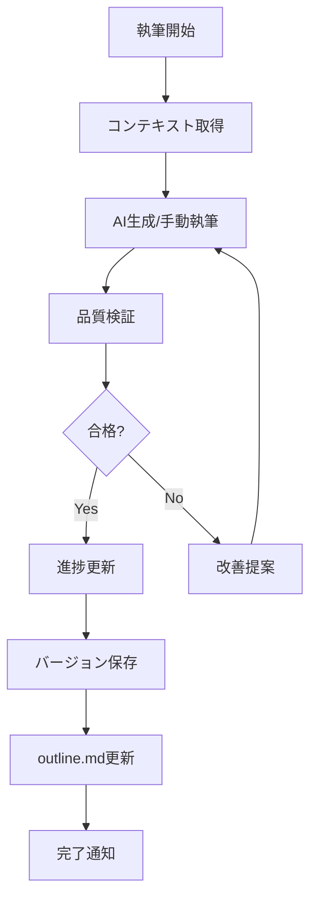
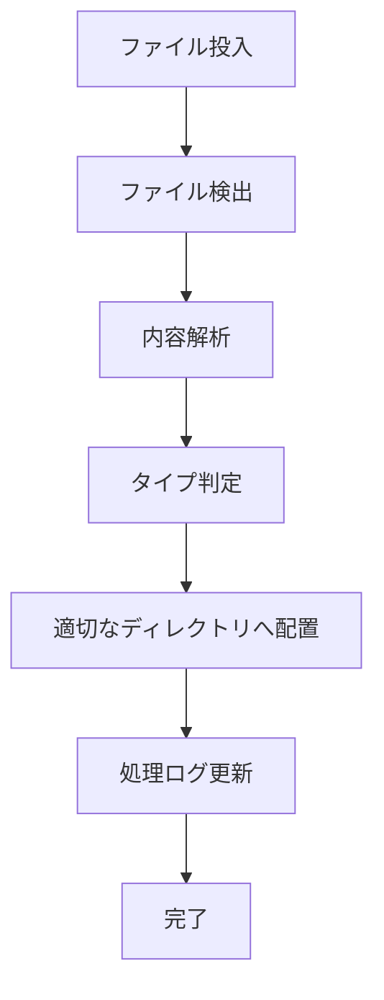

# AI-Script-Creation-System 技術定義書

## 1. システムアーキテクチャ

### 1.1 全体構成
```
┌─────────────────────────────────────────────────────────────┐
│                        ユーザーインターフェース                    │
│                    (CLI / Python API / Future: Web UI)          │
└─────────────────────┬───────────────────────────────────────────┘
                      │
┌─────────────────────▼───────────────────────────────────────────┐
│                          コアシステム層                           │
│  ┌──────────────┐  ┌──────────────┐  ┌──────────────────┐  │
│  │ Manager層     │  │ Processor層  │  │ Validator層      │  │
│  │ ・Book Manager│  │ ・UserInput  │  │ ・Quality Check  │  │
│  │ ・Version Mgr │  │ ・Outline    │  │ ・Consistency    │  │
│  └──────────────┘  └──────────────┘  └──────────────────┘  │
└─────────────────────────────────────────────────────────────────┘
                      │
┌─────────────────────▼───────────────────────────────────────────┐
│                          データ層                                │
│  ┌──────────────┐  ┌──────────────┐  ┌──────────────────┐  │
│  │ ファイルシステム│  │ メタデータ   │  │ バージョン管理    │  │
│  │ ・YAML設定    │  │ ・JSON       │  │ ・差分管理       │  │
│  │ ・MDコンテンツ │  │ ・Index      │  │ ・履歴          │  │
│  └──────────────┘  └──────────────┘  └──────────────────┘  │
└─────────────────────────────────────────────────────────────────┘
```

### 1.2 レイヤー設計
- **プレゼンテーション層**: ユーザーインターフェース
- **ビジネスロジック層**: コア機能の実装
- **データアクセス層**: ファイルシステムとの連携
- **永続化層**: ファイルベースのデータ保存

## 2. 技術スタック

### 2.1 プログラミング言語
- **Python 3.8+**: メイン開発言語
- **Markdown**: コンテンツフォーマット
- **YAML**: 設定ファイル形式
- **JSON**: メタデータ・ログ形式

### 2.2 主要ライブラリ
```python
# 必須ライブラリ
pyyaml>=6.0      # YAML処理
pathlib          # ファイルパス操作（標準ライブラリ）
datetime         # 日時処理（標準ライブラリ）
json             # JSON処理（標準ライブラリ）
re               # 正規表現（標準ライブラリ）
hashlib          # ハッシュ計算（標準ライブラリ）
shutil           # ファイル操作（標準ライブラリ）
difflib          # 差分計算（標準ライブラリ）

# オプション（将来拡張用）
pandas           # データ分析
numpy            # 数値計算
matplotlib       # グラフ生成
```

### 2.3 外部依存
- **AI API**: OpenAI GPT / Anthropic Claude（実行時に選択）
- **Git**: バージョン管理（オプション）

## 3. モジュール設計

### 3.1 コアモジュール構成

#### 3.1.1 version_manager.py
```python
class VersionManager:
    """バージョン管理の基底クラス"""
    def save_version(self, reason: str, author: str) -> Dict
    def get_version_history(self) -> List[Dict]
    def restore_version(self, version_id: str) -> bool
    def get_diff(self, version1_id: str, version2_id: str) -> str

class BusinessBookVersionManager(VersionManager):
    """ビジネス書籍用バージョン管理"""
    def save_chapter_completion(self, chapter_number: int, chapter_title: str)
```

#### 3.1.2 business_book_manager.py
```python
class BusinessBookManager:
    """ビジネス書籍プロジェクト管理"""
    def __init__(self, project_root: str)
    def get_chapter_context(self, chapter_num: int) -> Dict
    def update_chapter_progress(self, chapter_num: int, words_written: int)
    def validate_consistency(self, chapter_num: int, text: str) -> List[str]
```

#### 3.1.3 user_input_processor.py
```python
class UserInputProcessor:
    """UserInput自動処理"""
    def scan_and_process(self) -> Dict[str, List[str]]
    def _detect_file_type(self, file_path: Path) -> str
    def _process_file(self, file_path: Path)
```

### 3.2 データモデル

#### 3.2.1 プロジェクト構造
```yaml
project:
  title: str
  author: str
  type: str  # business_book, novel, technical
  target_words: int
  chapters:
    - number: int
      title: str
      status: str  # pending, in_progress, completed
      words: int
      sections: List[Section]
```

#### 3.2.2 バージョン情報
```json
{
  "version_id": "20240120_100000",
  "timestamp": "2024-01-20T10:00:00",
  "reason": "第1章執筆完了",
  "author": "system",
  "hash": "abc123...",
  "size": 12345,
  "parent_version": "20240119_150000",
  "diff_file": "diff_20240119_150000_to_20240120_100000.txt"
}
```

## 4. 処理フロー

### 4.1 章執筆フロー


### 4.2 UserInput処理フロー


## 5. ファイルシステム設計

### 5.1 ディレクトリレイアウト
```
project_root/
├── outline.md              # メインアウトライン（自動更新）
├── project_config.yaml     # プロジェクト設定
├── chapters/               # 章データ
│   ├── chapter_00/        # 各章のディレクトリ
│   │   ├── content.md     # 本文
│   │   └── metadata.json  # メタデータ
├── concepts/              # 概念定義
├── case_studies/          # ケーススタディ
├── references/            # 参考資料
├── versions/              # バージョン履歴
│   ├── outline_v*.md      # アウトラインのバージョン
│   └── diff_*.txt         # 差分ファイル
├── quality_reports/       # 品質レポート
└── UserInput/            # 素材投入フォルダー
    └── .processed_log.json # 処理済みログ
```

### 5.2 ファイル命名規則
- バージョンファイル: `{basename}_v{YYYYMMDD_HHMMSS}.{ext}`
- 差分ファイル: `diff_{from_version}_to_{to_version}.txt`
- 品質レポート: `quality_report_ch{number}_{timestamp}.{md|json}`

## 6. 品質管理

### 6.1 品質メトリクス
```python
quality_metrics = {
    "readability": float,      # 読みやすさスコア (0-100)
    "structure": float,        # 構造の適切さ (0-100)
    "content_ratio": float,    # コンテンツ比率 (0-100)
    "actionability": float,    # 実践可能性 (0-100)
    "consistency": float,      # 一貫性 (0-100)
    "engagement": float        # 読者関心度 (0-100)
}
```

### 6.2 検証ルール
- 文字数: 目標の90-110%
- セクション数: 3-7個
- 文の長さ: 最大60字
- 段落の長さ: 最大300字
- 専門用語: 初出時に説明必須

## 7. エラーハンドリング

### 7.1 エラー分類
- **FileNotFoundError**: ファイル不在
- **ValidationError**: 検証エラー
- **ProcessingError**: 処理エラー
- **ConfigError**: 設定エラー

### 7.2 エラー処理方針
```python
try:
    # 処理実行
except FileNotFoundError as e:
    logger.error(f"ファイルが見つかりません: {e}")
    return default_value
except Exception as e:
    logger.error(f"予期しないエラー: {e}")
    # 安全な状態に戻す
    rollback()
    raise
```

## 8. パフォーマンス最適化

### 8.1 キャッシング
- 頻繁にアクセスされるデータのメモリキャッシュ
- 処理済みファイルのハッシュ値キャッシュ

### 8.2 並行処理
- 複数章の同時品質チェック
- UserInputファイルの並行処理

### 8.3 メモリ管理
- 大容量ファイルのストリーミング処理
- 不要なオブジェクトの明示的削除

## 9. セキュリティ考慮事項

### 9.1 入力検証
- ファイルパスのサニタイズ
- ファイルサイズ制限（デフォルト: 100MB）
- 許可された拡張子のみ処理

### 9.2 データ保護
- 機密情報のマスキング
- バージョン管理での個人情報保護

## 10. テスト戦略

### 10.1 ユニットテスト
```python
def test_version_manager():
    """バージョン管理のテスト"""
    vm = VersionManager(test_dir)
    version_info = vm.save_version("test", "tester")
    assert version_info["version_id"] is not None
```

### 10.2 統合テスト
- エンドツーエンドの執筆フロー
- UserInput処理の全体フロー

### 10.3 性能テスト
- 20,000字の処理時間測定
- 同時処理の負荷テスト

## 11. デプロイメント

### 11.1 環境設定
```bash
# 仮想環境作成
python -m venv venv
source venv/bin/activate  # Windows: venv\Scripts\activate

# 依存関係インストール
pip install -r requirements.txt
```

### 11.2 初期設定
```bash
# プロジェクト初期化
python scripts/init_project.py --type business_book --name "My Book"

# システムテスト
python scripts/test_system.py
```

## 12. 監視とロギング

### 12.1 ログレベル
- **DEBUG**: 詳細なデバッグ情報
- **INFO**: 通常の処理情報
- **WARNING**: 警告メッセージ
- **ERROR**: エラー情報

### 12.2 ログ出力
```python
import logging

logging.basicConfig(
    level=logging.INFO,
    format='%(asctime)s - %(name)s - %(levelname)s - %(message)s',
    handlers=[
        logging.FileHandler('system.log'),
        logging.StreamHandler()
    ]
)
```

## 13. 将来の技術拡張

### 13.1 AI統合強化
- 複数AIモデルの切り替え
- ローカルLLMの統合
- プロンプトの自動最適化

### 13.2 クラウド対応
- AWS S3でのファイル管理
- Google Cloud Functionsでの処理
- Azure Cognitive Servicesとの連携

### 13.3 Web技術
- FastAPIによるREST API
- WebSocketsでのリアルタイム更新
- React/Vue.jsでのフロントエンド