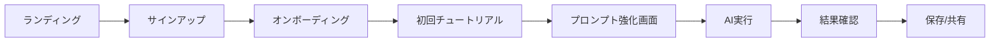
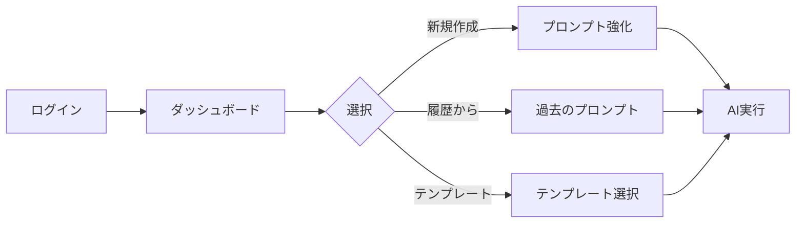

# 思考OS X,Y,Z プロンプト強化アプリ UI/UX設計書

## 1. デザインコンセプト

### 1.1 ビジュアルコンセプト

**「シンプルさの中に潜む、3次元の深み」**

- **メインカラー**: 
  - プライマリ: #2563EB (青) - 信頼性と知性
  - セカンダリ: #7C3AED (紫) - 創造性とAI
  - アクセント: #10B981 (緑) - 成長と成功

- **デザイン原則**:
  1. **直感的**: 説明不要で使える
  2. **段階的開示**: 必要な時に必要な情報を
  3. **視覚的フィードバック**: 3D効果で変化を体感
  4. **プロフェッショナル**: 中間管理職にふさわしい品格

### 1.2 ターゲットユーザーペルソナ

**田中部長（45歳）**
- IT企業の営業部長
- AIに興味はあるが、使いこなせていない
- 部下20名のマネジメントに忙しい
- 効率化ツールには積極的

## 2. 画面構成

### 2.1 サイトマップ

```
ホーム
├── ログイン/サインアップ
├── ダッシュボード
│   ├── 新規プロンプト作成
│   ├── 履歴
│   ├── お気に入り
│   └── 統計
├── プロンプト強化画面
│   ├── 入力
│   ├── 3D可視化
│   ├── 結果表示
│   └── AI実行
├── 設定
│   ├── プロフィール
│   ├── APIキー設定
│   └── 通知設定
└── ヘルプ
    ├── チュートリアル
    ├── FAQ
    └── お問い合わせ
```

### 2.2 主要画面のワイヤーフレーム

#### 2.2.1 ホーム画面

```
┌─────────────────────────────────────────────────┐
│  [Logo] 思考OS X,Y,Z プロンプト強化アプリ  [ログイン] │
├─────────────────────────────────────────────────┤
│                                                 │
│      AIと話すのが苦手でも大丈夫。              │
│      あなたの一言を、プロ級のプロンプトに。     │
│                                                 │
│  ┌─────────────────────────────────────┐      │
│  │ 例：売上を上げたい...               │      │
│  └─────────────────────────────────────┘      │
│           [今すぐ試す]                          │
│                                                 │
│  ─────── 3つのステップ ───────                 │
│                                                 │
│  1️⃣ 思いついた     2️⃣ AIが自動で      3️⃣ プロ級の    │
│    ことを入力      3D強化          プロンプト完成│
│                                                 │
└─────────────────────────────────────────────────┘
```

#### 2.2.2 プロンプト強化画面（メイン画面）

```
┌─────────────────────────────────────────────────┐
│ [←戻る] プロンプト強化         [履歴] [設定] [?] │
├─────────────────────────────────────────────────┤
│                                                 │
│ ■ STEP 1: あなたの考えを入力                   │
│ ┌─────────────────────────────────────────┐   │
│ │                                           │   │
│ │  売上を向上させる方法を知りたい            │   │
│ │                                           │   │
│ └─────────────────────────────────────────┘   │
│                                                 │
│ 業界: [製造業 ▼]  職種: [営業 ▼]  詳細設定 ▶    │
│                                                 │
│          [3D強化する] →                        │
│                                                 │
│ ■ STEP 2: TANREN 3Dメソッドで強化             │
│                                                 │
│     ┌──────────┐                              │
│     │   Y軸     │    [3Dビジュアライザー]      │
│     │    ↑      │    - X軸: 深度 ████ 80%     │
│     │    │      │    - Y軸: 時間 ███  60%     │
│     │ ───┼───   │    - Z軸: レベル ████ 75%  │
│     │    │      │                              │
│ X軸 ←────┼────→  │    [パラメータ調整]         │
│     │    │      │                              │
│     │    ↓      │                              │
│     │   Z軸     │                              │
│     └──────────┘                              │
│                                                 │
│ ■ STEP 3: 強化されたプロンプト                 │
│ ┌─────────────────────────────────────────┐   │
│ │ 【役割】                                   │   │
│ │ あなたは製造業に精通した経営コンサルタント  │   │
│ │ です。                                     │   │
│ │                                           │   │
│ │ 【背景・目的】                             │   │
│ │ 製造業の営業部門において、市場環境の変化に  │   │
│ │ 対応しながら売上を向上させる戦略を立案...  │   │
│ │                                           │   │
│ │ 【具体的な指示】                           │   │
│ │ 1. 過去3年間の業界動向を分析              │   │
│ │ 2. 現在の課題を3つ特定                    │   │
│ │ 3. 今後1年間の具体的アクションプラン提示   │   │
│ │                                           │   │
│ │ 【出力形式】                               │   │
│ │ - 要約（3行）                             │   │
│ │ - 詳細分析（過去・現在・未来の観点）       │   │
│ │ - アクションプラン（優先順位付き）         │   │
│ └─────────────────────────────────────────┘   │
│                                                 │
│  [コピー] [編集] [保存] [AIで実行 →]           │
│                                                 │
└─────────────────────────────────────────────────┘
```

#### 2.2.3 AI実行結果画面

```
┌─────────────────────────────────────────────────┐
│ AI実行結果                              [×閉じる] │
├─────────────────────────────────────────────────┤
│                                                 │
│ 実行AI: [ChatGPT ▼] [Claude] [Gemini]          │
│                                                 │
│ ■ AIの回答                                     │
│ ┌─────────────────────────────────────────┐   │
│ │ 【要約】                                   │   │
│ │ • デジタル化による新規顧客開拓             │   │
│ │ • 既存顧客の単価向上施策                   │   │
│ │ • 営業プロセスの効率化                     │   │
│ │                                           │   │
│ │ 【詳細分析】                               │   │
│ │ 1. 過去の動向（2021-2024）                │   │
│ │    製造業界は...                          │   │
│ │                                           │   │
│ │ 2. 現在の課題                             │   │
│ │    ① 新規開拓の停滞                      │   │
│ │    ② 価格競争の激化                      │   │
│ │    ③ 営業効率の低下                      │   │
│ │                                           │   │
│ │ 3. 今後のアクションプラン                  │   │
│ │    優先度A: デジタルマーケティング強化     │   │
│ │    優先度B: CRM導入による顧客管理         │   │
│ │    優先度C: 営業研修プログラム実施         │   │
│ └─────────────────────────────────────────┘   │
│                                                 │
│ ■ 品質評価                                     │
│ 総合評価: ★★★★☆ (4.2/5.0)                    │
│ • 具体性: ★★★★★                              │
│ • 実用性: ★★★★☆                              │
│ • 構造化: ★★★★☆                              │
│                                                 │
│ 💡 改善のヒント:                                │
│ 「数値目標を追加すると、より実践的になります」   │
│                                                 │
│ [プロンプトを調整] [別のAIで試す] [保存]        │
│                                                 │
└─────────────────────────────────────────────────┘
```

## 3. インタラクションデザイン

### 3.1 マイクロインタラクション

#### 入力時のフィードバック
- 文字数カウンター（リアルタイム更新）
- 入力中のサジェスト表示
- エンターキーで即座に強化開始

#### 3D強化のアニメーション
```javascript
// 強化ボタンクリック時
1. 入力テキストが中央に集約（0.3秒）
2. 3軸が順番に展開（各0.5秒）
   - X軸: 左右に展開
   - Y軸: 上下に展開  
   - Z軸: 奥行きに展開
3. プロンプトが段階的に生成（1秒）
4. 完了時に軽い振動エフェクト
```

#### パラメータ調整
- スライダー操作で3Dモデルがリアルタイム変形
- 数値表示とビジュアルの同期
- プリセットボタンでワンクリック設定

### 3.2 レスポンシブデザイン

#### デスクトップ (1200px〜)
- 3カラムレイアウト
- サイドバーに履歴表示
- 大きな3Dビジュアライザー

#### タブレット (768px〜1199px)
- 2カラムレイアウト
- 3Dビジュアライザーは折りたたみ可能
- タッチ操作最適化

#### モバイル (〜767px)
- シングルカラム
- ステップごとにスクロール
- 簡略化された3D表示

## 4. アクセシビリティ

### 4.1 WCAG 2.1 AA準拠

- **色のコントラスト**: 最小4.5:1
- **フォーカス表示**: 明確なアウトライン
- **キーボード操作**: 全機能をキーボードで操作可能
- **スクリーンリーダー**: 適切なARIAラベル

### 4.2 多様なユーザーへの配慮

- **文字サイズ**: 3段階で調整可能
- **ダークモード**: 目の疲れを軽減
- **簡易モード**: 3D表示をオフにできる
- **多言語対応**: 将来的に英語版も

## 5. UI コンポーネント仕様

### 5.1 ボタン

```css
/* プライマリボタン */
.btn-primary {
  background: linear-gradient(135deg, #2563EB 0%, #7C3AED 100%);
  color: white;
  padding: 12px 24px;
  border-radius: 8px;
  font-weight: 600;
  transition: all 0.3s ease;
}

.btn-primary:hover {
  transform: translateY(-2px);
  box-shadow: 0 4px 12px rgba(37, 99, 235, 0.3);
}
```

### 5.2 入力フィールド

```css
/* テキストエリア */
.prompt-input {
  border: 2px solid #E5E7EB;
  border-radius: 12px;
  padding: 16px;
  font-size: 16px;
  line-height: 1.5;
  transition: border-color 0.3s ease;
}

.prompt-input:focus {
  border-color: #2563EB;
  outline: none;
  box-shadow: 0 0 0 3px rgba(37, 99, 235, 0.1);
}
```

### 5.3 3Dビジュアライザー

```typescript
// Three.jsによる実装
interface Axes3D {
  x: { min: 0, max: 100, current: number };
  y: { min: 0, max: 100, current: number };
  z: { min: 0, max: 100, current: number };
}

// アニメーション設定
const animationConfig = {
  duration: 1000,
  easing: 'easeInOutCubic',
  particleCount: 100,
  glowIntensity: 0.8
};
```

## 6. 画面遷移フロー

### 6.1 初回利用フロー



### 6.2 リピート利用フロー



## 7. エラー・空状態のデザイン

### 7.1 エラー状態

- **ネットワークエラー**: 再試行ボタン付きトースト
- **入力エラー**: インラインバリデーション
- **API制限**: 分かりやすい説明と代替案

### 7.2 空状態

- **履歴なし**: 使い方ガイドとサンプル表示
- **検索結果なし**: 類似の提案を表示
- **お気に入りなし**: お気に入りの使い方説明

## 8. パフォーマンス指標

### 8.1 Core Web Vitals目標

- **LCP (Largest Contentful Paint)**: < 2.5秒
- **FID (First Input Delay)**: < 100ms  
- **CLS (Cumulative Layout Shift)**: < 0.1

### 8.2 体感速度の向上

- スケルトンスクリーン
- 楽観的UI更新
- プログレッシブエンハンスメント

## 9. ユーザビリティテスト計画

### 9.1 テスト項目

1. **タスク完了率**: 5分以内にプロンプト生成
2. **エラー率**: 操作ミスの頻度
3. **満足度**: SUS（System Usability Scale）スコア
4. **学習曲線**: 2回目以降の操作時間短縮

### 9.2 A/Bテスト候補

- 3D表示 vs シンプル表示
- ステップ型 vs 一画面型
- 自動実行 vs 手動実行

## 10. デザインシステム

### 10.1 コンポーネントライブラリ

shadcn/uiをベースに、独自コンポーネントを追加：

- `<Prompt3DVisualizer />`
- `<PromptEnhancer />`
- `<AIExecutor />`
- `<QualityRating />`

### 10.2 デザイントークン

```typescript
export const tokens = {
  colors: {
    primary: '#2563EB',
    secondary: '#7C3AED',
    success: '#10B981',
    warning: '#F59E0B',
    error: '#EF4444',
  },
  spacing: {
    xs: '4px',
    sm: '8px',
    md: '16px',
    lg: '24px',
    xl: '32px',
  },
  animation: {
    fast: '150ms',
    normal: '300ms',
    slow: '500ms',
  }
};
```