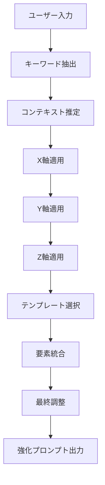

# 思考OS X,Y,Z プロンプト強化アプリ プロンプト設計書

## 1. TANREN 3Dメソッドの実装仕様

### 1.1 X軸：思考の深度と構造

#### 1.1.1 超抽象化（Abstraction）

**目的**: ユーザーの入力から本質的な目的・価値を抽出

```typescript
// 抽象化パターン
const abstractionPatterns = {
  // ビジネス課題
  "売上": "事業成長と収益性の向上",
  "コスト": "経営効率の最適化",
  "人材": "組織力の強化と人的資本の最大化",
  "顧客": "顧客価値の創造と関係性強化",
  
  // マネジメント課題
  "モチベーション": "従業員エンゲージメントの向上",
  "生産性": "業務効率と成果の最大化",
  "コミュニケーション": "組織内情報流通の最適化",
  "評価": "公正で効果的な人事管理システム",
};

// 抽象化プロンプトテンプレート
const abstractionPrompt = `
入力: {userInput}

この入力の背後にある本質的な目的や価値を見出してください。
「なぜ」を3回繰り返して深掘りし、以下の観点で分析してください：

1. 表面的な要求
2. 潜在的なニーズ
3. 根本的な目的
4. 期待される価値

出力形式:
- 本質: [一文で表現]
- 理由: [なぜそれが本質なのか]
- 価値: [実現した場合の価値]
`;
```

#### 1.1.2 超具体化（Concretization）

**目的**: 抽象的な概念を実行可能なアクションに変換

```typescript
// 具体化の要素
interface ConcretizationElements {
  who: string;      // 誰が
  what: string;     // 何を
  when: string;     // いつ
  where: string;    // どこで
  why: string;      // なぜ
  how: string;      // どのように
  howMuch: string;  // どれくらい
}

// 具体化プロンプトテンプレート
const concretizationPrompt = `
抽象的な目標: {abstractGoal}
業界: {industry}
職種: {jobTitle}

この目標を達成するための具体的なアクションプランを作成してください：

1. 測定可能な目標（SMART原則）
   - Specific: 具体的に何を
   - Measurable: 数値目標
   - Achievable: 実現可能な範囲
   - Relevant: 関連性
   - Time-bound: 期限

2. 実行ステップ（5W1H）
   - 誰が担当するか
   - 何をするか（具体的タスク）
   - いつまでに
   - どこで/どの範囲で
   - なぜ必要か
   - どのように実行するか

3. 必要なリソース
   - 人員
   - 予算
   - ツール/システム
   - 時間
`;
```

#### 1.1.3 超構造化（Structurization）

**目的**: 情報を論理的で理解しやすい構造に整理

```typescript
// 構造化パターン
enum StructurePattern {
  PYRAMID = "ピラミッド構造",      // 結論→根拠→詳細
  PREP = "PREP法",                // Point→Reason→Example→Point
  PROBLEM_SOLUTION = "問題解決型", // 現状→問題→原因→解決策→効果
  TIMELINE = "時系列型",          // 過去→現在→未来
  COMPARISON = "比較対照型",      // A案 vs B案 vs C案
  MECE = "MECE型",               // 漏れなくダブりなく分類
}

// 構造化テンプレート生成
function generateStructureTemplate(pattern: StructurePattern): string {
  switch(pattern) {
    case StructurePattern.PYRAMID:
      return `
# 結論
[最も重要なメッセージ]

## 主要な根拠（3つ）
1. [根拠1]
   - 詳細説明
   - 具体例
2. [根拠2]
   - 詳細説明
   - 具体例
3. [根拠3]
   - 詳細説明
   - 具体例

## まとめ
[結論の再確認と次のアクション]
`;

    case StructurePattern.PREP:
      return `
## Point（結論）
[一番伝えたいこと]

## Reason（理由）
なぜなら...
1. [理由1]
2. [理由2]
3. [理由3]

## Example（具体例）
例えば...
- [事例1]
- [事例2]

## Point（結論の再確認）
したがって、[結論の再強調]
`;

    // 他のパターンも同様に定義
  }
}
```

### 1.2 Y軸：時間軸の視座

#### 1.2.1 過去分析（Past Analysis）

```typescript
// 過去分析プロンプト
const pastAnalysisPrompt = `
課題: {issue}
業界: {industry}
期間: 過去3-5年

以下の観点で過去を分析してください：

1. 歴史的経緯
   - この課題はいつから存在するか
   - どのような変遷を辿ってきたか
   - 過去の取り組みと結果

2. 成功事例と失敗事例
   - 業界内のベストプラクティス
   - 典型的な失敗パターン
   - 学ぶべき教訓

3. トレンドと変化
   - 市場環境の変化
   - 技術革新の影響
   - 規制や社会情勢の変化

4. 根本原因分析
   - なぜこの課題が生じたのか
   - 構造的な要因は何か
   - 解決を妨げてきた要因
`;
```

#### 1.2.2 現在分析（Present Analysis）

```typescript
// 現状分析フレームワーク
interface PresentAnalysis {
  situation: {
    internal: string[];  // 内部環境
    external: string[];  // 外部環境
  };
  resources: {
    available: string[]; // 利用可能なリソース
    lacking: string[];   // 不足しているリソース
  };
  constraints: {
    technical: string[]; // 技術的制約
    financial: string[]; // 財務的制約
    human: string[];     // 人的制約
    time: string[];      // 時間的制約
  };
  opportunities: string[]; // 現在の機会
  threats: string[];       // 現在の脅威
}

// 現状分析プロンプト
const presentAnalysisPrompt = `
現在の状況を多角的に分析してください：

1. SWOT分析
   - Strengths（強み）
   - Weaknesses（弱み）
   - Opportunities（機会）
   - Threats（脅威）

2. リソース評価
   - 人材: スキル、人数、モチベーション
   - 資金: 予算、投資可能額
   - 技術: システム、ツール、インフラ
   - 時間: 期限、スケジュール

3. ステークホルダー分析
   - 誰が関与しているか
   - それぞれの期待と懸念
   - 影響力と関心度のマッピング

4. 現在の制約条件
   - 変更不可能な要素
   - 交渉可能な要素
   - 回避可能な要素
`;
```

#### 1.2.3 未来予測（Future Projection）

```typescript
// 未来シナリオ生成
interface FutureScenario {
  bestCase: {
    description: string;
    probability: number;
    impact: string[];
  };
  worstCase: {
    description: string;
    probability: number;
    risks: string[];
  };
  mostLikely: {
    description: string;
    probability: number;
    assumptions: string[];
  };
}

// 未来予測プロンプト
const futureProjectionPrompt = `
提案された解決策の未来への影響を予測してください：

1. 短期的影響（3-6ヶ月）
   - 即座に現れる効果
   - 初期の課題と対応
   - クイックウィン

2. 中期的影響（6ヶ月-2年）
   - 組織への浸透度
   - 持続可能性の評価
   - 調整が必要な要素

3. 長期的影響（2年以上）
   - 戦略的インパクト
   - 競争優位性への貢献
   - 新たな可能性の創出

4. シナリオプランニング
   - 楽観シナリオ: すべてが順調に進んだ場合
   - 悲観シナリオ: 主要なリスクが顕在化した場合
   - 現実的シナリオ: 最も可能性の高い展開

5. 成功指標（KPI）
   - 定量的指標
   - 定性的指標
   - マイルストーン
`;
```

### 1.3 Z軸：習熟度レベルの調整

#### 1.3.1 レベル判定ロジック

```typescript
// ユーザーレベル判定
interface UserLevel {
  aiExperience: 'beginner' | 'intermediate' | 'advanced';
  domainKnowledge: 'low' | 'medium' | 'high';
  technicalSkills: 'basic' | 'moderate' | 'expert';
}

function determineOptimalLevel(user: UserLevel): number {
  const scores = {
    aiExperience: { beginner: 1, intermediate: 2, advanced: 3 },
    domainKnowledge: { low: 1, medium: 2, high: 3 },
    technicalSkills: { basic: 1, moderate: 2, expert: 3 }
  };
  
  const totalScore = 
    scores.aiExperience[user.aiExperience] +
    scores.domainKnowledge[user.domainKnowledge] +
    scores.technicalSkills[user.technicalSkills];
  
  if (totalScore <= 4) return 1;      // 初級
  if (totalScore <= 7) return 2;      // 中級
  return 3;                            // 上級
}
```

#### 1.3.2 レベル別プロンプト調整

```typescript
// レベル別調整パラメータ
const levelAdjustments = {
  beginner: {
    vocabulary: "simple",          // 簡単な言葉
    explanation: "detailed",       // 詳しい説明
    examples: "many",             // 多くの例
    jargon: "avoided",            // 専門用語回避
    structure: "step_by_step",    // ステップバイステップ
    assumptions: "none"           // 前提知識なし
  },
  intermediate: {
    vocabulary: "professional",    // 業界標準の言葉
    explanation: "balanced",      // バランスの取れた説明
    examples: "relevant",         // 関連性の高い例
    jargon: "explained",          // 専門用語は説明付き
    structure: "organized",       // 整理された構造
    assumptions: "basic"          // 基本的な知識前提
  },
  advanced: {
    vocabulary: "sophisticated",   // 高度な語彙
    explanation: "concise",       // 簡潔な説明
    examples: "strategic",        // 戦略的な例
    jargon: "freely_used",        // 専門用語自由使用
    structure: "flexible",        // 柔軟な構造
    assumptions: "expert"         // 専門知識前提
  }
};
```

## 2. プロンプト強化アルゴリズム

### 2.1 強化プロセスフロー



### 2.2 統合プロンプト生成

```typescript
// マスタープロンプト生成関数
async function generateEnhancedPrompt(
  userInput: string,
  context: UserContext,
  parameters: EnhancementParameters
): Promise<EnhancedPrompt> {
  
  // Step 1: 基本分析
  const keywords = extractKeywords(userInput);
  const intent = analyzeIntent(keywords);
  const domain = identifyDomain(context.industry, context.jobTitle);
  
  // Step 2: X軸処理
  const abstraction = await applyAbstraction(userInput, intent);
  const concretization = await applyConcretization(abstraction, domain);
  const structure = selectOptimalStructure(intent, domain);
  
  // Step 3: Y軸処理
  const timeContext = {
    past: await analyzePast(intent, domain),
    present: await analyzePresent(context),
    future: await projectFuture(intent, parameters)
  };
  
  // Step 4: Z軸処理
  const userLevel = determineOptimalLevel(context.userProfile);
  const levelAdjusted = adjustForLevel(
    { abstraction, concretization, structure, timeContext },
    userLevel
  );
  
  // Step 5: テンプレート統合
  const template = selectTemplate(intent, structure);
  const enhanced = populateTemplate(template, levelAdjusted);
  
  // Step 6: 最終調整
  return finalizePrompt(enhanced, parameters);
}
```

## 3. プロンプトテンプレートライブラリ

### 3.1 汎用テンプレート

```typescript
// 汎用ビジネス課題解決テンプレート
const businessProblemSolvingTemplate = `
# 役割設定
あなたは{industry}業界で{experience}年の経験を持つ{role}です。
{specialization}に特に精通しており、{achievement}の実績があります。

# 背景・状況
{company_context}
{market_situation}
{specific_challenges}

# 解決すべき課題
主要課題: {main_issue}
副次的課題:
1. {sub_issue_1}
2. {sub_issue_2}
3. {sub_issue_3}

# 期待する成果
- 短期目標（{short_term_period}）: {short_term_goals}
- 中期目標（{mid_term_period}）: {mid_term_goals}
- 長期目標（{long_term_period}）: {long_term_goals}

# 分析の観点
1. 過去の経緯と教訓
   - {past_context}
   - 成功要因: {success_factors}
   - 失敗要因: {failure_factors}

2. 現在の状況評価
   - 強み: {strengths}
   - 弱み: {weaknesses}
   - 機会: {opportunities}
   - 脅威: {threats}

3. 将来への展望
   - トレンド: {trends}
   - 予測されるリスク: {risks}
   - 潜在的な機会: {potential_opportunities}

# 具体的な指示
以下の形式で、実践的な解決策を提示してください：

1. エグゼクティブサマリー（3-5行）
2. 詳細な状況分析
3. 推奨される解決策（優先順位付き）
4. 実行計画（タイムライン付き）
5. 期待される成果とKPI
6. リスクと対策
7. 必要なリソースと予算概算

# 出力形式
{output_format}

# 制約条件
- {constraint_1}
- {constraint_2}
- {constraint_3}

# トーンと文体
{tone_and_style}
`;
```

### 3.2 職種別特化テンプレート

#### 3.2.1 営業管理職向け

```typescript
const salesManagementTemplate = `
# 営業戦略アドバイザーとして
あなたは年商{revenue}規模の{industry}企業で、
{team_size}名の営業チームを率いる営業部長です。

# 現在の営業課題
- 新規開拓率: {new_customer_rate}
- 既存顧客維持率: {retention_rate}
- 平均単価: {average_price}
- 営業効率: {sales_efficiency}

# 分析してほしいこと
1. 営業プロセスの最適化
   - リード獲得から成約までのファネル分析
   - ボトルネックの特定と改善策

2. チーム生産性の向上
   - 個人別パフォーマンス分析
   - スキルギャップの特定と育成計画

3. 売上拡大戦略
   - 市場セグメント別アプローチ
   - クロスセル・アップセル機会

# 期待する提案
- 具体的なKPIと目標値
- 四半期ごとのアクションプラン
- 必要な投資とROI予測
`;
```

#### 3.2.2 人事管理職向け

```typescript
const hrManagementTemplate = `
# 人事戦略パートナーとして
{company_size}名規模の組織で、{department}を統括する
人事マネージャーとしてアドバイスしてください。

# 人事課題の背景
- 離職率: {turnover_rate}
- 従業員満足度: {satisfaction_score}
- 採用充足率: {recruitment_rate}
- 育成投資効果: {training_roi}

# 重点分析エリア
1. タレントマネジメント
   - ハイパフォーマー特定と育成
   - サクセッションプランニング
   - キャリアパス設計

2. 組織開発
   - エンゲージメント向上施策
   - チームビルディング
   - 組織文化の醸成

3. 人事制度設計
   - 評価制度の最適化
   - 報酬体系の見直し
   - 働き方改革の推進

# アウトプット要件
- 現状分析レポート
- 改善ロードマップ（1年間）
- 施策別の期待効果
- 実施に必要なリソース
`;
```

## 4. プロンプト品質評価基準

### 4.1 評価指標

```typescript
interface PromptQualityMetrics {
  clarity: number;          // 明確性 (0-100)
  completeness: number;     // 完全性 (0-100)
  specificity: number;      // 具体性 (0-100)
  structure: number;        // 構造化 (0-100)
  actionability: number;    // 実行可能性 (0-100)
  creativity: number;       // 創造性 (0-100)
}

// 品質スコア計算
function calculateQualityScore(prompt: string): PromptQualityMetrics {
  return {
    clarity: assessClarity(prompt),
    completeness: assessCompleteness(prompt),
    specificity: assessSpecificity(prompt),
    structure: assessStructure(prompt),
    actionability: assessActionability(prompt),
    creativity: assessCreativity(prompt)
  };
}
```

### 4.2 改善提案生成

```typescript
// 品質改善提案
function generateImprovementSuggestions(
  metrics: PromptQualityMetrics
): string[] {
  const suggestions = [];
  
  if (metrics.clarity < 70) {
    suggestions.push("より明確な指示を追加してください。曖昧な表現を具体化しましょう。");
  }
  
  if (metrics.specificity < 70) {
    suggestions.push("数値目標や期限など、具体的な要素を追加してください。");
  }
  
  if (metrics.structure < 70) {
    suggestions.push("情報を論理的に整理し、番号付きリストや見出しを活用してください。");
  }
  
  return suggestions;
}
```

## 5. A/Bテストと継続的改善

### 5.1 実験フレームワーク

```typescript
interface ABTestConfig {
  testId: string;
  variants: {
    control: PromptTemplate;
    treatment: PromptTemplate;
  };
  metrics: string[];
  sampleSize: number;
  duration: number; // days
}

// A/Bテスト実行
async function runABTest(config: ABTestConfig): Promise<TestResults> {
  // ユーザーを均等に振り分け
  // メトリクスを収集
  // 統計的有意性を検証
  // 勝者を決定
}
```

### 5.2 学習と最適化

```typescript
// プロンプトパフォーマンス追跡
interface PromptPerformance {
  promptId: string;
  userSatisfaction: number;
  aiQualityScore: number;
  completionRate: number;
  revisionsNeeded: number;
  timeToComplete: number;
}

// 機械学習による最適化
async function optimizePromptGeneration(
  historicalData: PromptPerformance[]
): Promise<OptimizationInsights> {
  // パターン認識
  // 成功要因の特定
  // 予測モデルの構築
  // 推奨事項の生成
}
```

## 6. セキュリティとプライバシー

### 6.1 機密情報の処理

```typescript
// 機密情報検出とマスキング
function sanitizePrompt(prompt: string): string {
  const patterns = {
    email: /[\w.-]+@[\w.-]+\.\w+/g,
    phone: /[\d-().\s]+\d/g,
    ssn: /\d{3}-\d{2}-\d{4}/g,
    creditCard: /\d{4}[\s-]?\d{4}[\s-]?\d{4}[\s-]?\d{4}/g,
    companySecrets: /(?:confidential|secret|proprietary)/gi
  };
  
  let sanitized = prompt;
  for (const [type, pattern] of Object.entries(patterns)) {
    sanitized = sanitized.replace(pattern, `[${type.toUpperCase()}_MASKED]`);
  }
  
  return sanitized;
}
```

### 6.2 データ保護ポリシー

- プロンプト履歴の暗号化保存
- 30日後の自動削除オプション
- ユーザー同意に基づく学習利用
- GDPR/個人情報保護法準拠