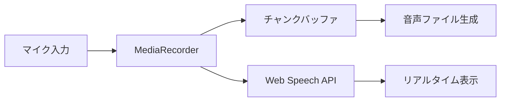
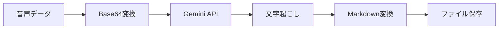

# MD Buddy v0.018 技術仕様書

## 1. アーキテクチャ概要

### 1.1 技術スタック
- **フロントエンド**: React 18.3 + TypeScript 5.6
- **ビルドツール**: Vite 7.0
- **スタイリング**: Tailwind CSS 3.4 + shadcn/ui
- **状態管理**: Zustand 5.0
- **音声処理**: Web Audio API + MediaRecorder API
- **AI統合**: Google Gemini API (Flash/Pro)

### 1.2 プロジェクト構造
```
md-buddy-web/
├── src/
│   ├── components/     # UIコンポーネント
│   ├── hooks/         # カスタムフック
│   ├── services/      # APIサービス
│   ├── store/         # 状態管理
│   ├── types/         # 型定義
│   └── utils/         # ユーティリティ
├── public/            # 静的ファイル
└── docs/             # ドキュメント
```

## 2. コア機能の実装

### 2.1 音声録音システム

#### 2.1.1 MediaRecorder API
```typescript
interface RecordingOptions {
  mimeType: 'audio/webm;codecs=opus';
  audioBitsPerSecond: 128000;
}
```

#### 2.1.2 チャンク録音
- 5分（300秒）ごとに音声データを分割
- 各チャンクを独立して処理
- メモリ効率の最適化

#### 2.1.3 音声レベル監視
```typescript
interface AudioAnalyser {
  fftSize: 256;
  smoothingTimeConstant: 0.8;
}
```

### 2.2 リアルタイム文字起こし

#### 2.2.1 Web Speech API
```typescript
interface SpeechRecognitionConfig {
  continuous: true;
  interimResults: true;
  lang: 'ja-JP';
  maxAlternatives: 1;
}
```

#### 2.2.2 タイムスタンプ管理
```typescript
interface TranscriptSegment {
  id: string;
  text: string;
  startTime: number;
  endTime: number;
  confidence: number;
  isFinal: boolean;
}
```

### 2.3 Gemini API統合

#### 2.3.1 音声認識
```typescript
interface TranscriptionRequest {
  audio: string; // Base64
  mimeType: string;
  language: string;
  model: 'gemini-2.5-flash' | 'gemini-2.5-pro';
}
```

#### 2.3.2 Markdown変換
```typescript
interface ConversionRequest {
  text: string;
  type: ConversionType;
  customPrompt?: string;
}
```

### 2.4 SRT字幕生成

#### 2.4.1 フォーマット仕様
```
1
00:00:00,000 --> 00:00:02,500
最初の字幕テキスト

2
00:00:02,500 --> 00:00:05,000
次の字幕テキスト
```

#### 2.4.2 制約条件
- 1行最大30文字
- 1字幕最大2行
- 表示時間2-4秒

## 3. データフロー

### 3.1 録音フロー


### 3.2 AI処理フロー


## 4. ファイルシステム

### 4.1 保存構造
```
音声メモ_2025-07-11_15-30-00/
├── content.md      # Markdownファイル
├── audio.webm      # 音声ファイル
└── subtitles.srt   # 字幕ファイル
```

### 4.2 メタデータ
```typescript
interface FileMetadata {
  id: string;
  name: string;
  createdAt: Date;
  updatedAt: Date;
  size: number;
  duration?: number;
  wordCount?: number;
}
```

## 5. パフォーマンス最適化

### 5.1 遅延読み込み
- React.lazy()によるコンポーネント分割
- 動的インポートでバンドルサイズ削減

### 5.2 メモリ管理
- 大きな音声データはチャンク処理
- 不要なデータの即時解放
- WeakMapによる参照管理

### 5.3 レンダリング最適化
- React.memoによる再レンダリング防止
- useMemoとuseCallbackの適切な使用
- 仮想スクロールの実装

## 6. エラーハンドリング

### 6.1 音声録音エラー
- マイクアクセス拒否
- デバイス未接続
- ブラウザ非対応

### 6.2 API エラー
- ネットワークエラー
- レート制限
- 認証エラー

### 6.3 ユーザーフィードバック
- トースト通知
- デバッグウィンドウ
- 詳細なエラーログ

## 7. セキュリティ

### 7.1 APIキー管理
- 環境変数での管理
- クライアントサイドでの非露出
- プロキシサーバー経由（推奨）

### 7.2 データ保護
- HTTPS通信の強制
- LocalStorageの暗号化
- XSS対策の実装

## 8. テスト戦略

### 8.1 単体テスト
- Vitest使用
- カバレッジ目標: 80%
- モックの活用

### 8.2 統合テスト
- API連携テスト
- 音声処理テスト
- E2Eシナリオ

## 9. デプロイメント

### 9.1 ビルド設定
```bash
pnpm build
# 出力: dist/
```

### 9.2 Docker対応
```dockerfile
FROM node:18-alpine
WORKDIR /app
COPY . .
RUN pnpm install --frozen-lockfile
RUN pnpm build
EXPOSE 8081
CMD ["pnpm", "preview"]
```

### 9.3 環境変数
```env
VITE_GEMINI_API_KEY=your-api-key
VITE_APP_URL=http://localhost:8081
```

## 10. 監視とログ

### 10.1 アプリケーションログ
- デバッグウィンドウ表示
- コンソール出力
- エラー追跡

### 10.2 パフォーマンス監視
- Core Web Vitals
- API応答時間
- メモリ使用量

---

作成日: 2025-01-11
バージョン: 0.018-stable
最終更新: 2025-01-11