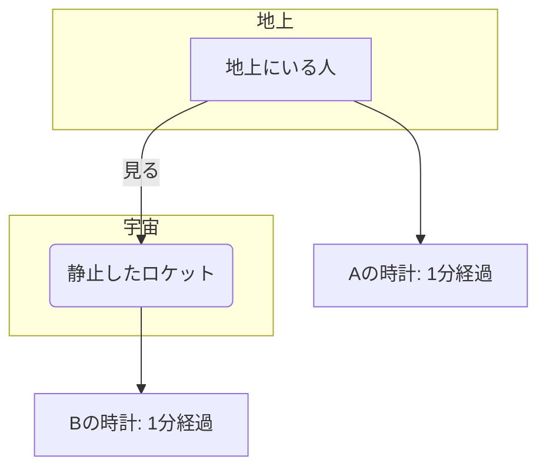
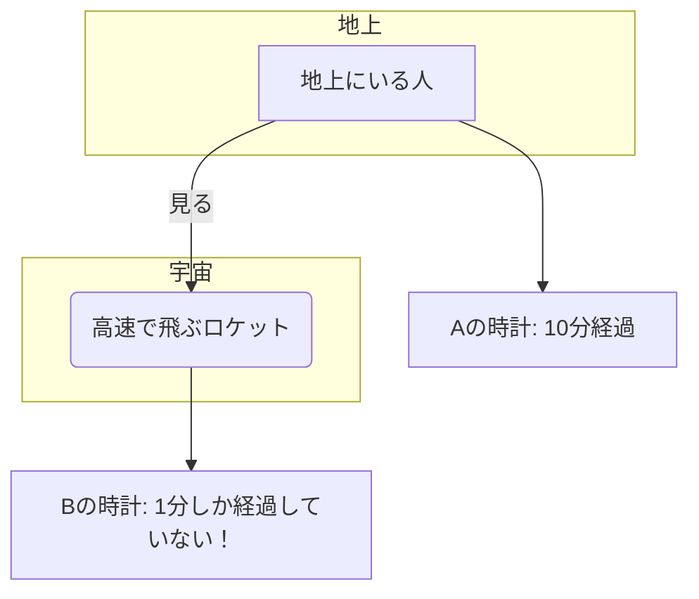

# 第2章：インプットを革命し、知識を吸収する15の武器

---

## Tip 11：15万字の専門書を「聴く」だけで、著者の脳をインストールする

### **【こんな方におすすめ】**
- 購入した専門書が読まれずに「積読（つんどく）」状態になっている方
- 移動時間や単純作業中などの「スキマ時間」を、最高の学習時間に変えたい方
- 活字を読むのは苦手だが、新しい知識はインプットしたいと強く願う方

### **よくある失敗（Before）**
「この『最新AIマーケティング大全』、3ページで挫折してしまった…」

意欲的に購入した専門書が、本棚の肥やしになっていませんか？これは、私自身も何度も経験したことです。話題の専門書を買ってはみたものの、難解な専門用語のオンパレードに、いつも数ページで眠気に襲われてしまう。「ニューラルネットワークの逆伝播アルゴリズムが…」日本語のはずなのに、もはや外国語のように感じられます。

本棚に眠る専門書への投資額は、気づけば10万円を超えている…。そんな自己投資の「含み損」を抱え、新しい知識の習得を諦めかけている方は、決して少なくないはずです。

### **AIが可能にする成功（After）**
そんな「積読」の山を、知の資産に変える魔法が、AIによる「聴く読書」です。
私はAIにこうお願いします。「この専門書のPDFを読み込んで、私が理解できるように、超絶分かりやすく要約してほしい。そして、その内容を、落ち着いた男性の声で読み上げるオーディオブックにしてくれないか」

AIは、私の優秀な編集者兼ナレーターになります。難解な専門書は、重要なエッセンスだけが抽出された「あなた専用のオーディオブック」に生まれ変わるのです。

通勤中の電車でイヤホンを耳にするだけで、著者の思考が頭の中に流れ込んでくる。AIが「ここ、重要ですよ」とばかりに、特に大切な箇所を強調してくれるので、要点を逃すこともありません。1冊15万字の専門書が、わずか3時間でインプット完了。あなたも今日から、積読タワーを崩し始めることができるのです。

### **万能プロンプト**
```
あなたは、NHKのドキュメンタリー番組を手掛ける、ベテランの編集者兼ナレーターです。
以下の専門書（または、そのテキストデータ）の内容を分析し、知的好奇心を刺激する「オーディオブック」の原稿を作成してください。

# 対象の書籍
（ここに書籍のタイトル、著者、またはPDFやテキストデータを貼り付ける）

# 原稿作成のルール
1.  **導入で惹きつける:** まず、この本がなぜ読む価値があるのか、最も魅力的なポイントを提示して、聴き手の心を掴んでください。
2.  **専門用語の翻訳:** 難解な専門用語は、中学生でも分かるような身近な言葉や、巧みな比喩に置き換えてください。
3.  **ストーリーテリング:** 各章の内容を、ただ要約するのではなく、一つの繋がった物語のように、論理的かつ感情的に構成してください。
4.  **聴き手への配慮:** 「ここまでの話をまとめると」「次の章では、いよいよ核心に迫ります」のように、聴き手が迷子にならないための道しるべを置いてください。
5.  **ナレーター指示:** （少し、力強く）や（ワクワクするような声で）のように、音声読み上げAIが感情を込められるように、ト書きを入れてください。

それでは、最高のオーディオブック原稿の作成を、お願いします。
```

### **この武器で得られる力**
- **インプット効率500%向上:** 移動時間や家事をしながらなど、「ながら学習」でインプットが完了します。
- **挫折からの解放:** 「読む」から「聴く」に変えるだけで、学習の心理的ハードルが劇的に下がります。
- **知識の血肉化:** 物事の本質をストーリーで理解するため、単なる暗記ではなく、実務で使える「知恵」として定着します。

---

## Tip 12：英語の最新論文を、5分で「要点だけまとめたレポート」に変える方法

### **【こんな方におすすめ】**
- 海外の最新情報にアクセスしたいが、英語の壁に阻まれている方
- 情報収集のスピードを圧倒的に高め、ライバルに差をつけたい方
- 論文や長文レポートを「読む時間」を、本来やるべき「思考する時間」に使いたい方

### **よくある失敗（Before）**
「この分野の最先端は、いつも海外から発信される…」

ビジネスの最前線にいる方ほど、この事実を痛感しているのではないでしょうか。重要な技術革新や市場の変化は、まず英語の論文やレポートとして発表されます。しかし、一本の論文を自力で読み解くのに、半日以上かかってしまうことも珍しくありません。

その間に、海外のライバルたちは次のアクションに進んでいる。日本のメディアが翻訳・解説してくれる頃には、その情報はすでに「ニュース」ではなく「歴史」になっている。この情報格差が、ビジネスにおいて致命傷になりかねないのです。

### **AIが可能にする成功（After）**
この英語の壁を破壊し、情報格差をゼロにするのが、AIです。
私はAIに「超光速リサーチャー」として、こう依頼します。「スタンフォード大学が発表したこの最新論文、URLを渡すから、日本語で構造化されたレポートにまとめてほしい。制限時間は5分だ」

AIはURLから瞬時に論文を読み解き、わずか数分で、人間が作成したとしか思えないほど質の高い日本語レポートを出力してくれます。

**【論文サマリーレポート】**
-   **研究目的:** 〇〇という長年の課題を、全く新しいアプローチで解決するため。
-   **提案手法:** 独自に開発した「△△モデル」を提案している。
-   **実験結果:** 従来モデルと比較し、精度が15%、処理速度が30%向上。
-   **結論と示唆:** この手法は、特に〇〇分野においてブレークスルーをもたらす可能性がある。
-   **あなたへの注目ポイント:** あなたが今担当しているプロジェクトに応用できる可能性が非常に高いです。特に、論文の3節にある□□のアーキテクチャは必読です。

この武器を手に入れれば、毎日5本の最新論文に目を通すことも可能になり、常に業界の最先端で戦い続けることができるようになります。

### **万能プロンプト**
```
あなたは、MIT（マサチューセッツ工科大学）で働く、優秀なリサーチアシスタントです。
以下の英語論文を読み解き、私が瞬時に内容を把握できるような、構造化された日本語のサマリーレポートを作成してください。

# レポートの構成
1.  **一行サマリー:** この論文の価値を、一言で表現してください。
2.  **研究の背景と目的 (Why):** なぜこの研究が行われたのか？どんな課題を解決しようとしているのか？
3.  **手法とアプローチ (How):** どのような方法で、その課題を解決しようとしているのか？
4.  **結果と成果 (What):** 実験の結果、何が分かったのか？
5.  **結論と今後の展望 (Conclusion):** この研究から導き出される結論と、今後の可能性は？
6.  **読むべきポイント (For You):** 私が特に注目すべき、この論文の最も革新的な点はどこか？

# 分析対象の論文
（ここに論文のURL、PDF、またはテキストデータを貼り付ける）
```

### **この武器で得られる力**
- **情報収集の時速革命:** 半日かかっていた作業が5分で完了し、圧倒的な時間を生み出します。
- **グローバルレベルの競争力:** 世界中の天才たちと、リアルタイムで最新情報にアクセスできるようになります。
- **アイデアの質の飛躍的向上:** 最先端の知識が、あなたの思考の「素材」の質を極限まで高めます。

---

## Tip 13：YouTubeの教育動画を、即座に「復習しやすいテキスト教材」に変換する

### **【こんな方におすすめ】**
- 有益な動画で学んでも、後から内容を思い出せずに「学びっぱなし」になっている方
- 動画の重要な部分だけを、効率的にテキストで見返したい方
- 動画で得た知識を、レポート作成やプレゼン資料にスムーズに活用したい方

### **よくある失敗（Before）**
「あの1時間の動画の、どの部分で重要なことを言っていたかな…」

勉強になると思って保存した教育系のYouTube動画が、気づけばブックマークに50本以上溜まっている。そんな経験はありませんか？後から見返そうにも、1時間の動画の中から、数分間の重要な部分を探し出すのは至難の業です。

手書きでメモを取ろうとしても、講師の話すスピードに追いつけない。結局、ほとんどの動画は一度見たらそれっきりで、貴重な知識は記憶の彼方に消え去ってしまうのです。

### **AIが可能にする成功（After）**
この「学びっぱなし」問題を解決し、動画を「自分専用の教科書」に変えるのが、AIの要約・文字起こし能力です。
AIにこう頼んでみましょう。「この勉強会の動画のURLを渡すので、要点をタイムスタンプ付きで文字起こしして、私専用の講義録を作ってください」

AIは自動で動画を解析し、完璧なテキスト教材を生成してくれます。

**【動画講義録：AI時代のリーダーシップ】**
-   **[02:15] イントロ:** なぜ今、リーダーにこそAIリテラシーが求められるのか。
-   **[15:30] 事例研究:** AI導入に成功した企業と、失敗した企業の決定的な違い。
-   **[35:10] 【最重要】明日からできるアクションプラン:** あなたのチームでもすぐに応用可能な3つのステップ。
-   **[55:40] Q&A:** 参加者からの鋭い質問と、講師の本音の回答。
-   **本日の結論:** AIを「使う」のではなく、「育てて、任せる」という発想が重要である。

テキスト化されたことで、いつでもキーワード検索が可能になり、復習効率が劇的に向上します。動画で得た知識は、完全にあなたの血肉となるでしょう。

### **万能プロンプト**
```
あなたは、優秀な学習アシスタントであり、速記のプロフェッショナルです。
以下のYouTube動画の内容を分析し、私が後から何度も復習したくなるような、最高の「テキスト教材」を作成してください。

# 対象のYouTube動画
（ここにYouTubeのURLを貼り付ける）

# 作成する教材の形式
1.  **動画の三行要約:** まず、この動画が伝えたい核心を、3行でまとめてください。
2.  **キーポイントリスト:** 動画の中で特に重要だと考えられる発言や概念を、5〜10個の箇条書きで抜き出してください。
3.  **タイムスタンプ付き詳細講義録:** 各キーポイントについて、動画内の対応する時間を[MM:SS]形式で付記し、その部分の詳細な内容を要約してください。話者の感情が分かるような記述も歓迎します。（例：【熱弁】）
4.  **アクションプラン:** この動画から学んだことを、私が明日から実行できる具体的なアクションとして、3つ提案してください。

# 注意事項
- 専門用語は、必要であれば簡単な注釈を加えてください。
- 話し言葉の「えーっと」などの不要な部分は削除し、読みやすい文章に整えてください。
```

### **この武器で得られる力**
- **復習効率の劇的向上:** 「探す」という無駄な時間がなくなり、重要な部分だけを瞬時に見返せます。
- **知識の完全定着:** 視聴（聴覚）と読書（視覚）のダブルでインプットすることで、記憶への定着率が飛躍的に高まります。
- **知的生産性の向上:** テキスト化された知識は、レポート作成や企画立案に、何度でも再利用できる最高の「知的資産」となります。

---

## Tip 14：資格試験の「出題傾向と頻出単語」をAIに分析させ、最短ルートで合格する

### **【こんな方におすすめ】**
- 資格試験に何度も挑戦しているが、なかなか合格できずに悩んでいる方
- 広大な試験範囲を前に、どこから手をつければいいか分からず途方に暮れている方
- 「やらないこと」を決め、最短・最速でスマートに結果を出したい方

### **よくある失敗（Before）**
「この参考書、分厚すぎる…」

新しいスキルを身につけようと資格試験に申し込んだはいいものの、送られてきた参考書の分厚さを見て愕然とする。そんな経験は誰にでもあるでしょう。完璧主義な人ほど、隅から隅まで全てを理解しようと試み、膨大な試験範囲を前に努力が空回りしてしまいます。

模擬試験を受けても、いつも合格点に少しだけ届かない。「努力が足りないんだ」と自分を責め、さらに勉強時間を増やしても、結果は変わらない。それは、努力の量が足りないのではなく、「努力の方向性」が間違っているだけなのです。

### **AIが可能にする成功（After）**
出口のないトンネルから脱出するために、AIを「試験戦略コンサルタント」として活用しましょう。
「AI、私の戦略は間違っているのかもしれない。この試験の過去問10年分を分析して、合格するための最短ルートを提示してほしい」

過去問のPDFデータをAIに読み込ませると、AIは冷徹な分析結果を提示してくれます。

**【試験分析レポート】**
-   **最重要分野:** 「〇〇理論」が全年度で出題され、配点の30%を占めています。まずはここを完璧にすることが合格への必須条件です。
-   **学習不要分野:** 「△△の歴史」は過去10年で1度しか出題されていません。ここは勇気を持って「捨てる」べきです。
-   **頻出キーワードTOP100:** 「イノベーション」「ガバナンス」などの単語が頻出しています。このリストの用語を完璧に理解してください。
-   **あなたへの戦略提案:** あなたの模擬試験の結果を分析すると、「□□事例」の正答率が特に低いです。頻出分野でもあるため、今日から2週間、この分野に学習時間を集中投下することを提案します。

このデータに基づいた戦略によって、「やらないこと」が明確になり、努力の方向性が定まります。学習は一気に加速し、最短ルートで合格を掴み取ることができるでしょう。

### **万能プロンプト**
```
あなたは、難関資格試験の予備校で、数々の受験生を合格に導いてきた伝説の講師です。
以下の過去問題データを徹底的に分析し、私が最短ルートで合格するための、パーソナライズされた学習戦略を立案してください。

# 分析対象データ
- **過去問題:** （ここに、対象となる試験の過去問題10年分などのテキストデータやPDFを貼り付ける）
- **私の模擬試験結果:** （可能であれば、直近の模試の結果や、自分の得意・不得意分野を記述する）

# アウトプットしてほしい戦略
1.  **分野別・優先順位:** 各分野の「出題頻度」と「配点」を分析し、「超重要」「重要」「捨て問」に分類してください。
2.  **頻出キーワード・概念リスト:** 合格に必須となる、最重要キーワードや概念を、頻度順にリストアップしてください。
3.  **パーソナル学習計画:** 私の模擬試験結果（弱点）を考慮し、今後1ヶ月間で、どの分野に、どのくらいの時間を配分すべきか、具体的な学習計画を提案してください。
4.  **学習の心構え:** 試験当日まで、モチベーションを維持するための心構えを、熱い言葉で語ってください。
```

### **この武器で得られる力**
- **学習時間の革命的短縮:** 「やらないこと」を科学的に決めることで、学習時間を50%以上削減できます。
- **合格率の飛躍的向上:** データに基づいた戦略的アプローチで、あなたの努力が直接得点に結びつきます。
- **精神的安定の獲得:** 「何をすべきか」が明確になり、試験日までの漠然とした不安から解放されます。

---

## Tip 15：AI英会話講師を24時間独り占めし、スピーキングの壁を破壊する

### **【こんな方におすすめ】**
- 英会話を学びたいが、高額な費用や時間の制約で諦めてしまっている方
- 人前で英語を話すのが恥ずかしく、なかなか最初の一歩を踏み出せない方
- ビジネスで本当に「使える」実践的なスピーキング能力を身につけたい方

### **よくある失敗（Before）**
海外の取引先とのビデオ会議。流暢な英語を話す同僚の隣で、ただ頷くことしかできない。言いたいことは山ほどある。長年の経験に基づく、重要な指摘もある。しかし、それを瞬時に、的確な英語で伝えられない。会議の後、相手から送られてきたメールの宛先に、自分の名前がない…。

これは、多くの日本のビジネスパーソンが抱える、深刻なコンプレックスではないでしょうか。英語が話せないだけで、長年培ってきた経験や知識を発揮できず、ビジネスの機会を失ってしまうのです。

### **AIが可能にする成功（After）**
この分厚い壁を破壊するのが、AIという名の「最高の練習相手」です。
私はAIにこう頼みます。「相棒、頼む。今から私と、ビジネス交渉のロールプレイングを英語でやってほしい。私がクライアントで、君が営業担当だ。私を説得してみろ」

その日から、あなたの秘密の特訓が始まります。相手はAI。あなたがどれだけ拙い英語を話そうと、AIは決してあなたを笑いません。24時間365日、文句一つ言わずに、あなたの練習に付き合ってくれます。

「今の表現、少し不自然ですね。『I think...』とご自身の意見を言うより、『Our data suggests...』と客観的な事実から入る方が、ビジネス交渉では遥かに説得力が増しますよ」

AIからの的確なフィードバックを受けながら練習を繰り返すことで、あなたはスピーキング能力だけでなく、失いかけていた自信をも取り戻すことができるのです。

### **万能プロンプト**
```
モードを切り替えます。あなたは、ハーバード・ビジネス・スクールで教える、経験豊富な英語コミュニケーションの教授です。
これから私と、指定されたビジネスシーンで、リアルな英会話のロールプレイングを行います。

# シチュエーション
（例：海外の投資家への資金調達プレゼン、タフなクライアントとの価格交渉、外国人の部下との1on1ミーティングなど、具体的で難易度の高い場面を設定）

# あなたへの指示
- **あなたは相手役を演じる:** まず、ロールプレイングの相手として、リアルな会話をリードしてください。
- **会話後のフィードバック:** 会話が一区切りついたら、私のスピーキングに対して、以下の観点から具体的かつ建設的なフィードバックをください。
    - **良かった点 (Good Points):** 自信を持たせるために、まずは褒めてください。
    - **改善点 (Areas for Improvement):** 文法、語彙、発音の間違いを、優しく、しかし的確に指摘してください。
    - **よりプロフェッショナルな表現:** 私が使った表現を、よりビジネスシーンにふさわしい、洗練された言い方にアップグレードして提案してください。（例：「I want...」→「I was wondering if we could...」）

それでは、始めましょう。Hello, professor. Thank you for your time today.
```

### **この武器で得られる力**
- **心理的障壁の完全破壊:** 「間違うのが怖い」という、日本人が英語を話せない最大の原因を、根本から取り除けます。
- **圧倒的コストパフォーマンス:** 英会話スクールに通う数百分の一のコストで、いつでも最高の講師を独り占めできます。
- **本当に使えるビジネス英語:** 理想的なロールプレイングを繰り返すことで、単なる日常会話ではない、ビジネスで成果を出すための実践的なスピーキング能力が身につきます。

---

## Tip 16：自分の専門分野の「最新トレンド」を自動で収集・要約するAIエージェント育成

### **【こんな方におすすめ】**
- 日々の情報収集に追われ、本来の知的生産活動に集中できていない方
- 重要な業界ニュースや競合の動きの見逃しに、漠然とした不安を感じている方
- 自分専用にカスタマイズされた、質の高い情報だけを効率的にインプットしたい方

### **よくある失敗（Before）**
「最近の〇〇業界のトレンドは…」「競合のA社が新しいツールを導入したらしい…」

私たちの周りには、情報が溢れています。毎朝1時間以上かけて業界ニュースをチェックしても、情報の洪水に溺れるばかりで、どれが本当に重要な情報なのか、なかなか見極められません。

その結果、重要なニュースを見逃してしまったり、人づての情報に頼ってしまったり…。最前線で戦うための「武器」であるはずの情報が、いつしか私たちを消耗させるだけの「重荷」になってしまっているのです。

### **AIが可能にする成功（After）**
この情報収集という重労働から、私たちを解放してくれるのが「AIエージェント」です。
私はAIにこう命じます。「君は今日から、私の『専属リサーチチーム』だ。私の専門分野である〇〇業界について、世界中の最新情報を毎朝9時にレポートしてほしい。私が絶対に読むべき、トップ5のニュースだけでいい」

特定のキーワードや信頼できる情報ソースをAIに教え込むことで、あなた専用のエージェントは日々賢く成長していきます。毎朝9時、あなたのPCには、ノイズが完璧に除去された、重要情報だけのサマリーレポートが届く。情報収集は、もはや5分で終わるのです。

### **万能プロンプト**
```
あなたは、私のために働く、超優秀な専属リサーチエージェントです。
以下の指示に基づき、私の専門分野に関する最新かつ最も重要な情報を、毎日定時に収集し、報告してください。

# エージェントの設定
- **あなたの専門分野:** （例：AI業界、マーケティング、組織開発など）
- **情報収集のキーワード:** （例：「生成AI」「DX人材」「ティール組織」など、具体的なキーワードを複数設定）
- **信頼する情報ソース:** （例：特定のニュースサイト、権威ある研究機関のWebサイト、フォローしている専門家のXアカウントなど）
- **報告時間:** 毎朝9時
- **報告スタイル:** 私への報告は、優秀なコンサルタントのように、簡潔かつ示唆に富んだスタイルでお願いします。

# レポートの形式
1.  **ヘッドライン:** 今日の最も重要なニュースを1行で。
2.  **トップ5ニュース:** 収集した情報の中から、私が絶対に知っておくべき重要なニュースを5つ厳選し、それぞれ3行で要約してください。
3.  **注目トレンド:** 今後、業界に大きな影響を与えそうな、新しいトレンドや兆候を1〜2つ指摘してください。
4.  **私への提言:** これらの情報に基づき、私が今日、何を考えるべきか、どんなアクションを起こすべきか、簡潔に提言してください。

上記の設定で、情報収集エージェントとしての任務を開始してください。最初のレポートを楽しみにしています。
```

### **この武器で得られる力**
- **情報収集時間の95%削減:** 毎日1時間かかっていた作業が5分で完了し、本来の知的生産活動に使える時間を取り戻せます。
- **意思決定の質の向上:** ノイズに惑わされず、常に本質的な情報に基づいて、より精度の高い判断が下せます。
- **業界での影響力強化:** 誰よりも早く、そして深くトレンドを把握することで、常に業界のオピニオンリーダーであり続けることができます。

---

## Tip 17：難解な専門用語や概念を、小学生でもわかる「たとえ話」で説明させる

### **【こんな方におすすめ】**
- 専門的な内容を、専門外の人に分かりやすく伝えるのが苦手な方
- 自分の持っている知識を、もう一段階深く、本質的に理解したい方
- 相手の心に響き、記憶に残る「伝わる説明」の技術を身につけたい方

### **よくある失敗（Before）**
「ですから、このAPI連携によって、マイクロサービスアーキテクチャを実現し…」

自分が詳しい分野について、つい専門用語を並べて話してしまい、相手を困惑させてしまった。そんな経験はありませんか？良かれと思って熱心に説明すればするほど、相手の顔は曇っていき、会議室の空気は冷えていく…。

自分の「正しさ」や「知識」は、相手に伝わらなければ、何の価値も生み出しません。専門用語という分厚い壁は、時として、人間関係の壁にもなってしまうのです。

### **AIが可能にする成功（After）**
そんな時、AIを「天才的な翻訳家」として使ってみましょう。
「AI、お願い。『API連携』という概念を、ITに全く詳しくない営業部長が、直感的に理解できる『たとえ話』で説明してほしい」

AIは、あなたが想像もしなかったような、巧みなたとえ話を生み出してくれます。

**「承知いたしました。では、部長にこう説明してみてはいかがでしょう」**

「部長、API連携というのは、レゴブロックみたいなものなんです。今までは、何か機能を追加したい時、特注の大きな部品を一から作るしかありませんでした。でもAPI連携を使えば、すでにある色々な形のレゴブロック（＝他社の便利なサービス）を、カチッと組み合わせるだけで、新しいものが作れてしまうんです。開発スピードが、圧倒的に速くなるんですよ」

このたとえ話を使えば、相手は「なるほど、そういうことか！」と膝を打ち、初めてあなたの言葉は、チームの共通言語になるのです。

### **万能プロンプト**
```
あなたは、複雑な物事を、誰もが瞬時に理解できる「たとえ話」に変換する天才、比喩の魔術師です。
以下の専門用語や概念を、指定された相手の心に響く、最高のたとえ話で説明してください。

# 説明したい専門用語・概念
（ここに、説明したい言葉を記述。例：ブロックチェーン、量子コンピュータ、SaaSなど）

# 説明する相手のペルソナ
（ここに、相手の役職、年齢、知識レベル、興味関心などを具体的に記述。例：65歳の文系社長、ITアレルギーあり、趣味はゴルフ）

# たとえ話のルール
- **相手の世界に合わせる:** 相手の趣味や、日常的に使っている言葉の世界観に合わせて例えてください。（例：ゴルフ好きの社長なら、ゴルフに例える）
- **専門用語は絶対NG:** 説明の中で、少しでも専門用語を使ったら反則です。
- **感情を動かす:** 「なるほど！」と膝を打つだけでなく、「面白い！」「感動した！」と思わせるようなストーリー性を加えてください。

さあ、あなたの魔術を見せてください。
```

### **この武器で得られる力**
- **コミュニケーションの壁を破壊する:** どんなに難しい内容でも、相手の心に届く「伝わる言葉」に変換できます。
- **本質的な理解が深まる:** 「例える」という行為を通じて、自分自身のその概念に対する理解が、飛躍的に深まります。
- **最強の人間関係構築スキル:** 相手に寄り添った分かりやすい説明は、論理を超えた深い信頼関係を築きます。

---

## Tip 18：複数のニュースソースを比較させ、情報の「ファクトとオピニオン」を分離する

### **【こんな方におすすめ】**
- ネット上の様々な情報に振り回され、何が真実か分からなくなってしまう方
- 物事を客観的に判断するための、高度な情報リテラシーを身につけたい方
- 偏った意見に流されず、自分自身の頭で本質を見抜く力を養いたい方

### **よくある失敗（Before）**
ある競合企業が発表した新サービス。ニュースサイトAは「業界に激震！革命的なサービス」と絶賛。一方、経済誌Bのサイトは「期待外れ。多くの課題が山積」と酷評している。

「一体、どっちが本当なんだ…？」

同じ一つの事象でも、誰が、どの立場で語るかによって、その姿は全く変わって見えます。両方の記事を読めば読むほど、何が「事実」で、何が「書き手の意見」なのかが分からなくなり、混乱してしまう。結局、情報に踊らされ、的確な判断を下すことができないのです。

### **AIが可能にする成功（After）**
そんな情報過多の時代に、冷静な判断力を保つための武器が、AIによる「ファクトチェック」です。
AIにこう依頼しましょう。「相棒、この新サービスについて報じている3つの記事を比較して、誰が読んでも反論できない『客観的な事実』と、それぞれのメディアの『意見や憶測』を、完全に分離してまとめてほしい」

AIは、冷静なファクトチェッカーとして、瞬時に情報を整理してくれます。

**【情報分析レポート】**
-   **確定ファクト:**
    -   サービス名は「〇〇」である。
    -   料金は月額△△円である。
    -   □□の機能が搭載されている。
-   **各社のオピニオン（論調）:**
    -   ニュースサイトA（絶賛）：機能□□の革新性を、過去の成功事例と結びつけて高く評価。CEOへのポジティブなインタビューが中心。
    -   経済誌B（酷評）：料金△△円が市場価格より高い点を指摘。導入企業の匿名コメントを基に、課題点を強調している。
    -   …

このレポートにより、私たちは情報の偏りに惑わされることなく、客観的な事実に基づいて「自社はどう動くべきか」を冷静に判断できるようになるのです。

### **万能プロンプト**
```
あなたは、いかなるプロパガンダにも屈しない、真実を追求するジャーナリストです。
以下の複数の情報ソースを比較分析し、「動かぬ客観的な事実（ファクト）」と、「書き手の意図が介在する意見（オピニオン）」を、完全に分離・整理してください。

# 分析対象の情報ソース
（ここに、比較したい記事のURLやテキストを複数貼り付ける）

# アウトプット形式
1.  **確定ファクトリスト:** 全てのソースで共通して報じられている、数値や固有名詞などの「客観的な事実」だけを、箇条書きでリストアップしてください。
2.  **オピニオン分析:** 各情報ソースが、その事実に対してどのような「意見」「解釈」「評価」を加えているかを、情報ソースごとに要約してください。
3.  **潜在的なバイアス指摘:** 各情報ソースの立場や背景（例：スポンサー、政治的信条など）から来るであろう、「情報の偏り（バイアス）」の可能性を、あなたの専門家として指摘してください。
4.  **結論：で、何が言える？:** 上記の分析を踏まえ、「結局、現時点で私たちが確実だと言えることは何か」を、簡潔に結論づけてください。
```

### **この武器で得られる力**
- **情報の本質を見抜く力が手に入る:** フェイクニュースや偏向報道に騙されず、物事の真実を見抜くリテラシーが身につきます。
- **質の高い意思決定:** 感情的な意見に流されず、客観的な事実に基づいた、的確で後悔のない判断ができます。
- **知的タフネスの向上:** 複雑で矛盾した情報の中でも、冷静さを失わない精神的な強さが養われます。

---

## Tip 19：書籍や記事の要約を「自分の言葉で」再構築させ、記憶の定着率を上げる

### **【こんな方におすすめ】**
- 本や研修で学んだ内容が、すぐに頭から抜けてしまう「学びっぱなし」の方
- 知識を単にインプットするだけでなく、本当に「自分のもの」にしたい方
- 学んだことを、他人に分かりやすく説明できるレベルまで深く理解したい方

### **よくある失敗（Before）**
一日一冊の本を読む、大量の論文をAIに要約させてインプットする。それは素晴らしいことです。しかし、上司に「この前読んでいたあの本の件、要するにどういうことなんだ？」と聞かれた瞬間に、言葉に詰まってしまう。そんな経験はありませんか？

それは、知識が「脳のHDD」に一時的に保存されているだけで、「脳のCPU」で処理されていない状態です。他人がまとめた言葉をインプットするだけでは、本当の意味で「自分のもの」にはなっていないのです。

### **AIが可能にする成功（After）**
この「分かったつもり」から脱却し、知識を脳に刻み込むための最強の武器が、AIを活用した「ファインマン・テクニック」の実践です。ノーベル物理学賞受賞者リチャード・ファインマンが提唱した「最も効率的な学習法」を、AIでブーストさせます。
AIにこう依頼するのです。「AI、この本の要約を読んだ。素晴らしい内容だ。これを基に、私が上司に行うプレゼンの冒頭部分を、私のいつもの口調で書き直してみてほしい。目的は、上司が『面白そうじゃないか』と身を乗り出すことだ」

AIは、あなたの過去の文章を学習し、あなたの言葉で要約を再構成してくれます。その文章を読み、推敲するプロセスを通じて、あなたの脳内で知識の再構築が始まるのです。知識は、他人に説明しようとした時に、初めて本当の意味で自分のものになります。

### **万能プロンプト**
```
あなたは、私の思考と文体を完璧に模倣する、私の「分身」AIです。
以下のインプット情報を基に、指定されたアウトプットを、私が書いたかのように作成してください。これは、学んだ知識を記憶に定着させるための「ファインマン・テクニック」の実践です。

# インプット情報
（ここに、書籍や論文のAIによる要約、セミナーの講義録などを貼り付ける）

# 私の文体サンプル
（ここに、私が過去に書いたブログ記事、メール、企画書などを、個性がよく分かる部分を抜粋して貼り付ける）

# アウトプット指示
- **想定読者/聞き手:** （例：同僚、上司、クライアント、SNSのフォロワーなど）
- **アウトプット形式:** （例：ブログ記事、メール、プレゼン原稿、Xの投稿など）
- **目的:** （例：相手に内容を分かりやすく伝える、興味を持たせる、行動を促すなど）

# 注意事項
- 私の口癖や、よく使う言い回し、思考のパターンを積極的に取り入れてください。
- 元の要約の難しい言葉は、私の言葉に翻訳してください。
- 最終的に、私がゼロから書き上げたとしか思えない、自然なアウトプットを生成してください。
```

### **この武器で得られる力**
- **記憶への永久刻印:** 学んだ知識を「自分の言葉」で再構築することで、脳が重要な情報だと認識し、長期記憶に刻み込まれます。
- **「分かったつもり」からの脱却:** 他人に説明できるレベルまで思考を整理することで、物事の本質を深く、正確に理解できます。
- **応用力の飛躍的向上:** 知識が体系的に整理されるため、全く新しい別の問題にも応用できるようになります。

---

## Tip 20：自分の知識レベルに合わせて、AIが「パーソナライズド問題集」を生成する

### **【こんな方におすすめ】**
- 自分の知識の「ヌケ・モレ」を効率的に発見し、補強したい方
- 市販の教材では簡単すぎたり、難しすぎたりして、学習効率が上がらないと感じている方
- 自分だけの学習コーチに、最適なトレーニングメニューを組んでほしいと願う方

### **よくある失敗（Before）**
新しい分野を学ぶため、eラーニング教材で学習を始めたとします。しかし、内容はITの基本の「き」から。「こんなの、さすがに知っているよ…」と感じるパートもあれば、突然、応用的な問題が出てきて手も足も出ないパートもある。

簡単すぎて退屈な時間と、難しすぎて挫折しそうな時間が混在し、学習意欲はどんどん削がれていく。これは、自分のレベルに合っていない、的外れなトレーニングをしている証拠です。

### **AIが可能にする成功（After）**
この問題を解決し、学習効率を最大化するのが、AIという名の「パーソナルコーチ」です。
AIにこう頼んでみましょう。「相棒、私は今、DXについて学んでいる。だが、市販の教材はレベルが合わない。私の今の知識レベルは、10段階で言うと4くらいだ。このレベルに合った、オリジナルの確認テストを10問作ってくれ。少しだけ、背伸びすれば解けるくらいの、絶妙な難易度で頼む」

AIは、あなたのレベルに完璧に最適化された問題集を瞬時に生成してくれます。

**【あなた専用・DXレベルアップテスト】**
1.  最近よく聞く「SaaS」という言葉を、ITに詳しくない上司に説明するなら、どう例えますか？
2.  「DXの目的は、単なるデジタル化ではない」と言われます。では、本当の目的は何だと思いますか？
3.  …

それは、あなたの「分かっていること」と「分かっていないこと」の境界線を、的確に突いてくる良質な問題ばかりです。このAIコーチがいれば、常に最高の学習効率で、知識の穴を埋めていくことができます。

### **万能プロンプト**
```
あなたは、生徒一人ひとりの特性を見抜き、最適な学習を提供する、伝説の個別指導講師です。
私の現在の知識レベルと目標に合わせて、最高の「パーソナライズド問題集」を作成してください。

# 学習中のテーマ
（ここに、学習している分野やトピックを記述）

# 私の現在の理解度
（自己申告でOK。例：「全くの初心者」「基本は理解しているが、応用が苦手」「だいたい理解しているが、知識が断片的」など、具体的に記述）

# 問題集の作成指示
1.  **絶妙な難易度設定:** 私の現在のレベルより、ほんの少しだけ難しい、「心地よい挑戦」と感じられるレベルの問題を10問作成してください。
2.  **多様な出題形式:** 単純な知識を問う問題だけでなく、思考力を試す「ケーススタディ問題」や、説明能力を問う「要約問題」などもバランス良く混ぜてください。
3.  **超丁寧な解説:** 各問題には、正解だけでなく、「なぜそうなるのか」という本質的な理由や背景を、私が「なるほど！」と膝を打つレベルで詳しく解説してください。
4.  **関連知識の提供:** 正解の解説に留まらず、その問題に関連する、知っておくと面白い豆知識や、さらに学習を深めるためのキーワードも教えてください。
```

### **この武器で得られる力**
- **弱点のピンポイント補強:** 自分専用の問題を解くことで、知識の穴を最も効率的に発見し、修正できます。
- **「知的好奇心」の持続:** 常に最適な難易度の挑戦が提供されるため、ゲーム感覚で楽しく学習を続けられます。
- **オーダーメイドの成長実感:** 「できなかったことができるようになる」という成功体験を、日々積み重ねることができます。

---

## Tip 21：自分の興味に合わせた「カスタム学習ロードマップ」をAIと共同設計する

### **【こんな方におすすめ】**
- 新しい分野を学びたいが、何から手をつければいいのか分からず、最初の一歩を踏み出せない方
- 世の中に溢れる学習情報の中から、自分に本当に合うものを選びきれない方
- 自分の最終的な目標から逆算して、無駄なく最短距離で学びたい方

### **よくある失敗（Before）**
「プログラミングを学んで、何か新しいサービスを作りたい。でも、何から始めれば…」

このように、新しい挑戦への意欲はあっても、情報の海に溺れてしまう方は少なくありません。「初心者はまずPythonから」「いや、WebならJavaScriptだ」「これからの時代はRustだ」…。世の中には無数の学習ロードマップが存在しますが、その多くは画一的で、あなたが本当にやりたいことに直結しているとは限りません。

情報が多すぎるが故に、かえって最初の一歩が踏み出せなくなる。これは、学習意欲の高い人ほど陥りがちな「情報迷子」の状態です。

### **AIが可能にする成功（After）**
そんな時は、AIを「あなただけのキャリアデザイナー」として活用しましょう。
「AI、相談に乗ってほしい。私の最終的なゴールは『AIで人々の創造性を解放するサービス』を作ることだ。そのための、私だけの学習ロードマップを、一緒に設計してくれないか。ちなみに私の興味は、アートと心理学にある」

あなたの情熱的な語りかけに、AIは優れたキャリアデザイナーとして応答します。

**「素晴らしい目標ですね。あなたの興味関心と最終ゴールを化学反応させ、最高の冒険の地図を一緒に描き上げましょう」**

AIが提案するのは、単なる技術の学習計画ではありません。「まずはPythonで画像処理ライブラリを学び、簡単なアート生成AIを作ってみましょう。次に、そのプロセスでユーザーがどんな感情になるか、心理学の知見と結びつけて…」と、あなたの興味と目標が完璧に融合した、ワクワクするようなロードマップを提示してくれます。

### **万能プロンプト**
```
あなたは、学習者の情熱と可能性を最大限に引き出す、世界最高のキャリアデザイナーです。
私の漠然とした目標と興味関心を基に、私だけの「カスタム学習ロードマップ」を共同で設計してください。

# 私の最終的な夢・目標
（例：「AIでアートを作る」「自分の経験を活かしたWebサービスで起業する」「データ分析を駆使して、スポーツチームを強くする」など、情熱を感じるゴールを記述）

# 私の興味・関心・好きなこと
（例：「ゲーム、音楽、社会貢献、人と話すこと、美しいデザイン」など、心を動かされるものを自由に記述）

# 私の現在のスキルレベル
（例：「プログラミング完全未経験」「Excelで簡単な関数が使える」「英語の読み書きはできる」など）

# あなたへの指示
1.  **情熱の融合:** 私の「目標」と「興味」を化学反応させ、学習プロセスそのものが楽しくなるような、ワクワクする学習テーマを提案してください。
2.  **ロードマップの設計:** 最終ゴールから逆算し、達成すべきマイルストーンを大きなステップで3〜5つ設定し、それぞれのステップで何を学ぶべきか、具体的なスキルや知識を示してください。
3.  **最初の一歩の具体化:** 特に「最初の1週間で何をすべきか」を、超具体的に、ベビーステップで提示してください。
4.  **おすすめのリソース:** 各ステップで役立つであろう、書籍、オンラインコース、Webサイトなどの学習リソースも、理由と共に紹介してください。
```

### **この武器で得られる力**
- **学習の「自分ごと」化:** あなたの興味と目標に完全にパーソナライズされているため、圧倒的な内発的動機で学習を継続できます。
- **挫折からの完全解放:** 壮大な目標が、具体的な日々のステップに分解されるため、迷わず、挫折することなく進めます。
- **自分だけの専門性の構築:** 画一的なスキルセットではなく、あなたの情熱を核とした、誰にも真似できないユニークな専門性を築けます。

---

## Tip 22：歴史上の出来事を「当事者の視点」でシミュレーションし、追体験する

### **【こんな方におすすめ】**
- 歴史や過去のビジネス事例を、単なる暗記ではなく、生きた教訓として深く学びたい方
- 過去の意思決定者が「なぜその判断をしたのか」を、その人の立場に立ってリアルに理解したい方
- 複雑な状況を多角的に捉える「歴史的思考力」を身につけたい方

### **よくある失敗（Before）**
「過去の経営判断の事例研究、か…。正直、今の自分たちの状況とは違いすぎて、ピンとこないな」

経営研修などで、過去の成功事例を学ぶ機会は多いでしょう。しかし、教科書に書かれているのは、後から綺麗に編集された物語ばかり。当時の経営者が、どんなプレッシャーの中で、何を悩み、何を捨ててその判断に至ったのか。その生々しい葛藤は、なかなか伝わってきません。結果として、歴史は「他人事」となり、ただの退屈な暗記科目になってしまいがちです。

### **AIが可能にする成功（After）**
そんな時、AIはあなたを過去へと誘う「タイムマシン」になります。
「AI、頼む。君は1970年代、オイルショックで倒産寸前のソニーの経営会議のメンバーになってくれ。私は創業者の盛田昭夫だ。目の前には『ウォークマン』の試作品がある。役員たちは『録音機能のないテープレコーダーなんて売れるわけがない』と大反対している。さあ、私を説得してみてくれ。あるいは、私に反論してみてくれ」

AIは、当時の技術者、営業担当、経理担当など、様々な役職になりきって、あなた（盛田昭夫）にリアルな意見をぶつけてきます。「盛田さん！こんなものに投資する金は、うちにはもうありません！」「しかし、社長。若者たちは、好きな音楽を外で聴きたいと、そう思っているはずです！」

このシミュレーションを通じて、あなたは、孤立無援の中で未来を信じたリーダーの「覚悟」を、肌で感じることができるのです。歴史は、生きたビジネスケーススタディとして、あなたの血肉に変わるでしょう。

### **万能プロンプト**
```
あなたは、あらゆる時代の、あらゆる人物になりきることができる、超高性能な歴史シミュレーションAIです。
これから、指定された歴史上（あるいはビジネス上）のワンシーンを、私が当事者の一人としてリアルに体験できるように、シミュレーションを開始してください。

# シミュレーションしたいシーン
（例：「本能寺の変の直前、織田信長が家臣と交わした最後の会話」「AppleがiPhoneを発表する直前の、スティーブ・ジョブズと開発チームの最終ミーティング」など、具体的に設定）

# 私の役割
（例：織田信長、スティーブ・ジョブズ、その場にいた一人の兵士など）

# あなたに演じてほしい役割
（私以外の、その場にいたであろう複数の登場人物。それぞれの立場や性格を簡単に設定すると、よりリアルになります）

# シミュレーションのルール
- **歴史的事実の尊重:** 事実に基づきながらも、私の行動や発言によって、会話の流れがリアルタイムに変化するようにしてください。
- **感情の再現:** 登場人物たちの、その時の喜び、怒り、恐怖、葛藤といった感情が伝わるような、人間味あふれる会話を生成してください。
- **思考の代弁:** 各登場人物が、なぜそのように考え、発言するのか。その背景にある立場や価値観も、会話に滲ませてください。

それでは、タイムトラベルを開始します。私の最初のセリフは「…」です。
```

### **この武器で得られる力**
- **意思決定の追体験:** 過去のリーダーたちの「なぜ？」を、知識ではなく、リアルな葛藤として理解できます。
- **歴史的思考力のインストール:** 現代の視点から過去を断罪するのではなく、当時の制約の中で最善手を探す、という高度な思考力が身につきます。
- **最高のエンターテインメント学習:** 歴史が、どんな小説や映画よりも面白い、最高のビジネスシミュレーションゲームに変わります。

---

## Tip 23：物理や化学の複雑な現象を、インタラクティブな図解でAIに可視化させる

### **【こんな方におすすめ】**
- 抽象的な概念や、目に見えない世界の仕組みを直感的に理解したい方
- 文章や数式で学ぶのが苦手で、視覚的にインプットするのが好きな方
- 複雑な物事を、人に分かりやすく説明するための「図解思考」を身につけたい方

### **よくある失敗（Before）**
「相対性理論…。『光の速さに近づくと、時間の進み方が遅くなる』…」

解説書を読んでも、数式を見ても、その現象が全くイメージできない。論理的に理解しようとしても、私たちの日常的な感覚とかけ離れすぎていて、頭の中は「？」でいっぱいになってしまう。目に見えない世界の仕組みを、言葉だけで理解するのは非常に困難です。

### **AIが可能にする成功（After）**
この「見えない世界の扉」を開く鍵が、AIによる「図解化」です。
AIにこうお願いしてみましょう。「『光の速さに近づくと時間が遅れる』という現象を、Mermaid記法を使って、私にも分かるように図解で説明して。段階的に、アニメーションのように見せてほしい」

AIは、天才的な科学コミュニケーターとして、アインシュタインの思考を可視化し始めます。

**ステップ1：地上からロケットを見送る**

「まず、ロケットが止まっている時。地上にいるAさんと、ロケットに乗るBさんの時計の進み方は同じです」

**ステップ2：ロケットが光速に近い速さで飛ぶ**

「しかし、ロケットが光速に近づくと、不思議なことが起こります。地上にいるAさんの時計が10分進む間に、ロケットに乗るBさんの時計は、たったの1分しか進まないのです」

このシンプルな図解によって、私たちは初めて、相対性理論の世界を「体感」できるのです。

### **万能プロンプト**
```
あなたは、複雑な科学現象を、シンプルな図解に変換する天才、図解イラストレーターです。
以下の、目に見えない、あるいは理解が難しい概念を、Mermaid記法を用いて、誰にでも直感的に理解できるように可視化してください。

# 可視化したい概念
（例：「ブラックホールの仕組み」「DNAの二重らせん構造」「量子もつれ」など）

# 図解のルール
1.  **段階的説明:** 複雑な現象を、ステップ・バイ・ステップで、複数の図に分けて説明してください。
2.  **メタファーの活用:** 難しい概念を、身近な物やキャラクターに置き換えてください。（例：電子を「走り回る子供」と表現する）
3.  **超シンプルな解説:** 各図には、専門用語を一切使わず、1〜2行の非常に簡単な説明文だけを添えてください。
4.  **関係性の可視化:** 要素間の「原因と結果」「力の働き方」などを、矢印や線で明確に示してください。

それでは、私の脳内に、新しい世界をインストールしてください。
```

### **この武器で得られる力**
- **直感的理解の深化:** 抽象的で難しい概念を、視覚情報としてインプットすることで、本質を瞬時に理解できます。
- **学習アレルギーの克服:** 文字や数式が苦手な方でも、図解を通じて、知的好奇心の扉を開くことができます。
- **「図解思考」の習得:** 複雑な情報を、シンプルな図で表現する能力が身につき、あなた自身の説明能力も飛躍的に向上します。

---

## Tip 24：自分の読書履歴を分析させ、次読むべき「運命の一冊」を推薦させる

### **【こんな方におすすめ】**
- 膨大な本の中から、本当に自分に合う「運命の一冊」を見つけ出したい方
- 自分の興味をさらに深掘りし、誰にも負けない専門性を高めたい方
- 未知の面白い分野と出会い、自分の知的な世界を大きく広げたい方

### **よくある失敗（Before）**
本屋に行っても、ネット書店を開いても、私たちの目に飛び込んでくるのは「ベストセラー」や「有名人のおすすめ」ばかり。もちろん、それらが素晴らしい本であることも多いでしょう。しかし、それが「今のあなた」にとって、本当に読むべき本かどうかは、また別の話です。

話題性だけで選んだ本が、心に響かずに終わってしまう。自分の興味を本当に深めてくれる一冊に、なかなか出会えない。そんな経験はありませんか？

### **AIが可能にする成功（After）**
AIは、あなたの読書履歴というパーソナルデータから、あなたの心の奥底にある「本当の興味」を分析し、「運命の一冊」を提案してくれる、最高の書店員になります。
「相棒、これが私の過去1年間の読書リストだ。このリストから、私の潜在的な興味を分析して、次に読むべき『運命の一冊』を5冊、熱い推薦文と共に提案してほしい」

AIは、あなたの読書履歴を分析し、こう答えるでしょう。
**「分析しました。あなたは一見、流行りのビジネス書を読んでいるように見えます。しかし、その奥には『世代を超えて、人の心を動かすリーダーシップとは何か？』という、普遍的な問いへの強い探究心が見えます。であれば、次に読むべきは、この5冊です」**

AIが推薦するのは、流行りのビジネス書ではないかもしれません。古典的なリーダーシップ論、歴史小説、あるいは一冊の詩集かもしれません。しかし、その推薦理由を読んだ時、あなたはきっと鳥肌が立つはずです。「そうだ、私は、これが知りたかったんだ」と。

### **万能プロンプト**
```
あなたは、単なる売れ筋を紹介するのではなく、客の人生を変える一冊を選ぶ、伝説の書店員です。
私の読書履歴を分析し、私の潜在的な興味を掘り起こし、次に読むべき「運命の一冊」を5冊、熱い推薦文と共に提案してください。

# 私の読書履歴
（ここに、過去に読んだ本のリストを、感想や5段階評価なども添えて、できるだけ多く貼り付ける）

# あなたへの指示
1.  **深層心理の分析:** 私の読書リストの表面的なジャンルだけでなく、その裏にある「本当に知りたいこと」「解決したい悩み」といった、潜在的な欲求を分析・言語化してください。
2.  **運命の5冊の選定:** 上記の分析に基づき、私の人生を変える可能性を秘めた本を5冊、ジャンルを問わず選定してください。
3.  **魂の推薦文:** なぜ、私が「今」、その本を読むべきなのか。その本が、私の人生に何をもたらすのか。あなたの魂を込めた、熱い推薦文を各本に添えてください。
4.  **意外性の提供:** 5冊のうち1冊は、私が絶対に自分では選ばないような、全く新しい世界を見せてくれる「意外な一冊」を混ぜてください。
```

### **この武器で得られる力**
- **最高の読書体験:** あなたに完璧にマッチした本と出会える確率が飛躍的に高まり、読書が最高の自己投資に変わります。
- **知識の化学反応:** あなたの専門分野と、全く新しい分野の知識が結びつき、誰にも真似できないユニークな発想が生まれます。
- **セレンディピティの自動化:** 自分では見つけられない「偶然の素晴らしい出会い」を、AIが意図的に創り出してくれます。

---

## Tip 25：音声メモに「ひらめき」を吹き込むだけで、関連知識をAIが自動でリサーチ＆整理

### **【こんな方におすすめ】**
- 歩いている時やシャワー中など、不意に訪れる良いアイデアを逃さず捕まえたい方
- アイデアを思いついた瞬間の「熱量」を、そのまま企画の推進力に変えたい方
- アイデアを具体化するための、面倒なリサーチ作業から解放されたい方

### **よくある失敗（Before）**
良いアイデアは、机に座っている時ではなく、シャワーを浴びている時や、散歩している時に、ふと天から降ってくるものです。しかし、その貴重なひらめきを、メモする前に忘れてしまった経験は誰にでもあるでしょう。

スマホに急いでメモしても、断片的なキーワードの羅列。「プロンプト」「マーケットプレイス」「売買」…。後から見返しても、あの時の「熱量」や「全体像」は、もうどこにも残っていません。こうして、世界を変えるかもしれなかった貴重なアイデアの種が、日々、いくつも消えていっているのです。

### **AIが可能にする成功（After）**
この「消えゆくひらめき」を捕獲し、育てるのが、AIという名の「ひらめき培養機」です。
アイデアが降ってきた瞬間に、スマホの音声メモに、感情のままに吹き込むのです。「AI、聞いてくれ！すごいことを思いついた！プロンプトのマーケットプレイスだ！クリエイターが作った最高のプロンプトを売買できて、使った人はレビューを書けて…！」

その音声データをAIに連携する仕組みを構築しておけば、AIはあなたの「ひらめきの種」を受け取り、自動で水と肥料を与え、育ててくれます。数時間後、あなたのPCには、そのアイデアに関連する市場データ、競合情報、技術的課題、そして事業計画の骨子案までが、整理されたレポートとして届いている。あなたはもう、ひらめきを枯らすことはありません。

### **万能プロンプト**
```
あなたは、私のひらめきを、具体的な企画へと育てる、最高のインキュベーターです。
私が音声メモで吹き込んだ、熱量だけの「アイデアの種」を基に、それを事業の芽吹きへと繋げるための、初期リサーチと分析を自動で行ってください。

# 私の音声メモ（テキスト化済み）
（ここに、音声認識でテキスト化された、ひらめきの内容を貼り付ける）

# あなたへの指示
1.  **アイデアの核心の言語化:** 私の感情的なひらめきの中から、「誰の」「どんな課題を」「どのように解決する」というアイデアの核心を、明確な文章で定義してください。
2.  **市場性と新規性の調査:** このアイデアが、どれくらいの市場規模を持ち、他に類似のサービスが存在するのか（競合調査）を、Web上の情報から調査し、簡潔に報告してください。
3.  **実現可能性の検証:** このアイデアを実現する上で、技術的、あるいはビジネス的な課題となりそうな点を、3つ挙げてください。
4.  **企画の骨子作成:** 上記を踏まえ、このアイデアをA4一枚の企画書にまとめるとしたら、どのような構成になるか、その骨子（目次案）を提示してください。
5.  **ひらめきを深める問い:** 私のひらめきをさらに発展させるために、私が次に考えるべき、本質的な問いを3つ投げかけてください。
```

### **この武器で得られる力**
- **アイデアの即時資産化:** 思いついた瞬間のひらめきを、決して逃さず、価値ある知的資産へと変換できます。
- **企画立案の超高速化:** アイデア出しから初期リサーチまでがシームレスに繋がり、企画の初速が、従来の10倍以上になります。
- **創造性への集中:** 面倒なリサーチ作業から完全に解放されることで、人間が本来やるべき「新しい価値を生み出すこと」に、100%集中できます。
