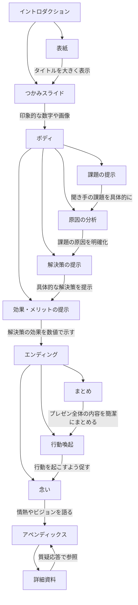
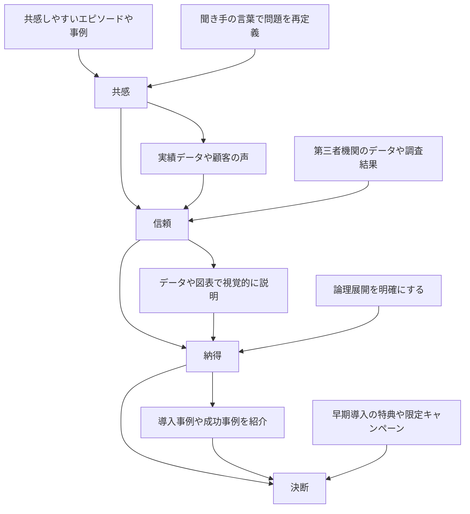

# 20240527 [大学生向け]次世代AIプレゼン作成の極意10選！

[https://vimeo.com/950449709/828fa14d8f?share=copy](https://vimeo.com/950449709/828fa14d8f?share=copy)

[https://vimeo.com/950449709/828fa14d8f?share=copy](https://vimeo.com/950449709/828fa14d8f?share=copy)

▶️全文文字起こし：

[20240527 [大学生向け]次世代AIプレゼン作成の極意10選！.md](20240527%20%5B%E5%A4%A7%E5%AD%A6%E7%94%9F%E5%90%91%E3%81%91%5D%E6%AC%A1%E4%B8%96%E4%BB%A3AI%E3%83%95%E3%82%9A%E3%83%AC%E3%82%BB%E3%82%99%E3%83%B3%E4%BD%9C%E6%88%90%E3%81%AE%E6%A5%B5%E6%84%8F10%E9%81%B8%EF%BC%81%20b34d6fcc8992469e921f4c03d8342ad1/20240527_%25E5%25A4%25A7%25E5%25AD%25A6%25E7%2594%259F%25E5%2590%2591%25E3%2581%2591%25E6%25AC%25A1%25E4%25B8%2596%25E4%25BB%25A3AI%25E3%2583%2595%25E3%2582%259A%25E3%2583%25AC%25E3%2582%25BB%25E3%2582%2599%25E3%2583%25B3%25E4%25BD%259C%25E6%2588%2590%25E3%2581%25AE%25E6%25A5%25B5%25E6%2584%258F10%25E9%2581%25B8%25EF%25BC%2581.md)

[20240527 [大学生向け]次世代AIプレゼン作成の極意10選！.srt](20240527%20%5B%E5%A4%A7%E5%AD%A6%E7%94%9F%E5%90%91%E3%81%91%5D%E6%AC%A1%E4%B8%96%E4%BB%A3AI%E3%83%95%E3%82%9A%E3%83%AC%E3%82%BB%E3%82%99%E3%83%B3%E4%BD%9C%E6%88%90%E3%81%AE%E6%A5%B5%E6%84%8F10%E9%81%B8%EF%BC%81%20b34d6fcc8992469e921f4c03d8342ad1/20240527_%25E5%25A4%25A7%25E5%25AD%25A6%25E7%2594%259F%25E5%2590%2591%25E3%2581%2591%25E6%25AC%25A1%25E4%25B8%2596%25E4%25BB%25A3AI%25E3%2583%2595%25E3%2582%259A%25E3%2583%25AC%25E3%2582%25BB%25E3%2582%2599%25E3%2583%25B3%25E4%25BD%259C%25E6%2588%2590%25E3%2581%25AE%25E6%25A5%25B5%25E6%2584%258F10%25E9%2581%25B8%25EF%25BC%2581.srt)

---

▶️スタート：


**はじめに： 聞き手の心を揺さぶるプレゼンを目指して**

ビジネスの世界では、プレゼンは重要なコミュニケーションツールです。しかし、ありきたりなプレゼンでは、相手の心を動かし、行動を促すことはできません。

資料共有：


URL:

[https://elemental-bubble-66e.notion.site/20240527-10-b34d6fcc8992469e921f4c03d8342ad1?pvs=4](20240527%20%5B%E5%A4%A7%E5%AD%A6%E7%94%9F%E5%90%91%E3%81%91%5D%E6%AC%A1%E4%B8%96%E4%BB%A3AI%E3%83%95%E3%82%9A%E3%83%AC%E3%82%BB%E3%82%99%E3%83%B3%E4%BD%9C%E6%88%90%E3%81%AE%E6%A5%B5%E6%84%8F10%E9%81%B8%EF%BC%81%20b34d6fcc8992469e921f4c03d8342ad1.md)

本研修資料は、当該研修にのみ共有を許可するものです。

当方への申告なく、外部への公開などはお控え願います。

---

# ▶️はじめに：


[AladJIN株式会社](https://aladjin.ai/)　COO / 生成AIエバンジェリスト

[TANREN株式会社](https://tanren.jp/)　CEO / パフォーマンス評価アプリTANREN

**佐藤 勝彦(さとうかつひこ）**

と申します。

主業は営業教育、販売員教育の育成ソリューションを手掛けています


[https://tanren.jp/](https://tanren.jp/introduction)

生成AI専門のエバンジェリスト（伝道師）として

講演会、研修事業、アドバイザリー事業、PoC開発事業を

専門としてアラジン株式会社も立ち上げ活動強化しております


それでは参りましょう！

---

---

<aside>
💡 **▶️目次**

</aside>

<aside>
💡 参考書籍

</aside>


[プレゼン資料のデザイン図鑑](https://amzn.to/3wPJADT)

一般社団法人プレゼンテーション協会

[一般社団法人プレゼンテーション協会](https://presen.or.jp/)

---


## 1. 伝わるプレゼンのメカニズム：目的と相手欲の一致

プレゼンの目的は、相手に「行動」を起こさせること。そのためには、以下の３つの要素を意識することが重要です。

- **目的**: あなたがプレゼンを通して相手に求める行動を明確にする。
    - 例：商品購入、契約締結、投資、協業など
- **相手欲**: 相手が求めているもの、解決したい課題を徹底的に分析する。
    - 例：売上向上、コスト削減、業務効率化、顧客満足度向上など
- **質疑応答**: 相手の疑問を解消し、納得感を高めることで、行動を後押しする。
    - 例：相手の質問を想定問答を用意する

これら３つが合致してこそ、初めて「伝わる」プレゼンになります。プレゼンは一方的な情報伝達ではなく、相手とのコミュニケーションであることを意識しましょう。

**ポイント**

- プレゼンは「相手を動かす」ためのもの
- 相手の立場に立って、何を求めているのかを徹底的に考える

ChatGPTを活用してみましょう


[https://chatgpt.com/](https://chatgpt.com/?oai-dm=1)

最新の[GPT-4o]は高性能！制限はありますが無料で使えます！


↓

本研修資料を全文読み取り、ボット化しましょう

```markdown
{本資料を全文コピペ}

---

全文理解したらYESといい待機
```

わずか、これだけで

本研修資料の問い合わせbotとして便利に活用可能です。

さぁストーリーを考えましょう。

---


## 2. プレゼン資料作成：４つのパートで構成するストーリー



プレゼン資料は、以下の４つのパートで構成することで、聞き手を自然な流れで結論へと導きます。

1. **イントロダクション:**
    - 表紙：プレゼン資料の顔となる部分。タイトルを大きく表示し、テーマを明確に伝えましょう。
    - つかみスライド：聞き手の興味・関心を惹きつけるためのスライド。印象的な数字や画像、質問などを用いて、共感を生み出すことを意識します。
2. **ボディ:**
    - 課題の提示：聞き手の抱える課題を具体的に示し、「自分事」として認識させます。
    - 原因の分析：課題が生じている原因を明確化し、解決策の必要性を論理的に説明します。
    - 解決策の提示：具体的な解決策を提示し、それがいかに効果的であるかを訴求します。
    - 効果・メリットの提示：解決策によって得られる効果やメリットを、数値や事例などを用いて具体的に示します。
3. **エンディング:**
    - まとめ：プレゼン全体の内容を簡潔にまとめ、キーメッセージを再確認します。
    - 行動喚起：聞き手に求める行動を明確に示し、行動を起こすように促します。
    - 念い：あなたの情熱やビジョンを語り、聞き手の心を揺さぶります。
4. **アペンディックス:**
    - 詳細資料：プレゼン資料で網羅できなかった詳細なデータや資料をまとめた別添資料。質疑応答などで必要に応じて参照します。

↓

事業アイディアが浮かんだならばこれに原案を照らし

アイディアの”アジェンダ構成”を出してもらいます。

大原則：

[課題]　→　[原因]　→　[解決法]　→　[効果]

〜〜〜〜〜〜〜〜〜〜〜〜〜〜〜〜〜〜〜〜〜

ここを話しの”幹”にしましょう。

```markdown
以下は、大学内コミュニティを拡大するためのプレゼンテーションのスライド構成です。
研修で学んだプレゼン技法を用いて、詳細なアジェンダ構成と見せ方を反映しています。

---

## スライド構成: 大学内コミュニティの拡大

---

### 1. イントロダクション

#### スライド 1: 表紙

- タイトル: 「大学内コミュニティの拡大戦略」
- サブタイトル: 「活気ある学生生活を目指して」
- 日付とプレゼンター名
- 高画質な背景画像やロゴを使用して視覚的に訴える

#### スライド 2: つかみスライド

- 印象的な数字や画像を使用
- 質問や共感を呼ぶメッセージを配置
  - 例: 「年間500名の新入生、そのうちコミュニティに参加しているのはたったの50名。その理由は？」

---

### 2. ボディ

#### スライド 3: 課題の提示

- 大学内コミュニティの現状と課題を具体的に示す
- グラフや統計データを用いて視覚的に説明
  - 例: 参加率の低さ、イベントの少なさ

#### スライド 4: 原因の分析

- 課題が生じている原因を明確化
  - 例: 情報の不足、活動の魅力不足
- 因果関係を示すロジックツリーやフローチャートを使用

#### スライド 5: 解決策の提示

- 具体的な解決策を提案
  - 例: 新入生歓迎イベントの充実、SNSを活用した広報活動
- 具体的なアクションプランを提示
  - 例: 「毎月第1金曜日にワークショップ開催」「Instagramでの情報発信強化」

#### スライド 6: 効果・メリットの提示

- 解決策によって得られる効果やメリットを数値や事例で示す
  - 例: 参加者数の増加、学業成績の向上
- 成功事例やデータを用いて具体性を持たせる

---

### 3. エンディング

#### スライド 7: まとめ

- プレゼン全体の内容を簡潔にまとめる
- キーメッセージを再確認
  - 例: 「大学内コミュニティの拡大は学生生活を豊かにし、卒業後のネットワーク形成にも寄与します。」

#### スライド 8: 行動喚起

- 聞き手に求める具体的な行動を明確に示す
  - 例: 「次の新入生歓迎イベントに参加しよう」「SNSでコミュニティ情報をシェアしよう」

#### スライド 9: 念い

- あなたの情熱やビジョンを語る
  - 例: 「大学生活は一度きり。その時間を充実させるために、今こそコミュニティを強化しましょう。」

---

### 4. アペンディックス

#### スライド 10: 詳細資料

- プレゼン資料で網羅できなかった詳細なデータや資料をまとめる
- 質疑応答で参照できるように準備
  - 例: イベントの具体的なスケジュール、予算詳細、アンケート結果

---

このテンプレートに沿って、プレゼン資料を作成してください。各スライドには、視覚的に訴える要素（グラフ、画像、図解）を適切に配置し、わかりやすく魅力的なプレゼンテーションを目指しましょう。
```

---


## 3. 感情を動かす資料作成：共感から決断へ導く流れ

論理的な説明だけでなく、聞き手の感情を動かすことが、プレゼン成功の鍵となります。資料作成においては、「共感→信頼→納得→決断」の４つのステップを意識しましょう。



- **共感**: 聞き手の課題や問題意識を理解し、「自分事」として捉えてもらうことが重要です。
    - 例：共感しやすいエピソードや事例を交えて語る
    - 聞き手の言葉を使って、問題を再定義する
- **信頼**: あなたの話に耳を傾ける理由を与えなければなりません。実績や権威、専門性などを示すことで、信頼感を高めます。
    - 例：実績データ、顧客の声、専門家の意見などを提示する
    - 第三者機関のデータや調査結果を引用する
- **納得**: 論理的な説明や根拠を明確にすることで、聞き手に「なるほど」と思わせることが重要です。
    - 例：データや図表を用いて、視覚的にわかりやすく説明する
    - 論理展開を明確にし、結論を導き出す
- **決断**: 行動を起こすための後押しが必要です。メリットを明確に示したり、限定性を打ち出すことで、決断を促します。
    - 例：導入事例や成功事例を紹介し、具体的なイメージを与える
    - 早期導入の特典や限定キャンペーンなどを提示する

更に重厚ストーリーテリングにするならば

[共感]　→　[信頼]　→　[納得]　→　[決断]

〜〜〜〜〜〜〜〜〜〜〜〜〜〜〜〜〜〜〜〜〜

を間に入れることが大事です。

GPTにそのようにそこを拡張するように指示しましょう

```markdown
## スライド構成: 大学内コミュニティの拡大

### 1. イントロダクション

#### スライド 1: 表紙
- タイトル: 「大学内コミュニティの拡大戦略」
- サブタイトル: 「活気ある学生生活を目指して」
- 日付とプレゼンター名
- 高画質な背景画像やロゴを使用して視覚的に訴える

#### スライド 2: つかみスライド
- 印象的な数字や画像を使用
- 質問や共感を呼ぶメッセージを配置
  - 例: 「年間500名の新入生、そのうちコミュニティに参加しているのはたったの50名。その理由は？」

---

### 2. ボディ

#### スライド 3: 課題の提示
- 大学内コミュニティの現状と課題を具体的に示す
- グラフや統計データを用いて視覚的に説明
  - 例: 参加率の低さ、イベントの少なさ

#### スライド 4: 原因の分析
- 課題が生じている原因を明確化
  - 例: 情報の不足、活動の魅力不足
- 因果関係を示すロジックツリーやフローチャートを使用

---

### 3. 共感

#### スライド 5: 共感を生み出すエピソード

- 学生の声や実際のエピソードを交えて語る
  - 例: 「新入生の山田さんは、初めての大学生活に不安を抱えていました。彼は友達を作るのに苦労し、孤立感を感じていました。しかし、コミュニティに参加することで、仲間を見つけ、大学生活が楽しくなりました。」

---

### 4. 信頼

#### スライド 6: 実績と信頼を示す

- 大学のコミュニティ活動の実績データ
  - 例: 「過去3年間で、参加者数が20%増加しました。」
- 専門家の意見や第三者機関のデータを引用
  - 例: 「教育学者の田中教授も、コミュニティ活動が学生の学業成績にポジティブな影響を与えると述べています。」

---

### 5. 納得

#### スライド 7: 論理的な説明と根拠

- データや図表を用いて、解決策の必要性を視覚的に説明
  - 例: 「コミュニティ活動に参加した学生の成績向上率」
- ロジックツリーやフローチャートを用いて論理展開を明確にする

---

### 6. 決断

#### スライド 8: 行動を促すための後押し

- 成功事例を紹介し、具体的なイメージを与える
  - 例: 「コミュニティ活動を通じてリーダーシップスキルを身につけた学生が、卒業後に大手企業に就職しました。」
- 早期導入の特典や限定キャンペーンを提示
  - 例: 「今月中に登録すると、特典として無料のワークショップに参加できます。」

---

### 7. エンディング

#### スライド 9: まとめ

- プレゼン全体の内容を簡潔にまとめる
- キーメッセージを再確認
  - 例: 「大学内コミュニティの拡大は学生生活を豊かにし、卒業後のネットワーク形成にも寄与します。」

#### スライド 10: 行動喚起

- 聞き手に求める具体的な行動を明確に示す
  - 例: 「次の新入生歓迎イベントに参加しよう」「SNSでコミュニティ情報をシェアしよう」

#### スライド 11: 念い

- あなたの情熱やビジョンを語る
  - 例: 「大学生活は一度きり。その時間を充実させるために、今こそコミュニティを強化しましょう。」

---

### 8. アペンディックス

#### スライド 12: 詳細資料

- プレゼン資料で網羅できなかった詳細なデータや資料をまとめる
- 質疑応答で参照できるように準備
  - 例: イベントの具体的なスケジュール、予算詳細、アンケート結果

---

### 9. 質疑応答

#### スライド 13: 質疑応答

- 聞き手からの質問に答える時間を設ける
- あらかじめ想定される質問とその回答を用意しておく

---

このテンプレートに沿って、プレゼン資料を作成してください。各スライドには、視覚的に訴える要素（グラフ、画像、図解）を適切に配置し、わかりやすく、エモーショナルなプレゼンテーションを目指しましょう。
```

---


## 4. プレゼン資料作成テクニック：基本ルールと効果的な図解


公式： [https://irusiru.jp/](https://irusiru.jp/)

解説blog

[イルシル：日本発の革新的AI生成スライドツールに感動！日本中がきっと驚く高品質と使いやすさ｜プレゼンテーション協会](https://note.com/prekyo/n/n8139928d81d3)

簡単一発スライド制作


構造分解してスライド自動生成


↓ スライド完成。


こっからは細かい調整は、個別に調整します。

**基本テクニック**

- **スライドサイズ**: 16:9のワイドサイズが一般的。多くのPCやスマホ、プロジェクターに対応しており、視覚的に情報が整理しやすいというメリットがあります。


- **フォーマット**: スライドのデザインは統一感が重要です。タイトル、本文、フッターの位置やフォント、色などを統一することで、見やすく、洗練された印象を与えます。


- **使用フォント**: ゴシック体で統一することで、可読性を高めます。明朝体はデザイン性が高い一方、画面上では読みづらい場合があります。Win/Macの互換性を優先しましょう。
    - おすすめフォント：メイリオ、Meiryo


- **フォントサイズ**: キーメッセージは大きく表示することで、聞き手の目に留まりやすくなります。本文とキーメッセージのフォントサイズにメリハリをつけましょう。
    - キーメッセージ：23pt以上
    - 本文：20pt程度


- **13文字の法則**: スライドタイトルは13文字以内で簡潔にまとめます。短くすることで、聞き手の理解を促進し、記憶に残りやすくなります。


- **シグナル効果**: 色やフォントサイズで強調箇所を明確にすることで、聞き手の視線を誘導します。重要なキーワードや数字などは、色やサイズを変えて強調表示しましょう。


- **色使いテクニック**: 寒色系の色を基調にすることで、落ち着いた雰囲気を演出し、信頼感を高めます。ポイントとなる部分に暖色系の色を使うことで、メリハリをつけ、視線を引き付けます。
    - ベースカラー：青、緑など
    - アクセントカラー：赤、オレンジなど


**図解スキル**

複雑な情報をわかりやすく伝えるためには、図解が有効です。以下の図解パターンを参考に、状況に合わせて使い分けましょう。

- **基本：四角と矢印**
    - 用途：物事の流れや関係性を示す
    - 例：プロセス説明、因果関係の説明


- **マトリックス型**
    - 用途：複数の要素を比較分析する
    - 例：SWOT分析、3C分析


- **時系列型**
    - 用途：時間の流れに沿って変化を示す
    - 例：売上推移、プロジェクトスケジュール


- **サイクル型**
    - 用途：繰り返し行われるプロセスを示す
    - 例：PDCAサイクル、顧客ライフサイクル


- **ロジックツリー型**
    - 用途：問題の原因究明や解決策の検討
    - 例：課題分析、意思決定


- **グラフ型**
    - 用途：データの推移や比較を視覚的に示す
    - 例：売上比較、市場シェア


---


## 5. グラフ作成＆活用テクニック：シンプルで見やすいグラフで説得力を増す

グラフは、データを視覚的に表現することで、聞き手の理解を促進する効果があります。しかし、複雑なグラフは逆効果。以下のポイントを踏まえて、シンプルで見やすいグラフを作成しましょう。

- **左グラフ・右メッセージ**: 人間の視線は左から右へ流れるため、グラフは左、メッセージは右に配置するのが自然です。


- **シンプルグラフ**: グラフは、情報を伝えるためのツールであり、装飾ではありません。不要な要素（目盛り線、データラベル、凡例など）は思い切ってカットし、メッセージが伝わる最小限の要素で構成しましょう。


- **ワンカラー効果**: 強調したい部分を１色で強調することで、視線を引き付けます。グラフ全体をモノトーンで表現し、強調したい部分だけをカラーにすることで、効果的にメッセージを伝えることができます。


- **データ検索の極意**: データは、プレゼンを説得力のあるものにするために欠かせません。信頼できるデータを取得するために、以下のポイントを意識しましょう。
    - 最新データの取得：情報源が古くなると、データの信憑性が低下します。常に最新の情報源を参照しましょう。
    - 信頼できる情報源の活用：インターネット上には、多くの情報が溢れていますが、中には信憑性に欠ける情報も少なくありません。政府機関や公的機関、信頼できる調査会社などのデータを利用しましょう。
    - 期間指定検索：特定の期間のデータが必要な場合は、検索エンジンで期間を指定することで、効率的に情報収集できます。


[https://www.google.com/search?q=chatgpt&sca_esv=8e72db86bea876f8&sca_upv=1&sxsrf=ADLYWIJKMJ8oYLHDSFY0uRkgNdMNehbUYQ:1716700706444&source=lnt&tbs=qdr:m&sa=X&sqi=2&ved=2ahUKEwjb-6u-yKqGAxU0p1YBHWDrAwYQpwV6BAgBEA8&biw=1351&bih=768&dpr=2](https://www.google.com/search?q=chatgpt&sca_esv=8e72db86bea876f8&sca_upv=1&sxsrf=ADLYWIJKMJ8oYLHDSFY0uRkgNdMNehbUYQ:1716700706444&source=lnt&tbs=qdr:m&sa=X&sqi=2&ved=2ahUKEwjb-6u-yKqGAxU0p1YBHWDrAwYQpwV6BAgBEA8&biw=1351&bih=768&dpr=2)

---


## 6. 相手の感情を動かすプレゼンテクニック：視覚効果で記憶に残す

視覚に訴えかけるプレゼンは、聞き手の印象に残りやすく、理解を促進する効果があります。以下のテクニックを参考に、視覚効果を意識した資料作成を行いましょう。

- **画質**: 低画質の画像は、プレゼンの質を低下させるだけでなく、聞き手に不信感を与える可能性もあります。高画質の画像を使用し、プレゼンのクオリティを高めましょう。


- **ワンカラー効果**: 写真やイラストの一部をモノクロ/灰色に加工し、強調したい部分だけをカラーで残すことで、視線を引き付け、印象的なビジュアルを作成できます。


- **シグナル効果＋フォント**: 色とフォントを組み合わせることで、メッセージをより効果的に伝えることができます。
    - ポジティブなメッセージ：カラー画像＋ゴシック体＋青字
    - ネガティブなメッセージ：モノクロ画像＋明朝体＋赤字
    
    
    
- **透過**: 画像や図形を透過させることで、背景と調和させ、奥行きのあるデザインを作成できます。


---


## 7. 信頼感を高めるスライド作成：実績と根拠を示し、誠意を伝える

聞き手にあなたの提案を受け入れてもらうためには、信頼関係を築くことが不可欠です。以下の要素を盛り込むことで、信頼感を高めるスライドを作成しましょう。

- **実績**:
    - 商品・サービスの実績：売上実績、顧客数、受賞歴など
    - 会社の実績：創業からの歴史、企業規模、社会貢献活動など
    - メディア掲載の実績：テレビ、新聞、雑誌などの掲載実績
- **客観的な根拠**:
    - 科学的根拠：データに基づいた根拠
    - 著名人の推薦：専門家や著名人からの推薦コメント
    - 利用者の声：実際に商品やサービスを利用した顧客の声
- **誠意**:
    - 聞き手の立場に立ったプレゼン資料を作成することで、誠意が伝わります。
    - 熱意を持ってプレゼンを行い、聞き手の心に響くように語りかけましょう。

---


## 8. 「話し方」３つの準備：簡潔でわかりやすく、記憶に残るプレゼン

優れたプレゼン資料を作成しても、話し方が伴わなければ、聞き手の心を掴むことはできません。以下の３つのポイントを意識し、効果的な話し方を身につけていきましょう。

- **だらだら話さない**: 要点を絞って簡潔に話すことが重要です。１つのスライドにかける時間を決めておき、時間内に収まるように練習しましょう。
- **資料の読み上げはNG**: スライドに書かれていることをそのまま読み上げるのは、聞き手を退屈させてしまいます。スライドはあくまで補助資料と捉え、聞き手の方を見て、自分の言葉で語りかけましょう。
- **フィラーをなくす**: 「えー」「あのー」といったフィラーは、自信のなさや準備不足を露呈してしまいます。フィラーをなくすためには、以下の方法が有効です。
    - 一拍置く：間を取ることで、聞き手に考える時間を与え、話にメリハリが生まれます。
    - 文章を短くする：短い文章で話すことを意識することで、フィラーが出にくくなります。
    - 次のスライドへの繋ぎを考えておく：話につまりそうな場合は、次のスライドの内容を事前に頭に入れておくことで、スムーズな展開が可能になります。

**プレゼン練習方法**

- **プレゼン6回練習**:
    - セルフプレゼン録画：3回
        - 録画した動画を見返すことで、客観的に自分のプレゼンをチェックできます。
        - 話し方、姿勢、視線などを確認し、改善点を洗い出しましょう。
    - 第三者とのQ&A：2～3回
        - アペンディックス（補足資料）を充実させることができます。
        - よくある質問（FAQ）を作成するベースになります。
        - 厳しい意見や質問をもらうことで、プレゼンの質を高めることができます。

---


## 9. オンラインプレゼンを成功させる：伝え方と質疑応答

オンラインプレゼンでは、対面プレゼンとは異なる点に注意する必要があります。

**オンラインプレゼンで「伝わらない」理由**

オンラインプレゼンでは、対面プレゼンに比べて、非言語情報が伝わりにくいという特徴があります。

- **メラビアンの法則**:
    - 視覚情報：55%（表情、ボディランゲージ）
    - 聴覚情報：38%（声の大きさ、スピード）
    - 言語情報：7%（話す言葉）

オンラインプレゼンでは、視覚情報が制限されるため、表情や声のトーン、話すスピードなどを意識する必要があります。

**オンラインプレゼン術**

- **時間デザイン**: オンラインプレゼンでは、集中力が途切れやすいという側面があります。
    - 本編：15分以内を目安にまとめる
    - 質疑応答：10分程度
- **質疑応答の準備**: 質疑応答は、プレゼン内容への理解を深め、納得感を高めるための重要な機会です。
    - 聞かれそうな質問10個
    - 聞かれると嫌な質問10個
    - 質疑応答作成10チェック
        - そもそもチェック：
            - そもそもやる意味は？
            - そもそもこの提案の根拠は？
        - メリデメチェック：
            - メリットとデメリットを確認
        - リスクチェック：
            - 実施した際のリスク
            - 実施しなかった際のリスク
        - 時間軸チェック：
            - 過去、過去推移
            - 現状
            - 将来予測、見込み
        - 比較チェック：
            - 過去比較
            - 他社比較
            - 業界比較
            - 異業種比較
        - 相手の立場チェック：
            - 相手の役職、ポジション、プライド
            - 相手の組織への負荷、予算、リソース
            - 地雷の確認
            - ネゴシエーション
        - 未来イベントチェック：
            - 起こりうる未来イベント（例：オリンピック、ワールドカップ、環境汚染、自動運転など）への対応
        - マーケティングチェック：
            - マーケティングの分析メソッドを使う
            - PEST分析/3C分析/SWOT、クロスSWOT分析/4P分析　など
        - 根拠データチェック：
            - 最新のものか？
            - 出典は信頼できる情報か？
        - 最終チェック：
            - 企業理念との整合性
- **質疑はコンサルティング・プレゼンテーション**: 質疑応答は、一方的に回答するのではなく、相手の立場に立って、一緒に課題解決を目指す姿勢で臨むことが重要です。


- ▶️出力例 トゴルを開くとGPTの出力例が展開されます。
    
    以下は、大学内コミュニティ拡大のプレゼンにおける質疑応答対策の一覧表です。聞かれそうな質問とその見本回答、聞かれると嫌な質問とその見本回答、そして質疑応答作成のチェックリストを含めています。
    
    ---
    
    ## 質疑応答対策表
    
    ### 聞かれそうな質問と見本回答
    
    | 質問 | 見本回答 |
    | --- | --- |
    | コミュニティ拡大の目的は何ですか？ | コミュニティ拡大の目的は、学生生活を充実させ、学業成績向上や卒業後のネットワーク形成に寄与することです。 |
    | どのようなイベントを計画していますか？ | 新入生歓迎イベント、定期ワークショップ、コミュニティフェアなど、様々なイベントを計画しています。 |
    | SNSの活用方法は？ | SNSを通じてイベント情報の発信や参加者の募集、コミュニティ活動の報告を行います。 |
    | 予算はどれくらい必要ですか？ | イベント費用、広報活動費用、オンラインプラットフォーム運営費用など、総額で年間約50万円を見込んでいます。 |
    | 参加率向上のための具体的な施策は？ | SNSでの情報発信、学生アンバサダープログラムの導入、新入生向けの特典提供などを検討しています。 |
    | 他大学の成功事例はありますか？ | 他大学では、SNSを活用した広報活動や定期的なワークショップ開催により、コミュニティ参加率が大幅に向上しています。 |
    | 学生の反応はどうですか？ | 初めて参加した学生からは、友達が増えて大学生活が楽しくなったという声が多く寄せられています。 |
    | コミュニティ活動が学業に与える影響は？ | 研究によると、コミュニティ活動に参加する学生は、非参加学生に比べて学業成績が向上する傾向があります。 |
    | 参加者数の目標は？ | 初年度は参加者数を500名に、3年後には1000名を目標としています。 |
    | 卒業生へのメリットは？ | コミュニティで培ったネットワークは、卒業後の就職活動やキャリア形成において大きな支えとなります。 |
    
    ### 聞かれると嫌な質問と見本回答
    
    | 質問 | 見本回答 |
    | --- | --- |
    | コミュニティ活動に参加する意味は何ですか？ | コミュニティ活動は、学生同士のつながりを深め、大学生活を豊かにする重要な要素です。 |
    | 成果が出なかった場合の対策は？ | 定期的に活動内容を見直し、学生の意見を反映させることで、改善策を講じていきます。 |
    | コストに見合う成果があるのですか？ | コミュニティ活動の成果は、参加者の満足度向上や学業成績の向上として現れます。長期的には大学全体の評価にもつながります。 |
    | 広報活動の効果が出なかった場合は？ | 広報活動の効果を定期的に分析し、必要に応じて戦略を修正していきます。 |
    | オンラインプラットフォームの維持費は？ | 維持費は年間約10万円を見込んでおり、大学の予算内で賄うことが可能です。 |
    | 学生の興味を引くための新しいアイデアは？ | 定期的に学生アンケートを実施し、新しいアイデアを取り入れていきます。 |
    | 他大学と比べて遅れているのでは？ | 他大学の事例を参考にしつつ、我々の大学の特徴を活かした独自のコミュニティ活動を推進します。 |
    | 参加しない学生への対応は？ | コミュニティの魅力を広く伝えることで、参加意欲を高めていきます。また、非参加学生の意見も積極的に取り入れて活動内容を充実させます。 |
    | 活動がうまくいかなかった場合の評価方法は？ | 活動の効果を定期的に評価し、改善点を明確にして次回に活かします。 |
    | コミュニティ活動に反対する意見にはどう対処しますか？ | 反対意見も尊重し、対話を通じて理解を深める努力を続けます。また、活動の透明性を確保し、全ての学生が納得できる形を目指します。 |
    
    ### 質疑応答作成10チェックリスト
    
    | チェック項目 | 説明 |
    | --- | --- |
    | そもそもチェック：そもそもやる意味は？ | コミュニティ拡大の目的と意義を明確に説明する |
    | そもそもチェック：そもそもこの提案の根拠は？ | 提案の背景となるデータや事例を提示する |
    | メリデメチェック：メリットとデメリットを確認 | メリットとデメリットをバランスよく説明し、デメリットに対する対策も示す |
    | リスクチェック：実施した際のリスク | リスクを具体的に示し、それに対する対応策を説明 |
    | リスクチェック：実施しなかった際のリスク | コミュニティ活動を行わなかった場合のリスクを説明 |
    | 時間軸チェック：過去、過去推移 | 過去のデータや推移を示し、現在の状況との比較を行う |
    | 時間軸チェック：現状 | 現在の状況を詳細に説明し、改善の必要性を示す |
    | 時間軸チェック：将来予測、見込み | 将来の見込みや予測を示し、コミュニティ活動の効果を説明 |
    | 比較チェック：過去比較 | 過去との比較を行い、進展や改善点を明確にする |
    | 比較チェック：他社比較、業界比較、異業種比較 | 他大学や業界標準と比較し、優位性や差別化ポイントを示す |
    | 相手の立場チェック：相手の役職、ポジション、プライド | 相手の立場を考慮し、相手に響くような説明を行う |
    | 相手の立場チェック：相手の組織への負荷、予算、リソース | 提案が相手の組織に与える影響や必要なリソースを明確に説明 |
    | 相手の立場チェック：地雷の確認、ネゴシエーション | 敏感な問題やネゴシエーションポイントを事前に把握し、適切に対処する |
    | 未来イベントチェック：起こりうる未来イベントへの対応 | 将来的なイベントやトレンドに対する対応策を示す |
    | マーケティングチェック：マーケティングの分析メソッド | PEST分析、3C分析、SWOT分析、4P分析などを用いて、提案の妥当性を説明 |
    | 根拠データチェック：最新のものか？ | 提示するデータが最新であることを確認し、信頼性を高める |
    | 根拠データチェック：出典は信頼できる情報か？ | 出典が信頼できる情報源であることを確認する |
    | 最終チェック：企業理念との整合性 | 提案が大学の理念やビジョンに合致しているかを確認する |
    
    ---
    
    この表を基に、質疑応答の準備を進め、効果的なプレゼンテーションを行ってください。
    

---


## 10. オンラインプレゼン 話し方５つの鉄則

オンラインプレゼンでは、画面越しでも相手に伝わる話し方を意識することが重要です。

1. **「伝えたい」という気持ちを持つ**: 熱意は画面越しでも伝わります。
2. **ゆっくり話す**: オンラインでは、音声の遅延や聞き取りづらさを考慮する必要があります。
3. **相槌を意識的に増やす**: 聞き手は、反応がないと不安になります。
4. **カメラ目線**: 相手の目を見て話すことで、親近感が増し、信頼関係を築きやすくなります。
5. **笑顔を見せる**: 笑顔は、相手に好印象を与え、場の雰囲気を和ませる効果があります。

**Before-After：オンラインプレゼン改善例**

- **Before**: 棒読み、カメラを見ない、表情が硬い
- **After**: ゆっくり話す、カメラ目線、笑顔を見せる


没入感ある、引き込まれる”プレゼン”ができると

[佐藤 勝彦さん：営業パーソンが一人で動画まで作れるようになる営業 DX を mmhmm で実現](https://www.mmhmm.app/ja/blog/katsuhiko-sato)

１時間でも、２時間でも飽きることなく聴かせることができる。

---


## 最後に・・・

**プレゼンとは何か？：企業理念を伝えるためのツール**

プレゼンは、単に情報を伝えるだけでなく、あなたの「念い」を伝えるためのツールです。企業理念やビジョン、商品・サービスに込めた想いを伝えることで、聞き手の心を動かし、共感を呼ぶことができます。

**プレゼンを通して、あなたの「念い」を世の中に発信していきましょう。**


書；前田鎌利 [https://maeda-kamari.com/](https://maeda-kamari.com/)

本日以上です。

完

---

# お問い合わせは・・・


▶️お問い合わせは当社HPまで！
研修　[https://tanren.jp/gtp](https://tanren.jp/gtp)

TANRENCHAT [https://tanren.jp/tanren_chat](https://tanren.jp/tanren_chat)

アドバイザリー　[https://aladjin.ai/](https://aladjin.ai/)

▶️個人的なコンタクトはSNSで気軽にどうぞ！

Twitter [https://twitter.com/jrpj2010](https://twitter.com/jrpj2010)

Eight [https://8card.net/virtual_cards/Or17CEASxDSsD4-8SNrpVA_16021003](https://8card.net/virtual_cards/Or17CEASxDSsD4-8SNrpVA_16021003)