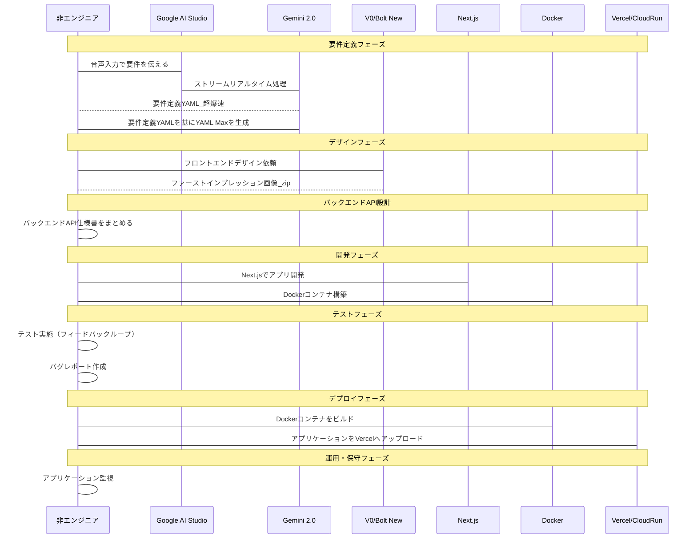
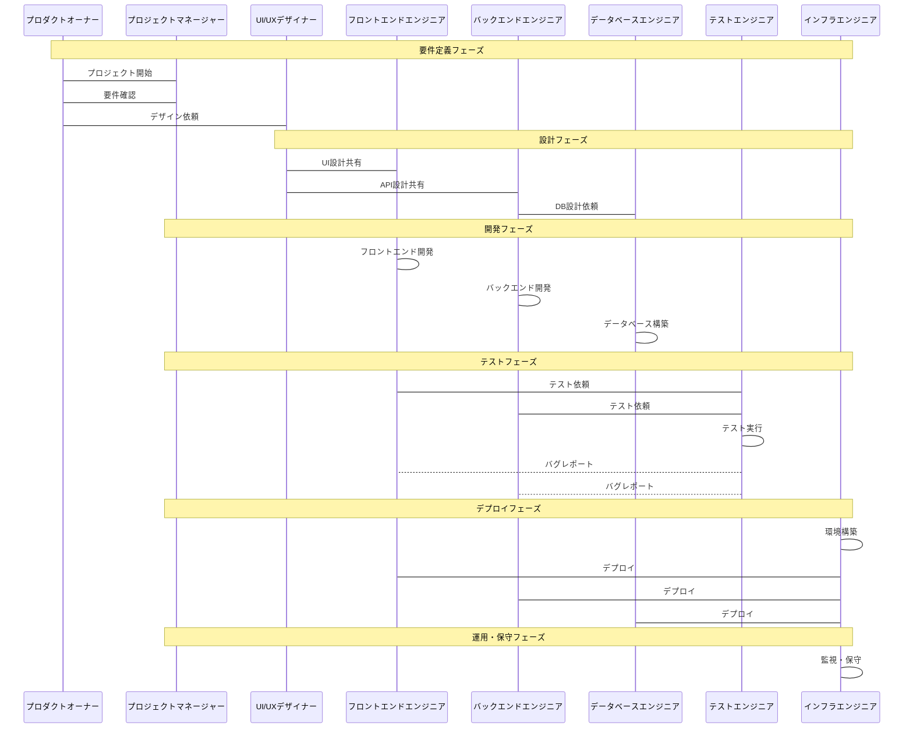

# 新時代AI駆動開発！新説”アプリ開発”はこう変わる！[中級編]

[https://vimeo.com/1067359374/ccf3c88afe?share=copy](https://vimeo.com/1067359374/ccf3c88afe?share=copy)

[https://vimeo.com/1067359374/ccf3c88afe?share=copy](https://vimeo.com/1067359374/ccf3c88afe?share=copy)

---

▶️アンケート回答；

有効１２名分

[勉強会アンケート.csv](%E6%96%B0%E6%99%82%E4%BB%A3AI%E9%A7%86%E5%8B%95%E9%96%8B%E7%99%BA%EF%BC%81%E6%96%B0%E8%AA%AC%E2%80%9D%E3%82%A2%E3%83%95%E3%82%9A%E3%83%AA%E9%96%8B%E7%99%BA%E2%80%9D%E3%81%AF%E3%81%93%E3%81%86%E5%A4%89%E3%82%8F%E3%82%8B%EF%BC%81%5B%E4%B8%AD%E7%B4%9A%E7%B7%A8%5D%201a131bbd522c8035879ce20da5ed882e/%E5%8B%89%E5%BC%B7%E4%BC%9A%E3%82%A2%E3%83%B3%E3%82%B1%E3%83%BC%E3%83%88.csv)

ざっくり、AI処理

↓

---

## 1. アンケート概要

- **回答者数**: 12名
（うち1名は氏名未記入）
- **実施日時**: 2025年3月19日〜3月22日

---

## 2. 回答者一覧と主な情報

下記表では主な項目をかいつまんでまとめています。

| **No.** | **氏名（任意）** | **AI駆動開発スキル向上度**(Q4) | **難易度感**(Q5) | **説明のわかりやすさ**(Q6) | **勉強会を他者に勧めたいか**(Q15) | **全体満足度**(Q16) |
| --- | --- | --- | --- | --- | --- | --- |
| 1 | 織田未来 | 4 | 2 | 3 | 4 | 5 |
| 2 | 小森一成 | 1 | 5 | 3 | 3 | 3 |
| 3 | 高橋翼 | 5 | 4 | 5 | 5 | 5 |
| 4 | 遠藤太一郎 | 3 | 4 | 4 | 4 | 4 |
| 5 | 工藤俊輔 | 1 | 5 | 5 | 2 | 3 |
| 6 | 武市真拓 | 4 | 3 | 2 | (記入なし) | 4 |
| 7 | 石井正人 | 4 | 2 | 4 | 5 | 5 |
| 8 | 梶原健司 | 5 | 4 | 5 | 5 | 5 |
| 9 | 府川 旭 | 4 | 3 | 2 | 4 | 4 |
| 10 | 十河 元太郎 | 4 | 1 | 2 | 3 | 3 |
| 11 | 山田竜司 | 3 | 2 | 5 | 4 | 4 |
| 12 | **(未記入)** | 4 | 3 | 2 | 4 | 4 |

一応、お約束事項でございますので、まだ未記入の方は改めてご協力をよろしくお願いします！！

<aside>
💡

AI駆動開発 非エンジニア向け勉強会アンケート

[**https://docs.google.com/forms/d/e/1FAIpQLSc8DH5VakNYGNMt1Tr_Yt9koW8NDO49mdFdEHvPr1cljNsvPw/viewform?usp=sharing**](https://docs.google.com/forms/d/e/1FAIpQLSc8DH5VakNYGNMt1Tr_Yt9koW8NDO49mdFdEHvPr1cljNsvPw/viewform?usp=sharing&fbclid=IwZXh0bgNhZW0CMTAAAR2lkCwSZ06gQEEdDjiRVTtdGyKObAHhx37Rbo44dQiH8SnsAOXlk70S-Pc_aem_CRmhg-QUrRq84AHeBzoOzQ)

</aside>

*確認出来次第こちらも更新してメモ残しますので！*

---

## 3. 主な自由記述項目・まとめ

### 3-1. 今回の勉強会で最も役に立ったと感じた項目

- **プロンプトエンジニアリング**
多数の方が「要件定義」「プロンプトエンジニアリング」「AIツールの活用方法」が特に参考になったと回答。
- **VScode / Cursor / Windsurf / RooCline などのIDE活用**
実際のエディタ(IDE)と拡張機能を使いながら、短時間でコード生成・修正するフローが衝撃的だったという声が多い。
- **V0やメタプロンプトを駆使した素早い試作**
「すばやく動くアプリをデプロイする流れが見られたのが良かった」という回答。

### 3-2. 勉強会の内容で、もっと深く学びたい部分

- **AIエージェント開発（全般）**
特に「エージェント同士の連携」「要件定義をどう自然言語でAIにわかりやすく伝えるか」という質問。
- **バックエンドやデプロイ、チーム開発、セキュリティ面**
もう一歩踏み込んだレベルの設計・構成を学びたいという声。
- **要件定義の完成度を高める方法**
「AIに任せきりにせず、どう完成度をチェックするか」など。

### 3-3. 勉強会の内容で、難しく感じた部分

- **ツールが多くて混乱**
V0/Cline/RooCode/Windsurf/VSCode...など複数に行き来するため、理解が分散しがち。
- **開発プロセスの前提知識が必要と感じた**
Git、ターミナル、Linuxコマンドなど「エンジニアが日常的に使っている概念」に未経験者は少しハードルを感じた。
- **大規模プロンプト（メタプロンプト）の扱い方**
大量の指示をどううまく分割し、エラーになった際にどう切り分け再試行するのかが難所。

### 3-4. 勉強会の構成・進め方で改善してほしい点

- **全体像・ロードマップの可視化**
「今どのフェーズにいて、次に何をするのか」を図示したり、区切りごとに確認が欲しいという声が多数。
- **スキルレベルによる分け方**
「非エンジニアとエンジニアに分けたセッションがあると、お互いより濃い学びができそう」という提案。
- **ツールを1つか2つに絞る**
まずは小さな成功体験を得るために、複数ツールを渡り歩かない進め方もあり、という意見。
- **事前準備の誘導や説明**
「何のためにインストールするのか」や「そもそもGitとは？」など、もう少し初心者向け資料があれば迷子になりづらいという指摘。

### 3-5. 今後、どのようなテーマの勉強会に参加したいか

- **AIエージェント開発（全般）**
ほぼ全員が「エージェント開発をもう少し掘り下げたい」と回答。
- **フロントエンド/バックエンド/データベース/セキュリティ**
各レイヤー別で詳しく知りたい人が多い。
- **チーム開発**
合宿やハッカソン形式、ブレイクアウトルーム形式での実践を望む意見多数。

### 3-6. 今回の勉強会で最も印象に残ったこと

- **「短時間でデプロイまで持っていける」衝撃**
「2時間で動くモックが作れた」「非エンジニアでも形になってしまう」などが強いインパクト。
- **要件定義の大切さ**
「何を作りたいか」を明確に書き出す→AIに伝えるというプロセスが、本当に成果を左右することを実感したという声。

### 3-7. 質問に対する回答・講師の説明について

- **講師の説明のわかりやすさ**
全体的に「丁寧」「非エンジニア向けに言い換えてくれて助かった」という声が多い。
一部、専門用語が多くなるセクションで「ややわかりづらい」という指摘も。
- **回答の的確さ**
「その場のデモやQ&Aがすぐに役立った」「非常に丁寧な対応」との評価が多い。

### 3-8. 勉強会の運営（時間配分、資料提供など）への改善要望

- **資料の分量が多い・文字ベースで迷子になる**
画面共有で進んでいる箇所をこまめに明示する、あるいは資料内により多くの図示や手順書を加えて欲しいとの声。
- **合宿や複数回開催を希望**
「1回で全部は難しい」「もう少しステップを刻んで受講したい」という意見。

### 3-9. 勉強会を他の方に勧めたいか / 全体満足度

- 「4〜5」の評価が比較的多く、特に「自分で動かしてみると面白い」「短時間で実績が出る」と感じた方からは高評価。
- 一方で、エンジニアリング要素に慣れていない方は「ハードルがまだ高い」「興味はあるが、もう少し基礎が欲しい」と意見が分かれ、結果として満足度やおすすめ度に幅が出た。

### 3-10. 今回の学びを今後どのように活かしていきたいか

- **自分や社内でミニアプリを開発して試したい**
「非エンジニアでもモックを作り、エンジニアに見せることで新サービスの企画につなぐ」といった声。
- **要件定義をさらに言語化して効率化を図る**
音声入力も含め、「要件を伝えるプロンプト」を工夫したいという回答。
- **今後もチーム内外で情報共有し、ナレッジを蓄積**
ハッカソンや勉強会を社内でやっていきたいという企業が多い。

### 3-11. その他、ご意見・ご要望

- **ツールや手順書をコミュニティでシェアしてほしい**
- **リアル（対面）の機会や合宿形式があれば参加したい**
- **海外のトレンドとの比較など深堀りした勉強会も興味あり**

---

## 4. 講師・佐藤勝彦からの補足回答・解説

アンケートでいただいたご意見・ご質問の中から、**特に多かったもの**や**すぐに補足できそうな点**について、講師（佐藤勝彦）になり変わり簡単にまとめて回答いたします。

---

### Q1. 「ツールが多くて混乱しやすい。最初は何を使うのがベストですか？」

**A.**

AI駆動開発における[入門・初級]を別で用意しなければダメだなと理解しました。

図解するとこんな塩梅です


- まずは初心者ならVibeCodingアプリ[bolt , v0 , Replit]から一つ、例えば**「v0」を選択しましょう。それを覚えたら、IDE選び[VS Code , Cursor , WindSurf] から一つ例えば「Cursor」といった、比較的ユーザーコミュニティが多く、学習資料が多そうなものを選べばおすすめ**。
- Gitやターミナル操作に慣れていない方は、事前に「GitはVer管理です。チャットでもありましたが“**セーブポイントを作る**”ためのもの」というイメージで触ってみると理解しやすいかもしれません。これがあることで、元に戻れます。
- **「v0 → VSCode(RooCode) → デプロイ」**という流れはやや高度なので、まずはひとつのツール、例えば[Replit]だけで「プロンプトからアプリを動かしてみる」成功体験を積んでみてください。→別途[[入門・初級編]](https://www.facebook.com/jrpj2010/posts/pfbid035SikhaiGCYX4NfFixw4CN518g7rXxEHFAkQiWUDmXMAxNM5WQJY4UKMKkBXG1Vzvl)を展開します！

---

### Q2. 「開発プロセス全体をざっくり知りたい。ロードマップが欲しい」

**A.**

実は書いてたんですが、進捗丁寧に話すと何もビルトできなそうなので、割愛してしまってましたが、再掲すると下記のような**フロー図**を意識するとわかりやすいです。

[[マーメイド記法](https://www.google.com/search?q=Mermaid%E8%A8%98%E6%B3%95&sca_esv=5eadaca3d07e07eb&sxsrf=AHTn8zo5kEG3QtMKuh4PtUvRWUXCmLalSg%3A1742746184030&ei=SDLgZ9DEAdff2roPmLSSgQY&ved=0ahUKEwjQiO65y6CMAxXXr1YBHRiaJGAQ4dUDCBI&uact=5&oq=Mermaid%E8%A8%98%E6%B3%95&gs_lp=Egxnd3Mtd2l6LXNlcnAiDU1lcm1haWToqJjms5UyChAAGIAEGEMYigUyBRAAGIAEMgUQABiABDIFEAAYgAQyBRAAGIAEMgUQABiABDIFEAAYgAQyBRAAGIAEMgUQABiABDIFEAAYgARIrwRQ_AJY_AJwA3gBkAEAmAFioAFiqgEBMbgBA8gBAPgBAvgBAZgCBKACcsICChAAGLADGNYEGEeYAwCIBgGQBgqSBwMzLjGgB6ADsgcDMC4xuAdm&sclient=gws-wiz-serp)]で説明すると・・・



- 特に**「要件定義書」→「AIに投げる」→「コード生成」→「エラー修正 or 再プロンプト」**という一連のサイクルが分かれば、どのツールを使っても本質はほとんど同じです。
- 勉強会では時間の都合上、あえていろいろな手法を紹介しましたが、**「一連の流れのどこを自動化・省力化するか」**をイメージできれば、混乱が減ると思います。

↓

それでもスッと入ってこない方は[Claude 3.7 sonnet]に図解を依頼しましょう


こんな一枚絵になります。どうでしょう？

---

### Q3. 「非エンジニアとエンジニアでレベル差が大きい。どうしたらうまく混在できますか？」（これは佐藤の質問に近いですがｗ）

**A.**


- **ブレイクアウトルーム**などで「初心者組」「経験者組」に分かれ、最後に成果を見せ合う形が理想かと思います。
- 経験者にはかなり物足りない部分もあるでしょうし、初心者は基礎的な用語や環境構築でつまづくことが多いです。
- 別々に進めつつも、**最終的には「こんなアプリができた！」と互いに共有する**のが学びとして面白いですね。

---

### Q4. 「要件定義をAIに任せる際、完成度をチェックするコツは？」

**A.**


- **「AIに、要件定義書の抜け漏れチェックを依頼する」**手があります。
プロンプト例：
    
    > 「この要件定義書をレビューして、考慮漏れや機能定義のあいまいさがあれば指摘してください」
    > 
- また、**複数のモデル(Claude/GPT)に同じ要件定義書を渡して評価や追記をしてもらう**のも有効です。
- 結果がバラついた時は**自分の中でどちらが理想に近いかを判断しながら修正**し、「要件定義書がブラッシュアップ」されていきます。
- とはいえ、講師側で、やはりいくつかのサンプル提示したほうがいいいと感じました。
10個くらい、失敗しない良質の要件定義書を用意します

---

### Q5. 「今回の勉強会、もう少し時間を取ってじっくりやりたい」

**A.**

- お声を多数いただいております。ありがとうございます！
- 確かに**1〜2時間ではカバーしきれない部分が多いため、合宿や数回に分割した勉強会**を企画する方向で検討します。
- 特に「実際にペアプロしてみる」「複数ツールの比較」「発表会でお互い刺激し合う」など、時間があるとより実践的に身につきやすいと考えます。

---

### Q6. 「事前資料が多く、どこを重点的に読めばよいか分からない」

**A.**


- 意図は**[AIリーダブル]**であって、**[ヒューマンリーダブル]**にしてないのです
とう講師佐藤理論は、まだ通用しないようなので、必要最低限のスライド化は必要かもと考え中。
- ただし、全文コピーして、わからないことはAIに聞く！を定着させたい（次世代学習方法の定着方法とは・・・これは別議論テーマ）
- 今後は**「最初に触るべきポイント」「応用的に読むと理解が深まるポイント」**の2段階に区分してお知らせしようと思います。
- まずは最低限の準備（例：VSCodeまたはCursorをインストール、GitHubアカウント取得など）→次に余裕があれば事前に一通り資料を眺める、のように誘導したいと考えています。
- ただし、[中級]技のひとつに、もはや全文RAGしてもらい、AIに聞きながら学習する方法を推進したいとも考えてます。NotebookLMに必要な情報全部入れて、、、か、それこそAI駆動開発でAssistantAPIとRAG連動で、講座を保管するチューターbotを作ろうかとも画策中。。。

---

### Q7. 「有償ツールを使うか迷う。最初から有償前提でもよい？」

**A.**


- **短期間で効率よく進めたいなら、有償ツールへの投資は十分価値がある**と私自身は考えています（WindSurf , Cursorへの投資は中級レベルでは推奨、初心者もGitHubCopilotやClaude有償化は推奨できる）。
- とはいえ最初は**「無料枠」でトライアル**できる場合も多いので、そこから始めてもOKです。
- 当勉強会では、なるべくコストを抑えつつ進められる方法も併せて紹介していますが、**予算と開発スピードのバランス**は各自が判断してください。

---

### Q8. 「海外トレンドも知りたい」

**A.**

- 私自身、海外のAIコミュニティとも情報交換しています。今後は**アメリカの本家AI企業や、日本のガチエンジニアコラボ**を勉強会に組み込めるようにしたいです。
- ブログやFacebook等でも情報発信を随時行っていますので、ご興味あればぜひフォローください。

---

### Q9. 「もう一度、似たような勉強会や合宿があれば参加したい」

**A.**

- 最終的には[企業向け]が専門なので、B2Cとして成立させる方式を取るかはお約束できません。
- ただし、今回いただいたフィードバックを活かし、私専用のごく少数のコミュニティにむけて**初心者〜中級者向け**と**上級者向け**で**別開催**する形式や、**ハッカソン/合宿**形式は検討したいとおもいます。
- 進捗がありましたら、Facebook越しに改めてご案内いたします。

---

## 5. まとめ

- **複数ツールを試す**メリットとして、応用範囲が広がる・トラブルシュートが身につく一方で、**迷子になりやすい**というデメリットも明確になりました。
- 参加者のレベル差も大きく、「まずは使い方を単一ツールでしっかり学びたい」方と「色々組み合わせて高度なことをしたい」方とに分かれる傾向がありました。
- 「要件定義→AIとの対話→プロトタイピング→デプロイ」までの流れを**短時間で一気通貫できる**のは大きな魅力であり、その衝撃が多くの方のモチベーションを高めたようです。
- 今後は**合宿や分割開催、海外事例との比較セッション**などを計画して、より充実した内容を提供していきたいと思います。

> 皆様、改めまして貴重なご意見・ご感想をありがとうございました。
> 
> 
> 今後も一緒にAI駆動開発を盛り上げていきましょう。
> 

---

以上が、アンケート内容のまとめと、講師・佐藤勝彦からの補足回答となります。

今後ともどうぞよろしくお願いいたします。

---

▶️ZOOM直：

[https://us02web.zoom.us/rec/share/Ef39-CfVBR7dgApkftDkta_aWU6gcp_dvIkh_2Z8USJk1XhH3aVAq2fAJcQBYUYH.Pkb_4rQfC-UKAHu2?startTime=1742379942000](https://us02web.zoom.us/rec/share/Ef39-CfVBR7dgApkftDkta_aWU6gcp_dvIkh_2Z8USJk1XhH3aVAq2fAJcQBYUYH.Pkb_4rQfC-UKAHu2?startTime=1742379942000)
パスコードを設定する: 4G=Ue7Xp

※当社契約容量超えたら自動で消えます。その後はVIMEOで視聴願います

▶️ログ：

- **文字起こし：**
    
    ```markdown
    WEBVTT
    
    1
    00:01:31.740 --> 00:01:42.189
    佐藤勝彦: どうも皆さんこんばんは。おー。総会ですね。皆さん。どうもご無沙汰な方もいらっしゃいますが、お集まりいただきありがとうございます。
    
    2
    00:01:42.810 --> 00:01:43.829
    石井正人: こんばんは。
    
    3
    00:01:44.120 --> 00:01:47.819
    佐藤勝彦: こんばんは。どうもよろしくお願いします。
    
    4
    00:01:47.990 --> 00:01:49.149
    ヤマダ リュウジ: よろしくお願いします。
    
    5
    00:01:49.810 --> 00:01:52.680
    佐藤勝彦: いやー、移植の面々でありがとうございま
    
    6
    00:01:54.610 --> 00:01:55.670
    佐藤勝彦: よいしょ。
    
    7
    00:01:59.250 --> 00:02:04.879
    佐藤勝彦: さてさて、何十人
    
    8
    00:02:05.170 --> 00:02:08.280
    佐藤勝彦: になるのかな？26。だったかな？
    
    9
    00:02:08.840 --> 00:02:20.080
    佐藤勝彦: ぐらい集まりますので、まあとはいえ、まあ、あの時間が惜しいので、もう時間になったら始めちゃいます。26人満席という状態でございました。
    
    10
    00:02:20.470 --> 00:02:21.339
    佐藤勝彦: はーい
    
    11
    00:02:21.670 --> 00:02:37.749
    佐藤勝彦:音声はまの最後の方に質疑応答の時間は混ぜ込みようかなと思ってますのと、あと進行的には若干早めにまあの回し立てて行っちゃいます。あの皆さんのレベルがわからないアンド。
    
    12
    00:02:37.780 --> 00:03:06.340
    佐藤勝彦: あまりにパーソナライズして合わせすぎるとまほぼ破綻するだろうと僕は勝手に思っておるので、あくまで佐藤が論じている中級というところをベースにお話をさせていただいて、ま、そのレベル感が難しいと言った人が何人いるのか。いや、もうそんなん簡単でしょうと自分でできるだろうみたいな人に論じる方も中にいらっしゃるかもしれませんが、ま、極めてえー真ん中がこのぐらいだろうというところを、おー串刺してみて。
    
    13
    00:03:06.340 --> 00:03:15.659
    佐藤勝彦: 皆さんの方からの異論反論があるのかないのか、最後いろいろとね聞いていきたいなというふうに思っております。はい、続々とお集まりいただいてありがとうございます。
    
    14
    00:03:16.040 --> 00:03:17.619
    佐藤勝彦: はい、よろしくお願いします。
    
    15
    00:03:17.620 --> 00:03:18.960
    Miki Oda: よろしくお願いします。
    
    16
    00:03:18.960 --> 00:03:25.919
    佐藤勝彦: はい、ご参加できない方も多分いらっしゃると思いますが、録画はしていきますんではい。回していきたいと思います。
    
    17
    00:03:26.910 --> 00:03:28.000
    佐藤勝彦: さあ、
    
    18
    00:03:29.040 --> 00:03:47.430
    佐藤勝彦: もうだいぶやり取りがこの一ヶ月間の中のFacebookdmの中で結構コアにされてましたんでね。見ていただいていた中で、結構悩ましいぐらいに難しいぞと思ってる方が何人ぐらいいらっしゃったのかが不安なんですけど、
    
    19
    00:03:47.760 --> 00:03:50.859
    佐藤勝彦: 大丈夫ですか？楽勝でしたかねぇ？
    
    20
    00:03:53.260 --> 00:03:54.779
    Miki Oda: 楽勝ではなかったかな？
    
    21
    00:03:54.780 --> 00:03:56.430
    佐藤勝彦: 楽勝ではなかった。
    
    22
    00:03:56.560 --> 00:03:58.310
    佐藤勝彦: ありがとうございます。
    
    23
    00:03:59.760 --> 00:04:24.669
    佐藤勝彦: ま、本当レベルまちまちなんですよね。今クライアントワークしてても、もう本当にあのChatGPTの茶の字から離れられない方々もままだいるし。でも毎週あのー、コンサルワークっていうとおこがましいんで。アドバイザリーレベルって言ってるんですけど、毎週ワークをしていらっしゃるう。クライアントにおいては、もうもはや自分たちでウインドサフ入れてカーソル入れてもう開発始めてらっしゃる会社もありますし、
    
    24
    00:04:26.500 --> 00:04:33.880
    佐藤勝彦: やっぱり毎日お話をしていると、結構オンボーディングされてくるなぁという印象もあります。
    
    25
    00:04:34.120 --> 00:04:38.619
    佐藤勝彦: やっぱりみんなやりたがっているなという印象もあるので、
    
    26
    00:04:38.850 --> 00:04:46.770
    佐藤勝彦: どのあたりの言葉尻を使えばはまるのかということを毎日試行錯誤しておる状態でございます。
    
    27
    00:04:46.930 --> 00:04:51.159
    佐藤勝彦: はい、もうほぼ全員集まりましたね。ありがとうございます。
    
    28
    00:04:51.220 --> 00:04:52.170
    佐藤勝彦: はーい。
    
    29
    00:04:52.210 --> 00:05:03.029
    佐藤勝彦: ではやってまいりましょう。あのお話ができない方も中にいらっしゃると思いますんで、そういう方々はごめんなさい。とあのチャット欄に耳だけですみたいなことを言っていただいても結構です。
    
    30
    00:05:03.030 --> 00:05:23.909
    佐藤勝彦: でわからないことがあったらちょっとチャット欄にですね。あの記載残しておいていただきながらえ始めていきたいと思います。最後の30分ぐらいはちょっと、なるべく質疑応答に与えられればなと思ですけどま佐藤の進行がなかなかヘビーだなと思った瞬間にはもう察していただいて、いろいろとあの記録を残しておいていただければ、うーサトちゃん、ここはダメだよ。と
    
    31
    00:05:23.910 --> 00:05:27.649
    佐藤勝彦: いうことを言葉を残しておいていただければなと思います。
    
    32
    00:05:27.650 --> 00:05:35.320
    hidekihasegawa: これちょっと多分僕の場合ついていけないかなと思ってレコーディングすることは可能でしょうか？
    
    33
    00:05:35.320 --> 00:05:49.530
    佐藤勝彦: あの、もちろん僕がレコーディングしているのでもうこれ終わった後にAI議事録が立ち上がっていきますから、もう全くご心配なさらずに。あとはもうご自分のわからないなというところを何分何秒ぐらいの位置ってご自分用のメモ帳を残しておいてもらえれば大丈夫です。
    
    34
    00:05:49.530 --> 00:05:50.490
    hidekihasegawa: わかりました。
    
    35
    00:05:50.490 --> 00:05:51.210
    佐藤勝彦: はい、
    
    36
    00:05:51.440 --> 00:06:04.419
    佐藤勝彦: 終わったらあの間髪入れずにとはいかないですけど、あのZoomの録画なので、あのZoomの録画が終わり次第、あの僕のところにAI議事録が届きますんでね。それをあのちゃんとチェックした後、皆さんに再度共有させていただきます。
    
    37
    00:06:06.030 --> 00:06:09.950
    佐藤勝彦: その他、開始前にご質問等大丈夫でしょうか？
    
    38
    00:06:10.550 --> 00:06:11.630
    Shunsuke NagAI: 頑張りまーす。
    
    39
    00:06:11.850 --> 00:06:15.359
    佐藤勝彦: はい、頑張りましょう。やっていきましょう。よろしくお願いします。
    
    40
    00:06:15.360 --> 00:06:16.120
    Shunsuke NagAI: ありがとうござい
    
    41
    00:06:16.720 --> 00:06:25.160
    佐藤勝彦: はい。ということでえ、ちょっと資料の方ですね。あの順を追っていきながら、まずこういう趣旨のもとやっていきますよということを共有させていただきます。
    
    42
    00:06:25.420 --> 00:06:26.890
    佐藤勝彦: ピッピッピと
    
    43
    00:06:27.240 --> 00:06:43.309
    佐藤勝彦: は、いま、実際には佐藤がある程度プロンプト研修を施した後、お客様にですね。えーAI駆動開発に進みたいというお客様がいらっしゃった場合に提供しようと思っているコンテンツでございますので、あらかた
    
    44
    00:06:43.310 --> 00:07:00.700
    佐藤勝彦: なんだろうな。佐藤が大事にしていることである。だとか。僕の音声入力の名義だとかっていうのをセミナーとかで見ていただいていること。前提案でいろいろはしょりながら走っていく形になりますので、ま、資料の方にも書いてありましたが、あの基本的には
    
    45
    00:07:04.080 --> 00:07:18.290
    佐藤勝彦: 皆さんとも佐藤が言わんとしていることを掴んでいただいているレベルでお話をさせていただいているということになります。発顔合わせの方もいらっしゃいますんで、あのまだご覧になってない方はぜひ二時間半の動画を。ですね。ちょっと見ていただいて、
    
    46
    00:07:18.300 --> 00:07:39.070
    佐藤勝彦: 僕はダラダラトークとかあの音声入力が大事であるとか。もうテキストをとにかく大量に操ればなんとかなるみたいなことを言っている素振りが入門と初級と論じている部分です。それを超えて、中級レベルっていうのはどういうことかっていうことを。お話の真ん中にですね。置いて据え置いてお話をしていきたいと思ってまーす
    
    47
    00:07:39.590 --> 00:08:00.339
    佐藤勝彦: でLLMですね。あのもうこれが悩ましい。もう早速もって悩ましいのが毎月毎週lmのレベルが上がっているということになります。でもう。ここにいらっしゃる皆さんが大丈夫と思いたいんですけども、頭上から順にGrokスリー。どこの会社の何かわかりますか？
    
    48
    00:08:00.410 --> 00:08:12.379
    佐藤勝彦: X。ですね。イーロンマスクさんですね。えーとあるタイミングでGrokスリーが登場して、なんとびっくり。GPTもGeminiも全部押さえてナンバーワン取っちゃってます。今
    
    49
    00:08:12.680 --> 00:08:38.340
    佐藤勝彦: 僕は結論から言うとGrokスリーあん、まり認めてません。あの高性能ではあるんですけどこと？このAI駆動開発のおー視点においてはえ、そこまで高性能だとは思えないという形になります。コードを書かせてるんですけども。やっぱり結論から言うと、今日メインにお話しするうー。Claude3.7。sonnetがもう最強であるという風に論じたいと思ってます。で、
    
    50
    00:08:38.390 --> 00:08:53.190
    佐藤勝彦: とはいえ、今日のこの講座いきなりお金かけて全部やるっていうのがしんどいっていう方も中にいらっしゃるかなと思っているので、無料でどこまでできるかということを論じてみると、ま、この上から四つ目にある地味に2.0プロ。
    
    51
    00:08:53.820 --> 00:09:08.909
    佐藤勝彦: これあのー、たまたまGeminiがまだ価格を決めてないから無料なんだって話であって、未来英語を無料という話ではないです。はい、今無料だから使っちゃおうよっていうことでプロを推進します。はい。
    
    52
    00:09:09.160 --> 00:09:20.469
    佐藤勝彦: まあ、おそらくですね。もうあと数ヶ月したら、まあ多分Claude3.7。もほぼ無料に近いレベルで使えるようになるんじゃないかなという勝手な読みはしてます。
    
    53
    00:09:20.470 --> 00:09:45.280
    佐藤勝彦: 事実上3.5。というのがもうほぼほぼ使い放題のプランに入ってくるっていうところのえ？フィールドになってたので、ま、ギットハブCoPilot君がもうちょっと頑張ってくれればというような状態でございますで、それ以外のAIのこともよくわからんでいいです。今の現状はここただただ話してるともうそれだけで一日終わってしまうのでえー。重要なこと。今日お話しするところはここの3.7。sonnetと二点
    
    54
    00:09:45.280 --> 00:09:47.740
    佐藤勝彦: プロのところが重要であると、
    
    55
    00:09:48.080 --> 00:09:48.979
    佐藤勝彦: ひとつまり
    
    56
    00:09:50.200 --> 00:09:51.149
    佐藤勝彦: ここですね。
    
    57
    00:09:52.030 --> 00:09:53.829
    佐藤勝彦: コンテキストウィンドウ。
    
    58
    00:09:54.240 --> 00:09:56.400
    佐藤勝彦: これはもう最低限覚えておいてください。
    
    59
    00:09:57.560 --> 00:10:06.209
    佐藤勝彦: アーソロピックの3.7。っていうのは、全体的なすべてのスレッドでやり取りするトークン量は200Kであると
    
    60
    00:10:06.370 --> 00:10:14.000
    佐藤勝彦: で対して地味に二プロは二。Mということで2000Kトークンがあると十倍あるということなんですね。
    
    61
    00:10:14.280 --> 00:10:32.170
    佐藤勝彦: なので、話がめちゃくちゃ長くなってきたなとえ、ーカーソルウインドサーフ。え、ー。Idのところですね。エディッターの中AIデッターの中でやたらと話の会話が長くなってきたなと。で、なかなかエラーループが改善しないなといった場合、僕はどちらかというと地味に二点を選びます。
    
    62
    00:10:32.510 --> 00:10:34.649
    佐藤勝彦: なぜならば、トークン量がでかいから
    
    63
    00:10:34.760 --> 00:10:41.959
    佐藤勝彦: ですね。なので話がめちゃくちゃ長くなってそう。トークン数が長くなってもなるべく維持し続けられるのは地味に二かなと。
    
    64
    00:10:42.360 --> 00:10:57.600
    佐藤勝彦: ただ、衝撃のゼロ一で始まるところなんていうところとか、えー部分部分で超えられない壁があった時に、やっぱり使いたいのは3.7。sonnetの方がベースで動かしたいという話になります。で、あとはお金との問題です。
    
    65
    00:10:57.960 --> 00:11:19.299
    佐藤勝彦: ま、この中にねえー、もう一晩で45ドル。毎日吸い取られる強者も中にいらっしゃいますんでね。はい、泉水さんとか潜水さんとか潜水さんなんですけど、もう毎日あの個別でもうちょうということでね。あのお話ししてますけども。おーまもうもはや使ってる人たちにおいては人件費
    
    66
    00:11:19.300 --> 00:11:33.050
    佐藤勝彦: との比較なんですよね。なので、エンジニアに何十万コストかけるぐらいだったらあーまーこのカーソル。このウインドサーフ一万二万。30,000なんてかわいいもんでしょ？って実際思えるんですよね。使いこなす人からすると、
    
    67
    00:11:33.060 --> 00:11:54.089
    佐藤勝彦: はい、その。もう今ちょうど今転換期に来てるなと多分年末ぐらいになったらこれが四。になり、Geminiーが三。になりGPTファイブになりって。いう時代はもうおそらく一万二万三万溶かしていくのは当たり前っていう時代に僕はなると思ってます。で、その時がおそらく本当の意味でサースデッドが始まってくるんだろうなと。
    
    68
    00:11:54.230 --> 00:12:01.199
    佐藤勝彦: そこもちょっと話し出すと長いので、僕のブログを記事を読んでください。議事録の中に載せておきます。
    
    69
    00:12:01.440 --> 00:12:10.089
    佐藤勝彦: なんでコンテキストウィンドウがでかい小さいっていうところと、出力がでかい、小さいっていうところを二つ覚えておいて欲しいと思います。
    
    70
    00:12:10.240 --> 00:12:11.269
    佐藤勝彦: 思います。
    
    71
    00:12:11.500 --> 00:12:28.160
    佐藤勝彦: これご覧ください。コンテキストウィンドウやたらと多いですよね。シンキングモデルの出力。実はえー、sonnetはめちゃくちゃでかいです。で、対して2.0プロは全体の文脈は理解してるんだが、出力はめっちゃ弱いんですね。八Kしかない
    
    72
    00:12:28.520 --> 00:12:32.370
    佐藤勝彦: どこをどういじっても64Kとか。128。Kにならないです。
    
    73
    00:12:32.900 --> 00:12:37.620
    佐藤勝彦: ってなるとすげーディープに詰まってきた状態の時とかに
    
    74
    00:12:37.810 --> 00:12:57.489
    佐藤勝彦: あんまりでかい依頼をGemini君はかけても出力がちっちゃいので、途中途中途切れてしまって、あれ？あれ？って言っておかしくなっちゃうことが多い。だから、そういう詰まった時にはこの一撃ドカンとやってくれる。3.7。シンキングのこの出力がものを言だというところをちょこっと覚えておいてください。
    
    75
    00:12:58.960 --> 00:13:13.290
    佐藤勝彦: この時点でやべえなと思った方はもうわかんねえぞ。という方はですね、マーキングしといてくださいね。はい、ちょっとそこら辺のところのあーもうここでわかんないです。みたいなところとかは後で僕も欲しい情報になります。
    
    76
    00:13:13.420 --> 00:13:14.170
    佐藤勝彦: はーい、
    
    77
    00:13:14.870 --> 00:13:17.720
    佐藤勝彦: そしてゴール
    
    78
    00:13:18.080 --> 00:13:31.380
    佐藤勝彦: 結構このAI駆動開発の話を各所でさせていただくと、まーあれができる。これができるんじゃないかということで、もうすごい。僕からすると壮大な大規模開発みたいなことをおっしゃる方も中にいらっしゃいます。
    
    79
    00:13:31.620 --> 00:13:34.160
    佐藤勝彦: 無理ですとまでは言わないですけど、
    
    80
    00:13:34.440 --> 00:13:36.399
    佐藤勝彦: 非エンジニアが
    
    81
    00:13:36.510 --> 00:14:05.829
    佐藤勝彦: 手をかけるゾーンでは絶対ないということになり、ま。社内にエンジニアとかがいる組織においてはですね。そんなこと勝手にやってくれんなみたいな話に絶対なるので、我々が今イメージしている内容というのは、あくまで誰も作ってくれない世の中にもない俺がこれを欲しいというものが何とか作ってくれればめっちゃ俺の業務内容は三倍まで跳ね上がるのにみたいな自分しか喜ばないminiアプリからまず作りませんか？と。
    
    82
    00:14:06.460 --> 00:14:12.050
    佐藤勝彦: で強いては、その部署の中でみんなが便利になるアプリを作りませんか？と。
    
    83
    00:14:12.460 --> 00:14:15.439
    佐藤勝彦: それ以上はあんまり求めない。
    
    84
    00:14:15.620 --> 00:14:39.819
    佐藤勝彦: それぐらいまでだったら、逆に自分たちの非エンジニアの力でもなんとかなるレベルになってきたぞ。っていうのが、まー毎日私がですね。Facebook越しに感動している内容であるということでございます。実際に社内のエンジニアがいらっしゃる方々の組織にも今、AI駆動開発のお話もさせていただいとるんですけどもやっぱり驚かれるのが営業の組織
    
    85
    00:14:39.930 --> 00:14:50.739
    佐藤勝彦: 僕は。の。シチズン。デベロッパーという言い方をよくします。皆さんの中で初耳の方はシチズン。デベロッパーと検索しておいてもらえれば
    
    86
    00:14:51.120 --> 00:14:56.899
    佐藤勝彦: 市民開発とかねいう用語で、ノーコードの時代から、まあ結構ある言葉なんですけども。
    
    87
    00:14:57.190 --> 00:15:00.639
    佐藤勝彦: よいしょこんな感じでチャット欄に入れておきますね。
    
    88
    00:15:00.870 --> 00:15:01.660
    佐藤勝彦: はーい
    
    89
    00:15:02.250 --> 00:15:03.099
    佐藤勝彦: よいしょ
    
    90
    00:15:03.310 --> 00:15:29.520
    佐藤勝彦: というところで、こんな感じでえ。シチズン。デベロッパーというものがえ？ーitにね。得意じゃなか。った人たちがit頑張ってみ。た。ら意外にノーコードツー。ル。ローコードツールでできるようになったってところから。ターンを発していて、2022年ぐらいから。シチズン。デベロッパー。って言葉が叫ばれ始めましたね。この内容をブーストしてAI駆動開発までたどり着いちゃえばま、結構
    
    91
    00:15:29.520 --> 00:15:39.909
    佐藤勝彦: 良くないですか？と社内のエンジニアの方々と言葉がえーちゃんと交わせるレベル。意思の疎通が図れるレベルになると僕は強い組織になるというふうに論じてます。
    
    92
    00:15:39.910 --> 00:16:03.650
    佐藤勝彦: ま、特に営業品営業のシーンにおいてお客様が欲しいとされるものっていうものを営業が抽出してきて、ですね。で、え、ー。大手のsirさんがそれに対してえー営業側である程度。もうフロントエンドの開発までやっちゃうみたいなことを。某大手10,000人の組織でまそんなことが始まり始めてます。はい、そういう様を見てると、うーん、
    
    93
    00:16:03.740 --> 00:16:19.320
    佐藤勝彦: どうだろう。本当に全てのサースっていらなくなるのかなっていうところは、もう五年先三年先の未来でもなんとなくうっすら感じてくるような今実態のうねりをですね。感じている状態です。はい、
    
    94
    00:16:19.390 --> 00:16:37.789
    佐藤勝彦: まただ重ねて言いますけども、今日時点で覚えたことで全てのサースがいらなくなるっていうほどの論理を僕は今見せられるほどにえーレベルはまだまだ向上してませんので、はい、あくまでminiアプリですね。あ、こんなことができるのね。っていうところで驚いてもらいたいというところからのスタートになります。
    
    95
    00:16:38.040 --> 00:16:39.230
    佐藤勝彦: よろしいでしょうか？
    
    96
    00:16:39.540 --> 00:17:02.049
    佐藤勝彦: で。えー。特に今日GoogleAIスタジオで要件定義が重要ですよっていうところをかなり重視してお話ししていきます。そこの部分がピピピピピーと書いてあって、特にブログライティングするのにこれ便利です。ってところで、ま、これはもうま。今まさにえー、マーケティングの部署の方とか、あらゆるセクションの方々にかなり受けてる内容になるので、
    
    97
    00:17:03.690 --> 00:17:05.780
    佐藤勝彦: これはこれで感謝しないと思います。
    
    98
    00:17:06.359 --> 00:17:09.200
    佐藤勝彦: 僕がよくやっている技ですね。こんな感じで
    
    99
    00:17:09.380 --> 00:17:15.410
    佐藤勝彦: 要件の細かいところの要求を入れて要件定義をああだこうだ。
    
    100
    00:17:16.200 --> 00:17:43.899
    佐藤勝彦: 音声入力でさせていただくと出てくるという要件の内容ですね。まとめ技という形でえー。ビデオにさせていただきました。約八分間えー動画になってますけど、見てらっしゃいますでしょうかねえー。もう早い形で対応準備していただいた方はもう十回ぐらいオーターオーライしてもうあの十本分ぐらいえー、要件定義書を書いてますっていう報告は個別で受けてます。はい、そうなってくれると嬉しいです。
    
    101
    00:17:44.250 --> 00:17:50.319
    佐藤勝彦: 今日も後でやってみますね。皆さんがどこまでできているかわからないのでやってみたいと思います。
    
    102
    00:17:50.750 --> 00:17:52.190
    佐藤勝彦: 超重要です。
    
    103
    00:17:52.850 --> 00:17:58.390
    佐藤勝彦: この要件定義があればあるほど完璧に機能するだろうなと私は期待しています。
    
    104
    00:17:59.040 --> 00:18:17.169
    佐藤勝彦: え、そしてインストールものですねえ。事前にこれインストールしておいてください。というものは佐藤さん、なるべくあの先んじてお願いします。という風にあのご指摘いただいていたので、こんなものが必要になりますよということを書かせていただきました。今、皆さんの手元にはこれがインストール済んでるという風に認識しております。
    
    105
    00:18:17.370 --> 00:18:42.480
    佐藤勝彦: でお金を射止めつけないあのー方々も買ってらっしゃるような方々もたくさんおられますんでねえー。どうぞ。一万二万。30,000いたくない。もう人件費相当で頑張れるでしょう。っていう風な方々はお勧めは潜水さんも書かれてましたけど、ウインドサーフがもう事実上最強というフRAGに今なり始めてますね。あくまで初心者においてお金をかけるんであればという視点です。
    
    106
    00:18:43.310 --> 00:18:44.470
    佐藤勝彦: プロは
    
    107
    00:18:44.890 --> 00:18:53.560
    佐藤勝彦: カーソルかな？やっぱりカーソルの方の支持者が多いかなと思います。まあ、でも本当にウインドサーフが今追い上げてますね。はい。で共に
    
    108
    00:18:53.830 --> 00:19:15.070
    佐藤勝彦: 無料から使えるんですけども、有償のサブスクリプションを入れないとその進化がえー発揮できないので。ま無料前提だったら企業においてはvsコードがよろしいでしょうという話になります。今、僕の手元でえー、10,000人の会社、数万人の数千人の会社は、やっぱり上質。さんが右側を即
    
    109
    00:19:15.070 --> 00:19:37.599
    佐藤勝彦:認知認認識すらしてないっていう会社も結構多いですからね。はい、認識をしているという観点ではエンジニアがいる会社でvsコード知らないのはやばいだろうっていうぐらい。これが事実上のデファクトスタンダードになりますので。まvsコードをまず入れてください。とMicrosoftさんのえ。ビジュアルスタジオコードですね。これを入れてもらえればまず何も問題はないです。
    
    110
    00:19:37.830 --> 00:19:49.590
    佐藤勝彦: その上で、えーカーソル。その上でウインドサーフ入れていただいてま、流行り物好きでお金かけられるよ。という方であれば、このプライシングの中の
    
    111
    00:19:50.500 --> 00:19:53.529
    佐藤勝彦: 15ドル。僕はこのこっちに契約してます。
    
    112
    00:19:53.730 --> 00:20:13.959
    佐藤勝彦: もう最近もう我慢できなくてもう60。ドルにしちゃおうかなと今本当に思ってます。はい、それぐらいあのー、使い切る容量があるんですけども、それのもう満杯のところまで毎月毎月行ってしまうので、あこっちに行っちゃおうかなと思ってる最中でございます。はい、ま、今日はvsコー。ドベースにお話をしたいと思います。
    
    113
    00:20:14.280 --> 00:20:20.610
    佐藤勝彦: でこの上にAIエージェントという拡張機能をつけられるんだよという話があります。
    
    114
    00:20:20.990 --> 00:20:42.010
    佐藤勝彦: はい、このvsコードを立ち上げた状態の中で拡張機能というね。オプション機能がたくさん入れられるんですね。これもAI駆動開発始まりで僕はvsコードに飛び乗った側の人間なので。十年クラウド開発してますけども、やっぱこういうところ触るの苦手だった。あーもんですから必死に覚えました。
    
    115
    00:20:42.160 --> 00:20:56.650
    佐藤勝彦: 特にここにですね。拡張機能の窓のところにルートを検索して出てくるルーコードですね。こいつがめちゃくちゃ頭いいですね。というところでこの子を入れてあげてくださいということが書いてありました。
    
    116
    00:20:57.290 --> 00:21:15.370
    佐藤勝彦: まさに昨日の晩かな。あ。のVerアップがあってですねえー、今まで全部英語だったんですけども、日本語に完全対応してくれてえ。めちゃくちゃわかりやすくなったんでこれすごい助かってます。Ver3.9だったかな？
    
    117
    00:21:15.370 --> 00:21:28.780
    佐藤勝彦: えっと、3.9ですね。ルーコード3.9リリースが出ました。これにより、ランゲージファイルが全部日本語になってくれたことで、それってそういう意味だったの？みたいなところがえ、かなりわかりやすくなりました。
    
    118
    00:21:29.410 --> 00:21:46.229
    佐藤勝彦: 重要なのはAPIプロバイダー。ここで。えー。今日はGemini君を選んでいただきます。Google Geminiを選んでいた。だ。いてGeminiのAPIキーをこの中に突っ込んでいただいて、ここでプロを選んでいただくという動線になります。
    
    119
    00:21:46.530 --> 00:21:47.730
    佐藤勝彦: よろしいですか？
    
    120
    00:21:48.140 --> 00:21:52.470
    佐藤勝彦: でも何人かの方はご存知だと思です。けどもGoogleの
    
    121
    00:21:52.850 --> 00:21:58.009
    佐藤勝彦: スタジオのAPIキーですね。Apiっていうのは
    
    122
    00:21:58.690 --> 00:22:00.280
    佐藤勝彦: 基本的に
    
    123
    00:22:00.680 --> 00:22:01.619
    佐藤勝彦: よいしょ。
    
    124
    00:22:01.990 --> 00:22:03.570
    佐藤勝彦: 無料版と
    
    125
    00:22:04.020 --> 00:22:05.709
    佐藤勝彦: 有料版があるよ
    
    126
    00:22:05.970 --> 00:22:14.000
    佐藤勝彦: いうことになります。地味にデベロッパー。デベロッパーエピアですね。無料版と有料版があるよ。と
    
    127
    00:22:14.170 --> 00:22:19.580
    佐藤勝彦: 百万トークン超えたところから請求があるよ。と
    
    128
    00:22:19.700 --> 00:22:24.879
    佐藤勝彦: これが二Flashですね。で、二プロはいくらなの？
    
    129
    00:22:25.310 --> 00:22:37.939
    佐藤勝彦: ないんですね。先ほどお伝えした通りまだAPI。料金が確定していないので、事実上高性能モデルは使い放題。どうぞっていう状態になってます。
    
    130
    00:22:38.470 --> 00:23:02.759
    佐藤勝彦: ただし、学習利用にされるので、えーま、今めちゃくちゃ会社の根幹業務をこれに合わせて佐藤くんのえー作った。これのマニュアルに沿ってちょっといろいろと地味に食わせてみるよっていうのはリスキーなのでごお気をつけください。あくまでご自分の勉強の中でえ、使う。の状態の中でやれることの範囲の中でやってくださいという言い方になります。よろしいですかね。
    
    131
    00:23:03.910 --> 00:23:10.489
    佐藤勝彦: ルーコード。あ、これ暗いんじゃないですね。もうね、ルーコードになりましたね。すいません、古いですね。ルーコード
    
    132
    00:23:11.280 --> 00:23:32.310
    佐藤勝彦: でこれ、実はアシュなんですね。あの。元の本家がいて、それがクラインっていうねえ、こちらになります。暗いんですねー。え。クラインもここで検索をかけていただいて、一応入れといていただいた方がいいです。結構Verが上がる頻度が高いんですよね。ルーコードと同じように。
    
    133
    00:23:32.450 --> 00:23:46.580
    佐藤勝彦: でクライン側の方でしかない機能っていうのもちょいちょい出たりもします。ちょいちょい出たりするので、あのー、特に。なんか競合することもないので、僕は二つ入れてなんか面白い機能が出たなーと思ったらクラインも使えます。
    
    134
    00:23:47.500 --> 00:23:48.370
    佐藤勝彦: はーい。
    
    135
    00:23:49.090 --> 00:23:53.050
    佐藤勝彦: よろしいですかね。このかわいいロボットっぽいアイコンになります。
    
    136
    00:23:53.360 --> 00:23:57.850
    佐藤勝彦: これが入っていることが大前提という形になります。
    
    137
    00:23:58.840 --> 00:23:59.739
    佐藤勝彦: はーい
    
    138
    00:24:00.460 --> 00:24:01.449
    佐藤勝彦: よいしょ
    
    139
    00:24:01.710 --> 00:24:06.210
    佐藤勝彦: でサブスクがあるといいですよ。というところでギットハブCoPilot。
    
    140
    00:24:06.370 --> 00:24:15.539
    佐藤勝彦: まあ事実上僕は三つからの選択だと思っています。安く済ませるんだったらギットハブCoPilotが十ドルで
    
    141
    00:24:15.920 --> 00:24:45.650
    佐藤勝彦: 使い放題と謳ってるんですけど、制限のアッパーはあるんですね。までも非常にMicrosoft純正なので、あの条件が非常に緩いっていうところで、初回の十ドルの中でできることとしては結構使い回しがいいなと思ってます。なんでお金を最初払うまー。ポケットマネーでちょこっと会社にまだ経費回せないからっていうことであれば、お勧めなのはこのCoPilotの十ドルがおすすめです。でこのカーソルの20ドルウインドサーフの15ドルがあります。
    
    142
    00:24:45.690 --> 00:24:56.400
    佐藤勝彦: 僕全部結局契約しちゃってるんですけど、三つ契約するよりかはもうなんかウインドサーフ60ドル一個にまとめちゃおっかなって今考えている最中だということになります。
    
    143
    00:24:56.930 --> 00:25:19.740
    佐藤勝彦:Geminiーの2.0だけでなんとかならないのなんとかなるようなレベルのアプリケーションならいいんですけど、結局アプリケーションの要求度合いが高ければ高いほどClaudeを使わないといけないシーンが出てくるので、その時に他のサブスクに頼るか、ClaudeのAPIをそのまんまえーお金を重量課金で払うかってことをしていかないといけません。
    
    144
    00:25:20.330 --> 00:25:21.349
    佐藤勝彦: だからさん
    
    145
    00:25:22.040 --> 00:25:40.890
    佐藤勝彦: 個ぐらい選択肢があるということですよね。Gemini 2.0 Proで頑張る。サブスクの中で使えられるだけ使ってみる。で、それでもダメだったらもう3.7に完全重量課金使ったら使った分のお金を納めるってことですね。左から順に頑張ってやっていきましたら、
    
    146
    00:25:40.900 --> 00:26:09.140
    佐藤勝彦: 料金は節約できるという言い方になります。なんで僕はもうセコセコマンでなんでま、月に10,000円も使ったら反省するなーっていうぐらいのレベルの使い方しかまだやってませんし、月に10,000円超えるレベルのもののか、アプリ開発をしない方がいいと今は思ってます。はい、それぐらいでできるminiアプリを今は論じてやるということですね。期待すべきはもう年末12月ぐらいに全AIが当たり前に
    
    147
    00:26:09.160 --> 00:26:18.920
    佐藤勝彦: エラーが起こんないレベルのものにおそらくなるんじゃないかなと期待しています。Claudeの社長が先日、あの
    
    148
    00:26:19.140 --> 00:26:43.969
    佐藤勝彦: とあるえイベントに出られて4.7はやべえぞとえー。人類がほぼAI駆動開発以外で開発している会社があるんだったらやべえぞって言ってましたね。四点が出てきたらもう。間違いなく99パー。セントAIが書いた方がむしろ正しいと思えるレベルのものを今開発していると豪語してました。
    
    149
    00:26:45.000 --> 00:27:12.900
    佐藤勝彦: 地味にはまだ情報を取ってこないですね。でもこの上にウルトラっていうのがいておかしくないですしま3.0の噂も年末までには出てくるでしょう。という状態です。で、GPTファイブですね。o3-miniがえーそこそこすごいんですけど。やっぱり3.7がすごすぎてまとてもじゃないけど三点あのo3-miniだけじゃもう立ち行かんっていうところになってきてるんで、僕はもうほぼ使わなくなりました。でも人によるとね、o3-mini-Highを
    
    150
    00:27:12.900 --> 00:27:22.550
    佐藤勝彦: 所々で使うとめっちゃいいという話にはなってました。やっぱりエラーループの回避方法でGeminiでもダメ3.7でもエラーが出る。
    
    151
    00:27:22.560 --> 00:27:37.449
    佐藤勝彦: じゃあイタチの最後っ屁でo3-miniハイをちょっとつかましてみようって言ったら意外に回避できたなんてことは結構多いっていうことを聞いてます。はい、なので、サブのサブっていうところの。副兵においております。
    
    152
    00:27:37.490 --> 00:27:38.909
    佐藤勝彦: というところですね
    
    153
    00:27:39.120 --> 00:28:03.760
    佐藤勝彦: えー。当然あのアプリ開発はもう何でもできます。あのiosのアプリもできるしえ、ー。ウインドウ。ズのC。プラの言語で。え？インストール型のやつもできるし。なんですけど。えーま、やっぱりWebアプリっていうのが一番ベターなんじゃないかなという風に考えておりますんで、一旦今日の話も全てWebアプリをベースにいお話をさせていただきます。でフロントエンドバックエンドも
    
    154
    00:28:03.760 --> 00:28:29.790
    佐藤勝彦: えー言語として検索かけていただけると、他にもノードとかなんかもういろいろあるのわかります。はい。で、それを教えていると、もうとてもじゃないけど、僕は勉強する気にも起こんないんで、そもそもフロントとバックがあるってこと自体もえーit入っている人間じゃないとわかんないんじゃないかなと思います。今画面上で見ているものがフロントエンドですね。まさにホームページっていうものもフロントエンドだと思います。
    
    155
    00:28:29.900 --> 00:28:54.459
    佐藤勝彦: で裏側で通信してますよね。AIに指示を送ってAIが処理を返してきてくれてAPIなんて言われますけどね。Api。で処理を返してきて、元の手元の中でそれが再現される。その裏側の処理がバックエンドというものですね。で、このフロントとバックを両方記述としてまとめちゃっているのがネクストjsということでわかりやすいという話になります。
    
    156
    00:28:54.600 --> 00:28:56.650
    佐藤勝彦: はい。でコンテナ
    
    157
    00:28:56.970 --> 00:29:15.109
    佐藤勝彦: どっか。もうここまで来ると初心者は逃げたくなります。逃げたくなるんですけど、自分の手元で作ったアプリケーションを最後デプロイという作業でWeb上で公開する際に、もう僕も何度となく。なんで手元で動いてるのに
    
    158
    00:29:15.170 --> 00:29:42.830
    佐藤勝彦: あのアップロードしてえーさあ、動かせって言った瞬間に全く動かなくなるんですね。これなんでなの？って言ったらサーバーに置かれているアプリケーションの構成と手元のMacの構成が。点で違うからという話だという話で理解しております。その時に手元のファイルとWeb上のファイルをほぼ同じファイルで論理づけて紐付けて処理をしてくれるものがコンテナと
    
    159
    00:29:42.830 --> 00:29:48.609
    佐藤勝彦: そんな便利なものがあるんだったら、最初から言ってよっていうのが、結構初学者が。
    
    160
    00:29:48.860 --> 00:30:04.829
    佐藤勝彦: とっ散らかってしまってですね。よくわからないと言われるところのあ話になります。で、これを僕中級の論理のところに入れるべきか入れないべきかをすごい悩んでいて、これがなければデブでもう本当に手元のパソコンで動かすだけだったらもっと簡単なんですね。
    
    161
    00:30:05.380 --> 00:30:31.459
    佐藤勝彦: でもま、やっぱりコンテナがわかってないと。まー最終困るのは自分だからってことで一応入れときました。はいで全てどっかということの言葉を全部の場所で入れてコンテナにしてね。どっか形式にしてねって連呼していればま、とりあえず綺麗にまるっと行くっていうのがすごい。乱暴な言い方するとなるのでまどっか形式覚えとくといいという話になります。
    
    162
    00:30:31.910 --> 00:30:37.290
    佐藤勝彦: でDBですよね。データベースです。データベースに関してはもう悩ましい。
    
    163
    00:30:37.510 --> 00:30:45.210
    佐藤勝彦: もうデータベースが必要なアプリを開発するのも初心者一回やめときましょうということになります。あとオース認証ですね。
    
    164
    00:30:45.220 --> 00:31:11.440
    佐藤勝彦: あのGoogleで認証Microsoftで認証。やっぱり大手の会社になってくれば来るほど、ま、絶対ここの設計は必要になるんですが、ま、一旦これもしておきっていう形でえ考えないと、ま、初手の一手で全部をわかろうとするのはま結構厳しいなと思います。それでもやりたければおすすめなのがスーパーベースということで、こちらのえーよいしょ
    
    165
    00:31:12.210 --> 00:31:34.529
    佐藤勝彦: このスパベースっていうものが、もうスタートアップ系の人たちであのデータベースやるって言ったらかなりい認証もねついてくるので、ま、かなり楽ちんという噂を聞きつけて、ま。僕も恐る恐る触り始めてま。データベース系もだいたいこれ一個で事が足りるようになりました。はい、なので、覚えるんだったらこいつお勧めという形になります。
    
    166
    00:31:34.950 --> 00:31:39.689
    佐藤勝彦: そんなことよりも重要なのが、もう本当にソース管理でございまして、
    
    167
    00:31:39.830 --> 00:31:53.930
    佐藤勝彦: 作ったファイルをとにかくギットで登録せよって言ってください。ギットで登録ギットで登録。Ver管理、更新。バックアップ全部やってね。お願いしてあげるとちゃんと
    
    168
    00:31:54.050 --> 00:32:05.519
    佐藤勝彦: idですね。さっきのカーソルvsコードえーそこの中に入れたルーコード君がちゃんと処理をしてくれます。はい、そうするとVer管理ができるようになりえ、
    
    169
    00:32:05.650 --> 00:32:09.330
    佐藤勝彦: 今のコードおかしくなっちゃったじゃん。戻してよ
    
    170
    00:32:09.590 --> 00:32:18.419
    佐藤勝彦: って言った時に戻して、要はギットで登録されていないと、ギットハブにバックアップが入っていないと戻しようがないんですね。
    
    171
    00:32:18.680 --> 00:32:46.899
    佐藤勝彦: これがもう初心者あるあるでなんで頼むぜって言ってバンバンバン依頼依頼ってやっていくと時たまですね。カーソル君なんか特に怒るんですけど、なんかニッチもさっちもいかないんで、一回アンインストールして消して全部やり直しますって言って、もう何ヶ月分の大量に作ったファイルとか何の上司もなくバフッとゼロに戻すというね。恐ろしい。あのことを入れてくる瞬間があります。
    
    172
    00:32:47.060 --> 00:33:14.259
    佐藤勝彦: 嘘だろうっていう瞬間があるんですね。僕も二、三回ぐらいオールリセットかけられちゃってとんでもねえなこいつは。っていうことで気をつけないといけないのはVer管理ですね。裏側のファイルをちゃんと手元で持っとくってことが極めて大事になります。なんでギットとギットハブ覚えておいてください。まローカル上のギット。ネット上のオンライン上のギットハブということで二つ。オンラインとローカルってところでね。もうざっくり覚えちゃえばいいかなと思ってます。
    
    173
    00:33:15.130 --> 00:33:40.019
    佐藤勝彦: デプロイ先ですね。どこのサーバーに作ったアプリケーションを公開して、みんなに使ってもらですか？という話ですね。で、これ、あの、やっぱりお金を節約したいユーザーの方々の人気ランキングがやっぱりあってですね。ゼロ円でえーデプロイまでさせてくれる稀有な会社がバーセルという形になります。無料だからここ人気なんだねってことで覚えておいてください。
    
    174
    00:33:40.160 --> 00:33:42.450
    佐藤勝彦: はい。あとクラウドラン
    
    175
    00:33:42.740 --> 00:34:08.219
    佐藤勝彦: クラウドですね。クラウドランですね。Googleのサーバーになります。どちらも曲者で、僕からすると何が簡単なのか全然わからないぐらい。バーセルでかろうじて。っていうところで、で、結構上級エンジニアの皆さんは、まずはクラウドランで始めればいいんじゃないですか？ってよく言われます。めちゃ難しいじゃんって思うところがいくつかあるんで、一旦バーセルでいいんじゃないかなと思ってます。はい。
    
    176
    00:34:08.420 --> 00:34:31.299
    佐藤勝彦: これが慣れてくるとこの先にやっぱりAzureがありこの先にawsがあり、この先にGoogleクラウドのgcpがありえないし。は中小企業の作っている。旧来型からあるえー、サーバーですねっていうものがあると、で、慣れてくれば自分で環境構築して、そのサーバーの中のどれでも好きなものでも、えーどっか形式で
    
    177
    00:34:33.489 --> 00:34:41.099
    佐藤勝彦: アップロードするか束ねてカーソルに依頼するvsコードに依頼する。でほぼ全自動化っていうことも実現していきます。
    
    178
    00:34:41.100 --> 00:35:04.329
    佐藤勝彦: ようやくわかってきました。はいなんでサーバーの仕様と手元の仕様をごちゃごちゃにしすぎると、もう何作ってかよくわかんないっていう状態になるので、仕様を縛っちゃうっていうのが佐藤流なのか。まーどうでしょう。上級エンジニアの方から、いや、もうちょっと柔軟的にやらないと作りたいアプリも作れないよって言われるかもわからないんですが、
    
    179
    00:35:04.330 --> 00:35:08.790
    佐藤勝彦: 僕はこれが初心者として縛りプレイの方がむしろ分かりやすいと思いました。
    
    180
    00:35:08.790 --> 00:35:19.960
    佐藤勝彦: はいなんでvsコードでやるよルーコードでやるよ。それはサブスクはえー使だけど安いプランでやるよ。で、それはWebアプリだよ。
    
    181
    00:35:19.970 --> 00:35:24.949
    佐藤勝彦: でいろいろ。フレームワークあるのわかってんだけど、ネクストジェイスとドッカーで作るよ。
    
    182
    00:35:25.190 --> 00:35:27.489
    佐藤勝彦: データベースは一旦使わないよ
    
    183
    00:35:27.640 --> 00:35:33.560
    佐藤勝彦: っていうことを全部AIに依頼をしていって、要件定義をしてあげると、
    
    184
    00:35:33.710 --> 00:35:39.770
    佐藤勝彦: レベルは格段に下げていくことができるんじゃないかなというふうに思っております。
    
    185
    00:35:40.010 --> 00:35:41.210
    佐藤勝彦: よろしいですかね。
    
    186
    00:35:41.850 --> 00:35:57.750
    佐藤勝彦: こんな前段トークをして、もうはや30分ということで、ま、丁寧に話しすぎるとこれぐらいになるわなー。これをじゃあ十分で話して理解できますよねっていう話になるのがちょっとしんどいなという風に思います。はい、
    
    187
    00:35:58.110 --> 00:36:04.230
    佐藤勝彦: なので、前段である程度お勉強していることを大前提でいきますよという形になります。
    
    188
    00:36:04.450 --> 00:36:33.310
    佐藤勝彦: では、ちょっと要件定義のところをね、皆さんと一緒にやっていきたいなと思うので、皆さん画面を見るだけだとね。全然眠くなると思で、ちょっと手を動かしながらっていうところでやっていきたいと思いますよ。実際に画面上の右側に僕は。えー。ストリーム。Real Timeオーディオのこれをですね。置いて。で企画出しのベースをちょっと左側に置いてみました。はい、皆さんも同じ画面にするか、もしくは話を聞きながらですね。このストリームReal Timeにしてみてくださ
    
    189
    00:36:33.690 --> 00:36:34.399
    佐藤勝彦: よいしょ
    
    190
    00:36:35.270 --> 00:36:36.400
    佐藤勝彦: ですねー。
    
    191
    00:36:36.880 --> 00:36:40.450
    佐藤勝彦: よいしょ。なんかすげーミーティングチャットが進んでた
    
    192
    00:36:41.060 --> 00:36:47.059
    佐藤勝彦: 記録をいっぱいされてますね。ありがとうございます。実況中継のようにありがとうございます。ありがとうございます。
    
    193
    00:36:47.720 --> 00:36:48.470
    佐藤勝彦: はい
    
    194
    00:36:48.900 --> 00:36:49.710
    佐藤勝彦: はーい。
    
    195
    00:36:50.140 --> 00:36:53.030
    佐藤勝彦: 潜水さんがね、すごいお金使ってますよね。
    
    196
    00:36:53.210 --> 00:36:56.200
    佐藤勝彦: 60ドルにしてる。早い。
    
    197
    00:36:56.530 --> 00:37:04.989
    佐藤勝彦: 早いですね。ありがとうございます。どっか使えるようになりたいですよね。どっかよくわかんないです。本当にわかんないと思います。
    
    198
    00:37:05.180 --> 00:37:19.489
    佐藤勝彦: はい、ありがとうございます。というところで、まずはここを僕は見てます。皆さんも起動しておいて見てもらってアップライブって入っているもので、この右側の頭のところですね。ストリームReal Timeになってればいいです。
    
    199
    00:37:20.070 --> 00:37:20.809
    佐藤勝彦: はーい。
    
    200
    00:37:21.500 --> 00:37:43.140
    佐藤勝彦: 別にこれ使わなくてもいいんですからね。あの僕が使い勝手がいいって言ってるだけで、あの最初からクリエイトプロンプトってクリエイトプロンプトの方のえ？こっちからいきなり高性能のGmini二プロでも大丈夫っちゃ大丈夫です。何がすごいって林が早いのがいいですね。このストリームReal Timeは、はい、この速度感見てみてください。
    
    201
    00:37:43.390 --> 00:38:04.049
    佐藤勝彦: ここのトークトゥーGeminiっていうのを押していただくのと、テキストっていうのにしていただくのと、Googleサーチをオンにしていただくと、Googleに聞きながら向こうはテキストで返してくれて、大量のテキストをこのスレッドの中に残してくれる。この大量のスレッドを残したいっていうのが僕の意図になります。
    
    202
    00:38:04.490 --> 00:38:13.650
    佐藤勝彦: で大前提はシステムインストラクションの中にこいつを入れといてもらうかっていうことが重要になります。
    
    203
    00:38:14.040 --> 00:38:29.189
    佐藤勝彦: はい。でここに一回やり取りした形跡がありますけども、ちょっと下の方にくるくるくるーっと回してっていただいた。この辺も全部ぶった切っていきますね。前段トーク。ちょった切って実践ってところからいきたいと思います。
    
    204
    00:38:30.390 --> 00:38:31.339
    佐藤勝彦: ですね。
    
    205
    00:38:31.640 --> 00:38:57.219
    佐藤勝彦: 今日皆さんに課題として、ちょっと手元を動かしながらやっていただくテーマを何にしようかなと何かしらテーマがあった方がやりやすいかなと思っていて、ご自分のやりたいことを多分記述してこられてる方もいらっしゃると思ですけども、あれができない。これができないってなってサポートが大変になると思っているんで、ま、こういう講習の場では先生と同じものを作ってみましょうっていう方が多分分かりがいいんじゃないかな？というところで、
    
    206
    00:38:57.310 --> 00:39:01.890
    佐藤勝彦: プロンプトジェネレーターを作ってみたいと思います。プロンプトジェネレーター。
    
    207
    00:39:02.490 --> 00:39:03.630
    佐藤勝彦: どういうことか。
    
    208
    00:39:03.750 --> 00:39:14.820
    佐藤勝彦: ユーザー側はあんまりいー。良質のプロンプトをかける人が少ないですよね。で、今回のminiアプリを作る方々っていうのは、仕掛ける側で。で、それを仕掛けたら
    
    209
    00:39:15.250 --> 00:39:38.349
    佐藤勝彦: 七割八割の一般の社員の方が便利。ありがとうって言ってくれるアプリケーションを作るっていう側の人間なので、ま、多分多いのはプロンプトもうちょっ良質なものにしたいんだけど、もう。プロンプトエンジニアリング講習受けるのしんどいですみたいな話、結構多いんです。で、佐藤のところでももう、じゃあプロンプトジェネレーター作りましょうっていう話を結構させていただいております。
    
    210
    00:39:38.520 --> 00:39:46.579
    佐藤勝彦: じゃあ、皆さんが考えるプロンプトジェネレーターってどういうものなのかってことを頭の中で思い描いていただきたいんですね。
    
    211
    00:39:47.530 --> 00:39:51.090
    佐藤勝彦: ちょっと画面見ていただくとこんな感じになります。
    
    212
    00:39:52.240 --> 00:39:53.260
    佐藤勝彦: よいしょ
    
    213
    00:39:56.130 --> 00:39:58.010
    佐藤勝彦: 佐藤が実際に
    
    214
    00:39:59.470 --> 00:40:23.480
    佐藤勝彦: バイブコーディング。最近流行り言葉が変わりました。AI駆動開発っていうとダセーみたいなムードになってきて、て、今バイブコーディングって言います。バイブスでコーディングしましょうってことで雰囲気ということになりますね。雰囲気でもうコーディングしてるからバイブスのコーディングバイブコーディングということがね。流行り始めてるんですけど。これでプロンプトジェネレーター作りました。
    
    215
    00:40:24.020 --> 00:40:26.899
    佐藤勝彦: どういうふうに使うか見ていただくと、
    
    216
    00:40:27.610 --> 00:40:45.109
    佐藤勝彦: アンケート調査をして、ます。佐藤のあのクライアントさんも何社か入っておりますけども。僕必ずえー、どういうことをやりたいですか？って言ってお役職。お名前聞いて業務内容聞いて。えーあ、ちょっとクライアント見にしちゃってるな。はい
    
    217
    00:40:45.250 --> 00:40:59.879
    佐藤勝彦: でえー、活用のレベルとかを聞いて課題とか原因とか？この生成AIがあれば、どういうふうにあの便利に使えると思いますか？みたいなことを聞きます。その時の聞く項目はここにあります。
    
    218
    00:41:00.020 --> 00:41:08.609
    佐藤勝彦: それ全部聞いたらプロンプトジェネレーターの一括インポート表。データインポート機能っていうのを僕は作ったんですね。これ見てみてください。
    
    219
    00:41:09.080 --> 00:41:13.089
    佐藤勝彦: この頭の中のヘッダーって部分にこれ入れて
    
    220
    00:41:13.680 --> 00:41:15.339
    佐藤勝彦: 確定って。すると、
    
    221
    00:41:16.370 --> 00:41:17.749
    佐藤勝彦: 項目ごとに
    
    222
    00:41:18.090 --> 00:41:21.819
    佐藤勝彦: こういうのがカラムの。中に設定されていることがわかりました
    
    223
    00:41:22.060 --> 00:41:23.280
    佐藤勝彦: なるほど
    
    224
    00:41:23.880 --> 00:41:26.170
    佐藤勝彦: 部署からこんな
    
    225
    00:41:26.960 --> 00:41:28.029
    佐藤勝彦: AIの
    
    226
    00:41:29.230 --> 00:41:30.789
    佐藤勝彦: プロンプトが欲しいです
    
    227
    00:41:30.940 --> 00:41:32.750
    佐藤勝彦: 要求がありました。
    
    228
    00:41:33.220 --> 00:41:36.719
    佐藤勝彦: オッケーです。じゃあデータここに全部貼っちゃいますね。
    
    229
    00:41:36.870 --> 00:41:37.690
    佐藤勝彦: ピッと
    
    230
    00:41:38.020 --> 00:41:41.680
    佐藤勝彦: データ確定ですね。ってピッとやると
    
    231
    00:41:41.790 --> 00:41:50.370
    佐藤勝彦: ズダダダーとインポートする業務のね。内容が全部分解処理されて入ってくるっていう作りをやってみました。
    
    232
    00:41:51.000 --> 00:41:59.779
    佐藤勝彦: なるほど。と思っていただけるといいんじゃないかな？というところで、皆さんの手元の中にもこの中に入れときました。
    
    233
    00:42:01.880 --> 00:42:02.579
    佐藤勝彦: 午後か
    
    234
    00:42:03.450 --> 00:42:04.709
    佐藤勝彦: ちょっと見づらいですね。
    
    235
    00:42:04.860 --> 00:42:08.660
    佐藤勝彦: どうやって書いたらわかりやすいかなって悩んだんですけど、こういうところに入れておきました。
    
    236
    00:42:09.090 --> 00:42:09.870
    佐藤勝彦: はい、
    
    237
    00:42:10.410 --> 00:42:17.969
    佐藤勝彦: なんで皆さんもぜひちょっとこの順番がわかりづらいですね。ここに書いてあるのでよいしょ。
    
    238
    00:42:19.590 --> 00:42:22.050
    佐藤勝彦: ちょっとアクセスしてみて触ってみてください。
    
    239
    00:42:27.780 --> 00:42:28.710
    佐藤勝彦: ですね。
    
    240
    00:42:30.230 --> 00:42:31.000
    佐藤勝彦: でー。
    
    241
    00:42:31.890 --> 00:42:32.760
    佐藤勝彦: よいしょ、
    
    242
    00:42:34.930 --> 00:42:45.670
    佐藤勝彦: 僕、これ共有したことがないので、動くかどうか若干不安なんです。けどもGoogleAIスタジオのAPIキーをここに入力していただきます。
    
    243
    00:42:45.870 --> 00:42:59.130
    佐藤勝彦: こんな感じでねえー。Geminiーの皆さん、コードがありますか？そも。そもAPIキーの取得からわからねえっていう人も中にいらっしゃるかもしれないんで、そうなっちゃうともうダメなので、
    
    244
    00:42:59.400 --> 00:43:04.869
    佐藤勝彦: 一時的に研修のためのAPIキーを共有しますとか言わないとダメかな。
    
    245
    00:43:05.820 --> 00:43:08.690
    佐藤勝彦: できるかな瞬殺でできるかな。
    
    246
    00:43:09.440 --> 00:43:12.649
    佐藤勝彦: Api。キーを作ります。どうなんだろう
    
    247
    00:43:14.230 --> 00:43:17.130
    佐藤勝彦: 制限。あー、制限超えて作れるのか
    
    248
    00:43:18.340 --> 00:43:37.739
    佐藤勝彦: ちょっと危険な感じがするんでやめておきますね。はい、キーまだ作ってないっていう方はあのごめんなさい。後で追いかけてください。で、ここでキー作ってお支払いのところのちゃんとフRAG立てて。えー。GoogleAIスタジオのAPI。キー。が取得できているんであれば、この中に突っ込んでみてください。
    
    249
    00:43:37.960 --> 00:43:40.869
    佐藤勝彦: そしたら、ご自分のモードで動かすことができるはずです。
    
    250
    00:43:40.870 --> 00:43:42.150
    7期　山田竜司: やってるからさ
    
    251
    00:43:42.560 --> 00:43:49.229
    佐藤勝彦: はい、大丈夫ですか？で高速モード高性能モード選べるようにしてあります。
    
    252
    00:43:50.010 --> 00:44:03.389
    佐藤勝彦: これもプログラムの記述文章の中にこういうプロモードFlashモードとかね。いうことで、モードの指定をちゃんとしてあげないと。えー。正常なAPI処理がされ、ないのでちゃんと記述文章が重要になります。
    
    253
    00:44:03.690 --> 00:44:09.039
    佐藤勝彦: でマスタープロンプトっていうのがここに書いてある
    
    254
    00:44:09.760 --> 00:44:18.959
    佐藤勝彦: メタプロンプトですね。OpenAIのメタプロンプトを使って良質のプロンプトに変換する指示を出します。これリンク貼ってあるんで、これ見ていただくと
    
    255
    00:44:20.260 --> 00:44:21.759
    佐藤勝彦: ここのページですね。
    
    256
    00:44:22.340 --> 00:44:39.740
    佐藤勝彦: もうプロンプトエンジニアリングがいらないと僕は言わないです。僕は言わないんですけども。初心者の方がま、何をしたらいいかよくわからん。プロンプトを細かく書くやり方わからんっていう方のためにはここにもう公開されてるんですね。メタプロンプト。
    
    257
    00:44:40.360 --> 00:44:48.049
    佐藤勝彦: この疑問ってところから上と下にコピーしたところのジェイソン形式のある最後のところまで、
    
    258
    00:44:48.180 --> 00:44:51.709
    佐藤勝彦: ここまでが俗に言われるメタプロンプトっていうものになります。
    
    259
    00:44:53.480 --> 00:44:54.840
    佐藤勝彦: AIに、
    
    260
    00:44:55.030 --> 00:45:07.569
    佐藤勝彦: このメタプロンプトをマスターとしてユーザー側の曖昧な一言三言をこのメタプロンプトを掛け合わせるとめちゃくちゃ精度の高いプロンプトになるんだよってことを
    
    261
    00:45:07.890 --> 00:45:16.069
    佐藤勝彦: 知ってる方は中級から上級ですね。知らない方はお勉強しましょうということになります。はい、
    
    262
    00:45:16.540 --> 00:45:26.320
    佐藤勝彦: これも、例えばこのストリームReal Timeとかでもね、全然同じことできます。ここでメタプロンプトをコピーして、
    
    263
    00:45:27.440 --> 00:45:30.540
    佐藤勝彦: このシステムインタラクションの中にこれ入れていただいて
    
    264
    00:45:30.960 --> 00:45:31.860
    7期　山田竜司: ですね。
    
    265
    00:45:32.310 --> 00:45:35.930
    佐藤勝彦: で生成。AIの
    
    266
    00:45:36.530 --> 00:45:39.390
    佐藤勝彦: 研修資料を作りたい
    
    267
    00:45:42.750 --> 00:45:43.990
    佐藤勝彦: システム
    
    268
    00:45:44.920 --> 00:45:46.480
    佐藤勝彦: インタラクション
    
    269
    00:45:46.690 --> 00:45:49.850
    佐藤勝彦: のマスタープロンプトを
    
    270
    00:45:49.970 --> 00:45:51.949
    佐藤勝彦: を参照し、
    
    271
    00:45:52.570 --> 00:45:58.709
    佐藤勝彦: より良いプロンプトにリライトしてください。
    
    272
    00:45:59.630 --> 00:46:06.479
    佐藤勝彦: ドンとお願いすると、この上のマスタープロンプトが作用して
    
    273
    00:46:07.070 --> 00:46:10.709
    佐藤勝彦: こんな感じでめっちゃ詳細なプロンプトにしてくれます。
    
    274
    00:46:11.160 --> 00:46:21.359
    佐藤勝彦: これが俗に言うめっちゃ便利な。えー。プロンプトジェネレーターとして機能しているってことでえーOpenAIの開発のページとかに行くと
    
    275
    00:46:22.630 --> 00:46:37.250
    佐藤勝彦: よいしょ。プレイグランドとかに行くとここにあるんですね。ここですね、これ。このボタン。これが裏側で作業をしてくれているのがその要素に当たります。なので、ここのえー。
    
    276
    00:46:37.470 --> 00:46:38.209
    佐藤勝彦: フィッ。ト
    
    277
    00:46:38.510 --> 00:46:41.170
    佐藤勝彦: 生成AIの研修資料を作りたい
    
    278
    00:46:41.500 --> 00:46:45.939
    佐藤勝彦: っていう。この曖昧な一言でプロンプトジェネレーターボタンをピッと押すと、
    
    279
    00:46:46.630 --> 00:46:48.419
    佐藤勝彦: 要件が細かく
    
    280
    00:46:49.510 --> 00:46:50.940
    佐藤勝彦: ジェネレートしますね。
    
    281
    00:46:55.830 --> 00:47:09.780
    佐藤勝彦: Apiで信号が送られて、このように回答が返ってくると、そうすると構造分解されて、ああ、そういうことやりたいんだったら、ステップガイドはこういう風になりますよ。アウトプットフォーマットはこういうのでどうでしょうか？っていうのが出てくるっていうここの機能を
    
    282
    00:47:10.370 --> 00:47:17.940
    佐藤勝彦: プロンプトジェネレーターという形で言いますね。はい、これの専用のシステムを作りましょうという要件になります。
    
    283
    00:47:19.350 --> 00:47:32.879
    佐藤勝彦: 頭の中で思い描く自分の理想とするプロンプトジェネレーターをどうやって実現するかっていった時に頭の中のものを言語化していかないといけないんですね。プロンプトジェネレーターを作りたい。
    
    284
    00:47:33.170 --> 00:47:36.290
    佐藤勝彦: OpenAIのメータープロンプトを使い自動変換する。
    
    285
    00:47:36.510 --> 00:47:40.700
    佐藤勝彦: 誰でも簡単に良質のプロンプトを生成できるようにしたい。
    
    286
    00:47:41.180 --> 00:47:47.800
    佐藤勝彦: 事前に会社の従業員からプロンプトのベースになる課題をもらうな。それ。僕はGoogleホームで回収するって言ってます。
    
    287
    00:47:48.670 --> 00:47:52.230
    佐藤勝彦: 生成AIのアンケート結果の例はこんなものがあります。
    
    288
    00:47:52.880 --> 00:47:57.659
    佐藤勝彦: 同時に数十人分のプロンプトを大量生成できるように最適化したいです。
    
    289
    00:47:58.240 --> 00:48:05.500
    佐藤勝彦: Gemini二Flash二プロとかを使えるようにしたい。これが正しいモデル名が表記できないとダメです。
    
    290
    00:48:05.670 --> 00:48:08.110
    佐藤勝彦: そのためにはプロンプトの
    
    291
    00:48:08.600 --> 00:48:21.410
    佐藤勝彦: よいしょ。Apiドキュメントを見たりとか。このモデル名のところとかをクリックするとここに正しい用語がこんな感じで書いてあるので、これを使えるようにしてくれってお願いをする必要があります。
    
    292
    00:48:21.760 --> 00:48:24.010
    佐藤勝彦: プロであればここに
    
    293
    00:48:24.210 --> 00:48:30.189
    佐藤勝彦: エクスペリメンタル250。このハイフンとかね。この文字面がめちゃくちゃ大事なんですね。
    
    294
    00:48:30.300 --> 00:48:33.830
    佐藤勝彦: でこれ。お金が今かかってないって零円ありますね。
    
    295
    00:48:34.870 --> 00:48:37.089
    佐藤勝彦: はい、めちゃくちゃ便利になっています。
    
    296
    00:48:38.470 --> 00:48:39.539
    佐藤勝彦: これを
    
    297
    00:48:39.750 --> 00:48:49.069
    佐藤勝彦: 自分の中で要件として理解できているかどうか、これを全部要件の中に加えることができるかどうかですね。これが極めて大事になります。
    
    298
    00:48:50.310 --> 00:48:55.799
    佐藤勝彦: 頭の中でプロンプトジェネレーターってどういうレベルのもの。
    
    299
    00:48:55.890 --> 00:49:20.359
    佐藤勝彦: どういうものを想像しているのかってことを言語化できる能力が極めて大事になります。で、これ見せないでどこまでできるんだろうっていうのはちょっと頭の中で僕も講座する上で考えながら今喋ってるんですけども。までも何も頭の中にもう理想形がないと多分言葉も出てこないんじゃないかなと思で、一旦佐藤が作ったものをえーお出ししてみました。
    
    300
    00:49:20.690 --> 00:49:39.059
    佐藤勝彦: それが果たしてわかりやすいかどうかっていうのも、ちょっと皆さんのところでえー、吟味してみていただきたいと思います。で同じことをやっていただいたらこんな感じになりますよ。いしょプロンプトジェネレーターのえー君の中のここの表データの一括インポートってところに貼っつけて
    
    301
    00:49:39.200 --> 00:49:40.180
    佐藤勝彦: ですね
    
    302
    00:49:40.690 --> 00:49:41.759
    佐藤勝彦: あー、ごめんなさい。
    
    303
    00:49:42.970 --> 00:49:43.830
    佐藤勝彦: よいしょ
    
    304
    00:49:44.070 --> 00:49:46.090
    佐藤勝彦: こちらですね。ここに
    
    305
    00:49:47.090 --> 00:49:49.489
    佐藤勝彦: よいしょみんなのプロンプトがあります。
    
    306
    00:49:52.000 --> 00:49:55.590
    佐藤勝彦: ここに貼っつけてデータ確定ってやるとこんな感じに
    
    307
    00:49:56.650 --> 00:50:03.580
    佐藤勝彦: 事業部ごとにプロンプト要望が来ていると思ってください。マーケティングマネージャーの田中さん、営業部長の佐藤美咲さん。
    
    308
    00:50:03.990 --> 00:50:04.740
    佐藤勝彦: はーい。
    
    309
    00:50:04.860 --> 00:50:11.130
    佐藤勝彦: しっかりはまりましたよね。こんな感じではまります。そしたら、一括生成ってボタンピッと押すと、
    
    310
    00:50:11.300 --> 00:50:14.090
    佐藤勝彦: バックエンドでAPIが動き出しています。
    
    311
    00:50:16.170 --> 00:50:18.140
    佐藤勝彦: そうすると一個できるごとに、
    
    312
    00:50:18.350 --> 00:50:19.930
    佐藤勝彦: こんな詳細な
    
    313
    00:50:20.560 --> 00:50:23.970
    佐藤勝彦: プロンプトが生まれてくるということですね。
    
    314
    00:50:25.250 --> 00:50:28.489
    佐藤勝彦: これ、ちょっとクリップボードにコピーしてみていただけると、
    
    315
    00:50:29.460 --> 00:50:30.689
    佐藤勝彦: こんな感じで
    
    316
    00:50:32.260 --> 00:50:38.000
    佐藤勝彦: やりたいことに対しての詳細な手順書。詳細な出力形式。
    
    317
    00:50:38.110 --> 00:50:46.120
    佐藤勝彦: こんな感じで細かく細かくデータが出てくるんで、プロンプトが磨かれたということになります。それを、しかも同時に
    
    318
    00:50:46.410 --> 00:50:50.489
    佐藤勝彦: 十個まとめて処理をしているという作業になってますね。
    
    319
    00:50:54.050 --> 00:51:11.979
    佐藤勝彦: これをAI駆動開発をするというお題目になった場合に、皆さんは要件定義書をどうやって書きますか？とこんなものを作りてーなーって思った時にですね。佐藤の友愛と全く同じじゃなくてもいいので、あの自分が思う理想の
    
    320
    00:51:12.680 --> 00:51:15.949
    佐藤勝彦: 理想のプロンプトジェネレーター。こんなボタンでもいいわけですよ。
    
    321
    00:51:16.310 --> 00:51:22.809
    佐藤勝彦: チャットウィンドウの中でボタン一個押したらユーザー側の曖昧な一言が
    
    322
    00:51:23.040 --> 00:51:27.590
    佐藤勝彦: めちゃくちゃ詳細なプロンプトになってくれるやり方を考えればいいです。
    
    323
    00:51:29.450 --> 00:51:43.600
    佐藤勝彦: 佐藤が懇切丁寧に書いたことで、逆にわからなくなる人も中にはいらっしゃるんじゃないかなとも思ってるんで、どれだけ抽象度の高いところで留めておくか、もしくは細かいことを言わないとやれないのか？のところもちょっと意見聴取したいところではあります。
    
    324
    00:51:44.960 --> 00:51:47.050
    佐藤勝彦: 今いろいろ細かく書きました。
    
    325
    00:51:49.180 --> 00:51:49.970
    佐藤勝彦: はい、
    
    326
    00:51:50.070 --> 00:51:53.170
    佐藤勝彦: あ、もうついていけなくなりました。結構厳しいかな。
    
    327
    00:51:55.580 --> 00:52:07.289
    佐藤勝彦: ここでまでやってみましょう。というところで、こんな言葉を紡ぎ合わせるとできる要件定義がこれにならないといけないってわけじゃないんだけども、近しいものが出るはずな、なんですね。
    
    328
    00:52:07.420 --> 00:52:10.769
    佐藤勝彦: はい、ちょっとやってみてもらうと分かると思います。
    
    329
    00:52:11.160 --> 00:52:12.209
    佐藤勝彦: これで
    
    330
    00:52:13.000 --> 00:52:18.759
    佐藤勝彦: 要件定義アムルの中にいきますよ。システムプロンプトはこれですね。と
    
    331
    00:52:20.440 --> 00:52:21.400
    佐藤勝彦: あ、こっちだ。
    
    332
    00:52:22.670 --> 00:52:23.690
    佐藤勝彦: こっちですね。
    
    333
    00:52:24.440 --> 00:52:25.439
    佐藤勝彦: こっちです。
    
    334
    00:52:26.550 --> 00:52:30.650
    佐藤勝彦: システムプロンプトがこれ全体のものがここに入ります。
    
    335
    00:52:31.450 --> 00:52:32.780
    佐藤勝彦: これ要件です。
    
    336
    00:52:32.920 --> 00:52:35.100
    佐藤勝彦: Vsコードでやるよ。
    
    337
    00:52:35.240 --> 00:52:37.519
    佐藤勝彦: 地味に二。でやるよ
    
    338
    00:52:37.650 --> 00:52:43.230
    佐藤勝彦: ギットとかスーパーベース使うよ。ディレクトリ構造こうなってほしいよ。
    
    339
    00:52:43.340 --> 00:52:45.789
    佐藤勝彦: そんな要件が僕はもう仕込んであります。
    
    340
    00:52:46.180 --> 00:52:49.950
    佐藤勝彦: こんな世界観で縛りプレイでやりたいから
    
    341
    00:52:50.090 --> 00:53:02.070
    佐藤勝彦: お前が考える。あれでやればいいじゃん。これでやればいいじゃんって言われちゃうと、自分が作りたい方向性とずれるからルール縛りをシステムインタラクションの中に入れたということになります。で、
    
    342
    00:53:03.380 --> 00:53:15.880
    佐藤勝彦: その上でGemini君と話してやりたいことの要求をつらつらつないでいくと、僕はこれがやりやすいと思いましたが、皆さんどうでしょう？という話になります。ちょっとやってみますね。
    
    343
    00:53:18.320 --> 00:53:37.080
    佐藤勝彦: お疲れ様。Geminiー君。とりあえずプロンプトのジェネレーターを作りたいです。うちの社員はプロンプトのエンジニアリングちょっと厳しいので、誰でも簡単。プロンプトがものの見事にすごいものになる。プロンプトジェネレーターを作りたいんだけども、その使用要件を作るのを手伝ってください。
    
    344
    00:53:37.190 --> 00:53:50.260
    佐藤勝彦: OpenAIのメタプロンプトを使い、自動変換する、そんな仕組みのWebアプリになります。誰でも簡単に良質のプロンプトを生成できるようにするための要件定義を書き上げてください。
    
    345
    00:54:00.510 --> 00:54:01.750
    佐藤勝彦: そうすると
    
    346
    00:54:01.890 --> 00:54:03.450
    佐藤勝彦: 調べてくれて、
    
    347
    00:54:04.330 --> 00:54:09.900
    佐藤勝彦: プロンプトジェネレーターの使用要件の一発目が出てきますね。これでお終いじゃないです。
    
    348
    00:54:10.150 --> 00:54:13.249
    佐藤勝彦: 要件をたくさん言ってってあげないと
    
    349
    00:54:14.370 --> 00:54:23.759
    佐藤勝彦: 変動要素が多いわけですね。だから頭の中でイメージしているあ、これがやりてえあれがやりてーよ。をどんどん言葉として紡ぎ出していきます。
    
    350
    00:54:25.870 --> 00:54:48.279
    佐藤勝彦: やり方としては、事前に会社の従業員からプロンプトのベースになる。こんなことがうちの事業部の課題だよ。僕の理想論はこうだよ。みたいなアンケートフォームで回収してきます。これGoogleホームで一斉に回収してるんで、全事業部全従業員30人50人百人分のこうやりてーよっていうのがアンケート結果として出てきますんで、
    
    351
    00:54:48.280 --> 00:55:02.429
    佐藤勝彦: できればそれをGoogleホームに出てるものはスプレッドシートに展開されていますんでスプレッドシートをコピペするだけで数十人分にプロンプトがいい形で分けるように最適化をしたいんです。
    
    352
    00:55:14.970 --> 00:55:37.270
    佐藤勝彦: むちゃくちゃ反応遅いですね。はいまでもこんな感じに出ましたね。はい、承知しました。Googleホームで収集したデータに対してスプレッドシートから効果的にプロンプトを生成する能力を考えてやっていきましょう。でも、まだずれてますね。違うよ。違うよ。あのスプレッドシートで全部やるんじゃないよ。とWebアプリで開発したいんだよっていうところとかもまた追加で入れていきます。
    
    353
    00:55:38.740 --> 00:56:06.530
    佐藤勝彦: オッケー。そしたらuiuxとしてこの間違うところでね、ちょっと見たのが、表組から一括インポートできる仕組みがあったんであれ使いたいんですよね。Webアプリの中にえー。表組のデータをGoogleスプレッドシートからコピペで貼っつけて。でカラムの構造を理解したら一括で処理できるようにしたいので。値をえー入れたら全ての一つ一つの項目に分解してくれる要素を作ってくれるとめちゃくちゃ助かります。
    
    354
    00:56:06.530 --> 00:56:19.949
    佐藤勝彦: これがえー。作りたい。プロンプトジェネレーターの使用要件定義書になるので、え、これをヤムル形式ドットyamlヤムルの形式にして一気に精緻にいー書き出してみてください。
    
    355
    00:56:24.200 --> 00:56:25.440
    佐藤勝彦: 全部入らなかった。
    
    356
    00:56:25.550 --> 00:56:34.279
    佐藤勝彦: ゆったり喋りすぎましたね。まぁでもこれでお話をしていくとよいしょ。そんなこともあろうかと作っておきました。
    
    357
    00:56:34.720 --> 00:56:42.659
    佐藤勝彦: そんな感じでお話をすることで出てくる要件定義のヤムルがこちらの内容になります。
    
    358
    00:56:42.990 --> 00:56:43.760
    佐藤勝彦: よいしょ
    
    359
    00:56:53.710 --> 00:56:54.490
    佐藤勝彦: はい、
    
    360
    00:56:54.950 --> 00:56:55.859
    佐藤勝彦: ピット。
    
    361
    00:56:56.760 --> 00:57:05.759
    佐藤勝彦: これがその時に作った従業員が簡単に高品質なプロンプトを作成、利用できるWebアプリケーションを構築したい。
    
    362
    00:57:06.430 --> 00:57:32.080
    佐藤勝彦: 全従業員がAIに関する知識レベルはほとんど伴わないでGoogleホームから。えーcsvジェイソン。エクセル形式の表データを一括うインポートができることを要件としたいみたいな形で壁打ちをやり取りしているだけで、この会話の内容がどんどんシステム要件定義書として記述されていることを理解できると、なるほどなって思ってもらいたいところです。
    
    363
    00:57:32.380 --> 00:57:33.139
    佐藤勝彦: ありがとうござい
    
    364
    00:57:33.320 --> 00:57:46.949
    佐藤勝彦: このなるほど。ながなかったら、まあもっと初学者もっと簡単にしたいんだったら別にそんなこと言わなくても、要件定義やむろ。がなくても思うこと言ってつらつらと使用要件ですね。この一番上の
    
    365
    00:57:47.110 --> 00:57:49.030
    佐藤勝彦: ここの要求事項だけを
    
    366
    00:57:49.200 --> 00:57:54.979
    佐藤勝彦: コピーして俺こんなことやりてーよっていうのはコピーするだけで終わってもいいです。はい。
    
    367
    00:57:55.260 --> 00:58:17.290
    佐藤勝彦: ただ、もっと細かく言ってあげれば上げるほど、ここの要件定義やむるが、やっぱり記述ん内容としてインデックス構造がAIが理解しやすいんですよね。人の自然言語と比べてやむ。る形式になった方がAIが理解しやすい。理解しやすいものは当然エラーが少ないんですよね。
    
    368
    00:58:17.540 --> 00:58:43.169
    佐藤勝彦: でもう皆さんがAI駆動開発始めると絶対に悩むのがお前なんでこんなにエラーを起こすの？っていうところがもうもうそこだけにお金がもう全部吸い取られていきます。あ、おかしい。おかしいともう一回戻せ。もう一回ギットハブのところ、あのギットにえ？Ver管理で前に戻してやり直しってもうこのやり取りの中でなんで失敗してんのにお金吸い取られんねんっていうところがむかつくんですね。はい。
    
    369
    00:58:43.300 --> 00:58:54.679
    佐藤勝彦: でそれを綺麗にするのがやむる形式だということで覚えておいてください。ヤムルと書きます。こんなねドットyaml形式ヤムルですね。
    
    370
    00:58:54.770 --> 00:59:12.969
    佐藤勝彦: これを佐藤はえーもうタイピングでツタツタツタツタやるのがもうしんどすぎて音声入力ができるか。つえー。僕はもう喋ってるだけで勝手にテキストを紡ぎ出してくれる。このえーGoogleAIスタジオ君が大層お気に入りだということになります。
    
    371
    00:59:12.980 --> 00:59:24.960
    佐藤勝彦: 当然頭のいい子とこれやった方がいいので、お金持って30,000円払ってGPTのえーo1 Proとか。を使ってらっしゃる方々であれば、同じことをo1 Proでやった方がよりいい
    
    372
    00:59:25.010 --> 00:59:30.669
    佐藤勝彦: ヤムルが書けると思います。それは間違いない。なんで頭のいい子とやり取りしてみてください。
    
    373
    00:59:30.850 --> 00:59:37.800
    佐藤勝彦: 僕はこれスピードが僕の場合は命だと思ってるんで、スピードで解決したかったんで、これを採用してます。
    
    374
    00:59:38.040 --> 00:59:39.090
    佐藤勝彦: よろしいですか？
    
    375
    00:59:39.710 --> 00:59:41.300
    佐藤勝彦: これを
    
    376
    00:59:42.360 --> 00:59:51.170
    佐藤勝彦: ここまで大丈夫です。もうだいぶついていけないんで、僕が話してて難しいだろうなと思ってますけどね。はい。なんとかついてきてる方はそのまま
    
    377
    00:59:51.470 --> 00:59:53.520
    佐藤勝彦: うまいことやってください。はい。
    
    378
    00:59:53.560 --> 01:00:14.780
    佐藤勝彦: 僕はこのやり取りの中身を一応有効かどうかわからないんですけども、要件定義やむるMacスっていうね。よくわからない名称をつけましたけど、もっと細かくしてくれるシステムプロンプトをちょっと見つけました。はい、これ僕が作ったんじゃなくて。えー。海外で
    
    379
    01:00:14.800 --> 01:00:29.630
    佐藤勝彦: 要件定義。やっぱりすげー大事だからこれを最大拡張できるシステムプロンプトがあったんで、ま、それをちょっとね引っこ抜いてきて佐藤なりにちょっとこれを少しだけ改造したものをえー、ここに貼ってあります。
    
    380
    01:00:29.960 --> 01:00:41.969
    佐藤勝彦: これを使って要件定義をさらに細かくするものになります。なんでやってみたい方だけやってみたい方だけこれをコピーしていただいて、
    
    381
    01:00:42.250 --> 01:00:46.209
    佐藤勝彦: はい。クリエイトプロンプトのシステムの中にこれを入れていただいて、
    
    382
    01:00:46.390 --> 01:00:50.400
    佐藤勝彦: ユーザーの要望のやむろをさらに細かくヤムルにすると
    
    383
    01:00:50.540 --> 01:00:52.139
    佐藤勝彦: いう形になります。
    
    384
    01:00:52.800 --> 01:00:54.150
    佐藤勝彦: 先ほど出た
    
    385
    01:00:54.550 --> 01:00:58.209
    佐藤勝彦: 要件定義をもっと細かくするということになります。
    
    386
    01:00:58.650 --> 01:01:00.090
    佐藤勝彦: やって
    
    387
    01:01:01.090 --> 01:01:05.650
    佐藤勝彦: 精度が上がるのかっていうところはまだ研究途中です。
    
    388
    01:01:06.780 --> 01:01:09.290
    佐藤勝彦: これを入れてこれを入れてあげると、
    
    389
    01:01:10.990 --> 01:01:13.070
    佐藤勝彦: 一番最後に念のため
    
    390
    01:01:15.400 --> 01:01:18.280
    佐藤勝彦: もっと詳細化してください。って
    
    391
    01:01:19.950 --> 01:01:24.729
    佐藤勝彦: 入れてあげて、ステップごとに詳細化
    
    392
    01:01:24.940 --> 01:01:27.560
    佐藤勝彦: みたいなことを入れてあげると、より
    
    393
    01:01:28.070 --> 01:01:32.560
    佐藤勝彦: リッチな細かい細かい細かいアムルが書けると
    
    394
    01:01:32.690 --> 01:01:34.069
    佐藤勝彦: いうことになります。
    
    395
    01:01:34.810 --> 01:01:37.690
    佐藤勝彦: 重ねて、これが有効かどうかはまだ研究中です。
    
    396
    01:01:39.690 --> 01:01:43.600
    佐藤勝彦: これ書き上げている最中にちょっと一言伝えたいのは
    
    397
    01:01:45.150 --> 01:01:49.040
    佐藤勝彦: 一撃で、全部のことをお願いしようとすると
    
    398
    01:01:50.030 --> 01:01:52.829
    佐藤勝彦: オツムの程度に限界があるんだなって思えます。
    
    399
    01:01:53.600 --> 01:01:57.959
    佐藤勝彦: これ今何やってるかというと、ステップごとに細かく記載してくださいと
    
    400
    01:01:59.130 --> 01:02:03.250
    佐藤勝彦: ステップごとにがキーで重要で、ステッ。プ一
    
    401
    01:02:03.990 --> 01:02:05.129
    佐藤勝彦: いいかAI
    
    402
    01:02:05.530 --> 01:02:06.709
    佐藤勝彦: これだけをやれ
    
    403
    01:02:08.000 --> 01:02:09.209
    佐藤勝彦: おはいっつって
    
    404
    01:02:09.320 --> 01:02:10.950
    佐藤勝彦: 造作もなくできること。
    
    405
    01:02:12.180 --> 01:02:16.399
    佐藤勝彦: これまで落としてあげるとあんまりエラーがない失敗がないんですよ。
    
    406
    01:02:17.070 --> 01:02:42.890
    佐藤勝彦: コマンドタスクのように一個一個こちらの指示に従って一個一個ちっちゃい刻みでやってってね。いきなり、もう全部の行を全部やろうとしないでねっていう風に依頼してあげると細切れになればなるほど失敗は少ないなと思ってます。でも重要なのは、全体の流れを理解しながらやるってことなんで要件定義やむろをとにかく細かく細かく記述してあげればあげるほど、あの
    
    407
    01:02:43.090 --> 01:02:52.249
    佐藤勝彦: あ、理解の度合いがいいぞっていうことで狙撃もそうだし、途中経過も結構言うことを聞いてくれやすいという仮説が今のところ立ってます。
    
    408
    01:02:52.850 --> 01:02:58.790
    佐藤勝彦: 重ねて研究途中なんで皆さんはあんまりそうは感じなかったねっていう話もあるかもわかりません。
    
    409
    01:02:59.860 --> 01:03:00.839
    佐藤勝彦: これを
    
    410
    01:03:03.510 --> 01:03:04.309
    佐藤勝彦: どうもの。
    
    411
    01:03:04.470 --> 01:03:09.959
    佐藤勝彦: 僕はレプリットの無料版でいいので、どれか一個に入れてみてもらいたいと思います。
    
    412
    01:03:10.220 --> 01:03:14.629
    佐藤勝彦: ここで出てくるのがV零v零V零v零。
    
    413
    01:03:16.450 --> 01:03:18.399
    佐藤勝彦: V零ですね。
    
    414
    01:03:19.640 --> 01:03:21.210
    佐藤勝彦: V零か
    
    415
    01:03:22.290 --> 01:03:23.299
    佐藤勝彦: ボルト
    
    416
    01:03:25.060 --> 01:03:26.299
    佐藤勝彦: ボルとか
    
    417
    01:03:30.530 --> 01:03:31.590
    佐藤勝彦: レプリット
    
    418
    01:03:33.860 --> 01:03:36.400
    佐藤勝彦: 三峡ですね。三峡の
    
    419
    01:03:36.790 --> 01:03:39.609
    佐藤勝彦: これは何なの？っていう話なんですけど、
    
    420
    01:03:39.970 --> 01:03:44.160
    佐藤勝彦: これらはAI駆動開発ツールとして、
    
    421
    01:03:44.440 --> 01:03:47.969
    佐藤勝彦: つよつよのサービス賛成。
    
    422
    01:03:48.650 --> 01:03:49.620
    佐藤勝彦: ほぼ
    
    423
    01:03:49.750 --> 01:04:03.680
    佐藤勝彦: この子たちのえー、一個体で、基本的には全部成り立っちゃう。なぜかって言ったら開発からデプロイまで一直線で一個のサービスで完結するっていうものになります。
    
    424
    01:04:04.910 --> 01:04:09.440
    佐藤勝彦: それでいくと、特に強いのは、僕はレプリットが最強だと思っています。
    
    425
    01:04:09.580 --> 01:04:29.100
    佐藤勝彦: この子は特にえー。サーバー環境のところに最適化がめちゃくちゃされているので、自分の理想とするサービスを一発でえー。とりあえず。版がやれるところまで結構ほぼ一撃で行けちゃうなっていう感想があります。なんで僕もこいつにもえー3000円近い課金はしてます。
    
    426
    01:04:30.830 --> 01:04:32.560
    佐藤勝彦: これを入れてあげて
    
    427
    01:04:33.030 --> 01:04:43.959
    佐藤勝彦: お金が無料でも結構いけるところまでサービス的にはあったりするので、それでできるところまでやるだけやってみるっていうふうにしていただけると、
    
    428
    01:04:44.710 --> 01:04:49.759
    佐藤勝彦: 何がいいかって、とりあえず。の型ができるんですよね。とりあえず。の型ができます
    
    429
    01:04:49.890 --> 01:05:12.169
    佐藤勝彦: でさっきV零に入れてみました。V零。にさっきのプロンプト入れてみました。皆さんもなんか僕の今やってかやってきたことを追撃でやれる方々はやってみてください。で、あの。もう途中からちょっとよくわかんなくなったって方は要件定義だけやったことがあるならば、その要件定義のやつを無料版の中に投げ込んでみてください。このヤムル形式のものを
    
    430
    01:05:12.920 --> 01:05:15.539
    佐藤勝彦: とにかくフロントエンド。
    
    431
    01:05:15.940 --> 01:05:22.290
    佐藤勝彦: まあ、とりあえず画面それっぽいの出してよってお願いしてあげると特にV君は
    
    432
    01:05:22.650 --> 01:05:24.910
    佐藤勝彦: 画面作るのがめっちゃ得意です。
    
    433
    01:05:26.270 --> 01:05:33.309
    佐藤勝彦: なんでもう何も指示してないんですけど、ヤムルを入れただけでオッケーですって言ってVer
    
    434
    01:05:33.660 --> 01:05:41.060
    佐藤勝彦: 一。これ作ってこれ作ってこれ作ってこれ作ってこれ作ってチーンって上がったら終わりました。オースって言ってもう画面が出来上がってます。
    
    435
    01:05:41.290 --> 01:05:44.889
    佐藤勝彦: おお、すげーと。初心者はここでだいぶ感動できるはずです。
    
    436
    01:05:45.250 --> 01:05:51.810
    佐藤勝彦: お。できてる。できてる。できてる。設定キー入れるし。あ、なんかモデル名違うけどこれ修正すりゃいいか。
    
    437
    01:05:52.270 --> 01:06:08.209
    佐藤勝彦: プロンプトの生成マスタープロンプト。あマスタープロンプで入れられるじゃん。あま、エラー出ちゃったけどま、いいか？画面。ここの中でえー、プロンプトのえー例文入れりゃいいか思えるものがあればま、ほぼほぼこれで一撃撃でいけるってことがわかっていただけると思います。
    
    438
    01:06:09.050 --> 01:06:16.120
    佐藤勝彦: これで無料版でとにかくできるところまで動かせるところまでやるだけやってみるんですね。
    
    439
    01:06:16.260 --> 01:06:22.780
    佐藤勝彦: ここの中に、例えば設定のところのモデルが違うよっていうのをちょっと修正指示文してみますね。
    
    440
    01:06:23.000 --> 01:06:27.270
    佐藤勝彦: これスクリーンショットとかをこうやってピーッとコピーして
    
    441
    01:06:27.610 --> 01:06:29.089
    佐藤勝彦: 貼っつけてあげて
    
    442
    01:06:30.660 --> 01:06:32.039
    佐藤勝彦: アップロードできますね。
    
    443
    01:06:33.260 --> 01:06:36.929
    佐藤勝彦: でモデル名を修正したいですよね。
    
    444
    01:06:37.250 --> 01:06:45.489
    佐藤勝彦: やむるに入ってたはずなんだけどなぁとかって思いながら、こういうところで指示文章のところとかの読み取りが甘かったり。するんですねここですね。
    
    445
    01:06:45.690 --> 01:06:47.149
    佐藤勝彦: Llモデル。
    
    446
    01:06:47.550 --> 01:06:49.140
    佐藤勝彦: これを使えるようにしたい
    
    447
    01:06:49.390 --> 01:06:50.190
    佐藤勝彦: ですね。
    
    448
    01:06:51.140 --> 01:06:53.890
    佐藤勝彦: なんで修正をかけるということですね。
    
    449
    01:06:58.110 --> 01:07:04.479
    佐藤勝彦: 指示に従って、高性能モデルが
    
    450
    01:07:10.320 --> 01:07:12.289
    佐藤勝彦: 高速モデル
    
    451
    01:07:14.320 --> 01:07:15.470
    佐藤勝彦: Flashですね。
    
    452
    01:07:19.210 --> 01:07:20.230
    佐藤勝彦: これの
    
    453
    01:07:21.040 --> 01:07:22.090
    佐藤勝彦: プールダウン
    
    454
    01:07:22.450 --> 01:07:24.320
    佐藤勝彦: プルダウン
    
    455
    01:07:24.580 --> 01:07:28.869
    佐藤勝彦: で選べるようにしてください。
    
    456
    01:07:30.630 --> 01:07:31.650
    佐藤勝彦: 修正と
    
    457
    01:07:33.050 --> 01:07:46.270
    佐藤勝彦: こうやって機能のところの細かいところに対する要求をかけていくという形ですね。今プロプロビジョン。Geminiウルトラとかようわからんモデルになっちゃってるんでま、これ1.0時代の話なんですけど、これじゃダメだよと。
    
    458
    01:07:46.590 --> 01:07:48.800
    佐藤勝彦: そうすると、もう勝手にV零が
    
    459
    01:07:49.540 --> 01:07:53.779
    佐藤勝彦: 動き出して該当箇所を修正してくれるという形になります。
    
    460
    01:07:54.230 --> 01:07:59.729
    佐藤勝彦: これがお金を払えば払うなりにずっとやり続けることができるんですけど、
    
    461
    01:08:00.030 --> 01:08:01.619
    佐藤勝彦: 設定見ると
    
    462
    01:08:01.740 --> 01:08:03.179
    佐藤勝彦: ほら、変わってますね。
    
    463
    01:08:03.790 --> 01:08:06.209
    佐藤勝彦: でも僕の指示が甘かったですね。
    
    464
    01:08:06.340 --> 01:08:12.729
    佐藤勝彦: 既存のいらないっていう。こう言わなかったから八。二つが追加っていう形になっちゃいましたね。
    
    465
    01:08:13.760 --> 01:08:24.540
    佐藤勝彦: もうこういうのを見ると、俺の指示が悪かったなぁと。残念な残念なのは俺の方だな。ということでね。反省するわけなんです。既存の三つはいらないよ。
    
    466
    01:08:25.370 --> 01:08:26.450
    佐藤勝彦: 削除。
    
    467
    01:08:29.229 --> 01:08:32.929
    佐藤勝彦: こんなやり取りをちょいちょい細々していく形になります。
    
    468
    01:08:33.729 --> 01:08:37.059
    佐藤勝彦: 無料版でできるのが十回とかもやるともう
    
    469
    01:08:37.200 --> 01:08:40.200
    佐藤勝彦: ごめんなさい。これ以上お金払ってくださいねと言われます。
    
    470
    01:08:40.300 --> 01:08:42.310
    佐藤勝彦: いいんですよ。そこまででいいです。
    
    471
    01:08:42.649 --> 01:08:49.360
    佐藤勝彦: それでプログラムをね、これダウンロードできるのが意外に僕は太っ腹だなぁと思ですけど、これで設定を見ると
    
    472
    01:08:49.529 --> 01:08:50.869
    佐藤勝彦: ほら、減りましたね。
    
    473
    01:08:51.390 --> 01:09:00.979
    佐藤勝彦: こうやって変えていくんですね。該当箇所が大丈夫かどうか、キーが入れられるか。マスタープロンプト新規作成を押すとエラーだよっていうことも言ってきます。
    
    474
    01:09:03.029 --> 01:09:03.850
    佐藤勝彦: ピッと
    
    475
    01:09:04.310 --> 01:09:10.969
    佐藤勝彦: スクリーンショットを上げておいた方がよりいいんですね。あと、ここの部分のコピーとかをしてあげるとよりいいですね。
    
    476
    01:09:11.100 --> 01:09:14.029
    佐藤勝彦: 画像も添付するし、文字も添付する。
    
    477
    01:09:14.930 --> 01:09:18.439
    佐藤勝彦: でダメだよって怒ってあげるということですね。
    
    478
    01:09:19.100 --> 01:09:28.100
    佐藤勝彦: マスタープロンプトの登録ボタンを謳歌すると
    
    479
    01:09:28.950 --> 01:09:31.519
    佐藤勝彦: エラーが出るよと
    
    480
    01:09:34.399 --> 01:09:59.249
    佐藤勝彦: もう雰囲気で言います。これが上級エンジニアだと周りくどいことしてんなぁと。該当ファイルのところの該当項目を修正すりゃいいじゃないかって話なんだけど、エンジニアじゃない。僕はそれができないから雰囲気で話すわけですね。これがまさにバイブコーディング。ということで、もう該当箇所をAIが判別して、あーここの部分ですねってことを理解して勝手に修正してくれるということですね。
    
    481
    01:09:59.670 --> 01:10:03.879
    佐藤勝彦: これがV零だろうがボルトだろうがレプリットだろうが全部一緒です。
    
    482
    01:10:04.250 --> 01:10:08.180
    佐藤勝彦: はい、新規作成をしたら出るようになりましたね。
    
    483
    01:10:08.310 --> 01:10:11.149
    佐藤勝彦: 修正がされたということになります。
    
    484
    01:10:11.390 --> 01:10:32.279
    佐藤勝彦: この繰り返し、この繰り返しでクレジットを消化していって、は、いもうもうそもそもなくなってくるよという形になるので、一旦画面がはえま大半動くな。エラー出な。いなーってなってくるまでちょっと見て頑張ってみていただいて。で大丈夫だなと思ったら
    
    485
    01:10:32.630 --> 01:10:35.320
    佐藤勝彦: ここですね。ジップをダウンロード。
    
    486
    01:10:36.010 --> 01:10:49.309
    佐藤勝彦: このジップをダウンロードっていうのがレプリットにもあります。レプリットにもここにダウンロード。アズアファイルっていうのがありますんで、こんな感じで無料で作ったもののやつを全部こんな感じでダウンロードできるんですね。
    
    487
    01:10:49.910 --> 01:10:54.880
    佐藤勝彦: これもほぼほぼほぼ全部のサービスに存在します。
    
    488
    01:10:57.850 --> 01:11:00.480
    佐藤勝彦: 確かここにも
    
    489
    01:11:01.200 --> 01:11:03.699
    佐藤勝彦: エクスポートでダウンロードがありますね。
    
    490
    01:11:04.570 --> 01:11:19.990
    佐藤勝彦: なので大半ボルトだろうがレプリットだろうが、コードのダウンロードがありますんで、これをダウンロードしていただければ結構初手の一手でも画面ができているという形になるので、まー大変便利だよねという話になります。
    
    491
    01:11:20.410 --> 01:11:24.609
    佐藤勝彦: よろしいです。なんでこれダウンロードします。ジップダウンロード
    
    492
    01:11:28.320 --> 01:11:30.609
    佐藤勝彦: でこの内容を
    
    493
    01:11:30.990 --> 01:11:31.890
    佐藤勝彦: よいしょ。
    
    494
    01:11:34.730 --> 01:11:36.629
    佐藤勝彦: 今ダウンロードしてきました。
    
    495
    01:11:46.770 --> 01:11:49.530
    佐藤勝彦: はい、229キロバイトですね。
    
    496
    01:11:52.340 --> 01:11:55.039
    佐藤勝彦: すると、これはまあ回答されましたね。
    
    497
    01:11:55.340 --> 01:12:10.930
    佐藤勝彦: 回答されたファイルを僕だったらインポートに使でゼロ一とかねしてえー。特に時間軸わかんなくなるので、2025年ゼロ3月。19日とかにリライトしときます。
    
    498
    01:12:11.780 --> 01:12:14.969
    佐藤勝彦: 本当にいろんなファイルを扱っているとよくわからなくなるので、
    
    499
    01:12:15.660 --> 01:12:19.730
    佐藤勝彦: はい、これサンプルとして皆さんちょっとお手元に渡しましょう。
    
    500
    01:12:20.620 --> 01:12:23.929
    佐藤勝彦: ピットグループチャット
    
    501
    01:12:24.350 --> 01:12:28.099
    佐藤勝彦: ついてこれない方はね、今ここから再開してみてください。
    
    502
    01:12:28.330 --> 01:12:33.650
    佐藤勝彦: だいぶわかんないという方もごめんなさい。我慢して見守っていってください。はい。
    
    503
    01:12:33.980 --> 01:12:40.219
    佐藤勝彦: でフォルダを作りましょう。ということがね。書いてあったかと思です。
    
    504
    01:12:40.240 --> 01:13:03.400
    佐藤勝彦: なんで僕はバイブコーディングというフォルダを新規で作りました。まAI駆動開発なんでAIデベロップメントでもいいと思います。ま何のフォルダーでもいいです。ただ、あんまりよろしくないのはあのー、デスクトップとかにさっくり作っちゃうのが一番よろしくないパターンなんで、え？必ずルートエリアの中の一番トップのところに。専用のフォルダを作ってあげて。で、この中に
    
    505
    01:13:03.400 --> 01:13:10.710
    佐藤勝彦: この今作ったものを格納してあげるっていうことの方が望ましいかと思います。
    
    506
    01:13:11.010 --> 01:13:17.399
    佐藤勝彦: こんな感じ。バイブコーディングの中に一プロンプトジェネレーター。これが入るという感じですね。
    
    507
    01:13:17.600 --> 01:13:18.329
    佐藤勝彦: はーい、
    
    508
    01:13:20.230 --> 01:13:22.599
    佐藤勝彦: パスをね眺めてみてください。
    
    509
    01:13:23.420 --> 01:13:49.989
    佐藤勝彦: ま、Macとウインドウズで若干癖があるの違うっていう話ではあるものの、まーウインドウズであって、もまCドライブの中のえー、自分のユーザー名の中の直下のところにえー。AI駆動開発専用のフォルダを作り、その中にえー、プロンプトジェネレーターの今のVゼロからダウンロードしてきたファイルを格納して、もうこれだけのファイルができてるっていうことになるので
    
    510
    01:13:50.330 --> 01:13:55.499
    佐藤勝彦: 楽勝なんですね。一発で再現するのが楽勝だということになるんですね。
    
    511
    01:13:55.660 --> 01:13:56.439
    佐藤勝彦: はい、
    
    512
    01:13:56.650 --> 01:13:57.760
    佐藤勝彦: よろしいです。
    
    513
    01:13:58.730 --> 01:14:05.749
    佐藤勝彦: そしたらようやく。です。ようやくvsコードカーソルウィンドサーフのデバイになるということになります。
    
    514
    01:14:05.960 --> 01:14:14.030
    佐藤勝彦: どれでもいいんですけども、vsコードでやりましょうというお話をしてましたんで、vsコードのルーコードですね。
    
    515
    01:14:14.150 --> 01:14:16.630
    佐藤勝彦: ルーコードが左側に来ます。
    
    516
    01:14:16.930 --> 01:14:20.060
    佐藤勝彦: ちなみにギットハブCoPilotは右側に来ます。
    
    517
    01:14:21.050 --> 01:14:28.050
    佐藤勝彦: なんで十ドル払ったんだからClaude3.7でやりてーよっていう方はこちらになります。
    
    518
    01:14:30.320 --> 01:14:35.009
    佐藤勝彦: でルーコードでやりたいんだよっていう方はこちらになります。
    
    519
    01:14:35.720 --> 01:14:36.750
    佐藤勝彦: Geminiー。
    
    520
    01:14:38.120 --> 01:14:44.340
    佐藤勝彦: Api。キ。ー入れて二プロですね。なんでサブスクを払ってないよという方は、
    
    521
    01:14:44.500 --> 01:15:03.820
    佐藤勝彦: この右側のルーコードくん。えっと、右と左ごっちゃになった。えっと、左側のえ？ルーコードだけにして、画面を見ていただくという形になります。でおすすめなのはGeminiーのAPIキー入れると2.0は。えー。一応無料で現在は使えると
    
    522
    01:15:03.940 --> 01:15:06.430
    佐藤勝彦: やったという話になります。
    
    523
    01:15:07.480 --> 01:15:08.309
    佐藤勝彦: 
    
    524
    01:15:08.910 --> 01:15:11.530
    佐藤勝彦: ここですね。フォルダを開くというところ。
    
    525
    01:15:11.780 --> 01:15:20.880
    佐藤勝彦: この一番左上のところのフォルダを開くというところで、その該当作業フォルダを指定してあげるという形になります。
    
    526
    01:15:21.470 --> 01:15:35.119
    佐藤勝彦: バイブコーディングのゼロ一。プロンプトジェネレーターのフォルダを指定してあげてえー。開くという形なんですけども。これも作業フォルダーのトップを指定しておいてあげた方がいいんじゃないかと僕は思ってます。
    
    527
    01:15:35.120 --> 01:16:03.119
    佐藤勝彦: 細かいところ行き過ぎちゃうと、なんかもうどこに位置しているかわからなくなるので、僕はバイブコーディングというところを一番トップにして、その下にアプリケーションホルダーを全部ずらずらずらっと揃えるという感じにしてます。そこのフォルダの管理っていうのも人それぞれエンジニアそれぞれで管理手法が違ってくるので、それを論じる力は僕にはないので、もう一旦AIお任せで構築をお願いするっていう形になってます。
    
    528
    01:16:03.310 --> 01:16:15.930
    佐藤勝彦: 後で配置関係とかがもうバラバラになり始めてるからもう一回きっちり丁寧にフォルダ配置し直してみたいなことも結構自由自在にできるのであんまり心配してません。ここは
    
    529
    01:16:16.300 --> 01:16:17.409
    佐藤勝彦: 大丈夫ですかね。
    
    530
    01:16:18.030 --> 01:16:29.479
    佐藤勝彦: でバイブコーディングの一。プロンプトジェネレーター2025。3月19日。というわかりやすい日付フォルダを作ったんで、これを右クリックしてあげると、パスのコピーっていうのが出ます。
    
    531
    01:16:30.250 --> 01:16:31.730
    佐藤勝彦: 押してあげると、
    
    532
    01:16:32.030 --> 01:16:32.950
    佐藤勝彦: この
    
    533
    01:16:33.460 --> 01:16:48.659
    佐藤勝彦: 僕のパソコンの中のどの位置にこいつがあるんだってことをここからもパスのコピーできるんですけど、パスをコピーしてあげることで、位置関係が明確に指示が出せるようになります。なんでルーコード君にパスを指定してあげたりとか。
    
    534
    01:16:49.040 --> 01:17:01.260
    佐藤勝彦: 一応アットマーク押してあげて参照する機能がウインドウサーフとかえー。カーソルとかの方にあったりするんで、より便利なんですけども。基本はパスをまず読み込んでもらうと、
    
    535
    01:17:02.010 --> 01:17:04.320
    佐藤勝彦: このフォルダに
    
    536
    01:17:04.490 --> 01:17:05.309
    佐藤勝彦: ある
    
    537
    01:17:06.250 --> 01:17:07.450
    佐藤勝彦: アプリを
    
    538
    01:17:07.880 --> 01:17:09.250
    佐藤勝彦: 全体
    
    539
    01:17:09.930 --> 01:17:12.080
    佐藤勝彦: 確認してください
    
    540
    01:17:12.760 --> 01:17:15.839
    佐藤勝彦: みたいな感じでお願いをしてあげると、
    
    541
    01:17:16.490 --> 01:17:21.980
    佐藤勝彦: 指定されたフォルダの中の状況を全部確認しますね。ということを言ってくれます。
    
    542
    01:17:23.380 --> 01:17:46.469
    佐藤勝彦: もうすでに要件定義を読み込んでAIが勝手にやってくれたわけですよね。ゼロワン。えっと、Vゼロの方でやってくれたわけなんで、その途中の結果を理解してくださいね。っていうことをお願いしたんで、ルーはこのファイルを読みたい。っていうね。なんかよくわからない日本語になってますけど、これを理解するために承認ボタンをください。
    
    543
    01:17:46.900 --> 01:17:58.529
    佐藤勝彦: これが俗に言うAIが勝手にやるんじゃなかったっけ？っていう話とあ、ボタンを押さないと先に進まないのね。っていうところがあるんですけども、これ
    
    544
    01:17:58.700 --> 01:18:01.689
    佐藤勝彦: 一個上承認ボタンの一個上のところに
    
    545
    01:18:02.340 --> 01:18:09.079
    佐藤勝彦: 自動承認オプションっていうのがあって、ファイルとディレクトリを読み取る。チェック入れられて、
    
    546
    01:18:09.290 --> 01:18:12.930
    佐藤勝彦: ファイルの編集チェック自動チェック入れられて
    
    547
    01:18:13.320 --> 01:18:16.670
    佐藤勝彦: 承認されたコマンドの実行チェック入れられて
    
    548
    01:18:17.600 --> 01:18:18.380
    佐藤勝彦: あれっ？
    
    549
    01:18:18.750 --> 01:18:23.960
    佐藤勝彦: チェック入れていくとどんどん勝手に進んでるのわかります。僕今もキーボード触ってないんですね。
    
    550
    01:18:26.830 --> 01:18:43.229
    佐藤勝彦: 少し冒頭言いましたよね。AIに全部お任せしすぎてもうほぼ暴走機関車のようにもう勝手に判断して勝手に全部やってくれることはメリットでありながらもめちゃくちゃ危険な技だなと思ってるんですよね。これ。
    
    551
    01:18:43.580 --> 01:18:55.819
    佐藤勝彦: なんかエラーループとかに突入した時になんか間違っちゃったんで、全部一切合切れにクリーニングしますとかって言われて、過去フォルダーを三回過去消されたことがありました。もう。全部まっさらに。
    
    552
    01:18:56.130 --> 01:19:22.940
    佐藤勝彦: でこれ危ないなぁと思うのは、パソコンの中のもうデスクトップがごちゃごちゃしてるんで綺麗にしますね。とかって言って本当に実業部のファイルとか全部消されちゃったらもう目も当てらんないですよね。で、そういうことが起こるのでこの生成AIの駆動開発を。初心者がやる時には絶対にとまでは言わないですけど、基本自動承認はしない方がいいというのが鉄則になってます。
    
    553
    01:19:23.250 --> 01:19:32.480
    佐藤勝彦: 一個一個画面見ながらあ、これは大丈夫でしょ。さすがにオッケー読みたいだけ。あ、わかりました。じゃあ読んできてください。オッケー
    
    554
    01:19:32.650 --> 01:19:35.429
    佐藤勝彦: でこのファイルを更新する。
    
    555
    01:19:35.660 --> 01:19:39.609
    佐藤勝彦: ちょっとドキドキだなぁ。じゃあちょっとその作業をやる前に
    
    556
    01:19:40.070 --> 01:19:46.729
    佐藤勝彦: ファイルをバックアップしたいからギットに保存してっていうようなやり取りをしてあげると
    
    557
    01:19:46.890 --> 01:19:50.079
    佐藤勝彦: 結構ポイントになるということですね。
    
    558
    01:19:51.340 --> 01:19:56.920
    佐藤勝彦: なので僕は怖いんで、一旦ここまででオッケーかなというところで
    
    559
    01:19:58.600 --> 01:19:59.909
    佐藤勝彦: ギットに
    
    560
    01:20:00.900 --> 01:20:02.249
    佐藤勝彦: 保存して
    
    561
    01:20:03.330 --> 01:20:09.840
    佐藤勝彦: Ver管理を実行。みたいな感じの文面を流し込んであげます。
    
    562
    01:20:11.660 --> 01:20:14.440
    佐藤勝彦: このギットっていうのがVer管理になります。
    
    563
    01:20:16.480 --> 01:20:23.310
    佐藤勝彦: そうすると、指示に基づき、ギットでのVer管理を開始します。以下の手順で実行します。
    
    564
    01:20:25.070 --> 01:20:28.389
    佐藤勝彦: もう専門用語わかんなくていいですから。
    
    565
    01:20:28.640 --> 01:20:42.139
    佐藤勝彦: っていうのもちょっと暴論ですけど、とにかくこれは安心。あのバックアップを取ることに関して何か無謀なことは何もないので、承認って押してあげて勝手にバックアップを取るための準備をやってくれます。
    
    566
    01:20:42.260 --> 01:20:47.300
    佐藤勝彦: ギットっていうものをコマンド実行してバックアップを取りますよって言ってくれます。
    
    567
    01:20:47.920 --> 01:21:00.399
    佐藤勝彦: これをめちゃくちゃ細かく細かくやってあげるのかがもう本当に重要で、後戻しができなくなってしまうので、ギットでVer管理を都度都度入れてあげると、
    
    568
    01:21:00.670 --> 01:21:05.900
    佐藤勝彦: なんかヤバいことが起こった時に元に戻しやすいという話になります。
    
    569
    01:21:09.030 --> 01:21:09.810
    佐藤勝彦: はい、
    
    570
    01:21:10.510 --> 01:21:18.310
    佐藤勝彦: ターミナルで結果を見てくださいって書いてあるんですけど、初心者を前提としているので、ターミナルってよくわかんねーよって言ってあげてください。
    
    571
    01:21:18.470 --> 01:21:22.010
    佐藤勝彦: ターミナルよくわからないので、
    
    572
    01:21:23.300 --> 01:21:25.780
    佐藤勝彦: 権限は私。
    
    573
    01:21:26.150 --> 01:21:30.930
    佐藤勝彦: てるので、あなたが処理実行してください。
    
    574
    01:21:35.380 --> 01:21:36.510
    佐藤勝彦: 必ず
    
    575
    01:21:36.690 --> 01:21:38.560
    佐藤勝彦: 小石を残してね。
    
    576
    01:21:42.460 --> 01:21:44.009
    佐藤勝彦: 感覚でやってますよね。
    
    577
    01:21:47.680 --> 01:22:13.279
    佐藤勝彦: はい、そうするとユーザーからの回答に基づき、再度ギットコマンドを実行し、城跡を残すように試みます。前回ターミナルの出力が得られなかったので、今回は出力を。ファイルにダイレクトにそのファイルの内容をおー確認します。っていうことでま、依頼をかけちゃえば、依頼した通りに細かく細かくやってくれるってことなんですね。この辺が初心者には結構嬉しいなと思っていて、もう全て要望をお願いをすると
    
    578
    01:22:13.430 --> 01:22:15.439
    佐藤勝彦: ですね。でエラーでましたね。
    
    579
    01:22:15.620 --> 01:22:23.400
    佐藤勝彦: ちょいとエラーでましたね。こういう時にあれってAPI。リクエストでエラーが出たっていう瞬間が出てきます。
    
    580
    01:22:24.560 --> 01:22:28.659
    佐藤勝彦: 結構今連続で早くボタンを押してしまったんで、
    
    581
    01:22:29.440 --> 01:22:35.260
    佐藤勝彦: 作業が早すぎてAPIのところの処理が制限にかかっちゃったりするんですね。
    
    582
    01:22:35.690 --> 01:22:43.590
    佐藤勝彦: 制限がかかっちゃったりするんで、そこの部分をゆっくりゆっくりやらないといけないのが無料版の悲しいところ
    
    583
    01:22:44.870 --> 01:23:08.780
    佐藤勝彦: なります。で、ちょいちょいここは超えてもらわないと困るよって言った時は実はやってる最中にモデル変えちゃっても大丈夫です。これも知らないと損な内容なんで、アンソロピックに変えて3.7に変えて、この作業だけはめちゃくちゃ大事だからちゃんとやってねって言ってここでコマンド実行すると、全部この流れを読み取って、その引き継ぎを3.7がちゃんとやってくれるんですね。
    
    584
    01:23:09.720 --> 01:23:10.950
    佐藤勝彦: なるほど。
    
    585
    01:23:13.550 --> 01:23:19.350
    佐藤勝彦: 承認ボタンを押すと、ちゃんとギットの登録がターミナルで始まりましたね。
    
    586
    01:23:19.740 --> 01:23:45.649
    佐藤勝彦: いや、ターミナルぐらい触れますよっていう方とターミナルもわかんないで、もう。とりあえずやるだけやってみます。って方多分二分されると思ですね。やっていく過程の中で、ターミナルのさ。操作って覚えないといけないんで絶対覚えないといけないんですけど、一旦わからなくてもできちゃうよ。わからないよって言ってあげればわからないなりにじゃあもうここの操作もえー。カーソルがvsコードがウインドサーフがやってのけましょうっていうことでやってくれます。
    
    587
    01:23:45.830 --> 01:23:47.520
    佐藤勝彦: これめちゃくちゃ助かります。
    
    588
    01:23:49.670 --> 01:23:54.850
    佐藤勝彦: はい、もう言われるがままにもうコマンド実行するしかないのでわからない人は
    
    589
    01:23:55.210 --> 01:23:58.599
    佐藤勝彦: 言われるがままに押してみてください。コマンド実行し、
    
    590
    01:23:59.340 --> 01:24:00.660
    佐藤勝彦: そうすると、これ今、
    
    591
    01:24:01.210 --> 01:24:15.379
    佐藤勝彦: あとはね、あの議事録でちょっと読んでもらいたいんですけど、これよーく細かいところ見ていくと、ハッシュがついてブランチがメインで作者佐藤カツヒコさんが何月何時何時何分にこのプログラムを保存しろっていう指示が出たと
    
    592
    01:24:15.980 --> 01:24:21.550
    佐藤勝彦: 実行結果、ちゃんと保存できました。おめでとうございます。これがされたら
    
    593
    01:24:21.850 --> 01:24:35.500
    佐藤勝彦: めちゃくちゃ困った時とかに後戻しができる形になるので、これをやらないと逆にバックアップがないからもう途中でおかしくなっちゃったらもう。最初からやり直しみたいな現象が起こっちゃですね。
    
    594
    01:24:35.610 --> 01:24:41.170
    佐藤勝彦: 絶対にこのVer管理というのは必須要項であると思っておいてください。
    
    595
    01:24:41.480 --> 01:24:42.260
    佐藤勝彦: ですね。
    
    596
    01:24:42.530 --> 01:24:47.669
    佐藤勝彦: ここでやり取りしながら、とりあえずフロントエンド
    
    597
    01:24:48.180 --> 01:24:49.799
    佐藤勝彦: フロントエンド
    
    598
    01:24:49.930 --> 01:24:52.529
    佐藤勝彦: を爆速で
    
    599
    01:24:53.220 --> 01:24:55.080
    佐藤勝彦: 仕上げてください。
    
    600
    01:24:56.510 --> 01:24:58.420
    佐藤勝彦: お願いをしていくと
    
    601
    01:24:59.810 --> 01:25:07.569
    佐藤勝彦: はい。爆速デーとかね。そのあたりの言葉を使ってってあげると、じゃああそことここは修正していってちょこっと
    
    602
    01:25:08.710 --> 01:25:13.180
    佐藤勝彦: 僕が考える最速の構築で行きましょうか？みたいなことになります。
    
    603
    01:25:14.370 --> 01:25:15.579
    佐藤勝彦: でさっき
    
    604
    01:25:16.660 --> 01:25:22.529
    佐藤勝彦: ちょっとAPIエラーが出て怖いからあとギットの保存がちゃんとされないと怖いから
    
    605
    01:25:22.890 --> 01:25:24.579
    佐藤勝彦: Claudeに変えてますよね。
    
    606
    01:25:25.280 --> 01:25:28.840
    佐藤勝彦: まあ、もういいかなってところになったらまた戻したりとか、
    
    607
    01:25:29.840 --> 01:25:32.500
    佐藤勝彦: 僕はよくやります。せこせこマンなんで
    
    608
    01:25:32.650 --> 01:25:34.180
    佐藤勝彦: プロに戻してあげて
    
    609
    01:25:34.830 --> 01:25:37.219
    佐藤勝彦: 保存して完了して
    
    610
    01:25:37.760 --> 01:25:40.120
    佐藤勝彦: この続きをやってください。
    
    611
    01:25:41.570 --> 01:25:55.019
    佐藤勝彦: なんで結構ここぞという処理の依頼をある程度Claude君が書いてくれたら、あとそれに従った処理するだけだからモデルを変えても結構いけるんじゃないかっていう仮説が立ちます。
    
    612
    01:25:55.420 --> 01:25:59.800
    佐藤勝彦: これが結構セコセコ運用のコツかなっていうふうに思います。
    
    613
    01:26:03.210 --> 01:26:23.590
    佐藤勝彦: はい。で保存していきます。スレッド単位のところをClaudeくんのやり取りをちゃんとGemini君の二メガのえーコンテキストウインドウでこれを全部読み取ってくれているとコンテキストウインドウのねこの二メガこれちゃんと上にね。えっと、消費量が書かれてるっていうのは非常にいいですよね。
    
    614
    01:26:24.200 --> 01:26:24.890
    佐藤勝彦: はー。い
    
    615
    01:26:26.180 --> 01:26:45.229
    佐藤勝彦: で。えーAPI。リクエストが入っていって、もう途中経過のところをちゃんと読まないと、ま、何が起こっているかわからないんですが、ま、初心者はもうとりあえず信じるしかないので、もうお願いしていくしかないですからね。はいもうとにかくやってくれとコード一行もわかんないけどやってくれ。と
    
    616
    01:26:46.180 --> 01:26:46.869
    佐藤勝彦: はい、
    
    617
    01:26:47.980 --> 01:26:50.260
    佐藤勝彦: リクエストが送られました。
    
    618
    01:26:50.530 --> 01:26:58.699
    佐藤勝彦: 失敗したりとか、エラーループが発生したりとかしてもまずお構うことなく、とりあえずフロントエンドの開発を頑張ってもらう。
    
    619
    01:26:59.170 --> 01:27:11.449
    佐藤勝彦: とりあえず動いてもらわないと初心者手が出ないのでバックエンドのなんかAPI。どうつなげりゃ。いいかみたいなこと言われてもちんぷんかんぷんになると思で、一旦フロントエンドのところができるっていうところまで頑張っちゃう
    
    620
    01:27:16.640 --> 01:27:17.420
    佐藤勝彦: はーい。
    
    621
    01:27:18.630 --> 01:27:44.289
    佐藤勝彦: Api。リクエストがね。めちゃくちゃこれ固まっているのは一行一行。めっちゃ長く書く瞬間が出てきます。コードをめちゃくちゃ飛ばしている時、これがね、落ち着いて待ってられるかどうかっていうのは結構怖くて本当下手したら一分二分ぐらいずっと書き続ける時があるんですよね。で、そうなると、あれ、今切っていいのかな？進んでいいのかな？どっちなのかなってわかんなくなる時があります。までも今問題なく行きましたね。完了しました。承認って。
    
    622
    01:27:47.500 --> 01:28:00.469
    佐藤勝彦: ちゃんと指示が爆速でって言われてるから、私はあなたの言葉を信じてこちらの警告も無視して進めますとエラーとかいろいろ出てるけど、一旦お構いなくちょっと進めちゃいますね。みたいな形になります。
    
    623
    01:28:00.580 --> 01:28:16.960
    佐藤勝彦: これ、運命の分かれ目です。はい、エンジニアがね、鼻で笑う瞬間かも分かりません。あー、そこ飛ばしちゃったらそれ飛ばしちゃったら後追いが大変だよーとかって見る形があるかもわかりませんが。だってもうコード読んだってわからないので致し方ないので、もうとにかくゴールに向かう。はい、
    
    624
    01:28:17.630 --> 01:28:19.040
    佐藤勝彦: 一旦ゴールに向かう。
    
    625
    01:28:19.480 --> 01:28:41.759
    佐藤勝彦: あまりにエラーのループが厳しいようだったらもう一回モード切り替えてより頭がいい致し方ない。お金を使って解決しようということで3.7。動かしたりとかやります。もしくはツールをサブスクで解決するためにポパイロットちゃん起動してこっちの方に移り変えて途中からやります。はい、
    
    626
    01:28:41.980 --> 01:28:46.409
    佐藤勝彦: でも僕はね、結構二プロいけてると思っているので
    
    627
    01:28:46.820 --> 01:28:51.130
    佐藤勝彦: 信じて待ってあげると、まあ突破する率の方が高いはず。
    
    628
    01:28:51.980 --> 01:29:07.260
    佐藤勝彦: なぜならば要件定義を細かく書いているから、なぜならば、そんなに細かい要求をしていないから、miniアプリだけにとどめているから無茶な難題を振っていないから突破する率が高いっていう話が仮説と一緒言えます。
    
    629
    01:29:08.910 --> 01:29:12.769
    佐藤勝彦: はい、ちょっと時間かかりそうですね。サクサクっと行くかなと思ったけど、
    
    630
    01:29:15.970 --> 01:29:16.760
    佐藤勝彦: はーい。
    
    631
    01:29:18.740 --> 01:29:34.319
    佐藤勝彦: そうですね。ここね、すごい心配になるんですけど、ほら、行っちゃいましたよね。ってなんでもうお構いなく行けるかどうかっていうところの肌感覚はもう。何回も打ってるとなんとなくわかります。この程度はいくだろうっていうところがね、判別できますんで。
    
    632
    01:29:34.950 --> 01:29:35.800
    佐藤勝彦: はーい。
    
    633
    01:29:41.990 --> 01:29:44.120
    佐藤勝彦: なるほど、ありがとうございます。
    
    634
    01:29:44.710 --> 01:29:45.700
    佐藤勝彦: はーい。
    
    635
    01:29:47.950 --> 01:29:49.319
    佐藤勝彦: というところですかね。
    
    636
    01:29:50.570 --> 01:29:51.599
    佐藤勝彦: よいしょ
    
    637
    01:29:51.970 --> 01:29:52.959
    佐藤勝彦: よいしょ。
    
    638
    01:29:53.170 --> 01:29:53.990
    佐藤勝彦: よいしょ
    
    639
    01:29:57.980 --> 01:30:00.879
    佐藤勝彦: ここ。ねここ。なるほど
    
    640
    01:30:01.310 --> 01:30:06.320
    佐藤勝彦: なるほど。V零。挟まなくてもEの方がわかりやすかったかなぁ。
    
    641
    01:30:06.780 --> 01:30:23.860
    佐藤勝彦: V零。がフロントエンドのところをほぼほぼデザインしてくれることと、ある程度一撃目のところで型を作ってくれてるから、ま、それを信じてショートカットできるよってことが言いたかったんですけど、ちょっと混乱させましたかね？なるほど、
    
    642
    01:30:26.770 --> 01:30:27.740
    佐藤勝彦: そうです。
    
    643
    01:30:28.100 --> 01:30:30.440
    佐藤勝彦: え？うーん、そうです。の前に
    
    644
    01:30:31.170 --> 01:30:53.189
    佐藤勝彦: その後のカーソルでシステムと連携させるのかゼロだけで作るっちゃあーなるほど。えっとVゼロの無料のところで画面を作ってもらうっていうところを、セコセコです。セコセコでやってるだけです。お金で解決するんだったらVゼロにお金を払って。結構完璧なところまで作り込んだ後、もういいかなって言ってVゼロをやめて他のところで仕上げをするか、
    
    645
    01:30:53.190 --> 01:31:05.169
    佐藤勝彦: だから30パーまでやるのか60パーまでやるのか百パーまでやっちゃうのかの違いです。で、V零はまだ皆さんお金課金してないと思ってるんで、無料版のところで画面を作ってもらいましょうって言ってるだけの話です。
    
    646
    01:31:08.470 --> 01:31:09.250
    佐藤勝彦: はい、
    
    647
    01:31:10.040 --> 01:31:10.810
    佐藤勝彦: よいしょ。
    
    648
    01:31:14.260 --> 01:31:24.079
    佐藤勝彦: コンテキストウィンドウの中に入っている。から引き継がれているという認識で佐藤は動かしていますが、怪しいとなると
    
    649
    01:31:25.300 --> 01:31:43.100
    佐藤勝彦: そうですね。だからコンテキストウィンドウの二メガっていうところのラインがめちゃくちゃ大事になってくるっていう理解です。200Kを超えてくるとまおバカになってくるんで、もうどうしてもやばいな。おかしいなと思ったら、スレッドを新しく立ち上げた方が良くなります。これは間違いない。
    
    650
    01:31:43.230 --> 01:31:59.880
    佐藤勝彦: 長々すぎてもダメっていうところで、ある程度やり取りをして終わったと思ったら、ギットに保存してそのスレッドを閉じてください。一回やめちゃうこのな縦に長い列をやめちゃうっていうのが一番重要です。
    
    651
    01:32:01.070 --> 01:32:02.300
    佐藤勝彦: よろしいですかね。
    
    652
    01:32:02.500 --> 01:32:04.699
    佐藤勝彦: はい。で保存します。
    
    653
    01:32:12.100 --> 01:32:25.490
    佐藤勝彦: そろそろ立ち上がってきてくれるかな。で、この流れがね。見えない。見えづらいからなかなか研修やるのがしんどいんですよね。途中の流れでここを待つだけっていう形になるので。でエラーが発生しましたね。
    
    654
    01:32:25.660 --> 01:32:26.470
    佐藤勝彦: はい。
    
    655
    01:32:27.370 --> 01:32:51.000
    佐藤勝彦: からのインポートが重複してます。修正しますっていう話なんだけど、ちょっとま怪しいなぁと思ったんで。えー。ここでアンソロピックのところに変えて、特に頭のいいモデルをシンキングモデルとかにしてあげるとより重厚なエラーに対して対応が進むので、僕はここぞというところは、シンキングモデルを起動してお願いをする形になります。
    
    656
    01:32:53.920 --> 01:33:07.779
    佐藤勝彦: 実はルーコードとウインドサーフとえー、カーソルとその全てが。基本的に裏側に入っているシステムプロンプトの違いにより突破できる率が全然違ですね。
    
    657
    01:33:08.320 --> 01:33:13.689
    佐藤勝彦: ウインドサーフくんにもともと入っている処理の考え方が
    
    658
    01:33:14.260 --> 01:33:15.309
    佐藤勝彦: 結構
    
    659
    01:33:15.520 --> 01:33:20.509
    佐藤勝彦: 上級エンジニアの方もうなるぐらいにエラーを突破する
    
    660
    01:33:20.750 --> 01:33:24.410
    佐藤勝彦: 確率が高い。だから人気が出てるって事なんですね。
    
    661
    01:33:25.020 --> 01:33:36.159
    佐藤勝彦: 俗に言うエラーループがずっと続くっていうのは、もうここの中でまなモデルを変えようが指示を変えようがま、全然突破できないっていうことが頭の痛い内容になってきます。
    
    662
    01:33:41.910 --> 01:33:42.970
    佐藤勝彦: あえて
    
    663
    01:33:43.250 --> 01:34:12.860
    佐藤勝彦: 何も指示ができないこと前提でやってますからね。本当はまあ。のファイルとかをセカンドオピニオンしてもらうっていうやり方が一番ベターなんですけど、なんでこれ毎度毎度エラーが出るの？っていうことを違うモデルの子に。例えばCoPilot君とかにセカンドオピニオンをしてもらうっていうやり方が実際めちゃくちゃ効果的なんですけども。多分今までの皆さんの流れ見てると僕の話の限界もあるので多分もっと混乱するだろうから、それはやらないでいきます。もう、とにかく信じて進む他ない
    
    664
    01:34:13.840 --> 01:34:23.190
    佐藤勝彦: で。お金との対比です。ここ左上見ているとAPIコストというのがどんどん跳ね上がっている。ここに緊張感が出てくるんですね。やべぇ0.5ドルまで来ちゃったと
    
    665
    01:34:23.650 --> 01:34:29.799
    佐藤勝彦: 一ドル超えて二ドル超えて三ドル超えてって、ここにあのビビってしまうと
    
    666
    01:34:30.890 --> 01:34:33.079
    佐藤勝彦: 先進まなくなっちゃいますからね。
    
    667
    01:34:37.820 --> 01:34:44.480
    佐藤勝彦: でも結構ね、この微妙に文面読んでるんですけど結構リカバーしてますよ。
    
    668
    01:34:56.220 --> 01:34:58.409
    佐藤勝彦: デフォルト値修正しました。
    
    669
    01:34:58.830 --> 01:35:02.810
    佐藤勝彦: トーストの表示時間が長すぎたんで、そこを修正していきます。
    
    670
    01:35:03.190 --> 01:35:06.929
    佐藤勝彦: このあたりのファイルのところを全部保存していきます。
    
    671
    01:35:11.000 --> 01:35:14.839
    佐藤勝彦: インポートの成功しました。これで大丈夫そうですね。と
    
    672
    01:35:14.970 --> 01:35:16.299
    佐藤勝彦: 保存しますと
    
    673
    01:35:19.300 --> 01:35:25.449
    佐藤勝彦: 何にも読んでません。コードを一言も読んでません。その途中経過のレポートだけをひたすら読んでます。
    
    674
    01:35:26.280 --> 01:35:31.589
    佐藤勝彦: これがまた失敗しました。また失敗しました。三回目
    
    675
    01:35:33.460 --> 01:35:36.360
    佐藤勝彦: 失敗しました。変えないといけないという感じになります。
    
    676
    01:35:43.460 --> 01:35:45.330
    佐藤勝彦: 以下の設定変更を行いました。
    
    677
    01:35:52.180 --> 01:35:54.519
    佐藤勝彦: はい、0.7ドルまで来ましたね。
    
    678
    01:35:56.080 --> 01:35:59.759
    佐藤勝彦: だいぶお金が吸い取られていくのが分かりますよね。
    
    679
    01:36:00.030 --> 01:36:10.819
    佐藤勝彦: エラーが発生しました。もう一度ファイルの内容を確認します。みたいに、これでエラーループがちょいと同じエラーループなのかどうなのかが心配になってきますよね。やべえなーと
    
    680
    01:36:11.030 --> 01:36:12.460
    佐藤勝彦: いう話になります。
    
    681
    01:36:12.570 --> 01:36:17.449
    佐藤勝彦: この突破の仕方いくつかあるんですけど、も
    
    682
    01:36:17.720 --> 01:36:30.679
    佐藤勝彦: もうここまで来るとちょっと怖いなぁと思うので、一旦落ち着けと何ら進展がなく進んじゃってるからGoogle Geminiに戻してプロに戻して
    
    683
    01:36:31.810 --> 01:36:33.189
    佐藤勝彦: 保存して
    
    684
    01:36:34.650 --> 01:36:37.530
    佐藤勝彦: で皆さんChatGPT使ってらっしゃいますよね。
    
    685
    01:36:37.670 --> 01:36:44.630
    佐藤勝彦: 使ってないって言われちゃうとあれですけども、使ってた場合においてはこんなこともできるんですよっていうことです。
    
    686
    01:36:45.780 --> 01:36:47.819
    佐藤勝彦: はい、セカンドオピニオン
    
    687
    01:36:48.210 --> 01:36:52.459
    佐藤勝彦: ChatGPTのここのちっちゃい窓のところに
    
    688
    01:36:53.210 --> 01:36:54.249
    佐藤勝彦: コード
    
    689
    01:36:54.720 --> 01:37:06.259
    佐藤勝彦: カーソルウィンドサーフっていう。これが拡張機能で設定することで、えーこいつらのおー、中身を全部読み解くっていうオプションがあります。
    
    690
    01:37:06.910 --> 01:37:08.959
    佐藤勝彦: これを使ってもらうと
    
    691
    01:37:10.510 --> 01:37:16.100
    佐藤勝彦: osの中のこのChatGPTで。今の
    
    692
    01:37:17.700 --> 01:37:19.490
    佐藤勝彦: デスクトッ。プアプリが
    
    693
    01:37:19.750 --> 01:37:23.220
    佐藤勝彦: vsコードの中身を読み込んで
    
    694
    01:37:23.550 --> 01:37:37.380
    佐藤勝彦: でこっちはo1 Pro君とかo1とかの高性能モデルの頭のいい子に今ここで実装しているバイブコーディング。俺の今のやってる内容ってどういけてる？みたいなことを聞くことができます。
    
    695
    01:37:38.080 --> 01:37:51.389
    佐藤勝彦: これも結構セカンドオピニンのやり方としては、僕は正しいやり方の一個かな？というふうに理解してます。皆さんがどう思うことはあります。で、これちょっと設定がひっぺはがされちゃったんで無理難題になっちゃいましたね。
    
    696
    01:37:51.610 --> 01:37:58.979
    佐藤勝彦: はい。なんでこれ設定がされてたんですが、ひっぺはがされちゃったんで致し方ないんで今できませんしょうがない。
    
    697
    01:37:59.110 --> 01:38:01.300
    佐藤勝彦: 諦めるというところで
    
    698
    01:38:03.690 --> 01:38:04.550
    佐藤勝彦: よいしょ
    
    699
    01:38:05.050 --> 01:38:19.409
    佐藤勝彦: 中のところを一個はねこのChatGPTデスクトッ。プアプリを絡めてやる話ですね。で、もう一個はCoPilot君CoPilot君に全然解決しねーよっていう内容をちょいと相談してみるという形ですね。
    
    700
    01:38:24.040 --> 01:38:25.369
    佐藤勝彦: エラーループに
    
    701
    01:38:25.640 --> 01:38:26.910
    佐藤勝彦: 陥ってます。
    
    702
    01:38:29.510 --> 01:38:32.199
    佐藤勝彦: 解決方法を指南アジアム
    
    703
    01:38:32.620 --> 01:38:34.180
    佐藤勝彦: してください。
    
    704
    01:38:37.980 --> 01:38:44.549
    佐藤勝彦: AIに対しての指示文章を生成してください。
    
    705
    01:38:46.260 --> 01:38:47.360
    佐藤勝彦: これで
    
    706
    01:38:47.930 --> 01:38:56.889
    佐藤勝彦: 3.7。sonnetシンキングで解決してなかったんで、左がなんでモデルをちょっと切り替えてこっちに聞いてみたいと思います。
    
    707
    01:38:57.910 --> 01:39:07.759
    佐藤勝彦: こっちの利用料金とギットハブCoPilot十ドルの利用料金が違うから、対応が別々であっても
    
    708
    01:39:08.080 --> 01:39:10.880
    佐藤勝彦: 大丈夫だと言えますね。なんでこれ？今
    
    709
    01:39:11.780 --> 01:39:13.419
    佐藤勝彦: 必死に考えてくれてます。
    
    710
    01:39:14.150 --> 01:39:15.899
    佐藤勝彦: 必死に考えてくれています。
    
    711
    01:39:16.170 --> 01:39:24.379
    佐藤勝彦: この内容の出てきた結果をこっち側の方に指示文書を依頼してあげて、セカンドオピニオンにしてもらうと
    
    712
    01:39:25.250 --> 01:39:26.000
    佐藤勝彦: はい。
    
    713
    01:39:26.920 --> 01:39:45.319
    佐藤勝彦: ファイルがエラーで発生しているようですね。エラーループで陥っているということなんで問題を解決しましょう。エラーの状況を見てみると、関数が二つのえっと引数を引き受け取れるように定義されてます。が、呼び出す際に一つのえーものしか渡されていないので修正はこんな感じじゃないですかっていう。これをコピーしてあげて
    
    714
    01:39:49.180 --> 01:39:50.449
    佐藤勝彦: こっちに貼ります。
    
    715
    01:39:51.970 --> 01:40:02.529
    佐藤勝彦: なんで何もできないよりかは、セカンドオピニオンのコマンドを理解をこっちの側の方に振ってあげて、もうこのルート。
    
    716
    01:40:02.720 --> 01:40:09.030
    佐藤勝彦: きっとハブCoPilotを組んで会話をするようにループを持ってってあげれば、実際には
    
    717
    01:40:09.240 --> 01:40:14.470
    佐藤勝彦: かなり役に立つ対応方法になるんじゃないかということになります。
    
    718
    01:40:18.410 --> 01:40:19.160
    佐藤勝彦: はーい、
    
    719
    01:40:19.380 --> 01:40:22.749
    佐藤勝彦: そろそろ何話しているかよくわからなくなるんじゃないかなと。
    
    720
    01:40:23.250 --> 01:40:27.809
    佐藤勝彦: やっぱりね。はい、何の話かわからなくなりそうですよね。
    
    721
    01:40:27.920 --> 01:40:34.990
    佐藤勝彦: はい、この話し方がね、ほんと難しいんだよなぁ。はい、ちょっと課題は明確です。はい。
    
    722
    01:40:36.610 --> 01:40:48.609
    佐藤勝彦: さあ、ループのね。対応により、これでえー。承諾していいですか？みたいな。ファイルとかも心配であれば、もうこれ全部コピーして判断わからないよとこっちに泣きつけてあげるんですね。
    
    723
    01:40:48.990 --> 01:40:50.509
    佐藤勝彦: 判断して。って、
    
    724
    01:40:51.300 --> 01:41:06.770
    佐藤勝彦: そうするとこっちから回答返ってきますので、それで回答を返す。もうこっちは何も考えない。でもう全部やり取りのえー対応方針は。AIにもうコントロールをお願いする。で、これが、実はo1プロがめちゃくちゃ優等生なんですよね。セカンドオピニオンさせるの？
    
    725
    01:41:07.700 --> 01:41:08.459
    佐藤勝彦: はーい。
    
    726
    01:41:09.830 --> 01:41:13.990
    佐藤勝彦: これでコピーペーしてあげて対応してあげると
    
    727
    01:41:14.250 --> 01:41:21.979
    佐藤勝彦: このループで結構エラーループは回避ができるのが、まあ初手の一手だったら一番有効なんじゃないかなと思います。
    
    728
    01:41:26.080 --> 01:41:40.980
    佐藤勝彦: これも極めて247行目付近を見るとって言ったら247行目付近。本当は見なきゃいけないんですよ。ここで247行目付近のこれを。でも見たところでわからないからわからないから致し方ないので、もうこのまんま渡してるという形ですね。
    
    729
    01:41:44.730 --> 01:41:46.110
    佐藤勝彦: というところですね。
    
    730
    01:41:46.620 --> 01:41:47.620
    佐藤勝彦: よいしょ
    
    731
    01:41:48.080 --> 01:41:56.289
    佐藤勝彦: はいえー、なんとなしにお話をしていく過程の中でも、もう九時になっちゃう。早い。
    
    732
    01:41:58.700 --> 01:42:04.000
    佐藤勝彦: 一発で起動してほしかったけど、そこの部分が
    
    733
    01:42:04.400 --> 01:42:08.719
    佐藤勝彦: 若干エラーになっちゃうよなぁ。やっぱりそうだよね。
    
    734
    01:42:09.600 --> 01:42:10.300
    佐藤勝彦: はーい。
    
    735
    01:42:13.180 --> 01:42:14.710
    佐藤勝彦: ちょっと見てみますね。
    
    736
    01:42:17.500 --> 01:42:18.279
    佐藤勝彦: はい、
    
    737
    01:42:18.420 --> 01:42:23.830
    佐藤勝彦: ターミナルの中の情報もちゃんと見てくださいね。というところになるので、
    
    738
    01:42:23.970 --> 01:42:29.760
    佐藤勝彦: ターミナルに入っている情報を理解できていないという形になりますね。
    
    739
    01:42:29.910 --> 01:42:30.700
    佐藤勝彦: はーい。
    
    740
    01:42:37.840 --> 01:42:38.880
    佐藤勝彦: なるほど、
    
    741
    01:42:39.060 --> 01:42:39.829
    佐藤勝彦: はーい。
    
    742
    01:42:43.750 --> 01:42:51.320
    佐藤勝彦: ターミナルに入っている情報は上記の通りです。
    
    743
    01:42:52.090 --> 01:42:54.950
    佐藤勝彦:まずは
    
    744
    01:42:55.640 --> 01:43:00.990
    佐藤勝彦: エラーのループ現象を特定し、
    
    745
    01:43:01.200 --> 01:43:07.640
    佐藤勝彦: 推論過程を多くして解決方法を
    
    746
    01:43:07.890 --> 01:43:09.260
    佐藤勝彦: 三つに
    
    747
    01:43:11.160 --> 01:43:12.300
    佐藤勝彦: しぼり
    
    748
    01:43:12.930 --> 01:43:14.779
    佐藤勝彦: 提示してください。
    
    749
    01:43:17.910 --> 01:43:40.239
    佐藤勝彦: こんな感じで、まーターミナルの中にも全ての。まーあのー回答文が入ってきてたりするので、ま、そもそもターミナルのところをちゃんと理解できない場合はこんな感じで、その全てのコピペをすると了解しました出力と表示とあとセカンドオピニオンの内容を踏まえて、ちょっと冷静になれやっていう指示をすると、解決策がこのように来ます。
    
    750
    01:43:40.800 --> 01:43:46.200
    佐藤勝彦: どれがいいかわからないですよね。なので、またこれもコピーして
    
    751
    01:43:47.500 --> 01:44:01.930
    佐藤勝彦: 状況判別して。優先順位をつけた。えー。ステップバイステップでの解決策を提示してください。
    
    752
    01:44:04.320 --> 01:44:11.269
    佐藤勝彦: こんな感じで往来すると結構解決する率が高いかなと僕は思っております。皆さんどうでしょうか？
    
    753
    01:44:16.210 --> 01:44:31.929
    佐藤勝彦: これが十ドルでほぼほぼセカンドオピニオンで使うだけだったら十ドル以上はいかないと思います。でこっちはGemini二なんでま、基本的にお金がかからないっていう形になるので、ませこせこ運用が成り立つという形になります。この判断できないから
    
    754
    01:44:32.060 --> 01:44:42.680
    佐藤勝彦: やってくれとやってくれとお願いしているのは十ドルの中の頭のいい。3.7。sonnetがやってくれてるわけだから意外に意外に解決できるっていうことになります。
    
    755
    01:44:43.020 --> 01:44:47.370
    佐藤勝彦: エラーループを判断してねってお願いしました。ここですね
    
    756
    01:44:48.090 --> 01:44:49.140
    佐藤勝彦: でーと
    
    757
    01:44:55.830 --> 01:44:59.940
    佐藤勝彦: コピーボタンがどっか行っちゃったんですよね。俺のコピーボタンどこ行っちゃったんだろ。
    
    758
    01:45:00.170 --> 01:45:02.920
    佐藤勝彦: コピーボタンが前はあったんだけど
    
    759
    01:45:04.190 --> 01:45:05.929
    佐藤勝彦: あったんだけど、
    
    760
    01:45:06.230 --> 01:45:09.139
    佐藤勝彦: どこだ？あーこれだ。すべてをコピー。これですね。
    
    761
    01:45:09.430 --> 01:45:14.859
    佐藤勝彦: なんか画面上の右クリックになりましたね。前はコピーボタンがあったんですけどね。はい、
    
    762
    01:45:15.110 --> 01:45:18.880
    佐藤勝彦: また変わった。こんな感じであのアプリケーションの
    
    763
    01:45:19.060 --> 01:45:24.180
    佐藤勝彦: なんかもうuiがめちゃくちゃコロコロ変わるんでカーソルもウインドサーフも
    
    764
    01:45:28.580 --> 01:45:29.290
    佐藤勝彦: はーい
    
    765
    01:45:29.510 --> 01:45:57.250
    佐藤勝彦: えー。CoPilotメインのコーディングエージェントではなくて、あくまでえ。セカンドオピニオンのねしょぼいんですよ。CoPilotねあのしょぼすぎてですね。あの全部任せちゃうとすぐに十ドルの課金のところのてっぺんまで使っちゃうし、解決しないしでここぞという時のセカンドオピニオンで3.7を使う。もう十ドルセコセコプレーで考えた時には、セカンドオピニオンに止めといた方がいいというのが、佐藤のセコイ。やり方の話をゼデコにした時の話です。
    
    766
    01:45:57.410 --> 01:46:07.540
    佐藤勝彦: ま、重ねてお金払っちゃえばいいじゃんって言だったらもうCoPilotスタジオじゃなくて。もう冒頭に話があった。ウインドサーフにもう60ドル突っ込んじゃった方が絶対にいいと思います。
    
    767
    01:46:07.760 --> 01:46:09.999
    佐藤勝彦: あいつの方が突破力があるので、
    
    768
    01:46:17.070 --> 01:46:20.900
    佐藤勝彦: さあ、残りの五分十分ぐらいでまずは
    
    769
    01:46:21.350 --> 01:46:23.460
    佐藤勝彦: 解決してほしいんだけどな。
    
    770
    01:46:23.680 --> 01:46:26.699
    佐藤勝彦: 解決しないで結構ハマっちゃいましたね。
    
    771
    01:46:26.860 --> 01:46:27.670
    佐藤勝彦: よいしょ、
    
    772
    01:46:28.570 --> 01:46:38.879
    佐藤勝彦: やっぱりやりたいことのな簡単なお題目をもう本当にトゥードゥーリストぐらいまで落とさないと一発ダーンって出てこないよね。っていうところがあります。
    
    773
    01:46:39.660 --> 01:46:46.669
    佐藤勝彦: あとはもうV零とかレプリットとかの方で60パーぐらいまで仕込んじゃった方が早いよねっていうところもあります。
    
    774
    01:46:55.990 --> 01:46:57.089
    佐藤勝彦: ちょいと
    
    775
    01:46:57.350 --> 01:46:58.359
    佐藤勝彦: よいしょ。
    
    776
    01:46:59.390 --> 01:47:01.210
    佐藤勝彦: セカンドオピニオンを切って
    
    777
    01:47:01.350 --> 01:47:04.460
    佐藤勝彦: でこっちのタスクを
    
    778
    01:47:05.250 --> 01:47:07.539
    佐藤勝彦: ターミナルをクリアして
    
    779
    01:47:09.040 --> 01:47:12.500
    佐藤勝彦: ターミナルを再起動して、
    
    780
    01:47:13.080 --> 01:47:17.290
    佐藤勝彦: プログラムのデブ起動、
    
    781
    01:47:19.040 --> 01:47:25.770
    佐藤勝彦: 再度行ってみてください。もうあの基本的なプログラムは作られているので、
    
    782
    01:47:25.980 --> 01:47:32.249
    佐藤勝彦: バックエンドはちょっと時間かかるにしてもフロントだったらいけるはずなんですよね。
    
    783
    01:47:33.240 --> 01:47:44.540
    佐藤勝彦: 今ターミナル再起動してえーま、過去動いていたプログラムがあるかもしれないので、一旦切って処理を再度立ち上げてみましょうという指示を出しました。
    
    784
    01:48:10.740 --> 01:48:11.670
    佐藤勝彦: よいしょ
    
    785
    01:48:14.380 --> 01:48:32.979
    佐藤勝彦: 流れをこんな感じでローカルホスト3000になるんですけど、アプリケーションが立ち上がっていないので、まーまだランタイムエラーが出ちゃってるんで、あのアプリケーションの起動に失敗してますよっていうところを指示をしてあげて、何が起こってるのかっていうのを、おー都度都度連絡をしてあげるという形になります。
    
    786
    01:48:43.160 --> 01:48:43.940
    佐藤勝彦: はー。い。
    
    787
    01:48:46.820 --> 01:48:58.699
    佐藤勝彦: まあ地味に2.0プロくんの。まあ、レベル感と合わせるところの重ね技が限界があるっていうところが出てくるとこんな感じで
    
    788
    01:48:58.980 --> 01:49:03.949
    佐藤勝彦: 突破できなかったりするんですけど、突破しましたね。はい、これが今アプリが立ち上がったところです。
    
    789
    01:49:04.780 --> 01:49:07.499
    佐藤勝彦: 良かった。アプリ立ち上がりました。
    
    790
    01:49:07.700 --> 01:49:14.749
    佐藤勝彦: 立ち上がったんでこれ見てみます。はい。ローカル3000のところね。これでまあおそらく
    
    791
    01:49:16.950 --> 01:49:18.590
    佐藤勝彦: いきますね。
    
    792
    01:49:18.960 --> 01:49:23.589
    佐藤勝彦: はいコマンドが送られて立ち上がったということなので、
    
    793
    01:49:23.800 --> 01:49:25.739
    佐藤勝彦: ちょっとキャッシュも
    
    794
    01:49:26.120 --> 01:49:28.810
    佐藤勝彦: 溜まっていくかもしれないので
    
    795
    01:49:31.630 --> 01:49:33.119
    佐藤勝彦: 削除して、
    
    796
    01:49:33.530 --> 01:49:36.179
    佐藤勝彦: さあ、どうかってところになります。
    
    797
    01:49:38.000 --> 01:49:39.750
    佐藤勝彦: はい、立ち上がりました。
    
    798
    01:49:42.480 --> 01:49:43.920
    佐藤勝彦: 面倒くさいでしょ。
    
    799
    01:49:44.380 --> 01:49:46.239
    佐藤勝彦: これめんどくさいんですよ
    
    800
    01:49:47.400 --> 01:49:59.090
    佐藤勝彦: よう。さっきほら編集した。ちゃんとこれも残ってるし、マスタープロンプトのところの部分の新規作成をしてもいけてるからV零でやった。フロントエンドはちゃんと生かされてるんですね。
    
    801
    01:49:59.620 --> 01:50:00.949
    佐藤勝彦: 活かされているんです
    
    802
    01:50:02.210 --> 01:50:03.020
    佐藤勝彦: でー。
    
    803
    01:50:03.480 --> 01:50:24.100
    佐藤勝彦: 無料のChatGPTプロじゃないともうなんか下が回ってないからおかしくなっちゃった。えっと、Geminiー2.0プロでいけてますよね。だからお金のかけ方的にはもう本当に一ドルとかしか使ってないまま十ドルのこっちでセカンドオピニオンありますけど、ま、うまいこと。これを往来することで、超セコセコ
    
    804
    01:50:24.220 --> 01:50:37.209
    佐藤勝彦: バイブコーディングっていうのは成り立つんですけど。でもやっぱりね、イライラするんですよ。終わんねーなーみたいなことでそんなにこっちとら暇じゃねえぞっていう話が出てくるので、やっぱり最低限60ドル
    
    805
    01:50:37.460 --> 01:50:47.010
    佐藤勝彦: 最低限百ドル10,000円ぐらいの。やっぱり予算感があった方が、まあ15,000円ぐらいの予算感があった方が
    
    806
    01:50:47.040 --> 01:51:05.870
    佐藤勝彦: まー金で解決するぞ。ということは結構破壊力があります。特にウインドサーフのこの子の設定がめちゃくちゃ強いので、この設定のまま60ドルぐらいの課金でぶっ飛ばす。だと、ま、これの半分ぐらいの時間で結構突破していってくれるので。
    
    807
    01:51:05.870 --> 01:51:29.049
    佐藤勝彦: あーもう、じゃあ、もうバンバンやれるじゃん。っていうループにま突入していくということになります。はい。で、まだこれも絶対エラー出ますよ。あのマスタープロンプト登録したらエラーであのデータインポートさえしたらエラーって絶対出てくるんですけど、ま、流れはほぼつかんでいただいた流れになるんじゃないかなっていうところで、もう。ほぼほぼ質疑応答の時間も残せないところになっちゃいましたけども、
    
    808
    01:51:29.110 --> 01:51:41.879
    佐藤勝彦: この辺を。だからどうするかなんですよね。デッキレースで持ってってもう裏でできてます。っていうのを持ってくるか、本当にReal Timeに今のエラーをさばいてる姿を見せることが逆に勉強になるのか？
    
    809
    01:51:42.070 --> 01:51:56.719
    佐藤勝彦: いや、でも混乱招いてるんじゃないか？みたいなことをね。質問のところで、ちょっと皆さんの意見聴取しながらえお話ができればなと思いますが、ありがとう。ありがとうございます。きたーって言ってくれ嬉しいよね。嬉しいですよね。はい、
    
    810
    01:51:57.640 --> 01:52:02.580
    佐藤勝彦: ありがとうございます。皆さんざっくりここまでの流れで
    
    811
    01:52:02.740 --> 01:52:09.630
    佐藤勝彦: 分かったっていう人とわかんねーよっていう人と二分されると思ですけど、皆さんどう思いましたか？
    
    812
    01:52:09.980 --> 01:52:18.310
    佐藤勝彦: 清々さん、日常やってるところではここに何かアイデア。こういうの付け加えるともっと良くなるんじゃないですか？みたいなことって気づきポイントありましたかね
    
    813
    01:52:18.780 --> 01:52:22.189
    Ryosuke Sensui: そうですね。あんまり聞こえてます。
    
    814
    01:52:22.190 --> 01:52:22.790
    佐藤勝彦: はい、大丈夫で
    
    815
    01:52:22.790 --> 01:52:28.229
    Ryosuke Sensui: あ、すいません。iPadじゃないですね。そうですね。まあ、僕が今いつもあんまり
    
    816
    01:52:28.230 --> 01:52:31.870
    武市真拓: 先生さん、顔がちょっと近すぎます。
    
    817
    01:52:31.870 --> 01:52:33.509
    Ryosuke Sensui: その辺が別のとこで出してるんです
    
    818
    01:52:33.510 --> 01:52:34.189
    武市真拓: そうですね。
    
    819
    01:52:34.320 --> 01:52:46.599
    Ryosuke Sensui: あの普段Gemini使ってなかったんで、正直使い方よくわかってなかったところがあったんで、あのあ、結構使えそうだなと思ったんで、そこは新しかった。あとシステムプロンプトって考え方。僕、あんまちゃんと理解してなかった。
    
    820
    01:52:46.600 --> 01:52:47.020
    佐藤勝彦: もっと
    
    821
    01:52:47.020 --> 01:52:52.200
    Ryosuke Sensui: そのあたりなんかもすごい根っこのとこ分かってなかったんだなっていうところがすごく
    
    822
    01:52:52.200 --> 01:53:02.030
    佐藤勝彦: 事前に覚えさせることを全部前提条件として入れとくことをやっておけば、下に出てくるのはその前提条件を踏まえたやり取りになるので、まそこがメリットだってことですね。
    
    823
    01:53:02.190 --> 01:53:06.969
    Ryosuke Sensui: なるほどですね。毎回言ってました。あのノードでノードjsでやってねとか
    
    824
    01:53:06.970 --> 01:53:07.630
    佐藤勝彦: はいはい、
    
    825
    01:53:07.630 --> 01:53:09.149
    佐藤勝彦: 言い忘れないように
    
    826
    01:53:09.150 --> 01:53:11.079
    佐藤勝彦: 入れられるということになります。
    
    827
    01:53:11.620 --> 01:53:24.779
    Ryosuke Sensui: あとはまあのウインドサーフとか使っててあの結構あるあるだなと思いながら、あの聞けた部分もありますし、ハザトウさんがそういう突破の仕方なら、まー、じゃあ俺もそれでいいのかみたいな感じで、あのすごく勉強になりました。
    
    828
    01:53:24.780 --> 01:53:47.429
    佐藤勝彦: いや、他にもあるんだけど、もう絶対時間間に合わないと思って、あの一旦今日はもうはしょるしかないということではしょっちゃいました。さっきセカンドピニオンで、さっきのあのーChatGPTのやつにあのセカンドオピニオンするのもそうだし。まあとはやっぱコードちゃんと見た方がいいっちゃいいんですよね。何十、何百何十秒目のところに何が起こってるから、それを、うち僕の隣に
    
    829
    01:53:47.430 --> 01:53:56.370
    佐藤勝彦: 上級エンジニアがいるので、その上級エンジニアに起こっていることを引き継ぎたいので、引継ぎ書いてってお願いするんですね。エラーループの時に。
    
    830
    01:53:56.370 --> 01:54:18.940
    佐藤勝彦: そうすると膨大なドキュメント書いてくれるんで、このドキュメントをより頭のいい子にバンバンバン飛ばしてってあげたりとか。なんだったらDeep Researchかけてあげてえー。丸ごとあのステップガイドを作ってくれとこのエラーループを解除できる。えーステップガイドをDeep Researchにお願いすると、またドキュメントでステップガイド書いてくれるんで、それをまた流し込んであげたりとか。すると
    
    831
    01:54:18.940 --> 01:54:25.380
    佐藤勝彦: 初心者的には結構意外に有効技だったりするんで嬉しいところのやり方になるかなと思います。
    
    832
    01:54:26.040 --> 01:54:30.049
    Ryosuke Sensui: 初見の方には厳しいんじゃないかなと正直思います。
    
    833
    01:54:30.050 --> 01:54:31.010
    佐藤勝彦: 嬉しいよね。
    
    834
    01:54:31.010 --> 01:54:31.670
    佐藤勝彦: 僕も自力
    
    835
    01:54:31.670 --> 01:54:32.160
    佐藤勝彦: しないとね。
    
    836
    01:54:32.160 --> 01:54:34.820
    Ryosuke Sensui: 二週間前の僕だったらわかんなかったです。多分
    
    837
    01:54:34.820 --> 01:54:37.900
    佐藤勝彦: わかんないよね。だからかじってないとわかんないですよね。
    
    838
    01:54:37.900 --> 01:54:40.710
    Ryosuke Sensui: かじってないと厳しそうな感じでしたね。
    
    839
    01:54:40.710 --> 01:55:00.009
    佐藤勝彦: ってなるともうやれることが多分V零であのートゥードゥーリスト作ってみましょう。無料のアプリの範疇の中でみたいな言い方になっちゃうのかなって思ってて、そこのレベルを。じゃあ超えたら二日目って。じゃあ何できるかなとかっていうのがちょっと頭の中でまだ整理がつききれていないところの悩ましいところになります。
    
    840
    01:55:00.370 --> 01:55:06.950
    佐藤勝彦: ありがとうございます。まあ、皆さんの中からご意見ちょっと共有しておきたい方いたらどうでしょうか？滝さんどうですか？
    
    841
    01:55:07.230 --> 01:55:19.120
    武市真拓: はい、竹内です。えっと、ま、ちょっとこの時間。やっぱり時間がかなり難しいなと思ったんで、一つは最初の本当の導入品編だとやっぱりレプリットとかの方がいいかもしれないなっていうのは
    
    842
    01:55:19.120 --> 01:55:20.820
    佐藤勝彦: やっぱりね。まあもう
    
    843
    01:55:20.820 --> 01:55:21.460
    武市真拓: やっぱ画面まで
    
    844
    01:55:21.460 --> 01:55:22.900
    佐藤勝彦: 復活ソリューションですよね。
    
    845
    01:55:22.900 --> 01:55:43.330
    武市真拓: そうですね。ただ、レプリットにするとやっぱりリプリットクラウドの上で動かす前提なんでデータベースとかに他に持ってきたいみたいなところは結構でも大変。でも、要件定義の確かさを確かめるんだったらリプリットでやって、今度その要件定義を今日デモしてもらったような。他のところで動かせば
    
    846
    01:55:43.510 --> 01:55:45.930
    武市真拓: 結構いいステップになるかもなっていう
    
    847
    01:55:45.930 --> 01:55:46.580
    佐藤勝彦: なるほど。
    
    848
    01:55:46.580 --> 01:55:47.450
    武市真拓: 思いました
    
    849
    01:55:47.450 --> 01:55:51.750
    佐藤勝彦: じゃあレプリットなのかV零なのかボルトなのかって悩むところも出てくるんですけど
    
    850
    01:55:51.750 --> 01:55:53.950
    武市真拓: ああ、それは好みですけどね。
    
    851
    01:55:53.950 --> 01:56:08.079
    佐藤勝彦: お金が結構高いかなと。初定の1:20ドルになっちゃでっていうところがあって、無料版だとゴールまで絶対行けないぐらいのレベルで終わるのでこれ結構V零もボルトも絶対無料で最後までいけないんですよね。
    
    852
    01:56:08.580 --> 01:56:35.079
    武市真拓: そうですね。デプリットは大事です。あとはもう一つはえっと二つ。えっと、やっぱり要件定義のとこで詰めた方がいいかなって思った。ところが一つはあの仕様アーキテクチャー。これはもう書いてあったかもしれないですけど。仕様アーキテクチャーをしっかりノードで書くとかなんとかっていうのをしっかり定めとか定めとかないで振れ幅が全然違うかなっていうことと。あと先日僕が見せてもらって、僕はまだちょっとしっかり実現できてないんですけど、マヌスみたいにタスクリストを書いておくっていうと、ころが
    
    853
    01:56:35.080 --> 01:56:35.530
    佐藤勝彦: はい。はい
    
    854
    01:56:35.530 --> 01:56:40.560
    武市真拓: 結構やっぱ効果出るみたいなんでそこのテンプレート。まだ僕作れてないんですけど
    
    855
    01:56:40.560 --> 01:56:40.880
    佐藤勝彦: なるほど。
    
    856
    01:56:40.880 --> 01:56:53.370
    武市真拓: 設計えー。データベース作る。最終的にデプロイみたいなとこタスクをま、あのマルスみたいに潰していくと、えっと、結構あのここをやった。ここやらないみたいなところがあの潰せるんじゃないかなっていうのは
    
    857
    01:56:53.560 --> 01:56:54.100
    武市真拓: お願いしま
    
    858
    01:56:54.100 --> 01:57:02.690
    佐藤勝彦: ありがとうございます。マヌスでね。ここ数日ちょっと新たな発見があったんですけど、皆さんに共有しておきますね。もうせっかくあの集まっていただいたんで、
    
    859
    01:57:02.740 --> 01:57:30.290
    佐藤勝彦: アプリケーションを作ってくださいってお願いしたんですよね。で、これ、もうただのディープリーサーチだと思ってる人すごい多すぎて。いや、絶対そんなわけないと、もう中身はあのリナックスが動いて、ある程度もう。サーバー自由に指示が出せるのでこんなことお願いしたんですよ。Youtubeのあのもう内容分析して重要なマーケティング改善術があの解説されてる動画なんでミサキくんの動画なんですけど、
    
    860
    01:57:30.290 --> 01:57:58.110
    佐藤勝彦: スクリーンショットを撮りながら解説マニュアルサイトを作ってくださいって言ってるんですよね。ただのマークダウン文章ではなくてサイト作れとで重要なところをスクリーンショットを撮るプログラムをその瞬間作り上げてもらって、ツーカラム構成でステップバイステップで何を解説してるかもしっかりとえー、全部作り上げてくださいってお願いしたのしたんですね。で、これ、リンクをコピーして、皆さんにも共有すると、これ、実はあのー、ストリーミングで再生されるんですよね。
    
    861
    01:57:58.360 --> 01:58:01.710
    佐藤勝彦: ビーっとでこれマヌスすごいところなんですけど、
    
    862
    01:58:01.870 --> 01:58:05.989
    佐藤勝彦: このマヌスのストリーミング再生を理解すると、
    
    863
    01:58:06.530 --> 01:58:19.199
    佐藤勝彦: 今のたけしさんのあの説明をちょっと理解できるんじゃないかなと思ですけど、リナックスサーバーの中にどういうコマンドを入れていきながら何を処理しているのかってことが
    
    864
    01:58:19.530 --> 01:58:41.950
    佐藤勝彦: なんとなきに分かるんですよね。なんとなくにはそこの理解があると、逆に、これってこのプログラムを達成するのに、どういうステップガイドでこいつは勝手に理解して自律的に作り上げたんだが、ロジックとして分かってくるんですよね。で、このロジックが分かった後に、
    
    865
    01:58:42.070 --> 01:58:48.900
    佐藤勝彦: こいつに対してその構築のガイド方法を全部
    
    866
    01:58:49.190 --> 01:58:52.020
    佐藤勝彦: ドキュメントに出してくださいとお願いをしましたと、
    
    867
    01:58:54.270 --> 01:58:55.240
    佐藤勝彦: どこだったかな？
    
    868
    01:58:55.340 --> 01:58:56.619
    佐藤勝彦: この辺だったかな？
    
    869
    01:58:57.090 --> 01:59:04.600
    佐藤勝彦: これですね。作業を成功させたプログラムの構築のすべてをジップで保存して対応してください。
    
    870
    01:59:04.770 --> 01:59:09.720
    佐藤勝彦: どういうコードでマークダウンで長文でいいからステップYステップで詳細に書いてくださいと。
    
    871
    01:59:09.910 --> 01:59:33.950
    佐藤勝彦: そしたらちゃんと書いてくれるんですよ。こんな感じでどういうコマンドどういうライブラリーを使ったか、それに対してスクリーンショットをどういうふうに処理をかけていったかみたいなことが書いてあるので、ま、今後デビンとかマヌスって言ですけど、こういうAIエージェ。ントで素人がま、本当一言三言うだけでプログラム作っちゃった系のやつを
    
    872
    01:59:33.950 --> 01:59:53.069
    佐藤勝彦: 逆にどう？お前作ったの？っていうことを手順マニュアル書にして、これをえー。レプリットVゼロ分ボルトとかにあのお願い。するとま、アプリ再現できちゃじゃないかなって仮説を持って作ってみたら、ま、結構ね、これがね、またマヌスにも作らせてみたんですよ。
    
    873
    01:59:53.210 --> 01:59:59.250
    佐藤勝彦: それを勉強したマヌスくん。マーケティングマニュアルサイトの自動アプリを。
    
    874
    01:59:59.690 --> 02:00:09.230
    佐藤勝彦: 君が、こういう風な手順を書いたんで書いたんで、この手順通りに新しいアプリケーションを作ってみてください。ってお願いしたら
    
    875
    02:00:09.410 --> 02:00:13.590
    佐藤勝彦: 佐藤さんできましたって言ってきた途端にちょっとゾクッとしました。
    
    876
    02:00:14.090 --> 02:00:15.009
    佐藤勝彦: ビット
    
    877
    02:00:15.650 --> 02:00:17.380
    佐藤勝彦: あれ？あ、動かないの？
    
    878
    02:00:17.560 --> 02:00:18.409
    佐藤勝彦: ピット。
    
    879
    02:00:18.640 --> 02:00:19.770
    佐藤勝彦: あれ動かないの？
    
    880
    02:00:20.360 --> 02:00:21.369
    佐藤勝彦: 動くと思ったら
    
    881
    02:00:21.370 --> 02:00:23.200
    佐藤勝彦: ハンドボックスが閉じられちゃってるかもしれないですね。
    
    882
    02:00:23.200 --> 02:00:26.239
    佐藤勝彦: あー、サンドボックス閉じられたのか？そっか
    
    883
    02:00:26.240 --> 02:00:26.566
    武市真拓: ヤンヤン
    
    884
    02:00:26.730 --> 02:00:34.739
    佐藤勝彦: 動いたんですよ。こいつあの一撃目、二撃目でアプリケーションがちゃんとそうか、そうか、サンドボックスだから時間経つと消えちゃですね。
    
    885
    02:00:36.020 --> 02:00:39.350
    佐藤勝彦: こんなサイトが立ち上がりました。本当に。
    
    886
    02:00:39.570 --> 02:00:59.600
    佐藤勝彦: ってことはもう作り方の。おー。ある程度自立型のエージェントが完璧にアプリ作れるようになる。年末ぐらいになってきたら、ま、結構アプリはやっぱり作り放題作れちゃじゃないかっていう期待感があるという話をちょっとね。今のタケチさんの言葉から借りてお話をすると、こんなマヌスの
    
    887
    02:00:59.910 --> 02:01:08.629
    佐藤勝彦: メリットをね、ちょっと感じる瞬間があったんで、まだマヌス触ってない方は、あのマヌスの申請のところにえー、
    
    888
    02:01:09.090 --> 02:01:30.919
    佐藤勝彦: 3000文字ぐらいの文章を熱い文章GPTに作らせて英語であのぜひ俺にあのチケットよこせっていう文章を書くと結構割と早く送ってくるっていう現象が起きます。多分彼らめちゃくちゃ熱度の高い文章の人たちには、優先的にえー、招待状を送りなさいっていうことが、
    
    889
    02:01:30.920 --> 02:01:46.829
    佐藤勝彦: なんか都市伝説のように今言われて。て。で、僕も送ったらずっとマヌス開かなかったんですけど、も。のの三時間ぐらいで開通通知が来たので、もしはい、あの信じてみたい方はね、マヌスに長文を送ってみてください。3000文字ぐらい送ると
    
    890
    02:01:47.000 --> 02:01:48.740
    佐藤勝彦: はい、出てくるっていう噂があります。
    
    891
    02:01:48.740 --> 02:01:50.219
    武市真拓: あと英語の方がいいです
    
    892
    02:01:50.490 --> 02:01:53.010
    佐藤勝彦: 英語の方がいいです。竹下もそれでやったんですか？
    
    893
    02:01:53.010 --> 02:01:53.870
    武市真拓: はい。すいません。
    
    894
    02:01:53.870 --> 02:01:58.329
    佐藤勝彦: みんなやること一緒。そう。噂話がすごいね。先行してました。
    
    895
    02:01:59.150 --> 02:02:00.400
    佐藤勝彦: ありがとうございます。
    
    896
    02:02:00.560 --> 02:02:16.210
    佐藤勝彦: その他ご質問にちょっとお答えしつつにはなりますのと、あとは中締めをします。佐藤はもうちょっと大丈夫ですけど、まあのここで締めてか上がる方はもうそこで締めて上がらっていただいてわからないことがある方はぜひ。いー。ちょこっと質問。タイムに残っていきたいなと思いますが、
    
    897
    02:02:17.500 --> 02:02:18.509
    佐藤勝彦: どうでしょうか？
    
    898
    02:02:22.920 --> 02:02:25.220
    佐藤勝彦: 特に大丈夫ですかね？すいません、
    
    899
    02:02:25.220 --> 02:02:26.640
    CYO: あ、お願いします。いいですか。
    
    900
    02:02:26.640 --> 02:02:27.780
    佐藤勝彦: はい、どうぞ。速いで
    
    901
    02:02:27.780 --> 02:02:38.530
    CYO: 今のVゼロで裏で自分のちょっとアプリを書かせてたんですけど、途中で止まっ進まなくなっちゃったっていうのはもう無料の枠使い切っちゃった感じなんですか
    
    902
    02:02:38.860 --> 02:02:42.840
    佐藤勝彦: 書いてないですかね？これ以上は無料でダメよって
    
    903
    02:02:43.010 --> 02:02:44.799
    CYO: 画面共有してもらってもいいですか？
    
    904
    02:02:44.800 --> 02:02:45.990
    CYO: あ、あの
    
    905
    02:02:47.040 --> 02:02:48.649
    佐藤勝彦: 関西読み込みしたら
    
    906
    02:02:49.670 --> 02:02:52.699
    CYO: エラーしか出なくなって消しちゃった。
    
    907
    02:02:52.700 --> 02:02:53.759
    佐藤勝彦: 荒井嘘ついちゃった。
    
    908
    02:02:53.900 --> 02:03:07.670
    佐藤勝彦: そんなにエラーになっちゃいました。もう一回あのV零の画面行っていただいた時のライブラリーってところを見ていただくと、あの作ったものが全部あのずらっと載ってるんで、そこの画面の中から追いかけることができます。
    
    909
    02:03:07.670 --> 02:03:09.390
    CYO: ちょっと画面共有しますね。
    
    910
    02:03:09.390 --> 02:03:10.269
    佐藤勝彦: これで終わります。
    
    911
    02:03:10.520 --> 02:03:11.529
    佐藤勝彦: よいしょ、
    
    912
    02:03:11.760 --> 02:03:12.370
    佐藤勝彦: ここの部分
    
    913
    02:03:12.370 --> 02:03:13.750
    CYO: 画面共有していいですか？
    
    914
    02:03:14.140 --> 02:03:21.979
    佐藤勝彦: はい、こんなあの左側のメニューのところに本マークのライブラリーっていうのがあるので、ここで最後に作ったやつを押せばあの
    
    915
    02:03:22.100 --> 02:03:24.250
    佐藤勝彦: 復旧ができると思っていて
    
    916
    02:03:24.350 --> 02:03:25.180
    佐藤勝彦: 
    
    917
    02:03:25.440 --> 02:03:29.400
    佐藤勝彦: あと何往復ぐらいできますよっていうのが画面に出てませんかね？
    
    918
    02:03:31.170 --> 02:03:35.690
    CYO: その言語が英語で見た目が違ですけど
    
    919
    02:03:35.690 --> 02:03:39.299
    佐藤勝彦: でも日本語で回答してねってお願いすると
    
    920
    02:03:39.300 --> 02:03:40.340
    CYO: ああ、そうですね。
    
    921
    02:03:40.770 --> 02:03:43.899
    CYO: ちょっと後で試行錯誤してみます
    
    922
    02:03:44.480 --> 02:03:52.280
    佐藤勝彦: はい、あの回答を全部日本語でお願いしますって言ってくれると中身入ってるのはあのAIなんで全部あの日本語で回答してくれます。
    
    923
    02:03:52.280 --> 02:03:53.159
    CYO: わかりました。
    
    924
    02:03:53.160 --> 02:03:53.830
    佐藤勝彦: はい。
    
    925
    02:03:54.340 --> 02:04:05.329
    佐藤勝彦: でアップグレードすると20ドルかな。無料から次は20ドルかかるっていうところと、最近それがウルトラっていうプランが出て200ドルプランが出たんですよね。
    
    926
    02:04:05.330 --> 02:04:06.390
    CYO: ありますね。
    
    927
    02:04:06.390 --> 02:04:14.230
    佐藤勝彦: 延々とやれますよみたいなこと言ってるんですけど、途中で止まるんじゃねえのかなとかと思いながら200ドルかける意味があるかな？みたいな。
    
    928
    02:04:15.020 --> 02:04:32.429
    佐藤勝彦: で俗に言うV零はフロントが得意なんですけど、あの裏側の設計っていうのは結構V零方式でもう勝手にやっちゃうのであんまりなんか自由度が少なくなっちゃうっていうところは課題としてよく言われていることになります。そこまでうまいことできているのが、レプリットボルトの方がうまいことできてるっていう印象ですね。
    
    929
    02:04:32.870 --> 02:04:37.700
    佐藤勝彦: なので、お金払だったら僕はボルトかレプリットの方推奨です。
    
    930
    02:04:37.980 --> 02:04:39.840
    佐藤勝彦: ただ、どっちも高くなりました。
    
    931
    02:04:40.570 --> 02:04:41.250
    CYO: なるほど。
    
    932
    02:04:41.390 --> 02:04:46.560
    佐藤勝彦: 60ドルぐらいまで跳ね上がっちゃったんですよ。レプリットがこの間まで20ドルとかだったのが、
    
    933
    02:04:47.950 --> 02:05:12.410
    佐藤勝彦: だからもう全部お金取られる金額も高くなってるっていうトレンドですね。もう全部10,000円ぐらいまで払うのがトレンドになりそうなんで。うーんせこせこでやるのはさっきやったみたいなもう本当に無料のLLMを使うしかない。DeepSeekとかあの今後そういうのももっと安くなってくるっていう風に言われてるので、ああいったものを使って基礎レベルが上がるっていうことを期待していくしかないかなっていう状態です。
    
    934
    02:05:13.260 --> 02:05:27.279
    佐藤勝彦: もうあともう仙水さんみたいにあのもう割り切って人件費相当だって言って、もう必勝法を見つけたら、もうそこに対しても何万円投下していくっていうところのね。でも、アッパー制限はつけといた方が絶対いいです。本当に知らない間に吸い取られるので
    
    935
    02:05:28.220 --> 02:05:30.389
    武市真拓: 潜水士さんいくら使ってるんですか？
    
    936
    02:05:31.980 --> 02:05:33.190
    佐藤勝彦: 意外と通ってるわけじゃない。
    
    937
    02:05:34.750 --> 02:05:44.579
    Ryosuke Sensui: 先月まであの言うて10,000円あ、先々月まで10,000円くらいだったんで、すけど先月GPTプロについにだって30,000増えたでしょ？で、そっから
    
    938
    02:05:44.990 --> 02:05:48.509
    Ryosuke Sensui: ルーコードを覚えたせいで、今月も200,000くらいです。
    
    939
    02:05:48.880 --> 02:05:50.379
    武市真拓: ルーコードです。
    
    940
    02:05:50.380 --> 02:05:59.069
    Ryosuke Sensui: ループコードを佐藤さんに先月聞いたせいでハマってしまって無限に金取られて今月もう200,000くらいですよ
    
    941
    02:06:00.230 --> 02:06:06.530
    佐藤勝彦: 200,000じゃもうそこそこのインターンのエンジニアクラスになってくるじゃない。
    
    942
    02:06:06.530 --> 02:06:13.089
    Ryosuke Sensui: だからもういよいよタントサービスでいい加減立ち上げないと家計への負担がデカすぎるんで
    
    943
    02:06:13.090 --> 02:06:14.869
    武市真拓: やばすぎる
    
    944
    02:06:14.870 --> 02:06:19.100
    Ryosuke Sensui: いや、もうちょっと佐藤さんに怒られたんで、僕、今押さえて
    
    945
    02:06:19.100 --> 02:06:19.850
    Ryosuke Sensui: ハハッ。
    
    946
    02:06:19.850 --> 02:06:20.359
    Ryosuke Sensui: ありがとうございま
    
    947
    02:06:20.360 --> 02:06:23.620
    佐藤勝彦: いやいないよ。聞いたことないよ。200,000払えてる人
    
    948
    02:06:23.620 --> 02:06:27.550
    Ryosuke Sensui: やりたくなってるわけじゃないですよ
    
    949
    02:06:27.550 --> 02:06:45.079
    佐藤勝彦: はい、パケシと一緒なんであのちゃんと裏側で制御をかけられるんでね。あの限界オーバー来たら必ずあの動かなくするっていうことができるんで、ハードのあのもののなんだろうな。こう止める。えーことができるのでアラートがかけられるので、必ずそれは入れた方がいいということ。なん
    
    950
    02:06:45.080 --> 02:06:51.229
    Ryosuke Sensui: でもでもですよ。言い訳するとあれで課金止めたら、もうそれから僕はエンジニアじゃないか。先に進めないんですよ
    
    951
    02:06:51.230 --> 02:06:51.750
    佐藤勝彦: そうです。
    
    952
    02:06:51.750 --> 02:06:55.180
    Ryosuke Sensui: せるまで金を払わないと先には進めないんですよっていう
    
    953
    02:06:55.180 --> 02:06:56.470
    佐藤勝彦: チキンゲーム。
    
    954
    02:06:56.470 --> 02:06:57.580
    Ryosuke Sensui: ふふふ
    
    955
    02:06:57.580 --> 02:06:59.300
    佐藤勝彦: なっちゃいますよね。
    
    956
    02:06:59.300 --> 02:07:10.570
    武市真拓: ちょっとどんだけ難しい問題やってるかどうかにもよるんですけど、僕は結構DeepSeekに単純タスクをやらせながら整理しつつ、ここぞっていうところにClaude投げ込むとか
    
    957
    02:07:10.570 --> 02:07:11.229
    佐藤勝彦: そうですね。
    
    958
    02:07:11.230 --> 02:07:26.419
    武市真拓: 感じですね。で、あのあとは実際ブラウザ版の方にもエラーとかを投げたりして、なんかそれをまたあのDeepSeekに読み解かせて単純に下ろされるみたいなケチケチをやってます。これも結構効果あるかなと思ってます。
    
    959
    02:07:26.420 --> 02:07:27.400
    佐藤勝彦: ってことですね。
    
    960
    02:07:28.660 --> 02:07:34.220
    佐藤勝彦: 今日全くついていけませんでしたという人います。ちょっとそのついていけなかった度合いを知りたい。
    
    961
    02:07:37.260 --> 02:07:41.079
    武市真拓: はい、正直に手を挙げてください。勇気を持って
    
    962
    02:07:41.080 --> 02:07:48.909
    佐藤勝彦: 長谷川さん、長谷川さんお疲れさまでした。長谷川さん限回はもう最初からでも限界って言ってませんでしたっけ
    
    963
    02:07:48.910 --> 02:07:54.409
    hidekihasegawa: 僕は全くわかんなかったですね。あったかいというか、まあほぼ。
    
    964
    02:07:54.630 --> 02:07:56.920
    hidekihasegawa: でちょっと僕の質問は
    
    965
    02:07:56.920 --> 02:07:57.500
    佐藤勝彦: はい
    
    966
    02:07:57.830 --> 02:08:01.719
    hidekihasegawa: すごい複数のツール使ってんだけど、
    
    967
    02:08:02.130 --> 02:08:13.530
    hidekihasegawa: ちょっとイメージ。こんなにいっぱいのツール使わすのは、その僕が、エンジニア向けにそのうちの会社で講習しようと思った時に絶対ついてこれないなと思って
    
    968
    02:08:13.530 --> 02:08:14.239
    佐藤勝彦: まあ、そうですよね。
    
    969
    02:08:14.520 --> 02:08:20.670
    hidekihasegawa: 26年も含めてこんなに複数のツールを使わないとできないものなのかどうか
    
    970
    02:08:21.120 --> 02:08:22.840
    hidekihasegawa: はどうですかね。
    
    971
    02:08:23.400 --> 02:08:32.740
    佐藤勝彦: さっき言ったレプリとボルト。V零。このどれかのサービスにコミットしちゃえば、基本は一個で済みます。でもうずっと往来してるだけ。
    
    972
    02:08:33.020 --> 02:08:37.940
    hidekihasegawa: 実行環境はawsとかgcpだとするとどうなりますか
    
    973
    02:08:38.200 --> 02:08:58.620
    佐藤勝彦: ってなるとそっちがベンダーロックになっちゃで、ま、やっぱり元からカーソル元からウインドサーフ。元からvsコードのところに一個で絞ってで潜水さんじゃないけど、一個のもう重量課金の3.7。sonnetにま一万二万落とすことを覚悟して延々とそこで叩き続けるっていうやり方になってきます。
    
    974
    02:08:58.810 --> 02:09:02.669
    hidekihasegawa: ぶっちゃけ僕らエンプラってどうでもいい金額なんですよね。数万円
    
    975
    02:09:02.670 --> 02:09:03.489
    佐藤勝彦: そうですよね。
    
    976
    02:09:03.940 --> 02:09:09.859
    hidekihasegawa: だから、そんなことよりもエンジニアによくわかんねえ。ヘンテコなやつに百万ぐらいは普通に
    
    977
    02:09:09.860 --> 02:09:10.350
    佐藤勝彦: あはは
    
    978
    02:09:10.350 --> 02:09:13.579
    hidekihasegawa: それがもう何十人もいるわけだから。
    
    979
    02:09:13.580 --> 02:09:14.129
    佐藤勝彦: はい
    
    980
    02:09:14.130 --> 02:09:16.329
    hidekihasegawa: 金額はどうでもいいっていうのを
    
    981
    02:09:16.330 --> 02:09:17.060
    佐藤勝彦: っていう前提。
    
    982
    02:09:17.060 --> 02:09:18.189
    佐藤勝彦: 誰だったら。
    
    983
    02:09:18.190 --> 02:09:18.590
    佐藤勝彦: はい
    
    984
    02:09:18.590 --> 02:09:22.190
    hidekihasegawa: 実行環境は。僕らはAダブレスなんでAダブル
    
    985
    02:09:22.190 --> 02:09:22.750
    hidekihasegawa: そうです。
    
    986
    02:09:22.750 --> 02:09:30.279
    hidekihasegawa: まあ、別にppでもい。い。かもわかんないけど。というようになると、どんな組み合わせが現時点ありますでしょうか？
    
    987
    02:09:30.280 --> 02:09:42.739
    佐藤勝彦: 今はウィンドサーフに60ドルの定額を払いで、そこで解決できなかった時点を重量課金としま一二万ぐらいのプラス材料が払うことを覚悟しながら、えー三点
    
    988
    02:09:42.740 --> 02:09:44.009
    7期　山田竜司: 何してます？
    
    989
    02:09:44.010 --> 02:09:47.320
    佐藤勝彦: ひたすらお願いするっていうのが一番ベータです。
    
    990
    02:09:48.310 --> 02:09:50.949
    hidekihasegawa: ウィンドサーフ
    
    991
    02:09:50.950 --> 02:09:51.679
    佐藤勝彦: リッドスタッフ
    
    992
    02:09:51.680 --> 02:09:52.979
    hidekihasegawa: なくていいだけです。
    
    993
    02:09:52.980 --> 02:10:07.029
    佐藤勝彦: だけでいいです。だけでいいです。あのケチケチにするためにいろんなことを往来していたっていう話なんでま、あのはい一つのものにとにかくお金でうあってやるっていうのが、ただ、それでも解決できない問題っていうのは、
    
    994
    02:10:07.200 --> 02:10:18.610
    佐藤勝彦: 要求度合いがデカすぎた場合において、もう3.7。sonnetっていう今現状最強と言われているAIの能力を超えちゃってる要件だと解決できないので、
    
    995
    02:10:18.780 --> 02:10:23.889
    佐藤勝彦: そこはもう問題としてはベースの能力が上がるまで待つっていう話になってきます。
    
    996
    02:10:25.970 --> 02:10:27.659
    hidekihasegawa: あとですね
    
    997
    02:10:27.660 --> 02:10:28.089
    佐藤勝彦: ありがとうござ
    
    998
    02:10:28.090 --> 02:10:50.159
    hidekihasegawa: 自分で作りたいものを作る場合はいいのかもわかんないんですけど、基本的にそのユーザー部門にこういうシステムですよね？っていう確認するのにま、一番いいのが、画面はこんな画面になって、これをしたらこういう風になりますんでねっていう質問で、あー、そ、それがいいですね。っていうのが一番。あの
    
    999
    02:10:50.520 --> 02:10:54.009
    hidekihasegawa: わかりやすいというか層がない感じになるんですけど
    
    1000
    02:10:54.010 --> 02:10:54.490
    佐藤勝彦: はい
    
    1001
    02:10:54.490 --> 02:11:05.960
    hidekihasegawa: 画面を生成して、その画面であのこういう質問がいい。あーだがこうがいいって言ってそれをま。システムソースコードのシステム化していくっていう
    
    1002
    02:11:06.430 --> 02:11:13.219
    hidekihasegawa: 風なもので、行こうとするとどういうツールセットでどんな感じになりそうですかね？
    
    1003
    02:11:13.450 --> 02:11:42.689
    佐藤勝彦: 基本は僕がV零のところから持ってきた時に一撃二撃で画面が出てくる想定だったんですけど、その想定が崩れたからちょっとごちゃごちゃってなっちゃったんですけど、基本画面が出てくるはずなんですよさっきのV零の続きをやるって言った時にしたらもうあのここがダメだ。あそこがダメだ。でバックエンドはい。実行したけど、エラーが出た直してよっていうやり取りになるので基本長谷川さんの理想のイメージのまま続けるはずなんですよね。画面を生成してもらいながら、あれがいい。これがいいっていうだけなんで。
    
    1004
    02:11:42.690 --> 02:11:52.190
    hidekihasegawa: さっきの話でいくと、ウィンドウサーフだけでいいってわけじゃなくて、画面を見せようとすると、ウインドサーフとVゼロっていう二つを使わないといけないってことでしょうか？
    
    1005
    02:11:52.350 --> 02:11:54.579
    佐藤勝彦: ウインドサーフ一個でいけて
    
    1006
    02:11:54.760 --> 02:11:56.890
    佐藤勝彦: いいという考え方で大丈夫です。
    
    1007
    02:11:57.070 --> 02:11:58.559
    hidekihasegawa: ああ、そうなんですか
    
    1008
    02:11:58.560 --> 02:12:15.950
    佐藤勝彦: Vゼロはフロントエンドの画面を作るのが得意なんではめてもらえたらちょっとだけショートカットできるんじゃないかっていう考え方です。でも、それが複数のツールを使うことでわかりにくいっていであればウインドサーフ一個からさスタートすると、それだけでも十分。画面はとりあえず。版が出てきます。
    
    1009
    02:12:16.540 --> 02:12:18.499
    hidekihasegawa: ウインドサーフで生成されるということで
    
    1010
    02:12:18.500 --> 02:12:20.199
    佐藤勝彦: そうです。そうです、そういうこと、そういうことです。
    
    1011
    02:12:20.200 --> 02:12:34.209
    hidekihasegawa: はい、あとのサコさんがちょっとどっかでやってた。そのフィグマがなんかmcpができたとかなんとかってあったと思ですけど、我々もあのアプリ使う時にフィグマ。結構あのデザインチームが使うわけなんですけど、
    
    1012
    02:12:34.210 --> 02:12:34.820
    佐藤勝彦: はい
    
    1013
    02:12:34.960 --> 02:12:40.319
    hidekihasegawa: フィグマは使うのを前提だとすると、フィグマウインドサーフってなるんでしょうか？
    
    1014
    02:12:40.690 --> 02:13:02.999
    佐藤勝彦: えーと、フィグマのところにウインドサーフを入れて、かつmcpサーバーというま、これまた今日一言もかかっていない。新しいトレンドの技術があって、それを入れることでフィグマの内容を読み込むっていうことがうおー、すげー。っていうことで、この一週間ちょっと湧いてるんですよね。で、まだ僕もキャッチアップ中なんで何がどこまでできるかっていうのはちょっまだ言及しづらいところがあります。
    
    1015
    02:13:04.020 --> 02:13:10.460
    hidekihasegawa: なんか最終的にはそのヒグマで画面作って、あとこういうことがしたいんだよね。っていうのはちょっとどこかに
    
    1016
    02:13:10.460 --> 02:13:11.280
    佐藤勝彦: ロケーストですね。
    
    1017
    02:13:11.280 --> 02:13:22.819
    hidekihasegawa: 書いてできるっていうのが今の現状の我々の作り方からするとありそう。フィットしやすいかなー感じなんですよね。この
    
    1018
    02:13:22.820 --> 02:13:43.389
    佐藤勝彦: 二週間ぐらいそのトレンドに乗りそうな気配はありますよ。で終わってて今キャッチアップ中ですね。そのフィグマのあのmcpでどこまでできるのかって誰かやった人います？いないですよね。さすがにま、結構変態なワールドのところで、今mcpがめちゃくちゃ取り探されているので、そこがもうちょっと科学されるとその理想形に近づきそうだっていう状態ですね。
    
    1019
    02:13:43.720 --> 02:14:00.990
    武市真拓: これmcpの説明をちょっとしとかないといけないと思ですけど、あのモデルコンテキストプロトコルって言ってあのそうだなハセガワさんにわかりやすいのediみたいな感じでAIとその他のものとをの情報を変換してAIにわかりやすいようにつないでくれるハブみたいな
    
    1020
    02:14:01.120 --> 02:14:16.919
    武市真拓: ものなんですよ。なので、フィグマのプロあのなんだろう。データをAIが理解するしやすいために取り込むためのエクスチェンジをやってくれる仕組みなんで、今までつながんなかったところ。僕らだと画像とかファイルを投げ込んでるところをもうAが直接探しに行ってくれるみたい
    
    1021
    02:14:17.430 --> 02:14:35.699
    武市真拓: ところです。よ。だか。らmcp。サーバっていろんなのがGoogleドライブとかいろんなのができてきてて、それにフィグマが入ることによってフィ。えーフィグマの何ページ目のこの。が画像を取り込んで、あそこちょっと直したからもう一回その画像反映してくれみたいなところをさっき長谷川さんが言ってくれた部分をできるんじゃないかな。大して
    
    1022
    02:14:35.700 --> 02:14:36.970
    佐藤勝彦: そう、まだ仮名なんですよ
    
    1023
    02:14:36.970 --> 02:14:38.409
    武市真拓: どうしても
    
    1024
    02:14:38.410 --> 02:14:39.159
    佐藤勝彦: できると思っている
    
    1025
    02:14:39.820 --> 02:14:40.459
    佐藤勝彦: はい、
    
    1026
    02:14:41.620 --> 02:15:06.130
    佐藤勝彦: 理想系は、でも皆さん考えることが一緒なんであのAPIをもっと簡単にしたものがmcpであり、それを作ったのがClaudeなんですよ。あのアンソロピックなんですよね。だからアンソロピックが今最強の3.7。sonnetを使ってる以上、mcpがもっと流行れば流行るほどにあのそっちがデファクトになればなるほどにもっと僕らは簡単に扱える未来はま、年末にありそうだっていう期待感があります。
    
    1027
    02:15:06.720 --> 02:15:07.410
    佐藤勝彦: はい、
    
    1028
    02:15:08.450 --> 02:15:33.380
    佐藤勝彦: これまだ本当に走っている最中。なんで、あの今日の時点では何も答えはまだちょっと出ないですね。はい。で、この間一昨日かな。三日前かな。あのMicrosoftがmcpのあの技術文章をブログで書いたものを載せたんで、うわ、来たって言って僕ら会話また喜んだわけです。よマイクロソフ。ト。がmcpを担いだがとって公式ニュースですか？ってよく見たら、ただあの中のエンジニアがあの強引につなげることができましたって言って
    
    1029
    02:15:33.380 --> 02:15:45.789
    佐藤勝彦: 喜んでるだけのニュースだったんで、ま、全然MicrosoftもAzureのところもえまだ公式でmcpをあの対応するって言ってる話ではないよっていう注意書きが後で祭りで出てきちゃったんで、ま、やっぱ
    
    1030
    02:15:48.060 --> 02:15:48.869
    佐藤勝彦: はーい。
    
    1031
    02:15:49.750 --> 02:15:56.450
    佐藤勝彦: というところでもうちょっとだけあのmcpの期待感はお待ちいただくことになるかと思います。
    
    1032
    02:15:57.570 --> 02:15:58.410
    hidekihasegawa: わかりました。
    
    1033
    02:15:58.410 --> 02:15:59.870
    佐藤勝彦: はい、ありがとうございま。
    
    1034
    02:16:02.190 --> 02:16:02.970
    佐藤勝彦: はーい。
    
    1035
    02:16:04.020 --> 02:16:09.240
    佐藤勝彦: あとは中川さん。社内にあのどんどん今日なんかリリース出してましたね。おめでとうござい。
    
    1036
    02:16:09.950 --> 02:16:11.030
    佐藤勝彦: エージェント作り
    
    1037
    02:16:11.030 --> 02:16:13.580
    キャスター 中川: ああ、はい。エージェント作っておりますっていう
    
    1038
    02:16:13.580 --> 02:16:15.410
    佐藤勝彦: どうでした？
    
    1039
    02:16:16.130 --> 02:16:16.700
    佐藤勝彦: なかなか
    
    1040
    02:16:16.700 --> 02:16:17.710
    キャスター 中川: あーもう
    
    1041
    02:16:18.290 --> 02:16:22.329
    キャスター 中川: どうどうですか？っていうか、まあ普通に行としてもやってるので
    
    1042
    02:16:22.510 --> 02:16:26.920
    佐藤勝彦: ちょうどやっぱりあのお客さんの引き合いはすごい強い範囲ですよね。ここ
    
    1043
    02:16:27.330 --> 02:16:39.389
    佐藤勝彦: ノーコードかAI駆動開発か？って言ったらどっちの方の需要が強いですか？って言われたら、結構やっぱりAI駆動開発である程度自由に作りたいっていう要望の方が多いっていうイメージですか
    
    1044
    02:16:39.870 --> 02:16:58.110
    キャスター 中川: うーん、最初はもうあの金額でノーコードでその入り口入ってきてもらってるんですよね。なんですけど、結局そうそうそう。リファイもほとんど今使ってなくて、結局のところはい、あのリファイルどうこうというよりはもうあの要件定義をやってるのに近いんですよ
    
    1045
    02:16:58.110 --> 02:16:58.490
    佐藤勝彦: うーん、
    
    1046
    02:16:58.490 --> 02:17:05.100
    佐藤勝彦: 現時点は。だから要件定義して、結局月額の中でDifyとかでモックは作れる
    
    1047
    02:17:05.230 --> 02:17:08.899
    佐藤勝彦: ですけど、その後はもうコーディングしなきゃ無理ですね。エージェントは。
    
    1048
    02:17:08.900 --> 02:17:10.949
    佐藤勝彦: ですよね。フルスクラッチで結構
    
    1049
    02:17:10.959 --> 02:17:11.709
    キャスター 中川: そうですね。
    
    1050
    02:17:11.709 --> 02:17:22.349
    佐藤勝彦: だから、そこに対しての要件定義で何をどこまでやるかっていうところをつかねんと。今日みたいなエラーループも開発現場ではもっともっと起こるってことになっちゃいますよね。
    
    1051
    02:17:22.559 --> 02:17:30.719
    佐藤勝彦: そうそうですね。とはいえエラーループにそんなにめちゃめちゃ悩まされてるみたいなのは今そこまでないですけどね。
    
    1052
    02:17:30.719 --> 02:17:35.249
    佐藤勝彦: それはあれですよね。そちらはエンジニアがちゃんとしたエンジニアがちゃんといるってことですよね。
    
    1053
    02:17:35.250 --> 02:17:39.099
    キャスター 中川: そうそうそう、こっちがちゃんとね、カバーしてくれてるのであれなんですけど
    
    1054
    02:17:39.100 --> 02:17:39.819
    佐藤勝彦: ここですよね。
    
    1055
    02:17:39.950 --> 02:17:53.560
    佐藤勝彦: 話の趣旨が非エンジニアで、それこそ、普通の一階の営業マンがそこまでどこまでやるんだって論点で見るとま、今日のideまーカ。ー。ソルとかそういうの全部使ってやるにはちょっ限界があるかなっていう印象ですかね。
    
    1056
    02:17:54.070 --> 02:18:01.829
    キャスター 中川: うーん、どうでしょう？うちの中だとあのカーソルプラスネクストjsとあとはあれか。バーセルギット。ハブ
    
    1057
    02:18:01.830 --> 02:18:02.350
    佐藤勝彦: そうする。
    
    1058
    02:18:02.350 --> 02:18:04.620
    キャスター 中川: あとはドカーもドカーも入って
    
    1059
    02:18:04.620 --> 02:18:04.990
    佐藤勝彦: そう
    
    1060
    02:18:04.990 --> 02:18:05.450
    キャスター 中川: ありがとう
    
    1061
    02:18:05.450 --> 02:18:06.280
    佐藤勝彦: じゃあ一緒だよね？
    
    1062
    02:18:06.280 --> 02:18:15.319
    キャスター 中川: そうで、この構成で一旦ハローワールド出して。で次あのスパーベースでそのDB実装して認証まで入れるっていうのを
    
    1063
    02:18:15.320 --> 02:18:15.689
    佐藤勝彦: 止まる。
    
    1064
    02:18:15.690 --> 02:18:20.030
    佐藤勝彦: そう。基礎研修にして今なる。やってますね。で、これは
    
    1065
    02:18:20.030 --> 02:18:22.029
    佐藤勝彦: 何日間ぐらい割いてるんですか？
    
    1066
    02:18:22.160 --> 02:18:28.520
    キャスター 中川: これでえと一時間半の研修を三回かな
    
    1067
    02:18:28.750 --> 02:18:31.479
    佐藤勝彦: これは非エンジニア向けです。
    
    1068
    02:18:31.770 --> 02:18:35.840
    佐藤勝彦: やっぱ三回は必要か一時間半でそれぐらいにはかかりますよね。
    
    1069
    02:18:35.840 --> 02:18:37.170
    キャスター 中川: そうですね。結構。まあ
    
    1070
    02:18:37.170 --> 02:18:37.820
    佐藤勝彦: 一。発。
    
    1071
    02:18:37.820 --> 02:18:38.370
    キャスター 中川: 厳しいです。
    
    1072
    02:18:38.370 --> 02:18:39.670
    佐藤勝彦: そうですよね。
    
    1073
    02:18:39.670 --> 02:18:44.039
    キャスター 中川: ただ、まあ、ここまで行くとやっぱりなんだろう。みんな言ってる意味がわかってくる。
    
    1074
    02:18:44.420 --> 02:18:45.349
    キャスター 中川: だんだんですね。
    
    1075
    02:18:45.350 --> 02:18:46.119
    キャスター 中川: そうね、
    
    1076
    02:18:46.770 --> 02:18:50.669
    佐藤勝彦: ありがとうございます。まあでも構成はほぼ一緒でしたね。今お話いただいた内容、
    
    1077
    02:18:50.670 --> 02:18:52.019
    キャスター 中川: だと思います。だと思います。
    
    1078
    02:18:52.020 --> 02:18:54.499
    佐藤勝彦: やっぱりそこがデファクトだなぁ
    
    1079
    02:18:54.500 --> 02:19:04.189
    キャスター 中川: まちょっとバーサスコードとルコードちょっと使ってないので、あのなんかあんまりルーコードがよくわかんないっていうのはありますけど。あとウインドサーフもね。導入してみたいですが。
    
    1080
    02:19:04.670 --> 02:19:11.500
    佐藤勝彦: もうウインドサーフの突破力がすごいんで、システムプロンプトが相当いいものが入ってるっぽい感じですね。イメージ的には。
    
    1081
    02:19:12.420 --> 02:19:14.039
    キャスター 中川: ちょっとね、あの使ってみようかなと思って
    
    1082
    02:19:14.049 --> 02:19:14.839
    武市真拓: 思いますね。
    
    1083
    02:19:14.840 --> 02:19:18.259
    佐藤勝彦: ありがとうございます。どうも助かります。意見が、はい。
    
    1084
    02:19:19.100 --> 02:19:21.229
    佐藤勝彦: さあ、皆さん
    
    1085
    02:19:21.690 --> 02:19:23.869
    佐藤勝彦: なかなか手厳しい
    
    1086
    02:19:24.200 --> 02:19:30.929
    佐藤勝彦: 結果かなと思いますので、もう一回ブラッシュアップしてちょっとリベンジもやらないとダメだなこれはなって思いましたが。はい。
    
    1087
    02:19:30.930 --> 02:19:55.710
    佐藤勝彦: 皆さんの中から特に何かもうちょっと質問したい方がいたらちょっと残っていただいて、はい、一旦今日の佐藤の講習会というところではあのAI議事録も入れときますし。あと、ブラッシュアップしたいところとかここちょっと表記わかりづらいなっていうところは後ほど。また修正版を送らせていただきますので、また改めて見ていただければなという風に思います。一旦ちょっとバラシの作業を先にさせていただこうかなと思います。はい、皆さんありがとうございました。
    
    1088
    02:19:55.710 --> 02:20:06.669
    佐藤勝彦: まず、あの個人的なプレイにお付き合いいただいて感謝申し上げます。はい、引き続き、関連サトを追いかけていただければ助かります。はい。ありがとうございました。また会いましょう。お疲れ様です。
    
    1089
    02:20:07.940 --> 02:20:09.460
    井橋 哲平: ありがとうございました。
    
    1090
    02:20:09.460 --> 02:20:10.179
    MAI: ありがとうございま
    
    1091
    02:20:10.180 --> 02:20:11.080
    hidekihasegawa: ありがとうございます。
    
    1092
    02:20:11.330 --> 02:20:14.530
    佐藤勝彦: ちょっと延長線やりたい方は残っていただいて結構です。
    
    1093
    02:20:14.530 --> 02:20:19.699
    Miki Oda: 脱線水さんからも気になるから、私もちょっとヤムルである必要性
    
    1094
    02:20:20.220 --> 02:20:21.659
    佐藤勝彦: やりましょうか。
    
    1095
    02:20:22.950 --> 02:20:34.140
    佐藤勝彦: やむるね。やむるが良くてマークダウンじゃダメな理由は何なんでしょう？はい、あのマークダウンでいいと思いますよ。はい、結論言うと、ただやむるの方が構成が細かいんですよ。絶対的に
    
    1096
    02:20:34.940 --> 02:20:48.640
    佐藤勝彦: あのこれAIにあのー、要件定義をマークダウンで書いてっていうAと要件定義をやむるで書いてって言った。Bを比較すると、普通に読解しても分かるレベルでヤムルの方が細かいんですよね。
    
    1097
    02:20:48.640 --> 02:20:49.480
    Ryosuke Sensui: へぇー
    
    1098
    02:20:49.990 --> 02:21:10.239
    佐藤勝彦: それはもう試してもらえれば全然わかります。で、多分ヤムルの構成っていうのが、僕はもう深淵の先まで穴が開くまで細かく書けみたいなことまでやっちゃですけど、その時の反応が特に3.7。sonnetの時の反応がすこぶる良くなったっていう僕の実感からそっちをデフォにしてます。もっと言うと
    
    1099
    02:21:10.350 --> 02:21:25.900
    佐藤勝彦: カムイっていうね。あの僕がめちゃくちゃ注目しているプロダクトがあるんですけど、そのカムイの制御が全部やむるだったっていうのを一年半ぐらい前からずっとそのカムイを制作しているすごいカリスマがいるんですけど、
    
    1100
    02:21:25.900 --> 02:21:41.900
    佐藤勝彦: そのカムイの設計を結構細かく見てたんでやむる形式がこりゃ来るなって思ったっていうのも、理屈の一つにはなります。今チャット欄に入れたカムイっていうアプリケーションがあるんですけど、最近クリエイティブの方に走っちゃってるんで、あの皆さんが
    
    1101
    02:21:41.920 --> 02:21:54.489
    佐藤勝彦: 興味持つのはもうちょっと後の話になるかなと思ですけど、僕はもう日本のマヌスを超えられるのは、まあ日本でマウスを超えられるのはもうこれしかないと思うぐらにウォッチしているサービスになります。
    
    1102
    02:21:55.660 --> 02:22:00.049
    佐藤勝彦: ちょっとね。デモンストレーション五分だけしましょうか。めちゃくちゃこれに見た方が面白いので、
    
    1103
    02:22:00.380 --> 02:22:06.959
    佐藤勝彦: これをちょっと共有しますね。9800円どころか、これ10,000円超えないともう使えないサービスになってきているので、
    
    1104
    02:22:07.240 --> 02:22:13.209
    佐藤勝彦: ここの実現したいところにClaude。sonnet。これね。30個ぐらいAI入ってるんですよ。
    
    1105
    02:22:13.330 --> 02:22:17.010
    佐藤勝彦: エージェント入っていって3.7を指定します。
    
    1106
    02:22:17.210 --> 02:22:22.449
    佐藤勝彦: でえっと要件定義アムルをさっきの
    
    1107
    02:22:22.850 --> 02:22:26.240
    佐藤勝彦: ここら辺にいましたよね。こいつかな？
    
    1108
    02:22:27.330 --> 02:22:31.240
    佐藤勝彦: これがヤムルですよね。めちゃくちゃ細かいヤムルこいつを
    
    1109
    02:22:31.890 --> 02:22:33.080
    佐藤勝彦: 食わせますと
    
    1110
    02:22:33.430 --> 02:22:34.829
    佐藤勝彦: 見ててくださいね。
    
    1111
    02:22:35.090 --> 02:22:40.240
    佐藤勝彦: めちゃくちゃ細かく記述がずらーっとこちらの右側に出てきます。
    
    1112
    02:22:43.350 --> 02:22:50.740
    佐藤勝彦: このね、要件定義の書き方の素晴らしさが過去一
    
    1113
    02:22:51.030 --> 02:22:53.380
    佐藤勝彦: なんですよね。全然出てこないじゃん
    
    1114
    02:22:54.650 --> 02:22:56.600
    佐藤勝彦: あ、出てきました。これ見ててください。
    
    1115
    02:22:58.050 --> 02:23:01.870
    佐藤勝彦: ほら、この要件定義ギャンブル。これ長い要件定義ギャンブル。
    
    1116
    02:23:01.870 --> 02:23:02.650
    佐藤勝彦: こいつは。
    
    1117
    02:23:02.650 --> 02:23:10.730
    佐藤勝彦: を全部理解してエージェントに並列処理をさせるためのコマンドを今これ全部一個一個分解して書いてくれてるんですよ
    
    1118
    02:23:10.730 --> 02:23:14.080
    武市真拓: これ初めて見たけどかっこいい。そう
    
    1119
    02:23:14.080 --> 02:23:14.860
    Miki Oda: かっこいい
    
    1120
    02:23:16.390 --> 02:23:19.000
    佐藤勝彦: マジでやばいんですよこれ
    
    1121
    02:23:19.510 --> 02:23:20.359
    佐藤勝彦: へぇー
    
    1122
    02:23:20.360 --> 02:23:38.689
    佐藤勝彦: 一個ずつ。これが全部の小兵隊になってるんですよ。エージェントの小兵隊をこれ一個一個に指示文を書いてるんですね。君はGemini君はClaude君はsonnet難しい要件だから君はsonnet君はGeminiみたいに書いてって、これを全部並列で走らせるんですよ。ずらーっと
    
    1123
    02:23:38.690 --> 02:23:39.259
    Miki Oda: そうですね。
    
    1124
    02:23:39.260 --> 02:23:43.759
    佐藤勝彦: だから三分で何百ファイルとかが圧倒的に速さでできちゃう。
    
    1125
    02:23:44.230 --> 02:24:03.459
    佐藤勝彦: この要件定義の分解の仕方も半端なくてここも結構ウォーターフォール型って言ったらわかります。長谷川さんとかやっぱりあのー、もう何千万かけて日立が富士通がやる要件定義の分解の仕方を。こいつはもう定義として入っているので、
    
    1126
    02:24:03.460 --> 02:24:15.780
    佐藤勝彦: 僕まぁここだけの話ですけど、日立さんの役員の方にこれプレゼンしたらもう、なんかもう俺らが何千万もらってる仕事がもうこれこれ一発でこことか完結してるの勘弁してほしいみたいな話になってて、
    
    1127
    02:24:17.410 --> 02:24:19.550
    佐藤勝彦: これがね、全部今
    
    1128
    02:24:20.050 --> 02:24:26.490
    佐藤勝彦: ずーっとこの細かい内容全部読み取ったんで、今はい、書き上げましたかね？
    
    1129
    02:24:27.040 --> 02:24:28.700
    佐藤勝彦: 書き上げましたね。
    
    1130
    02:24:29.790 --> 02:24:32.449
    佐藤勝彦: 書き上げたならばならば、
    
    1131
    02:24:33.050 --> 02:24:35.370
    佐藤勝彦: このまだ書いてるか、
    
    1132
    02:24:35.720 --> 02:24:43.299
    佐藤勝彦: 要件定義長すぎれば長すぎるほど。あのここが止まらなくなっちゃですけど、これを並列で走らせるわけですよ。
    
    1133
    02:24:43.580 --> 02:24:49.820
    佐藤勝彦: ここの下のバルーンが何かっていうと、要件定義のこの因果関係が全部バルーンが
    
    1134
    02:24:51.080 --> 02:25:00.549
    佐藤勝彦: 依存関係を示してるんですね。何のファイルが何のファイルとつながっているっていうのを三D構造可視化してるんですね。何言ってるかわかんないと思ですけど
    
    1135
    02:25:00.550 --> 02:25:01.380
    Miki Oda: うふふ
    
    1136
    02:25:01.380 --> 02:25:05.369
    佐藤勝彦: 落ち着くまで、これを全部固まっちゃいました。すんごい細かくて
    
    1137
    02:25:06.960 --> 02:25:09.130
    武市真拓: 読み全開ですね。大好きです。こういうの
    
    1138
    02:25:09.300 --> 02:25:10.660
    Miki Oda: 私も
    
    1139
    02:25:11.910 --> 02:25:12.770
    佐藤勝彦: もうだからね。
    
    1140
    02:25:12.770 --> 02:25:17.449
    佐藤勝彦: ぶっ飛びすぎちゃってるんです。よ。Itに本当に変人
    
    1141
    02:25:17.820 --> 02:25:20.909
    Miki Oda: 日本にこんな変人いるんだっていうぐらい変人。
    
    1142
    02:25:22.660 --> 02:25:26.970
    佐藤勝彦: 終わらないな。全然終わらないですね。もうこのね。発動する瞬間
    
    1143
    02:25:26.970 --> 02:25:31.600
    武市真拓: さっき10,000円ぐらいっておっしゃったんですけど、10,000円で使い放題なんですか？
    
    1144
    02:25:31.600 --> 02:25:41.139
    佐藤勝彦: 使い放題なんですけど、あの最近動画の方に吹っ飛んでいて、この動画のファイルがめちゃくちゃ高いから三本っていう制限つけてしまってるんですけど、
    
    1145
    02:25:41.140 --> 02:25:42.690
    Miki Oda: 三本
    
    1146
    02:25:42.920 --> 02:25:46.290
    佐藤勝彦: 三本クリエイティブに振ってるんですよ。クリエイティブに。
    
    1147
    02:25:46.520 --> 02:25:47.000
    Miki Oda: ありがとうござ
    
    1148
    02:25:47.000 --> 02:25:52.969
    佐藤勝彦: 終わりましたね。終わったんで、そうするとこいつ動くんじゃないかな。もう。でもファイルがでかすぎて
    
    1149
    02:25:53.710 --> 02:25:57.180
    佐藤勝彦: でかすぎてこれ全部依存関係を示してるんですよ。
    
    1150
    02:25:58.230 --> 02:26:00.509
    佐藤勝彦: ほら、線つながっているの分かります
    
    1151
    02:26:02.090 --> 02:26:15.349
    佐藤勝彦: これ線つながってるのが依存関係なんですよ。このtsxがこれらファイルと連動してるからこいつが正しく動かないと、その下が芋ズルでこうあのダメになっちゃうってことを
    
    1152
    02:26:15.350 --> 02:26:16.299
    Miki Oda: その依存
    
    1153
    02:26:16.300 --> 02:26:19.629
    佐藤勝彦: 全部こうやって三Dのグラフ化して見せてるって
    
    1154
    02:26:20.270 --> 02:26:22.949
    佐藤勝彦: どういう拘りなんだっていう
    
    1155
    02:26:22.950 --> 02:26:23.509
    Miki Oda: ありがとう
    
    1156
    02:26:23.510 --> 02:26:23.989
    武市真拓: でもなん
    
    1157
    02:26:23.990 --> 02:26:25.279
    Miki Oda: 丁寧にしたら大変ってことね。
    
    1158
    02:26:25.280 --> 02:26:28.200
    武市真拓: 過去一早いですね。やっぱ並列でやってるんで
    
    1159
    02:26:28.480 --> 02:26:28.800
    佐藤勝彦: なるほど。
    
    1160
    02:26:28.800 --> 02:26:50.800
    佐藤勝彦: これを一括生成ってやると全部がいっぺんにスタートするんですけど、あの最近これにファイル制限がかかっちゃったんで、30個以上のファイルを一斉にかけない。これ、あの半年ぐらい前はね、もう本当200個ぐらいのファイルいっぺんにか並列で書き出すんでまとんでもない処理速度でアップ。一本のアプリをあのもう三十四10%ぐらい作り上げちゃですよ。
    
    1161
    02:26:50.800 --> 02:27:08.929
    佐藤勝彦: だからB二bのエンタープライズの領域でバカ売れするぞ。っていうことで、ま、いろんな役員さんのところへ連れてったんですけど、ま、ちょっとね。ちょっと人物的にこのカムイを作ってる社長が若干難があるんで、B二bに向かない方なんでね。あのビートゥーシーには
    
    1162
    02:27:09.460 --> 02:27:19.669
    佐藤勝彦: はい。まあちょっとX。でフォローしながら、あのどっかで多分すごいことにね。なりそうなんで覚えておくといいと思います。カムイのモトキシ
    
    1163
    02:27:20.840 --> 02:27:22.140
    佐藤勝彦: 彼ですね。
    
    1164
    02:27:22.250 --> 02:27:29.320
    佐藤勝彦: すごいことになりますよ。多分日本で僕は本当に日本で大ブレイクしてユニコーンになるんじゃないかという一つの
    
    1165
    02:27:29.630 --> 02:27:35.409
    佐藤勝彦: 可能性のあるスタートアップのいいスタートアップっていうのかな？この一人だ。社長なんでね。一人社長なんで
    
    1166
    02:27:35.640 --> 02:27:45.680
    佐藤勝彦: 一人社長で何倍もの売り上げを上げる可能性が一人で100,000,000やってますからね。かなりすごいと思います。Arr100,000,000達成済みの
    
    1167
    02:27:45.910 --> 02:27:48.669
    佐藤勝彦: ところですね。すごい。すごい。
    
    1168
    02:27:49.590 --> 02:27:53.540
    佐藤勝彦: これが神威。僕が今一番追いかけているところですね。
    
    1169
    02:27:55.120 --> 02:28:03.020
    武市真拓: 要件定義がやむるがいいかなって思ったのは、さっきの部分の。まあ紙に向けてもあるんですけど、キーの部分が英語な部分もいいかもしれないですね。
    
    1170
    02:28:03.020 --> 02:28:04.010
    佐藤勝彦: そうそうそう
    
    1171
    02:28:04.010 --> 02:28:08.469
    武市真拓: 日本語になるとやっぱり表記の揺れがすごく幅が広いんで
    
    1172
    02:28:08.470 --> 02:28:09.660
    佐藤勝彦: そうなんです。そうなんです
    
    1173
    02:28:09.660 --> 02:28:26.369
    武市真拓: あのキーバリューのキーの部分が英語のセッティングとかね。あの。みたいなところがやっぱ英語だから、やっぱどっかに書いてあったんですけど、あのバイブコーディングうーで歌ってる人があの先日投稿してた中で、やっぱり最新のプログラミング言語はイングリッシュだって
    
    1174
    02:28:26.900 --> 02:28:27.819
    Miki Oda: そうです。
    
    1175
    02:28:27.820 --> 02:28:28.339
    佐藤勝彦: そうですね。
    
    1176
    02:28:28.340 --> 02:28:30.080
    佐藤勝彦: 英語が英語がナンバーワン
    
    1177
    02:28:30.080 --> 02:28:35.220
    武市真拓: 英語はナンバーワンってあ、そうだなっていうふうに感じてるんだよ。だからそこはね、やっぱり軸かなと思いますね。
    
    1178
    02:28:35.220 --> 02:28:45.860
    佐藤勝彦: 中川さんの質問にありますけどね。このオーケストレーションどうしてるのかなって、本当に彼の天才の分解の手法がまさにそこの根幹技術で
    
    1179
    02:28:45.860 --> 02:28:46.669
    キャスター 中川: そうです。
    
    1180
    02:28:46.670 --> 02:28:53.240
    佐藤勝彦: 簡単には教えてくれないですよね。それを教えたくないから、やっぱり大手のB二bと付き合いたくないんだって。
    
    1181
    02:28:53.240 --> 02:28:58.669
    武市真拓: パクラですよ。もうよだれ出るほどパクりたいですよね？
    
    1182
    02:28:58.670 --> 02:29:01.440
    武市真拓: よだれ出てますよ
    
    1183
    02:29:01.440 --> 02:29:07.259
    佐藤勝彦: オーケストレーションのあれを設計できるのは多分日本で僕は彼しか知らないですね。
    
    1184
    02:29:07.614 --> 02:29:09.740
    佐藤勝彦: どうやるんだろうね。あれね、
    
    1185
    02:29:10.150 --> 02:29:10.850
    佐藤勝彦: すごいすごい
    
    1186
    02:29:10.850 --> 02:29:11.659
    キャスター 中川: 多すぎる。
    
    1187
    02:29:12.000 --> 02:29:17.329
    佐藤勝彦: でもあれをもう二年前にも開発し終わってて、ゾルトラークって言ですけど、ベースのコアが
    
    1188
    02:29:17.330 --> 02:29:17.730
    佐藤勝彦: なるほど
    
    1189
    02:29:17.730 --> 02:29:18.420
    佐藤勝彦: そうです。
    
    1190
    02:29:18.420 --> 02:29:18.869
    佐藤勝彦: トップを
    
    1191
    02:29:19.470 --> 02:29:20.799
    キャスター 中川: ドルトアルフすげぇな
    
    1192
    02:29:20.800 --> 02:29:21.130
    武市真拓: だから例え
    
    1193
    02:29:21.130 --> 02:29:22.449
    佐藤勝彦: 人。お金が溢れる
    
    1194
    02:29:22.450 --> 02:29:23.470
    武市真拓: 思っちゃった
    
    1195
    02:29:23.470 --> 02:29:25.700
    佐藤勝彦: いや、本当そっから来てるんですよ。そっから来てる
    
    1196
    02:29:26.570 --> 02:29:28.909
    佐藤勝彦: 塗装のフリーデンから来てるんです
    
    1197
    02:29:29.570 --> 02:29:31.569
    佐藤勝彦: フリーレーンのゾルトラクもね
    
    1198
    02:29:31.570 --> 02:29:33.749
    佐藤勝彦: から来てるんです。
    
    1199
    02:29:34.470 --> 02:29:47.569
    佐藤勝彦: なんでね、注目すべき人間は何人かいるんで、そこからインスパイアされたアプリケーションはやっぱりいろんな気づきをもたらしてくれるので、神威とかのコミュニティにも入ってますけど、結構ヒントはあるかなと思います。
    
    1200
    02:29:48.470 --> 02:29:53.499
    佐藤勝彦: オブシディアンもね。あの勉強するとすごい楽しいですよ。仙酔さんのオブシディア
    
    1201
    02:29:54.260 --> 02:30:03.109
    佐藤勝彦: これマークダウンでやるNotionみたいな感じなんで、動作が軽くて。でマークダウン。文章をたくさん集めれば集めるほどRAGの文章の
    
    1202
    02:30:03.220 --> 02:30:11.149
    佐藤勝彦: ローカルRAGって言われる世界観です。ローカル上からファイルを読み込んで、あらゆるドキュメントをさらに生成するのに強いっていう感じですね。
    
    1203
    02:30:12.060 --> 02:30:17.749
    Ryosuke Sensui: Vsコールとかカーソルで書くのと違いが僕分かるとこまで触れてないんですけど、なんか似たようなもん
    
    1204
    02:30:17.750 --> 02:30:23.669
    佐藤勝彦: これはなんかカーソルとかの方に行くっていうイメージよりも、どっちかっていうと、モーションとかの方のイメージの方が
    
    1205
    02:30:23.670 --> 02:30:25.109
    武市真拓: そうそう、ローカルの
    
    1206
    02:30:25.110 --> 02:30:27.210
    佐藤勝彦: まずはローカルNotionだと思った方がいい
    
    1207
    02:30:27.510 --> 02:30:34.060
    Ryosuke Sensui: でもNotion個人的には好きだと思ったことが一度もないので
    
    1208
    02:30:34.060 --> 02:30:37.840
    佐藤勝彦: 自分で開発してましたよね。ローカルNotion開発してたよね？
    
    1209
    02:30:37.840 --> 02:30:41.709
    Ryosuke Sensui: ローションダメだと思って、いよいよ自分で作れるかもしれないと思って
    
    1210
    02:30:41.710 --> 02:30:45.249
    Miki Oda: どういう心境？すごいな
    
    1211
    02:30:45.250 --> 02:30:48.549
    Ryosuke Sensui: Notionとセールスフォースが許せない人間
    
    1212
    02:30:49.130 --> 02:30:50.290
    Miki Oda: なんと
    
    1213
    02:30:50.410 --> 02:30:52.319
    Miki Oda: セールス操作は分かるけど、なんとなく
    
    1214
    02:30:52.320 --> 02:30:52.870
    Ryosuke Sensui: ありがとうござい
    
    1215
    02:30:53.700 --> 02:31:04.609
    佐藤勝彦: 林さん。研修として考えると、要件定義から実装まで全体のワークフローを示してあげることが必要ですね。ということで、そうですね。まぁ一応文面的には書いてるつもりなんですけど、それにまああの
    
    1216
    02:31:04.750 --> 02:31:06.859
    佐藤勝彦: 言ってると思で
    
    1217
    02:31:06.860 --> 02:31:07.289
    Miki Oda: ありがとう
    
    1218
    02:31:07.290 --> 02:31:21.659
    佐藤勝彦: なっちゃうからデモに行っちゃった方がいいかなって途中で30分経ったところで走っちゃったんですけど、もうちょっとフロー全体が全体通して行って帰ってこいっていう風になった方が設計的には分かりやすいですよね。そういう意味ですよね。
    
    1219
    02:31:22.860 --> 02:31:23.930
    Miki Oda: もういないか
    
    1220
    02:31:23.930 --> 02:31:24.520
    佐藤勝彦: あの
    
    1221
    02:31:24.520 --> 02:31:25.620
    佐藤勝彦: いえなくなっちゃった。
    
    1222
    02:31:25.620 --> 02:31:26.160
    佐藤勝彦: はい
    
    1223
    02:31:26.160 --> 02:31:37.200
    武市真拓: でも要件定義が本当キーなので、まそこまでね。さっき見せていただいた。までの長い要件定義まではできないんで、逆にあそこまで長くするのってどうやったら長くなるの？っていうのが
    
    1224
    02:31:37.200 --> 02:31:43.719
    佐藤勝彦: あれが要件定義Macスっていう二個目のプロンプトを入れると英語圏から持ってきましたっていうプロンプトですね。
    
    1225
    02:31:43.890 --> 02:31:45.070
    武市真拓: 見逃してます。
    
    1226
    02:31:46.200 --> 02:31:56.710
    佐藤勝彦: 見逃してると思います。あの要件定義。やむるMacスっていうふうに僕記録残してるんで、その要件定義。やむるMacスを入れるとただの要件定義が0倍ぐらい拡張されるんですよ
    
    1227
    02:31:56.710 --> 02:31:59.059
    武市真拓: やばいですね。
    
    1228
    02:31:59.060 --> 02:32:04.719
    佐藤勝彦: そうやばいんですよ。で、まぁそれの効果があるかどうかまだあの検証中なんですけど、まぁでも
    
    1229
    02:32:04.840 --> 02:32:22.190
    佐藤勝彦: なんだろうな。一個の作業をとにかく細かく細切れにしてあげてどうやったってミスが出ないだろ。この一個の作業だけだったら。っていうところまで分解してあげると、エラーループは少なくなるという仮説が結構あったんですよ。あの英語圏のところのカーソルコミュニティのところに。
    
    1230
    02:32:22.450 --> 02:32:28.600
    佐藤勝彦: だからちょっと要件定義Macスにして、もうとにかく細かくやっちゃったらいいんじゃない？っていうのが発想の一つです。なんか
    
    1231
    02:32:28.600 --> 02:32:34.190
    hidekihasegawa: ちょっとエンプラ開発軍団の意見なんだけど、
    
    1232
    02:32:34.850 --> 02:32:47.760
    hidekihasegawa: エンプラからするとさ。まあ、ちょっと人によってやや違うけど言い方がね。要件定義。まあ外部設計内部設計っていう人もいれば、もう設計でいいじゃんっていう人もい
    
    1233
    02:32:47.760 --> 02:32:48.850
    佐藤勝彦: はい、ありますね。
    
    1234
    02:32:48.850 --> 02:33:08.600
    hidekihasegawa: 設計って切る人とか、ま、それはあの人によっては違う。いいとして、なん。エンプラにおける今要件定義フェーズはこれです。単純に言うと、ま。要件定義、設計、開発まー、テストシステムテストみたいなんでいくとこのフェーズっていうのはこのツールでこうこのフェーズっていうのは、このツールでこう
    
    1235
    02:33:08.600 --> 02:33:09.150
    佐藤勝彦: なるほど。なるほど。
    
    1236
    02:33:09.150 --> 02:33:12.860
    hidekihasegawa: ちょっとパイプラインで流すような感じの
    
    1237
    02:33:13.160 --> 02:33:16.589
    hidekihasegawa: 説明を一番最初にしてもらう最初ですね。
    
    1238
    02:33:16.590 --> 02:33:17.110
    Miki Oda: そうです。
    
    1239
    02:33:17.470 --> 02:33:34.799
    hidekihasegawa: あのおー、そうなんだ。なんだけど、なんかわーってやってるうちに行動ができちゃで、あれ？なんか要件定義とか言ってたらな。何がどこまでで何がどこまででどれだったんだっけ？っていうのがあるんで、その要件定義、設計開発。まー、単体テストシステムさぐらいな粒度で、
    
    1240
    02:33:35.730 --> 02:33:40.580
    hidekihasegawa: なんかこう使うツールとなんとかっていうふうな
    
    1241
    02:33:40.580 --> 02:33:40.940
    佐藤勝彦: 方がいい
    
    1242
    02:33:40.940 --> 02:33:45.269
    hidekihasegawa: 最初にやるとなんかエンプラ軍団にはわかりやすいんじゃないかと思いました。
    
    1243
    02:33:45.270 --> 02:33:46.959
    佐藤勝彦: そういうことですね。ありがとうございま。
    
    1244
    02:33:47.150 --> 02:34:05.620
    佐藤勝彦: そっちの絵がね。得意な人もいて、そちらの方のあのー、エンプラ系えーAI駆動開発を得意とする集団をあのちょっと今お話を広めようとしているところなので、多分ハセガワさんのところにも多分もっとわかりやすいのはもうちょっと
    
    1245
    02:34:05.960 --> 02:34:30.859
    佐藤勝彦: エンジニアの領域からの話の方がいいかなと。あの僕みたいにまドがつくど。同武田営業の方から見た、とりあえずこの辺のところをショートカットしてよくね。っていう要件の方から来ちゃうとちょっととっ散らかっちゃうところがしゃ若干あるなーっていうところは反省材料としてあったので、そこはあのドキュメントちょっと一個送らせてください。面白い人が一人いますんで、エンプラー領域にちょっと今提案してる
    
    1246
    02:34:31.050 --> 02:34:32.350
    佐藤勝彦: 集団がいるので
    
    1247
    02:34:32.670 --> 02:34:36.870
    hidekihasegawa: そうですね。佐藤さんに言うことではないのかもわからないんですけど
    
    1248
    02:34:36.870 --> 02:34:37.310
    佐藤勝彦: はい
    
    1249
    02:34:37.310 --> 02:34:44.140
    hidekihasegawa: エンプル分断の場合って零から何かを作り上げるっていうことよりも、既存
    
    1250
    02:34:44.140 --> 02:34:45.460
    佐藤勝彦: そういうものですよね。はい。
    
    1251
    02:34:45.460 --> 02:34:49.700
    hidekihasegawa: を修正する作業の方がもう99%なんで
    
    1252
    02:34:49.700 --> 02:34:50.460
    佐藤勝彦: そうですよね。
    
    1253
    02:34:50.460 --> 02:35:09.959
    hidekihasegawa: いろんなシステムにおいては。まコードを読み込ませたらこう。これこれこうでで、こういうしあの変更入れたいんだっていうのを日本語で入れたらこうサンプルじゃないけど、ま、コードが出て云々かぬっていうちょっとそういう講座があるとエンプラ向けにはすごい受けるんじゃないかなと思っちゃ
    
    1254
    02:35:09.960 --> 02:35:37.969
    佐藤勝彦: そうですよね。そうですよね。すごいわかります。あの僕もひたしさんだとかなんだとか。やってるともう大規模開発のところでもすごい古くなってるシステムがあるから、ま、それをあの全部読み込ませて解決策をちょっと見つけ出してほしいみたいな。そういうご意向があったりとかするので、まーまそっちなんだろうなーっていうところとか。あとパッケージ商品扱ってたりするから、それが古くなっちゃったんで接続できるようにちょっとこれをAI駆動。開発につなげるツールを作ってほしいとかっていうご依頼もあるので、なるほどなーと。
    
    1255
    02:35:38.140 --> 02:35:38.740
    佐藤勝彦: そうですね。
    
    1256
    02:35:38.740 --> 02:35:43.899
    佐藤勝彦: 全然やるんですけど、やってたらもうなんかTANRENってそもそも何屋だったかわからなくなるので
    
    1257
    02:35:43.900 --> 02:35:44.260
    hidekihasegawa: 樹だからね。
    
    1258
    02:35:44.260 --> 02:35:44.939
    hidekihasegawa: ありがとうございます。
    
    1259
    02:35:44.940 --> 02:35:45.370
    hidekihasegawa: これから
    
    1260
    02:35:45.370 --> 02:35:45.780
    佐藤勝彦: 難しか
    
    1261
    02:35:45.780 --> 02:35:48.530
    hidekihasegawa: 佐藤さんに言うことじゃないんだけど
    
    1262
    02:35:48.530 --> 02:35:49.140
    佐藤勝彦: はい。はい
    
    1263
    02:35:49.140 --> 02:35:58.630
    hidekihasegawa: すごい無駄だけど、金がかかっちゃうところっていうのをなんとかしたいっていうのがあって、例えば言語ってVerアップするじゃないですか。
    
    1264
    02:35:58.630 --> 02:35:59.470
    佐藤勝彦: そうですね。はい
    
    1265
    02:35:59.470 --> 02:36:03.450
    hidekihasegawa: まあ僕で言うとビューがビュー二かビュースリーになるみたいな。
    
    1266
    02:36:03.450 --> 02:36:04.180
    hidekihasegawa: そうですね。
    
    1267
    02:36:04.180 --> 02:36:13.630
    hidekihasegawa: ここでみんな書き直すってんでビューはなんだけど俺ちょっこしくはない。ビューティファイにも関係があって、なんとかにもあるから一気に直さないとどうのこうのとかなんかそんなのあるじゃないですかね。
    
    1268
    02:36:13.630 --> 02:36:14.400
    佐藤勝彦: はい。はいはい
    
    1269
    02:36:14.400 --> 02:36:24.419
    hidekihasegawa: あれって個人の好みもクソも何もかにもないから、あれこそよく合うと思ですよね。なんかスリープに書き直してくれ。ドーンみたいな
    
    1270
    02:36:24.420 --> 02:36:25.009
    佐藤勝彦: はい。はい
    
    1271
    02:36:25.010 --> 02:36:42.960
    hidekihasegawa: なんでなんかエンプラ視点からするとすげーどうでもいい。っていうか、あの付加価値があのユーザー体験はまた買わないんでないんだけど、やたら金がかかっちゃだよなーっていう風なところをAIで、これこれってやってもらえると、その人は半額でもいいって僕ら思っちゃう。
    
    1272
    02:36:42.960 --> 02:36:44.180
    佐藤勝彦: なるほど。
    
    1273
    02:36:44.180 --> 02:36:46.620
    hidekihasegawa: 面倒。もらったらめちゃめちゃ儲かるじゃん。っていうような
    
    1274
    02:36:46.620 --> 02:36:47.050
    佐藤勝彦: なるほど。
    
    1275
    02:36:47.050 --> 02:37:13.100
    hidekihasegawa: ところをやってくれると嬉しいかなっていうふうにはちょっと思ったりしてますねそれは同じくplsqlっつうかオラクルからMicrosoftしたいぜ。みたいな。あのポステムであのエーダブレスのまのなんとか二。っていう風なところもまた同じで全然価値がな。あのユーザー価値はないんだけど、やりたいなっていう風なとこでめちゃめちゃ上がっちゃうっていうところをやってくれたら嬉しいなっていうのは、僕のはい、あのー、エンプラ側の意見ですね。これは
    
    1276
    02:37:13.100 --> 02:37:13.659
    佐藤勝彦: ありがとうござい
    
    1277
    02:37:14.690 --> 02:37:26.489
    佐藤勝彦: いや。でも長谷川さんのところに答えを出すために、ちょっとアイデアはいろいろとまあ練りは練ってますんで、ちょっとあの僕の連れをもう一人二人紹介しますんで、またおいおい、そこははい、お話しさせていただきます。
    
    1278
    02:37:26.490 --> 02:37:27.020
    hidekihasegawa: ありがとうござ
    
    1279
    02:37:27.020 --> 02:37:49.029
    佐藤勝彦: ありがとうございます。はいま、今日は本当にあのまそういった意味でもあの今のこのAI駆動開発バイブコーディングってどっちかっていうともう完全bcに寄っちゃってるんですよね。で、もう本当に個人が自分が気に入ったアプリケーションを作ってま。一獲千金狙ってるみたいなフィールドなんであのあんまりエンタープライズ要件。中堅企業の要件にま。ジャストフィットはもう現在してないと。
    
    1280
    02:37:49.110 --> 02:38:04.910
    佐藤勝彦: でさせるんだったら、もうDifyとかあのキントーンとか。まー俗に言うノーコードローコードの中をしっかりと構築するエンジニアの方が現時点ではもてはやされてます。事実は。いでこれ多分一年ぐらいは続くでしょうという話ですね。
    
    1281
    02:38:05.050 --> 02:38:22.420
    佐藤勝彦: ただ、年末から来年にかけてVerが変わった時に果たしてそれでいいんだっけなっていうのは、すごく僕は疑問に思う瞬間があるので、なんかやっぱりウォッチはし続けた方がいいんではないでしょうか。っていうところからの啓蒙活動を行ってるっていう感じですね。
    
    1282
    02:38:22.720 --> 02:38:37.010
    佐藤勝彦: 年末、またちょっとそこの動きが見え次第、まあこういう勉強会ができればなというふうに思っておりますので、はい、皆さん引き続き遊んでいただければなと思います。はい、それ以外大丈夫でしょうか？皆様よくどうぞ
    
    1283
    02:38:37.380 --> 02:38:40.580
    武市真拓: やっぱり合宿とかでみんなでワイワイやりながらやりたいな
    
    1284
    02:38:40.580 --> 02:38:42.569
    Miki Oda: やりたいね。
    
    1285
    02:38:42.570 --> 02:38:43.180
    佐藤勝彦: やります。
    
    1286
    02:38:43.180 --> 02:38:43.720
    Miki Oda: 分かるー
    
    1287
    02:38:43.720 --> 02:38:45.059
    武市真拓: 二時間ちょっと
    
    1288
    02:38:45.060 --> 02:38:45.949
    佐藤勝彦: いや、終わらねえな。
    
    1289
    02:38:45.950 --> 02:38:46.360
    佐藤勝彦: いやいや
    
    1290
    02:38:46.360 --> 02:38:47.239
    武市真拓: ありがとうござい。ま
    
    1291
    02:38:47.240 --> 02:38:52.409
    武市真拓: ChatGPT研究所の合宿。行ってみましたけど、まずレベルがすごい。みんな差があるんですよ
    
    1292
    02:38:52.410 --> 02:38:53.180
    佐藤勝彦: そうですね。
    
    1293
    02:38:53.180 --> 02:38:59.580
    武市真拓: 自分のペースで黙々やってわかんなければ、ちょっと隣の人に聞くとかプロに聞くみたいな感じで
    
    1294
    02:38:59.580 --> 02:39:00.880
    佐藤勝彦: 武田塾じゃん
    
    1295
    02:39:00.880 --> 02:39:14.919
    武市真拓: そうすると、最終的に翌日にはみんなある程度のレベルのものを作ってたんで、そこまでの時間を三時間でやっていたけど、八時間かかったらもう寝なかった人みたいないろんな人ですけど。でもそれは最終的にみんな結構満足感高かったんで、なんか
    
    1296
    02:39:14.920 --> 02:39:15.600
    佐藤勝彦: なるほど。
    
    1297
    02:39:15.600 --> 02:39:21.320
    武市真拓: だなっていうのはあるし、もっとね。今日ここに参加されている皆さんと僕ももっと話したいし、
    
    1298
    02:39:21.320 --> 02:39:21.750
    佐藤勝彦: はい
    
    1299
    02:39:21.750 --> 02:39:24.409
    武市真拓: 同じ未来を見てるなーって感じがするんで、なんで
    
    1300
    02:39:24.410 --> 02:39:25.010
    佐藤勝彦: そうですよね。
    
    1301
    02:39:25.010 --> 02:39:26.909
    武市真拓: 場が欲しいなと思った次第でござい
    
    1302
    02:39:27.860 --> 02:39:52.150
    佐藤勝彦: ま、今日はちょっと研修の定義のために僕にちょっとお力を貸してもらいたいというところで、僕のま、独りよがりでやらせてもらってますけど、あの、やっぱり気づいたのは二日欲しいなっていうところで、一つはやっぱり皆さんの力量感をやっぱり部屋で分けたいっていうふうに思ったんで、ま、初級、中級部屋をま、ーZoomだったらZoomでも部屋割りができる機能があるので、ま、それで部屋を分けてまー黙々とやる時間が30分とか
    
    1303
    02:39:52.260 --> 02:40:17.619
    佐藤勝彦: 要件定義だけでもやってみて。で発表会やってみたいなところを丁寧に作り込まないと置いてきぼり食らってる人から今日何のために参加してるのかよくわからなくなったみたいな話になるのでこの映画悩ましいんだよな。この一年ぐらいで相当差が生まれちゃってるので全員をまとめてあげるっていうのがちょっと厳しいフィールドになってきたなと思うので、竹下のおっしゃるみたいな合宿は多分有効なんだな。とは
    
    1304
    02:40:17.620 --> 02:40:20.149
    佐藤勝彦: むちゃくちゃ楽しいと思いますよ。
    
    1305
    02:40:20.150 --> 02:40:21.470
    佐藤勝彦: そこで
    
    1306
    02:40:21.470 --> 02:40:23.740
    武市真拓: バーベキューとかしながら
    
    1307
    02:40:23.740 --> 02:40:24.220
    佐藤勝彦: 泣きながらね
    
    1308
    02:40:24.220 --> 02:40:25.440
    武市真拓: やんかいみたいな
    
    1309
    02:40:25.440 --> 02:40:27.150
    佐藤勝彦: あれいくらぐらいでした
    
    1310
    02:40:27.470 --> 02:40:28.130
    武市真拓: あれはね、
    
    1311
    02:40:28.130 --> 02:40:31.149
    武市真拓: 70,000宿泊と名刺込みで
    
    1312
    02:40:31.150 --> 02:40:32.689
    佐藤勝彦: コミね。副反応も込み
    
    1313
    02:40:32.690 --> 02:40:36.860
    武市真拓: リーズナブルだと思いました。
    
    1314
    02:40:36.860 --> 02:40:37.390
    佐藤勝彦: いいんですよ
    
    1315
    02:40:37.390 --> 02:40:38.399
    武市真拓: 大学ですから。
    
    1316
    02:40:38.863 --> 02:40:39.529
    武市真拓: あの憲法
    
    1317
    02:40:39.530 --> 02:40:42.709
    佐藤勝彦: 口座自体は二三万ぐらいの価値かなっていう感じですかね
    
    1318
    02:40:42.710 --> 02:40:48.320
    武市真拓: まあまあ、そうですね。スタッフのChatGPT研究でスタッフが45人いて、
    
    1319
    02:40:48.470 --> 02:40:49.580
    武市真拓: その人にちょっと
    
    1320
    02:40:49.580 --> 02:40:52.149
    佐藤勝彦: ちゃんとエンジニアがいるってことだもんね。はい、
    
    1321
    02:40:52.600 --> 02:41:07.070
    佐藤勝彦: じゃあそれ企画してみますか？僕もだからその生っ粋のエンジニア軍団もまぁちゃんといますんでね。今日は本当にそういった意味でド素人が話すとこうなるっていう話やってますんで。はい、了解しました。ちょっと企画立ててみたいと思います。
    
    1322
    02:41:07.070 --> 02:41:07.860
    武市真拓: はーい
    
    1323
    02:41:07.860 --> 02:41:08.899
    佐藤勝彦: ありがとうございます。
    
    1324
    02:41:09.290 --> 02:41:11.700
    佐藤勝彦: 皆さんの方から何かシェアしたいことございますか？
    
    1325
    02:41:13.700 --> 02:41:16.930
    佐藤勝彦: 梶原さんのとこすごい久しぶりすぎて久しぶり
    
    1326
    02:41:16.930 --> 02:41:18.959
    梶原健司＠チカク: あーごめん
    
    1327
    02:41:18.960 --> 02:41:19.519
    佐藤勝彦: ありがとうござい
    
    1328
    02:41:19.720 --> 02:41:32.709
    梶原健司＠チカク: いや、でもめちゃめちゃあの。それだと趣旨とは違うのかもしれないですけど、さっきの合宿の話とか含めて。多分。なんかあのこの時にどうするんだっけ？とかって、やっぱり実際にやるといろいろ詰まってくるんで
    
    1329
    02:41:32.710 --> 02:41:33.170
    佐藤勝彦: そうですね。
    
    1330
    02:41:33.170 --> 02:41:39.859
    梶原健司＠チカク: そのナレッジとかが、今日でも佐藤さんがいろいろエラーの処理とかでああいう風にやるんだとか。もう。それだけでも、
    
    1331
    02:41:39.860 --> 02:41:41.649
    佐藤勝彦: 気づいてよかった
    
    1332
    02:41:41.650 --> 02:41:46.159
    梶原健司＠チカク: 勉強になったし。とか。あと、なんか今日チャット欄とかでも何でしたっけ
    
    1333
    02:41:46.160 --> 02:41:46.790
    佐藤勝彦: はい
    
    1334
    02:41:46.790 --> 02:41:55.209
    梶原健司＠チカク: ルーコードのタスクをなんかどこまでその記憶引き継がれてんだっけ？とか。どのタイミングで新しいタスク
    
    1335
    02:41:55.210 --> 02:41:56.930
    佐藤勝彦: 全然疑問してるって
    
    1336
    02:41:56.930 --> 02:42:01.599
    梶原健司＠チカク: Apiのコストとかにも跳ね返ったりとかするんだと思で
    
    1337
    02:42:01.600 --> 02:42:01.939
    佐藤勝彦: そうです。
    
    1338
    02:42:01.940 --> 02:42:05.780
    佐藤勝彦: その辺とかもなんか、いや、聞きたいけど、誰に聞いていいかわかんない。
    
    1339
    02:42:06.910 --> 02:42:10.529
    梶原健司＠チカク: 本当にこれ送るときには絶対いろいろ質問出てくると思で
    
    1340
    02:42:10.530 --> 02:42:11.049
    佐藤勝彦: そうですよね。
    
    1341
    02:42:11.050 --> 02:42:15.010
    梶原健司＠チカク: すごい。それはそれで価値あるなと思いましたね。そういうのは
    
    1342
    02:42:15.010 --> 02:42:16.050
    佐藤勝彦: ありがとうございま
    
    1343
    02:42:16.050 --> 02:42:16.510
    梶原健司＠チカク: おつ。できれば
    
    1344
    02:42:16.510 --> 02:42:17.549
    梶原健司＠チカク: そうですよね。
    
    1345
    02:42:17.550 --> 02:42:18.060
    梶原健司＠チカク: っていう
    
    1346
    02:42:18.290 --> 02:42:22.730
    hidekihasegawa: あとさ、皆さんの想像を含めてなんだけどさ。
    
    1347
    02:42:23.170 --> 02:42:25.080
    hidekihasegawa: そのー？
    
    1348
    02:42:26.440 --> 02:42:31.980
    hidekihasegawa: なんか。ほら、今sonnetでsonnetじゃないClaudeってClaudeコードっていうのがあるんでしょ
    
    1349
    02:42:32.110 --> 02:42:33.010
    佐藤勝彦: ありますね。はい。
    
    1350
    02:42:33.010 --> 02:42:35.509
    hidekihasegawa: OpenAIも出すって言ってるじゃんね
    
    1351
    02:42:35.510 --> 02:42:36.050
    佐藤勝彦: はい
    
    1352
    02:42:36.250 --> 02:42:45.629
    hidekihasegawa: 結局そのもうちょっとオールインワン的な感じにやっぱりなってくってみんな思ってます。いろんなツール使うというよりは。
    
    1353
    02:42:46.750 --> 02:42:50.130
    武市真拓: その方向は僕はあると思ってますね。
    
    1354
    02:42:50.130 --> 02:43:06.379
    佐藤勝彦: 否定はしないですけど、そうなると結局ガーハムロックって僕は呼んでる部分で自由度がありそうでないっていう話かなと思っていて、そこじゃないやつをやっぱり選びたいっていう要求の方がコミュニティとしては多いんじゃないかな。と
    
    1355
    02:43:06.380 --> 02:43:23.970
    佐藤勝彦: やっぱり生態系としてはB二bはそっちのGAFAMロックに動く。動かざるを得ないと思ですね。安定したものとか、あのー、動き方としては。でガーハムロックだと死ぬのは僕ら。ベンチャースタートアップはやっぱり死ぬのであのーイハシさんとかあたりなんかは理解
    
    1356
    02:43:23.970 --> 02:43:26.289
    hidekihasegawa: 他のロックだと死ぬのはなんでなんですか？
    
    1357
    02:43:26.840 --> 02:43:27.689
    佐藤勝彦: あの僕
    
    1358
    02:43:27.690 --> 02:43:31.619
    hidekihasegawa: 実行基盤だけはGAFAMのどれかでよくないですか？
    
    1359
    02:43:32.160 --> 02:43:49.229
    佐藤勝彦: いや、そのほぼほぼアプリケーションを作れてしまうわけじゃないですか。例えばCoPilotスタジオ進化版とかOpenAIアプリつくるくんとかが出てしまうと、ま。もはや僕らベンチャー企業が作ったアプリケーションに何ら価値を見出せなくなってしまうこと。が出てくるんじゃないかと
    
    1360
    02:43:50.380 --> 02:44:05.870
    hidekihasegawa: えっと、僕の質問は、実行期間はガーハムでいいんじゃないかと思っていて、そのソースコードを生成するのはガーハムじゃないところでやってガーハムの実行基盤にデプロイすればいいんじゃないかっていうのは僕の意見なんですけど、どうでしょう
    
    1361
    02:44:06.320 --> 02:44:09.820
    佐藤勝彦: それが垂直統合式にアプリつくるくんも
    
    1362
    02:44:09.950 --> 02:44:15.659
    佐藤勝彦: あのOpenAIが作り、Microsoftが作りっていう論点になっていくんじゃないかっていうことを言って、ガーハンド
    
    1363
    02:44:15.660 --> 02:44:16.629
    井橋 哲平: 行っていただきます。
    
    1364
    02:44:17.320 --> 02:44:18.689
    hidekihasegawa: このロック
    
    1365
    02:44:18.700 --> 02:44:20.230
    井橋 哲平: ちょっと
    
    1366
    02:44:20.230 --> 02:44:21.050
    佐藤勝彦: 削れてます。
    
    1367
    02:44:21.740 --> 02:44:25.869
    hidekihasegawa: それは俺は桜使いたいんだよとかそういう意味ですか
    
    1368
    02:44:26.400 --> 02:44:42.320
    佐藤勝彦: いえ、あのOpenAIのサー。バー環境に対してそこのサーバーに対してアプリを作るアイテムが今日ウインドサーフとかえーvsコードとかカーソルって言いましたけど、それの金星アプリをGAFAM自体がもう作っちゃう。垂直統合に
    
    1369
    02:44:42.320 --> 02:44:43.820
    hidekihasegawa: 作りたいってことですね。
    
    1370
    02:44:44.220 --> 02:44:46.440
    佐藤勝彦: 作るだろうと僕は思ってますし、
    
    1371
    02:44:46.440 --> 02:44:46.870
    hidekihasegawa: そっち
    
    1372
    02:44:46.870 --> 02:44:59.809
    佐藤勝彦: が、もうさっきのレプリッドが作りやすいようにもう。あのOpenAIが作ったアプリケーションだったらOpenAIが推奨するサーバーますなわちAzureになるのかなと思ですけど、Azureに対しても一直線にあの
    
    1373
    02:44:59.810 --> 02:45:02.519
    井橋 哲平: 簡単にやってる。アップロードできる。
    
    1374
    02:45:02.520 --> 02:45:08.680
    佐藤勝彦: これはもう多分アマゾンもGoogleも同じ戦略で来るだろうと思ってるんで、それをして縦に垂直統合で
    
    1375
    02:45:09.830 --> 02:45:16.229
    佐藤勝彦: GAFAMロックと呼んでます。それがその通りになるかどうか分からないですけど。でも、そういうムードが
    
    1376
    02:45:16.570 --> 02:45:17.889
    佐藤勝彦: 偏り始めてる
    
    1377
    02:45:17.890 --> 02:45:19.660
    武市真拓: それは出てきますね。ただ、
    
    1378
    02:45:19.660 --> 02:45:20.340
    武市真拓: ちょっと
    
    1379
    02:45:20.340 --> 02:45:23.340
    武市真拓: する方法も簡単になっていくので、
    
    1380
    02:45:23.340 --> 02:45:24.990
    佐藤勝彦: 移籍ツールができますよね？
    
    1381
    02:45:24.990 --> 02:45:29.770
    武市真拓: アマゾンからGoogleっていうのがAzureっていうのがもっともっと簡単になると思ってるんで
    
    1382
    02:45:29.770 --> 02:45:32.359
    佐藤勝彦: そうですよ。ね。S。アイヤーがそっちを取りま、すよね。多分
    
    1383
    02:45:32.720 --> 02:45:36.330
    hidekihasegawa: 僕はロックされたい方ですね。
    
    1384
    02:45:36.740 --> 02:45:40.740
    佐藤勝彦: エンタープライズはそうだと思ですよ。絶対そっちの方に行くんですよ。長谷川さん、
    
    1385
    02:45:40.740 --> 02:45:41.460
    佐藤勝彦: 絶対そっち
    
    1386
    02:45:41.460 --> 02:45:42.189
    佐藤勝彦: 大事だと思います。
    
    1387
    02:45:42.880 --> 02:45:43.670
    井橋 哲平: ありがとうござい
    
    1388
    02:45:43.670 --> 02:45:47.019
    佐藤勝彦: 個人というかB二bのエンタープライズはそっちに行くってことですね。
    
    1389
    02:45:49.150 --> 02:46:13.249
    井橋 哲平: 僕、前職Googleなんですけど。僕クラウドじゃなくて、広告側にいたものなんであんまりこうクラウドのエンジニアリングがよくわかんないんですけど。多分攻め方としてあのまクラウドってすん。数年前にawsのこうシェアリプレイするのに、日本にめちゃくちゃクラウドのセールスをいろんなとこから呼び寄せて。で、結局それがこう肥大化してあのなんだろうな。えっとー、
    
    1390
    02:46:13.850 --> 02:46:41.240
    井橋 哲平: なんだこの間の。なんだっけ？あ、ごめんなさい。いろいろ。人事院整理の要因の一つもなってるんですけど、結局こうなんかawsをひっくり返せなかったのって基盤のインフラのとこに入っちゃってるものをやっぱりこうひっくり返すのになかなかこう難しいみたいのがいろんなことまgcpじゃなくてごめんなさい今日ちょっとワ。ーディングが超ひどいんですけど、あのビッグクーリーだったりとかあの、そのストリーミングの技術とか使ってひっくり返そうとしたんですけど、結局できなかったんですよね。
    
    1391
    02:46:41.530 --> 02:46:56.239
    井橋 哲平: あの、多分間違いなくなってるのは、そのもうgcpのセキュリティレベルの上に垂直で成り立つえAIの開発基盤みたいなものはま、今もうすでにかなり力入れてると思ですけど。そそれをフックに多分awsの
    
    1392
    02:46:56.240 --> 02:47:22.749
    井橋 哲平: えーと領域をひっくり返したいというのは、ま、Googleの。多分ぜ絶対的なgcpの戦略に出てくるのは多分間違い。ないと思っててで、awsはawsで自前でLLM作らないので、まそのベッドロックみたいに言われている。もうちょっこうま、いろんなところの資本を入れた上で、もうちょっとこうオープンななものなんですけど基盤をawsで動かすみたいなところに多分軸としてこう出てくるのは多分ま、絶対的だと思ですけど
    
    1393
    02:47:22.750 --> 02:47:23.279
    佐藤勝彦: そうですね。
    
    1394
    02:47:23.280 --> 02:47:47.579
    井橋 哲平: ここにさっきあの誰かがおっしゃったま、とはいえこう。事業社会サイドからすると、えっとま使ってる一番ベースのえっと、一番ベースのバックエンドのインフラはそのまま使い続けたいんだけど、ま、ここよよしなにこう横断したいとか、上物をこうコロコロ変えたりとかしたいじゃないですかだ。からそうすると、まawsにもgcpにもなんかこうえっと、デプロイできるような。
    
    1395
    02:47:47.600 --> 02:48:01.560
    井橋 哲平: こうなんかオープンなプレイヤーみたいなニーズって絶対出てくると思うので、まこれを含めたエーダベースとま。Googleとアマゾンがここも含めた。なんかこうなんかエコエコシステムみたいのが、なんかこれ。これからどうやって出てくるのかな？みたいのはちょっとこう
    
    1396
    02:48:01.780 --> 02:48:07.530
    井橋 哲平: 注目してそういうプレイヤーをちょっといた方がいいかもしれないなっていう感じはしてますね。
    
    1397
    02:48:07.530 --> 02:48:31.600
    佐藤勝彦: ですよね。なので資料の中にも入れましたけど、僕はやっぱり0方向あると思ってるんでま、そういうベンチャー企業が頑張るパターンとGAFAMが頑張るパターンと、まや。っぱりそれでもノーコードの今のえプレーヤー、サイボウズとかも含めてのそっち側の人たちがまーせっかくつかんだ手綱ですから、ま、簡単に逃がさずにあのしっかりとノーコードツールをあの進化させる
    
    1398
    02:48:31.640 --> 02:48:37.840
    佐藤勝彦: 方向。この三つが残り続けてまぁせめぎあいをするんだろうなっていう状態だと思っています。
    
    1399
    02:48:37.840 --> 02:48:39.230
    hidekihasegawa: そうですね。
    
    1400
    02:48:39.230 --> 02:48:39.709
    hidekihasegawa: 心強が強い。
    
    1401
    02:48:40.050 --> 02:48:54.949
    hidekihasegawa: 僕はガーハムロックはあのこのAIの流れからならない方向に行くんじゃないかっていうのをちょっと僕は思ってて、あのま、能動だったり、言語がま、ちょっとそのガーハムの何か
    
    1402
    02:48:55.010 --> 02:49:21.360
    hidekihasegawa: 結局、でもその例えばラムダだって結局ノードで書くとかPythonで書くとか何とか書くっていう。その言語自体がオープンなんででAIがあればオープンな言語の変換っていうのは簡単にできるであろうっていう風なとこすると、そのー、いわゆる技術基盤っていうあのインフラ基盤のところの乗り換えが今までよりもたやすくなるんじゃないかっていうところで
    
    1403
    02:49:21.360 --> 02:49:43.480
    hidekihasegawa: エーダブレスがAダブレス。あのなんとかっていう言語作り出してそればっかりしかやりません。ってなったら届くかなーと思ですけど、むしろその今AIが目指してるところってオープンなところだけで統合していくぜーみたいなところで、それがまーGoogleはGeminiがあるんだけど、それ以外は別の会社がやってるっていうところもあって、
    
    1404
    02:49:43.480 --> 02:49:54.649
    hidekihasegawa: ちょっと僕はどっちかっちゅうとむしろオープンな方向に向かって、このAI開発っていうふうなところは向かっていくような感じになってんじゃないかなっていうのは僕の意見ですかね？
    
    1405
    02:49:54.650 --> 02:50:17.950
    佐藤勝彦: するとですね、僕、あのこれま、今日もう時間がないんですっ。飛ばしちゃったんですけど、資料の中に実はこれのあの論争のところはディープシ。あのリサーチかけておりまして。あのガー。ファムロッ。ク対。えー。Ipas税まキン。トンとかのipas税でAI駆動開発税。フルスカラッチ開発これが今の世の中の情勢としてあるんだけど、
    
    1406
    02:50:17.950 --> 02:50:42.319
    佐藤勝彦: まあ結果どういうふうに進化していくと思う？ってことを聞いていて、最終的にはガーハムのところがあんまり言うほどのロックは見せないでオープン戦略に変わっていくんじゃないかっていうところも、実際Deep Researchかけると、そんなことも結構柔軟性を持ってやるんじゃないかと。結果的には全部いろんなところが連動し合って進化する形になると思いますよ。みたいなことが書いてあるので、
    
    1407
    02:50:42.320 --> 02:50:47.640
    佐藤勝彦: ちょっと後で深く読み込んでいただけると、なるほどなぁというところは思うかも知れません。
    
    1408
    02:50:48.330 --> 02:50:53.989
    hidekihasegawa: さ。なんかさ、僕ら今日はアプリケーション開発のことのAIの活用の話をすごいしたんだけど、
    
    1409
    02:50:53.990 --> 02:50:54.590
    佐藤勝彦: はい
    
    1410
    02:50:54.590 --> 02:51:08.340
    hidekihasegawa: いわゆるそのAアベスで言うとマネージド領域っていうふうなところのインフラ。の開発に関してもAIが使えると思だよね。だから俺はさ、どっちかっていうとワンチャン桜。インターネットめちゃめちゃ伸びる説っていうのも
    
    1411
    02:51:08.340 --> 02:51:08.970
    佐藤勝彦: ハッハッハ
    
    1412
    02:51:08.970 --> 02:51:10.370
    hidekihasegawa: くるんじゃないかっていうのがあって
    
    1413
    02:51:10.370 --> 02:51:11.210
    hidekihasegawa: 素晴らしい。
    
    1414
    02:51:11.210 --> 02:51:20.700
    hidekihasegawa: 実際のGoogleとかエンジニアとゲードベースエンジニアじゃなくてもA使ったらいけるぜ。そして日本だから安心だみたいなところなんかよくわかんないけど
    
    1415
    02:51:20.700 --> 02:51:21.310
    佐藤勝彦: なるほど。
    
    1416
    02:51:21.310 --> 02:51:32.179
    hidekihasegawa: サクラが、そこでエーダブレスのああいうサービス作ってよみたいな。のをAIがやってそのまま伸びてってなんかあの官公庁含めてじゃあさくらだなみたいな
    
    1417
    02:51:32.180 --> 02:51:33.530
    佐藤勝彦: でも欲しい
    
    1418
    02:51:33.530 --> 02:51:36.880
    hidekihasegawa: チャンスがあるんじゃないか？説っていうのは少しだけ思っている
    
    1419
    02:51:37.450 --> 02:52:01.400
    佐藤勝彦: いやいやいや、めちゃくちゃそれありですね。だからオープンソースの傾向あるので、今日ご紹介したあのマヌスっていうのも、もうもはや世界中でバズった後に即あのギットハブのところにオープンマヌスって言って。有志がマヌスと同じものを作っちゃったんですよね。で無償で公開しましたとでもどうぞ。どうぞ。皆さん触って、あの同じようなことできますよって言ってるものが
    
    1420
    02:52:03.700 --> 02:52:22.059
    佐藤勝彦: あるから。そういうのを技術者集団があの似たようなものを桜フォーマットでえ、即デプロイまで簡単にできるように作ったんで、ぜひサクLlamaヌス使ってくださいとかって言い始める可能性は確かにゼロじゃないし。で、それできちゃったら結構簡単です。げーわっとみんな驚く可能性は確かにあるなと
    
    1421
    02:52:22.060 --> 02:52:22.850
    hidekihasegawa: だから
    
    1422
    02:52:22.850 --> 02:52:23.310
    佐藤勝彦: 思います。
    
    1423
    02:52:23.310 --> 02:52:43.079
    hidekihasegawa: ところ、新しいベンチャーがAIそのなんじゃらやってるのとすごい良いなと思っててより、なんかガンファムリーになりそうなところがちょっとまた逆に自由ってわけじゃないけど。以外の人に触れるような世界になっていくんじゃないかっていう大きな流れになるんじゃないかっていうのがちょっと僕の意見ですかね。
    
    1424
    02:52:43.080 --> 02:52:50.279
    佐藤勝彦: ポジティブには全然合意です。結構ネガティブストーリーも横ではあるなと思っててはい
    
    1425
    02:52:50.770 --> 02:52:57.510
    佐藤勝彦: 結構殺す文化があるじゃないですか。やっぱりスタートアップの文化を全部吸収していく文化があるので、そこはちょっと
    
    1426
    02:52:57.510 --> 02:52:58.249
    井橋 哲平: ありがとうござ
    
    1427
    02:52:59.240 --> 02:53:20.059
    井橋 哲平: あれですよねえ？っとまなんかgcpもエーダーベー。スもなんか自分のインフラの上でこう。いろんなそアプリケーションが回ってる限りはま、ハッピーだっていうのがま、極論あるんですけど、えっと、まAIに関して言うと多分じgputpuのあのえっとメモメモリーというか半導体のところけ結構重要なファクターになってくるので
    
    1428
    02:53:20.430 --> 02:53:35.170
    井橋 哲平: ま、そこはかなりたい資本体力処分の分にはなってくるのが一個あるのとあと差別が図る上で、これまB二b二Cを特に作る時そうなんですけど、たえっ。とユーザータッチポイントをどんだけ持ってるか、かなり差別化になってくるんで
    
    1429
    02:53:35.170 --> 02:53:35.720
    井橋 哲平: そうですね。
    
    1430
    02:53:35.720 --> 02:53:37.490
    井橋 哲平: データの収集領域で
    
    1431
    02:53:37.490 --> 02:53:37.839
    佐藤勝彦: ヤン確かに
    
    1432
    02:53:37.840 --> 02:54:01.960
    井橋 哲平: このし資本があって、タッチポイントが圧倒的にあるの？ってか考えるとGoogle超強いんですよ。あの強い。そうそう、あの横綱相撲にすると。でタッチポイントで考えると、次AppleシフォンとあげるとAppleなんですよね。なんで結構そのGAFAM以外のえっと、プレイヤーがいろんなところで出てくるんですけど。結果。その二。二。大インフラと、もしくはエルビディア
    
    1433
    02:54:02.180 --> 02:54:15.760
    井橋 哲平: が多分そこへ入ってきてま2323社のgputpuの上でこう回ってる世界観みたいな感じで。より結構なんつですかね。ひ、貧富の差は出てくるんじゃないかっていう
    
    1434
    02:54:15.760 --> 02:54:16.170
    佐藤勝彦: はい
    
    1435
    02:54:16.170 --> 02:54:19.490
    井橋 哲平: 世界観も僕はちょっと一個持ってる感じですかね。
    
    1436
    02:54:19.600 --> 02:54:23.850
    佐藤勝彦: まあ全然否定論ないですよ。絶対そっちだろうなって一つは思いますよね。
    
    1437
    02:54:24.880 --> 02:54:39.409
    佐藤勝彦: ますますしんどいなと思うのは本当に弱小スタートアップ。弱小ベンチャー。結構いろいろと四方八方塞がれるからもっとすげえの作らないと多分一瞬にして食われるよね。という風なところの危機感しかない感じですね。
    
    1438
    02:54:41.350 --> 02:54:43.280
    佐藤勝彦: 潜水君のところぐらいの
    
    1439
    02:54:43.450 --> 02:54:47.540
    佐藤勝彦: 跳ねたアイディアがないと一発で食われるんじゃない？と思っちゃいますけど、
    
    1440
    02:54:48.140 --> 02:54:50.919
    Ryosuke Sensui: エリアになって空みたいになっちゃいましたが
    
    1441
    02:54:51.090 --> 02:54:51.730
    Ryosuke Sensui: やっぱり
    
    1442
    02:54:51.950 --> 02:54:54.069
    Ryosuke Sensui: たいと言います。
    
    1443
    02:54:54.200 --> 02:54:54.809
    佐藤勝彦: 荒井フッフッ
    
    1444
    02:54:54.970 --> 02:54:55.910
    佐藤勝彦: はーい。
    
    1445
    02:54:56.010 --> 02:55:00.320
    佐藤勝彦: ということで、夜の帳割りも老けてまいりましたので、皆さん延長する
    
    1446
    02:55:00.320 --> 02:55:00.769
    佐藤勝彦: そうです。
    
    1447
    02:55:00.770 --> 02:55:04.999
    佐藤勝彦: このくらいにさせていただきたいと思います。まずはありがとうございました。
    
    1448
    02:55:05.000 --> 02:55:06.460
    武市真拓: はい。またよろしくお願いします。
    
    1449
    02:55:06.760 --> 02:55:08.179
    hidekihasegawa: 楽しかったです。
    
    1450
    02:55:08.180 --> 02:55:08.610
    hidekihasegawa: ありがとうござ
    
    1451
    02:55:08.610 --> 02:55:09.739
    梶原健司＠チカク: ありがとうございます。
    
    1452
    02:55:09.740 --> 02:55:10.769
    Miki Oda: ありがとうございます。
    
    1453
    02:55:10.770 --> 02:55:11.900
    梶原健司＠チカク: お疲れさまでした。
    
    1454
    02:55:11.900 --> 02:55:12.550
    梶原健司＠チカク: ありがとうございま
    
    ```
    
- **チャットログ：**
    
    ```markdown
    00:05:57	Masa Kawamukai:	助かります！
    00:06:17	Mai:	ありがとうございます！よろしくお願いします！
    00:11:15	Ryosuke Sensui:	泣きながらです
    00:11:29	Miki Oda:	Reacted to "泣きながらです" with 😂
    00:11:32	Mai:	Reacted to "泣きながらです" with 😂
    00:11:42	Ryosuke Sensui:	今夜からGeminiつかお・・・
    00:11:51	Ryosuke Sensui:	Reacted to "泣きながらです" with 😂
    00:12:22	Miki Oda:	Replying to "今夜からGeminiつかお・・・"
    
    泉水さんの予算感はいつもどの程度なのか気になりますw
    00:12:41	遭遇設計_広瀬:	Reacted to "泣きながらです" with 😂
    00:13:36	Ryosuke Sensui:	Replying to "今夜からGeminiつかお・・・"
    先月まで月10000円くらいだったんですよ。AI全部ひっくるめて。
    
    この1ヶ月は月20万くらいになっていよいよ仕事にしないといけなくなりました
    00:13:51	Mai:	Reacted to "先月まで月10000円くらいだったんです..." with 😯
    00:14:02	Ryosuke Sensui:	Replying to "今夜からGeminiつかお・・・"
    でもお金かけないとやりたいことができなくて仕方なくです
    00:14:29	nakagawashouta:	Reacted to "先月まで月10000円くらいだったんです..." with 🎉
    00:14:31	Ryosuke Sensui:	Replying to "今夜からGeminiつかお・・・"
    全部3.7 SonnetとRoo Codeを覚えてしまったせい！
    00:14:47	shirono:	Reacted to "泣きながらです" with 😂
    00:14:56	佐藤勝彦:	https://www.google.com/search?q=%E3%82%B7%E3%83%81%E3%82%BA%E3%83%B3%E3%83%87%E3%83%99%E3%83%AD%E3%83%83%E3%83%91%E3%83%BC&oq=%E3%82%B7%E3%83%81%E3%82%BA%E3%83%B3%E3%83%87%E3%83%99%E3%83%AD%E3%83%83%E3%83%91%E3%83%BC&gs_lcrp=EgZjaHJvbWUyCQgAEEUYORiABDIHCAEQABiABDIICAIQABgHGB4yCAgDEAAYBxgeMgoIBBAAGKIEGIkF0gEIMzk5OWowajeoAgCwAgA&sourceid=chrome&ie=UTF-8
    00:15:00	Miki Oda:	Replying to "今夜からGeminiつかお・・・"
    
    月1万円は私も同じくらいの予算感だっただけにそこからの20万が凄まじいw
    私もそこまで足踏み込みたい気持ちでもあるけど、さすがですわあ。
    00:18:21	遭遇設計_広瀬:	Reacted to "全部3.7 SonnetとRoo Cod..." with 👑
    00:20:10	Ryosuke Sensui:	60ドルにしちゃいました。
    00:21:08	Miki Oda:	私の現時点の装備（課金）はこちらにしました。
    Claude Pro
    Chat GPT Plus
    Windsurf Pro
    00:22:00	Ryosuke Sensui:	Reacted to "私の現時点の装備（課金）はこちらにしまし…" with ❤️
    00:22:46	Ryosuke Sensui:	Replying to "今夜からGeminiつかお・・・"
    VIsion Pro返品した分を回したと納得してますw
    00:24:58	Ryosuke Sensui:	Github Copilot 10ドルを続けるか迷ってます＞Copilot 10ドル
    今まだ無料トライアルですが、後数日で切れます
    00:25:46	Miki Oda:	Replying to "Github Copilot 10ドルを..."
    
    同じく無料トライアル中です。まだ一連の流れの使い分けがよくわかっておらず。
    00:26:20	Ryosuke Sensui:	Replying to "Github Copilot 10ドルを…"
    なんか3.7使えてた最初の数日はよかったんですが、それ終わったら出番がなくなりましたわ
    00:26:32	Miki Oda:	Reacted to "なんか3.7使えてた最初の数日はよかった..." with 🥺
    00:26:45	Ryosuke Sensui:	そういえば、今Anthropicの人たち日本にいますね。知り合いの会社回ってます
    00:27:42	Miki Oda:	Replying to "そういえば、今Anthropicの人たち..."
    
    Panasonicとも連携しているし色々日本で立ち回ること多いんですかね。
    00:28:42	Ryosuke Sensui:	Replying to "そういえば、今Anthropicの人たち…"
    サムも来てたし、美味しい市場だと思われてるんですかね
    00:29:59	Ryosuke Sensui:	.jsから.tsxに使うようになってから急に課金額が増えた気がしている。（型定義の関係で読み込みトークンが増える？よくわかってないですが）
    00:30:46	梶原健司＠チカク:	Docker使えるようになりたい・・・
    00:31:34	梶原健司＠チカク:	@Miki Oda めっちゃご無沙汰していますー！メッセのグループ内で挨拶しようと思って忘れてた苦笑
    00:32:21	Miki Oda:	Replying to "@Miki Oda めっちゃご無沙汰して..."
    
    ほんとにご無沙汰してますー！20年近くぶり。。。？こんなご縁もあってびっくりです！
    00:32:30	梶原健司＠チカク:	"ほんとにご無沙汰し..." に対して ❤️ で対応しました
    00:32:48	Ryosuke Sensui:	あるあるw
    00:33:18	Ryosuke Sensui:	あんまこまめに保存しても、どこまで戻せばいいかわからない問題（素人だから）
    00:33:26	Miki Oda:	Replying to "あんまこまめに保存しても、どこまで戻せば..."
    
    共感しかない。。。！
    00:33:53	Ryosuke Sensui:	Replying to "あんまこまめに保存しても、どこまで戻せば…"
    今よりマシだったのって何分前だったかなー・・・って悩んでギャンブルするw
    00:34:19	Miki Oda:	Reacted to "今よりマシだったのって何分前だったかなー..." with 😂
    00:36:11	Miki Oda:	自分のやりたいものってRDBで管理したい系が多いので、ハードルがぐんと上がるんですよね。。。データベースのスキーマ設計とかは好きなんですが。
    00:36:41	Ryosuke Sensui:	Replying to "自分のやりたいものってRDBで管理したい…"
    Firebaseでやってます。理由はない。なんかAIが勝手にやってきたからそれで覚えた
    00:37:11	佐藤勝彦:	https://aistudio.google.com/app/live
    00:37:32	Miki Oda:	Replying to "自分のやりたいものってRDBで管理したい..."
    
    なるほどですっ。私も結構スキーマの設計もAIが勝手にやってくれるから自然と流れるようになりつつ。何をしているのかよくわかってない。
    00:39:05	Miki Oda:	その流れはすごくありがたいです！
    00:40:34	Miki Oda:	雰囲気でノリノリな感じしますね！陽キャ感。
    00:40:41	Masa Kawamukai:	Reacted to "雰囲気でノリノリな感じしますね！陽キャ感..." with 😸
    00:41:55	遭遇設計_広瀬:	Reacted to "その流れはすごくありがたいです！" with 👍
    00:42:21	佐藤勝彦:	佐藤の[プロンプトジェネレーター]アプリ：
    https://prompt-generator-20250316.vercel.app/
    00:44:23	佐藤勝彦:	https://platform.openai.com/docs/guides/prompt-generation
    00:48:25	Ryosuke Sensui:	ついていけなくなってきたw
    00:48:51	hidekihasegawa:	ふー、もうあかん。。。。
    00:53:23	梶原健司＠チカク:	あー、システムインストラクションに入れるのが良いのか
    00:54:44	井橋 哲平:	"あー、システムイン..." に対して 👍 で対応しました
    00:57:19	井橋 哲平:	への応答 "あー、システムイン..."
    
    なるほど、
    システムイントラクションに以下前提を入れちゃってから、
    それから作りたいアプリの仕様イメージをダーッと会話しながら要件定義固めてくっていう流れですね。
    
    「クラウドベースのWebアプリ開発を対象とし、以下の要素を統合した環境を構築したいよ」
    00:57:52	Ryosuke Sensui:	構造化ドキュメントとして.mdとかじゃなくて.yamlがいい理由が結局わかっていなかったり（RooのArchitectモードは.mdだけ触れる）
    00:59:18	井橋 哲平:	通常のビジネスシーンでも、
    クライアントのぼんやりしたニーズを要件定義化しないと行けない事は結構あるので、
    このやり方めっちゃ楽になりそう
    00:59:52	梶原健司＠チカク:	への応答 "構造化ドキュメント..."
    
    確かに自分も知りたい。
    KAMUIは.yamlって言いますよね（使ってないですが）。
    
    >RooのArchitectモードは.mdだけ触れる
    これ知らなかったですー、なるほど
    01:00:46	Miki Oda:	Stream Realtimeって時間カウントダウンがあるから焦って返ってきた内容を読む時間がない問題があり。読む速度が遅い人間側の限界が。。。
    01:01:22	Mai:	確かに、いつもめちゃくちゃ焦りますｗ
    01:01:32	Miki Oda:	Replying to "確かに、いつもめちゃくちゃ焦りますｗ"
    
    ですよねー
    01:01:49	梶原健司＠チカク:	"Stream Realtimeって..." に対して 👍 で対応しました
    01:02:14	Ryosuke Sensui:	Reacted to "確かに自分も知りたい。
    KAMUIは.y…" with 👌
    01:03:19	佐藤勝彦:	https://v0.dev/
    01:03:29	佐藤勝彦:	https://bolt.new/
    01:03:37	佐藤勝彦:	https://replit.com/
    01:03:42	梶原健司＠チカク:	v0と、今回の話をどう連動させるか知りたかった！
    01:05:09	Ryosuke Sensui:	これらは細かい変更とかもできるんですよね。
    じゃあCursorとかWIndsurf使うのと何が違うんだ？という（デプロイが楽はわかる）
    01:06:25	Miki Oda:	Replying to "これらは細かい変更とかもできるんですよね..."
    
    まさにそこがわからぬ。
    01:06:41	梶原健司＠チカク:	V0と、VS Code or Cursor & Roo codeをどう一緒に使うかがわからない・・・
    01:06:43	井橋 哲平:	商談用のデモモックとかはこれでも十分商談が進む可能性ありますよね
    01:06:50	遭遇設計_広瀬:	Reacted to "これらは細かい変更とかもできるんですよね..." with 👍
    01:06:54	遭遇設計_広瀬:	Reacted to "V0と、VS Code or Curso..." with 👍
    01:06:56	Mai:	Reacted to "商談用のデモモックとかはこれでも十分商談..." with 👍
    01:07:11	ヤマダ リュウジ:	Reacted to "V0と、VS Code or Curso..." with 👍
    01:07:11	Ryosuke Sensui:	Replying to "これらは細かい変更とかもできるんですよね…"
    スマホとかでもぽちぽちいけるならいいなって思ってました。
    PC開けないシーンでも指示だけ出しておきたいって最近よく思います
    01:07:14	井橋 哲平:	"Stream Realtimeって..." に対して 👍 で対応しました
    01:07:17	井橋 哲平:	"V0と、VS Code or C..." に対して 👍 で対応しました
    01:07:33	井橋 哲平:	への応答 "V0と、VS Code or C..."
    
    同じくです！
    01:07:44	Ryosuke Sensui:	Replying to "V0と、VS Code or Curso…"
    同じくです！
    01:07:47	Ryosuke Sensui:	Reacted to "V0と、VS Code or Curso…" with 👍
    01:07:56	Ryosuke Sensui:	Reacted to "これらは細かい変更とかもできるんですよね…" with 👍
    01:08:05	Miki Oda:	Replying to "これらは細かい変更とかもできるんですよね..."
    
    なるほどー、それは確かに開発シーンが変わりますな！思いついたものを形にすぐできる。よく出先で修正したいところとか思いつくことあるし。
    01:08:37	遭遇設計_広瀬:	Replying to "V0と、VS Code or Curso..."
    
    同じくです。
    01:08:45	梶原健司＠チカク:	への応答 "V0と、VS Code or C..."
    
    画面はv0で作って、そのあとCursorでシステムと連携させるのか。v0だけで作り切っちゃうって話なのか、どっちなんだいｗ
    01:08:55	Mai:	Reacted to "V0と、VS Code or Curso..." with 👍
    01:08:59	梶原健司＠チカク:	"同じくです！" に対して ❤️ で対応しました
    01:09:03	Miki Oda:	Reacted to "V0と、VS Code or Curso..." with 👍
    01:09:04	梶原健司＠チカク:	"同じくです！" に対して ❤️ で対応しました
    01:09:07	梶原健司＠チカク:	"同じくです。" に対して ❤️ で対応しました
    01:09:12	Ryosuke Sensui:	Replying to "これらは細かい変更とかもできるんですよね…"
    家に母艦を置いて、リモートデスクトップとか真剣に検討してました。本当はクラウド上で全て済ませたい
    01:14:25	Ryosuke Sensui:	先にv0とか使うのを推奨ということですね
    01:14:37	梶原健司＠チカク:	への応答 "先にv0とか使うのを..."
    
    ということですね！
    01:14:43	Miki Oda:	Replying to "先にv0とか使うのを推奨ということですね"
    
    すっきり
    01:14:56	井橋 哲平:	"先にv0とか使うのを..." に対して 👍 で対応しました
    01:15:13	ヤマダ リュウジ:	Reacted to "先にv0とか使うのを推奨ということですね" with 👍
    01:20:10	佐藤勝彦:	GITに保存してVer管理を実行
    01:20:44	梶原健司＠チカク:	細かいのですが、Roo codeのタスクって、どのタイミングで新しいタスクにすべきなのか、ベストプラクティスを知りたい・・・
    01:21:16	武市真拓:	セーブポイント、超重要！
    01:21:25	Fukawa:	Github Copilot の使い方も ROO CODEと同じ？
    01:22:14	Ryosuke Sensui:	佐藤さん向けメモ
    
    「Vibe Cordingの道具を紹介」
    →v0,IDE,Roo,Geminiなどの用語説明
    
    「要件定義を作ってみよう」→音声入力＋Gemini
    
    「プロンプトづくりのコツ」
    →システムプロンプト
    
    「Vibe Cordingってこんな感じ」
    →v0
    
    「IDEで開発してみよう」
    →Cursor,Windsurf
    
    「バックアップは大事！」
    →Git
    
    みたいな感じであえて章立てとして、別の議題に見える見せ方にして、今何をしていて、このツールはなんなのか？と紐づけられたほうが理解がしやすいかもしれません。
    
    途中、v0のところあたりで、さっき出てたRooとかCursorとかってなんだったの？と一瞬迷子になりました
    01:23:00	梶原健司＠チカク:	"佐藤さん向けメモ
    
    ..." に対して ❤️ で対応しました
    01:23:08	Miki Oda:	Reacted to "佐藤さん向けメモ
    
    「Vibe Cord..." with ❤️
    01:24:14	Miki Oda:	たまにターミナル開かないと前に進まない時（sudoコマンド出てroot権限渡さないといけない時とか）は一瞬よくわからなくて詰んだりしました。（ターミナルにパスワード入力するだけだけど）
    01:24:21	遭遇設計_広瀬:	Reacted to "佐藤さん向けメモ
    
    「Vibe Cord..." with ❤️
    01:24:27	Masa Kawamukai:	Reacted to "佐藤さん向けメモ
    
    「Vibe Cord..." with ❤️
    01:24:39	Ryosuke Sensui:	Replying to "細かいのですが、Roo codeのタスク…"
    長く続けすぎると馬鹿になったりしますよね。
    01:24:58	武市真拓:	Reacted to "長く続けすぎると馬鹿になったりしますよね..." with 😂
    01:25:01	Mai:	Reacted to "細かいのですが、Roo codeのタスク..." with 👍
    01:25:01	Miki Oda:	Reacted to "長く続けすぎると馬鹿になったりしますよね..." with 😂
    01:25:57	Ryosuke Sensui:	これAPIを途中で切り替えた時って、直前までの記憶ちゃんと引き継いでる前提でいいんですかね？
    01:26:20	Mai:	切り替えても問題ないんですね～けちけち作戦賛成です
    01:26:34	梶原健司＠チカク:	への応答 "これAPIを途中で切り..."
    
    コンテキストウィンドウの中に入ってるはず？
    01:27:07	梶原健司＠チカク:	への応答 "これAPIを途中で切り..."
    
    でも、自分もいつもこれ気になってます、どこまで記憶引き継がれてるんだろう
    01:27:09	Ryosuke Sensui:	Replying to "これAPIを途中で切り替えた時って、直前…"
    コンテクストウィンドウ全体を変えた先のAPIは読んでるんでしょうか？
    （にしては返答が早いきがしてこわい）
    01:28:49	Ryosuke Sensui:	こういう間違った考え方でやり始めたっぽい時、ズバっと一回キャンセルして文句言ったりするんですが正しいやり方か不安
    01:29:10	Mai:	Reacted to "こういう間違った考え方でやり始めたっぽい..." with 👍
    01:29:50	梶原健司＠チカク:	への応答 "これAPIを途中で切り..."
    
    わかります
    01:30:01	キャスター 中川:	Replying to "これAPIを途中で切り替えた時って、直前…"
    新規チャットにしない限りは読んでると思いますね。自分がやってる限りはどれだけ長くても読んでるなぁと思ってます、長いとアホになるけど
    01:31:31	梶原健司＠チカク:	"長く続けすぎると馬..." に対して 😂 で対応しました
    01:31:52	Miki Oda:	Windsurfである程度いい感じに画面も作れちゃってたので、やろうと思えばv0使わずWindsurf一つにまとめちゃっていいのかしら。
    01:32:02	Daisuke Hayashi:	v0の仮アプリからVS Codeに持ってきて、アプリの全体確認をするところまではついて行っていたのですが、その後って何をやっているんでしょう？？
    01:32:02	武市真拓:	ある意味、予測不可能な、ライブデモ、もといVIBEデモ。
    01:32:27	井橋 哲平:	"v0の仮アプリからVS..." に対して 👍 で対応しました
    01:33:01	Ryosuke Sensui:	Rooとか使ってると、たまに出てくるMax Tokenうんちゃらかんちゃらっていうエラーが出るとそれ以上何やってもエラー出るので
    Start New Taskせざるを得ないんですけど、あれはもうどうしようもないのかな
    01:33:45	武市真拓:	Reacted to "v0の仮アプリからVS Codeに持って..." with 👍
    01:37:07	佐藤勝彦:	https://help.openai.com/en/articles/10128592-how-to-install-the-work-with-apps-visual-studio-code-extension
    01:37:53	hidekihasegawa:	聞いたいこと１　利用するツールが複数出てきますが、そんなにいっぱいのツールを駆使しないとAI駆動開発は実現できませんか？それは、現時点なのか、今年末は、オールインワインができそうなのか？　個人的には、非エンジニアにはそんなに複数のツールを駆使するのは不可能なので、利用するツールは最小限にしたいです。　２　実際の利用ユーザとの要件定義で利用するのは、「画面モック」で確認することが多いのですが、ユーザと確認っするのは「画面モック＋どう動くのか」という資料を生成できませんか？　メモ
    01:37:53	Ryosuke Sensui:	ここの部分、ライブで何が起こってるか？を把握出来てる人じゃないと何の話してるのかわからなそう
    01:39:48	梶原健司＠チカク:	実際には絶対遭遇するシーンなので、めちゃくちゃ役に立つ話をしてるんですが、何の話なのかわからないっていうのは確かになりそう・・・
    01:40:32	遭遇設計_広瀬:	😆
    01:40:36	Ryosuke Sensui:	Replying to "実際には絶対遭遇するシーンなので、めちゃ…"
    「あるある」「なるほど」ってなる人がこの講座の対象になるのかですね
    01:41:02	梶原健司＠チカク:	への応答 "実際には絶対遭遇す..."
    
    講義の前に資料読んで自分で実際やってみるのを一つの条件にするとかですかね？
    01:41:30	Daisuke Hayashi:	v0に課金して作りきるのと、途中からVSCode（withAIエージェント）に移って開発を継続することの違いが（金額がかかるかどうか以外）よく分からんです
    01:41:55	Ryosuke Sensui:	Replying to "実際には絶対遭遇するシーンなので、めちゃ…"
    1ヶ月くらい予習しないとついていけない感じなりそうですw
    01:42:07	梶原健司＠チカク:	への応答 "実際には絶対遭遇す..."
    
    たしかに苦笑
    01:42:11	くどう:	Roo Code の方でいろいろやり取りを続けていると、やり取りが積み重なりすぎるので、一度リフレッシュさせたほうが良いとかタイミングはあるのでしょうか？
    01:43:21	CYO:	動きました〜
    01:43:54	梶原健司＠チカク:	"新規チャットにしな..." に対して ❤️ で対応しました
    01:43:58	Ryosuke Sensui:	1.Rooがターミナルの情報を読んでくれる時と読んでくれないことがある。
    
    2.コマンドを「Run Command」のボタンクリックするだけで済ませてくれる時と、コピペさせられる時がある。
    
    違いは何なんだろう。。。。
    01:44:09	高橋 翼:	claudeのAPIのTierが低くて、トークン量が足りない・・・
    01:44:29	武市真拓:	Replying to "1.Rooがターミナルの情報を読んでくれ..."
    
    僕はいつも、ここ見て！ってコピペしてます。
    01:44:32	Miki Oda:	Replying to "実際には絶対遭遇するシーンなので、めちゃ..."
    
    私自身、全体的に開発するための順番自体が概念として持ててないのでそこを理解した上でやらないと腹落ち難しそうな気がしました。それぞれのフェーズごとのシーンでどういう役割のAIを使い分けるのかを理解しないと、指示内容もその子に合ってないことを言いそうで怖い。
    01:45:05	Ryosuke Sensui:	Replying to "claudeのAPIのTierが低くて、…"
    Tier3から割と429でなくなりました。
    4になったらほぼ見かけませんね。お金払うしかないのか😢
    01:45:23	高橋 翼:	Reacted to "Tier3から割と429でなくなりました..." with 🥲
    01:45:23	井橋 哲平:	Copilotはメインのコーディングエージェントではなく、あくまでセカンドオピニオンとして使ってるんですか？
    （メインのエージェントとしては使えない？？）
    01:45:33	Ryosuke Sensui:	Replying to "1.Rooがターミナルの情報を読んでくれ…"
    やっぱそうなりますかね
    01:45:35	武市真拓:	Replying to "claudeのAPIのTierが低くて、..."
    
    投げ線ですね
    01:46:19	井橋 哲平:	への応答 "Copilotはメインのコ..."
    
    なるほど、りょうかいです
    01:46:42	武市真拓:	デモとしては、まず突破力のあるソリューション WindSurf+Rooとかが良いかもですね
    01:47:14	Ryosuke Sensui:	もしかしたらRoo使ってグラレコHTML作らせるくらいがライブデモとしては簡単かも？やること一緒だし。要件定義→コーディング
    01:47:30	CYO:	一方、V0に書かせてる自分のミニアプリのコード生成が終わる気配がありません
    01:48:51	武市真拓:	Replying to "デモとしては、まず突破力のあるソリューシ..."
    
    そこから、けちけち方法へ落とし込んでいく
    01:49:10	CYO:	８８８８８８８８８
    01:49:43	Ryosuke Sensui:	きたー
    01:49:45	遭遇設計_広瀬:	おー、
    01:49:49	遭遇設計_広瀬:	😆
    01:49:50	梶原健司＠チカク:	いやーでも、要件定義からUI作成から実際の実装まで、こんな短時間って改めてとんでもないですな。
    01:50:11	井橋 哲平:	への応答 "スクリーンショット..."
    
    RooのLLM設定でCopilot経由で3.7 Sonnet選択できるんですけど、すぐにアッパーいっちゃうので
    個人のClaudeのAPI Keyをセットしてる感じですかね？
    01:50:30	梶原健司＠チカク:	への応答 "スクリーンショット..."
    
    だと思います
    01:50:37	井橋 哲平:	"だと思います" に対して 👍 で対応しました
    01:51:19	武市真拓:	人に依頼するのを考えれば、超りーずなぼー
    01:52:01	Ryosuke Sensui:	リアルタイムにさばくのは、厳しい気がしますね。認知負荷が高い
    01:52:06	遭遇設計_広瀬:	佐藤さん向け＞
    
    作業時間がなかったので、聴きながら作業しました。
    が、わからない箇所が聞き逃したのか、聞いたのかわからなくなったので、その後は諦めて全部聞くモードにしました。
    01:52:13	CYO:	わかりました〜〜〜
    01:54:32	遭遇設計_広瀬:	Replying to "佐藤さん向け＞
    
    作業時間がなかったので..."
    
    参加者に、実作業して欲しいのか／見ていて欲しいのか？で、作り方変わりそう。
    01:54:54	梶原健司＠チカク:	初回は、出来レースで良いかと思いました。
    ただ実際にPoC作りはじめると、エラー対応めっちゃ大事だから、最後の箇所はすごい勉強になる。
    01:55:57	キャスター 中川:	フロントエンドを捨ててしまっても良いような気はしますね
    01:57:19	Ryosuke Sensui:	みんなで作ろう非エンジニアのバイブコーダー講座
    01:57:25	Miki Oda:	Reacted to "みんなで作ろう非エンジニアのバイブコーダ..." with ❤️
    01:57:34	梶原健司＠チカク:	"みんなで作ろう非エ..." に対して ❤️ で対応しました
    01:57:54	佐藤勝彦:	https://manus.im/share/r80B5VwXYDHteTOR6JKkro?replay=1
    02:00:12	Miki Oda:	すごい。出力されたものの出来もなかなか。
    02:01:37	Miki Oda:	今はなんかメアドとSNS登録するだけで招待状すぐきました。
    02:03:13	Fukawa:	録画を見つつ、とりあえず頑張って最後までやってみようと思いました！
    02:03:52	石井正人:	Reacted to "Stream Realtimeって時間カ..." with 👍
    02:04:47	石井正人:	Reacted to "V0と、VS Code or Curso..." with 👍
    02:05:27	Ryosuke Sensui:	やりたくてやってるわけじゃないw
    02:05:36	Mai:	Reacted to "https://manus.im/sha..." with 😂
    02:06:51	石井正人:	Reacted to "佐藤さん向けメモ
    
    「Vibe Cord..." with ❤️
    02:07:28	井橋 哲平:	頭の中のイメージ
    → Google Studioにシステムプロンプト＋ダラーと会話
    → 要件定義yaml作成
    → v0でラフなデモアプリ作成
    
    ↑ここまでかなり理解度アップできました！
    ↓ここからは追いつけなくなったので録画見て復習
    
    v0で作ったアプリのフォルダ群をDL
    →VS Codeに読み込ませ
    → Roo code立ち上げた辺りから・・・も一度みて頑張る
    02:07:38	hidekihasegawa:	はーい
    02:08:41	Daisuke Hayashi:	Replying to "頭の中のイメージ
    → Google St..."
    
    私も同じくらいのレベルからスタックしましたｗ
    02:08:51	井橋 哲平:	"私も同じくらいのレ..." に対して 👍 で対応しました
    02:10:09	Daisuke Hayashi:	たぶんですけど、研修として考えると要件定義から実装（動く）までの全体のワークフローを示してあげると、迷子になりにくいのかなと思いました。（私はRooが出てきてアプリの全体確認後くらいから迷子に）
    02:12:46	CYO:	すみません、お先に失礼します〜
    02:12:57	Fukawa:	途中で恐縮ですが、先に失礼します
    02:13:19	Miki Oda:	時間を優先するか、コストを優先するかその人それぞれの優先度で組み合わせが変わるからその予算感で分けても良さそうな気も。
    02:13:44	Ryosuke Sensui:	おいつけてない・・・MCP全体的に。。。
    02:14:09	キャスター 中川:	社内に実装指示を先週しましたね、MCP
    02:14:40	井橋 哲平:	MCPの説明、めちゃわかりやすいっす！
    02:15:51	Ryosuke Sensui:	Reacted to "時間を優先するか、コストを優先するかその…" with ❤️
    02:17:06	Ryosuke Sensui:	結局要件定義はYAMLがよくて、Markdownじゃダメな理由はなんなんでしょ
    02:19:15	Ryosuke Sensui:	Windsurfおすすめ！
    02:20:02	井橋 哲平:	888888888888888888
    02:20:02	梶原健司＠チカク:	888888888
    02:20:05	Neo Morohashi:	本当にありがとうございました！！８８８８８
    02:20:08	7期　山田竜司:	ありがとうございます！
    02:21:33	佐藤勝彦:	https://www.kamui.ai/ja
    02:22:05	くどう:	８８８８８８８８８８８８
    02:22:10	キャスター 中川:	Reacted to "https://www.kamui.ai…" with ❤️
    02:22:38	キャスター 中川:	Difyでのワークフローもyamlで吐き出さないと、Dify間での引き継ぎで歯抜けになります
    02:23:08	Ryosuke Sensui:	Replying to "Difyでのワークフローもyamlで吐き…"
    なるほどですねー！
    02:23:21	くどう:	初めて等倍で動くのを見ました
    02:24:16	Miki Oda:	見せ方が上手いなあ
    02:24:24	キャスター 中川:	このオーケストレーション、どうしてるんかな
    02:25:02	Ryosuke Sensui:	Obsidianっぽい感じかな？
    02:26:25	キャスター 中川:	依存関係注入ってopen ai agent SDKで勉強中やが、それをここまで実装してるのか
    02:27:25	佐藤勝彦:	https://x.com/kamui_qai
    02:29:26	Ryosuke Sensui:	ゾルとラーク現象w
    02:29:36	Ryosuke Sensui:	昨日新刊でましたねふりーれん
    02:33:32	Taichiro Endo:	要件定義のyamlを最初からROO CODEに入れるというのはどうなんでしょうか
    02:44:28	Ryosuke Sensui:	結局v0とかReplitの方向性になっていくのかな
    02:45:00	Ryosuke Sensui:	v0とかは全部OpenAIとかが食っていく
    02:45:31	Miki Oda:	Replying to "v0とかは全部OpenAIとかが食ってい..."
    
    時間と共に集約されていく感ですかね。
    02:46:32	Ryosuke Sensui:	Replying to "v0とかは全部OpenAIとかが食ってい…"
    そんな気がしますね。非エンジニアはみんなそれを使うようになる。
    
    職人道具としての、個別ソリューションは残る
    02:47:38	Miki Oda:	Replying to "v0とかは全部OpenAIとかが食ってい..."
    
    今回見よう見まねでやってみて、非エンジニアにとっては複数のツールを組み合わせること自体もある程度のリテラシーが必要になると感じたので、その二極化はしそうですね。
    02:49:02	Ryosuke Sensui:	Replying to "v0とかは全部OpenAIとかが食ってい…"
    ですね。
    今めっちゃ過渡期で、1年後には「なんであんなめんどくさいことやってたんだろ。RooCodeとか原始人かよ」ってなる気がするw
    02:52:08	Miki Oda:	Replying to "v0とかは全部OpenAIとかが食ってい..."
    
    想像できるw
    02:54:29	Ryosuke Sensui:	Replying to "v0とかは全部OpenAIとかが食ってい…"
    数ヶ月前ははPoe使えばめっちゃClaudeでチャット出来るぜ！
    コピペし放題だ！
    とかやってましたのでね。。。
    
    ```
    

▶️AI議事録：

### 議事の要旨:

AI駆動開発/VibeCodingに関する講習会の議事録。AI駆動開発/VibeCodingの現状、使用ツール、要件定義の重要性、実践例、質疑応答などを詳細に記録。特に、非エンジニアがAI駆動開発/VibeCodingに取り組む際の課題と可能性について議論。

## [**AI駆動開発/VibeCoding講習会**]

### 総会と自己紹介:

- 参加者への挨拶と自己紹介。[佐藤勝彦][00:01:31]
    - 参加者への感謝と、移植メンバーへの言及。[佐藤勝彦][00:01:42]
        - 参加者数(26人)と満席であることの報告。[佐藤勝彦][00:02:05]
            - 質疑応答の時間と進行についての説明。[佐藤勝彦][00:02:21]
        - 参加者のレベル感に合わせた中級ベースの話。[佐藤勝彦][00:02:37]
            - 録画と共有についての説明。[佐藤勝彦][00:03:16]
- 参加者からの質問と応答。[佐藤勝彦][00:05:27]
    - 録画とAI議事録についての説明。[佐藤勝彦][00:05:32]
        - 開始前の質問確認。[佐藤勝彦][00:06:06]
            - 参加者への呼びかけと講習開始。[佐藤勝彦][00:06:10]

### 講習の趣旨説明:

- 講習資料の共有と、AI駆動開発/VibeCodingの現状説明。[佐藤勝彦][00:06:15]
    - 佐藤のプロンプト研修後のコンテンツ提供について。[佐藤勝彦][00:06:27]
        - 音声入力の重要性とテキスト操作について。[佐藤勝彦][00:07:18]
            - 中級レベルの定義とLLMの進化について。[佐藤勝彦][00:07:39]
- LLM(大規模言語モデル)の現状と選択: [佐藤勝彦][00:07:50]
    - Grok3、Claude3.7 Sonnet,Gemini2.0 Pro。[佐藤勝彦][00:07:50]
        - 各モデルの性能比較と、Claude3.7 Sonnetの推奨。[佐藤勝彦][00:07:50]
            - 無料で利用可能なGemini 2.0 Proの推進。[佐藤勝彦][00:08:53]
    - コンテキストウィンドウの重要性説明: [佐藤勝彦][00:09:52]
        - Claude3.7 Sonnet(200Kトークン)とGemini 2.0 Pro(2000K/2Mトークン)の比較。[佐藤勝彦][00:09:52]
            - 長い会話やエラー対策にはGemini 2.0 Proが有利。[佐藤勝彦][00:10:14]
        - 出力(Out)サイズの違い(Sonnet: 128K, Gemini 2.0 Pro: 8K)。[佐藤勝彦][00:12:11]
            - 詰まった状況ではSonnetの出力が有利。[佐藤勝彦][00:12:28]
- 開発のゴール設定と対象者: [佐藤勝彦][00:13:13]
    - 大規模開発ではなく、個人や部署向けのminiアプリ開発を推奨。[佐藤勝彦][00:13:18]
        - 非エンジニアでも開発可能なレベルの目標設定。[佐藤勝彦][00:13:34]
            - シチズンデベロッパー(市民開発者)の概念紹介。[佐藤勝彦][00:14:39]
- Google AI Studioと要件定義の重要性: [佐藤勝彦][00:16:39]
    - 要件定義のデモンストレーション動画の紹介。[佐藤勝彦][00:16:40]
        - 要件定義の重要性と効果について。[佐藤勝彦][00:17:44]
            - インストールするもの(VS Code, RooCode, GitHub Copilotなど)の説明。[佐藤勝彦][00:17:59]

### 開発環境とツール:

- VS Codeと拡張機能: [佐藤勝彦][00:18:04]
    - VS Codeのインストールと拡張機能RooCodeの導入。[佐藤勝彦][00:18:04]
        - RooCodeのバージョンアップ(3.9)と日本語対応。[佐藤勝彦][00:20:42]
            - APIプロバイダーとしてGoogle Geminiを選択し、APIキーを設定。[佐藤勝彦][00:21:15]
    - Gemini APIの無料版と有料版: [佐藤勝彦][00:21:48]
        - Gemini Developers APIの無料版と有料版の違い。[佐藤勝彦][00:21:50]
            - Gemini 2.0 Proの無料利用と学習利用への注意喚起。[佐藤勝彦][00:22:14]
- サブスクリプションサービスの選択肢: [佐藤勝彦][00:23:53]
    - GitHub Copilot, Cursor, WindSurfの比較。[佐藤勝彦][00:23:53]
        - 料金と機能の比較、および個人の利用状況。[佐藤勝彦][00:24:06]
            - Gemini 2.0 Pro、サブスクリプション、Claude 3.7の重量課金の使い分け。[佐藤勝彦][00:24:56]
- 開発言語とフレームワーク: [佐藤勝彦][00:27:39]
    - Webアプリ開発を前提とした話。[佐藤勝彦][00:27:39]
        - フロントエンド(Next.js)とバックエンドの概念説明。[佐藤勝彦][00:27:54]
            - コンテナ(Docker)の役割と重要性の説明。[佐藤勝彦][00:28:54]
- データベースと認証: [佐藤勝彦][00:30:31]
    - データベースとOAuth認証は一旦使わない方針。[佐藤勝彦][00:30:31]
        - データベース利用の代替案としてSupabaseを紹介。[佐藤勝彦][00:30:45]
            - GitとGitHubによるソース管理の重要性。[佐藤勝彦][00:31:34]
- デプロイ先: [佐藤勝彦][00:33:15]
    - VercelとCloud Runの紹介と、それぞれの特徴。[佐藤勝彦][00:33:15]
        - Azure, AWS, GCPなど、他の選択肢の存在。[佐藤勝彦][00:33:40]
            - 仕様を縛ることで初心者でも開発しやすくする方針。[佐藤勝彦][00:34:33]

### 実践: プロンプトジェネレーター開発:

- 要件定義のデモンストレーション: [佐藤勝彦][00:35:40]
    - Stream Realtime AudioとGoogle AI Studioの利用。[佐藤勝彦][00:35:40]
        - プロンプトジェネレーターの機能要件定義。[佐藤勝彦][00:38:31]
            - メタプロンプトの利用と、良質なプロンプト生成。[佐藤勝彦][00:44:03]
        - アンケート結果からのプロンプト生成例。[佐藤勝彦][00:46:55]
            - 要件定義の具体例(表データの一括インポート機能など)。[佐藤勝彦][00:49:20]
- 要件定義の具体化: [佐藤勝彦][00:51:44]
    - Geminiとの対話による要件定義の詳細化。[佐藤勝彦][00:51:44]
        - 要件定義のYAML形式での出力。[佐藤勝彦][00:56:06]
            - 要件定義YAML MAXで更に細分化拡張。[佐藤勝彦][00:59:53]
- 開発ツールの利用(v0, Replit, Volt): [佐藤勝彦][01:02:58]
    - v0によるフロントエンドの自動生成。[佐藤勝彦][01:02:58]
        - 要件定義YAMLのv0への投入と、自動生成結果の確認。[佐藤勝彦][01:04:29]
            - 生成された画面の修正指示(モデル名の修正など)。[佐藤勝彦][01:05:41]
    - 生成されたコードのダウンロードとVS Codeでの編集: [佐藤勝彦][01:11:15]
        - ダウンロードしたファイルの格納とパスの確認。[佐藤勝彦][01:11:20]
            - VS CodeとRooCodeの連携。[佐藤勝彦][01:13:58]
- VS CodeとRooCodeでの開発: [佐藤勝彦][01:14:05]
    - RooCodeの利用とGemini APIキーの設定。[佐藤勝彦][01:14:05]
        - 作業フォルダの指定と、ファイルの確認。[佐藤勝彦][01:14:53]
            - Gitによるバージョン管理の実行。[佐藤勝彦][01:19:46]
- エラー対応とセカンドオピニオン: [佐藤勝彦][01:21:47]
    - エラー発生時の対応(APIリクエストエラーなど)。[佐藤勝彦][01:21:47]
        - モデルの切り替え(Claude 3.7 Sonnet, Gemini 2.0 Pro)。[佐藤勝彦][01:22:46]
            - GitHub Copilotによるセカンドオピニオンの活用。[佐藤勝彦][01:36:45]
    - ターミナルの利用とエラー解決: [佐藤勝彦][01:41:47]
        - ターミナル情報の確認と、エラー原因の特定。[佐藤勝彦][01:41:47]
            - セカンドオピニオンを活用した解決策の提示。[佐藤勝彦][01:42:52]
- アプリケーションの起動と確認: [佐藤勝彦][01:47:18]
    - ローカルホストでのアプリケーション起動。[佐藤勝彦][01:47:18]
        - 生成されたアプリケーションの動作確認。[佐藤勝彦][01:48:43]
            - セコセコ運用(無料のLLMと有料サブスクのLLMの使い分け)の説明。[佐藤勝彦][01:50:01]

### 質疑応答:

- 泉水さんからの質問: [Ryosuke Sensui][01:52:13]
    - Geminiの利用とシステムプロンプトの理解について。[Ryosuke Sensui][01:52:18]
        - 予算感についての話(月20万円の利用)。[Ryosuke Sensui][01:52:53]
            - WindSurfの活用と突破力について。[Ryosuke Sensui][01:53:02]
- 武市さんからの質問: [武市真拓][01:55:07]
    - Replitの利用と、要件定義の確かさについて。[武市真拓][01:55:10]
        - タスクリストの重要性と、開発手順の明確化。[武市真拓][01:56:29]
            - マヌス(Manus)の活用例と、AIエージェントの可能性。[佐藤勝彦][01:56:53]
- 長谷川さんからの質問: [hidekihasegawa][02:07:37]
    - 複数のツールの利用と、エンタープライズ開発への適用について。[hidekihasegawa][02:07:48]
        - 要件定義フェーズとツール選択、パイプラインの構築。[hidekihasegawa][02:08:53]
            - Figmaの活用と、MCP(Model Context Protocol)の可能性。[hidekihasegawa][02:12:15]
- 中川さんからの質問: [キャスター 中川][02:15:51]
    - 社内でのAI駆動開発/VibeCodingの取り組みと、非エンジニア向け研修について。[キャスター 中川][02:16:04]
        - 要件定義の重要性と、エラーループへの対応。[キャスター 中川][02:16:53]
            - ノーコードとAI駆動開発/VibeCodingの比較、および需要について。[キャスター 中川][02:17:18]
- CYOさんからの質問: [CYO][02:26:25]
    - v0での開発と、無料枠の制限について。[CYO][02:26:25]
        - エラー発生時の対応と、画面共有による質問。[CYO][02:26:45]
            - v0のアップグレードと料金について。[佐藤勝彦][02:27:25]
- Miki Odaさんからの質問: [Miki Oda][02:19:53]
-YAMLであることの必要性[Miki Oda][02:19:53]
- マークダウンとの比較[佐藤勝彦][02:20:20]
- 神威/KAMUIの紹介[佐藤勝彦][02:20:49]

### その他:

- 合宿形式での学習の提案。[武市真拓][02:38:37]
- 今後の展望と、AI駆動開発/VibeCodingの進化についての議論。[佐藤勝彦][02:52:18]
- 参加者への感謝と、今後の活動についての言及。[佐藤勝彦][02:54:47]

### チャットコメント

- 各コメントは、関連する会話のタイムスタンプ位置に挿入。[timestamp][コメント投稿者][コメント内容]
例：
- Github Copilot 10ドルを続けるか迷ってます＞Copilot 10ドル[00:24:58][Ryosuke Sensui]
- 今まだ無料トライアルですが、後数日で切れます[00:24:58][Ryosuke Sensui]
- 同じく無料トライアル中です。まだ一連の流れの使い分けがよくわかっておらず。[00:25:46][Miki Oda]

---

↓

↓本編戻る

↓


# ▶️開催日：

AI駆動開発 非エンジニア向け研修会 [パイロット運用]

ZOOM開催になります。

<aside>
💡

3月 19日 (水曜日)**⋅**19:30～21:30

[https://us02web.zoom.us/j/85085449328?pwd=XSHWTYQPFlqHAm5IH58yEbOuPVcsin.1](https://us02web.zoom.us/j/85085449328?pwd=XSHWTYQPFlqHAm5IH58yEbOuPVcsin.1)

ミーティング ID: 850 8544 9328

パスコード: 299150

</aside>

**90分講義 + 30分質疑**

佐藤のファシリテーションで、果たして全員Webアプリビルド→起動まで成功するか！？

そこが鍵となります・・・

# **▶️はじめに：**

時は来た、もう待ったなし。非エンジニアでもアプリをビルドし、公開して動かす

そんな夢のような時代が到来してしまいました。

自作ミニアプリ：


**置換proマスターultraMAX Ver 1.0.2**

ZOOMの文字起こしとか誤字脱字多くて、議事録プロンプト通しても、上手に言葉が生成されない。そんな文字を置換する事だけに特化したミニアプリ。全員で数ヶ月運用すると、置換辞書がたまっていく事で、一撃で綺麗になります。


**LoRA画像生成 Ver1.0.1**

自身をAIアバター化が可能なアバター技術、海外のサイトのやり方を、社員に伝達するのに四苦八苦したので、APIとドキュメントをAIにわたし要件定義したら、簡単日本語での画像変換サイトができました。

これ以外にも30本以上、業務に活用できそうなミニアプリを30本以上量産してきました。この作成手順、環境づくり、世界最速のトレンドを本研修で余す所なく!?・・・

否、それは無理です。

もはや情報が広がりすぎてて、無数にあり、全部は無理すぎる！😭

故に

超初心者が！

非エンジニアが！！

コードも一文もかけない人間が！！！

最低限知らねばならない箇所、ショートカットできる内容に、フォーカスをあてて一気にお知らせします。

<aside>
💡

今回[パイロット運用]として、個人の責任下において実践いただく講習とし、法人格として業務アプリの生成などを保証するものではございません。どうかその点ご理解願います。

</aside>

---

- **▶️今回のご参加者: [最小化]**
    
    
    | No | 氏名 | URL | 確認済
    03/11_10:30 |
    | --- | --- | --- | --- |
    | 01 | 渡辺 雄一郎　✅ | [Facebook](https://www.facebook.com/u16.watanabe) | pay |
    | 02 | 諸橋 峰雄　✅ | [Facebook](https://www.facebook.com/neo.morohashi) | pay |
    | 03 | 長谷川 秀樹　✅ | [Facebook](https://www.facebook.com/hideki.hasegawa) | pay |
    | 04 | 府川 旭　✅ | [Facebook](https://www.facebook.com/akira.fukawa) | pay |
    | 05 | 川向 正明　✅ | [Facebook](https://www.facebook.com/masa.kawamukai) | 銀行 |
    | 06 | 得津 柱　✅ | [Facebook](https://www.facebook.com/hashirat) | pay |
    | 07 | 武市 真拓　✅ | [Facebook](https://www.facebook.com/masahiro.takechi) | 銀行 |
    | 08 | 中川 祥太　✅ | [Facebook](https://www.facebook.com/bluemonday.nakagawa) | pay |
    | 09 | 山田 竜司　✅ | [Facebook](https://www.facebook.com/ryuji.yamada1) | pay |
    | 10 | Shunsuke Kudo　✅ | [Facebook](https://www.facebook.com/shunsuke.kudo.35) | pay |
    | 11 | 小森 一成　✅ | [Facebook](https://www.facebook.com/issei.komori) | pay |
    | 12 | 広瀬 眞之介　✅ | [Facebook](https://www.facebook.com/hirose) | 銀行 |
    | 13 | Maiko Kitamura　✅ | [Facebook](https://www.facebook.com/maiko.kitamura.11) | 銀行 |
    | 14 | 林 大介　✅ | [Facebook](https://www.facebook.com/daibou737) | pay |
    | 15 | 永井 俊輔　✅ | [Facebook](https://www.facebook.com/shunsukenagai0) | pay |
    | 16 | 高橋 翼　✅ | [Facebook](https://www.facebook.com/tsubasa.takahashi.988) | 銀行 |
    | 17 | 堀田 航真　✅ | [Facebook](https://www.facebook.com/horitakazuma) | pay |
    | 18 | 十河 元太郎　✅ | [Facebook](https://www.facebook.com/sogogen) | pay |
    | 19 | 泉水 亮介　✅ | [Facebook](https://www.facebook.com/rsensui) | 銀行 |
    | 20 | 井橋 哲平　✅ | [Facebook](https://www.facebook.com/teppei.ihashi) | 銀行 |
    | 21 | 五十嵐 政貴　✅ | [Facebook](https://www.facebook.com/masakigala) | pay |
    | 22 | 遠藤 太一郎　✅ | [Facebook](https://www.facebook.com/taichiro.endo.9) | 銀行 |
    | 23 | 廣野 秀一　✅ | [Facebook](https://www.facebook.com/shuichi.hirono) | 銀行 |
    | 24 | 梶原 健司　✅ | [Facebook](https://www.facebook.com/kajiwarakenji) | 銀行 |
    | 25 | 石井 正人　✅ | [Facebook](https://www.facebook.com/iMasato141) | pay |
    | 26 | 織田 未来 ✅ | [Facebook](https://www.facebook.com/miki.oda) | 銀行 |
    
    ※03/11_10:30 現在
    
    せっかくなので、みなさま受講生として交流持っていただければ幸いです。
    
    ---
    
    # ▶️受講料：
    
    講座費用1万円(税込)
    
    **PayPay銀行** 
    
    **本店:001
    普通：2031295
    サトウカツヒコ**
    
    領収書の発行は希望であれば
    [法人] TANRENではなく
    [個人] 佐藤勝彦になりますが、misocaで作っておきました。
    
    ここから**ダウンロード**願います
    
    [https://drive.google.com/drive/folders/14c8_rOCBEW3rT14Zgr5IaJBjOy3uY_xX?usp=sharing](https://drive.google.com/drive/folders/14c8_rOCBEW3rT14Zgr5IaJBjOy3uY_xX?usp=sharing)
    
    ※リネーム不要でいいですか？各自[番号で把握願います](%E6%96%B0%E6%99%82%E4%BB%A3AI%E9%A7%86%E5%8B%95%E9%96%8B%E7%99%BA%EF%BC%81%E6%96%B0%E8%AA%AC%E2%80%9D%E3%82%A2%E3%83%95%E3%82%9A%E3%83%AA%E9%96%8B%E7%99%BA%E2%80%9D%E3%81%AF%E3%81%93%E3%81%86%E5%A4%89%E3%82%8F%E3%82%8B%EF%BC%81%5B%E4%B8%AD%E7%B4%9A%E7%B7%A8%5D%201a131bbd522c8035879ce20da5ed882e.md)
    
    **※paypayご希望の方はこちらから**
    
    
    
    [https://qr.paypay.ne.jp/p2p01_ynGZtsXEG82cAbix](https://qr.paypay.ne.jp/p2p01_ynGZtsXEG82cAbix)
    
    ※完了したら一報いただけると、助かります。
    

---

# ▶️受講完了後アンケート依頼：

最終終わったあとにアンケートにご協力願います。

（ちょっと講座提供後に、多少の改変あるかもですが）

想定イメージ


AI駆動開発 非エンジニア向け勉強会アンケート
[https://docs.google.com/forms/d/e/1FAIpQLSc8DH5VakNYGNMt1Tr_Yt9koW8NDO49mdFdEHvPr1cljNsvPw/viewform?usp=sharing](https://docs.google.com/forms/d/e/1FAIpQLSc8DH5VakNYGNMt1Tr_Yt9koW8NDO49mdFdEHvPr1cljNsvPw/viewform?usp=sharing)

上記への、回答を”**受講後**”ご協力をお願いします

---

# ▶️前提AI知識レベル:

✅前提条件:

- **(佐藤の)プロンプトエンジニアリング入門/初級はクリアレベル**

個々のAIリテラシーレベルを鑑みて、もはや全員に合わせられる時代ではありません。

（近未来はAIがフォローしてパーソナライズ教室が実現すると思いますが・・・）

最低限の理解がシンクロしてないと、初心者にあわせられるものではないと理解願います。

なので基本

- **AIサービス複数常用者**
- **自学自習できるマインドMAXな人**
- **「忙しくてできなかった」と言い訳しない人**

を前提条件にさせていただきます。

加えて

最低限以下の**[2時間30分]は視聴**、一人で読解できるレベルでお願いします。

（↓⚠️記事自体もうだいぶ古いので、刷新しないといけないレベルです。そこはすみません。）

入門：

[【入門編】ChatGPT入門講座の極意！無料版でも使える驚きのテクニック](https://tanren.jp/blog/chatgpt-course-series_introduction)

初級：

[【初級編】ChatGPT初級講座の秘訣！有償版で解放される全知全能の性能](https://tanren.jp/blog/chatgpt-course-series_beginner)

番外：

[【番外編】ChatGPT講座の番外編！インプットの時代は終了！？これがAI時代の反転学習](https://tanren.jp/blog/chatgpt-course-series_flipped-learning)

✅必要なAIリテラシー：

**※テキストがすべてだ、大量のテキストをあやつる事ができれば、なんでも作れる。**

**※AIエージェントを[作る]側に回るには、プロンプトエンジニアリングは必須スキル**

**※音声入力の爆速入力なくして、長文プロンプト処理は不可**

**※LLMの性能差をしる（コンテキストウィンドウ、In/Out）**

**※AIの底力を知る（人類超えの作業効率）**

このあたりを知ってるわかってる、仕組みを理解してるが再確認事項

LLM性能に精通しましょう。

激しいランキング競争になってます。

**👑[Chatbot Arena](https://lmarena.ai/)**

2025/03/19(水) 現在


1,2,3月と、本当にAIのTOPランキングは猛烈に変化してます。

- Gemini モデルが平均的にみれば最強

注視すべきは

- **Grok3**が一気に世界TOP、ただまだAPI活用例として声は薄く実力は怪しい（私見）
- ChatGPTの**GPT-4.5**が一気にランキングを上げてます(でもコスト30倍)

故に、ただランキングの性能だけで、何に最適なLLMなのか？

を見抜かねば、あまり役立つものでもなくなってきました。

ちなみに・・・

**半年前のモデルはもはやすべて[1300以下のスコア]で、ランキング外です**

2024/06/14時点


重要なのは[主要のAIサービス]＝[LLMモデル]が超絶進化してる事です。

**[GPT-4o 0129]、[Gemini 2.0 Pro]、[Claude 3.7 Sonnet]**の3つのAIモデルを比較した表を作成しました。以下の表で、これらのモデルの主な特徴、性能、機能を比較しています。

※おまけに[o1-full][o3-mini]も追加可能ですが、変動要素が大きく[+Deep Research] 今年トレンドとして単純なベース性能だけで語らえなくなってきました。

| 特徴 | **GPT-4o
[0129]** | o3-mini-High**[New]** | o1 pro | **Claude 3.7 Sonnet [New]** | **Gemini 2.0 pro exp [0205]** | **Gemini 2.0 flash [0205]** |
| --- | --- | --- | --- | --- | --- | --- |
| 開発元 | OpenAI | OpenAI | OpenAI | Anthropic | Google | Google |
| マルチモーダル機能 | テキスト、画像、ファイル入出力 | テキスト、画像(New) | テキスト、[画像(new)] | テキスト、画像、ファイル入出力 | テキスト、画像、**音声、動画**の入出力 | テキスト、画像、**音声、動画**の入出力 |
| コンテキスト
ウィンドウ | 128K トークン
出力16K | 200K トークン**出力100K** | 200K トークン
**出力100K** | 200K トークン
出力**64K-128k [thinking]** | **2M トークン**
出力8K | **1M トークン**
出力8K |
| 処理速度 | 高速 | 早い | 遅い | 普通 | 早い | 高速 |
| 性能 | ⭐️⭐️⭐️⭐️
[4.7] | ⭐️⭐️⭐️⭐️⭐️
[4.8] | ⭐️⭐️⭐️⭐️⭐️
[5.0] | ⭐️⭐️⭐️⭐️
[4.9] | ⭐️⭐️⭐️⭐️⭐️
[4.9] | ⭐️⭐️⭐️⭐️⭐️
[4.7] |
| 特殊機能 | GPT’s機能でストアにカスタムGPT公開可能 | Deep Researchなどを組み合わせると異次元性能 | 推論性能爆上がりした事で、IQ147まで到達 | Artifacts機能（コード生成・編集） | 長時間の動画や大量のテキスト処理 | 爆速応答や豊富なオプション操作 |
| API
開発コスト
効率
**[サブスクは関係なし]** | $5.00 /
1M input tokens
$15.00 /
1M output tokens | **$1.10 /**
1M input tokens
**$4.40 /**
1M output tokens | まだ未提供 | $3.00 /
1M input tokens
$15.00 /
1M output tokens | まだ未提供 | **$0.10/**
1M input tokens
**$0.40 /**
1M output tokens |
| 知識カットオフ | 2024年6月 | 2023年10月 | 2023年10月 | 2024年11月 | 2024年8月 | 2024年8月 |

※2025/03/19 更新

研修ではGemini 2.0 pro , Claude 3.7 sonnet をベースに構築します(コスパ）

特にコンテキストウィンドウなど、各モデルの特徴、API価格。など頭に入ってる状態が望ましいです。

---

# ▶️ゴール/目的:

ーーまずはゴール設定です

- **手元のDev環境（開発環境）では完璧に動く**
- **ローカル環境で、イメージを具現化**
- **しっかり動作し、成果物がだせてプレゼン出来る所まで**
- **社内／社外のエンジニアにソースコード渡せるレベルに綺麗なコード**
- **最悪自分一人の業務効率が上がる**

最も現実的なイメージは

- 非エンジニアが顧客/社内外の依頼を言語化し、たてたイメージを自身の手で具現化する

↓

- 最低限のフロント／バックエンドまで実装し、動作するモデルを作り、プレゼンできるようになる

↓

ここで社内外のPro職人との会話が

**異次元レベルで疎通し合えることになる**

〜〜〜〜〜〜〜〜〜〜〜〜〜〜〜〜〜〜

が狙いです

覚えておけば

「全てSaas要らなくなる。ウェーイ！」

は今んところ想定してません。

そこまではいずれできるが、今は“0”です。

ただ、手を動かす過程で

色々未来が読めるようになる

これが副産物

ここは自分の手で動かした人じゃないと

見えない領域があります

これは佐藤節

ーー故に目的は

- そもそもエンジニアリングの理解とリスペクトを非エンジニアを持とう。
- コミュニケーションのミスを無くそう（水と油な関係だった）
- Dev(ローカル)で動いた、と、デブロイ(Web)で動いたは、そこそこ習得レベル差があります
- ようやく動いたとして、数百、数千人で動かすレベルはセキュリティ、保守メンテの観点で、Proの領域なので、お一人でなんでもってのは高望みです。

その点、重々理解の上でお願いします。

---

# ▶️準備事項:

ここまで前置きしてようやく本題です。

以下のリンクから必要なアプリを、サービスを新規登録・ログインしておいてください。

**大前提：**

後述でもしますが[Google AI Studio]&[NotebookLM]が勉強には最適です

特に[Stream Realtime]をヘビーに活用するので、真っ先に覚えてください。

[https://aistudio.google.com/app/live](https://aistudio.google.com/app/live)


＆

NotebookLM（できればWork space/Oneに入ってると望ましいPlusが利用できる）

いったん無料でOK趣旨が伝わればOK、リテラシーが上がれば代替え案もあり

[https://notebooklm.google.com/](https://notebooklm.google.com/)


活用の初歩はnoteでもYoutubeでもいっぱいあるので

Google AI Studio をYoutubeで学ぶ

[www.youtube.com](https://www.youtube.com/results?search_query=Google+AI+Studio)

NotebookLM をYoutubeで学ぶ

[www.youtube.com](https://www.youtube.com/results?search_query=NotebookLM)

**使える状態になってれば**とりあえずOKです。

## ✅佐藤の超基礎技：

[https://youtu.be/DyruSVRgOFQ](https://youtu.be/DyruSVRgOFQ)

[https://x.com/jrpj2010/status/1866943647515820213](https://x.com/jrpj2010/status/1866943647515820213)

あらゆるテキストファイルを構築する上でも

Google検索連動で探す、文章を構造化し構成する

これが基本です。

実はこの成果物[blog]は、あらゆるものへ派生できます

今回のAI駆動開発で最も重要な

- 要件定義書
- RAG文章のためにマークダウン化、JSON化、JSONL化

にもあっさりです。

作りたいアプリのイメージを[Blog化するまで]

Youtubeみて頑張ってみてください。

できたら

↓

そのスレッド最後に＋魔法をかけます。

promptとしてコピペor（＝音声入力で喋る）：

```markdown
以上、このスレッドすべてを再度理解した上で
これからAI駆動開発をしていきます。
デブロイ先：Vercel
フレームワーク：Next.js
言語：java Script
大前提にして
フロント開発、バックエンド開発でビルドし、デブロイ先環境まで考慮して
必要再現のMVPを達成する、もっとも綺麗なコードを
要件定義.yamlとして組み上げてください
必ず先祖帰りしないように、バージョン管理のドキュメント都度更新する事
これ結構大事なんで復唱します
必ず先祖帰りしないように、バージョン管理のドキュメント都度更新する事
理解したら処理して実行
```

実演；

[https://vimeo.com/1059005804/be326454a3?share=copy](https://vimeo.com/1059005804/be326454a3?share=copy)

[https://vimeo.com/1059005804/be326454a3?share=copy](https://vimeo.com/1059005804/be326454a3?share=copy)

マスターすれば

この先のインストール作業や

不明な単語、全部しらべ尽くせます。

**超重要です。**

真っ先にモノにしてください

---

## ✅インストールもの関連：

<aside>
💡

すべて[▶️]トゴル内に格納してます

</aside>

### IDE(Integrated Development Environment)統合開発環境

- VScode[推奨] , Cursor/Windsurf[サブ]
- 準備方法
    
    以下、リンク先から進んでDL、インストール完了させてください。
    
    ※初期の講座の為のセットアップ箇所は後述します
    
    [**Visual Studio Code](https://azure.microsoft.com/ja-jp/products/visual-studio-code)　[メインです必須で入れてください]**
    
    
    
    [Cursor](https://www.cursor.com/ja)　**[サブです必須で入れてください]**
    
    
    
    ※有償化すると、Claude 3.7 など指定回数まで使い放題
    
    - 1 か月あたり 500 件のリクエスト
    
    [https://docs.cursor.com/settings/models](https://docs.cursor.com/settings/models)
    
    [Windsurf](https://codeium.com/windsurf)　**[サブサブです任意で入れてください]**
    
    
    
    ※有償化すると、Claude 3.7 など指定回数まで使い放題
    
    - 1 か月あたり 500 件のリクエスト
    
    [https://codeium.com/pricing](https://codeium.com/pricing)
    

### AI agent[拡張機能]

- Roo Code
- Cline [サブ]
- 準備方法
    
    以下、リンク先から進んでDL、インストール完了させてください。
    
    ※初期の講座の為のセットアップ箇所は後述します
    
    Vscodeがインストールされてる状態から
    
    
    
    ロケットの左の４つのブロックマークが
    
    [拡張機能]なので
    
    ここから
    
    [Roo Code]を選択して[インストール]
    
    
    
    このロケットアイコンの子が常駐したらOKです
    
    同様にClineも入れておきましょう
    
    
    
    [rules]に設定を入れておくと挙動を抑えこめられます。
    
    Cline
    
    
    
    RooCode
    
    
    
    ```markdown
    あなたは高度な問題解決能力を持つAIアシスタントです。以下の指示に従って、効率的かつ正確にタスクを遂行してください。
    
    まず、ユーザーから受け取った指示を確認します：
    <指示>
    {{instructions}}
    </指示>
    
    この指示を元に、以下のプロセスに従って作業を進めてください：
    
    ---
    
    1. 指示の分析と計画
       <タスク分析>
       - 主要なタスクを簡潔に要約してください。
       - 記載された技術スタックを確認し、その制約内での実装方法を検討してください。  
         **※ 技術スタックに記載のバージョンは変更せず、必要があれば必ず承認を得てください。**
       - 重要な要件と制約を特定してください。
       - 潜在的な課題をリストアップしてください。
       - タスク実行のための具体的なステップを詳細に列挙してください。
       - それらのステップの最適な実行順序を決定してください。
       
       ### 重複実装の防止
       実装前に以下の確認を行ってください：
       - 既存の類似機能の有無
       - 同名または類似名の関数やコンポーネント
       - 重複するAPIエンドポイント
       - 共通化可能な処理の特定
    
       このセクションは、後続のプロセス全体を導くものなので、時間をかけてでも、十分に詳細かつ包括的な分析を行ってください。
       </タスク分析>
    
    ---
    
    2. タスクの実行
       - 特定したステップを一つずつ実行してください。
       - 各ステップの完了後、簡潔に進捗を報告してください。
       - 実装時は以下の点に注意してください：
         - 適切なディレクトリ構造の遵守
         - 命名規則の一貫性維持
         - 共通処理の適切な配置
    
    ---
    
    3. 品質管理と問題対応
       - 各タスクの実行結果を迅速に検証してください。
       - エラーや不整合が発生した場合は、以下のプロセスで対応してください：
         a. 問題の切り分けと原因特定（ログ分析、デバッグ情報の確認）
         b. 対策案の作成と実施
         c. 修正後の動作検証
         d. デバッグログの確認と分析
       
       - 検証結果は以下の形式で記録してください：
         a. 検証項目と期待される結果
         b. 実際の結果と差異
         c. 必要な対応策（該当する場合）
    
    ---
    
    4. 最終確認
       - すべてのタスクが完了したら、成果物全体を評価してください。
       - 当初の指示内容との整合性を確認し、必要に応じて調整を行ってください。
       - 実装した機能に重複がないことを最終確認してください。
    
    ---
    
    5. 結果報告
       以下のフォーマットで最終的な結果を報告してください：
       ```markdown
       # 実行結果報告
    
       ## 概要
       [全体の要約を簡潔に記述]
    
       ## 実行ステップ
       1. [ステップ1の説明と結果]
       2. [ステップ2の説明と結果]
       ...
    
       ## 最終成果物
       [成果物の詳細や、該当する場合はリンクなど]
    
       ## 課題対応（該当する場合）
       - 発生した問題と対応内容
       - 今後の注意点
    
       ## 注意点・改善提案
       - [気づいた点や改善提案があれば記述]
       ```
    
    ---
    
    ## 重要な注意事項
    
    - 不明点がある場合は、作業開始前に必ず確認を取ってください。
    - 重要な判断が必要な場合は、その都度報告し、承認を得てください。
    - 予期せぬ問題が発生した場合は、即座に報告し、対応策を提案してください。
    - **明示的に指示されていない変更は行わないでください。** 必要と思われる変更がある場合は、まず提案として報告し、承認を得てから実施してください。
    - **特に UI/UXデザインの変更（レイアウト、色、フォント、間隔など）は禁止**とし、変更が必要な場合は必ず事前に理由を示し、承認を得てから行ってください。
    - **技術スタックに記載のバージョン（APIやフレームワーク、ライブラリ等）を勝手に変更しないでください。** 変更が必要な場合は、その理由を明確にして承認を得るまでは変更を行わないでください。
    
    ---
    
    # API バージョン管理
    ## 重要な制約事項
    - APIクライアントは `app/lib/api/client.ts` で一元管理
    - AI モデルのバージョンは client.ts 内で厳密に管理
    - これらのファイルは変更禁止（変更が必要な場合は承認が必要）：
      - client.ts  - AIモデルとAPI設定の中核
      - types.ts   - 型定義の一元管理
      - config.ts  - 環境設定の一元管理
    
    ## 実装規則
    - AIモデルのバージョンは client.ts でのみ定義
    - 型定義は必ず types.ts を参照
    - 環境変数の利用は config.ts 経由のみ許可
    
    ---
    
    # プロジェクト構成
    
    以下のディレクトリ構造に従って実装を行ってください：
    
    ```
    my-next-app/
    ├── app/
    │   ├── api/                          # APIエンドポイント
    │   │   └── [endpoint]/
    │   │       └── route.ts
    │   ├── components/                   # アプリケーションコンポーネント
    │   │   ├── ui/                       # 基本UI（button, card等）
    │   │   └── layout/                   # レイアウト関連
    │   ├── hooks/                        # カスタムフック
    │   ├── lib/                          # ユーティリティ
    │   │   ├── api/                      # API関連処理
    │   │   │   ├── client.ts             # 変更禁止: AIモデル設定
    │   │   │   ├── types.ts              # 変更禁止: 型定義
    │   │   │   └── config.ts             # 変更禁止: 環境設定
    │   │   └── utils/                    # 共通関数
    │   └── styles/                       # スタイル定義
    ```
    
    ### 配置ルール
    - UIコンポーネント → `app/components/ui/`
    - APIエンドポイント → `app/api/[endpoint]/route.ts`
    - 共通処理 → `app/lib/utils/`
    - API関連処理 → `app/lib/api/`
    
    ---
    
    以上の内容を順守し、タスクを遂行してください。
    ```
    

### サブスク

- GithubCopilot[有償/10ドル][任意]
- 準備方法
    
    
    
    [https://docs.github.com/ja/copilot/about-github-copilot/what-is-github-copilot](https://docs.github.com/ja/copilot/about-github-copilot/what-is-github-copilot)
    
    まずはFreeを契約した上で
    
    有償化へ個人は10ドル
    
    [https://docs.github.com/ja/copilot/managing-copilot/managing-copilot-as-an-individual-subscriber/managing-your-github-copilot-pro-subscription/subscribing-to-copilot-pro-as-an-individual-user](https://docs.github.com/ja/copilot/managing-copilot/managing-copilot-as-an-individual-subscriber/managing-your-github-copilot-pro-subscription/subscribing-to-copilot-pro-as-an-individual-user)
    
    これで [Claude 3.7 sonnet] が使い放題がでかい
    
    ※Cursor 20ドルに課金しても500回/月まで使い放題。→そのあと低速で使い放題
    
    ※WindSurf 15ドルに課金しても使い放題。→そのあと従量課金300回/10ドル
    
    ※**講座では無料のGemini 2.0 pro を利用。**
    

### AIプロバイダー

- **[New!!]**Claude 3.7 sonnet [メインとしたい・・・超高性能,GC放題]
- Genini2.0 Pro[サブ,今無料]
- o3-mini [サブサブ,GC放題]]
- 準備方法
    
    Google AI Studioを利用
    
    
    
    [https://aistudio.google.com/app/live?pli=1](https://aistudio.google.com/app/live?pli=1)
    
    API-Keyを取得
    
    
    
    ↓
    
    
    
    このKeyを使う事で
    
    １分間に2回のコールが可能
    
    ※学習に利用されます。コアなアプリを作る（ソースロジックが学習される）
    
    →とはいえ、そんなコアアプリを作ることもできないので、ミニアプリならいいのでは？
    
    →不可ならばAzure OpenAI Serviceキーを取得するなど、他の学習なしキーで行う。
    
    ↓
    
    
    
    ↓[支払い情報を設定]からクレカ登録。
    
    ↓クーポンが出るはずなので300ドルチャージ
    
    
    
    
    

### 開発アプリ

- Webアプリ
- 準備方法
    
    iOSや、Andoridなど、アプリ開発はしません。
    
    Win,Macのインストール型も開発しません。
    
    クラウドベースのWebアプリです。
    
    デザイン工夫で #レスポンシブ 対応を指示することで
    
    モバイルブラウザで最適化の指示はだせるので、それでモバイル対応ですが
    
    あまり要件に組み込まない方がイージーです。（初回は）
    

### フロントエンド/バックエンド

- Next.js(react/Type)
- 準備方法
    
    
    
    [https://www.skygroup.jp/media/article/3309/](https://www.skygroup.jp/media/article/3309/)
    
    基本的に事は、AIに聞いてください
    
    ```markdown
    フロントエンド/バックエンドの違い
    
    そして
    これが違うというのなら
    同一言語で開発できるのはなに？
    素人におすすめの開発フレームワーク
    ```
    
    初学者が悩む最大の悩みの一つがなんの言語で開発すべきか？
    
    結論：フロントもバックも統一言語[JavaScript]であればよし
    
    その１点で[Next.js]が最もAI駆動開発に適してると佐藤は結論ずけました。
    
    これもそのままAIに聞いてください
    
    ```markdown
    テーマ：AI駆動開発で、フルスタック開発に非エンジニアが挑む
    #解説
    初学者が悩む最大の悩みの一つがなんの言語で開発すべきか？
    結論：フロントもバックも統一言語[JavaScript]であればよし
    その１点で[Next.js]が最もAI駆動開発に適してると講師佐藤は結論ずけたといってます。
    なぜ？
    ```
    

### コンテナ

- Docker
- 準備方法
    
    
    
    [https://www.docker.com/ja-jp/](https://www.docker.com/ja-jp/)
    
    初回講座に入れるべきか悩むところですが
    
    コンテナ技術を知らないと、最終的にデプロイ時に
    
    皆等しく困るので、知っておいた方がいい前提で追加しました。
    
    
    
    [https://blogs.itmedia.co.jp/itsolutionjuku/2015/05/docker.html](https://blogs.itmedia.co.jp/itsolutionjuku/2015/05/docker.html)
    
    IDEの拡張から入れます
    
    VScodeの拡張機能で[Docker]を検索→インストール
    
    
    
    VScodeの拡張機能で[Dev Containers]を検索→インストール
    
    
    
    Docker Desktopを入れます
    
    
    
    [https://docs.docker.com/get-started/get-docker/](https://docs.docker.com/get-started/get-docker/?_gl=1*x7odgo*_gcl_au*MzA1MDUzMzk3LjE3NDAxMTE1Njk.*_ga*MTU5NDE0OTc4OC4xNzQwMTExNTY5*_ga_XJWPQMJYHQ*MTc0MDIwNDY3NC41LjEuMTc0MDIwNTA5NS42MC4wLjA)
    
    ご自身のPCスペックあったVerをインストール
    
    初回講座の時にやりますがフォルダ構造を初回に定義する事が肝要です
    
    
    
    作業フォルダを作り
    
    これを[ルートフォルダ]として定義し
    
    /Users/jrpj2010/ai-dev-tanren
    
    この位置をAIに指示出して、初回のフォルダ区分けを定義する
    
    
    
    [RooCode]の[setting]で[Gemini]を指定する。
    
    モデルは
    
    [gemini-2.0-pro-exp-02-05]を選択
    
    その上で初回つぶやきを以下の通りする
    
    パス名は各々のPC環境に依存する
    
    
    
    ```markdown
    # 開発するルートフォルダの位置をパス名で指定する:
    /Users/jrpj2010/ai-dev-tanren
    
    ---
    
    上記のパスコードの箇所に
    
    # 全体概要:
    本プロジェクトは、クラウドベースのWebアプリ開発を対象とし、以下の要素を統合した環境を構築します。  
    
    - IDE・拡張機能のインストール: VS Code
    - サブスクリプション: Github Copilot  
    - AIプロバイダー: Genini2.0 Pro、Claude3.5 sonnet v2、o3-mini-High 等  
    - フロントエンド/バックエンド統一: Next.js / React / TypeScript  
    - コンテナ技術による依存関係のクリーンな管理: Docker  
    - DB/認証: Supabase  
    - ソース管理: Git/Github
    - 最終的なデプロイ: Vercelで実施  
    
    # ディレクトリ・フォルダ構成:
    以下のフォルダ構成を基本として、各サービス間の依存関係が明確になるように設定してください。
    
    1. **ルートフォルダ・ルートディレクトリ**
       - `ai-dev-tanren`とUserはフォルダを作成しており、その配下にファイルを展開する事
       - `README.md`、`.gitignore`など基本情報の配置
    
    2. **docker/**
       - `Dockerfile`（マルチステージビルドを活用）
       - `docker-compose.yml`（必要なサービス間のオーケストレーション設定）
       - コンテナ起動用のシェルスクリプトや各種設定ファイル
    
    3. **src/**
       - Next.jsを中心としたWebアプリのソースコード
       - 必要に応じたサブディレクトリ（例：`components/`、`pages/`、`styles/`など）
    
    4. **config/**
       - 各環境（開発、ステージング、本番）の設定ファイル（例：`dev.env`、`prod.env`など）
       - DB接続、APIキーなどの依存関係を明示的に管理
    
    5. **tests/**
       - ユニットテストや統合テストのコード、テスト実行用の設定
    
    6. **docs/**
       - プロジェクト全体の設計書、API仕様書、セットアップ手順などのドキュメント
    
    7. **scripts/**
       - 初期セットアップ、ビルド、デプロイを自動化するスクリプト
    
    # 最終指示:
    
    上記の各要素とディレクトリ構成を踏まえて、  
    依存関係が明確で、どの環境でもクリーンにアプリの開発・ビルド・デプロイが可能なフォルダ構成を定義し、生成してください。
    アプリ開発する上で、美しいフォルダ構造を実現してください
    
    ```
    
    ↓
    
    これで環境スタート準備が整うので
    
    [Run Command]
    
    
    
    この全自動/半自動実行がAI駆動開発の醍醐味
    
    ↓
    
    完了するまでポチポチおしていきながら待機
    
    
    
    ↓
    
    mac:ファインダー
    
    win:エクスプローラーでのぞくと
    
    
    
    フォルダ構造が出来上がってる
    
    これに準じた形でアプリを構築していくと
    
    依存関係がお任せ出来上がっていくのでクリーンな開発が可能
    （という理想論、現実はもろくもかなりの確率で破壊されていきます）
    
    なので
    
    つど
    
    ```markdown
    美しいフォルダ構造を保ちながら、新しいアプリをビルドしきますので
    [User]側に指示を出していってください。
    それに従います。
    常に美しいフォルダ構成で[Docker][Next.js]での構築に最適化してください
    ```
    

### データベース(DB)/認証

- supabase
- 準備方法
    
    
    
    [https://supabase.com/](https://supabase.com/)
    
    DB・認証も本当に様々。バックエンドを理解するのは素人には時間かかるので
    
    スタートアップに人気の高いこの子を選択します。
    
    アカウント取得までやっておくと、レベルが上げられる人は次点で開発するにちょうどいい難易度です。
    
    ※研修では難易度あがるので、パスする予定です
    
    [Supabaseとは？機能や特徴・製品の概要まとめ](https://findy-tools.io/products/supabase/32)
    

### ソース管理

- Git → Github
- 準備方法
    
    
    
    [https://github.co.jp/](https://github.co.jp/)
    
    全開発者の叡智がここに集結してる、ソースコード管理のクラウド保管場所
    
    必ず、サインアップしてアカウント取得を
    
    Google認証並みに、フルスタック開発すると至るところで
    
    GitHub認証場所あり、取得しておいた方が早い。
    
    
    
    ↓
    
    ログインできたら
    
    [アカウントページがわかるように]
    
    [jrpj2010 - Overview](https://github.com/jrpj2010)
    
    自身で開発したアプリをGithubにアップする事で
    
    最終目的のサーバーにアップする事が簡単に・・・（とはまだいえないが）
    
    割とわかりやすくシンクロします。
    
    基本知識；
    
    
    
    [https://closet-land.com/git/git-github/](https://closet-land.com/git/git-github/)
    
    Gitがそもそものローカルバージョン管理システム、手元でソース・バージョン管理
    
    GitHubがそれのWEB版。
    
    完成品をクラウドアップして、より世界中にアクセスさせるソース管理
    
    ここまで覚えれば
    
    それ以上は素人にはいったん不要！大丈夫！とおもいたい。
    
    Google で画像検索が早い
    
    [git github 違い - Google Search](https://www.google.com/search?sa=X&sca_esv=be29cc62fc8e0244&udm=2&sxsrf=AHTn8zrbO-gXKkrnsf-sr5ON_VQOejiT3w:1740146688417&q=git+github+%E9%81%95%E3%81%84&stick=H4sIAAAAAAAAAFvEKpieWaIAxBmlSQovG6c-bmwBAPBAKUQUAAAA&source=univ&ved=2ahUKEwjukOHJ99SLAxWghq8BHeDFCEYQrNwCegUIhAEQAA&biw=1798&bih=1010&dpr=1#vhid=-GLVHemPzDgJyM&vssid=mosaic)
    

### デプロイ

- Vercel [メイン/サーバーレス型]
- Cloud Run[サブ/Expressサーバーで常時起動型]
- 準備方法
    
    [https://vercel.com/](https://vercel.com/)
    
    
    
    最終的に”デプロイ（アプリ公開）”をするのに、どこのサーバーにアップすべきか？
    
    Azure？AWS？GoogleCloud？
    
    お金かかるし、セキュリティガチンコに？
    
    素人には難解ですね。Proに任せましょう
    
    ミニアプリを簡単にアップできるのはAI界隈でも人気の高い
    
    v0 [https://v0.dev/](https://v0.dev/)
    
    
    
    を提供してる。[vercel](http://vercel.com/) がもっとも簡単だと決めつけました。
    
    AI駆動開発をやるフルスタックエンジニアからはとても人気
    
    その理由は二つ
    
    - 無料でも相当使える
    - Github連携がとても簡単
    
    この２点が理由で、初学者の”デプロイ”作業がかろうじて簡単と言えるレベルになってます。
    

---

# ▶️提供レベルステージ:

**Lv1. ローカルDev開発(デプロイなし)**

↑

ここセキュリティ鑑みて

切り離して考えてます。

本勉強会は２時間の枠でできるのはLv１まででしょう

Lv2やるかは開催後、アンケートとって考えますね！

↓

**Lv2. デプロイあり、認証/DBなし**

Lv3. デプロイあり、**認証あり、DBあり [ここでレベルが猛烈に上がる]**

ここまで

事前に確認願います！

---

# ▶️本番講義資料：

当日まで事前鍛錬させていただきましょう。

超簡単につくれそうなアプリを・・・

まずはイメージする（要件定義書をたくさん作る）


#日々是鍛錬

---

**本編[**事前鍛錬]**：**

# ▶️企画アイディアだし：

[Google AI Studio] の[Steram RealTime]で問い詰めていきます・・・

↓初回プロンプト

```markdown
```

# ai-dev-tanren

## 全体概要

本プロジェクトは、クラウドベースのWebアプリ開発を対象とし、以下の要素を統合した環境を構築します。

- IDE・拡張機能のインストール: VS Code
- サブスクリプション: Github Copilot
- AIプロバイダー: Genini2.0 Pro、Claude3.7 sonnet v2、o3-mini-High 等
- フロントエンド/バックエンド統一: Next.js / React / TypeScript
- コンテナ技術による依存関係のクリーンな管理: Docker
- DB/認証: Supabase
- ソース管理: Git/Github
- 最終的なデプロイ: Vercelで実施

## ディレクトリ・フォルダ構成

1.  **ルートフォルダ・ルートディレクトリ**
    - `ai-dev-tanren`
    - `README.md`、`.gitignore`など基本情報の配置

2.  **docker/**
    - `Dockerfile`（マルチステージビルドを活用）
    - `docker-compose.yml`（必要なサービス間のオーケストレーション設定）
    - コンテナ起動用のシェルスクリプトや各種設定ファイル

3.  **src/**
    - Next.jsを中心としたWebアプリのソースコード
    - 必要に応じたサブディレクトリ（例：`components/`、`pages/`、`styles/`など）

4.  **config/**
    - 各環境（開発、ステージング、本番）の設定ファイル（例：`dev.env`、`prod.env`など）
    - DB接続、APIキーなどの依存関係を明示的に管理

5.  **tests/**
    - ユニットテストや統合テストのコード、テスト実行用の設定

6.  **docs/**
    - プロジェクト全体の設計書、API仕様書、セットアップ手順などのドキュメント

7.  **scripts/**
    - 初期セットアップ、ビルド、デプロイを自動化するスクリプト

```

---

上記を参照した場合に最も簡単に構築できるビジネスアプリアイディアを
30個テーブル表で出してください

なによりもMVPまで最短で進む
フロントエンド開発に比重をおきます

バックエンドはAIを活用したWEBアプリの企画でお願いします
ゴールシークプロンプトをベースにした
プロンプトも生成してもらう事を前提に考えた要件定義を実施してもらいます
```

↓ アイディアをネリネリする

↓ 要件定義.yamlまで

↓ 意見交換をしていき、１つに絞り込みましょう


↓　一撃目のざっくり要件定義

```markdown
アプリ名（最終案）：テキストde顧客ペルソナ分析
コンセプト
テキストをコピペするだけで、AIが非構造化文章から顧客に関する情報を抽出し、フレームワークに沿って分析、ペルソナを生成するアプリです。

基本機能（最終案）
テキスト入力

長文テキスト（IR資料、HPデータなど）をコピペで入力

最大文字数制限: 数万文字程度

顧客情報抽出

AIがテキストから顧客に関する情報（属性、ニーズ、課題、価値観、行動など）を抽出

自然言語処理（NLP）とAIモデルを活用

固有表現抽出、感情分析、ニーズ・課題抽出、行動抽出、価値観抽出

ペルソナ自動生成

抽出された情報を基に、AIが主要なペルソナ候補を自動生成（最大3つ程度）

意味解析に基づいてペルソナを生成

ペルソナ概要表示

各ペルソナの基本情報（属性、ニーズ、課題、価値観）を要約表示

ペルソナ名（自動生成）、属性、主なニーズ、課題、価値観などを表示

フレームワーク分析

各ペルソナに対して、特定のフレームワーク（例: SWOT分析、カスタマージャーニー）に沿った分析結果を表示

AIがフレームワークに基づいて情報を整理、分析

詳細機能と技術要素（最終案）
テキスト入力
長文テキスト入力用のテキストエリアを提供

文字数制限: 数万文字程度 (詳細な数値は実装時に決定)

顧客情報抽出
自然言語処理:

テキストをトークン化、品詞分解、構文解析

固有表現抽出:

顧客に関わるキーワード（年齢、性別、企業名、役職、興味、商品名など）を抽出

感情分析:

テキスト全体の感情をポジティブ/ネガティブ/ニュートラルで判定

ニーズ・課題抽出:

テキストから、顧客が求めるものや抱える問題を示唆する表現を抽出

行動抽出:

顧客の行動を推測できる表現を抽出 (例: 「〇〇を検討している」「〇〇を利用している」)

価値観抽出:

顧客の価値観や信念を示唆する表現を抽出 (例: 「環境を重視している」「最新技術に関心がある」)

ペルソナ自動生成
意味解析:

抽出した情報をベクトル化し、意味的に関連性の高い情報をグループ化

ペルソナ定義:

各グループの特徴からペルソナの属性を定義 (例: 年齢層、性別、興味関心)

ペルソナ概要生成:

AIが各ペルソナの概要を説明するテキストを生成し、ペルソナ名として利用

ペルソナ概要表示
テーブル表示:

ペルソナの一覧をテーブル形式で表示

ペルソナ詳細表示:

特定のペルソナを選択すると、詳細な情報を表示

要約された属性、ニーズ、課題、価値観を表示

フレームワーク分析
フレームワーク選択:

SWOT分析、カスタマージャーニー、5つの力分析など、複数のフレームワークから選択可能

分析結果表示:

選択したフレームワークに基づいて情報を整理

SWOT分析の場合、強み、弱み、機会、脅威をそれぞれのペルソナに対して提示

カスタマージャーニーの場合、各フェーズにおける顧客の感情や課題を提示

技術スタック（最終案）
フロントエンド:

React, Next.js, TypeScript (簡略化)

バックエンド:

Node.js, Python (AIモデル用)

データベース:

Supabase (PostgreSQLベース、最小構成)

AIプロバイダー:

Gemini, Claude, o3-mini-High (テキスト分析, ペルソナ生成, フレームワーク分析に特化)

コンテナ化:

Docker (開発環境のみ)

デプロイ:

Vercel (最小構成)

ゴールシークプロンプト例（最終案）
「このテキストから、顧客に関する情報を抽出し、主要なペルソナを3つ生成してください。」

「生成されたペルソナの概要を教えてください。特にニーズと課題を知りたいです。」

「ペルソナ[名前]に対して、[フレームワーク]で分析した結果を表示してください。」

「このテキストから、顧客の価値観を抽出してください。」

「このテキストから、顧客の行動を推測できる情報を抽出してください。」

「このテキストを基に、カスタマージャーニーを生成してください。」

「このテキストを基に、SWOT分析を実施してください。」

このアプリの価値（最終案）
柔軟なデータ入力: テキストコピペだけで、様々な形式のデータを分析可能。

非構造化データ活用: IR資料やHPデータなど、非構造化データから顧客情報を抽出。

AIによるコンテキスト理解: AIが文章の文脈を理解し、正確な情報抽出をサポート。

フレームワーク分析: 既存のビジネスフレームワークに基づいて、顧客情報を分析。

早期リリースとフィードバック: MVPとして早期にリリースし、ユーザーからのフィードバックを基に機能改善。

シンプルなUI/UX: 直感的で使いやすいUI/UXで、誰でも簡単に利用可能
```

例：

こういった[要件定義書]を量産しておくと後が楽です。

仮に実装がうまくいかなくとも

AI駆動開発のトレンドから、必ず次世代LLMが解決すると考えるので、

Notionなどでアプリ企画フォルダ（あるいはDBタグ）作って、企画管理すると良きでしょう。

↓これを[要件定義max.yamlプロンプト(仮)]でさらに細分化して言語化する

⚠️正直、以下の[細分化]がよりいい方面に作用してるかは**研究中です**

- [要件定義max.yamlプロンプト(仮)]
    
    Google AI Studio [System interaction]に入れて機能させる
    
    ```markdown
    prompt:
    # Universal YAML Requirements Definition Prompt  This prompt is designed to **collect all necessary requirements and output a complete YAML** representation of a project in one go. It is a general-purpose template that can be adapted to *any project domain*, helping engineers achieve an MVP without confusion. The prompt guides an AI (e.g. Claude 3.5 Sonnet) through the full development lifecycle – from capturing the initial purpose to producing a final YAML specification – assuming a typical environment (for example, CentOS 9 with Node.js) for AI-driven development. The result will be a **fully formatted YAML** that an engineer can use directly with minimal or no modifications. It imposes no strict constraints on content, allowing flexible customization for different needs.  ## Phase 1: Requirements Definition   In the first phase, the prompt gathers high-level context and user needs. It should cover:    - **Purpose** – A brief statement of the project’s goal or the problem it aims to solve.   - **Scope** – The boundary of the solution, i.e. what’s included (and possibly what’s *out of scope* for the MVP).   - **Users** – The target end-users or stakeholders of the system (who will use or benefit from it).   - **Current Analysis** – An analysis of the current situation or pain points (e.g. existing solutions, gaps, or motivations for this project).   - **Requirements Collection** – A summarized list of all collected needs or requests from stakeholders. These can be bullet points of desired features or outcomes.    *In the prompt, you will ask for or include each of the above items. By clearly specifying Purpose, Scope, Users, etc., the AI will understand the context and **what needs to be accomplished**. For example:*
    
    markdown
    **Requirements Definition:**  
    - Purpose: *"<project purpose>"*  
    - Scope: *"<what the project will cover>"*  
    - Users: *"<who will use it>"*  
    - Current Analysis: *"<current problems or opportunities>"*  
    - Collected Requirements: *"<list of key needs or features>"*
    
    *(The italicized placeholders should be replaced with your project’s specifics.)* This structured format ensures no fundamental aspect is missed during requirement gathering.  ## Phase 2: Requirements Specification   Next, the prompt details the requirements in a more structured form, distinguishing between functional aspects and other considerations. It should include:    - **Functional Requirements** – A list of specific functionalities or features the system must have. Each should be clear and testable (for an MVP, stick to the core features only).   - **Non-functional Requirements** – Criteria not tied to specific functionality, such as performance benchmarks, security standards, usability needs, or compliance. This can also include environment constraints (e.g. “must run on CentOS 9 and Node.js”) and other quality attributes.   - **Information Structure** – An outline of how information in the system is organized. This may include key data entities and relationships or an overview of data flow. Essentially, it captures the **data model** or content architecture that the YAML will later represent.   - **Constraints** – Any additional constraints or conditions, such as deadlines, budget limits, technological restrictions, or third-party integrations. (If the project has to use certain frameworks or an AI model, note it here. For example, “use XYZ API” or “follow ABC standard”.)    *In the prompt, list these clearly. For example:*
    markdown
    **Requirements Specification:**  
    - Functional Requirements: *"<bullet list of essential functions/features>"*  
    - Non-functional Requirements: *"<bullet list of performance, security, UX, or platform requirements (e.g. OS, language)>"*  
    - Information Structure: *"<description of data model or key information elements>"*  
    - Constraints: *"<any technical or business constraints>"*
    
    This breakdown helps the AI distinguish core features from supporting requirements, and understand the context (like the tech stack or performance needs) in which the solution must operate. Keeping the lists brief and focused on the MVP ensures the generated YAML is concise and relevant.  ## Phase 3: Design   In the final phase, the prompt guides the AI to design the YAML schema and produce the output. It involves:    - **YAML Schema Design** – Instruct the AI to decide how to structure the YAML file to represent all the above information. This includes choosing logical keys, nesting, and formatting. (For example, it might create top-level sections for “requirements” and “specifications”, or group related items together.) The schema should be human-readable and easy to navigate, reflecting the categories from Phase 1 and 2.   - **Format Selection** – Emphasize using **YAML** as the output format (since YAML is required). If there are any format preferences (indentation, use of lists vs. dictionaries, etc.), mention them. By default, 2-space indentation and clear key names should be used for readability.   - **Sample YAML Creation** – Finally, direct the AI to populate the YAML structure with the project’s details from Phases 1 and 2. The prompt should make it clear that the final answer **must be a complete and valid YAML** document including all relevant information. Ideally, have the AI present it as a fenced code block (for clarity) with the yaml syntax tag for proper formatting. The YAML should be ready for use (e.g. can be saved to a .yaml file) without further editing.    To ensure the output is just YAML with no extra commentary, you can explicitly instruct the AI, for example: *“Provide the final requirements specification as a YAML-formatted document only, without additional explanation.”* This encourages the model to produce a clean YAML output.  ### YAML Schema and Output Structure   When designing the schema, the AI will use the categories from previous phases as keys or sections. For a general and flexible solution, the YAML could be structured like this:
    yaml
    project: "<Project Name or Identifier>"  
    requirements_definition:  
      purpose: "<Purpose of the project>"  
      scope: "<Scope of the MVP>"  
      users: "<Target users>"  
      current_analysis: "<Summary of current situation and need>"  
      collected_requirements:  
        - "<Requirement 1>"  
        - "<Requirement 2>"  
        - "<...>"  
    
    requirements_specification:  
      functional_requirements:  
        - "<Core feature 1>"  
        - "<Core feature 2>"  
        - "<...>"  
      non_functional_requirements:  
        - "<NFR 1 (e.g. performance/security)>"  
        - "<NFR 2>"  
        - "<...>"  
      information_structure: "<Key data entities or structure description>"  
      constraints:  
        - "<Constraint 1 (e.g. Platform, technology)>"  
        - "<Constraint 2 (e.g. deadline, compliance)>"  
        - "<...>"
    *The above is a generic **schema** outline.* It groups the information into two main sections (requirements_definition and requirements_specification). This is just one possible schema – the prompt allows flexibility. For instance, you might not separate “definition” and “specification” in the YAML and instead list everything under one root if preferred. The key is to have a consistent structure that includes all the details. The **project name** (or a brief identifier) at the top is optional but can be useful to label the context of the YAML.  ### Sample YAML (Example)   To illustrate, here is a **sample YAML** filled in for a hypothetical project (for example, a **Task Tracker MVP**). This demonstrates what the final output might look like:
    yaml
    project: "TaskTracker"  
    requirements_definition:  
      purpose: "Allow users to track and manage daily tasks easily in one place."  
      scope: "A web and mobile app focusing on core to-do list features (add, edit, complete tasks)."  
      users: "Individuals and teams who need a simple task management tool."  
      current_analysis: "Many existing task apps are overly complex; target users need a lightweight solution."  
      collected_requirements:  
        - "Users can create, read, update, and delete tasks."  
        - "Users can mark tasks as completed or pending."  
        - "Tasks can be organized by categories or tags."  
    
    requirements_specification:  
      functional_requirements:  
        - "Create task with title and description."  
        - "Edit or delete an existing task."  
        - "Mark task as complete or incomplete."  
        - "Filter or categorize tasks by project or tag."  
      non_functional_requirements:  
        - "Easy to use interface with minimal clicks."  
        - "Responsive design (works on web and mobile)."  
        - "Data stored locally with option to sync to cloud."  
      information_structure: "Each task has an ID, title, description, status, and optional category; tasks are grouped by user account."  
      constraints:  
        - "Must run on CentOS 9 servers with Node.js backend."  
        - "Complete prototype within 2 months."
    This YAML captures all essential information: the purpose and scope define the vision, the user base is identified, current problems are noted, features are listed, and even platform and timeline constraints are included. An engineer or an AI agent can now take this YAML and proceed to development or further analysis. The structure is flexible – you can add more fields (for example, adding assumptions or expanding information_structure) without breaking the format.  ## Final Prompt Template (Ready to Use)   Finally, here is a **prompt template** that incorporates all the above considerations. An engineer can fill in the placeholders (or adjust the sections as needed) and use it directly in VS Code with the RooCode extension or any AI-assisted development environment. This single prompt will instruct the AI to output a complete YAML:
    
    markdown
    You are an AI assistant tasked with generating a YAML requirements specification for a project. Use the information provided below to produce a fully structured YAML document covering the project's requirements.
    
    **Requirements Definition:**  
    - Purpose: <*enter the project’s purpose*>  
    - Scope: <*enter the scope of the project’s MVP*>  
    - Users: <*who will use this project?*>  
    - Current Analysis: <*briefly describe the current situation or problem*>  
    - Collected Requirements:  
      - <*requirement 1*>  
      - <*requirement 2*>  
      - <*...*>  
    
    **Requirements Specification:**  
    - Functional Requirements:  
      - <*functional requirement 1*>  
      - <*functional requirement 2*>  
      - <*...*>  
    - Non-functional Requirements:  
      - <*non-functional requirement 1*>  
      - <*non-functional requirement 2*>  
      - <*...*>  
    - Information Structure: <*describe key data structures or relationships*>  
    - Constraints:  
      - <*constraint 1 (e.g. environment, deadline)*>  
      - <*constraint 2*>  
    
    **Design & Output:**  
    Using the above details, design an appropriate YAML schema to capture all the information. Then **output the complete requirements in YAML format**. The YAML should include all sections from Requirements Definition and Requirements Specification, structured clearly (you may introduce logical grouping or keys as needed). 
    
    Provide the final answer **as a YAML code block only**, with proper indentation and without additional explanation or commentary.
    
    **How to use this template:** Replace the italicized placeholder text (between <* ... *>) with your project-specific details. Once filled in, submit the prompt to the AI. The AI will then respond with a fully populated YAML document. Thanks to the structured prompt, the output should be well-organized and immediately usable.   ---  By following this prompt design, an engineer can quickly get a comprehensive YAML representation of their project's requirements. The prompt covers every phase from initial idea to design, ensuring that the resulting YAML is **complete, well-structured, and tailored to the project’s needs**, all achieved in a single AI interaction.   
    
    ---
    
    上記を理解したらUserの要望を.yaml化する
    ```
    

↓

```markdown
```yaml

project: "テキストde顧客ペルソナ分析"
requirements_definition:
  purpose: "非構造化テキストデータから顧客情報を抽出し、AIを活用してペルソナを自動生成・分析するアプリケーション。"
  scope: "長文テキストの入力、顧客情報抽出（属性、ニーズ、課題、価値観、行動）、ペルソナ自動生成（最大3つ）、ペルソナ概要表示、フレームワーク分析（SWOT、カスタマージャーニー）機能を備えたMVP。"
  users: "企業のマーケティング担当者、商品企画担当者、経営層など、顧客理解を深めたいビジネスパーソン。"
  current_analysis: "既存のペルソナ分析ツールは、構造化されたデータ（アンケート結果など）を前提としている場合が多く、非構造化データ（IR資料、HPデータ、議事録など）を有効活用できていない。また、手作業での分析は時間がかかり、属人的になりやすい。"
  collected_requirements:
    - "長文テキストをコピペで入力できる。"
    - "AIがテキストから顧客に関する情報（属性、ニーズ、課題、価値観、行動など）を抽出する。"
    - "抽出された情報を基に、AIが主要なペルソナ候補を自動生成する（最大3つ）。"
    - "各ペルソナの基本情報（属性、ニーズ、課題、価値観）を要約表示する。"
    - "各ペルソナに対して、特定のフレームワーク（例: SWOT分析、カスタマージャーニー）に沿った分析結果を表示する。"
    - "直感的で使いやすいUI/UXで、誰でも簡単に利用できる。"

requirements_specification:
  functional_requirements:
    - "テキスト入力機能：長文テキスト（IR資料、HPデータなど）をコピー＆ペーストで入力できる。最大文字数制限は数万文字程度。"
    - "顧客情報抽出機能：AIがテキストから顧客に関する情報を抽出する。"
    - "  - AIモデル[gemini-2.0-pro-exp-02-05]を活用。"
    - "  - 固有表現抽出、感情分析、ニーズ・課題抽出、行動抽出、価値観抽出を行う。"
    - "ペルソナ自動生成機能：抽出された情報を基に、AIが主要なペルソナ候補を自動生成する（最大3つ）。意味解析に基づいてペルソナを生成する。"
    - "ペルソナ概要表示機能：各ペルソナの基本情報（属性、ニーズ、課題、価値観）を要約表示する。ペルソナ名（自動生成）、属性、主なニーズ、課題、価値観などを表示する。"
    - "フレームワーク分析機能：各ペルソナに対して、特定のフレームワーク（例: SWOT分析、カスタマージャーニー）に沿った分析結果を表示する。AIがフレームワークに基づいて情報を整理、分析する。"

  non_functional_requirements:
    - "UI/UX：直感的で使いやすいインターフェースであること。"
    - "パフォーマンス：テキスト入力からペルソナ生成・分析結果表示まで、ストレスなく利用できるレスポンスタイムであること。"
    - "スケーラビリティ：将来的なユーザー数やデータ量の増加に対応できること。（MVP段階では最小限の考慮）"
    - "セキュリティ：入力されたテキストデータは適切に保護され、外部に漏洩しないこと。"
    - "可用性: サービスが安定して利用できること。"

  information_structure: "入力テキスト、抽出された顧客情報（属性、ニーズ、課題、価値観、行動）、生成されたペルソナ（ID、名前、属性、ニーズ、課題、価値観）、フレームワーク分析結果（ペルソナID、フレームワークタイプ、分析データ）をデータベースに格納する。"
  constraints:
    - "開発期間：MVPリリースをAI駆動開発で最短化を目指す。"
    - "技術スタック：フロントエンド（Next.jsのみで定義）、バックエンド（Next.jsのみで定義）、データベース（Supabase）、AIプロバイダー（Google Gemini）、コンテナ化（Docker - 開発環境のみ）、デプロイ（Vercel）。"
    - "AIモデルの選定: テキスト分析、ペルソナ生成、フレームワーク分析に特化したモデルを選定する。"
```

```

コツは

絶対に[大規模化]を狙わないこと。

まだ現在の性能でAIだけで大規模コードの実装は不可と考えます。

我々ができるレベルは

“ミニアプリ”の量産です。

「ChatGPTでコピペしてたら大変」

「かといってワークフロー作ってDifyにルールベースで設定するのも面倒」

「国内ツールも簡単と言いつつ難しくないか？」

「そもそもベンダーロックインで、その会社飛ぶと・・・」

なのでフルスクラッチは希望の星だと言えます。

“自然言語だけ”で修正可能なのですから。

---

## ▶️[AI駆動開発] vs [iPaas/ノーコード] vs [GAFAMプラットフォーム]

まずは現状のAIアプリ開発の舞台裏を、３大勢力になぞらえて

以後に、なぜ[AI駆動開発]なのか？を論じて行きたいと思います。

オリジナル画像で表示していただければ大きく見えます。


html

[ai-industry-standard.html](%E6%96%B0%E6%99%82%E4%BB%A3AI%E9%A7%86%E5%8B%95%E9%96%8B%E7%99%BA%EF%BC%81%E6%96%B0%E8%AA%AC%E2%80%9D%E3%82%A2%E3%83%95%E3%82%9A%E3%83%AA%E9%96%8B%E7%99%BA%E2%80%9D%E3%81%AF%E3%81%93%E3%81%86%E5%A4%89%E3%82%8F%E3%82%8B%EF%BC%81%5B%E4%B8%AD%E7%B4%9A%E7%B7%A8%5D%201a131bbd522c8035879ce20da5ed882e/ai-industry-standard.html)

### **カード1：アプリ開発の3大勢力概要**


現在のアプリ開発市場は、[GAFAMプラットフォーム]が約50%のシェアを占め主導的な立場にあります。次に[iPaaS/ノーコード]分野が約35%を占め、その柔軟性と迅速性で急成長しています。そして最も新しい勢力である[AI駆動開発(=広義にフルスタック開発)]が約15%のシェアとします、ここが革新的な技術として急速に拡大しています。これら3つの勢力はそれぞれ異なる特徴を持ちながらも、互いに影響し合い、AI技術の進化によって市場構造は日々変化しているといえます。

- ※シェア比率の引用は**Deep Research**に基づく当社勝手試算です。詳細なファクトベースではありません。（そういった軸で調査されたことがそもそもないはずでおそらく調査データはないと思います。）
    
    ```markdown
    # 日本国内のアプリ開発市場調査レポート
    
    ## 1. 市場シェアの実態
    
     ([image]()) *図1：日本のアプリ開発市場を三勢力に分類した概念図（GAFAMプラットフォーム勢力50%、iPaaS/ノーコード勢力35%、AI駆動開発勢力15%）。*
    
    日本のアプリケーション開発市場は、大きく **(A) GAFAM系プラットフォーム**（主にクラウドサービス）、**(B) iPaaS/ノーコード・ローコード**ツール、そして **(C) AI駆動型のフルスタック開発**ツールの三つの勢力に分類して捉えることができます ([三国志になぞらえるAI業界の最新アプリ開発動向｜GAFAM・ノーコード・AI駆動を徹底比較 | TANREN株式会社](https://tanren.jp/blog/ai-use-cases_09#:~:text=1.%20AI%E6%A5%AD%E7%95%8C%E3%81%AF%E2%80%9C%E4%B8%89%E5%9B%BD%E5%BF%97%E2%80%9D%E3%81%95%E3%81%AA%E3%81%8C%E3%82%89%E3%81%AE%E7%BE%A4%E9%9B%84%E5%89%B2%E6%8B%A0%E7%8A%B6%E6%85%8B%20,%E3%81%A8%E3%81%8D%E3%81%AB%E5%8D%94%E6%A5%AD%E3%81%97%E3%81%AA%E3%81%8C%E3%82%89%E3%80%81%E6%96%B0%E3%81%9F%E3%81%AA%E4%BE%A1%E5%80%A4%E3%82%92%E7%94%9F%E3%81%BF%E5%87%BA%E3%81%99%E2%80%9C%E8%A4%87%E9%9B%91%E3%81%AA%E9%80%A3%E6%90%BA%E2%80%9D%E3%81%8C%E9%80%B2%E3%82%93%E3%81%A7%E3%81%84%E3%82%8B%E3%80%82))。それぞれの現在の市場シェアは概算で(A)約50%、(B)約35%、(C)約15%程度とみられています（図1参照）。以下では、この内訳について入手可能なデータを基に検証します。
    
    ### GAFAMプラットフォーム勢力（クラウドサービス）
    
    GAFAM（Google, Apple, Facebook/Meta, Amazon, Microsoft）に代表される巨大プラットフォーム企業の提供するクラウドやアプリ配信基盤は、日本の開発市場でも圧倒的存在感を示しています ([三国志になぞらえるAI業界の最新アプリ開発動向｜GAFAM・ノーコード・AI駆動を徹底比較 | TANREN株式会社](https://tanren.jp/blog/ai-use-cases_09#:~:text=2))。特に **AWS（Amazon Web Services）** や **Microsoft Azure**、**Google Cloud Platform (GCP)** などクラウドインフラは企業ITの中核を占めており、**国内パブリッククラウド市場の過半数をこれら上位ベンダーで占める**との指摘があります ([クラウドシェアはAWS・Azureで半数超！どちらを選ぶべき？｜コラム｜クラウドソリューション｜サービス｜法人のお客さま｜NTT東日本](https://business.ntt-east.co.jp/content/cloudsolution/column-374.html#:~:text=Image)) ([クラウドシェアはAWS・Azureで半数超！どちらを選ぶべき？｜コラム｜クラウドソリューション｜サービス｜法人のお客さま｜NTT東日本](https://business.ntt-east.co.jp/content/cloudsolution/column-374.html#:~:text=%23%202))。実際、シナジーリサーチの調査（2022年）では日本におけるクラウドサービス採用シェア上位が1位AWS、2位Azureであり ([クラウドシェアはAWS・Azureで半数超！どちらを選ぶべき？｜コラム｜クラウドソリューション｜サービス｜法人のお客さま｜NTT東日本](https://business.ntt-east.co.jp/content/cloudsolution/column-374.html#:~:text=%23%202))、別の調査（MM総研, 2020年）でも同様にAWSがトップ、Azureが次点、3位にGCPが入る結果でした ([クラウドシェアはAWS・Azureで半数超！どちらを選ぶべき？｜コラム｜クラウドソリューション｜サービス｜法人のお客さま｜NTT東日本](https://business.ntt-east.co.jp/content/cloudsolution/column-374.html#:~:text=AWS%E3%81%A8Microsoft%20Azure%E3%81%AE%E3%82%B7%E3%82%A7%E3%82%A2%E3%81%AF%E5%A4%A7%E3%81%8D%E3%81%84%E3%82%82%E3%81%AE%E3%81%AE%E3%80%81%E6%97%A5%E6%9C%AC%E3%81%AA%E3%82%89%E3%81%A7%E3%81%AF%E3%81%AE%E3%82%B5%E3%83%BC%E3%83%93%E3%82%B9%E3%82%84%E4%BD%BF%E3%81%84%E3%82%84%E3%81%99%E3%81%95%E3%81%AA%E3%81%A9%E3%82%92%E8%BF%BD%E6%B1%82%E3%81%99%E3%82%8B%E3%81%93%E3%81%A8%E3%81%A7%E3%80%81%E5%9B%BD%E5%86%85%E3%83%99%E3%83%B3%E3%83%80%E3%83%BC%E3%82%82%E3%82%B7%E3%82%A7%E3%82%A2%E3%82%92%E4%BC%B8%E3%81%B0%E3%81%99%E5%8F%AF%E8%83%BD%E6%80%A7%E3%81%8C%E5%A4%A7%E3%81%8D%E3%81%8F%E3%81%82%E3%82%8B%E3%81%AE%E3%81%A7%E3%81%99%E3%80%82))。**「大手三社（AWS・Azure・GCP）のシェアが非常に高い」**ことが確認されており ([クラウドシェアはAWS・Azureで半数超！どちらを選ぶべき？｜コラム｜クラウドソリューション｜サービス｜法人のお客さま｜NTT東日本](https://business.ntt-east.co.jp/content/cloudsolution/column-374.html#:~:text=AWS%E3%81%A8Microsoft%20Azure%E3%81%AE%E3%82%B7%E3%82%A7%E3%82%A2%E3%81%AF%E5%A4%A7%E3%81%8D%E3%81%84%E3%82%82%E3%81%AE%E3%81%AE%E3%80%81%E6%97%A5%E6%9C%AC%E3%81%AA%E3%82%89%E3%81%A7%E3%81%AF%E3%81%AE%E3%82%B5%E3%83%BC%E3%83%93%E3%82%B9%E3%82%84%E4%BD%BF%E3%81%84%E3%82%84%E3%81%99%E3%81%95%E3%81%AA%E3%81%A9%E3%82%92%E8%BF%BD%E6%B1%82%E3%81%99%E3%82%8B%E3%81%93%E3%81%A8%E3%81%A7%E3%80%81%E5%9B%BD%E5%86%85%E3%83%99%E3%83%B3%E3%83%80%E3%83%BC%E3%82%82%E3%82%B7%E3%82%A7%E3%82%A2%E3%82%92%E4%BC%B8%E3%81%B0%E3%81%99%E5%8F%AF%E8%83%BD%E6%80%A7%E3%81%8C%E5%A4%A7%E3%81%8D%E3%81%8F%E3%81%82%E3%82%8B%E3%81%AE%E3%81%A7%E3%81%99%E3%80%82))、この3社でおおむね国内クラウド基盤利用の約50%以上を占めていると考えられます。 ([クラウドシェアはAWS・Azureで半数超！どちらを選ぶべき？｜コラム｜クラウドソリューション｜サービス｜法人のお客さま｜NTT東日本](https://business.ntt-east.co.jp/content/cloudsolution/column-374.html#:~:text=%23%202)) ([クラウドシェアはAWS・Azureで半数超！どちらを選ぶべき？｜コラム｜クラウドソリューション｜サービス｜法人のお客さま｜NTT東日本](https://business.ntt-east.co.jp/content/cloudsolution/column-374.html#:~:text=AWS%E3%81%A8Microsoft%20Azure%E3%81%AE%E3%82%B7%E3%82%A7%E3%82%A2%E3%81%AF%E5%A4%A7%E3%81%8D%E3%81%84%E3%82%82%E3%81%AE%E3%81%AE%E3%80%81%E6%97%A5%E6%9C%AC%E3%81%AA%E3%82%89%E3%81%A7%E3%81%AF%E3%81%AE%E3%82%B5%E3%83%BC%E3%83%93%E3%82%B9%E3%82%84%E4%BD%BF%E3%81%84%E3%82%84%E3%81%99%E3%81%95%E3%81%AA%E3%81%A9%E3%82%92%E8%BF%BD%E6%B1%82%E3%81%99%E3%82%8B%E3%81%93%E3%81%A8%E3%81%A7%E3%80%81%E5%9B%BD%E5%86%85%E3%83%99%E3%83%B3%E3%83%80%E3%83%BC%E3%82%82%E3%82%B7%E3%82%A7%E3%82%A2%E3%82%92%E4%BC%B8%E3%81%B0%E3%81%99%E5%8F%AF%E8%83%BD%E6%80%A7%E3%81%8C%E5%A4%A7%E3%81%8D%E3%81%8F%E3%81%82%E3%82%8B%E3%81%AE%E3%81%A7%E3%81%99%E3%80%82))
    
    もっとも、日本固有の状況として、**富士通やNTTなど国内クラウド事業者**も上位に食い込んでおり（Synergy Research調査） ([クラウドシェアはAWS・Azureで半数超！どちらを選ぶべき？｜コラム｜クラウドソリューション｜サービス｜法人のお客さま｜NTT東日本](https://business.ntt-east.co.jp/content/cloudsolution/column-374.html#:~:text=%E6%97%A5%E6%9C%AC%E3%81%AE%E3%83%91%E3%83%96%E3%83%AA%E3%83%83%E3%82%AF%E3%82%AF%E3%83%A9%E3%82%A6%E3%83%89%E5%B8%82%E5%A0%B4%E3%81%AE%E3%82%B7%E3%82%A7%E3%82%A2%E3%81%AF%E3%80%812022%E5%B9%B4%E3%81%ABSynergy%20Research%20Group%E3%81%8C%E7%99%BA%E8%A1%A8%E3%81%97%E3%81%9F%E5%9C%B0%E5%9F%9F%E5%88%A5%E3%82%AF%E3%83%A9%E3%82%A6%E3%83%89%E3%82%B7%E3%82%A7%E3%82%A2%E3%81%AB%E3%82%88%E3%82%8C%E3%81%B0%E3%80%811%E4%BD%8D%E3%81%8CAWS%E3%80%812%E4%BD%8D%E3%81%8CMicrosoft%20Azure%E3%81%A8%E3%81%AA%E3%81%A3%E3%81%A6%E3%81%84%E3%81%BE%E3%81%99%E3%80%82))、特定領域では国産クラウドの採用も見られます ([クラウドシェアはAWS・Azureで半数超！どちらを選ぶべき？｜コラム｜クラウドソリューション｜サービス｜法人のお客さま｜NTT東日本](https://business.ntt-east.co.jp/content/cloudsolution/column-374.html#:~:text=3%E4%BD%8D%E3%81%8B%E3%82%89%E3%81%AFFujitsu%E3%80%81NTT%E3%81%A8%E5%9B%BD%E5%86%85%E3%83%99%E3%83%B3%E3%83%80%E3%83%BC%E3%81%8C%E7%B6%9A%E3%81%84%E3%81%A6%E3%81%8A%E3%82%8A%E3%80%81%E5%9B%BD%E5%86%85%E3%82%B5%E3%83%BC%E3%83%93%E3%82%B9%E3%81%B8%E3%81%AE%E5%BC%B7%E3%81%95%E3%82%92%E8%A6%8B%E3%81%9B%E3%81%BE%E3%81%97%E3%81%9F%E3%80%82))。しかし全体としては、DXの流れの中でクラウド移行が急速に進んだ結果、**2021年時点で企業の約71%が何らかのクラウドサービスを利用**しているというデータもあります ([クラウドシェアはAWS・Azureで半数超！どちらを選ぶべき？｜コラム｜クラウドソリューション｜サービス｜法人のお客さま｜NTT東日本](https://business.ntt-east.co.jp/content/cloudsolution/column-374.html#:~:text=%E5%9B%BD%E5%86%85%E4%BC%81%E6%A5%AD%E3%81%AE%E3%82%AF%E3%83%A9%E3%82%A6%E3%83%89%E3%82%B5%E3%83%BC%E3%83%93%E3%82%B9%E3%81%AE%E5%88%A9%E7%94%A8%E7%8A%B6%E6%B3%81%E3%81%AF%E3%80%81%E3%80%8C%E4%BB%A4%E5%92%8C2%E5%B9%B4%20%E6%83%85%E5%A0%B1%E9%80%9A%E4%BF%A1%E3%81%AB%E9%96%A2%E3%81%99%E3%82%8B%E7%8F%BE%E7%8A%B6%E5%A0%B1%E5%91%8A%E3%81%AE%E6%A6%82%E8%A6%81%E3%80%8D%E3%81%AB%E3%82%88%E3%82%8C%E3%81%B0%E3%80%812021%E5%B9%B4%E3%81%AE%E6%99%82%E7%82%B9%E3%81%A771))。これらの傾向から、日本のアプリ開発基盤として依然**GAFAM系プラットフォームの支配力が非常に大きい（約半数）**ことは間違いありません ([クラウドシェアはAWS・Azureで半数超！どちらを選ぶべき？｜コラム｜クラウドソリューション｜サービス｜法人のお客さま｜NTT東日本](https://business.ntt-east.co.jp/content/cloudsolution/column-374.html#:~:text=AWS%E3%81%A8Microsoft%20Azure%E3%81%AE%E3%82%B7%E3%82%A7%E3%82%A2%E3%81%AF%E5%A4%A7%E3%81%8D%E3%81%84%E3%82%82%E3%81%AE%E3%81%AE%E3%80%81%E6%97%A5%E6%9C%AC%E3%81%AA%E3%82%89%E3%81%A7%E3%81%AF%E3%81%AE%E3%82%B5%E3%83%BC%E3%83%93%E3%82%B9%E3%82%84%E4%BD%BF%E3%81%84%E3%82%84%E3%81%99%E3%81%95%E3%81%AA%E3%81%A9%E3%82%92%E8%BF%BD%E6%B1%82%E3%81%99%E3%82%8B%E3%81%93%E3%81%A8%E3%81%A7%E3%80%81%E5%9B%BD%E5%86%85%E3%83%99%E3%83%B3%E3%83%80%E3%83%BC%E3%82%82%E3%82%B7%E3%82%A7%E3%82%A2%E3%82%92%E4%BC%B8%E3%81%B0%E3%81%99%E5%8F%AF%E8%83%BD%E6%80%A7%E3%81%8C%E5%A4%A7%E3%81%8D%E3%81%8F%E3%81%82%E3%82%8B%E3%81%AE%E3%81%A7%E3%81%99%E3%80%82))。例えば「クラウドならとりあえずAWS/Azureで間違いない」といった安心感・信頼感も背景にあり ([三国志になぞらえるAI業界の最新アプリ開発動向｜GAFAM・ノーコード・AI駆動を徹底比較 | TANREN株式会社](https://tanren.jp/blog/ai-use-cases_09#:~:text=,%E3%83%96%E3%83%A9%E3%83%B3%E3%83%89%E5%8A%9B%E3%83%BB%E4%BF%A1%E9%A0%BC%E6%84%9F%EF%BC%9A%E3%81%93%E3%82%8C%E3%81%BE%E3%81%A7%E3%81%AE%E6%88%90%E5%8A%9F%E5%AE%9F%E7%B8%BE%E3%81%8C%E3%81%82%E3%82%8A%E3%80%81%E3%80%8C%E3%81%A8%E3%82%8A%E3%81%82%E3%81%88%E3%81%9AGoogle%E4%BD%BF%E3%81%A3%E3%81%A6%E3%81%8A%E3%81%91%E3%81%B0%E9%96%93%E9%81%95%E3%81%84%E3%81%AA%E3%81%84%E3%80%8D%E3%80%8C%E3%82%AF%E3%83%A9%E3%82%A6%E3%83%89%E3%81%AA%E3%82%89Azure%E3%81%8C%E5%AE%89%E5%BF%83%E3%80%8D%E3%81%A8%E3%81%84%E3%81%86%E8%AA%8D%E8%AD%98%E3%82%92%E3%81%8A%E6%8C%81%E3%81%A1%E3%81%AE%E6%96%B9%E3%81%8C%E5%A4%9A%20%E3%81%84%E3%81%AE%E3%81%A7%E3%81%AF%E3%81%AA%E3%81%84%E3%81%A7%E3%81%97%E3%82%87%E3%81%86%E3%81%8B%E3%80%82)) ([三国志になぞらえるAI業界の最新アプリ開発動向｜GAFAM・ノーコード・AI駆動を徹底比較 | TANREN株式会社](https://tanren.jp/blog/ai-use-cases_09#:~:text=2,%E3%83%97%E3%83%A9%E3%83%83%E3%83%88%E3%83%95%E3%82%A9%E3%83%BC%E3%83%A0%E5%81%B4%E3%81%AE%E4%BB%95%E6%A7%98%E5%A4%89%E6%9B%B4%E3%81%AB%E6%8C%AF%E3%82%8A%E5%9B%9E%E3%81%95%E3%82%8C%E3%82%8B%E3%80%82))、大規模システムやB2Cサービスの多くがこれらグローバルプラットフォーム上で開発・提供されています。
    
    ### iPaaS・ノーコード開発勢力
    
    第二の柱が、**iPaaS（Integration Platform as a Service）やノーコード/ローコード開発ツール**を活用する勢力です。日本企業においては、現場部門が主体となって業務アプリを迅速に内製化するニーズが高まっており、この領域が近年急成長しています ([2023年もローコード開発がトレンドに？普及が拡大し続ける理由](https://www.claris.com/ja/blog/2023/lowcode4#:~:text=%E5%8F%82%E8%80%83%EF%BC%9A2022%E5%B9%B4%20%E5%9B%BD%E5%86%85%E3%83%AD%E3%83%BC%E3%82%B3%E3%83%BC%E3%83%89%EF%BC%8F%E3%83%8E%E3%83%BC%E3%82%B3%E3%83%BC%E3%83%89%E3%83%97%E3%83%A9%E3%83%83%E3%83%88%E3%83%95%E3%82%A9%E3%83%BC%E3%83%A0%E5%B8%82%E5%A0%B4%E5%8B%95%E5%90%91%EF%BC%9A%E6%80%A5%E9%80%9F%E3%81%AA%E6%99%AE%E5%8F%8A%E3%81%AE%E9%AB%98%E3%81%BE%E3%82%8A%E3%81%A8%E5%A4%9A%E6%A7%98%E3%81%AA%E5%B0%8E%E5%85%A5%E6%94%AF%E6%8F%B4))。調査会社IDC Japanの発表によれば、**国内ローコード/ノーコード開発プラットフォームの普及率**は2020年に8.5%でしたが、**2021年には37.7%**と大幅に拡大し ([2023年もローコード開発がトレンドに？普及が拡大し続ける理由](https://www.claris.com/ja/blog/2023/lowcode4#:~:text=%E5%8F%82%E8%80%83%EF%BC%9A2022%E5%B9%B4%20%E5%9B%BD%E5%86%85%E3%83%AD%E3%83%BC%E3%82%B3%E3%83%BC%E3%83%89%EF%BC%8F%E3%83%8E%E3%83%BC%E3%82%B3%E3%83%BC%E3%83%89%E3%83%97%E3%83%A9%E3%83%83%E3%83%88%E3%83%95%E3%82%A9%E3%83%BC%E3%83%A0%E5%B8%82%E5%A0%B4%E5%8B%95%E5%90%91%EF%BC%9A%E6%80%A5%E9%80%9F%E3%81%AA%E6%99%AE%E5%8F%8A%E3%81%AE%E9%AB%98%E3%81%BE%E3%82%8A%E3%81%A8%E5%A4%9A%E6%A7%98%E3%81%AA%E5%B0%8E%E5%85%A5%E6%94%AF%E6%8F%B4))、**2023年には60%に達する**との予測も報告されています ([2023年もローコード開発がトレンドに？普及が拡大し続ける理由](https://www.claris.com/ja/blog/2023/lowcode4#:~:text=2023%20%E5%B9%B4%E3%81%AB%E3%81%AF%E3%83%AD%E3%83%BC%E3%82%B3%E3%83%BC%E3%83%89%E3%81%AE%E6%99%AE%E5%8F%8A%E7%8E%87%E3%81%AF%2060%20))。つまり、日本企業の **「4割前後（※2021年時点）」が既に何らかのノーコード開発基盤を導入済み** であり、検討中の企業も2割以上存在する状況です ([ASCII.jp：ノーコード／ローコード導入率は38％、2024年には30％が「上司なし」？、ほか](https://ascii.jp/elem/000/004/075/4075014/#:~:text=%E2%96%A0))。この普及の背景には「IT人材不足」が深刻化する一方で、業務部門による迅速なアプリ開発（シチズン開発）への期待が高まっていることがあります ([2023年もローコード開発がトレンドに？普及が拡大し続ける理由](https://www.claris.com/ja/blog/2023/lowcode4#:~:text=%E3%83%AD%E3%83%BC%E3%82%B3%E3%83%BC%E3%83%89%E9%96%8B%E7%99%BA%E3%83%97%E3%83%A9%E3%83%83%E3%83%88%E3%83%95%E3%82%A9%E3%83%BC%E3%83%A0%E3%81%AF%E7%9B%AE%E8%A6%9A%E3%81%BE%E3%81%97%E3%81%84%E9%80%9F%E5%BA%A6%E3%81%A7%E6%99%AE%E5%8F%8A%E3%81%97%E3%81%A6%E3%81%8A%E3%82%8A%E3%80%81%E4%BD%95%E5%B9%B4%E3%81%AB%E3%82%82%E3%82%8F%E3%81%9F%E3%82%8A%E6%A9%9F%E8%83%BD%E5%BC%B7%E5%8C%96%E3%81%8C%E5%9B%B3%E3%82%89%E3%82%8C%E3%81%A6%E9%80%B2%E5%8C%96%E3%81%97%E7%B6%9A%E3%81%91%E3%81%A6%E3%81%84%E3%81%BE%E3%81%99%E3%80%82%20IT%20%E3%82%A8%E3%83%B3%E3%82%B8%E3%83%8B%E3%82%A2%E4%B8%8D%E8%B6%B3%E3%82%92%E8%BF%BD%E3%81%84%E9%A2%A8%E3%81%AB%E3%80%81%E3%83%AD%E3%83%BC%E3%82%B3%E3%83%BC%E3%83%89%E9%96%8B%20%E7%99%BA%E3%81%AF%E5%B0%86%E6%9D%A5%E7%9A%84%E3%81%AB%E3%82%82%E6%8B%A1%E5%A4%A7%E5%82%BE%E5%90%91%E3%81%8C%E7%B6%9A%E3%81%8F%E3%81%A0%E3%82%8D%E3%81%86%E3%81%A8%E4%BA%88%E6%83%B3%E3%81%95%E3%82%8C%E3%81%A6%E3%81%84%E3%81%BE%E3%81%99%E3%80%82%E3%81%9D%E3%81%AE%E7%90%86%E7%94%B1%E3%81%AF%E3%80%81%E7%A4%BE%E4%BC%9A%E6%83%85%E5%8B%A2%E3%81%8C%E7%9B%AE%E3%81%BE%E3%81%90%E3%82%8B%E3%81%97%E3%81%8F%E5%A4%89%E5%8C%96%E3%81%99%E3%82%8B%E3%81%AA%E3%81%8B%E3%81%A7%E3%82%88%E3%82%8A%E6%9F%94%E8%BB%9F%E3%81%AB%E8%AA%B2%E9%A1%8C%E3%82%92%E8%A7%A3%E6%B1%BA%E3%81%99%E3%82%8B%E3%81%9F%E3%82%81%E3%81%AB%E3%80%81%E3%82%A2%E3%83%97%E3%83%AA%E3%82%B1%E3%83%BC%E3%82%B7%E3%83%A7%E3%83%B3%E3%81%AE%E6%B0%91%E4%B8%BB%E5%8C%96%E3%81%8C%20%E5%BF%85%E8%A6%81%E3%81%A0%E3%81%8B%E3%82%89%E3%81%A7%E3%81%99%E3%80%82))。
    
    具体的な国内主要プレイヤーとしては、サイボウズ社の **「kintone（キントーン）」** が代表例です。kintoneはプログラミング不要で業務DBアプリを作成できるクラウドサービスで、**累計導入社数3万社以上**と圧倒的シェアを誇ります ([kintone（キントーン）とは - サイボウズ公式](https://kintone.cybozu.co.jp/what_is_kintone/#:~:text=%E3%82%AD%E3%83%B3%E3%83%88%E3%83%BC%E3%83%B3%E3%81%A8%E3%81%AF%E3%80%81%E6%A5%AD%E5%8B%99%E3%81%AE%E3%82%B7%E3%82%B9%E3%83%86%E3%83%A0%E5%8C%96%E3%82%84%E5%8A%B9%E7%8E%87%E5%8C%96%E3%82%92%E5%AE%9F%E7%8F%BE%E3%81%99%E3%82%8B%E3%82%A2%E3%83%97%E3%83%AA%E3%81%8C%E3%80%8C%E3%82%B7%E3%83%A5%E3%82%B7%E3%83%A5%E3%83%83%E3%81%A8%E3%80%8D%E3%81%A4%E3%81%8F%E3%82%8C%E3%82%8B%E3%83%8E%E3%83%BC%E3%82%B3%E3%83%BC%E3%83%89%E3%83%BB%E3%83%AD%E3%83%BC%E3%82%B3%E3%83%BC%E3%83%89%E3%83%84%E3%83%BC%E3%83%AB%E3%80%82%E7%B4%AF%E8%A8%8830000%E7%A4%BE%E4%BB%A5%E4%B8%8A%E3%83%BB%E6%AF%8E%E6%9C%88550%E7%A4%BE%E4%BB%A5%E4%B8%8A%E3%81%8C%E5%B0%8E%E5%85%A5%E3%81%99%E3%82%8B%20))。2022年度時点で契約社数は27,500社に達し、その**利用の93%が現場の非IT部門によるもの**であると報告されています ([ASCII.jp：kintoneの売上髙がいよいよ100億円超え　エコシステムに強み (1/3)](https://ascii.jp/elem/000/004/126/4126592/#:~:text=%E3%82%B5%E3%82%A4%E3%83%9C%E3%82%A6%E3%82%BA%E3%81%AF%E3%80%812022%E5%B9%B4%E5%BA%A6%E9%80%A3%E7%B5%90%E6%A5%AD%E7%B8%BE%E3%82%92%E7%99%BA%E8%A1%A8%E3%80%82kintone%E3%81%AE%E5%A3%B2%E4%B8%8A%E9%AB%98%E3%81%8C100%E5%84%84%E5%86%86%E3%82%92%E7%AA%81%E7%A0%B4%E3%81%97%E3%80%81%E5%A5%91%E7%B4%84%E8%80%85%E6%95%B0%E3%81%8C2%E4%B8%877500%E7%A4%BE%E3%80%81%E3%81%9D%E3%81%AE%E3%81%86%E3%81%A1%E9%9D%9EIT%E9%83%A8%E9%96%80%E3%81%A7%E3%81%AE%E5%B0%8E%E5%85%A5%E3%81%8C93))。このようにノーコードツールは大企業から中小企業、自治体まで幅広く利用が進んでおり、日本のアプリ開発において**約3割強（30～35%）**を占める重要な勢力となっています ([2023年もローコード開発がトレンドに？普及が拡大し続ける理由](https://www.claris.com/ja/blog/2023/lowcode4#:~:text=%E5%8F%82%E8%80%83%EF%BC%9A2022%E5%B9%B4%20%E5%9B%BD%E5%86%85%E3%83%AD%E3%83%BC%E3%82%B3%E3%83%BC%E3%83%89%EF%BC%8F%E3%83%8E%E3%83%BC%E3%82%B3%E3%83%BC%E3%83%89%E3%83%97%E3%83%A9%E3%83%83%E3%83%88%E3%83%95%E3%82%A9%E3%83%BC%E3%83%A0%E5%B8%82%E5%A0%B4%E5%8B%95%E5%90%91%EF%BC%9A%E6%80%A5%E9%80%9F%E3%81%AA%E6%99%AE%E5%8F%8A%E3%81%AE%E9%AB%98%E3%81%BE%E3%82%8A%E3%81%A8%E5%A4%9A%E6%A7%98%E3%81%AA%E5%B0%8E%E5%85%A5%E6%94%AF%E6%8F%B4))。また、国産のiPaaS製品ではウイングアーク１ｓｔ社の**「dejiren（デジレン）」** ([生成AI「ChatGPT」と連携させたdejirenの最新版を8月23日（水 ...](https://corp.wingarc.com/public/202308/news2605.html#:~:text=%E7%94%9F%E6%88%90AI%E3%80%8CChatGPT%E3%80%8D%E3%81%A8%E9%80%A3%E6%90%BA%E3%81%95%E3%81%9B%E3%81%9Fdejiren%E3%81%AE%E6%9C%80%E6%96%B0%E7%89%88%E3%82%928%E6%9C%8823%E6%97%A5%EF%BC%88%E6%B0%B4%20))やアステリア社の**「Warp Core」** ([すぐできる！業務の自動化・効率化｜ASTERIA Warp Core](https://www.asteria.com/jp/warp_core/#:~:text=%E5%88%9D%E6%9C%9F%E8%B2%BB%E7%94%A80%E5%86%86%E3%80%81%E6%9C%88%E9%A1%8D3%E4%B8%87%E5%86%86%E3%81%8B%E3%82%89%E3%81%AF%E3%81%98%E3%82%81%E3%82%8B%EF%BC%81%E6%A5%AD%E5%8B%99%E3%81%AE%E8%87%AA%E5%8B%95%E5%8C%96%E3%83%BB%E5%8A%B9%E7%8E%87%E5%8C%96%E3%80%8CASTERIA%20Warp%20Core%EF%BC%88%E3%82%A2%E3%82%B9%E3%83%86%E3%83%AA%E3%82%A2%20%E3%83%AF%E3%83%BC%E3%83%97%20%E3%82%B3%E3%82%A2%EF%BC%89%E3%80%8D%E3%80%82%E3%83%8E%E3%83%BC%E3%82%B3%E3%83%BC%E3%83%89%E3%81%A7%E3%80%81%E3%81%95%E3%81%BE%E3%81%96%E3%81%BE%E3%81%AA%E6%A5%AD%E5%8B%99%E3%82%92%E8%87%AA%E5%8B%95%E5%8C%96%E3%81%97%E3%81%BE%E3%81%99%E3%80%82))などが登場し、SaaS間連携や業務プロセス自動化をノーコードで実現するソリューションが普及してきています。ノーコード/ローコードの導入メリットは、**「開発スピード向上（要件ヒアリング後すぐ試作）」**や**「開発コスト削減」**であり ([三国志になぞらえるAI業界の最新アプリ開発動向｜GAFAM・ノーコード・AI駆動を徹底比較 | TANREN株式会社](https://tanren.jp/blog/ai-use-cases_09#:~:text=,%E3%83%93%E3%82%B8%E3%83%8D%E3%82%B9%E3%83%81%E3%83%BC%E3%83%A0%E3%81%AE%E4%B8%BB%E4%BD%93%E6%80%A7%EF%BC%9A%E5%96%B6%E6%A5%AD%E3%83%BB%E3%83%9E%E3%83%BC%E3%82%B1%E3%83%86%E3%82%A3%E3%83%B3%E3%82%B0%E9%83%A8%E9%96%80%E3%81%AA%E3%81%A9%E2%80%9C%E7%8F%BE%E5%A0%B4%E2%80%9D%E3%81%8C%E3%82%A2%E3%82%A4%E3%83%87%E3%82%A2%E3%82%92%E3%81%99%E3%81%90%E5%BD%A2%E3%81%AB%E3%81%A7%E3%81%8D%E3%82%8B%E3%81%9F%E3%82%81%E3%80%81PDCA%E3%82%92%E9%AB%98%E9%80%9F%E3%81%AB%E5%9B%9E%E3%81%9B%E3%82%8B%E3%80%82)) ([三国志になぞらえるAI業界の最新アプリ開発動向｜GAFAM・ノーコード・AI駆動を徹底比較 | TANREN株式会社](https://tanren.jp/blog/ai-use-cases_09#:~:text=1,%E4%BC%81%E6%A5%AD%E6%88%90%E9%95%B7%E3%81%AB%E4%BC%B4%E3%81%84%E3%80%81%E3%82%B7%E3%82%B9%E3%83%86%E3%83%A0%E3%81%AE%E6%8B%A1%E5%BC%B5%E6%80%A7%E3%81%AB%E9%99%90%E7%95%8C%E3%82%92%E6%84%9F%E3%81%98%E3%82%8B%E5%A0%B4%E5%90%88%E3%81%8C%E3%81%82%E3%82%8B%E3%80%82))、DX推進の手段として企業が積極採用しています。もっとも大規模開発や高度なセキュリティ要件には不向きな場合もあるため ([三国志になぞらえるAI業界の最新アプリ開発動向｜GAFAM・ノーコード・AI駆動を徹底比較 | TANREN株式会社](https://tanren.jp/blog/ai-use-cases_09#:~:text=3.%20%E3%82%B3%E3%82%B9%E3%83%88%E4%BD%8E%E6%B8%9B%EF%BC%9A%E9%96%8B%E7%99%BA%E5%B7%A5%E6%95%B0%E3%82%92%E5%A4%A7%E3%81%8D%E3%81%8F%E5%89%8A%E6%B8%9B%E3%81%97%E3%80%81%E4%BA%BA%E7%9A%84%E3%83%AA%E3%82%BD%E3%83%BC%E3%82%B9%E3%82%82%E6%9C%80%E9%81%A9%E5%8C%96%E3%81%A7%E3%81%8D%E3%82%8B%E3%80%82%20,%E4%BC%81%E6%A5%AD%E6%88%90%E9%95%B7%E3%81%AB%E4%BC%B4%E3%81%84%E3%80%81%E3%82%B7%E3%82%B9%E3%83%86%E3%83%A0%E3%81%AE%E6%8B%A1%E5%BC%B5%E6%80%A7%E3%81%AB%E9%99%90%E7%95%8C%E3%82%92%E6%84%9F%E3%81%98%E3%82%8B%E5%A0%B4%E5%90%88%E3%81%8C%E3%81%82%E3%82%8B%E3%80%82))、適材適所でクラウドネイティブ開発との併用がなされている状況です。
    
    ### AI駆動・フルスタック開発勢力
    
    第三の新興勢力が、**生成AIなどを活用したAI駆動型の開発**です。ここ1～2年で登場した**自律型AIエージェント**や**AIペアプログラマー**によって、ソースコードの自動生成からテストまで開発工程をAIが支援する取り組みが急拡大しています ([A Concise Comparison of Cursor, v0, Bolt, Replit, and Lovable](https://www.genspark.ai/spark/understanding-the-differences-a-concise-comparison-of-cursor-v0-bolt-replit-and-lovable/6f6cd0cf-0ad5-40fe-b14f-01aeb8ad474a#:~:text=A%20Concise%20Comparison%20of%20Cursor%2C,v0%20v0%E3%81%AFVercel%E7%A4%BE%E3%81%8C%E9%96%8B%E7%99%BA%E3%81%97%E3%81%9F%E3%83%95%E3%83%AD%E3%83%B3%E3%83%88%E3%82%A8%E3%83%B3%E3%83%89%E5%B0%82%E7%94%A8%E3%81%AEAI%E3%83%84%E3%83%BC%E3%83%AB%E3%81%A7%E3%81%99%E3%80%82))。例えば、ブラウザ上で対話しながらフルスタックのWebアプリを構築できる **Bolt.new**（ボルト） ([Cursor vs Bolt vs Replit vs v0 [Best AI Coding Tool] - YouTube](https://www.youtube.com/watch?v=_9OE1KA1Wfs#:~:text=Cursor%20vs%20Bolt%20vs%20Replit,of%20what%20you%20can))や、Vercel社のフロントエンド開発AI **v0**、対話型コーディング支援の **Cursor**、オンラインIDEの **Replit** など海外発のツールが次々と公開され、日本の開発者コミュニティにも浸透しつつあります ([A Concise Comparison of Cursor, v0, Bolt, Replit, and Lovable](https://www.genspark.ai/spark/understanding-the-differences-a-concise-comparison-of-cursor-v0-bolt-replit-and-lovable/6f6cd0cf-0ad5-40fe-b14f-01aeb8ad474a#:~:text=A%20Concise%20Comparison%20of%20Cursor%2C,v0%20v0%E3%81%AFVercel%E7%A4%BE%E3%81%8C%E9%96%8B%E7%99%BA%E3%81%97%E3%81%9F%E3%83%95%E3%83%AD%E3%83%B3%E3%83%88%E3%82%A8%E3%83%B3%E3%83%89%E5%B0%82%E7%94%A8%E3%81%AEAI%E3%83%84%E3%83%BC%E3%83%AB%E3%81%A7%E3%81%99%E3%80%82)) ([Cursor、Bolt、Replit、v0を通じて見えた選択基準とコスト感｜sutoh](https://note.com/lab_bit__sutoh/n/n3d77d8022a1b#:~:text=Cursor%E3%80%81Bolt%E3%80%81Replit%E3%80%81v0%E3%82%92%E9%80%9A%E3%81%98%E3%81%A6%E8%A6%8B%E3%81%88%E3%81%9F%E9%81%B8%E6%8A%9E%E5%9F%BA%E6%BA%96%E3%81%A8%E3%82%B3%E3%82%B9%E3%83%88%E6%84%9F%EF%BD%9Csutoh%20AI%E3%82%B3%E3%83%BC%E3%83%87%E3%82%A3%E3%83%B3%E3%82%B0%E3%83%84%E3%83%BC%E3%83%AB%E3%81%AF%E4%BB%8A%E5%BE%8C%E3%81%95%E3%82%89%E3%81%AA%E3%82%8B%E5%A4%9A%E8%A8%80%E8%AA%9E%E5%8C%96%E3%80%81%E9%AB%98%E5%BA%A6%E3%81%AA%E3%83%87%E3%83%90%E3%83%83%E3%82%B0%E6%A9%9F%E8%83%BD%E3%80%81%E6%95%B4%E3%81%A3%E3%81%9F%E3%83%95%E3%82%A1%E3%82%A4%E3%83%AB%E6%A7%8B%E9%80%A0%E5%8F%AF%E8%A6%96%E5%8C%96%E3%82%92%E5%AE%9F%E7%8F%BE%E3%81%97%E3%81%A6%E3%81%84%E3%81%8F%E5%8F%AF%E8%83%BD%E6%80%A7%E3%81%8C%E9%AB%98%E3%81%84%E3%80%82%20%E4%BB%8A%E5%9B%9E%E3%81%AE%E6%AF%94%E8%BC%83%E3%81%8B%E3%82%89%E3%80%81%E3%80%8C%20))。**国内スタートアップ**においても、この潮流に乗る企業が現れています。例として、株式会社JiteraはAI搭載の開発支援プラットフォームを提供しており、要件定義書の自動生成からコード生成・デプロイまで一貫サポートするチャット型AIアシスタントを開発しています ([株式会社Jiteraが「2025 生成AI／LLMで飛躍するAI市場総調査」に国内唯一のAIコーディングアシスタント企業として掲載されました | 株式会社Jiteraのプレスリリース](https://prtimes.jp/main/html/rd/p/000000029.000110428.html#:~:text=Image))。Jiteraは**国内初のAIコーディングアシスタント企業**として市場調査レポートにも取り上げられました（富士キメラ総研「2025 生成AI/LLMで飛躍するAI市場総調査」） ([株式会社Jiteraが「2025 生成AI／LLMで飛躍するAI市場総調査」に国内唯一のAIコーディングアシスタント企業として掲載されました | 株式会社Jiteraのプレスリリース](https://prtimes.jp/main/html/rd/p/000000029.000110428.html#:~:text=Image)) ([株式会社Jiteraが「2025 生成AI／LLMで飛躍するAI市場総調査」に国内唯一のAIコーディングアシスタント企業として掲載されました | 株式会社Jiteraのプレスリリース](https://prtimes.jp/main/html/rd/p/000000029.000110428.html#:~:text=%E5%AF%8C%E5%A3%AB%E3%82%AD%E3%83%A1%E3%83%A9%E7%B7%8F%E7%A0%94%E3%81%8C2024%E5%B9%B411%E6%9C%8815%E6%97%A5%E3%81%AB%E7%99%BA%E8%A1%8C%E3%81%97%E3%81%9F%E3%80%8C2025%20%E7%94%9F%E6%88%90AI%EF%BC%8FLLM%E3%81%A7%E9%A3%9B%E8%BA%8D%E3%81%99%E3%82%8BAI%E5%B8%82%E5%A0%B4%E7%B7%8F%E8%AA%BF%E6%9F%BB%E3%80%8D%E3%81%AB%E3%81%8A%E3%81%84%E3%81%A6%E3%80%81%E6%A0%AA%E5%BC%8F%E4%BC%9A%E7%A4%BEJitera%E3%81%8C%E5%9B%BD%E5%86%85%E5%94%AF%E4%B8%80%E3%81%AEAI%E3%82%B3%E3%83%BC%E3%83%87%E3%82%A3%E3%83%B3%E3%82%B0%E3%82%A2%E3%82%B7%E3%82%B9%E3%82%BF%E3%83%B3%E3%83%88%E4%BC%81%E6%A5%AD%E3%81%A8%E3%81%97%E3%81%A6%E6%8E%B2%E8%BC%89%E3%81%95%E3%82%8C%E3%81%9F%E3%81%93%E3%81%A8%E3%82%92%E3%81%8A%E7%9F%A5%E3%82%89%E3%81%9B%E3%81%84%E3%81%9F%E3%81%97%E3%81%BE%E3%81%99%E3%80%82))。
    
    急成長するとはいえ、このカテゴリーの**現時点での市場シェアは全体の一割台**と推定されます。企業への本格導入例はまだ限られていますが、**2024年以降に急速に存在感を増している**のが特徴です ([三国志になぞらえるAI業界の最新アプリ開発動向｜GAFAM・ノーコード・AI駆動を徹底比較 | TANREN株式会社](https://tanren.jp/blog/ai-use-cases_09#:~:text=2025)) ([三国志になぞらえるAI業界の最新アプリ開発動向｜GAFAM・ノーコード・AI駆動を徹底比較 | TANREN株式会社](https://tanren.jp/blog/ai-use-cases_09#:~:text=%E7%9A%86%E3%81%95%E3%81%BE%E3%80%81%E3%81%93%E3%82%93%E3%81%AB%E3%81%A1%E3%81%AF%E3%80%82TANREN%E6%A0%AA%E5%BC%8F%E4%BC%9A%E7%A4%BE%20AI%E7%A7%98%E6%9B%B8%E3%81%AE%E6%A1%9C%E6%9C%A8%E7%BE%8E%E4%BD%B3%EF%BC%88%E3%81%95%E3%81%8F%E3%82%89%E3%81%8E%20%E3%81%BF%E3%81%8B%EF%BC%89%E3%81%A7%E3%81%99%E3%80%82))。実際、**開発者個人のレベルではAIコーディングツールの利用が一気に拡大**しています。Stack Overflowによる最新の開発者調査（2024年）では、**「全世界で76%の開発者が何らかのAIコード補助ツールを使うか使う計画がある」**と回答しており、昨年からさらに増加しました ([Where developers feel AI coding tools are working—and where they’re missing the mark - Stack Overflow](https://stackoverflow.blog/2024/09/23/where-developers-feel-ai-coding-tools-are-working-and-where-they-re-missing-the-mark/#:~:text=Most%20developers%20are%20using%20AI,they%20don%E2%80%99t%20necessarily%20trust%20them))。生成AIへの関心が極めて高いことを示すデータです。一方で日本企業の組織的な導入は慎重に進んでいますが、大手SIやソフトハウスも無視できない潮流として捉え始めています。例えば **NEC** では開発現場においてGitHub Copilotを数百名規模でトライアル導入し、**「詳細設計～テスト工程の生産性を平均30%向上」**との効果を確認しています ([ソフトウェア開発への生成AIの適用急ぐIT業界、“稼ぐ場”が壊れ再編・淘汰が始まる - DIGITAL X（デジタルクロス）](https://dcross.impress.co.jp/docs/news/003555.html#:~:text=match%20at%20L80%20%E8%A9%B3%E7%B4%B0%E8%A8%AD%E8%A8%88%E3%81%8B%E3%82%89%E5%8D%98%E4%BD%93%E3%83%86%E3%82%B9%E3%83%88%E3%81%BE%E3%81%A7%E3%81%AE%E5%B7%A5%E7%A8%8B%E3%81%A720%E3%80%9C50%EF%BC%85%E3%80%81%E5%B9%B3%E5%9D%87%E3%81%97%E3%81%A630%EF%BC%85%E3%81%AE%E7%94%9F%E7%94%A3%E6%80%A7%E5%90%91%E4%B8%8A%E3%82%92%E8%A6%8B%E8%BE%BC%E3%82%93%E3%81%A7%E3%81%84%E3%82%8B%E3%80%82%E7%8F%BE%E5%9C%A8%E3%80%81100%E3%80%9C200%E4%BA%BA%E3%81%AEIT%E3%82%A8%E3%83%B3%E3%82%B8%E3%83%8B%E3%82%A2%E3%82%89%E3%81%8CGitHub%20Copilot,%E3%82%92%E4%BD%BF%E3%81%A3%E3%81%A6%E7%94%9F%E6%88%90AI%E3%81%AE%E9%81%A9%E7%94%A8%E5%8A%B9%E6%9E%9C%E3%82%92%E6%A4%9C%E8%A8%BC%E4%B8%AD%E3%81%A0%E3%80%822024%E5%B9%B4%E5%BA%A6%E3%81%8B%E3%82%89%E5%AE%9F%E8%B7%B5%E3%83%95%E3%82%A7%E3%83%BC%E3%82%BA%E3%81%AB%E5%85%A5%E3%82%8B%E3%81%A8%E3%81%84%E3%81%86%E3%80%82%E5%93%81%E8%B3%AA%E3%83%BB%E3%82%A8%E3%83%B3%E3%82%B8%E3%83%8B%E3%82%A2%E3%83%AA%E3%83%B3%E3%82%B0%E6%8E%A8%E9%80%B2%E9%83%A8%E9%96%80%E3%82%BD%E3%83%95%E3%83%88%E3%82%A6%E3%82%A7%E3%82%A2%EF%BC%86%E3%82%B7%E3%82%B9%E3%83%86%E3%83%A0%E3%82%A8%E3%83%B3%E3%82%B8%E3%83%8B%E3%82%A2%E3%83%AA%E3%83%B3%E3%82%B0%E7%B5%B1%E6%8B%AC%E9%83%A8%E3%81%AE%E7%9F%A2%E9%87%8E%20%E5%B0%BE%20%E4%B8%80%E7%94%B7%20%E6%B0%8F%E3%81%AF%E3%80%81%E3%80%8C%E4%BD%BF%E3%81%88%E3%82%8B%E3%81%A8%E3%81%93%E3%82%8D%E3%81%8B%E3%82%89%E4%BD%BF%E3%81%A3%E3%81%A6%E3%81%84%E3%81%8F%E3%80%8D%E3%81%A8%E8%A9%B1%E3%81%99%E3%80%82))。また **NTTデータ** は2025年度までに約5,000ライセンスのAIコーディング支援ツールを展開し、**「開発工数を2025年に50%削減（2030年に70%削減）」**する野心的な目標を掲げています ([ソフトウェア開発への生成AIの適用急ぐIT業界、“稼ぐ場”が壊れ再編・淘汰が始まる - DIGITAL X（デジタルクロス）](https://dcross.impress.co.jp/docs/news/003555.html#:~:text=GitHub%20Copilot%E3%81%AA%E3%81%A9%20%E7%B4%845000%E3%83%A9%E3%82%A4%E3%82%BB%E3%83%B3%E3%82%B9%E3%82%92%E8%A8%88%E7%94%BB%20NEC%20%E5%AE%9F%E8%A3%85%E3%81%8B%E3%82%89%E5%8D%98%E4%BD%93%E3%83%86%E3%82%B9%E3%83%88%E3%81%BE%E3%81%A7%E3%81%AB%E6%B4%BB%E7%94%A8%E3%80%82%E3%80%8C%E7%94%9F%E6%88%90AI%E6%B4%BB%E7%94%A8%E3%82%AC%E3%82%A4%E3%83%89%E3%83%A9%E3%82%A4%E3%83%B3%E3%80%8D%E3%82%92%E4%BD%9C%E6%88%90%E3%81%97%E4%B8%8A%E6%B5%81%E5%B7%A5%E7%A8%8B%E3%81%B8%E3%82%B7%E3%83%95%E3%83%88%E3%81%99%E3%82%8B%E3%80%82%E3%83%A2%E3%83%80%E3%83%8A%E3%82%A4%E3%82%BC%E3%83%BC%E3%82%B7%E3%83%A7%E3%83%B3%E3%81%B8%E3%81%AE%E9%81%A9%E7%94%A8%E3%82%82%E6%A4%9C%E8%A8%BC%E4%B8%AD,%EF%BD%9E50%EF%BC%85%E3%80%81%E5%B9%B3%E5%9D%8730%EF%BC%85%E3%81%AE%E7%94%9F%E7%94%A3%E6%80%A7%E5%90%91%E4%B8%8A%E3%82%92%E8%A6%8B%E8%BE%BC%E3%82%80%20GitHub%20Copilot%202024%E5%B9%B4%E5%BA%A6%E3%81%8B%E3%82%89%E5%AE%9F%E8%B7%B5%E3%83%95%E3%82%A7%E3%83%BC%E3%82%BA%E3%81%AB%E5%85%A5%E3%82%8B%E3%80%822024%E5%B9%B42%E6%9C%88%E6%99%82%E7%82%B9%E3%81%AE%E5%88%A9%E7%94%A8%E3%81%AF100%E3%80%9C200%E4%BA%BA))。このように**生成AI駆動の開発手法は2024年から本格的な実証・導入フェーズに入りつつあり**、今後シェア15%を超えて急伸する可能性があります。
    
    ## 2. 市場の変化と最新トレンド
    
    ### AI駆動開発の台頭（2024年～）
    
    2024年は生成AIブームが本格的にソフトウェア開発の現場に波及した年と言えます。前述のとおり、多くの開発者がChatGPTやCopilotなどを日常的に利用し始め、**コーディング作業の一部自動化が現実のものとなりました**。この流れはアプリ開発プロセス全般を見直す契機となっており、**「AIエージェントに要件を伝えると、バックエンドからフロントエンドまで自動生成される」**ようなフルスタック開発も技術的に可能になりつつあります。実際、Bolt.newやReplit等はそのコンセプトを示すデモを提供しており、日本でもエンジニア有志が試験的にサービス開発を行う事例が出てきています。
    
    市場規模の面でも変化が起きています。前章で触れたIDCの調査では、**ローコード/ノーコード/生成AI開発テクノロジー市場**を一体として捉え、2023年の国内市場規模を約1,225億円、今後年17.1%成長で2028年に2,701億円へ拡大と予測しています ([IDC、国内ローコード／ノーコード開発テクノロジー市場予測を発表　～生成AIの活用がLOB開発を促進 - アイマガジン｜i Magazine｜IS magazine](https://www.imagazine.co.jp/idc-report-of-low-code-and-no-code-tool-with-generative-ai/#:~:text=IDC%20Japan%E3%81%AF11%E6%9C%8825%E6%97%A5%E3%80%81%E5%9B%BD%E5%86%85%E3%83%AD%E3%83%BC%E3%82%B3%E3%83%BC%E3%83%89%EF%BC%8F%E3%83%8E%E3%83%BC%E3%82%B3%E3%83%BC%E3%83%89%EF%BC%8F%E7%94%9F%E6%88%90AI%E9%96%8B%E7%99%BA%E3%83%86%E3%82%AF%E3%83%8E%E3%83%AD%E3%82%B8%E3%83%BC%E5%B8%82%E5%A0%B4%E4%BA%88%E6%B8%AC%E3%82%92%E7%99%BA%E8%A1%A8%E3%81%97%E3%81%9F%E3%80%82%E3%81%93%E3%82%8C%E3%81%AB%E3%82%88%E3%82%8B%E3%81%A8%E3%80%81%E5%90%8C%E5%B8%82%E5%A0%B4%E5%85%A8%E4%BD%93%E3%81%AE2023%E5%B9%B4%E3%81%AE%E5%B8%82%E5%A0%B4%E8%A6%8F%E6%A8%A1%EF%BC%88%E5%A3%B2%E4%B8%8A%E9%A1%8D%20%E3%83%99%E3%83%BC%E3%82%B9%EF%BC%89%E3%81%AF1225%E5%84%84%E5%86%86%E3%81%A8%E3%81%AA%E3%82%8A%E3%80%812023%EF%BD%9E2028%E5%B9%B4%E3%81%AE%E5%B9%B4%E9%96%93%E5%B9%B3%E5%9D%87%E6%88%90%E9%95%B7%E7%8E%87%EF%BC%88CAGR%EF%BC%9ACompound%20Annual%20Growth,1%EF%BC%85%E3%81%A7%E6%8B%A1%E5%A4%A7%E3%81%97%E3%80%812028%E5%B9%B4%E3%81%AB%E3%81%AF2701%E5%84%84%E5%86%86%E3%81%AB%E3%81%AA%E3%82%8B%E3%81%A8%E4%BA%88%E6%B8%AC%E3%81%97%E3%81%A6%E3%81%84%E3%82%8B%E3%80%82)) ([IDC、国内ローコード／ノーコード開発テクノロジー市場予測を発表　～生成AIの活用がLOB開発を促進 - アイマガジン｜i Magazine｜IS magazine](https://www.imagazine.co.jp/idc-report-of-low-code-and-no-code-tool-with-generative-ai/#:~:text=match%20at%20L122%20%EF%BD%9E2023%E5%B9%B4%E5%BA%A6%E3%81%AE%E3%83%87%E3%82%B8%E3%82%BF%E3%83%AB%E4%BA%BA%E6%9D%90%E3%82%92%E5%AF%BE%E8%B1%A1%E3%81%A8%E3%81%97%E3%81%9F%E4%BA%BA%E6%9D%90%E3%82%B5%E3%83%BC%E3%83%93%E3%82%B9%E5%B8%82%E5%A0%B4%EF%BC%884%E5%B8%82%E5%A0%B4%E8%A8%88%EF%BC%89%E3%81%AF%E5%89%8D%E5%B9%B4%E5%BA%A6%E6%AF%949))。この中には既存のローコード製品に生成AI機能が組み込まれるケースも含まれます。事実、主要なノーコード開発ベンダー各社は**生成AIとの連携強化を急速に進めており** ([IDC、国内ローコード／ノーコード開発テクノロジー市場予測を発表　～生成AIの活用がLOB開発を促進 - アイマガジン｜i Magazine｜IS magazine](https://www.imagazine.co.jp/idc-report-of-low-code-and-no-code-tool-with-generative-ai/#:~:text=%E3%83%AD%E3%83%BC%E3%82%B3%E3%83%BC%E3%83%89%EF%BC%8F%E3%83%8E%E3%83%BC%E3%82%B3%E3%83%BC%E3%83%89%E9%96%8B%E7%99%BA%E3%83%97%E3%83%A9%E3%83%83%E3%83%88%E3%83%95%E3%82%A9%E3%83%BC%E3%83%A0%E3%81%AF%E3%80%81%E6%A5%AD%E5%8B%99%E3%81%AE%E3%83%87%E3%82%B8%E3%82%BF%E3%82%A4%E3%82%BC%E3%83%BC%E3%82%B7%E3%83%A7%E3%83%B3%E3%82%84%E3%83%87%E3%82%B8%E3%82%BF%E3%83%A9%E3%82%A4%E3%82%BC%E3%83%BC%E3%82%B7%E3%83%A7%E3%83%B3%E3%80%81%E3%81%9D%E3%81%97%E3%81%A6DX%EF%BC%88%E3%83%87%E3%82%B8%E3%82%BF%E3%83%AB%E3%83%88%E3%83%A9%E3%83%B3%E3%82%B9%E3%83%95%E3%82%A9%E3%83%BC%E3%83%A1%E3%83%BC%E3%82%B7%E3%83%A7%E3%83%B3%EF%BC%89%E3%82%92%E4%BF%83%E9%80%B2%E3%81%99%E3%82%8B%E3%82%82%E3%81%AE%E3%81%A8%E3%81%97%E3%81%A6%20%E9%AB%98%E3%81%84%E9%96%A2%E5%BF%83%E3%82%92%E9%9B%86%E3%82%81%E3%81%A6%E3%81%8A%E3%82%8A%E3%80%81%E5%9B%BD%E5%86%85%E5%B8%82%E5%A0%B4%E3%81%A7%E6%80%A5%E9%80%9F%E3%81%AB%E6%99%AE%E5%8F%8A%E3%81%8C%E9%80%B2%E3%82%93%E3%81%A7%E3%81%84%E3%82%8B%E3%80%82)) ([IDC、国内ローコード／ノーコード開発テクノロジー市場予測を発表　～生成AIの活用がLOB開発を促進 - アイマガジン｜i Magazine｜IS magazine](https://www.imagazine.co.jp/idc-report-of-low-code-and-no-code-tool-with-generative-ai/#:~:text=%E3%81%BE%E3%81%9F%E8%BF%91%E5%B9%B4%E3%80%81%E7%94%9F%E6%88%90AI%E3%82%92%E6%B4%BB%E7%94%A8%E3%81%97%E3%81%9F%E3%82%A2%E3%83%97%E3%83%AA%E3%82%B1%E3%83%BC%E3%82%B7%E3%83%A7%E3%83%B3%E9%96%8B%E7%99%BA%E3%81%AE%E6%94%AF%E6%8F%B4%E6%A9%9F%E8%83%BD%E3%81%AE%E7%99%BA%E5%B1%95%E3%81%8C%E8%91%97%E3%81%97%E3%81%8F%E3%80%81%E9%96%8B%E7%99%BA%E8%80%85%E4%BD%93%E9%A8%93%E3%82%92%E5%A4%A7%E3%81%8D%E3%81%8F%E5%A4%89%E3%81%88%E3%81%A4%E3%81%A4%E3%81%82%E3%82%8B%E3%80%82%E7%94%9F%E6%88%90AI%E3%81%AF%E3%80%81%E3%83%AD%E3%83%BC%E3%82%B3%E3%83%BC%E3%83%89%EF%BC%8F%E3%83%8E%E3%83%BC%E3%82%B3%E3%83%BC%E3%83%89%E9%96%8B%E7%99%BA%E3%81%AB%E3%81%8A%E3%81%91%E3%82%8B%E8%87%AA%E7%84%B6%E8%A8%80%E8%AA%9E%20%E3%82%A4%E3%83%B3%E3%82%BF%E3%83%BC%E3%83%95%E3%82%A7%E3%83%BC%E3%82%B9%E3%81%A8%E3%81%97%E3%81%A6%E3%80%81%E3%81%9D%E3%81%97%E3%81%A6%E3%80%81%E3%82%B3%E3%83%BC%E3%83%87%E3%82%A3%E3%83%B3%E3%82%B0%E3%82%A2%E3%82%B7%E3%82%B9%E3%82%BF%E3%83%B3%E3%83%88%E3%82%84%E3%83%86%E3%82%B9%E3%83%88%E8%87%AA%E5%8B%95%E5%8C%96%E3%83%84%E3%83%BC%E3%83%AB%E3%81%AA%E3%81%A9%E3%82%92%E5%A7%8B%E3%82%81%E3%81%A8%E3%81%97%E3%81%9F%E3%82%BD%E3%83%95%E3%83%88%E3%82%A6%E3%82%A7%E3%82%A2%E9%96%8B%E7%99%BA%E3%83%A9%E3%82%A4%E3%83%95%E3%82%B5%E3%82%A4%E3%82%AF%E3%83%AB%E3%81%AB%E6%B8%A1%E3%82%8B%E3%82%A4%E3%83%B3%E3%83%86%E3%83%AA%E3%82%B8%E3%82%A7%E3%83%B3%E3%82%B9%E3%81%A8%E3%81%97%E3%81%A6%E3%80%81%E6%80%A5%E9%80%9F%E3%81%AB%E6%A9%9F%20%E8%83%BD%E5%AE%9F%E8%A3%85%E3%81%8C%E9%80%B2%E3%82%93%E3%81%A7%E3%81%84%E3%82%8B%E3%80%82))、たとえばkintone上でChatGPTを呼び出すプラグインが登場するなど、カテゴリA・B・Cの技術融合が起きています。**「2024年は生成AIがローコード開発を補完し始めた元年」**とも言われ ([生成AIがローコード／ノーコード開発テクノロジーを補完し始めて ...](https://www.publickey1.jp/blog/24/aiidc_japan.html#:~:text=%E7%94%9F%E6%88%90AI%E3%81%8C%E3%83%AD%E3%83%BC%E3%82%B3%E3%83%BC%E3%83%89%EF%BC%8F%E3%83%8E%E3%83%BC%E3%82%B3%E3%83%BC%E3%83%89%E9%96%8B%E7%99%BA%E3%83%86%E3%82%AF%E3%83%8E%E3%83%AD%E3%82%B8%E3%83%BC%E3%82%92%E8%A3%9C%E5%AE%8C%E3%81%97%E5%A7%8B%E3%82%81%E3%81%A6%20,))、今後は**AIアシスタントが当たり前に開発効率化を支える時代**になっていくでしょう。
    
    将来性として、AI駆動開発はまだ黎明期ながらも**極めて高い成長ポテンシャル**を秘めています。日本総研のレポートでも、「生成AIによって今後のシステム開発が大きく変化する」ことが示唆されており ([「生成AIを活用したシステム開発の現状と展望」、日本総研が ...](https://www.imagazine.co.jp/jri-gen-ai-report/#:~:text=%E3%80%8C%E7%94%9F%E6%88%90AI%E3%82%92%E6%B4%BB%E7%94%A8%E3%81%97%E3%81%9F%E3%82%B7%E3%82%B9%E3%83%86%E3%83%A0%E9%96%8B%E7%99%BA%E3%81%AE%E7%8F%BE%E7%8A%B6%E3%81%A8%E5%B1%95%E6%9C%9B%E3%80%8D%E3%80%81%E6%97%A5%E6%9C%AC%E7%B7%8F%E7%A0%94%E3%81%8C%20))、特に**定型的なコーディング作業の置き換え**や**レガシーコードの自動変換（モダナイゼーション）**といった用途で大きな効率化が見込まれています ([ソフトウェア開発への生成AIの適用急ぐIT業界、“稼ぐ場”が壊れ再編・淘汰が始まる - DIGITAL X（デジタルクロス）](https://dcross.impress.co.jp/docs/news/003555.html#:~:text=%E3%80%8C%E7%94%9F%E6%88%90AI%EF%BC%88%E4%BA%BA%E5%B7%A5%E7%9F%A5%E8%83%BD%EF%BC%89%E3%81%8C%E6%97%A5%E6%9C%AC%E3%81%AEIT%E7%94%A3%E6%A5%AD%E3%81%AE%E5%8F%8E%E7%9B%8A%E6%A7%8B%E9%80%A0%E3%82%92%E5%B4%A9%E5%A3%8A%E3%81%95%E3%81%9B%E3%82%8B%E3%80%8D%E2%80%95%E2%80%95%E3%80%82%E7%B1%B3OpenAI%E3%81%AE%E3%80%8CChatGPT%E3%80%8D%E3%81%AB%E7%AB%AF%E3%82%92%E7%99%BA%E3%81%97%E3%81%9F%E7%94%9F%E6%88%90AI%E3%83%96%E3%83%BC%E3%83%A0%E3%80%82%E6%96%87%E7%AB%A0%E3%82%84%E7%94%BB%E5%83%8F%E3%80%81%E5%8B%95%E7%94%BB%E3%81%AA%E3%81%A9%E3%81%AE%E8%87%AA%E5%8B%95%E7%94%9F%E6%88%90%20%E3%81%8C%E8%A9%B1%E9%A1%8C%E3%81%AB%E3%81%AA%E3%82%8B%E4%B8%80%E6%96%B9%E3%81%A7%E3%80%81%E5%AE%9F%E3%81%AF%E6%9C%80%E3%82%82%E5%A4%A7%E3%81%8D%E3%81%AA%E3%82%A4%E3%83%B3%E3%83%91%E3%82%AF%E3%83%88%E3%82%92%E4%B8%8E%E3%81%88%E3%82%8B%E3%81%A8%E8%A6%8B%E3%82%89%E3%82%8C%E3%81%A6%E3%81%84%E3%82%8B%E9%A0%98%E5%9F%9F%E3%81%AB%E3%82%BD%E3%83%95%E3%83%88%E3%82%A6%E3%82%A8%E3%82%A2%E9%96%8B%E7%99%BA%E3%81%8C%E3%81%82%E3%82%8B%E3%80%82%E9%96%8B%E7%99%BA%E5%B7%A5%E7%A8%8B%E3%81%AE3%E3%80%9C4%E5%89%B2%E3%82%92%E5%8D%A0%E3%82%81%E3%82%8B%E3%82%B3%E3%83%BC%E3%83%87%E3%82%A3%E3%83%B3%E3%82%B0%E4%BD%9C%E6%A5%AD%E3%81%8C%E7%94%9F%E6%88%90AI%E3%81%AB%E7%BD%AE%E3%81%8D%E6%8F%9B%E3%81%88%E3%82%89%20%E3%82%8C%E3%82%8B%E3%81%A8%E3%81%95%E3%82%8C%E3%82%8B%E3%80%82)) ([ソフトウェア開発への生成AIの適用急ぐIT業界、“稼ぐ場”が壊れ再編・淘汰が始まる - DIGITAL X（デジタルクロス）](https://dcross.impress.co.jp/docs/news/003555.html#:~:text=%E4%BA%8B%E6%A5%AD%E4%BC%9A%E7%A4%BE%E5%90%84%E7%A4%BE%E3%82%82%E7%A4%BE%E5%86%85%E3%81%A7%E3%81%AE%E7%94%9F%E6%88%90AI%E6%B4%BB%E7%94%A8%E3%81%AE%E6%A4%9C%E8%A8%BC%E3%82%92%E9%80%B2%E3%82%81%E3%82%8B%E3%81%AA%E3%81%8B%E3%80%81%E3%82%BD%E3%83%95%E3%83%88%E3%82%A6%E3%82%A7%E3%82%A2%E9%96%8B%E7%99%BA%E3%81%AB%E9%81%A9%E7%94%A8%E3%81%97%E3%80%81%E5%86%85%E8%A3%BD%E5%8C%96%E7%8E%87%E3%82%92%E9%AB%98%E3%82%81%E3%82%88%E3%81%86%E3%81%A8%E3%81%AE%E5%8B%95%E3%81%8D%E3%82%82%E3%81%82%E3%82%8B%E3%80%82%E3%81%A0%E3%81%8C%E3%80%81%E5%8F%97%E8%A8%97%E9%96%8B%E7%99%BA%E3%81%AA%E3%81%A9%E3%82%92%E6%89%8B%E6%8E%9B%E3%81%91%E3%82%8BIT%E6%A5%AD%E7%95%8C%E3%81%AE%E3%81%BB%E3%81%86%E3%81%8C%E3%80%81%20%E3%83%93%E3%82%B8%E3%83%8D%E3%82%B9%E3%83%A2%E3%83%87%E3%83%AB%E3%81%AE%E8%BB%A2%E6%8F%9B%E3%82%92%E8%BF%AB%E3%82%89%E3%82%8C%E3%82%8B%E3%81%A0%E3%81%91%E3%81%AB%E3%80%81%E3%81%9D%E3%81%AE%E6%A4%9C%E8%A8%BC%E3%81%AB%E3%81%AF%E5%8A%9B%E3%81%8C%E5%85%A5%E3%82%8B%E3%80%82%E5%A4%A7%E6%89%8BIT%E3%83%99%E3%83%B3%E3%83%80%E3%83%BC%E3%81%AE%E5%8F%96%E3%82%8A%E7%B5%84%E3%81%BF%E7%8A%B6%E6%B3%81%E3%82%92%E3%80%81%E3%81%BE%E3%81%9A%E3%81%AF%E8%81%9E%E3%81%84%E3%81%A6%E3%81%BF%E3%81%9F%EF%BC%88%E8%A1%A81%EF%BC%89%E3%80%82))。実際、国内大手各社（NTTデータ、NEC、富士通など）は生成AI活用により**ソフトウェア開発の生産性を従来比2～7割向上**させる目標を掲げ始めています ([ソフトウェア開発への生成AIの適用急ぐIT業界、“稼ぐ場”が壊れ再編・淘汰が始まる - DIGITAL X（デジタルクロス）](https://dcross.impress.co.jp/docs/news/003555.html#:~:text=%E5%A4%A7%E6%89%8BIT%E3%83%99%E3%83%B3%E3%83%80%E3%83%BC%E3%81%AF%E3%82%BD%E3%83%95%E3%83%88%E3%82%A6%E3%82%A7%E3%82%A2%E9%96%8B%E7%99%BA%E3%81%A72%E3%80%9C7%E5%89%B2%E3%81%AE%E7%94%9F%E7%94%A3%E6%80%A7%E5%90%91%E4%B8%8A%E3%82%92%E6%9C%9F%E5%BE%85)) ([ソフトウェア開発への生成AIの適用急ぐIT業界、“稼ぐ場”が壊れ再編・淘汰が始まる - DIGITAL X（デジタルクロス）](https://dcross.impress.co.jp/docs/news/003555.html#:~:text=GitHub%20Copilot%E3%81%AA%E3%81%A9%20%E7%B4%845000%E3%83%A9%E3%82%A4%E3%82%BB%E3%83%B3%E3%82%B9%E3%82%92%E8%A8%88%E7%94%BB%20NEC%20%E5%AE%9F%E8%A3%85%E3%81%8B%E3%82%89%E5%8D%98%E4%BD%93%E3%83%86%E3%82%B9%E3%83%88%E3%81%BE%E3%81%A7%E3%81%AB%E6%B4%BB%E7%94%A8%E3%80%82%E3%80%8C%E7%94%9F%E6%88%90AI%E6%B4%BB%E7%94%A8%E3%82%AC%E3%82%A4%E3%83%89%E3%83%A9%E3%82%A4%E3%83%B3%E3%80%8D%E3%82%92%E4%BD%9C%E6%88%90%E3%81%97%E4%B8%8A%E6%B5%81%E5%B7%A5%E7%A8%8B%E3%81%B8%E3%82%B7%E3%83%95%E3%83%88%E3%81%99%E3%82%8B%E3%80%82%E3%83%A2%E3%83%80%E3%83%8A%E3%82%A4%E3%82%BC%E3%83%BC%E3%82%B7%E3%83%A7%E3%83%B3%E3%81%B8%E3%81%AE%E9%81%A9%E7%94%A8%E3%82%82%E6%A4%9C%E8%A8%BC%E4%B8%AD,%EF%BD%9E50%EF%BC%85%E3%80%81%E5%B9%B3%E5%9D%8730%EF%BC%85%E3%81%AE%E7%94%9F%E7%94%A3%E6%80%A7%E5%90%91%E4%B8%8A%E3%82%92%E8%A6%8B%E8%BE%BC%E3%82%80%20GitHub%20Copilot%202024%E5%B9%B4%E5%BA%A6%E3%81%8B%E3%82%89%E5%AE%9F%E8%B7%B5%E3%83%95%E3%82%A7%E3%83%BC%E3%82%BA%E3%81%AB%E5%85%A5%E3%82%8B%E3%80%822024%E5%B9%B42%E6%9C%88%E6%99%82%E7%82%B9%E3%81%AE%E5%88%A9%E7%94%A8%E3%81%AF100%E3%80%9C200%E4%BA%BA))。もっとも、現時点では「AIが作ったコードの品質・信頼性」に課題も残り、開発者の大半はこれらツールに**完全な信頼を置いていない**との調査もあります（**信頼できる**と答えた開発者は42%、**信頼できない**31%、どちらとも言えない27% ([Where developers feel AI coding tools are working—and where they’re missing the mark - Stack Overflow](https://stackoverflow.blog/2024/09/23/where-developers-feel-ai-coding-tools-are-working-and-where-they-re-missing-the-mark/#:~:text=Most%20respondents%20%2872,or%20reliability%20of%20their%20output))）。したがって短期的には、人間のエンジニアがAIのアウトプットを精査しながら活用する **「AI補助付き開発」** の形が主流となりそうです。しかし中長期的には、要件定義から実装まで一貫してAIが担う比率が高まり、従来の外注開発モデルが変革される可能性があります ([ソフトウェア開発への生成AIの適用急ぐIT業界、“稼ぐ場”が壊れ再編・淘汰が始まる - DIGITAL X（デジタルクロス）](https://dcross.impress.co.jp/docs/news/003555.html#:~:text=%E7%94%9F%E6%88%90AI%EF%BC%88%E4%BA%BA%E5%B7%A5%E7%9F%A5%E8%83%BD%EF%BC%89%E6%8A%80%E8%A1%93%E3%81%B8%E3%81%AE%E9%96%A2%E5%BF%83%E3%81%8C%E9%AB%98%E3%81%BE%E3%82%8B%E3%81%AA%E3%81%8B%E3%80%81%E5%AE%9F%E3%81%AFIT%E6%A5%AD%E7%95%8C%E3%81%AB%E3%81%82%E3%81%A3%E3%81%A6%E6%9C%80%E3%82%82%E5%A4%A7%E3%81%8D%E3%81%AA%E6%9C%80%E3%82%82%E5%BD%B1%E9%9F%BF%E3%82%92%E5%8F%97%E3%81%91%E3%82%8B%E3%81%AE%E3%81%AF%E3%80%81IT%E7%94%A3%E6%A5%AD%E3%81%AE%E7%94%9F%E5%91%BD%E7%B7%9A%E3%81%A7%E3%81%82%E3%82%8B%E3%82%BD%E3%83%95%E3%83%88%E3%82%A6%E3%82%A7%E3%82%A2%E9%96%8B%E7%99%BA%E3%81%A0%E3%81%A8%E3%81%AE%E6%8C%87%E6%91%98%E3%81%8C%E3%81%82%E3%82%8B%20%E3%80%82%E4%BA%8B%E6%A5%AD%E4%BC%9A%E7%A4%BE%E3%81%AB%E3%81%8A%E3%81%91%E3%82%8B%E5%86%85%E8%A3%BD%E5%8C%96%E3%82%92%E5%8A%A0%E9%80%9F%E3%81%99%E3%82%8B%E5%8F%AF%E8%83%BD%E6%80%A7%E3%82%82%E3%81%82%E3%82%8B%E3%80%82%E8%AB%8B%E8%B2%A0%E5%9E%8B%E3%83%93%E3%82%B8%E3%83%8D%E3%82%B9%E3%82%92%E5%B1%95%E9%96%8B%E3%81%99%E3%82%8BIT%E4%BC%81%E6%A5%AD%E3%81%AF%E3%83%93%E3%82%B8%E3%83%8D%E3%82%B9%E3%83%A2%E3%83%87%E3%83%AB%E3%81%AE%E8%BB%A2%E6%8F%9B%E3%82%92%E8%BF%AB%E3%82%89%E3%82%8C%E3%82%8B%E3%80%82))。このように**2024年を境に、AI駆動型開発は無視できないトレンドとなった**と総括できます。
    
    ### GAFAMプラットフォーム市場の動向変化
    
    一方、従来から市場を席巻してきたGAFAM系プラットフォームにも変化の兆しがあります。まず、クラウドサービス自体の伸びは引き続き顕著で、国内市場も年率20%前後で成長しています ([クラウドシェアはAWS・Azureで半数超！どちらを選ぶべき？｜コラム｜クラウドソリューション｜サービス｜法人のお客さま｜NTT東日本](https://business.ntt-east.co.jp/content/cloudsolution/column-374.html#:~:text=2)) ([クラウドシェアはAWS・Azureで半数超！どちらを選ぶべき？｜コラム｜クラウドソリューション｜サービス｜法人のお客さま｜NTT東日本](https://business.ntt-east.co.jp/content/cloudsolution/column-374.html#:~:text=match%20at%20L201%20%E3%81%93%E3%82%8C%E3%81%AF%E5%89%8D%E5%B9%B4%E3%81%A8%E6%AF%94%E3%81%B9%E3%82%8B%E3%81%A828))。企業のクラウド利用率も年々上昇を続け、「クラウドファースト」は既に当たり前の戦略となりました ([クラウドシェアはAWS・Azureで半数超！どちらを選ぶべき？｜コラム｜クラウドソリューション｜サービス｜法人のお客さま｜NTT東日本](https://business.ntt-east.co.jp/content/cloudsolution/column-374.html#:~:text=%E5%87%BA%E5%85%B8%EF%BC%9A%E4%BB%A4%E5%92%8C4%E5%B9%B4%20%E6%83%85%E5%A0%B1%E9%80%9A%E4%BF%A1%E3%81%AB%E9%96%A2%E3%81%99%E3%82%8B%E7%8F%BE%E7%8A%B6%E5%A0%B1%E5%91%8A%E3%81%AE%E6%A6%82%E8%A6%81%20%E3%83%87%E3%83%BC%E3%82%BF%E9%9B%86))。その中で、**AWS・Azureの寡占傾向**は基本的に維持されていますが、日本市場特有の動きとして**マルチクラウド志向**や**国内クラウド活用**も注目されています。例えば金融業界や官公庁では、海外クラウド一社依存のリスクを避けるため、AWSと国内事業者クラウドを併用したり、データレジデンシーを考慮して国内データセンターを活用するケースが増えています ([クラウドシェアはAWS・Azureで半数超！どちらを選ぶべき？｜コラム｜クラウドソリューション｜サービス｜法人のお客さま｜NTT東日本](https://business.ntt-east.co.jp/content/cloudsolution/column-374.html#:~:text=3%E4%BD%8D%E3%81%8B%E3%82%89%E3%81%AFFujitsu%E3%80%81NTT%E3%81%A8%E5%9B%BD%E5%86%85%E3%83%99%E3%83%B3%E3%83%80%E3%83%BC%E3%81%8C%E7%B6%9A%E3%81%84%E3%81%A6%E3%81%8A%E3%82%8A%E3%80%81%E5%9B%BD%E5%86%85%E3%82%B5%E3%83%BC%E3%83%93%E3%82%B9%E3%81%B8%E3%81%AE%E5%BC%B7%E3%81%95%E3%82%92%E8%A6%8B%E3%81%9B%E3%81%BE%E3%81%97%E3%81%9F%E3%80%82))。AzureやGCPも日本リージョンのサービス拡充やパートナー連携を強化し、市場シェア拡大を狙っています ([クラウドシェアはAWS・Azureで半数超！どちらを選ぶべき？｜コラム｜クラウドソリューション｜サービス｜法人のお客さま｜NTT東日本](https://business.ntt-east.co.jp/content/cloudsolution/column-374.html#:~:text=AWS%E3%81%A8Microsoft%20Azure%E3%81%AE%E3%82%B7%E3%82%A7%E3%82%A2%E3%81%AF%E5%A4%A7%E3%81%8D%E3%81%84%E3%82%82%E3%81%AE%E3%81%AE%E3%80%81%E6%97%A5%E6%9C%AC%E3%81%AA%E3%82%89%E3%81%A7%E3%81%AF%E3%81%AE%E3%82%B5%E3%83%BC%E3%83%93%E3%82%B9%E3%82%84%E4%BD%BF%E3%81%84%E3%82%84%E3%81%99%E3%81%95%E3%81%AA%E3%81%A9%E3%82%92%E8%BF%BD%E6%B1%82%E3%81%99%E3%82%8B%E3%81%93%E3%81%A8%E3%81%A7%E3%80%81%E5%9B%BD%E5%86%85%E3%83%99%E3%83%B3%E3%83%80%E3%83%BC%E3%82%82%E3%82%B7%E3%82%A7%E3%82%A2%E3%82%92%E4%BC%B8%E3%81%B0%E3%81%99%E5%8F%AF%E8%83%BD%E6%80%A7%E3%81%8C%E5%A4%A7%E3%81%8D%E3%81%8F%E3%81%82%E3%82%8B%E3%81%AE%E3%81%A7%E3%81%99%E3%80%82))。
    
    また、GAFAM各社も**生成AIプラットフォーム競争**に突入しています。MicrosoftはOpenAIへの巨額投資を背景にAzure上でのGPTサービス提供を加速し、GoogleもPaLMやDuet AIをGCPに統合、AWSも生成AI基盤Bedrockやコード補助のCodeWhispererを発表するなど、**AI時代に向けたクラウド付加価値競争**が激化しています。これにより、ユーザー企業側には**「自社に最適なAIサービスが使えるクラウド」を選ぶ**視点が生まれ、必ずしも単純な過去の延長でAWS一強となるとは限らない状況です。現に、特定の生成AIサービス（例えばAzure OpenAIやGoogleの機械学習APIなど）の採用目的でクラウドを選定するといったケースも出ています。従来型の市場シェアで見れば依然GAFAM優位（50%以上）ですが、その内実は**AI機能・エコシステムの充実度で選ばれる時代**にシフトしつつあります。
    
    さらに、国内における**規制やガバナンス面**の動きも市場構造に影響を与えています。例えば個人情報保護や金融庁ガイドライン等でクラウド利用に制約が加わると、一部領域ではオンプレミス回帰や国内事業者ソリューションが見直される可能性があります ([三国志になぞらえるAI業界の最新アプリ開発動向｜GAFAM・ノーコード・AI駆動を徹底比較 | TANREN株式会社](https://tanren.jp/blog/ai-use-cases_09#:~:text=%E3%80%81%E3%83%8E%E3%83%BC%E3%82%B3%E3%83%BC%E3%83%89%2F%E3%83%AD%E3%83%BC%E3%82%B3%E3%83%BC%E3%83%89%E3%81%AE%E3%83%84%E3%83%BC%E3%83%AB%E6%8F%90%E4%BE%9B%E5%81%B4%E3%81%A7%E3%82%82%E5%90%8C%E6%A7%98%E3%81%A7%E3%81%99%E3%80%82%20)) ([三国志になぞらえるAI業界の最新アプリ開発動向｜GAFAM・ノーコード・AI駆動を徹底比較 | TANREN株式会社](https://tanren.jp/blog/ai-use-cases_09#:~:text=,%E3%81%A8%E3%81%8D%E3%81%AB%E5%8D%94%E6%A5%AD%E3%81%97%E3%81%AA%E3%81%8C%E3%82%89%E3%80%81%E6%96%B0%E3%81%9F%E3%81%AA%E4%BE%A1%E5%80%A4%E3%82%92%E7%94%9F%E3%81%BF%E5%87%BA%E3%81%99%E2%80%9C%E8%A4%87%E9%9B%91%E3%81%AA%E9%80%A3%E6%90%BA%E2%80%9D%E3%81%8C%E9%80%B2%E3%82%93%E3%81%A7%E3%81%84%E3%82%8B%E3%80%82))。一方で政府もDX推進のためクラウド活用を基本方針としており、全体としてはGAFAMプラットフォームの土台を維持しつつ、周辺に国産サービスや個別特化型の新興クラウドが棲み分ける構図になっています ([クラウドシェアはAWS・Azureで半数超！どちらを選ぶべき？｜コラム｜クラウドソリューション｜サービス｜法人のお客さま｜NTT東日本](https://business.ntt-east.co.jp/content/cloudsolution/column-374.html#:~:text=3%E4%BD%8D%E3%81%8B%E3%82%89%E3%81%AFFujitsu%E3%80%81NTT%E3%81%A8%E5%9B%BD%E5%86%85%E3%83%99%E3%83%B3%E3%83%80%E3%83%BC%E3%81%8C%E7%B6%9A%E3%81%84%E3%81%A6%E3%81%8A%E3%82%8A%E3%80%81%E5%9B%BD%E5%86%85%E3%82%B5%E3%83%BC%E3%83%93%E3%82%B9%E3%81%B8%E3%81%AE%E5%BC%B7%E3%81%95%E3%82%92%E8%A6%8B%E3%81%9B%E3%81%BE%E3%81%97%E3%81%9F%E3%80%82))。**支配的な市場構造に大きな破壊は生じていないものの、AI技術の台頭やユーザー企業のニーズ多様化によって、GAFAM勢力の中でも構成比や競争軸に変化**が現れ始めていると言えるでしょう。
    
    ### スタートアップ・ベンチャー企業の動向
    
    日本のスタートアップ・ベンチャー企業も、上述のトレンドを受けて様々な動きを見せています。まずノーコード関連では、国内SaaS系スタートアップが自社サービスにノーコード機能を付与したり、業務特化型のローコード開発ツールを提供する例が増えています。例えばバックオフィス向けの業務アプリをテンプレート化して提供するプラットフォームや、AIを組み込んだ業務自動化ツール（チャットボット等）など、**大手にないニッチ領域での開発効率化ソリューション**が続々と登場しています。
    
    特に目立つのが**生成AIブームを背景とした新興企業**です。前述のJiteraのように、AIを前提とした新しい開発プラットフォームを掲げるスタートアップが現れており、国内外のベンチャーキャピタルから資金調達するケースも見られます。プログラミング知識のないユーザでも対話だけでアプリ構築できるサービスや、デザインからコードへの自動変換ツールなど、アイデア次第で開発プロセスを変革しうるプロダクトに注目が集まっています。これらベンチャー企業は、大企業にはない俊敏さで最新技術を取り入れ、**既存勢力（大手SIやクラウドベンダ）との協業や買収ターゲット**にもなっています ([三国志になぞらえるAI業界の最新アプリ開発動向｜GAFAM・ノーコード・AI駆動を徹底比較 | TANREN株式会社](https://tanren.jp/blog/ai-use-cases_09#:~:text=%E3%82%8B%E3%81%A7%E3%81%97%E3%82%87%E3%81%86%E3%80%82%20,%E3%82%AC%E3%83%90%E3%83%8A%E3%83%B3%E3%82%B9%E3%83%BB%E6%B3%95%E6%95%B4%E5%82%99%20%E3%81%95%E3%82%89%E3%81%ABAI%E5%80%AB%E7%90%86%E3%82%84%E3%83%87%E3%83%BC%E3%82%BF%E3%83%97%E3%83%A9%E3%82%A4%E3%83%90%E3%82%B7%E3%83%BC%E3%80%81%E4%B8%96%E7%95%8C%E5%90%84%E5%9B%BD%E3%81%AE%E8%A6%8F%E5%88%B6%E3%81%8C%E5%BC%B7%E3%81%BE%E3%82%8C%E3%81%B0%E3%80%81%E8%87%AA%E7%94%B1%E3%81%AB%E6%8A%80%E8%A1%93%E3%82%92%E5%B1%95%E9%96%8B%E3%81%A7%E3%81%8D%E3%82%8B%E3%82%8F%E3%81%91%E3%81%A7%E3%81%AF%E3%81%AA%E3%81%8F%E3%81%AA%E3%82%8B%E3%81%8B%E3%82%82%E3%81%97%E3%82%8C%E3%81%BE%E3%81%9B%E3%82%93%E3%80%82%E3%81%93%E3%82%8C%E3%82%89%E3%81%AE%E5%88%B6%E7%B4%84%E3%81%AB%E3%82%88%E3%81%A3%E3%81%A6%E3%80%81%E4%B8%80%E9%83%A8%E3%81%AE%E5%8B%A2%E5%8A%9B%E3%81%AB%E3%81%A8%E3%81%A3%E3%81%A6%20%E3%81%AF%E9%80%86%E3%81%AB%E5%84%AA%E4%BD%8D%E3%81%AB%E5%83%8D%E3%81%8F%E5%A0%B4%E5%90%88%E3%82%82%E3%81%82%E3%82%8A%E3%81%BE%E3%81%99%E3%80%82)) ([三国志になぞらえるAI業界の最新アプリ開発動向｜GAFAM・ノーコード・AI駆動を徹底比較 | TANREN株式会社](https://tanren.jp/blog/ai-use-cases_09#:~:text=%E7%89%B9%E5%AE%9A%E3%81%AE%E5%88%86%E9%87%8E%E3%81%AB%E7%89%B9%E5%8C%96%E3%81%97%E3%81%9FAI%E3%82%B9%E3%82%BF%E3%83%BC%E3%83%88%E3%82%A2%E3%83%83%E3%83%97%E3%81%8C%E4%B8%80%E6%B0%97%E3%81%AB%E5%AD%98%E5%9C%A8%E6%84%9F%E3%82%92%E5%A2%97%E3%81%97%E3%80%81%E5%A4%A7%E4%BC%81%E6%A5%AD%E3%82%84%E3%83%97%E3%83%A9%E3%83%83%E3%83%88%E3%83%95%E3%82%A9%E3%83%BC%E3%83%A0%E4%BC%81%E6%A5%AD%E3%81%AB%E8%B2%B7%E5%8F%8E%E3%81%95%E3%82%8C%E3%82%8B%E3%82%B7%E3%83%8A%E3%83%AA%E3%82%AA%E3%82%82%E5%8D%81%E5%88%86%E8%80%83%E3%81%88%E3%82%89%E3%82%8C%E3%81%BE%E3%81%99%E3%80%82%E3%81%93%E3%82%8C%E3%81%AFAI%E2%80%9C%E9%A7%86%E5%8B%95%E2%80%9D%E3%81%A0%E3%81%91%E3%81%A7%E3%81%AA%E3%81%8F%20%E3%80%81%E3%83%8E%E3%83%BC%E3%82%B3%E3%83%BC%E3%83%89%2F%E3%83%AD%E3%83%BC%E3%82%B3%E3%83%BC%E3%83%89%E3%81%AE%E3%83%84%E3%83%BC%E3%83%AB%E6%8F%90%E4%BE%9B%E5%81%B4%E3%81%A7%E3%82%82%E5%90%8C%E6%A7%98%E3%81%A7%E3%81%99%E3%80%82%20,%E3%81%AF%E9%80%86%E3%81%AB%E5%84%AA%E4%BD%8D%E3%81%AB%E5%83%8D%E3%81%8F%E5%A0%B4%E5%90%88%E3%82%82%E3%81%82%E3%82%8A%E3%81%BE%E3%81%99%E3%80%82))。実際、海外では大手クラウド事業者が有望なDevTools系スタートアップを買収する動きが活発で、日本国内でも将来的に同様の再編が起きる可能性があります ([三国志になぞらえるAI業界の最新アプリ開発動向｜GAFAM・ノーコード・AI駆動を徹底比較 | TANREN株式会社](https://tanren.jp/blog/ai-use-cases_09#:~:text=%E3%82%8B%E3%81%A7%E3%81%97%E3%82%87%E3%81%86%E3%80%82%20,%E3%82%AC%E3%83%90%E3%83%8A%E3%83%B3%E3%82%B9%E3%83%BB%E6%B3%95%E6%95%B4%E5%82%99%20%E3%81%95%E3%82%89%E3%81%ABAI%E5%80%AB%E7%90%86%E3%82%84%E3%83%87%E3%83%BC%E3%82%BF%E3%83%97%E3%83%A9%E3%82%A4%E3%83%90%E3%82%B7%E3%83%BC%E3%80%81%E4%B8%96%E7%95%8C%E5%90%84%E5%9B%BD%E3%81%AE%E8%A6%8F%E5%88%B6%E3%81%8C%E5%BC%B7%E3%81%BE%E3%82%8C%E3%81%B0%E3%80%81%E8%87%AA%E7%94%B1%E3%81%AB%E6%8A%80%E8%A1%93%E3%82%92%E5%B1%95%E9%96%8B%E3%81%A7%E3%81%8D%E3%82%8B%E3%82%8F%E3%81%91%E3%81%A7%E3%81%AF%E3%81%AA%E3%81%8F%E3%81%AA%E3%82%8B%E3%81%8B%E3%82%82%E3%81%97%E3%82%8C%E3%81%BE%E3%81%9B%E3%82%93%E3%80%82%E3%81%93%E3%82%8C%E3%82%89%E3%81%AE%E5%88%B6%E7%B4%84%E3%81%AB%E3%82%88%E3%81%A3%E3%81%A6%E3%80%81%E4%B8%80%E9%83%A8%E3%81%AE%E5%8B%A2%E5%8A%9B%E3%81%AB%E3%81%A8%E3%81%A3%E3%81%A6%20%E3%81%AF%E9%80%86%E3%81%AB%E5%84%AA%E4%BD%8D%E3%81%AB%E5%83%8D%E3%81%8F%E5%A0%B4%E5%90%88%E3%82%82%E3%81%82%E3%82%8A%E3%81%BE%E3%81%99%E3%80%82))。
    
    また、**企業文化・組織体制の変化**もスタートアップ発の潮流です。ノーコードやAI開発を積極活用する新興企業では、従来型の分業ではなく少人数のフルスタックチームで高速にサービス開発を回すスタイルが一般的です。これが成功体験として蓄積されると、大企業も含めた開発現場全体に影響を与え、人月中心の開発からプロダクト主導型の開発への転換が進むと考えられます。「2024年には30%が上司なし（フラットな組織）になる」といった予測も報じられるなど ([ASCII.jp：ノーコード／ローコード導入率は38％、2024年には30％が「上司なし」？、ほか](https://ascii.jp/elem/000/004/075/4075014/#:~:text=%E2%96%A0))、新しい働き方・開発体制への関心も高まっています。総じて、ベンチャー企業は**最新技術の実験場**であり、日本のアプリ開発市場における技術トレンドや人材育成に大きな影響を与える存在となっています。
    
    ## 3. 市場構造の相互関係と今後の展望
    
    前述した三勢力（クラウドプラットフォーム、ノーコード、AI駆動開発）は、互いに独立して競合しているわけではなく、**重なり合い協調しながら市場を形成している**点に注目が必要です。 ([三国志になぞらえるAI業界の最新アプリ開発動向｜GAFAM・ノーコード・AI駆動を徹底比較 | TANREN株式会社](https://tanren.jp/blog/ai-use-cases_09#:~:text=2.%20%E5%96%B6%E6%A5%AD%E3%83%91%E3%83%BC%E3%82%BD%E3%83%B3%E3%81%A8%E3%81%97%E3%81%A6%E6%8A%BC%E3%81%95%E3%81%88%E3%82%8B%E3%81%B9%E3%81%8D%E3%81%AF%E3%80%81%E3%80%8C%E4%BA%BA%E6%9D%90%E3%83%BB%E3%82%B3%E3%82%B9%E3%83%88%E3%83%BB%E3%82%B9%E3%83%94%E3%83%BC%E3%83%89%E3%80%8D%E3%81%AE%E4%B8%89%E8%BB%B8%20,%E7%94%9F%E6%88%90AI%E3%82%84%E6%96%B0%E8%88%88%E3%83%99%E3%83%B3%E3%83%80%E3%83%BC%E3%81%AE%E5%8F%B0%E9%A0%AD%E3%80%81%E6%B3%95%E8%A6%8F%E5%88%B6%E3%81%AE%E5%BD%B1%E9%9F%BF%E3%81%AA%E3%81%A9%E3%80%81%E5%A4%96%E9%83%A8%E7%92%B0%E5%A2%83%E3%81%AE%E5%A4%89%E5%8C%96%E3%81%AB%E3%82%88%E3%82%8A%E5%8B%A2%E5%8A%9B%E3%83%90%E3%83%A9%E3%83%B3%E3%82%B9%E3%81%AF%E5%B8%B8%E3%81%AB%E5%A4%89%E3%82%8F%E3%82%8B%E3%80%82))実際の企業の開発現場では、これらを**組み合わせて活用するハイブリッド戦略**が主流となりつつあります。
    
    例えば、**ノーコードツールでプロトタイプを迅速に作成**し ([三国志になぞらえるAI業界の最新アプリ開発動向｜GAFAM・ノーコード・AI駆動を徹底比較 | TANREN株式会社](https://tanren.jp/blog/ai-use-cases_09#:~:text=%E8%9C%80%E3%81%8C%E5%B7%A7%E3%81%BF%E3%81%AA%E4%BA%BA%E6%9D%90%E5%8A%9B%E3%82%84%E6%9F%94%E8%BB%9F%E3%81%AA%E4%BD%9C%E6%88%A6%E3%81%A7%E6%88%A6%E5%A0%B4%E3%82%92%E9%A7%86%E3%81%91%E3%81%9F%E3%82%88%E3%81%86%E3%81%AB%E3%80%81iPaaS%E3%82%84%E3%83%8E%E3%83%BC%E3%82%B3%E3%83%BC%E3%83%89%2F%E3%83%AD%E3%83%BC%E3%82%B3%E3%83%BC%E3%83%89%E3%81%AF%E2%80%9C%E5%BF%85%E8%A6%81%E3%81%AA%E3%81%A8%E3%81%8D%E3%81%AB%E3%82%B5%E3%82%AF%E3%83%83%E3%81%A8%E4%BD%BF%E3%81%88%E3%82%8B%E6%9F%94%E8%BB%9F%E6%80%A7%E2%80%9D%E3%81%8C%E6%9C%80%E5%A4%A7%E3%81%AE%E9%AD%85%E5%8A%9B%E3%81%A7%E3%81%99%E3%80%82)) ([三国志になぞらえるAI業界の最新アプリ開発動向｜GAFAM・ノーコード・AI駆動を徹底比較 | TANREN株式会社](https://tanren.jp/blog/ai-use-cases_09#:~:text=40%E4%BB%A3%EF%BD%9E50%E4%BB%A3%E3%81%AE%E5%96%B6%E6%A5%AD%E3%83%91%E3%83%BC%E3%82%BD%E3%83%B3%E3%81%AE%E7%9A%86%E3%81%95%E3%81%BE%E3%81%8C%E3%80%81%E3%81%8A%E5%AE%A2%E6%A7%98%E3%81%AB%E3%83%92%E3%82%A2%E3%83%AA%E3%83%B3%E3%82%B0%E3%81%97%E3%81%9F%E8%A6%81%E4%BB%B6%E3%82%92%E7%B4%A0%E6%97%A9%E3%81%8F%E8%A9%A6%E4%BD%9C%E5%93%81%E3%81%A8%E3%81%97%E3%81%A6%E8%A6%8B%E3%81%9B%E3%82%8B%E3%81%AA%E3%81%A9%E3%80%81%E3%82%B9%E3%83%94%E3%83%BC%E3%83%89%E6%84%9F%E3%81%AE%E3%81%82%E3%82%8B%E5%AF%BE%E5%BF%9C%E3%81%8C%E6%B1%82%E3%82%81%E3%82%89%E3%82%8C%E3%82%8B%E5%A0%B4%E9%9D%A2%E3%81%A7%E3%81%AF%E3%80%81%E3%81%93%E3%81%AE%E8%9C%80%E3%81%AE%E3%82%88%E3%81%86%E3%81%AA%E5%8B%95%E3%81%8D%E6%96%B9%20%E3%81%8C%E9%87%8D%E5%AE%9D%E3%81%95%E3%82%8C%E3%82%8B%E3%81%AF%E3%81%9A%E3%81%A7%E3%81%99%E3%80%82))、その後**クラウド上に本格展開**してスケールさせる、といった流れは珍しくありません。また、クラウド大手各社はノーコード機能（AWS HoneycodeやPower Apps等）を提供し始めており、ノーコード勢力を取り込みに動いています。一方でノーコード系ベンダーも自社プラットフォームをAWSやAzure上でホスティングしたり、大規模データ分析にはクラウドサービスを呼び出すなど、**プラットフォーム勢力との共存共栄**を図っています。さらに近年は、**生成AIが橋渡し役**となって両者を繋ぐ場面も増えました。例えばチャットボットがユーザー要求を受けてノーコードツール上でワークフローを自動構築し、その実行基盤はクラウドが担う――といった具合に、**三つ巴の勢力が一体となって新たな価値を生み出す複雑な連携**が進んでいます ([三国志になぞらえるAI業界の最新アプリ開発動向｜GAFAM・ノーコード・AI駆動を徹底比較 | TANREN株式会社](https://tanren.jp/blog/ai-use-cases_09#:~:text=2.%20%E5%96%B6%E6%A5%AD%E3%83%91%E3%83%BC%E3%82%BD%E3%83%B3%E3%81%A8%E3%81%97%E3%81%A6%E6%8A%BC%E3%81%95%E3%81%88%E3%82%8B%E3%81%B9%E3%81%8D%E3%81%AF%E3%80%81%E3%80%8C%E4%BA%BA%E6%9D%90%E3%83%BB%E3%82%B3%E3%82%B9%E3%83%88%E3%83%BB%E3%82%B9%E3%83%94%E3%83%BC%E3%83%89%E3%80%8D%E3%81%AE%E4%B8%89%E8%BB%B8%20,%E7%94%9F%E6%88%90AI%E3%82%84%E6%96%B0%E8%88%88%E3%83%99%E3%83%B3%E3%83%80%E3%83%BC%E3%81%AE%E5%8F%B0%E9%A0%AD%E3%80%81%E6%B3%95%E8%A6%8F%E5%88%B6%E3%81%AE%E5%BD%B1%E9%9F%BF%E3%81%AA%E3%81%A9%E3%80%81%E5%A4%96%E9%83%A8%E7%92%B0%E5%A2%83%E3%81%AE%E5%A4%89%E5%8C%96%E3%81%AB%E3%82%88%E3%82%8A%E5%8B%A2%E5%8A%9B%E3%83%90%E3%83%A9%E3%83%B3%E3%82%B9%E3%81%AF%E5%B8%B8%E3%81%AB%E5%A4%89%E3%82%8F%E3%82%8B%E3%80%82))。
    
    技術の進化によって勢力図も**流動的に変化**しています。 ([三国志になぞらえるAI業界の最新アプリ開発動向｜GAFAM・ノーコード・AI駆動を徹底比較 | TANREN株式会社](https://tanren.jp/blog/ai-use-cases_09#:~:text=3.%20%E4%B8%89%E5%8B%A2%E5%8A%9B%E3%81%AF%E5%AE%8C%E5%85%A8%E3%81%AB%E5%AF%BE%E7%AB%8B%E3%81%97%E3%81%A6%E3%81%84%E3%82%8B%E3%82%8F%E3%81%91%E3%81%A7%E3%81%AF%E3%81%AA%E3%81%84%20,%E7%94%9F%E6%88%90AI%E3%82%84%E6%96%B0%E8%88%88%E3%83%99%E3%83%B3%E3%83%80%E3%83%BC%E3%81%AE%E5%8F%B0%E9%A0%AD%E3%80%81%E6%B3%95%E8%A6%8F%E5%88%B6%E3%81%AE%E5%BD%B1%E9%9F%BF%E3%81%AA%E3%81%A9%E3%80%81%E5%A4%96%E9%83%A8%E7%92%B0%E5%A2%83%E3%81%AE%E5%A4%89%E5%8C%96%E3%81%AB%E3%82%88%E3%82%8A%E5%8B%A2%E5%8A%9B%E3%83%90%E3%83%A9%E3%83%B3%E3%82%B9%E3%81%AF%E5%B8%B8%E3%81%AB%E5%A4%89%E3%82%8F%E3%82%8B%E3%80%82))生成AIの性能向上や新興プレイヤーの台頭によって、今後5年で「AI駆動開発勢力がクラウド/ノーコードに匹敵する存在感を持つ」シナリオも十分考えられます ([三国志になぞらえるAI業界の最新アプリ開発動向｜GAFAM・ノーコード・AI駆動を徹底比較 | TANREN株式会社](https://tanren.jp/blog/ai-use-cases_09#:~:text=,%E7%94%9F%E6%88%90AI%E3%82%84%E6%96%B0%E8%88%88%E3%83%99%E3%83%B3%E3%83%80%E3%83%BC%E3%81%AE%E5%8F%B0%E9%A0%AD%E3%80%81%E6%B3%95%E8%A6%8F%E5%88%B6%E3%81%AE%E5%BD%B1%E9%9F%BF%E3%81%AA%E3%81%A9%E3%80%81%E5%A4%96%E9%83%A8%E7%92%B0%E5%A2%83%E3%81%AE%E5%A4%89%E5%8C%96%E3%81%AB%E3%82%88%E3%82%8A%E5%8B%A2%E5%8A%9B%E3%83%90%E3%83%A9%E3%83%B3%E3%82%B9%E3%81%AF%E5%B8%B8%E3%81%AB%E5%A4%89%E3%82%8F%E3%82%8B%E3%80%82))。逆に、大手クラウドが有力なAIスタートアップを取り込みAI開発の主導権を握る可能性もあります。またユーザー企業側も、自社の課題に応じて**最適な技術の組み合わせを選ぶ時代**になっています ([三国志になぞらえるAI業界の最新アプリ開発動向｜GAFAM・ノーコード・AI駆動を徹底比較 | TANREN株式会社](https://tanren.jp/blog/ai-use-cases_09#:~:text=%E7%A7%81%E3%81%9F%E3%81%A1TANREN%E6%A0%AA%E5%BC%8F%E4%BC%9A%E7%A4%BE%E3%81%A7%E3%81%AF%E3%80%81%E3%81%93%E3%81%86%E3%81%97%E3%81%9FAI%E6%A5%AD%E7%95%8C%E3%81%AE%E6%BD%AE%E6%B5%81%E3%82%92%E8%B8%8F%E3%81%BE%E3%81%88%E3%81%AA%E3%81%8C%E3%82%89%E3%80%81%E4%BC%81%E6%A5%AD%E3%81%AE%E7%9A%86%E3%81%95%E3%81%BE%E3%81%8C%E6%9C%80%E9%81%A9%E3%81%AA%E6%8A%80%E8%A1%93%E3%82%84%E3%83%97%E3%83%A9%E3%83%83%E3%83%88%E3%83%95%E3%82%A9%E3%83%BC%E3%83%A0%E3%82%92%E9%81%B8%E6%8A%9E%E3%81%A7%E3%81%8D%E3%82%8B%E3%82%88%E3%81%86%E3%80%81%E6%83%85%E5%A0%B1%E6%8F%90%E4%BE%9B%E3%82%84%E3%82%B5%E3%83%9D%E3%83%BC%E3%83%88%E3%82%92%E8%A1%8C%E3%81%A3%E3%81%A6%E3%81%84%E3%81%BE%20%E3%81%99%E3%80%82%E3%81%A9%E3%81%AE%E5%9B%BD%EF%BC%88%E5%8B%A2%E5%8A%9B%EF%BC%89%E3%81%8C%E8%87%AA%E7%A4%BE%E3%81%AB%E3%81%A8%E3%81%A3%E3%81%A6%E3%83%99%E3%82%B9%E3%83%88%E3%81%8B%E3%81%AF%E3%80%81%E3%83%93%E3%82%B8%E3%83%8D%E3%82%B9%E3%81%AE%E3%83%95%E3%82%A7%E3%83%BC%E3%82%BA%E3%82%84%E3%83%AA%E3%82%BD%E3%83%BC%E3%82%B9%E7%8A%B6%E6%B3%81%E3%80%81%E3%81%9D%E3%81%97%E3%81%A6%E4%BD%95%E3%82%88%E3%82%8A%E3%80%8C%E4%BD%95%E3%82%92%E5%AE%9F%E7%8F%BE%E3%81%97%E3%81%9F%E3%81%84%E3%81%8B%E3%80%8D%E3%81%AB%E3%82%88%E3%81%A3%E3%81%A6%E7%95%B0%E3%81%AA%E3%82%8B%E3%81%8B%E3%82%89%E3%81%A7%E3%81%99%E3%80%82)) ([三国志になぞらえるAI業界の最新アプリ開発動向｜GAFAM・ノーコード・AI駆動を徹底比較 | TANREN株式会社](https://tanren.jp/blog/ai-use-cases_09#:~:text=))。「まずはノーコードで試作→本番は信頼性重視でクラウド採用→独自競争力の部分はフルスクラッチ開発しAIで強化」といった複合的アプローチが求められ、ベンダー側もワンストップで提案できる総合力が鍵となるでしょう ([三国志になぞらえるAI業界の最新アプリ開発動向｜GAFAM・ノーコード・AI駆動を徹底比較 | TANREN株式会社](https://tanren.jp/blog/ai-use-cases_09#:~:text=%E5%96%B6%E6%A5%AD%E3%81%AE%E7%9A%86%E3%81%95%E3%81%BE%E3%81%AB%E3%81%A8%E3%81%A3%E3%81%A6%E3%81%AF%E3%80%81%E3%81%93%E3%82%8C%E3%82%89%E3%81%AE%E5%8B%A2%E5%8A%9B%E3%81%AE%E5%BC%B7%E3%81%BF%E3%83%BB%E5%BC%B1%E3%81%BF%E3%82%84%E9%80%A3%E6%90%BA%E3%82%92%E3%82%A4%E3%83%A1%E3%83%BC%E3%82%B8%E3%81%97%E3%81%AA%E3%81%8C%E3%82%89%E3%80%81%E3%81%8A%E5%AE%A2%E6%A7%98%E3%81%AE%E3%83%8B%E3%83%BC%E3%82%BA%E3%82%84%E8%AA%B2%E9%A1%8C%E3%81%AB%E5%90%88%E3%82%8F%E3%81%9B%E3%81%A6%E6%9C%80%E9%81%A9%E3%81%AA%E6%8F%90%E6%A1%88%E3%82%92%E3%81%99%E3%82%8B%E3%81%93%E3%81%A8%E3%81%8C%E5%8B%9D%E8%B2%A0%E3%82%92%E5%88%86%E3%81%91%E3%82%8B%E3%83%9D%E3%82%A4%E3%83%B3%E3%83%88%E3%81%A7%E3%81%99%E3%80%82%E4%B8%89%E5%9B%BD%E5%BF%97%E3%81%AE%20%E8%AB%B8%E8%91%9B%E4%BA%AE%E3%81%AE%E3%82%88%E3%81%86%E3%81%AB%E3%80%81%E2%80%9C%E7%9B%B8%E6%89%8B%EF%BC%88%E3%81%8A%E5%AE%A2%E6%A7%98%EF%BC%89%E3%81%8C%E6%B1%82%E3%82%81%E3%82%8B%E3%82%82%E3%81%AE%E3%82%92%E6%8A%8A%E6%8F%A1%E3%81%97%E3%80%81%E3%81%9D%E3%82%8C%E3%82%92%E3%81%A9%E3%81%86%E3%82%84%E3%81%A3%E3%81%A6%E5%AE%9F%E7%8F%BE%E3%81%99%E3%82%8B%E3%81%8B%E2%80%9D%E3%82%92%E5%B8%B8%E3%81%AB%E6%80%9D%E8%80%83%E3%81%97%E7%B6%9A%E3%81%91%E3%82%8B%E5%A7%BF%E5%8B%A2%E3%81%93%E3%81%9D%E3%81%8C%E3%80%81%E3%81%93%E3%82%8C%E3%81%8B%E3%82%89%E3%81%AE%E5%96%B6%E6%A5%AD%E7%8F%BE%E5%A0%B4%E3%81%A7%E6%B1%82%E3%82%81%E3%82%89%E3%82%8C%E3%81%BE%E3%81%99%E3%80%82)) ([三国志になぞらえるAI業界の最新アプリ開発動向｜GAFAM・ノーコード・AI駆動を徹底比較 | TANREN株式会社](https://tanren.jp/blog/ai-use-cases_09#:~:text=))。
    
    今後の市場展望として、**三勢力それぞれが伸びつつ相互に補完し合う関係**がしばらく続くと予想されます。少なくとも数年先まで、GAFAMプラットフォームが基盤を提供し、ノーコードが開発の裾野を広げ、生産性を上げたエンジニアがAIを駆使して高付加価値部分を開発する、という住み分けが機能すると考えられます。しかし**技術革新や規制動向によって勢力バランスは常に変化**します ([三国志になぞらえるAI業界の最新アプリ開発動向｜GAFAM・ノーコード・AI駆動を徹底比較 | TANREN株式会社](https://tanren.jp/blog/ai-use-cases_09#:~:text=3.%20%E4%B8%89%E5%8B%A2%E5%8A%9B%E3%81%AF%E5%AE%8C%E5%85%A8%E3%81%AB%E5%AF%BE%E7%AB%8B%E3%81%97%E3%81%A6%E3%81%84%E3%82%8B%E3%82%8F%E3%81%91%E3%81%A7%E3%81%AF%E3%81%AA%E3%81%84%20,%E7%94%9F%E6%88%90AI%E3%82%84%E6%96%B0%E8%88%88%E3%83%99%E3%83%B3%E3%83%80%E3%83%BC%E3%81%AE%E5%8F%B0%E9%A0%AD%E3%80%81%E6%B3%95%E8%A6%8F%E5%88%B6%E3%81%AE%E5%BD%B1%E9%9F%BF%E3%81%AA%E3%81%A9%E3%80%81%E5%A4%96%E9%83%A8%E7%92%B0%E5%A2%83%E3%81%AE%E5%A4%89%E5%8C%96%E3%81%AB%E3%82%88%E3%82%8A%E5%8B%A2%E5%8A%9B%E3%83%90%E3%83%A9%E3%83%B3%E3%82%B9%E3%81%AF%E5%B8%B8%E3%81%AB%E5%A4%89%E3%82%8F%E3%82%8B%E3%80%82))。特に生成AIのさらなる進化（例えばより高度な自動コーディングや自律エージェントの実用化）はゲームチェンジャーとなりえます。その際には、本レポート冒頭で例えた**“三国志”の勢力図が塗り替わる可能性**も十分あります。どの勢力が「天下を取る」か現時点で断言はできませんが ([三国志になぞらえるAI業界の最新アプリ開発動向｜GAFAM・ノーコード・AI駆動を徹底比較 | TANREN株式会社](https://tanren.jp/blog/ai-use-cases_09#:~:text=%E3%82%A8%E3%83%94%E3%83%AD%E3%83%BC%E3%82%B0%EF%BC%9A%E6%9C%AA%E6%9D%A5%E3%82%92%E8%A6%8B%E6%8D%AE%E3%81%88%E3%81%A6))、最終的な勝者は単独の技術ではなく**相互に協調しエコシステムを築いたプレイヤー**であろうと考えられます。いずれにせよ、企業にとって重要なのは自社の目的に適した技術を見極め柔軟に採用することであり、本レポートで述べた各種データや動向がその一助となれば幸いです。
    
    **参考文献・データ出典**（一部）：
    
    - 総務省 「令和4年 情報通信に関する現状報告（データ集）」 ([クラウドシェアはAWS・Azureで半数超！どちらを選ぶべき？｜コラム｜クラウドソリューション｜サービス｜法人のお客さま｜NTT東日本](https://business.ntt-east.co.jp/content/cloudsolution/column-374.html#:~:text=%E5%9B%BD%E5%86%85%E4%BC%81%E6%A5%AD%E3%81%AE%E3%82%AF%E3%83%A9%E3%82%A6%E3%83%89%E3%82%B5%E3%83%BC%E3%83%93%E3%82%B9%E3%81%AE%E5%88%A9%E7%94%A8%E7%8A%B6%E6%B3%81%E3%81%AF%E3%80%81%E3%80%8C%E4%BB%A4%E5%92%8C2%E5%B9%B4%20%E6%83%85%E5%A0%B1%E9%80%9A%E4%BF%A1%E3%81%AB%E9%96%A2%E3%81%99%E3%82%8B%E7%8F%BE%E7%8A%B6%E5%A0%B1%E5%91%8A%E3%81%AE%E6%A6%82%E8%A6%81%E3%80%8D%E3%81%AB%E3%82%88%E3%82%8C%E3%81%B0%E3%80%812021%E5%B9%B4%E3%81%AE%E6%99%82%E7%82%B9%E3%81%A771)) ([クラウドシェアはAWS・Azureで半数超！どちらを選ぶべき？｜コラム｜クラウドソリューション｜サービス｜法人のお客さま｜NTT東日本](https://business.ntt-east.co.jp/content/cloudsolution/column-374.html#:~:text=%E5%87%BA%E5%85%B8%EF%BC%9A%E4%BB%A4%E5%92%8C4%E5%B9%B4%20%E6%83%85%E5%A0%B1%E9%80%9A%E4%BF%A1%E3%81%AB%E9%96%A2%E3%81%99%E3%82%8B%E7%8F%BE%E7%8A%B6%E5%A0%B1%E5%91%8A%E3%81%AE%E6%A6%82%E8%A6%81%20%E3%83%87%E3%83%BC%E3%82%BF%E9%9B%86))  
    - MM総研 「国内クラウドサービス需要動向調査」（2020年） ([クラウドシェアはAWS・Azureで半数超！どちらを選ぶべき？｜コラム｜クラウドソリューション｜サービス｜法人のお客さま｜NTT東日本](https://business.ntt-east.co.jp/content/cloudsolution/column-374.html#:~:text=AWS%E3%81%A8Microsoft%20Azure%E3%81%AE%E3%82%B7%E3%82%A7%E3%82%A2%E3%81%AF%E5%A4%A7%E3%81%8D%E3%81%84%E3%82%82%E3%81%AE%E3%81%AE%E3%80%81%E6%97%A5%E6%9C%AC%E3%81%AA%E3%82%89%E3%81%A7%E3%81%AF%E3%81%AE%E3%82%B5%E3%83%BC%E3%83%93%E3%82%B9%E3%82%84%E4%BD%BF%E3%81%84%E3%82%84%E3%81%99%E3%81%95%E3%81%AA%E3%81%A9%E3%82%92%E8%BF%BD%E6%B1%82%E3%81%99%E3%82%8B%E3%81%93%E3%81%A8%E3%81%A7%E3%80%81%E5%9B%BD%E5%86%85%E3%83%99%E3%83%B3%E3%83%80%E3%83%BC%E3%82%82%E3%82%B7%E3%82%A7%E3%82%A2%E3%82%92%E4%BC%B8%E3%81%B0%E3%81%99%E5%8F%AF%E8%83%BD%E6%80%A7%E3%81%8C%E5%A4%A7%E3%81%8D%E3%81%8F%E3%81%82%E3%82%8B%E3%81%AE%E3%81%A7%E3%81%99%E3%80%82))  
    - Synergy Research Group / ITmedia記事 ([クラウドシェアはAWS・Azureで半数超！どちらを選ぶべき？｜コラム｜クラウドソリューション｜サービス｜法人のお客さま｜NTT東日本](https://business.ntt-east.co.jp/content/cloudsolution/column-374.html#:~:text=%23%202)) ([クラウドシェアはAWS・Azureで半数超！どちらを選ぶべき？｜コラム｜クラウドソリューション｜サービス｜法人のお客さま｜NTT東日本](https://business.ntt-east.co.jp/content/cloudsolution/column-374.html#:~:text=3%E4%BD%8D%E3%81%8B%E3%82%89%E3%81%AFFujitsu%E3%80%81NTT%E3%81%A8%E5%9B%BD%E5%86%85%E3%83%99%E3%83%B3%E3%83%80%E3%83%BC%E3%81%8C%E7%B6%9A%E3%81%84%E3%81%A6%E3%81%8A%E3%82%8A%E3%80%81%E5%9B%BD%E5%86%85%E3%82%B5%E3%83%BC%E3%83%93%E3%82%B9%E3%81%B8%E3%81%AE%E5%BC%B7%E3%81%95%E3%82%92%E8%A6%8B%E3%81%9B%E3%81%BE%E3%81%97%E3%81%9F%E3%80%82))  
    - IDC Japan 「国内ローコード/ノーコードプラットフォーム市場動向」（2022年） ([2023年もローコード開発がトレンドに？普及が拡大し続ける理由](https://www.claris.com/ja/blog/2023/lowcode4#:~:text=%E5%8F%82%E8%80%83%EF%BC%9A2022%E5%B9%B4%20%E5%9B%BD%E5%86%85%E3%83%AD%E3%83%BC%E3%82%B3%E3%83%BC%E3%83%89%EF%BC%8F%E3%83%8E%E3%83%BC%E3%82%B3%E3%83%BC%E3%83%89%E3%83%97%E3%83%A9%E3%83%83%E3%83%88%E3%83%95%E3%82%A9%E3%83%BC%E3%83%A0%E5%B8%82%E5%A0%B4%E5%8B%95%E5%90%91%EF%BC%9A%E6%80%A5%E9%80%9F%E3%81%AA%E6%99%AE%E5%8F%8A%E3%81%AE%E9%AB%98%E3%81%BE%E3%82%8A%E3%81%A8%E5%A4%9A%E6%A7%98%E3%81%AA%E5%B0%8E%E5%85%A5%E6%94%AF%E6%8F%B4)) ([2023年もローコード開発がトレンドに？普及が拡大し続ける理由](https://www.claris.com/ja/blog/2023/lowcode4#:~:text=2023%20%E5%B9%B4%E3%81%AB%E3%81%AF%E3%83%AD%E3%83%BC%E3%82%B3%E3%83%BC%E3%83%89%E3%81%AE%E6%99%AE%E5%8F%8A%E7%8E%87%E3%81%AF%2060%20))  
    - ASCII.jpニュース「ノーコード導入率38%…」 ([ASCII.jp：ノーコード／ローコード導入率は38％、2024年には30％が「上司なし」？、ほか](https://ascii.jp/elem/000/004/075/4075014/#:~:text=%E2%96%A0))  
    - TANRENブログ「三国志になぞらえるAI業界勢力図」 ([三国志になぞらえるAI業界の最新アプリ開発動向｜GAFAM・ノーコード・AI駆動を徹底比較 | TANREN株式会社](https://tanren.jp/blog/ai-use-cases_09#:~:text=1.%20AI%E6%A5%AD%E7%95%8C%E3%81%AF%E2%80%9C%E4%B8%89%E5%9B%BD%E5%BF%97%E2%80%9D%E3%81%95%E3%81%AA%E3%81%8C%E3%82%89%E3%81%AE%E7%BE%A4%E9%9B%84%E5%89%B2%E6%8B%A0%E7%8A%B6%E6%85%8B%20,%E3%81%A8%E3%81%8D%E3%81%AB%E5%8D%94%E6%A5%AD%E3%81%97%E3%81%AA%E3%81%8C%E3%82%89%E3%80%81%E6%96%B0%E3%81%9F%E3%81%AA%E4%BE%A1%E5%80%A4%E3%82%92%E7%94%9F%E3%81%BF%E5%87%BA%E3%81%99%E2%80%9C%E8%A4%87%E9%9B%91%E3%81%AA%E9%80%A3%E6%90%BA%E2%80%9D%E3%81%8C%E9%80%B2%E3%82%93%E3%81%A7%E3%81%84%E3%82%8B%E3%80%82)) ([三国志になぞらえるAI業界の最新アプリ開発動向｜GAFAM・ノーコード・AI駆動を徹底比較 | TANREN株式会社](https://tanren.jp/blog/ai-use-cases_09#:~:text=2.%20%E5%96%B6%E6%A5%AD%E3%83%91%E3%83%BC%E3%82%BD%E3%83%B3%E3%81%A8%E3%81%97%E3%81%A6%E6%8A%BC%E3%81%95%E3%81%88%E3%82%8B%E3%81%B9%E3%81%8D%E3%81%AF%E3%80%81%E3%80%8C%E4%BA%BA%E6%9D%90%E3%83%BB%E3%82%B3%E3%82%B9%E3%83%88%E3%83%BB%E3%82%B9%E3%83%94%E3%83%BC%E3%83%89%E3%80%8D%E3%81%AE%E4%B8%89%E8%BB%B8%20,%E7%94%9F%E6%88%90AI%E3%82%84%E6%96%B0%E8%88%88%E3%83%99%E3%83%B3%E3%83%80%E3%83%BC%E3%81%AE%E5%8F%B0%E9%A0%AD%E3%80%81%E6%B3%95%E8%A6%8F%E5%88%B6%E3%81%AE%E5%BD%B1%E9%9F%BF%E3%81%AA%E3%81%A9%E3%80%81%E5%A4%96%E9%83%A8%E7%92%B0%E5%A2%83%E3%81%AE%E5%A4%89%E5%8C%96%E3%81%AB%E3%82%88%E3%82%8A%E5%8B%A2%E5%8A%9B%E3%83%90%E3%83%A9%E3%83%B3%E3%82%B9%E3%81%AF%E5%B8%B8%E3%81%AB%E5%A4%89%E3%82%8F%E3%82%8B%E3%80%82))  
    - Stack Overflow Developer Survey 2023-2024 ([Where developers feel AI coding tools are working—and where they’re missing the mark - Stack Overflow](https://stackoverflow.blog/2024/09/23/where-developers-feel-ai-coding-tools-are-working-and-where-they-re-missing-the-mark/#:~:text=Most%20developers%20are%20using%20AI,they%20don%E2%80%99t%20necessarily%20trust%20them))  
    - Impress/DX記事「ソフトウェア開発への生成AIの適用」 ([ソフトウェア開発への生成AIの適用急ぐIT業界、“稼ぐ場”が壊れ再編・淘汰が始まる - DIGITAL X（デジタルクロス）](https://dcross.impress.co.jp/docs/news/003555.html#:~:text=match%20at%20L80%20%E8%A9%B3%E7%B4%B0%E8%A8%AD%E8%A8%88%E3%81%8B%E3%82%89%E5%8D%98%E4%BD%93%E3%83%86%E3%82%B9%E3%83%88%E3%81%BE%E3%81%A7%E3%81%AE%E5%B7%A5%E7%A8%8B%E3%81%A720%E3%80%9C50%EF%BC%85%E3%80%81%E5%B9%B3%E5%9D%87%E3%81%97%E3%81%A630%EF%BC%85%E3%81%AE%E7%94%9F%E7%94%A3%E6%80%A7%E5%90%91%E4%B8%8A%E3%82%92%E8%A6%8B%E8%BE%BC%E3%82%93%E3%81%A7%E3%81%84%E3%82%8B%E3%80%82%E7%8F%BE%E5%9C%A8%E3%80%81100%E3%80%9C200%E4%BA%BA%E3%81%AEIT%E3%82%A8%E3%83%B3%E3%82%B8%E3%83%8B%E3%82%A2%E3%82%89%E3%81%8CGitHub%20Copilot,%E3%82%92%E4%BD%BF%E3%81%A3%E3%81%A6%E7%94%9F%E6%88%90AI%E3%81%AE%E9%81%A9%E7%94%A8%E5%8A%B9%E6%9E%9C%E3%82%92%E6%A4%9C%E8%A8%BC%E4%B8%AD%E3%81%A0%E3%80%822024%E5%B9%B4%E5%BA%A6%E3%81%8B%E3%82%89%E5%AE%9F%E8%B7%B5%E3%83%95%E3%82%A7%E3%83%BC%E3%82%BA%E3%81%AB%E5%85%A5%E3%82%8B%E3%81%A8%E3%81%84%E3%81%86%E3%80%82%E5%93%81%E8%B3%AA%E3%83%BB%E3%82%A8%E3%83%B3%E3%82%B8%E3%83%8B%E3%82%A2%E3%83%AA%E3%83%B3%E3%82%B0%E6%8E%A8%E9%80%B2%E9%83%A8%E9%96%80%E3%82%BD%E3%83%95%E3%83%88%E3%82%A6%E3%82%A7%E3%82%A2%EF%BC%86%E3%82%B7%E3%82%B9%E3%83%86%E3%83%A0%E3%82%A8%E3%83%B3%E3%82%B8%E3%83%8B%E3%82%A2%E3%83%AA%E3%83%B3%E3%82%B0%E7%B5%B1%E6%8B%AC%E9%83%A8%E3%81%AE%E7%9F%A2%E9%87%8E%20%E5%B0%BE%20%E4%B8%80%E7%94%B7%20%E6%B0%8F%E3%81%AF%E3%80%81%E3%80%8C%E4%BD%BF%E3%81%88%E3%82%8B%E3%81%A8%E3%81%93%E3%82%8D%E3%81%8B%E3%82%89%E4%BD%BF%E3%81%A3%E3%81%A6%E3%81%84%E3%81%8F%E3%80%8D%E3%81%A8%E8%A9%B1%E3%81%99%E3%80%82)) ([ソフトウェア開発への生成AIの適用急ぐIT業界、“稼ぐ場”が壊れ再編・淘汰が始まる - DIGITAL X（デジタルクロス）](https://dcross.impress.co.jp/docs/news/003555.html#:~:text=GitHub%20Copilot%E3%81%AA%E3%81%A9%20%E7%B4%845000%E3%83%A9%E3%82%A4%E3%82%BB%E3%83%B3%E3%82%B9%E3%82%92%E8%A8%88%E7%94%BB%20NEC%20%E5%AE%9F%E8%A3%85%E3%81%8B%E3%82%89%E5%8D%98%E4%BD%93%E3%83%86%E3%82%B9%E3%83%88%E3%81%BE%E3%81%A7%E3%81%AB%E6%B4%BB%E7%94%A8%E3%80%82%E3%80%8C%E7%94%9F%E6%88%90AI%E6%B4%BB%E7%94%A8%E3%82%AC%E3%82%A4%E3%83%89%E3%83%A9%E3%82%A4%E3%83%B3%E3%80%8D%E3%82%92%E4%BD%9C%E6%88%90%E3%81%97%E4%B8%8A%E6%B5%81%E5%B7%A5%E7%A8%8B%E3%81%B8%E3%82%B7%E3%83%95%E3%83%88%E3%81%99%E3%82%8B%E3%80%82%E3%83%A2%E3%83%80%E3%83%8A%E3%82%A4%E3%82%BC%E3%83%BC%E3%82%B7%E3%83%A7%E3%83%B3%E3%81%B8%E3%81%AE%E9%81%A9%E7%94%A8%E3%82%82%E6%A4%9C%E8%A8%BC%E4%B8%AD,%EF%BD%9E50%EF%BC%85%E3%80%81%E5%B9%B3%E5%9D%8730%EF%BC%85%E3%81%AE%E7%94%9F%E7%94%A3%E6%80%A7%E5%90%91%E4%B8%8A%E3%82%92%E8%A6%8B%E8%BE%BC%E3%82%80%20GitHub%20Copilot%202024%E5%B9%B4%E5%BA%A6%E3%81%8B%E3%82%89%E5%AE%9F%E8%B7%B5%E3%83%95%E3%82%A7%E3%83%BC%E3%82%BA%E3%81%AB%E5%85%A5%E3%82%8B%E3%80%822024%E5%B9%B42%E6%9C%88%E6%99%82%E7%82%B9%E3%81%AE%E5%88%A9%E7%94%A8%E3%81%AF100%E3%80%9C200%E4%BA%BA))  
    - PR Timesプレスリリース（Jitera） ([株式会社Jiteraが「2025 生成AI／LLMで飛躍するAI市場総調査」に国内唯一のAIコーディングアシスタント企業として掲載されました | 株式会社Jiteraのプレスリリース](https://prtimes.jp/main/html/rd/p/000000029.000110428.html#:~:text=Image)) ([株式会社Jiteraが「2025 生成AI／LLMで飛躍するAI市場総調査」に国内唯一のAIコーディングアシスタント企業として掲載されました | 株式会社Jiteraのプレスリリース](https://prtimes.jp/main/html/rd/p/000000029.000110428.html#:~:text=Image))  
    
    以上の情報から、日本のアプリ開発市場は従来のクラウド・プラットフォーム優位から、ノーコード普及、そしてAI活用へと着実に変化していることが明らかになりました。それぞれの領域の強みを理解し組み合わせることが、これからの市場で成功を収めるカギとなるでしょう。
    
    ```
    

### カード2：iPaaS/ノーコード/ローコード


iPaaS/ノーコード/ローコード分野は、主に中小企業やスタートアップを中心に広がっている開発手法です。特徴として、迅速なシステム開発、SaaS製品の積極活用、変化に強い柔軟な体制づくりが挙げられます。特筆すべき点は、ビジネスの現場担当者が自ら開発できるという点で、技術者でなくても業務改善が可能になります。市場規模は年間20-30%の高成長を続けており、現在35%の市場シェアを持っています。強みは迅速な開発と柔軟な変更対応、低コストでの効率的なシステム構築ですが、大規模・複雑なシステム開発には不向きという弱みもあります。代表例はKintone,dejiren,ASTERIA Warp

### カード3：GAFAMプラットフォーム


GAFAMを中心としたプラットフォーム勢力は、現在約50%という圧倒的な市場シェアを持っています。巨大なエコシステムとユーザーベース、高度な技術インフラと開発環境が特徴で、グローバル展開の容易さも強みです。数十億規模のユーザーベースを持ち、AI研究開発に年間数百億ドルを投資しています。強みは豊富なリソースとユーザーベース、高度な技術力とブランド力ですが、特定のプラットフォームへの依存リスク、高コストと競争激化という課題も抱えています。将来的にはAI技術によるプラットフォーム強化がさらに進むと予想されます。

### カード4：AI駆動開発


AI駆動開発は最も新しい勢力で、最先端AI技術を活用した革新的な開発アプローチです。初級レベルではReplitt、Bolt、Boltnew、V0などのツール、中級ではVS Code、Cursor、WindSurfなどのIDE、上級レベルではKAMUI/神威、Manus、Devinなどの自律駆動型AIエージェントが活用されています。AI技術による開発プロセスの革新と垂直統合モデルによる効率的開発が特徴です。強みは革新的な開発プロセスと高い生産性、複雑な問題への対応力ですが、専門人材確保の難しさや初期導入コストという課題もあります。現在15%の市場シェアですが、急速な拡大が予測されています。

### カード5：3大勢力の比較分析


3つの主要勢力を比較すると、iPaaS/ノーコードは迅速性と柔軟性が強みである一方、大規模開発には制限があります。GAFAMは巨大なユーザー基盤と技術力が強みですが、プラットフォーム依存性と高コストが課題です。AI駆動開発は革新性と生産性が高い反面、専門人材の確保と初期コストが課題となっています。適用分野も異なり、iPaaS/ノーコードは業務システムやプロトタイプ、GAFAMはコンシューマーアプリや大規模システム、AI駆動開発は研究開発や高度分析に適しています。特筆すべきは、AI技術の発展によって各勢力の境界線が曖昧になりつつあることです。

### カード6：未来展望と戦略的考察


AI技術の急速な発展に伴い、アプリ開発のパラダイムシフトが加速しています。今後の主要トレンドとしては、AIによる自動コード生成の普及、各勢力の強みを組み合わせたハイブリッド開発手法の台頭、開発者体験の重視、エンタープライズAIの普及、そしてプラットフォーム間の相互運用性向上が予測されます。現在の市場では、単一のアプローチよりも複数アプローチの併用が最適解であり、企業規模や目的に応じた適切な組み合わせが成功の鍵となります。特に注目すべきはAI駆動開発の進化であり、これが従来の開発手法を根底から変革する潜在力を秘めています。

---

# ▶️結局何が作れるのだろうか？

まさに専用サイトが立ち上がってます

[Solomaker - 個人開発者のためのコミュニティ](https://www.solomaker.dev/)


無論ここに集結してる方はガチエンジニアなんですが

**１〜数名で開発してるのが特筆**

世界中にはこの**少人数開発**が過去最大のトレンド入りしてます。


[「AIコーディング」ツールの米新興Cursorがa16z主導で90億円調達 | Forbes JAPAN 公式サイト（フォーブス ジャパン）](https://forbesjapan.com/articles/detail/73290)

### 参考情報）

@深津 さんがnoteでも言及されてますが

- **ほっとけばGAFAが解決する課題は作るな**
- **開発すべきは「誰も解決してくれない必須パーツ」**

[自作するな、そこはお前の戦場じゃない｜深津 貴之 (fladdict)](https://note.com/fladdict/n/n3ec98253e10e)

故に”**ミニアプリ**”だと思うのです

[Lv1] ChatGPT , Claude , Gemini をチャット画面で聴く

↑ ↓

[Lv2] Dify , iPaas などのノーコード、ローコード系でワークフローで連携ツール

↓ ↑

[Lv3] [Cursor , WindSurf , VScode] or [Bolt , Replit , Lovable] 等のフルスクラッチ開発

佐藤は真ん中の”Lv2”の存在意義を懐疑的にみてます。

AI駆動開発に駆逐されるのではないだろうか？

---

# ▶️おまけ！RAG化すべきチェックリスト：

- トグルに入れておきます
    
    アプリ開発に入る前に、昨今騒がれてる「**市民開発？はぁ？プロ舐めんな**」
    
    に敬意を評し徹底的なチェックリストを作り
    
    AIにコードプレビューしてもらうプロンプトを作成します
    
    **ルーブリック評価付きチェックリスト（ステップバイステップ形式）**
    
    | 1.1 | 自作する独自の価値 | 独自の価値が見当たらない場合は、自作しない。 | ⭐️1  | ⭐️2 | ⭐️3 | ⭐️4 |
    | --- | --- | --- | --- | --- | --- | --- |
    | 1.2 | 既存ツールでの代替可能性 | 代替可能な場合は自作しない。 | 必要性なし | 必要性が低い | 必要性がやや高い | 必要性が高い |
    | 1.3 | 中長期的な戦略との整合性 | 戦略と整合しない場合は、計画を見直す。 | 必要性なし | 必要性が低い | 必要性がやや高い | 必要性が高い |
    | 2.1 | 既存ツールでの代替検討 | 代替可能なら自作は不要。 | 検討なし | 検討したが不十分 | 一部課題あり | 徹底的に検討済 |
    | 2.2 | コスト、時間、リソースの比較検討 | 費用対効果が悪い場合は自作を見直す。 | 検討なし | 検討したが不十分 | 一部課題あり | 徹底的に検討済 |
    | 2.3 | 既存ツールへの業務プロセスの適合性 | 業務をツールに合わせるのが難しい場合は、他のツールを検討。 | 検討なし | 検討したが不十分 | 一部課題あり | 徹底的に検討済 |
    | 3.1 | メンテナンス性 | メンテナンスが容易でなければ、再検討。 | 考慮なし | 一部考慮 | 十分に考慮 | 長期利用を前提に最適化 |
    | 3.2 | 長期利用設計 | 短期利用設計の場合は見直す。 | 考慮なし | 一部考慮 | 十分に考慮 | 長期利用を前提に最適化 |
    | 3.3 | 保守体制 | 保守が困難な場合は再考。 | 考慮なし | 一部考慮 | 十分に考慮 | 長期利用を前提に最適化 |
    | 4.1 | コア業務へのリソース集中 | リソース分散の場合は自作中止。 | 著しく分散 | やや分散 | 集中できている | リソースを最適化 |
    | 4.2 | 無駄な開発の抑制 | 無駄な開発なら中止。 | 著しく分散 | やや分散 | 集中できている | リソースを最適化 |
    | 4.3 | チームの肥大化防止 | チーム肥大化があれば自作中止。 | 著しく分散 | やや分散 | 集中できている | リソースを最適化 |
    | 5.1 | 競合企業のサービス有無確認 | 競合が存在する場合は自作は避ける。 | 競合状況未把握 | 一部把握 | 把握済 | 競合優位性評価済 |
    | 5.2 | 既存サービス利用の検討 | 既存サービス利用が望ましい場合は自作は不要。 | 競合状況未把握 | 一部把握 | 把握済 | 競合優位性評価済 |
    | 5.3 | 自社開発の優位性 | 優位性がない場合は自作中止。 | 競合状況未把握 | 一部把握 | 把握済 | 競合優位性評価済 |
    | 6.1 | 他部門との連携 | 連携できなければ開発を見直す。 | 考慮なし | 一部考慮 | 十分に考慮 | 運用体制まで考慮済 |
    | 6.2 | マスターデータの標準化 | 標準化が困難なら再検討。 | 考慮なし | 一部考慮 | 十分に考慮 | 運用体制まで考慮済 |
    | 6.3 | システム全体の整合性 | 整合性が取れない場合は見直し。 | 考慮なし | 一部考慮 | 十分に考慮 | 運用体制まで考慮済 |
    | 7.1 | 経営層の理解 | 理解不足の場合は説明が必要。 | 確認せず | 一部確認 | 確認済 | 経営視点で最適化 |
    | 7.2 | 優先順位の決定 | 優先順位が低ければ自作中止。 | 確認せず | 一部確認 | 確認済 | 経営視点で最適化 |
    | 7.3 | 現場との認識ずれの解消 | 認識ずれがあれば双方で協議。 | 確認せず | 一部確認 | 確認済 | 経営視点で最適化 |
    | 8.1 | Rapid Prototypingの実施 | ユーザー視点のフィードバックを反映。 | 考慮なし | 一部考慮 | 十分に考慮 | 最適化済 |
    | 8.2 | 本格運用を想定した開発 | 本番環境で問題が起こらぬようテスト実施。 | 考慮なし | 一部考慮 | 十分に考慮 | 最適化済 |
    | 8.3 | 利用者視点と運用視点の考慮 | 利用者・運用側の意見を反映。 | 考慮なし | 一部考慮 | 十分に考慮 | 最適化済 |
    
    **採点方法**
    
    - 各項目の評価を⭐️4点満点で採点します。
    - 各ステップの合計点数を算出し、ステップごとに判断します。
    - 全体の合計点数を算出し、総合的な評価を判断します。
    
    **総合評価の目安**
    
    - **70点以上:** 自作が適切であり、十分に検討されている。
    - **50点～69点:** 自作の検討を進めてもよいが、改善が必要な点がある。
    - **49点以下:** 自作を中止し、既存ツール/サービスの利用を検討する。
    
    このルーブリック評価表を使用することで、より客観的に自作の是非を判断することができます。
    
    - プロンプト例）コード；
        
        ```markdown
        ## 自作ツール/アプリ開発におけるルーブリック評価チェックリスト
        
        このチェックリストは、自作ツールやアプリの開発を検討する際に、その必要性、妥当性、リスクなどを評価するためのものです。各項目を評価し、総合的な判断を実施してください
        
        ### 採点方法
        
        - 各項目の評価を0〜3点で採点します。
        - 各ステップの合計点数を算出し、ステップごとに判断します。
        - 全体の合計点数を算出し、総合的な評価を判断します。
        
        ### 総合評価の目安
        
        - **70点以上:** 自作が適切であり、十分に検討されている。
        - **50点～69点:** 自作の検討を進めてもよいが、改善が必要な点がある。
        - **49点以下:** 自作を中止し、既存ツール/サービスの利用を検討する。
        
        ---
        
        ### チェックリスト
        
        **ステップ1: 自作の必要性評価**
        
        | 項目 | 説明 | 評価 (0-3点) | 備考 |
        |---|---|---|---|
        | 1.1 自作する独自の価値 | そのツール/アプリは、自社で開発しなければならない独自の価値（競争優位性）があるか？ |  | 独自の価値が見当たらない場合は、自作しない。 |
        | 1.2 既存ツールでの代替可能性 | 既存のツール/サービスでは、どうしても代替できないか？代替案が見つからない場合に自作の検討をする。 |  | 代替可能な場合は自作しない。 |
        | 1.3 中長期的な戦略との整合性 | 自社の中長期的な戦略に沿った開発か？短期的な問題解決のための安易な自作になっていないか？ |  | 戦略と整合しない場合は、計画を見直す。 |
        | **合計点数** | | | 0点の場合、自作を中止。1点以下の場合は既存ツール/サービスの利用を検討する。|
        
        **ステップ2: 既存ツール/サービスの検討**
        
        | 項目 | 説明 | 評価 (0-3点) | 備考 |
        |---|---|---|---|
        | 2.1 既存ツールでの代替検討 | 既存のツール/サービスで、多少使いにくい点があっても代替できないか？既存ツールを利用する前提で考える。 |  | 代替可能な場合は自作しない。 |
        | 2.2 コスト、時間、リソースの比較検討 | コストだけでなく、コア業務に集中できる時間を考慮して判断しているか？開発リソースも考慮して総合的に判断する。 |  | 費用対効果が悪い場合は自作しない。 |
        | 2.3 既存ツールへの業務プロセスの適合性 | 導入時に業務プロセスを変更するなど、既存ツールに合わせて業務を進める検討はしたか？ツールに業務を合わせる検討をする。 |  | 業務をツールに合わせるのが難しい場合は、より適したツールを探す。 |
        | **合計点数** | | | 0点、1点の場合は検討をやり直す。 |
        
        **ステップ3: 技術的負債への配慮**
        
        | 項目 | 説明 | 評価 (0-3点) | 備考 |
        |---|---|---|---|
        | 3.1 メンテナンス性 | メンテナンス、セキュリティ、ガバナンスについて考慮されているか？長期的な利用を考慮し、保守しやすい設計にする。 |  | メンテナンスが容易でない場合は、開発を見直す。 |
        | 3.2 長期利用設計 | 長期的な利用を前提とした設計になっているか？使い捨てのような短期的な利用を想定した設計になっていないか。 |  | 長期利用に耐えられない設計の場合、設計を見直す。 |
        | 3.3 保守体制 | 開発担当者が退職した場合も、保守・改修が可能か？保守体制が構築可能か検討する。 |  | 保守が困難な場合は、開発を見直す。 |
        | **合計点数** | | | 0点、1点の場合は見直しを行う。 |
        
        **ステップ4: リソースの集中**
        
        | 項目 | 説明 | 評価 (0-3点) | 備考 |
        |---|---|---|---|
        | 4.1 コア業務へのリソース集中 | 自社のコア業務にリソースを集中できているか？リソースが分散している場合は、どこに無駄があるか見直す。 |  | リソース分散を招く場合は、自作を中止する。 |
        | 4.2 無駄な開発の抑制 | 自作により、リソースが分散していないか？無駄な開発にリソースが割かれていないか検討する。 |  | 無駄な開発を行っている場合は、中止する。 |
        | 4.3 チームの肥大化防止 | コア業務以外での開発チームの肥大化はないか？開発チームが肥大化している場合は、無駄な開発がないか見直す。 |  | チーム肥大化を招く場合は、自作を中止する。 |
        | **合計点数** | | | 0点、1点の場合はリソース配分を見直す。 |
        
        **ステップ5: 競合状況の把握**
        
        | 項目 | 説明 | 評価 (0-3点) | 備考 |
        |---|---|---|---|
        | 5.1 競合企業のサービス有無確認 | 大手企業（GAFAなど）や専門サービスが、近い将来同じような機能を提供する可能性はないか？競合サービスの調査を行う。 |  | 競合サービスが存在する場合、自作は避ける。 |
        | 5.2 既存サービス利用の検討 | 自社で開発するよりも、それらの既存サービスを利用する方が効率的ではないか？既存サービス利用を優先的に検討する。 |  | 既存サービスを利用する場合、自作は避ける。 |
        | 5.3 自社開発の優位性 | 外部サービスの競争力や開発スピードと比較して、自社開発が優位性を持つのか？開発優位性を客観的に評価する。 |  | 優位性がない場合、自作は避ける。 |
        | **合計点数** | | | 0点、1点の場合は調査を徹底する。 |
        
        **ステップ6: 運用面での考慮**
        
        | 項目 | 説明 | 評価 (0-3点) | 備考 |
        |---|---|---|---|
        | 6.1 他部門との連携 | 他部門とのデータ連携は考慮されているか？他部門との連携を想定した設計になっているか検討する。 |  | 連携できない場合は、開発を見直す。 |
        | 6.2 マスターデータの標準化 | マスターデータの標準化は考慮されているか？データ形式がバラバラにならないように注意する。 |  | 標準化が困難な場合は、開発を見直す。 |
        | 6.3 システム全体の整合性 | システム全体の整合性は保たれているか？ツール単体で完結せず、システム全体に悪影響がないか注意する。 |  | 整合性が保てない場合は、開発を見直す。 |
        | **合計点数** | | | 0点、1点の場合は運用計画を策定する。 |
        
        **ステップ7: 経営視点の確認**
        
        | 項目 | 説明 | 評価 (0-3点) | 備考 |
        |---|---|---|---|
        | 7.1 経営層の理解 | 経営層はリソースの集中投入の重要性を理解しているか？経営層への説明責任を果たす。 |  | 経営層が理解していない場合は、説明する。 |
        | 7.2 優先順位の決定 | 限られたリソースで最大の成果を出すためには、どのように優先順位をつけるべきか？優先順位の付け方を確認する。 |  | 優先順位が低い場合は、自作を中止する。 |
        | 7.3 現場との認識ずれの解消 | 経営層と現場担当者の認識に乖離はないか？現場と経営層の認識ずれがないか確認する。 |  | 認識がずれている場合は、双方で協議する。 |
        | **合計点数** | | | 0点、1点の場合は経営層と協議する。 |
        
        **ステップ8: 開発プロセス**
        
        | 項目 | 説明 | 評価 (0-3点) | 備考 |
        |---|---|---|---|
        | 8.1 Rapid Prototypingの実施 | Rapid Prototypingを実施し、ユーザ視点や現場視点を考慮した設計になっているか？設計前に試作を作成しユーザテストを行う。 |  | ユーザーのフィードバックを開発に反映させる。 |
        | 8.2 本格運用を想定した開発 | PoCで終わらず、本格運用フェーズで問題が起こらないような設計になっているか？本番環境での利用を想定して開発する。 |  | 本番環境で問題が起こらないように、テストを行う。 |
        | 8.3 利用者視点と運用視点の考慮 | 実際に使う側、運用する側の視点を考慮して開発されているか？開発者の視点だけでなく、使う側、運用する側の視点を取り入れる。 |  | 使う側と運用する側のフィードバックを開発に反映させる。 |
        | **合計点数** | | | 0点、1点の場合は開発プロセスを見直す。 |
        
        ---
        **総合評価：**
        全体の合計点数を算出し、上記の総合評価の目安に基づいて判断してください。
        ```
        
    
    ---
    
    # ▶️RAG文章生成：
    
    このリストが、RAGの文脈でより適切に使えることを願っています。
    
    | **日本語キーワード** | **英語キーワード** |
    | --- | --- |
    | **ステップ1: 自作の必要性評価** | **Step 1: Necessity Evaluation of In-house Development** |
    | 自作の必要性 | "make vs buy software development" |
    | 内製化 | "internal development vs external services" |
    | 独自価値 | "unique value proposition software" |
    | コアコンピタンス | "core competencies software development" |
    | 競争優位性 | "competitive advantage software development" |
    | 差別化 | "differentiation strategy software" |
    | コアバリュー | "core value proposition software" |
    | 既存ツール | "existing software tools" |
    | 外部サービス | "external services for software development" |
    | 代替案 | "alternative software solutions" |
    | 中長期戦略 | "long-term software strategy" |
    | 経営戦略 | "business strategy software" |
    | 事業計画 | "business plan software" |
    | **ステップ2: 既存ツール/サービスの検討** | **Step 2: Examination of Existing Tools/Services** |
    | 既存ツール比較 | "software comparison business" |
    | 外部サービス選定 | "SaaS selection for business" |
    | コスト比較 | "cost analysis software solutions" |
    | ROI | "ROI software implementation" |
    | 既存ツール利用 | "utilizing existing software tools" |
    | 外部サービス活用 | "leveraging external services for software" |
    | ツール選定 | "how to choose software tools for business" |
    | コスト | "software development cost" |
    | 時間 | "time to develop software" |
    | リソース | "software development resources" |
    | 費用対効果 | "cost-effectiveness software" |
    | 生産性 | "software development productivity" |
    | 業務プロセス | "business process software" |
    | 業務フロー | "business workflow software" |
    | 適合性 | "software fit for business needs" |
    | 業務効率化 | "business efficiency with software" |
    | **ステップ3: 技術的負債への配慮** | **Step 3: Consideration of Technical Debt** |
    | 技術的負債 | "technical debt management" |
    | メンテナンス性 | "software maintainability best practices" |
    | セキュリティ | "software security best practices" |
    | ガバナンス | "software governance strategies" |
    | 保守性 | "software maintainability" |
    | 運用性 | "software operational efficiency" |
    | 可読性 | "software readability" |
    | モジュール化 | "software modularity" |
    | 長期利用 | "long-term software use" |
    | 持続可能性 | "sustainable software development" |
    | スケーラビリティ | "scalable software architecture" |
    | 保守体制 | "software maintenance team" |
    | 属人化 | "dependency on specific developers" |
    | ドキュメント化 | "software documentation" |
    | 引き継ぎ | "software handover process" |
    | **ステップ4: リソースの集中** | **Step 4: Resource Concentration** |
    | リソース配分 | "resource allocation software development" |
    | コア業務 | "core business activities software" |
    | 集中投資 | "focused investment software" |
    | 効率化 | "efficient software development" |
    | リソース集中 | "resource concentration software development" |
    | 業務効率 | "business efficiency with software" |
    | 無駄な開発 | "avoiding redundant software development" |
    | 開発コスト | "software development cost" |
    | リソース最適化 | "optimizing development resources" |
    | 開発チーム | "software development team structure" |
    | 組織規模 | "organization size software development" |
    | 人件費 | "software development personnel cost" |
    | **ステップ5: 競合状況の把握** | **Step 5: Understanding Competitive Landscape** |
    | 競合状況 | "competitive analysis software development" |
    | 競合サービス | "competitive software services" |
    | 重複開発 | "avoiding redundant software development" |
    | 市場調査 | "market research for software development" |
    | 市場分析 | "market analysis software" |
    | テックジャイアント | "tech giants in software industry" |
    | 既存サービス利用 | "leveraging existing software services" |
    | SaaS | "SaaS competitive landscape" |
    | 自社開発の競争優位性 | "competitive advantage of in-house software" |
    | 開発スピード | "software development speed" |
    | 独自の価値提案 | "unique value proposition software" |
    | **ステップ6: 運用面での考慮** | **Step 6: Operational Considerations** |
    | データ連携 | "data integration strategies" |
    | マスターデータ | "master data management" |
    | システム整合性 | "system integration best practices" |
    | 相互運用性 | "interoperability in software systems" |
    | 部門間連携 | "interdepartmental collaboration software" |
    | 情報共有 | "information sharing with software" |
    | データ標準化 | "data standardization in software" |
    | データ管理 | "data management in software" |
    | 全体最適化 | "system-wide optimization software" |
    | 影響範囲 | "impact analysis software development" |
    | **ステップ7: 経営視点の確認** | **Step 7: Confirmation of Management Perspective** |
    | 経営視点 | "management perspective software development" |
    | リソース配分 | "resource allocation in business" |
    | 優先順位 | "prioritizing business needs in software" |
    | 現場との認識ずれ | "misalignment between development and management" |
    | 経営層への説明 | "presenting software to management" |
    | リソース配分の重要性 | "importance of resource allocation software" |
    | 経営判断 | "management decision software" |
    | 優先順位付け | "prioritization in software projects" |
    | リソース集中 | "resource concentration in software" |
    | 重要度の評価 | "assessing software priority" |
    | 現場と経営層の乖離 | "gap between developers and management" |
    | 認識のすり合わせ | "alignment software development and management" |
    | コミュニケーション | "communication between management and developers" |
    | **ステップ8: 開発プロセス** | **Step 8: Development Process** |
    | プロトタイピング | "software prototyping" |
    | ユーザテスト | "user testing software development" |
    | アジャイル開発 | "agile software development process" |
    | 本格運用 | "software deployment process" |
    | 本番環境テスト | "software production environment testing" |
    | 利用者視点 | "user-centric software development" |
    | 運用視点 | "operational perspective software" |
    | フィードバックループ | "software feedback loop" |
    |  | "software development life cycle" (SDLC) |
    
    ### ✅Deep Research
    
    最も手軽で早く情報が集まるのは昨今流行りの [詳細なリサーチ]これでRAG用のファイルをかき集める
    
    o3-mini-High+[詳細なリサーチ]
    
    [ChatGPT](https://chatgpt.com/?model=o3-mini-high)
    
    [Felo Agent]
    
    [Felo（フェロー）- 無料のAI検索エンジン](https://felo.ai/search)
    
    GenSpark Agent [**ディープリサーチ]**
    
    [Genspark Agents](https://www.genspark.ai/agents?type=moa_deep_research)
    
    Perplexty + [ディープリサーチ]
    
    [Perplexity](https://www.perplexity.ai/)
    
    Grok3 + [Deep Research]
    
    [Grok](https://grok.com/?referrer=website)
    
    でたファイルを.md保存して[参照データ]とします
    
    **OpenAI Deep Research**
    
    [OpenAI Deep Research.txt](%E6%96%B0%E6%99%82%E4%BB%A3AI%E9%A7%86%E5%8B%95%E9%96%8B%E7%99%BA%EF%BC%81%E6%96%B0%E8%AA%AC%E2%80%9D%E3%82%A2%E3%83%95%E3%82%9A%E3%83%AA%E9%96%8B%E7%99%BA%E2%80%9D%E3%81%AF%E3%81%93%E3%81%86%E5%A4%89%E3%82%8F%E3%82%8B%EF%BC%81%5B%E4%B8%AD%E7%B4%9A%E7%B7%A8%5D%201a131bbd522c8035879ce20da5ed882e/OpenAI_Deep_Research.txt)
    
    **Gemini Deep Research**
    
    **perplexity Deep Research**
    
    [perplexity Deep Research.md](%E6%96%B0%E6%99%82%E4%BB%A3AI%E9%A7%86%E5%8B%95%E9%96%8B%E7%99%BA%EF%BC%81%E6%96%B0%E8%AA%AC%E2%80%9D%E3%82%A2%E3%83%95%E3%82%9A%E3%83%AA%E9%96%8B%E7%99%BA%E2%80%9D%E3%81%AF%E3%81%93%E3%81%86%E5%A4%89%E3%82%8F%E3%82%8B%EF%BC%81%5B%E4%B8%AD%E7%B4%9A%E7%B7%A8%5D%201a131bbd522c8035879ce20da5ed882e/perplexity_Deep_Research.md)
    
    **Genspark Deep Research**
    
    **Grok3 Deep Research**
    
    [Grok3 Deep Research.txt](%E6%96%B0%E6%99%82%E4%BB%A3AI%E9%A7%86%E5%8B%95%E9%96%8B%E7%99%BA%EF%BC%81%E6%96%B0%E8%AA%AC%E2%80%9D%E3%82%A2%E3%83%95%E3%82%9A%E3%83%AA%E9%96%8B%E7%99%BA%E2%80%9D%E3%81%AF%E3%81%93%E3%81%86%E5%A4%89%E3%82%8F%E3%82%8B%EF%BC%81%5B%E4%B8%AD%E7%B4%9A%E7%B7%A8%5D%201a131bbd522c8035879ce20da5ed882e/Grok3_Deep_Research.txt)
    
    ↓
    
    **勉強用として[NoteBookLM Plus]に展開も重要**
    
    ### ✅NoteBookLMにいれるなら、強烈に便利なのはYoutubeの字幕データ：
    
    佐藤は**AI駆動開発**で**字幕データ抽出ツール**を自作し
    
    .mdでこれを回収できる様にしてる
    
    [https://youtu.be/uh5a6dDB8tY](https://youtu.be/uh5a6dDB8tY)
    
    ただしこれは賛否わかれそうなので、いったん推奨からは外します
    

※必要性は吟味中。エラーループが起きたり、アプリの精度に心配な時にRAG文章を構成しておくと便利

---

# ▶️通常の開発とは・・・



通常チームでこれほどの工数と関わる人員で実施しますが

#AI駆動開発 はこれらを一人、あるいは全部承認数でこなします


**解説**

1. **要件定義フェーズ**: エンジニアはGoogle AI Studioの音声入力機能を用いて、要件を伝えます。Gemini 2.0がその要件を解析し、超高速でYAML形式の要件定義を生成します。エンジニアはこのYAMLを基に、より詳細なYAML Maxを生成します。
2. **デザインフェーズ**: [v0](https://v0.dev/)または[Bolt.new](https://bolt.new/)を利用して、フロントエンドのデザインを行います。デザインされたファーストインプレッションをZIPファイルでダウンロードします。
3. **バックエンドAPI設計**: API仕様書をまとめます。
4. **開発フェーズ**: Next.jsでアプリケーションを開発し、Dockerコンテナを構築します。
5. **テストフェーズ**: 開発したアプリケーションをテストし、フィードバックループを回しながらバグを修正します。
6. **デプロイフェーズ**: Dockerコンテナをビルドし、Vercelにアップロードします。
7. **運用・保守フェーズ**: アプリケーションの監視や保守を行います。必要に応じて改善を行います。

**補足**

- この図は、非1人のエンジニアが全てをこなすという前提での仮想的な開発プロセスです。
- 各工程は、実際には並行して進んだり、反復されることがあります。
- テストフェーズは、品質を確保するために最も重要なプロセスの一つです。
- デプロイは、DockerとVercelを活用することで、非常にスムーズに行えるはずです。
- 実際の開発では、エラーや問題が発生することが想定されますが、それらも解決していく必要があります。

この図は、AI駆動開発を一人で行う場合の、プロセスの全体像を把握

---

# ▶️実戦！

**✅要件定義書.yaml生成**

まず理想像を思い描きましょう

要件：

- [**プロントジェネレーター**]を作りたい
- OpenAIの[[メタプロンプト](https://platform.openai.com/docs/guides/prompt-generation)]を使い自動変換する
- 誰でも簡単に良質のプロンプトを生成できるようにする

仕様：

- 事前に会社の従業員からプロンプトのベースになる課題をもらう
- Googleフォームで回収し一覧になってる状態
    - **生成AIアンケート回答例**
        
        
        | **お役職** | **お名前** | **業務内容** | **ご自身の生成AI活用・認識レベル** | **生成AIを活用してやりたいこと[課題→背景→原因などについてお話願います]** | **生成AIで上記の課題に対して「こんな回答が来てくれたら嬉しい」理想的な回答をイメージしてみてください** | **その理想系が、生成AIより達成できたら、ご自分の業界が変わると思うこと[自由回答]** |
        | --- | --- | --- | --- | --- | --- | --- |
        | マーケティングマネージャー | 田中 健太 | マーケティング戦略立案、広告キャンペーン企画、市場調査 | レベル3（時々活用） | 課題：市場調査分析に時間がかかる。背景：多様なデータソースからの情報収集と分析に手間がかかる。原因：手作業でのデータ集計と分析が中心のため。 | 複数の市場調査レポートを分析し、有望なターゲット層、競合の戦略、市場トレンドに関する詳細なインサイトを、表形式でまとめて提示してほしい。 | 市場調査の時間が大幅に短縮され、より迅速かつ的確な意思決定が可能になる。マーケティング戦略の立案と実行がより効率的になり、成果の向上にもつながる。 |
        | 営業部長 | 佐藤 美咲 | 営業戦略策定、営業チームマネジメント、顧客管理 | レベル2（関心はある） | 課題：営業資料作成に時間がかかる。背景：顧客ごとに合わせた資料作成に手間がかかる。原因：既存資料の再利用が多く、毎回調整が必要なため。 | 顧客の業種、規模、課題に合わせた営業資料のテンプレートを複数提案してほしい。提案理由や資料のポイントも提示してほしい。 | 営業資料の作成時間が大幅に短縮され、より多くの顧客にアプローチできるようになる。資料の品質も向上し、成約率も高まることが期待できる。 |
        | 人事担当 | 山田 一郎 | 人材採用、社員研修、人事制度設計 | レベル1（関心なし） | 課題：採用活動における候補者スクリーニングに時間がかかる。背景：大量の応募書類を一つずつ確認する必要がある。原因：スキルや経験の判断に手間がかかるため。 | 履歴書や職務経歴書の内容を分析し、各応募者のスキル、経験、企業との適合度を数値化してランキング表示してほしい。 | 候補者スクリーニングが迅速になり、より優秀な人材を効率的に採用できるようになる。採用コストの削減にもつながり、採用プロセスの改善に貢献する。 |
        | システムエンジニア | 中村 恵 | システム設計、開発、保守 | レベル4（日常的に活用） | 課題：プログラムコードのバグチェックに時間がかかる。背景：複雑なコードのバグ発見には専門知識と時間がかかる。原因：手作業でのチェックには限界がある。 | コードの潜在的なバグを検出して、バグの内容、原因、修正方法を提案してほしい。修正後のコード例も提示してほしい。 | バグチェックの時間が大幅に短縮され、より高品質なシステム開発が可能になる。開発効率の向上にもつながり、システムの信頼性向上にも貢献する。 |
        | 広報担当 | 小林 翔太 | プレスリリース作成、メディア対応、SNS運用 | レベル3（時々活用） | 課題：プレスリリースの作成に時間がかかる。背景：製品やサービスの情報を魅力的に表現する必要がある。原因：文章作成スキルにばらつきがあるため。 | 新製品やサービスの情報を元に、メディア向けとSNS向けのプレスリリースをそれぞれ作成してほしい。ターゲット層や拡散に合わせた表現で記述してほしい。 | プレスリリースの作成時間が短縮され、迅速な情報発信が可能になる。メディアへの露出が増え、企業ブランドの向上につながることが期待できる。 |
        | 研究開発者 | 木村 花子 | 新技術研究、製品開発、実験 | レベル2（関心はある） | 課題：研究論文の検索と分析に時間がかかる。背景：大量の論文から必要な情報を抽出するのが大変。原因：手作業での検索と分析には限界がある。 | 複数の論文データベースを検索し、特定テーマに関する研究トレンド、主要な研究者、未解決の課題をまとめて提示してほしい。 | 研究論文の検索時間が短縮され、より効率的な研究開発が可能になる。最新の研究トレンドを把握し、新しい研究アイデアの発見につながる。 |
        | デザイナー | 吉田 健吾 | デザイン制作、UI/UX設計、クリエイティブ監修 | レベル4（日常的に活用） | 課題：デザインのアイデア出しに苦労する。背景：斬新で独創的なデザインが求められる。原因：既存のデザインに偏りがち。 | 特定のコンセプトに沿った複数のデザイン案を提案してほしい。色、フォント、レイアウトのバリエーションも提示してほしい。 | デザインのアイデア出しの時間が短縮され、より多くのデザイン案を検討できるようになる。デザインの品質向上にもつながり、創造的なアウトプットを促進する。 |
        | 経営企画 | 高橋 美穂 | 経営戦略策定、事業計画立案、市場分析 | レベル1（関心なし） | 課題：事業計画策定のためのデータ分析に時間がかかる。背景：複数部署からのデータ収集と分析に時間がかかる。原因：データ分析スキルにばらつきがある。 | 各部署のデータと市場調査データをもとに、事業計画策定に必要なSWOT分析、市場動向分析を自動で作成してほしい。 | データ分析の時間が短縮され、より効率的な事業計画策定が可能になる。客観的なデータに基づいた意思決定が促進され、事業戦略の成功率が向上する。 |
        | 法務担当 | 伊藤 聡 | 契約書作成、法務相談、コンプライアンス管理 | レベル3（時々活用） | 課題：契約書作成に時間がかかる。背景：契約内容の確認と修正に手間がかかる。原因：条項のチェックに時間がかかる。 | 契約書の条項を分析し、法的リスクや改善点を指摘してほしい。類似の契約書例も提示してほしい。 | 契約書作成時間が短縮され、法務リスクを低減できる。契約業務の効率化につながり、コンプライアンス体制の強化に貢献する。 |
        | 財務経理 | 渡辺 由美 | 財務諸表作成、会計処理、税務申告 | レベル2（関心はある） | 課題：財務諸表の分析に時間がかかる。背景：数値データから経営状況を把握するのに時間がかかる。原因：専門知識が必要な分析もある。 | 複数の財務諸表を分析し、企業の収益性、安全性、成長性を分析したレポートを自動で生成してほしい。重要な指標や課題を分かりやすく説明してほしい。 | 財務諸表分析の時間が短縮され、経営状況の把握が迅速になる。経営改善に向けた具体的なアクションプランの策定に役立ち、経営判断をサポートする。 |
- 同時に数十人分のプロンプトが生成できるように最適化します
- gemini-2.0-flash , gemini-2.0-pro-exp-02-05 を扱えるようにする。

UI/UX:

1. 表組みから一括インポートができる
2. カラム構造を理解して、一括で処理できる
3. 値を指定して取り込める

言語化：

佐藤の[プロンプトジェネレーター]アプリ：

[https://prompt-generator-20250316.vercel.app/](https://prompt-generator-20250316.vercel.app/)

以下のスクショなどから、[機能]言語化してみましょう


最上段のところから[csvエクスポート]ができる

[prompts.csv](%E6%96%B0%E6%99%82%E4%BB%A3AI%E9%A7%86%E5%8B%95%E9%96%8B%E7%99%BA%EF%BC%81%E6%96%B0%E8%AA%AC%E2%80%9D%E3%82%A2%E3%83%95%E3%82%9A%E3%83%AA%E9%96%8B%E7%99%BA%E2%80%9D%E3%81%AF%E3%81%93%E3%81%86%E5%A4%89%E3%82%8F%E3%82%8B%EF%BC%81%5B%E4%B8%AD%E7%B4%9A%E7%B7%A8%5D%201a131bbd522c8035879ce20da5ed882e/prompts.csv)

---

▶️Google AI Studio で一次プロンプトを生成する

- **システムプロンプト：**
    
    ```markdown
    
    # ai-dev-tanren
    
    ## 全体概要
    
    本プロジェクトは、クラウドベースのWebアプリ開発を対象とし、以下の要素を統合した環境を構築します。
    
    - IDE・拡張機能のインストール: VS Code
    - サブスクリプション: Github Copilot
    - AIプロバイダー: Genini2.0 Pro、Claude3.7 sonnet、o3-mini-High 等
    - フロントエンド/バックエンド統一: Next.js / React / TypeScript
    - コンテナ技術による依存関係のクリーンな管理: Docker
    - DB/認証: Supabase
    - ソース管理: Git/Github
    - 最終的なデプロイ: Vercelで実施
    
    ## ディレクトリ・フォルダ構成
    
    1.  **ルートフォルダ・ルートディレクトリ**
        - `ai-dev-tanren`
        - `README.md`、`.gitignore`など基本情報の配置
    
    2.  **docker/**
        - `Dockerfile`（マルチステージビルドを活用）
        - `docker-compose.yml`（必要なサービス間のオーケストレーション設定）
        - コンテナ起動用のシェルスクリプトや各種設定ファイル
    
    3.  **src/**
        - Next.jsを中心としたWebアプリのソースコード
        - 必要に応じたサブディレクトリ（例：`components/`、`pages/`、`styles/`など）
    
    4.  **config/**
        - 各環境（開発、ステージング、本番）の設定ファイル（例：`dev.env`、`prod.env`など）
        - DB接続、APIキーなどの依存関係を明示的に管理
    
    5.  **tests/**
        - ユニットテストや統合テストのコード、テスト実行用の設定
    
    6.  **docs/**
        - プロジェクト全体の設計書、API仕様書、セットアップ手順などのドキュメント
    
    7.  **scripts/**
        - 初期セットアップ、ビルド、デプロイを自動化するスクリプト
    
    ```
    ```
    

ユーザープロンプト：

様々工夫してお話ししてください。もしくは手打ち


大量の対話テキストを回収：

- **例）佐藤のやりとり**
    
    ```markdown
    プロンプトジェネレーターの作成をご検討とのことですね。プロンプトジェネレーターは、AIモデルに指示を出すためのプロンプトを自動
    
    Executable code
    Code execution output
    AIのメタプロンプトを使用して、プロンプトを自動変換するWebアプリケーションを構築するとのことですね。ミニアプリとして構築するとのことなので、以下に実現するためのステップと考慮事項をまとめました。
    
    1. メタプロンプトの選定と理解:
    
    OpenAIのメタプロンプト: OpenAIは、プロンプト生成を補助するメタプロンプトを提供しています。これらは、タスクの説明や既存のプロンプトから、言語モデルが効果的にタスクを遂行するための詳細なプロンプトを生成するものです。
    
    他のAIプロバイダのメタプロンプト: Anthropic (Claude) やDifyなど、他のAIプラットフォームもメタプロンプトを提供しています。それぞれのプラットフォームのメタプロンプトを調査し、自身の目的に最適なものを選択してください。
    
    メタプロンプトの構造理解: メタプロンプトは、AIがプロンプトを生成する際のガイドラインとなるものです。どのような構成要素（指示、コンテキスト、制約条件など）が含まれているかを理解し、必要に応じて調整できるようにしておく必要があります。
    
    2. Webアプリケーションの基本設計:
    
    フロントエンド:
    
    ユーザーがテキスト入力や選択を行うためのインターフェースを構築します。
    
    入力されたプロンプトや選択内容をAIに送信する機能を実装します。
    
    AIからの応答（変換されたプロンプト）を表示する機能を実装します。
    
    React や Next.js などのフレームワークを使用すると開発効率が向上します。
    
    バックエンド:
    
    フロントエンドからのリクエストを受け取り、選択されたメタプロンプトとユーザーの入力を用いて、AIプロバイダにプロンプト変換を依頼します。
    
    AIプロバイダからの応答をフロントエンドに返します。
    
    Node.js, Python(Flask, FastAPI)などのバックエンドフレームワークを使用すると便利です。
    
    ミニアプリとしての設計:
    
    Lineなどのプラットフォームで利用できるミニアプリとして実装するには、各プラットフォームのガイドラインに従い、必要なライブラリやSDKを導入してください。
    
    LineのLIFFを利用すると、ミニアプリをLineアプリ内で実行できます。
    
    3. AIとの連携:
    
    APIキーの管理: OpenAIや他のAIプロバイダのAPIキーを安全に管理します。.envファイルや環境変数などを活用しましょう。
    
    APIの呼び出し: AIプロバイダのAPIドキュメントを参照し、適切なエンドポイントとパラメータを使ってリクエストを送信します。
    
    応答の処理: AIからの応答を適切に解析し、必要に応じて加工してフロントエンドに表示します。
    
    4. 自動変換の実装:
    
    メタプロンプトの適用: ユーザーが入力したプロンプトを、選択されたメタプロンプトの構造に合わせて変換します。
    
    プロンプトエンジニアリング: メタプロンプトだけでなく、より効果的なプロンプトを生成するために、プロンプトエンジニアリングのテクニック（例：チェイン・オブ・ソート）を導入することも検討しましょう。
    
    テストと改善: 自動変換の精度を評価し、必要に応じてメタプロンプトや変換ロジックを改善します。
    
    5. その他の考慮事項:
    
    セキュリティ: APIキーの漏洩を防ぐための対策を講じましょう。
    
    ユーザーエクスペリエンス: シンプルで使いやすいインターフェースを心がけましょう。
    
    エラーハンドリング: エラーが発生した場合に、適切なメッセージを表示するようにしましょう。
    
    スケーラビリティ: 必要に応じて、バックエンドをスケールできるように設計しましょう。
    
    技術スタックの例:
    
    フロントエンド: Next.js (React, TypeScript)
    
    バックエンド: Node.js (Express)
    
    AI連携: OpenAI API, Anthropic API
    
    デプロイ: Vercel, AWS, GCP, Line Developers
    
    ミニアプリ開発に関する追加情報:
    
    LINEミニアプリ: LINEミニアプリは、LINEアプリ内で利用できる軽量なアプリケーションです。LINEミニアプリを開発するには、LIFF SDKを活用するとよいでしょう。
    
    開発ツール: LINE Developersコンソールでアプリの登録や設定を行い、開発用の環境を準備します。
    
    これらのステップと考慮事項を踏まえて、ぜひプロンプト自動変換Webアプリケーションの開発に挑戦してください。
    
    Search Sources
    help
    note.com
    youtube.com
    seleck.cc
    Google Search Suggestions
    Display of Search Suggestions is required when using Grounding with Google Search. Learn more
    Google logo
    Executable code
    Code execution output
    誰でも簡単に高品質なプロンプトを生成できるようにしたい、とのことですね。素晴らしい目標です。以下に、それを実現するための方法と考慮事項をまとめました。
    
    1. プロンプト生成を容易にするためのツール:
    
    プロンプトジェネレーター:
    
    AI搭載のプロンプトジェネレーター: ユーザーのニーズに基づいて、自動的に高品質なプロンプトを生成するツールです。具体的なキーワードやテーマ、スタイルなどを指定することで、AIが適切なプロンプトを提案してくれます。
    
    テンプレートベースのプロンプトジェネレーター: 一般的なタスクや目的に合わせて、プロンプトのテンプレートを提供し、ユーザーがそれらを入力補完したり、カスタマイズしたりできるようにします。
    
    画像からのプロンプト生成ツール: 画像をアップロードすると、その画像の内容を分析し、テキストベースのプロンプトを生成します。これにより、視覚的なアイデアをテキストに変換する手間を省くことができます。
    
    プロンプトデータベース:
    
    プロンプトのコレクション: 様々な分野やタスクに対応したプロンプトの例をまとめたデータベースを提供します。ユーザーは、これらのプロンプトを参考にして、自分のニーズに合ったプロンプトを作成することができます。
    
    コミュニティベースのプロンプトデータベース: ユーザーがプロンプトを投稿したり、評価したりできるプラットフォームを提供します。これにより、ユーザーは他のユーザーの成功事例を参考に、より効果的なプロンプトを作成することができます。
    
    プロンプト作成支援ツール:
    
    プロンプトの構成要素を視覚的に示すツール: プロンプトを構成する要素（目的、指示、制約、文脈、出力形式など）を視覚的に示し、ユーザーがプロンプトを構築しやすくします。
    
    プロンプトの品質評価ツール: 作成したプロンプトの品質を評価し、改善点を提案します。これにより、ユーザーはより効果的なプロンプトを作成することができます。
    
    テキストエディタの拡張機能:
    
    プロンプト補完機能: プロンプトの入力中に、関連する語句やフレーズを提案します。
    
    プロンプト構文チェック機能: プロンプトの構文が正しいかどうかをチェックし、エラーを指摘します。
    
    2. プロンプト作成のガイドラインとベストプラクティス:
    
    プロンプトの構造:
    
    目的の明確化: プロンプトの最初に、AIに何をしてもらいたいかを明確に記述します。
    
    具体的な指示: AIにどのようにタスクを遂行してほしいかを具体的に指示します。
    
    制約条件: AIに守ってもらいたい制約条件（例：文字数、形式、スタイル）を指定します。
    
    文脈の提供: タスクを遂行するために必要な文脈情報を提供します。
    
    出力形式の指定: AIにどのような形式（例：箇条書き、表形式）で出力してほしいかを指定します。
    
    プロンプトエンジニアリングのテクニック:
    
    ゼロショットプロンプティング: 事例や追加の情報なしに、直接AIにタスクを指示します。
    
    フューショットプロンプティング: いくつかの事例を提示し、AIにそれらを参照してタスクを遂行させます。
    
    チェイン・オブ・ソートプロンプティング: AIに推論の過程をステップバイステップで示すように指示します。
    
    プロンプトの書き方のコツ:
    
    明確な言葉を使う: 曖昧な表現を避け、具体的で明確な言葉を使います。
    
    簡潔な言葉を使う: 長い文章を避け、簡潔で分かりやすい言葉を使います。
    
    ポジティブな言葉を使う: ネガティブな表現を避け、ポジティブな言葉を使います。
    
    キーワードを使う: プロンプトにキーワードを盛り込むことで、AIがタスクを理解しやすくなります。
    
    実験と反復: プロンプトを試して、結果を評価し、必要に応じて改善します。
    
    3. ユーザーインターフェースのデザイン:
    
    直感的な操作: プロンプトの作成プロセスが直感的で分かりやすく、初心者でも簡単に使えるようにします。
    
    ステップバイステップのガイド: プロンプトの作成手順をステップごとにガイドし、ユーザーが迷わないようにします。
    
    プレビュー機能: 作成したプロンプトを実際にAIに送信する前にプレビューできるようにします。
    
    フィードバック機能: ユーザーがプロンプトの作成に関するフィードバックを提供できるようにします。
    
    4. 教育コンテンツ:
    
    プロンプト作成の基礎講座: プロンプトとは何か、なぜ重要なのか、どのように作成するのかなど、プロンプトの基本を解説するコンテンツを提供します。
    
    プロンプトエンジニアリングのテクニック紹介: ゼロショット、フューショット、チェイン・オブ・ソートなど、様々なプロンプトエンジニアリングのテクニックを解説するコンテンツを提供します。
    
    事例集: 様々な分野やタスクに対応したプロンプトの事例を収集し、ユーザーに提供します。
    
    5. コミュニティの形成:
    
    プロンプトの共有プラットフォーム: ユーザーがプロンプトを共有し、互いに学び合えるコミュニティを提供します。
    
    プロンプトに関するディスカッションフォーラム: ユーザーがプロンプトに関する質問や意見を交換できるフォーラムを提供します。
    
    これらの要素を組み合わせることで、誰でも簡単に高品質なプロンプトを生成できるようになるでしょう。プロンプトの作成が簡単になれば、AIの活用がさらに広がり、様々な分野でイノベーションが加速することが期待できます。
    
    Search Sources
    help
    getguru.com
    imakai.co.jp
    shift-ai.co.jp
    Google Search Suggestions
    Display of Search Suggestions is required when using Grounding with Google Search. Learn more
    Google logo
    Executable code
    Code execution output
    はい、Googleフォームで従業員からプロンプトのベースとなる課題や期待を回収し、それらをインポートして一括で多数のプロンプトを生成する、というアイデアは非常に効率的かつ実用的です。以下に具体的な手順と考慮事項をまとめました。
    
    1. Googleフォームでのデータ収集
    
    フォームの設計:
    
    プロンプトのベースとなる課題や期待を明確に質問します。例えば、以下のような質問が考えられます。
    
    「あなたがAIに解決してほしい業務上の課題は何ですか？」
    
    「AIに期待する成果や機能は何ですか？」
    
    「どのような形式のプロンプトであれば使いやすいと感じますか？」
    
    自由記述形式に加えて、選択肢や尺度評価なども組み合わせると、より多様な情報を収集できます。
    
    回答者の属性（部署、職種など）を収集する質問も追加すると、プロンプト生成の際に役立ちます。
    
    フォームの配布:
    
    従業員にGoogleフォームのURLを共有し、回答を依頼します。
    
    回答期限を設定すると、効率的なデータ収集につながります。
    
    必要に応じて、回答の動機付けとなるような説明やインセンティブを付与します。
    
    データの確認:
    
    回答が集まったら、Googleフォームの回答タブで集計結果を確認します。
    
    個別の回答はスプレッドシートにリンクして確認できます。
    
    2. スプレッドシートでのデータ整理
    
    スプレッドシートへのエクスポート:
    
    Googleフォームの回答をGoogleスプレッドシートにエクスポートします。
    
    Googleスプレッドシートは、CSV形式やExcel形式でダウンロードも可能です。
    
    データのクレンジング:
    
    不要な情報や回答の形式が統一されていない箇所を整理します。
    
    必要に応じて、回答内容の分類やカテゴライズを行います。
    
    回答者の属性情報も合わせて整理します。
    
    データ形式の変換:
    
    必要に応じて、プロンプト生成ツールで使いやすい形式（例：JSON, CSV）にデータを変換します。
    
    3. プロンプトの生成
    
    プロンプト生成ツールの選定:
    
    収集したデータをインポートできるプロンプト生成ツールを選択します。
    
    自社開発のツールや、API連携可能な既存ツールなどを検討します。
    
    プロンプトのカスタマイズ性やバリエーションの生成能力も考慮しましょう。
    
    データインポート:
    
    整理したデータをプロンプト生成ツールにインポートします。
    
    データ形式に合わせて、適切にマッピングを行います。
    
    プロンプト生成設定:
    
    プロンプトのテンプレートやパラメータを設定します。
    
    回答内容に基づいてプロンプトを生成するためのルールやアルゴリズムを設計します。
    
    回答者の属性情報も考慮して、より個別化されたプロンプトを生成できるようにします。
    
    プロンプト生成と確認:
    
    設定に基づいてプロンプトを生成し、品質や有効性を確認します。
    
    生成されたプロンプトの改善を繰り返し行います。
    
    必要に応じて、プロンプトの編集や調整を行います。
    
    4. 生成されたプロンプトの活用
    
    プロンプトの共有:
    
    生成されたプロンプトを従業員が利用できるように、共有プラットフォームやツールを準備します。
    
    プロンプトの使用方法や注意点を説明するマニュアルを作成します。
    
    プロンプトの利用状況の確認:
    
    プロンプトの利用状況をモニタリングし、効果測定を行います。
    
    利用状況に応じて、プロンプトの改善や追加を行います。
    
    従業員からのフィードバックを収集し、プロンプトの改善に活用します。
    
    考慮事項
    
    プライバシー: 回答者の個人情報や機密情報を適切に管理します。
    
    データ量: 大量のデータを扱う可能性があるため、処理能力の高いツールやプラットフォームを準備します。
    
    プロンプトの品質: 生成されたプロンプトの品質を定期的にチェックし、改善を繰り返します。
    
    プロンプトエンジニアリング: より効果的なプロンプトを生成するために、プロンプトエンジニアリングの知識やテクニックを活用します。
    
    従業員のトレーニング: プロンプトの使い方やAIに関する知識を従業員に教育します。
    
    このプロセスを自動化することで、より効率的に高品質なプロンプトを生成し、業務改善や生産性向上に役立てることができるでしょう。
    
    Search Sources
    help
    suzukis.info
    sgfm.jp
    onboarding.co.jp
    note.com
    xlsoft.com
    Google Search Suggestions
    Display of Search Suggestions is required when using Grounding with Google Search. Learn more
    Google logo
    Executable code
    Code execution output
    はい、UI/UXの観点から、表組みデータの一括インポート機能とカラム構造の理解を組み合わせ、さらに値の指定を可能にする、というご要望ですね。非常に高度で、使い勝手の良いデータインポート機能の実現を目指す上で、重要なポイントを押さえていると思います。以下に詳細な検討事項をまとめました。
    
    1. データインポート形式と構造の理解
    
    対応可能なファイル形式:
    
    CSV (カンマ区切り): 最も一般的な形式であり、多くのツールでサポートされています。
    
    TSV (タブ区切り): CSVと同様ですが、区切り文字がタブです。
    
    Excel (XLSX/XLS): 表計算ソフトの形式で、複雑な表構造や書式設定を保持できます。
    
    JSON (JavaScript Object Notation): データ構造を記述するための軽量なテキスト形式です。
    
    XML (Extensible Markup Language): データ構造を記述するためのマークアップ言語です。
    
    これらのファイル形式を複数サポートすることで、様々なデータソースに対応できます。
    
    カラム構造の理解:
    
    ヘッダー行の利用: インポートするデータの最初の行をヘッダー行として扱い、各カラムの名前を認識します。
    
    データ型: 各カラムのデータ型（文字列、数値、日付、真偽値など）を自動的に判別するか、ユーザーが指定できるようにします。
    
    カラムの対応付け: インポートするデータのカラムと、アプリケーションのデータモデルのカラムを対応付ける機能を提供します。
    
    必須/任意カラム: 必須カラムと任意カラムを区別し、必須カラムが不足している場合はエラーを表示します。
    
    関連テーブルのインポート:
    
    外部キー: 複数のテーブルが関連している場合、外部キーに基づいて自動的に関連レコードを作成できるようにします。
    
    中間テーブル: 多対多の関係を表現するために中間テーブルが必要な場合も、インポート処理で自動的に対応できるようにします。
    
    2. UI/UX デザイン
    
    直感的な操作:
    
    ドラッグ&ドロップ: ファイルをドラッグ&ドロップしてインポートできるようにします。
    
    ファイル選択: ファイル選択ダイアログからファイルを選択できるようにします。
    
    プレビュー機能:
    
    インポート前に、データの内容をプレビューできるようにします。
    
    ヘッダー行、データ型、カラムの対応付けをプレビューで確認できるようにします。
    
    カラム対応付け:
    
    インポートするデータのカラムとアプリケーションのデータモデルのカラムを、グラフィカルなインターフェースで対応付けできるようにします。
    
    ドラッグ&ドロップ、プルダウンメニュー、テキスト入力など、複数の方法で対応付けをできるようにします。
    
    値の指定:
    
    インポート時に、各カラムの値に対して、デフォルト値を指定できるようにします。
    
    インポートするデータに応じて、値を加工する変換ルール（文字列置換、日付形式変換など）を設定できるようにします。
    
    エラーハンドリング:
    
    エラーが発生した場合は、エラー箇所を分かりやすく表示します。
    
    エラーメッセージは、具体的に、ユーザーが理解しやすい表現を使用します。
    
    エラーログを提供し、詳細なエラー内容を確認できるようにします。
    
    進捗状況:
    
    インポート処理の進捗状況を、プログレスバーなどで視覚的に表示します。
    
    インポート処理が完了した際に、完了メッセージを表示します。
    
    柔軟な設定:
    
    インポート処理のオプション（区切り文字、文字コードなど）を柔軟に設定できるようにします。
    
    ユーザーが自由にインポート設定を保存し、再利用できるようにします。
    
    3. 実装上の考慮事項
    
    バックエンド処理:
    
    インポート処理をバックグラウンドで実行し、ユーザーがインポート中に他の作業ができるようにします。
    
    大量のデータでも効率的にインポートできるように、最適化された処理を実装します。
    
    インポート処理の進捗状況をフロントエンドに通知する仕組みを実装します。
    
    データベース処理:
    
    データインポート時に、データベースの整合性を保つためのトランザクション処理を適切に行います。
    
    データの重複をチェックし、必要に応じてエラーを表示します。
    
    セキュリティ:
    
    インポートされたデータが安全に処理されるように、セキュリティ対策を講じます。
    
    ファイルのアップロードに関するセキュリティ対策を徹底します。
    
    4. 技術スタックの例
    
    フロントエンド: React, Next.js, Vue.js
    
    バックエンド: Node.js (Express), Python (Flask, FastAPI), Ruby on Rails
    
    データベース: PostgreSQL, MySQL, MongoDB
    
    インポートライブラリ: Papa Parse (CSV), xlsx (Excel), json-simple (JSON)
    
    5. テスト
    
    単体テスト: 各コンポーネントの機能をテストします。
    
    統合テスト: 複数のコンポーネントを組み合わせた状態で、データのインポートと検証を行います。
    
    ユーザビリティテスト: 実際のユーザーに利用してもらい、使いやすさを検証します。
    
    6. その他
    
    ドキュメント:
    
    インポート機能に関する詳細なドキュメントを作成します。
    
    ユーザー向けの使用方法マニュアルと、開発者向けの技術ドキュメントを作成します。
    
    サポート:
    
    インポート機能に関する問い合わせに対応できるように、サポート体制を整えます。
    
    これらの検討事項を踏まえ、ユーザーが使いやすく、効率的にデータをインポートできる機能を目指してください。
    
    Search Sources
    help
    yellowfin.co.jp
    sejuku.net
    Google Search Suggestions
    Display of Search Suggestions is required when using Grounding with Google Search. Learn more
    Google logo
    はい、画面上、とのことですね。どのような内容についてお知りになりたいでしょうか？
    
    Executable code
    Executable code
    Executable code
    Executable code
    Code execution output
    はい、承知いたしました。以下に、ご要望の実現に向けた詳細な検討事項をまとめます。
    
    1. 画面上でのUI/UX
    
    プロンプトジェネレーターの画面設計:
    
    一括インポート機能:
    
    ファイル選択ボタン、またはドラッグ&ドロップエリアを配置し、CSV, JSONなどのファイル形式に対応します。
    
    インポートするデータが適切かどうかをプレビューできる機能を提供します。
    
    カラムの対応付けUIを表示し、データモデルとのマッピングを支援します。
    
    表組データインポート機能:
    
    同様にファイル選択やドラッグ&ドロップで表組データをインポートします。
    
    テーブル形式でのプレビューを提供し、データの確認を容易にします。
    
    画面クリア機能:
    
    ボタンを配置し、クリックすることで入力されたプロンプトやインポートされたデータをクリアします。
    
    クリア処理の実行前に確認ダイアログを表示することで、意図しないクリアを防ぎます。
    
    一括生成ボタン:
    
    ボタンを配置し、クリックすることで、設定されたプロンプトとデータに基づいてプロンプトを生成します。
    
    処理中はローディングアニメーションなどを表示し、完了までユーザーにフィードバックを提供します。
    
    生成されたプロンプトの表示:
    
    生成されたプロンプトを一覧表示し、コピーや編集、ダウンロードなどのアクションを実行できるようにします。
    
    レスポンシブデザイン:
    
    PC、タブレット、スマートフォンなど、様々なデバイスで快適に利用できるよう、レスポンシブデザインを適用します。
    
    UIフレームワークの選定:
    
    React, Vue.js, AngularなどのモダンなUIフレームワークを採用し、開発効率と高品質なUIを実現します。
    
    UIコンポーネントライブラリ（例：Material UI, Ant Design）を利用し、UIデザインの一貫性と開発の効率化を図ります。
    
    2. 裏側の設定ファイル
    
    設定ファイルの形式:
    
    JSONやYAML形式で設定ファイルを定義し、可読性と管理のしやすさを考慮します。
    
    設定項目の定義:
    
    Google AI StudioのAPIキー:
    
    APIキーを安全に管理するため、環境変数やVaultのようなセキュアな設定管理ツールを利用します。
    
    設定ファイルに直接APIキーを記述することは避けるようにします。
    
    AIモデルの選択:
    
    利用するAIモデル（高性能モード、高速モードなど）をドロップダウンリストなどで選択できるようにします。
    
    AIモデルの名称を動的に変更できるようにします。
    
    各種設定:
    
    タイムアウト時間、最大トークン数などのパラメータを設定できるようにします。
    
    必要に応じて、高度な設定項目も定義します。
    
    設定ファイルの読み込みと反映:
    
    アプリケーションの起動時または設定画面で設定ファイルを読み込み、設定値を反映します。
    
    設定値が変更された場合には、リアルタイムに反映できるようにします。
    
    3. マスタープロンプトの管理
    
    マスタープロンプトの新規作成:
    
    新規作成ボタンを配置し、クリックすると新しいマスタープロンプトを作成できる画面を表示します。
    
    テキストエリアやリッチテキストエディタを使用し、プロンプトを記述できるようにします。
    
    マスタープロンプトの編集:
    
    マスタープロンプト一覧から、編集したいプロンプトを選択できるようにします。
    
    選択したプロンプトを編集画面で開いて、内容を編集できるようにします。
    
    マスタープロンプトの保存:
    
    編集中のプロンプトを保存するためのボタンを配置します。
    
    保存時にプロンプトの名称や説明などを入力できるようにします。
    
    マスタープロンプトの管理:
    
    マスタープロンプトの一覧表示、検索、並び替えなどの機能を提供します。
    
    プロンプトのインポート・エクスポート機能を提供します。
    
    4. キャッシュの管理
    
    ブラウザキャッシュの利用:
    
    ブラウザのキャッシュAPIを利用し、プロンプト、設定、データなどを保存します。
    
    localStorage, sessionStorage, Cache APIなどを適切に使い分けます。
    
    ユーザーがブラウザを閉じたり、タブを閉じたりしても、再読み込み時にキャッシュからデータを復元できるようにします。
    
    キャッシュのクリア:
    
    キャッシュクリアボタンを配置し、必要に応じてユーザーがキャッシュを削除できるようにします。
    
    ログアウト時にも自動的にキャッシュを削除するようにします。
    
    キャッシュ戦略:
    
    データの重要度や更新頻度に応じて、適切なキャッシュ戦略を検討します。
    
    キャッシュの有効期限を設定し、古いデータが使用されないようにします。
    
    5. 技術スタックの例
    
    フロントエンド: React (Next.js) + TypeScript, Material UI
    
    バックエンド: Node.js (Express), Python (FastAPI)
    
    データベース: (必要な場合) PostgreSQL, MySQL, SQLite
    
    AI連携: Google AI Studio API
    
    設定ファイル: JSON, YAML
    
    キャッシュ: ブラウザキャッシュ API (localStorage, sessionStorage, Cache API)
    
    これらの検討事項に基づいて開発を進めることで、高機能で使いやすいプロンプトジェネレーターを構築できるでしょう。
    
    Search Sources
    help
    hexabase.com
    zenn.dev
    zenn.dev
    ashitaka-blog.com
    ```
    

↓

[Create Prompt]で清書書き

- **[要件定義.yaml MAX]システムプロンプト：**
    
    ```markdown
    prompt:
    # Universal YAML Requirements Definition Prompt  This prompt is designed to **collect all necessary requirements and output a complete YAML** representation of a project in one go. It is a general-purpose template that can be adapted to *any project domain*, helping engineers achieve an MVP without confusion. The prompt guides an AI (e.g. Claude 3.5 Sonnet) through the full development lifecycle – from capturing the initial purpose to producing a final YAML specification – assuming a typical environment (for example, CentOS 9 with Node.js) for AI-driven development. The result will be a **fully formatted YAML** that an engineer can use directly with minimal or no modifications. It imposes no strict constraints on content, allowing flexible customization for different needs.  ## Phase 1: Requirements Definition   In the first phase, the prompt gathers high-level context and user needs. It should cover:    - **Purpose** – A brief statement of the project’s goal or the problem it aims to solve.   - **Scope** – The boundary of the solution, i.e. what’s included (and possibly what’s *out of scope* for the MVP).   - **Users** – The target end-users or stakeholders of the system (who will use or benefit from it).   - **Current Analysis** – An analysis of the current situation or pain points (e.g. existing solutions, gaps, or motivations for this project).   - **Requirements Collection** – A summarized list of all collected needs or requests from stakeholders. These can be bullet points of desired features or outcomes.    *In the prompt, you will ask for or include each of the above items. By clearly specifying Purpose, Scope, Users, etc., the AI will understand the context and **what needs to be accomplished**. For example:*
    
    markdown
    **Requirements Definition:**  
    - Purpose: *"<project purpose>"*  
    - Scope: *"<what the project will cover>"*  
    - Users: *"<who will use it>"*  
    - Current Analysis: *"<current problems or opportunities>"*  
    - Collected Requirements: *"<list of key needs or features>"*
    
    *(The italicized placeholders should be replaced with your project’s specifics.)* This structured format ensures no fundamental aspect is missed during requirement gathering.  ## Phase 2: Requirements Specification   Next, the prompt details the requirements in a more structured form, distinguishing between functional aspects and other considerations. It should include:    - **Functional Requirements** – A list of specific functionalities or features the system must have. Each should be clear and testable (for an MVP, stick to the core features only).   - **Non-functional Requirements** – Criteria not tied to specific functionality, such as performance benchmarks, security standards, usability needs, or compliance. This can also include environment constraints (e.g. “must run on CentOS 9 and Node.js”) and other quality attributes.   - **Information Structure** – An outline of how information in the system is organized. This may include key data entities and relationships or an overview of data flow. Essentially, it captures the **data model** or content architecture that the YAML will later represent.   - **Constraints** – Any additional constraints or conditions, such as deadlines, budget limits, technological restrictions, or third-party integrations. (If the project has to use certain frameworks or an AI model, note it here. For example, “use XYZ API” or “follow ABC standard”.)    *In the prompt, list these clearly. For example:*
    markdown
    **Requirements Specification:**  
    - Functional Requirements: *"<bullet list of essential functions/features>"*  
    - Non-functional Requirements: *"<bullet list of performance, security, UX, or platform requirements (e.g. OS, language)>"*  
    - Information Structure: *"<description of data model or key information elements>"*  
    - Constraints: *"<any technical or business constraints>"*
    
    This breakdown helps the AI distinguish core features from supporting requirements, and understand the context (like the tech stack or performance needs) in which the solution must operate. Keeping the lists brief and focused on the MVP ensures the generated YAML is concise and relevant.  ## Phase 3: Design   In the final phase, the prompt guides the AI to design the YAML schema and produce the output. It involves:    - **YAML Schema Design** – Instruct the AI to decide how to structure the YAML file to represent all the above information. This includes choosing logical keys, nesting, and formatting. (For example, it might create top-level sections for “requirements” and “specifications”, or group related items together.) The schema should be human-readable and easy to navigate, reflecting the categories from Phase 1 and 2.   - **Format Selection** – Emphasize using **YAML** as the output format (since YAML is required). If there are any format preferences (indentation, use of lists vs. dictionaries, etc.), mention them. By default, 2-space indentation and clear key names should be used for readability.   - **Sample YAML Creation** – Finally, direct the AI to populate the YAML structure with the project’s details from Phases 1 and 2. The prompt should make it clear that the final answer **must be a complete and valid YAML** document including all relevant information. Ideally, have the AI present it as a fenced code block (for clarity) with the yaml syntax tag for proper formatting. The YAML should be ready for use (e.g. can be saved to a .yaml file) without further editing.    To ensure the output is just YAML with no extra commentary, you can explicitly instruct the AI, for example: *“Provide the final requirements specification as a YAML-formatted document only, without additional explanation.”* This encourages the model to produce a clean YAML output.  ### YAML Schema and Output Structure   When designing the schema, the AI will use the categories from previous phases as keys or sections. For a general and flexible solution, the YAML could be structured like this:
    yaml
    project: "<Project Name or Identifier>"  
    requirements_definition:  
      purpose: "<Purpose of the project>"  
      scope: "<Scope of the MVP>"  
      users: "<Target users>"  
      current_analysis: "<Summary of current situation and need>"  
      collected_requirements:  
        - "<Requirement 1>"  
        - "<Requirement 2>"  
        - "<...>"  
    
    requirements_specification:  
      functional_requirements:  
        - "<Core feature 1>"  
        - "<Core feature 2>"  
        - "<...>"  
      non_functional_requirements:  
        - "<NFR 1 (e.g. performance/security)>"  
        - "<NFR 2>"  
        - "<...>"  
      information_structure: "<Key data entities or structure description>"  
      constraints:  
        - "<Constraint 1 (e.g. Platform, technology)>"  
        - "<Constraint 2 (e.g. deadline, compliance)>"  
        - "<...>"
    *The above is a generic **schema** outline.* It groups the information into two main sections (requirements_definition and requirements_specification). This is just one possible schema – the prompt allows flexibility. For instance, you might not separate “definition” and “specification” in the YAML and instead list everything under one root if preferred. The key is to have a consistent structure that includes all the details. The **project name** (or a brief identifier) at the top is optional but can be useful to label the context of the YAML.  ### Sample YAML (Example)   To illustrate, here is a **sample YAML** filled in for a hypothetical project (for example, a **Task Tracker MVP**). This demonstrates what the final output might look like:
    yaml
    project: "TaskTracker"  
    requirements_definition:  
      purpose: "Allow users to track and manage daily tasks easily in one place."  
      scope: "A web and mobile app focusing on core to-do list features (add, edit, complete tasks)."  
      users: "Individuals and teams who need a simple task management tool."  
      current_analysis: "Many existing task apps are overly complex; target users need a lightweight solution."  
      collected_requirements:  
        - "Users can create, read, update, and delete tasks."  
        - "Users can mark tasks as completed or pending."  
        - "Tasks can be organized by categories or tags."  
    
    requirements_specification:  
      functional_requirements:  
        - "Create task with title and description."  
        - "Edit or delete an existing task."  
        - "Mark task as complete or incomplete."  
        - "Filter or categorize tasks by project or tag."  
      non_functional_requirements:  
        - "Easy to use interface with minimal clicks."  
        - "Responsive design (works on web and mobile)."  
        - "Data stored locally with option to sync to cloud."  
      information_structure: "Each task has an ID, title, description, status, and optional category; tasks are grouped by user account."  
      constraints:  
        - "Must run on CentOS 9 servers with Node.js backend."  
        - "Complete prototype within 2 months."
    This YAML captures all essential information: the purpose and scope define the vision, the user base is identified, current problems are noted, features are listed, and even platform and timeline constraints are included. An engineer or an AI agent can now take this YAML and proceed to development or further analysis. The structure is flexible – you can add more fields (for example, adding assumptions or expanding information_structure) without breaking the format.  ## Final Prompt Template (Ready to Use)   Finally, here is a **prompt template** that incorporates all the above considerations. An engineer can fill in the placeholders (or adjust the sections as needed) and use it directly in VS Code with the RooCode extension or any AI-assisted development environment. This single prompt will instruct the AI to output a complete YAML:
    
    markdown
    You are an AI assistant tasked with generating a YAML requirements specification for a project. Use the information provided below to produce a fully structured YAML document covering the project's requirements.
    
    **Requirements Definition:**  
    - Purpose: <*enter the project’s purpose*>  
    - Scope: <*enter the scope of the project’s MVP*>  
    - Users: <*who will use this project?*>  
    - Current Analysis: <*briefly describe the current situation or problem*>  
    - Collected Requirements:  
      - <*requirement 1*>  
      - <*requirement 2*>  
      - <*...*>  
    
    **Requirements Specification:**  
    - Functional Requirements:  
      - <*functional requirement 1*>  
      - <*functional requirement 2*>  
      - <*...*>  
    - Non-functional Requirements:  
      - <*non-functional requirement 1*>  
      - <*non-functional requirement 2*>  
      - <*...*>  
    - Information Structure: <*describe key data structures or relationships*>  
    - Constraints:  
      - <*constraint 1 (e.g. environment, deadline)*>  
      - <*constraint 2*>  
    
    **Design & Output:**  
    Using the above details, design an appropriate YAML schema to capture all the information. Then **output the complete requirements in YAML format**. The YAML should include all sections from Requirements Definition and Requirements Specification, structured clearly (you may introduce logical grouping or keys as needed). 
    
    Provide the final answer **as a YAML code block only**, with proper indentation and without additional explanation or commentary.
    
    **How to use this template:** Replace the italicized placeholder text (between <* ... *>) with your project-specific details. Once filled in, submit the prompt to the AI. The AI will then respond with a fully populated YAML document. Thanks to the structured prompt, the output should be well-organized and immediately usable.   ---  By following this prompt design, an engineer can quickly get a comprehensive YAML representation of their project's requirements. The prompt covers every phase from initial idea to design, ensuring that the resulting YAML is **complete, well-structured, and tailored to the project’s needs**, all achieved in a single AI interaction.   
    
    ---
    
    上記を理解したらUserの要望を.yaml化する
    ```
    

ユーザープロンプト：

上記の壁打ち内容をすべて入れて、詳細かつ緻密な**.yaml**にするよう指示

```markdown

project: "PromptGenerator"
requirements_definition:
  purpose: "従業員が簡単に高品質なプロンプトを作成・利用できるWebアプリケーションを構築し、AI活用を促進する。"
  scope: "Googleフォームからのデータ収集、表形式データの一括インポート、プロンプトの自動生成、マスタープロンプト管理、キャッシュ機能を持つミニアプリ。"
  users: "全従業員（AIに関する知識レベルは問わない）"
  current_analysis: "現状、従業員がプロンプト作成に苦労しており、AI活用が進んでいない。プロンプト作成を支援するツールが必要。"
  collected_requirements:
    - "Googleフォームから従業員の課題や期待を収集できること"
    - "CSV/JSON/Excel形式の表データを一括インポートできること"
    - "インポートしたデータとマスタープロンプトを組み合わせて、複数のプロンプトを一括生成できること"
    - "マスタープロンプトを作成・編集・管理できること"
    - "ブラウザキャッシュを利用して、プロンプトや設定を保存できること"
    - "直感的で使いやすいUI/UXであること"
    - "PC、タブレット、スマートフォンで利用できること(レスポンシブ対応)"

requirements_specification:
  functional_requirements:
    - "Googleフォームの回答をスプレッドシートにエクスポートし、CSV/JSON形式で保存できること"
    - "CSV/JSON/Excelファイルをインポートし、プレビュー表示できること"
    - "インポートしたデータのカラムとアプリケーションのデータモデルを対応付けできること"
    - "カラムごとにデフォルト値や変換ルールを設定できること"
    - "マスタープロンプトを作成・編集・保存できること"
    - "マスタープロンプトとインポートしたデータを組み合わせて、複数のプロンプトを一括生成できること"
    - "生成されたプロンプトを一覧表示し、コピー・編集・ダウンロードできること"
    - "画面上の入力データや設定をクリアできること"
    - "ブラウザキャッシュを利用して、プロンプト、設定、インポートデータを保存・復元できること"
    - "設定ファイル（JSON/YAML）から、APIキー、AIモデル、パラメータなどを読み込めること"

  non_functional_requirements:
    - "使いやすさ: 直感的で分かりやすいUI/UXであること"
    - "パフォーマンス: 大量のデータでも高速にインポート・プロンプト生成できること"
    - "セキュリティ: APIキーを安全に管理すること"
    - "保守性: 設定ファイルを変更することで、AIモデルやパラメータを容易に変更できること"
    - "拡張性: 将来的に機能追加が容易な設計であること"
    - "互換性: 主要なブラウザで動作すること"
    - "レスポンシブ対応: PC、タブレット、スマートフォンで適切に表示されること"

  information_structure: |
    - LLMモデル:gemini-2.0-flash , gemini-2.0-pro-exp-02-05 を扱えるようにする。
      - プロンプト: ID, 名称, 説明, マスタープロンプト, 生成されたプロンプト, 作成日時, 更新日時
      - インポートデータ: ファイル名, カラム構造, データ内容, インポート日時
      - 設定: APIキー, AIモデル, パラメータ, キャッシュ設定
    - データ間の関係:
      - プロンプトは複数のインポートデータと関連付けられる
      - 設定はアプリケーション全体で共有される

  constraints:
    - "技術スタック: フロントエンド、バックエンドともにNext.js + TypeScript, Material UI"
    - "AI連携: Google AI Studio APIを使用する"
    - "設定ファイル形式: 表組みのデータをコピぺで使える or YAML"
```

細かくは後でも決められるので一発目としてはほどほどでOK

詳細にリライトできる人はもっと厳密に

---

V0 , Bolt , Replit でフロントエンド中心に作ってもらう

佐藤は v0推奨

→フロントエンド一発で出してくれるのでイメージしやすい


コツ：

「バックエンドを意識しながら、フロントエンドデザインを先に固めてください」

API設計を楽にするために

v0で作成されたファイルを .zipでダウンロードする


回の中で共有された .zipファイル

[prompt-generator.zip](%E6%96%B0%E6%99%82%E4%BB%A3AI%E9%A7%86%E5%8B%95%E9%96%8B%E7%99%BA%EF%BC%81%E6%96%B0%E8%AA%AC%E2%80%9D%E3%82%A2%E3%83%95%E3%82%9A%E3%83%AA%E9%96%8B%E7%99%BA%E2%80%9D%E3%81%AF%E3%81%93%E3%81%86%E5%A4%89%E3%82%8F%E3%82%8B%EF%BC%81%5B%E4%B8%AD%E7%B4%9A%E7%B7%A8%5D%201a131bbd522c8035879ce20da5ed882e/prompt-generator.zip)

これを解凍して、フォルダに格納し、IDEで編集を施すことで

VibeCodingアプリ [v0]　で30%実施

↓

IDEアプリ [VSCode+RooCode]　で70%を仕上げる

そんなイメージです。


所定のルートフォルダにコピペ移動させ

パスを指定することで、その続きから再開可能

```markdown
**プロンプト例：**
/Users/{ユーザー名のフォルダ}/vibe-coding/01_prompt-generator_20250319/

このパスを参照し、[VibeCodingアプリ]の[v0]の制作した30%程度のフロントエンド部分の特徴をいかして、のこりのタスクを実行してください
```

{ユーザー名のフォルダ}はみなさんの環境(Win,Mac)で全部異なります。

わからなければAIにそのまま聴きましょう。


進めていく過程で最も重要なことは

- Gitによる Ver管理
- エラーハンドリング

の二つ

<aside>
💡

✅１、すぐにプログラムは破壊されるのでバックアップを取得して！

</aside>


上から３つ目のアイコンが[ソース管理]

ここで、バックアップのためのGIT管理が行われる

VibeCodingでは、即座にファイルを破壊されがち・・・なので

このVer管理は思考するよりも、ごく当然のこととして保存指示をだすがベター

```markdown
**プロンプト例：**
すべての変更箇所をGITでVer管理を実施、バックアップとして保存してください。
セーブポイントとして、あとでミスが生じても、このVerに簡単にもどれるようにしてください！
****
```

<aside>
💡

✅２、エラーハンドリングの対策を必ず事前に！

</aside>


左：VSCode , 右：ChatGPT DeskTop版

アプリ連携によって、IDEの会話を視聴し、サブスク契約のChatGPTでセカンドオピニオン的に発動することが可能

拡張機能インストール：

[https://marketplace.visualstudio.com/items?itemName=openai.chatgpt](https://marketplace.visualstudio.com/items?itemName=openai.chatgpt)


拡張機能を入れて

Desktop版をインストール：


[https://openai.com/ja-JP/chatgpt/desktop/](https://openai.com/ja-JP/chatgpt/desktop/)

その上で


IDEを指定する

**※Cursor も WindSurfも全く同じ動線で登録可能**

**※Claudeにも、Geminiにも別の方法でモニタリングしてもらう方法はあるが一旦割愛**

---

IDEとコード生成の対話をしてるといずれくる

ビルド完了のお知らせ

そしたら

「アプリを起動して」

と宣言し


↓アプリを起動しました

[http://localhost:3000](http://localhost:3000/)

↑こんなURLが出れば大半入り口まで来ました。


実際にアプリが立ち上がり

使える入り口まで来ました。

実際にはこっから大量のエラーとの戦いです。


なんども

エラーコードをコピペして

<aside>
💡

おい！画面でないよ！泣

</aside>

と泣きついてください

その往来だけで、自律したエージェントは解決策を大量にこころみます


無事終われば

✅　完了しました

問題あれば

⚠️　これらを実施中

終了してないタスクは

❌　まだ実装タスク化されてません。

（システムの設定による、Verにもよるので、この通り出るわけではいが

極力プロンプトも返答に工夫をあしらえば

AIとの対話も効率よくなります。

スピーチプロンプトエンジニアリングから学んでください

基礎的なプロンプト知識は必須事項です。

---


これで俗に言う「Dev環境」＝「ローカル環境」でのアプリデモンストレーションはできる状態

Vibes（雰囲気）で、プロンプト（自然言語）を操り

コードを一切理解することなく、アプリ開発が完了する衝撃です。

この先にも

- データベース接続
- Auth認証（Googleログインとか）
- デプロイ

という３大苦も残ってます。

ですがいったんここまで！

#日々是鍛錬 あるのみですね！！