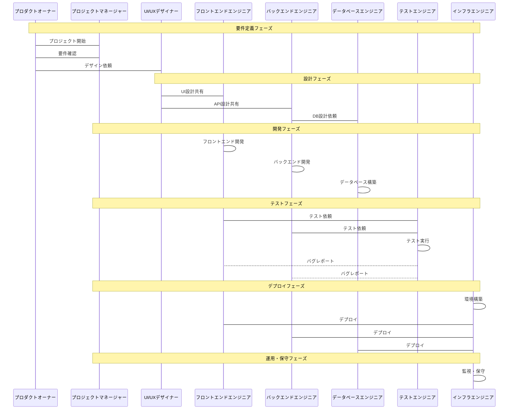
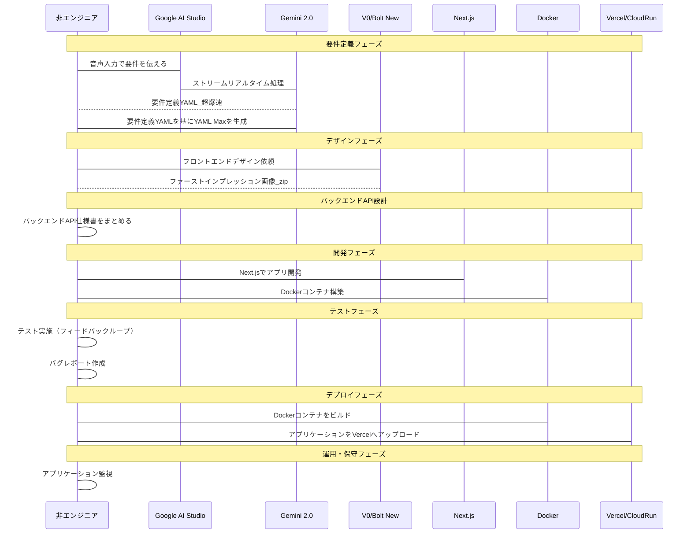

# 新時代AI駆動開発！新説”アプリ開発”はこう変わる！[龍之介用]


# **▶️はじめに：**

時は来た、もう待ったなし。非エンジニアでもアプリをビルドし、公開して動かす

そんな夢のような時代が到来してしまいました。

自作ミニアプリ：


**置換proマスターultraMAX Ver 1.0.2**

ZOOMの文字起こしとか誤字脱字多くて、議事録プロンプト通しても、上手に言葉が生成されない。そんな文字を置換する事だけに特化したミニアプリ。全員で数ヶ月運用すると、置換辞書がたまっていく事で、一撃で綺麗になります。


**LoRA画像生成 Ver1.0.1**

自身をAIアバター化が可能なアバター技術、海外のサイトのやり方を、社員に伝達するのに四苦八苦したので、APIとドキュメントをAIにわたし要件定義したら、簡単日本語での画像変換サイトができました。

これ以外にも30本以上、業務に活用できそうなミニアプリを30本以上量産してきました。この作成手順、環境づくり、世界最速のトレンドを本研修で余す所なく!?・・・

否、それは無理です。

もはや情報が広がりすぎてて、無数にあり、全部は無理すぎる！😭

故に

超初心者が！

非エンジニアが！！

コードも一文もかけない人間が！！！

最低限知らねばならない箇所、ショートカットできる内容に、フォーカスをあてて一気にお知らせします。

<aside>
💡

今回[パイロット運用]として、個人の責任下において実践いただく講習とし、法人格として業務アプリの生成などを保証するものではございません。どうかその点ご理解願います。

</aside>

---

# ▶️前提AI知識レベル:

✅前提条件:

- **(佐藤の)プロンプトエンジニアリング入門/初級はクリアレベル**

ここ、AIリテラシーレベルはもはや全員に合わせられません。

最低限の理解がシンクロしてないと、初心者にあわせられるものではないと理解願います。なので基本

- **AIサービス複数常用者**
- **自学自習できるマインドMAXな人**
- **「忙しくてできなかった」と言い訳しない人**

を前提条件にさせていただきます。

ですが

個人向けには展開していないので

最低限以下の**[2時間30分]は視聴**、一人で読解できるレベルでお願いします。

⚠️もうだいぶ古いので、刷新しないといけないレベルです。そこはすみません。

入門：

[【入門編】ChatGPT入門講座の極意！無料版でも使える驚きのテクニック](https://tanren.jp/blog/chatgpt-course-series_introduction)

初級：

[【初級編】ChatGPT初級講座の秘訣！有償版で解放される全知全能の性能](https://tanren.jp/blog/chatgpt-course-series_beginner)

番外：

[【番外編】ChatGPT講座の番外編！インプットの時代は終了！？これがAI時代の反転学習](https://tanren.jp/blog/chatgpt-course-series_flipped-learning)

　AIリテラシー）

**※テキストがすべてだ、大量のテキストをあやつる事ができれば、なんでも作れる。**

**※AIエージェントを[作る]側に回るには、プロンプトエンジニアリングは必須スキル**

**※音声入力の爆速入力なくして、長文プロンプト処理は不可**

**※LLMの性能差をしる（コンテキストウィンドウ、In/Out）**

**※AIの底力を知る（人類超えの作業効率）**

このあたりを知ってるわかってる、仕組みを理解してるが再確認事項

LLM性能に精通しましょう。

激しいランキング競争になってます。

**👑[Chatbot Arena](https://lmarena.ai/)**

2025/02/21 現在


1月から変わらず平均的には

Gemini モデルが最強

注視すべきは

**Grok3**が一気に世界TOP、ただまだAPI活用例として声は薄く実力は怪しい（私見）

ChatGPTの**GPT-4o[0129]**が一気にランキングを上げてます

**半年前のモデルはもはやすべて[1300以下のスコア]で、ランキング外です**

2024/06/14時点


重要なのは[主要のAIサービス]＝[LLMモデル]が超絶進化してる事です。

**[GPT-4o 0129]、[Gemini 2.0 Pro]、[Claude 3.5 Sonnet v2]**の3つのAIモデルを比較した表を作成しました。以下の表で、これらのモデルの主な特徴、性能、機能を比較しています。

※おまけに[o1-full][o3-mini]も追加可能ですが、変動要素が大きく[+Deep Research] 今年トレンドとして単純なベース性能だけで語らえなくなってきました。

| 特徴 | **GPT-4o
[0129]** | o3-mini-High**[New]** | o1 pro | **Claude 3.5 Sonnet [v2]** | **Gemini 2.0 pro exp [0205]** | **Gemini 2.0 flash [0205]** |
| --- | --- | --- | --- | --- | --- | --- |
| 開発元 | OpenAI | OpenAI | OpenAI | Anthropic | Google | Google |
| マルチモーダル機能 | テキスト、画像、ファイル入出力 | テキスト、画像(New) | テキスト、[画像(new)] | テキスト、画像、ファイル入出力 | テキスト、画像、**音声、動画**の入出力 | テキスト、画像、**音声、動画**の入出力 |
| コンテキスト
ウィンドウ | 128K トークン
出力16K | 200K トークン**出力100K** | 200K トークン
**出力100K** | 200K トークン
出力8K | **2M トークン**
出力8K | **1M トークン**
出力8K |
| 処理速度 | 高速 | 早い | 遅い | 普通 | 早い | 高速 |
| 性能 | ⭐️⭐️⭐️⭐️
[4.7] | ⭐️⭐️⭐️⭐️⭐️
[4.8] | ⭐️⭐️⭐️⭐️⭐️
[5.0] | ⭐️⭐️⭐️⭐️
[4.5] | ⭐️⭐️⭐️⭐️⭐️
[4.9] | ⭐️⭐️⭐️⭐️⭐️
[4.7] |
| 特殊機能 | GPT’s機能でストアにカスタムGPT公開可能 | Deep Researchなどを組み合わせると異次元性能 | 推論性能爆上がりした事で、IQ147まで到達 | Artifacts機能（コード生成・編集） | 長時間の動画や大量のテキスト処理 | 爆速応答や豊富なオプション操作 |
| API
開発コスト
効率
**[サブスクは関係なし]** | $5.00 /
1M input tokens
$15.00 /
1M output tokens | **$1.10 /**
1M input tokens
**$4.40 /**
1M output tokens | まだ未提供 | $3.00 /
1M input tokens
$15.00 /
1M output tokens | まだ未提供 | **$0.10/**
1M input tokens
**$0.40 /**
1M output tokens |
| 知識カットオフ | 2024年6月 | 2023年10月 | 2023年10月 | 2024年4月 | 2024年8月 | 2024年8月 |

※2025/02/16 更新

研修ではGemini 2.0 pro , Claude 3.5 sonnet v2 をベースに構築します(コスパ）

特にコンテキストウィンドウなど、各モデルの特徴、API価格。など頭に入ってる状態が望ましいです。

---

# ▶️ゴール/目的:

ーーまずはゴール設定です

- **手元のDev環境（開発環境）では完璧に動く**
- **ローカル環境で、イメージを具現化**
- **しっかり動作し、成果物がだせてプレゼン出来る所まで**
- **社内／社外のエンジニアにソースコード渡せるレベルに綺麗なコード**
- **最悪自分一人の業務効率が上がる**

最も現実的なイメージは

- 非エンジニアが顧客/社内外の依頼を言語化し、たてたイメージを自身の手で具現化する

↓

- 最低限のフロント／バックエンドまで実装し、動作するモデルを作り、プレゼンできるようになる

↓

ここで社内外のPro職人との会話が

**異次元レベルで疎通し合えることになる**

〜〜〜〜〜〜〜〜〜〜〜〜〜〜〜〜〜〜

が狙いです

覚えておけば

「全てSaas要らなくなる。ウェーイ！」

は今んところ想定してません。

そこまではいずれできるが、今は“0”です。

ただ、手を動かす過程で

色々未来が読めるようになる

これが副産物

ここは自分の手で動かした人じゃないと

見えない領域があります

これは佐藤節

ーー故に目的は

- そもそもエンジニアリングの理解とリスペクトを非エンジニアを持とう。
- コミュニケーションのミスを無くそう（水と油な関係だった）
- Dev(ローカル)で動いた、と、デブロイ(Web)で動いたは、そこそこ習得レベル差があります
- ようやく動いたとして、数百、数千人で動かすレベルはセキュリティ、保守メンテの観点で、Proの領域なので、お一人でなんでもってのは高望みです。

その点、重々理解の上でお願いします。

---

# ▶️準備事項:

ここまで前置きしてようやく本題です。

以下のリンクから必要なアプリを、サービスを新規登録・ログインしておいてください。

**大前提：**

後述でもしますが[Google AI Studio]&[NotebookLM]が勉強には最適です

特に[Stream Realtime]をヘビーに活用するので、真っ先に覚えてください。

[https://aistudio.google.com/app/live](https://aistudio.google.com/app/live)


＆

NotebookLM（できればWork space/Oneに入ってると望ましいPlusが利用できる）

いったん無料でOK趣旨が伝わればOK、リテラシーが上がれば代替え案もあり

[https://notebooklm.google.com/](https://notebooklm.google.com/)


活用の初歩はnoteでもYoutubeでもいっぱいあるので

Google AI Studio をYoutubeで学ぶ

[www.youtube.com](https://www.youtube.com/results?search_query=Google+AI+Studio)

NotebookLM をYoutubeで学ぶ

[www.youtube.com](https://www.youtube.com/results?search_query=NotebookLM)

**使える状態になってれば**とりあえずOKです。

## ✅佐藤の超基礎技：

[https://youtu.be/DyruSVRgOFQ](https://youtu.be/DyruSVRgOFQ)

[https://x.com/jrpj2010/status/1866943647515820213](https://x.com/jrpj2010/status/1866943647515820213)

あらゆるテキストファイルを構築する上でも

Google検索連動で探す、文章を構造化し構成する

これが基本です。

実はこの成果物[blog]は、あらゆるものへ派生できます

今回のAI駆動開発で最も重要な

- 要件定義書
- RAG文章のためにマークダウン化、JSON化、JSONL化

にもあっさりです。

作りたいアプリのイメージを[Blog化するまで]

Youtubeみて頑張ってみてください。

できたら

↓

そのスレッド最後に＋魔法をかけます。

promptとしてコピペor（＝音声入力で喋る）：

```markdown
以上、このスレッドすべてを再度理解した上で
これからAI駆動開発をしていきます。
デブロイ先：Vercel
フレームワーク：Next.js
言語：java Script
大前提にして
フロント開発、バックエンド開発でビルドし、デブロイ先環境まで考慮して
必要再現のMVPを達成する、もっとも綺麗なコードを
要件定義.yamlとして組み上げてください
必ず先祖帰りしないように、バージョン管理のドキュメント都度更新する事
これ結構大事なんで復唱します
必ず先祖帰りしないように、バージョン管理のドキュメント都度更新する事
理解したら処理して実行
```

実演；

[https://vimeo.com/1059005804/be326454a3?share=copy](https://vimeo.com/1059005804/be326454a3?share=copy)

[https://vimeo.com/1059005804/be326454a3?share=copy](https://vimeo.com/1059005804/be326454a3?share=copy)

マスターすれば

この先のインストール作業や

不明な単語、全部しらべ尽くせます。

**超重要です。**

真っ先にモノにしてください

---

## ✅インストールもの関連：

<aside>
💡

すべて[▶️]トゴル内に格納してます

</aside>

### IDE(Integrated Development Environment)統合開発環境

- VScode[推奨] , Cursor/Windsurf[サブ]
- 準備方法
    
    以下、リンク先から進んでDL、インストール完了させてください。
    
    ※初期の講座の為のセットアップ箇所は後述します
    
    [**Visual Studio Code](https://azure.microsoft.com/ja-jp/products/visual-studio-code)　[メインです必須で入れてください]**
    
    
    
    [Cursor](https://www.cursor.com/ja)　**[サブです必須で入れてください]**
    
    
    
    [Windsurf](https://codeium.com/windsurf)　**[サブサブです任意で入れてください]**
    
    
    

### AI agent[拡張機能]

- RooCline
- Cline [サブ]
- 準備方法
    
    以下、リンク先から進んでDL、インストール完了させてください。
    
    ※初期の講座の為のセットアップ箇所は後述します
    
    Vscodeがインストールされてる状態から
    
    
    
    ロケットの左の４つのブロックマークが
    
    [拡張機能]なので
    
    ここから
    
    [Roo Code]を選択して[インストール]
    
    
    
    このロケットアイコンの子が常駐したらOKです
    
    詳細な設定は後述
    

### サブスク

- GithubCopilot[有償/10ドル][任意]
- 準備方法
    
    
    
    [https://docs.github.com/ja/copilot/about-github-copilot/what-is-github-copilot](https://docs.github.com/ja/copilot/about-github-copilot/what-is-github-copilot)
    
    まずはFreeを契約した上で
    
    有償化へ個人は10ドル
    
    これで sonnet 3.5 pro v2が使い放題がでかい
    
    ※Cursor 20ドルに課金しても使い放題。
    
    ※**講座では無料のGemini 2.0 pro を利用。**
    

### AIプロバイダー

- **[New!!]**Claude3.7 sonnet [メインとしたい・・・超高性能,GC放題]
- Genini2.0 Pro[サブ,今無料]
- o3-mini [サブサブ,GC放題]]
- 準備方法
    
    Google AI Studioを利用
    
    
    
    [https://aistudio.google.com/app/live?pli=1](https://aistudio.google.com/app/live?pli=1)
    
    API-Keyを取得
    
    
    
    ↓
    
    
    
    このKeyを使う事で
    
    １分間に2回のコールが可能
    
    ※学習に利用されます。コアなアプリを作る（ソースロジックが学習される）
    
    →とはいえ、そんなコアアプリを作ることもできないので、ミニアプリならいいのでは？
    
    →不可ならばAzure OpenAI Serviceキーを取得するなど、他の学習なしキーで行う。
    
    ↓
    
    
    
    ↓[支払い情報を設定]からクレカ登録。
    
    ↓クーポンが出るはずなので300ドルチャージ
    
    
    
    
    

### 開発アプリ

- Webアプリ
- 準備方法
    
    iOSや、Andoridなど、アプリ開発はしません。
    
    Win,Macのインストール型も開発しません。
    
    クラウドベースのWebアプリです。
    
    デザイン工夫で #レスポンシブ 対応を指示することで
    
    モバイルブラウザで最適化の指示はだせるので、それでモバイル対応ですが
    
    あまり要件に組み込まない方がイージーです。（初回は）
    

### フロントエンド/バックエンド

- Next.js(react/Type)
- 準備方法
    
    
    
    [https://www.skygroup.jp/media/article/3309/](https://www.skygroup.jp/media/article/3309/)
    
    基本的に事は、AIに聞いてください
    
    ```markdown
    フロントエンド/バックエンドの違い
    
    そして
    これが違うというのなら
    同一言語で開発できるのはなに？
    素人におすすめの開発フレームワーク
    ```
    
    初学者が悩む最大の悩みの一つがなんの言語で開発すべきか？
    
    結論：フロントもバックも統一言語[JavaScript]であればよし
    
    その１点で[Next.js]が最もAI駆動開発に適してると佐藤は結論ずけました。
    
    これもそのままAIに聞いてください
    
    ```markdown
    テーマ：AI駆動開発で、フルスタック開発に非エンジニアが挑む
    #解説
    初学者が悩む最大の悩みの一つがなんの言語で開発すべきか？
    結論：フロントもバックも統一言語[JavaScript]であればよし
    その１点で[Next.js]が最もAI駆動開発に適してると講師佐藤は結論ずけたといってます。
    なぜ？
    ```
    

### コンテナ

- Docker
- 準備方法
    
    
    
    [https://www.docker.com/ja-jp/](https://www.docker.com/ja-jp/)
    
    初回講座に入れるべきか悩むところですが
    
    コンテナ技術を知らないと、最終的にデプロイ時に
    
    皆等しく困るので、知っておいた方がいい前提で追加しました。
    
    
    
    [https://blogs.itmedia.co.jp/itsolutionjuku/2015/05/docker.html](https://blogs.itmedia.co.jp/itsolutionjuku/2015/05/docker.html)
    
    IDEの拡張から入れます
    
    VScodeの拡張機能で[Docker]を検索→インストール
    
    
    
    VScodeの拡張機能で[Dev Containers]を検索→インストール
    
    
    
    Docker Desktopを入れます
    
    
    
    [https://docs.docker.com/get-started/get-docker/](https://docs.docker.com/get-started/get-docker/?_gl=1*x7odgo*_gcl_au*MzA1MDUzMzk3LjE3NDAxMTE1Njk.*_ga*MTU5NDE0OTc4OC4xNzQwMTExNTY5*_ga_XJWPQMJYHQ*MTc0MDIwNDY3NC41LjEuMTc0MDIwNTA5NS42MC4wLjA)
    
    ご自身のPCスペックあったVerをインストール
    
    初回講座の時にやりますがフォルダ構造を初回に定義する事が肝要です
    
    
    
    作業フォルダを作り
    
    これを[ルートフォルダ]として定義し
    
    /Users/jrpj2010/ai-dev-tanren
    
    この位置をAIに指示出して、初回のフォルダ区分けを定義する
    
    
    
    [RooCode]の[setting]で[Gemini]を指定する。
    
    モデルは
    
    [gemini-2.0-pro-exp-02-05]を選択
    
    その上で初回つぶやきを以下の通りする
    
    パス名は各々のPC環境に依存する
    
    
    
    ```markdown
    # 開発するルートフォルダの位置をパス名で指定する:
    /Users/jrpj2010/ai-dev-tanren
    
    ---
    
    上記のパスコードの箇所に
    
    # 全体概要:
    本プロジェクトは、クラウドベースのWebアプリ開発を対象とし、以下の要素を統合した環境を構築します。  
    
    - IDE・拡張機能のインストール: VS Code
    - サブスクリプション: Github Copilot  
    - AIプロバイダー: Genini2.0 Pro、Claude3.5 sonnet v2、o3-mini-High 等  
    - フロントエンド/バックエンド統一: Next.js / React / TypeScript  
    - コンテナ技術による依存関係のクリーンな管理: Docker  
    - DB/認証: Supabase  
    - ソース管理: Git/Github
    - 最終的なデプロイ: Vercelで実施  
    
    # ディレクトリ・フォルダ構成:
    以下のフォルダ構成を基本として、各サービス間の依存関係が明確になるように設定してください。
    
    1. **ルートフォルダ・ルートディレクトリ**
       - `ai-dev-tanren`とUserはフォルダを作成しており、その配下にファイルを展開する事
       - `README.md`、`.gitignore`など基本情報の配置
    
    2. **docker/**
       - `Dockerfile`（マルチステージビルドを活用）
       - `docker-compose.yml`（必要なサービス間のオーケストレーション設定）
       - コンテナ起動用のシェルスクリプトや各種設定ファイル
    
    3. **src/**
       - Next.jsを中心としたWebアプリのソースコード
       - 必要に応じたサブディレクトリ（例：`components/`、`pages/`、`styles/`など）
    
    4. **config/**
       - 各環境（開発、ステージング、本番）の設定ファイル（例：`dev.env`、`prod.env`など）
       - DB接続、APIキーなどの依存関係を明示的に管理
    
    5. **tests/**
       - ユニットテストや統合テストのコード、テスト実行用の設定
    
    6. **docs/**
       - プロジェクト全体の設計書、API仕様書、セットアップ手順などのドキュメント
    
    7. **scripts/**
       - 初期セットアップ、ビルド、デプロイを自動化するスクリプト
    
    # 最終指示:
    
    上記の各要素とディレクトリ構成を踏まえて、  
    依存関係が明確で、どの環境でもクリーンにアプリの開発・ビルド・デプロイが可能なフォルダ構成を定義し、生成してください。
    アプリ開発する上で、美しいフォルダ構造を実現してください
    
    ```
    
    ↓
    
    これで環境スタート準備が整うので
    
    [Run Command]
    
    
    
    この全自動/半自動実行がAI駆動開発の醍醐味
    
    ↓
    
    完了するまでポチポチおしていきながら待機
    
    
    
    ↓
    
    mac:ファインダー
    
    win:エクスプローラーでのぞくと
    
    
    
    フォルダ構造が出来上がってる
    
    これに準じた形でアプリを構築していくと
    
    依存関係がお任せ出来上がっていくのでクリーンな開発が可能
    （という理想論、現実はもろくもかなりの確率で破壊されていきます）
    
    なので
    
    つど
    
    ```markdown
    美しいフォルダ構造を保ちながら、新しいアプリをビルドしきますので
    [User]側に指示を出していってください。
    それに従います。
    常に美しいフォルダ構成で[Docker][Next.js]での構築に最適化してください
    ```
    

### DB/認証

- supabase
- 準備方法
    
    
    
    [https://supabase.com/](https://supabase.com/)
    
    DB・認証も本当に様々。バックエンドを理解するのは素人には時間かかるので
    
    スタートアップに人気の高いこの子を選択します。
    
    アカウント取得までやっておくと、レベルが上げられる人は次点で開発するにちょうどいい難易度です。
    
    ※研修では難易度あがるので、パスする予定です
    
    [Supabaseとは？機能や特徴・製品の概要まとめ](https://findy-tools.io/products/supabase/32)
    

### ソース管理

- Git → Github
- 準備方法
    
    
    
    [https://github.co.jp/](https://github.co.jp/)
    
    全開発者の叡智がここに集結してる、ソースコード管理のクラウド保管場所
    
    必ず、サインアップしてアカウント取得を
    
    Google認証並みに、フルスタック開発すると至るところで
    
    GitHub認証場所あり、取得しておいた方が早い。
    
    
    
    ↓
    
    ログインできたら
    
    [アカウントページがわかるように]
    
    [jrpj2010 - Overview](https://github.com/jrpj2010)
    
    自身で開発したアプリをGithubにアップする事で
    
    最終目的のサーバーにアップする事が簡単に・・・（とはまだいえないが）
    
    割とわかりやすくシンクロします。
    
    基本知識；
    
    
    
    [https://closet-land.com/git/git-github/](https://closet-land.com/git/git-github/)
    
    Gitがそもそものローカルバージョン管理システム、手元でソース・バージョン管理
    
    GitHubがそれのWEB版。
    
    完成品をクラウドアップして、より世界中にアクセスさせるソース管理
    
    ここまで覚えれば
    
    それ以上は素人にはいったん不要！大丈夫！とおもいたい。
    
    Google で画像検索が早い
    
    [git github 違い - Google Search](https://www.google.com/search?sa=X&sca_esv=be29cc62fc8e0244&udm=2&sxsrf=AHTn8zrbO-gXKkrnsf-sr5ON_VQOejiT3w:1740146688417&q=git+github+%E9%81%95%E3%81%84&stick=H4sIAAAAAAAAAFvEKpieWaIAxBmlSQovG6c-bmwBAPBAKUQUAAAA&source=univ&ved=2ahUKEwjukOHJ99SLAxWghq8BHeDFCEYQrNwCegUIhAEQAA&biw=1798&bih=1010&dpr=1#vhid=-GLVHemPzDgJyM&vssid=mosaic)
    

### デプロイ

- Vercel [メイン/サーバーレス型]
- Claud Run[サブ/Expressサーバーで常時起動型]
- 準備方法
    
    [https://vercel.com/](https://vercel.com/)
    
    
    
    最終的に”デプロイ（アプリ公開）”をするのに、どこのサーバーにアップすべきか？
    
    Azure？AWS？GoogleCloud？
    
    お金かかるし、セキュリティガチンコに？
    
    素人には難解ですね。Proに任せましょう
    
    ミニアプリを簡単にアップできるのはAI界隈でも人気の高い
    
    v0 [https://v0.dev/](https://v0.dev/)
    
    
    
    を提供してる。[vercel](http://vercel.com/) がもっとも簡単だと決めつけました。
    
    AI駆動開発をやるフルスタックエンジニアからはとても人気
    
    その理由は二つ
    
    - 無料でも相当使える
    - Github連携がとても簡単
    
    この２点が理由で、初学者の”デプロイ”作業がかろうじて簡単と言えるレベルになってます。
    

---

# ▶️提供レベルステージ:

**Lv1. ローカルDev開発(デプロイなし)**

↑

ここセキュリティ鑑みて

切り離して考えてます。

本勉強会は２時間の枠でできるのはLv１まででしょう

Lv2やるかは開催後、アンケートとって考えますね！

↓

**Lv2. デプロイあり、認証/DBなし**

Lv3. デプロイあり、**認証あり、DBあり [ここでレベルが猛烈に上がる]**

ここまで

事前に確認願います！

---

# ▶️本番講義資料：

当日まで事前鍛錬させていただきましょう。

超簡単につくれそうなアプリを・・・

まずはイメージする（要件定義書をたくさん作る）


#日々是鍛錬

---

**本編[**事前鍛錬]**：**

# ▶️企画アイディアだし：

[Google AI Studio] の[Steram RealTime]で問い詰めていきます・・・

↓初回プロンプト

```markdown
```

# ai-dev-tanren

## 全体概要

本プロジェクトは、クラウドベースのWebアプリ開発を対象とし、以下の要素を統合した環境を構築します。

- IDE・拡張機能のインストール: VS Code
- サブスクリプション: Github Copilot
- AIプロバイダー: Genini2.0 Pro、Claude3.7 sonnet、o3-mini-High 等
- フロントエンド/バックエンド統一: Next.js / React / TypeScript
- コンテナ技術による依存関係のクリーンな管理: Docker
- DB/認証: Supabase
- ソース管理: Git/Github
- 最終的なデプロイ: Vercelで実施

## ディレクトリ・フォルダ構成

1.  **ルートフォルダ・ルートディレクトリ**
    - `ai-dev-tanren`
    - `README.md`、`.gitignore`など基本情報の配置

2.  **docker/**
    - `Dockerfile`（マルチステージビルドを活用）
    - `docker-compose.yml`（必要なサービス間のオーケストレーション設定）
    - コンテナ起動用のシェルスクリプトや各種設定ファイル

3.  **src/**
    - Next.jsを中心としたWebアプリのソースコード
    - 必要に応じたサブディレクトリ（例：`components/`、`pages/`、`styles/`など）

4.  **config/**
    - 各環境（開発、ステージング、本番）の設定ファイル（例：`dev.env`、`prod.env`など）
    - DB接続、APIキーなどの依存関係を明示的に管理

5.  **tests/**
    - ユニットテストや統合テストのコード、テスト実行用の設定

6.  **docs/**
    - プロジェクト全体の設計書、API仕様書、セットアップ手順などのドキュメント

7.  **scripts/**
    - 初期セットアップ、ビルド、デプロイを自動化するスクリプト

```

---

上記を参照した場合に最も簡単に構築できるビジネスアプリアイディアを
30個テーブル表で出してください

なによりもMVPまで最短で進む
フロントエンド開発に比重をおきます

バックエンドはAIを活用したWEBアプリの企画でお願いします
ゴールシークプロンプトをベースにした
プロンプトも生成してもらう事を前提に考えた要件定義を実施してもらいます
```

↓ アイディアをネリネリする

↓ 要件定義.yamlまで

↓ 意見交換をしていき、１つに絞り込みましょう


↓　一撃目のざっくり要件定義

```markdown
アプリ名（最終案）：テキストde顧客ペルソナ分析
コンセプト
テキストをコピペするだけで、AIが非構造化文章から顧客に関する情報を抽出し、フレームワークに沿って分析、ペルソナを生成するアプリです。

基本機能（最終案）
テキスト入力

長文テキスト（IR資料、HPデータなど）をコピペで入力

最大文字数制限: 数万文字程度

顧客情報抽出

AIがテキストから顧客に関する情報（属性、ニーズ、課題、価値観、行動など）を抽出

自然言語処理（NLP）とAIモデルを活用

固有表現抽出、感情分析、ニーズ・課題抽出、行動抽出、価値観抽出

ペルソナ自動生成

抽出された情報を基に、AIが主要なペルソナ候補を自動生成（最大3つ程度）

意味解析に基づいてペルソナを生成

ペルソナ概要表示

各ペルソナの基本情報（属性、ニーズ、課題、価値観）を要約表示

ペルソナ名（自動生成）、属性、主なニーズ、課題、価値観などを表示

フレームワーク分析

各ペルソナに対して、特定のフレームワーク（例: SWOT分析、カスタマージャーニー）に沿った分析結果を表示

AIがフレームワークに基づいて情報を整理、分析

詳細機能と技術要素（最終案）
テキスト入力
長文テキスト入力用のテキストエリアを提供

文字数制限: 数万文字程度 (詳細な数値は実装時に決定)

顧客情報抽出
自然言語処理:

テキストをトークン化、品詞分解、構文解析

固有表現抽出:

顧客に関わるキーワード（年齢、性別、企業名、役職、興味、商品名など）を抽出

感情分析:

テキスト全体の感情をポジティブ/ネガティブ/ニュートラルで判定

ニーズ・課題抽出:

テキストから、顧客が求めるものや抱える問題を示唆する表現を抽出

行動抽出:

顧客の行動を推測できる表現を抽出 (例: 「〇〇を検討している」「〇〇を利用している」)

価値観抽出:

顧客の価値観や信念を示唆する表現を抽出 (例: 「環境を重視している」「最新技術に関心がある」)

ペルソナ自動生成
意味解析:

抽出した情報をベクトル化し、意味的に関連性の高い情報をグループ化

ペルソナ定義:

各グループの特徴からペルソナの属性を定義 (例: 年齢層、性別、興味関心)

ペルソナ概要生成:

AIが各ペルソナの概要を説明するテキストを生成し、ペルソナ名として利用

ペルソナ概要表示
テーブル表示:

ペルソナの一覧をテーブル形式で表示

ペルソナ詳細表示:

特定のペルソナを選択すると、詳細な情報を表示

要約された属性、ニーズ、課題、価値観を表示

フレームワーク分析
フレームワーク選択:

SWOT分析、カスタマージャーニー、5つの力分析など、複数のフレームワークから選択可能

分析結果表示:

選択したフレームワークに基づいて情報を整理

SWOT分析の場合、強み、弱み、機会、脅威をそれぞれのペルソナに対して提示

カスタマージャーニーの場合、各フェーズにおける顧客の感情や課題を提示

技術スタック（最終案）
フロントエンド:

React, Next.js, TypeScript (簡略化)

バックエンド:

Node.js, Python (AIモデル用)

データベース:

Supabase (PostgreSQLベース、最小構成)

AIプロバイダー:

Gemini, Claude, o3-mini-High (テキスト分析, ペルソナ生成, フレームワーク分析に特化)

コンテナ化:

Docker (開発環境のみ)

デプロイ:

Vercel (最小構成)

ゴールシークプロンプト例（最終案）
「このテキストから、顧客に関する情報を抽出し、主要なペルソナを3つ生成してください。」

「生成されたペルソナの概要を教えてください。特にニーズと課題を知りたいです。」

「ペルソナ[名前]に対して、[フレームワーク]で分析した結果を表示してください。」

「このテキストから、顧客の価値観を抽出してください。」

「このテキストから、顧客の行動を推測できる情報を抽出してください。」

「このテキストを基に、カスタマージャーニーを生成してください。」

「このテキストを基に、SWOT分析を実施してください。」

このアプリの価値（最終案）
柔軟なデータ入力: テキストコピペだけで、様々な形式のデータを分析可能。

非構造化データ活用: IR資料やHPデータなど、非構造化データから顧客情報を抽出。

AIによるコンテキスト理解: AIが文章の文脈を理解し、正確な情報抽出をサポート。

フレームワーク分析: 既存のビジネスフレームワークに基づいて、顧客情報を分析。

早期リリースとフィードバック: MVPとして早期にリリースし、ユーザーからのフィードバックを基に機能改善。

シンプルなUI/UX: 直感的で使いやすいUI/UXで、誰でも簡単に利用可能
```

例：

こういった[要件定義書]を量産しておくと後が楽です。

仮に実装がうまくいかなくとも

AI駆動開発のトレンドから、必ず次世代LLMが解決すると考えるので、

Notionなどでアプリ企画フォルダ（あるいはDBタグ）作って、企画管理すると良きでしょう。

↓これを[要件定義max.yamlプロンプト(仮)]でさらに細分化して言語化する

⚠️正直、以下の[細分化]がよりいい方面に作用してるかは**研究中です**

- [要件定義max.yamlプロンプト(仮)]
    
    Google AI Studio [System interaction]に入れて機能させる
    
    ```markdown
    prompt:
    # Universal YAML Requirements Definition Prompt  This prompt is designed to **collect all necessary requirements and output a complete YAML** representation of a project in one go. It is a general-purpose template that can be adapted to *any project domain*, helping engineers achieve an MVP without confusion. The prompt guides an AI (e.g. Claude 3.5 Sonnet) through the full development lifecycle – from capturing the initial purpose to producing a final YAML specification – assuming a typical environment (for example, CentOS 9 with Node.js) for AI-driven development. The result will be a **fully formatted YAML** that an engineer can use directly with minimal or no modifications. It imposes no strict constraints on content, allowing flexible customization for different needs.  ## Phase 1: Requirements Definition   In the first phase, the prompt gathers high-level context and user needs. It should cover:    - **Purpose** – A brief statement of the project’s goal or the problem it aims to solve.   - **Scope** – The boundary of the solution, i.e. what’s included (and possibly what’s *out of scope* for the MVP).   - **Users** – The target end-users or stakeholders of the system (who will use or benefit from it).   - **Current Analysis** – An analysis of the current situation or pain points (e.g. existing solutions, gaps, or motivations for this project).   - **Requirements Collection** – A summarized list of all collected needs or requests from stakeholders. These can be bullet points of desired features or outcomes.    *In the prompt, you will ask for or include each of the above items. By clearly specifying Purpose, Scope, Users, etc., the AI will understand the context and **what needs to be accomplished**. For example:*
    
    markdown
    **Requirements Definition:**  
    - Purpose: *"<project purpose>"*  
    - Scope: *"<what the project will cover>"*  
    - Users: *"<who will use it>"*  
    - Current Analysis: *"<current problems or opportunities>"*  
    - Collected Requirements: *"<list of key needs or features>"*
    
    *(The italicized placeholders should be replaced with your project’s specifics.)* This structured format ensures no fundamental aspect is missed during requirement gathering.  ## Phase 2: Requirements Specification   Next, the prompt details the requirements in a more structured form, distinguishing between functional aspects and other considerations. It should include:    - **Functional Requirements** – A list of specific functionalities or features the system must have. Each should be clear and testable (for an MVP, stick to the core features only).   - **Non-functional Requirements** – Criteria not tied to specific functionality, such as performance benchmarks, security standards, usability needs, or compliance. This can also include environment constraints (e.g. “must run on CentOS 9 and Node.js”) and other quality attributes.   - **Information Structure** – An outline of how information in the system is organized. This may include key data entities and relationships or an overview of data flow. Essentially, it captures the **data model** or content architecture that the YAML will later represent.   - **Constraints** – Any additional constraints or conditions, such as deadlines, budget limits, technological restrictions, or third-party integrations. (If the project has to use certain frameworks or an AI model, note it here. For example, “use XYZ API” or “follow ABC standard”.)    *In the prompt, list these clearly. For example:*
    markdown
    **Requirements Specification:**  
    - Functional Requirements: *"<bullet list of essential functions/features>"*  
    - Non-functional Requirements: *"<bullet list of performance, security, UX, or platform requirements (e.g. OS, language)>"*  
    - Information Structure: *"<description of data model or key information elements>"*  
    - Constraints: *"<any technical or business constraints>"*
    
    This breakdown helps the AI distinguish core features from supporting requirements, and understand the context (like the tech stack or performance needs) in which the solution must operate. Keeping the lists brief and focused on the MVP ensures the generated YAML is concise and relevant.  ## Phase 3: Design   In the final phase, the prompt guides the AI to design the YAML schema and produce the output. It involves:    - **YAML Schema Design** – Instruct the AI to decide how to structure the YAML file to represent all the above information. This includes choosing logical keys, nesting, and formatting. (For example, it might create top-level sections for “requirements” and “specifications”, or group related items together.) The schema should be human-readable and easy to navigate, reflecting the categories from Phase 1 and 2.   - **Format Selection** – Emphasize using **YAML** as the output format (since YAML is required). If there are any format preferences (indentation, use of lists vs. dictionaries, etc.), mention them. By default, 2-space indentation and clear key names should be used for readability.   - **Sample YAML Creation** – Finally, direct the AI to populate the YAML structure with the project’s details from Phases 1 and 2. The prompt should make it clear that the final answer **must be a complete and valid YAML** document including all relevant information. Ideally, have the AI present it as a fenced code block (for clarity) with the yaml syntax tag for proper formatting. The YAML should be ready for use (e.g. can be saved to a .yaml file) without further editing.    To ensure the output is just YAML with no extra commentary, you can explicitly instruct the AI, for example: *“Provide the final requirements specification as a YAML-formatted document only, without additional explanation.”* This encourages the model to produce a clean YAML output.  ### YAML Schema and Output Structure   When designing the schema, the AI will use the categories from previous phases as keys or sections. For a general and flexible solution, the YAML could be structured like this:
    yaml
    project: "<Project Name or Identifier>"  
    requirements_definition:  
      purpose: "<Purpose of the project>"  
      scope: "<Scope of the MVP>"  
      users: "<Target users>"  
      current_analysis: "<Summary of current situation and need>"  
      collected_requirements:  
        - "<Requirement 1>"  
        - "<Requirement 2>"  
        - "<...>"  
    
    requirements_specification:  
      functional_requirements:  
        - "<Core feature 1>"  
        - "<Core feature 2>"  
        - "<...>"  
      non_functional_requirements:  
        - "<NFR 1 (e.g. performance/security)>"  
        - "<NFR 2>"  
        - "<...>"  
      information_structure: "<Key data entities or structure description>"  
      constraints:  
        - "<Constraint 1 (e.g. Platform, technology)>"  
        - "<Constraint 2 (e.g. deadline, compliance)>"  
        - "<...>"
    *The above is a generic **schema** outline.* It groups the information into two main sections (requirements_definition and requirements_specification). This is just one possible schema – the prompt allows flexibility. For instance, you might not separate “definition” and “specification” in the YAML and instead list everything under one root if preferred. The key is to have a consistent structure that includes all the details. The **project name** (or a brief identifier) at the top is optional but can be useful to label the context of the YAML.  ### Sample YAML (Example)   To illustrate, here is a **sample YAML** filled in for a hypothetical project (for example, a **Task Tracker MVP**). This demonstrates what the final output might look like:
    yaml
    project: "TaskTracker"  
    requirements_definition:  
      purpose: "Allow users to track and manage daily tasks easily in one place."  
      scope: "A web and mobile app focusing on core to-do list features (add, edit, complete tasks)."  
      users: "Individuals and teams who need a simple task management tool."  
      current_analysis: "Many existing task apps are overly complex; target users need a lightweight solution."  
      collected_requirements:  
        - "Users can create, read, update, and delete tasks."  
        - "Users can mark tasks as completed or pending."  
        - "Tasks can be organized by categories or tags."  
    
    requirements_specification:  
      functional_requirements:  
        - "Create task with title and description."  
        - "Edit or delete an existing task."  
        - "Mark task as complete or incomplete."  
        - "Filter or categorize tasks by project or tag."  
      non_functional_requirements:  
        - "Easy to use interface with minimal clicks."  
        - "Responsive design (works on web and mobile)."  
        - "Data stored locally with option to sync to cloud."  
      information_structure: "Each task has an ID, title, description, status, and optional category; tasks are grouped by user account."  
      constraints:  
        - "Must run on CentOS 9 servers with Node.js backend."  
        - "Complete prototype within 2 months."
    This YAML captures all essential information: the purpose and scope define the vision, the user base is identified, current problems are noted, features are listed, and even platform and timeline constraints are included. An engineer or an AI agent can now take this YAML and proceed to development or further analysis. The structure is flexible – you can add more fields (for example, adding assumptions or expanding information_structure) without breaking the format.  ## Final Prompt Template (Ready to Use)   Finally, here is a **prompt template** that incorporates all the above considerations. An engineer can fill in the placeholders (or adjust the sections as needed) and use it directly in VS Code with the RooCode extension or any AI-assisted development environment. This single prompt will instruct the AI to output a complete YAML:
    
    markdown
    You are an AI assistant tasked with generating a YAML requirements specification for a project. Use the information provided below to produce a fully structured YAML document covering the project's requirements.
    
    **Requirements Definition:**  
    - Purpose: <*enter the project’s purpose*>  
    - Scope: <*enter the scope of the project’s MVP*>  
    - Users: <*who will use this project?*>  
    - Current Analysis: <*briefly describe the current situation or problem*>  
    - Collected Requirements:  
      - <*requirement 1*>  
      - <*requirement 2*>  
      - <*...*>  
    
    **Requirements Specification:**  
    - Functional Requirements:  
      - <*functional requirement 1*>  
      - <*functional requirement 2*>  
      - <*...*>  
    - Non-functional Requirements:  
      - <*non-functional requirement 1*>  
      - <*non-functional requirement 2*>  
      - <*...*>  
    - Information Structure: <*describe key data structures or relationships*>  
    - Constraints:  
      - <*constraint 1 (e.g. environment, deadline)*>  
      - <*constraint 2*>  
    
    **Design & Output:**  
    Using the above details, design an appropriate YAML schema to capture all the information. Then **output the complete requirements in YAML format**. The YAML should include all sections from Requirements Definition and Requirements Specification, structured clearly (you may introduce logical grouping or keys as needed). 
    
    Provide the final answer **as a YAML code block only**, with proper indentation and without additional explanation or commentary.
    
    **How to use this template:** Replace the italicized placeholder text (between <* ... *>) with your project-specific details. Once filled in, submit the prompt to the AI. The AI will then respond with a fully populated YAML document. Thanks to the structured prompt, the output should be well-organized and immediately usable.   ---  By following this prompt design, an engineer can quickly get a comprehensive YAML representation of their project's requirements. The prompt covers every phase from initial idea to design, ensuring that the resulting YAML is **complete, well-structured, and tailored to the project’s needs**, all achieved in a single AI interaction.   
    
    ---
    
    上記を理解したらUserの要望を.yaml化する
    ```
    

↓

```markdown
```yaml

project: "テキストde顧客ペルソナ分析"
requirements_definition:
  purpose: "非構造化テキストデータから顧客情報を抽出し、AIを活用してペルソナを自動生成・分析するアプリケーション。"
  scope: "長文テキストの入力、顧客情報抽出（属性、ニーズ、課題、価値観、行動）、ペルソナ自動生成（最大3つ）、ペルソナ概要表示、フレームワーク分析（SWOT、カスタマージャーニー）機能を備えたMVP。"
  users: "企業のマーケティング担当者、商品企画担当者、経営層など、顧客理解を深めたいビジネスパーソン。"
  current_analysis: "既存のペルソナ分析ツールは、構造化されたデータ（アンケート結果など）を前提としている場合が多く、非構造化データ（IR資料、HPデータ、議事録など）を有効活用できていない。また、手作業での分析は時間がかかり、属人的になりやすい。"
  collected_requirements:
    - "長文テキストをコピペで入力できる。"
    - "AIがテキストから顧客に関する情報（属性、ニーズ、課題、価値観、行動など）を抽出する。"
    - "抽出された情報を基に、AIが主要なペルソナ候補を自動生成する（最大3つ）。"
    - "各ペルソナの基本情報（属性、ニーズ、課題、価値観）を要約表示する。"
    - "各ペルソナに対して、特定のフレームワーク（例: SWOT分析、カスタマージャーニー）に沿った分析結果を表示する。"
    - "直感的で使いやすいUI/UXで、誰でも簡単に利用できる。"

requirements_specification:
  functional_requirements:
    - "テキスト入力機能：長文テキスト（IR資料、HPデータなど）をコピー＆ペーストで入力できる。最大文字数制限は数万文字程度。"
    - "顧客情報抽出機能：AIがテキストから顧客に関する情報を抽出する。"
    - "  - AIモデル[gemini-2.0-pro-exp-02-05]を活用。"
    - "  - 固有表現抽出、感情分析、ニーズ・課題抽出、行動抽出、価値観抽出を行う。"
    - "ペルソナ自動生成機能：抽出された情報を基に、AIが主要なペルソナ候補を自動生成する（最大3つ）。意味解析に基づいてペルソナを生成する。"
    - "ペルソナ概要表示機能：各ペルソナの基本情報（属性、ニーズ、課題、価値観）を要約表示する。ペルソナ名（自動生成）、属性、主なニーズ、課題、価値観などを表示する。"
    - "フレームワーク分析機能：各ペルソナに対して、特定のフレームワーク（例: SWOT分析、カスタマージャーニー）に沿った分析結果を表示する。AIがフレームワークに基づいて情報を整理、分析する。"

  non_functional_requirements:
    - "UI/UX：直感的で使いやすいインターフェースであること。"
    - "パフォーマンス：テキスト入力からペルソナ生成・分析結果表示まで、ストレスなく利用できるレスポンスタイムであること。"
    - "スケーラビリティ：将来的なユーザー数やデータ量の増加に対応できること。（MVP段階では最小限の考慮）"
    - "セキュリティ：入力されたテキストデータは適切に保護され、外部に漏洩しないこと。"
    - "可用性: サービスが安定して利用できること。"

  information_structure: "入力テキスト、抽出された顧客情報（属性、ニーズ、課題、価値観、行動）、生成されたペルソナ（ID、名前、属性、ニーズ、課題、価値観）、フレームワーク分析結果（ペルソナID、フレームワークタイプ、分析データ）をデータベースに格納する。"
  constraints:
    - "開発期間：MVPリリースをAI駆動開発で最短化を目指す。"
    - "技術スタック：フロントエンド（Next.jsのみで定義）、バックエンド（Next.jsのみで定義）、データベース（Supabase）、AIプロバイダー（Google Gemini）、コンテナ化（Docker - 開発環境のみ）、デプロイ（Vercel）。"
    - "AIモデルの選定: テキスト分析、ペルソナ生成、フレームワーク分析に特化したモデルを選定する。"
```

```

コツは

絶対に[大規模化]を狙わないこと。

まだ現在の性能でAIだけで大規模コードの実装は不可と考えます。

我々ができるレベルは

“ミニアプリ”の量産です。

「ChatGPTでコピペしてたら大変」

「かといってワークフロー作ってDifyにルールベースで設定するのも面倒」

「国内ツールも簡単と言いつつ難しくないか？」

「そもそもベンダーロックインで、その会社飛ぶと・・・」

なのでフルスクラッチは希望の星だと言えます。

“自然言語だけ”で修正可能なのですから。

---

# ▶️結局何が作れるのだろうか？

まさに専用サイトが立ち上がってます

[Solomaker - 個人開発者のためのコミュニティ](https://www.solomaker.dev/)


無論ここに集結してる方はガチエンジニアなんですが

**１〜数名で開発してるのが特筆**

世界中にはこの**少人数開発**が過去最大のトレンド入りしてます。


[「AIコーディング」ツールの米新興Cursorがa16z主導で90億円調達 | Forbes JAPAN 公式サイト（フォーブス ジャパン）](https://forbesjapan.com/articles/detail/73290)

### 参考情報）

@深津 さんがnoteでも言及されてますが

- **ほっとけばGAFAが解決する課題は作るな**
- **開発すべきは「誰も解決してくれない必須パーツ」**

[自作するな、そこはお前の戦場じゃない｜深津 貴之 (fladdict)](https://note.com/fladdict/n/n3ec98253e10e)

故に”**ミニアプリ**”だと思うのです

[Lv1] ChatGPT , Claude , Gemini をチャット画面で聴く

↑ ↓

[Lv2] Dify , iPaas などのノーコード、ローコード系でワークフローで連携ツール

↓ ↑

[Lv3] [Cursor , WindSurf , VScode] or [Bolt , Replit , Lovable] 等のフルスクラッチ開発

佐藤は真ん中の”Lv2”の存在意義を懐疑的にみてます。

AI駆動開発に駆逐されるのではないだろうか？

---

# ▶️チェックリスト：

アプリ開発に入る前に、昨今騒がれてる「**市民開発？はぁ？プロ舐めんな**」

に敬意を評し徹底的なチェックリストを作り

AIにコードプレビューしてもらうプロンプトを作成します

**ルーブリック評価付きチェックリスト（ステップバイステップ形式）**

| 1.1 | 自作する独自の価値 | 独自の価値が見当たらない場合は、自作しない。 | ⭐️1  | ⭐️2 | ⭐️3 | ⭐️4 |
| --- | --- | --- | --- | --- | --- | --- |
| 1.2 | 既存ツールでの代替可能性 | 代替可能な場合は自作しない。 | 必要性なし | 必要性が低い | 必要性がやや高い | 必要性が高い |
| 1.3 | 中長期的な戦略との整合性 | 戦略と整合しない場合は、計画を見直す。 | 必要性なし | 必要性が低い | 必要性がやや高い | 必要性が高い |
| 2.1 | 既存ツールでの代替検討 | 代替可能なら自作は不要。 | 検討なし | 検討したが不十分 | 一部課題あり | 徹底的に検討済 |
| 2.2 | コスト、時間、リソースの比較検討 | 費用対効果が悪い場合は自作を見直す。 | 検討なし | 検討したが不十分 | 一部課題あり | 徹底的に検討済 |
| 2.3 | 既存ツールへの業務プロセスの適合性 | 業務をツールに合わせるのが難しい場合は、他のツールを検討。 | 検討なし | 検討したが不十分 | 一部課題あり | 徹底的に検討済 |
| 3.1 | メンテナンス性 | メンテナンスが容易でなければ、再検討。 | 考慮なし | 一部考慮 | 十分に考慮 | 長期利用を前提に最適化 |
| 3.2 | 長期利用設計 | 短期利用設計の場合は見直す。 | 考慮なし | 一部考慮 | 十分に考慮 | 長期利用を前提に最適化 |
| 3.3 | 保守体制 | 保守が困難な場合は再考。 | 考慮なし | 一部考慮 | 十分に考慮 | 長期利用を前提に最適化 |
| 4.1 | コア業務へのリソース集中 | リソース分散の場合は自作中止。 | 著しく分散 | やや分散 | 集中できている | リソースを最適化 |
| 4.2 | 無駄な開発の抑制 | 無駄な開発なら中止。 | 著しく分散 | やや分散 | 集中できている | リソースを最適化 |
| 4.3 | チームの肥大化防止 | チーム肥大化があれば自作中止。 | 著しく分散 | やや分散 | 集中できている | リソースを最適化 |
| 5.1 | 競合企業のサービス有無確認 | 競合が存在する場合は自作は避ける。 | 競合状況未把握 | 一部把握 | 把握済 | 競合優位性評価済 |
| 5.2 | 既存サービス利用の検討 | 既存サービス利用が望ましい場合は自作は不要。 | 競合状況未把握 | 一部把握 | 把握済 | 競合優位性評価済 |
| 5.3 | 自社開発の優位性 | 優位性がない場合は自作中止。 | 競合状況未把握 | 一部把握 | 把握済 | 競合優位性評価済 |
| 6.1 | 他部門との連携 | 連携できなければ開発を見直す。 | 考慮なし | 一部考慮 | 十分に考慮 | 運用体制まで考慮済 |
| 6.2 | マスターデータの標準化 | 標準化が困難なら再検討。 | 考慮なし | 一部考慮 | 十分に考慮 | 運用体制まで考慮済 |
| 6.3 | システム全体の整合性 | 整合性が取れない場合は見直し。 | 考慮なし | 一部考慮 | 十分に考慮 | 運用体制まで考慮済 |
| 7.1 | 経営層の理解 | 理解不足の場合は説明が必要。 | 確認せず | 一部確認 | 確認済 | 経営視点で最適化 |
| 7.2 | 優先順位の決定 | 優先順位が低ければ自作中止。 | 確認せず | 一部確認 | 確認済 | 経営視点で最適化 |
| 7.3 | 現場との認識ずれの解消 | 認識ずれがあれば双方で協議。 | 確認せず | 一部確認 | 確認済 | 経営視点で最適化 |
| 8.1 | Rapid Prototypingの実施 | ユーザー視点のフィードバックを反映。 | 考慮なし | 一部考慮 | 十分に考慮 | 最適化済 |
| 8.2 | 本格運用を想定した開発 | 本番環境で問題が起こらぬようテスト実施。 | 考慮なし | 一部考慮 | 十分に考慮 | 最適化済 |
| 8.3 | 利用者視点と運用視点の考慮 | 利用者・運用側の意見を反映。 | 考慮なし | 一部考慮 | 十分に考慮 | 最適化済 |

**採点方法**

- 各項目の評価を⭐️4点満点で採点します。
- 各ステップの合計点数を算出し、ステップごとに判断します。
- 全体の合計点数を算出し、総合的な評価を判断します。

**総合評価の目安**

- **70点以上:** 自作が適切であり、十分に検討されている。
- **50点～69点:** 自作の検討を進めてもよいが、改善が必要な点がある。
- **49点以下:** 自作を中止し、既存ツール/サービスの利用を検討する。

このルーブリック評価表を使用することで、より客観的に自作の是非を判断することができます。

- プロンプト例）コード；
    
    ```markdown
    ## 自作ツール/アプリ開発におけるルーブリック評価チェックリスト
    
    このチェックリストは、自作ツールやアプリの開発を検討する際に、その必要性、妥当性、リスクなどを評価するためのものです。各項目を評価し、総合的な判断を実施してください
    
    ### 採点方法
    
    - 各項目の評価を0〜3点で採点します。
    - 各ステップの合計点数を算出し、ステップごとに判断します。
    - 全体の合計点数を算出し、総合的な評価を判断します。
    
    ### 総合評価の目安
    
    - **70点以上:** 自作が適切であり、十分に検討されている。
    - **50点～69点:** 自作の検討を進めてもよいが、改善が必要な点がある。
    - **49点以下:** 自作を中止し、既存ツール/サービスの利用を検討する。
    
    ---
    
    ### チェックリスト
    
    **ステップ1: 自作の必要性評価**
    
    | 項目 | 説明 | 評価 (0-3点) | 備考 |
    |---|---|---|---|
    | 1.1 自作する独自の価値 | そのツール/アプリは、自社で開発しなければならない独自の価値（競争優位性）があるか？ |  | 独自の価値が見当たらない場合は、自作しない。 |
    | 1.2 既存ツールでの代替可能性 | 既存のツール/サービスでは、どうしても代替できないか？代替案が見つからない場合に自作の検討をする。 |  | 代替可能な場合は自作しない。 |
    | 1.3 中長期的な戦略との整合性 | 自社の中長期的な戦略に沿った開発か？短期的な問題解決のための安易な自作になっていないか？ |  | 戦略と整合しない場合は、計画を見直す。 |
    | **合計点数** | | | 0点の場合、自作を中止。1点以下の場合は既存ツール/サービスの利用を検討する。|
    
    **ステップ2: 既存ツール/サービスの検討**
    
    | 項目 | 説明 | 評価 (0-3点) | 備考 |
    |---|---|---|---|
    | 2.1 既存ツールでの代替検討 | 既存のツール/サービスで、多少使いにくい点があっても代替できないか？既存ツールを利用する前提で考える。 |  | 代替可能な場合は自作しない。 |
    | 2.2 コスト、時間、リソースの比較検討 | コストだけでなく、コア業務に集中できる時間を考慮して判断しているか？開発リソースも考慮して総合的に判断する。 |  | 費用対効果が悪い場合は自作しない。 |
    | 2.3 既存ツールへの業務プロセスの適合性 | 導入時に業務プロセスを変更するなど、既存ツールに合わせて業務を進める検討はしたか？ツールに業務を合わせる検討をする。 |  | 業務をツールに合わせるのが難しい場合は、より適したツールを探す。 |
    | **合計点数** | | | 0点、1点の場合は検討をやり直す。 |
    
    **ステップ3: 技術的負債への配慮**
    
    | 項目 | 説明 | 評価 (0-3点) | 備考 |
    |---|---|---|---|
    | 3.1 メンテナンス性 | メンテナンス、セキュリティ、ガバナンスについて考慮されているか？長期的な利用を考慮し、保守しやすい設計にする。 |  | メンテナンスが容易でない場合は、開発を見直す。 |
    | 3.2 長期利用設計 | 長期的な利用を前提とした設計になっているか？使い捨てのような短期的な利用を想定した設計になっていないか。 |  | 長期利用に耐えられない設計の場合、設計を見直す。 |
    | 3.3 保守体制 | 開発担当者が退職した場合も、保守・改修が可能か？保守体制が構築可能か検討する。 |  | 保守が困難な場合は、開発を見直す。 |
    | **合計点数** | | | 0点、1点の場合は見直しを行う。 |
    
    **ステップ4: リソースの集中**
    
    | 項目 | 説明 | 評価 (0-3点) | 備考 |
    |---|---|---|---|
    | 4.1 コア業務へのリソース集中 | 自社のコア業務にリソースを集中できているか？リソースが分散している場合は、どこに無駄があるか見直す。 |  | リソース分散を招く場合は、自作を中止する。 |
    | 4.2 無駄な開発の抑制 | 自作により、リソースが分散していないか？無駄な開発にリソースが割かれていないか検討する。 |  | 無駄な開発を行っている場合は、中止する。 |
    | 4.3 チームの肥大化防止 | コア業務以外での開発チームの肥大化はないか？開発チームが肥大化している場合は、無駄な開発がないか見直す。 |  | チーム肥大化を招く場合は、自作を中止する。 |
    | **合計点数** | | | 0点、1点の場合はリソース配分を見直す。 |
    
    **ステップ5: 競合状況の把握**
    
    | 項目 | 説明 | 評価 (0-3点) | 備考 |
    |---|---|---|---|
    | 5.1 競合企業のサービス有無確認 | 大手企業（GAFAなど）や専門サービスが、近い将来同じような機能を提供する可能性はないか？競合サービスの調査を行う。 |  | 競合サービスが存在する場合、自作は避ける。 |
    | 5.2 既存サービス利用の検討 | 自社で開発するよりも、それらの既存サービスを利用する方が効率的ではないか？既存サービス利用を優先的に検討する。 |  | 既存サービスを利用する場合、自作は避ける。 |
    | 5.3 自社開発の優位性 | 外部サービスの競争力や開発スピードと比較して、自社開発が優位性を持つのか？開発優位性を客観的に評価する。 |  | 優位性がない場合、自作は避ける。 |
    | **合計点数** | | | 0点、1点の場合は調査を徹底する。 |
    
    **ステップ6: 運用面での考慮**
    
    | 項目 | 説明 | 評価 (0-3点) | 備考 |
    |---|---|---|---|
    | 6.1 他部門との連携 | 他部門とのデータ連携は考慮されているか？他部門との連携を想定した設計になっているか検討する。 |  | 連携できない場合は、開発を見直す。 |
    | 6.2 マスターデータの標準化 | マスターデータの標準化は考慮されているか？データ形式がバラバラにならないように注意する。 |  | 標準化が困難な場合は、開発を見直す。 |
    | 6.3 システム全体の整合性 | システム全体の整合性は保たれているか？ツール単体で完結せず、システム全体に悪影響がないか注意する。 |  | 整合性が保てない場合は、開発を見直す。 |
    | **合計点数** | | | 0点、1点の場合は運用計画を策定する。 |
    
    **ステップ7: 経営視点の確認**
    
    | 項目 | 説明 | 評価 (0-3点) | 備考 |
    |---|---|---|---|
    | 7.1 経営層の理解 | 経営層はリソースの集中投入の重要性を理解しているか？経営層への説明責任を果たす。 |  | 経営層が理解していない場合は、説明する。 |
    | 7.2 優先順位の決定 | 限られたリソースで最大の成果を出すためには、どのように優先順位をつけるべきか？優先順位の付け方を確認する。 |  | 優先順位が低い場合は、自作を中止する。 |
    | 7.3 現場との認識ずれの解消 | 経営層と現場担当者の認識に乖離はないか？現場と経営層の認識ずれがないか確認する。 |  | 認識がずれている場合は、双方で協議する。 |
    | **合計点数** | | | 0点、1点の場合は経営層と協議する。 |
    
    **ステップ8: 開発プロセス**
    
    | 項目 | 説明 | 評価 (0-3点) | 備考 |
    |---|---|---|---|
    | 8.1 Rapid Prototypingの実施 | Rapid Prototypingを実施し、ユーザ視点や現場視点を考慮した設計になっているか？設計前に試作を作成しユーザテストを行う。 |  | ユーザーのフィードバックを開発に反映させる。 |
    | 8.2 本格運用を想定した開発 | PoCで終わらず、本格運用フェーズで問題が起こらないような設計になっているか？本番環境での利用を想定して開発する。 |  | 本番環境で問題が起こらないように、テストを行う。 |
    | 8.3 利用者視点と運用視点の考慮 | 実際に使う側、運用する側の視点を考慮して開発されているか？開発者の視点だけでなく、使う側、運用する側の視点を取り入れる。 |  | 使う側と運用する側のフィードバックを開発に反映させる。 |
    | **合計点数** | | | 0点、1点の場合は開発プロセスを見直す。 |
    
    ---
    **総合評価：**
    全体の合計点数を算出し、上記の総合評価の目安に基づいて判断してください。
    ```
    

---

# ▶️RAG文章生成：

このリストが、RAGの文脈でより適切に使えることを願っています。

| **日本語キーワード** | **英語キーワード** |
| --- | --- |
| **ステップ1: 自作の必要性評価** | **Step 1: Necessity Evaluation of In-house Development** |
| 自作の必要性 | "make vs buy software development" |
| 内製化 | "internal development vs external services" |
| 独自価値 | "unique value proposition software" |
| コアコンピタンス | "core competencies software development" |
| 競争優位性 | "competitive advantage software development" |
| 差別化 | "differentiation strategy software" |
| コアバリュー | "core value proposition software" |
| 既存ツール | "existing software tools" |
| 外部サービス | "external services for software development" |
| 代替案 | "alternative software solutions" |
| 中長期戦略 | "long-term software strategy" |
| 経営戦略 | "business strategy software" |
| 事業計画 | "business plan software" |
| **ステップ2: 既存ツール/サービスの検討** | **Step 2: Examination of Existing Tools/Services** |
| 既存ツール比較 | "software comparison business" |
| 外部サービス選定 | "SaaS selection for business" |
| コスト比較 | "cost analysis software solutions" |
| ROI | "ROI software implementation" |
| 既存ツール利用 | "utilizing existing software tools" |
| 外部サービス活用 | "leveraging external services for software" |
| ツール選定 | "how to choose software tools for business" |
| コスト | "software development cost" |
| 時間 | "time to develop software" |
| リソース | "software development resources" |
| 費用対効果 | "cost-effectiveness software" |
| 生産性 | "software development productivity" |
| 業務プロセス | "business process software" |
| 業務フロー | "business workflow software" |
| 適合性 | "software fit for business needs" |
| 業務効率化 | "business efficiency with software" |
| **ステップ3: 技術的負債への配慮** | **Step 3: Consideration of Technical Debt** |
| 技術的負債 | "technical debt management" |
| メンテナンス性 | "software maintainability best practices" |
| セキュリティ | "software security best practices" |
| ガバナンス | "software governance strategies" |
| 保守性 | "software maintainability" |
| 運用性 | "software operational efficiency" |
| 可読性 | "software readability" |
| モジュール化 | "software modularity" |
| 長期利用 | "long-term software use" |
| 持続可能性 | "sustainable software development" |
| スケーラビリティ | "scalable software architecture" |
| 保守体制 | "software maintenance team" |
| 属人化 | "dependency on specific developers" |
| ドキュメント化 | "software documentation" |
| 引き継ぎ | "software handover process" |
| **ステップ4: リソースの集中** | **Step 4: Resource Concentration** |
| リソース配分 | "resource allocation software development" |
| コア業務 | "core business activities software" |
| 集中投資 | "focused investment software" |
| 効率化 | "efficient software development" |
| リソース集中 | "resource concentration software development" |
| 業務効率 | "business efficiency with software" |
| 無駄な開発 | "avoiding redundant software development" |
| 開発コスト | "software development cost" |
| リソース最適化 | "optimizing development resources" |
| 開発チーム | "software development team structure" |
| 組織規模 | "organization size software development" |
| 人件費 | "software development personnel cost" |
| **ステップ5: 競合状況の把握** | **Step 5: Understanding Competitive Landscape** |
| 競合状況 | "competitive analysis software development" |
| 競合サービス | "competitive software services" |
| 重複開発 | "avoiding redundant software development" |
| 市場調査 | "market research for software development" |
| 市場分析 | "market analysis software" |
| テックジャイアント | "tech giants in software industry" |
| 既存サービス利用 | "leveraging existing software services" |
| SaaS | "SaaS competitive landscape" |
| 自社開発の競争優位性 | "competitive advantage of in-house software" |
| 開発スピード | "software development speed" |
| 独自の価値提案 | "unique value proposition software" |
| **ステップ6: 運用面での考慮** | **Step 6: Operational Considerations** |
| データ連携 | "data integration strategies" |
| マスターデータ | "master data management" |
| システム整合性 | "system integration best practices" |
| 相互運用性 | "interoperability in software systems" |
| 部門間連携 | "interdepartmental collaboration software" |
| 情報共有 | "information sharing with software" |
| データ標準化 | "data standardization in software" |
| データ管理 | "data management in software" |
| 全体最適化 | "system-wide optimization software" |
| 影響範囲 | "impact analysis software development" |
| **ステップ7: 経営視点の確認** | **Step 7: Confirmation of Management Perspective** |
| 経営視点 | "management perspective software development" |
| リソース配分 | "resource allocation in business" |
| 優先順位 | "prioritizing business needs in software" |
| 現場との認識ずれ | "misalignment between development and management" |
| 経営層への説明 | "presenting software to management" |
| リソース配分の重要性 | "importance of resource allocation software" |
| 経営判断 | "management decision software" |
| 優先順位付け | "prioritization in software projects" |
| リソース集中 | "resource concentration in software" |
| 重要度の評価 | "assessing software priority" |
| 現場と経営層の乖離 | "gap between developers and management" |
| 認識のすり合わせ | "alignment software development and management" |
| コミュニケーション | "communication between management and developers" |
| **ステップ8: 開発プロセス** | **Step 8: Development Process** |
| プロトタイピング | "software prototyping" |
| ユーザテスト | "user testing software development" |
| アジャイル開発 | "agile software development process" |
| 本格運用 | "software deployment process" |
| 本番環境テスト | "software production environment testing" |
| 利用者視点 | "user-centric software development" |
| 運用視点 | "operational perspective software" |
| フィードバックループ | "software feedback loop" |
|  | "software development life cycle" (SDLC) |

### ✅Deep Research

最も手軽で早く情報が集まるのは昨今流行りの [詳細なリサーチ]これでRAG用のファイルをかき集める

o3-mini-High+[詳細なリサーチ]

[ChatGPT](https://chatgpt.com/?model=o3-mini-high)

[Felo Agent]

[Felo（フェロー）- 無料のAI検索エンジン](https://felo.ai/search)

GenSpark Agent [**ディープリサーチ]**

[Genspark Agents](https://www.genspark.ai/agents?type=moa_deep_research)

Perplexty + [ディープリサーチ]

[Perplexity](https://www.perplexity.ai/)

Grok3 + [Deep Research]

[Grok](https://grok.com/?referrer=website)

でたファイルを

↓

**NoteBookLM Plusに展開するが基本**

### ✅NoteBookLMにいれるなら、強烈に便利なのはYoutubeの字幕データ：

佐藤は**AI駆動開発**で**字幕データ抽出ツール**を自作し

.mdでこれを回収できる様にしてる

[https://youtu.be/uh5a6dDB8tY](https://youtu.be/uh5a6dDB8tY)

ただしこれは賛否わかれそうなので、いったん推奨からは外します

---

# ▶️通常の開発とは・・・



通常チームでこれほどの工数と関わる人員で実施しますが

#AI駆動開発 はこれらを一人、あるいは全部小人数でこなします



**解説**

1. **要件定義フェーズ**: エンジニアはGoogle AI Studioの音声入力機能を用いて、要件を伝えます。Gemini 2.0がその要件を解析し、超高速でYAML形式の要件定義を生成します。エンジニアはこのYAMLを基に、より詳細なYAML Maxを生成します。
2. **デザインフェーズ**: [v0](https://v0.dev/)または[Bolt.new](https://bolt.new/)を利用して、フロントエンドのデザインを行います。デザインされたファーストインプレッションをZIPファイルでダウンロードします。
3. **バックエンドAPI設計**: API仕様書をまとめます。
4. **開発フェーズ**: Next.jsでアプリケーションを開発し、Dockerコンテナを構築します。
5. **テストフェーズ**: 開発したアプリケーションをテストし、フィードバックループを回しながらバグを修正します。
6. **デプロイフェーズ**: Dockerコンテナをビルドし、Vercelにアップロードします。
7. **運用・保守フェーズ**: アプリケーションの監視や保守を行います。必要に応じて改善を行います。

**補足**

- この図は、非1人のエンジニアが全てをこなすという前提での仮想的な開発プロセスです。
- 各工程は、実際には並行して進んだり、反復されることがあります。
- テストフェーズは、品質を確保するために最も重要なプロセスの一つです。
- デプロイは、DockerとVercelを活用することで、非常にスムーズに行えるはずです。
- 実際の開発では、エラーや問題が発生することが想定されますが、それらも解決していく必要があります。

この図は、AI駆動開発を一人で行う場合の、プロセスの全体像を把握できたら幸いです。

---

# ▶️実戦！

**✅要件定義書.yaml生成**

まず理想像を思い描きましょう

要件：

- [プロントジェネレーター]を作りたい
- OpenAIの[[メタプロンプト](https://platform.openai.com/docs/guides/prompt-generation)]を使い自動変換する
- 誰でも簡単に良質のプロンプトを生成できるようにする

仕様：

- 事前に会社の従業員からプロンプトのベースになる課題をもらう
- Googleフォームで回収し一覧になってる状態
    - **生成AIアンケート回答例**
        
        
        | **お役職** | **お名前** | **業務内容** | **ご自身の生成AI活用・認識レベル** | **生成AIを活用してやりたいこと[課題→背景→原因などについてお話願います]** | **生成AIで上記の課題に対して「こんな回答が来てくれたら嬉しい」理想的な回答をイメージしてみてください** | **その理想系が、生成AIより達成できたら、ご自分の業界が変わると思うこと[自由回答]** |
        | --- | --- | --- | --- | --- | --- | --- |
        | マーケティングマネージャー | 田中 健太 | マーケティング戦略立案、広告キャンペーン企画、市場調査 | レベル3（時々活用） | 課題：市場調査分析に時間がかかる。背景：多様なデータソースからの情報収集と分析に手間がかかる。原因：手作業でのデータ集計と分析が中心のため。 | 複数の市場調査レポートを分析し、有望なターゲット層、競合の戦略、市場トレンドに関する詳細なインサイトを、表形式でまとめて提示してほしい。 | 市場調査の時間が大幅に短縮され、より迅速かつ的確な意思決定が可能になる。マーケティング戦略の立案と実行がより効率的になり、成果の向上にもつながる。 |
        | 営業部長 | 佐藤 美咲 | 営業戦略策定、営業チームマネジメント、顧客管理 | レベル2（関心はある） | 課題：営業資料作成に時間がかかる。背景：顧客ごとに合わせた資料作成に手間がかかる。原因：既存資料の再利用が多く、毎回調整が必要なため。 | 顧客の業種、規模、課題に合わせた営業資料のテンプレートを複数提案してほしい。提案理由や資料のポイントも提示してほしい。 | 営業資料の作成時間が大幅に短縮され、より多くの顧客にアプローチできるようになる。資料の品質も向上し、成約率も高まることが期待できる。 |
        | 人事担当 | 山田 一郎 | 人材採用、社員研修、人事制度設計 | レベル1（関心なし） | 課題：採用活動における候補者スクリーニングに時間がかかる。背景：大量の応募書類を一つずつ確認する必要がある。原因：スキルや経験の判断に手間がかかるため。 | 履歴書や職務経歴書の内容を分析し、各応募者のスキル、経験、企業との適合度を数値化してランキング表示してほしい。 | 候補者スクリーニングが迅速になり、より優秀な人材を効率的に採用できるようになる。採用コストの削減にもつながり、採用プロセスの改善に貢献する。 |
        | システムエンジニア | 中村 恵 | システム設計、開発、保守 | レベル4（日常的に活用） | 課題：プログラムコードのバグチェックに時間がかかる。背景：複雑なコードのバグ発見には専門知識と時間がかかる。原因：手作業でのチェックには限界がある。 | コードの潜在的なバグを検出して、バグの内容、原因、修正方法を提案してほしい。修正後のコード例も提示してほしい。 | バグチェックの時間が大幅に短縮され、より高品質なシステム開発が可能になる。開発効率の向上にもつながり、システムの信頼性向上にも貢献する。 |
        | 広報担当 | 小林 翔太 | プレスリリース作成、メディア対応、SNS運用 | レベル3（時々活用） | 課題：プレスリリースの作成に時間がかかる。背景：製品やサービスの情報を魅力的に表現する必要がある。原因：文章作成スキルにばらつきがあるため。 | 新製品やサービスの情報を元に、メディア向けとSNS向けのプレスリリースをそれぞれ作成してほしい。ターゲット層や拡散に合わせた表現で記述してほしい。 | プレスリリースの作成時間が短縮され、迅速な情報発信が可能になる。メディアへの露出が増え、企業ブランドの向上につながることが期待できる。 |
        | 研究開発者 | 木村 花子 | 新技術研究、製品開発、実験 | レベル2（関心はある） | 課題：研究論文の検索と分析に時間がかかる。背景：大量の論文から必要な情報を抽出するのが大変。原因：手作業での検索と分析には限界がある。 | 複数の論文データベースを検索し、特定テーマに関する研究トレンド、主要な研究者、未解決の課題をまとめて提示してほしい。 | 研究論文の検索時間が短縮され、より効率的な研究開発が可能になる。最新の研究トレンドを把握し、新しい研究アイデアの発見につながる。 |
        | デザイナー | 吉田 健吾 | デザイン制作、UI/UX設計、クリエイティブ監修 | レベル4（日常的に活用） | 課題：デザインのアイデア出しに苦労する。背景：斬新で独創的なデザインが求められる。原因：既存のデザインに偏りがち。 | 特定のコンセプトに沿った複数のデザイン案を提案してほしい。色、フォント、レイアウトのバリエーションも提示してほしい。 | デザインのアイデア出しの時間が短縮され、より多くのデザイン案を検討できるようになる。デザインの品質向上にもつながり、創造的なアウトプットを促進する。 |
        | 経営企画 | 高橋 美穂 | 経営戦略策定、事業計画立案、市場分析 | レベル1（関心なし） | 課題：事業計画策定のためのデータ分析に時間がかかる。背景：複数部署からのデータ収集と分析に時間がかかる。原因：データ分析スキルにばらつきがある。 | 各部署のデータと市場調査データをもとに、事業計画策定に必要なSWOT分析、市場動向分析を自動で作成してほしい。 | データ分析の時間が短縮され、より効率的な事業計画策定が可能になる。客観的なデータに基づいた意思決定が促進され、事業戦略の成功率が向上する。 |
        | 法務担当 | 伊藤 聡 | 契約書作成、法務相談、コンプライアンス管理 | レベル3（時々活用） | 課題：契約書作成に時間がかかる。背景：契約内容の確認と修正に手間がかかる。原因：条項のチェックに時間がかかる。 | 契約書の条項を分析し、法的リスクや改善点を指摘してほしい。類似の契約書例も提示してほしい。 | 契約書作成時間が短縮され、法務リスクを低減できる。契約業務の効率化につながり、コンプライアンス体制の強化に貢献する。 |
        | 財務経理 | 渡辺 由美 | 財務諸表作成、会計処理、税務申告 | レベル2（関心はある） | 課題：財務諸表の分析に時間がかかる。背景：数値データから経営状況を把握するのに時間がかかる。原因：専門知識が必要な分析もある。 | 複数の財務諸表を分析し、企業の収益性、安全性、成長性を分析したレポートを自動で生成してほしい。重要な指標や課題を分かりやすく説明してほしい。 | 財務諸表分析の時間が短縮され、経営状況の把握が迅速になる。経営改善に向けた具体的なアクションプランの策定に役立ち、経営判断をサポートする。 |
- 同時に数十人分のプロンプトが生成できるように最適化します
- gemini-2.0-flash , gemini-2.0-pro-exp-02-05 を扱えるようにする。

UI/UX:

1. 表組みから一括インポートができる
2. カラム構造を理解して、一括で処理できる
3. 値を指定して取り込める

言語化：

佐藤の[プロンプトジェネレーター]アプリ：

[https://prompt-generator-20250316.vercel.app/](https://prompt-generator-20250316.vercel.app/)

以下のスクショなどから、[機能]言語化してみましょう


最上段のところから[csvエクスポート]ができる

[prompts.csv](%E6%96%B0%E6%99%82%E4%BB%A3AI%E9%A7%86%E5%8B%95%E9%96%8B%E7%99%BA%EF%BC%81%E6%96%B0%E8%AA%AC%E2%80%9D%E3%82%A2%E3%83%95%E3%82%9A%E3%83%AA%E9%96%8B%E7%99%BA%E2%80%9D%E3%81%AF%E3%81%93%E3%81%86%E5%A4%89%E3%82%8F%E3%82%8B%EF%BC%81%5B%E4%B8%AD%E7%B4%9A%E7%B7%A8%5D%201a131bbd522c8035879ce20da5ed882e/prompts.csv)

---

▶️Google AI Studio で一次プロンプトを生成する

- システムプロンプト：
    
    ```markdown
    
    # ai-dev-tanren
    
    ## 全体概要
    
    本プロジェクトは、クラウドベースのWebアプリ開発を対象とし、以下の要素を統合した環境を構築します。
    
    - IDE・拡張機能のインストール: VS Code
    - サブスクリプション: Github Copilot
    - AIプロバイダー: Genini2.0 Pro、Claude3.7 sonnet、o3-mini-High 等
    - フロントエンド/バックエンド統一: Next.js / React / TypeScript
    - コンテナ技術による依存関係のクリーンな管理: Docker
    - DB/認証: Supabase
    - ソース管理: Git/Github
    - 最終的なデプロイ: Vercelで実施
    
    ## ディレクトリ・フォルダ構成
    
    1.  **ルートフォルダ・ルートディレクトリ**
        - `ai-dev-tanren`
        - `README.md`、`.gitignore`など基本情報の配置
    
    2.  **docker/**
        - `Dockerfile`（マルチステージビルドを活用）
        - `docker-compose.yml`（必要なサービス間のオーケストレーション設定）
        - コンテナ起動用のシェルスクリプトや各種設定ファイル
    
    3.  **src/**
        - Next.jsを中心としたWebアプリのソースコード
        - 必要に応じたサブディレクトリ（例：`components/`、`pages/`、`styles/`など）
    
    4.  **config/**
        - 各環境（開発、ステージング、本番）の設定ファイル（例：`dev.env`、`prod.env`など）
        - DB接続、APIキーなどの依存関係を明示的に管理
    
    5.  **tests/**
        - ユニットテストや統合テストのコード、テスト実行用の設定
    
    6.  **docs/**
        - プロジェクト全体の設計書、API仕様書、セットアップ手順などのドキュメント
    
    7.  **scripts/**
        - 初期セットアップ、ビルド、デプロイを自動化するスクリプト
    
    ```
    ```
    

ユーザープロンプト：

様々工夫してお話ししてください。もしくは手打ち


大量の対話テキストを回収：

- **例）佐藤のやりとり**
    
    ```markdown
    プロンプトジェネレーターの作成をご検討とのことですね。プロンプトジェネレーターは、AIモデルに指示を出すためのプロンプトを自動
    
    Executable code
    Code execution output
    AIのメタプロンプトを使用して、プロンプトを自動変換するWebアプリケーションを構築するとのことですね。ミニアプリとして構築するとのことなので、以下に実現するためのステップと考慮事項をまとめました。
    
    1. メタプロンプトの選定と理解:
    
    OpenAIのメタプロンプト: OpenAIは、プロンプト生成を補助するメタプロンプトを提供しています。これらは、タスクの説明や既存のプロンプトから、言語モデルが効果的にタスクを遂行するための詳細なプロンプトを生成するものです。
    
    他のAIプロバイダのメタプロンプト: Anthropic (Claude) やDifyなど、他のAIプラットフォームもメタプロンプトを提供しています。それぞれのプラットフォームのメタプロンプトを調査し、自身の目的に最適なものを選択してください。
    
    メタプロンプトの構造理解: メタプロンプトは、AIがプロンプトを生成する際のガイドラインとなるものです。どのような構成要素（指示、コンテキスト、制約条件など）が含まれているかを理解し、必要に応じて調整できるようにしておく必要があります。
    
    2. Webアプリケーションの基本設計:
    
    フロントエンド:
    
    ユーザーがテキスト入力や選択を行うためのインターフェースを構築します。
    
    入力されたプロンプトや選択内容をAIに送信する機能を実装します。
    
    AIからの応答（変換されたプロンプト）を表示する機能を実装します。
    
    React や Next.js などのフレームワークを使用すると開発効率が向上します。
    
    バックエンド:
    
    フロントエンドからのリクエストを受け取り、選択されたメタプロンプトとユーザーの入力を用いて、AIプロバイダにプロンプト変換を依頼します。
    
    AIプロバイダからの応答をフロントエンドに返します。
    
    Node.js, Python(Flask, FastAPI)などのバックエンドフレームワークを使用すると便利です。
    
    ミニアプリとしての設計:
    
    Lineなどのプラットフォームで利用できるミニアプリとして実装するには、各プラットフォームのガイドラインに従い、必要なライブラリやSDKを導入してください。
    
    LineのLIFFを利用すると、ミニアプリをLineアプリ内で実行できます。
    
    3. AIとの連携:
    
    APIキーの管理: OpenAIや他のAIプロバイダのAPIキーを安全に管理します。.envファイルや環境変数などを活用しましょう。
    
    APIの呼び出し: AIプロバイダのAPIドキュメントを参照し、適切なエンドポイントとパラメータを使ってリクエストを送信します。
    
    応答の処理: AIからの応答を適切に解析し、必要に応じて加工してフロントエンドに表示します。
    
    4. 自動変換の実装:
    
    メタプロンプトの適用: ユーザーが入力したプロンプトを、選択されたメタプロンプトの構造に合わせて変換します。
    
    プロンプトエンジニアリング: メタプロンプトだけでなく、より効果的なプロンプトを生成するために、プロンプトエンジニアリングのテクニック（例：チェイン・オブ・ソート）を導入することも検討しましょう。
    
    テストと改善: 自動変換の精度を評価し、必要に応じてメタプロンプトや変換ロジックを改善します。
    
    5. その他の考慮事項:
    
    セキュリティ: APIキーの漏洩を防ぐための対策を講じましょう。
    
    ユーザーエクスペリエンス: シンプルで使いやすいインターフェースを心がけましょう。
    
    エラーハンドリング: エラーが発生した場合に、適切なメッセージを表示するようにしましょう。
    
    スケーラビリティ: 必要に応じて、バックエンドをスケールできるように設計しましょう。
    
    技術スタックの例:
    
    フロントエンド: Next.js (React, TypeScript)
    
    バックエンド: Node.js (Express)
    
    AI連携: OpenAI API, Anthropic API
    
    デプロイ: Vercel, AWS, GCP, Line Developers
    
    ミニアプリ開発に関する追加情報:
    
    LINEミニアプリ: LINEミニアプリは、LINEアプリ内で利用できる軽量なアプリケーションです。LINEミニアプリを開発するには、LIFF SDKを活用するとよいでしょう。
    
    開発ツール: LINE Developersコンソールでアプリの登録や設定を行い、開発用の環境を準備します。
    
    これらのステップと考慮事項を踏まえて、ぜひプロンプト自動変換Webアプリケーションの開発に挑戦してください。
    
    Search Sources
    help
    note.com
    youtube.com
    seleck.cc
    Google Search Suggestions
    Display of Search Suggestions is required when using Grounding with Google Search. Learn more
    Google logo
    Executable code
    Code execution output
    誰でも簡単に高品質なプロンプトを生成できるようにしたい、とのことですね。素晴らしい目標です。以下に、それを実現するための方法と考慮事項をまとめました。
    
    1. プロンプト生成を容易にするためのツール:
    
    プロンプトジェネレーター:
    
    AI搭載のプロンプトジェネレーター: ユーザーのニーズに基づいて、自動的に高品質なプロンプトを生成するツールです。具体的なキーワードやテーマ、スタイルなどを指定することで、AIが適切なプロンプトを提案してくれます。
    
    テンプレートベースのプロンプトジェネレーター: 一般的なタスクや目的に合わせて、プロンプトのテンプレートを提供し、ユーザーがそれらを入力補完したり、カスタマイズしたりできるようにします。
    
    画像からのプロンプト生成ツール: 画像をアップロードすると、その画像の内容を分析し、テキストベースのプロンプトを生成します。これにより、視覚的なアイデアをテキストに変換する手間を省くことができます。
    
    プロンプトデータベース:
    
    プロンプトのコレクション: 様々な分野やタスクに対応したプロンプトの例をまとめたデータベースを提供します。ユーザーは、これらのプロンプトを参考にして、自分のニーズに合ったプロンプトを作成することができます。
    
    コミュニティベースのプロンプトデータベース: ユーザーがプロンプトを投稿したり、評価したりできるプラットフォームを提供します。これにより、ユーザーは他のユーザーの成功事例を参考に、より効果的なプロンプトを作成することができます。
    
    プロンプト作成支援ツール:
    
    プロンプトの構成要素を視覚的に示すツール: プロンプトを構成する要素（目的、指示、制約、文脈、出力形式など）を視覚的に示し、ユーザーがプロンプトを構築しやすくします。
    
    プロンプトの品質評価ツール: 作成したプロンプトの品質を評価し、改善点を提案します。これにより、ユーザーはより効果的なプロンプトを作成することができます。
    
    テキストエディタの拡張機能:
    
    プロンプト補完機能: プロンプトの入力中に、関連する語句やフレーズを提案します。
    
    プロンプト構文チェック機能: プロンプトの構文が正しいかどうかをチェックし、エラーを指摘します。
    
    2. プロンプト作成のガイドラインとベストプラクティス:
    
    プロンプトの構造:
    
    目的の明確化: プロンプトの最初に、AIに何をしてもらいたいかを明確に記述します。
    
    具体的な指示: AIにどのようにタスクを遂行してほしいかを具体的に指示します。
    
    制約条件: AIに守ってもらいたい制約条件（例：文字数、形式、スタイル）を指定します。
    
    文脈の提供: タスクを遂行するために必要な文脈情報を提供します。
    
    出力形式の指定: AIにどのような形式（例：箇条書き、表形式）で出力してほしいかを指定します。
    
    プロンプトエンジニアリングのテクニック:
    
    ゼロショットプロンプティング: 事例や追加の情報なしに、直接AIにタスクを指示します。
    
    フューショットプロンプティング: いくつかの事例を提示し、AIにそれらを参照してタスクを遂行させます。
    
    チェイン・オブ・ソートプロンプティング: AIに推論の過程をステップバイステップで示すように指示します。
    
    プロンプトの書き方のコツ:
    
    明確な言葉を使う: 曖昧な表現を避け、具体的で明確な言葉を使います。
    
    簡潔な言葉を使う: 長い文章を避け、簡潔で分かりやすい言葉を使います。
    
    ポジティブな言葉を使う: ネガティブな表現を避け、ポジティブな言葉を使います。
    
    キーワードを使う: プロンプトにキーワードを盛り込むことで、AIがタスクを理解しやすくなります。
    
    実験と反復: プロンプトを試して、結果を評価し、必要に応じて改善します。
    
    3. ユーザーインターフェースのデザイン:
    
    直感的な操作: プロンプトの作成プロセスが直感的で分かりやすく、初心者でも簡単に使えるようにします。
    
    ステップバイステップのガイド: プロンプトの作成手順をステップごとにガイドし、ユーザーが迷わないようにします。
    
    プレビュー機能: 作成したプロンプトを実際にAIに送信する前にプレビューできるようにします。
    
    フィードバック機能: ユーザーがプロンプトの作成に関するフィードバックを提供できるようにします。
    
    4. 教育コンテンツ:
    
    プロンプト作成の基礎講座: プロンプトとは何か、なぜ重要なのか、どのように作成するのかなど、プロンプトの基本を解説するコンテンツを提供します。
    
    プロンプトエンジニアリングのテクニック紹介: ゼロショット、フューショット、チェイン・オブ・ソートなど、様々なプロンプトエンジニアリングのテクニックを解説するコンテンツを提供します。
    
    事例集: 様々な分野やタスクに対応したプロンプトの事例を収集し、ユーザーに提供します。
    
    5. コミュニティの形成:
    
    プロンプトの共有プラットフォーム: ユーザーがプロンプトを共有し、互いに学び合えるコミュニティを提供します。
    
    プロンプトに関するディスカッションフォーラム: ユーザーがプロンプトに関する質問や意見を交換できるフォーラムを提供します。
    
    これらの要素を組み合わせることで、誰でも簡単に高品質なプロンプトを生成できるようになるでしょう。プロンプトの作成が簡単になれば、AIの活用がさらに広がり、様々な分野でイノベーションが加速することが期待できます。
    
    Search Sources
    help
    getguru.com
    imakai.co.jp
    shift-ai.co.jp
    Google Search Suggestions
    Display of Search Suggestions is required when using Grounding with Google Search. Learn more
    Google logo
    Executable code
    Code execution output
    はい、Googleフォームで従業員からプロンプトのベースとなる課題や期待を回収し、それらをインポートして一括で多数のプロンプトを生成する、というアイデアは非常に効率的かつ実用的です。以下に具体的な手順と考慮事項をまとめました。
    
    1. Googleフォームでのデータ収集
    
    フォームの設計:
    
    プロンプトのベースとなる課題や期待を明確に質問します。例えば、以下のような質問が考えられます。
    
    「あなたがAIに解決してほしい業務上の課題は何ですか？」
    
    「AIに期待する成果や機能は何ですか？」
    
    「どのような形式のプロンプトであれば使いやすいと感じますか？」
    
    自由記述形式に加えて、選択肢や尺度評価なども組み合わせると、より多様な情報を収集できます。
    
    回答者の属性（部署、職種など）を収集する質問も追加すると、プロンプト生成の際に役立ちます。
    
    フォームの配布:
    
    従業員にGoogleフォームのURLを共有し、回答を依頼します。
    
    回答期限を設定すると、効率的なデータ収集につながります。
    
    必要に応じて、回答の動機付けとなるような説明やインセンティブを付与します。
    
    データの確認:
    
    回答が集まったら、Googleフォームの回答タブで集計結果を確認します。
    
    個別の回答はスプレッドシートにリンクして確認できます。
    
    2. スプレッドシートでのデータ整理
    
    スプレッドシートへのエクスポート:
    
    Googleフォームの回答をGoogleスプレッドシートにエクスポートします。
    
    Googleスプレッドシートは、CSV形式やExcel形式でダウンロードも可能です。
    
    データのクレンジング:
    
    不要な情報や回答の形式が統一されていない箇所を整理します。
    
    必要に応じて、回答内容の分類やカテゴライズを行います。
    
    回答者の属性情報も合わせて整理します。
    
    データ形式の変換:
    
    必要に応じて、プロンプト生成ツールで使いやすい形式（例：JSON, CSV）にデータを変換します。
    
    3. プロンプトの生成
    
    プロンプト生成ツールの選定:
    
    収集したデータをインポートできるプロンプト生成ツールを選択します。
    
    自社開発のツールや、API連携可能な既存ツールなどを検討します。
    
    プロンプトのカスタマイズ性やバリエーションの生成能力も考慮しましょう。
    
    データインポート:
    
    整理したデータをプロンプト生成ツールにインポートします。
    
    データ形式に合わせて、適切にマッピングを行います。
    
    プロンプト生成設定:
    
    プロンプトのテンプレートやパラメータを設定します。
    
    回答内容に基づいてプロンプトを生成するためのルールやアルゴリズムを設計します。
    
    回答者の属性情報も考慮して、より個別化されたプロンプトを生成できるようにします。
    
    プロンプト生成と確認:
    
    設定に基づいてプロンプトを生成し、品質や有効性を確認します。
    
    生成されたプロンプトの改善を繰り返し行います。
    
    必要に応じて、プロンプトの編集や調整を行います。
    
    4. 生成されたプロンプトの活用
    
    プロンプトの共有:
    
    生成されたプロンプトを従業員が利用できるように、共有プラットフォームやツールを準備します。
    
    プロンプトの使用方法や注意点を説明するマニュアルを作成します。
    
    プロンプトの利用状況の確認:
    
    プロンプトの利用状況をモニタリングし、効果測定を行います。
    
    利用状況に応じて、プロンプトの改善や追加を行います。
    
    従業員からのフィードバックを収集し、プロンプトの改善に活用します。
    
    考慮事項
    
    プライバシー: 回答者の個人情報や機密情報を適切に管理します。
    
    データ量: 大量のデータを扱う可能性があるため、処理能力の高いツールやプラットフォームを準備します。
    
    プロンプトの品質: 生成されたプロンプトの品質を定期的にチェックし、改善を繰り返します。
    
    プロンプトエンジニアリング: より効果的なプロンプトを生成するために、プロンプトエンジニアリングの知識やテクニックを活用します。
    
    従業員のトレーニング: プロンプトの使い方やAIに関する知識を従業員に教育します。
    
    このプロセスを自動化することで、より効率的に高品質なプロンプトを生成し、業務改善や生産性向上に役立てることができるでしょう。
    
    Search Sources
    help
    suzukis.info
    sgfm.jp
    onboarding.co.jp
    note.com
    xlsoft.com
    Google Search Suggestions
    Display of Search Suggestions is required when using Grounding with Google Search. Learn more
    Google logo
    Executable code
    Code execution output
    はい、UI/UXの観点から、表組みデータの一括インポート機能とカラム構造の理解を組み合わせ、さらに値の指定を可能にする、というご要望ですね。非常に高度で、使い勝手の良いデータインポート機能の実現を目指す上で、重要なポイントを押さえていると思います。以下に詳細な検討事項をまとめました。
    
    1. データインポート形式と構造の理解
    
    対応可能なファイル形式:
    
    CSV (カンマ区切り): 最も一般的な形式であり、多くのツールでサポートされています。
    
    TSV (タブ区切り): CSVと同様ですが、区切り文字がタブです。
    
    Excel (XLSX/XLS): 表計算ソフトの形式で、複雑な表構造や書式設定を保持できます。
    
    JSON (JavaScript Object Notation): データ構造を記述するための軽量なテキスト形式です。
    
    XML (Extensible Markup Language): データ構造を記述するためのマークアップ言語です。
    
    これらのファイル形式を複数サポートすることで、様々なデータソースに対応できます。
    
    カラム構造の理解:
    
    ヘッダー行の利用: インポートするデータの最初の行をヘッダー行として扱い、各カラムの名前を認識します。
    
    データ型: 各カラムのデータ型（文字列、数値、日付、真偽値など）を自動的に判別するか、ユーザーが指定できるようにします。
    
    カラムの対応付け: インポートするデータのカラムと、アプリケーションのデータモデルのカラムを対応付ける機能を提供します。
    
    必須/任意カラム: 必須カラムと任意カラムを区別し、必須カラムが不足している場合はエラーを表示します。
    
    関連テーブルのインポート:
    
    外部キー: 複数のテーブルが関連している場合、外部キーに基づいて自動的に関連レコードを作成できるようにします。
    
    中間テーブル: 多対多の関係を表現するために中間テーブルが必要な場合も、インポート処理で自動的に対応できるようにします。
    
    2. UI/UX デザイン
    
    直感的な操作:
    
    ドラッグ&ドロップ: ファイルをドラッグ&ドロップしてインポートできるようにします。
    
    ファイル選択: ファイル選択ダイアログからファイルを選択できるようにします。
    
    プレビュー機能:
    
    インポート前に、データの内容をプレビューできるようにします。
    
    ヘッダー行、データ型、カラムの対応付けをプレビューで確認できるようにします。
    
    カラム対応付け:
    
    インポートするデータのカラムとアプリケーションのデータモデルのカラムを、グラフィカルなインターフェースで対応付けできるようにします。
    
    ドラッグ&ドロップ、プルダウンメニュー、テキスト入力など、複数の方法で対応付けをできるようにします。
    
    値の指定:
    
    インポート時に、各カラムの値に対して、デフォルト値を指定できるようにします。
    
    インポートするデータに応じて、値を加工する変換ルール（文字列置換、日付形式変換など）を設定できるようにします。
    
    エラーハンドリング:
    
    エラーが発生した場合は、エラー箇所を分かりやすく表示します。
    
    エラーメッセージは、具体的に、ユーザーが理解しやすい表現を使用します。
    
    エラーログを提供し、詳細なエラー内容を確認できるようにします。
    
    進捗状況:
    
    インポート処理の進捗状況を、プログレスバーなどで視覚的に表示します。
    
    インポート処理が完了した際に、完了メッセージを表示します。
    
    柔軟な設定:
    
    インポート処理のオプション（区切り文字、文字コードなど）を柔軟に設定できるようにします。
    
    ユーザーが自由にインポート設定を保存し、再利用できるようにします。
    
    3. 実装上の考慮事項
    
    バックエンド処理:
    
    インポート処理をバックグラウンドで実行し、ユーザーがインポート中に他の作業ができるようにします。
    
    大量のデータでも効率的にインポートできるように、最適化された処理を実装します。
    
    インポート処理の進捗状況をフロントエンドに通知する仕組みを実装します。
    
    データベース処理:
    
    データインポート時に、データベースの整合性を保つためのトランザクション処理を適切に行います。
    
    データの重複をチェックし、必要に応じてエラーを表示します。
    
    セキュリティ:
    
    インポートされたデータが安全に処理されるように、セキュリティ対策を講じます。
    
    ファイルのアップロードに関するセキュリティ対策を徹底します。
    
    4. 技術スタックの例
    
    フロントエンド: React, Next.js, Vue.js
    
    バックエンド: Node.js (Express), Python (Flask, FastAPI), Ruby on Rails
    
    データベース: PostgreSQL, MySQL, MongoDB
    
    インポートライブラリ: Papa Parse (CSV), xlsx (Excel), json-simple (JSON)
    
    5. テスト
    
    単体テスト: 各コンポーネントの機能をテストします。
    
    統合テスト: 複数のコンポーネントを組み合わせた状態で、データのインポートと検証を行います。
    
    ユーザビリティテスト: 実際のユーザーに利用してもらい、使いやすさを検証します。
    
    6. その他
    
    ドキュメント:
    
    インポート機能に関する詳細なドキュメントを作成します。
    
    ユーザー向けの使用方法マニュアルと、開発者向けの技術ドキュメントを作成します。
    
    サポート:
    
    インポート機能に関する問い合わせに対応できるように、サポート体制を整えます。
    
    これらの検討事項を踏まえ、ユーザーが使いやすく、効率的にデータをインポートできる機能を目指してください。
    
    Search Sources
    help
    yellowfin.co.jp
    sejuku.net
    Google Search Suggestions
    Display of Search Suggestions is required when using Grounding with Google Search. Learn more
    Google logo
    はい、画面上、とのことですね。どのような内容についてお知りになりたいでしょうか？
    
    Executable code
    Executable code
    Executable code
    Executable code
    Code execution output
    はい、承知いたしました。以下に、ご要望の実現に向けた詳細な検討事項をまとめます。
    
    1. 画面上でのUI/UX
    
    プロンプトジェネレーターの画面設計:
    
    一括インポート機能:
    
    ファイル選択ボタン、またはドラッグ&ドロップエリアを配置し、CSV, JSONなどのファイル形式に対応します。
    
    インポートするデータが適切かどうかをプレビューできる機能を提供します。
    
    カラムの対応付けUIを表示し、データモデルとのマッピングを支援します。
    
    表組データインポート機能:
    
    同様にファイル選択やドラッグ&ドロップで表組データをインポートします。
    
    テーブル形式でのプレビューを提供し、データの確認を容易にします。
    
    画面クリア機能:
    
    ボタンを配置し、クリックすることで入力されたプロンプトやインポートされたデータをクリアします。
    
    クリア処理の実行前に確認ダイアログを表示することで、意図しないクリアを防ぎます。
    
    一括生成ボタン:
    
    ボタンを配置し、クリックすることで、設定されたプロンプトとデータに基づいてプロンプトを生成します。
    
    処理中はローディングアニメーションなどを表示し、完了までユーザーにフィードバックを提供します。
    
    生成されたプロンプトの表示:
    
    生成されたプロンプトを一覧表示し、コピーや編集、ダウンロードなどのアクションを実行できるようにします。
    
    レスポンシブデザイン:
    
    PC、タブレット、スマートフォンなど、様々なデバイスで快適に利用できるよう、レスポンシブデザインを適用します。
    
    UIフレームワークの選定:
    
    React, Vue.js, AngularなどのモダンなUIフレームワークを採用し、開発効率と高品質なUIを実現します。
    
    UIコンポーネントライブラリ（例：Material UI, Ant Design）を利用し、UIデザインの一貫性と開発の効率化を図ります。
    
    2. 裏側の設定ファイル
    
    設定ファイルの形式:
    
    JSONやYAML形式で設定ファイルを定義し、可読性と管理のしやすさを考慮します。
    
    設定項目の定義:
    
    Google AI StudioのAPIキー:
    
    APIキーを安全に管理するため、環境変数やVaultのようなセキュアな設定管理ツールを利用します。
    
    設定ファイルに直接APIキーを記述することは避けるようにします。
    
    AIモデルの選択:
    
    利用するAIモデル（高性能モード、高速モードなど）をドロップダウンリストなどで選択できるようにします。
    
    AIモデルの名称を動的に変更できるようにします。
    
    各種設定:
    
    タイムアウト時間、最大トークン数などのパラメータを設定できるようにします。
    
    必要に応じて、高度な設定項目も定義します。
    
    設定ファイルの読み込みと反映:
    
    アプリケーションの起動時または設定画面で設定ファイルを読み込み、設定値を反映します。
    
    設定値が変更された場合には、リアルタイムに反映できるようにします。
    
    3. マスタープロンプトの管理
    
    マスタープロンプトの新規作成:
    
    新規作成ボタンを配置し、クリックすると新しいマスタープロンプトを作成できる画面を表示します。
    
    テキストエリアやリッチテキストエディタを使用し、プロンプトを記述できるようにします。
    
    マスタープロンプトの編集:
    
    マスタープロンプト一覧から、編集したいプロンプトを選択できるようにします。
    
    選択したプロンプトを編集画面で開いて、内容を編集できるようにします。
    
    マスタープロンプトの保存:
    
    編集中のプロンプトを保存するためのボタンを配置します。
    
    保存時にプロンプトの名称や説明などを入力できるようにします。
    
    マスタープロンプトの管理:
    
    マスタープロンプトの一覧表示、検索、並び替えなどの機能を提供します。
    
    プロンプトのインポート・エクスポート機能を提供します。
    
    4. キャッシュの管理
    
    ブラウザキャッシュの利用:
    
    ブラウザのキャッシュAPIを利用し、プロンプト、設定、データなどを保存します。
    
    localStorage, sessionStorage, Cache APIなどを適切に使い分けます。
    
    ユーザーがブラウザを閉じたり、タブを閉じたりしても、再読み込み時にキャッシュからデータを復元できるようにします。
    
    キャッシュのクリア:
    
    キャッシュクリアボタンを配置し、必要に応じてユーザーがキャッシュを削除できるようにします。
    
    ログアウト時にも自動的にキャッシュを削除するようにします。
    
    キャッシュ戦略:
    
    データの重要度や更新頻度に応じて、適切なキャッシュ戦略を検討します。
    
    キャッシュの有効期限を設定し、古いデータが使用されないようにします。
    
    5. 技術スタックの例
    
    フロントエンド: React (Next.js) + TypeScript, Material UI
    
    バックエンド: Node.js (Express), Python (FastAPI)
    
    データベース: (必要な場合) PostgreSQL, MySQL, SQLite
    
    AI連携: Google AI Studio API
    
    設定ファイル: JSON, YAML
    
    キャッシュ: ブラウザキャッシュ API (localStorage, sessionStorage, Cache API)
    
    これらの検討事項に基づいて開発を進めることで、高機能で使いやすいプロンプトジェネレーターを構築できるでしょう。
    
    Search Sources
    help
    hexabase.com
    zenn.dev
    zenn.dev
    ashitaka-blog.com
    ```
    

↓

[Create Prompt]で清書書き

- **システムプロンプト：**
    
    ```markdown
    prompt:
    # Universal YAML Requirements Definition Prompt  This prompt is designed to **collect all necessary requirements and output a complete YAML** representation of a project in one go. It is a general-purpose template that can be adapted to *any project domain*, helping engineers achieve an MVP without confusion. The prompt guides an AI (e.g. Claude 3.5 Sonnet) through the full development lifecycle – from capturing the initial purpose to producing a final YAML specification – assuming a typical environment (for example, CentOS 9 with Node.js) for AI-driven development. The result will be a **fully formatted YAML** that an engineer can use directly with minimal or no modifications. It imposes no strict constraints on content, allowing flexible customization for different needs.  ## Phase 1: Requirements Definition   In the first phase, the prompt gathers high-level context and user needs. It should cover:    - **Purpose** – A brief statement of the project’s goal or the problem it aims to solve.   - **Scope** – The boundary of the solution, i.e. what’s included (and possibly what’s *out of scope* for the MVP).   - **Users** – The target end-users or stakeholders of the system (who will use or benefit from it).   - **Current Analysis** – An analysis of the current situation or pain points (e.g. existing solutions, gaps, or motivations for this project).   - **Requirements Collection** – A summarized list of all collected needs or requests from stakeholders. These can be bullet points of desired features or outcomes.    *In the prompt, you will ask for or include each of the above items. By clearly specifying Purpose, Scope, Users, etc., the AI will understand the context and **what needs to be accomplished**. For example:*
    
    markdown
    **Requirements Definition:**  
    - Purpose: *"<project purpose>"*  
    - Scope: *"<what the project will cover>"*  
    - Users: *"<who will use it>"*  
    - Current Analysis: *"<current problems or opportunities>"*  
    - Collected Requirements: *"<list of key needs or features>"*
    
    *(The italicized placeholders should be replaced with your project’s specifics.)* This structured format ensures no fundamental aspect is missed during requirement gathering.  ## Phase 2: Requirements Specification   Next, the prompt details the requirements in a more structured form, distinguishing between functional aspects and other considerations. It should include:    - **Functional Requirements** – A list of specific functionalities or features the system must have. Each should be clear and testable (for an MVP, stick to the core features only).   - **Non-functional Requirements** – Criteria not tied to specific functionality, such as performance benchmarks, security standards, usability needs, or compliance. This can also include environment constraints (e.g. “must run on CentOS 9 and Node.js”) and other quality attributes.   - **Information Structure** – An outline of how information in the system is organized. This may include key data entities and relationships or an overview of data flow. Essentially, it captures the **data model** or content architecture that the YAML will later represent.   - **Constraints** – Any additional constraints or conditions, such as deadlines, budget limits, technological restrictions, or third-party integrations. (If the project has to use certain frameworks or an AI model, note it here. For example, “use XYZ API” or “follow ABC standard”.)    *In the prompt, list these clearly. For example:*
    markdown
    **Requirements Specification:**  
    - Functional Requirements: *"<bullet list of essential functions/features>"*  
    - Non-functional Requirements: *"<bullet list of performance, security, UX, or platform requirements (e.g. OS, language)>"*  
    - Information Structure: *"<description of data model or key information elements>"*  
    - Constraints: *"<any technical or business constraints>"*
    
    This breakdown helps the AI distinguish core features from supporting requirements, and understand the context (like the tech stack or performance needs) in which the solution must operate. Keeping the lists brief and focused on the MVP ensures the generated YAML is concise and relevant.  ## Phase 3: Design   In the final phase, the prompt guides the AI to design the YAML schema and produce the output. It involves:    - **YAML Schema Design** – Instruct the AI to decide how to structure the YAML file to represent all the above information. This includes choosing logical keys, nesting, and formatting. (For example, it might create top-level sections for “requirements” and “specifications”, or group related items together.) The schema should be human-readable and easy to navigate, reflecting the categories from Phase 1 and 2.   - **Format Selection** – Emphasize using **YAML** as the output format (since YAML is required). If there are any format preferences (indentation, use of lists vs. dictionaries, etc.), mention them. By default, 2-space indentation and clear key names should be used for readability.   - **Sample YAML Creation** – Finally, direct the AI to populate the YAML structure with the project’s details from Phases 1 and 2. The prompt should make it clear that the final answer **must be a complete and valid YAML** document including all relevant information. Ideally, have the AI present it as a fenced code block (for clarity) with the yaml syntax tag for proper formatting. The YAML should be ready for use (e.g. can be saved to a .yaml file) without further editing.    To ensure the output is just YAML with no extra commentary, you can explicitly instruct the AI, for example: *“Provide the final requirements specification as a YAML-formatted document only, without additional explanation.”* This encourages the model to produce a clean YAML output.  ### YAML Schema and Output Structure   When designing the schema, the AI will use the categories from previous phases as keys or sections. For a general and flexible solution, the YAML could be structured like this:
    yaml
    project: "<Project Name or Identifier>"  
    requirements_definition:  
      purpose: "<Purpose of the project>"  
      scope: "<Scope of the MVP>"  
      users: "<Target users>"  
      current_analysis: "<Summary of current situation and need>"  
      collected_requirements:  
        - "<Requirement 1>"  
        - "<Requirement 2>"  
        - "<...>"  
    
    requirements_specification:  
      functional_requirements:  
        - "<Core feature 1>"  
        - "<Core feature 2>"  
        - "<...>"  
      non_functional_requirements:  
        - "<NFR 1 (e.g. performance/security)>"  
        - "<NFR 2>"  
        - "<...>"  
      information_structure: "<Key data entities or structure description>"  
      constraints:  
        - "<Constraint 1 (e.g. Platform, technology)>"  
        - "<Constraint 2 (e.g. deadline, compliance)>"  
        - "<...>"
    *The above is a generic **schema** outline.* It groups the information into two main sections (requirements_definition and requirements_specification). This is just one possible schema – the prompt allows flexibility. For instance, you might not separate “definition” and “specification” in the YAML and instead list everything under one root if preferred. The key is to have a consistent structure that includes all the details. The **project name** (or a brief identifier) at the top is optional but can be useful to label the context of the YAML.  ### Sample YAML (Example)   To illustrate, here is a **sample YAML** filled in for a hypothetical project (for example, a **Task Tracker MVP**). This demonstrates what the final output might look like:
    yaml
    project: "TaskTracker"  
    requirements_definition:  
      purpose: "Allow users to track and manage daily tasks easily in one place."  
      scope: "A web and mobile app focusing on core to-do list features (add, edit, complete tasks)."  
      users: "Individuals and teams who need a simple task management tool."  
      current_analysis: "Many existing task apps are overly complex; target users need a lightweight solution."  
      collected_requirements:  
        - "Users can create, read, update, and delete tasks."  
        - "Users can mark tasks as completed or pending."  
        - "Tasks can be organized by categories or tags."  
    
    requirements_specification:  
      functional_requirements:  
        - "Create task with title and description."  
        - "Edit or delete an existing task."  
        - "Mark task as complete or incomplete."  
        - "Filter or categorize tasks by project or tag."  
      non_functional_requirements:  
        - "Easy to use interface with minimal clicks."  
        - "Responsive design (works on web and mobile)."  
        - "Data stored locally with option to sync to cloud."  
      information_structure: "Each task has an ID, title, description, status, and optional category; tasks are grouped by user account."  
      constraints:  
        - "Must run on CentOS 9 servers with Node.js backend."  
        - "Complete prototype within 2 months."
    This YAML captures all essential information: the purpose and scope define the vision, the user base is identified, current problems are noted, features are listed, and even platform and timeline constraints are included. An engineer or an AI agent can now take this YAML and proceed to development or further analysis. The structure is flexible – you can add more fields (for example, adding assumptions or expanding information_structure) without breaking the format.  ## Final Prompt Template (Ready to Use)   Finally, here is a **prompt template** that incorporates all the above considerations. An engineer can fill in the placeholders (or adjust the sections as needed) and use it directly in VS Code with the RooCode extension or any AI-assisted development environment. This single prompt will instruct the AI to output a complete YAML:
    
    markdown
    You are an AI assistant tasked with generating a YAML requirements specification for a project. Use the information provided below to produce a fully structured YAML document covering the project's requirements.
    
    **Requirements Definition:**  
    - Purpose: <*enter the project’s purpose*>  
    - Scope: <*enter the scope of the project’s MVP*>  
    - Users: <*who will use this project?*>  
    - Current Analysis: <*briefly describe the current situation or problem*>  
    - Collected Requirements:  
      - <*requirement 1*>  
      - <*requirement 2*>  
      - <*...*>  
    
    **Requirements Specification:**  
    - Functional Requirements:  
      - <*functional requirement 1*>  
      - <*functional requirement 2*>  
      - <*...*>  
    - Non-functional Requirements:  
      - <*non-functional requirement 1*>  
      - <*non-functional requirement 2*>  
      - <*...*>  
    - Information Structure: <*describe key data structures or relationships*>  
    - Constraints:  
      - <*constraint 1 (e.g. environment, deadline)*>  
      - <*constraint 2*>  
    
    **Design & Output:**  
    Using the above details, design an appropriate YAML schema to capture all the information. Then **output the complete requirements in YAML format**. The YAML should include all sections from Requirements Definition and Requirements Specification, structured clearly (you may introduce logical grouping or keys as needed). 
    
    Provide the final answer **as a YAML code block only**, with proper indentation and without additional explanation or commentary.
    
    **How to use this template:** Replace the italicized placeholder text (between <* ... *>) with your project-specific details. Once filled in, submit the prompt to the AI. The AI will then respond with a fully populated YAML document. Thanks to the structured prompt, the output should be well-organized and immediately usable.   ---  By following this prompt design, an engineer can quickly get a comprehensive YAML representation of their project's requirements. The prompt covers every phase from initial idea to design, ensuring that the resulting YAML is **complete, well-structured, and tailored to the project’s needs**, all achieved in a single AI interaction.   
    
    ---
    
    上記を理解したらUserの要望を.yaml化する
    ```
    

ユーザープロンプト：

上記の壁打ち内容をすべて入れて、詳細かつ緻密な.yamlにするよう指示

```markdown

project: "PromptGenerator"
requirements_definition:
  purpose: "従業員が簡単に高品質なプロンプトを作成・利用できるWebアプリケーションを構築し、AI活用を促進する。"
  scope: "Googleフォームからのデータ収集、表形式データの一括インポート、プロンプトの自動生成、マスタープロンプト管理、キャッシュ機能を持つミニアプリ。"
  users: "全従業員（AIに関する知識レベルは問わない）"
  current_analysis: "現状、従業員がプロンプト作成に苦労しており、AI活用が進んでいない。プロンプト作成を支援するツールが必要。"
  collected_requirements:
    - "Googleフォームから従業員の課題や期待を収集できること"
    - "CSV/JSON/Excel形式の表データを一括インポートできること"
    - "インポートしたデータとマスタープロンプトを組み合わせて、複数のプロンプトを一括生成できること"
    - "マスタープロンプトを作成・編集・管理できること"
    - "ブラウザキャッシュを利用して、プロンプトや設定を保存できること"
    - "直感的で使いやすいUI/UXであること"
    - "PC、タブレット、スマートフォンで利用できること(レスポンシブ対応)"

requirements_specification:
  functional_requirements:
    - "Googleフォームの回答をスプレッドシートにエクスポートし、CSV/JSON形式で保存できること"
    - "CSV/JSON/Excelファイルをインポートし、プレビュー表示できること"
    - "インポートしたデータのカラムとアプリケーションのデータモデルを対応付けできること"
    - "カラムごとにデフォルト値や変換ルールを設定できること"
    - "マスタープロンプトを作成・編集・保存できること"
    - "マスタープロンプトとインポートしたデータを組み合わせて、複数のプロンプトを一括生成できること"
    - "生成されたプロンプトを一覧表示し、コピー・編集・ダウンロードできること"
    - "画面上の入力データや設定をクリアできること"
    - "ブラウザキャッシュを利用して、プロンプト、設定、インポートデータを保存・復元できること"
    - "設定ファイル（JSON/YAML）から、APIキー、AIモデル、パラメータなどを読み込めること"

  non_functional_requirements:
    - "使いやすさ: 直感的で分かりやすいUI/UXであること"
    - "パフォーマンス: 大量のデータでも高速にインポート・プロンプト生成できること"
    - "セキュリティ: APIキーを安全に管理すること"
    - "保守性: 設定ファイルを変更することで、AIモデルやパラメータを容易に変更できること"
    - "拡張性: 将来的に機能追加が容易な設計であること"
    - "互換性: 主要なブラウザで動作すること"
    - "レスポンシブ対応: PC、タブレット、スマートフォンで適切に表示されること"

  information_structure: |
    - データモデル:
      - プロンプト: ID, 名称, 説明, マスタープロンプト, 生成されたプロンプト, 作成日時, 更新日時
      - インポートデータ: ファイル名, カラム構造, データ内容, インポート日時
      - 設定: APIキー, AIモデル, パラメータ, キャッシュ設定
    - データ間の関係:
      - プロンプトは複数のインポートデータと関連付けられる
      - 設定はアプリケーション全体で共有される

  constraints:
    - "技術スタック: フロントエンド、バックエンドともにNext.js + TypeScript, Material UI"
    - "AI連携: Google AI Studio APIを使用する"
    - "設定ファイル形式: 表組みのデータをコピぺで使える or YAML"
```

細かくは後でも決められるので一発目としてはほどほどでOK

詳細にリライトできる人はもっと厳密に

---

V0 , Bolt , Replit でフロントエンド中心に作ってもらう

佐藤は v0推奨

→フロントエンド一発で出してくれるのでイメージしやすい


コツ：

「バックエンドを意識しながら、フロントエンドデザインを先に固めてください」

API設計を楽にするために