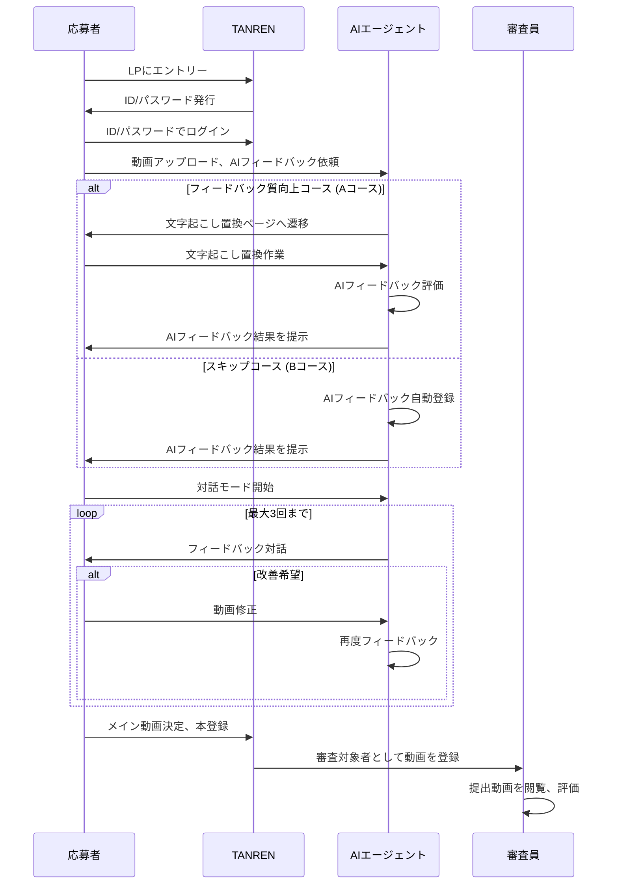
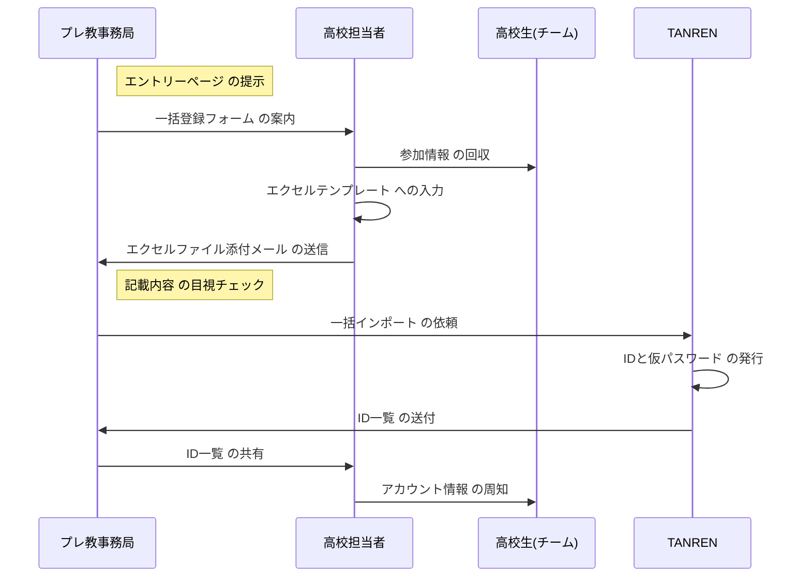
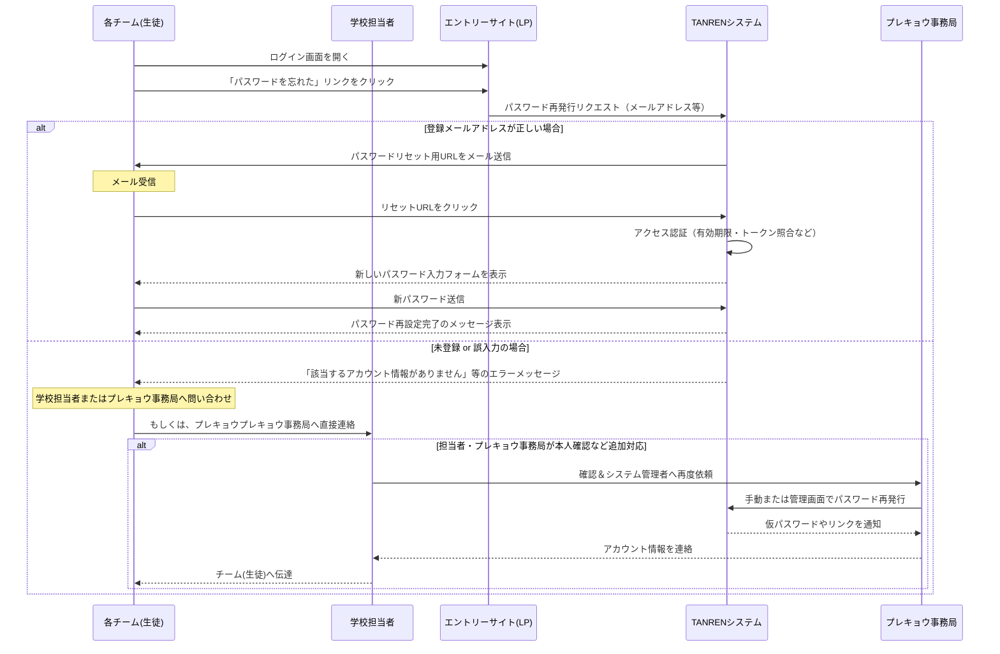

# 20250109 アジルコア定例会

[https://vimeo.com/1045202586/6bb5ea75c1?share=copy](https://vimeo.com/1045202586/6bb5ea75c1?share=copy)

[https://vimeo.com/1045202586/6bb5ea75c1?share=copy](https://vimeo.com/1045202586/6bb5ea75c1?share=copy)

▶️ログ：

- 文字起こし：
    
    ```markdown
    WEBVTT
    
    1
    00:00:50.650 --> 00:00:51.359
    kureishi: ありがとうござい。
    
    2
    00:00:56.280 --> 00:00:57.830
    佐藤勝彦: 聞こえますか？
    
    3
    00:00:57.830 --> 00:00:59.390
    Toya: はい、ありがとうございます。
    
    4
    00:01:10.320 --> 00:01:10.889
    佐藤勝彦: あれ。
    
    5
    00:01:11.590 --> 00:01:12.350
    Toya: もし。
    
    6
    00:01:12.670 --> 00:01:13.719
    佐藤勝彦: ちょっとお待ちください。
    
    7
    00:01:16.170 --> 00:01:16.870
    佐藤勝彦: ダメだ。
    
    8
    00:01:37.610 --> 00:01:38.340
    Toya: もっちー。
    
    9
    00:01:38.590 --> 00:01:40.949
    佐藤勝彦: すいません。マイクテストです。大丈夫でしょうか？
    
    10
    00:01:41.100 --> 00:01:42.609
    Toya: 聞こえてます。
    
    11
    00:01:42.610 --> 00:01:44.380
    佐藤勝彦: はい、すいません。お願いします。
    
    12
    00:01:44.640 --> 00:01:46.680
    Toya: じゃあ画面共有しちゃいます。
    
    13
    00:01:54.590 --> 00:01:56.200
    Toya: で、えーと、
    
    14
    00:01:56.540 --> 00:01:59.680
    Toya: 本日お話しすることですが、
    
    15
    00:01:59.820 --> 00:02:09.599
    Toya: 問い合わせのまとめとあとはえーとま、ちょっと年末に資料だけ送ってあるんですけれども。ソースコード管理について更新まとまったので共有します。
    
    16
    00:02:09.800 --> 00:02:10.409
    佐藤勝彦: おいっ。
    
    17
    00:02:11.020 --> 00:02:24.219
    Toya: であとはえーとul対応についてはえーとおとといか。一昨日ちょっと切り替え自体は終わったので、えとそちらについてちょっとご報告と。あとはプレゼン甲子園については22日のモックアップですね。
    
    18
    00:02:24.400 --> 00:02:25.040
    佐藤勝彦: はい。
    
    19
    00:02:25.410 --> 00:02:28.619
    Toya: 向けて、ちょっと画面イメージのすり合わせをさせてください。
    
    20
    00:02:29.000 --> 00:02:29.619
    佐藤勝彦: そういった。
    
    21
    00:02:29.890 --> 00:02:33.529
    Toya: 八。についてもちょっと進捗状況を報告いたします。
    
    22
    00:02:33.530 --> 00:02:34.190
    佐藤勝彦: こういった。
    
    23
    00:02:38.570 --> 00:02:40.180
    Toya: で、えーと、
    
    24
    00:02:40.690 --> 00:02:46.050
    Toya: インド保証。問い合わせについては、エクスプロラポリーのsqlは悪霊さん
    
    25
    00:02:46.640 --> 00:02:48.040
    Toya: これはえーと
    
    26
    00:02:48.350 --> 00:02:50.709
    Toya: 確認はできてるんでしたっけ？
    
    27
    00:02:51.720 --> 00:02:52.330
    kureishi: 池田さん。
    
    28
    00:02:52.670 --> 00:02:53.400
    Toya: そうですね。
    
    29
    00:02:54.800 --> 00:02:55.819
    kureishi: 何かあります。
    
    30
    00:02:56.250 --> 00:03:02.089
    Toya: あ、はい、わかりました。じゃあちょっとご連絡あーじゃない。ご確認よろしくお願いします。
    
    31
    00:03:02.090 --> 00:03:05.989
    佐藤勝彦: 今の呉さんの言葉、ちょっと全然聞き取れなかった。マイクおかしいですか？
    
    32
    00:03:06.430 --> 00:03:07.739
    佐藤勝彦: もう一回呉さん
    
    33
    00:03:07.980 --> 00:03:09.099
    佐藤勝彦: メッセージ聞こえます。
    
    34
    00:03:10.550 --> 00:03:13.099
    佐藤勝彦: ちょっと途切れてるね。一個だけ
    
    35
    00:03:13.340 --> 00:03:14.949
    佐藤勝彦: そっちは明瞭ですか。
    
    36
    00:03:16.140 --> 00:03:17.390
    Toya: 見えちびれてます。
    
    37
    00:03:17.390 --> 00:03:19.970
    佐藤勝彦: あーなんかね、声小さいですよ。クリスさん。
    
    38
    00:03:20.920 --> 00:03:21.770
    kureishi: 聞こえますか？
    
    39
    00:03:22.220 --> 00:03:22.740
    Toya: はい、
    
    40
    00:03:22.740 --> 00:03:23.690
    Toya: ありがとうござい。
    
    41
    00:03:23.690 --> 00:03:27.120
    佐藤勝彦: なんかマイクが遠い感じ。それだけ。はいはーい。
    
    42
    00:03:30.440 --> 00:03:40.030
    Toya: あとはちょっとこれ既存不具合ですね。日本動画とかの選択の時にライブ動画選択しようとすると、音声サムネイルになってしまうと。
    
    43
    00:03:41.000 --> 00:03:52.639
    Toya: 件についてはちょっと調べたんですけれども、えっと若干時間がかかりそうなので、ちょっと今後回しにさせてもらっています。
    
    44
    00:03:52.640 --> 00:03:53.340
    佐藤勝彦: はーい。
    
    45
    00:03:53.340 --> 00:04:00.370
    Toya: 八。のリリースのめどがつき次第入れられるようであれば、一緒に入れる形にさせてもらおうと思います。
    
    46
    00:04:00.370 --> 00:04:01.049
    佐藤勝彦: こういった。
    
    47
    00:04:02.600 --> 00:04:06.539
    Toya: 次にソースコードの管理について
    
    48
    00:04:07.510 --> 00:04:09.210
    Toya: で。えーと、
    
    49
    00:04:10.380 --> 00:04:17.219
    Toya: これ。アジュールデボックスの使い方について調べます。よっていう状態だったのが調べ終わったので、一応ちょっ。
    
    50
    00:04:17.350 --> 00:04:20.269
    Toya: 共有を更新。について共有をします。
    
    51
    00:04:20.550 --> 00:04:21.110
    佐藤勝彦: こういった。
    
    52
    00:04:21.620 --> 00:04:24.810
    Toya: これでもう資料切り替わってますかね？
    
    53
    00:04:26.530 --> 00:04:27.950
    Toya: で、えーと
    
    54
    00:04:29.460 --> 00:04:32.839
    Toya: アジュールの。えーと、
    
    55
    00:04:34.320 --> 00:04:36.519
    Toya: このリボープスっていうサービス。
    
    56
    00:04:36.760 --> 00:04:41.769
    Toya: ちょっと開発者向けのソースコード管理とか自動デプロイとかあるサービスなんですけれども。
    
    57
    00:04:42.120 --> 00:04:49.620
    Toya: の構成がオーガニゼーションっていう組織っていうやつと、プロジェクトレポスっていうのがありまして、
    
    58
    00:04:50.210 --> 00:04:54.649
    Toya: オーガニゼーションは。部門みたいな感じらしいです。
    
    59
    00:04:55.020 --> 00:05:00.430
    Toya: その会社の事業部門のこのプロジェクトでこのリポジトリを管理しますよと
    
    60
    00:05:00.540 --> 00:05:04.079
    Toya: いう考え方で使えます。と
    
    61
    00:05:06.080 --> 00:05:15.899
    Toya: で、ま、これもこれも複数作れるっていう形だと思ですけれども、ま、今回は別に分ける必要はないと思うので、ま、両方丹念で進めちゃおうかなと思ってます。
    
    62
    00:05:16.880 --> 00:05:19.150
    Toya: 名前同じにはなっちゃですけど、
    
    63
    00:05:20.220 --> 00:05:23.210
    Toya: その下に
    
    64
    00:05:23.440 --> 00:05:33.199
    Toya: ソースコード全部ぶち込む形で行こうとは思ですけど、ま、ここに一緒に関連カメラも入れちゃっていいかなとは思ってます。
    
    65
    00:05:33.540 --> 00:05:34.080
    佐藤勝彦: おい。
    
    66
    00:05:34.240 --> 00:05:37.259
    Toya: はい、暮石さん二つだけですよね。多分。
    
    67
    00:05:37.660 --> 00:05:38.599
    kureishi: はい、そうです。
    
    68
    00:05:38.600 --> 00:05:39.140
    Toya: ありがとうござ。
    
    69
    00:05:41.880 --> 00:05:47.589
    Toya: 一応プロジェクトを分けるとかもできるんですけれども、あんまり分けてもしょうがないと思うので、
    
    70
    00:05:49.040 --> 00:05:56.339
    Toya: あとは、ユーザーに関してはこれ先に価格を言った方がいいか。
    
    71
    00:05:57.930 --> 00:06:09.119
    Toya: ま、今回利用するのが、えっと、アジュールデポポスベーシックプランっていうやつなんですけれども、これが。ですねご五ユーザー以下で運用するのであれば、もう無料で使えるっていう形になってます
    
    72
    00:06:10.540 --> 00:06:19.370
    Toya: ので、ちょっとユーザーは五ユーザー以下に抑えられるといいかな？ということで、各組織で代表ユーザー一名とかで考えてます。
    
    73
    00:06:20.570 --> 00:06:24.879
    Toya: ちょっとアカウント使い回しという形でやると無料で使えるかなと。
    
    74
    00:06:28.500 --> 00:06:33.270
    Toya: すいません。前野さん一点だけ。これイースタージャーワークスさんっていた方がいいですよ。
    
    75
    00:06:34.100 --> 00:06:35.040
    Toya: ユーザー。
    
    76
    00:06:35.280 --> 00:06:37.459
    Toya: まあ一応。っていう。
    
    77
    00:06:40.920 --> 00:06:42.240
    佐藤勝彦: いた方がいいです。
    
    78
    00:06:43.640 --> 00:06:47.579
    Toya: ちょっとこの四ユーザーで運用する形にしようと思います。
    
    79
    00:06:47.890 --> 00:06:54.610
    Toya: ちょっといざ運用を始めたときの見え方とかもちょっと今回お見せするんですけれども
    
    80
    00:07:00.470 --> 00:07:01.890
    Toya: レクトリー会のやつだ。
    
    81
    00:07:03.340 --> 00:07:04.509
    Toya: エールコアか。
    
    82
    00:07:14.940 --> 00:07:19.500
    Toya: ここで検索するとアジュールデボープスオーガニゼーション図っていうのが出るので、
    
    83
    00:07:20.730 --> 00:07:22.329
    Toya: こっから
    
    84
    00:07:23.030 --> 00:07:29.189
    Toya: 初回はここで設定とかをする形にはなるんですけれども、今回はもう救ってあるので、
    
    85
    00:07:32.620 --> 00:07:34.520
    Toya: こういう形で見える。
    
    86
    00:07:34.910 --> 00:07:36.030
    Toya: になります。
    
    87
    00:07:36.250 --> 00:07:38.319
    Toya: で、えーと、
    
    88
    00:07:40.260 --> 00:07:43.230
    Toya: さっき言ってた。オーガニゼーション図っていうのはこれです。
    
    89
    00:07:43.860 --> 00:07:48.469
    Toya: 今回私で作ってて、テストのためにプロジェクトを作っているんですけれど。
    
    90
    00:07:49.250 --> 00:07:52.839
    Toya: をクリックすると、そのプロジェクトの中身が見えて。
    
    91
    00:07:56.190 --> 00:08:04.869
    Toya: で、まぁちょっとタスク管理とかの機能とかもここにずらっと並んではいるんですけど、今回ソースコード管理だけということで、ここのレポスっていうやつ。
    
    92
    00:08:06.180 --> 00:08:12.939
    Toya: ここをクリックすることによって、各リポジトリがソースコードのリポジトリが見えるようになると。
    
    93
    00:08:14.110 --> 00:08:15.490
    Toya: いう形になります。
    
    94
    00:08:16.400 --> 00:08:25.670
    Toya: まあ、一応見るだけだったらこのブラウザー上でこんな形でドキュメントとかも見られるようになっている形ですね。
    
    95
    00:08:26.270 --> 00:08:28.540
    佐藤勝彦: ファイルのダウンロードはどっからするんですか？
    
    96
    00:08:30.610 --> 00:08:33.629
    Toya: ファイルのダウンロード。
    
    97
    00:08:33.630 --> 00:08:38.949
    佐藤勝彦: 要はファイル一式を丸ごとなんかジップでダウンロードするのかなと思ですけど。
    
    98
    00:08:38.950 --> 00:08:39.980
    Toya: 多分
    
    99
    00:08:40.309 --> 00:08:41.539
    Toya: チップはあるかな
    
    100
    00:08:41.780 --> 00:08:42.500
    Toya: いいか。
    
    101
    00:08:42.500 --> 00:08:45.540
    佐藤勝彦: ダウンロード。アーズチップですね。そこですね。
    
    102
    00:08:45.540 --> 00:08:47.929
    Toya: 中身ほぼギットハブなんで。
    
    103
    00:08:47.930 --> 00:08:49.090
    佐藤勝彦: はいですよね。
    
    104
    00:08:49.090 --> 00:08:50.789
    Toya: なかなり一緒だと思います。
    
    105
    00:08:51.010 --> 00:08:51.949
    佐藤勝彦: わかりました。
    
    106
    00:08:54.170 --> 00:08:55.629
    Toya: イメースが買ったからね。
    
    107
    00:08:57.250 --> 00:09:00.220
    Toya: はい。
    
    108
    00:09:03.090 --> 00:09:06.009
    佐藤勝彦: 御社からそこにアップするのはなんか
    
    109
    00:09:06.330 --> 00:09:09.700
    佐藤勝彦: 半自動化されるのか、問屋さんが意図を持ってそこに
    
    110
    00:09:10.060 --> 00:09:13.650
    佐藤勝彦: アップする内でその更新されないのかというのはどうですか？
    
    111
    00:09:14.140 --> 00:09:27.310
    佐藤勝彦: 基本ほら、アジルコアギットの中で更新され続けてリリース本番リリースがされたら、もうワークフローとしてはそちらの方にも書き込むっていう、そんな感じの認識で運用されていくのかどうか、そのあたり。
    
    112
    00:09:28.670 --> 00:09:31.699
    Toya: それも考えはしたんですけれども。
    
    113
    00:09:32.490 --> 00:09:38.209
    Toya: やっぱりちょっとその二重管理っていう方、二重管理というか、こちらでもリポジトリ管理するってなると。
    
    114
    00:09:38.910 --> 00:09:43.340
    Toya: 工数コース。もうその点だと思うので、
    
    115
    00:09:43.550 --> 00:09:51.649
    Toya: 基本的に決まった会社しかコミットしないとかプッシュしないっていうことにはなると思うので、ここにやっちゃおうかなと思ってます。
    
    116
    00:09:51.810 --> 00:09:52.990
    佐藤勝彦: ここに何。
    
    117
    00:09:53.850 --> 00:10:03.880
    Toya: プッシュするタイミングって毎回こちらの運用としてやるのか。あのデフォルイしたらこっちにもプッシュされるみたいなところまで増加するのかっていう。
    
    118
    00:10:04.120 --> 00:10:10.180
    佐藤勝彦: 別に労力かけてほしいって言ってるわけではなくて、一旦まずどういう運用になっているのかってことの確認です。
    
    119
    00:10:11.880 --> 00:10:15.540
    Toya: 全部こっちに移行しちゃえば、
    
    120
    00:10:16.420 --> 00:10:19.399
    Toya: うちのociのポイントで使わなければ、
    
    121
    00:10:19.870 --> 00:10:30.519
    Toya: あの常にプッシュされている状態になるんじゃない？そういうふうにしちゃうか。あ、はい、そっちのつもりです。はい、なので、えっと、常に最新状態が上がってる状態になります。
    
    122
    00:10:30.520 --> 00:10:32.789
    佐藤勝彦: ってことですね。わかりました。了解です。
    
    123
    00:10:35.940 --> 00:10:39.199
    Toya: そうするとちょっとブランチの一覧とかも。
    
    124
    00:10:40.290 --> 00:10:47.060
    Toya: いや。あとミートアックって多分良くて。だからリリースの下にずっと上がってますように。
    
    125
    00:10:47.250 --> 00:10:53.780
    Toya: リリースタグを確認してもらえればその時のものが見えます。というそうですね。
    
    126
    00:10:55.590 --> 00:11:02.099
    Toya: で、あのここ見てくださいみたいなやつはまたちょっと別途運用始まった時にまたご連絡すればいいかなと思ってます。
    
    127
    00:11:02.100 --> 00:11:03.299
    佐藤勝彦: 了解です。
    
    128
    00:11:05.860 --> 00:11:08.290
    Toya: 操作イメージはこんな感じで
    
    129
    00:11:08.800 --> 00:11:09.910
    Toya: えーと
    
    130
    00:11:11.130 --> 00:11:12.640
    Toya: 進めてます。はい、
    
    131
    00:11:13.570 --> 00:11:16.469
    Toya: じゃあ次はちょっとイーストアジアワークスさんに
    
    132
    00:11:16.980 --> 00:11:18.070
    Toya: はいはい、
    
    133
    00:11:18.200 --> 00:11:24.789
    Toya: そうですね。あの、実際作ってもらうのはスニーカーさんたちにお願いしようかなと思っているので。
    
    134
    00:11:24.790 --> 00:11:26.170
    佐藤勝彦: はい、わかりました。
    
    135
    00:11:27.670 --> 00:11:29.849
    Toya: 箱だけちょっと作ってもらう予定です。
    
    136
    00:11:30.010 --> 00:11:30.790
    佐藤勝彦: はーい。
    
    137
    00:11:32.150 --> 00:11:34.310
    Toya: ちょっとこれは依頼しておきます
    
    138
    00:11:37.020 --> 00:11:40.819
    Toya: 次にeol対応
    
    139
    00:11:42.590 --> 00:11:45.289
    Toya: こちらは本番環境
    
    140
    00:11:45.690 --> 00:11:49.570
    Toya: の切り替えの方が1月7日に終わって
    
    141
    00:11:50.120 --> 00:11:50.969
    Toya: あ、終わって
    
    142
    00:11:51.610 --> 00:11:53.630
    Toya: ております。
    
    143
    00:11:54.280 --> 00:11:54.829
    佐藤勝彦: ありがとうござ。
    
    144
    00:11:55.490 --> 00:11:57.289
    Toya: ちょっと終わってないかもしれない。
    
    145
    00:11:57.510 --> 00:11:58.369
    佐藤勝彦: そうなんですか。
    
    146
    00:11:58.370 --> 00:12:02.739
    Toya: そういえば空間の停止まで含めるとまだ終わってないんですね。
    
    147
    00:12:02.930 --> 00:12:03.860
    佐藤勝彦: うーん。
    
    148
    00:12:03.860 --> 00:12:07.400
    Toya: 新しいのを作るというのは動いている状態になっています。
    
    149
    00:12:07.860 --> 00:12:11.530
    佐藤勝彦: はいはいはい、あれで移行は完了してないんだっけ？今
    
    150
    00:12:11.840 --> 00:12:14.720
    佐藤勝彦: 半官僚みたいな状態で、
    
    151
    00:12:14.720 --> 00:12:15.270
    佐藤勝彦: はいはい。
    
    152
    00:12:15.780 --> 00:12:22.770
    Toya: Uも真も動いているので、問題交換で。の確認が終わったら住みかさんが古い方を外すので。
    
    153
    00:12:22.770 --> 00:12:23.569
    佐藤勝彦: はい。はいはい。
    
    154
    00:12:23.570 --> 00:12:29.390
    Toya: そして停止すると請求金額も下がって完了って感じになります。
    
    155
    00:12:29.390 --> 00:12:37.890
    佐藤勝彦: はいで、特にその新環境で今問題は起こってないですよね。その念のために裏も動いてるけどっていう理解だと。
    
    156
    00:12:37.890 --> 00:12:40.430
    Toya: はいえーと、
    
    157
    00:12:40.550 --> 00:12:41.339
    Toya: 昨日
    
    158
    00:12:41.590 --> 00:12:57.699
    Toya: スミカワさんに外してもらおうと思ってたんですけれども、休館とかそれの連絡が。そういえば来てない。もうちょっと様子見てからっつってた。あ、すいません。それは外すことはやっていいけど、ちょっと削除はちょっと待っといてくれっていうニーズだったので、
    
    159
    00:12:58.070 --> 00:13:06.169
    Toya: なんか両方同じだと思ってるかもしれない。あれ伝わってないかもしれない。あの四台で今週は様子見ます。って書いてあったと思う。あれ。
    
    160
    00:13:06.840 --> 00:13:11.239
    Toya: 見逃していただける。どっかに書いてあった気がする。
    
    161
    00:13:13.380 --> 00:13:18.879
    Toya: ちょっと今週中は九州入り混ざった四大体制でって感じですか？
    
    162
    00:13:20.060 --> 00:13:20.800
    Toya: はい、
    
    163
    00:13:21.300 --> 00:13:32.400
    Toya: 今週いっぱいは四大稼働で様子見してトラフィックが少ないタイミングで休館。今日は切り離します。はいって書いてあります。すいません、見逃してました。今の12時18分。はい、
    
    164
    00:13:35.030 --> 00:13:39.730
    Toya: 現在一応その新環境の方、問題なく動いてはいるんですけれども、
    
    165
    00:13:40.410 --> 00:13:46.949
    Toya: すいません。事後報告になりますが、ちょっと1月8日で本番障害発覚しておりまして。
    
    166
    00:13:47.630 --> 00:13:49.509
    Toya: 対応は済んでおります。
    
    167
    00:13:49.510 --> 00:13:50.090
    佐藤勝彦: はーい。
    
    168
    00:13:50.380 --> 00:13:52.499
    Toya: 一応報告だけさせてください。
    
    169
    00:13:53.360 --> 00:14:03.540
    Toya: で、えっと、まず1月7日から八日にかけてえっと文字起こしで失敗するっていうのが頻発しています。
    
    170
    00:14:03.890 --> 00:14:09.250
    Toya: これ、ちょっともともとバッチこの文字起こし。
    
    171
    00:14:09.990 --> 00:14:13.939
    Toya: 行っているバッジ系はウェブ0代目ですね。
    
    172
    00:14:14.060 --> 00:14:17.409
    Toya: ちなみに環境のみで動かしていたんですけれども。
    
    173
    00:14:17.410 --> 00:14:17.940
    佐藤勝彦: あ。はい。
    
    174
    00:14:18.280 --> 00:14:24.680
    Toya: これがちょっと移行してもらうときに、二台目の環境にも入っておりまして。
    
    175
    00:14:25.960 --> 00:14:31.760
    Toya: 動作確認。こちらでも文字起こしはしていたんですけれども、
    
    176
    00:14:32.310 --> 00:14:37.100
    Toya: 一台目は失敗していて、二代目はこうしていたっていう状況だったんです。
    
    177
    00:14:39.980 --> 00:14:46.599
    Toya: で、えーと、なので、二代目の成功。あ、大丈夫だって思って誤認しまして。
    
    178
    00:14:47.570 --> 00:14:52.299
    Toya: なので、実際には二分の一の確率で失敗するみたいな状態になってました。
    
    179
    00:14:53.010 --> 00:14:53.710
    佐藤勝彦: ほうほうほう。
    
    180
    00:14:55.600 --> 00:15:01.729
    Toya: ただ、これについてはちょっと八日かなに気づいて一台目の方
    
    181
    00:15:02.800 --> 00:15:06.560
    Toya: 文字起こしに必要なライブラリがインストールされてなかった
    
    182
    00:15:06.660 --> 00:15:08.359
    Toya: ffmというですね。
    
    183
    00:15:09.890 --> 00:15:12.610
    Toya: こちら。ちょっとインストールして対応済み。
    
    184
    00:15:12.990 --> 00:15:13.530
    佐藤勝彦: はい。
    
    185
    00:15:13.920 --> 00:15:20.120
    Toya: 失敗したやつについても全部サイ文字起こしかけている状況ですね。
    
    186
    00:15:20.580 --> 00:15:22.270
    佐藤勝彦: 今は大丈夫なはずだ。
    
    187
    00:15:22.270 --> 00:15:23.440
    Toya: 今大丈夫です。
    
    188
    00:15:23.440 --> 00:15:24.860
    佐藤勝彦: はい、了解です。
    
    189
    00:15:26.460 --> 00:15:32.360
    Toya: で、えーと、あともう一つがその通知系バッチの多重起動っていうところで、
    
    190
    00:15:33.090 --> 00:15:38.129
    Toya: これちょっと11月中旬からおそらく起こっていたっていうのを結構長いんですけれど、
    
    191
    00:15:39.210 --> 00:15:46.119
    Toya: これもその二代目の本番サーブ二代目の新環境かでバッジが
    
    192
    00:15:46.440 --> 00:15:51.189
    Toya: 通知系のバッジももう二重に起動しちゃってたっていうのが原因で。
    
    193
    00:15:51.940 --> 00:15:55.290
    Toya: 一台目と二代目でそのバッジが動いちゃってたので、
    
    194
    00:15:55.500 --> 00:16:00.269
    Toya: その分メールも送られちゃったっていう送られちゃってたはずかも。
    
    195
    00:16:01.210 --> 00:16:03.529
    佐藤勝彦: いらない、いらないメールが送られてた。
    
    196
    00:16:03.770 --> 00:16:04.720
    Toya: えっと。
    
    197
    00:16:05.030 --> 00:16:06.070
    佐藤勝彦: 分からなかったです。
    
    198
    00:16:06.070 --> 00:16:08.760
    Toya: 最大三通送られちゃってた可能性がありまして。
    
    199
    00:16:08.760 --> 00:16:10.030
    佐藤勝彦: 同じ内容が。
    
    200
    00:16:10.030 --> 00:16:10.599
    Toya: ありがとうござ。
    
    201
    00:16:11.492 --> 00:16:12.789
    佐藤勝彦: はいはいはい。
    
    202
    00:16:13.450 --> 00:16:16.069
    Toya: これまで問い合わせとかなければ多分
    
    203
    00:16:16.530 --> 00:16:23.810
    Toya: あまり大きな問題にはなってくるかなとは思ですけれどもちょっと。もしこれからそういえば三通来てたんですけど。みたいな話があったら。
    
    204
    00:16:23.810 --> 00:16:25.549
    佐藤勝彦: なるほど、わかりました。
    
    205
    00:16:25.690 --> 00:16:27.560
    Toya: そういう回答でお願いしま。
    
    206
    00:16:28.200 --> 00:16:28.759
    佐藤勝彦: ありがとうござい。
    
    207
    00:16:28.950 --> 00:16:29.460
    Toya: はい
    
    208
    00:16:32.330 --> 00:16:37.069
    Toya: この後は来週にここに切り替えですかね？
    
    209
    00:16:38.240 --> 00:16:42.729
    Toya: あ、そうですね。まあ外して1月にしては四。
    
    210
    00:16:43.220 --> 00:16:43.980
    Toya: はい、
    
    211
    00:16:46.730 --> 00:16:48.020
    Toya: 完全切り替え。
    
    212
    00:16:52.220 --> 00:16:53.570
    Toya: あとあれあれ？
    
    213
    00:16:54.130 --> 00:16:57.299
    Toya: デブのアウトプットデブだけ。
    
    214
    00:16:57.660 --> 00:16:58.390
    Toya: はい、
    
    215
    00:16:59.330 --> 00:17:00.390
    Toya: 切り替える
    
    216
    00:17:00.520 --> 00:17:05.660
    Toya: てない状態になっているので、それもですね。ちょっとその場合にも合わせて。
    
    217
    00:17:18.470 --> 00:17:22.199
    Toya: 不要サーバーの返信を書いています。
    
    218
    00:17:36.490 --> 00:17:38.260
    Toya: になります。はい、
    
    219
    00:17:40.350 --> 00:17:43.500
    Toya: じゃあ次にプレゼン更新にも行っちゃいます。
    
    220
    00:17:44.930 --> 00:17:51.389
    Toya: プレゼント支援は画面イメージ作ってきましたので、これか。
    
    221
    00:17:55.630 --> 00:18:04.110
    Toya: ちょっと操作。えーとように縦横があ、すいません。ちょっと間に合わなくて、はい、
    
    222
    00:18:06.660 --> 00:18:10.840
    Toya: 一応ちょっと操作イメージからお伝えしていくと、
    
    223
    00:18:10.980 --> 00:18:13.809
    Toya: えー、と、まあこれ去年のサイトですけれども
    
    224
    00:18:14.380 --> 00:18:17.900
    Toya: プレゼン甲子園のどこかにちょっとログインみたいな。
    
    225
    00:18:18.380 --> 00:18:21.389
    Toya: ちょっとこの会員では違うやつだと思ですけど。
    
    226
    00:18:22.370 --> 00:18:26.269
    Toya: リンク作っていただいて、それによってえっと、
    
    227
    00:18:27.130 --> 00:18:32.900
    Toya: すでにエントリーされた投稿者については、この確認画面に行けると。
    
    228
    00:18:33.080 --> 00:18:33.810
    佐藤勝彦: はい。
    
    229
    00:18:34.130 --> 00:18:38.899
    Toya: なんかそうするかどうかはまだ決めてないですね。
    
    230
    00:18:39.340 --> 00:18:52.699
    Toya: あのー、えっと、初回のその学校としてエントリーする場合と、チームが転移して動画投稿してエントリーするっていう流れも二本あると思ってて。
    
    231
    00:18:52.700 --> 00:18:53.579
    佐藤勝彦: そうですね。
    
    232
    00:18:53.800 --> 00:18:59.080
    Toya: ちょっと本体側のlpをどういうふうにデザインするのかっていうのがあるのかなと思って。
    
    233
    00:19:00.030 --> 00:19:13.110
    Toya: なんで学校でエントリー済みの方は。っていうそのなんていうの。チームの人と、えーま、学校の人がまず学校としてエントリーするのがちょっと日本制定と。
    
    234
    00:19:14.380 --> 00:19:15.080
    佐藤勝彦: はい。はい。
    
    235
    00:19:16.260 --> 00:19:17.360
    Toya: はいはい、
    
    236
    00:19:18.500 --> 00:19:22.009
    Toya: 今のは。だからチーム側もそうです。
    
    237
    00:19:22.010 --> 00:19:30.550
    佐藤勝彦: じゃあlp側に学校でまとめてエントリーの方はこちら。個々としてのチームとしてのエントリーの方はこちらで二股に分かれないといけない。
    
    238
    00:19:31.460 --> 00:19:39.459
    Toya: ちょっとそれまとめてcsvでエントリーしたいみたいなお話があったと思ですけど。
    
    239
    00:19:39.460 --> 00:19:40.440
    佐藤勝彦: そうですね。はい。
    
    240
    00:19:41.170 --> 00:19:44.070
    Toya: で両方用意する感じになりますか。
    
    241
    00:19:44.760 --> 00:19:48.930
    佐藤勝彦: いや、それを今そちら側の認識はどうなってます。
    
    242
    00:19:49.560 --> 00:19:53.900
    Toya: 学校としてまずエントリーはしてもらってしまって。
    
    243
    00:19:54.140 --> 00:19:54.730
    佐藤勝彦: はい。
    
    244
    00:19:54.970 --> 00:19:58.420
    Toya: 一チームエントリーの場合は全部情報を入れて。
    
    245
    00:19:58.420 --> 00:19:59.000
    佐藤勝彦: はい。
    
    246
    00:19:59.750 --> 00:20:04.599
    Toya: ちょっとcsvの運用もちゃん。と決め、てなかったんですけど。
    
    247
    00:20:05.390 --> 00:20:13.120
    Toya: Csvでまとめてチームを登録する場合は、そこに添付してもらうようなイメージかなと思ってたんですけど。
    
    248
    00:20:15.830 --> 00:20:16.470
    Toya: あの番。
    
    249
    00:20:16.470 --> 00:20:21.750
    佐藤勝彦: してもらう。はえっとlpサイトにアップロードするってことを今言ってます。違う。
    
    250
    00:20:22.700 --> 00:20:23.619
    Toya: ああ。そうです。
    
    251
    00:20:23.740 --> 00:20:28.770
    佐藤勝彦: あーなるほど、lp、対応でcsvを入手してそれ。が
    
    252
    00:20:29.540 --> 00:20:39.780
    佐藤勝彦: lp登録完了すれば、チームの人間にメールか何か、もしくはサーバーに動いて、その通知のみが来る感じになって、アジルコアが認識するからやっときます。
    
    253
    00:20:40.710 --> 00:20:43.389
    Toya: この辺どうしましょうかね？っていうところがありまして。
    
    254
    00:20:43.600 --> 00:20:46.289
    佐藤勝彦: なるほうと。なるほど。なるほど。
    
    255
    00:20:47.680 --> 00:20:57.949
    佐藤勝彦: 一応前回のミーティング記録では、まあ、lpにその旨の理解がされたら
    
    256
    00:20:58.080 --> 00:21:00.809
    佐藤勝彦: アクセスされる。認識だから
    
    257
    00:21:01.950 --> 00:21:04.269
    佐藤勝彦: チャットに貼ると
    
    258
    00:21:05.190 --> 00:21:06.130
    佐藤勝彦: よいしょ。
    
    259
    00:21:06.490 --> 00:21:08.789
    佐藤勝彦: 豊田さんそこのURL踏めます。
    
    260
    00:21:09.080 --> 00:21:09.650
    Toya: ありがとうござ。
    
    261
    00:21:23.370 --> 00:21:26.439
    佐藤勝彦: くるくる回していただいたところの
    
    262
    00:21:30.540 --> 00:21:39.749
    佐藤勝彦: 下のそのシーケンス。図のところのイメージでlpにエントリーidパスワードを発行し、
    
    263
    00:21:40.180 --> 00:21:55.720
    佐藤勝彦: idパスワ。ー。ドログインし、動画のアップロードをするまでのここの遷移のところに。ま、そもそも学校でエントリーないしは個人個個人というか、ま、そのチームとしてのエントリーというところの動線に対しての。
    
    264
    00:21:56.420 --> 00:22:10.560
    佐藤勝彦: うーん、シナリオですよね。だ、そこが。うーん。学校単位でまとめてやりたい時にどうするの？っていうところをロジックとして持たなといかんよね。っていうところで、
    
    265
    00:22:11.080 --> 00:22:20.710
    佐藤勝彦: 応募システムの動線の詳細が。上に一、二番のところに当たるところなんですけども、ちょっとスクロール上に上げていただいて、一番二番
    
    266
    00:22:21.360 --> 00:22:22.329
    佐藤勝彦: そこですね。
    
    267
    00:22:22.840 --> 00:22:34.960
    佐藤勝彦: 応募者はランニングページから2025年エントリーを行うえ、ー。リンク先から関連側提供のエントリーページが、さっきの問屋さんが言うそのー、エントリーのところの部分になっている
    
    268
    00:22:35.200 --> 00:22:39.469
    佐藤勝彦: アイディーパスワードを発行するんだがのところにそもそもそこに
    
    269
    00:22:39.930 --> 00:22:43.680
    佐藤勝彦: 学校側エントリーcsvっていうところの動線の
    
    270
    00:22:44.120 --> 00:22:47.549
    佐藤勝彦: 言及がされていないわけだよなここだよな。
    
    271
    00:22:47.930 --> 00:22:51.080
    佐藤勝彦: で、昨年度のエントリーページって出せます。
    
    272
    00:22:53.200 --> 00:22:57.560
    Toya: はい。エントリーページは。
    
    273
    00:22:57.560 --> 00:22:59.110
    佐藤勝彦: もう消えちゃってる。
    
    274
    00:22:59.590 --> 00:23:01.549
    Toya: これですかね？
    
    275
    00:23:01.550 --> 00:23:05.219
    佐藤勝彦: これで、この時に
    
    276
    00:23:06.020 --> 00:23:17.430
    佐藤勝彦: 先生側がまとめてやるときってここでやって他のチームがありますか？って言ってあれか連続の入力しかできなくて、
    
    277
    00:23:17.640 --> 00:23:23.739
    佐藤勝彦: で、csvの入力はもう完全にベッドかベッドで依頼してたから、そっか
    
    278
    00:23:24.010 --> 00:23:26.129
    佐藤勝彦: こっちの運用には載ってないんですよね。
    
    279
    00:23:27.840 --> 00:23:29.970
    佐藤勝彦: うーん、
    
    280
    00:23:31.700 --> 00:23:34.049
    佐藤勝彦: 事務局へメールをください。
    
    281
    00:23:34.590 --> 00:23:36.969
    佐藤勝彦: ボタンで逃げて。
    
    282
    00:23:37.350 --> 00:23:41.860
    佐藤勝彦: 福井県事務所からこちらの高校は
    
    283
    00:23:42.580 --> 00:23:53.880
    佐藤勝彦: まとめてcsvでお願いしますって言って、僕らにメールが来て、それのメールの内容確認してアジルポアさんにチャットワーク部屋から依頼をかけて
    
    284
    00:23:54.680 --> 00:23:58.329
    佐藤勝彦: やるのがわかりいいのか。
    
    285
    00:23:59.040 --> 00:24:05.989
    佐藤勝彦: まあ、今口で説明していた通り、学校の方はこちらにcsvをアップロードし、てください。
    
    286
    00:24:06.310 --> 00:24:24.190
    佐藤勝彦: でその一括のインポートのイメージはこちらです。で動画とか解説の？なんかサイトっぽいやつがヘルプっぽいものがピットあって、そこでアップロードしてもらえれば、学校側のエントリーは終了です。っていう風にして、関係者に通知のメールが行くようにするか、ま、当然後者の方が
    
    287
    00:24:24.380 --> 00:24:35.470
    佐藤勝彦: なんか実装された感と、まあ手間はないですよね。高校側からの方の人たちの入り口も全部一つに集約されるんで、なんか誰かのヒューマンエラーもないですよね。
    
    288
    00:24:35.790 --> 00:24:44.180
    佐藤勝彦: そっちの方が、実装が簡単っちゃ簡単なんであれば、別にそれをやっていただいた上でそのcsvをどこまで
    
    289
    00:24:44.860 --> 00:24:55.450
    佐藤勝彦: 対応できるかなんで連絡先が必要。かなその際にはcsvとプラスし、て学校側のメールアドレス、学校側の連絡先電話番号
    
    290
    00:24:55.730 --> 00:24:58.429
    佐藤勝彦: を入力する欄が必要になると思ですよね。
    
    291
    00:24:58.670 --> 00:25:01.790
    佐藤勝彦: それくるっと回してなんか連絡先ってありましたっけ？
    
    292
    00:25:02.670 --> 00:25:04.680
    佐藤勝彦: 特になかったですよね。確か。
    
    293
    00:25:05.970 --> 00:25:07.460
    佐藤勝彦: もらってなかったですよね。
    
    294
    00:25:07.460 --> 00:25:08.660
    Toya: メールアドレスだけ。
    
    295
    00:25:08.660 --> 00:25:11.159
    佐藤勝彦: だけですよね。携帯電話とかもらってないですよね。
    
    296
    00:25:11.280 --> 00:25:23.559
    佐藤勝彦: ちょっとそこまで欲しいですよね。なんか逆にその連絡先とかもまで回収して何かそのcsvが相変わらずなんか必要なところが打ち込まれてないとか、そういうことが起こりそうっちゃ起こりそうなんで。
    
    297
    00:25:23.720 --> 00:25:24.510
    Toya: はい
    
    298
    00:25:25.960 --> 00:25:27.009
    佐藤勝彦: なんで
    
    299
    00:25:27.130 --> 00:25:38.890
    佐藤勝彦: 僕の理想像の要望だけ言えば、あの、なんか福井県にどうします？って聞いたところでわからねえって言ってきそうなんで、あのこかくあるべき論で、やっぱり言わないと多分
    
    300
    00:25:39.860 --> 00:25:45.660
    佐藤勝彦: 進まないかなと思っててこうしますよ。で、こうあるとこういうメリットがあるんでこうしましょうね。
    
    301
    00:25:46.290 --> 00:25:48.490
    佐藤勝彦: で、22日に
    
    302
    00:25:49.140 --> 00:25:52.980
    佐藤勝彦: 出した方がいいので、アジルコアさん側で一番
    
    303
    00:25:53.460 --> 00:26:04.210
    佐藤勝彦: ヒューマンエラーが起こりづらく、最も効率的で、かつこうやれば一番エンジニア側としてはやりやすいです。っていう要請をもらった方がいいです。
    
    304
    00:26:05.530 --> 00:26:10.869
    佐藤勝彦: それが全社のチャットワークベースでヒューマンベースでやるのか。
    
    305
    00:26:12.080 --> 00:26:17.969
    佐藤勝彦: このlpサイトで回収してロボット的にやるのかのどちらかを決めていただきたいです。
    
    306
    00:26:20.270 --> 00:26:27.429
    Toya: 結局やっぱり工数の話になっちゃですけど、やるとやはり実装の工数がかかりますし。
    
    307
    00:26:27.430 --> 00:26:28.120
    佐藤勝彦: はい。
    
    308
    00:26:28.340 --> 00:26:33.740
    Toya: 運用に倒すと運用の方々の工数がかかるっていう話になりますし。
    
    309
    00:26:33.740 --> 00:26:34.560
    佐藤勝彦: はい。
    
    310
    00:26:34.590 --> 00:26:42.120
    Toya: 運用の工数を下げるって話にすると、応募する人たちが頑張るって話になるんですね。
    
    311
    00:26:42.120 --> 00:26:42.830
    佐藤勝彦: はい。
    
    312
    00:26:43.760 --> 00:26:52.030
    Toya: でちょっどれを優先するかっていうのがあの決めかねる部門がありまして、ちょっとどうしようっていう感じなんですよ。
    
    313
    00:26:52.350 --> 00:27:14.679
    佐藤勝彦: 予算が追加されることはまずないので、まずそこの工数は最小限に抑えましょう。で、僕らが頑張る分にはオッケーなんですけど、ま、ユーザー側が頑張りすぎるとちょっどいよねっていう部分があると思で、そうすると、まずcsvの型は決めないといけないっていうところまではちょっとここれをもらえれば一括で行けるっていうところまではまず欲しいですね。
    
    314
    00:27:14.920 --> 00:27:19.310
    Toya: まずテンプレーをダウンロードしてもらう形に多分なると思います。と。
    
    315
    00:27:19.310 --> 00:27:20.010
    佐藤勝彦: はーい。
    
    316
    00:27:20.280 --> 00:27:24.679
    Toya: で、まあダブルクリックでエクセルが開く人たちだと思で。
    
    317
    00:27:24.680 --> 00:27:25.410
    佐藤勝彦: はい。
    
    318
    00:27:25.690 --> 00:27:29.419
    Toya: 状態で編集したやつをアップしてくれると思ですけど。
    
    319
    00:27:29.420 --> 00:27:30.069
    佐藤勝彦: はい。
    
    320
    00:27:30.560 --> 00:27:33.329
    Toya: その状態に不備があったとき、
    
    321
    00:27:33.490 --> 00:27:35.250
    Toya: はい、それで
    
    322
    00:27:35.830 --> 00:27:39.219
    Toya: 何行目の何が変だとチーム名に何か。
    
    323
    00:27:39.390 --> 00:27:40.559
    Toya: えーと、
    
    324
    00:27:41.670 --> 00:27:48.340
    Toya: なんでしょう？使えない文字が入ってますよ。とか、そういうなんかルールの決め方とか
    
    325
    00:27:48.450 --> 00:27:52.050
    Toya: がちょっと問題になるかな？と。パスワードが入力されてない
    
    326
    00:27:52.540 --> 00:27:54.199
    Toya: だけではない。
    
    327
    00:27:55.010 --> 00:27:56.820
    Toya: なんか空欄があります。とか。
    
    328
    00:27:56.820 --> 00:28:01.820
    佐藤勝彦: 一件300件近いイントリをしてもらった記憶2024年の時に。
    
    329
    00:28:02.220 --> 00:28:03.010
    Toya: はい。
    
    330
    00:28:03.010 --> 00:28:08.409
    佐藤勝彦: あの時ってどうやって受け渡ししましたっけ？っていうちょっとログを検索したいんですけど、名前が出てこなかった。
    
    331
    00:28:09.740 --> 00:28:12.879
    Toya: これは結局csvでは対応してなかったはずです。
    
    332
    00:28:13.510 --> 00:28:14.870
    佐藤勝彦: Csbじゃなかった。
    
    333
    00:28:15.260 --> 00:28:16.970
    Toya: 全然。なんかまた
    
    334
    00:28:17.080 --> 00:28:19.820
    Toya: 頑張ってもらったんだと思いますよ。しか。
    
    335
    00:28:20.140 --> 00:28:30.150
    佐藤勝彦: その時の。なんか、とりあえずそれを踏襲する形で、そこは定義したいですよね。だから昨年度もらったこの形でお願いします。を一旦
    
    336
    00:28:30.290 --> 00:28:33.670
    佐藤勝彦: の受け渡しの内容にしたいなと思ったんですけど。
    
    337
    00:28:33.670 --> 00:28:37.740
    Toya: は連続で頑張ってくださいっていう形にしかしてなくて。
    
    338
    00:28:37.740 --> 00:28:38.410
    佐藤勝彦: はい。
    
    339
    00:28:39.110 --> 00:28:43.809
    Toya: それがつらいっていうふうにフィードバックしたのかなっていうふうに思ってます。
    
    340
    00:28:44.450 --> 00:28:46.250
    佐藤勝彦: うーん、そうでしたっけ？
    
    341
    00:28:46.530 --> 00:28:50.910
    佐藤勝彦: そういうふうに僕は読み取らなかったな。そうだっけな。そうだったっけ。
    
    342
    00:28:52.580 --> 00:28:59.439
    Toya: 事例。インポートってやった。来ない。結局来ないのかって思った記憶がありまして。
    
    343
    00:29:00.000 --> 00:29:04.080
    佐藤勝彦: それログ取れなかったかな？なんか検索ワードでピッと取れないですかね？
    
    344
    00:29:05.080 --> 00:29:07.889
    佐藤勝彦: 出てこない。出てこない。
    
    345
    00:29:08.540 --> 00:29:09.690
    Toya: ポイントに。
    
    346
    00:29:10.522 --> 00:29:11.380
    Toya: そうですね。
    
    347
    00:29:11.380 --> 00:29:18.880
    佐藤勝彦: チャーエントリーがあったところの方向名がわかれば多分そこがヒットゾーンだと思だけど。
    
    348
    00:29:21.620 --> 00:29:22.429
    佐藤勝彦: うーん。
    
    349
    00:29:22.800 --> 00:29:23.510
    佐藤勝彦: えっと、
    
    350
    00:29:25.580 --> 00:29:26.640
    佐藤勝彦: コートにないか。
    
    351
    00:29:36.770 --> 00:29:42.199
    Toya: 去年までは動画も一緒にないとエントリーできなかったので、
    
    352
    00:29:43.650 --> 00:29:47.639
    Toya: なんか確かにURL貼ってもらってなんとかってやったり、
    
    353
    00:29:48.420 --> 00:29:49.659
    Toya: あー、でも
    
    354
    00:29:49.930 --> 00:29:51.650
    Toya: そんな気もしてきちゃった
    
    355
    00:29:51.770 --> 00:29:54.330
    Toya: 気がするんだ。
    
    356
    00:29:54.940 --> 00:29:57.950
    Toya: 動画のURLが入っている状態っていうのが。
    
    357
    00:29:59.410 --> 00:30:04.019
    佐藤勝彦: グーグルドライブの中に多数入っていた記憶が。
    
    358
    00:30:04.340 --> 00:30:07.729
    佐藤勝彦: だからグーグルドライブもらってんのかな？グーグルドライブ見て。
    
    359
    00:30:12.280 --> 00:30:15.280
    Toya: エントリーチーム一覧じゃなくって、
    
    360
    00:30:19.100 --> 00:30:20.079
    Toya: うちに。
    
    361
    00:30:23.930 --> 00:30:25.740
    佐藤勝彦: 2024年。
    
    362
    00:30:27.280 --> 00:30:28.159
    佐藤勝彦: うーん、
    
    363
    00:30:29.340 --> 00:30:30.890
    佐藤勝彦: 今後都合。
    
    364
    00:30:54.060 --> 00:30:56.520
    Toya: 5月20
    
    365
    00:30:59.560 --> 00:31:00.360
    Toya: 一、二、五。
    
    366
    00:31:13.810 --> 00:31:14.669
    Toya: 言っちゃうかな？
    
    367
    00:31:27.680 --> 00:31:28.569
    Toya: はいいか
    
    368
    00:31:28.760 --> 00:31:29.720
    Toya: いいかな。
    
    369
    00:31:44.650 --> 00:31:45.799
    Toya: うふふっ。
    
    370
    00:32:02.880 --> 00:32:07.759
    佐藤勝彦: 28日csv確かに
    
    371
    00:32:09.000 --> 00:32:12.390
    佐藤勝彦: 大事しましたちょっとお待ちくださいね。もう出てきそう。
    
    372
    00:32:14.420 --> 00:32:15.850
    佐藤勝彦: へえー
    
    373
    00:32:19.380 --> 00:32:24.109
    佐藤勝彦: 28日前後29日前後になんかやり取りっぽいものがある。
    
    374
    00:32:26.730 --> 00:32:27.949
    佐藤勝彦: 出てきそう。
    
    375
    00:32:30.730 --> 00:32:31.749
    佐藤勝彦: これか。
    
    376
    00:32:33.450 --> 00:32:35.449
    佐藤勝彦: えーと、ちょっ。待ってくださいね。
    
    377
    00:32:40.210 --> 00:32:45.509
    佐藤勝彦: エントリー一覧か。これ。ただちょっ待ってくださいね。とりあえずエントリー一覧はなんか出てる。
    
    378
    00:32:45.710 --> 00:32:52.580
    佐藤勝彦: だからこれを見ると一括でめっちゃ多いところはここだが、判別しそう。
    
    379
    00:32:54.600 --> 00:32:55.980
    佐藤勝彦: えっと、
    
    380
    00:32:58.670 --> 00:33:06.039
    佐藤勝彦: これは一括だということで、エントリーの全体像はこれでわかると。
    
    381
    00:33:08.180 --> 00:33:10.590
    佐藤勝彦: で明らかに多いのは
    
    382
    00:33:21.770 --> 00:33:25.199
    佐藤勝彦: 怪しいな。少なくない。少ないような気がする。
    
    383
    00:33:27.500 --> 00:33:29.820
    佐藤勝彦: どういう一覧だろう。なんか少ないですね
    
    384
    00:33:30.710 --> 00:33:31.900
    佐藤勝彦: 200
    
    385
    00:33:32.460 --> 00:33:36.919
    佐藤勝彦: 53。なわけないような気がする。これも予選通過か、
    
    386
    00:33:39.810 --> 00:33:40.849
    佐藤勝彦: どういうことだ。
    
    387
    00:33:50.210 --> 00:33:52.660
    Toya: フットリーチーム一覧っていうのは
    
    388
    00:33:53.070 --> 00:33:54.960
    Toya: 6月の一般になります。
    
    389
    00:33:56.510 --> 00:33:57.590
    佐藤勝彦: ですよね。
    
    390
    00:34:02.020 --> 00:34:05.199
    佐藤勝彦: あーでもこれあれかな？初日初日の
    
    391
    00:34:05.550 --> 00:34:10.330
    佐藤勝彦: 24日から28日までの途中経過の速報化
    
    392
    00:34:10.449 --> 00:34:11.650
    佐藤勝彦: だから、
    
    393
    00:34:12.080 --> 00:34:15.280
    佐藤勝彦: 6月の更新版であそっか都度
    
    394
    00:34:15.639 --> 00:34:23.929
    佐藤勝彦: 都度送ってたのか。エントリー状況ってことですね。だから6月の四日とかの日付もあるのはそういうことか
    
    395
    00:34:24.500 --> 00:34:30.480
    佐藤勝彦: あ。で、福井県が350に膨れ上がっている。Csvデータがこれか
    
    396
    00:34:30.639 --> 00:34:32.079
    佐藤勝彦: なるほど。なるほど
    
    397
    00:34:32.190 --> 00:34:35.370
    佐藤勝彦: 毎週報告下さいって言われてたから送ってたんです。
    
    398
    00:34:38.880 --> 00:34:39.920
    佐藤勝彦: これが
    
    399
    00:34:40.929 --> 00:34:44.540
    佐藤勝彦: どのタイミングかわからないけど、システムで吐き出して
    
    400
    00:34:45.290 --> 00:34:49.889
    佐藤勝彦: 最新版になったデータかなあー。でも
    
    401
    00:34:50.469 --> 00:34:54.689
    佐藤勝彦: ただのあれだな。ただの丸め込んだエントリー数ですね。これは。
    
    402
    00:34:55.030 --> 00:34:55.649
    Toya: ですね。
    
    403
    00:34:55.650 --> 00:34:56.179
    Toya: いやいや。
    
    404
    00:34:56.420 --> 00:34:58.440
    佐藤勝彦: そうですね。福井県が
    
    405
    00:35:00.550 --> 00:35:02.939
    佐藤勝彦: 福井県がここで
    
    406
    00:35:03.650 --> 00:35:07.980
    佐藤勝彦: むっちゃ350。エントリーあるからこのタイミングで
    
    407
    00:35:12.650 --> 00:35:14.940
    佐藤勝彦: 一括登録が走ってますね。
    
    408
    00:35:16.720 --> 00:35:20.859
    佐藤勝彦: だから福井県でめっちゃ多い。高校は
    
    409
    00:35:26.540 --> 00:35:27.390
    佐藤勝彦: くい
    
    410
    00:35:45.840 --> 00:35:48.900
    佐藤勝彦: 駿河かな。駿河鶴ヶ
    
    411
    00:35:49.530 --> 00:35:50.779
    佐藤勝彦: つるが
    
    412
    00:35:50.960 --> 00:35:55.620
    佐藤勝彦: 敦賀の高校がやたらと遠いからここですかね。
    
    413
    00:35:56.570 --> 00:35:59.280
    佐藤勝彦: ここが検索でヒットするか
    
    414
    00:35:59.660 --> 00:36:00.630
    佐藤勝彦: しないか？
    
    415
    00:36:01.480 --> 00:36:03.150
    佐藤勝彦: メールではヒットするのか？
    
    416
    00:36:05.190 --> 00:36:08.880
    佐藤勝彦: 福井県が要は一括インポートしてますよね？これね。
    
    417
    00:36:09.830 --> 00:36:14.209
    kureishi: 今エントリーラインのところは送りました。チャットのチャットは来るんで、
    
    418
    00:36:14.720 --> 00:36:16.650
    kureishi: これがどうなったかちょっと覚えてない。
    
    419
    00:36:17.530 --> 00:36:18.160
    Toya: フッフッフッ。
    
    420
    00:36:18.160 --> 00:36:19.020
    佐藤勝彦: いくぞ。
    
    421
    00:36:20.010 --> 00:36:20.749
    Toya: あとは。
    
    422
    00:36:23.570 --> 00:36:26.029
    佐藤勝彦: はいはいはい。5月17日
    
    423
    00:36:27.020 --> 00:36:28.470
    佐藤勝彦: 屋根屋さんから。
    
    424
    00:36:28.890 --> 00:36:34.950
    佐藤勝彦: あーでも岩手県の一括インポートか280名全員がプレゼンテーションに入るよ。
    
    425
    00:36:50.110 --> 00:36:51.180
    Toya: ウインポート。
    
    426
    00:36:52.750 --> 00:36:55.970
    佐藤勝彦: そうですよね。でも、5月18日前後に
    
    427
    00:36:57.050 --> 00:37:01.049
    佐藤勝彦: やり取りしてますよね。そうなんですよね。
    
    428
    00:37:02.070 --> 00:37:07.519
    佐藤勝彦: で、もう6月入るまでにこの話は終わってるはずなんですよね。もうすでに
    
    429
    00:37:07.850 --> 00:37:11.969
    佐藤勝彦: 6月の四日のやつにはもう全て全部入っているので、
    
    430
    00:37:13.240 --> 00:37:15.790
    佐藤勝彦: この一週間ぐらいの間で
    
    431
    00:37:16.180 --> 00:37:17.510
    佐藤勝彦: 終わってるはず。
    
    432
    00:37:28.880 --> 00:37:32.000
    佐藤勝彦: 5月28日11時
    
    433
    00:37:33.610 --> 00:37:34.450
    佐藤勝彦: でー。
    
    434
    00:37:44.970 --> 00:37:48.440
    Toya: 先行支援のユーザーインポートはまた別の話だと思だよね。
    
    435
    00:37:50.710 --> 00:37:56.239
    佐藤勝彦: この岩手県の280エントリーの単体の記録ですよね。
    
    436
    00:37:56.720 --> 00:37:58.109
    佐藤勝彦: あれないなぁ。
    
    437
    00:37:58.960 --> 00:38:01.009
    佐藤勝彦: 180。件の。
    
    438
    00:38:08.080 --> 00:38:12.210
    佐藤勝彦: でエクスプ。ロラトリーに吐き出したsqlを。木田が
    
    439
    00:38:12.560 --> 00:38:15.049
    佐藤勝彦: キラが結果速報をまとめてくれてるのか、
    
    440
    00:38:15.940 --> 00:38:16.830
    佐藤勝彦: なるほどです。
    
    441
    00:38:16.830 --> 00:38:19.109
    Toya: 提供、こちらからしていると思います。
    
    442
    00:38:19.110 --> 00:38:19.819
    佐藤勝彦: そうですね。
    
    443
    00:38:19.990 --> 00:38:20.719
    Toya: ありがとうござ。
    
    444
    00:38:22.090 --> 00:38:28.539
    佐藤勝彦: 俺でも岩手県の話が出てこないの？岩手県の話。5月31日まで出てきてない
    
    445
    00:38:30.040 --> 00:38:34.519
    佐藤勝彦: 岩手県の話出てきてない。岩手県の話してこない。
    
    446
    00:38:35.970 --> 00:38:38.310
    佐藤勝彦: 俺31日もないな。
    
    447
    00:38:39.900 --> 00:38:41.079
    佐藤勝彦: そんなにかかる
    
    448
    00:38:41.760 --> 00:38:43.220
    佐藤勝彦: 岩手県の話。
    
    449
    00:38:50.100 --> 00:38:54.059
    Toya: やっぱやってないんじゃないですかね。エントリーについては。
    
    450
    00:38:57.180 --> 00:39:00.079
    佐藤勝彦: 280件。全部個別にやった。
    
    451
    00:39:01.000 --> 00:39:02.249
    Toya: と思い、
    
    452
    00:39:02.490 --> 00:39:05.310
    Toya: 本当にいるんじゃないかな。
    
    453
    00:39:06.350 --> 00:39:10.899
    Toya: こういう形で抜き出せませんか？の対応はこの28日とか？でやってるんですけど。
    
    454
    00:39:12.930 --> 00:39:17.620
    Toya: こちらで入れる。は多分動画をいただいてアップしないといけないので。
    
    455
    00:39:17.890 --> 00:39:23.900
    佐藤勝彦: それをひたすら向こうはやったのか。だからそれを避けたいから今回は何とかお願いしますか？
    
    456
    00:39:23.900 --> 00:39:25.179
    Toya: だと思います。
    
    457
    00:39:25.320 --> 00:39:27.509
    佐藤勝彦: あー、なんかそんな気がしてきた。
    
    458
    00:39:29.970 --> 00:39:31.010
    佐藤勝彦: そっか
    
    459
    00:39:31.390 --> 00:39:32.410
    佐藤勝彦: そっか。
    
    460
    00:39:33.670 --> 00:39:45.410
    佐藤勝彦: そうだな。なんかそうな、それそれ。まあ今回はもうごめんなさいしたんだよ。確か2024年は。だからそれをなんとか。じゃあ翌年はそれも突っ込むけどっていう話にしたのか。
    
    461
    00:39:46.000 --> 00:39:49.969
    佐藤勝彦: そっか、そっか、そんな気がしてきたぞ。そんな気がしてきたな。
    
    462
    00:39:49.970 --> 00:39:55.140
    Toya: 動画まで含めてどっかに上げといたら全部エントリーされる。は大変なので。
    
    463
    00:39:56.020 --> 00:39:58.799
    Toya: ユーザーだけはcsv作れる。ようにして。
    
    464
    00:40:00.630 --> 00:40:04.620
    Toya: 動画のアップは、その個々のチームが自分でアップしてくださいと。
    
    465
    00:40:05.510 --> 00:40:18.789
    佐藤勝彦: 通すね。そうです。ね。そうですね。だからidパ。スワードでログインできる。まで。を請け負で、そこの280。チームの人では、もうチームのエントリーはその生徒さんにidとそれを決まった。ルーティンのcsvを見て、
    
    466
    00:40:19.190 --> 00:40:24.260
    佐藤勝彦: 告知は、その学校の責任者の方から、そのそれぞれのチームの人にお願いしますと。
    
    467
    00:40:24.260 --> 00:40:24.860
    Toya: ありがとうござ。
    
    468
    00:40:29.930 --> 00:40:53.680
    佐藤勝彦: でそ、そこまではやれるようでいいですか？そのなんでlpの中に組み込むべきは学校名。い一括でエントリーしたい方々はidとパス。ワ。ー。ドの一覧をcsvでアッ。プロードしてもらえればえ。ー。ログインidパスワードの一括登録はできます。でチームの方々やそのidパスワードを付与して、皆さんからログイ。ン。してもらうようにしてください。
    
    469
    00:40:55.610 --> 00:41:05.040
    佐藤勝彦: で、その。それで、それで向こう側の要請はクリアになってるんだっけ？っていうのをもう一回ちょっと確認したいな。えっと、それがそれが
    
    470
    00:41:05.350 --> 00:41:09.900
    佐藤勝彦: 福井県から来ているメールの内容の中に、それで問題がなく
    
    471
    00:41:10.030 --> 00:41:11.780
    佐藤勝彦: 大丈夫だったかどうか。
    
    472
    00:41:13.710 --> 00:41:14.710
    佐藤勝彦: 福井県。
    
    473
    00:41:15.720 --> 00:41:16.709
    佐藤勝彦: ご意見。
    
    474
    00:41:17.760 --> 00:41:19.420
    佐藤勝彦: 福井県が
    
    475
    00:41:21.680 --> 00:41:22.589
    佐藤勝彦: よいしょ。
    
    476
    00:41:23.950 --> 00:41:26.320
    Toya: ここで来たやつには入ってなかった気がするんだよ
    
    477
    00:41:28.050 --> 00:41:29.120
    Toya: うっ。ふっ、
    
    478
    00:41:31.630 --> 00:41:33.580
    Toya: 要件まとめですよね。
    
    479
    00:41:34.480 --> 00:41:38.659
    Toya: あのcsvで一家生取りしたいはあったんだけど、
    
    480
    00:41:40.080 --> 00:41:42.289
    Toya: なんかどちらかというと、入ってから
    
    481
    00:41:42.670 --> 00:41:45.140
    Toya: こういうふうにエントリーしたりみたいな
    
    482
    00:41:45.390 --> 00:41:47.519
    Toya: 中身の話しかなかった気がする。
    
    483
    00:41:48.840 --> 00:41:49.539
    佐藤勝彦: でしたっけ。
    
    484
    00:41:50.190 --> 00:41:52.610
    Toya: ワードできたやつが多分さっきの。
    
    485
    00:41:53.140 --> 00:41:54.560
    佐藤勝彦: 最新でしたっけ？
    
    486
    00:41:54.560 --> 00:41:55.990
    Toya: いうえーと、
    
    487
    00:41:57.190 --> 00:41:58.269
    Toya: ほうほうほう
    
    488
    00:41:59.110 --> 00:42:03.170
    Toya: あ、そうか。定例資料に残しておいた。
    
    489
    00:42:03.540 --> 00:42:05.639
    Toya: それがもう。なんていう。の
    
    490
    00:42:06.430 --> 00:42:08.170
    Toya: 動画をアップして
    
    491
    00:42:08.450 --> 00:42:12.960
    Toya: フィードバックコメントが入っていっていう流れしかあまり載ってなかった。
    
    492
    00:42:13.540 --> 00:42:15.720
    Toya: 一番最初の部分なかった気がする。
    
    493
    00:42:20.600 --> 00:42:26.770
    佐藤勝彦: ってことは、やり取りの中の向こう側の一括インポートの依頼を
    
    494
    00:42:28.150 --> 00:42:31.700
    佐藤勝彦: 正確に認識しないといけないから。
    
    495
    00:43:12.627 --> 00:43:14.160
    佐藤勝彦: 書いてないんだ。
    
    496
    00:43:18.630 --> 00:43:22.120
    佐藤勝彦: パワポというかワードの中に書いてある内容。
    
    497
    00:43:27.120 --> 00:43:35.219
    佐藤勝彦: そこのリンクである開発進捗の報告ってところのやつについているワード文書しか送られてきてないんですよね。向こう側は
    
    498
    00:43:36.110 --> 00:43:37.060
    佐藤勝彦: でー、
    
    499
    00:43:37.270 --> 00:43:39.740
    佐藤勝彦: この内容だけだと
    
    500
    00:43:40.770 --> 00:43:42.070
    佐藤勝彦: わからない。
    
    501
    00:43:45.630 --> 00:43:47.499
    Toya: さんがまとめていただいて。
    
    502
    00:43:47.850 --> 00:43:48.659
    Toya: がやって。
    
    503
    00:43:49.450 --> 00:43:52.499
    Toya: まとめてエントリーみたいな話があったと思ですね。
    
    504
    00:44:29.610 --> 00:44:31.749
    Toya: それより前だと。
    
    505
    00:45:14.620 --> 00:45:23.429
    佐藤勝彦: ひとまず事務所の人たちと会話してる。議事録はこれなんでその時の内容のところで、
    
    506
    00:45:23.540 --> 00:45:28.029
    佐藤勝彦: csvの受け渡しの件に関して。
    
    507
    00:45:28.330 --> 00:45:29.850
    佐藤勝彦: うーん、
    
    508
    00:45:30.270 --> 00:45:32.709
    佐藤勝彦: ジャストミートでは触れてないんですけど、
    
    509
    00:45:34.600 --> 00:45:46.699
    佐藤勝彦: 先方の要望として覚えてるのはなんかあのドライブの中に動画全部ぶっこんであるから、それを紐付けてあのエントリーしてくれるように持ってったら嬉しいなぐらいのことは言っていたんですよね。
    
    510
    00:45:46.880 --> 00:45:55.929
    佐藤勝彦: それは難しいってことになりますよね。今の話はね、だから最低限生徒に自分のidパスワードで入って。で
    
    511
    00:45:56.180 --> 00:46:05.529
    佐藤勝彦: やってよ。ってことだし。まああと冷静に考えてみたら。枚鍛練の今回の事故関連機能によりブラッシュアップをするという大前提があるので、
    
    512
    00:46:05.900 --> 00:46:16.460
    佐藤勝彦: そもそも動画アップロードしてはいおしまいっていう話は、今回の設計思想からは合わないから、それは違うよねってことで言い跳ねると思うことはできるので、
    
    513
    00:46:16.570 --> 00:46:18.070
    佐藤勝彦: まとめると
    
    514
    00:46:18.190 --> 00:46:35.869
    佐藤勝彦: 280のチームのエントリーがあった場合に生徒さんにあのー、そのidの集中するのはその学校の責任者の人の仕事でありで280のチームの人たちは自分のidパスワードで自己鍛錬にえー励んでいただいて
    
    515
    00:46:35.990 --> 00:46:46.259
    佐藤勝彦: で事故鍛練が完了したら、そのいずれかの動画を。えー。アップロード。えっと、エントリー最終エントリー動画としてま三本のうちの一本を決める
    
    516
    00:46:46.400 --> 00:46:47.810
    佐藤勝彦: っていうことでいいですよね。
    
    517
    00:46:54.070 --> 00:46:55.149
    佐藤勝彦: 仕様として。
    
    518
    00:46:55.510 --> 00:46:56.650
    Toya: はい、大丈夫です。
    
    519
    00:46:56.650 --> 00:47:08.639
    佐藤勝彦: はい。だから、どっかのドライブに一括でエントリーしてよ。うちのチームはエントリー。えーと、自己鍛錬しないからさ。もうこの一本で終わったものとするっていうふうにしてください
    
    520
    00:47:08.770 --> 00:47:21.049
    佐藤勝彦: って言った時がバツが悪いんだけど、それは佐藤さん。一旦跳ねてくださいっていう理解でいいですよね。アジルコアさんとして運用のその手間と労力と考えると、ってことで。
    
    521
    00:47:21.500 --> 00:47:22.480
    Toya: はい、そうです。
    
    522
    00:47:22.480 --> 00:47:25.599
    佐藤勝彦: そういうことですよね。はい、わかりました。じゃあ、それでいきましょう。
    
    523
    00:47:29.600 --> 00:47:32.859
    佐藤勝彦: ここちょっと記録しておきたいんでちょっとお待ちくださいね。
    
    524
    00:47:33.690 --> 00:47:39.299
    佐藤勝彦: えーと、どうしようかな。西武西部キャプションにして、
    
    525
    00:47:40.220 --> 00:47:41.879
    佐藤勝彦: 今のやり取りを
    
    526
    00:47:44.010 --> 00:47:46.340
    佐藤勝彦: 文字起こしで撮ってきて、
    
    527
    00:47:48.570 --> 00:47:49.290
    佐藤勝彦: えー、
    
    528
    00:47:50.220 --> 00:47:53.200
    佐藤勝彦: 今15分間ぐらいの話を
    
    529
    00:47:55.140 --> 00:47:56.100
    佐藤勝彦: 顔しちゃいます。
    
    530
    00:47:56.350 --> 00:47:57.670
    佐藤勝彦: はい、どうぞ
    
    531
    00:47:57.780 --> 00:47:58.949
    佐藤勝彦: 進めてください。
    
    532
    00:47:59.450 --> 00:48:00.039
    Toya: ありがとうござ。
    
    533
    00:48:06.640 --> 00:48:14.830
    佐藤勝彦: いや、O一プロが本当に優秀すぎて、この途中経過のやつをまとめて。って仕様をまとめてください。
    
    534
    00:48:15.440 --> 00:48:17.489
    佐藤勝彦: まとめてください。
    
    535
    00:48:18.260 --> 00:48:19.920
    佐藤勝彦: 今の
    
    536
    00:48:20.230 --> 00:48:21.359
    佐藤勝彦: 結論を
    
    537
    00:48:22.410 --> 00:48:27.420
    佐藤勝彦: csvの回収方法
    
    538
    00:48:28.230 --> 00:48:29.360
    佐藤勝彦: ならびに
    
    539
    00:48:30.040 --> 00:48:31.859
    佐藤勝彦: えーえー
    
    540
    00:48:32.130 --> 00:48:33.310
    佐藤勝彦: 200
    
    541
    00:48:33.760 --> 00:48:35.500
    佐藤勝彦: 80。チームの
    
    542
    00:48:36.090 --> 00:48:37.760
    佐藤勝彦: 一括
    
    543
    00:48:38.770 --> 00:48:41.610
    佐藤勝彦: インポート。インポートの
    
    544
    00:48:41.730 --> 00:48:43.310
    佐藤勝彦: 運用方法。
    
    545
    00:48:44.450 --> 00:48:46.769
    佐藤勝彦: ドンはい、オッケーです。
    
    546
    00:48:51.070 --> 00:48:52.689
    Toya: 30日っていです。
    
    547
    00:48:53.460 --> 00:48:55.190
    Toya: ズームのチャットも
    
    548
    00:48:55.520 --> 00:48:56.800
    Toya: はい
    
    549
    00:49:01.180 --> 00:49:02.249
    Toya: 開いて
    
    550
    00:49:03.940 --> 00:49:05.219
    Toya: 10月30。
    
    551
    00:49:05.400 --> 00:49:06.420
    Toya: まず
    
    552
    00:49:06.950 --> 00:49:13.569
    Toya: ズームチャットの開いてます。開いてます。二つの中に上の方に。
    
    553
    00:49:15.050 --> 00:49:17.620
    Toya: 前回のまとめっていうのは、
    
    554
    00:49:18.020 --> 00:49:21.489
    Toya: あ、それは前回がこれですか？
    
    555
    00:49:25.210 --> 00:49:28.469
    Toya: の前回ってどうなの
    
    556
    00:49:30.390 --> 00:49:36.929
    Toya: の下から二行。前回の10月30。プレゼンの使用よけ
    
    557
    00:49:37.090 --> 00:49:39.420
    Toya: の中の250,026と
    
    558
    00:49:40.840 --> 00:49:41.710
    Toya: 25
    
    559
    00:49:43.070 --> 00:49:43.840
    Toya: じゃあね、
    
    560
    00:49:44.090 --> 00:49:45.990
    Toya: その下そこ
    
    561
    00:49:46.580 --> 00:49:48.160
    Toya: 25。26。
    
    562
    00:49:48.860 --> 00:49:49.639
    佐藤勝彦: なるほど。
    
    563
    00:49:54.190 --> 00:49:55.250
    Toya: みん。
    
    564
    00:49:55.820 --> 00:50:11.020
    佐藤勝彦: まあ、これはどちらかというと向こう側がきれいに送ってきた内容ではなくて、やり取りの中を要件を出した時にそういうふうにGPTが書き出しただ。けなので先方からもらった要件ではないんですよ。
    
    565
    00:50:14.760 --> 00:50:17.230
    Toya: 何かしら提供されればいいっていう感じなんですか？
    
    566
    00:50:17.230 --> 00:50:32.110
    佐藤勝彦: そうそう、ま、あの、そんな感じの要求があのありますよね。っていうことを、僕から向こうが言語化があの書面として出てないから、あのそんな感じの要求ですよねって確認した内容になります。ここは。
    
    567
    00:50:34.760 --> 00:50:39.430
    Toya: じゃあ何かしらその運用手順でもいいから、その口があればと。
    
    568
    00:50:39.430 --> 00:50:40.509
    佐藤勝彦: そういうことですね。
    
    569
    00:50:40.720 --> 00:50:41.240
    Toya: ありがとうござ。
    
    570
    00:50:41.750 --> 00:50:46.660
    Toya: じゃあちょっとまとめてエントリーしたい方はこちらからっていう感じにして。
    
    571
    00:50:46.660 --> 00:50:47.669
    佐藤勝彦: そうですね。はい。
    
    572
    00:50:47.960 --> 00:50:53.490
    Toya: このフォーマットに記入してください。っていうページを作りましょう。
    
    573
    00:50:54.340 --> 00:50:55.750
    佐藤勝彦: それでいいと思います。
    
    574
    00:50:56.250 --> 00:51:03.189
    Toya: で送ってもらったら運用作業としてまとめてエントリーした状態。
    
    575
    00:51:03.630 --> 00:51:04.320
    佐藤勝彦: はい。
    
    576
    00:51:04.890 --> 00:51:08.060
    Toya: で発行したidとパスワードを
    
    577
    00:51:08.540 --> 00:51:10.360
    Toya: メールで送る。と。
    
    578
    00:51:11.970 --> 00:51:15.340
    Toya: っていう感じにすれば、開発自体はいらなくなるので。
    
    579
    00:51:15.480 --> 00:51:16.060
    佐藤勝彦: はい。
    
    580
    00:51:17.000 --> 00:51:18.910
    Toya: こういうふうにしちゃってもいいですかね？
    
    581
    00:51:18.910 --> 00:51:20.790
    佐藤勝彦: はい、一旦お願いします。
    
    582
    00:51:21.620 --> 00:51:23.969
    Toya: それで検討しました。
    
    583
    00:51:24.130 --> 00:51:25.329
    Toya: いうことで
    
    584
    00:51:26.010 --> 00:51:28.030
    Toya: 16。っていうので、
    
    585
    00:51:28.410 --> 00:51:34.530
    Toya: 今日の提示に。これって何社ぐらい何社？知らないわからない。学校。
    
    586
    00:51:35.530 --> 00:51:36.059
    佐藤勝彦: まあでも
    
    587
    00:51:36.060 --> 00:51:44.679
    佐藤勝彦: 前回は。だから一校二校あったってことなんでその運用が走ったことで五個十個出る可能性は高い可能性はありますよ。ね。
    
    588
    00:51:44.780 --> 00:51:52.999
    佐藤勝彦: あと今回AIで全自動でやるから簡単よって言いふらしていくと思ですよね。多分福井県が全国にだから、
    
    589
    00:51:53.360 --> 00:51:57.409
    佐藤勝彦: まあ20個ぐらいあってもいいぐらいのシナリオを持っておいた方がいいと思います。
    
    590
    00:51:57.920 --> 00:51:58.910
    佐藤勝彦: 極論。
    
    591
    00:51:59.490 --> 00:52:00.120
    Toya: ありがとうござ
    
    592
    00:52:02.870 --> 00:52:04.959
    Toya: すいません。ついていけない。オーダインを
    
    593
    00:52:05.760 --> 00:52:07.930
    Toya: 一括エントリーについては
    
    594
    00:52:15.210 --> 00:52:18.090
    Toya: 別ページを用意して
    
    595
    00:52:23.060 --> 00:52:25.450
    Toya: csvフォーマットを提供し、
    
    596
    00:52:26.440 --> 00:52:31.970
    Toya: csvですか？シーセルじゃなくてごめんなさい。え？違う。どっちでもいいんだけど。はいまあ、いつでもいいよ。
    
    597
    00:52:32.100 --> 00:52:36.370
    Toya: フォーマスを提供し、記入済みの資料を、
    
    598
    00:52:37.140 --> 00:52:37.930
    Toya: はい、
    
    599
    00:52:38.510 --> 00:52:40.210
    Toya: 受け取れる仕組みを
    
    600
    00:52:44.040 --> 00:52:48.319
    Toya: メールで受け取れるにしましょう。メールとかいまあなんでもいいんだよ。
    
    601
    00:52:50.920 --> 00:52:53.050
    Toya: えー、
    
    602
    00:52:53.440 --> 00:52:55.590
    Toya: システムの機能とは別に
    
    603
    00:52:56.770 --> 00:52:58.009
    Toya: 準備する
    
    604
    00:53:01.400 --> 00:53:03.050
    Toya: 全部頭文字にしています。
    
    605
    00:53:13.860 --> 00:53:15.439
    Toya: ということにしましょう。
    
    606
    00:53:18.810 --> 00:53:25.209
    Toya: なんでエントリーについてはまあ一応チーム単体を
    
    607
    00:53:25.440 --> 00:53:26.819
    Toya: 前提に作ります。
    
    608
    00:53:40.110 --> 00:53:41.430
    Toya: はいはい
    
    609
    00:53:49.230 --> 00:53:53.689
    Toya: ね。画面イメージも違う。全然違う話になる。はい。
    
    610
    00:53:56.850 --> 00:54:02.590
    Toya: でチーム単位でのエントリーが終わってアイディーパスワードが発行された上で
    
    611
    00:54:03.440 --> 00:54:05.309
    Toya: ここに来るログイン画面はい
    
    612
    00:54:11.130 --> 00:54:19.749
    Toya: そしたらちょっとメールからログイン。Idとパスをコピーしてもらって、ログイン後の画面で
    
    613
    00:54:20.290 --> 00:54:23.819
    Toya: こんな感じで今考えております。
    
    614
    00:54:26.340 --> 00:54:30.160
    佐藤勝彦: 今チャットワークに入れたシーケンス図であってます。ちょっと待ってくださいね。これ。
    
    615
    00:54:30.580 --> 00:54:31.419
    Toya: ネットワーク。
    
    616
    00:54:31.790 --> 00:54:32.320
    佐藤勝彦: こっちか。
    
    617
    00:54:40.030 --> 00:54:44.789
    佐藤勝彦: 2024年にいるから一番違うところあ、そうですね。
    
    618
    00:54:47.840 --> 00:54:49.600
    佐藤勝彦: 今GPT
    
    619
    00:54:50.800 --> 00:54:57.559
    佐藤勝彦: o一プロくんが書いてくれたシーケンス図は今のやり取りをチャットの履歴をやり取りしようと
    
    620
    00:54:57.720 --> 00:55:00.230
    佐藤勝彦: 見て書いた内容です。けど
    
    621
    00:55:00.990 --> 00:55:05.680
    佐藤勝彦: エントリーサイトにcsvファイルをアップする。
    
    622
    00:55:06.280 --> 00:55:13.160
    Toya: すいません。ちょっとここアップロードでやるか、ちょっとメールを送っていただくかは。
    
    623
    00:55:13.790 --> 00:55:14.740
    佐藤勝彦: 考え中。
    
    624
    00:55:14.740 --> 00:55:15.350
    Toya: あ。はい。
    
    625
    00:55:15.850 --> 00:55:24.480
    佐藤勝彦: なるほど。じゃあま、これアップロードする前提に入っちゃってますけど、バリエーションのエラーとかのチェックまで走るっていうことになってるから、それはちょっと荷が重いって話ですよね。
    
    626
    00:55:24.480 --> 00:55:25.250
    Toya: ありがとうござ。
    
    627
    00:55:25.250 --> 00:55:26.609
    佐藤勝彦: じゃあこれは使えない。
    
    628
    00:55:26.610 --> 00:55:35.529
    Toya: エクセルで記入していただいたものを受け取って困るような内容が入っているときには、もうちょっとメールでやり取りになっちゃった。
    
    629
    00:55:36.250 --> 00:55:38.360
    佐藤勝彦: なるほど、わかりました。
    
    630
    00:55:38.870 --> 00:55:46.379
    佐藤勝彦: じゃあちょっとこれ消します。じゃあ後でもう一回ちょっとログ確認して、そこをベースにもう一回確認してお伝えしますね。
    
    631
    00:55:46.600 --> 00:55:48.179
    Toya: はい、すいません。お願いします。
    
    632
    00:55:57.470 --> 00:56:02.409
    佐藤勝彦: もっかい。あのlpがどう書いてあるか。もう一回口頭説明してもらっていいですか？
    
    633
    00:56:03.920 --> 00:56:06.830
    Toya: Lpはエントリーはこちら。から
    
    634
    00:56:07.020 --> 00:56:16.009
    Toya: っていうふうに個人のチームかチームのエントリーはこちらからっていうものだ。けを用意して。
    
    635
    00:56:16.260 --> 00:56:16.530
    佐藤勝彦: 荒井。
    
    636
    00:56:16.800 --> 00:56:19.299
    Toya: エントリーページに行きます。
    
    637
    00:56:21.220 --> 00:56:32.819
    Toya: で複数チームの応募はこちらからっていう形にして、今プレゼン甲子園側のlpにそのコンテンツを置いていただきたい
    
    638
    00:56:34.050 --> 00:56:34.840
    Toya: です。
    
    639
    00:56:35.550 --> 00:56:40.970
    佐藤勝彦: なるほど、事務局側に複数チームエントリー用の。
    
    640
    00:56:41.260 --> 00:56:41.860
    Toya: ありがとうござ。
    
    641
    00:56:42.930 --> 00:56:46.620
    佐藤勝彦: 専用のページが用意されてほしい。はい、
    
    642
    00:56:47.380 --> 00:56:49.230
    佐藤勝彦: そこに書いてある。内容は。
    
    643
    00:56:49.740 --> 00:56:59.459
    Toya: ここに書いてある内容はエントリー学校情報ですね。プラスマップにチームの情報を入れてくださいと。
    
    644
    00:57:01.100 --> 00:57:05.280
    佐藤勝彦: このフォーマットだから、テンプレートフォーマットをまずダウンロードするんですよね。
    
    645
    00:57:05.280 --> 00:57:05.839
    Toya: ありがとうござ。
    
    646
    00:57:06.080 --> 00:57:10.569
    佐藤勝彦: で、そこにはアジェルコアさん側で用意したテンプレートの
    
    647
    00:57:10.850 --> 00:57:12.120
    佐藤勝彦: エクセルがあり。
    
    648
    00:57:13.420 --> 00:57:17.390
    佐藤勝彦: で、まぁこちら側でフォローするんであれば、それの
    
    649
    00:57:17.660 --> 00:57:30.140
    佐藤勝彦: 説明とか動画とか解説があり、わからなければそれを言っていただいて、事務局に質問をしていただいて。で、何かしらの形でそのエクセルを記入しましたと
    
    650
    00:57:30.960 --> 00:57:31.840
    佐藤勝彦: したら。
    
    651
    00:57:32.510 --> 00:57:35.040
    Toya: これをここまでメールで送ってくださいと。
    
    652
    00:57:35.570 --> 00:57:36.670
    佐藤勝彦: それを
    
    653
    00:57:36.930 --> 00:57:41.369
    佐藤勝彦: 書いたやつを添付して事務局にメールをしてください。
    
    654
    00:57:41.480 --> 00:57:46.709
    佐藤勝彦: まあ、その事務局なんで一旦プレー教事務局を経由して
    
    655
    00:57:47.060 --> 00:58:02.140
    佐藤勝彦: 関連サトウが知ることにして、向こうからはなんか一応確認でチャットワークとかに送ってもらいまー20個ぐらいあったとしても別にそれは大丈夫なんでチャットワークで確認をちゃんとしない分、見て、
    
    656
    00:58:03.460 --> 00:58:10.840
    佐藤勝彦: 結果的には、でも、そのメールの時点でもアジルコアに共通メールアドレスで飛ばされる。の方がいいですよね。
    
    657
    00:58:11.300 --> 00:58:12.279
    Toya: そうですね。
    
    658
    00:58:12.280 --> 00:58:20.030
    佐藤勝彦: そっちの方が確実ですもんね。それで飛ばされた上で相互確認し、チャットワークで来ていることを確認しつつ。
    
    659
    00:58:21.340 --> 00:58:23.490
    佐藤勝彦: でも、その内容に紐づいて
    
    660
    00:58:23.830 --> 00:58:25.640
    佐藤勝彦: n月N日に
    
    661
    00:58:27.400 --> 00:58:33.930
    佐藤勝彦: エントリー完了しました。みたいなことは、まあ物々でチャットワークベースで連絡をもらっているような感じですよね。
    
    662
    00:58:34.370 --> 00:58:35.760
    Toya: そうですね。
    
    663
    00:58:36.130 --> 00:58:42.939
    佐藤勝彦: そうですね。でおそらく、まあ、定点観測で一週間ごとにちょっと進捗見させてくださいってまた始まると思で、
    
    664
    00:58:43.090 --> 00:58:47.849
    佐藤勝彦: それはエスケール叩いて木田にフォーマットのエクセル書いてもらって
    
    665
    00:58:48.540 --> 00:58:51.469
    佐藤勝彦: 一週間ごとに進捗管理するみたいな感じかな。
    
    666
    00:58:51.820 --> 00:58:52.459
    Toya: ありがとうござ。
    
    667
    00:58:53.420 --> 00:58:57.069
    佐藤勝彦: それはログインidパスワードがあ、でもそ。っか
    
    668
    00:58:57.280 --> 00:59:00.169
    佐藤勝彦: 完了しました。通知って、結局。
    
    669
    00:59:00.850 --> 00:59:02.339
    Toya: ちょっとこれを。
    
    670
    00:59:02.340 --> 00:59:02.720
    佐藤勝彦: そうですね。
    
    671
    00:59:02.720 --> 00:59:06.750
    Toya: 両極から送っていただくか。
    
    672
    00:59:06.750 --> 00:59:08.069
    佐藤勝彦: ロボットであるか。
    
    673
    00:59:08.070 --> 00:59:09.099
    Toya: はい、そうですね。
    
    674
    00:59:09.890 --> 00:59:12.689
    Toya: 関連からのメールとして送っちゃうか。
    
    675
    00:59:13.310 --> 00:59:14.940
    佐藤勝彦: その後者
    
    676
    00:59:15.840 --> 00:59:27.200
    佐藤勝彦: であった方がいいような気はするんですが、結局なんか告知忘れしそう。なんで完全にヒューマンエラーを起こしそうな気がするんで、僕、あの事務局は大丈夫なんですけど、
    
    677
    00:59:27.620 --> 00:59:36.150
    佐藤勝彦: その学校の担当者がやべえ忘れてたとかって言って、なんか前日とかにやりそうなのが最悪なんで、
    
    678
    00:59:37.000 --> 00:59:43.399
    佐藤勝彦: ロボットメールでセンドメールから送ってほしいイメージがあるんですけど、そこの工数は大丈夫そうですか。
    
    679
    00:59:44.590 --> 00:59:47.229
    Toya: だいたい大丈夫だと思います。
    
    680
    00:59:47.780 --> 00:59:51.739
    佐藤勝彦: まず、じゃあ大丈夫前提で行ったとして、そうすると、
    
    681
    00:59:52.080 --> 00:59:55.930
    佐藤勝彦: アジルコア一括インポートが完了するとともに。
    
    682
    00:59:55.930 --> 00:59:56.500
    Toya: ありがとうござ。
    
    683
    00:59:56.810 --> 01:00:01.840
    佐藤勝彦: ロボットメールで何月何日に送られたはずです。280。の。
    
    684
    01:00:02.070 --> 01:00:02.770
    Toya: はい。
    
    685
    01:00:02.920 --> 01:00:04.629
    佐藤勝彦: Idパスワード
    
    686
    01:00:06.210 --> 01:00:10.799
    佐藤勝彦: そこにはあれですよね？だからチームごとの管理メールアドレスはまず必須ですよね。
    
    687
    01:00:12.220 --> 01:00:15.870
    佐藤勝彦: 280チームのそれぞれの。
    
    688
    01:00:15.870 --> 01:00:18.899
    Toya: いやえっと、そこも決めで
    
    689
    01:00:20.300 --> 01:00:27.269
    Toya: まず学校単位に一回全チーム分のアイディーパスワードを送ろうと思っている。
    
    690
    01:00:27.660 --> 01:00:29.259
    佐藤勝彦: なるほど、そっちが先か。
    
    691
    01:00:29.260 --> 01:00:29.740
    Toya: ありがとうござ。
    
    692
    01:00:30.750 --> 01:00:39.600
    佐藤勝彦: そっか。じゃあ岩手県鶴巻市280校。チーム管理のクレイシーご担当さんのメールアドレスに
    
    693
    01:00:39.750 --> 01:00:40.809
    佐藤勝彦: いくのか。
    
    694
    01:00:41.020 --> 01:00:45.580
    Toya: このチームは初期パスワード。これ。
    
    695
    01:00:46.420 --> 01:00:54.619
    佐藤勝彦: で行きました。と。で、クレイスさんから一旦はそのチームの人たちに連絡をしてくださいということの運用がまず優先です。
    
    696
    01:00:54.950 --> 01:00:55.580
    Toya: はい。
    
    697
    01:00:56.040 --> 01:00:56.810
    佐藤勝彦: なるほど。
    
    698
    01:00:57.710 --> 01:01:04.150
    Toya: なので言われる。とid初期パスワードを連絡し、てくださいっていうメールになります。
    
    699
    01:01:04.150 --> 01:01:06.000
    佐藤勝彦: なるほど。なるほど。そっちか
    
    700
    01:01:06.840 --> 01:01:09.210
    佐藤勝彦: ってことはじゃあ280。チームの。
    
    701
    01:01:09.330 --> 01:01:09.920
    Toya: あ。はい。
    
    702
    01:01:09.920 --> 01:01:13.089
    佐藤勝彦: メールアドレスは回収していないイメージになってます。今。
    
    703
    01:01:13.260 --> 01:01:15.190
    Toya: そうなります。
    
    704
    01:01:15.590 --> 01:01:17.480
    佐藤勝彦: そうなった時に。
    
    705
    01:01:17.480 --> 01:01:18.039
    Toya: ありがとうござ。
    
    706
    01:01:18.800 --> 01:01:25.390
    佐藤勝彦: クレイシーチームクレイシーご担当の方が280チームの中の一つのチームに
    
    707
    01:01:25.540 --> 01:01:45.059
    佐藤勝彦: えー、ウィルビーングなとやっていうチームがあった時にとや高校生徒や君はあれパスワード入らないっすけどって言ってパスワードを忘れた方はこちらっていうボタンを押してメールアドレスを入力する欄にメールアドレスなんか私知らない。持ってないよって言ったら、それは
    
    708
    01:01:45.220 --> 01:01:51.870
    佐藤勝彦: 事務局窓。そこの高校の窓口である呉市先生にとや君は聞いてください。という運用ですよね。
    
    709
    01:01:52.380 --> 01:01:53.350
    Toya: そうですね。
    
    710
    01:01:53.350 --> 01:01:54.869
    佐藤勝彦: そうなっちゃいますよね。
    
    711
    01:01:55.970 --> 01:02:03.580
    佐藤勝彦: で呉石先生は俺そんなことないけどね。Idパスワードで入れるはずだけど、あれ本当だ。入れない。
    
    712
    01:02:04.170 --> 01:02:07.930
    佐藤勝彦: はもう事務局にメールで問い合わせしてください。電話してください。
    
    713
    01:02:10.410 --> 01:02:12.740
    佐藤勝彦: って何だろうって言って調べてみたら、
    
    714
    01:02:13.180 --> 01:02:17.510
    佐藤勝彦: エクセル上の中の。なんかが間違っていたか。なんか
    
    715
    01:02:18.980 --> 01:02:23.340
    佐藤勝彦: それでいいのか？な？なんか通常の
    
    716
    01:02:23.530 --> 01:02:50.710
    佐藤勝彦: 高校がメールアドレスでろ。エントリーしてきた場合には、パスワードログインパスワードが間違ってる。まなんだろう？みたいなことはパスワードを忘れた方はこちらへ。でメールでのパスワード、上書きスキーム。ま、今の便宜上関連が行っているパスワードを忘れた方。こちら。運用を走らせることはできるわけですよね。このプレ。今日の今回の通常エントリーの動線で。
    
    717
    01:02:52.350 --> 01:02:54.960
    Toya: そこに入れていただければなと。
    
    718
    01:02:55.150 --> 01:02:58.440
    佐藤勝彦: ですよね？メー。ルアドレスとidパスワードの申請で
    
    719
    01:02:59.310 --> 01:03:03.400
    佐藤勝彦: それが走らないのは
    
    720
    01:03:03.920 --> 01:03:06.569
    佐藤勝彦: デメリットだが大丈夫なのかな？
    
    721
    01:03:08.110 --> 01:03:09.269
    Toya: なんでしょう。
    
    722
    01:03:10.410 --> 01:03:11.399
    Toya: あのー、
    
    723
    01:03:11.980 --> 01:03:16.140
    Toya: メールを送ってきた人には確実に送り返せるはずなんですよ。
    
    724
    01:03:17.390 --> 01:03:23.929
    佐藤勝彦: じゃあ一括エントリーの中にメールアドレスがあればそれは運用できる。でいいですか？告知としては
    
    725
    01:03:24.070 --> 01:03:32.930
    佐藤勝彦: 280チームのそれぞれのチームが代表多分三人とかでエントリーしてくると思ですよね。一チームあたり
    
    726
    01:03:33.150 --> 01:03:33.500
    佐藤勝彦: そうです。
    
    727
    01:03:33.500 --> 01:03:39.430
    佐藤勝彦: うちの一人の戸谷君のメールアドレスが入っていればその戸屋君のメールアドレス。Idパスワードで
    
    728
    01:03:40.360 --> 01:03:41.859
    佐藤勝彦: なんか運用ができる。
    
    729
    01:03:43.520 --> 01:03:46.470
    Toya: とですね。運用の手間を考えるとですね。
    
    730
    01:03:46.470 --> 01:03:47.070
    佐藤勝彦: はい。
    
    731
    01:03:47.240 --> 01:03:49.609
    Toya: 代表者に送り返して終わりにしたいです。
    
    732
    01:03:50.150 --> 01:03:51.019
    佐藤勝彦: なるほど。
    
    733
    01:03:51.510 --> 01:03:56.480
    Toya: そのエクセルを送ってきた人のフロムに返せるんですよ。
    
    734
    01:03:58.710 --> 01:03:59.450
    Toya: なんですか？
    
    735
    01:03:59.770 --> 01:04:05.260
    佐藤勝彦: わかるんですけど、怖いのは280。チームがなんか。
    
    736
    01:04:05.260 --> 01:04:12.029
    Toya: あってそうに見えるけど、実は間違っちゃった。メールアドレスを280チーム分書いてきたときのバウンスの管理がもうできないんですよ。
    
    737
    01:04:12.460 --> 01:04:14.089
    佐藤勝彦: そういうことですね。
    
    738
    01:04:22.370 --> 01:04:23.559
    佐藤勝彦: それで、
    
    739
    01:04:23.710 --> 01:04:25.030
    佐藤勝彦: でもあれか
    
    740
    01:04:26.870 --> 01:04:34.880
    佐藤勝彦: 280。チームの中にいる一チームとや君がidパスワードわからないんですけど。ってなって
    
    741
    01:04:35.880 --> 01:04:42.560
    佐藤勝彦: 呉市先生に尋ねれば、そのエクセルに載ってる何々。君のところのアイディーパスワードはこれだよって言って
    
    742
    01:04:43.370 --> 01:04:46.529
    佐藤勝彦: 入れないはず。はまずないんですよね。そこでね。
    
    743
    01:04:46.530 --> 01:04:47.019
    Toya: はい、そうです。
    
    744
    01:04:47.020 --> 01:04:51.500
    佐藤勝彦: 一括インポートしてる状態の中でもそれは確認してるわけだから。
    
    745
    01:04:53.290 --> 01:04:56.780
    Toya: 最悪。また問い合わせていただければこちらでリセットはかけられます。
    
    746
    01:04:57.410 --> 01:05:00.990
    佐藤勝彦: ですよね。上書きされる可能性があるとすると。
    
    747
    01:05:01.490 --> 01:05:05.399
    Toya: 自分でログインして書き換えて忘れちゃったみたいな時。
    
    748
    01:05:05.530 --> 01:05:08.660
    佐藤勝彦: そのその時以外はあり得ないんですよね。
    
    749
    01:05:08.660 --> 01:05:09.239
    Toya: ありがとうござ。
    
    750
    01:05:11.020 --> 01:05:13.220
    佐藤勝彦: 仮パス。本パス運用は
    
    751
    01:05:13.760 --> 01:05:20.339
    佐藤勝彦: 一括インポート依頼をしてきたくれた時に本パス登録以外は認めないことにすれば
    
    752
    01:05:21.160 --> 01:05:23.189
    佐藤勝彦: 上書きって起こり得ないですよね。
    
    753
    01:05:24.560 --> 01:05:28.199
    Toya: なんか変更できることってありませんでした。
    
    754
    01:05:29.530 --> 01:05:31.070
    Toya: 要件の方。
    
    755
    01:05:31.880 --> 01:05:32.560
    Toya: パスワード。
    
    756
    01:05:32.560 --> 01:05:33.730
    佐藤勝彦: あんなありましたっけ？
    
    757
    01:05:34.130 --> 01:05:37.439
    Toya: あれ？あんま覚えがないです。
    
    758
    01:05:37.970 --> 01:05:39.079
    Toya: どうなってる。
    
    759
    01:05:39.890 --> 01:05:42.040
    佐藤勝彦: それもさっきの25個の
    
    760
    01:05:42.040 --> 01:05:43.150
    佐藤勝彦: サッケース
    
    761
    01:05:44.030 --> 01:05:45.940
    佐藤勝彦: 27番。
    
    762
    01:05:45.940 --> 01:05:49.120
    佐藤勝彦: あとはそっか。それもね、
    
    763
    01:05:49.310 --> 01:06:10.680
    佐藤勝彦: それもそれもこちら側からそんなことをしますみたいなことの要求確認の時に入れた内容なんで、向こう側からそのようにせいって言われた内容ではないんですよ。そこの29項目の内容はあくまで会話している中で、福井県から要求された言及内容をあのちょっと形
    
    764
    01:06:10.800 --> 01:06:34.090
    佐藤勝彦: このテーブル表に直しますよ。って言って、GPTにやってもらった内容で、で、先方はここを強く認識して。じゃあ27番絶対お願いしますねって言ってエビデンス取った内容ではないので、そこまで強く認識しなくても、こちら側からえっとこの仕様になってますんで、この27番はよろしくお願いしますねって言って削除とかってやっても問題はない内容です。
    
    765
    01:06:34.480 --> 01:06:35.349
    Toya: なるほど。
    
    766
    01:06:35.350 --> 01:06:36.040
    佐藤勝彦: はい。
    
    767
    01:06:36.500 --> 01:06:40.449
    Toya: なのでどっちがいいか聞いてもらっていいですか？
    
    768
    01:06:40.450 --> 01:06:49.310
    佐藤勝彦: どっちがいいかは、だから今言った。その上書きの可能性がない方がいいんじゃないかな。だから本パスワード
    
    769
    01:06:50.040 --> 01:06:51.860
    佐藤勝彦: で登録しますよ。
    
    770
    01:06:52.380 --> 01:06:54.619
    佐藤勝彦: で走っちゃった時の。
    
    771
    01:06:55.860 --> 01:07:01.300
    佐藤勝彦: そうすると、あれか？全チームのパスワードが統一化されちゃうと、
    
    772
    01:07:01.740 --> 01:07:14.829
    佐藤勝彦: なんか大人じゃあんまり起こり得ないけど、子供たちの方はなんか起こりそうな気がするのはあいつらの動画。ちょっと見てみようぜ。絶対パスワード一緒だからさーってことが起こり得るか。
    
    773
    01:07:15.300 --> 01:07:21.360
    Toya: なので、まあ連番ではない。十分に複雑なティラスにするしかないです。本番。パソコン。
    
    774
    01:07:22.370 --> 01:07:23.459
    佐藤勝彦: そうですね。
    
    775
    01:07:25.170 --> 01:07:26.989
    Toya: 一応セキュリティ的には
    
    776
    01:07:27.800 --> 01:07:30.610
    Toya: あんまり推測できない方がいいと思います。
    
    777
    01:07:31.500 --> 01:07:41.220
    佐藤勝彦: 絶対に何か邪魔する奴らとかなんか覗く奴らは大人とは違うことを考えると起こり得るなぁ。だからやっぱりパスワードは変更できる方がいいんですよね。
    
    778
    01:07:42.030 --> 01:07:48.759
    佐藤勝彦: パスワードはやっぱり仮パスで登録したんで、本パスはログイン者が意図的なものに変えられる。がいいですよね。
    
    779
    01:07:50.760 --> 01:07:52.080
    Toya: と思います。
    
    780
    01:07:52.080 --> 01:07:55.269
    佐藤勝彦: 変えられる。変えられるならば、
    
    781
    01:07:55.510 --> 01:08:00.990
    佐藤勝彦: やっぱりパスワードを忘れちゃった。怒るってことですよね。シナリオとして想定しないといけない。のはa
    
    782
    01:08:01.380 --> 01:08:04.849
    佐藤勝彦: 280。チームの戸谷君は忘れてしまったと
    
    783
    01:08:05.730 --> 01:08:07.450
    佐藤勝彦: 先生忘れました。
    
    784
    01:08:08.490 --> 01:08:11.050
    佐藤勝彦: で、呉石先生に行くと、
    
    785
    01:08:12.670 --> 01:08:17.940
    佐藤勝彦: クレイシー先生は別にシステム管理者権限を持ち合わせていないから
    
    786
    01:08:20.470 --> 01:08:26.970
    佐藤勝彦: その時だな。その時にその時に呉市先生がわざわざプレ教に。
    
    787
    01:08:27.210 --> 01:08:31.729
    Toya: パスワードの変更依頼をすることはまず面倒くさくてやらないんだから。
    
    788
    01:08:32.779 --> 01:08:45.090
    佐藤勝彦: 280チームに統一されたクレイシ先生のメールアドレスのところにパスワードを忘れた方はこちらへって言ってクレイシ先生にメールが入って上書きするんじゃないかなと思ってるんだ。
    
    789
    01:08:45.580 --> 01:08:52.679
    佐藤勝彦: それがめんどくさいって言ってくる可能性が想定されるので、そこどうしますっていうことですね。僕が懸念しているのは、
    
    790
    01:08:56.300 --> 01:08:58.809
    佐藤勝彦: 戸谷君のパスワードを忘れたっていう。
    
    791
    01:08:58.819 --> 01:08:59.439
    Toya: そうですよ。
    
    792
    01:08:59.439 --> 01:09:02.719
    佐藤勝彦: 今現時点ではどうやるべきだって言ってます。
    
    793
    01:09:02.910 --> 01:09:06.510
    Toya: パスワードを忘れた方はこちらのリンクを消します。
    
    794
    01:09:07.479 --> 01:09:11.969
    佐藤勝彦: 消すととや君はどうやってどうやってパスワードを忘れたのを回復する。
    
    795
    01:09:11.970 --> 01:09:15.950
    Toya: 問い合わせから高校とチーム名を書いておくれと。
    
    796
    01:09:16.700 --> 01:09:18.050
    佐藤勝彦: そうすると
    
    797
    01:09:18.729 --> 01:09:30.440
    佐藤勝彦: アジルコはないし、プレキオ側がシステム管理権限で入って。あー、このパスワードはこれにじゃあ変えましたねって言って。でも1234で入ってくださいって言って、その事務局からメールを返して
    
    798
    01:09:30.620 --> 01:09:33.649
    佐藤勝彦: 仮パスワードからもう一回やり直し。
    
    799
    01:09:34.090 --> 01:09:35.090
    佐藤勝彦: なるほど。
    
    800
    01:09:35.359 --> 01:09:37.230
    佐藤勝彦: なるほど。なるほど。
    
    801
    01:09:42.439 --> 01:09:51.040
    佐藤勝彦: まあいいか。まぁいいか。もう一回そこ確認ですけど、一括エントリーの入っている人たちだから、その話が入るんであって、
    
    802
    01:09:51.390 --> 01:09:58.009
    佐藤勝彦: 通常の一チームごとでご自分のメールアドレスidパスワードで入っている方々。は
    
    803
    01:09:59.210 --> 01:10:01.019
    佐藤勝彦: 自分で変更できる。
    
    804
    01:10:01.460 --> 01:10:03.199
    佐藤勝彦: イエスノー。違う。
    
    805
    01:10:03.800 --> 01:10:05.940
    Toya: 変更でき
    
    806
    01:10:06.430 --> 01:10:07.400
    Toya: ない。
    
    807
    01:10:07.400 --> 01:10:12.689
    佐藤勝彦: ないですよね。だって今消しちゃ消したって言ったもん。パスワードを忘れた方はこちらのリンクを。
    
    808
    01:10:13.200 --> 01:10:13.900
    Toya: そうだな。
    
    809
    01:10:14.480 --> 01:10:15.659
    Toya: どうしようかな。
    
    810
    01:10:15.910 --> 01:10:24.180
    佐藤勝彦: 全部のエントリーが全て事務局にパスワードを忘れた方はこちらが運用がなくなっちゃうとしんどいと思ですよね。
    
    811
    01:10:25.600 --> 01:10:27.549
    Toya: 残しておきつつ。
    
    812
    01:10:27.550 --> 01:10:28.190
    佐藤勝彦: はい。
    
    813
    01:10:28.430 --> 01:10:31.019
    Toya: わからない方はこちらで問い合わせだな。
    
    814
    01:10:33.460 --> 01:10:35.910
    Toya: 今どういうふうに社内多くって
    
    815
    01:10:37.870 --> 01:10:43.419
    Toya: パスワード変更。違うお問い合わせはこちら。これですか？
    
    816
    01:10:45.420 --> 01:10:48.619
    Toya: ですよね。ここにパスワードを忘れた。
    
    817
    01:10:50.270 --> 01:10:52.470
    佐藤勝彦: これってどっちが作っているホームでしたっけ？
    
    818
    01:10:52.470 --> 01:10:53.439
    Toya: これこっちなんです。
    
    819
    01:10:53.740 --> 01:10:58.339
    佐藤勝彦: ですよね。じゃあそこに。まあ追加ですね。パスワードを忘れた方はこちら。
    
    820
    01:10:59.120 --> 01:11:01.719
    佐藤勝彦: 問い合わせ項目を一つ増やしていただいて。
    
    821
    01:11:02.510 --> 01:11:05.979
    佐藤勝彦: 応募について概要について。取材について。
    
    822
    01:11:06.230 --> 01:11:08.190
    Toya: すいません。こちらが作ってないやつです。
    
    823
    01:11:08.380 --> 01:11:09.899
    佐藤勝彦: あ、これそうなんだ。
    
    824
    01:11:11.480 --> 01:11:12.389
    佐藤勝彦: はい。じゃあ。
    
    825
    01:11:12.390 --> 01:11:13.790
    Toya: もうちょっと。
    
    826
    01:11:13.790 --> 01:11:18.069
    佐藤勝彦: 事務局側で作って改善して、
    
    827
    01:11:18.500 --> 01:11:20.540
    佐藤勝彦: その内容を。
    
    828
    01:11:28.110 --> 01:11:28.790
    Toya: そうなんです。
    
    829
    01:11:28.970 --> 01:11:29.799
    Toya: まあ、そうですね。
    
    830
    01:11:29.800 --> 01:11:31.429
    kureishi: 繰り返しになっちゃうかもしれないですけど、聞いていいです。
    
    831
    01:11:32.610 --> 01:11:33.169
    佐藤勝彦: ありがとうござ。
    
    832
    01:11:33.390 --> 01:11:36.860
    kureishi: 一括エントリーのフォーマットの中に個別のメールを
    
    833
    01:11:37.210 --> 01:11:39.259
    kureishi: 登録してもらっておいて、
    
    834
    01:11:39.620 --> 01:11:40.950
    kureishi: 一括エントリーの
    
    835
    01:11:41.080 --> 01:11:42.360
    kureishi: 応答だけは
    
    836
    01:11:42.460 --> 01:11:50.870
    kureishi: クレイシ先生に送って、それ以降は個別のメールアドレスでパスワード変更してもらうこととかは難しいんですか？
    
    837
    01:11:53.180 --> 01:11:58.409
    Toya: どれだけ知らんぷりできるかって感じなんですよ。あの技術的には全然できるんですけど、
    
    838
    01:11:59.410 --> 01:12:03.549
    Toya: なんか全部間違っちゃったら全部クレイシー先生のせいなんですよ。
    
    839
    01:12:06.090 --> 01:12:07.950
    Toya: そのメールアドレス。
    
    840
    01:12:07.950 --> 01:12:10.869
    kureishi: から集めた情報を
    
    841
    01:12:11.070 --> 01:12:13.300
    kureishi: プレイシーが書くときに間違えたらっていうこと。
    
    842
    01:12:13.500 --> 01:12:14.449
    Toya: はい、そうです。
    
    843
    01:12:15.190 --> 01:12:19.309
    Toya: で、えっと、自分は合ってるつもりなんだけどっていう、
    
    844
    01:12:19.570 --> 01:12:23.709
    Toya: ちょっとどうやって伝達するんだっていうところがあるんですけど。
    
    845
    01:12:25.240 --> 01:12:26.000
    Toya: 的にどう。
    
    846
    01:12:26.000 --> 01:12:31.529
    佐藤勝彦: こっちが希望かなぁ。先生が280校集めてきたら
    
    847
    01:12:31.960 --> 01:12:34.230
    佐藤勝彦: 個別のメールって入れたがらないんですかね？
    
    848
    01:12:34.700 --> 01:12:45.530
    佐藤勝彦: 280個の全ての全責任管理は僕がするから。クレイシメールアドレスでパスワードのログインアウト。もうあの上書きもできるようにしてくださいって考えるのが、
    
    849
    01:12:45.930 --> 01:12:50.499
    佐藤勝彦: そこの現場担当責任者の考えることなのかな？どうなんだろう。
    
    850
    01:12:51.650 --> 01:12:59.969
    佐藤勝彦: 僕だったら負荷を軽減するために280チームのエントリーメールはもう全部回収してきたんで、こっちではもうあと個々でやってくださいよと思ですけど、
    
    851
    01:13:00.380 --> 01:13:03.570
    佐藤勝彦: 先生側の責任感って高いから
    
    852
    01:13:03.710 --> 01:13:09.470
    佐藤勝彦: 全部僕が見るんで、僕のメールアドレスで管理させてください。ってなるのかどっちだと思います。
    
    853
    01:13:11.170 --> 01:13:17.720
    Toya: とりあえず今回って続けてエントリーが面倒くさいって言ってる管理者のお話だと思ってるんで。
    
    854
    01:13:17.720 --> 01:13:18.710
    佐藤勝彦: そうですね。
    
    855
    01:13:18.710 --> 01:13:20.409
    Toya: したいんじゃないの？っていう。
    
    856
    01:13:20.410 --> 01:13:22.700
    佐藤勝彦: 管理したいんじゃないかとなるか。
    
    857
    01:13:22.960 --> 01:13:29.229
    佐藤勝彦: じゃあやっぱり呉市先生が全部メールの上書きできるようにするってことか？280。
    
    858
    01:13:29.490 --> 01:13:32.970
    佐藤勝彦: 全部がまあ問い合わせ来るってことは想定しないんで
    
    859
    01:13:35.210 --> 01:13:37.270
    佐藤勝彦: ってことは。じゃあまとめると
    
    860
    01:13:37.990 --> 01:13:41.850
    佐藤勝彦: パスワードを間違った方はこちらへ。運用は残しつつ、
    
    861
    01:13:42.090 --> 01:13:48.940
    佐藤勝彦: クレイシメールアドレスで280個のエントリーのメールアドレスの登録はされている。
    
    862
    01:13:49.130 --> 01:14:10.939
    佐藤勝彦: でパスワードを忘れた方はこちらへのリンクを踏んでidとえー。メー。ルアドレスはクレイシ先生。メールアドレスを入れると280チームトヤ君もマイノ君もサトウ君もパスワード忘れちゃったらクレイシー先生のメールアドレスと入れてid入れれば、パスワードの上書きは自分たちでできる。その理解でいいですか？
    
    863
    01:14:10.940 --> 01:14:12.550
    Toya: えーとですね、この。
    
    864
    01:14:12.770 --> 01:14:14.569
    佐藤勝彦: 違う違うの？
    
    865
    01:14:14.570 --> 01:14:19.240
    Toya: メールアドレスが一位じゃないといけないんですよ。これ。
    
    866
    01:14:20.260 --> 01:14:23.629
    佐藤勝彦: だから呉市先生メールアドレス入れるんじゃないですか？
    
    867
    01:14:23.630 --> 01:14:31.999
    Toya: ずっとクレイシー先生アカウントしかないっていう状態なんで、自分のメールあのパスワードをリセットする話なんですね。
    
    868
    01:14:34.110 --> 01:14:35.150
    Toya: なので、あ、ごめんなさい。
    
    869
    01:14:35.150 --> 01:14:39.900
    佐藤勝彦: Idを入れられ、るように変更できないかな。っていうのがごめ。んなさい言葉足らずでしたか？
    
    870
    01:14:40.800 --> 01:14:43.560
    佐藤勝彦: Idとメールアドレスを入れたら、
    
    871
    01:14:44.160 --> 01:14:46.770
    佐藤勝彦: その関連紐づけにより
    
    872
    01:14:47.640 --> 01:14:53.690
    佐藤勝彦: とや君のパスワード変更を許すっていう運用に持っていけないですか？っていうのはちょっとクリティカルなんですか？
    
    873
    01:14:56.470 --> 01:14:58.359
    Toya: できなくはないんですが。
    
    874
    01:14:58.360 --> 01:14:59.190
    佐藤勝彦: 手間ですか？
    
    875
    01:14:59.190 --> 01:15:01.489
    Toya: どんどん工数増えますっていうやつです。
    
    876
    01:15:01.730 --> 01:15:04.709
    佐藤勝彦: 結構しんどいですか？それはそれは現実的じゃない。
    
    877
    01:15:04.710 --> 01:15:07.840
    Toya: 多分割に合わないっていう。
    
    878
    01:15:07.840 --> 01:15:08.779
    佐藤勝彦: そうなんですね。
    
    879
    01:15:08.780 --> 01:15:13.200
    Toya: 滅多に忘れないけど、まあまあ大層なものを構築することになります。
    
    880
    01:15:13.200 --> 01:15:39.070
    佐藤勝彦: あ、そうなんですね。わかりました。じゃあやめましょう。で、そうすると、パスワード発行はもう問い合わせに倒して。えー、私はクレイシ先生のところの一チームのトヤ君であるが、パスワードを忘れたから問い合わせました。で事務局でパスワードロックを解除したんで、このデモンストデモア。えー。1234。で入ってください。を事務局対応にする。
    
    881
    01:15:39.700 --> 01:15:41.860
    Toya: いいんじゃないかなと思います。
    
    882
    01:15:41.860 --> 01:15:52.539
    佐藤勝彦: ありました。わかりました。でも、それに行きましょう。で、それで行くときに必要な作業として、えー、さっきの問い合わせフォームのところにパスワードの問い合わせがわかるようにする。
    
    883
    01:15:52.940 --> 01:15:53.359
    Toya: そうですね。
    
    884
    01:15:53.360 --> 01:15:54.290
    佐藤勝彦: 専用の
    
    885
    01:15:55.440 --> 01:15:58.640
    佐藤勝彦: 追加パス
    
    886
    01:15:59.020 --> 01:16:05.369
    佐藤勝彦: ワードを忘れた。用の項目を追加。
    
    887
    01:16:06.680 --> 01:16:07.799
    Toya: はい。
    
    888
    01:16:08.730 --> 01:16:09.930
    佐藤勝彦: そうしましょう。
    
    889
    01:16:12.870 --> 01:16:15.629
    Toya: 自分問い合わせの人だと
    
    890
    01:16:18.360 --> 01:16:19.309
    Toya: じゃないですか。
    
    891
    01:16:20.900 --> 01:16:22.000
    Toya: そっか。
    
    892
    01:16:24.270 --> 01:16:28.380
    Toya: ここにメールアドレス入れてくれるんだったら、その人に送り返すのもありですけど。
    
    893
    01:16:30.390 --> 01:16:34.890
    佐藤勝彦: 先生が取りまとめているのかと矢君が問い合わせるのかですよね。
    
    894
    01:16:36.510 --> 01:16:37.869
    佐藤勝彦: どっちなんだ？
    
    895
    01:16:37.870 --> 01:16:39.440
    Toya: なのかちょっとわかんないですね。
    
    896
    01:16:39.440 --> 01:16:40.590
    佐藤勝彦: わかんないですね。
    
    897
    01:16:41.100 --> 01:16:44.839
    佐藤勝彦: でもなんか取りまとめてんだから先生がやりそうな気はするよな。
    
    898
    01:16:45.560 --> 01:16:48.299
    佐藤勝彦: でもそうすると一件。一件やって超アホらしい。
    
    899
    01:16:48.300 --> 01:16:48.739
    佐藤勝彦: ありがとう。
    
    900
    01:16:48.740 --> 01:16:54.500
    佐藤勝彦: アホらしいよな。またまた今日も来たよ。この呉市先生から。
    
    901
    01:16:54.880 --> 01:16:59.269
    Toya: まあでもそんなになんでしょうね。みんなそんなに間違わないと思ですけど。
    
    902
    01:16:59.630 --> 01:17:02.640
    佐藤勝彦: ってことでやってみないとわかんないけど。まぁ、一応、
    
    903
    01:17:03.220 --> 01:17:09.530
    佐藤勝彦: せめて。でもそこの中で応募についてよりも、もうパスワード忘れた。用の項目が一個欲しいですよね。
    
    904
    01:17:10.000 --> 01:17:10.860
    Toya: これはちょっ。
    
    905
    01:17:10.860 --> 01:17:20.790
    佐藤勝彦: そこはあった方がいいから、それはちょっと要請しておきましょう。そこのURLってごめんなさいちょっとほあの、すいません。コピペしてもらっていいですか？問屋さん。
    
    906
    01:17:21.370 --> 01:17:23.120
    Toya: そこの言われる。
    
    907
    01:17:23.320 --> 01:17:26.960
    佐藤勝彦: 今のズーム側の方のチャットに入れてもらっていいですか？
    
    908
    01:17:30.860 --> 01:17:37.909
    佐藤勝彦: はい、ありがとうございます。ちょっと事務局に伝達します。今
    
    909
    01:17:39.230 --> 01:17:41.139
    佐藤勝彦: えーえー
    
    910
    01:17:41.300 --> 01:17:42.130
    佐藤勝彦: はい。
    
    911
    01:17:42.700 --> 01:17:43.890
    Toya: ありがとうござい。
    
    912
    01:17:43.890 --> 01:17:47.729
    佐藤勝彦: あまりはまりすぎてるんで、ちょっと一旦ここで
    
    913
    01:17:48.160 --> 01:17:49.470
    佐藤勝彦: 終わりにしましょう。
    
    914
    01:17:49.830 --> 01:17:53.059
    佐藤勝彦: 議論長すぎるとちょっとわけわかんなくなっちゃう。
    
    915
    01:17:53.060 --> 01:17:54.100
    Toya: ありがとうございます。
    
    916
    01:17:54.100 --> 01:18:00.899
    佐藤勝彦: これでパスワードパスワードを忘れた。
    
    917
    01:18:01.440 --> 01:18:03.259
    佐藤勝彦: の項目を追加。
    
    918
    01:18:06.070 --> 01:18:07.600
    Toya: トイレに行ってきていいです。
    
    919
    01:18:07.600 --> 01:18:08.609
    Toya: はいはい。
    
    920
    01:18:09.190 --> 01:18:12.400
    佐藤勝彦: パスワード忘れた方。追加。
    
    921
    01:18:13.580 --> 01:18:17.299
    佐藤勝彦: 詳細は次回
    
    922
    01:18:17.890 --> 01:18:19.160
    佐藤勝彦: 会議で
    
    923
    01:18:19.470 --> 01:18:21.720
    佐藤勝彦: 言及するので、
    
    924
    01:18:22.700 --> 01:18:25.280
    佐藤勝彦: プレー教事務局で。
    
    925
    01:19:38.640 --> 01:19:42.689
    Toya: まだあってた方がいいですか？先にあ、どうぞ。
    
    926
    01:19:43.190 --> 01:19:45.350
    Toya: あ、大丈夫ですか？
    
    927
    01:19:45.350 --> 01:19:46.409
    佐藤勝彦: どうぞ。はい。
    
    928
    01:19:49.880 --> 01:19:51.730
    Toya: あれ？えっと、
    
    929
    01:19:55.410 --> 01:20:04.469
    Toya: ログイン画面から第一回目でログインした人の画面がこんな感じでこれ。えっと、今のえっと種八ゼロ。
    
    930
    01:20:04.960 --> 01:20:09.169
    Toya: できるだけ変えないようにっていう形で設定をしております。
    
    931
    01:20:09.430 --> 01:20:10.080
    佐藤勝彦: はい。
    
    932
    01:20:10.080 --> 01:20:13.850
    Toya: ただ、エントリーランニングページというか。
    
    933
    01:20:17.110 --> 01:20:22.780
    Toya: ちょっとバナー的なものを乗っけてで、えっとまずまず。自己鍛練。
    
    934
    01:20:23.610 --> 01:20:26.309
    Toya: 自分でしてくださいっていう。これはそのままですね。
    
    935
    01:20:26.650 --> 01:20:27.199
    佐藤勝彦: 関西はい。
    
    936
    01:20:27.580 --> 01:20:31.910
    Toya: ちょっとここのタイトルだけわかりやすいように変えた方がいいかなと思います。
    
    937
    01:20:31.910 --> 01:20:32.459
    佐藤勝彦: はい。
    
    938
    01:20:33.880 --> 01:20:42.790
    Toya: 自己鍛錬は三回までやれますよみたいな説明とかもありつつ、ここはメディアライブラリーをそのまま持ってきたんですけど。
    
    939
    01:20:43.790 --> 01:20:46.939
    Toya: これはちょっと参加者向けのエントリー動画が、
    
    940
    01:20:47.080 --> 01:20:50.469
    Toya: じゃあ共有動画があれば。っていう形ですね。
    
    941
    01:20:50.730 --> 01:20:51.279
    佐藤勝彦: はい。
    
    942
    01:20:51.940 --> 01:20:57.760
    Toya: なんか参加者向けには何か作る予定とか作った方がいいんじゃないかとかありますか？
    
    943
    01:20:57.980 --> 01:21:00.379
    Toya: これ多分審査者向けなんですけれど。
    
    944
    01:21:00.380 --> 01:21:04.499
    佐藤勝彦: あやべえ。僕11時からミーティングが入ってる。今日言及しすぎちゃった。
    
    945
    01:21:04.610 --> 01:21:16.989
    佐藤勝彦: ちょっとごめんなさい。やばい。えっと、11時からあと残り十分。えっと、今この残りの十分間で待かないといけない。内容はどこがあるかっていうと結構ありますよね。はい。
    
    946
    01:21:17.240 --> 01:21:23.319
    Toya: とりあえず細かいところは後で見ていただいてざっと流れだけ。
    
    947
    01:21:23.320 --> 01:21:31.250
    佐藤勝彦: 大丈夫ですか？もう一度後でつなげるってことであれば15時から0時間空いてますけど、そこでもう一回つなげるでもいいですか？
    
    948
    01:21:31.580 --> 01:21:33.199
    佐藤勝彦: つなげなくても大丈夫ですか？
    
    949
    01:21:34.590 --> 01:21:36.779
    Toya: つなげなくて大丈夫だと思います。
    
    950
    01:21:36.780 --> 01:21:42.299
    佐藤勝彦: 大丈夫。じゃあごめんなさい。じゃあパーっと五分間確認して後で資料見ます。
    
    951
    01:21:42.570 --> 01:21:43.259
    Toya: はいえいえ。
    
    952
    01:21:43.260 --> 01:21:43.879
    佐藤勝彦: はい。
    
    953
    01:21:45.010 --> 01:21:46.040
    Toya: でえー。
    
    954
    01:21:46.040 --> 01:21:48.309
    佐藤勝彦: 重要なところだけ教えてください。
    
    955
    01:21:48.550 --> 01:21:49.160
    Toya: はい、
    
    956
    01:21:49.290 --> 01:21:50.019
    Toya: でもそれで。
    
    957
    01:21:50.020 --> 01:21:52.130
    佐藤勝彦: 11時からミーティングでした。
    
    958
    01:21:54.360 --> 01:22:03.599
    Toya: 投稿したイメージはこんな感じになって。ま、当方が終わったらえっとこのAIフィードバックの確認画面からま、この動画を選んでエントリーってやってもらうか。
    
    959
    01:22:03.600 --> 01:22:04.210
    佐藤勝彦: はい。
    
    960
    01:22:04.420 --> 01:22:07.519
    Toya: それから直接エントリーできてもいいかなと思います。
    
    961
    01:22:07.520 --> 01:22:08.080
    佐藤勝彦: はい。
    
    962
    01:22:08.620 --> 01:22:10.269
    Toya: これを押すと
    
    963
    01:22:10.740 --> 01:22:13.779
    Toya: 普通に動画選択ができるイメージです。はい。
    
    964
    01:22:13.780 --> 01:22:14.390
    佐藤勝彦: はい。
    
    965
    01:22:16.810 --> 01:22:19.110
    Toya: で、えーと、
    
    966
    01:22:19.430 --> 01:22:26.269
    Toya: まあ、最小工数で考えているので、エントリーを押すとこんな感じでもう今のほぼ未登校と同じ。
    
    967
    01:22:26.480 --> 01:22:27.080
    佐藤勝彦: はい。
    
    968
    01:22:29.280 --> 01:22:33.590
    Toya: で、その後こいつを選ぶとちょっとワンステップ多いんですけど、
    
    969
    01:22:35.240 --> 01:22:38.650
    Toya: 課題の詳細から普通にエントリーができると。
    
    970
    01:22:39.030 --> 01:22:39.600
    佐藤勝彦: はい。
    
    971
    01:22:40.420 --> 01:22:50.009
    Toya: でま、ここでタイトルとかアピールポイント入力させてま。気になったのは評価項目。参加者向けに見えちゃですけど、こでも今のままだと、
    
    972
    01:22:53.010 --> 01:22:55.589
    Toya: ちょっと。これは福井県さんとも
    
    973
    01:22:56.170 --> 01:22:58.169
    Toya: 相談してみてもらいたいです。
    
    974
    01:22:58.580 --> 01:22:59.190
    佐藤勝彦: はい。
    
    975
    01:22:59.410 --> 01:23:13.460
    Toya: で、あとはエントリー一回完了した後はそのエントリーは完了しています。っていう表示になります。エントリー画面でえーと、ま、ただ一応そのどの動画をエントリーしたかっていうのは確認できていいかなと思うので。
    
    976
    01:23:13.700 --> 01:23:15.669
    Toya: あとここへのリンク。
    
    977
    01:23:18.490 --> 01:23:24.439
    Toya: 一応そのまま投稿を見る。画面に投稿済みから行けるという形で。
    
    978
    01:23:24.780 --> 01:23:25.340
    佐藤勝彦: はい。
    
    979
    01:23:25.740 --> 01:23:29.589
    Toya: この辺ちょっらない機能とかは消してもいいかなとは思ですけど。
    
    980
    01:23:29.590 --> 01:23:30.950
    佐藤勝彦: いらないですね。
    
    981
    01:23:32.510 --> 01:23:38.530
    Toya: あとはまあ投稿を削除すると再登校が可能になるんですが、現在の端末の仕組みとして。
    
    982
    01:23:38.530 --> 01:23:39.329
    佐藤勝彦: なるほど。
    
    983
    01:23:39.490 --> 01:23:42.929
    Toya: ちょっとこれを許すかどうかっていうところは迷っているところです。
    
    984
    01:23:43.260 --> 01:23:49.130
    佐藤勝彦: そうですね。まあ事実上何回もマイ関連できるようになっちゃうってことですよね。
    
    985
    01:23:49.700 --> 01:23:53.739
    Toya: これはマイタン。年じゃなくてエントリーの方が。
    
    986
    01:23:53.740 --> 01:23:54.710
    佐藤勝彦: あくまで。
    
    987
    01:23:54.950 --> 01:23:55.780
    Toya: みたいな感じ。
    
    988
    01:23:55.940 --> 01:23:57.530
    佐藤勝彦: じゃあ三回中の
    
    989
    01:23:58.410 --> 01:24:02.939
    佐藤勝彦: 一個が一個が消えて二個しか残らなくてっていうことになる。
    
    990
    01:24:04.140 --> 01:24:24.049
    Toya: あー全部いらなくてエントリー済みって書いてあれば、よくてエントリーしたものがこう確認できる必要がありません。なので、これ全部なし。じゃあもう二度と変更できない。はい、このこいつはいらない。あ、エントリーは来ましたってこんな感じですね。はいえーとー
    
    991
    01:24:25.190 --> 01:24:31.519
    Toya: AI。フィードバックのエントリー済みのやつを見ると、この動画でエントリーしました。って出てればオッケー。
    
    992
    01:24:32.660 --> 01:24:36.950
    Toya: Ai。フィードバック。のあー、はいはいそっちかはい。わかりました。
    
    993
    01:24:43.000 --> 01:24:44.400
    Toya: どうでしょう？じゃあきちん
    
    994
    01:24:44.730 --> 01:24:45.329
    Toya: ありがとうござ。
    
    995
    01:24:45.330 --> 01:24:49.789
    佐藤勝彦: 間違った。やっぱり違うやつがいいって言ったらもうそれ問い合わせしてください。にします。
    
    996
    01:24:49.790 --> 01:24:50.779
    Toya: はい、お願いします。
    
    997
    01:24:50.780 --> 01:24:51.649
    佐藤勝彦: はい。はい。
    
    998
    01:24:51.650 --> 01:24:55.350
    Toya: それですので、もう一回三つの中からどれか選んでやってください。になりま。
    
    999
    01:24:55.560 --> 01:24:56.580
    佐藤勝彦: はい。はい。
    
    1000
    01:24:57.710 --> 01:25:00.559
    Toya: ちょっとこれは整理してまた別途お送りします。
    
    1001
    01:25:00.560 --> 01:25:01.240
    佐藤勝彦: はーい。
    
    1002
    01:25:03.470 --> 01:25:08.550
    Toya: でえっと、はい、あと一分もうない。
    
    1003
    01:25:08.750 --> 01:25:09.880
    Toya: あと一分。
    
    1004
    01:25:10.620 --> 01:25:12.669
    佐藤勝彦: もうごめんなさい。僕が。
    
    1005
    01:25:12.670 --> 01:25:13.149
    Toya: 感じました。
    
    1006
    01:25:13.150 --> 01:25:22.389
    佐藤勝彦: 11時からもミーティング始まっちゃで、あの必要であれば15時以降空いてますけど、あの別に再接続の必要がないのか何なのかっていうところだけ確認。
    
    1007
    01:25:22.780 --> 01:25:23.939
    Toya: やっぱりうちの。
    
    1008
    01:25:24.180 --> 01:25:25.599
    佐藤勝彦: 八の話どうですか？
    
    1009
    01:25:25.600 --> 01:25:30.450
    Toya: 課題としてはちょっとこの辺進めてはいますがこの辺
    
    1010
    01:25:30.590 --> 01:25:36.389
    Toya: AI。フィードバッ。クのチャット。ゆうあいが関連チャットと合ってないっていうところ。と。
    
    1011
    01:25:36.390 --> 01:25:37.040
    佐藤勝彦: はい。
    
    1012
    01:25:37.190 --> 01:25:42.569
    Toya: 似たプロンプトとあと文字起こしの対応については現在入ってない状態です。と。
    
    1013
    01:25:42.570 --> 01:25:43.810
    佐藤勝彦: はい。はいはい。
    
    1014
    01:25:43.810 --> 01:25:47.030
    Toya: ちょっとこの辺は入れずに
    
    1015
    01:25:49.050 --> 01:25:49.779
    Toya: すれば。
    
    1016
    01:25:49.780 --> 01:25:52.209
    佐藤勝彦: リリースしていいですか？ってことですよね？
    
    1017
    01:25:53.020 --> 01:25:54.349
    Toya: 形になります。
    
    1018
    01:25:54.350 --> 01:26:07.599
    佐藤勝彦: はい、あの一旦良くて。で81の言及としてメタプロンプトの活用でま。プロンプトジェネレーター的に入れたりだとか。メディアライブラリーの中にも入れたりっていうのは81以降の展開でいいとは思ってます。僕も。
    
    1019
    01:26:07.960 --> 01:26:08.530
    Toya: ありがとうござ。
    
    1020
    01:26:08.720 --> 01:26:09.350
    佐藤勝彦: はい。
    
    1021
    01:26:10.150 --> 01:26:12.450
    Toya: そしたらちょっと今週か来週。
    
    1022
    01:26:12.790 --> 01:26:21.259
    佐藤勝彦: で一個だけ修正があるとすると、あのマイタン連のやり直しができないんですよ。削除ができない。そこって今理解どうなってます。
    
    1023
    01:26:21.990 --> 01:26:26.259
    Toya: イターン連の削除は入れないつもりでいました。
    
    1024
    01:26:26.260 --> 01:26:30.770
    佐藤勝彦: 入れない。えっと、じゃあ異種としては残っているのは理解しているが、ってことですね。
    
    1025
    01:26:30.960 --> 01:26:31.489
    Toya: 荒井はい。
    
    1026
    01:26:31.680 --> 01:26:33.680
    佐藤勝彦: あーわかりました。了解です。
    
    1027
    01:26:34.110 --> 01:26:57.220
    佐藤勝彦: まあ最初のうちは大丈夫かな？おいま81では入れたいですねって感じですね。まぁ今やっぱりもうなんか失敗したのが三つぐらい続いてずっと張り付いちゃってるんで、あのあんまり綺麗にやっぱりいかないので、あのスクショ画面を撮ってマーケティング的にもちょっと絵面が欲しい時でももうそれだ。けでid全部作り直さないとい。けなくてめんどくせえって話になっちゃってるんで、
    
    1028
    01:26:57.723 --> 01:27:01.679
    佐藤勝彦: ちょっと削除はなる早で欲しいなっていう状態です。
    
    1029
    01:27:02.020 --> 01:27:02.740
    Toya: ありがとうござい。
    
    1030
    01:27:02.740 --> 01:27:03.459
    佐藤勝彦: はーい。
    
    1031
    01:27:04.340 --> 01:27:10.850
    Toya: 一応ちょっと今週中に一回リリースしてオッケーであれば、来週っていう形にしよう。
    
    1032
    01:27:10.850 --> 01:27:13.640
    佐藤勝彦: 差し込めるんだったら頑張ってほしいぐらいの要件ではあります。
    
    1033
    01:27:13.640 --> 01:27:18.240
    Toya: わかりました。はい、すいません。では行くようになったらそのようにやっていただければ。
    
    1034
    01:27:18.240 --> 01:27:21.870
    佐藤勝彦: はい、できればできればかなり強く、できればはい。
    
    1035
    01:27:26.280 --> 01:27:27.500
    Toya: 以上です。
    
    1036
    01:27:27.500 --> 01:27:29.840
    佐藤勝彦: はい、了解です。
    
    1037
    01:27:30.030 --> 01:27:38.149
    佐藤勝彦: すんません。じゃあちょっとあの、なんか質問状があれば、あのチャットワークに流しておいてください。回答するようにします。
    
    1038
    01:27:38.350 --> 01:27:41.670
    佐藤勝彦: で次回。
    
    1039
    01:27:41.670 --> 01:27:42.220
    Toya: ありがとうござい。
    
    1040
    01:27:43.950 --> 01:27:45.399
    佐藤勝彦: 日付だけ決めたい。
    
    1041
    01:27:45.990 --> 01:27:48.549
    佐藤勝彦: 17日フルに開いてます。金曜日。
    
    1042
    01:27:50.410 --> 01:27:52.160
    Toya: じゃあ17。かな？
    
    1043
    01:27:52.500 --> 01:27:53.240
    Toya: はいっ。
    
    1044
    01:27:55.190 --> 01:27:56.500
    佐藤勝彦: どこでも大丈夫です。
    
    1045
    01:27:56.960 --> 01:28:00.950
    Toya: 17、の11時。
    
    1046
    01:28:01.390 --> 01:28:03.749
    kureishi: 11時。僕は大丈夫です。さん、どうですか？
    
    1047
    01:28:04.100 --> 01:28:04.760
    Toya: ありがとうござい。
    
    1048
    01:28:05.200 --> 01:28:11.139
    佐藤勝彦: 了解。じゃあ17日金曜日11時で。
    
    1049
    01:28:12.190 --> 01:28:12.619
    Toya: ありがとうござ。
    
    1050
    01:28:12.620 --> 01:28:21.990
    佐藤勝彦: Idえっと接続のURLは後ほど伝えますあ、プレ今日からパスワードを忘れた方のフォームをチェックした時に
    
    1051
    01:28:22.400 --> 01:28:27.110
    佐藤勝彦: この内容をもらわないといけないリストってありますか？ってことです。
    
    1052
    01:28:28.380 --> 01:28:32.059
    Toya: 学校名とチーム名が正しく合ってれば大丈夫だと思います。
    
    1053
    01:28:32.910 --> 01:28:40.959
    佐藤勝彦: 学校名とチーム名が正しく合っていれば大丈夫。まあidも展開しているはずだからidともらえればいいかな。
    
    1054
    01:28:40.960 --> 01:28:41.930
    Toya: そうですね。はい。
    
    1055
    01:28:41.930 --> 01:28:48.200
    佐藤勝彦: Idも展開されてますもんね。その必要三点情報が入ってれば大丈夫。わかりました。入れておきます。
    
    1056
    01:28:48.640 --> 01:28:58.269
    佐藤勝彦: はい、じゃあすいません。ちょっと時間見余りましたがお願いいたします。ああ、以上です。はい、何かあれば教えてください。お疲れ様です。
    
    1057
    01:28:58.270 --> 01:28:59.940
    佐藤勝彦: はい、ありがとうございます。
    
    1058
    01:29:00.540 --> 01:29:01.139
    kureishi: そうですね。
    
    ```
    

▶️次回：

1月 17日 (金曜日)⋅11:00～12:00
[https://us02web.zoom.us/j/85897523809?pwd=eWcpNM2AgSmayaT4rQdIpwtsUSPfMT.1](https://us02web.zoom.us/j/85897523809?pwd=eWcpNM2AgSmayaT4rQdIpwtsUSPfMT.1)

ミーティング ID: 858 9752 3809
パスコード: 078128

▶️前回：

[20241219 アジルコア定例会](20241219%20%E3%82%A2%E3%82%B7%E3%82%99%E3%83%AB%E3%82%B3%E3%82%A2%E5%AE%9A%E4%BE%8B%E4%BC%9A%2015e31bbd522c808184f5f20b2e40a5dc.md) 

[20241213 アジルコア定例会](20241213%20%E3%82%A2%E3%82%B7%E3%82%99%E3%83%AB%E3%82%B3%E3%82%A2%E5%AE%9A%E4%BE%8B%E4%BC%9A%2015e31bbd522c80458cf5fc319aa5abe6.md) 

[20241206 アジルコア定例会](20241206%20%E3%82%A2%E3%82%B7%E3%82%99%E3%83%AB%E3%82%B3%E3%82%A2%E5%AE%9A%E4%BE%8B%E4%BC%9A%2015631bbd522c803c92b9fec0d650ab2c.md) 

[20241129 アジルコア定例会](20241129%20%E3%82%A2%E3%82%B7%E3%82%99%E3%83%AB%E3%82%B3%E3%82%A2%E5%AE%9A%E4%BE%8B%E4%BC%9A%2014b31bbd522c806ab19ce5ba01b81f1a.md) 

[20241122 アジルコア定例会](20241122%20%E3%82%A2%E3%82%B7%E3%82%99%E3%83%AB%E3%82%B3%E3%82%A2%E5%AE%9A%E4%BE%8B%E4%BC%9A%2014631bbd522c80c0bd4dd14996118e05.md) 

[20241115 アジルコア定例会](20241115%20%E3%82%A2%E3%82%B7%E3%82%99%E3%83%AB%E3%82%B3%E3%82%A2%E5%AE%9A%E4%BE%8B%E4%BC%9A%2013f31bbd522c80ed936ad2b83dcb0d03.md) 

[20241107 アジルコア定例会](20241107%20%E3%82%A2%E3%82%B7%E3%82%99%E3%83%AB%E3%82%B3%E3%82%A2%E5%AE%9A%E4%BE%8B%E4%BC%9A%2013931bbd522c80eaa4bee45955aa93d7.md) 

- **３ヶ月前はトゴル**
    
    [20241031 アジルコア定例会](20241031%20%E3%82%A2%E3%82%B7%E3%82%99%E3%83%AB%E3%82%B3%E3%82%A2%E5%AE%9A%E4%BE%8B%E4%BC%9A%2013131bbd522c809cbcbfcf50439b0ea8.md) 
    
    [20241025 EASTASIA, アジルコア,TANREN３社MT](20241025%20EASTASIA,%20%E3%82%A2%E3%82%B7%E3%82%99%E3%83%AB%E3%82%B3%E3%82%A2,TANREN%EF%BC%93%E7%A4%BEMT%2012b31bbd522c8040b85cf9e0a7410b7e.md) 
    
    [20241024 アジルコア定例会](20241024%20%E3%82%A2%E3%82%B7%E3%82%99%E3%83%AB%E3%82%B3%E3%82%A2%E5%AE%9A%E4%BE%8B%E4%BC%9A%2012b31bbd522c8029b2acfe889ca2f39b.md) 
    
    [20241017 アジルコア定例会](20241017%20%E3%82%A2%E3%82%B7%E3%82%99%E3%83%AB%E3%82%B3%E3%82%A2%E5%AE%9A%E4%BE%8B%E4%BC%9A%2012331bbd522c800ab60ce361136dc2ae.md) 
    
    [20241011 アジルコア定例会](20241011%20%E3%82%A2%E3%82%B7%E3%82%99%E3%83%AB%E3%82%B3%E3%82%A2%E5%AE%9A%E4%BE%8B%E4%BC%9A%2012231bbd522c803588ebc201b8a7b2f8.md) 
    
    [20241004 アジルコア定例会](20241004%20%E3%82%A2%E3%82%B7%E3%82%99%E3%83%AB%E3%82%B3%E3%82%A2%E5%AE%9A%E4%BE%8B%E4%BC%9A%2011631bbd522c800fb04fc722bca00f74.md) 
    
    [20240927 EASTASIA, アジルコア,TANREN３社MT](20240927%20EASTASIA,%20%E3%82%A2%E3%82%B7%E3%82%99%E3%83%AB%E3%82%B3%E3%82%A2,TANREN%EF%BC%93%E7%A4%BEMT%2011031bbd522c80c2adc7e301374dc20a.md) 
    
    [20240927 アジルコア定例会](20240927%20%E3%82%A2%E3%82%B7%E3%82%99%E3%83%AB%E3%82%B3%E3%82%A2%E5%AE%9A%E4%BE%8B%E4%BC%9A%2010e31bbd522c80dba4b7e8f5354f9b3e.md) 
    
    [20240920 アジルコア定例会](20240920%20%E3%82%A2%E3%82%B7%E3%82%99%E3%83%AB%E3%82%B3%E3%82%A2%E5%AE%9A%E4%BE%8B%E4%BC%9A%2010b31bbd522c803dbdccc374c5c586f7.md) 
    
    [20240913 アジルコア定例会](20240913%20%E3%82%A2%E3%82%B7%E3%82%99%E3%83%AB%E3%82%B3%E3%82%A2%E5%AE%9A%E4%BE%8B%E4%BC%9A%209c743d7983cd4be79de47fc8490b0da3.md) 
    
    [20240906 アジルコア定例会](20240906%20%E3%82%A2%E3%82%B7%E3%82%99%E3%83%AB%E3%82%B3%E3%82%A2%E5%AE%9A%E4%BE%8B%E4%BC%9A%20516f057cb97f4f4e90900784afa43037.md) 
    
    [20240828 アジルコア定例会](20240828%20%E3%82%A2%E3%82%B7%E3%82%99%E3%83%AB%E3%82%B3%E3%82%A2%E5%AE%9A%E4%BE%8B%E4%BC%9A%206370696f39a044f584e5613be748e89d.md) 
    
    [20240822 EASTASIA, アジルコア,TANREN３社MT](20240822%20EASTASIA,%20%E3%82%A2%E3%82%B7%E3%82%99%E3%83%AB%E3%82%B3%E3%82%A2,TANREN%EF%BC%93%E7%A4%BEMT%2041c52dce3f3f4108ab5aa14ddc2fa495.md) 
    
    [20240822 アジルコア定例会](20240822%20%E3%82%A2%E3%82%B7%E3%82%99%E3%83%AB%E3%82%B3%E3%82%A2%E5%AE%9A%E4%BE%8B%E4%BC%9A%20e3bce5f5757d4ab7a11e4241fa6f015c.md) 
    
    [20240815 アジルコア定例会](20240815%20%E3%82%A2%E3%82%B7%E3%82%99%E3%83%AB%E3%82%B3%E3%82%A2%E5%AE%9A%E4%BE%8B%E4%BC%9A%20609ae39e704f45d58cf0c048c486bde7.md) 
    
    [20240808 アジルコア定例会](20240808%20%E3%82%A2%E3%82%B7%E3%82%99%E3%83%AB%E3%82%B3%E3%82%A2%E5%AE%9A%E4%BE%8B%E4%BC%9A%20e54b6eeeec97489c93e06885bda28529.md) 
    
    [20240802 アジルコア定例会](20240802%20%E3%82%A2%E3%82%B7%E3%82%99%E3%83%AB%E3%82%B3%E3%82%A2%E5%AE%9A%E4%BE%8B%E4%BC%9A%201df0bcc7dc21487c9bb71ab18ac6fc42.md) 
    
    [20240726 アジルコア定例会](20240726%20%E3%82%A2%E3%82%B7%E3%82%99%E3%83%AB%E3%82%B3%E3%82%A2%E5%AE%9A%E4%BE%8B%E4%BC%9A%209b0c5db72dac4f2c812b9eab8c663dc4.md) 
    
    [20240719 アジルコア定例会](20240719%20%E3%82%A2%E3%82%B7%E3%82%99%E3%83%AB%E3%82%B3%E3%82%A2%E5%AE%9A%E4%BE%8B%E4%BC%9A%20bbb31a62f86e49608bba48c248a52ae4.md) 
    
    [20240716 EASTASIA, アジルコア,TANREN３社MT](20240716%20EASTASIA,%20%E3%82%A2%E3%82%B7%E3%82%99%E3%83%AB%E3%82%B3%E3%82%A2,TANREN%EF%BC%93%E7%A4%BEMT%20cb1073fdba7b476fa218b921670738c6.md) 
    
    [20240711 アジルコア定例会](20240711%20%E3%82%A2%E3%82%B7%E3%82%99%E3%83%AB%E3%82%B3%E3%82%A2%E5%AE%9A%E4%BE%8B%E4%BC%9A%201c54787f8df347dbb4b4d0cef82f450d.md) 
    
    [20240704 アジルコア定例会](20240704%20%E3%82%A2%E3%82%B7%E3%82%99%E3%83%AB%E3%82%B3%E3%82%A2%E5%AE%9A%E4%BE%8B%E4%BC%9A%2024e521ca51af471ebea03dc61129f05e.md) 
    
    [20240626 アジルコア定例会](20240626%20%E3%82%A2%E3%82%B7%E3%82%99%E3%83%AB%E3%82%B3%E3%82%A2%E5%AE%9A%E4%BE%8B%E4%BC%9A%204b06966273034f518f3da62ad172ab27.md) 
    
    [20240621 アジルコア定例会](20240621%20%E3%82%A2%E3%82%B7%E3%82%99%E3%83%AB%E3%82%B3%E3%82%A2%E5%AE%9A%E4%BE%8B%E4%BC%9A%202993137b1d1d464a8cb2405f72817264.md) 
    
    [20240613 アジルコア定例会](20240613%20%E3%82%A2%E3%82%B7%E3%82%99%E3%83%AB%E3%82%B3%E3%82%A2%E5%AE%9A%E4%BE%8B%E4%BC%9A%202172c20bdc024d04b81eca4c0d7442d4.md) 
    
    [20240607 アジルコア定例会](20240607%20%E3%82%A2%E3%82%B7%E3%82%99%E3%83%AB%E3%82%B3%E3%82%A2%E5%AE%9A%E4%BE%8B%E4%BC%9A%2080d1098282474afbbb812074c6e76e46.md) 
    
    [20240531 アジルコア定例会](20240531%20%E3%82%A2%E3%82%B7%E3%82%99%E3%83%AB%E3%82%B3%E3%82%A2%E5%AE%9A%E4%BE%8B%E4%BC%9A%201628678f04d94373a69618fd460c2c36.md) 
    
    [20240524 アジルコア定例会](20240524%20%E3%82%A2%E3%82%B7%E3%82%99%E3%83%AB%E3%82%B3%E3%82%A2%E5%AE%9A%E4%BE%8B%E4%BC%9A%2037282001f593459aaafc2011feb6b15d.md) 
    
    [20240517 アジルコア定例会](20240517%20%E3%82%A2%E3%82%B7%E3%82%99%E3%83%AB%E3%82%B3%E3%82%A2%E5%AE%9A%E4%BE%8B%E4%BC%9A%200af60e278cec4f199a76629d0337b86c.md) 
    
    [20240510 アジルコア定例会](20240510%20%E3%82%A2%E3%82%B7%E3%82%99%E3%83%AB%E3%82%B3%E3%82%A2%E5%AE%9A%E4%BE%8B%E4%BC%9A%20bbeefa7e5b744ddd90ed9902f25c275d.md) 
    
    [20240426 アジルコア定例会](20240426%20%E3%82%A2%E3%82%B7%E3%82%99%E3%83%AB%E3%82%B3%E3%82%A2%E5%AE%9A%E4%BE%8B%E4%BC%9A%20739c24cbcf3d449d823729bdd0c866fe.md) 
    
    [20240419 アジルコア定例会](20240419%20%E3%82%A2%E3%82%B7%E3%82%99%E3%83%AB%E3%82%B3%E3%82%A2%E5%AE%9A%E4%BE%8B%E4%BC%9A%20d97d23edf2144e4482a854ffb9213fab.md) 
    
    [20240412 アジルコア定例会](20240412%20%E3%82%A2%E3%82%B7%E3%82%99%E3%83%AB%E3%82%B3%E3%82%A2%E5%AE%9A%E4%BE%8B%E4%BC%9A%209b46a4e49d2e4451b13e7b57864ea5d3.md) 
    
    [20240410 EASTASIA, アジルコア,TANREN３社MT](20240410%20EASTASIA,%20%E3%82%A2%E3%82%B7%E3%82%99%E3%83%AB%E3%82%B3%E3%82%A2,TANREN%EF%BC%93%E7%A4%BEMT%20b452f8e0207b4ae29c224da66cda0be5.md) 
    
    [20240404 アジルコア定例会](20240404%20%E3%82%A2%E3%82%B7%E3%82%99%E3%83%AB%E3%82%B3%E3%82%A2%E5%AE%9A%E4%BE%8B%E4%BC%9A%20df310bbca3f543c5ad243f349676d417.md) 
    
    [20240329 アジルコア定例会](20240329%20%E3%82%A2%E3%82%B7%E3%82%99%E3%83%AB%E3%82%B3%E3%82%A2%E5%AE%9A%E4%BE%8B%E4%BC%9A%2064611ed194754901a01203ef0ff5b68e.md) 
    
    [20240322 アジルコア定例会](20240322%20%E3%82%A2%E3%82%B7%E3%82%99%E3%83%AB%E3%82%B3%E3%82%A2%E5%AE%9A%E4%BE%8B%E4%BC%9A%2032bc4af52b2e4f219e4f27daea0bf238.md) 
    
    [20240314 アジルコア定例会](20240314%20%E3%82%A2%E3%82%B7%E3%82%99%E3%83%AB%E3%82%B3%E3%82%A2%E5%AE%9A%E4%BE%8B%E4%BC%9A%20468ad0ce6a2240418ae5979483c04544.md) 
    
    [Ver8.0 言語化スペシャル](Ver8%200%20%E8%A8%80%E8%AA%9E%E5%8C%96%E3%82%B9%E3%83%98%E3%82%9A%E3%82%B7%E3%83%A3%E3%83%AB%2048963a4952c94c539599443fb79084dc.md) 
    

✅アジルコア資料

[20250109_TANREN定例.pdf](20250109%20%E3%82%A2%E3%82%B7%E3%82%99%E3%83%AB%E3%82%B3%E3%82%A2%E5%AE%9A%E4%BE%8B%E4%BC%9A%2017c31bbd522c8093a0a4d2e71c435c36/20250109_TANREN%25E5%25AE%259A%25E4%25BE%258B.pdf)

[プレゼン甲子園 画面イメージ.pdf](20250109%20%E3%82%A2%E3%82%B7%E3%82%99%E3%83%AB%E3%82%B3%E3%82%A2%E5%AE%9A%E4%BE%8B%E4%BC%9A%2017c31bbd522c8093a0a4d2e71c435c36/%25E3%2583%2595%25E3%2582%259A%25E3%2583%25AC%25E3%2582%25BB%25E3%2582%2599%25E3%2583%25B3%25E7%2594%25B2%25E5%25AD%2590%25E5%259C%2592_%25E7%2594%25BB%25E9%259D%25A2%25E3%2582%25A4%25E3%2583%25A1%25E3%2583%25BC%25E3%2582%25B7%25E3%2582%2599.pdf)

▶️プレキョウ甲子園：

20250109 質問回答 [一括インポート依頼 等]

[https://tanren.notion.site/20250109-17631bbd522c80e484a9ea380dbfe63c?pvs=4](https://www.notion.so/20250115-17631bbd522c80e484a9ea380dbfe63c?pvs=21)







▶️議事録：

### 議事の要旨:

TANREN定例会議での議題、ソースコード管理、EOL対応、プレゼン甲子園、TANREN8.0の進捗状況、及び次回定例について議論した。特に、プレゼン甲子園のエントリープロセスに関する詳細な検討が行われた。

## [**TANREN定例**]

### 冒頭:

- 参加者からの挨拶とマイクテスト [佐藤勝彦][00:50:65]
    - 音声が聞こえるかの確認 [佐藤勝彦][00:57:83]
        - 問題なく聞こえることを確認[Toya][00:59:39]
    - マイクの不調を謝罪、テスト協力に感謝 [佐藤勝彦][01:40:94]
        - 画面共有を開始 [Toya][01:44:38]

### 会議の議題:

- **議題の確認** [Toya][01:54:59]
    - 問い合わせのまとめ [Toya][02:09:59]
    - ソースコード管理についての更新 [Toya][02:09:59]
    - EOL対応についての報告 [Toya][02:24:21]
    - プレゼン甲子園の画面イメージすり合わせ [Toya][02:24:21]
    - TANREN8.0の進捗報告 [Toya][02:33:34]

### 運用・保守問い合わせ:

- **ExploratoryのSQLに関する確認** [Toya][02:38:57]
    - 喜田さんの確認が必要 [Toya][02:50:70]
        - 確認依頼 [Toya][03:02:08]
    - マイク音声の聞き取りづらさ [佐藤勝彦][03:02:08]
        - 暮石さんの声が小さい、途切れている [佐藤勝彦][03:13:09]
            - マイクが遠いことを指摘 [佐藤勝彦][03:27:12]
    - 既存の不具合について [Toya][03:30:44]
        - 日本動画選択時の音声サムネイル問題 [Toya][03:30:44]
            - 修正に時間がかかるため、後回しにする [Toya][03:43:34]
                - Ver8.0のリリースのタイミングで対応 [Toya][04:00:34]

### ソースコード管理:

- **Azure DevOpsの利用について** [Toya][04:02:60]
    - Azure Reposの構成と利用方法について説明 [Toya][04:29:46]
        - オーガニゼーションとプロジェクトの概念 [Toya][04:41:76]
            - 今回はTANRENで統一 [Toya][05:15:89]
        - リポジトリにソースコードと関連カメラも入れる [Toya][05:23:44]
            - 呉さんのリポジトリは二つであることを確認 [Toya][05:34:24]
    - 利用料金とユーザー数について [Toya][05:49:04]
        - ベーシックプランは5ユーザーまで無料 [Toya][06:09:11]
            - 代表ユーザーでのアカウント使い回しを検討 [Toya][06:19:37]
                - EastAsiaWorksさんもユーザーに入れる [Toya][06:28:50]
    - Azure DevOpsの画面イメージ [Toya][06:47:89]
        - オーガニゼーションとプロジェクトの表示 [Toya][07:32:62]
            - レポスからソースコードのリポジトリを参照 [Toya][07:56:19]
                - ブラウザ上でドキュメントを確認可能 [Toya][08:16:40]
        - ファイルのダウンロード方法 [佐藤勝彦][08:26:27]
            - zip形式でのダウンロードが可能[Toya][08:41:53]
            - ギットハブと同様の操作感 [Toya][08:47:93]
    - ソースコード更新の運用について [佐藤勝彦][09:03:09]
        - Azure Reposに直接プッシュする [Toya][09:14:14]
            - 二重管理を避けるため[Toya][09:38:20]
        - 最新状態を維持 [Toya][10:19:87]
            - ブランチとリリースタグで管理 [Toya][10:30:51]
        - 操作イメージの共有 [Toya][11:05:86]
    - EastAsiaWorksに箱作りを依頼する [Toya][11:13:57]
        - 角川さんに依頼を予定 [Toya][11:18:20]

### OS/ミドルウェアのEOL対応:

- **本番環境の切り替え状況** [Toya][11:37:02]
    - 1月7日に切り替え完了 [Toya][11:40:81]
        - 厳密にはまだ旧環境も動いている状態 [Toya][11:55:49]
            - 新環境は問題なく動作中 [Toya][12:02:93]
                - 旧環境の停止は角川さんに依頼する予定 [Toya][12:15:78]
    - 新旧環境が混在している状態について [Toya][12:57:69]
        - 今週中は四大体制で様子見 [Toya][13:11:38]
            - トラフィックが少ないタイミングで旧環境を切り離す[Toya][13:13:32]
    - 本番障害について[Toya][13:46:94]
        - 1月8日に文字起こし失敗が頻発[Toya][13:53:36]
            - 原因は文字起こしライブラリの未インストール [Toya][15:01:72]
            - 現在は対応済み [Toya][15:12:99]
            - 失敗分は再処理済み[Toya][15:13:92]
        - 通知系バッチの多重起動[Toya][15:26:46]
            - 原因は旧環境と新環境でバッチが二重起動 [Toya][15:32:36]
            - 不要なメールが複数送信されていた可能性 [Toya][15:51:94]
                - 問い合わせがあった場合に説明する [Toya][16:23:81]
    - 今後のスケジュールについて [Toya][16:28:20]
        - 来週に完全切り替え予定 [Toya][16:32:33]
            - 不要サーバの返却手続きも行う [Toya][17:18:47]

### プレゼン甲子園:

- **画面イメージのすり合わせ** [Toya][17:40:35]
    - 操作イメージについて [Toya][18:06:66]
        - プレゼン甲子園サイトにログインリンクを作成 [Toya][18:14:38]
            - エントリー済みの投稿者は確認画面へ [Toya][18:22:37]
    - 学校単位とチーム単位のエントリーについて [Toya][18:39:34]
        - LPのデザインをどうするか検討が必要 [Toya][18:52:70]
            - 二股に分かれる形での入り口が必要[佐藤勝彦][19:30:55]
                - 学校単位のエントリーはCSVで対応？ [Toya][19:31:46]
                    - CSVのアップロード先はLPサイト [佐藤勝彦][20:21:70]
                        - LP登録完了後、チームに通知を送付 [佐藤勝彦][20:29:54]
    - 応募システムの動線について [佐藤勝彦][21:23:37]
        - LPからエントリーし、IDパスワードを発行[佐藤勝彦][21:30:54]
            - 学校単位のエントリー動線が明確でない[佐藤勝彦][22:35:20]
                - 昨年度のエントリーページを確認 [佐藤勝彦][22:51:08]
    - 昨年度のエントリー方法について [佐藤勝彦][22:53:20]
        - csvではなく、連続入力だった [佐藤勝彦][23:06:02]
        - 事務局へメールで連絡を促していた [佐藤勝彦][23:31:70]
        - メールで受けたCSVをアジルコアが登録していた [佐藤勝彦][23:42:58]
        - LPでのCSVアップロードを提案 [佐藤勝彦][24:05:98]
        - 学校の連絡先電話番号とメールアドレスの入力欄が必要 [佐藤勝彦][24:44:86]
    - エントリーに関する課題 [Toya][26:20:27]
        - 実装工数と運用工数のバランス [Toya][26:20:27]
        - CSVのテンプレートをダウンロードしてもらう [Toya][27:14:92]
            - 不備があった場合の対応を検討 [Toya][27:30:56]
            - 昨年の事例を確認 [佐藤勝彦][28:01:82]
                - 昨年はCSV対応ではなかった[Toya][28:12:87]
    - 過去のエントリー状況について [佐藤勝彦][29:00:00]
        - ログを検索するが情報が出てこない [佐藤勝彦][29:04:08]
        - 過去のメールを確認すると、都度報告していた[佐藤勝彦][34:12:08]
            - 福井県が一括インポートをしていた [佐藤勝彦][34:55:03]
                - 岩手県も同様の事例がある [佐藤勝彦][36:23:57]
                - 一括インポートは行っていない可能性 [Toya][38:50:10]
        - 動画のアップロードも必須だった[Toya][39:23:90]
    - 今後の運用について [佐藤勝彦][40:19:19]
        - 学校がCSVでアップロードし、生徒はIDパスワードでログイン [佐藤勝彦][40:53:68]
        - 福井県への確認事項を整理 [佐藤勝彦][40:55:61]
            - csvによる一括エントリーの要望は明確に書面化されていない[佐藤勝彦][43:18:63]
    - 学校にIDパスワードを配布、生徒は自己鍛錬後に動画をアップロード [佐藤勝彦][46:16:57]
        - 一括で動画をアップロードする要望には対応しない [佐藤勝彦][47:08:77]
    - エントリー方法について、以下で合意 [佐藤勝彦][50:41:75]
    - LPに一括エントリーの入り口を用意 [Toya][50:41:75]
    - CSVフォーマットを提供 [Toya][52:15:21]
        - 記入済みの資料をメールで受け取る [Toya][52:36:37]
    - エントリー後の画面イメージ [Toya][53:49:23]
        - IDパスワードでログインした後の画面 [Toya][54:11:13]
    - シーケンス図の確認 [佐藤勝彦][54:26:34]
        - CSVアップロードで進捗していたが、メール受け取りに変更する [Toya][55:06:28]
        - LPの記述を再確認 [佐藤勝彦][55:57:47]
            - 学校とチームのエントリー入り口のみ[Toya][56:03:92]
            - 学校単位の一括エントリー専用ページを用意[佐藤勝彦][56:39:74]
            - テンプレートをダウンロードする [佐藤勝彦][57:01:10]
                - 記入したExcelをメールで送る [佐藤勝彦][57:32:51]
                - アジルコアの共通アドレスで受信する [佐藤勝彦][58:03:46]
                    - チャットワークで連絡を受けて確認 [佐藤勝彦][58:06:00]
    - 完了通知をメールで送信 [佐藤勝彦][59:00:85]
        - まずは学校に全チーム分のIDパスワードを送る [Toya][01:00:20]
        - 学校の担当者が生徒にIDを連絡する [佐藤勝彦][01:00:46]
        - パスワードを忘れた場合の対応を検討 [佐藤勝彦][01:01:17]
    - パスワードを忘れた場合の対応 [佐藤勝彦][01:02:23]
    - 事務局に問い合わせる形とする [Toya][01:09:02]
        - 問い合わせフォームに項目追加 [佐藤勝彦][01:10:59]
        - チームからの問い合わせの場合を検討 [佐藤勝彦][01:11:28]
    - 一括エントリーのフォーマットについて [kureishi][01:11:32]
        - 個別メールアドレス登録で、パスワード変更は個別対応できるようにできないか [kureishi][01:11:32]
        - 管理者の手間が増えるため、一括で対応する [Toya][01:11:53]
        - 現場担当者が管理したいかどうかが不明 [佐藤勝彦][01:12:31]
            - 管理者が一括で管理する可能性も考慮 [佐藤勝彦][01:13:00]
    - パスワードの運用について [佐藤勝彦][01:13:37]
        - パスワードを忘れた場合は、問い合わせ対応する [佐藤勝彦][01:15:13]
        - 問い合わせフォームにパスワード忘れの項目を追加 [佐藤勝彦][01:15:52]
            - フォームのURLを共有[佐藤勝彦][01:17:09]
    - パスワード再設定の仕組みを検討 [佐藤勝彦][01:14:10]
        - IDとメールアドレスで再設定を検討したが、工数が増えるため見送り [Toya][01:14:10]
            - 事務局が手動で対応することとする [佐藤勝彦][01:15:13]
            - 問い合わせフォームに項目を追加 [佐藤勝彦][01:15:55]
    - エントリー後の画面について [Toya][01:19:49]
        - 動画選択後の画面のイメージ [Toya][01:20:04]
            - 自己鍛錬を促す文言を表示 [Toya][01:20:23]
    - 評価項目について [Toya][01:22:50]
        - 福井県と相談する [Toya][01:22:53]
    - エントリー完了後の表示について [Toya][01:23:13]
        - エントリー済みであることが表示されていれば良い [Toya][01:23:13]
            - エントリー後の修正は認めない[Toya][01:24:04]
            - 変更が必要な場合は問い合わせ対応 [佐藤勝彦][01:24:45]

### TANREN 8.0:

- **進捗状況について** [Toya][01:25:08]
    - AIフィードバックのチャットUIの課題 [Toya][01:25:25]
    - TANREN CHATと合っていない [Toya][01:25:30]
    - 文字起こし対応は未実装 [Toya][01:25:36]
    - 8.0への組み込みは難しい [Toya][01:25:43]
    - メタプロンプトの活用は8.1以降で検討 [佐藤勝彦][01:25:54]
    - マイTANRENの削除機能は入れない [Toya][01:26:21]
        - 削除機能は8.1での実装を目指す[佐藤勝彦][01:26:21]
            - 削除機能は早急に欲しい [佐藤勝彦][01:26:57]
    - 今週中にリリース可能か検討 [Toya][01:27:04]

### 次回定例:

- **日程の決定** [佐藤勝彦][01:27:41]
    - 1月17日(金)11時 [Toya][01:27:55]
- 次回の議題について [佐藤勝彦][01:28:12]
    - パスワードを忘れた方のフォームの確認 [佐藤勝彦][01:28:12]
    - 必要な情報について [Toya][01:28:32]
        - 学校名、チーム名、IDがあれば良い [佐藤勝彦][01:28:32]

##[**その他**]

- 会議の終了 [佐藤勝彦][01:28:58]

完