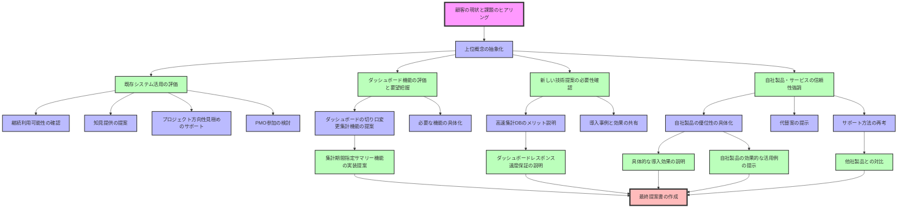

# 20240704 DSC & WA構築、提案への道 (担当者攻略編)

%20bb92d0285d364d8b907c573aed23e375/Untitled.png)

<aside>
💡 おっす！GPT。この画像の内容が何書いてあるか構造化された文章に分解してください

</aside>

↓

```markdown
### DSC & WA構築、提案への道 (担当者攻略編)

#### 1. 既存DWHの活用希望
- **依頼事項**: 既存DWHを継続して活用したい。
- **期待事項**: ウィングアークには知見の提供やプロジェクトの方向性の見極めを期待している。PMOとしてプロジェクトに参加してほしい。
- **ニーズ確認**: 高速集計のニーズはないため、Dr.Sumは必要ないとの認識。

#### 2. 奥村神ダッシュボードの評価と要望
- **評価**: 奥村神ダッシュボードは最高。
- **要望**: 切り口を変えた集計ができる機能が欲しい。

#### 3. 高速集計DBの提案
- **提案事項**: ウィングアークのダッシュボード案を実現するために、高速集計DBを提案に組み込む。
- **結果**: RFPに「集計条件のダッシュボード上での変更」要件が組み込まれた。

#### 4. 自社製品・自社サービスでの提案
- **確認事項**: 自社製品・自社サービスでの提案となり、PMO支援は難しい。
- **感謝**: 無理難題を最後まで検討してくれたことに感謝。
- **提案検討**: 「既存DWHをDr.Sumに置き換える」案も検討の価値あり。

#### 5. ダッシュボード案の進捗
- **進捗状況**: ダッシュボード案はすでに完成している。

#### 6. サービス部隊のフィードバック
- **フィードバック**: サービス部隊からは、既存DWHを有効活用することがベストという意見。ただし、他社構築のDBに対して作業はできないため、PMOは困難。

#### 7. 顧客視点の懸念
- **懸念事項**: 顧客視点では「ウィングアーク都合」と見られかねない。イオン側のニーズに寄り添った提案をする必要がある。

#### 8. 奥村神の追加提案
- **提案**: 集計期間を指定してサマリーする機能が有用かどうかの確認。

#### 9. 高速集計DBの必要性
- **必要性確認**: 切り口を変えた集計でダッシュボードのレスポンス速度を担保するには、高速集計DBが必須。

#### 10. 結論と次のステップ
- **結論**: 既存DWH活用を前提としたPMO支援は困難。「自社製品・自社サービス」での提案を行う。

---

### 議論の要点
本議論は、既存のDWH（データウェアハウス）をどのように活用し、新しいプロジェクトでウィングアークの製品とサービスをどのように提案するかについての戦略を決定することに焦点を当てています。特に、高速集計のニーズや既存システムとの統合、PMO（プロジェクト管理オフィス）の役割、顧客視点での提案の受け入れなどについての詳細な議論が行われています。
```

<aside>
💡 ↑

上記から読み取れる

- 顧客課題：
- 提案のズレた箇所：
- 対策として妙技：

3点は？

</aside>

↓

```markdown
### 顧客課題
1. **既存DWHの継続活用**:
   - 顧客は既存のデータウェアハウス（DWH）を引き続き使用したいと考えている。新たなシステムへの移行ではなく、既存システムの有効活用を求めている。
   
2. **PMO支援の要望**:
   - プロジェクトが正しい方向に進むように知見の提供と見極めを期待しており、PMOとしての支援を希望している。
   
3. **切り口を変えた集計機能**:
   - 顧客はダッシュボードにおいて、柔軟に切り口を変えて集計する機能を求めている。

### 提案のズレた箇所
1. **Dr.Sumの必要性の認識違い**:
   - 顧客は高速集計のニーズがないため、Dr.Sumは必要ないと考えているが、ウィングアーク側はDr.Sumを含めた提案を行っている。
   
2. **PMO支援の可否**:
   - ウィングアークは、既存のDWHに対してPMOとしての支援が難しいと伝えているが、顧客はその支援を強く希望している。
   
3. **自社製品・サービスの押し付け**:
   - ウィングアーク側の提案が顧客ニーズに寄り添っていない部分があり、顧客視点では「ウィングアーク都合」に見えると懸念されている。

### 対策として妙技
1. **顧客ニーズに合わせた柔軟な提案**:
   - 既存DWHの活用を前提とし、Dr.Sumの導入を避ける。また、顧客の求める切り口を変えた集計機能を提供することで、提案を顧客ニーズに合わせる。
   
2. **PMO支援の調整**:
   - ウィングアークがPMO支援を提供できる形を模索し、他社DBに対しても知見を提供できるようにする。また、PMO支援が難しい場合は、代替案として顧客が納得できる形での支援を提案する。
   
3. **顧客視点での提案強化**:
   - 顧客ニーズに寄り添った提案を行うため、ウィングアーク都合ではなく、顧客の期待や要望を丁寧にヒアリングし、それに基づいた提案を行う。具体的には、集計期間の指定やサマリー機能など、顧客が求める具体的な機能を提案に盛り込む。
```

<aside>
💡 超仮説思考で考察すべきポイントを列挙して
テーブル表でまとめて
ポイントは３つに絞り込んでカラム表記して

</aside>

↓

### ▶️超仮説思考で考察すべきポイント

以下のポイントを考察し、顧客課題、提案のズレ、対策として妙技の3つに絞り込んでテーブルにまとめます。

1. **既存DWHの継続使用の希望**
2. **PMO支援の要望と実現可能性**
3. **Dr.Sumの必要性に関する認識の相違**
4. **切り口を変えた集計機能の要望**
5. **ウィングアークの自社製品・サービスの提案**
6. **高速集計DBの導入についての意見**
7. **顧客視点での提案の受け入れ**
8. **ダッシュボードの柔軟な集計機能の実現**
9. **顧客ニーズに寄り添う提案の必要性**

| 考察ポイント | 顧客課題 | 提案のズレ | 対策として妙技 |
| --- | --- | --- | --- |
| 既存DWHの継続使用の希望 | 既存DWHを継続して使用したい | Dr.Sumの導入を提案している | 既存DWHを活用する提案を行う |
| PMO支援の要望と実現可能性 | プロジェクト管理の支援を希望 | PMO支援が難しいと伝えている | 顧客が納得できる形での支援方法を模索する |
| 切り口を変えた集計機能の要望 | ダッシュボードで柔軟な集計機能を求めている | 柔軟な集計機能が提案に含まれていない | 顧客の要望に合わせて柔軟な集計機能を提供する |

<aside>
💡 OK！GPT。この画像の内容、超汎用スピプロV2に展開！

</aside>

↓

## 超構造化[設計概念]：

| 番号 | 項目 | 上位概念 | 下位概念 | Token |
| --- | --- | --- | --- | --- |
| 1 | 既存DWHの活用希望 | 既存システム活用 | 継続利用、知見提供、プロジェクト方向性見極め、PMO参加、高速集計不要 | 既存DWH、継続利用、知見提供、プロジェクト方向性見極め、PMO参加、高速集計不要 |
| 2 | 奥村神ダッシュボードの評価と要望 | ダッシュボード機能 | 高評価、切り口変更集計の要望 | 奥村神ダッシュボード、高評価、切り口変更、集計要望 |
| 3 | 高速集計DBの提案 | 新しい技術提案 | 高速集計DB、要件組込集計条件変更 | 高速集計DB、ダッシュボード案、要件組込、集計条件変更 |
| 4 | 自社製品・自社サービスでの提案 | 自社製品提案 | PMO支援困難、感謝、DWH置き換え案 | 自社製品、自社サービス、提案、PMO支援困難、感謝、DWH置き換え案 |
| 5 | ダッシュボード案の進捗 | 案の進捗状況 | ダッシュボード案完成 | ダッシュボード案、進捗状況、完成 |
| 6 | サービス部隊のフィードバック | 社内フィードバック | 既存DWH活用、他社DB作業不可、PMO困難 | サービス部隊、フィードバック、既存DWH活用、他社DB作業不可、PMO困難 |
| 7 | 顧客視点の懸念 | 顧客視点の重視 | ウィングアーク都合視点の懸念、イオン側のニーズ対応 | 顧客視点、懸念、ウィングアーク都合、イオンニーズ対応 |
| 8 | 奥村神の追加提案 | ダッシュボード機能追加提案 | 集計期間指定サマリー機能 | 奥村神、追加提案、集計期間指定、サマリー機能 |
| 9 | 高速集計DBの必要性 | 新しい技術提案 | ダッシュボードレスポンス速度保証 | 高速集計DB、必要性、ダッシュボード、レスポンス速度 |
| 10 | 結論と次のステップ | 結論と提案の進め方 | 既存DWH活用前提、PMO支援困難、自社製品・自社サービス提案 | 結論、既存DWH活用、PMO支援困難、自社製品、自社サービス提案 |

## 超抽象化[上位概念]:

| 番号 | 項目 | Token | ビフォー現象 | 超具体化する上でのポイント |
| --- | --- | --- | --- | --- |
| 1 | 既存システム活用 | 既存DWH、高速集計不要 | 既存のデータウェアハウスを継続活用すること | 新たなシステムに変更しなくても運用可能かどうかを確認 |
| 2 | ダッシュボード機能 | ダッシュボード、切り口変更、集計要望 | ダッシュボードの多機能性 | 必要な機能が揃っているかの確認 |
| 3 | 新しい技術提案 | 高速集計DB、要件組込 | 新しい技術提案に対する期待感 | 導入後の効果測定の計画 |
| 4 | 自社製品提案 | 自社製品、自社サービス | 自社製品に対する信頼度 | 他の製品と比較して優位性があるか |
| 5 | 案の進捗状況 | ダッシュボード案、進捗 | ダッシュボード案の完成度 | 迅速な対応が可能か |
| 6 | 社内フィードバック | サービス部隊、有効活用、作業不可 | サービス部隊からのフィードバック | 社内からの評価 |
| 7 | 顧客視点の重視 | 顧客、ニーズ | 顧客の不安や懸念 | 顧客ニーズにどれだけ対応できるか |
| 8 | ダッシュボード機能追加提案 | 奥村神、期間指定、サマリー機能 | 追加提案に対する期待感 | 必要な機能が実装されているか |
| 9 | 結論と提案の進め方 | 既存DWH、PMO支援困難 | 提案の方向性 | 次のステップ具体案 |

## 超具体化[下位概念]:

| 番号 | 項目 | Token | アフター現象 | 超抽象化する上でのポイント |
| --- | --- | --- | --- | --- |
| 1 | 継続利用、知見提供、プロジェクト方向性見極め、PMO参加、高速集計不要 | 既存DWH、高速集計不要、知見提供、方向性見極め、PMO参加 | 組織全体での継続利用可能性 | 利用時の具体的な手順 |
| 2 | 高評価、切り口変更集計の要望 | 評価、集計 | 集計の柔軟性 | 集計時の具体的手法 |
| 3 | 高速集計DB、要件組込集計条件変更 | 高速DB提案、要件組込 | 集計条件変更に対応可能 | 集計条件変更の具体化 |
| 4 | PMO支援困難、感謝、DWH置き換え案 | 自社製品提案、感謝 | 支援難易度 | 支援困難時の対策 |
| 5 | ダッシュボード案完成 | 案の進捗状況、完了 | 継続的な運用開始 | 完成後の運用例 |
| 6 | 既存DWH活用、他社DB作業不可、PMO困難 | フィードバック、有効活用、作業不可 | 他社DBの場合の対応 | 他社システムの対応方針 |
| 7 | ウィングアーク都合視点の懸念、イオン側のニーズ対応 | 顧客、ニーズ対応 | イオン側の視点での懸念解消 | 顧客視点でのアプローチ |
| 8 | 集計期間指定サマリー機能 | 提案、期間指定、サマリー機能 | 集計機能の一部 | 期間指定集計の具体例 |
| 9 | ダッシュボードレスポンス速度保証 | 集計速度、レスポンス、新技術 | レスポンス速度の向上 | 速度向上の具体的手法 |
| 10 | 既存DWH活用前提、PMO支援困難、自社製品・自社サービス提案 | 提案、既存DWH活用、自社製品提案 | 提案方向の確立 | 提案具体案の構築方法 |

## 考察コメント:

### 提案思考のプロセス

顧客の要望と考えに対する提案を行う際に、以下のステップに最適化することで、顧客の理解を得やすくすることができます：

### 1. 既存システムの評価と活用の強調

- **現状と課題の整理**: 顧客の現状のシステム（既存DWH）の利点を再確認し、それを継続利用するメリットを明確化します。
- **知見の提供**: ウィングアークの専門知識を提供し、プロジェクトの方向性を見極めるサポートを提供することを強調します。
- **高速集計の必要性の評価**: 顧客が高速集計を必要としない場合、その理由と現状のパフォーマンスについて具体的に説明します。

### 2. ダッシュボード機能の強化

- **ダッシュボードの評価**: 顧客が評価する奥村神ダッシュボードの機能について褒めることで、信頼感を築きます。
- **追加機能提案**: 切り口を変えた集計や集計期間指定サマリー機能を具体的に提案し、顧客の要望に応えます。

### 3. 高速集計DBの重要性の説明

- **新技術の必要性**: 高速集計DBがなぜ重要なのか、ダッシュボードのレスポンス速度の向上にどう寄与するのかを具体的に例示します。
- **具体的事例の提示**: 他の企業での高速集計DB導入事例や得られた成果を共有し、導入のメリットを詳細に説明します。

### 4. 自社製品の提案と柔軟な対応

- **自社製品の信頼性の強調**: 自社製品・サービスの信頼性と優位性を具体的なデータで示します。
- **代替案の提示**: 既存DWHをDr.Sumに置き換える案など、柔軟に対応することで顧客の意見を尊重しつつ提案の幅を広げます。

### 5. 顧客視点に立ったアプローチ

- **顧客の懸念を理解**: ウィングアーク都合と見られないように、顧客の視点や懸念をしっかりと理解します。
- **ニーズへの対応**: 顧客が本当に求めているニーズが何かを再確認し、それに対する最善の提案を行います。

### 結論と次のステップ

- **既存DWH活用の前提**: 既存DWHを基盤とした提案を行い、顧客の現状をなるべく尊重します。
- **PMO支援の困難性**: PMOとしての支援が難しい理由を説明しつつ、他のサポート方法を提案します。
- **自社製品・自社サービスの提案**: 自社製品の導入のメリットを強調しつつ、具体的な次のステップを提案します。

このアプローチにより、顧客の理解と納得を得やすくし、効果的な提案を実現します。

<aside>
💡 この思考プロセスから
固有名詞を全て排除してもらい
全てのエンタープライズ企業に対して提案書に落とし込むまでの作成するプロセスとして
壁打ち 相手に
この生成 AI を使いたいと思ってます 
そのフローチャートをマーメイド 形式で表してみてください

</aside>

↓  ででん



<aside>
💡 OK,では Claude3.5 sonnet でこれをSVGかして見やすくしよう

</aside>

%20bb92d0285d364d8b907c573aed23e375/Untitled%201.png)

- ▶️コード
    
    ```mermaid
    <svg xmlns="http://www.w3.org/2000/svg" viewBox="0 0 800 2000">
      <defs>
        <marker id="arrowhead" markerWidth="10" markerHeight="7" refX="0" refY="3.5" orient="auto">
          <polygon points="0 0, 10 3.5, 0 7" fill="#888"/>
        </marker>
      </defs>
      
      <!-- 背景 -->
      <rect width="100%" height="100%" fill="#f0f0f0"/>
      
      <!-- メインフロー（背後に配置） -->
      <g stroke="#888" stroke-width="2" fill="none">
        <path d="M400 50 L400 1950" marker-end="url(#arrowhead)"/>
      </g>
      
      <!-- 接続線（背後に配置） -->
      <g stroke="#888" stroke-width="1" fill="none">
        <path d="M400 80 L400 120" marker-end="url(#arrowhead)"/>
        <path d="M400 180 L150 220" marker-end="url(#arrowhead)"/>
        <path d="M400 180 L400 220" marker-end="url(#arrowhead)"/>
        <path d="M400 180 L650 220" marker-end="url(#arrowhead)"/>
        <path d="M400 180 L400 320" marker-end="url(#arrowhead)"/>
        
        <path d="M150 280 L140 420" marker-end="url(#arrowhead)"/>
        <path d="M150 280 L140 480" marker-end="url(#arrowhead)"/>
        <path d="M150 280 L140 540" marker-end="url(#arrowhead)"/>
        <path d="M150 280 L140 600" marker-end="url(#arrowhead)"/>
        
        <path d="M400 280 L400 420" marker-end="url(#arrowhead)"/>
        <path d="M400 280 L400 480" marker-end="url(#arrowhead)"/>
        
        <path d="M650 280 L650 420" marker-end="url(#arrowhead)"/>
        <path d="M650 280 L650 480" marker-end="url(#arrowhead)"/>
        
        <path d="M400 380 L400 540" marker-end="url(#arrowhead)"/>
        <path d="M400 380 L400 600" marker-end="url(#arrowhead)"/>
        <path d="M400 380 L400 660" marker-end="url(#arrowhead)"/>
        
        <path d="M400 470 L150 750" marker-end="url(#arrowhead)"/>
        <path d="M650 470 L400 750" marker-end="url(#arrowhead)"/>
        <path d="M400 590 L650 750" marker-end="url(#arrowhead)"/>
        <path d="M400 710 L400 820" marker-end="url(#arrowhead)"/>
        <path d="M400 590 L650 820" marker-end="url(#arrowhead)"/>
        
        <path d="M150 810 L400 920" marker-end="url(#arrowhead)"/>
        <path d="M400 810 L400 920" marker-end="url(#arrowhead)"/>
        <path d="M650 810 L400 920" marker-end="url(#arrowhead)"/>
        <path d="M400 880 L400 920" marker-end="url(#arrowhead)"/>
        <path d="M650 880 L400 920" marker-end="url(#arrowhead)"/>
      </g>
      
      <!-- ボックスとテキスト -->
      <g font-family="Arial, sans-serif" font-size="14">
        <!-- 開始 -->
        <rect x="250" y="20" width="300" height="60" rx="10" fill="#ff99cc" stroke="#333" stroke-width="2"/>
        <text x="400" y="55" text-anchor="middle">顧客の現状と課題のヒアリング</text>
        
        <!-- 抽象化 -->
        <rect x="250" y="120" width="300" height="60" rx="10" fill="#99ccff" stroke="#333" stroke-width="2"/>
        <text x="400" y="155" text-anchor="middle">上位概念の抽象化</text>
        
        <!-- 4つの主要分野 -->
        <g>
          <rect x="50" y="220" width="200" height="60" rx="10" fill="#ccffcc" stroke="#333" stroke-width="2"/>
          <text x="150" y="255" text-anchor="middle">既存システム活用の評価</text>
          
          <rect x="300" y="220" width="200" height="60" rx="10" fill="#ccffcc" stroke="#333" stroke-width="2"/>
          <text x="400" y="248" text-anchor="middle" style="font-size: 12px;">ダッシュボード機能の</text>
          <text x="400" y="265" text-anchor="middle" style="font-size: 12px;">評価と要望把握</text>
          
          <rect x="550" y="220" width="200" height="60" rx="10" fill="#ccffcc" stroke="#333" stroke-width="2"/>
          <text x="650" y="248" text-anchor="middle" style="font-size: 12px;">新しい技術提案の</text>
          <text x="650" y="265" text-anchor="middle" style="font-size: 12px;">必要性確認</text>
          
          <rect x="300" y="320" width="200" height="60" rx="10" fill="#ccffcc" stroke="#333" stroke-width="2"/>
          <text x="400" y="348" text-anchor="middle" style="font-size: 12px;">自社製品・サービスの</text>
          <text x="400" y="365" text-anchor="middle" style="font-size: 12px;">信頼性強調</text>
        </g>
        
        <!-- 詳細アクション -->
        <g>
          <rect x="50" y="420" width="180" height="50" rx="10" fill="#e6e6ff" stroke="#333" stroke-width="2"/>
          <text x="140" y="448" text-anchor="middle" style="font-size: 12px;">継続利用可能性の確認</text>
          
          <rect x="50" y="480" width="180" height="50" rx="10" fill="#e6e6ff" stroke="#333" stroke-width="2"/>
          <text x="140" y="508" text-anchor="middle" style="font-size: 12px;">知見提供の提案</text>
          
          <rect x="50" y="540" width="180" height="50" rx="10" fill="#e6e6ff" stroke="#333" stroke-width="2"/>
          <text x="140" y="563" text-anchor="middle" style="font-size: 10px;">プロジェクト方向性</text>
          <text x="140" y="578" text-anchor="middle" style="font-size: 10px;">見極めのサポート</text>
          
          <rect x="50" y="600" width="180" height="50" rx="10" fill="#e6e6ff" stroke="#333" stroke-width="2"/>
          <text x="140" y="628" text-anchor="middle" style="font-size: 12px;">PMO参加の検討</text>
          
          <rect x="300" y="420" width="200" height="50" rx="10" fill="#e6e6ff" stroke="#333" stroke-width="2"/>
          <text x="400" y="443" text-anchor="middle" style="font-size: 10px;">ダッシュボードの切り口</text>
          <text x="400" y="458" text-anchor="middle" style="font-size: 10px;">変更集計機能の提案</text>
          
          <rect x="300" y="480" width="200" height="50" rx="10" fill="#e6e6ff" stroke="#333" stroke-width="2"/>
          <text x="400" y="508" text-anchor="middle" style="font-size: 12px;">必要な機能の具体化</text>
          
          <rect x="550" y="420" width="200" height="50" rx="10" fill="#e6e6ff" stroke="#333" stroke-width="2"/>
          <text x="650" y="443" text-anchor="middle" style="font-size: 12px;">高速集計DBの</text>
          <text x="650" y="458" text-anchor="middle" style="font-size: 12px;">メリット説明</text>
          
          <rect x="550" y="480" width="200" height="50" rx="10" fill="#e6e6ff" stroke="#333" stroke-width="2"/>
          <text x="650" y="503" text-anchor="middle" style="font-size: 12px;">導入事例と</text>
          <text x="650" y="518" text-anchor="middle" style="font-size: 12px;">効果の共有</text>
          
          <rect x="300" y="540" width="200" height="50" rx="10" fill="#e6e6ff" stroke="#333" stroke-width="2"/>
          <text x="400" y="563" text-anchor="middle" style="font-size: 12px;">自社製品の</text>
          <text x="400" y="578" text-anchor="middle" style="font-size: 12px;">優位性の具体化</text>
          
          <rect x="300" y="600" width="200" height="50" rx="10" fill="#e6e6ff" stroke="#333" stroke-width="2"/>
          <text x="400" y="628" text-anchor="middle" style="font-size: 12px;">代替案の提示</text>
          
          <rect x="300" y="660" width="200" height="50" rx="10" fill="#e6e6ff" stroke="#333" stroke-width="2"/>
          <text x="400" y="688" text-anchor="middle" style="font-size: 12px;">サポート方法の再考</text>
        </g>
        
        <!-- 最終アクション -->
        <g>
          <rect x="50" y="750" width="200" height="60" rx="10" fill="#ccffcc" stroke="#333" stroke-width="2"/>
          <text x="150" y="773" text-anchor="middle" style="font-size: 11px;">集計期間指定サマリー</text>
          <text x="150" y="788" text-anchor="middle" style="font-size: 11px;">機能の実装提案</text>
          
          <rect x="300" y="750" width="200" height="60" rx="10" fill="#ccffcc" stroke="#333" stroke-width="2"/>
          <text x="400" y="773" text-anchor="middle" style="font-size: 11px;">ダッシュボード</text>
          <text x="400" y="788" text-anchor="middle" style="font-size: 11px;">レスポンス速度保証の説明</text>
          
          <rect x="550" y="750" width="200" height="60" rx="10" fill="#ccffcc" stroke="#333" stroke-width="2"/>
          <text x="650" y="773" text-anchor="middle" style="font-size: 11px;">具体的な</text>
          <text x="650" y="788" text-anchor="middle" style="font-size: 11px;">導入効果の説明</text>
          
          <rect x="300" y="820" width="200" height="60" rx="10" fill="#ccffcc" stroke="#333" stroke-width="2"/>
          <text x="400" y="843" text-anchor="middle" style="font-size: 11px;">他社製品との対比</text>
          
          <rect x="550" y="820" width="200" height="60" rx="10" fill="#ccffcc" stroke="#333" stroke-width="2"/>
          <text x="650" y="843" text-anchor="middle" style="font-size: 11px;">自社製品の</text>
          <text x="650" y="858" text-anchor="middle" style="font-size: 11px;">効果的な活用例の提示</text>
        </g>
        
        <!-- 最終提案書 -->
        <rect x="250" y="920" width="300" height="60" rx="10" fill="#ffcc99" stroke="#333" stroke-width="2"/>
        <text x="400" y="955" text-anchor="middle">最終提案書の作成</text>
      </g>
    </svg>
    ```
    

<aside>
💡 これをシステムプロンプトに入れて一発でシナリオ書き上げるようにしたいので
フォーマット化してください
コードブロックないにマークダウン形式で記載

</aside>

↓ フォーマット定義

```markdown
# format:
- プロジェクト提案プロセス

## 1. 顧客の現状と課題のヒアリング

## 2. 上位概念の抽象化

## 3. 主要分野の評価
### 3.1 既存システム活用の評価
- [ ] 継続利用可能性の確認
- [ ] 知見提供の提案
- [ ] プロジェクト方向性見極めのサポート
- [ ] PMO参加の検討

### 3.2 ダッシュボード機能の評価と要望把握
- [ ] ダッシュボードの切り口変更集計機能の提案
- [ ] 必要な機能の具体化

### 3.3 新しい技術提案の必要性確認
- [ ] 高速集計DBのメリット説明
- [ ] 導入事例と効果の共有

### 3.4 自社製品・サービスの信頼性強調
- [ ] 自社製品の優位性の具体化
- [ ] 代替案の提示
- [ ] サポート方法の再考

## 4. 最終アクション
- [ ] 集計期間指定サマリー機能の実装提案
- [ ] ダッシュボードレスポンス速度保証の説明
- [ ] 具体的な導入効果の説明
- [ ] 他社製品との対比
- [ ] 自社製品の効果的な活用例の提示

## 5. 最終提案書の作成

---

シナリオ作成の注意点:
1. 各セクションに具体的な内容を記入してください。
2. チェックボックス項目には、具体的なアクションや提案を記載してください。
3. 顧客の業界や規模に応じて、適切な例や数値を用いてください。
4. 全体の流れが論理的で一貫性があることを確認してください。
5. 最終提案書には、前述の全てのポイントが簡潔にまとめられていることを確認してください。
```