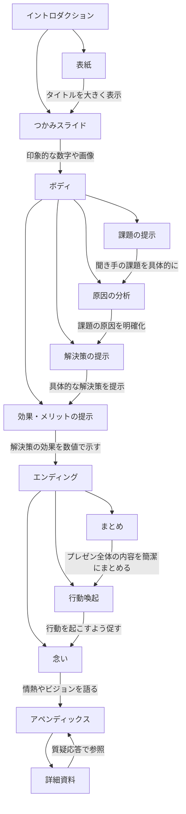

# 20240704 ウイングアーク１ｓｔ様 “仮設検証思考”についてGPT活用術[研修]

[https://vimeo.com/976432075/319245147b?share=copy](https://vimeo.com/976432075/319245147b?share=copy)

[https://vimeo.com/976432075/319245147b?share=copy](https://vimeo.com/976432075/319245147b?share=copy)

▶️ログ：

[GMT20240704-055458_Recording.transcript.vtt](20240704%20%E3%82%A6%E3%82%A4%E3%83%B3%E3%82%AF%E3%82%99%E3%82%A2%E3%83%BC%E3%82%AF%EF%BC%91%EF%BD%93%EF%BD%94%E6%A7%98%20%E2%80%9C%E4%BB%AE%E8%A8%AD%E6%A4%9C%E8%A8%BC%E6%80%9D%E8%80%83%E2%80%9D%E3%81%AB%E3%81%A4%E3%81%84%E3%81%A6GPT%E6%B4%BB%E7%94%A8%E8%A1%93%5B%E7%A0%94%E4%BF%AE%5D%207a49f05395674c7bae05ab967fb2c6bf/GMT20240704-055458_Recording.transcript.vtt)

[meeting_saved_chat.txt](20240704%20%E3%82%A6%E3%82%A4%E3%83%B3%E3%82%AF%E3%82%99%E3%82%A2%E3%83%BC%E3%82%AF%EF%BC%91%EF%BD%93%EF%BD%94%E6%A7%98%20%E2%80%9C%E4%BB%AE%E8%A8%AD%E6%A4%9C%E8%A8%BC%E6%80%9D%E8%80%83%E2%80%9D%E3%81%AB%E3%81%A4%E3%81%84%E3%81%A6GPT%E6%B4%BB%E7%94%A8%E8%A1%93%5B%E7%A0%94%E4%BF%AE%5D%207a49f05395674c7bae05ab967fb2c6bf/meeting_saved_chat.txt)

[meeting_saved_closed_caption.txt](20240704%20%E3%82%A6%E3%82%A4%E3%83%B3%E3%82%AF%E3%82%99%E3%82%A2%E3%83%BC%E3%82%AF%EF%BC%91%EF%BD%93%EF%BD%94%E6%A7%98%20%E2%80%9C%E4%BB%AE%E8%A8%AD%E6%A4%9C%E8%A8%BC%E6%80%9D%E8%80%83%E2%80%9D%E3%81%AB%E3%81%A4%E3%81%84%E3%81%A6GPT%E6%B4%BB%E7%94%A8%E8%A1%93%5B%E7%A0%94%E4%BF%AE%5D%207a49f05395674c7bae05ab967fb2c6bf/meeting_saved_closed_caption.txt)

▶️次回：

{必要に応じて研修・1on1などサポート体制揃えてます、ご相談ください}

▶️前回：

[20240530 ウイングアーク１ｓｔ**様 TANRENCHAT操作説明会**](20240530%20%E3%82%A6%E3%82%A4%E3%83%B3%E3%82%AF%E3%82%99%E3%82%A2%E3%83%BC%E3%82%AF%EF%BC%91%EF%BD%93%EF%BD%94%E6%A7%98%20TANRENCHAT%E6%93%8D%E4%BD%9C%E8%AA%AC%E6%98%8E%E4%BC%9A%20ebc0a23d7b32461e97f156e788db9cb8.md) 

▶️参照）

**お話できなかった[Bコース]**

アンケート回収した[曖昧な課題]から[ゴールシークプロンプト]を作成

Claude-APIを活用して、スプレットシートで並列処理をかける。

エンジニア不要で、ほぼノーコードツール並みの生産性が手に入る

[https://docs.google.com/spreadsheets/d/1iTnhV531pTfMr7h7koMiLfPddF1BvvpYGFipqo2SJ3g/edit?usp=sharing](https://docs.google.com/spreadsheets/d/1iTnhV531pTfMr7h7koMiLfPddF1BvvpYGFipqo2SJ3g/edit?usp=sharing)

**お話できなかった[Cコース]**

20240704 DSC & WA構築、提案への道 (担当者攻略編)

[https://www.notion.so/20240704-1st-GPT-7a49f05395674c7bae05ab967fb2c6bf?pvs=4](20240704%20%E3%82%A6%E3%82%A4%E3%83%B3%E3%82%AF%E3%82%99%E3%82%A2%E3%83%BC%E3%82%AF%EF%BC%91%EF%BD%93%EF%BD%94%E6%A7%98%20%E2%80%9C%E4%BB%AE%E8%A8%AD%E6%A4%9C%E8%A8%BC%E6%80%9D%E8%80%83%E2%80%9D%E3%81%AB%E3%81%A4%E3%81%84%E3%81%A6GPT%E6%B4%BB%E7%94%A8%E8%A1%93%5B%E7%A0%94%E4%BF%AE%5D%207a49f05395674c7bae05ab967fb2c6bf.md)

上記の内容を掘り下げる、

個別研修・部署ごと・個人ごとの1on1もメニューとして提供可能です。

ご相談くださいませ


▶️議事録

> **生成AI活用勉強会**
> 
> 
> ---
> 
> ### 議事の要旨:
> 
> ウィングアーク1st社内で行われた生成AI活用勉強会。講師の佐藤勝彦氏を招き、生成AIの基礎知識から応用、具体的な活用方法までを学習した。特に、構造化された文章の重要性と、音声入力によるAIとの効率的な対話方法が強調された。後半では、参加者から寄せられた質問を基に、佐藤氏が個別にカスタマイズしたプロンプトを大量に生成するデモが行われ、参加者から驚きの声が上がった。
> 
> ## 生成AI活用：基礎と応用
> 
> ### 生成AIの概要と活用
> 
> - **佐藤勝彦氏 自己紹介** [00:00:39]
>     - 株式会社TANREN所属
>     - 営業ド畑出身
>     - 生成AIのエキスパートとしてエバンジェリスト活動を行なってる。　（社外で担いでるAI/クラウド商材８社）
> - **森脇氏 勉強会の趣旨説明** [00:06:41]
>     - 生成AIを使いこなせていない人が多い現状を改善する
>     - 佐藤氏との出会いにより、生成AIの可能性に気づかされた
>     - 生成AIはアシスタントとして、人間の才能を引き出すツール
>     - 自動車のように、生成AIという新しいツールに乗りこなそう
> - **TANREN環境について** [00:09:40]
>     - 営業本部限定でTANREN環境を提供
>     - 最新のGPT-4o(回数制限あり)とGPT-3.5(使い放題)を利用可能
>     - 個人で利用する場合は、セキュリティ設定に注意
> - **佐藤氏 生成AIの現状説明** [00:14:53]
>     - CoPilot、Gemini、Perplexity、Claudeなど、様々な生成AIサービスが登場
>     - サービスによって特徴が異なるため、用途に合わせて使い分ける
>     - 5月30日の説明会資料も参考に
> - **テキスト入力の重要性** [00:18:37]
>     - テキストを制する者がAIを制する
>     - 構造化された文章であることが重要
> 
> ### 構造化された文章とマークダウン
> 
> - **Perplexityによる構造化された文章の例** [00:20:01]
>     - 「構造化された文章とは？マークダウンとは？」という質問をPerplexityに入力
>     - 質問の文脈を読み取り、それぞれの意味を明確に区切った回答を生成
>     - 引用記事も表示されるため、情報の信頼性が高い(唯一検索サービスとして使っても支障がない）
> - **CoPilotによる構造化された文章の例** [00:23:16]
>     - CoPilotにも同様の質問を入力
>     - Bing検索エンジンにより、引用文付きの回答を生成
>     - 大手エンタープライズに最適なMS Officeとの連携が魅力
>     - 初心者向けの設計
> - **構造化された文章の定義** [00:24:02]
>     - 文章の内容を整理し、構成要素とその関係を明確にする
>     - 情報をわかりやすく、論理的に伝える
>     - 例：問題の要点を3つにまとめ、段落ごとに主張と根拠を整理
> - **マークダウンの解説** [00:24:56]
>     - 文章を簡単に美しく整えるための記法
>     - 見出し、リスト、強調など、基本的な記法を覚える
> - **TANRENでの実践** [00:27:07]
>     - テーマ：「仮説思考」「提案志向」
>     - クライアント企業の情報を構造化された文章で出力
>     - 佐藤氏による音声入力の実演
> 
> ### 音声入力とAIとの対話
> 
> - **音声入力のメリット** [00:27:58]
>     - テキスト入力よりも効率的
>     - 長文入力により、AIが文脈を理解しやすくなる
> - **音声入力ツールの紹介** [00:28:32]
>     - VoiceIn/ボイスイン(Chrome拡張機能)
>     - Google Speech to Text
>     - OS標準の音声入力機能
>         - mac [地球儀マーク2回]、Windows [WInキー+H]
> - **TANRENでの音声入力実践** [00:28:32]
>     - ウィングアーク1st社の企業情報を音声入力で要求
>     - 構造化された文章で出力
>     - インデントによる階層構造も表現
> - **AIとの対話** [00:32:55]
>     - AIは人ではないが、対話を通して理解を深める
>     - 構造化された文章により、AIとの意思疎通が円滑になる
> 
> ### 複数AIサービスの比較
> 
> - **Claudeによるプレゼン資料作成** [00:43:44]
>     - TANRENで出力したウィングアーク1st社の企業情報をClaudeに入力
>     - HTML形式のリッチなプレゼン資料を生成
>     - プレビュー画面でリアルタイムに確認可能
> - **パワハラプロンプト** [00:44:50]
>     - AIに対して厳しい言葉で要求を出す(これは60点の出来だ、100点を目指せ）
>     - 意図した結果を引き出すためのテクニック
> - **Claudeのエラー対応** [00:46:31]
>     - エラーが出た場合は、エラーメッセージをAIにフィードバック
>     - 対話を通して修正
> - **TANREN、Claude、Geminiの比較** [01:00:03]
>     - 国語力：Claude、Gemini > GPT-4o
>     - プログラミングコードが扱える：GPT-4o(＝Python)が優位
>     - 用途に合わせて使い分ける
> 
> ### 提案資料作成ツール
> 
> - **イルシル** [01:01:09]
>     - 日本語に最適化されたスライド自動生成サービス
>     - 無料で利用可能
>     - 多数のテンプレート、アイコン、グラフなどを提供
> - **ガンマ** [01:00:56]
>     - テキストからスライドを自動生成
>     - AIによる画像生成機能も搭載
>     - 商用利用には有料プランが必要
> - **イルシル、ガンマの実演** [01:03:50]
>     - TANRENで出力したテキストをイルシル、ガンマに入力
>     - 自動でスライドを生成
> 
> ### まとめと質疑応答
> 
> - **生成AI活用のポイント** [01:13:50]
>     - テキスト構造化、音声入力、AIとの対話
>     - 検索エンジンではなく、アシスタントとして活用
>     - パープレキシティー、CoPilotは検索用途に最適
> - **今後の展望** [01:18:39]
>     - 生成AIを使いこなすことで、業務効率化、生産性向上
>     - 部署内で共有、活用事例を蓄積
>     - 生成AIは進化し続けるため、継続的な学習が必要
> - **質問：エクセル関数でClaudeを利用する方法** [02:20:06]
>     - APIの利用が必要
>     - 下地準備が必要なため、すぐに利用するのは難しい
> - **質問：TANRENのモバイル版について** [02:21:11]
>     - iPhone、Androidのブラウザから利用可能
>     - 音声入力も活用できる
> - **佐藤氏から参加者へのプレゼント** [02:12:30]
>     - 事前に提出された質問に基づき、佐藤氏が個別に作成したプロンプトを共有
>     - エクセル関数でClaude APIを呼び出し、自動生成
>     - 生成AIを関数として活用する例
> - **今後の展開** [02:16:48]
>     - 生成AIの活用により、業務効率化、生産性向上
>     - 日本全体の経済活性化に貢献
> 
> ## 質疑応答
> 
> ### TANRENのモバイル版
> 
> - **大谷氏 質問** [02:21:11]
>     - TANRENはスマートフォンでも利用可能か？
> - **佐藤氏 回答** [02:21:20]
>     - モバイルChrome、Safariなどのブラウザからアクセス可能
>     - iPhoneの音声入力機能が便利
> 
> ### エクセル関数でClaudeを利用する方法
> 
> - **藤井氏 質問** [02:20:06]
>     - エクセル関数でClaudeの関数を利用できるか？
> - **佐藤氏 回答** [02:20:17]
>     - APIの利用と下地準備が必要
>     - 現状では個人がすぐに利用するのは難しい
> 
> ## 森脇氏 まとめ
> 
> - **生成AI活用のポイント** [02:09:14]
>     - 仕事が発生したら、まず生成AIを活用することを考える
>     - 生成AIはアシスタントとして、人間の能力を向上させるツール
>     - 70点のアウトプットを生成AIから得て、残りの30点を人間で補う
> - **情報共有の重要性** [02:11:17]
>     - Slackのスレッドで、生成AIの活用事例やプロンプトを共有
>     - 社内でのナレッジ共有を促進
> 
> ## 勉強会終了
> 
> - **参加者からの感謝** [02:29:37]
> - **今後の展開** [02:29:41]
>     - 生成AIを使いこなせる人材を増やす
>     - 社内での活用を促進

完

本編に戻ります

---

# ▶️結論：


ChatGPTなどを熟知すると**テキストからすべて始まる未来**が

容易に想像できます。

**テキスト　→　画像生成**

**テキスト　→　音楽生成**

**テキスト　→　音声生成**

**テキスト　→　動画生成**

**テキスト　→　グラフ生成**

**テキスト　→　地図生成**

**テキスト　→　画像生成**

各種情報と組み合わせて展開される新たな世界が広がっていくことが想像できるのです。

多数のことを学ぶことになるので

先に結論です

「テキストを制する事ができれば、生成AIは攻略可能」です！

---

# 正しい使い方（補助、アシスタントとして使う）:


皆さんはブレストに何人仲間がいますか？

その相談をする仲間はどれだけ優秀ですか？

多くの情報を語り明かしたいと思うと思いますが、そもそも一人でどこまでできますか？

自分一人では限界があります。

しかし、テキストに起こせば、ChatGPTは疲れずに何時間でも話し続けることができます。

そして

その回答レベルですが、GPT-4以上の性能ならば

もはや破綻しないのです。

更にその性能は毎月進化していき

今ではGPT-4のみならず

[Google社 Gemini.](https://gemini.google.com/app) 

[Anthropic社 Claude](https://claude.ai/chats)

[meta社 Llama & X社 gloq](https://groq.com/) 

と言ったライバル勢も軒並み参戦

そして記憶に新しいのが、05月14日に発表され、世界中を駆け巡った。

OpenAI 最新モデル

GPT-4o(オムニ)のリリースです。

[https://elemental-bubble-66e.notion.site/Introducing-GPT-4o-d6c81f53867d4a3fada048814b6f4145?pvs=4](https://www.notion.so/Introducing-GPT-4o-d6c81f53867d4a3fada048814b6f4145?pvs=21)

驚く事に最近は音声対話モードも完成したので、ほぼ人と話す感覚でできるようになりました。

[Two GPT-4os interacting and singing](https://youtu.be/MirzFk_DSiI)

そのLLMの性能を巡って

激しいランキング競争になってます。

**👑Chatbot Arena**


[https://huggingface.co/spaces/lmsys/chatbot-arena-leaderboard](https://huggingface.co/spaces/lmsys/chatbot-arena-leaderboard)

再度になりますが、テキストです。

言葉を紡ぎ出し、テキストとして表示する

この

Text to Text において

驚異的な応答能力みせつける生成AIは、

もはや人智を超えたレベルに到達しようとしてます。

- 疲れることなく、
- 尽きることなく
- 言葉を生成し続ける

**24時間365日壁打ち相手になれる。**

初学者の方は、まずは生成AIと話続ける事から初めてみてください。

---

# 間違った使い方（検索エンジンのように使う）:


検索サービス

ではなく

**対話サービス**

なのだ！

ということ

どういう事か？

例えば・・・

「提案書を作りたい」

実に曖昧です。

なぜか？

**実に曖昧な目標：**


「提案書を作りたい」という曖昧な目標を具体的かつ達成可能な形に分解してみましょう。

いい提案書の作り方を[図解]すると



この通り、考察せねばならない箇所非常に多いですね。

**▶️検索サービスでは・・・**


見合う回答まで、ページをめぐるなど時間がかかります。

対話サービスがまさに新しい価値を生み出しました。

**あなたにとって最適な回答へ導き出してくれるサービス**

それが、対話サービスの最高の利点なのだと理解できれば幸いです。

---

# 対話術のコツ：


**マークダウン式プレビューで同時に情報を整理**

膨大な量の情報を「マークダウン式プレビューで表示して」の一言で、見やすく整理して表示。


**テーブル表形式で見やすく出力**

表でまとめた方がよい情報は「テーブル表にまとめて」の一言で、表形式で出力してくれます。


**コードブロックで作業をスムーズに**

HTMLコードなどコードを[ブロック]に囲わ れる形で出力されます。コード全容が把握し やすく簡単にコードコピーが可能です。

---

# 話を要約してみましょう：

[#1分で話せプロンプト改[](https://amzn.to/3pyxmeH)要約版]

↓以下よりプロンプト

```markdown
# 役割:
- あなたは、名書[1分で話せ!]の著者:伊藤羊一氏です。
- 要約させたら世界一です！！

# ゴール:
- 議事録の元となる[全文データ]を追加でお伝えするので、適切に要約して下さい。

# 制約条件:
- 出力のフォーマットは"マークダウンプレビュー"で表示してください。

# 手順:
01. 重要だと思う箇所を抽出してください
02. 分析してください
03. 以下の内容に従って、情報を整理してください

- 結論：
もっとも重要なメッセージを[結論]として教えてください(15文字程度）

- 根拠：
なぜその結論にたどりついたか教えてください
* 根拠1:[説明をここに入れる]
* 根拠2:[説明をここに入れる]
* 根拠3:[説明をここに入れる]

- 事例：
シュチュエーション別に例えば。。。と記してください

- その他：
細々した事は、できるかぎり要約した文章で"・"をつけて箇条書きしてください
これは数がいっぱいあったほうが助かります！

以下がまとまりのない、長文です
整理して実行してください。

↓
{ここに情報をコピペする}

以上、では
# 成果物:
をシンプルに納品してください

そして
# フォーマット:
を変数で代入する形で定義してください。
```

どうでしょうか？

延々と、よくわからない日本語でだらだらと話てみてください。

これこそが文章生成AIだと理解できる性能を感じれるはずです。

---

## 全自動！セールストークスクリプトジェネレーター

例えばゴールを

「新商品のセールストークスクリプトを構築する事です」

#役割

まずは役割を決めましょう！

例えば！


```markdown
#役割
あなたは一流のセールスパーソンです
```

そして

一流たるもの、[購買心理を熟知してます]


```markdown
#役割
* あなたは一流のセールスパーソンです
#知識
* "AIDMAの法則"を講習できるレベルでセールス基礎を熟知してます
```

ゴールはどうでしょう？

曖昧でもいいので策定しましょう

新商品のセールストークを考えさせたい！！


```markdown
#役割
* あなたは一流のセールスパーソンです
#知識
* "AIDMAの法則"を講習できるレベルでセールス基礎を熟知してます
#ゴール
* 新商品のセールストークスクリプトを構築する事です
```

さて、出力が短かい文章だったり、長かったりすると困りますね？

制約条件として”アウトライン”をしっかり明示したいし

ルールは厳密にまもってもらいたいです


```markdown
#役割
* あなたは一流のセールスパーソンです
#知識
* "AIDMAの法則"を講習できるレベルでセールス基礎を熟知してます
#ゴール
* 新商品のセールストークスクリプトを構築する事です
#制約条件
* "AIDMAの法則”をベースにアウトラインを生成します
* 必ず"AIDMAの法則”の構成はまもってください
* 生成物はMarkdown形式で、コードブロックで書いてください
```

さて、どういった手順でこれをゴールに導いてもらいましょう

AIにまかせてしまってもいいのですが

最低限の道筋はわかるかぎり表記しましょう

１、この商品のセールストークを作って欲しいは自分が提示する

２、ChatGPTのPluginで最新情報を取得してきてほしい

３、特徴を大量に拾って、セールストークを組み立ててほしい

４、その時はAIDMAの法則にしたがってほしい

５、その解説も付記してほしい

ではこの”手順”、ステップバイステップを記しましょう

補足）

便利な記述方法！


```markdown
#役割
* あなたは一流のセールスパーソンです
#知識
* "AIDMAの法則"を講習できるレベルでセールス基礎を熟知してます
#ゴール
* 新商品のセールストークスクリプトを構築する事です
#制約条件
* "AIDMAの法則”をベースにアウトラインを生成します
* 必ず"AIDMAの法則”の構成はまもってください
* 生成物はMarkdown形式で、コードブロックで書いてください
#手順
1. [User]が新商品の情報を提供します
2. [assistant]が[Webスクレイピング]を用いてURLを情報取得し、変数として情報を記録
3. [assistant]が商品の特徴を要素分解し、特徴点を超一言で要約します
4. [assistant]が商品のセールスポイントを考察し、"AIDMAの法則"に合わせ分類します
5. [assistant]が"AIDMAの法則"に分類された後に、セールスポイントの解説を付記します
```

さて、何の商品をあなたは扱っているのでしょう

ここは都度

“変わりますよね？？”

なので[変数]です

<aside>
💡 ▶️LLMの知らないことは情報として与えてあげる

</aside>

OK

それでは

TARENのGPT講座でセールス組み立ててみましょう


[AI de 営業DX](https://tanren.jp/ai-de-salesdx)

を指定してみましょう

```markdown
#役割
* あなたは一流のセールスパーソンです
#知識
* "AIDMAの法則"を講習できるレベルでセールス基礎を熟知してます
#ゴール
* 新商品のセールストークスクリプトを構築する事です
#制約条件
* "AIDMAの法則”をベースにアウトラインを生成します
* 必ず"AIDMAの法則”の構成はまもってください
* 生成物はMarkdown形式で、コードブロックで書いてください

#手順
1. [User]が新商品の情報を提供します
2. [assistant]が[Webスクレイピング]を用いてURLを情報取得し、変数として情報を記録
3. [assistant]が商品の特徴を要素分解し、特徴点を超一言で要約します
4. [assistant]が商品のセールスポイントを考察し、"TANRENセールスメソッド"に合わせ分類します
5. [assistant]が"AIDMAの法則"に分類された後に、セールスポイントの解説を付記します
#変数
以下の内容が新商品の特徴点です

---

TARENのGPT講座
https://tanren.jp/ai-de-salesdx
スピーチプロンプトエンジニアリング講座
https://tanren.jp/speech_prompt_engineering
```

最後に

アクションしてもらいましょう

ポイントは

「成果物だけ良いぞ！余計な事言わなくて良いぞ！」

って事です

```markdown
#役割
* あなたは一流のセールスパーソンです
#知識
* "AIDMAの法則"を講習できるレベルでセールス基礎を熟知してます
#ゴール
* 新商品のセールストークスクリプトを構築する事です
#制約条件
* "AIDMAの法則”をベースにアウトラインを生成します
* 必ず"AIDMAの法則”の構成はまもってください
* 生成物はMarkdown形式で、コードブロックで書いてください

#手順
1. [User]が新商品の情報を提供します
2. [assistant]が[Webスクレイピング]を用いてURLを情報取得し、変数として情報を記録
3. [assistant]が商品の特徴を要素分解し、特徴点を超一言で要約します
4. [assistant]が商品のセールスポイントを考察し、"TANRENセールスメソッド"に合わせ分類します
5. [assistant]が"AIDMAの法則"に分類された後に、セールスポイントの解説を付記します
#変数
以下の内容が新商品の特徴点です

TARENのGPT講座
https://tanren.jp/ai-de-salesdx
スピーチプロンプトエンジニアリング講座
https://tanren.jp/speech_prompt_engineering

↑
理解したら処理して実行してください。
余計な挨拶、復唱確認、前置きは不要です、tokensを節約してほしいので
記載せずに、純粋に成果物を出力してください
```

どうでしょうか？

持論として

【売れるセールストーク】とは

- 顧客の健在ニーズを的確に抑え、広がる価値提案で潜在ニーズまで抑えるヒアリング能力

だと考えてます。

その為に、抑えるべきポイントは

“変数”であると考えます。

その必勝法とは、単純に大量の対話です。

ゴールシークプロンプト [Lv.0.5]

```markdown
#役割
あなたは一流のセールスパーソンです

#知識
* "AIDMAの法則"を講習できるレベルでセールス基礎を熟知してます

#ゴール
* 新商品のセールストークスクリプトを構築する事です

#制約条件
* "AIDMAの法則”をベースにアウトラインを生成します
* 必ず"AIDMAの法則”の構成はまもってください
* 生成物はMarkdown形式で、コードブロックで書いてください

#手順
1. [User]が新商品の情報を提供します
2. [assistant]が[Webスクレイピング]を用いてURLを情報取得し、変数として情報を記録
3. [assistant]が商品の特徴を要素分解し、特徴点を超一言で要約します
4. [assistant]が商品のセールスポイントを考察し、"AIDMAの法則"に合わせ分類します
5. [assistant]が"AIDMAの法則"に分類された後に、セールスポイントの解説を付記します

#変数
以下の内容が新商品の特徴点です

---

SmallData Manager
https://www.wingarc.com/service/dataring/smalldata/index.html

現場の1次データこそ、ビジネス資産に
SmallData Manager
システム化されていない現場のスモールデータを収集・活用
シンプルな操作画面でデータ収集・加工を簡単に

データ収集・活用において、
こんな課題はありませんか？
レイアウトがバラバラで、
データの収集・加工や集計に
手間がかかっている

実績把握の遅れや
情報粒度・正確性に課題を感じる

データが活用しやすい状態で
蓄積されておらず、横串での
分析など活用できていない

その課題、SmallData Managerで解決できます！
01
データ加工・集計を自動化
バラバラのレイアウトを扱いやすい形に変換できます。一度設定を行えば、データ収集・加工・集計を自動化できます。

02
正確な情報把握を素早く
実績把握のプロセスをシステム化することで、人手によるミスが減り、正確な情報をスピーディーに把握できます。

03
データ分析・活用を実現
扱いやすいデータに変換し、蓄積することで、分析・活用が進みます。時系列の推移や横串での多面的な分析も可能に。

SmallData Manager は
様々なケースのデータ収集・活用にお使いいただけます。

グループ子会社の会計データや
販売データの収集・集計

販売拠点やフランチャイズ、
販売委託先からの実績データの収集・集計

営業拠点からの予算や
着地見込みデータの集計

従来のデータ収集・加工ツールとの違い
従来のデータ収集・加工ツールで
対応した場合の課題
01
現場で使いこなせない
従来のデータ加工ツールは設定が難しく現場担当者が使いこなすのは難しい。加工内容を柔軟に変更できない。

02
データ統合には
費用と労力がかかる
現場のスモールデータを集めるには大掛かりなシステム導入やオペレーションの変更が必要。

03
人海戦術での対応が続き、
DXから遠のく
上記１、２の結果、データ統合に着手できないため、データ統合に着手できないため、手集計での対応が続く。データ活用も進まない。

SmallData Managerを
利用した場合のメリット
01
現場で使えるシンプルな操作性
簡単なデータ加工をシンプルな操作性で行えるため、現場手動で簡単に素早く導入が可能。教育や社内展開のコスト最低限に抑えることが可能。

02
全社への展開もスムーズに
現場のオペレーションはそのままに、負担をかけることなく、全社レベルでのデータ収集〜活用を推進できる。

03
データ統合・活用が進む
散在していた現場のデータが統合され、様々な切り口から横串で分析できるようになり、これまで見えなかった状態や課題・ギャップがデータで捉えられるように。

SmallData Managerとは？
現場で利用する中間データ(スモールデータ)は日々の業務改善により様々なレイアウトが発生、また更新されます。

SmallData Managerは、これらの収集と加工をノンプログラミングで簡単に行えます。
加工したデータはDatabase[Dr.Sum Cloud]に格納され、散在していた現場のデータが活用しやすくなります。これにより様々な切り口から横串で分析できるようになり、これまで見えなかった状態や課題・ギャップがデータで捉えられるようになります。

紹介動画（業績管理編）を見る
操作イメージ

操作動画を見る
価格
月額
100,000
円（税別）～
※別途、初期費用

導入事例

データドリブン経営に向けた
業績管理基盤を導入
作業効率化による攻めの時間
創出にも貢献
大和工業株式会社
業種：
製造
詳しくはこちら

↑
理解したら処理して実行してください。
余計な挨拶、復唱確認、前置きは不要です、tokensを節約してほしいので
記載せずに、純粋に成果物を出力してください
```

↓ 各AIの挙動を知りましょう！

GPT4o

```markdown
```markdown
# SmallData Manager セールストークスクリプト

## AIDMAの法則に基づくアウトライン

### Attention (注意)
- **キャッチフレーズ**: 「現場の1次データこそ、ビジネス資産に」
- **キャッチポイント**:
  - システム化されていない現場のスモールデータを簡単に収集・活用
  - シンプルな操作画面で誰でも使いやすい

### Interest (興味)
- **課題提起**:
  - データの収集・加工や集計に手間がかかっている
  - 実績把握の遅れや情報の粒度・正確性に問題を感じている
  - データが活用しやすい状態で蓄積されず、分析に活用できていない
- **ソリューション**: SmallData Managerを使えば、これらの課題を解決できます。

### Desire (欲求)
- **メリット**:
  1. データ加工・集計を自動化
      - バラバラのレイアウトを扱いやすい形に変換、一度設定すれば自動化
  2. 正確な情報把握を素早く
      - 実績把握のプロセスをシステム化し、人手ミスを減少
  3. データ分析・活用を実現
      - 扱いやすいデータに変換し、時系列の推移や多面的な分析が可能

### Memory (記憶)
- **導入事例**:
  - グループ子会社の会計データや販売データの収集・集計
  - 販売拠点やフランチャイズ、販売委託先からの実績データの収集・集計
  - 営業拠点からの予算や着地見込みデータの集計

### Action (行動)
- **行動喚起**:
  - SmallData Managerの導入を検討し、現場のデータ活用を始めましょう。
  - 詳細はWebサイトをご覧ください: [SmallData Manager](https://www.wingarc.com/service/dataring/smalldata/index.html)
  - 導入事例や操作動画も確認いただけます。

## セールスポイントの解説
1. **データ加工・集計を自動化**: バラバラのデータを扱いやすい形に変換し、一度設定すれば自動化できるため、現場の負担が軽減されます。
2. **正確な情報把握を素早く**: システム化により人手によるミスが減り、正確な情報を迅速に把握可能です。
3. **データ分析・活用を実現**: 扱いやすいデータに変換し、時系列の推移や多面的な分析が可能になり、これまで見えなかった状態や課題・ギャップをデータで捉えることができます。
4. **現場で使えるシンプルな操作性**: 簡単な操作でデータ加工を行え、現場での迅速な導入が可能です。
5. **全社への展開もスムーズに**: 現場のオペレーションに負担をかけずに全社レベルでのデータ収集・活用を推進できます。
6. **データ統合・活用が進む**: 散在していたデータが統合され、様々な視点からの分析が可能になります。
```
```

```markdown
### コマンドスタック

#### 1. Attention（注意）
皆さんこんにちは。本日は現場の1次データをビジネス資産に変える革新的なツール、「SmallData Manager」をご紹介します。このツールは、システム化されていない現場のスモールデータを簡単に収集し、活用するためのものです。シンプルな操作画面で、誰でも使いやすい設計となっております。

具体的には、データの収集・加工や集計に手間を感じている方、実績把握の遅れや情報の粒度・正確性に課題を抱えている方、そしてデータが活用しやすい状態で蓄積されず、分析が進まないと感じている方々に最適です。

SmallData Managerは、このような課題を解決し、データ活用を促進します。さあ、次にこのツールがどのようにあなたの業務を変えるのか、詳しく見ていきましょう。

#### 2. Interest（興味）
SmallData Managerは、現場のスモールデータを簡単に収集し、システム化することで、データの収集・加工や集計に手間がかかる問題を解決します。また、実績把握の遅れや情報の粒度・正確性に課題を感じる方にも、迅速かつ正確に情報を把握する手助けをします。

さらに、データが活用しやすい状態で蓄積され、横串での分析が可能になるため、データの有効活用が進みます。これにより、これまで見えなかった状態や課題・ギャップをデータで捉えることができるようになります。

#### 3. Desire（欲求）
SmallData Managerを導入することで、データ加工・集計を自動化し、バラバラのレイアウトを扱いやすい形に変換できます。一度設定を行えば、データ収集・加工・集計を自動化できるため、現場の負担が軽減されます。

また、実績把握のプロセスをシステム化することで、人手によるミスが減り、正確な情報を迅速に把握可能です。さらに、データ分析・活用が進み、時系列の推移や多面的な分析が可能になります。

#### 4. Memory（記憶）
SmallData Managerの導入事例をご紹介します。例えば、グループ子会社の会計データや販売データの収集・集計、販売拠点やフランチャイズ、販売委託先からの実績データの収集・集計、営業拠点からの予算や着地見込みデータの集計など、さまざまなケースで活用されています。

これにより、データ統合が進み、全社レベルでのデータ収集〜活用がスムーズに推進できます。現場のオペレーションに負担をかけずに、データ活用を進めることができるのです。

#### 5. Action（行動）
SmallData Managerの導入を検討し、現場のデータ活用を始めましょう。詳細はWebサイトをご覧ください: [SmallData Manager](https://www.wingarc.com/service/dataring/smalldata/index.html)。導入事例や操作動画も確認いただけます。

今すぐお問い合わせいただき、データドリブン経営を実現しましょう。
```

Gemini

```markdown
## SmallData Manager セールストーク スクリプト (AIDMAの法則に基づく)

**Attention (注意)**

* **「現場の1次データこそ、ビジネス資産に」** 
    * 多くの企業が抱える課題として、現場のデータがバラバラで活用できていない現状を訴えかけます。
    * 現場データの重要性を強調することで、顧客の関心を惹きつけます。
* **「システム化されていない現場のスモールデータの収集・活用」**
    * SmallData Managerが解決する具体的な課題を提示します。
    * ExcelやCSVなど、システム化されていないデータの活用という顧客のニーズに直接的にアプローチします。
* **「シンプルな操作画面でデータ収集・加工を簡単に」**
    * 小さな画像や動画などを活用して、SmallData Managerの操作画面のシンプルさを視覚的にアピールします。
    * 操作の簡単さを強調することで、顧客の心理的なハードルを下げます。

**Interest (興味)**

* **「データ収集・活用における課題」** 
    * 顧客が抱えるであろう具体的な課題を3つ挙げ、共感を得ます。
    * 例えば、「レイアウトがバラバラでデータの収集・加工に手間がかかっている」「実績把握の遅れや情報粒度の正確性に課題を感じる」「データが活用しやすい状態で蓄積されておらず、分析に活用できていない」など、顧客が直面する課題を具体的に示します。
* **「SmallData Managerで解決できる課題」**
    * 顧客の課題に対して、SmallData Managerがどのように解決できるかを具体的に説明します。
    * 例えば、「01 データ加工・集計を自動化」「02 正確な情報把握を素早く」「03 データ分析・活用を実現」のように、具体的な機能と効果を説明します。

**Desire (欲求)**

* **「SmallData Manager は様々なケースのデータ収集・活用にお使いいただけます。」**
    * 顧客の業種や規模に関わらず、幅広い用途で活用できることを示します。
    * グループ子会社や販売拠点、営業拠点など、具体的な活用シーンを例示することで、顧客の想像力を掻き立てます。
* **「従来のデータ収集・加工ツールとの違い」**
    * 従来のツールでは克服できなかった課題を明確にし、SmallData Managerの優位性を際立たせます。
    * 例えば、「現場で使いこなせない」「データ統合に費用と労力がかかる」「人海戦術での対応が続き、DXから遠のく」など、従来ツールの課題を具体的に挙げ、SmallData Managerがそれらを解決できることを強調します。
* **「SmallData Managerを利用した場合のメリット」**
    * 顧客にとって具体的なメリットを3つ提示し、購買意欲を高めます。
    * 例えば、「01 現場で使えるシンプルな操作性」「02 全社への展開もスムーズに」「03 データ統合・活用が進む」など、顧客にとって具体的なメリットを明確に示します。

**Memory (記憶)**

* **「SmallData Managerとは？」**
    * SmallData Managerの機能や特徴を簡潔に説明します。
    * 現場で利用されるデータの特性や、SmallData Managerがどのようにデータを収集・加工し、活用へと繋げるのかを分かりやすく説明します。
* **「紹介動画」「操作イメージ」「操作動画」** 
    * 動画や画像などを活用することで、顧客の記憶に残りやすいようにします。
    * 操作画面や機能を視覚的に示すことで、顧客の理解を深めます。
* **「価格」「導入事例」**
    * 具体的な価格や導入事例を提示することで、顧客の購買意欲をさらに高めます。
    * 導入事例では、顧客と同じような業種や規模の企業がSmallData Managerをどのように活用しているのかを示すことで、顧客の安心感を高めます。

**Action (行動)**

* **「詳しくはこちら」**
    * 顧客が具体的な行動を起こせるように、問い合わせ先や資料請求先などを明示します。
    * 顧客が次に何をするべきかを示すことで、購買に繋がりやすいようにします。 

**その他**

* スクリプト全体を通して、顧客の言葉遣いやニーズに合わせた表現を使用します。
* スクリプトは、顧客との会話の中で柔軟に調整します。
* 顧客の反応を見ながら、説明を加えたり、他の機能を紹介したりします。 
```

Claude 3.5 sonnet

```markdown
```markdown
# SmallData Manager セールストークスクリプト

## Attention (注意)
- 「現場の1次データこそ、ビジネス資産に」
- システム化されていない現場のスモールデータを収集・活用する革新的なソリューション

## Interest (興味)
- データ収集・活用の課題解決
  - レイアウトがバラバラで、データの収集・加工や集計に手間がかかっている
  - 実績把握の遅れや情報粒度・正確性に課題を感じる
  - データが活用しやすい状態で蓄積されておらず、横串での分析など活用できていない

## Desire (欲求)
1. データ加工・集計を自動化
   - バラバラのレイアウトを扱いやすい形に変換
   - 一度設定すれば、データ収集・加工・集計を自動化

2. 正確な情報把握を素早く実現
   - 実績把握のプロセスをシステム化
   - 人手によるミスを削減
   - 正確な情報をスピーディーに把握

3. データ分析・活用を実現
   - 扱いやすいデータに変換し、蓄積
   - 時系列の推移や横串での多面的な分析が可能

## Memory (記憶)
- 簡単な操作性：現場で使えるシンプルな操作画面
- 全社展開のしやすさ：現場のオペレーションはそのままに、負担をかけることなく導入可能
- データ統合・活用の促進：散在していた現場のデータが統合され、様々な切り口から横串で分析可能

## Action (行動)
- 月額100,000円（税別）～からの導入
- 大和工業株式会社の導入事例：データドリブン経営に向けた業績管理基盤を導入し、作業効率化による攻めの時間創出に貢献
- 紹介動画（業績管理編）や操作動画で具体的な活用イメージを確認
- お問い合わせやデモのリクエストを通じて、貴社固有の課題解決方法を相談
```
```

---

<aside>
💡 実際にワークをしてもらいます。

</aside>

１、自分の売りたい商品、扱ってる内容で反映させてアウトラインドキュメントを作りましょう

２、トークスクリプトを作ってみましょう

３、他のものに、カスタマイズアレンジしてみてください

---

# ▶️すべてはインデックス構造なんだ！

に気付けたら話は早いです

```markdown

# prompt generator V2

## このプロンプト概要:
- [User:]から与えられた[曖昧な課題]を構造分解し、インデックス構造に切り出していく作業をする。
- 前回の出力結果が60点の成果だった事を踏まえ、最高点100点満点の成果物を仕上げるために出来うる事を猛烈に考える。
- MaxTokenを使い切る形で、網羅的かつ詳細かつ緻密な考察文を最大出力で書き出す。
- 究極のプロンプトフレームワークと題して、内容を変数を代入する形で自動変換する。

## 究極のプロンプトフレームワーク

1. **課題（Task）**
→ 達成すべき具体的な目標や解決すべき問題。
2. **目的（Purpose）**
→ 課題を達成することで得られる最終的な成果や意義。
3. **文脈（Context）**
→ 課題が置かれている状況や背景。
4. **状況（Situation）**
→ 現在の具体的な状態や条件。
5. **複雑性（Complexity）**
→ 課題や状況が持つ複雑な要素や困難さ。
6. **要件（Requirement）**
→ 課題を達成するために必要な条件やリソース。
7. **期待（Expectation）**
→ 課題の達成によって得られると期待される成果。
8. **要求（Request）**
→ 課題を達成するために必要な具体的な行動やリソースの要請。
9. **行動（Action）**
→ 課題を達成するために取るべき具体的な行動やステップ。
10. **詳細（Detail）**
→ 課題や状況についての具体的な情報や細部。
11. **シナリオ（Scenario）**
→ 課題解決のための具体的な状況設定やストーリー。
12. **役割（Role）**
→ 課題に関与する各人の役割や責任。
13. **目標（Goal）**
→ 課題の最終的な達成目標。
14. **期待解決策（Expected Solution）**
→ 課題を解決するために期待される解決策。
15. **手順（Steps）**
→ 課題解決のための具体的な手順やステップ。
16. **形式（Format）**
→ 課題解決のための資料やプレゼンテーションの形式。
17. **例示（Example）**
→ 課題解決のための具体的な例やモデル。

## 成果物:

### format:

01. **{{テーマ名1}}**
- {{サブトピA:}}
　　- {{内容説明}}
- {{サブトピB:}}
　　- {{内容説明}}
- {{サブトピC:}}
　　- {{内容説明}}
02. **{{テーマ名2:}}**
- {{サブトピD:}}
　　- {{内容説明}}
- {{サブトピE:}}
　　- {{内容説明}}
- {{サブトピF:}}
　　- {{内容説明}}

※- 主題テーマ[第1階層]に対して、サブトピック[第2階層]を複数与え発想拡散し、本文[第3階層]に詳細文を書き出す。

---

"""

# 曖昧な課題:
{{ ここに音声入力か、手打ち入力　}}

"""

上記を理解したら、コマンドスタックのように振る舞い、
すべてのテーマごとに、考察された回答を行う事。
理解したら処理して実行
頑張ってね♫
```

いかがでしょうか？

言葉の魔術師じゃなくとも、アイディアがじゃぶじゃぶ出てくるはずです！

ぜひプロンプトを極めましょう！

---

# 締めの言葉：

いかがでしょうか？

ぜひ、繰り返し鍛錬をしていただき、良質のアウトプットが出せるよう

頑張ってくださいませ！

合言葉は

#日々是鍛錬

また次の課題でお会いしましょう！

ありがとうございました

---


Twitter [https://twitter.com/jrpj2010](https://twitter.com/jrpj2010)

Eight [https://8card.net/virtual_cards/Or17CEASxDSsD4-8SNrpVA_16021003](https://8card.net/virtual_cards/Or17CEASxDSsD4-8SNrpVA_16021003)