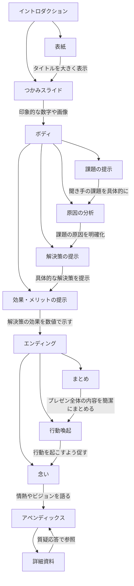
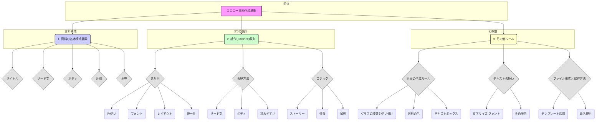

# [コロニー様版]超汎用化！スピプロ研修Ver2025年版[3日目/ 実践編 / テーマ：プレゼン] 20250217

[https://vimeo.com/1057533790/c1bdbd1ab3?share=copy](https://vimeo.com/1057533790/c1bdbd1ab3?share=copy)

[https://vimeo.com/1057533790/c1bdbd1ab3?share=copy](https://vimeo.com/1057533790/c1bdbd1ab3?share=copy)

- 全文文字起こし
    
    ```markdown
    WEBVTT
    
    1
    00:00:12.780 --> 00:00:14.860
    n_ikeshima: よろしくお願いします。
    
    2
    00:00:14.860 --> 00:00:16.730
    佐藤勝彦: はい、よろしくお願いします。
    
    3
    00:00:21.430 --> 00:00:28.299
    佐藤勝彦: もうまもなく開始させていただきます。続々とお集まりいただいていますね。よかったです。
    
    4
    00:00:29.090 --> 00:00:32.770
    佐藤勝彦: 最終日ゼロになるんじゃないかという心配もありましたが、
    
    5
    00:00:33.200 --> 00:00:34.500
    佐藤勝彦: はい、みなさん
    
    6
    00:00:34.750 --> 00:00:36.720
    佐藤勝彦: ついてきていただいてありがとうございま
    
    7
    00:00:38.360 --> 00:00:39.470
    佐藤勝彦: よいしょ。
    
    8
    00:00:43.380 --> 00:00:44.280
    佐藤勝彦: サーミット
    
    9
    00:00:44.410 --> 00:00:50.590
    佐藤勝彦: 亀で一応予定されているコースの最終となりますんでね。ぜひ
    
    10
    00:00:51.710 --> 00:00:54.770
    佐藤勝彦: 実践というところでいきましょう。
    
    11
    00:01:21.100 --> 00:01:25.260
    佐藤勝彦: はい、続々とお集まりいただいております。ありがとうございます。
    
    12
    00:01:26.950 --> 00:01:29.879
    佐藤勝彦: 最終日でございます。最終日で
    
    13
    00:01:30.770 --> 00:01:33.610
    佐藤勝彦: 実践編といきたいと思います。
    
    14
    00:01:56.310 --> 00:01:57.579
    佐藤勝彦: 再開。
    
    15
    00:01:58.910 --> 00:02:02.050
    佐藤勝彦: はい、これで大丈夫ですね。文字起こしも
    
    16
    00:02:02.240 --> 00:02:09.200
    佐藤勝彦: されてないとまずいんではいできてます。そしてチャット欄を出しまして
    
    17
    00:02:09.419 --> 00:02:17.650
    佐藤勝彦: で、このURLにも貼りますね。よいしょよいしょよいしょよいしょはい、こちらになります。三日目になります。テーマプレゼンになります。
    
    18
    00:02:19.500 --> 00:02:44.009
    佐藤勝彦: ま、今日はもう本当にえっと、手を動かすということに前提段を置いておりますので、ま、教えることはもうほぼ教え切ったと思っておりますので、ちょっと見せ方変えて言い方変えてえー。過去の話をもう一回なぞってみようというところの振り返りから入りまして最後プレゼンに落としていきます。でプレゼンもですね。正直、セミナー等でお見せしているそのえー、イルシル
    
    19
    00:02:44.010 --> 00:03:06.839
    佐藤勝彦: を使ったり、やっていただければもう話が早いということになりますし、ま、正直プレゼンと言ってもですね。そこのレベルに行くまでの前のプロンプトさばきがめちゃくちゃ大事なので、そこを磨くためのえーツールやえー、手法やえー、技をですね、いろいろとお伝えできればなという風に思っております。はい。ではアクセスよろしいでしょうか？
    
    20
    00:03:06.840 --> 00:03:15.979
    佐藤勝彦: 深まって見ていきたいなと思います。さあお時間限りあるので、ぜひついてきていただきたいと思います。
    
    21
    00:03:17.090 --> 00:03:26.490
    佐藤勝彦: こちらですね。はいということで、GPT-4のですねえー。攻略法まGPTじゃなくてもいいですね。これ。も生成AIと書きましょうか？
    
    22
    00:03:26.580 --> 00:03:52.180
    佐藤勝彦: 生成AI生成AIのえー特にえー。テキストAIの攻略法として、ゴールシークプロンプトの重要性を説きました。古くはこんな感じの文献でいろいろありますけども、ま、ざっくり言えばタグをつけてインデックス構造にするということが重要だよという風に話をさせていただいたわけでございます。
    
    23
    00:03:52.350 --> 00:03:55.660
    佐藤勝彦: 皆さんもお手元で再現してみてください。
    
    24
    00:03:55.990 --> 00:04:06.529
    佐藤勝彦: 提案書を作りたい。今日プレゼンなので、提案書ってところにフォーカス当てていきますね。フォーカス当てていきます。これ、ちょっと見やすいように半分に切っておきましょうか。こんな感じにしましょうか？
    
    25
    00:04:06.750 --> 00:04:07.590
    佐藤勝彦: ビット
    
    26
    00:04:08.340 --> 00:04:09.170
    佐藤勝彦: はーい、
    
    27
    00:04:09.630 --> 00:04:15.990
    佐藤勝彦: 振り返りで皆さんの知識レベル認識レベルが合っているかどうかを確認していきたいと思います。
    
    28
    00:04:16.750 --> 00:04:20.910
    佐藤勝彦: これをChatGPTなどで見ていきます
    
    29
    00:04:21.190 --> 00:04:23.379
    佐藤勝彦: 挙動を見ていただき、たいと思います。
    
    30
    00:04:23.590 --> 00:04:51.859
    佐藤勝彦: まGPT-4がですねえっとここまた一週間ぐらいで。えー。2月15日にサムアルトマンがサイレントバージョンアップしました。と言ってました。で、結構恐るべきレベルに達したなっていうところまで行ってます。で、前回チャットボットアリーナというですね。ランキングサイトがあるとお伝えしてると思ですけども、あれでえー、トップスリーまで割り込んできたというところがありますんで、ぜひね、まだ触ってねえなそういえば、っていう方は
    
    31
    00:04:52.320 --> 00:04:56.039
    佐藤勝彦: 今旬なのはもう三O三ではなくてですね。
    
    32
    00:04:56.190 --> 00:05:10.339
    佐藤勝彦: Ooが偉いことになっているぞ。っていうのが、今日が何日だ？今日が17ですよね。二日前に騒がれてますんで、まだ見てないっていう方はここに提案書を作りたいと入れていただくと。
    
    33
    00:05:11.500 --> 00:05:15.250
    佐藤勝彦: いや、佐藤さんも研修何度もやってきたんでわかりましたよと。
    
    34
    00:05:15.770 --> 00:05:23.370
    佐藤勝彦: それだと曖昧すぎる。一言すぎて揺らぎが発生してしまってダメなんでしょ？
    
    35
    00:05:23.980 --> 00:05:34.200
    佐藤勝彦: わかりますよね？と昔は提案書を作りたい。一年半前はこれだけ一言言ったらはい、わかりましたって適当な提案書の素案を作ってきたんですね。
    
    36
    00:05:34.690 --> 00:05:43.830
    佐藤勝彦: で、今回の四。Oはもはや推論モデルと同じような思考回路なのか、あなた、実に曖昧なことを言いますねと
    
    37
    00:05:45.400 --> 00:05:47.460
    佐藤勝彦: 誰に見せる資料なんですか？
    
    38
    00:05:49.340 --> 00:05:51.670
    佐藤勝彦: 何のための提案書なんですか？
    
    39
    00:05:53.600 --> 00:05:55.600
    佐藤勝彦: 全く情報ないので
    
    40
    00:05:56.030 --> 00:05:59.069
    佐藤勝彦: わかんないですよっていうことまで聞いてきましたね。
    
    41
    00:05:59.240 --> 00:06:05.910
    佐藤勝彦: なので、これが初学者の方だと一往復二往復三往復とラディが続いてしまうから、
    
    42
    00:06:06.540 --> 00:06:15.150
    佐藤勝彦: もう三往復もすると初学者の人ってなんかもう見合う回答がないからいいやって言って放置してしまって使わなくなるっていう現象が起こると
    
    43
    00:06:15.310 --> 00:06:16.500
    佐藤勝彦: いうことですね。
    
    44
    00:06:16.770 --> 00:06:23.990
    佐藤勝彦: なので、ほぼほぼ一発で狙ったところに着地させたいわけですよね。
    
    45
    00:06:24.450 --> 00:06:36.120
    佐藤勝彦: そのためには揺らぎを抑え込みたい封じ込みたいわけなんですよね。そのために考えるべき。がゴールシークプロンプトであるっていうことで最低限役割。
    
    46
    00:06:36.520 --> 00:06:38.390
    佐藤勝彦: 最低限知識
    
    47
    00:06:38.560 --> 00:06:45.400
    佐藤勝彦: 最低限ゴール。制約条件手順。変数を決めることでコントローラブルにするんですよ。と。
    
    48
    00:06:46.650 --> 00:06:55.470
    佐藤勝彦: ってことは、佐藤の手にかかればというふうなエッフン顔でさせていただくと、僕だったらここまで書きますよっていう話で、
    
    49
    00:06:55.710 --> 00:06:59.119
    佐藤勝彦: こんな細かいことを書きます。返信する。
    
    50
    00:07:00.210 --> 00:07:06.939
    佐藤勝彦: そうすると、あーもうこんな細かく書いていただいてるんだからありがとうございます。っていうことで、
    
    51
    00:07:07.610 --> 00:07:08.860
    佐藤勝彦: 成果物を
    
    52
    00:07:09.970 --> 00:07:11.189
    佐藤勝彦: 素案で
    
    53
    00:07:11.820 --> 00:07:14.189
    佐藤勝彦: 記述してください。
    
    54
    00:07:15.300 --> 00:07:18.440
    佐藤勝彦: の一撃でですね。ほぼ
    
    55
    00:07:19.020 --> 00:07:24.509
    佐藤勝彦: 見合う回答が返ってくるんだということですね。当然のことながら
    
    56
    00:07:25.010 --> 00:07:45.900
    佐藤勝彦: 誰に見せるのか、何のための目的のものなのか、制約条件というところに予算があったりとか、セキュリティ要件があったりとか、変数というところで今回のまー目標値であったりとか、社員の満足度であったりとかコストとかっていうところまで全部迷惑で明文化して入れてあるっていうところであれば、道に迷わず
    
    57
    00:07:45.900 --> 00:07:57.869
    佐藤勝彦: 言葉をつらつらと連ねていくってことが今のChatGPTGPT-4o(omni)ンま特にレベルが2月15日に上がった。この子はめちゃくちゃ精度高くやってしまだと
    
    58
    00:07:57.930 --> 00:07:59.229
    佐藤勝彦: いうことでありました。
    
    59
    00:08:00.610 --> 00:08:01.429
    佐藤勝彦: で、
    
    60
    00:08:01.640 --> 00:08:07.279
    佐藤勝彦: 生真面目な方は本当に一期一語ここを入力されるんだと思ですけど、
    
    61
    00:08:07.740 --> 00:08:18.379
    佐藤勝彦: もうそろそろわかっていただきたいのは、佐藤はただの一行たりと、ももはやプロンプトを自分の手で打つことは大半してません。
    
    62
    00:08:18.890 --> 00:08:26.979
    佐藤勝彦: 衝撃的事実。はい、これだけしっかり書いてくれているんですが、全部AIに書かせてます。
    
    63
    00:08:28.260 --> 00:08:36.179
    佐藤勝彦: どうやってっていうことを今また振り返り、わかんなくなった方にもう一度手順をお見せしますね。
    
    64
    00:08:37.490 --> 00:08:38.350
    佐藤勝彦: よいしょ。
    
    65
    00:08:39.559 --> 00:08:41.700
    佐藤勝彦: 皆さんも同じことをやってみてください。
    
    66
    00:08:44.039 --> 00:08:47.179
    佐藤勝彦: 自分が曖昧だと思う一言を入れます。
    
    67
    00:08:48.330 --> 00:08:56.210
    佐藤勝彦: 別に変えてもらってもいいです。提案書を作りたいじゃダメなの？わかっているから、自分なりに一言三言を付け加えたバージョンを入れてみてください。
    
    68
    00:08:56.800 --> 00:08:59.119
    佐藤勝彦: まず、それで流し込んでみてください。
    
    69
    00:09:01.880 --> 00:09:05.099
    佐藤勝彦: さっきと同様、聞かれますよね。いろいろと。
    
    70
    00:09:05.900 --> 00:09:09.429
    佐藤勝彦: とりあえず研修なんでダミーデータでいいって書いておきますね。
    
    71
    00:09:10.140 --> 00:09:12.019
    佐藤勝彦: 適当に。って書いておきますね。
    
    72
    00:09:13.500 --> 00:09:18.720
    佐藤勝彦: そうすると、AIが考えるこんなことあんなことっていうのが代入されていきますよね。
    
    73
    00:09:23.410 --> 00:09:26.449
    佐藤勝彦: そしたら、この内容に対して
    
    74
    00:09:26.610 --> 00:09:30.340
    佐藤勝彦: これを決めたいんだってことを申し上げていただくわけですね。
    
    75
    00:09:30.900 --> 00:09:34.110
    佐藤勝彦: これそのまんまコピーして
    
    76
    00:09:35.850 --> 00:09:38.099
    佐藤勝彦: ちょっと一回。全部書き終わるの待ちますね。
    
    77
    00:09:43.220 --> 00:09:50.800
    佐藤勝彦: 要は対話しながら、もう。これでいいやっていうものが出た。そのスレッドの中で
    
    78
    00:09:51.490 --> 00:09:52.429
    佐藤勝彦: これを押すと
    
    79
    00:09:53.130 --> 00:09:59.780
    佐藤勝彦: コピーしていただいて、シフトをしながらエンターンタンとやれば下に改行できます。
    
    80
    00:10:01.370 --> 00:10:03.360
    佐藤勝彦: ハイフン三つ入れていただいて、
    
    81
    00:10:07.580 --> 00:10:09.550
    佐藤勝彦: 上記の内容を
    
    82
    00:10:12.220 --> 00:10:13.600
    佐藤勝彦: インデックス
    
    83
    00:10:14.900 --> 00:10:16.299
    佐藤勝彦: 構造化して
    
    84
    00:10:21.630 --> 00:10:26.050
    佐藤勝彦: プロンプトを最適化してください。
    
    85
    00:10:26.490 --> 00:10:30.269
    佐藤勝彦: 裏技ってこういうことです。逆引きしてるんです。
    
    86
    00:10:33.510 --> 00:10:36.359
    佐藤勝彦: こんな言葉を下にぶら下げて
    
    87
    00:10:36.860 --> 00:10:39.539
    佐藤勝彦: この上の内容をここに入れる。
    
    88
    00:10:41.090 --> 00:11:02.830
    佐藤勝彦: わかりますかね？スレッド単位でもう全て理解している文言があるならば、その下にこれを構造化したいっていうことなんですよね。次やるときに楽したいので、この項目にちょっと照らし合わせてインデックス構造化して最適化してください。ドン送ってみてください。
    
    89
    00:11:08.780 --> 00:11:23.870
    佐藤勝彦: そうすると、役割はこういう役割知識はこういうことを知ってた方がいい。ゴールはこういうふうにめがけてやっているんだ。制約条件はこういうことが制約条件になってるっぽい。この
    
    90
    00:11:24.040 --> 00:11:33.360
    佐藤勝彦: 提案書を書く手順はこういう風なステップバイステップでやってった方がいい。今回の提案の変数はこういうところが
    
    91
    00:11:33.490 --> 00:11:39.109
    佐藤勝彦: 変動要素だなって変わるってことが理解できますか？という話になります。
    
    92
    00:11:39.840 --> 00:11:41.619
    佐藤勝彦: 送ってなかったですね。すいません。
    
    93
    00:11:45.150 --> 00:11:50.370
    佐藤勝彦: 佐藤は実はプロンプトは一行たりとも。書いてない。
    
    94
    00:11:50.590 --> 00:11:51.370
    佐藤勝彦: はい、
    
    95
    00:11:51.690 --> 00:12:09.189
    佐藤勝彦: ほぼほぼAIとの対話によ。り逆引き逆説的にやっている。ま。もしこの内容の中で気に入らないところがあったら、部分的に修正をかけられますこれがGPTの場合、はキャンバスっていう機能が最近立ち上がっていて、これペケで閉じると
    
    96
    00:12:09.840 --> 00:12:11.900
    佐藤勝彦: こんな感じの画面になってるんですね。
    
    97
    00:12:12.210 --> 00:12:23.160
    佐藤勝彦: これのキャンバス機能っていですけど、これ大きくすると左側にチャットが来て、右側がキャンバスなんでまさに部分修正がすることができるんですね。
    
    98
    00:12:23.330 --> 00:12:31.559
    佐藤勝彦: ここでこうやってChatGPTに質問するとか消すとかってい。うことがそのままできちゃいます。え？これ削除できるの？消せるんですね。
    
    99
    00:12:31.900 --> 00:12:34.860
    佐藤勝彦: 間違ってるっていうものをこのまま消せます。
    
    100
    00:12:35.780 --> 00:12:39.559
    佐藤勝彦: AIにここ変えてっていうのもお願いできます。
    
    101
    00:12:40.090 --> 00:12:41.209
    佐藤勝彦: 質問する。
    
    102
    00:12:41.970 --> 00:12:43.910
    佐藤勝彦: 違う表現に
    
    103
    00:12:45.660 --> 00:12:46.880
    佐藤勝彦: できますか？
    
    104
    00:12:48.710 --> 00:12:49.470
    佐藤勝彦: ドンッ。
    
    105
    00:12:52.220 --> 00:12:53.650
    佐藤勝彦: ここだけ変わるんですね。
    
    106
    00:12:56.170 --> 00:12:58.019
    佐藤勝彦: これがキャンバス機能ですね
    
    107
    00:12:58.360 --> 00:13:04.069
    佐藤勝彦: 今のChatGPT基本的にはGPT-4o(omni)に使えばこの機能全部使えます。
    
    108
    00:13:04.330 --> 00:13:09.440
    佐藤勝彦: 大変便利ですね。部分修正ができるようになっているので助かります。
    
    109
    00:13:10.900 --> 00:13:12.179
    佐藤勝彦: これにより、
    
    110
    00:13:13.430 --> 00:13:16.269
    佐藤勝彦: 自分の中の語彙力がなくても
    
    111
    00:13:16.680 --> 00:13:21.470
    佐藤勝彦: 大量のテキスト文章の塊があれば、もはやその中に
    
    112
    00:13:21.780 --> 00:13:26.209
    佐藤勝彦: 着実にですね。変数として代入せよって言ってしまえば
    
    113
    00:13:27.310 --> 00:13:30.899
    佐藤勝彦: 型を作るのなんてわけないよって話なんですね。
    
    114
    00:13:33.180 --> 00:13:35.549
    佐藤勝彦: これ結構重要です。
    
    115
    00:13:36.080 --> 00:13:37.249
    佐藤勝彦: よろしいですか？
    
    116
    00:13:39.910 --> 00:13:44.979
    佐藤勝彦: これができたならば、構造化された文章になっているわけだから、
    
    117
    00:13:45.930 --> 00:13:46.939
    佐藤勝彦: 次の動画です。
    
    118
    00:13:47.640 --> 00:13:48.790
    佐藤勝彦: コピーして
    
    119
    00:13:53.340 --> 00:13:54.420
    佐藤勝彦: 取ってきて、
    
    120
    00:13:54.850 --> 00:13:57.390
    佐藤勝彦: インデックス構造のところだけ取ってきて、
    
    121
    00:13:59.000 --> 00:14:03.559
    佐藤勝彦: 他のところいらないで削除して別に一番上もいらないですよ。極論、
    
    122
    00:14:03.710 --> 00:14:08.010
    佐藤勝彦: この状態が一緒ですよね。これとこれ一緒ですよね。
    
    123
    00:14:08.890 --> 00:14:13.119
    佐藤勝彦: あの中身は違いますよ。あの記載している内容はちょっと違いますけど、
    
    124
    00:14:13.270 --> 00:14:19.019
    佐藤勝彦: ここの上で言わんとしている役割のところとか知識のところは
    
    125
    00:14:20.330 --> 00:14:27.349
    佐藤勝彦: 変わってますよね。ちょっとここ記号の書き方が間違ってるんで。シャープの隣はスペースが一個空きます。
    
    126
    00:14:28.730 --> 00:14:29.470
    佐藤勝彦: はーい、
    
    127
    00:14:30.580 --> 00:14:32.229
    佐藤勝彦: 皆さんもできましたかね？
    
    128
    00:14:33.370 --> 00:14:47.289
    佐藤勝彦: これをまず作れなかったら、曖昧な一言からの脱却ができないということになりますので、必ず初学者の人はプロンプトいじる際はこんな感じのことをレベル。これでも一
    
    129
    00:14:47.760 --> 00:14:51.149
    佐藤勝彦: 0.5。とかっていうレベルで定義しています。
    
    130
    00:14:52.660 --> 00:14:54.949
    佐藤勝彦: できた方はちょっと入力してみてください。
    
    131
    00:14:55.760 --> 00:15:11.200
    佐藤勝彦: この計画、とても実現性が高そうですね。っていうところで、ま、今の最近のGPTGPT-4o(omni)。ンの頭の良さとしては、ここからさらに追求をしてきてくれるんで、この質問のラリーで一旦提案書の素案を仕上げてほしいということを言っていただければ
    
    132
    00:15:11.760 --> 00:15:18.799
    佐藤勝彦: 結構いい資料ができるということになります。もう音声入力慣れたという方は音声入力でも結構です。
    
    133
    00:15:19.970 --> 00:15:21.769
    佐藤勝彦: オッケーGPTありがとう
    
    134
    00:15:23.760 --> 00:15:27.470
    佐藤勝彦: そしたらこれで提案書の素案を作っていきたいと思いますので、
    
    135
    00:15:27.730 --> 00:15:30.300
    佐藤勝彦: 可能な限り重厚な文面で
    
    136
    00:15:30.950 --> 00:15:34.179
    佐藤勝彦: 提案書のベースをマークダウン文章で書き出してください。
    
    137
    00:15:39.300 --> 00:15:42.800
    佐藤勝彦: そうすると、成果物がなるということですね。
    
    138
    00:15:43.600 --> 00:15:45.429
    佐藤勝彦: 提案書を作りたいという
    
    139
    00:15:46.150 --> 00:15:51.270
    佐藤勝彦: ものに対しての細かい養成ができるということになります。
    
    140
    00:15:52.590 --> 00:15:54.899
    佐藤勝彦: わかりますか？ここまで大丈夫ですか？
    
    141
    00:15:55.310 --> 00:15:56.579
    佐藤勝彦: そしたら
    
    142
    00:15:57.100 --> 00:16:03.629
    佐藤勝彦: 今日お伝えする。もう一個、そろそろ皆さんになるほどっていうふうに思っていただきたいのは
    
    143
    00:16:03.840 --> 00:16:16.119
    佐藤勝彦: 仕掛ける側なのか使う側なのか？の理論で、僕はこの研修を中級と位置づけて、皆さんが残っていただくことを目的にやっています。それは仕掛ける側に回っていただきたいから、
    
    144
    00:16:16.190 --> 00:16:35.229
    佐藤勝彦: 仕掛ける側ってどういうことかっていうと、このプロンプトをかけたらGPT'sとか。あとはジ。ミーの中にはGEMっていうものがあるんですけども、もう何も触れない。わからないという方のためにじゃあこのGPT's使えばいいよ。じゃあこのGEMを使えばいいよ。
    
    145
    00:16:35.320 --> 00:16:50.639
    佐藤勝彦: じゃあこのシステムプロンプトって一回これ食わせるといいよっていうことをやってもらうだけで、初学者の方はよくわかんないけど、ボタン一個でピッてやったらあ、提案書の素案ができた。超嬉しいっていう状態を作れるかどうかなんですね。その
    
    146
    00:16:51.300 --> 00:16:55.690
    佐藤勝彦: 作業を行うにあたって重要なのは、
    
    147
    00:16:55.900 --> 00:17:01.499
    佐藤勝彦: 今話しながら時間稼ぎしてるんですけど、この右側が書き終わらないと次いけないんですけど。
    
    148
    00:17:02.930 --> 00:17:05.170
    佐藤勝彦: はい、書き終わりましたね。
    
    149
    00:17:05.720 --> 00:17:07.599
    佐藤勝彦: はい、そしたら
    
    150
    00:17:08.520 --> 00:17:09.320
    佐藤勝彦: これ。
    
    151
    00:17:09.760 --> 00:17:13.089
    佐藤勝彦: いいですよね。この提案書の素案が
    
    152
    00:17:13.700 --> 00:17:18.919
    佐藤勝彦: 六ステップぐらいまでのところであーいいのできたなぁと思っていただいたら、
    
    153
    00:17:19.550 --> 00:17:24.139
    佐藤勝彦: これこのまんま使って参考にせよだと
    
    154
    00:17:25.390 --> 00:17:34.970
    佐藤勝彦: すごくこっちに引っ張られちゃです。AIアシスタントっていう言葉に引っ張られちゃったり、業務効率化提案書ってところに引っ張られちゃったり、
    
    155
    00:17:35.920 --> 00:17:46.540
    佐藤勝彦: いや、それが話したいわけじゃない。今回は、コンサルのメニューでちょっこういうのを提案したいからあーそこにも引っ張られるみたいなことが言葉が残りすぎちゃうと
    
    156
    00:17:47.840 --> 00:17:49.509
    佐藤勝彦: 違うものになっちゃう。
    
    157
    00:17:50.120 --> 00:17:51.160
    佐藤勝彦: わかります。
    
    158
    00:17:51.510 --> 00:17:55.310
    佐藤勝彦: なので削ぎ落とさないといけないで、僕はこれを
    
    159
    00:17:56.220 --> 00:18:09.680
    佐藤勝彦: ホネホネフォーマット化せよっていうふうな言い方をしています。骨骨フォーマット。はい。で、皆さんのえーところにチャット欄に骨骨フォーマットプロンプトをねお渡しします。
    
    160
    00:18:10.300 --> 00:18:11.220
    佐藤勝彦: よいしょ
    
    161
    00:18:11.980 --> 00:18:18.250
    佐藤勝彦: この成果物が出ている状態でこのプロンプトを入れてみましょう。
    
    162
    00:18:19.580 --> 00:18:20.639
    佐藤勝彦: これですね。
    
    163
    00:18:21.110 --> 00:18:39.479
    佐藤勝彦: 上記の内容から固有名詞固有の情報を徹底的に削除して、インデックス構造だけ残し、他の値は全て変数として代入できる形にしてください。これをフォーマットとして定義したいです。
    
    164
    00:18:40.480 --> 00:18:49.039
    佐藤勝彦: ほねほねフォーマットとしてシリーズ化してますんでタイトル決めてコードブロック内にマークダウン文章で記載をしてください。理解できたら処理して実行。
    
    165
    00:18:49.460 --> 00:18:52.259
    佐藤勝彦: これを丸々コピーして
    
    166
    00:18:53.710 --> 00:18:58.420
    佐藤勝彦: 完成形になったこの最終フォーマットを
    
    167
    00:18:58.560 --> 00:19:14.169
    佐藤勝彦: バー。ここの。ですね。ここのちょっとキャンバスになっているとわかりづらいのでキャンバス切りますよ。ピッと切った。このツリーで通常のGPTの流れでわかりますよねいいものができた。そのツリーの最後に入れてください。
    
    168
    00:19:15.310 --> 00:19:16.080
    佐藤勝彦: ドンッ。
    
    169
    00:19:18.390 --> 00:19:20.619
    佐藤勝彦: 右側の画面見ててくださいね。
    
    170
    00:19:22.620 --> 00:19:25.659
    佐藤勝彦: ほねほね、フォーマットになっていきます。
    
    171
    00:19:27.790 --> 00:19:28.890
    佐藤勝彦: そして、
    
    172
    00:19:29.320 --> 00:19:32.870
    佐藤勝彦: なるほど。って思っていただいたらすごい嬉しいんですけど。
    
    173
    00:19:33.810 --> 00:19:34.589
    佐藤勝彦: あっ、あっ、
    
    174
    00:19:34.960 --> 00:19:38.650
    佐藤勝彦: 固有の情報が全部なくなっていってる
    
    175
    00:19:42.330 --> 00:19:43.580
    佐藤勝彦: ってことは
    
    176
    00:19:46.190 --> 00:19:47.150
    佐藤勝彦: そっかと
    
    177
    00:19:50.030 --> 00:20:03.640
    佐藤勝彦: この提案のスキームにおける型ですよね。六ページにまたがっていくスライドの構成は現状の課題を見せろ。問題三つ入れろ。
    
    178
    00:20:03.760 --> 00:20:15.530
    佐藤勝彦: 課題の二。を入れる。そしたら、それに対する問題点を言及せよ。課題の三に問題点言及せよ。その次は導入の目的を話し、アクションプランを明示しろ。
    
    179
    00:20:18.180 --> 00:20:22.989
    佐藤勝彦: 骨組みの部分の骨子の部分の密度の高い部分だけが
    
    180
    00:20:23.100 --> 00:20:25.469
    佐藤勝彦: 残ったってことがわかりますか？
    
    181
    00:20:29.080 --> 00:20:53.240
    佐藤勝彦: 同じ出力を制御したいときは、このホネホネフォーマット化っていうまーこれべえっと。所用利用可能でございます。皆さんもね、ノース使ってください。別に何かあの特許取ってるわけじゃないですけど。僕のお客さんの中で入らせておりますけども、ホネホネフォーマット化をして構造化するっていうのが、ま、皆さんに最後にお伝えするます。
    
    182
    00:20:53.390 --> 00:21:01.099
    佐藤勝彦: 結構やってる人少ないです。フォーマットを確実に固めるっていうことをやってる人が少ないので、ぜひそれをやっていただきたいと。
    
    183
    00:21:01.110 --> 00:21:25.469
    佐藤勝彦: で、抽象化と具体化はもう大丈夫ですね。っていうところで広げたり掘り下げたりっていうところをあのブログ書くところでね、皆さんには一気に検索かけて変数かけ集めろっていうこともお伝えしましたし、ま、ざっくり言うとこういうところですよね。っていうゴールと成果物っていうのも、細かい言い回しのところでだいぶわかってきたと思います。最後はフォーマットなんですね。
    
    184
    00:21:25.790 --> 00:21:45.380
    佐藤勝彦: めちゃくちゃよくできた。書き込めたーっていうものをいかにフォーマット化するかっていうのは、実はこのマジカルなあ、プロンプト結構あのファンが多いんですけども、このフォーマットのおーかのものを入れていただけるとフォーマット。確実に同じものを作れっていう指示が出せるということになります。
    
    185
    00:21:45.570 --> 00:21:49.449
    佐藤勝彦: はい、地味に便利です。これ、そしたらこれを
    
    186
    00:21:50.050 --> 00:21:51.290
    佐藤勝彦: コピーします。
    
    187
    00:21:51.820 --> 00:22:04.570
    佐藤勝彦:なぞってコピーでもいいし。ここですね。右上のコピーですねえ。ここでコピーしていただいても結構です。いずれにせよ、すぐ使う時にも含めてえーよいしょ
    
    188
    00:22:04.900 --> 00:22:07.599
    佐藤勝彦: メモ帳に取る癖を取りましょう。
    
    189
    00:22:08.010 --> 00:22:09.119
    佐藤勝彦: こんな感じです。
    
    190
    00:22:11.010 --> 00:22:13.390
    佐藤勝彦: で一番上がだいたいいらないです。
    
    191
    00:22:13.650 --> 00:22:17.919
    佐藤勝彦: ほねほねフォーマットの説明。タイトル文とあとこの三つの
    
    192
    00:22:18.180 --> 00:22:20.629
    佐藤勝彦: 三つの点がマークダウンの
    
    193
    00:22:21.820 --> 00:22:27.040
    佐藤勝彦: 指示出し文書になるので、これいらないですね。はい、そして
    
    194
    00:22:29.010 --> 00:22:31.670
    佐藤勝彦: フォーマットって形で定義してあげる
    
    195
    00:22:36.240 --> 00:22:38.179
    佐藤勝彦: 三つの点でもいいんですけども、
    
    196
    00:22:39.350 --> 00:22:40.669
    佐藤勝彦: こんな感じですね。
    
    197
    00:22:45.980 --> 00:22:47.870
    佐藤勝彦: 上記の内容を
    
    198
    00:22:48.010 --> 00:22:49.289
    佐藤勝彦: フォーマットと
    
    199
    00:22:49.430 --> 00:22:52.559
    佐藤勝彦: フォーマットとして理解したら
    
    200
    00:22:53.390 --> 00:22:54.510
    佐藤勝彦: イエスと
    
    201
    00:22:55.330 --> 00:22:56.590
    佐藤勝彦: 待機。
    
    202
    00:22:59.660 --> 00:23:01.160
    佐藤勝彦: こんな感じになります。
    
    203
    00:23:03.690 --> 00:23:05.850
    佐藤勝彦: これもちょっとチャット欄に入れておきましょうか？
    
    204
    00:23:06.490 --> 00:23:10.850
    佐藤勝彦: 皆さんのお手元の中でも実現できているかどうか
    
    205
    00:23:12.790 --> 00:23:20.440
    佐藤勝彦: あ千文字しか対応できてないのでこれごめんなさい。入れられないですね。入れられないので、研修資料の方にちょっと流し込みますね。
    
    206
    00:23:20.610 --> 00:23:23.250
    佐藤勝彦: えーと、こちらの
    
    207
    00:23:23.770 --> 00:23:24.610
    佐藤勝彦: はい、
    
    208
    00:23:26.550 --> 00:23:28.889
    佐藤勝彦: 参考という形で入れておきます。
    
    209
    00:23:29.570 --> 00:23:32.240
    佐藤勝彦: 骨骨
    
    210
    00:23:32.530 --> 00:23:33.850
    佐藤勝彦: フォーマット
    
    211
    00:23:34.080 --> 00:23:34.750
    佐藤勝彦: かー。
    
    212
    00:23:35.380 --> 00:23:36.170
    佐藤勝彦: サンプル
    
    213
    00:23:36.930 --> 00:23:38.239
    佐藤勝彦: という形ですね。
    
    214
    00:23:39.540 --> 00:23:41.499
    佐藤勝彦: これをトゴルにしておきます。
    
    215
    00:23:42.580 --> 00:23:43.880
    佐藤勝彦: そして、ここに
    
    216
    00:23:45.050 --> 00:23:46.879
    佐藤勝彦: コードとして入れておきます。
    
    217
    00:23:47.320 --> 00:23:48.949
    佐藤勝彦: これがフォーマットであると
    
    218
    00:23:51.620 --> 00:23:53.009
    佐藤勝彦: いうことになります。
    
    219
    00:23:56.330 --> 00:24:02.130
    佐藤勝彦: はい。またちょっと再読み込みするので、皆さんもお手元の資料を再読み込みしてみてください
    
    220
    00:24:02.320 --> 00:24:04.200
    佐藤勝彦: 取り出せると思います。
    
    221
    00:24:04.320 --> 00:24:07.279
    佐藤勝彦: 取り出せたらコピーしてみていただいて
    
    222
    00:24:08.930 --> 00:24:10.650
    佐藤勝彦: ChatGPTGeminiー。
    
    223
    00:24:10.910 --> 00:24:16.930
    佐藤勝彦: あらゆるAIの基本的なものは。でも全部同じもので対応取れるかと思います。
    
    224
    00:24:17.440 --> 00:24:21.710
    佐藤勝彦: 使い方的には同じですよ。こんな感じでやります。
    
    225
    00:24:21.970 --> 00:24:25.330
    佐藤勝彦: Geminiでやってみましょうか？Geminiの方が
    
    226
    00:24:25.730 --> 00:24:28.090
    佐藤勝彦: 面白いですかね？ちょっとやってみましょう。
    
    227
    00:24:28.620 --> 00:24:31.239
    佐藤勝彦: Geminiこちらですね。
    
    228
    00:24:33.550 --> 00:24:47.570
    佐藤勝彦: でえー、クリエイトプロンプトっていうものの中において、今一番世界最高性能の一個である。Gemini二。エクスペリメンタルゼロ2月でえー、五日。モデルを触ってみていただいて、
    
    229
    00:24:47.800 --> 00:24:55.910
    佐藤勝彦: 何にも骨骨なんてもう何にも情報入ってませんから特に問題ないと思いますんで、これを
    
    230
    00:24:56.570 --> 00:24:58.259
    佐藤勝彦: 下に入れてから
    
    231
    00:24:59.110 --> 00:25:04.349
    佐藤勝彦: 下に入れてつぶやいてみて。イエスっていうのを待つのも一つなんですが、
    
    232
    00:25:04.550 --> 00:25:06.109
    佐藤勝彦: これも一個なんですが、
    
    233
    00:25:07.390 --> 00:25:14.159
    佐藤勝彦: 卒業する皆さん。私の卒業する皆さんにお伝えしたいのは、実はここに入れるんじゃなくて
    
    234
    00:25:15.730 --> 00:25:17.299
    佐藤勝彦: システム。
    
    235
    00:25:18.060 --> 00:25:24.109
    佐藤勝彦: これ、いつも社会さんなんですけど、システムインストラクション。はい、この中に入れる。
    
    236
    00:25:24.670 --> 00:25:28.600
    佐藤勝彦: 上記の内容をフォーマットとして理解したら、
    
    237
    00:25:31.150 --> 00:25:32.759
    佐藤勝彦: ユーザーの
    
    238
    00:25:33.260 --> 00:25:34.369
    佐藤勝彦: 指示に
    
    239
    00:25:34.600 --> 00:25:35.949
    佐藤勝彦: したがって
    
    240
    00:25:36.280 --> 00:25:41.950
    佐藤勝彦: 処理して実行みたいな感じでそれっぽく下の文章を書き換える。
    
    241
    00:25:42.440 --> 00:25:43.740
    佐藤勝彦: でしまい込む。
    
    242
    00:25:44.190 --> 00:25:45.979
    佐藤勝彦: そしてこの中に
    
    243
    00:25:47.300 --> 00:25:48.609
    佐藤勝彦: いっぱつ
    
    244
    00:25:51.110 --> 00:25:52.390
    佐藤勝彦: 提案書
    
    245
    00:25:53.460 --> 00:25:55.070
    佐藤勝彦: ジェネレーター
    
    246
    00:25:56.100 --> 00:25:57.589
    佐藤勝彦: みたいにすると、
    
    247
    00:25:58.160 --> 00:26:02.329
    佐藤勝彦: もうフォーマットが仕込まれているっていうことになりますので、
    
    248
    00:26:03.190 --> 00:26:11.310
    佐藤勝彦: ネタを上げればそこに変数として代入することが簡単、容易にできるようになるということになります。
    
    249
    00:26:13.630 --> 00:26:14.739
    佐藤勝彦: よろしいですか？
    
    250
    00:26:15.580 --> 00:26:18.770
    佐藤勝彦: 入れてみたということで問題ないですか？
    
    251
    00:26:19.380 --> 00:26:23.220
    佐藤勝彦: え？空っぽのスカスカのこの内容を入れて、
    
    252
    00:26:23.810 --> 00:26:27.279
    佐藤勝彦: ユーザーは何入れるの？例えばコロニーさんのページから
    
    253
    00:26:28.260 --> 00:26:31.539
    佐藤勝彦: 商品のページから何かしら持ってきましょうか。
    
    254
    00:26:31.760 --> 00:26:33.770
    佐藤勝彦: ポロニー株式会社
    
    255
    00:26:35.960 --> 00:26:38.829
    佐藤勝彦: 商品ページが
    
    256
    00:26:39.630 --> 00:26:41.380
    佐藤勝彦: コンサルティングサービスで
    
    257
    00:26:43.600 --> 00:26:44.389
    佐藤勝彦: はい
    
    258
    00:26:44.830 --> 00:26:46.159
    佐藤勝彦: フューチャリングで
    
    259
    00:26:46.980 --> 00:26:48.049
    佐藤勝彦: いきましょうか。
    
    260
    00:26:48.680 --> 00:26:49.820
    佐藤勝彦: このあたりを
    
    261
    00:26:50.300 --> 00:26:51.869
    佐藤勝彦: ずらーっとコピーして
    
    262
    00:26:53.320 --> 00:26:54.339
    佐藤勝彦: 貼り付けて
    
    263
    00:26:56.260 --> 00:26:57.000
    佐藤勝彦: ですね。
    
    264
    00:26:57.930 --> 00:26:59.299
    佐藤勝彦: この辺はAなんで
    
    265
    00:26:59.440 --> 00:27:00.780
    佐藤勝彦: 画像でコピーして、
    
    266
    00:27:01.490 --> 00:27:03.859
    佐藤勝彦: この辺はAなんで画像でコピーして
    
    267
    00:27:04.710 --> 00:27:07.090
    佐藤勝彦: この辺はAなんで画像でコピーして
    
    268
    00:27:09.290 --> 00:27:11.700
    佐藤勝彦: これも選んで画像でコピーして。
    
    269
    00:27:14.900 --> 00:27:15.620
    佐藤勝彦: はい、
    
    270
    00:27:16.460 --> 00:27:18.439
    佐藤勝彦: 同じの入れちゃったかな？はい、
    
    271
    00:27:20.760 --> 00:27:23.850
    佐藤勝彦: 何してるかわかりますか？ゆっくり話しますよ。
    
    272
    00:27:26.880 --> 00:27:31.979
    佐藤勝彦: 皆さんも手を動かしてやってみてくださいね。システムインタラクションの中には
    
    273
    00:27:32.150 --> 00:27:34.300
    佐藤勝彦: ChatGPTの
    
    274
    00:27:37.490 --> 00:27:42.949
    佐藤勝彦: これはいいなと思った出力の最終形である絵が
    
    275
    00:27:43.570 --> 00:27:46.480
    佐藤勝彦: これはもう書き換わっちゃったんでよいしょ。
    
    276
    00:27:46.890 --> 00:27:54.959
    佐藤勝彦: この前のやつですねAIアシスタント導入による業務効率化の提案書って一回いいものが書けたならば、
    
    277
    00:27:55.490 --> 00:28:01.179
    佐藤勝彦: その上にホネホネフォーマットプロンプト入れたことで、
    
    278
    00:28:02.000 --> 00:28:03.749
    佐藤勝彦: 変数として
    
    279
    00:28:04.120 --> 00:28:07.339
    佐藤勝彦: 書き換わる要素がすべて
    
    280
    00:28:08.210 --> 00:28:10.500
    佐藤勝彦: なくなりそぎ落とされて
    
    281
    00:28:11.350 --> 00:28:15.159
    佐藤勝彦: まさにホネホネと呼んでいるのはもう骨格しか残っていないので、
    
    282
    00:28:15.540 --> 00:28:17.710
    佐藤勝彦: この骨格は使えると
    
    283
    00:28:18.560 --> 00:28:19.970
    佐藤勝彦: 提案書
    
    284
    00:28:20.570 --> 00:28:25.719
    佐藤勝彦: コロニーの提案書はこの構成で作られていくんだ
    
    285
    00:28:25.990 --> 00:28:27.330
    佐藤勝彦: というものが
    
    286
    00:28:27.630 --> 00:28:32.979
    佐藤勝彦: 最終形態が決まっちゃえば、ホネホネフォーマットを作ってしまえば、
    
    287
    00:28:33.200 --> 00:28:37.950
    佐藤勝彦: 一発コロニー提案書ジェネレーターが作れるっていうことを申し上げています。
    
    288
    00:28:38.470 --> 00:28:39.590
    佐藤勝彦: そしたら、
    
    289
    00:28:39.870 --> 00:28:43.810
    佐藤勝彦: 提案書の素案にしたい。ページの材料を
    
    290
    00:28:45.620 --> 00:28:46.560
    佐藤勝彦: バーンと
    
    291
    00:28:46.950 --> 00:28:48.970
    佐藤勝彦: コピペで流し込むだけ
    
    292
    00:28:51.930 --> 00:28:53.079
    佐藤勝彦: 嘘でしょ？
    
    293
    00:28:53.370 --> 00:28:56.199
    佐藤勝彦: って思われる方がいらっしゃるんであれば、
    
    294
    00:28:56.530 --> 00:29:01.089
    佐藤勝彦: もう一度プロンプトの特性ということを理解してくださいっていう話し方になります。
    
    295
    00:29:03.810 --> 00:29:05.299
    佐藤勝彦: やばくないですか？
    
    296
    00:29:05.540 --> 00:29:07.019
    佐藤勝彦: すごくないですか？と
    
    297
    00:29:07.750 --> 00:29:26.379
    佐藤勝彦: 僕が連呼するあ、皆さん、最近0をいただいてないかもしれない。で。あの皆さん、すごい静粛に見てらっしゃるとですね。私、あの注目いただいているのか試していただいているのかはわかんないので、今日も久しぶりに八。の拍手喝采で、ぜひ皆さん理解ができているかどうかをちょっと教えていただけると嬉しいです。ちゃんとものの見事に
    
    298
    00:29:26.830 --> 00:29:35.040
    佐藤勝彦: 代入されてますでしょうっていう話なんですね。ご覧の通り、フューチャリングに関する導入提案のベースが
    
    299
    00:29:35.260 --> 00:29:39.240
    佐藤勝彦: しっかりとですよ。言葉尻きっちりとありがとうございます。
    
    300
    00:29:39.390 --> 00:29:45.340
    佐藤勝彦: パチパチパチいただきました。見ていただいてますね。お手元でも試してみてくださいね。はい、
    
    301
    00:29:45.590 --> 00:30:00.250
    佐藤勝彦: なるほどーとってことは。だよとコロニーでベースとなるホネホネフォーマットを策定できればコロニー流提案書一発変換プロンプト。
    
    302
    00:30:00.440 --> 00:30:05.650
    佐藤勝彦: これ一個。ありゃみんな助かるじゃんっていう風に気づいてもらえると
    
    303
    00:30:05.970 --> 00:30:11.069
    佐藤勝彦: ありがとうございます。三日間研修した回がありましたという話になるわけでございます。
    
    304
    00:30:11.290 --> 00:30:15.630
    佐藤勝彦: 便宜上一発目まずやってみました。っていうところなので、
    
    305
    00:30:16.080 --> 00:30:21.970
    佐藤勝彦: これをどう考えるかっていうことを深掘りしていくっていうことになります。よろしいですか？
    
    306
    00:30:23.120 --> 00:30:27.959
    佐藤勝彦: わかんないよっていう方はね、あのチャット欄に言っていただければ、
    
    307
    00:30:28.130 --> 00:30:35.290
    佐藤勝彦: 今日はアウトプットでね。完全にわかるまでやらないと意味がないので、ちゃんと挙手していただいて、お話を
    
    308
    00:30:35.790 --> 00:30:38.709
    佐藤勝彦: 止めてもらって結構なんで言ってくださいね。
    
    309
    00:30:39.330 --> 00:30:40.199
    佐藤勝彦: はーい。
    
    310
    00:30:40.900 --> 00:30:46.959
    佐藤勝彦: それが故に、それが故にめちゃくちゃ細かく細かく記述することが
    
    311
    00:30:47.460 --> 00:30:48.729
    佐藤勝彦: 寛容であると
    
    312
    00:30:48.940 --> 00:30:52.339
    佐藤勝彦: いうふうに佐藤は申し上げたということでございます。
    
    313
    00:30:52.720 --> 00:30:53.950
    佐藤勝彦: そのために
    
    314
    00:30:55.490 --> 00:30:56.840
    佐藤勝彦: 一個一個
    
    315
    00:30:57.030 --> 00:31:02.510
    佐藤勝彦: スピーチとコピペを駆使してやったらどうだい？っていう話もありましたが、
    
    316
    00:31:03.420 --> 00:31:05.150
    佐藤勝彦: 最終的には
    
    317
    00:31:05.350 --> 00:31:11.760
    佐藤勝彦: ある程度自分の作りたいものがもうできちゃえばフォーマットさえ決めちゃえば
    
    318
    00:31:11.950 --> 00:31:20.860
    佐藤勝彦: 結構揺らぎがあってもなんとかなっちゃですね。これ、昔はならなかったんですよ。一年半前にならなかったんです。こんなに綺麗にはまらなかったのは
    
    319
    00:31:21.010 --> 00:31:26.919
    佐藤勝彦: ChatGPTも。Geminiー。君もえげつないぐらいにレベルが上がってきたからなんですね。
    
    320
    00:31:28.530 --> 00:31:29.469
    佐藤勝彦: なので、
    
    321
    00:31:29.910 --> 00:31:37.940
    佐藤勝彦: 完璧なのはゴールシークプロンプトとこのホネホネフォーマットを組み合わせるものが最強です。
    
    322
    00:31:38.580 --> 00:32:08.559
    佐藤勝彦: わかりますよね。ゴールと成果物変数の細かいきじゅ記述。それらはぐちゃぐちゃぐじゃーってこれ入れちゃってますけど、当然のことながらAIが読みやすい文章で入れてあげた方がいいわけで、AIが読みやすい文章とはこういうインデックス構造化が読みやすいわけですから、変数って決めてねっていうのはちょっと無謀すぎるんで、ちゃんと型を決めてあげて、その上でフォーマットはこれに従えってやるのがま、最強のプロンプトの記述の仕方だということになります。
    
    323
    00:32:08.680 --> 00:32:10.560
    佐藤勝彦: 素人初学者
    
    324
    00:32:10.660 --> 00:32:13.290
    佐藤勝彦: 使う側はここまで覚えなくていいんですね。
    
    325
    00:32:14.580 --> 00:32:39.269
    佐藤勝彦: 清水さんと一番最初にお話しした時に仕掛ける側である方が当然いい。ベンチャー企業なんだからそこまでやれないとダメだよね。というところで分かり合えていますんで、皆さんの中でも全員がやれる必要はないですよ。全員がやれる必要はないんですけども、仕掛ける側に回れる人はぜひこの文章の記述方法並びにフォーマットの記述方法まで
    
    326
    00:32:39.870 --> 00:32:44.220
    佐藤勝彦: 腹落ちしていただけるとめちゃくちゃいいものが作れると思っております。
    
    327
    00:32:45.310 --> 00:32:58.550
    佐藤勝彦: よろしいですかね。佐藤の思いの丈は結構もう今日結論にあの等しいぐらいのレベルのところがここにあります。はい、というところで振り返り、ここまでという内容になります。
    
    328
    00:32:58.760 --> 00:33:02.889
    佐藤勝彦: 本題の方に入っていきます。本題の方に入っていくと
    
    329
    00:33:03.220 --> 00:33:15.669
    佐藤勝彦: 結論。トドの。つまり佐藤さんの語彙力すごすぎて、その語彙力を武器にしたいんで、何をつらつらといつも話してるんですか？ってよく言われるんですね。で、
    
    330
    00:33:15.920 --> 00:33:19.860
    佐藤勝彦: 佐藤の講義資料全部束ねて
    
    331
    00:33:20.190 --> 00:33:22.220
    佐藤勝彦: 全部束ねたら
    
    332
    00:33:22.390 --> 00:33:26.529
    佐藤勝彦: Geminiーでもいいですよ。高性能なやつに
    
    333
    00:33:26.680 --> 00:33:48.260
    佐藤勝彦: 俺のトークスクリプト。このダラダRAGダグダ話してるトークスクリプト集の中からめちゃくちゃ大事だねって思った。キーワードを抽出してもらってテーブル表でまとめてください。とナンバリングしてカテゴライズしてキーワードつけて効果は何なのかっていうことを一気に書き出せって言って百個書き出してもらったのがこれです。
    
    334
    00:33:49.690 --> 00:33:50.440
    佐藤勝彦: あっ、あっ、
    
    335
    00:33:50.750 --> 00:33:58.699
    佐藤勝彦: 佐藤さんこんなところまで細かく細かく話しているんですね。っていうことに気づいていただけたらいや、嬉しいです。ありがとうございます。
    
    336
    00:33:58.890 --> 00:34:00.340
    佐藤勝彦: 語彙力
    
    337
    00:34:00.840 --> 00:34:07.109
    佐藤勝彦: テキストを制する人はAIを制しますってお伝えをしたと思ですね。最初の段階で
    
    338
    00:34:07.650 --> 00:34:14.839
    佐藤勝彦: 結構大事なこと。こういうこと言ってんだねっていうところに気づいていただけると嬉しいです。それ百個並べてみました。
    
    339
    00:34:20.300 --> 00:34:21.189
    佐藤勝彦: ここまで
    
    340
    00:34:22.530 --> 00:34:23.469
    佐藤勝彦: ねー
    
    341
    00:34:23.980 --> 00:34:24.969
    佐藤勝彦: ならば、
    
    342
    00:34:25.550 --> 00:34:27.970
    佐藤勝彦: 皆さんにワーク一個目
    
    343
    00:34:29.239 --> 00:34:33.340
    佐藤勝彦: 最小単位のゴールシークプロンプトを作って欲しいです。
    
    344
    00:34:33.650 --> 00:34:34.900
    佐藤勝彦: 何でもいいです。
    
    345
    00:34:35.870 --> 00:34:37.719
    佐藤勝彦: 何をしてほしい
    
    346
    00:34:37.830 --> 00:34:38.750
    佐藤勝彦: いいのか、
    
    347
    00:34:40.540 --> 00:34:45.799
    佐藤勝彦: 新規サービスのアイデアを考えたいっていうジュニアなメンバーがいたら
    
    348
    00:34:46.300 --> 00:35:00.740
    佐藤勝彦: その一言。曖昧な一言入れるだけじゃダメだよってことを今日の何人ですかね。ご参加いただいている38人の方もさすがにそれ曖昧な一言なんだよってことを説明できますね。そのジュニアのメンバーの方に
    
    349
    00:35:01.330 --> 00:35:14.389
    佐藤勝彦: あ、すいません。あと何入れればいいですかね？って聞かれたらいや、それAIに揺らぎが多くなっちゃうからサービスのアイデアを考えるのが得意な経営コンサルタントとして振る舞えって言うといいと思うよ。
    
    350
    00:35:14.680 --> 00:35:17.919
    佐藤勝彦: はぁ、あざすって言って入力しましたよね。
    
    351
    00:35:19.940 --> 00:35:21.169
    佐藤勝彦: それさあ、
    
    352
    00:35:21.990 --> 00:35:25.300
    佐藤勝彦: 新規サービスの市場って今どういうふうな状況になってるの？
    
    353
    00:35:26.440 --> 00:35:28.490
    佐藤勝彦: お。あんまりわかってないです。
    
    354
    00:35:29.010 --> 00:35:37.009
    佐藤勝彦: あ、全く知らない領域のところで、そのアイデアをね、具現化したいんだねって。じゃあその前提条件入れとかないとわかんないよって
    
    355
    00:35:37.890 --> 00:35:44.360
    佐藤勝彦: あ、なるほどって言って、前提条件市場の調査はまだ未完全であり、よくわからない状況である。
    
    356
    00:35:45.560 --> 00:35:47.230
    佐藤勝彦: なるほど、入れますよね。と。
    
    357
    00:35:48.210 --> 00:36:01.719
    佐藤勝彦: それだけじゃ足らないっていうところで、アイデア豊富な佐藤さんの研修で覚えてた。あーのこと入れようかな。このこと入れようかなっていうのを百個も提示してますんで、ちょっと組み合わせの論理で
    
    358
    00:36:03.330 --> 00:36:06.700
    佐藤勝彦: 佐藤さんだったらこういうこと言じゃないかなっていうところで、
    
    359
    00:36:07.380 --> 00:36:19.660
    佐藤勝彦: アイデアを考えたいときには、お客様のマーケティングの鉄則であるフレームワークを使った方がいいわけですよね。31番に書いてあるあいの間の法則でざっくり
    
    360
    00:36:19.820 --> 00:36:24.710
    佐藤勝彦: 抽象化的な話ですよね。ユーザーの心理を整理して
    
    361
    00:36:25.810 --> 00:36:27.159
    佐藤勝彦: 具体化ですね。
    
    362
    00:36:27.330 --> 00:36:36.569
    佐藤勝彦: ブレストみたいにいろいろネタ出しをたくさんしてもらって出力のイメージですね。マークダウン形式でまとめてもらえますか？
    
    363
    00:36:37.570 --> 00:36:47.749
    佐藤勝彦: ってところまで入れたらめちゃくちゃ制御良くなるよって言ってたのが、研修を体験している方がジュニアなメンバーに言うセリフになるということになります。
    
    364
    00:36:49.070 --> 00:36:50.909
    佐藤勝彦: そしたら、この
    
    365
    00:36:51.780 --> 00:36:53.890
    佐藤勝彦: ここが全部揃っていると
    
    366
    00:36:54.270 --> 00:36:57.330
    佐藤勝彦: もうわかりますか？AIに対して
    
    367
    00:36:58.180 --> 00:37:05.380
    佐藤勝彦: ブログの時にお伝えしたストリームReal Timeのところとかで、まあ、Googleリサーチもオンにしてここに貼り付けてもらうだけで、
    
    368
    00:37:06.350 --> 00:37:09.170
    佐藤勝彦: AIは何したいかってわかるってことですよね。
    
    369
    00:37:12.000 --> 00:37:17.389
    佐藤勝彦: ほら、もうアイドマの法則調べてきました。ブレインストーミングでアイデア出しして決めました。
    
    370
    00:37:18.120 --> 00:37:20.649
    佐藤勝彦: 話早いですよねっていう話なんです。
    
    371
    00:37:21.700 --> 00:37:48.089
    佐藤勝彦: だから言葉を紡ぎ出してくださいと。そして、これはもう音声入力でこのまんま好きなところだけをフォーカスして喋っていけばダラダラ喋っていけば、もういろんなアイデアなんかじゃぶじゃぶ出てくるってことがわかりますよね？とあー、オッケー。Geminiオンライン相談サービスをじゃあちょっと具現化していきたいからそこの部分にフォーカス当ててえー。より詳細に詳細に深淵の先までちょっと掘り下げてえー言葉を紡ぎ出してもらっていいですか？
    
    372
    00:37:59.910 --> 00:38:22.729
    佐藤勝彦: まるでマジシャンだとよく言われるんですけども、いや、仕組みをちゃんと理解できれば全部つながってるんですよとストーリーが何のためにブログ書いてるのか、何のためにこれ使ってるのか？全部ストーリーはつながってます。分かっていただいたならば、皆さんもやれるはずということになりますんでえ。ぜひ皆さんもえ？曖昧な一言。
    
    373
    00:38:22.930 --> 00:38:27.009
    佐藤勝彦: 曖昧な一言をここに入れてください。曖昧な
    
    374
    00:38:27.140 --> 00:38:39.819
    佐藤勝彦: 一言。一言じゃなくてもいいですよ。もっと入れたい方はもっとたくさん一言三言でもいいです。もっといっぱい入れたい方はたくさん入れてもらってもいいです。まー、とにかくゴールって何ですか？何やらせたいんですか？っていうところを入れてください
    
    375
    00:38:39.990 --> 00:38:45.629
    佐藤勝彦: ね。そしてAIに役割これどっかに書いてあるのはどこだっけ？上だったかな？ごめんなさい。
    
    376
    00:38:46.330 --> 00:38:47.619
    佐藤勝彦: ここだはい。
    
    377
    00:38:47.920 --> 00:38:50.150
    佐藤勝彦: 何をしてほしいのか書いてください。
    
    378
    00:38:50.480 --> 00:39:02.140
    佐藤勝彦: でAIの役割はどんな知識を持ち合わせてるAIだったらその揺らぎが少なくなり、より精度の高い回答を出してくれそうか言語化してください。
    
    379
    00:39:02.410 --> 00:39:14.520
    佐藤勝彦: で前提条件として前置きだ。その後。に出てくる話や今置かれている状況とか、こういう制約条件下の中でやってくださいよっていうところが前提条件ですね。
    
    380
    00:39:15.700 --> 00:39:30.820
    佐藤勝彦: で、どんなフォーマットで出したいのか、ま、ルールマークダウン文章で出してください。ブログ形式で出してください。それにはアイドマの法則照らし合わせてくださいとか？ま、いろいろな回答形式があると思で、ま、上に書いてある内容のところを
    
    381
    00:39:30.880 --> 00:39:47.749
    佐藤勝彦: うまいこと使ってもらって、別にナンバリングする必要はないです。ここで書いてある。これは上に何番目に書いてあるかってことを僕がえーイメージしやすくさせるためにやってるだけの話なんでナンバリングは無視してもらって結構なんでどういう出力条件でお願いしたいのかっていう話ですね。
    
    382
    00:39:49.430 --> 00:39:57.160
    佐藤勝彦: あんまり細かく。なんか前提条件となんかどっちがどっちだかわかんなくなるってことよく言われるんですけども、あまり深く考えなくていいです。はい、
    
    383
    00:39:57.360 --> 00:40:01.749
    佐藤勝彦: めっちゃ大事なこととおまけ程度に考えてもらえればいいです。はい、
    
    384
    00:40:02.080 --> 00:40:13.430
    佐藤勝彦: よろしいでしょうか？ではゴールAI役割えー前提条件ルールまで記載したら、チャット欄にコピペして入力して入れてみていただきたいと思います。
    
    385
    00:40:14.620 --> 00:40:26.080
    佐藤勝彦: まず、ちょっと五分ぐらいでできるかどうかやってみましょう。はい、38人いらっしゃるんで、まあ半数以上の方がチャット欄に投げ込むことに成功できたら、はい、よろしいかと思います。
    
    386
    00:40:27.730 --> 00:40:34.160
    佐藤勝彦: さあ、五分間差し上げて五分間の中でできないと話にならん思ってください。
    
    387
    00:40:34.350 --> 00:40:36.569
    佐藤勝彦: はい、もう最後厳しくいきます。
    
    388
    00:40:39.440 --> 00:40:45.390
    佐藤勝彦: 佐藤もちょっとマイクオフにして、自分の皆さんに例文として出せるものを作っておきますね。
    
    389
    00:40:46.100 --> 00:40:48.159
    佐藤勝彦: Real Timeで私もやります。
    
    390
    00:41:17.210 --> 00:41:18.500
    佐藤勝彦: シンギングボウルコーン
    
    391
    00:42:39.780 --> 00:42:52.749
    佐藤勝彦: はい、できましたでしょうか？手早すぎるってよく言われるんですけど、早すぎるぐらいに言葉を紡ぎ出せる人がいるかどうかですね。はい、どうでしょうか？佐藤はこんなのを作ってみました。
    
    392
    00:42:55.360 --> 00:42:57.380
    佐藤勝彦: 流し込んでみましょうか？P。
    
    393
    00:43:01.570 --> 00:43:05.670
    佐藤勝彦: なんでそんなに言葉がつらつら出てくるんですか？というこの速さを
    
    394
    00:43:06.560 --> 00:43:09.280
    佐藤勝彦: なるほどって思っていただけるかどうかですね。
    
    395
    00:43:21.540 --> 00:43:30.740
    佐藤勝彦: 出力がもうできたって方でね、あのチャット欄に投げ込んでいただいたら出力がちゃんとあの問題がないレベルのものかどうかをあー、出力試してみてくださいね。
    
    396
    00:43:35.160 --> 00:43:37.139
    佐藤勝彦: 悪いなぁ。ダメだなぁと
    
    397
    00:43:37.690 --> 00:43:41.450
    佐藤勝彦: 思ったら少し細かく修正は入れてみてください。
    
    398
    00:43:44.200 --> 00:43:45.399
    佐藤勝彦: シンギングボウルコーン
    
    399
    00:44:08.770 --> 00:44:16.350
    佐藤勝彦: トランスクリプトを渡したら、ファシリテーションが円滑に進んでいるかどうかを壁打ちするプロンプトを作りました。佐藤の場合は。ですね、
    
    400
    00:44:16.530 --> 00:44:17.889
    佐藤勝彦: 皆さんはどうでしょうか？
    
    401
    00:44:50.490 --> 00:44:52.269
    佐藤勝彦: できた方はチャット欄に
    
    402
    00:44:52.860 --> 00:44:55.890
    佐藤勝彦: コピペしてください。それを持って報告
    
    403
    00:44:56.580 --> 00:44:58.049
    佐藤勝彦: 完了とします。
    
    404
    00:45:21.820 --> 00:45:26.279
    佐藤勝彦: 何やってるか全然わかりませーんっていう方いらっしゃったら、あの声を上げてくださいね。
    
    405
    00:46:03.530 --> 00:46:09.689
    佐藤勝彦: はい、吉田さん、ありがとうございます。ちょっとダイレクトメッセージになってるんで、皆さんに公開してもらってよろしいですか？ありがとうございます。
    
    406
    00:46:27.230 --> 00:46:28.800
    佐藤勝彦: ありがとうございます。
    
    407
    00:46:31.010 --> 00:46:31.840
    佐藤勝彦: はい
    
    408
    00:46:32.710 --> 00:46:56.849
    佐藤勝彦: はい、皆さんいろいろ書いていただいてますね。ありがとうございま。コンサルティング営業ができるようになりたい。営業改善のコンサルタントとして振る舞ってください。前提条件。プリセールス経験はあるが、専属の営業経験は厳しい。あ。専属の営業経験を乏しいですね。で課題原因、対策効果の順で提示し、簡潔かつ端的にマークダウン形式で見出し、箇条書きをしてほしいですね。
    
    409
    00:46:56.850 --> 00:47:18.930
    佐藤勝彦: はい、セルフキャリアドッグの導入についてどうしたらいいか説明してほしい。はい。一般的にある客観的な視点とえー。財務者のえーあ、実務者か実務者の視点の両方からの説明をしてほしいですねー。前提条件企業の人事担当者ルール一歩ずつ手順を書いてっていうところですね。ありがとうございま。
    
    410
    00:47:19.240 --> 00:47:29.469
    佐藤勝彦: こんな感じ。皆さん書いていただいてます。はい、どんどん書いていただいてます。そして佐藤との文字量の違いからなんとなくわかると思います。
    
    411
    00:47:30.000 --> 00:47:40.200
    佐藤勝彦: そう、皆さん、絶対に生真面目にご自分の頭で考えて手を動かしてキーボード書いて頑張って書いてますよね。指示通りに書いてますよね？はい
    
    412
    00:47:40.400 --> 00:47:43.420
    佐藤勝彦: 差ができ始めますよということになります。
    
    413
    00:47:44.800 --> 00:47:49.490
    佐藤勝彦: 佐藤さんずるくねえかって思う人が出てくるかどうかですね。
    
    414
    00:47:50.380 --> 00:47:52.959
    佐藤勝彦: はい結果が伴っていれば
    
    415
    00:47:54.070 --> 00:48:01.970
    佐藤勝彦: AIを使おうがなんだろうが、地頭で考えようが良い成果が出るものに最短距離で進むことが僕は大事だと思っています。
    
    416
    00:48:03.380 --> 00:48:04.759
    佐藤勝彦: ははーんと。
    
    417
    00:48:05.980 --> 00:48:07.040
    佐藤勝彦: さては
    
    418
    00:48:07.890 --> 00:48:09.409
    佐藤勝彦: こうやってんじゃないかと
    
    419
    00:48:10.430 --> 00:48:13.219
    佐藤勝彦: 気づく方がおられるかどうか。
    
    420
    00:48:16.140 --> 00:48:17.240
    佐藤勝彦: ほぼほぼ
    
    421
    00:48:19.070 --> 00:48:21.120
    佐藤勝彦: 答えに等しいことを言ってますが、
    
    422
    00:48:22.880 --> 00:48:27.579
    佐藤勝彦: 佐藤は一行たりともプロンプトを自分の手で打って書いてない。
    
    423
    00:48:30.870 --> 00:48:35.469
    佐藤勝彦: なんで、皆さんの中で超長文の方が出てくるかどうかが楽しみなんですけど
    
    424
    00:48:35.570 --> 00:48:36.939
    佐藤勝彦: さあ、どうでしょうか？
    
    425
    00:48:39.760 --> 00:48:44.969
    佐藤勝彦: その調整ができる方が何人いらっしゃるかな？というところも見ておりますが、
    
    426
    00:48:45.800 --> 00:48:50.349
    佐藤勝彦: さあ、お二人だけですか？他に打ち込まれてらっしゃる方いませんか？
    
    427
    00:48:56.790 --> 00:49:03.739
    佐藤勝彦: あの38人いらっしゃるので、もっと大量に打ち込まれることを想定してますが、どうでしょう。
    
    428
    00:49:26.320 --> 00:49:31.300
    佐藤勝彦: もうちょっと待ちますね。皆さんがサンプル書いてくださいね。
    
    429
    00:49:31.620 --> 00:49:36.709
    佐藤勝彦: ここね。あの今、吉田さんと山本さんしか入れていただいてないので、
    
    430
    00:49:37.360 --> 00:49:38.160
    佐藤勝彦: はい、
    
    431
    00:49:40.040 --> 00:49:42.709
    佐藤勝彦: できましたか？というのを見ておりますので
    
    432
    00:49:43.910 --> 00:49:45.069
    佐藤勝彦: ありがとうございます。
    
    433
    00:49:45.490 --> 00:49:48.419
    佐藤勝彦: NISAでめちゃん子金貯めたいいですね。
    
    434
    00:49:49.010 --> 00:49:49.949
    佐藤勝彦: はーい。
    
    435
    00:50:03.260 --> 00:50:04.470
    佐藤勝彦: シンギングボウルコーン。
    
    436
    00:50:05.760 --> 00:50:14.590
    佐藤勝彦: さあ、38人いらっしゃる中ですいません。止まってらっしゃる方々、今どういう状況かを教えていただかないとなかなか
    
    437
    00:50:15.690 --> 00:50:23.060
    佐藤勝彦: わからないです。状況はいかがでしょうか？なんかわからなかったらわからないということを言っていただければフォロー入りますので
    
    438
    00:50:43.660 --> 00:50:45.630
    佐藤勝彦: はい集まってきましたね。
    
    439
    00:50:46.330 --> 00:50:48.440
    佐藤勝彦: 今で一、
    
    440
    00:50:48.800 --> 00:50:50.349
    佐藤勝彦: 二、三、四人。
    
    441
    00:50:51.870 --> 00:50:56.660
    佐藤勝彦: さすがに十数名ぐらいまでは待ちたいところですが、どうでしょう？
    
    442
    00:50:59.570 --> 00:51:16.959
    佐藤勝彦: あー、文字数オーバーで貼れなかったっていうところですね。はい、あの、その方いらっしゃるかもしれない。ですねごめんなさい。あのAI駆使しました。めっちゃすごい文章できました。だけど、あのZoomがそもそもチャット欄に千文字しか貼れませんっていう方はあの途中までで結構ですよ。はい、
    
    443
    00:51:17.660 --> 00:51:20.259
    佐藤勝彦: それは大変失礼しました。そうですね。
    
    444
    00:51:20.970 --> 00:51:24.849
    佐藤勝彦: 文字数オーバーなんですね。それで貼れない人が多いのかな。
    
    445
    00:51:25.700 --> 00:51:28.059
    佐藤勝彦: 若干それだったらまだ安心できました。
    
    446
    00:51:28.870 --> 00:51:33.409
    佐藤勝彦: できません。わかりませんって方がいらっしゃったら今の段階で言ってください。
    
    447
    00:51:45.040 --> 00:51:49.939
    佐藤勝彦: もうもう五人ぐらい来ないですかね？タターンと
    
    448
    00:51:50.660 --> 00:51:53.580
    佐藤勝彦: タタターンと来ないですかね？どうでしょう？
    
    449
    00:52:00.600 --> 00:52:02.620
    佐藤勝彦: 他に作業されているのかな？
    
    450
    00:52:04.220 --> 00:52:05.500
    佐藤勝彦: どうでしょうか？
    
    451
    00:52:08.610 --> 00:52:12.009
    佐藤勝彦: 状況がすいません。つかめませんが、
    
    452
    00:52:16.630 --> 00:52:18.340
    佐藤勝彦: これぐらいにしておきましょうか。
    
    453
    00:52:38.050 --> 00:52:38.999
    佐藤勝彦: どうしようかな。
    
    454
    00:52:39.290 --> 00:52:55.849
    佐藤勝彦: もうちょっと集まると面白いことができるんですけど、まあじゃあえっと、一旦なしでいきましょうかね。はい、じゃあまあまあ、えっと、ベースは理解したよっていうことの理解でいきたいと思います。ちょっと全部集まらなかったんで、一旦。まーこれは
    
    455
    00:52:55.960 --> 00:53:14.169
    佐藤勝彦:こんな感じでできるよ。っていうところを理解したっていうことで、はい、大丈夫かなっていうふうに思いました。え、一応説明しておきますけども、一言三。言、ここに考えていくことをやるのもめちゃくちゃいいんですけども。あー出ましたね。
    
    456
    00:53:14.350 --> 00:53:32.000
    佐藤勝彦: えー。でっかいの出ましたね。ありがとうございます。はい、途中で切れてますね。あの。やっぱりちょっとあまりに長文書きすぎた時に入らないっていう問題に皆さん出くわしてるのかな？そう思いたいです。文字数オーバーでした。とか書いてくれると嬉しいです。はい、ありがとうございまーす。
    
    457
    00:53:32.790 --> 00:53:44.249
    佐藤勝彦: そうですね。だいぶ見えてきたと思います。例えば、これも隣にこれを置いて、例えば昨日、昨日じゃないですね。前回のブログのやり方を
    
    458
    00:53:44.690 --> 00:53:45.969
    佐藤勝彦: やり方を
    
    459
    00:53:46.350 --> 00:53:51.770
    佐藤勝彦: 見せていたのは、なんであれが全部なんです。あれがすべてにおいて応用効くんですね。
    
    460
    00:53:53.530 --> 00:53:54.580
    佐藤勝彦: 例えば、
    
    461
    00:53:57.300 --> 00:54:04.400
    佐藤勝彦: NISANISAとかも佐藤は全然得意じゃないので、あのこのあたりをちょっと掘り下げてやってみましょうか。
    
    462
    00:54:04.870 --> 00:54:06.400
    佐藤勝彦: テキストにして
    
    463
    00:54:06.540 --> 00:54:08.290
    佐藤勝彦: Googleサーチにして、
    
    464
    00:54:09.090 --> 00:54:09.860
    佐藤勝彦: はい
    
    465
    00:54:10.750 --> 00:54:12.189
    佐藤勝彦: トークにして
    
    466
    00:54:12.990 --> 00:54:14.880
    佐藤勝彦: お疲れさま。Geminiくん。
    
    467
    00:54:15.010 --> 00:54:26.900
    佐藤勝彦: あのNISAでめちゃんこ金貯めたいんだけど、あのNISAって全く僕は常識的なところもあの知識的にも全然ないから。NISAに関する情報全部根こそぎ引っ張ってきてもらいたいんだけど、
    
    468
    00:54:36.030 --> 00:55:04.680
    佐藤勝彦: なるほどありがとう。NISAに一番詳しい人って多分ファイナンシャルプランナーの一級の保有者だと思うし。書籍とかいっぱい出してる人がすごいと思だけど、ま、そういったところの机上の空論ではなくて、当事者の個々の家計状況とかライフプランに即した金融コンサルタントカウンセリングのプロフェッショナル随一のもう専門家みたいな感じに振る舞ってもらいたいんだけど、そういう人の特徴点とかスキルみたいなところとかって全部書き出してもらうことできる。
    
    469
    00:55:16.470 --> 00:55:38.560
    佐藤勝彦: オッケーありがとう。そしたら前提条件として僕がイメージするまNISAをめちゃんこ貯めたい人って、一般的なサラリーマンで年収5,000,000ぐらいで30歳で独身で健康よ。結婚予定がなくて、定年後にNISAで20,000,000貯めたくて65歳定年で給与は年収10,000,000止まりの人をえー、想定してるんだよ。
    
    470
    00:55:42.580 --> 00:56:04.580
    佐藤勝彦: はい。で、その上でカジュアルなブログ形式で。まーなんか僕がお願いしたらパッとブログでね。綺麗に出してくれたら嬉しいのと、目標の金額までの計画をステップバイステップでしっかりと記述してくれて、年齢ごとのえー、達成状況を確認できるチェックリストを。えーめちゃくちゃ細かくえー。書いてくれることが嬉しいです。
    
    471
    00:56:17.540 --> 00:56:19.290
    佐藤勝彦: オッケー。チェックリスト書けた。
    
    472
    00:56:32.450 --> 00:56:33.220
    佐藤勝彦: はい、
    
    473
    00:56:34.330 --> 00:56:36.069
    佐藤勝彦: だいぶ良くなりましたね。
    
    474
    00:56:40.070 --> 00:56:43.619
    佐藤勝彦: もうなんとなく分かってきましたか？ブログ書くのと
    
    475
    00:56:43.860 --> 00:57:08.900
    佐藤勝彦: やってること変わらないんですよね。ここでやってることって、今ここの橘健さんが書かれている内容を順々に僕は喋っていきました。だからもう頭の中にゴール役割前提条件ルールで何を話したいかの言語化がもう全部できている方々はもうここにタラタラタラタラ言葉を紡ぎ出して話していくだけで、もう大半の
    
    476
    00:57:08.900 --> 00:57:18.909
    佐藤勝彦: ものが出てますよね。で、もうこれもブログ形式でまとめた最終案も出てますよね。だから先ほどの骨ほねフォーマットでこのフォーマット化することもできるのも分かりますよね。
    
    477
    00:57:18.940 --> 00:57:20.999
    佐藤勝彦: なので、これに対して
    
    478
    00:57:21.090 --> 00:57:26.840
    佐藤勝彦: 逆説的にやるっていうことが重要で、これを
    
    479
    00:57:28.190 --> 00:57:31.069
    佐藤勝彦: ごめんなさい。こうやってコピーする。
    
    480
    00:57:32.400 --> 00:57:34.680
    佐藤勝彦: あっ、気づいていただけますか？
    
    481
    00:57:35.260 --> 00:57:36.830
    佐藤勝彦: あっていうところですね。
    
    482
    00:57:37.010 --> 00:57:41.109
    佐藤勝彦: ここで、このツリーの中に入れて
    
    483
    00:57:48.440 --> 00:57:52.719
    佐藤勝彦: 内容に変数として代入できる形で
    
    484
    00:57:54.540 --> 00:57:57.459
    佐藤勝彦: インデックス構造化した文章に
    
    485
    00:57:57.990 --> 00:57:59.319
    佐藤勝彦: 仕立て上げてください。
    
    486
    00:58:00.890 --> 00:58:02.509
    佐藤勝彦: 無駄を削ぎ落として
    
    487
    00:58:02.900 --> 00:58:07.320
    佐藤勝彦: すべてインデックスの中に収まるように構造化文章にしてください。
    
    488
    00:58:10.450 --> 00:58:14.060
    佐藤勝彦: システムインタラクションとしてこれを定義します。
    
    489
    00:58:28.770 --> 00:58:45.340
    佐藤勝彦: あー、システムインタラクションにしちゃったことで、ちょっと小難しい文章になっちゃいましたがね。すいません。えっと、もうちょっと簡単でいいですが、システムインタラクションのえっと、コード文はなしにして、単純に一、二、0のところに、構造化された文章をマークダウン文章で書き出してもらっていいですか？ごめんなさい。
    
    490
    00:58:55.270 --> 00:58:58.210
    佐藤勝彦: もうちょっと詳細な構造化された文章になるんじゃない？
    
    491
    00:59:07.370 --> 00:59:09.349
    佐藤勝彦: もしもーし聞こえてますか？
    
    492
    00:59:12.720 --> 00:59:13.600
    佐藤勝彦: こっちか。
    
    493
    00:59:14.220 --> 00:59:17.510
    佐藤勝彦: もうちょっと詳細な構造化された文章になるんじゃない？
    
    494
    00:59:27.170 --> 00:59:31.030
    佐藤勝彦: この辺のちょっとパワーバランスが難しいところですけど。
    
    495
    00:59:31.090 --> 01:00:00.569
    佐藤勝彦: はいえっと、本当はね、こっちのコード文書の方がめちゃくちゃAIは処理しやすくなるのわかりますかね？あのー前々からお伝えしている通りAIはもう当然のことながらプログラミングでございますから、AIが理解され、やすいのはこういう変数値も全部英語で記述されて、そこに対して日本語の説明が入るぐらいの方がめちゃくちゃいい挙動を示します。はい、なので、何が言いたいかっていうと、もうパラパラ会話した内容でデータがたまったら
    
    496
    01:00:01.150 --> 01:00:14.989
    佐藤勝彦: これが重要だっていうゴール。AIのねこの役割前提条件ルールをこれにはめてくれってAIにお願いすると長文が生まれるっていうことなんですね。
    
    497
    01:00:15.860 --> 01:00:18.019
    佐藤勝彦: なので、サンプル
    
    498
    01:00:18.160 --> 01:00:20.840
    佐藤勝彦: 参考例を。
    
    499
    01:00:26.920 --> 01:00:39.659
    佐藤勝彦: で先ほどの文章ゴールNISAでめちゃんこ金貯めたい。これを爆破したということになりますんでね。これをテキストとごる。この中にちょっと入れときましょう。
    
    500
    01:00:39.800 --> 01:00:41.890
    佐藤勝彦: どこ行っちゃいましたかね。この
    
    501
    01:00:42.700 --> 01:00:44.690
    佐藤勝彦: こっちじゃないか。こっちですね。
    
    502
    01:00:44.820 --> 01:00:46.240
    佐藤勝彦: はい、これの最後
    
    503
    01:00:47.200 --> 01:00:52.290
    佐藤勝彦: これいいですね。ここの文章がだいぶ良かったですね。これをP。とコピーして
    
    504
    01:00:53.690 --> 01:00:54.429
    佐藤勝彦: はーい。
    
    505
    01:00:59.060 --> 01:01:00.479
    佐藤勝彦: こういうことになります。
    
    506
    01:01:01.790 --> 01:01:02.519
    佐藤勝彦: はい、
    
    507
    01:01:02.980 --> 01:01:24.640
    佐藤勝彦: だいぶ一瞬にして言葉が紡ぎ出せたのがわかると思います。ちょっと佐藤の言葉に、えーと、システムインタラクションに最適化してくれという言葉があったからコードが入ってしまいましたけど、修正しましたよね。簡単にごめん、ごめんと言ってはいあ、これ再起動と再読み込みしてもらえれば、皆さん手元で確認できると思で、はい
    
    508
    01:01:25.250 --> 01:01:25.979
    佐藤勝彦: はい、
    
    509
    01:01:26.130 --> 01:01:32.080
    佐藤勝彦: この状態に書き出すことがいとも簡単にできたんだってことを
    
    510
    01:01:32.240 --> 01:01:33.550
    佐藤勝彦: サイド理解
    
    511
    01:01:33.760 --> 01:01:35.089
    佐藤勝彦: してもらいたいんです。
    
    512
    01:01:35.940 --> 01:01:38.139
    佐藤勝彦: なるほどと思っていただきたいんです。
    
    513
    01:01:40.200 --> 01:01:41.259
    佐藤勝彦: ここですね。
    
    514
    01:01:44.340 --> 01:01:45.090
    佐藤勝彦: 荒井。これ。
    
    515
    01:01:46.610 --> 01:02:00.890
    佐藤勝彦: 上記の内容に変数として代入できる形でインデックス構造化した文章に仕立て上げてください。無駄を削ぎ落とした形ですべてインデックスの中に収まるように構造化された文章にしてください。究極ここで止めとけばいいってことですね。はい、
    
    516
    01:02:01.090 --> 01:02:03.389
    佐藤勝彦: これがはまると
    
    517
    01:02:03.870 --> 01:02:06.910
    佐藤勝彦: 優勝研修資料。
    
    518
    01:02:07.430 --> 01:02:08.979
    佐藤勝彦: これがはまると、
    
    519
    01:02:09.800 --> 01:02:13.719
    佐藤勝彦: ご自分の頭の中でグワーッと考えることもなく、
    
    520
    01:02:14.790 --> 01:02:17.229
    佐藤勝彦: 簡単にとまではいかないですけど、
    
    521
    01:02:18.260 --> 01:02:22.090
    佐藤勝彦: 簡単じゃないですかね？僕は簡単だと思えるんですけど、皆さんどうですか？
    
    522
    01:02:22.590 --> 01:02:31.049
    佐藤勝彦: これを入れるだけ。これを入れるだけっていう話になるということですね。無駄を落として収まる収まるように
    
    523
    01:02:31.180 --> 01:02:33.669
    佐藤勝彦: 誤字脱字があってもいけちゃってますよね。
    
    524
    01:02:34.150 --> 01:02:46.729
    佐藤勝彦: はい、もうほぼこれが出るというロジックになります。そしてこれがゴールシークプロンプトのま原型になるように、ま、ちょこっと言葉尻を変えていくっていう形にすればいいということになります。
    
    525
    01:02:46.920 --> 01:02:47.620
    佐藤勝彦: はい、
    
    526
    01:02:48.190 --> 01:02:51.009
    佐藤勝彦: NISAでめちゃんこ金貯めたいですね。
    
    527
    01:02:51.130 --> 01:02:57.230
    佐藤勝彦: この辺のタイトル文章とかを少し変えてあげる方がいいかもしれません。
    
    528
    01:02:57.340 --> 01:03:02.530
    佐藤勝彦: もう一ランク。ここに例えば、ほねほねフォーマットを入れちゃえばいいってことですね。
    
    529
    01:03:03.910 --> 01:03:06.200
    佐藤勝彦: 伝わります。ほねほね、フォーマット
    
    530
    01:03:06.630 --> 01:03:08.610
    佐藤勝彦: できた人は入れてみてくださいね。
    
    531
    01:03:11.360 --> 01:03:13.499
    佐藤勝彦: ほねほねフォーマット。これですね。
    
    532
    01:03:13.730 --> 01:03:16.600
    佐藤勝彦: はい、こいつを骨に変えてみたいと思いま。
    
    533
    01:03:22.070 --> 01:03:22.770
    佐藤勝彦: はい
    
    534
    01:03:25.340 --> 01:03:31.059
    佐藤勝彦: 目標ゴールAIの役割主なあーまあ、これちょっと意味が削られすぎましたね。
    
    535
    01:03:31.280 --> 01:03:35.820
    佐藤勝彦: 削られすぎましたね。これはちょっと注ぎ落とされすぎてるんで
    
    536
    01:03:36.190 --> 01:03:39.709
    佐藤勝彦: NISAでめちゃん子金貯めたいための
    
    537
    01:03:40.830 --> 01:03:41.799
    佐藤勝彦: ための
    
    538
    01:03:42.580 --> 01:03:44.040
    佐藤勝彦: 骨尾根
    
    539
    01:03:45.650 --> 01:03:48.100
    佐藤勝彦: フォーマットにリライト
    
    540
    01:03:48.620 --> 01:03:49.809
    佐藤勝彦: けずり
    
    541
    01:03:49.970 --> 01:03:51.129
    佐藤勝彦: 過ぎてます
    
    542
    01:03:52.150 --> 01:03:53.479
    佐藤勝彦: ということになります。
    
    543
    01:04:01.240 --> 01:04:01.960
    佐藤勝彦: はーい、
    
    544
    01:04:03.460 --> 01:04:05.399
    佐藤勝彦: これでちょうどいいんじゃないですかね。
    
    545
    01:04:06.480 --> 01:04:17.920
    佐藤勝彦: タイトルNISAでめちゃんこ金貯めたいNISAを活用して目標の金額の資産形成を達成する老後の資金はどれぐらいで、目標金額はどれぐらいでっていうことになりますね。
    
    546
    01:04:18.230 --> 01:04:19.000
    佐藤勝彦: はーい、
    
    547
    01:04:19.830 --> 01:04:23.199
    佐藤勝彦: 兄さんの口座開設のサポートになりますね。
    
    548
    01:04:23.310 --> 01:04:26.240
    佐藤勝彦: ライフスタイルはどうなんですか？って聞かれますね。
    
    549
    01:04:26.610 --> 01:04:27.310
    佐藤勝彦: はい、
    
    550
    01:04:27.980 --> 01:04:29.730
    佐藤勝彦: わかります。これが
    
    551
    01:04:30.280 --> 01:04:31.970
    佐藤勝彦: この次に来る
    
    552
    01:04:34.880 --> 01:04:35.679
    佐藤勝彦: よいしょ。
    
    553
    01:04:36.800 --> 01:04:38.410
    佐藤勝彦: この次に来る。
    
    554
    01:04:38.930 --> 01:04:41.589
    佐藤勝彦: ほねほねフォーマットだということですね。
    
    555
    01:04:41.880 --> 01:04:43.230
    佐藤勝彦: おねほね
    
    556
    01:04:43.410 --> 01:04:44.800
    佐藤勝彦: フォーマットか。
    
    557
    01:04:47.230 --> 01:04:56.090
    佐藤勝彦: 皆さんは仕掛ける側に回る人たちであってほしいので、なんでそこまでやらないといけないんだっけ？は次のところで回答しますが、
    
    558
    01:04:57.080 --> 01:04:59.110
    佐藤勝彦: はいほねほねフォーマット化しました。
    
    559
    01:04:59.900 --> 01:05:02.239
    佐藤勝彦: なんでこれをやらんといかんのか？
    
    560
    01:05:02.430 --> 01:05:03.530
    佐藤勝彦: それは
    
    561
    01:05:04.290 --> 01:05:09.689
    佐藤勝彦: 優勝GPT's化ができると、もうボタン一個で終わるということだからだ
    
    562
    01:05:10.120 --> 01:05:11.719
    佐藤勝彦: いうのが答えになります
    
    563
    01:05:12.090 --> 01:05:13.590
    佐藤勝彦: よいしょよいしょ
    
    564
    01:05:19.160 --> 01:05:22.520
    佐藤勝彦: NISA初心者のための
    
    565
    01:05:23.000 --> 01:05:26.299
    佐藤勝彦: ボタン一発
    
    566
    01:05:26.770 --> 01:05:29.140
    佐藤勝彦: GPT'sや
    
    567
    01:05:29.750 --> 01:05:31.889
    佐藤勝彦: GEMジェ。ムって言ですけど、
    
    568
    01:05:32.020 --> 01:05:33.049
    佐藤勝彦: 事務化
    
    569
    01:05:34.260 --> 01:05:35.430
    佐藤勝彦: ってやると、
    
    570
    01:05:35.530 --> 01:05:40.090
    佐藤勝彦: 例えばGEMはジェーminiー君の中にいるんですけど。
    
    571
    01:05:43.620 --> 01:05:44.429
    佐藤勝彦: はい、
    
    572
    01:05:49.090 --> 01:05:53.269
    佐藤勝彦: こんな感じですね。ここにいます。GEMマネージャーというのがいます。
    
    573
    01:05:54.540 --> 01:05:59.519
    佐藤勝彦: そしたらジムマネージャー君に事務を作成するタイトルっていうのがあります。
    
    574
    01:05:59.790 --> 01:06:01.599
    佐藤勝彦: タイトルのところに
    
    575
    01:06:01.890 --> 01:06:03.839
    佐藤勝彦: 講座資料どこ行った。ここですね。
    
    576
    01:06:04.190 --> 01:06:04.920
    佐藤勝彦: はい
    
    577
    01:06:06.420 --> 01:06:09.229
    佐藤勝彦: aタイトルは
    
    578
    01:06:09.500 --> 01:06:15.150
    佐藤勝彦: NISAでめちゃんこ金貯めたいGEMを作りますってことになりますね。これ入れる。
    
    579
    01:06:15.690 --> 01:06:22.249
    佐藤勝彦: そしてカスタマイズ指示ですね。そこにフォーマットの指示が入るということになります。ドン。
    
    580
    01:06:24.210 --> 01:06:25.569
    佐藤勝彦: ほね。ほねフォーマット
    
    581
    01:06:25.720 --> 01:06:27.970
    佐藤勝彦: ボールはこうだということですね。
    
    582
    01:06:32.060 --> 01:06:33.470
    佐藤勝彦: ユーザーの
    
    583
    01:06:35.350 --> 01:06:37.599
    佐藤勝彦: ええ現状を
    
    584
    01:06:37.920 --> 01:06:39.349
    佐藤勝彦: ヒアリングし、
    
    585
    01:06:42.140 --> 01:06:43.149
    佐藤勝彦: NISA
    
    586
    01:06:43.900 --> 01:06:45.160
    佐藤勝彦: 積み立ての
    
    587
    01:06:46.180 --> 01:06:47.590
    佐藤勝彦: 壁打ち
    
    588
    01:06:47.910 --> 01:06:52.069
    佐藤勝彦: 相手として最適化してください。
    
    589
    01:06:53.890 --> 01:06:55.439
    佐藤勝彦: 最終的に、
    
    590
    01:06:55.740 --> 01:06:56.920
    佐藤勝彦: 上記の
    
    591
    01:06:57.530 --> 01:06:58.800
    佐藤勝彦: フォーマットに
    
    592
    01:06:59.170 --> 01:07:00.410
    佐藤勝彦: したがって
    
    593
    01:07:01.050 --> 01:07:02.349
    佐藤勝彦: 読みやすい
    
    594
    01:07:02.890 --> 01:07:03.890
    佐藤勝彦: ブログ
    
    595
    01:07:04.330 --> 01:07:05.840
    佐藤勝彦: 文章として
    
    596
    01:07:06.110 --> 01:07:07.909
    佐藤勝彦: 書き出してください。
    
    597
    01:07:11.510 --> 01:07:17.019
    佐藤勝彦: 何がいいかな？ロープレ開始っていうのもね、いいんですよ。ロー。プレ開始してください。
    
    598
    01:07:17.640 --> 01:07:18.350
    佐藤勝彦: はい
    
    599
    01:07:18.720 --> 01:07:19.580
    佐藤勝彦: 保存。
    
    600
    01:07:22.250 --> 01:07:33.379
    佐藤勝彦: 非常にGoogleWorksペースは簡単でいいですね。もう本当にタイトルとこの仕組みだけ入れたら、はいNISAでめちゃんこ金貯めたいGEMができました。同じようなことをGPT'sでもできるということ。になります。
    
    601
    01:07:33.730 --> 01:07:34.670
    佐藤勝彦: これで
    
    602
    01:07:35.600 --> 01:07:43.599
    佐藤勝彦: ここのアドバンスド二。プロさんにあーそっか。GEMはダメだ。ジムはモデル切り替えできないので、
    
    603
    01:07:44.860 --> 01:07:57.769
    佐藤勝彦: はい。あのFlash固定になっちゃいますね。ごめんなさい高性能モデルが使えないですね。ちょっと開発者だったらいけるんですけども。えー。一般的なこのサブスクの方だとモデル切り替えができないので、このまま使うことになります。
    
    604
    01:07:58.170 --> 01:08:01.260
    佐藤勝彦: 金ため
    
    605
    01:08:01.940 --> 01:08:03.149
    佐藤勝彦: タイス
    
    606
    01:08:03.780 --> 01:08:05.949
    佐藤勝彦: 金ため体質。
    
    607
    01:08:06.320 --> 01:08:07.110
    佐藤勝彦: 押す。
    
    608
    01:08:11.770 --> 01:08:16.170
    佐藤勝彦: ちょっと効きが悪いですね。効きが悪いな。そのまま出ちゃったな。
    
    609
    01:08:16.350 --> 01:08:23.029
    佐藤勝彦: ロープレをやってくれるんですけどね。ちょっと効きが悪いですね。
    
    610
    01:08:26.250 --> 01:08:27.849
    佐藤勝彦: ロープレ開始。
    
    611
    01:08:39.609 --> 01:08:54.109
    佐藤勝彦: ちょっと効きが悪いですね。この子ごめんなさい。ダメだな八。想定外にダメでした。えっと、ChatGPT'sやえーとそっちの方が全然いい。ですねはい。残念だな。意外に残念ですね。よいしょ、
    
    612
    01:08:54.740 --> 01:08:56.530
    佐藤勝彦: ちょっと残念なので、
    
    613
    01:08:56.970 --> 01:08:57.819
    佐藤勝彦: はい、
    
    614
    01:08:58.090 --> 01:09:00.959
    佐藤勝彦: ちょっとイタチの最後っぺですけど、こちらでやらせてください。
    
    615
    01:09:01.170 --> 01:09:05.390
    佐藤勝彦: さっきのほねほねフォーマットでこっちを入れて。はい。
    
    616
    01:09:06.130 --> 01:09:07.610
    佐藤勝彦: ロープレ開始。
    
    617
    01:09:08.899 --> 01:09:10.750
    佐藤勝彦: 究極。これだけで大丈夫です。
    
    618
    01:09:13.319 --> 01:09:14.060
    佐藤勝彦: ほら、
    
    619
    01:09:14.590 --> 01:09:15.840
    佐藤勝彦: いきましたでしょ。
    
    620
    01:09:17.140 --> 01:09:21.120
    佐藤勝彦: ちょっとGEM君ダメな子でしたね。残念でしたね。
    
    621
    01:09:21.240 --> 01:09:22.090
    佐藤勝彦: はーい。
    
    622
    01:09:22.830 --> 01:09:28.629
    佐藤勝彦: これが先ほどのご質問いただいた方すいません。お名前なんでしたっけ？えっと、チャット欄のとこ行った。
    
    623
    01:09:28.830 --> 01:09:30.490
    佐藤勝彦: えーえー
    
    624
    01:09:30.660 --> 01:09:31.850
    佐藤勝彦: えっとー。
    
    625
    01:09:33.649 --> 01:09:34.809
    たちばなたけし: 立花と申します。
    
    626
    01:09:34.810 --> 01:09:36.740
    佐藤勝彦: 橘花さん、ありがとうございま。
    
    627
    01:09:36.740 --> 01:09:37.180
    佐藤勝彦: はい、
    
    628
    01:09:37.189 --> 01:09:38.289
    佐藤勝彦: 見ていただけましたが。
    
    629
    01:09:39.910 --> 01:09:44.089
    たちばなたけし: 自分でもさっき出してみて、同じような形で出力できたので。
    
    630
    01:09:44.090 --> 01:10:02.699
    佐藤勝彦: できましたかね？はい、ロープレ開始するとこんな感じでヒアリングを上手に聞いてくれるので、は？い。さっきのジムはちょっと寂しい子だしたけど、こんな感じで聞いてくるんでま、聞かれたことに答えるだけで、最終的にはブログのフォーマットになるってことになりますね。ダミーデータでえー、いいので成果物ください
    
    631
    01:10:03.110 --> 01:10:08.580
    佐藤勝彦: って感じでやると多分ブログデータを書き出してくれるという形になります。
    
    632
    01:10:09.280 --> 01:10:10.419
    佐藤勝彦: こんな感じですね。
    
    633
    01:10:10.700 --> 01:10:11.570
    佐藤勝彦: はーい。
    
    634
    01:10:11.980 --> 01:10:17.789
    佐藤勝彦: もうちょっこの辺の言葉をきれいにしてあげると、狙った通りの回答が返ってくるっていう話になります。
    
    635
    01:10:18.120 --> 01:10:19.540
    佐藤勝彦: はい、ありがとうございま。
    
    636
    01:10:20.130 --> 01:10:37.119
    佐藤勝彦: こんな感じに仕上げていくことで、おお精緻なものになってきたぞってことを理解いただけると嬉しいです。はい、よろしいですか。結構面白いですよね。しっかりやるとこんな感じのところまで制御ができるんだよっていう話をお伝えしたかったです。
    
    637
    01:10:37.220 --> 01:10:37.980
    佐藤勝彦: はい、
    
    638
    01:10:38.090 --> 01:10:41.480
    佐藤勝彦: そしたらワークツーです。ワークツー
    
    639
    01:10:42.130 --> 01:10:53.530
    佐藤勝彦: もうなんとなくイメージできます。っていう方だったらテーブル表一撃で出せるんじゃないんですか？どういう指示を出せば、これと全く同じものが出せるのか？
    
    640
    01:10:53.760 --> 01:11:00.040
    佐藤勝彦: はい。皆さんもチャットにスクリーンショットでできました。っていうのを貼ってみていただきたいと思います。
    
    641
    01:11:01.930 --> 01:11:03.140
    佐藤勝彦: 五分間
    
    642
    01:11:03.570 --> 01:11:14.729
    佐藤勝彦: で実現できる方が一人でもいたら嬉しいんですけどもやってみてください。ChatGPTGeminiー。まあ、あらゆるAI何でもいいです。え、使い込んでいただいて、
    
    643
    01:11:15.180 --> 01:11:18.160
    佐藤勝彦: これを出してくれる。これを出してくれって言っています。
    
    644
    01:11:19.400 --> 01:11:37.489
    佐藤勝彦: 中身は同じじゃなくてもいいです。あの絶対出ませんので、一番最初のところがミーティングが十分。準備が不十分っていうものが出なくていいです。ただ、要素としてやっていかないといけないことをちゃんと表のフォーマットとして出ればそれでいいです。
    
    645
    01:11:37.630 --> 01:11:41.190
    佐藤勝彦: どうやったんだろう？佐藤さんは？って考えていただきたいだけです。
    
    646
    01:11:44.120 --> 01:11:45.180
    佐藤勝彦: 趣味は
    
    647
    01:11:45.460 --> 01:11:46.859
    佐藤勝彦: 趣旨は
    
    648
    01:11:46.970 --> 01:11:49.670
    佐藤勝彦: ChatGPTの活用法です
    
    649
    01:11:52.320 --> 01:11:59.610
    佐藤勝彦: カラム表記はナンバービフォーアフター。具体的な効果。プロンプト尾行キーワードです。
    
    650
    01:12:00.960 --> 01:12:03.269
    佐藤勝彦: 一個から30個まであります。
    
    651
    01:12:05.370 --> 01:12:07.380
    佐藤勝彦: テーブル表でまとめてください。
    
    652
    01:12:10.320 --> 01:12:13.420
    佐藤勝彦: 同じようなものを一撃で
    
    653
    01:12:13.830 --> 01:12:29.010
    佐藤勝彦: 出力ができたー。簡単だったと思える方法をAIスタジオでもGeminiでもChatGPTでも何でもいいのでやってみてください。音声入力でも構いませんし、手打ちでも構いません。
    
    654
    01:12:33.640 --> 01:12:39.610
    佐藤勝彦: で、こんなのが出力された画面を見せてください。それ。チャットにスクリーンショットで
    
    655
    01:12:39.850 --> 01:12:46.360
    佐藤勝彦: Macの方だったらP。とこんな感じ。でスク。リーンショットを撮って証明書を貼っつけてみてください。
    
    656
    01:12:48.390 --> 01:12:54.579
    佐藤勝彦: すげーなって思ったら、一瞬にしてそのプロンプトを自分で再現できるかどうかですね。
    
    657
    01:12:54.960 --> 01:12:59.250
    佐藤勝彦: その力量が兼ねそろえられているかどうかを判別したいと思います。
    
    658
    01:13:06.050 --> 01:13:09.879
    佐藤勝彦: はい、表計算で作成という一言だけではあの
    
    659
    01:13:10.920 --> 01:13:19.419
    佐藤勝彦: なるべくあのこのChatGPT活用法という意味合いでこれができましたっていう絵を作ってくださいというお題目になりますので、
    
    660
    01:13:19.830 --> 01:13:20.589
    佐藤勝彦: はーい、
    
    661
    01:13:23.620 --> 01:13:29.800
    佐藤勝彦: 出ました。とほぼ同じような内容です。重要なのは、プロンプトのところですね。ここが
    
    662
    01:13:30.630 --> 01:13:32.499
    佐藤勝彦: ここが結構いい感じに
    
    663
    01:13:33.170 --> 01:13:36.430
    佐藤勝彦: 使えるプロンプト一言プロンプトが出るかどうかですね。
    
    664
    01:13:39.390 --> 01:13:46.299
    佐藤勝彦: どういう課題の時にどういう風になっているは良くて、具体的な効果はこんな効果があり、
    
    665
    01:13:46.650 --> 01:13:49.630
    佐藤勝彦: プロンプトはこれが説明できると
    
    666
    01:13:50.850 --> 01:13:51.969
    佐藤勝彦: どういう。
    
    667
    01:13:53.390 --> 01:13:55.009
    佐藤勝彦: まあ、補足事項が
    
    668
    01:13:55.600 --> 01:13:58.259
    佐藤勝彦: あるのか、それのキーワード。
    
    669
    01:13:58.490 --> 01:14:01.710
    佐藤勝彦: 何が重要かっていうキーワードを横に並べています。
    
    670
    01:14:06.360 --> 01:14:10.009
    佐藤勝彦: どんなプロンプトを書けば同じようなものが出るでしょう。
    
    671
    01:14:12.200 --> 01:14:15.890
    佐藤勝彦: そこのスクリーンショットをはめ込んでいただきたいと思います。
    
    672
    01:14:22.380 --> 01:14:26.680
    佐藤勝彦: じゃあ佐藤もやってみますんでね。皆さんもちょっといろいろ試行錯誤してみてください。
    
    673
    01:15:41.410 --> 01:15:45.620
    佐藤勝彦: お早いスピードスターがいますね。いいですね。
    
    674
    01:15:46.170 --> 01:15:51.189
    佐藤勝彦: はい、杉原さんできてそうですね。大丈夫そうですね。山本さんも早いですね。
    
    675
    01:15:51.580 --> 01:15:56.639
    佐藤勝彦: これは大丈夫ですね。もう見抜いてますね。何ら問題なさそうです。
    
    676
    01:16:01.340 --> 01:16:02.110
    佐藤勝彦: はい
    
    677
    01:16:02.280 --> 01:16:05.920
    佐藤勝彦: いいと思いますよ。だいぶいいですね。だいぶいいです。
    
    678
    01:16:08.930 --> 01:16:13.599
    佐藤勝彦: この速度でプロンプト理解できる方がいたら心強いですね。
    
    679
    01:16:13.960 --> 01:16:16.980
    佐藤勝彦: はいいいですね。山本さんもいいですよ。
    
    680
    01:16:24.310 --> 01:16:29.849
    佐藤勝彦: はい、先頭五行ぐらいがね。しっかりできればあと30個増やすだけっていう状態になると思いますので、
    
    681
    01:16:43.650 --> 01:16:49.360
    佐藤勝彦: 殺髄される方どうですか？二人で泊まっちゃう。止まっちゃったかな？
    
    682
    01:16:49.510 --> 01:16:52.830
    佐藤勝彦: そんな簡単にできんだよって思ってらっしゃいますか？
    
    683
    01:17:00.760 --> 01:17:02.510
    佐藤勝彦: これも合格です。
    
    684
    01:17:04.210 --> 01:17:12.569
    佐藤勝彦: 吉田さんもできましたね。おめでとうございます。アイデア出しに時間がかかりチャット。GPTのよいしょ
    
    685
    01:17:12.830 --> 01:17:13.760
    佐藤勝彦: よいしょ。
    
    686
    01:17:16.590 --> 01:17:17.500
    佐藤勝彦: よいしょ
    
    687
    01:17:18.860 --> 01:17:20.630
    佐藤勝彦: はいえー。
    
    688
    01:17:20.750 --> 01:17:45.960
    佐藤勝彦: アフターがChatGPTに壁打ちになってもらい、多角的な視点からアイデアをもらうことを、具体的な効果が短時間で多様なアイデアから得られるそうですね。新製品なアイデアを出して備考欄はいま備考とキーワードがちょっ合体しちゃいましたけど。も。補足事項とキーワードはね、抜き取った方があの結構いいなっていうところで、僕の概念では、これを二つに分けた方がいいという形ですね。一言解説とキーワードベースで分けた方がいいっていうところになります。
    
    689
    01:17:46.170 --> 01:17:56.529
    佐藤勝彦: 前々からお伝えしている通り、これ横線一線引っ張っただけで、もうそれ専用のプロンプトっていうことで機能するはずなんですよね。そこまでやっている内容であるということになります。
    
    690
    01:18:04.330 --> 01:18:05.220
    佐藤勝彦: はーい。
    
    691
    01:18:08.940 --> 01:18:10.770
    佐藤勝彦: さあ、どうでしょうか。
    
    692
    01:18:16.890 --> 01:18:21.730
    佐藤勝彦: 三人で限界ですかね？どうですか？他の方いかがですか？
    
    693
    01:18:24.850 --> 01:18:26.430
    佐藤勝彦: 難しいですか？
    
    694
    01:18:51.360 --> 01:18:53.719
    佐藤勝彦: いいですね。松陰さんありがとうござい
    
    695
    01:18:54.100 --> 01:18:55.210
    佐藤勝彦: さらに
    
    696
    01:18:55.490 --> 01:18:57.860
    佐藤勝彦: 応用利かせた感じのものが来ましたね。
    
    697
    01:18:58.590 --> 01:18:59.859
    佐藤勝彦: すごい。すごい。
    
    698
    01:19:00.910 --> 01:19:15.180
    佐藤勝彦: 産業分類。物流業。ラストワンマイルドローン配送の新事業来るだろう。未来発生する課題と消費者ニーズと解決する新事業と見込める市場。
    
    699
    01:19:15.320 --> 01:19:34.360
    佐藤勝彦: なんかちょっと情報まとめみたいになっちゃって趣旨が若干変わっちゃうかなというところなんですけど、プロンプトを書くためのビフォーアフター。具体的な効果。要は、カラムの設定は崩さないでくださいね。っていうことが前提段にあるので、ちょっとショウジさん捉え間違いされてらっしゃるかもしれないです。
    
    700
    01:19:34.360 --> 01:19:48.429
    佐藤勝彦: ま、でも書き出すところのこの右隣のところにごめん、ごめん追加してくれるっていう話をしてもらって、あの、それのビフォーアフター、具体的な効果。プロンプトぐえーと備考キーワードまで全部
    
    701
    01:19:48.440 --> 01:19:55.209
    佐藤勝彦: 追加か、もしくは修正してってお願いできれば皆さんと同じものが出てくると思います。
    
    702
    01:19:55.330 --> 01:19:56.110
    佐藤勝彦: はーい、
    
    703
    01:19:56.480 --> 01:20:09.010
    佐藤勝彦: 他のあの0人の方、皆さんあのカラムの設定が全く同じなんで、庄司さんがちょっとオリジナルを出したくて書いたことなのかどうかちょっとわからないので、やり直してみていただけると嬉しいです。
    
    704
    01:20:09.710 --> 01:20:14.029
    佐藤勝彦: はい、田部井さん来ましたね。田部井さんありがとうございます。
    
    705
    01:20:14.280 --> 01:20:35.589
    佐藤勝彦: えー。ビフォーアフタープロンプト。尾行。キーワード、ナンバリング。大丈夫ですね。手作業で翻訳している状態を効率よく多言語対応できるためには、以下の日本語文を英語で翻訳してください。って入れるといいよと。で、専門用語のニュアンス確認は気をつけてね。っていうところの一言でキーワードが翻訳。多言語効率化なんてところがフォーカス点ですよ。はい、いいと思います。
    
    706
    01:20:36.790 --> 01:20:38.099
    佐藤勝彦: できてますね。
    
    707
    01:20:38.230 --> 01:20:40.649
    佐藤勝彦: はい、できてます。大丈夫ですよ。
    
    708
    01:20:42.080 --> 01:20:46.970
    佐藤勝彦: はい、今度はサクサク皆さん来ましたね。123456。
    
    709
    01:20:47.410 --> 01:20:50.450
    佐藤勝彦: あと五人ぐらい欲しいかな。どうですか？皆さん
    
    710
    01:20:51.530 --> 01:20:54.569
    佐藤勝彦: 分からない方は手を挙げてください。
    
    711
    01:20:54.900 --> 01:20:59.060
    佐藤勝彦: 何度やったって言うこと聞かねーよっ。ていう方いらっしゃったらね、教えてください。
    
    712
    01:21:03.560 --> 01:21:10.139
    佐藤勝彦: はいれいなさん。B四の状況アフターの状況具体的な効果。プロンプト尾行。キーワード
    
    713
    01:21:10.470 --> 01:21:17.710
    佐藤勝彦: いいですね。会議後に議事録を手書きで作成して、時間かかる課題に対して、プロンプトがちゃんと
    
    714
    01:21:17.900 --> 01:21:29.250
    佐藤勝彦: 息さえすれば。ですね。アフターの状況で入力し、議事録に要点を迅速に作成する具体的な効果もできるということですね。尾行キーワードはいいいと思います。
    
    715
    01:21:29.720 --> 01:21:31.760
    佐藤勝彦: はい。樋口さん、ありがとうございま。
    
    716
    01:21:33.160 --> 01:21:33.830
    佐藤勝彦: ピック
    
    717
    01:21:34.520 --> 01:22:02.000
    佐藤勝彦: アイデアがまとまらないよう企画を整理できるよ。解決案ですね。具体的な効果指向整理が容易になります。プトンプトン。あんそうですね。リコーブレスにも有効ではい。キーワードトークン。簡単ですね。はい。モデルが若干ちょっとminiっぽい感じの挙動ですねまあのChatGPT4o(omni)とか最新版のものでもうちょっと重厚なものを書いてってお願いするともっともっといいプロンプトが多分出るかなーと思います。
    
    718
    01:22:02.390 --> 01:22:11.239
    佐藤勝彦: はい、でもあのやろうとしていることは全然理解されてらっしゃるので、このままの延長線上でもっと重厚な文面目指せれば最良かなと思います。
    
    719
    01:22:13.690 --> 01:22:32.659
    佐藤勝彦: なので、初学者の方が一番困るのって最初の一言目。何入れりゃいいかわからないよってそれだけだと曖昧だから前後関係入れた方がいいよ。そして入れたならばどういう言葉？尻だったらもっと処理が早くなる。良くなるよってことを言えるってことですね。はい、ありがとうございます。
    
    720
    01:22:32.780 --> 01:22:34.430
    佐藤勝彦: だいぶいいですね。
    
    721
    01:22:34.570 --> 01:22:36.050
    佐藤勝彦: はい、だいぶ良いです。
    
    722
    01:22:36.430 --> 01:22:37.190
    佐藤勝彦: はーい、
    
    723
    01:22:38.770 --> 01:22:42.229
    佐藤勝彦: もう一人ぐらい出ますかね？どうでしょうか？もう無理かな？
    
    724
    01:22:48.430 --> 01:22:49.309
    佐藤勝彦: はい、どうです。
    
    725
    01:22:49.730 --> 01:22:52.609
    佐藤勝彦: ありがとうございます。宮沢さんありがとうございます。
    
    726
    01:22:52.990 --> 01:22:53.960
    佐藤勝彦: よいしょ
    
    727
    01:22:55.280 --> 01:22:56.100
    佐藤勝彦: はーい。
    
    728
    01:22:57.300 --> 01:23:01.309
    佐藤勝彦: ドキュメント制作ビフォーアフター。具体的なそうですね。プロンプト
    
    729
    01:23:01.480 --> 01:23:02.279
    佐藤勝彦: はい
    
    730
    01:23:02.620 --> 01:23:05.629
    佐藤勝彦: はいいいと思います。はい、大丈夫だと思います。
    
    731
    01:23:05.790 --> 01:23:18.910
    佐藤勝彦: はい、より重厚なものが出せるようなコツはまたちょっとね。あの掘り下げてみてもらえればなと思います。皆さんありがとうございます。はいつかみがもうだいぶ良くなりましたね。はい、もうだいぶできてきました。
    
    732
    01:23:19.150 --> 01:23:29.900
    佐藤勝彦: なので、もう佐藤の研修仕上げになりますよ。もう実は提案書のベースもこれでも十分できてます。はい、Worksリー
    
    733
    01:23:30.610 --> 01:23:37.709
    佐藤勝彦: 最終のところに向かっていきます。提案書のアウトラインをつかんでみましょう。ということになります。
    
    734
    01:23:38.940 --> 01:23:39.920
    佐藤勝彦: もう終わります。
    
    735
    01:23:40.080 --> 01:23:41.969
    佐藤勝彦: 大丈夫ですよね？と
    
    736
    01:23:42.110 --> 01:24:03.200
    佐藤勝彦: 正直言うと、提案書を作るっていうところも最初の初回に結構なえレベルで僕はこんな感じで課題、原因解決効果のね。フレーム使うといいですよってことをお伝えしてましたしまー、いろんなプレゼンのお師匠さんが中にいらっしゃるかと思います。で社内にもプレゼンのベース案があろうかと思います。
    
    737
    01:24:03.310 --> 01:24:12.550
    佐藤勝彦: 一回ですね。私の方でトレーニングの型作りっていうところの録音データを拝見させていただきました。
    
    738
    01:24:12.970 --> 01:24:16.569
    佐藤勝彦: 社内データのよいしょ。
    
    739
    01:24:17.520 --> 01:24:19.040
    佐藤勝彦: コピーをすると、
    
    740
    01:24:25.270 --> 01:24:26.910
    佐藤勝彦: 参考データを
    
    741
    01:24:27.590 --> 01:24:34.310
    佐藤勝彦: コロニーさんの社内向け
    
    742
    01:24:37.200 --> 01:24:38.820
    佐藤勝彦: 提案書
    
    743
    01:24:39.120 --> 01:24:41.139
    佐藤勝彦: えーー
    
    744
    01:24:41.630 --> 01:24:43.160
    佐藤勝彦: 作成の
    
    745
    01:24:43.940 --> 01:24:45.280
    佐藤勝彦: 講習会。
    
    746
    01:24:48.410 --> 01:24:51.900
    佐藤勝彦: 音声一と音声二をいただいてます。
    
    747
    01:25:03.340 --> 01:25:04.180
    佐藤勝彦: よいしょ
    
    748
    01:25:07.310 --> 01:25:15.560
    佐藤勝彦: 上級者になりそうな方が何人かお見受けするので、ちょっとこれもチャレンジングではあるんですけども、
    
    749
    01:25:15.690 --> 01:25:21.610
    佐藤勝彦: やれるんだったらそこまでやってみましょうか？という感じでちょっと聞いてみてください。
    
    750
    01:25:31.170 --> 01:25:34.689
    佐藤勝彦: ここ。に音声データ入れときました。
    
    751
    01:25:35.450 --> 01:25:45.590
    佐藤勝彦: 分かる人はこれを操ってみてください。分からない人は佐藤から渡した。えーものでのみでちょっとやってみたいと思います。
    
    752
    01:25:46.690 --> 01:25:47.440
    佐藤勝彦: はい。
    
    753
    01:25:47.630 --> 01:26:06.069
    佐藤勝彦: でそれの答えがまずこれになります。でこれ注目してください。見やすいなぁ。図解いいなぁって話に感動されるのと同時に上に行くとここにグラフって書いてあ、ってtdって書いてあって、記号が書いてあってよくわからない矢印が書いてあって、
    
    754
    01:26:06.520 --> 01:26:24.340
    佐藤勝彦: あ、まさかとそうなんですよね。エンジニアさんってやっぱりすごいなって思う瞬間なんですけど、非エンジニアの我々からすると面白って思うものなんですけど、文字の面のデータを。ですね。ちゃんと決まった記法通りに流して、
    
    755
    01:26:24.900 --> 01:26:27.409
    佐藤勝彦: それを変換性位って言うと
    
    756
    01:26:27.590 --> 01:26:29.029
    佐藤勝彦: 図解になる。
    
    757
    01:26:29.320 --> 01:26:42.560
    佐藤勝彦: これが知らないって方大半だと思ですけど、僕も初見で見た時になんでこんな便利なことを。エンジニアの中だけで共有してるの？って思ったぐらいこれには感動しました。はい、それの
    
    758
    01:26:43.650 --> 01:26:47.799
    佐藤勝彦: 正体はマーメイド記法っていうものになります。
    
    759
    01:26:48.400 --> 01:26:49.640
    佐藤勝彦: これぇ
    
    760
    01:26:50.570 --> 01:26:53.470
    佐藤勝彦: めっちゃ便利っすっていう話なんですね。
    
    761
    01:26:54.300 --> 01:26:57.989
    佐藤勝彦: マーメイド記法すごくねっていうものを入れさせていただきました。
    
    762
    01:27:00.490 --> 01:27:02.309
    佐藤勝彦: 結構応用効くんですね。
    
    763
    01:27:03.490 --> 01:27:04.489
    佐藤勝彦: 例えば
    
    764
    01:27:05.250 --> 01:27:06.750
    佐藤勝彦: ChatGPTに
    
    765
    01:27:06.850 --> 01:27:08.799
    佐藤勝彦: マーメイド記法で
    
    766
    01:27:09.860 --> 01:27:11.979
    佐藤勝彦: カレーライスの作り方を
    
    767
    01:27:15.040 --> 01:27:17.639
    佐藤勝彦: マーメイド記法で書いてってお願いすると
    
    768
    01:27:18.100 --> 01:27:27.939
    佐藤勝彦: 材料準備しますね。みじん切りしますね。ニンジンとジャガイモ一口大に切りますね。肉を炒めますね。玉ねぎ炒めますねってつらーっと出るんです。
    
    769
    01:27:28.420 --> 01:27:30.470
    佐藤勝彦: それ以外にもたくさんあるんですよ。
    
    770
    01:27:30.670 --> 01:27:53.329
    佐藤勝彦: いろんなものに対応しててフローチャートにしてください。って選択肢が分かれたら戻るよねっていうところがあるので、フローチャートにしてAはbで流れるっていうのもできます。ってことは、これ。トークスクリプトを分けるのも可視化するの簡単ですね。この質問すると、Aこの質問するとBに分かれるっていうのもAIにフローチャートの図にしてください。ってお願いすると
    
    771
    01:27:53.440 --> 01:28:19.500
    佐藤勝彦: 分岐してくれます。それをトップダウン上から下で見るのか、左から右で見るのかも。ここのトップダウンなのかボトムだ。ボトムアップなのかレフトトゥーライトなのか、ライトトゥーレフトなのかを指定してもらえればどういうグラフの順番にするのか？スマホで見やすいのは縦で見やすいですけど、pcで見るときは左から右の方が見やすいですよね？みたいなところを指定したりとか。あと、シーケンス図めちゃくちゃ助かるんですよね。これ、
    
    772
    01:28:19.640 --> 01:28:26.689
    佐藤勝彦: 料理人と野菜と肉と鍋があったら、料理人は上から下がタイムラインですよね。
    
    773
    01:28:26.800 --> 01:28:43.649
    佐藤勝彦: 玉ねぎみじん切りにして肉を炒めて玉ねぎを炒めたらここがループする。野菜を炒めてジャガイモと煮て加えて水で煮てルーを加えて煮込んで煮といたらカレーライスが完成するんで、鍋から人間の手に渡るまで料理人に返すっていうね。
    
    774
    01:28:44.170 --> 01:28:47.099
    佐藤勝彦: 関係図が明確にわかるっていう話ですね。
    
    775
    01:28:47.280 --> 01:28:59.269
    佐藤勝彦: ガントチャートもできるんですよ。ガントチャートもできるから準備。調理仕上げが何月からどうやってやっていきますよって言って、イベントに間に合うようにやってください。っていうガントチャートも見れます。
    
    776
    01:28:59.740 --> 01:29:07.819
    佐藤勝彦: クラス図とかちょっとね。エンジニアチックなんでわからなくていいと思いますが、状態遷移図であったりとかグラフも書けます。
    
    777
    01:29:08.150 --> 01:29:20.879
    佐藤勝彦: えーって話ですよね。そのグラフはこんな感じで四十三十二十って書いてるだけで、え？こんな簡単にこのグラフ書けちゃうの？っていうのを気づけると嬉しいですね。
    
    778
    01:29:23.300 --> 01:29:28.070
    佐藤勝彦: これ、何が大事かというとユーザージャーニーとかも感動じゃないですか。これ、
    
    779
    01:29:29.170 --> 01:29:36.380
    佐藤勝彦: どのあたりにどうの嬉しいのか悪いのかこれまあ、あのnpsとかをね。作る時とかにちょうどいいんですけど。
    
    780
    01:29:36.620 --> 01:29:37.360
    佐藤勝彦: はーい。
    
    781
    01:29:37.930 --> 01:29:39.630
    佐藤勝彦: 状態遷移図とか
    
    782
    01:29:40.010 --> 01:29:42.959
    佐藤勝彦: 何が何がどう絡んでいるのか分かると
    
    783
    01:29:43.240 --> 01:29:47.120
    佐藤勝彦: こんなのがあるんで研究してみましょうという話です。
    
    784
    01:29:47.310 --> 01:29:48.810
    佐藤勝彦: 言いたいのは
    
    785
    01:29:49.020 --> 01:29:55.260
    佐藤勝彦: これ。図解っていうものを映画に分からせるようにするのって
    
    786
    01:29:55.440 --> 01:30:00.559
    佐藤勝彦: 今までめちゃくちゃ大変だったんです。これ、スクリーンショット撮って投げてみてください。
    
    787
    01:30:02.700 --> 01:30:05.920
    佐藤勝彦: ChatGPTの4o(omni)にピタッ。と貼って
    
    788
    01:30:06.640 --> 01:30:15.749
    佐藤勝彦: 構造化された文章にしてみてってお願いすると、今でこそ今でこそだいぶいいんですけど、
    
    789
    01:30:15.890 --> 01:30:22.699
    佐藤勝彦: これ一昔前は相当大変だったんですね。そもそも画像読み込んで文字起こすらもできなかったし、
    
    790
    01:30:23.240 --> 01:30:26.570
    佐藤勝彦: この中身の文字も全然読み込めなかったし、
    
    791
    01:30:27.720 --> 01:30:29.649
    佐藤勝彦: 今でこそここまで出せる。
    
    792
    01:30:29.810 --> 01:30:36.110
    佐藤勝彦: 出せるんだけど、ちょっと意味が変わっちゃったりしませんか？っていうところは気をつけないといけなくて、例えば
    
    793
    01:30:36.950 --> 01:30:38.739
    佐藤勝彦: 大気中
    
    794
    01:30:39.130 --> 01:30:42.030
    佐藤勝彦: アイドル。
    
    795
    01:30:42.530 --> 01:30:50.740
    佐藤勝彦: これはまあコイン投入の状態ですね。コイン投入して商品選択してっていう自販機の流れですね。
    
    796
    01:30:50.860 --> 01:30:51.710
    佐藤勝彦: はーい、
    
    797
    01:30:51.930 --> 01:31:03.989
    佐藤勝彦: キャンセルボタンを謳歌したら、お釣りが返却して大気中に戻る。商品選択したら商品選択しなかったらもう一回戻る。選択したら商品販売してお釣りが出るっていう
    
    798
    01:31:04.090 --> 01:31:06.510
    佐藤勝彦: 自販機の仕組みを言ってますよね。
    
    799
    01:31:06.650 --> 01:31:17.240
    佐藤勝彦: それがちゃんと絵だけで、その構造化された文章がちゃんとできているかっていう話になっている。問題なさそうですね。簡単なものだったらね、読み取れるわけなんですけども、
    
    800
    01:31:17.690 --> 01:31:24.329
    佐藤勝彦: 完璧に読み取らせるためにはどうすればいいかって言ったら、これをそのまま理解させるのが一番早いんですね。
    
    801
    01:31:24.540 --> 01:31:29.829
    佐藤勝彦: AIはこの文章でこの絵を理解するということになります。
    
    802
    01:31:32.420 --> 01:31:33.830
    佐藤勝彦: 霞ヶ関の
    
    803
    01:31:34.100 --> 01:31:35.680
    佐藤勝彦: 霞ヶ関の
    
    804
    01:31:35.920 --> 01:31:37.140
    佐藤勝彦: ポンチ。エ
    
    805
    01:31:38.070 --> 01:31:38.960
    佐藤勝彦: アート
    
    806
    01:31:39.280 --> 01:31:42.500
    佐藤勝彦: 検索するとなんとなく皆さんわかりますか？
    
    807
    01:31:42.600 --> 01:31:44.849
    佐藤勝彦: こんな文章もこれ出てきますよね。
    
    808
    01:31:46.420 --> 01:31:53.060
    佐藤勝彦: これをさすがにわかるっていうのはもうやらないですけど、まぁ結構無理限界があるわけなんですね。
    
    809
    01:31:53.270 --> 01:31:54.660
    佐藤勝彦: だけど、簡単に
    
    810
    01:31:54.800 --> 01:32:05.800
    佐藤勝彦: 案内だったら分かってきたよ。それを、しかも完璧に読み込ませるんだったら。っていうことで注目されているのがマーメイドのこの記法を完璧にマスターすると
    
    811
    01:32:06.030 --> 01:32:12.050
    佐藤勝彦: いいよって話ですね。もはやプロンプトは自分で書かないってこともわかっていただけましたよね。
    
    812
    01:32:12.410 --> 01:32:13.639
    佐藤勝彦: そしたら
    
    813
    01:32:14.760 --> 01:32:20.299
    佐藤勝彦: 自分が書きたい。作りたい。提案書の型
    
    814
    01:32:21.020 --> 01:32:22.049
    佐藤勝彦: 方が
    
    815
    01:32:22.210 --> 01:32:24.489
    佐藤勝彦: もう明確にある方は
    
    816
    01:32:25.000 --> 01:32:40.450
    佐藤勝彦: これをラフスケッチで書いてマーメイド記法で書き上げてってお願いしてもいいし。え？ー。PDFの参考物件があったら、それをマーメイド記法の型にしてってお願いすれば型ができるし。っていう話になるんですね。
    
    817
    01:32:40.920 --> 01:32:42.029
    佐藤勝彦: よろしいですか？
    
    818
    01:32:42.640 --> 01:32:44.820
    佐藤勝彦: それをベースにして
    
    819
    01:32:45.260 --> 01:32:48.410
    佐藤勝彦: 一発でプレゼン資料が出せる
    
    820
    01:32:49.040 --> 01:32:51.829
    佐藤勝彦: プロンプトを書いてみましょう。が、
    
    821
    01:32:51.960 --> 01:32:57.569
    佐藤勝彦: 最後の30分間の講義資料であり、皆さんにチャレンジメッセージになります。
    
    822
    01:32:57.670 --> 01:32:59.710
    佐藤勝彦: 一応僕の
    
    823
    01:32:59.860 --> 01:33:11.950
    佐藤勝彦: こんな感じで手書きで書いたものを構造化されたものにして、それを一発で変換できる鎌利式プレゼンプロンプトという形で完成させたのがこれになります。
    
    824
    01:33:12.940 --> 01:33:18.040
    佐藤勝彦: もう一度ChatGPTに貼ってみます。よ。これでねピッと貼ってみます。
    
    825
    01:33:18.720 --> 01:33:27.239
    佐藤勝彦: でもちょっとGemini君頭弱すぎ君なので、このさっきのGEMはちょっとやめましょう。ちょっと悲しいかな。弱すぎるので
    
    826
    01:33:27.440 --> 01:33:35.710
    佐藤勝彦: Gemini君はプロエクスペリメンタルにしている方は少ないと思うので、こっちの
    
    827
    01:33:36.840 --> 01:33:42.659
    佐藤勝彦: はいAIスタジオくんとかのプロエクスペリメンタルでやってもらうことを推奨しますが、この中にある。
    
    828
    01:33:42.870 --> 01:33:44.560
    佐藤勝彦: 貼ってみてください。
    
    829
    01:33:45.020 --> 01:33:54.299
    佐藤勝彦: 理解したらイエスって貼って。ここでイエスってなったらもう簡単ですね。何でもいいですけど、生成AIの
    
    830
    01:33:55.910 --> 01:33:59.829
    佐藤勝彦: 編集資料を作りたいの。で
    
    831
    01:34:00.400 --> 01:34:02.500
    佐藤勝彦: サンプルをください。
    
    832
    01:34:03.490 --> 01:34:04.679
    佐藤勝彦: やると
    
    833
    01:34:06.220 --> 01:34:10.489
    佐藤勝彦: 図だと一撃で書いてくれることがわかりますよね。と
    
    834
    01:34:12.220 --> 01:34:18.370
    佐藤勝彦: ChatGPTもGeminiも頭のいいモデルを使ったらこんなに細かく書いてくれるし、
    
    835
    01:34:20.920 --> 01:34:25.549
    佐藤勝彦: 鎌利式プレゼンのベースになっているなあってことが理解できますねって話になります。
    
    836
    01:34:26.460 --> 01:34:27.210
    佐藤勝彦: はい、
    
    837
    01:34:27.870 --> 01:34:29.080
    佐藤勝彦: よろしいですか？
    
    838
    01:34:30.680 --> 01:34:36.600
    佐藤勝彦: そしたらこれをシステムインタラクションにするっていうのはどういうことかっていうと、さっきの応用ですね。
    
    839
    01:34:38.630 --> 01:34:41.589
    佐藤勝彦: ここのベースの中にしまい込んじゃう。
    
    840
    01:34:42.530 --> 01:34:52.559
    佐藤勝彦: で、上記の溜まり式マーメイド基本に従ってプレゼンの構成を構築してください。フォーマットマークダウン文章として書き出してください。理解してえーしたら
    
    841
    01:34:53.220 --> 01:34:59.889
    佐藤勝彦: イエスと言いたい気だとちょっま、これでもいいんですけど、理解したらユーザーの
    
    842
    01:35:00.020 --> 01:35:10.899
    佐藤勝彦: 依頼に従って最適化し、処理して実行してください。なんていうのは佐藤はよく入れます。
    
    843
    01:35:11.250 --> 01:35:12.040
    佐藤勝彦: はーい。
    
    844
    01:35:12.150 --> 01:35:14.300
    佐藤勝彦: 皆さんもアレンジ聞かせてみてください。
    
    845
    01:35:14.630 --> 01:35:22.450
    佐藤勝彦: そしたら、鎌利式プレゼン一発ジェネレーターになってくれるということになります。
    
    846
    01:35:23.670 --> 01:35:24.690
    佐藤勝彦: そしたら、
    
    847
    01:35:24.820 --> 01:35:26.360
    佐藤勝彦: コロニーさんの
    
    848
    01:35:26.570 --> 01:35:32.079
    佐藤勝彦: このさっきのシステムのフューチャリングのものを入れたいです。ってなれば、
    
    849
    01:35:32.960 --> 01:35:36.150
    佐藤勝彦: これを全部読み込ませてでもいいし、
    
    850
    01:35:36.650 --> 01:35:39.600
    佐藤勝彦: もう一個これタブを複製して
    
    851
    01:35:40.420 --> 01:35:44.959
    佐藤勝彦: ストリームReal TimeでテキストGoogleサーチオンにして
    
    852
    01:35:47.510 --> 01:35:51.099
    佐藤勝彦: おつかれ。Geminiー。お疲れおつかれ。
    
    853
    01:35:52.950 --> 01:36:04.289
    佐藤勝彦: はい。コロニーさんの未来予想プログラム。フューチャリングのページをちょっと算出。検索してWeb検索してクエリー検索して引っ張ってきて情報寝こそぎ猫そぎ引っ張ってきて
    
    854
    01:36:12.320 --> 01:36:17.329
    佐藤勝彦: オッケー。この商品で正しいです。じゃあこれの商品がはまる。ペルソナモデルを考えてみて
    
    855
    01:36:28.150 --> 01:36:42.179
    佐藤勝彦: オッケー。このモデルがはまる。その方々を代表的な一人のえー、シナリオを完璧に書き出してみて、どういううー？人の行動変容がこのプログラムに適しているのかっていうことをちょっと当てはめて考えてみて
    
    856
    01:36:52.320 --> 01:37:07.730
    佐藤勝彦: オッケー。じゃあその方の課題とか原因とかに共感性が持てられるように、いろんなトピックスをちょっと事例としてまとめてもらいたいので、結論をまとめてもらって、その根拠を三つぐらい並べてもらって、例えば。っていう事例をたくさんふんだんに調べてきて、
    
    857
    01:37:08.280 --> 01:37:09.870
    佐藤勝彦: 推論して考えて、
    
    858
    01:37:20.860 --> 01:37:21.640
    佐藤勝彦: はい
    
    859
    01:37:22.440 --> 01:37:29.670
    佐藤勝彦: ものの、一分で大量の言語のテキストに入手しましたよね。これBとコピーして、
    
    860
    01:37:31.140 --> 01:37:31.900
    佐藤勝彦: はい
    
    861
    01:37:32.160 --> 01:37:36.050
    佐藤勝彦: 鎌利式プレゼン一発ジェネレーターの中にコピペする
    
    862
    01:37:36.880 --> 01:37:37.620
    佐藤勝彦: ドンッ。
    
    863
    01:37:39.780 --> 01:37:41.720
    佐藤勝彦: 分かってきましたか？皆さん、
    
    864
    01:37:42.350 --> 01:37:45.149
    佐藤勝彦: これが今日のプレゼン簡単版
    
    865
    01:37:45.910 --> 01:37:50.169
    佐藤勝彦: マジか。っていうところで気づいてもらいたい。そんなに簡単に
    
    866
    01:37:50.330 --> 01:37:53.750
    佐藤勝彦: 大変なんだって。コツさえ掴めばって思っていただきたい。
    
    867
    01:37:56.150 --> 01:38:12.309
    佐藤勝彦: 鎌利式プレゼンになってますね。課題、原因解決効果になってますね。ちょっと時間がなくなってきたんで、もうショートカットどんどんしていっちゃいますけども、ここで打ち込んだこの内容をコピーして、セミナーのとこだけでもよくお伝えしているイルシルに
    
    868
    01:38:12.580 --> 01:38:13.520
    佐藤勝彦: よいしょ。
    
    869
    01:38:13.820 --> 01:38:15.240
    佐藤勝彦: ログインして
    
    870
    01:38:23.340 --> 01:38:40.939
    佐藤勝彦: はい、ここの箱の中に全文ペタッと貼っつけちゃえばもう鎌利式プレゼンのアウトラインが完璧に構成された。コロニーさんのペルソナモデルもシナリオモデルも一応は入っているはずのものがここの中に全部
    
    871
    01:38:41.040 --> 01:38:48.819
    佐藤勝彦: 入ってきているわけですよね。その他はいらないでしょう。はい、足りない情報。ちょっとWebから引っ張っていきましょうかコントロール。V
    
    872
    01:38:51.500 --> 01:39:14.830
    佐藤勝彦: まーもう結論なんですけど、パワーポイントで一発でえー、もうサンプルの素養とベースとなるうー。サンプルのものがま、一瞬とは言わないですね。こっからちょっとAIに処理してもらう時間がかかっちゃで、ここは時間かかっちゃですけども。えーまーもう。でも、ほぼほぼほぼほぼ完璧なものが素案としてできてくるっていうことになります。はい、これちょっと裏で
    
    873
    01:39:14.930 --> 01:39:26.219
    佐藤勝彦: 動かしておくんで、皆さんはえー、お題目の方をやってみてください。で、なんでこのコロニーさんの文字起こしをここに置いといたかっていうことは
    
    874
    01:39:26.340 --> 01:39:33.000
    佐藤勝彦: やれそうな気がするって方は、コロニーフォーマットをここに当てはめてみてください。
    
    875
    01:39:33.350 --> 01:39:36.089
    佐藤勝彦: これ、僕の師匠の前田鎌利の
    
    876
    01:39:36.300 --> 01:39:37.560
    佐藤勝彦: メソッドなので、
    
    877
    01:39:37.670 --> 01:39:43.829
    佐藤勝彦: はい、前田鎌利さんも相当いいですからね。皆さん。是非私の師匠にあの
    
    878
    01:39:44.310 --> 01:39:45.949
    佐藤勝彦: 賛同する方はですね。
    
    879
    01:39:46.750 --> 01:39:47.670
    佐藤勝彦: この
    
    880
    01:39:48.730 --> 01:39:49.570
    佐藤勝彦: よいしょ。
    
    881
    01:39:52.460 --> 01:39:53.200
    佐藤勝彦: はい。
    
    882
    01:39:53.530 --> 01:39:55.099
    佐藤勝彦: このコピーしておきますので、
    
    883
    01:39:56.320 --> 01:39:57.150
    佐藤勝彦: よいしょ
    
    884
    01:39:57.440 --> 01:39:59.109
    佐藤勝彦: このあたりに入れておきましょうかね。
    
    885
    01:39:59.400 --> 01:40:01.590
    佐藤勝彦: はいpr。でございます。Pr。
    
    886
    01:40:02.540 --> 01:40:04.480
    佐藤勝彦: はい。この本めちゃくちゃいいです。
    
    887
    01:40:04.600 --> 01:40:09.459
    佐藤勝彦: めちゃくちゃいいのでリンク生成しておきましょう。
    
    888
    01:40:09.660 --> 01:40:16.789
    佐藤勝彦: はい。ちょっとアファリエイトついちゃいますがご了承ください。リンクで貼っておきますんでね。こんな感じで
    
    889
    01:40:16.990 --> 01:40:17.769
    佐藤勝彦: よいしょ。
    
    890
    01:40:18.670 --> 01:40:36.589
    佐藤勝彦: ここで言わんとしている前田鎌利の資料で言わんとしていることをえー、プロンプト化したものになります。私、前高まりからちゃんと許可もらってますんで大丈夫です。え？これをえー一発で前田鎌利式プレゼンのジェネレーターとして機能させたということになります。
    
    891
    01:40:36.920 --> 01:40:39.119
    佐藤勝彦: はい、ならば、
    
    892
    01:40:39.580 --> 01:40:43.419
    佐藤勝彦: ここの文章をコロニー流の
    
    893
    01:40:44.800 --> 01:40:52.899
    佐藤勝彦: 資料作成術にすれば、コロニー流一発ジェネレーターができるということでもう理解できますよね。と
    
    894
    01:40:53.120 --> 01:40:53.810
    佐藤勝彦: はーい、
    
    895
    01:40:54.120 --> 01:41:18.079
    佐藤勝彦: この残りの27分間の中でどこまでできるかっていうのはちょっとチャレンジではありますが、ちょっと皆さんやるだけやってみてください。えーとちょっとそれは荷が重たいです。という方は、え、ご自身の作品で結構なので、何かしらのえー作品を。ですね。アウトラインでも結構ですし、ま、イリシルまで行ってみたい方はちょっとイルシルまでやってみていただきたいと思います。
    
    896
    01:41:18.380 --> 01:41:30.959
    佐藤勝彦: はい、ではちょっと始めてみてください。佐藤はもう黙々作業をちょっと続けてみますので、はい、これが最後の仕上げになります。ご自分の好きなアウトライン設計からえーいる知る。
    
    897
    01:41:31.180 --> 01:41:36.880
    佐藤勝彦: そこからのプレゼン素材。どこまでできるかちょっとラスト五分残したいので
    
    898
    01:41:37.250 --> 01:41:40.279
    佐藤勝彦: 十分ぐらいですね。とりあえず十分やりましょう。
    
    899
    01:41:41.120 --> 01:41:42.550
    佐藤勝彦: 23分まで
    
    900
    01:41:44.460 --> 01:41:46.370
    佐藤勝彦: 20時23分に
    
    901
    01:41:47.230 --> 01:41:50.470
    佐藤勝彦: お話をさせていただきます。締めにかかります。
    
    902
    01:44:09.030 --> 01:44:18.609
    佐藤勝彦: はい。イルシルバンできました。見たい方は見てください。じゃあちょっと僕はコロニー流ベースサンができるかどうかちょっとチャレンジしてみますね。
    
    903
    01:44:42.240 --> 01:44:43.420
    佐藤勝彦: シンギングボウルコーン。
    
    904
    01:47:08.120 --> 01:47:11.129
    渡邉達也: 今ちょっと。さん話されてますかね？ミュートになられてる
    
    905
    01:47:11.340 --> 01:47:12.299
    渡邉達也: かもしれないです。
    
    906
    01:47:13.610 --> 01:47:18.959
    佐藤勝彦: コロニー流のスライドの制作術を今裏でやってました。
    
    907
    01:47:18.960 --> 01:47:19.450
    佐藤勝彦: ああ、
    
    908
    01:47:19.450 --> 01:47:32.499
    佐藤勝彦: 皆さんは23分まであの頑張ってあのアウトラインの構成を頑張って作ってみてください。できたよって方は、はい、あのスクリーンショットでも何でも貼ってみていただいてはい、やってみてください。
    
    909
    01:47:32.860 --> 01:47:41.040
    佐藤勝彦: コロニーのマーメイド記法が成功するかどうか、ちょっと今裏でやってますので、ちょっとだけそこであの僕のマイクをシャットアウトしますね。
    
    910
    01:47:41.040 --> 01:47:43.329
    渡邉達也: あー承知です。すいません。はい、ありがとうござ。
    
    911
    01:50:57.870 --> 01:51:12.080
    佐藤勝彦: はいえー、いかがでしょうか？23分になりました。ここまででえー、押し上げとあの仕上げという形にしたいと思います。で、私もコロニーさんの提案書できた方トライした方、そもそもいますかね？なかなか難しいかな。
    
    912
    01:51:12.310 --> 01:51:15.690
    佐藤勝彦: えっと、一応形にはできましたね。
    
    913
    01:51:15.930 --> 01:51:19.570
    佐藤勝彦: なかなか重厚ですね。結構面白かったですよ。
    
    914
    01:51:19.780 --> 01:51:20.750
    佐藤勝彦: よいしょ
    
    915
    01:51:22.090 --> 01:51:23.779
    佐藤勝彦: マーメイド
    
    916
    01:51:24.190 --> 01:51:25.259
    佐藤勝彦: そうですね。
    
    917
    01:51:27.200 --> 01:51:34.629
    佐藤勝彦: はい、結構重厚なことが書かれておりました。ちょっとリードミーの文章の参照文章がないとわかんないかな。
    
    918
    01:51:34.970 --> 01:51:37.909
    佐藤勝彦: ちょっとリードミー文章を作らせましょうか。
    
    919
    01:51:49.160 --> 01:51:53.419
    佐藤勝彦: 鎌利式プレゼンは成功しましたでしょうか？皆さんどうでしょうか？
    
    920
    01:52:09.020 --> 01:52:11.510
    佐藤勝彦: はいえー、この
    
    921
    01:52:11.590 --> 01:52:25.589
    佐藤勝彦: 講習内容から来るコロニー流プレゼンテーションスライドのえ構成定義と可視化というものをねえ作らせてもらいました。それが合ってるかどうかも含めてま、果たして
    
    922
    01:52:25.640 --> 01:52:42.240
    佐藤勝彦:この講座を二幕やってる方がいらっしゃいますので、その方の講義内容がえっとこうさせてるんであってTANREN佐藤がえー、勝手に定義したものではないので、はい、あくまでトランスクリプトから出てくる構成要素になります。
    
    923
    01:52:42.630 --> 01:52:53.159
    佐藤勝彦: 初期構成案の作成、フィードバックに基づく修正。えー課題点を指摘。トランスクリプトの内容を重視し、えーこあちょっと。なんか日本語がおかしいかな。
    
    924
    01:52:53.770 --> 01:52:56.980
    佐藤勝彦: ちょっと待ってくださいね。これがいらないな。これがいらないですね。
    
    925
    01:52:59.040 --> 01:53:00.490
    佐藤勝彦: これがいらないですね。
    
    926
    01:53:00.670 --> 01:53:01.530
    佐藤勝彦: よいしょ
    
    927
    01:53:01.980 --> 01:53:29.580
    佐藤勝彦: で、各スライドは表紙があって、導入のスライドがあって、コロニー流資料の作成基準スライドがあって、タイトルリード文ボディ注釈。出典なんていうことを確実に定義せいって書いてありますね。で、紙作りの三つの鉄則は、見た目と表現方法とロジックだと解説されているようです。図表の作成ルールテキストの扱い方っていうのは別途あのそちらの方ご覧ください。AIだとちょっとテキスト文章苦手ですからね。はい、
    
    928
    01:53:29.580 --> 01:53:34.940
    佐藤勝彦: この構成案がこれに対する鉄則がこのように
    
    929
    01:53:34.940 --> 01:53:48.009
    佐藤勝彦: あてがえられて、タイトルリード文ボディ注釈出典の主一枚。スライドあたりですね。三つの鉄則。色使い。フォントレイアウト。統一性リード文ボディ読みやすさ、ロジックストーリー情報解釈
    
    930
    01:53:48.030 --> 01:53:58.480
    佐藤勝彦: で、それに対する図表の作成ルールみたいなもの。テキストの扱いがある。ちょっとあれだな。構成案にはなってないですね。構成案、構成案出せるかな？
    
    931
    01:53:58.870 --> 01:54:00.069
    佐藤勝彦: 構成案
    
    932
    01:54:00.210 --> 01:54:07.359
    佐藤勝彦: をスライドの流れをマーメイド
    
    933
    01:54:07.780 --> 01:54:10.019
    佐藤勝彦: 記法でよろしく
    
    934
    01:54:10.640 --> 01:54:13.499
    佐藤勝彦: と打っておきましょう。ちょっ。裏でやっておいてもらいますね。
    
    935
    01:54:13.730 --> 01:54:14.500
    佐藤勝彦: はーい。
    
    936
    01:54:15.320 --> 01:54:27.119
    佐藤勝彦: どなたかここまでできました。っていう方、ちょっと画面共有可能な方いらっしゃいますか？ちょっとチャット欄にコピペも来なければ貼り付けもなかったんで、こんなことまでは。でやってみました。っていう方、
    
    937
    01:54:28.210 --> 01:54:30.190
    佐藤勝彦: 挙手できますでしょうか？
    
    938
    01:54:40.380 --> 01:54:41.959
    佐藤勝彦: いらっしゃいますか？どうでしょう？
    
    939
    01:54:57.150 --> 01:55:01.100
    佐藤勝彦: チャット欄かどっかで教えてもらえると嬉しいです。渡辺さんどうですか？
    
    940
    01:55:07.610 --> 01:55:10.560
    渡邉達也: はい、あの僕、今オフィスの方にいるんですけど。
    
    941
    01:55:10.560 --> 01:55:11.110
    佐藤勝彦: はい。
    
    942
    01:55:11.110 --> 01:55:16.869
    渡邉達也: オフィスに一緒にいる方いるかもしれないですけど、ウィーワークのネットワークが落ちたので携帯で入り直してしまいました。
    
    943
    01:55:16.870 --> 01:55:23.270
    佐藤勝彦: そういう問題で何もできないですね。なんだ、そういうことか。
    
    944
    01:55:23.380 --> 01:55:30.880
    佐藤勝彦: なるほどな。まぁまぁじゃあどうでしょうか？どなたもそんな感じですか？皆さんだってもう大半事務所ですよね？
    
    945
    01:55:31.080 --> 01:55:33.239
    渡邉達也: いや、今僕今
    
    946
    01:55:33.400 --> 01:55:35.920
    渡邉達也: 11のオフィスは僕一人しかいないので。
    
    947
    01:55:35.920 --> 01:55:40.650
    佐藤勝彦: ああ、そうなんですね。じゃあどうですか。どなたか？シェア可能ですか？
    
    948
    01:55:51.140 --> 01:55:54.659
    佐藤勝彦: 何やってるか全然わかりませんでしたという方とかいらっしゃいます。
    
    949
    01:55:54.970 --> 01:55:59.100
    佐藤勝彦: 最後なんでちょっと三分くらいしかもう時間がないですけど、
    
    950
    01:56:02.780 --> 01:56:04.129
    佐藤勝彦: 反応が分からず。
    
    951
    01:56:05.200 --> 01:56:06.070
    渡邉達也: お。立花さんじゃ。
    
    952
    01:56:06.070 --> 01:56:10.799
    佐藤勝彦: 立花さんから来た。あ。もういる。知る。行ってますね。立花さんマイクつながります。
    
    953
    01:56:14.030 --> 01:56:15.199
    たちばなたけし: あ。立花です。はい。
    
    954
    01:56:15.200 --> 01:56:19.679
    佐藤勝彦: お疲れ様です。ありがとうございました。どうでした。
    
    955
    01:56:20.040 --> 01:56:23.430
    佐藤勝彦: 鎌利式プレゼンのプロンプトを使ってやってみたって感じですか。
    
    956
    01:56:23.430 --> 01:56:25.879
    たちばなたけし: そうですね。それを
    
    957
    01:56:26.240 --> 01:56:39.830
    たちばなたけし: それをカマル式にうまくフォーマットに合わせてそれをigvに投げ込んだらこういう感じの。
    
    958
    01:56:39.830 --> 01:56:40.220
    佐藤勝彦: あるような。
    
    959
    01:56:40.220 --> 01:56:43.850
    たちばなたけし: ですね。
    
    960
    01:56:43.850 --> 01:56:44.440
    佐藤勝彦: はい。
    
    961
    01:56:44.660 --> 01:56:45.970
    たちばなたけし: していただきました。
    
    962
    01:56:46.110 --> 01:56:46.620
    たちばなたけし: そうです。
    
    963
    01:56:46.620 --> 01:56:47.279
    佐藤勝彦: 解いていただいたんで。
    
    964
    01:56:47.280 --> 01:56:51.810
    たちばなたけし: ありま。
    
    965
    01:56:51.810 --> 01:56:52.310
    佐藤勝彦: あーあった。
    
    966
    01:56:52.310 --> 01:56:55.690
    たちばなたけし: こんな感じなんだって。自分でやるのは初めての中で。
    
    967
    01:56:55.690 --> 01:56:56.749
    佐藤勝彦: なるほど。なるほど。
    
    968
    01:56:57.590 --> 01:57:01.529
    佐藤勝彦: どこが一番の感動ポイントでした。イルシブがすごかったです。か。
    
    969
    01:57:02.010 --> 01:57:16.909
    たちばなたけし: こういうテンプレとか結構ネットとか探すのですら苦労するのにすぐに使いたいと思えようなデザインのスライドがブワッと一気に登場するので、その破壊力ではかなり驚きましたね。
    
    970
    01:57:16.910 --> 01:57:20.179
    佐藤勝彦: そうなるとイルシルさんがすごかったってことになるので、まぁそのマイナー。
    
    971
    01:57:20.180 --> 01:57:20.630
    たちばなたけし: ありがとう。
    
    972
    01:57:20.630 --> 01:57:22.169
    佐藤勝彦: アウトラインの整理をすること。
    
    973
    01:57:22.170 --> 01:57:22.620
    たちばなたけし: まあ確かに。
    
    974
    01:57:22.620 --> 01:57:23.210
    佐藤勝彦: まぁこの。
    
    975
    01:57:23.210 --> 01:57:24.070
    たちばなたけし: その命令。
    
    976
    01:57:24.070 --> 01:57:25.680
    佐藤勝彦: ポイントだったんですけど。
    
    977
    01:57:26.100 --> 01:57:30.600
    たちばなたけし: そこの命令文があるからこそ出てきたアウトプットなんだろう。
    
    978
    01:57:30.600 --> 01:57:32.779
    佐藤勝彦: ありがとうございます。その言葉が欲しかったです。
    
    979
    01:57:33.220 --> 01:57:34.830
    佐藤勝彦: 言わせた感があります。
    
    980
    01:57:34.830 --> 01:57:37.589
    たちばなたけし: 軸足がずれてました。
    
    981
    01:57:37.590 --> 01:57:43.940
    佐藤勝彦: はい、ありがとうございます。はい、山本さん、ちょっとマイクつながりますでしょうか？山本さんももう印まで行ったようですね。
    
    982
    01:57:46.610 --> 01:57:47.839
    佐藤勝彦: ありがとうございます。
    
    983
    01:57:48.450 --> 01:57:49.519
    佐藤勝彦: どうでしたか？
    
    984
    01:57:51.190 --> 01:57:52.339
    山本圭祐: やっぱりあの
    
    985
    01:57:53.920 --> 01:57:56.570
    山本圭祐: アウトラインをする。あ、聞こえますかね？
    
    986
    01:57:57.260 --> 01:57:59.229
    佐藤勝彦: すいません。ちょっと声がこもった感じで。
    
    987
    01:57:59.230 --> 01:57:59.759
    山本圭祐: すいません。
    
    988
    01:57:59.760 --> 01:58:02.050
    佐藤勝彦: なんかあまり声出せないところにいらっしゃいます。
    
    989
    01:58:02.340 --> 01:58:03.839
    山本圭祐: そうですね。すいません。
    
    990
    01:58:03.840 --> 01:58:04.489
    佐藤勝彦: あ、はい、
    
    991
    01:58:04.620 --> 01:58:06.450
    佐藤勝彦: 利率聞こえますよ。はい。
    
    992
    01:58:11.910 --> 01:58:12.290
    山本圭祐: 聞こえない。
    
    993
    01:58:12.290 --> 01:58:15.719
    佐藤勝彦: 感想をなんか端的に言っていただければと。
    
    994
    01:58:16.230 --> 01:58:19.020
    山本圭祐: 都度は書き込みますのですいません。
    
    995
    01:58:19.020 --> 01:58:47.500
    佐藤勝彦: はい、わかりました。はい、ありがとうございます。はい、ということで、えーま、まなんだ。心配してたほど、皆さんちゃんとやれてるんで問題ないかなと思いました。ちょっと騒がしいところにあのーね、おられたりとか今声出せないっていうね、あの方だということだと思いますんでねえー。ちょっと五分だけちょっと延長線上でやってみたいなと思いましたが、ここをコピーしてえー鎌利式プレゼン一発。ジェネレーターのところのここですね。
    
    996
    01:58:47.500 --> 01:58:59.020
    佐藤勝彦: 文言のところを書き換えちゃえば、当然のことながらコロニージェネレーターになるって話なはずなんですね。ここぴっとプロンプト入れて蒸気を
    
    997
    01:58:59.250 --> 01:59:00.830
    佐藤勝彦: コロニー
    
    998
    01:59:01.030 --> 01:59:22.209
    佐藤勝彦: ポロ認識。プレゼンマーメイド記法に従ってマークダウン文章を書いてくださいって言って、ここがコロニーに変わるということですね。またったこれだけでここの文章をそのまんま残した上で、AIの回答文を削ぎ落としてランって走らせるとま、プロンプトが
    
    999
    01:59:22.930 --> 01:59:27.959
    佐藤勝彦: コロ認識。プレゼンの資料構成案に必ずなっているはずだ。になります。
    
    1000
    01:59:28.640 --> 01:59:29.750
    佐藤勝彦: まあ、この
    
    1001
    01:59:29.910 --> 01:59:31.130
    佐藤勝彦: 先ほどの
    
    1002
    01:59:31.480 --> 01:59:45.629
    佐藤勝彦: マーメイド記法のものが合ってればの話ですけどね。ちょっと僕も走りながらやっているのと、どこまで合ってるのかっていうところはね。ちょっと微妙にわからないところもありますけども。はい、もっと長文化して
    
    1003
    01:59:47.680 --> 01:59:48.869
    佐藤勝彦: 最後まで
    
    1004
    01:59:49.350 --> 01:59:51.500
    佐藤勝彦: 書き出してください。
    
    1005
    01:59:56.910 --> 02:00:08.390
    佐藤勝彦: はい、これでスライド一。タイトルサブタイトル画像とかどういうことを入れたいんだとか。アジェンダ構成。現状の課題。現状の課題全部出てきますよね。
    
    1006
    02:00:09.140 --> 02:00:19.500
    佐藤勝彦: はい。でここまで出したらまあ許しる流だってことになるってことですよね。あー、ごめんなさい。えっと、コロニー流だってことになるってことですね。はい
    
    1007
    02:00:20.040 --> 02:00:49.540
    佐藤勝彦: まちょっと1on1とかあの部署ごとのサポートも今同時並行でプロジェクト動いてますんでま、一旦研修ではここまでにしておきますが、ま、どうしてもちょっと、自社のおーと、自分の部署のところに最適化したものを作ってほしいんです。佐藤さんっていうことのご依頼があるんだったらえー、佐藤がま、全然シャシャリ出ていくことは可能でございますし、また違う形でお話しすることも可能になります。はい、それもちょっと興味関心あったらお試しください。はい
    
    1008
    02:00:49.590 --> 02:01:09.050
    佐藤勝彦: で。あともうちラストワンマイル一分で話せになりますが、マープっていうものもあります。マープはい、これめちゃくちゃ便利です。コードだけで全部やらせるっていうものですね。はい、これでえー。システムプロンプトに全部入れて一発変換コードっていうのはこれがあります。
    
    1009
    02:01:09.160 --> 02:01:11.850
    佐藤勝彦: これを全部コピーして
    
    1010
    02:01:12.700 --> 02:01:18.950
    佐藤勝彦: 所、もう一個新しい方にちょっとシステムプロンプトを入れてみますね。こんな感じにして。
    
    1011
    02:01:19.250 --> 02:01:20.700
    佐藤勝彦: で、さっきの
    
    1012
    02:01:21.790 --> 02:01:23.279
    佐藤勝彦: コロニー流の
    
    1013
    02:01:24.700 --> 02:01:29.889
    佐藤勝彦: 一発制作のものをマープ形式に変換してくれってことですね。
    
    1014
    02:01:30.660 --> 02:01:31.840
    佐藤勝彦: マークに
    
    1015
    02:01:32.150 --> 02:01:33.230
    佐藤勝彦: 変換
    
    1016
    02:01:33.570 --> 02:01:35.890
    佐藤勝彦: という依頼をかけてみましょう。
    
    1017
    02:01:37.440 --> 02:01:44.980
    佐藤勝彦: そうすると、これがマープっていう対象となるコードになりますね。
    
    1018
    02:01:45.080 --> 02:01:46.720
    佐藤勝彦: めちゃくちゃ細かく
    
    1019
    02:01:47.020 --> 02:01:48.610
    佐藤勝彦: コードが書いてあります。
    
    1020
    02:01:50.400 --> 02:01:53.330
    佐藤勝彦: これが便利だということになりますね。
    
    1021
    02:01:53.810 --> 02:01:56.830
    佐藤勝彦: ちょっと待ってくださいね。全く画面が
    
    1022
    02:01:57.090 --> 02:01:58.440
    佐藤勝彦: 共有できてないですか？
    
    1023
    02:01:59.400 --> 02:02:01.950
    佐藤勝彦: Aよいしょ
    
    1024
    02:02:03.230 --> 02:02:09.879
    佐藤勝彦: 画面が共有できてなかったですね。すいません。どなたか。の画面を共有いただいちゃっている状態なんですけども、ちょっと載せちゃいますね。
    
    1025
    02:02:10.340 --> 02:02:11.029
    佐藤勝彦: はい、
    
    1026
    02:02:11.810 --> 02:02:18.850
    佐藤勝彦: こんな感じになります。マークの文章の説明をしてました。すいません。これです。マークです。はい、最後です。
    
    1027
    02:02:19.270 --> 02:02:33.800
    佐藤勝彦: で一発コード変換というところの、これをカスタムインタラクションの中に入れていただいて。で、先ほどの文章で変換をかけてみました。これがずらーっと長い文章でましたね。これをコピーして
    
    1028
    02:02:34.510 --> 02:02:38.049
    佐藤勝彦: はい、こんなのもありますよっていうところなんですけど、
    
    1029
    02:02:38.160 --> 02:02:43.719
    佐藤勝彦: WebマープWebエディターっていうもので再生することができます。
    
    1030
    02:02:45.500 --> 02:02:48.180
    佐藤勝彦: はい、ここの中にボタン
    
    1031
    02:02:48.340 --> 02:02:50.890
    佐藤勝彦: あん。入らないよいしょ
    
    1032
    02:02:52.230 --> 02:02:55.120
    佐藤勝彦: これですね。
    
    1033
    02:02:56.120 --> 02:02:56.870
    佐藤勝彦: はい。
    
    1034
    02:02:57.080 --> 02:02:59.389
    佐藤勝彦: ほら、一発でここまでできます。
    
    1035
    02:03:00.150 --> 02:03:03.090
    佐藤勝彦: これすごくないですか？って話ですね。
    
    1036
    02:03:04.530 --> 02:03:06.669
    佐藤勝彦: 結構一撃で
    
    1037
    02:03:08.170 --> 02:03:12.109
    佐藤勝彦: できてますねはい、エクス。ポー。トPDF
    
    1038
    02:03:17.100 --> 02:03:22.189
    佐藤勝彦: あ、とパワーポイントもちょっと不具合があるんですけど、
    
    1039
    02:03:22.490 --> 02:03:23.950
    佐藤勝彦: 結構いけちゃいます。
    
    1040
    02:03:24.090 --> 02:03:27.789
    佐藤勝彦: エクスポートエクスペリメンタルの方の
    
    1041
    02:03:28.020 --> 02:03:30.209
    佐藤勝彦: こっちが編集できる公式ですね。
    
    1042
    02:03:34.590 --> 02:03:37.010
    佐藤勝彦: これはただです。無料です。
    
    1043
    02:03:37.570 --> 02:03:38.520
    佐藤勝彦: ただ、
    
    1044
    02:03:38.780 --> 02:03:58.119
    佐藤勝彦: すごくエンジニアチックなんでわかる人にしかやっぱり伝わらない凄さなので、えーまものは試しにやってみたいです。という方だけちょっとトライしてみてもらえればと思います。まものの数分でちょっとバーっと話しながらやっちゃったんで、もうちょっと後で詳細にやり方は書いておきますが、ま、これ
    
    1045
    02:03:58.850 --> 02:04:20.939
    佐藤勝彦: わかるとめちゃくちゃ便利なんです。実は社内向けの。提案資料とかあの社内向けの議事録。えっとー、議事の進行のためのざっくりき記述とかもう全部AIで一撃でやれちゃうので、まただでできるし、っていうのもあって、佐藤は実は社内ではこのマークっていうのはめちゃくちゃ流行ってます。はい。
    
    1046
    02:04:21.330 --> 02:04:25.600
    佐藤勝彦: また、これは詳しくは後ほどという形にさせていただきます。
    
    1047
    02:04:25.920 --> 02:04:44.079
    佐藤勝彦: はい、ということで、もうほぼほぼイルシェルだ。なんだって細かいところはもうラストアンファイルはイルシルのその先で細かく調整すればいいだけの話。なんで、アウトラインが大事だよ。っていうところで、先ほども言わせる感がありましたけど、も、はい、渡邉さん以上になりますが、はい、伝わりましたでしょうか。
    
    1048
    02:04:44.380 --> 02:04:49.650
    渡邉達也: はい、ありがとうございます。僕も途中までやって途中ができなくなっちゃったんで。
    
    1049
    02:04:49.650 --> 02:04:50.380
    佐藤勝彦: できなくなっちゃった。
    
    1050
    02:04:50.380 --> 02:04:53.469
    佐藤勝彦: やべえ、どうしようかと思いながらやってたんですけど。
    
    1051
    02:04:53.900 --> 02:05:15.900
    佐藤勝彦: でも今山本さんが書いていただきましたけど、やはり前段のプロンプトが全てだと思いましたので、っていうことがね。まさに今日言いたかったことだし、なんかプレゼンの割にはプロンプトプロンプトって言ってたのは本当にそこで本質論お客さんのペルソナとかシナリオとかがちゃんとアウトラインの中に入ってないといいプレゼンにならないので、そこにかなり重きを置いてやっていたということになります。
    
    1052
    02:05:17.380 --> 02:05:19.570
    渡邉達也: そこが本当に。まあ
    
    1053
    02:05:20.030 --> 02:05:23.649
    渡邉達也: 一番大切なところというか基本なんですよね。きっとね。
    
    1054
    02:05:23.650 --> 02:05:25.320
    佐藤勝彦: 基本なんです。
    
    1055
    02:05:25.600 --> 02:05:42.840
    佐藤勝彦: にらめっこしちゃいけないんですよ。パワーポイントとにらめっこして作っていいものを作ろうっていう方が本来間違ってるんです。本質論はアウトラインが本質論なんですね。ぜひコンサルの方々に釈迦に説法になると思いますので、これ以上申し上げませんが、ぜひぜひトライしてもらえればなと思いま。
    
    1056
    02:05:43.340 --> 02:05:50.790
    渡邉達也: 皆さんもあの中級でこれだと上級だとどんなことができるんだっていうのが、多分皆さん非常に興味持たれているところだと思いますので。
    
    1057
    02:05:50.790 --> 02:05:51.970
    佐藤勝彦: 次のフィールドで
    
    1058
    02:05:51.970 --> 02:05:54.149
    佐藤勝彦: なりますかね？
    
    1059
    02:05:54.150 --> 02:05:55.569
    佐藤勝彦: 皆さん次第ですけど。
    
    1060
    02:05:55.570 --> 02:05:58.709
    渡邉達也: そうですね。より上級のところで。
    
    1061
    02:05:59.310 --> 02:06:01.440
    佐藤勝彦: 清水さんマイクつながりそうですか。
    
    1062
    02:06:01.640 --> 02:06:04.509
    yuki shimizu: ちょっと外なんですけど話せます。
    
    1063
    02:06:04.710 --> 02:06:11.749
    佐藤勝彦: 以上で三日間のトライになります。プロンプトを完璧にしようというところでは、一定のところの成果まで行けたでしょう。大丈夫でしょ。
    
    1064
    02:06:12.000 --> 02:06:25.299
    yuki shimizu: そうですね。すいません。ありがとうございます。私も勉強になりました。あのーまできることできないことっていうの。まある一定はちょっと理解が進んだかなと思ったので、うまく実務に生かしていきたいなと思いありがとうございました。
    
    1065
    02:06:25.450 --> 02:06:53.100
    佐藤勝彦: ありがとうございました。はい。またこっから先いろんな要望が出てくるかと思いますんで、ま、例えばクリエイティブの方に進みたいとか、もっとマーケティングのことでやりたいことがありたいとか、ま、もうちょっ。コードとかがわかる方からすれば、佐藤さん一緒にちょっとアプリ作れませんか？みたいなところでAI駆動開発っていうとんでもない文脈がやっぱりありますんで、もう全然。これは僕からすると中級。本当になんだったらもう初級って僕は定義したいぐらい。世の中はもっと上のことが進んでるって話になります。
    
    1066
    02:06:53.100 --> 02:07:03.290
    佐藤勝彦: もっと小難しいことがいっぱいあるって話です。これが嫌気がさすようになるのか。めっちゃワクワクするって言って、もう一段階上をって目指すのかは
    
    1067
    02:07:03.450 --> 02:07:11.950
    佐藤勝彦: 皆さん次第になりますので、は？い、まずは三日間ありがとうございました。また次の研修でお会いできればなと思っております。はい。以上になります。お疲れ様でござい。
    
    1068
    02:07:11.950 --> 02:07:14.100
    渡邉達也: ありがとうございます。
    
    1069
    02:07:14.100 --> 02:07:15.210
    佐藤勝彦: また会いましょう。
    
    1070
    02:07:15.210 --> 02:07:16.129
    yuki shimizu: ありがとうございます。
    
    1071
    02:07:16.130 --> 02:07:16.740
    yuki shimizu: ありがとうござい。
    
    1072
    02:07:16.740 --> 02:07:19.559
    佐藤勝彦: はい、お疲れさまです。失礼します。
    
    1073
    02:07:19.600 --> 02:07:21.039
    渡邉達也: 失礼します。
    
    1074
    02:07:28.490 --> 02:07:30.570
    佐藤勝彦: はい、大量の鉢ありがとうございます。
    
    1075
    02:07:31.880 --> 02:07:36.379
    佐藤勝彦: ありがとうございます。鉢の多さ、第上の大きさということでありがとうございま。
    
    1076
    02:07:36.580 --> 02:07:41.720
    佐藤勝彦: はい。ではこれで失礼させて頂きます。切りますね。ありがとうございます。ありがとうございます。
    
    ```
    

▶️AI議事録：

### 議事の要旨:

本議事録は、GPT-4o攻略法、特にテキストAIの攻略法に焦点を当てたセミナーの3日目の内容を構造化したものです。
セミナーでは、**ゴールシークプロンプト**の重要性を再確認し、**プロンプトの最適化**、**ほねほねフォーマット**の活用、そして**GPTs**や**GEM**といったツールを用いた**提案書作成の実践**が行われました。
参加者に対して、**曖昧な指示から脱却**し、**AIを効果的に活用**するための**具体的な手法**と**思考プロセス**が提示されました。
また、**最新のAIモデル**である**GPT-4o(omni)の性能向上**についても触れられ、**AI技術の進化**と**プロンプト設計の重要性**が強調されました。[佐藤勝彦][00:02:17]

## [**生成AI攻略法：ゴールシークプロンプトとほねほねフォーマット**]

### 生成AI攻略におけるゴールシークプロンプトの重要性:

- **提案書作成を題材に振り返り** [佐藤勝彦][00:04:06]
    - **ChatGPTの進化**: 以前は曖昧な指示でも応答していたChatGPTが、2月15日次点ではGPT-4o(omni)では**質問の意図を深く理解**しようとする [佐藤勝彦][00:05:34]
        - **曖昧な指示への対応の変化**: 「提案書を作りたい」という一言だけでは、**具体的な提案書**は作成されず、**AIが質問**を投げ返す [佐藤勝彦][00:05:34]
            - **質問例**: 「誰に見せる資料なのか」「何のための提案書なのか」 [佐藤勝彦][00:05:45]
    - **曖昧さの排除**: **意図を明確**にする**ゴールシークプロンプト**の重要性が増している [佐藤勝彦][00:06:24]
        - **ゴールシークプロンプトの要素**: 役割、知識、ゴール、制約条件、手順、変数を**明確化**すること [佐藤勝彦][00:06:36]
            - **効果**: AIの**挙動をコントロール**し、**一発で**狙った回答を得る [佐藤勝彦][00:06:45]
- **プロンプト作成の裏技**: AIに対話的にプロンプトを作成させる [佐藤勝彦][00:08:18]
    - **曖昧な一言から詳細なプロンプトへ**: まず**曖昧な一言**でAIに質問し、**AIの質問**に答えることで**意図を明確化** [佐藤勝彦][00:08:44]
        - **例**: 「提案書を作りたい」→AIからの質問に「研修用でダミーデータで良い」と回答 [佐藤勝彦][00:09:01]
    - **構造化プロンプトの自動生成**: **明確化された内容**を**インデックス構造化**し、**プロンプトを最適化**するようにAIに指示 [佐藤勝彦][00:10:01]
        - **指示例**: 「上記の内容をインデックス構造化してプロンプトを最適化してください」 [佐藤勝彦][00:10:16]
        - **効果**: **詳細なプロンプト**を**手動で作成する手間**を**削減** [佐藤勝彦][00:11:45]
    - **キャンバス機能**: ChatGPTのキャンバス機能を活用し、**プロンプト**を**部分的に修正** [佐藤勝彦][00:12:09]
        - **修正方法**: キャンバス上で**直接テキストを編集**したり、**AIに修正指示**を出す [佐藤勝彦][00:12:23]

### ほねほねフォーマットによる提案書作成の効率化:

- **ホネホネフォーマット**: 提案書の**骨組み**だけを残した**テンプレート** [佐藤勝彦][00:17:56]
    - **作成方法**: **提案書の素案**から**固有名詞**や**固有情報**を**削除**し、**インデックス構造**だけを抽出 [佐藤勝彦][00:18:21]
        - **プロンプト例**: 「上記の内容から固有名詞固有の情報を徹底的に削除して、インデックス構造だけ残し、他の値は全て変数として代入できる形にしてください。」 [佐藤勝彦][00:18:21]
    - **メリット**: **同じ構成**の提案書を**量産**できる、**変数**を**変更**するだけで**内容**を**カスタマイズ**可能 [佐藤勝彦][00:20:29]
- **ほねほねフォーマットの利用**: **システムインストラクション**に**ほねほねフォーマット**を**設定**することで、**常に**その**フォーマット**で**出力**されるように [佐藤勝彦][00:25:14]
    - **提案書ジェネレーター**: **ほねほねフォーマット**を**システム**に**組み込む**ことで、**誰でも**簡単に**高品質**な**提案書**を**作成可能**に [佐藤勝彦][00:28:37]
        - **手順**: **システムインストラクション**に**ほねほねフォーマット**を**設定**し、**ユーザー**は**提案書**の**ネタ**（**変数**）を**入力**するだけ [佐藤勝彦][00:28:46]

### GPTsとGEMの活用による提案書作成の自動化:

- **GPTs/GEM**: **プロンプト**と**設定**を**組み合わせて**作成できる**カスタムAI** [佐藤勝彦][00:16:35]
    - **仕掛ける側の視点**: **GPTs/GEM**を**活用**することで、**誰でも**簡単に**AI**の**恩恵**を**受けられる**ように**システム**を**構築**できる [佐藤勝彦][00:16:35]
    - **ボタン一発**: **初学者**でも**GPTs/GEM**を**利用**すれば、**ボタン一つ**で**提案書**の**素案**を**作成**できる [佐藤勝彦][00:16:50]
- **GEMでの提案書ジェネレーター**: **GEM**に**ほねほねフォーマット**と**システムインストラクション**を**設定**し、**提案書ジェネレーター**を作成する手順 [佐藤勝彦][01:05:19]
    - **設定項目**: タイトル、カスタマイズ指示（ほねほねフォーマット、システムインストラクション） [佐藤勝彦][01:05:34]
    - **ユーザー**: **ネタ**（**変数**）を**入力**するだけで**提案書**が**自動生成**される [佐藤勝彦][01:08:01]
- **GPTsでの同様の活用**: **GPTs**でも**GEM**と**同様**に**提案書ジェネレーター**を**作成可能** [佐藤勝彦][01:07:33]
    - **より高性能なモデル**: **GPTs**では**GPT-4o(omni)など高性能**な**モデル**を**選択可能** [佐藤勝彦][01:07:33]

## [**実践ワーク：最小単位のゴールシークプロンプト作成**]

### 最小単位のゴールシークプロンプト作成ワーク:

- **曖昧な一言からの脱却**: **曖昧な指示**では**AI**が**意図**を**理解**できず、**期待**する**回答**が**得られない** [佐藤勝彦][00:34:33]
    - **指示例**: 「新規サービスのアイデアを考えたい」だけでは**不十分** [佐藤勝彦][00:34:40]
- **ゴールシークプロンプトの要素**: 役割、前提条件、目的、出力形式などを**明確**にする [佐藤勝彦][00:38:39]
    - **役割**: AIに**どのような役割**を**演じさせる**か（例：経営コンサルタント） [佐藤勝彦][00:38:50]
    - **前提条件**: **AI**に**考慮**させる**状況**や**制約**（例：市場調査が未完全） [佐藤勝彦][00:39:02]
    - **目的**: **AI**に**何**を**達成させたい**か（例：新規サービスのアイデア出し） [佐藤勝彦][00:38:39]
    - **出力形式**: **回答**を**どのような形式**で**出力**してほしいか（例：マークダウン形式） [佐藤勝彦][00:39:30]
- **ワーク**: 参加者が**最小単位**の**ゴールシークプロンプト**を**作成**し、**チャット**に**投稿** [佐藤勝彦][00:40:13]
    - **例**: 「コンサルティング営業ができるようになりたい。営業改善のコンサルタントとして振る舞ってください。前提条件：プリセールス経験はあるが、専属の営業経験は乏しい。課題、原因、対策、効果の順で提示し、簡潔かつ端的にマークダウン形式で見出し、箇条書きをしてほしい。」 [吉田][00:46:03]

## [**応用：テーブル表形式での出力とプロンプト**]

### テーブル表形式での出力:

- **テーブル表形式での情報整理**: **プロンプト**と**効果**を**一覧**で**比較**できる**テーブル**を**作成** [佐藤勝彦][01:11:59]
    - **カラム**: ナンバー、Before、After、具体的な効果、プロンプト、備考、キーワード [佐藤勝彦][01:11:59]
- **プロンプト**: **テーブル形式**で**出力**するように**指示**する [佐藤勝彦][01:12:05]
    - **指示例**: 「テーブル表でまとめてください。」 [佐藤勝彦][01:12:05]
- **ワーク**: 参加者が**テーブル表形式**での**出力**を**試**み、**スクリーンショット**を**チャット**に**投稿** [佐藤勝彦][01:12:33]
    - **ポイント**: **カラム**の**設定**を**崩さない**こと、**プロンプト**を**工夫**して**意図**する**テーブル**を**出力**させる [佐藤勝彦][01:19:34]

## [**プレゼン資料作成：マーメイド記法とイルシル活用**]

### プレゼン資料作成への応用:

- **マーメイド記法**: **テキスト**で**図解**を**記述**できる**記法** [佐藤勝彦][01:26:43]
    - **対応図**: フローチャート、シーケンス図、ガントチャート、グラフなど**多様**な**図**を**作成可能** [佐藤勝彦][01:27:03]
    - **メリット**: **テキスト**から**図解**を**生成**できるため、**資料作成**の**効率**が**大幅**に**向上** [佐藤勝彦][01:29:55]
- **イルシル**: **AI**で**プレゼン資料**を**自動生成**できる**ツール** [佐藤勝彦][01:38:12]
    - **鎌利式プレゼン**: **課題、原因、解決策、効果**の**フレームワーク**に**基づく**プレゼン**構成** [佐藤勝彦][01:34:25]
    - **イルシル活用**: **鎌利式プレゼン**の**プロンプト**と**イルシル**を**連携**させることで、**高品質**な**プレゼン資料**を**迅速**に**作成** [佐藤勝彦][01:38:12]
- **ワーク**: 参加者が**鎌利式プレゼン**の**プロンプト**と**イルシル**を**用**いて**プレゼン資料**の**作成**を**実践** [佐藤勝彦][01:41:18]
    - **目標**: **アウトライン設計**から**イルシル**での**資料生成**までを**一連**の**流れ**で**体験** [佐藤勝彦][01:41:18]

### まとめと今後の展望:

- **プロンプトの重要性**: **AI**を**効果的**に**活用**するためには、**プロンプト**の**設計**が**最重要** [佐藤勝彦][02:05:15]
    - **曖昧な指示からの脱却**: **ゴールシークプロンプト**、**ほねほねフォーマット**、**GPTs/GEM**などの**手法**を**活用**し、**意図**を**明確**に**伝える** [佐藤勝彦][02:05:15]
- **AI技術の進化**: **GPT-4o(omni)など最新AIモデル**の**性能向上**により、**より高度**な**プロンプト**に**対応可能** [佐藤勝彦][02:06:53]
    - **AI駆動開発**: **AI**を**活用**した**アプリケーション開発**など、**更なる**可能性**が**広**がっている [佐藤勝彦][02:06:53]
- **今後の展望**: **より**高度**な**研修**や**個別サポート**を通じて、参加者の**AI活用スキル**を**更**に**向上**させる [佐藤勝彦][02:07:03]
    - **クリエイティブ**、**マーケティング**、**アプリケーション開発**など**多様**な**分野**での**AI活用**を**支援** [佐藤勝彦][02:06:53]
- **感謝**: 3日間の研修への参加と積極的な取り組みへの感謝 [佐藤勝彦][02:07:11]

↓

↓　本編に戻る

↓

---

**資料：**


[https://tanren.notion.site/Ver2025-3-20250217-19d31bbd522c80c8aa5de87163daafb1?pvs=4](%5B%E3%82%B3%E3%83%AD%E3%83%8B%E3%83%BC%E6%A7%98%E7%89%88%5D%E8%B6%85%E6%B1%8E%E7%94%A8%E5%8C%96%EF%BC%81%E3%82%B9%E3%83%92%E3%82%9A%E3%83%95%E3%82%9A%E3%83%AD%E7%A0%94%E4%BF%AEVer2025%E5%B9%B4%E7%89%88%5B3%E6%97%A5%E7%9B%AE%20%E5%AE%9F%E8%B7%B5%E7%B7%A8%20%E3%83%86%E3%83%BC%E3%83%9E%EF%BC%9A%E3%83%95%E3%82%9A%E3%83%AC%E3%82%BB%E3%82%99%E3%83%B3%5D%2019d31bbd522c80c8aa5de87163daafb1.md)

社外への公開はお控えくださいませ

✅スケジュール：

[基礎編 / テーマ：議事録]

[[コロニー様版]超汎用化！スピプロ研修Ver2025年版[1日目/ 基礎編 / テーマ：議事録]  20250207](%5B%E3%82%B3%E3%83%AD%E3%83%8B%E3%83%BC%E6%A7%98%E7%89%88%5D%E8%B6%85%E6%B1%8E%E7%94%A8%E5%8C%96%EF%BC%81%E3%82%B9%E3%83%92%E3%82%9A%E3%83%95%E3%82%9A%E3%83%AD%E7%A0%94%E4%BF%AEVer2025%E5%B9%B4%E7%89%88%5B1%E6%97%A5%E7%9B%AE%20%E5%9F%BA%E7%A4%8E%E7%B7%A8%20%E3%83%86%E3%83%BC%E3%83%9E%EF%BC%9A%E8%AD%B0%E4%BA%8B%E9%8C%B2%5D%2020%2019331bbd522c80eaa4eadb72746bba11.md) 

[応用編 / テーマ：Blog]

[[コロニー様版]超汎用化！スピプロ研修Ver2025年版[2日目/ 応用編 / テーマ：Blog] 20250210](%5B%E3%82%B3%E3%83%AD%E3%83%8B%E3%83%BC%E6%A7%98%E7%89%88%5D%E8%B6%85%E6%B1%8E%E7%94%A8%E5%8C%96%EF%BC%81%E3%82%B9%E3%83%92%E3%82%9A%E3%83%95%E3%82%9A%E3%83%AD%E7%A0%94%E4%BF%AEVer2025%E5%B9%B4%E7%89%88%5B2%E6%97%A5%E7%9B%AE%20%E5%BF%9C%E7%94%A8%E7%B7%A8%20%E3%83%86%E3%83%BC%E3%83%9E%EF%BC%9ABlog%5D%202%2019631bbd522c80d38cb9f73487715c96.md) 

[実践編 / テーマ：プレゼン]

[[コロニー様版]超汎用化！スピプロ研修Ver2025年版[3日目/ 実践編 / テーマ：プレゼン] 20250217](%5B%E3%82%B3%E3%83%AD%E3%83%8B%E3%83%BC%E6%A7%98%E7%89%88%5D%E8%B6%85%E6%B1%8E%E7%94%A8%E5%8C%96%EF%BC%81%E3%82%B9%E3%83%92%E3%82%9A%E3%83%95%E3%82%9A%E3%83%AD%E7%A0%94%E4%BF%AEVer2025%E5%B9%B4%E7%89%88%5B3%E6%97%A5%E7%9B%AE%20%E5%AE%9F%E8%B7%B5%E7%B7%A8%20%E3%83%86%E3%83%BC%E3%83%9E%EF%BC%9A%E3%83%95%E3%82%9A%E3%83%AC%E3%82%BB%E3%82%99%E3%83%B3%5D%2019d31bbd522c80c8aa5de87163daafb1.md) 

---

**目次：**

---

# ▶️振り返り：

生成AIの、特にテキストAIの攻略法として[[ゴールシークプロンプト](https://www.google.com/search?q=%E3%82%B4%E3%83%BC%E3%83%AB%E3%82%B7%E3%83%BC%E3%82%AF%E3%83%97%E3%83%AD%E3%83%B3%E3%83%97%E3%83%88&oq=%E3%82%B4%E3%83%BC%E3%83%AB%E3%82%B7%E3%83%BC%E3%82%AF%E3%83%97%E3%83%AD%E3%83%B3%E3%83%97%E3%83%88&gs_lcrp=EgZjaHJvbWUqBggAEEUYOzIGCAAQRRg70gEHMTc2ajBqN6gCALACAA&sourceid=chrome&ie=UTF-8)]をお伝えしました。

要諦は以下の通りです。

今回の講座を通してお伝えしようとしてる

プロンプトのレベルは4段階あります。

<aside>
💡 何も攻略法がない状態 [Lv.0]

</aside>


**Lv.0: 「曖昧なひとこと」**

例：

**提案書を作りたい**

これではゆらぎが発生するので、攻略法が必要と説き、

前回これを防ぐ有効な技として[ゴールシークプロンプト]の原型を

お伝えしました。

<aside>
💡 GPT攻略法がある状態 [Lv.0.5]

</aside>

```markdown
**# 役割**
本提案書は、株式会社ABCに対し、新しいパフォーマンス評価アプリ「TANREN」の導入を提案するものである。本提案により、同社の従業員のスキル向上と評価プロセスの効率化を実現することを目的とする。

**# 知識**
- 人材評価の最新トレンド
- 既存の評価システムの課題
- クラウドベースのパフォーマンス評価ツールの利点
- 競合他社の動向

**# ゴール**
1. 株式会社ABCに「TANREN」の導入を決定してもらう。
2. 既存の評価システムと比較し、導入による生産性向上を明示する。
3. 3カ月以内にテスト導入し、6カ月以内に全社展開を開始する。

**# 制約条件**
- 既存の社内評価システムとの連携が求められる。
- 予算上限：年間500万円以内。
- セキュリティ要件を満たす必要がある（ISO27001準拠）。
- 社員のリテラシー向上のための研修が必要。

**# 手順**
1. 現行評価システムのヒアリングと課題分析（1カ月）
2. 「TANREN」のデモ実施およびフィードバック収集（2週間）
3. パイロット導入（3カ月）
4. 成果測定と改善提案（1カ月）
5. 全社展開（6カ月）

**# 変数**
- 「TANREN」導入による業務効率改善率（目標：30%向上）
- 社員の評価満足度（目標：80%以上）
- 研修参加率（目標：90%以上）
- コスト削減額（目標：年間100万円以上）

```

Lv.0.5: 「ゴールシークプロンプト」

例：

**#役割**

**#知識**

**#ゴール**

**#制約条件**

**#手順**

**#変数**

を決めることで、コントラーブルにする

こちらを伝達し、詳細に記述する方法がもっともと

コントラーブルに動作することでお伝えしました。

しかし、タイピングでこれを機能させていくのはむずかしいですね。

なので佐藤は[音声入力]を駆使してます。

<aside>
💡 GPT攻略法を、攻略した状態 [Lv.1]

</aside>


Lv.1: 「スピプロ V1」

例：

**#超構造化 [ほねほねフォーマット]**

**┣#超抽象化 [ゴール&成果物]**

**┗#超具体化 [ステップ＆変数]**

プロンプトを書く行為自体をAIの力を借りる

そして、人間側も音声入力を駆使する事で

労力の最小化を目指します。

参考）

- **ほねほねフォーマット化サンプル**
    
    ```markdown
    # format:
    
    ---
    
    # **{{提案書タイトル}}**
    
    ## **1. 提案概要**
    本提案書は、{{導入対象}}の導入を通じて業務効率を向上させ、{{業務自動化の対象}}の自動化により{{成果目標}}を図ることを目的とする。現状の{{業務プロセス}}には{{課題}}が多く含まれており、非効率な部分が多数存在する。{{技術名}}の活用により、{{目的}}を実現し、{{期待される効果}}を目指す。
    
    ## **2. 現状の課題**
    ### **2.1 {{課題1}}**
    現在の{{業務プロセス}}では、{{タスク一覧}}などの{{業務負荷}}に多くの時間を要している。これにより、以下の課題が発生している。
    - **{{問題点1}}**：{{影響1}}。
    - **{{問題点2}}**：{{影響2}}。
    - **{{問題点3}}**：{{影響3}}。
    
    ### **2.2 {{課題2}}**
    - {{問題点4}}。
    - {{問題点5}}。
    
    ### **2.3 {{課題3}}**
    - {{問題点6}}。
    - {{問題点7}}。
    
    ## **3. {{導入の目的}}**
    ### **3.1 {{目的1}}**
    - {{アクション1}}。
    - {{アクション2}}。
    
    ### **3.2 {{目的2}}**
    - {{アクション3}}。
    - {{アクション4}}。
    
    ### **3.3 {{目的3}}**
    - {{アクション5}}。
    - {{アクション6}}。
    
    ## **4. 導入計画**
    ### **4.1 予算と制約条件**
    - **{{予算}}**：{{金額}}
    - **{{導入期限}}**：{{期限}}
    - **{{互換性要件}}**
    
    ### **4.2 導入ステップ**
    #### **ステップ1：{{ステップ1名称}}（{{期間1}}）**
    - {{タスクA}}。
    - {{タスクB}}。
    
    #### **ステップ2：{{ステップ2名称}}（{{期間2}}）**
    - {{タスクC}}。
    - {{タスクD}}。
    
    #### **ステップ3：{{ステップ3名称}}（{{期間3}}）**
    - {{タスクE}}。
    - {{タスクF}}。
    
    ## **5. 期待される成果**
    ### **5.1 {{成果1}}**
    - {{効果1}}。
    - {{効果2}}。
    
    ### **5.2 {{成果2}}**
    - {{効果3}}。
    - {{効果4}}。
    
    ### **5.3 {{成果3}}**
    - {{効果5}}。
    - {{効果6}}。
    
    ## **6. 結論と次のステップ**
    本提案の実施により、{{結論1}}、{{結論2}}、{{結論3}}を実現し、{{組織への影響}}を高めることが期待される。次のステップとして、{{次のアクション1}}と{{次のアクション2}}を策定し、{{実施時期}}より実行に移す。
    
    **今後のアクションプラン**：
    1. **{{アクションプラン1時期}}**：{{アクションプラン1内容}}。
    2. **{{アクションプラン2時期}}**：{{アクションプラン2内容}}。
    3. **{{アクションプラン3時期}}**：{{アクションプラン3内容}}。
    4. **{{アクションプラン4時期}}**：{{アクションプラン4内容}}。
    
    本提案の実現により、{{全体目標}}に大きく寄与できると確信する。
    
    ---
    
    上記の内容をフォーマットして理解したら
    YESといい待機
    
    ```
    

世界感は以下の通り1枚絵で解説可能です。


例え**”曖昧なゴール”**であっても、どなたでも重厚なプロンプトが書ける！

皆様が”**Lv.-0.5**”の”**言語化能力**”があれば、もはやAIの力でさらにブースト化できる！

がコンセプトになってます。

---

# **▶️超汎用化スピプロV1**


この３つです。

そこまで難しく考えず


---

# ▶️超便利一言プロンプト集：

| No. | カテゴリー | キーワード | 効果 |
| --- | --- | --- | --- |
| 1 | 回答精度向上 | 「回答精度を高めるため、確信度の高い情報のみ提供」 | 推測や曖昧さを減らし、信頼性を向上 |
| 2 | 回答精度向上 | 「定量的根拠・参考元URLを示してください」 | 客観性と再現性が増す |
| 3 | 回答精度向上 | 「前回回答を踏まえ、改善点を加えて」 | フィードバックループで回答品質が向上 |
| 4 | 回答精度向上 | 「関連学術論文からエビデンスを引用」 | 学術的裏付けにより説得力アップ |
| 5 | 回答精度向上 | 「データソースを明示」 | 情報源特定で信頼性が増す |
| 6 | ペルソナ設定 | 「小学生にも理解できる簡単な言葉で」 | 専門用語の平易化・理解度向上 |
| 7 | ペルソナ設定 | 「大学院生向け、専門用語活用」 | 高度な専門知識に対応 |
| 8 | ペルソナ設定 | 「ビジネスリーダー向けに要点重視で」 | 意思決定しやすい整理された情報提供 |
| 9 | ペルソナ設定 | 「エンジニア初心者向けに基礎概念から説明」 | 学習コスト低減、導入ハードルを下げる |
| 10 | ペルソナ設定 | 「医療従事者向けに医学用語を適切に使用」 | 対象領域に特化した専門性確保 |
| 11 | フォーマット指定 | 「Markdown形式で見出し・箇条書き」 | 構造化されたわかりやすい回答 |
| 12 | フォーマット指定 | 「Mermaid記法でフローチャートを提示」 | 視覚化によりプロセス理解が容易 |
| 13 | フォーマット指定 | 「表形式で比較ポイントを整理」 | 情報の並列比較で判断が容易化 |
| 14 | フォーマット指定 | 「コードブロックでサンプルを提示」 | 実用的なコピー＆ペースト可能なコード提供 |
| 15 | フォーマット指定 | 「箇条書きで重要項目をリスト化」 | 情報の要点化で理解効率向上 |
| 16 | フォーマット指定 | 「HTMLタグで構造分け」 | ウェブ実装時に直接利用可能な形態で出力 |
| 17 | フォーマット指定 | 「UMLクラス図で関係性を示す」 | オブジェクト間の関係理解が深まる |
| 18 | フォーマット指定 | 「ASCIIアートで簡易図示」 | テキストベースの軽量な可視化 |
| 19 | フォーマット指定 | 「LaTeX形式で数式表示」 | 数学的記法による厳密表現が可能 |
| 20 | フォーマット指定 | 「引用ブロックを使って参考文献明示」 | 情報源明示で信頼性アップ |
| 21 | トーン＆スタイル | 「友好的で親しみやすい口調で」 | ユーザーが受け入れやすい雰囲気を創出 |
| 22 | トーン＆スタイル | 「プロフェッショナルで公式文書風」 | 信頼性・権威性が高まる |
| 23 | トーン＆スタイル | 「ユーモアを交えて」 | エンタメ性が増し読者の関心維持 |
| 24 | トーン＆スタイル | 「文語調で格調高く」 | 文学的品質を高め感性的な価値向上 |
| 25 | トーン＆スタイル | 「簡潔かつ端的に」 | 要点優先、読みやすさ向上 |
| 26 | 思考プロセス可視化 | 「チェーン・オブ・ソートを明示」 | 思考過程の透明性確保 |
| 27 | 思考プロセス可視化 | 「ステップバイステップで手順説明」 | フロー理解が容易で実践しやすい |
| 28 | 思考プロセス可視化 | 「仮説→検証→結論の流れで」 | 論理的一貫性が明確に |
| 29 | 思考プロセス可視化 | 「結論を先に示してから詳細」 | 読み手が全体像を把握しやすい |
| 30 | 思考プロセス可視化 | 「問題分解→要因分析→対策提案」 | 段階的に理解でき、解決策に納得感がある |
| 31 | フレームワーク参照 | 「AIDMAの法則で整理」 | マーケ戦略理論による体系的説明 |
| 32 | フレームワーク参照 | 「SPIN法で提案組み立て」 | 営業手法のフレームで説得力向上 |
| 33 | フレームワーク参照 | 「5W1Hで情報整理」 | 基本情報の網羅でわかりやすい説明 |
| 34 | フレームワーク参照 | 「MECEで抜け漏れなく分類」 | ロジカルシンキングで情報整理 |
| 35 | フレームワーク参照 | 「SWOT分析で強み弱み評価」 | 戦略立案に有用な構造化 |
| 36 | フレームワーク参照 | 「PDCAサイクルで改善策提案」 | 継続的改善の視点獲得 |
| 37 | フレームワーク参照 | 「KPI設定フレームワークで目標値明示」 | 達成度指標が明確になり評価容易 |
| 38 | フレームワーク参照 | 「BANT条件で見込み客評価」 | 営業手法で顧客選定と優先度判断容易化 |
| 39 | フレームワーク参照 | 「ロジックツリーで因果関係整理」 | 問題分解と原因特定が体系的に |
| 40 | フレームワーク参照 | 「SMARTゴールで目標設定」 | 具体的・測定可能・達成可能な目標づくり促進 |
| 41 | アイデア出し支援 | 「ブレーンストーミング的に多数案列挙」 | 多様な選択肢提示で発想拡大 |
| 42 | アイデア出し支援 | 「マインドマップ形式で関連キーワード拡散」 | 放射状発想で連想的に検討可能 |
| 43 | アイデア出し支援 | 「類似事例を参照し発想転換」 | ベンチマーク分析で新視点獲得 |
| 44 | アイデア出し支援 | 「トレンド分析で最新動向を考慮」 | アイデアに新鮮さと時流適合性付与 |
| 45 | アイデア出し支援 | 「ペルソナを複数設定しニーズ比較」 | 多様な顧客視点でアイデア精度向上 |
| 46 | シナリオ指定 | 「春を想定した季節感ある回答」 | 情緒的・季節的な文脈付与 |
| 47 | シナリオ指定 | 「B2B商談シナリオで回答」 | ビジネス文脈で提案的・戦略的回答 |
| 48 | シナリオ指定 | 「オンライン学習環境を想定」 | 利用シチュエーションに即した有用性向上 |
| 49 | シナリオ指定 | 「災害対策の緊急状況を想定」 | 危機管理要素を盛り込むことで現実的対応策提示 |
| 50 | シナリオ指定 | 「長期プロジェクト視点で進行計画」 | 時間軸考慮した計画性ある回答 |
| 51 | 仮定条件明示 | 「予算100万円、期間3ヶ月で検討」 | 制約下で実行可能なプラン提示 |
| 52 | 仮定条件明示 | 「人員2名で進行前提」 | リソース制限による実行性確保 |
| 53 | 仮定条件明示 | 「技術的制約（特定言語のみ使用可）」 | 環境制約に即した現実的ソリューション形成 |
| 54 | 仮定条件明示 | 「競合優位性が低い状況での戦略」 | 不利な条件下でも成果追求の発想を促す |
| 55 | 仮定条件明示 | 「法的規制下（特定ルール遵守）」 | 規制対応型の実践的アドバイスが可能 |
| 56 | レベル調整 | 「初心者向けに用語定義から」 | 基礎固めで理解ギャップ解消 |
| 57 | レベル調整 | 「上級者向けに最新研究動向を交える」 | 専門家の期待に応える高度な知見共有 |
| 58 | レベル調整 | 「中級者向けに応用例を中心に説明」 | 学習段階に合った理解深度確保 |
| 59 | レベル調整 | 「専門家同士の討論形式で」 | ハイレベルな議論で深い理解促進 |
| 60 | レベル調整 | 「一般読者向けに新聞記事調で」 | わかりやすくかつ公共的文脈でまとめる |
| 61 | 分解・比較 | 「他技術と機能比較表作成」 | 選択判断を容易化 |
| 62 | 分解・比較 | 「過去事例と現行技術対比」 | 時系列での進化理解 |
| 63 | 分解・比較 | 「メリット・デメリットを列挙」 | 重要ポイントの利点欠点を明確化 |
| 64 | 分解・比較 | 「競合製品との価格・性能比較」 | コストパフォーマンス評価可能 |
| 65 | 分解・比較 | 「内部要因と外部要因を分けて分析」 | 要因の出所明確化で対策立案容易 |
| 66 | 実例提示 | 「成功事例と失敗事例を提示」 | 実践的な学びと反省点抽出 |
| 67 | 実例提示 | 「3つのユースケース例示」 | 抽象概念が具体的シナリオで理解容易化 |
| 68 | 実例提示 | 「過去の実績データを引用」 | 信頼性と実行可能性が裏付けられる |
| 69 | 実例提示 | 「顧客の声（テスティモニアル）を紹介」 | 信頼性や共感性向上 |
| 70 | 実例提示 | 「リアルな状況シミュレーション」 | 実務想定で具体性アップ |
| 71 | ロールプレイ | 「熟練エンジニアとして回答」 | 専門性・信頼感向上 |
| 72 | ロールプレイ | 「営業担当者として顧客に提案」 | 読者ペルソナに沿ったコミュニケーション |
| 73 | ロールプレイ | 「プロジェクトマネージャーとして計画提示」 | 組織的視点・進行管理の観点付与 |
| 74 | ロールプレイ | 「ユーザーサポート担当としてFAQ作成」 | 利用者質問想定による分かりやすい回答 |
| 75 | ロールプレイ | 「研究者として仮説検証」 | 科学的アプローチで信頼性強化 |
| 76 | 言語・翻訳指定 | 「英語で回答」 | 国際対応やグローバル利用可能性拡大 |
| 77 | 言語・翻訳指定 | 「日本語で平易に翻訳」 | ローカライズと理解度向上 |
| 78 | 言語・翻訳指定 | 「多言語で要約（英・仏・独）」 | 多文化・多言語環境への適用性拡大 |
| 79 | 言語・翻訳指定 | 「専門用語を英語・日本語両方で併記」 | バイリンガル理解促進 |
| 80 | 言語・翻訳指定 | 「地域方言を交えたカジュアルトーン」 | 親しみやすさ・ローカリティ強化 |
| 81 | 誤回答回避 | 「誤情報を避け、公式ソースのみ参照」 | デマ回避と正確性確保 |
| 82 | 誤回答回避 | 「曖昧表現を排除し明確に」 | 不確実性低減で理解しやすさ向上 |
| 83 | 誤回答回避 | 「数字や日時は正確に」 | 確定的情報提供で信頼性上昇 |
| 84 | 誤回答回避 | 「『春シミュレーション』は実行しないように」 | 特定誤動作・誤反応を未然に防止 |
| 85 | 誤回答回避 | 「無根拠な憶測はしない」 | 論理的整合性と事実重視の回答 |
| 86 | 構造化思考 | 「課題→原因→対策→効果の順で提示」 | ロジカルな問題解決ストーリー構築 |
| 87 | 構造化思考 | 「インデントや段落分けで階層化」 | 視覚的に整理され理解容易 |
| 88 | 構造化思考 | 「抽象→具体の順序で説明」 | 徐々に詳細化し理解を深める |
| 89 | 構造化思考 | 「大項目→中項目→小項目で分類」 | トピック整理で全体像と部分の関連性理解促進 |
| 90 | 構造化思考 | 「要約→詳細→結論の流れ」 | 速読・精読双方に対応した提示方法 |
| 91 | 要約・抽象化 | 「200字以内で要点要約」 | 短く端的な理解で読み手負担軽減 |
| 92 | 要約・抽象化 | 「最終結論を最初に明示」 | 結論先出しで読者の関心喚起・理解促進 |
| 93 | 要約・抽象化 | 「図解と合わせて要約」 | テキストとビジュアル併用で理解加速 |
| 94 | 要約・抽象化 | 「専門用語を簡潔に再定義」 | 基礎知識前提を整え理解を容易に |
| 95 | 要約・抽象化 | 「全体を3つのポイントに絞り込み」 | 情報量適正化で記憶しやすさ向上 |
| 96 | 検証プロセス | 「仮説提示→テストケース提示→検証結果」 | 科学的アプローチで説得力増大 |
| 97 | 検証プロセス | 「実験データと理論値比較」 | エビデンスベースで信頼性確保 |
| 98 | 検証プロセス | 「検証後、改善策を提示」 | PDCA的改善で回答の実用度向上 |
| 99 | 追加質問誘導 | 「続けて質問があれば提示して」 | 対話性確保で深堀り可能 |
| 100 | 追加質問誘導 | 「詳細知りたければ特定章を参照して」 | ユーザー主体の探索行動を促す |

ひとことを極めると、次の一手、前後関係の言葉も出てきます。

---

# ▶️ワーク①：最小単位のゴールシークを作る

では、これらを使って


の文章を生成してみましょう。

- **①ゴール：[何をして欲しいのかを説明]**
- **②AIの役割：[どんな視点から回答して欲しいかの説明]**
- **③前提条件：[今あなたはどんな状況であるかの説明]**
- **④ルール：[どんなフォーマットで出して欲しいのかを説明]
※「④ルール」欄の文中で、上記100個の指示(No.1～No.100)から使った番号を明示しています。**

---

３０トーク例：

| No. | ①ゴール | ②AIの役割 | ③前提条件 | ④ルール |
| --- | --- | --- | --- | --- |
| 1 | 新規サービスのアイデアを考えたい | 経営コンサル視点でアイデア出し | 市場がよくわからない状態 | 「(No.31)AIDMAでざっくりユーザー心理を整理して、(No.41)ブレストみたいに色々ネタ出しして、Markdown形式でまとめてもらえる？」 |
| 2 | 初学者向けの学習教材を作りたい | 優しい先生目線で | 初学者がゼロ知識 | 「(No.6)子供でもわかるような易しい表現で、(No.28)仮説→検証→結論の流れを踏んで、(No.11)Markdown使ってスッキリ整理してくれる？」 |
| 3 | 競合製品との比較資料が欲しい | 分析者視点で | 似た商品が多すぎる | 「(No.13)表にして特徴並べて、(No.63)メリデメを箇条書き、(No.92)先に結論をサクッと出した上で説明を続ける感じで頼むよ。」 |
| 4 | B2B向け営業戦略が欲しい | マーケ担当者の立場で | 法人顧客の動向不明 | 「(No.47)B2B商談っぽいシナリオで、(No.35)SWOT分析を使って、(No.81)公式情報だけで変な誤情報なしで提案をまとめてくれない？」 |
| 5 | 既存アプリをもっと使いやすくしたい | プロダクトマネージャー感覚で | 既存機能はある | 「(No.3)前回の案を見直して改善点足して、(No.14)コードブロックでUIサンプル見せつつ、(No.86)課題→原因→対策→効果の順でわかりやすくまとめてくれる？」 |
| 6 | 限られた予算で新市場向けのアイデアが欲しい | ビジネスアナリスト風に | 予算と期間に制約 | 「(No.51)100万・3ヶ月って条件で、(No.45)複数のペルソナを想定しながら、(No.95)全体を3つの重要ポイントに絞ってMarkdownでまとめてくれない？」 |
| 7 | 中級者向けの学習カリキュラムを組みたい | インストラクターとして | ある程度基礎はある | 「(No.58)中級者向けってことで応用例メインで、(No.27)ステップごとに手順見せて、(No.20)引用ブロックで参考文献ちらっと出してくれる？」 |
| 8 | 海外進出の戦略プランが欲しい | 国際コンサル気分で | 多言語対応必要 | 「(No.76)英語で頼むね、(No.38)BANT条件で顧客の質を見極め、(No.40)SMARTな目標を立てて、箇条書きでまとめてくれない？」 |
| 9 | 新しい研究テーマの計画を立てたい | 研究者目線で | 全く未知のテーマ | 「(No.4)学術論文も参考に、(No.96)仮説→テスト→検証ステップを踏んで、(No.19)LaTeXで数式もスッと入れて、Markdownで書いてくれる？」 |
| 10 | プロジェクト計画書をまとめたい | PMとして | 期間制約がある | 「(No.50)長期スパン考えた上で、(No.32)SPIN法で顧客ニーズ整理、(No.87)インデントで階層を見やすくしてMarkdownで書いてくれる？」 |
| 11 | 初心者ユーザー向けマニュアル欲しい | テクニカルライター気分 | 全くの初心者 | 「(No.9)ビギナーにもわかるように基礎から、(No.15)箇条書きで要点、(No.91)200字以内に要約も一部で入れて、わかりやすくして！」 |
| 12 | コンサルティングの改善提案報告書を作りたい | 外部コンサル視点 | データはある程度あり | 「(No.5)データソース明示して、(No.39)ロジックツリー使って原因整理、(No.62)過去との対比もちょっと入れて、Markdownでシュッとまとめてくれる？」 |
| 13 | 新しいマーケ資料が欲しい | マーケ担当目線 | 最新トレンド重視 | 「(No.44)最近のトレンド踏まえて、(No.33)5W1Hで基本情報整理して、(No.78)多言語で要約も混ぜて、Markdownで国際的な感じに仕上げてくれる？」 |
| 14 | セールストーク用のスクリプトが欲しい | 営業として | 見込み客あり | 「(No.2)定量データもしっかり出して、(No.38)BANTで客評価して、(No.23)ちょいユーモア混ぜて、Markdownで親しみやすく頼む！」 |
| 15 | 業務手順の整理をしたい | 業務改善アドバイザーっぽく | 現行手順があいまい | 「(No.27)一歩ずつ手順書いて、(No.53)技術的制限(特定言語縛り)考慮して、(No.93)図解も交えて短くまとめてくれる？」 |
| 16 | 製品比較サイトのレビュー文作りたい | アフィリエイト運営者的視点で | 類似品が多い | 「(No.13)表でスペック整理、(No.64)価格・性能比較も明示、(No.22)ちょっとかしこまったトーンでまとめてくれない？」 |
| 17 | 問題解決ガイド作成したい | ファシリテーター気分 | 複雑な課題が山積み | 「(No.30)問題→原因→対策の順で、(No.34)MECEで漏れなく整理、(No.94)専門用語は簡潔に言い直して、Markdownで分かりやすくして！」 |
| 18 | 新製品コンセプトを固めたい | プロダクト企画者視点 | 顧客ニーズ不明 | 「(No.41)アイデア山ほど出して、(No.45)複数ペルソナで比較し、(No.83)数字や日付は正確に入れた上で、Markdownでスッキリまとめてくれない？」 |
| 19 | 社内プレゼン資料を作りたい | 社内アドバイザー気分 | 経営層に説明 | 「(No.8)ビジネスリーダー向けに要点優先で、(No.90)最初要約→詳細→最後結論で、(No.99)後から質問歓迎って雰囲気でMarkdownにしてくれる？」 |
| 20 | 新店舗展開の戦略立案 | 戦略プランナー気分 | 立地条件があいまい | 「(No.65)内部外部要因を分けて見て、(No.35)SWOT分析で戦略考えて、(No.57)ちょい専門的な動向も混ぜて、Markdownでしっかりまとめて！」 |
| 21 | 品質問題に対処するアクションリストが欲しい | 品質管理者の立場 | 品質不具合多発 | 「(No.86)課題→原因→対策→効果の流れで、(No.85)根拠ない推測はやめて、(No.95)重要ポイント3つに絞ってMarkdownで示してくれ。」 |
| 22 | 広報戦略を考えたい | 広報担当目線 | ブランド認知が低い | 「(No.31)AIDMAで顧客心理をざっくり、(No.61)他技術とも比較して、(No.60)一般読者に新聞記事っぽくわかりやすいMarkdown資料にして！」 |
| 23 | UI設計の指針をまとめたい | UXデザイナー視点 | ユーザー要望は拾えている | 「(No.17)UMLクラス図で関連性も示し、(No.14)コードブロックでUI例だして、(No.56)初心者向けに用語も説明しながらMarkdownで整理してくれる？」 |
| 24 | オンライン講座のカリキュラムを作りたい | 教育企画者的視点 | グローバルな受講者想定 | 「(No.33)5W1Hでまず基本を押さえて、(No.78)多言語要約で海外勢にも配慮、(No.21)フレンドリーな口調でMarkdownにして！」 |
| 25 | 新機能リリース計画を立てたい | プロジェクトリーダー目線 | 限られた人数で | 「(No.52)人員2名しかいない前提で、(No.96)仮説→テストケースでちゃんと検証し、(No.10)医療従事者向け用語も混ぜてMarkdownで書いてくれない？」 |
| 26 | 社員研修資料を作成したい | 人事担当の気持ちで | 未経験者が多い職場 | 「(No.9)初心者に優しく基礎から、(No.88)抽象→具体って流れで、(No.79)専門用語を英日で並べてわかりやすくMarkdownでまとめて！」 |
| 27 | システムの要件定義をまとめたい | システムアーキテクト目線 | 要望がまだふわふわ | 「(No.34)MECEで分類、(No.16)HTMLタグでちょっと構造分けて、(No.72)営業担当になったつもりで顧客視点入れつつMarkdownにしてくれる？」 |
| 28 | 緊急時対応マニュアル作りたい | 危機対応コンサル視点 | 災害想定 | 「(No.49)災害対策前提、(No.82)あいまい表現NGでクリアに、(No.15)箇条書きで手短にMarkdownでわかりやすく！」 |
| 29 | 製品ロードマップを固めたい | ロードマッププランナー気分 | 技術が進化中 | 「(No.44)最近のトレンドを踏まえ、(No.50)長期視点を重視し、(No.98)検証後に改善策も出す感じでMarkdownでまとめてくれる？」 |
| 30 | ユーザーサポートFAQを作成したい | サポート担当風 | 問い合わせ多数 | 「(No.74)ユーザーサポート担当っぽく、(No.15)箇条書きで要点並べ、(No.85)いい加減な推測はやめて確かな内容でMarkdownにしてお願い！」 |

以上が、まとめた30のプロンプト例です。

<aside>
💡

ワーク！実際に一例作ってみましょう

</aside>

- **①ゴール：**
- **②AIの役割：**
- **③前提条件：**
- **④ルール：**

- できたらチャット欄に[コピペ]して報告してください

サンプル）
参考例：#ゴール：NISAでめちゃんこ金貯めたい！
    
    ```markdown
    ①ゴール：
    ②AIの役割：
    ③前提条件：
    ④ルール：
    
    上記の内容に変数として代入できる形でインデックス構造化した文章に仕立て上げてください
    無駄をそぎ落として全てインデックスの中に収まるように、構造化文章にしてください
    ```
    
    ↓
    
    ```markdown
    
    ### ① ゴール
    - **目標:** 65歳定年までにNISA口座で2000万円の資産を形成する。
    - **内訳:**
      - 老後資金: 2000万円
      - その他: 必要に応じて別途準備
    - **達成期間:** 35年間 (30歳〜65歳)
    
    ---
    ### ② AIの役割
    - **主な機能:**
      - 個別状況のヒアリング: 年齢、年収、家族構成、投資経験などをヒアリング
      - 運用計画の提案: 目標金額、リスク許容度に応じた投資プランを提案
      - 運用状況の分析: 運用状況を定期的に分析し、改善点を提示
      - 質疑応答: NISA制度や運用に関する質問に回答
    - **サポート範囲:**
      - NISA口座開設のサポート
      - 投資商品の選択サポート
      - 運用方法のアドバイス
      - 目標達成に向けた継続的なサポート
    
    ---
    ### ③ 前提条件
    - **個人情報:**
      - 年齢: 30歳
      - 家族構成: 独身
      - 年収: 500万円
      - 投資経験: 初心者
    - **ライフスタイル:**
      - 結婚予定: なし
      - 退職年齢: 65歳
    - **その他:**
      - リスク許容度: 中程度
      - 目標達成意欲: 高い
    
    ---
    ### ④ ルール
    - **基本ルール:**
      - 長期投資: 短期的な値動きに惑わされず、長期的な視点で運用
      - 分散投資: 複数の投資対象に分散してリスクを低減
      - 定期的な見直し: 半年〜1年に一度、運用状況や市場動向に応じてポートフォリオを調整
      - 計画的な積立: 毎月一定額を積み立て、複利効果を最大限に活用
    - **NISA運用ルール:**
      - 年間非課税投資枠を最大限活用
      - つみたて投資枠を優先的に活用
      - 運用益の非課税メリットを最大限に活かす
      - 新NISA制度の変更点を常に把握し、対応
    ```
    
    ↓ ほねほねフォーマット化
    
    ```markdown
    # ほねほねフォーマット:
    ## {{タイトル名: NISAでめちゃんこ金貯めたい！}}
    
    ### ① ゴール
    - **目標:** {{目標: NISAを活用して、目標額の資産形成を達成する}}
    - **内訳:**
      - {{内訳項目1: 老後資金}}: {{内訳値1: 目標額}}
      - {{内訳項目2: その他}}: {{内訳値2: 目的や必要に応じて}}
    - **達成期間:** {{達成期間: 〇〇歳までに達成する}}
    
    ---
    ### ② AIの役割
    - **主な機能:**
      - {{主な機能項目1: 個別状況のヒアリング}}: {{主な機能値1: 年齢、年収、投資経験などを把握}}
      - {{主な機能項目2: 運用計画の提案}}: {{主な機能値2: 目標金額とリスク許容度に応じたプランを提案}}
      - {{主な機能項目3: 運用状況の分析}}: {{主な機能値3: 定期的に分析し、改善点を提示}}
      - {{主な機能項目4: 質疑応答}}: {{主な機能値4: NISA制度や運用に関する質問に回答}}
    - **サポート範囲:**
      - {{サポート範囲項目1: NISA口座開設のサポート}}
      - {{サポート範囲項目2: 投資商品の選択サポート}}
      - {{サポート範囲項目3: 運用方法のアドバイス}}
      - {{サポート範囲項目4: 目標達成に向けた継続的なサポート}}
    
    ---
    ### ③ 前提条件
    - **個人情報:**
      - {{個人情報項目1: 年齢}}: {{個人情報値1: 〇〇歳}}
      - {{個人情報項目2: 家族構成}}: {{個人情報値2: 独身、既婚など}}
      - {{個人情報項目3: 年収}}: {{個人情報値3: 〇〇万円}}
      - {{個人情報項目4: 投資経験}}: {{個人情報値4: 初心者、経験者など}}
    - **ライフスタイル:**
      - {{ライフスタイル項目1: 結婚予定}}: {{ライフスタイル値1: 有り、無しなど}}
      - {{ライフスタイル項目2: 退職年齢}}: {{ライフスタイル値2: 〇〇歳}}
    - **その他:**
      - {{その他項目1: リスク許容度}}: {{その他値1: 低、中、高}}
      - {{その他項目2: 目標達成意欲}}: {{その他値2: 高い、普通など}}
    
    ---
    ### ④ ルール
    - **基本ルール:**
      - {{基本ルール項目1: 長期投資}}: {{基本ルール値1: 短期的な値動きに惑わされず}}
      - {{基本ルール項目2: 分散投資}}: {{基本ルール値2: リスクを低減}}
      - {{基本ルール項目3: 定期的な見直し}}: {{基本ルール値3: 半年〜1年に一度、状況に応じて}}
      - {{基本ルール項目4: 計画的な積立}}: {{基本ルール値4: 複利効果を最大限に活用}}
    - **NISA運用ルール:**
      - {{NISA運用ルール項目1: 年間非課税投資枠を最大限に活用}}
      - {{NISA運用ルール項目2: つみたて投資枠を優先的に活用}}
      - {{NISA運用ルール項目3: 運用益の非課税メリットを最大限に活かす}}
      - {{NISA運用ルール項目4: 新NISA制度の変更点を常に把握}}
    ```
    
    ↓ NISA初心者のための、ボタン一発GPTs , GEM化
    

# ▶️ワーク②：プロンプトを操ろう

<aside>
💡

下記のテーブル表を一撃で出してみてください

</aside>

Hint

- テーブル表である
- No.1 - 30まである
- 趣旨は**[ChatGPT活用法]**
- カラム情報[ナンバー〜キーワードまで]

| ナンバー | ビフォー | アフター | 具体的な効果 | プロンプト | 備考 | キーワード（トークン） |
| --- | --- | --- | --- | --- | --- | --- |
| 1 | ミーティング準備が不十分 | 迅速かつ効果的な準備 | 時間の節約、効率的な議論 | 「次のミーティングのためのアジェンダを作成してください。」 | ミーティングの目的と主要議題が明確に | ミーティング、準備、効率 |
| 2 | メールの返答が遅い | 即時に適切な返信 | 顧客満足度向上 | 「このメールに対する最適な返答を作成してください。」 | 迅速な対応で信頼性アップ | メール、返信、顧客対応 |
| 3 | タスクの優先順位が不明 | 明確なタスク管理 | 生産性向上 | 「今日のタスクの優先順位を決めてください。」 | 効率的な業務進行 | タスク管理、優先順位、生産性 |
| 4 | プレゼン資料の作成に時間がかかる | 効果的なプレゼン資料 | 時間短縮、プレゼンの質向上 | 「このトピックに関するプレゼン資料を作成してください。」 | 質の高い資料で説得力アップ | プレゼン、資料作成、効率 |
| 5 | 顧客対応のマニュアルが古い | 最新の対応マニュアル | 顧客満足度向上 | 「最新の顧客対応マニュアルを更新してください。」 | 一貫性のある対応 | 顧客対応、マニュアル、更新 |
| 6 | プロジェクトの進捗が遅い | 効果的なプロジェクト管理 | 進捗管理の向上 | 「プロジェクトの進捗状況を報告してください。」 | 明確な進捗把握 | プロジェクト管理、進捗 |
| 7 | 競合分析が不十分 | 詳細な競合分析 | 市場理解の向上 | 「主要な競合他社の分析レポートを作成してください。」 | 競争力の強化 | 競合分析、市場理解、競争力 |
| 8 | SNS投稿が効果的でない | 高効果なSNS投稿 | 集客力向上 | 「効果的なSNS投稿内容を提案してください。」 | フォロワーのエンゲージメント向上 | SNS、集客、エンゲージメント |
| 9 | ブログ記事が読まれない | 読まれるブログ記事 | トラフィック増加 | 「読者が興味を持つブログ記事を作成してください。」 | 訪問者数の増加 | ブログ、コンテンツ、トラフィック |
| 10 | 社内コミュニケーションが不足 | 円滑なコミュニケーション | チームの連携強化 | 「社内コミュニケーションの改善策を提案してください。」 | 連携と協力の促進 | コミュニケーション、チーム連携 |
| 11 | 売上が伸び悩んでいる | 売上向上の戦略 | 収益の増加 | 「売上を増やすための戦略を提案してください。」 | 効果的な売上アップ策 | 売上、戦略、収益 |
| 12 | 顧客のフィードバックが少ない | フィードバックの増加 | 顧客理解の向上 | 「顧客フィードバックを増やす方法を提案してください。」 | 顧客ニーズの把握 | フィードバック、顧客理解 |
| 13 | ウェブサイトの訪問者が少ない | 訪問者数の増加 | オンラインプレゼンスの向上 | 「ウェブサイトの訪問者を増やす方法を提案してください。」 | トラフィックの増加 | ウェブサイト、訪問者、オンライン |
| 14 | 採用活動が効果的でない | 効果的な採用戦略 | 優秀な人材の獲得 | 「優秀な人材を採用するための戦略を提案してください。」 | 採用効率の向上 | 採用、人材、戦略 |
| 15 | スケジュール管理が難しい | 効果的なスケジュール管理 | 生産性向上 | 「スケジュールを効果的に管理する方法を提案してください。」 | 時間の有効活用 | スケジュール管理、生産性 |
| 16 | 新商品のアイデアが出ない | 画期的な商品アイデア | 商品開発の進展 | 「新商品のアイデアを提案してください。」 | 新商品開発の促進 | 新商品、アイデア、開発 |
| 17 | 顧客サービスが不十分 | 優れた顧客サービス | 顧客満足度向上 | 「顧客サービスを改善する方法を提案してください。」 | 顧客のリピーター化 | 顧客サービス、満足度 |
| 18 | 市場調査が不足 | 詳細な市場調査 | 市場理解の向上 | 「ターゲット市場の詳細な調査を行ってください。」 | 市場戦略の強化 | 市場調査、ターゲット、戦略 |
| 19 | コスト管理が不十分 | 効果的なコスト管理 | 経費削減 | 「コストを管理するための方法を提案してください。」 | 経費の無駄を削減 | コスト管理、経費削減 |
| 20 | トレーニングが不十分 | 効果的なトレーニングプログラム | スキル向上 | 「社員のためのトレーニングプログラムを提案してください。」 | 従業員のスキルアップ | トレーニング、スキル、プログラム |
| 21 | 競合に対する差別化が難しい | 差別化戦略 | 競争力の強化 | 「競合他社との差別化戦略を提案してください。」 | 市場での独自性確保 | 差別化、競争力、戦略 |
| 22 | 顧客のニーズが不明確 | 明確な顧客ニーズ | 商品・サービスの改善 | 「顧客のニーズを明確にする方法を提案してください。」 | 顧客満足度の向上 | 顧客ニーズ、改善、満足度 |
| 23 | ブランド認知度が低い | 高いブランド認知度 | 市場シェアの拡大 | 「ブランド認知度を高める方法を提案してください。」 | 効果的なマーケティング | ブランド、認知度、マーケティング |
| 24 | 生産効率が低い | 効果的な生産管理 | 生産性向上 | 「生産効率を高める方法を提案してください。」 | 効率的な生産プロセス | 生産管理、効率、プロセス |
| 25 | 財務管理が不十分 | 効果的な財務管理 | 収益性向上 | 「財務を効果的に管理する方法を提案してください。」 | 経営の健全化 | 財務管理、収益性、健全化 |
| 26 | ロイヤルティプログラムが機能していない | 効果的なロイヤルティプログラム | 顧客リテンション向上 | 「顧客ロイヤルティプログラムを改善する方法を提案してください。」 | リピーターの増加 | ロイヤルティ、リテンション、顧客 |
| 27 | デジタルマーケティングが効果的でない | 効果的なデジタルマーケティング | 集客力向上 | 「デジタルマーケティング戦略を提案してください。」 | オンラインプレゼンスの強化 | デジタルマーケティング、集客 |
| 28 | イノベーションが停滞 | イノベーションの推進 | 競争力の強化 | 「イノベーションを推進する方法を提案してください。」 | 新しい価値の創造 | イノベーション、競争力 |
| 29 | リモートワークが効果的でない | 効果的なリモートワーク管理 | 生産性と満足度向上 | 「リモートワークを効果的に管理する方法を提案してください。」 | 効率的なリモートワーク | リモートワーク、生産性、管理 |
| 30 | サプライチェーンが不安定 | 安定したサプライチェーン | 供給の安定化 | 「サプライチェーンを安定させる方法を提案してください。」 | 供給の安定とコスト削減 | サプライチェーン、安定化、供給 |

回答のプロンプトを[記述]しメモで残しておいてください

結果がほぼ同一であれば[**音声入力**]でも[**構造化された文章のタイプ**]でもOKとします

完成したら**チャットにスクリーンショット**ではってください

※多少の解釈の違いは許容できます。趣旨があってればOKとしましょう。

---

# ▶️ワーク③：提案書アウトラインを作りましょう

**作業を[構造化]して考えてみる**


「**提案書を作りたい**」という曖昧な目標を具体的かつ達成可能な形に分解してみましょう。

PR


[https://amzn.to/4hYOzE1](https://amzn.to/4hYOzE1)

いい提案書の作り方を[**図解**]すると



**[マーメイド記法]** codeベースの図解としてメジャーの記法の一つです

AIが図解を理解する一つです

参考）

[⭐️[マーメイド記法]すごくね？！](https://www.notion.so/63a350bf7c1d491883d8f4784b52be5d?pvs=21) 

**“人も、AIも理解しやすい記法”**をマスターするのは初級→中級に進むにつれて重要です。

この”型”が理解できればこのようなプロンプトに派生します

```markdown
prompt:
---
graph TD
    A[イントロダクション] --> A1[表紙]
    A --> A2[つかみスライド]
    B[ボディ] --> B1[課題の提示]
    B --> B2[原因の分析]
    B --> B3[解決策の提示]
    B --> B4[効果・メリットの提示]
    C[エンディング] --> C1[まとめ]
    C --> C2[行動喚起]
    C --> C3[念い]
    D[アペンディックス] --> D1[詳細資料]
    A1 --> |タイトルを大きく表示| A2
    A2 --> |印象的な数字や画像| B
    B1 --> |聞き手の課題を具体的に| B2
    B2 --> |課題の原因を明確化| B3
    B3 --> |具体的な解決策を提示| B4
    B4 --> |解決策の効果を数値で示す| C
    C1 --> |プレゼン全体の内容を簡潔にまとめる| C2
    C2 --> |行動を起こすよう促す| C3
    C3 --> |情熱やビジョンを語る| D
    D1 --> |質疑応答で参照| D
    
---

上記の[鎌利式プレゼン]マーメイドの構造に従って
プレゼンの構成を構築してください。

# フォーマット:
- マークダウン文章として書き出してください

理解したらYESといい待機してください
```


参考）

レベルの違う、LLMを使うとここまで差が開くことを知っておいてください

〜〜〜〜〜〜〜〜〜〜〜〜〜〜〜〜〜〜〜〜〜〜〜〜〜〜〜〜〜〜〜〜〜〜

↓

話題の[o3-mini-High + **Deep Research**]と連携するとこのレベルです

↓

**前田鎌利が人生を、鎌利式プレゼンアウトラインに沿って提示**

[**https://chatgpt.com/.../67b1c49a-2c34-800a-b1e5-8d43b64c1545**](https://chatgpt.com/share/67b1c49a-2c34-800a-b1e5-8d43b64c1545?fbclid=IwZXh0bgNhZW0CMTAAAR3a8gQ4pSiInj5mFnx5cd-08yR_wPY6rc1qyZADmNyk51DFJe8ZCcnQNMA_aem_qHBDZ_qbD9WeLvm1LKBlIw)

参考データ：

**コロニー様の社内向け　提案書作成の講習会**

- **音声１**
    
    ```markdown
    [00:00:00] では 開始しますね じゃあこれも あれだな 皆さんに送らないといけない
    [00:00:27] いいな 今日は いろんなトレーニング マテリアルというか資料とかプログラム
    [00:00:37] をつくってきたんですけども 初心者 向けとか未経験者向けにつくった
    [00:00:46] 基礎シリーズっていうのがあるん ですね その基礎シリーズの一番
    [00:00:51] 最初のやつを改めて 新しくご参加 された方に提供しようと思って
    [00:01:00] やっています マテリアル自体は もうかなり前につくったやつなので
    [00:01:07] 結構古いんですよね なので テンプレート の古さとか そこは無視していただいて
    [00:01:12] 中身の本質的なところだけ見て いただければと思います 今 投影
    [00:01:19] している基礎シリーズの概要という ところなんですけども 今 申し上げた
    [00:01:24] とおり この基礎シリーズという ものは コンサルティング業務経験者
    [00:01:30] が対象ではなくて 基本的には 未経験者 もしくは経験はしてるけども
    [00:01:38] そこまで紙はつくってないよみたいな 初心者の方を対象としています
    [00:01:45] ゴールとしては 一番大事なアウトプット をつくるというところを強化して
    [00:01:54] いって その結果 品質とかボリューム とかを一定レベルに保つこと
    [00:02:01] ということを目指したプログラム になっています その下にちょっと
    [00:02:06] 書いてますけど あとでバッと見て もらえればいいかなと思います
    [00:02:10] モジュール構成に入ると ページ の3番に出まして 今 出来合いの
    [00:02:17] ものでいうと 6個かな あります ここのモジュールっていうところ
    [00:02:26] に1番から5番 次のページの6個目 があるんですけども この3ページ
    [00:02:30] 目のお示ししてるとおり 今日は 紙づくりというところをやります
    [00:02:37] 従来 この紙づくりを3週間ぐらい に渡って ゆっくりやっていたん
    [00:02:43] ですけども 今日は1時間凝縮して ポイントだけざっとスキャンします
    [00:02:49] ので あとは皆さんのほうで実践 いただければなと思ってます この
    [00:02:54] 基礎的なところがうまくいけば あとはSyncセルは一部 デリバリー
    [00:03:01] に関わる人だけが必要になって くるような グラフ作成ツールです
    [00:03:05] ので これはスキップしてもいい かなと あと 3番は いろんな物事
    [00:03:09] を進めていくときに どうやって 作業をしたらいいのかとかっていう
    [00:03:14] のをまとめたものです 4番目は アウトプットを作るときに いわゆる
    [00:03:23] 調べ物とか 確認したりとかって ことがどうしても出るので その
    [00:03:27] やり方を整理したものが4番ですね 5番はプロジェクトに入った場合
    [00:03:33] とか 入る場合っていうときに 準備 すべきこととか デリバリー中に
    [00:03:38] やるべきことっていうのを整理 したものになります 最後はちょっと
    [00:03:43] あまり頭ある人がいないかもし れませんが 6番目にあります これは
    [00:03:49] ページの4番 今 示しております 4番に示してるとおり 6番目のアイテム
    [00:03:55] は提案書作成で これはあくまで マネージャー以上が対象であるん
    [00:04:01] ですけども これはもう当たり前 のことなので そんなに重要じゃない
    [00:04:05] かなと思ってます 今日はイノ1番 にあった紙作りのところをやって
    [00:04:11] いきたいと思います それではいき ましょうか キッソーシリーズ
    [00:04:22] の①番の紙作りってやつなんですけども これ 文字通り 紙を作るときの
    [00:04:29] コロニーとしての基礎的なフレーム とか考え方とかっていうのを示
    [00:04:37] してます ですので ここのやり方 を忠実に守ってもらえれば 皆さんの
    [00:04:45] アウトプットが一定の品質になる ということを保証しています
    [00:04:49] ですので 最初は騙されたと思って これのとおりにやっていただく
    [00:04:54] ことが大切です なぜかというと アウトプットが出ないと生きて
    [00:04:59] いけないので アウトプットが出れば 生きていきます それでは先ほど
    [00:05:06] チャットのほうにファイルを送 ったので それを後ほど見ていただけ
    [00:05:11] ればと思います 今日は詳しくいかないんですけども
    [00:05:16] まず 目次構成でいくと 最初に 環境整備っていう環境設定 この
    [00:05:22] パワーポイントのみんな枠のところ 敢えて出してるんですけど こう
    [00:05:26] いうツールバーのところにボタン とかでいろいろ置いてるんです
    [00:05:32] ね こうやって 基本的にここにも 使うものが全部あって いちいち
    [00:05:36] リボンをこうやって開いたりする ことは 一切 時間の無駄なので
    [00:05:41] しなくていいように ここに全部 出している状況ですね こういう
    [00:05:45] ふうな環境整備をするっていう のがまず最初にあります ただ これ
    [00:05:49] は今日はあくまで紹介で あとは 皆さんのほうでやっていただけ
    [00:05:53] ればと思います ポイントとなる のは この2番目のスライドと資料
    [00:06:00] の構造 この辺が一番重要でして あと パーツの置き方 こういった
    [00:06:07] 基礎的なところができれば あ なるほどっていうところが分かる
    [00:06:11] ので 続いて本質的なところに入って いきます ここですね 紙の
    [00:06:19] 作り方 書き方 この辺から基本的な 鉄則というか ルール それから
    [00:06:26] 基礎的な考え方 それと実際にやる としたらどうなんだって 宿題
    [00:06:31] ケースは今日はやりません 以前 仮説の作り方とか論点構造を勉強
    [00:06:39] したいっていうことがあったので 宿題ケースを出しました とはいえ
    [00:06:45] 宿題ケースを出した瞬間に参加者 がいなくなるという 真下不思議
    [00:06:50] な状況も起きたんで ここはいかない です それではチャットのほうに
    [00:06:58] お配りしているファイルのほう と同じファイルを今 開いてます
    [00:07:01] ので 後ほど見ていただければと思います 今はこの紙を見ていただければ
    [00:07:05] と思います まず環境整備なんですけ ども 基本的に9個ぐらい 実際8個
    [00:07:16] ですけども こういったところを 整備していきます 例えば1個目
    [00:07:23] から言うと スタイルファイルを 入れますとか テンプレート入れ
    [00:07:27] ますというところから始まるし 図形って何なんだろうな ルーラー
    [00:07:31] の設定とかですね もろもろあるん ですけども 後ほどこれを見て
    [00:07:35] いただければと思いますが 今日は さっと概要だけいきますね 今 ページ
    [00:07:42] の5番に移行いたしました 今 コロニー のテンプレートっていうものを
    [00:07:53] 毎年1月1日にリリースして 年間 を通して同じテンプレートを使う
    [00:07:59] ようにしているんですけど また 2025年 テンプレートを出そうと思
    [00:08:04] っていますけども 今 現行のやつ は2024年1月1日リリースのやつ
    [00:08:09] があります テンプレートファイル はPoTXっていう拡張子が付いたファイル
    [00:08:16] でして ご共有しているものになります これっていうのは 実はテンプレート
    [00:08:24] を新規ファイル 新規にファイル を作るときに テンプレートが
    [00:08:35] 選べるようにするものです この 新規っていうところからファイル
    [00:08:41] を開くと コロニーのテンプレート がここに出てくるようにするっていう
    [00:08:46] ものになりますので 所定のところに ここにある個人用テンプレート
    [00:08:52] のところに置いてもらえば 自動的に 見えるようになるというやり方
    [00:08:57] をここに示しています 後ほど ご参照いただければと思います
    [00:09:05] もう一個 UI この上のところですね ここの部分です ちょっと見えない
    [00:09:15] かもしれないので やろうか ここの 部分っていうのは 基本的には
    [00:09:22] 皆さんのほうでカスタマイズいただ いていいんですけども 今 私のほう
    [00:09:27] で使ってるやつはそのままコピー して 皆さんにご共有しているので
    [00:09:31] いったんこれを入れてもらって その上で自分用にカスタマイズ
    [00:09:37] いただければなと思ってます それは このQuick Access Toolbarの
    [00:09:44] ユーザー設定っていうところから 入ってもらって それから ここの
    [00:09:49] 一番下にユーザー設定ファイル のインポートっていうので 先ほど
    [00:09:53] チャットでご共有した UIのファイル を読み込んでもらえればいいです
    [00:09:58] できるようになります 分からなかったら また聞いてください 今日は説明
    [00:10:03] はここまでで割愛します それって どうなるのって これ出しましょう
    [00:10:09] か こんな感じになるんですよね Toolbarのところにこんなものが
    [00:10:15] バーッて出るんですけども 見た ことあるかなと思うんですけども
    [00:10:18] このファイルの保存 それとUndo それと 形式を選択し貼り付け あと
    [00:10:23] 全部選択 あと文字のプロパティ あとは書式 文字の大きさ 文字の
    [00:10:30] 色 ボールド イタリック アンダーライン それと小さくする 大きくする これ
    [00:10:34] もろもろバババってあるので これ 基本的に毎回使うっていうか 常に
    [00:10:39] 使うやつを出していますので これを ぜひ入れてもらえれば 作業が
    [00:10:45] 楽になります そして 環境設定すると まさにここに
    [00:10:53] 今 私が出してるような こんな 環境になりますので この上の
    [00:10:57] ところが こんな環境になります ので これを皆さんもぜひ活用
    [00:11:04] いただきたいと思います 今のが環境整備ですので 基本的に
    [00:11:11] PowerPointのスタイルファイルと ToolbarのUIのファイル 二つともご共有
    [00:11:18] しているので それを見ていただけ ればと思います
    [00:11:22] 早速 スライドの書き方ですね この 辺から 皆さんのクオリティー
    [00:11:27] を一定程度に保つためのお作法 が入ってますので これから
    [00:11:34] 留意して聞いていただければと思います この赤枠のボディーのところは
    [00:11:43] そんなに意識はしなくていいんです けども 上から大事なものが順番
    [00:11:47] に並んでます まずタイトル これは 基本的に 最近のスタイルでは
    [00:11:55] 撮影されることもあるんですが コロニーはタイトルを書くように
    [00:11:59] しています 最近 いろんなファーム の場合 リード文だけっていうところ
    [00:12:05] もあるんですけども タイトル とリード文を合わせてやるスタイル
    [00:12:09] をコロニーは採用してます タイトル は基本的に一行で このスライド
    [00:12:15] が何を記載しているのかを示す ということです リード文は基本
    [00:12:19] 二行です 読み手に理解してもらう ことを示すということです ポイント
    [00:12:26] は 必ず主語を置くっていうこと と 必ず目的語を置くということ
    [00:12:32] と 体現どみはしないっていうこと で デアル調で終わるということ
    [00:12:35] ですね 人によっては この主語 も目的語もなくって 文章を書いて
    [00:12:43] いると思いますが それって基本的には 通じないので この注意点で書いている
    [00:12:47] ところは ご留意いただきたいと思います 三番目に重要なのは 赤枠で書いた
    [00:12:55] ボディなんですけども 基本的には この枠以内に書いてもらえると
    [00:12:59] いいと思います いまだに枠から はみ出たりとか 書くページごと
    [00:13:06] バラバラだったりする人いるんです けども これを統一してもらうこと
    [00:13:10] によって品質が上がっていきます あとは注釈なんですけども コロニー
    [00:13:17] は連番を採用してます 一部出典 とか参考とか 総数とかいろいろ
    [00:13:23] 書き方あるんですけど コロニー の場合は連番を採用してますので
    [00:13:28] こういう感じですね 1番 2番 3番 4番 5番 6番というふうに連番を採用
    [00:13:34] してます 参考というか 実際に サイテーションするときには この
    [00:13:40] 右側 上付きの番号で示すように していますので ここもご留意ください
    [00:13:52] 11ページに移行いたします 11ページ なんですけども タイトルになります
    [00:13:58] とおり 必要なパーツというのは 限定されています 基本的にスライド
    [00:14:04] に必要なものというのは 基本的に 箱と線だけで十分です 変にテキスト
    [00:14:12] ボックス入れるとかってやると これって実はポイントがあって
    [00:14:19] テキストのテキストボックスの 自動調整なしにするっていうのが
    [00:14:25] 原則です このテキストに合わせて 図形のサイズを調整すると こんな
    [00:14:30] なってしまうので これはダメで 基本的には自動調整なしにする
    [00:14:36] っていうことが大事です なので いろいろ皆さん使われると思いますが
    [00:14:40] 基本的には箱と線でこと足りる ので 箱と線を使うようにしてください
    [00:14:45] あと 図形の場合はここの上のほう で図形を選んでもらえれば 全て
    [00:14:51] 選べるところになってますので これは使ってくださいということ
    [00:14:55] ですね 続いて 線種 箇条書きのほうは
    [00:15:03] ちょっと最近はあんまり目くじら 立てて統一したコロニーフォーマット
    [00:15:08] にしないでいいかなというふう に思っています いろいろ書き方
    [00:15:12] によっては揃えないほうがいい 場合もあるので 皆さんにはプッシュ
    [00:15:17] はしなくって プッシュして皆さん のほうにお願いしてるのは 文字
    [00:15:20] と線の種類ですね まず文字は 明瞭を使ってください ボディー
    [00:15:28] は標準で16ポイントないし 18ポイント で書いていただきます 大きければ
    [00:15:33] 大きいほどいいです 逆に小さい 文字でしか書けないっていうのは
    [00:15:37] それは多分 構造がおかしいので シンプルに大きな文字で書ける
    [00:15:42] ようにしてください ただ ボディー で小さいサイズしかいけない場合
    [00:15:47] ってあるので そのときは12ポイント まで使っていただいていいです
    [00:15:53] 先ほど申しましたとおり 文字列 は自動調整なし 必須です あと
    [00:15:57] テキストの折り返し 一部ですね 手動で折り返したほうがいい場合
    [00:16:02] もあるので その上 折り返しなし でやってもらって 手で折り返して
    [00:16:06] ください それ ちょっと見てみ ましょうか 先ほどと同じもの
    [00:16:09] なんですけども テキストのプロパティー がこうやっていろいろ選べるので
    [00:16:18] 自動調整なしは先ほど申し上げ たとおり この右側に出てくるやつ
    [00:16:22] ですね 下にある図形内でテキスト を折り返すっていうの これも今
    [00:16:29] チェックマーク入ってますけども これは基本的にチェックマーク
    [00:16:32] 入りにしてもらうと 余白は好きな ようにやってもらっていいです
    [00:16:36] 0.2とか0.1とかで統一してもらう のが一番いいかなと思います
    [00:16:41] 次に線ですね 線は1ポイントで 統一するっていう手もあるんですが
    [00:16:50] 線の太さによって強調を変えたい ので 今 3ポイント0.75ポイント
    [00:16:57] で統一をしています あと 線の色 も黒よりもグレースケールでやり
    [00:17:05] たいと思ってまして 今 統一的に 左下のカラーパレットから選んで
    [00:17:11] もらうようにしています この色 ですね これですね RGBで言うと
    [00:17:23] 127を使っています ということで 右側の箇条書きのほうは あんまり
    [00:17:32] ちょっと今はご利用の皆さんには お願いはしていないので 左の文字
    [00:17:36] と線を重視していただければと思います 次に13ページに移行いたしました
    [00:17:45] 文章とコメントの書き方ですね 左側に文章の場合を書いています
    [00:17:51] この中身にいわゆる箇条書きとか ナンバリングとか入れてもらって
    [00:17:57] もいいんですけども 原則ですね 文章の場合は このように左上から
    [00:18:03] 文章が始まると その後 折り返し ながら文章が完結する構造で 句点
    [00:18:10] はなし 文末の句点はなしで コロニティ フォーマットは統一しています
    [00:18:16] 箇条書きの場合は どっちかという と こうやってレイヤーが下がって
    [00:18:21] いくような感じですね シンプル になっています 箇条書きの構造
    [00:18:29] はそうなんですけども 基本的には 今 左側から揃えてますけども もし
    [00:18:34] レイヤーが一層の場合は こうやって 上下が中央揃え 基本的に箇条書き
    [00:18:42] であっても この構造 いわゆる ボックス内の文字列の構造が上揃え
    [00:18:52] でやっていきます ただ 下の図の ように 右下の図のような場合は
    [00:18:59] この一層しかない場合は 上下 中央 揃えを使っていきます なので 一番
    [00:19:05] 安全なのは 基本的には上詰めに してもらって 基本的にはコット
    [00:19:12] 足りるというか クオリティー は保証できるので 安全サイドに
    [00:19:15] 振ろうと思えば 上詰めでやって いただければいいと思います
    [00:19:22] 次に パーツの置き方 これ ちょっと 大したことないんでざっと
    [00:19:25] いきますね 先ほど申し上げたとおり タイトルにあります ボディは枠
    [00:19:31] 内に収めるようにしてください 例えば 左のようにはみ出ていたり
    [00:19:35] とか あとは枠を一旦決めてるので その枠内いっぱいに安便なくという
    [00:19:44] か 平均的に散らばるように書いて もらう くっつけたほうがいいと思います
    [00:19:49] なので くっつけてもらうということ ですね あとは図形内にテキスト
    [00:19:56] を記載するということです 例えば 二つの箱を持ってきて 重ねる
    [00:20:01] 人がいるんですけども 左の図に そうじゃなくて この中に書き込んで
    [00:20:06] ください 直接記載することをお 願いいたします なぜかというと
    [00:20:12] 修正するときに バラバラの箱 で重ねられると 組み合わせられる
    [00:20:16] と修正がしづらいので 重ねる ようなことはしないでください
    [00:20:27] 図形の組み合わせでマトリクス を作るってことなんですけど よく
    [00:20:30] あるのが この挿入のところから 表っていうのを選んで 表を入れ
    [00:20:37] ますみたいな人いるんですけど 表は使わないっていうことでお願いいたします
    [00:20:41] 5ファットということでご認識ください こういう表を入れると あとは線
    [00:20:48] を組み合わせる人もいるんですよ ね 1個1個 すごい大変だなと思うん
    [00:20:55] ですけど こういう組み合わせる 人もいるので 組み合わせもやめて
    [00:20:59] ください やってほしいのは ボックス をがっちゃんこしてほしいって
    [00:21:04] いうことですね これちょっとアングループ しますと これ基本的に1個1個の箱
    [00:21:08] になってるんですよね なので 常に箱を組み合わせて使うように
    [00:21:12] してください これは何でかという と 表だと実はグループ化ができないん
    [00:21:18] ですね なので 基本的に大きさ を揃えたりすることができない
    [00:21:23] ので 基本的にはボックスで作って グループ化ができるようにして
    [00:21:27] いただければと思います 色使い とハイライトですけども ここは
    [00:21:37] カラーパレット ちょっとこっち 出そうか カラーパレットでコロニー
    [00:21:43] カラーっていうのが一旦ありまして っていう辺ですけど 設定したんですよ
    [00:21:47] ね ちょっと拡大しますね これい らないな 下のほういらないね ちょっと
    [00:21:57] 削りますね こんな感じ 使うのは この左から1 2 3 4 5個目 5個目の青
    [00:22:12] の列を使ってもらうと 薄いほう から順番に使ってもらうっていう
    [00:22:17] のがコロニーのやり方になっています これ 25年の1月1日から変わるかもし
    [00:22:24] れませんが ブランドポリシー にのっとって変えていくので 今の
    [00:22:27] ところはブルーのブランドポリシー になってるので この左から5番目
    [00:22:31] のカラーパレットを使っていく と 青文字にしたい場合は 一番上の
    [00:22:35] 文字を 色を使っていただくということ になります ここは細かく色を書いて
    [00:22:45] ますけども あとで読んでいただけ ればと思います あと 文字を赤く
    [00:22:51] したいとか 赤の線を引きたい っていうときがあると思うんですけど
    [00:22:54] それも基本的にこの左側の赤 エンジン 色 いわゆるザ・赤じゃなくて エンジン
    [00:23:02] 色のほうを使って 落ち着きのある 赤にしていただければと思います
    [00:23:10] ちょっとズンズンいきますね あの 後でゆっくり見ていただける
    [00:23:13] ので 今日は感覚をちょっと掴ん でもらえればいいです オブジェクト
    [00:23:21] の配置 これテイストの問題もある ので 個人の好みとか その場の視聴
    [00:23:31] したいことによって変わるんです けども 極力意味のある塊でオブジェクト
    [00:23:39] とか箱を配置して 同一のテキスト ボックス内に箇条書きで記載する
    [00:23:44] ということですね 書き方は先ほど お示ししたとおり 基本的には左
    [00:23:50] 左 上揃えっていうのが大事前提 なんですけども こういう見出し
    [00:23:57] になるような大きなところは中央 揃えのほうがいい場合が多いので
    [00:24:02] 中央揃えやっていただきたいと思います ただ 右側の説明のところは上揃え
    [00:24:07] 左側と何が違うのかっていうと こっちは細かく分かれてるので
    [00:24:13] こういうときもありますっていう ところなので どっちがいい 悪い
    [00:24:18] というよりは より右側になるような ロジックを組んでもらって 左側
    [00:24:25] のような細かいのは避ける 要は 読者に負担をかけないというか
    [00:24:30] 惑わさないために 極力シンプル にするっていうことで 右のほう
    [00:24:34] を推奨しています 次 サイズなんですけども これは
    [00:24:42] もう 左の箱って上下の大きさが 違ったりしてるんですけども これは
    [00:24:50] もう大きさを揃えてくださいって 言ってることなんですね 後ちょうど
    [00:24:55] 出ますけど 推奨してるんですね グリッドをつけて これは0.2とか
    [00:25:03] 読者によっては0.1とかする人も いるんですけども 基本的に固定
    [00:25:08] をしてもらって 0.2は0.2 そして 箱を作るときにも 0.2刻みでやって
    [00:25:17] もらうと 右側のこのサイズのところ 見れますかね ちょっと こんな
    [00:25:27] 感じ どういうことかっていうと これもあれでしょうか こういう
    [00:25:40] 感じ 意味分かりますかね もう一回 行きますね 左の図 左のこの画像
    [00:25:47] 今やってるやつなんですけど これって 位置合わせ 絵画オブジェクト
    [00:25:53] をグリッド線に合わせるっていう のが チェックボックスが入ってる
    [00:25:57] と思います その時のグリッドの 設定っていうのを0.2センチメートル
    [00:26:02] にしています そうすると この青 の図形 これっていうのが0.2センチ
    [00:26:09] 刻みになってるんですよね なので これをどんどん作っていくと 基本
    [00:26:15] 的にはピタッと合うようになるん ですよね なぜかというと 0.2刻み
    [00:26:24] でしか動かないし 箱も0.2刻みで 作られてるので 常にピタッと合う
    [00:26:28] ようになります 下も上も合うよう になります ということで 書き方
    [00:26:36] としては 箱の大きさを揃えたい とかっていうのは 基本的にグリッド
    [00:26:40] の幅の合わせ方と 箱の大きさの 組み合わせで調整していきます
    [00:26:46] ですので 左の絵のことになるっていう のは 今のグリッドの調整とか 箱
    [00:26:52] の大きさっていうのを揃えてない からぐちゃぐちゃになるんですけど
    [00:26:55] 今後は右のようにやっていただけ ればと思います 次 21ページ整列
    [00:27:05] これは当たり前ですよね 普通に ガタガタしないでねって言った
    [00:27:09] だけです 次に行きますね テキスト の統一 これ 結構 貼り付けとか
    [00:27:18] を多用される方に多いんですけども まず 1番 これ ちょっとでかくしましょう
    [00:27:23] ね 見えるかな この1番 何言ってる かっていうと この2027っていう
    [00:27:33] のが これ 全角になってるんですよ ね この2フォーマットは半角A数字
    [00:27:39] です 2番はこれ何だったっけな 文字が小さいんですね これ 12ポイント
    [00:27:48] 上が14 下が14なんで 文字の大きさ が違います これは揃えてください
    [00:27:54] 時々 この箱に入れるために小さく する人がいますけど それはNGですね
    [00:28:01] 3番 半角かなは使わないでください っていうことで これ 文字コード
    [00:28:09] によっては 人によっては化ける 場合があるので やめてください
    [00:28:12] ということですね その程度です あんまり大したことないですね
    [00:28:22] 次 オブジェクトの整列 23ページ に今います これ 単純にコネクタ
    [00:28:30] でつないでくださいって言ってる だけなんですよね 一つ この真ん中
    [00:28:37] のところ これ 実は折れ線になってるん ですけども これを折れ線にする
    [00:28:44] 必要がなくって 実は折れ線にする と若干 見た目がずれるっていう
    [00:28:48] 問題があるので こういうときは 右の図に行きますと ちょっと待って
    [00:28:54] くださいね ずらいと思うんで 右の図は これ 直線で書いてるんですよ
    [00:28:58] ね 折れ線にせずに直線になってます 上と下はそれぞれ折れ線ですけども
    [00:29:06] 真ん中の線は直線になってます このような形にコネクタを使って
    [00:29:12] 直線でいけるとか 直線を使うということ ですね ここまで聞いたときに 皆さん
    [00:29:19] のほうでは違和感があるところ とないところあると思うんですが
    [00:29:23] この辺はスライドセット内で統一 してもらえればいいので 独自の
    [00:29:28] テイストを出したければ 位置 資料内で統一をするという原則
    [00:29:33] を守っていただければと思います それでは ここから 今の前段の知識
    [00:29:42] をベースにして 紙の作り方 書き方 に入っていきます 26ページに入り
    [00:29:52] ました こちらは 紙作りの鉄則 ① ということで書いてます こちら
    [00:30:01] に見た目 表現方法 ロジックっていう いい紙の基準っていうのを書いて
    [00:30:08] います これ どれが重要ってことは ないんですけど 表面的なものと
    [00:30:13] 本質的なもので分けたときに ある 人はロジックが大事ですとか
    [00:30:17] いったり ある人は表現方法が大事 ですとかいったりするんですけども
    [00:30:22] 実は見た目も大事ですよっていうこと をあえて言おうとしています 前段
    [00:30:27] でご説明したのは この見た目の ところと表現方法の一部 基本
    [00:30:34] 見た目のところをお伝えしました 見た目のところ 皆さんのほうで
    [00:30:41] ある程度品質を担保してもらえば お客さんに出せるものができやす
    [00:30:46] くなります 見た目が駄目だと お 客さんが細かい中身の話に入って
    [00:30:55] くれないことが多いので 皆さんが 生きていく上でも 生命力をつけて
    [00:30:59] いく上でも 見た目は重要視して いただきたいと思います あと 表現方法
    [00:31:04] ですね これはもう一言で言うと パッと見て 一瞬で分かるっていう
    [00:31:08] ところ あとは読者にストレスを 与えないっていうところ この辺
    [00:31:12] は大事ですね あと 皆さんが大好きな ロジック これはあんまりという
    [00:31:18] か しっかりと作ったほうがいい けども やっぱり ストーリーとか
    [00:31:25] ロジックが正しいっていうレベル 感もあれば あとは使ってる情報
    [00:31:29] が正しいっていうレベル感もあれば 解釈の正しいっていうレベル感
    [00:31:34] もあるので ロジックの組み方 によっては 数字だけで攻められる
    [00:31:39] 場合 戦える場合もあるし やっぱり 解釈も踏まえないと 示唆を出さない
    [00:31:46] と戦えない場合もあるので この ロジックのところは つどつど
    [00:31:52] 変化すると思ってください ただ 上の見た目とか表現方法 ここを
    [00:31:58] このトレーニング内で こういう もんかなって分かってもらえれば
    [00:32:02] あとは実践していただければいい っていう そういうレベルです
    [00:32:06] 結構 三つのレイヤーのうちの 二つは このトレーニングでカバー
    [00:32:10] できる そんな設計になってます 今 27ページに行きました 紙作り
    [00:32:19] の鉄則です ここはいろいろごちゃ ごちゃ書いてるんですが まずリード
    [00:32:25] 文を読みます 繰り返しになります けど ここで強調したいっていう
    [00:32:30] のは リード文が全てということ と ボディはおまけっていうことです
    [00:32:37] 人によってはボディから書き始める 人がいますけども それは今後は
    [00:32:42] やめていただきたいですね まず リード文 ボディ この辺は非常
    [00:32:48] に大事なので 特にリード文を しっかり作っていただくことが
    [00:32:51] 大事です 紙作りの鉄則の2番目に 4個書いてるんですけど リード文
    [00:32:57] が最重要 これは言わずもがなっていう ところです 基本的にはクライアント
    [00:33:03] に納得してもらいたいことを記載 すると 言い換えれば 逆にやって
    [00:33:11] いけないことで言うと どんつで 言うと こっち側の論理で これ
    [00:33:14] 言いたいとかっていうのを書くん じゃなくて あくまでクライアント
    [00:33:18] 目線で納得してもらいたいことを 記載すると 2番目 ボディは二軸
    [00:33:26] で整理っていうことを書いています どういう意味かというと 縦と横
    [00:33:29] っていう意味ですね 結構 真ん中 にボーンとか 置いたりする人います
    [00:33:36] けども そうじゃなくて きちんと 表で整理できるような そういう
    [00:33:43] 二軸で整理してください 二軸で 整理されてれば大丈夫です 逆
    [00:33:49] に二軸で整理できない場合は そもそも ボディを考え直すように
    [00:33:53] してください あと 3番目 One Chart One Message これは One Chart One Message
    [00:34:04] というのを原則としつつも One Message は確かにそうです ただ チャート
    [00:34:08] は複数あってもいいので ボディ の中に三個あっても四個あっても
    [00:34:12] いいと思いますので メッセージ が一個にしてください 最後 人間
    [00:34:18] の感覚に沿うっていうのは 例えば 矢印がなぜか右から左に行ってる
    [00:34:22] とか 右から左にビューンって 行ってるとかっていうのだと ちょっと
    [00:34:26] 見づらいので 人間の感覚に逆ら ないようにしてください
    [00:34:32] ここから具体的な話に入っていきます 皆さんの品質を一気に上げること
    [00:34:39] ができるパートですので ぜひ この後 直後から実践していただき
    [00:34:44] たいと思います 紙作りの前に理解 すべきことっていうことで 紙作り
    [00:34:55] の流れとルーティン作業ということで まず いい紙はどんな紙かとか
    [00:35:01] あと 紙を書くための正しい順序 この辺ですね 2番と3番が一番重要
    [00:35:10] だと思いますので ここをしっかり ご理解いただきたいと思います
    [00:35:18] まず最初はちょっとお話になります まず そもそも紙とは何かなんです
    [00:35:23] けども これって単純にコミュニケーション のツールです 紙を作るときに
    [00:35:30] 意識すべきことっていうのは右に 書いています まず この紙を見る
    [00:35:36] 人とか 提出する人はどんな人なのか あとは その人に何を伝えたい
    [00:35:41] のか 伝えるように作ったとはいえ 相手がどう受け止めるのかっていう
    [00:35:46] のも考えましょうっていうことです そのコミュニケーションツール
    [00:35:50] なので左に書いてるとおり 結局 お互いの意思疎通が測れないと
    [00:35:55] 意味がなくって きらびやかな紙 を作ったって ファンシーすぎて
    [00:36:00] 分かんないとかってなっちゃう ので 基本的にはコミュニケーション
    [00:36:04] で歩くっていうことを念頭に置いて ください
    [00:36:12] お話の2枚目 最後の紙です 31ページ 良い紙とはどんな紙なのか
    [00:36:20] っていうことですけども 3ポイント 書いています 大事なのは まず
    [00:36:26] 分かりやすいということ そして 納得できますね むむふむって思
    [00:36:32] ってもらえること かつインパクト につながれば納得いいですねって
    [00:36:37] いうことで 基本的には相手に分かり やすいっていうことと 相手が内容
    [00:36:42] を簡単に理解できるっていうこと を抑えてもらえば 基本的にいい
    [00:36:44] 紙の条件にほぼ達しています 相手に分かりやすいっては何か
    [00:36:50] っていうと 構造が正しくなって ますよねっていうところ 例えば
    [00:36:58] 10枚の紙であれば 10枚が 例えば 起承転結なのか 序論 本論 結論
    [00:37:03] なのか いろいろあると思うんですけど 構造として正しいねと あとは
    [00:37:09] 見た目にシンプルで分かりやすい ね これはリード文をつなげて文章化
    [00:37:14] できるようにしとくのが前提 なんですが それはばらしただけ
    [00:37:18] というような状況ですので スライド 10枚ものであれば しっかりと見た目
    [00:37:24] と論理が整合をしてるっていう のが大事ですね 重要なポイント
    [00:37:30] の2個目として 相手が内容に納得 できるっていうところですね ここ
    [00:37:35] が大事ですね つまり メッセージ がクリアっていうことなので 要は
    [00:37:41] リード文がクリアですと 先ほど 申し上げたとおり 主語と目的語
    [00:37:46] を書いて 体現止めをしなければ 一定のクオリティー 品質は担保
    [00:37:51] できるので 実践していっていただき たいなと思います その書いてる
    [00:37:58] 内容っていうのは何が書いてある のかっていうと 聞き手が判断して
    [00:38:04] 判断とか理解するのに必要な情報 を記載してあげるということですね
    [00:38:09] 余計な情報が入ってても駄目だし 足りなかっても駄目と 最後 3個目
    [00:38:15] は なおいいってやつで 相手の インパクトにつながると 結局 視察
    [00:38:21] とかネクストステップが分かる ような お客さんのクライアント
    [00:38:25] の次のアクションにつながるような ことを出してる紙がいい紙って
    [00:38:30] いうことになります このような ちょっと前置きを置いた上で この
    [00:38:35] 紙をどうやって作ればいいのかな っていう実践形式の話を 次に説明
    [00:38:42] します 32ページですね ちょっと 大きくしますね この色合いとか
    [00:38:50] ちょっと違うのは許してください すごい昔に作ったやつなんで 紙
    [00:38:56] を書くための正しい順序 ここが 今日 一番重要です 皆さんのお作法
    [00:39:03] と違うと思うので もしクオリティ を上げたいという ちょっとでも
    [00:39:07] 思う人がいれば だまされたと思 って このようにやってください
    [00:39:12] まず 紙作りに慣れるためには 正しい 紙作りは手書きで書き切る
    [00:39:19] というような ちょっとオールド スクールな レイドバックされた
    [00:39:23] 手法なんですけども 残念ながら これをご推奨いたします 紙の
    [00:39:31] 書き方ですね 行きたいと思います まず 大きく三つの流れを考えて
    [00:39:45] いただきたいです 最初は何伝え たらいいのかなというのをしっかり
    [00:39:50] 考えてください それを書き切った 後に ボディのイメージをぼんやり
    [00:39:58] ガシガシガシガシ手書きで書いて もらうと ここまで書き切ったら
    [00:40:03] やっとパワーポイント起こしましょう っていう そういうふうにいって
    [00:40:07] ください 最初が一番重要でして これはテキストでメモ帳でもワード
    [00:40:14] パトルでもワードでも何でもいい です とにかくポイントとしては
    [00:40:19] 紙で伝えたいことを意識しながら メッセージとそれをサポートする
    [00:40:24] コア情報 いわゆるファクトですよね をまとめると とにかく仮説でいい
    [00:40:29] ので 全て完全に書き上げてしまう っていうのをまずやってください
    [00:40:36] 例えば 紙で伝えたいことがA事業 の主要はどこで どの程度の規模
    [00:40:41] かとか 構造としてはこうやって ポンポンポンポン 三つぐらい
    [00:40:44] ファクトを出してサポートしよう っていうのがあるとすれば これ
    [00:40:48] しっかり書いてしまうと こういう のをしっかり書いてもらうという
    [00:40:53] のが大事です おそらく皆さん 時間 の関係とかで いきなりパワーポイント
    [00:40:58] をガシガシ作ると思うんですけど でっていうふうになっちゃうので
    [00:41:04] ここをしっかり書いて むしろ この 段階で終わりにしてもいいぐらい
    [00:41:08] な状態まで書き上げてください 二番は であればっていうとこなんですけど
    [00:41:16] ボディのイメージを書くと 必ず 手書き 私が推奨するのは5ミリ
    [00:41:22] 方眼ですね 5ミリ方眼を使って もらって 一枚一枚ペロペロ切れる
    [00:41:27] やつを使ってもらうのがいいかな と思うんですけど 最近はiPadを使う
    [00:41:33] 人もいると思いますけども ここで いろんなドローリングツール使って
    [00:41:36] もらってもいいと思います 基本 的にはボディのイメージを書く
    [00:41:39] と ここはオブジェクトをどう配置 するかを意識しながら 初めはラフ
    [00:41:46] に納得するとできるまで何度も 書き直してください ですので
    [00:41:49] 基本的には鉛筆と消しゴムがいい と思いますので iPadを使うんだったら
    [00:41:53] いくらでも書き換えはできると思 うんで ボールペンとかペンじゃ
    [00:41:57] なくて書き換えられるようにして ください ここでのポイントもそう
    [00:42:02] なんですけど 全て完全に手書き で完成させるところまで持って
    [00:42:06] いってください もう考えなくて いいというレベルですね こういう
    [00:42:10] ふうな手書きで何か書けると思 うんで これをしっかり書いてもらう
    [00:42:15] と 上にちゃんとリード文を入れて ですね 最後にPowerPointに行って
    [00:42:21] やっとですね だから作業としては もうステップ1と2で 作業の8割ぐらい
    [00:42:26] 使って ステップ3もこの書き切った 真ん中の左下にある絵を単にPowerPoint
    [00:42:34] に移すだけっていうふうにする と 要は手書きで書き切ったもの
    [00:42:38] を単にデジタル化するだけと むしろ このPowerPointを書いてるところ
    [00:42:43] で いろいろあだこだっていう試行 錯誤をするっていうのはもうNGです
    [00:42:49] ここで考えるっていう 気づいた ことがあれば書いていいんですけど
    [00:42:53] ここで考えるっていう作業は無しにして あくまでステップ2だけで考える
    [00:42:58] 作業は終えてください これをですね 実践してる人と実践してない人
    [00:43:04] は結構差がつくので 私も見てて すぐ分かります やってるかな やってない
    [00:43:08] かなっていうのは ここから先は あくまで参考の構造なので もし
    [00:43:21] あんまり構造ってどうしたらいいん だろうっていうのは慣れてない
    [00:43:24] 人がいたら この辺からパクって いただきたいと思います 今33ページ
    [00:43:30] ですね まず1個目 ツーパネですね ツーパネは単純に因果関係を示す
    [00:43:37] 場合もあるし 状態遷移 左から 右っていう状態遷移もあるんです
    [00:43:41] けども 2個並列に並べるっていう 手もありますので 基本的にツーパネ
    [00:43:47] っていうのは割と対応されるかな っていうふうに思います これは
    [00:43:52] 因果関係を示すようなときとか に 状態遷移をコーザルレーション
    [00:43:56] している構図とリザルトみたいな のを書いてもらったらいいと思います
    [00:44:03] 真ん中 並列っていうのを書いて ますけども これは複数要素を表現
    [00:44:07] して 例えば企業の事業概要とか を示したければ 企業を書いて 事業
    [00:44:13] 概要を書くみたいな そんなことですね ここであまり気にしなくていい
    [00:44:17] なと思う 経験的に思うのは あまり 縦軸がミーシーになっていると
    [00:44:22] 気にする人いると思うんですけど そんなにはあまり気にしなくても
    [00:44:25] いいかなと思ってます 左下 構造ですね これはレイヤー
    [00:44:31] 1 レイヤー2 レイヤー3とかっていう 構造 ツリー構造を表形式にまとめる
    [00:44:36] ような感じのものですね ここは 逆に しっかりミーシー感を意識
    [00:44:44] しながら構造化をしてもらった ほうがいいです 情報量が多くなる
    [00:44:50] 傾向があるので そこはシンプル になるように心がけていただき
    [00:44:54] たいと思います 次 34ページに行きました 34ページ
    [00:45:02] ツリー それとプロセス フロー これは時と場合によって選んでください
    [00:45:09] 主な目的 使用場面っていうのを 書いてますけども 別にここに意気
    [00:45:15] をせずに 皆さんが都度必要なもの を使ってもらえばいいと思います
    [00:45:22] ただ 真ん中のプロセスとか 左下 のフローっていうのは頻繁に使います
    [00:45:29] むしろ ツリーはあんまり使わない かなっていう感じです という
    [00:45:33] のも ツリーを見せたところで お 客さんが それでっていうふうに
    [00:45:41] 反応しちゃいがちなので 基本的に いろんな議論ができるプロセス
    [00:45:45] なりフローのほうが より好ましい かなっていうふうに感覚的には
    [00:45:50] 思います ここも目的とか使用場面 真ん中に書いてるとこ これを後ほど
    [00:45:56] 確認いただければと思います 35ページです ここは前段のところ
    [00:46:09] よりは若干劣化するというか 優先度下がります 左上の構造プラス
    [00:46:15] 矢印 真ん中の相互プラス矢印 っていうのがあるんですけど この
    [00:46:21] 辺は確かに使うなと思うんですけど 上の構造プラス矢印は使います
    [00:46:30] ただ 真ん中の相互プラス矢印 は最近は私も全然使わないですね
    [00:46:37] というのは やっぱりこの左上の 構造プラス矢印のように 極力
    [00:46:43] 二軸で説明できるようにすること のほうが 座りがいいので 基本的に
    [00:46:48] 二軸 この相互プラス矢印みたいな 軸がないやつっていうのは どうしても
    [00:46:56] 使いづらいというか 座りが悪い ので あまり使っていませんね
    [00:47:05] 今の基礎的な考え方というか 使い方 あるんですけども 往々にして
    [00:47:13] 定量情報を扱うっていうのが どうしても避けられないので そこは
    [00:47:17] 逆グループはSyncCellっていうツール を使ってるんですけども こういう
    [00:47:20] やつ これってSyncCell Excelの簡易版 というか 横着版ですね Excelをして
    [00:47:32] いかに横着できるか Excelのライク なものを使って横着してグラフ
    [00:47:36] が作れるかみたいなところのツール です これだと いろいろ文字飾り
    [00:47:45] とか あと メモリとか スケーリング ファクターとか 自在にここの中で
    [00:47:51] 選べるので もし紙作りのクオリティ を上げたいっていう人は ぜひ私の
    [00:47:56] ほうにSyncCellのライセンス欲しいん だけどっていうふうに言ってもらえ
    [00:48:00] れば 上司と話をして ライセンス を付与するように 手配させてもら
    [00:48:06] いたいと思います 今のはちょっと 横見失りましたけど ここで言いたい
    [00:48:11] のは 定量情報をどうやって示そう かっていうところですね まず最初
    [00:48:20] に載せてるものは 結構対応する やつで 左上のボーグラフ 積み上げ
    [00:48:26] ですよね これは品質ですね あと 折れ線 これは上のボーグラフと
    [00:48:32] 重ねることもあるんですけども ここは単独で出してて 折れ線グラフ
    [00:48:37] と あとバブルチャートですね この 散布図的なものっていうのも
    [00:48:40] 結構使います マーケティング の分析とかでもよく使いますので
    [00:48:45] シェアとかですね なので ここも この主な使用目的と使用場面 それ
    [00:48:51] を見ていただければなと思います 次の37ページ 引き続き定量情報
    [00:49:02] をどう示すのかっていうのを 左上 ウォーターフォール これはSyncCell
    [00:49:06] だとサクッと書けるんですけど 手作りでエクスルでやろうとする
    [00:49:10] と結構大変なんですが ウォーターフォール もいいかなというふうに思います
    [00:49:15] けど たまにお客さんがついてこ れないことがあるので むしろ
    [00:49:19] ボーグラフでネチネチ 基礎的な 手法というか シンプルな手法を
    [00:49:25] 使ったほうがいいかなというふう に思います ただ ウォーターフォール
    [00:49:28] で示したほうが 見た目がすっきり してきれいになるっていうケース
    [00:49:32] もあるので そこはケースバイケース かなと思います あとメッコですね
    [00:49:37] メッコチャート自体は マーケット シェアとか競争環境を一気に示す
    [00:49:42] ようなときに対応しますので これも 有益かなと思います あと 単なる
    [00:49:49] 表ですね 上のようなウォーターフォール を見せた後に 次の紙とかに参考
    [00:49:57] 情報で 数字はこうなってますよ っていう表を出すのっていうの
    [00:50:01] も結構有益なので これも対応して いただければなと思ってます
    [00:50:06] ということですね もう一回ちょっと 戻ると この章は何をやってた
    [00:50:10] かっていうと 今 28ページの目次 のとこ行ってますが 紙の作り方
    [00:50:18] 書き方の導入編のところになります ので ここが一番重要なところです
    [00:50:24] 特に 紙を書くための正しい順序 この32ページ これをやっていただ
    [00:50:35] いて その後のいろんな一般的品質 のボディの置き方なんかを学って
    [00:50:43] いただければ もう今日からクオリティ が一気に上がるので 皆さんの生命力
    [00:50:50] とか あと提供価値が上がるので ぜひ今後 生き延びていくために
    [00:50:56] クビにならないようにするためにも ここはしっかりやっていただき
    [00:51:00] たいなと思います そうすることを 推奨いたします もう終わりに近づいて
    [00:51:07] ますけども 紙作り後に確認すべき こと これはどうってことないんですけども
    [00:51:12] 内容のチェックとか 声に出して 説明して しっくりこないなとか
    [00:51:17] っていうのを確認をしてください 紙が分かりにくい原因と対策
    [00:51:27] これはもういいかなと思います やっぱりリード文が不明確 あと
    [00:51:31] この紙って何だっけってつくま れたらもうそれアウトですので
    [00:51:34] やり直しってなりちゃいますので 避けないようにしてください あと
    [00:51:40] シンプルにしてもらうのが重要 ですので 情報が多すぎるのは駄目
    [00:51:43] です あとボディっていうのはリード文 を支えるためのものなので ボディ
    [00:51:48] とリード文が合ってないっていう のも 分かりにくい紙になっている
    [00:51:53] 原因です あと最後 見た目のことを 言いましたけども やっぱりボディ
    [00:51:59] の構造がよく分かんないということ が結構あるので ここをチェック
    [00:52:04] していただければと思います 最後になりますが 紙作り力向上
    [00:52:17] に必要な習慣 40ページです まず 3ステップの手書きでの可視化
    [00:52:24] 作業を地道かつ決定的に行うと これが最重要です とにかくバカ
    [00:52:30] にせずに PowerPointに飛ばずに5ミリ 方眼でもしくはiPadで書くような
    [00:52:35] ことをやってください とにかく 作った後に 必ず冗長なり プロマネー
    [00:52:44] のレビューを受けたりしてもらって とにかく原因分析をして対策を
    [00:52:49] 考えてもらってください あとは 良い紙の表現パターン いろんな
    [00:52:54] 人にもらって集めて 手書きでトレース するのもいいと思います
    [00:53:02] 特に初心者 あと未経験者に対して は こういった本が世の中にある
    [00:53:15] ので 見ていただきたいと思います 必ずしも これが全てを皆さんに
    [00:53:22] 介護 撤去するものではないんです けども これはあくまでインプット
    [00:53:28] として捉えていただいて アウトプット は ここまで私が説明してきたことを
    [00:53:34] 地道にやってもらえれば 皆さんの クオリティーは上がっていきます
    [00:53:36] ので そのようにしていただきたい と思います 以上で 今日の説明
    [00:53:45] を終えます ちょっと待ってね ここに 3つファイル置いてるので
    [00:53:58] 後で見ていただければと思います 以上で 今日は終了いたします
    [00:54:07] ご苦労さまです
    [00:54:09] おだしょー ありがとうございました
    
    ```
    
- **音声２**
    
    ```markdown
    [00:00:00] 本日シェアリングセッションを 実施させていただきますので
    [00:00:06] どうぞよろしくお願いいたします では早速いきたいなと思います
    [00:00:13] よろしくお願いします 本日は大手ファームの資料の分析
    [00:00:26] 調査というものを実施しました やはりコンサルファームとして
    [00:00:30] 大手の戦略ファームであるとか シンクタンク ビッグフォー なんか
    [00:00:34] 大手のところのファームの資料って 実は皆さんあまり見たことがないん
    [00:00:39] じゃないかなと思ってます なので 改めて他のファームってどういう
    [00:00:43] 資料を作ってんだろうとか どういう ふうな形で伝わりやすく資料を
    [00:00:48] 作ってんだろうとか どうやって ロジカルに資料を作りしてるんだろう
    [00:00:53] とか 逆に大手ファームなのにちょっと ここ見づらいよねとか こういう
    [00:00:58] ところって真似しないほうがいいん じゃないのというのを明らかに
    [00:01:01] できればいいかなと思って 今回 調査分析の①という形で書いて
    [00:01:06] あるので 今回は今週 今日1回 来週の また同じ時間に第2回目をやろう
    [00:01:14] と思ってます なので 2回に分けて 話ができればいいかなと思って
    [00:01:19] おります 承諾としては 最初に目的と調査は
    [00:01:26] どんなのやったのというところ と 伝わりやすい資料分析という
    [00:01:30] ので 今回 いくつかのファーム ピックアップをしていますので
    [00:01:33] そちらの説明をさせていただきます 最後に明日から使えるTipsという
    [00:01:38] 形で 実際に他のファームを見て じゃあ自分たちの資料作りにどういう
    [00:01:44] ところが活かせるのかなとか コロニー社員として どういう資料
    [00:01:49] 作り 紙作りをすればいいんだろう というところがお話できればいい
    [00:01:52] かなと思っております 最初にシェアリングセッション
    [00:01:57] 初めて参加するという方もいらっしゃ ると思うので 改めて目的と あと
    [00:02:02] 今回どんなことやったのという ところを最初にお説明したいと思
    [00:02:05] ってます ①として まず本セッション 社員同士のナレッジシェアリング
    [00:02:10] を促進することを目的に ストラテジー グループで主催しているセッション
    [00:02:14] となってます 今回はコンサルファーム として紙作りに取り上げます 戦略
    [00:02:22] コンサルティングファーム 真空 タンクがどのような紙作りをしている
    [00:02:26] のかを前2回にわたって実施をいたします 今回 以下の形で初期的な調査を
    [00:02:32] 実施してます 一つ目が大手のファーム そもそもどういう調査物とか
    [00:02:38] どういう報告書を出しているの 二点目としては 資料の具体的な
    [00:02:42] 内容ですね 資料の構成であるとか 特徴というのはどのようなもの
    [00:02:47] があるのかというのを簡単な調査 をしています テーマとして 本日
    [00:02:53] 1月22日は 伝わりやすいスライド とは何だろうというところについて
    [00:02:59] 焦点を置いて説明していきたい と思ってます そして来週の1月
    [00:03:03] 29日に関しては 論理的なスライド とは何かという点について説明
    [00:03:09] をしていきたいなと思っています 実際に大手のコンサルティング
    [00:03:13] ファームの調査物を見て コロニー 社員として 明日から紙作りで使える
    [00:03:19] 実用的なスキルというのをシェア するセッションとしていきたい
    [00:03:22] なと思ってます また 今回は資料 を読むというところもあるので
    [00:03:29] 資料を読み慣れていないジュニア クラスの知見というのも入れたい
    [00:03:32] なと思っていて 直近でコロニー に入社した3名のコンサルタント
    [00:03:37] の方なんかにも入ってもらって 実際 資料を読み解いてもらって こういう
    [00:03:42] ところ見やすかったなってある とか こういうとこ見づらかった
    [00:03:45] なというセッションの時間も取 ってますので 楽しみにしていただければ
    [00:03:50] なと思っております 最初に調査の概要を簡単にご説明
    [00:03:57] します まず目的というところで 先ほどお伝えしてるように 戦略
    [00:04:02] ファーム あとはシンクタンクという のが大やけに発行してる報告書
    [00:04:07] を調査してます その中で紙作り の取り入れべき良いところである
    [00:04:11] とか 取り入れべきできない悪い ところというのを理解するという
    [00:04:16] のが目的になっています その上で 伝わりやすいスライドって何だろう
    [00:04:20] なとか 論理的なスライドって何 なんだろうなというところを学んで
    [00:04:25] この2社の資料であるとか アウトプット の質を向上させるという目的で
    [00:04:30] 行っております 調査の対象として は大手のファーム17社を対象にして
    [00:04:36] ます 期間としては大体2020年から 24年 直近の4,5年ぐらいをターゲット
    [00:04:42] にして 中心としてピックアップ してます 各ファーム 大体調査物
    [00:04:48] 5件程度を抽出できるように資料 を抽出して そこを分析をしております
    [00:04:55] 具体的なファームとしては まず シンクタンクですね 野村総合研究所
    [00:04:59] NTTデータ 瑞穂 三菱 日本総合研究所 と 大手のところのシンクタンク
    [00:05:05] のところを調査しています ビッグ フォーンに関してはPWC デロイト
    [00:05:10] EY KPMGというところは調査して おりまして 戦略ファームに関しては
    [00:05:17] BG金税 あとはカーニィダルとか こういう手のところをピックアップ
    [00:05:21] してます 今回はこのシンクタンク ビッグフォーン 戦略ファーム
    [00:05:27] というところを本日は説明をしたい なと思っております 来週ですね
    [00:05:34] 来週に関しては その他と書いて ある部分は次回に説明をしたい
    [00:05:40] と思っておりますので こちらは 次回の解説という形にしております
    [00:05:48] 具体的な項目 どういうのをやっている のというところは 先ほど2点挙げ
    [00:05:52] ましたけれども 大手のファーム どのような調査物 報告書を出している
    [00:05:57] か 主にどのファームが出している のであるとか 調査のテーマ何だった
    [00:06:03] のとか あと発行元 発行年月という のはいつかというのを出しています
    [00:06:09] 資料の内容としては どのような 資料構成かであるとか どのような
    [00:06:14] 論理展開か 紙作りのルールに特徴 はあるのかなとか 見せ方表現の
    [00:06:19] 共通点 あとリード群ってどんな こと伝えているのかなとか あとは
    [00:06:24] よく使われるパターン 2パネで 出しているよとか フローで使っている
    [00:06:28] よとか いろいろな表現の仕方は あると思うので そこのところを
    [00:06:34] 調査しております 実際 手法としては 基本的に公開
    [00:06:40] 情報からピックアップしています 基本的にコンサルの資料は 取得性
    [00:06:45] の高い情報が多いですけれども 観光庁であるとか 公に出している
    [00:06:49] 発行物がかなり多く出ています 特に大手のファームに関しては
    [00:06:54] 観光庁 いわゆる経済産業省である とか そういうところの調査物は
    [00:06:59] かなりインターネット上に多く 出てますので そこから抽出しています
    [00:07:07] 手段としては 11月29日から1月12日 まで ずっとピックアップをして
    [00:07:13] いたものを掲載をさせていただいて おります いったいここまでが
    [00:07:18] 調査の概要となっております 実際 本編に入る前に 最初にコロニー
    [00:07:24] としてどんな資料作りっていう のが重要なのかなっていうのを
    [00:07:30] 説明しておこうかなと思っております こちら 紙作りの資料 小川さん
    [00:07:36] の基礎講座 受けた方もいらっしゃる と思いますけれども 改めてここで
    [00:07:44] コロニーってこういう形で作った ほうがいいよねという指針という
    [00:07:47] のが出てますので それを簡単に 説明をしておきたいなと思って
    [00:07:51] おります まずは全体のこの資料 作りとして まずタイトル リード
    [00:07:59] 分 ボディーと あとは出典という 形で いくつかのパーツがあります
    [00:08:04] けれども まずタイトルの部分では まずこの紙 1行で まずこの紙が
    [00:08:09] 何を示しているのか記載するという のが重要になってきます タイトル
    [00:08:14] がないと何のスライド 何の資料 ということになってしまうので
    [00:08:18] まず一目でどういうページなのか というのを示すことが重要だと思
    [00:08:22] っています その次にリード分ですね 一番重要であるというふうに言わ
    [00:08:27] れますけれども まず最大で2行 程度で この紙の読み手に理解して
    [00:08:32] もらいたいことを示すと 注意点 としては まず必ず守護目的語を
    [00:08:37] 明記するというのも 守護目的語 がないと 何の話をしているの
    [00:08:42] というか どういうことみたいな 話になってしまうので まず分かり
    [00:08:46] やすく守護目的語を記載しましょう と 一応体現止めはしないという
    [00:08:51] のは一応コロニーでのルールという 形ではなっております
    [00:08:57] こちらのボディーの部分に関しては このボディーの枠内に入れよう
    [00:09:01] というところが一つ基準にはなって きます まず上のボディーのところ
    [00:09:07] あとは左 右 下というところに いくつか基準があります コロニー
    [00:09:12] のテンプレートではガイドが引かれて ますので ガイドの中に収めるという
    [00:09:17] ところが一つ基準になってくる かなと思います 注釈ですね 注釈
    [00:09:22] の書き方も連番で表記をして 少し 10ポイント 小さい大きさのポイント
    [00:09:29] で 下に揃えてという形で出典も 必ず記載するようにしましょう
    [00:09:34] というところが 紙作りの一つの ポイントになってきます 紙作り
    [00:09:41] の鉄則というのも復習しておきたい と思います 紙作りの鉄則①という
    [00:09:47] 形で 紙作りのある在り方は三つ レイヤーで構成されてます この
    [00:09:53] 良い紙の基準という記載があります けれども 表面的なところで言う
    [00:09:59] ならば 見た目であるとか 表現方法 本質的な方になってくると いわゆる
    [00:10:05] 内容であるかロジック部分になって きます 見た目に関しては まず
    [00:10:10] 簡単に言うと図の色であるとか 使い方 あとは紙の統一性ですね
    [00:10:17] 必ず紙のスライドセットである とか パッケージ内での書式を統一
    [00:10:24] するというところが重要になって くるかなと思います プロジェクト
    [00:10:28] リードの方によっては 今までの 使い慣れている作り方であるとか
    [00:10:34] そういうのがあるとは思います けれども まずはスライドセット
    [00:10:37] の中でしっかりと統一感を持つ その上で清潔感 綺麗感を出す
    [00:10:41] というところが見た目の部分になって きます 表現方法に関しては やはり
    [00:10:47] リード群が一番重要になってくる かなと思います かつ 見逃しがち
    [00:10:52] なのが このリード群とボディの 関係性ですね どうしてもリード
    [00:10:56] 群とボディが離れてしまって リード 群と書いてあることと ボディ
    [00:11:00] で言っていることは違うじゃん であるとか あとはボディに書いて
    [00:11:03] あることが一目で分かりづらい というところであるとか あとは
    [00:11:09] 読み手にストレスを与えないように 読み手が自然に読みやすいように
    [00:11:13] 左から右に読んでいけるように というぐらいの表現の仕方を工夫
    [00:11:17] するというところが大切になって きます ロジック面に関しては やはり
    [00:11:22] ストーリーですね 資料の作り方 に関しても いきなりパワポでガチャ
    [00:11:28] ガチャやり始めるというのではなく まず どのスライドに何を入れたい
    [00:11:32] か 全体のスライドの構成をどう するかというところが一番重要
    [00:11:36] になってきます その上で しっかりとロジック 計算式 しっかりとできている
    [00:11:41] かなであるとか 使っている情報 ですね 信頼性のない情報を使って
    [00:11:46] ないのかなとか ちゃんと正しい 情報を使ってますというところ
    [00:11:50] も重要性 あとはグラフであるとか アンケート結果に関しても解釈
    [00:11:58] を正しくするというところがロジック の部分になってきます この三点
    [00:12:04] ですね 見た目 表現方法 ロジック と この三つのレイヤーが全て合格点
    [00:12:09] に達している状態が初めていい 紙という形になると思っております
    [00:12:16] 紙作りの鉄則 その二という形で 繰り返しになりますけれども や
    [00:12:21] はりこのリード文が全てであります やはりこのリード文でしっかり
    [00:12:26] とクライアントに納得してもらいたい ことが欠けているかどうかによって
    [00:12:31] やはりお客さまの納得度も違います し そのスライドの中での統一感
    [00:12:37] と言いたいことがはっきりしている というところが何より重要になって
    [00:12:41] くるかなと思います ボディに関して は簡単に二軸で整理しましょう
    [00:12:46] と もちろんフロー図を書いたり であるとか グラフをいろいろ使った
    [00:12:51] りであるとか いろいろな表現の 仕方はあると思います ですけれども
    [00:12:56] 基本的にごちゃごちゃすればする ほど お客さま分かりづらくなる
    [00:12:59] ので シンプルに二軸で説明できる もので作っていくほうがよりいい
    [00:13:04] のかなと もちろんその中で少し 発展していって よりお客さんに
    [00:13:10] 使われやすい方法があるならば どんどん変えていってもいいと思います
    [00:13:14] けれども 慣れないうちは本当に シンプルに二軸で説明できます
    [00:13:18] ので ボディは二軸で説明と OneChart OneMessageという記載しています
    [00:13:25] これはそもそもクライアントに 納得してもらいたいことという
    [00:13:29] のはもう一枚の紙に書き切ると 何をクライアントに納得して欲しい
    [00:13:34] のと その紙で何を伝えたいのと そのメッセージ一つだけでも伝
    [00:13:39] ってOKと 逆に言うと 一つのスライド にメッセージを多く入れてしまう
    [00:13:45] と お客さんは混乱します この スライドで何が言いたいのである
    [00:13:50] とか 言いたいこといっぱいある けど 結局何なのということになって
    [00:13:54] しまうので やはりそのスライド 一枚で何を伝えたいのかということ
    [00:13:59] を伝えることが重要だと思います あと 四点目に人間の感覚に
    [00:14:04] 沿う 逆らわないと書きましたけれども やはり人間 自然に左から右に
    [00:14:10] 読んできます なので 左の上から 右下に目線が流れるように 流れ
    [00:14:15] に沿った構造化を行ったほうが いいです 特にチャートを使う
    [00:14:20] 場合であるとか グラフを使う場合 あとは文字を使う場合 どっち
    [00:14:24] 右に置いたほうがいいの 左に置いた ほうがいいのというのを悩んで
    [00:14:28] しまうと思いますけれども やはり 自然に左から右に読んでいった
    [00:14:32] ときに納得感が出るように デイアウト をするべきというところは この
    [00:14:37] 四つ目となります なので この一 から四つは鉄則という形で書いて
    [00:14:44] ありますけれども ここのところ をずらさないようにするという
    [00:14:48] ところが 紙作りの重要な点になる かなと思います
    [00:14:51] 最後に こちらも抜粋という形で 最後 簡単な紙の作り方というのを
    [00:14:59] 最後説明して本編に入ってきたい と思いますけれども 紙作りの作り方
    [00:15:04] というのはステップがあります まずステップ1では まず伝えたい
    [00:15:09] メッセージ 論理構造を考えましょう と よく間違ってしまうやり方として
    [00:15:14] いきなりPowerPointを触り始めて 文字を打って ここにレイアウト
    [00:15:19] しようかな こっちのほうがいい かなという作り方をしてしまう
    [00:15:23] 方多いですけれども そのやり方 だと時間もかかりますし いい
    [00:15:31] 紙作りというのはかなり難しい です 逆に言うと まず最初にメッセージ
    [00:15:37] と論理構造を決めてしまえば それに当てはめてボディを埋めて
    [00:15:41] いくという形ができますので この ステップの進め方は覚えておいて
    [00:15:45] もらいたいと思います なので 最初に まず紙で伝えたいこと メッセージ
    [00:15:51] サポートするコアの情報をまとめ ましょうと 仮説でいいので まず
    [00:15:55] 全て漢字に書き上げると どのスライド で何を説明するのと このスライド
    [00:16:00] は全体の主張の中に対する何なの と そもそも主張ってどこに入れる
    [00:16:06] のと 論点は何 サブ論点は何という ところを そもそも最初の段階で
    [00:16:11] 決めてしまうというところが重要 になっていきます これは本当に
    [00:16:16] メモ帳であるとか ワードである とかに特設打ち込む形で整理して
    [00:16:20] いく形がいいかなと思っています ステップ2としては そのイメージ
    [00:16:25] を書きます ここでは手書きである とか アイパッドを使いましょう
    [00:16:30] という形で記載していますけれども オブジェクトをどう配置するか
    [00:16:35] というのを 初めにラフでも考えて おくべきだと思います 僕もノート
    [00:16:40] とかに書いたりもしますし やはり 最初に全体のスライドのレイアウト
    [00:16:46] を考えているかどうかによって 実際のPowerPointを作っていくとき
    [00:16:50] の時間が短縮できます なので まず そのスライドで伝えたいこと
    [00:16:55] それをスライドの主張をどういう ふうに説明するのというところ
    [00:16:59] を 簡単な手書きで書いてみるのが いいかなと思います 慣れてくる
    [00:17:05] 人になってくると もう頭で全部 考えますという方もいらっしゃ
    [00:17:08] るとは思いますけれども やはり 自分がどのようなスライドを作る
    [00:17:12] かというのは なかなか想像だけでは しづらいというものもあります
    [00:17:17] ので 紙に書き起こしてみるという ワンステップを挟むと こういう
    [00:17:22] レイアウトじゃなくて こっちの レイアウトが良かったなとか
    [00:17:26] ツーパネじゃなくて フローズで 書いたほうがいいなとか この項目
    [00:17:31] ここのところの項目が足りない これを追加しようかなというのを
    [00:17:35] 最初の段階で決めきってしまう というところがいいのかなと思います
    [00:17:40] そして やっとステップ3と この 段階でやっとPowerPointを触り始める
    [00:17:45] と なので この段階ではもうどこに 何を入れるかというのが決まっている
    [00:17:51] 状態ですね なので この段階で やっと じゃあここのレイアウト
    [00:17:57] ボディ内に収めようであるとか というところが決まってくる形
    [00:18:01] になりますので まず 何を入れる かというのが決まっている状態
    [00:18:06] で このアープのほうに触り始める という このステップ1からステップ3
    [00:18:11] ですね この作り方というのは 一つの型という形で覚えておいて
    [00:18:16] もらえればいいかなと思います 一旦 コロニーでの紙作りというところの
    [00:18:23] 鉄則というのを簡単にご説明を させていただきました
    [00:18:28] では この後 実際に伝えやすい資料 と資料の分析というところの説明
    [00:18:33] に入っていきたいと思います 大きく 三つのグループに分けました
    [00:18:38] Think Tank あとはBig Four あとは 戦略ファームと 今回 新しいコンサルの
    [00:18:45] メンバーにも入ってもらっています ので それぞれの担当を持って
    [00:18:49] もらって 今回 それぞれで調査物 見てもらいました なので それぞれ
    [00:18:53] の担当から それぞれのグループ の部分の説明をしていきたいな
    [00:18:58] と思います では Think Tank は最初は 新井さんですかね
    [00:19:05] 新井です
    [00:19:08] はい じゃあ よろしくお願いいたします
    [00:19:11] はい ありがとうございます じゃあ Think Tankのほうの説明を始めさせていただきます
    [00:19:19] もうちょっと大きめでお願いします
    [00:19:21] はい
    [00:19:23] こちらは 2022年発行の日本総合研究所 のバイオコミュニティ形成に向けた
    [00:19:32] ベンチャーエコシステムの情勢 に関する調査報告書となっております
    [00:19:37] 各国のバイオベンチャー支援施策 の調査において イスラエルを調査
    [00:19:42] したものをピックアップしております 最初に注目していただきたいところが
    [00:19:47] 左の青い棒グラフで構成されている ものですね こちらに関しては
    [00:19:52] 2009年から2018年の10年間で イスラエル のライフサイエンス起用数がどのように
    [00:19:58] 推移しているかといったところ を表しております ちょっと小さくて
    [00:20:02] 申し訳ないんですけども 赤字でも 記載されてはいるんですが 対象
    [00:20:06] 期間で約900社から約1600社まで 増加していることを表しております
    [00:20:14] 次に注目していただきたいところ っていうのが 右のオレンジ色の
    [00:20:17] 棒グラフですね こちらも同様の 期間ですね 2009年から2018年にかけて
    [00:20:23] のイスラエルでのライフサイエンス 起用の設立数の推移っていうのを
    [00:20:28] 表しております こちらも赤字で 記載されているように こちらの
    [00:20:32] 過去9年間で累計1391社設立されている ことが このグラフから読み取る
    [00:20:38] ことができます 次に右下のグラフですね こちらも同様の期間 2009年から
    [00:20:44] 2018年にかけて イスラエルにおける ライフサイエンス起用の倒産数
    [00:20:49] の推移を表しております 対象期間 において683社が倒産していること
    [00:20:56] っていうのが読み取ることができます 今 説明した右上のオレンジの
    [00:21:01] グラフと右下のグレーのグラフ っていうのを踏まえて 調査対象
    [00:21:06] 期間において 設立した会社の約 半数が倒産しているっていうところ
    [00:21:11] が読み取れます その一方で 存続 している会社っていうのが708社
    [00:21:19] あるっていうところが言えるので 左側のグラフで700社以上増加している
    [00:21:24] っていうことが導き出されております こちらのスライドではリード
    [00:21:30] 文の他に 今説明させていただいた グラフから読み取れることを
    [00:21:35] グラフの上に箇条書きすることで 読み手にグラフから伝えたいメッセージ
    [00:21:40] を伝えることができ 読み手の理解 をより深めることができるよう
    [00:21:44] になっているのかなと考えられます また 各グラフから読み取って
    [00:21:49] ほしい事項を赤字で記載することで 伝えたいメッセージへと誘導することが
    [00:21:54] できると考えられます こちらは 2020年発行の野村総合研究所の関東地域における
    [00:22:08] カーボンニュートラルに向けた 構想策定調査の資料になります
    [00:22:13] この資料はExecutive Summaryっていう のは設けられていないものの
    [00:22:18] 各省の冒頭部分に各省のまとめ を設けることで 読み手に伝えたい
    [00:22:23] ことを事前に明確にすることが できるというふうに考えられます
    [00:22:28] このような手法を用いる場合として 特に効果的だと考えられるのは
    [00:22:32] 資料の分量が多い場合だと考えられます Executive Summaryの掲載だけではなくて
    [00:22:39] 各省のまとめも掲載することにより 各省で読み手に伝えたいことを
    [00:22:44] 伝えることができて 理解の深さ にも多少差が出てくるのではない
    [00:22:48] かなというふうに考えられます これは私の個人的な意見ではあるんですけども
    [00:22:54] コンサルタントが作成する資料 を目にする人っていうのは
    [00:22:59] 基本的に企業の意思決定権を持っている 人が多いというふうには考えられるので
    [00:23:03] そのため 資料の分量が多いと 資料の全てに目を通す時間がない
    [00:23:08] っていう件数も考えられるのかな と思います なので Executive Summaryの
    [00:23:13] 他にも各省のまとめを設けることで 資料の内容をより理解していただける
    [00:23:18] のかなと思いました 個人的には 資料の分量が多いときに
    [00:23:23] この手法を用いることはお勧め なのかなと思います 欲を言えば
    [00:23:30] その省の各校ごとのまとめっていう のを箇条書きにしてあげると
    [00:23:34] より良いまとまった内容に なるのかなというふうに考えた
    [00:23:38] ところでありました 次に悪いスライド 改善が必要な
    [00:23:49] スライドについて説明させていただきます こちら2021年発行の三菱総合研究所の
    [00:23:57] 諸外国における受給調整市場 関連制度 および託送料金負担に関する
    [00:24:03] 制度の検討状況等に係る調査事業 の報告資料です このスライド
    [00:24:10] では受給調整市場における価格 規律 三次予備緑相当について
    [00:24:16] 記載されているものですって言っても 何のことかっていうのが分からない
    [00:24:20] と思うので 受給調整市場っていう のは電力会社ですね 送配電事業者
    [00:24:28] っていうのが電力の需要と供給 のバランスを取るために必要な
    [00:24:32] 調整力を調達するための市場っていう 位置づけになります 具体的に言えば
    [00:24:40] 天気がいきなり悪くなってしまって 太陽光発電ができなくなるとか
    [00:24:44] 火力発電所が故障するとかって いったときに そんなときに足りなく
    [00:24:49] なった電力っていうのを売って くれる人 売ってくれる事業者を
    [00:24:53] 募集する そういった市場っていう のが受給調整市場っていうところ
    [00:24:59] になります この資料ではそういった 非常時に供給してもらえることが
    [00:25:04] できる電力の事前確保ができる かっていったところと あとは事前
    [00:25:09] 確保した後に電力の価格変更を することができるかについて
    [00:25:14] 記載はされております この資料 では 掲載している表からの示唆
    [00:25:22] がリード文で記載されておりません テキスト情報の記載のみになっており
    [00:25:31] この資料のどこに着目すればよい のかも分からないため 読み手
    [00:25:36] に何を伝えたいのかが かなり 不明確な資料になっております
    [00:25:41] なので 掲載した資料からどんな ことが示唆を出せるかっていう
    [00:25:46] ところまで記載することが必要 だというふうに考えられます
    [00:25:49] こちらは 2021年発行の日本総合研究所 の持続的なヘルスケアビジネス
    [00:26:15] 創出等に関する調査報告書になります このスライドでは 自治体関係者向けに
    [00:26:23] 新事業や他自治体の先行事例について の取組紹介を通じて 新たな社会
    [00:26:30] ニーズに対応するサービスについて 自治体の理解を深めるために実施
    [00:26:34] した情報連絡会のアンケート結果 になっております この資料では
    [00:26:42] 情報連絡会が参考になったかどうか について 回答してもらったものを
    [00:26:48] エングラフおよび あとはピンク ワークのところで回答を抜粋した
    [00:26:52] ものとなっております この資料 においては エングラフの特性
    [00:26:57] 上 角度の開始位置っていうのが 異なるため 大小の比較が一目で
    [00:27:01] 分かりにくく 読み手に間違った データの解釈を与えてしまう恐れが
    [00:27:06] あると考えられます ただ 今回の 場合にはパーセントの記載があるため
    [00:27:12] 数字の比較っていうのは可能 になっているかなと思います
    [00:27:16] また 先ほど申し上げたピンク ワーク内に記載されているアンケート
    [00:27:20] 結果の抜粋内容についても 文字 の大きさが小さく とても読みにくい
    [00:27:25] 構成になっております 先ほどの というように アンケート結果から
    [00:27:31] 示唆が出されていないため この アンケート結果から 読み手に何を
    [00:27:35] 伝えたいのかが不明瞭になっている のかなとも考えられます エングラフ
    [00:27:41] 繰り返しになってしまいますが エングラフでは角度の開始位置
    [00:27:45] がずれているので 複数のデータ 比較には適していないのかなという
    [00:27:50] ふうに考えられます ただし 二つの カテゴリー 今回の場合ですと
    [00:27:56] 参考になった ならなかったの 二つのカテゴリーの割合を示す
    [00:28:00] 場合で使用しているファームという のは実際に見受けられました
    [00:28:16] ありがとうございます シンクタンク は主にやはり調査物という中でも
    [00:28:21] 定量情報 訂正情報 とても多い ものが多いのかなという 僕の
    [00:28:26] 方の印象でもありました ただ 実際に その情報をどのような主張
    [00:28:32] に使うのかというところが比較 的重要になってくるので そこが
    [00:28:36] 書いていないスライド 資料という のは とても分かりづらいだという
    [00:28:41] ところがあったので 大手のシンクタンク の中でも やはり見ると伝わりやすい
    [00:28:46] スライド 伝わりにくいスライド という二つあったと思いますので
    [00:28:52] 我々としては いいところは盗み 悪いところは恐怖にするという
    [00:28:57] ところで見ていってもらえれば いいのかなと思います では 続きまして
    [00:29:03] Big4のほうに入っていきたいと思います Big4の担当は 濵さんですかね
    [00:29:08] はい よろしくお願いします
    [00:29:12] では Big4についてご説明させていただきます まず こちらに伝わりやすい資料の
    [00:29:18] 事例として 2022年に経済産業省 向けにPwCが募金した資料になって
    [00:29:24] おりまして 令和3年度内外一帯の 経済成長戦略構築に係る国際経済
    [00:29:32] 調査事業の資料になります こちら の伝わりやすい資料の特徴としては
    [00:29:37] 強調しない箇所に薄い色を使う ことによって 強調箇所をより
    [00:29:42] 目立たせている 太地や惑星に囲む だけでなく 視覚効果による強調
    [00:29:46] 方法も活用しているというところ が挙げられます スライドの効果
    [00:29:49] 的に伝えるためには 重要な箇所 を視覚的に目立たせる工夫が重要
    [00:29:55] になる中で その方法として強調 しない部分を薄い色を使って
    [00:29:59] 強調箇所を目立たせる視覚効果 を挙げております また この手法
    [00:30:05] によって 今回の資料もそうなんですけ れども ディバインダーとしての
    [00:30:08] 活用もしておりまして 今回の資料 の場合ですと 五つ 事例が挙げ
    [00:30:13] ている中で 今回挙げさせていただ いている資料の場合ですと 二つ目
    [00:30:17] で 事業リスク増大に伴う開発ゲーム の視線上の変化というところを
    [00:30:23] 説明につながる資料の前段階に 挟んでいる資料になります こちら
    [00:30:29] のアプローチが優れている理由 として 四つの観点から説明させて
    [00:30:32] いただければなと思います まず 一つ目が 視覚的な焦点を明確化
    [00:30:37] するというような形で 強調しない 部分に薄い色を使用することによって
    [00:30:41] 視覚的な焦点を絞る効果がある 例えば スライド全体が同じ色や
    [00:30:47] 濃度が濃いデザインですと どこが 重要なのか分からないというところ
    [00:30:50] で 重要でない箇所にグレーや パステルカラーを使うことによって
    [00:30:55] 視聴者に自然に伝えたい部分が 伝わりやすいような形になっています
    [00:31:02] 二つ目としては 強調表現に多様性 を与えるというような形で 視覚
    [00:31:06] 効果を活用することで 単純に太地 や惑星だけでは得られない強調
    [00:31:10] の多様性を生み出すことができる という形で 他の強調したい部分
    [00:31:13] との差別化ができるような形になっています 三つ目が情報を整理しやすく
    [00:31:19] なるというような形で 強調しない 部分に薄い色を使うことによって
    [00:31:22] スライド内の情報を視覚的に区切る 役割を果たしています こちら
    [00:31:27] により 一枚のスライドで複数の 要素が含まれていても 情報が整理
    [00:31:31] されて見やすくなっているような 形になります 四つ目としては スライド
    [00:31:36] 全体に濃い色や派手なデザイン で埋め尽くすと 視聴者が疲れる
    [00:31:41] というところがありまして こちら 薄い色を適切に使うことによって
    [00:31:45] 全体に余白感や落ち着いた雰囲気 を作り出して 視聴者に疲労を軽減
    [00:31:51] できるというような形になって おります こちら まとめさせていただきます
    [00:31:55] と 強調しない箇所に薄い色を使い 強調箇所を視覚効果で目立たせる
    [00:31:59] 方法によって焦点を明確化し 多様な強調表現を生み出し 情報
    [00:32:03] の整備がしやすくなっているような 形になります 続いて こちらが
    [00:32:14] 伝わりやすいスライドの二つ目の 事例として挙げさせていただいて
    [00:32:19] おりまして こちらが2024年に経済産業省 に対して 令和5年度内の一体経済
    [00:32:26] 成長戦略に関わる国際経済調査事業 というような形で デロイトが経済
    [00:32:33] 産業省に導入した資料になります こちらの伝わりやすい部分として
    [00:32:39] は 専門用語を使用する際に定義 を注釈箇所に記載しているという
    [00:32:44] ところが挙げられます こちらの 工夫によって 視聴者に理解を深める
    [00:32:49] スライドのメッセージが正確に 伝わるような形になっています
    [00:32:54] こちらのメリットについても四つ ほど理由を挙げさせていただければ
    [00:32:57] と思います まず一つ目が 視聴者の理解促進
    [00:33:01] というような形でして 専門用語 がスライド内に登場すると 視聴者
    [00:33:05] の理解にギャップが生じる可能性 があるというところで 例えば 今回
    [00:33:09] の場合ですとROSであったりとか 総資産回転率みたいなところに
    [00:33:14] 関しても 知らない方がいらっしゃ った際に 注釈して専門用語を簡単に
    [00:33:19] 定義することによって 知識レベル が異なる視聴者に対して情報が
    [00:33:23] 伝わるような形になっております 二つ目が 不明点による注意分散
    [00:33:28] を防ぐというような形で 専門 用語が明確に定義されていない
    [00:33:31] 場合 意味が分からなかったりとか した際に プレゼンテーターに集中
    [00:33:38] できなくなり 注意が分散してしまう というところがあるんですけれども
    [00:33:42] そちらに関しても こちらで記載 することによって そういったことを
    [00:33:46] 防ぐ効果があります 理由の三つ目 としては プレゼンテーターの説明
    [00:33:50] の保管というような形で 注釈が あると プレゼンテーターの説明
    [00:33:54] を保管する役割が果たせるという ような形で 実際にその専門用語
    [00:33:58] を口頭で説明し忘れたりだったり とか 時間の関係で詳細に触れられ
    [00:34:02] なかった場合においても 注釈 があれば そういった意味を理解
    [00:34:06] することができるというような 形になっています 資料としての
    [00:34:10] 利便性の向上という理由も挙げ られまして こちらのスライドに
    [00:34:13] 関しては 後に常診などで使用される ケースが多いかなというふうに
    [00:34:18] 思うんですけれども そういった 際に専門用語が定義されている
    [00:34:21] と 後から見た方でも内容が理解 しやすくなってくるというところ
    [00:34:26] 例えば 専門用語の定義が分からない スライド 後から確認すると 内容
    [00:34:29] を思い出せない場合とかもあったり するかなと思うんですけど そう
    [00:34:31] いった部分も保管できるような 形になっています
    [00:34:43] 続いて悪いスライドの事例として 2024年に関東経済産業局に対して
    [00:34:52] PwCが導入した資料になってまして こちら令和5年度事業継承M&A支援
    [00:34:57] を活用した地域経済活性化施策 探求事業のスライドになっております
    [00:35:03] こちらの悪い理由として スライド に5色以上使用しているという
    [00:35:07] ところが挙げられてまして 5色以上 使用することによって カラーリング
    [00:35:12] ごとの意図が分からないという ところと 読み手に不要な意味付け
    [00:35:17] を与えてしまうというところが 挙げられます こちらに関しても
    [00:35:21] 1スライドに5色以上使うことが 悪いとされている理由に関して
    [00:35:27] も4つほどまとめさせていただいて おります まず一つ目が視覚的な
    [00:35:32] 一貫性の欠如というような形で 色が多すぎると全体的な統一感
    [00:35:36] が失われるというところと 統一 感のないデザインだと 視聴者に
    [00:35:39] 不快感を与えるプレゼンテーション の質が少なるというところになって
    [00:35:43] おります まず二つ目が色を使い すぎると色の役割が曖昧になり
    [00:35:48] 視聴者に混乱を招くというような 形になっています 色は情報を補強
    [00:35:53] するために使うべきでして 対応 すると本来の意味が損なわれる
    [00:35:57] 可能性があるというような形になっています スライドでは意味付けに基づいて
    [00:36:02] 最小限に絞ることが重要になっています 注意の分散というところが三つ
    [00:36:07] 目の理由として挙げられまして 過剰な色使いは視聴者に注意を
    [00:36:10] 分散させるという形で 色が多い と視聴者にスライド内の異なる
    [00:36:14] 要素に引き寄せられて 結果として プレゼンテーターが伝わるところ
    [00:36:18] の核心から離れてしまう可能性 があります 逆に共通したいポイント
    [00:36:22] が一色 二色のアクセントカラー によって注意を引きつけるような
    [00:36:26] 効果があるので 多様な色を使 っているところは避けたいという
    [00:36:31] ような形になっています もう一つ 最後の理由としてプロフェッショナル
    [00:36:35] さの欠如というような形 実際 今 他のファームもいろいろ拝見
    [00:36:39] させていただいたんですけども あまりにもカラーリングが多すぎる
    [00:36:41] と どうしてもカジュアルで素人 っぽい印象が与えられてしまう
    [00:36:45] というような形になっています 特にビジネスシーンではプロフェッショナル
    [00:36:48] な印象が重要になってくる中で 多様な色を使うと どうしても
    [00:36:53] 素人っぽさというところが出て しまうため 3から4色のカラーパレット
    [00:36:58] で一貫して使用することが大切 になってくるかなと思います
    [00:37:11] 続いて悪いスライドの二つ目の 事例でして こちらが2024年に経済産業省
    [00:37:18] に対して令和5年度産業経済研究 委託事業調査報告書というような
    [00:37:23] 形でEYが経済産業省に表現した 資料になっています こちらの
    [00:37:27] 悪い理由としては文字数が多く 一目見ただけで理解できないような
    [00:37:31] 内容になっているというような 形 こちらのスライド全体で1200文字
    [00:37:34] 以上あるような形になっていまして 文字サイズに関しても12ポイント
    [00:37:38] 以下 10ポイントも切っているぐらい の大きさになっていたというところ
    [00:37:41] が挙げられています こちらの文字 サイズが小さいことの悪い理由
    [00:37:47] というところに関しても四つほど 触れさせていただければなという
    [00:37:51] ふうに思うんですけど まず視認性 の低下というような形で文字サイズ
    [00:37:54] が小さいと視認性が低下するという 形になっています 二つ目が情報
    [00:37:59] 処理の負担増加というような形で 文書量が多いと視聴者一度に大量
    [00:38:04] の情報を処理する必要が出てきまして 脳の認知負荷が高まるとどこに
    [00:38:08] 注意を向けていいか分からなくなり スライドの要点を見失うという
    [00:38:12] ところが挙げられます 1000字以上の文字が詰め込まれている
    [00:38:17] と読み終わる頃には内容が頭に 入らなくなっているというところ
    [00:38:22] が挙げられるかなと思いますので スライド1枚につき1から2ポイント
    [00:38:26] ぐらいに絞って文章を短くまとめる ことが重要かなと思います 三つ目
    [00:38:31] が注意の分散というような形になって いまして文書量が多いと注意が
    [00:38:34] 分散されてしまうというところ が挙げられます スライド文章を
    [00:38:39] 読むことに中止してしまって プレゼンター の話を聞く余裕がなくなってしまう
    [00:38:44] 結果としてプレゼンテーターが 伝えたい内容が視聴者に届かない
    [00:38:47] というところが挙げられますので スライドを見ると話を聞くという
    [00:38:51] ところを両方抑えるためにスライド 内容をシンプルにすることが重要
    [00:38:54] だったりと思います 最後にプレゼンテーション スピードの低下というような形で文書
    [00:38:59] が多いスライドに関してプレゼンテーター はそれを読み上げるだけに終始して
    [00:39:03] しまう可能性があるというところ プレゼンのテンポが悪くなって
    [00:39:06] 聴取の興味を失いやすくなるという ところが挙げられます そして五つ目の
    [00:39:13] 理由としては重要な情報の埋没 というところが挙げられまして
    [00:39:18] 文書が多いスライドだと 伝えたい 情報が埋もれてしまう可能性がある
    [00:39:22] というところ こちらを防ぐためには スライド情報を整理しキーワード
    [00:39:26] や箇条書きで内容を確実に表現 することが重要というような形
    [00:39:31] になっています 取り上げると文字 サイズを小さく文書量が多いスライド
    [00:39:35] に関して視認性が低下して注意 が分散しプレゼンテーションスピード
    [00:39:39] が低下するというところがあります ので そういったところを避ける
    [00:39:42] ためにもコロニーで定義最低12ポイント 以上を使うというところが重要
    [00:39:46] になってくるのかなと思います
    [00:39:47] ありがとうございます Big4に関しては かなり見せ方であるとか情報量
    [00:39:59] にかなりファームごとによって 差がありました なので とても
    [00:40:05] 見やすいな このスライド真似したい なというものもあれば 先ほどEY
    [00:40:10] みたいに何だこりゃと 文字だらけ で何かいろいろ詰め込んでるけど
    [00:40:15] 何じゃこりゃというのと かなり 差があったかなと思います もちろん
    [00:40:20] 資料を誰が作ってるかであるとか 誰がプロジェクトリードとなって
    [00:40:23] 作ってるかによって 調査物のクオリティ 精度というのは かなり変わるかな
    [00:40:30] と思いますけれども やはりファーム によっての見せ方 見え方 情報を
    [00:40:35] どう伝えるかというところは なかなか Big4の中で いいとこ悪い
    [00:40:40] ところがあったのかなというのが 私のほうの所感です では 最後に
    [00:40:46] 戦略ファームの説明に移りたいな と思います 戦略ファームは山田
    [00:40:51] 弥さんですかね よろしくお願いします
    [00:40:53] はい 進行変わりまして 続きまして 戦略ファームの分析結果のご報告
    [00:40:58] をさせていただきます まず 伝わり やすい資料です こちらのスライド
    [00:41:03] はカーニーの事例で 経済産業秘書 から2019年に発行された新たな
    [00:41:09] コンビニの在り方検討会という 資料です こちらは視聴部分のスライド
    [00:41:14] をピックアップいたしましたが 左側 冷凍食品市場の成長性のグラフ
    [00:41:19] と 右側 日本のコンビニ各社の 国内における冷凍食品強化の取り組み
    [00:41:24] といった定量情報と訂正情報を 用いて 日本のコンビニの冷凍食品
    [00:41:30] が海外市場で競争有意を築く可能性 があるという視聴を補強する正しい
    [00:41:35] 構成になっております 少し左側の グラフをご覧ください 少し小さくて
    [00:41:40] 恐縮なんですけども こちらは 世界の冷凍食品市場の規模の推移
    [00:41:45] を示したものです 2016年から2024年 にかけて成長率は4パーセントと
    [00:41:51] 顕著に拡大しておりまして 冷凍 食品市場がグローバルで今後も
    [00:41:55] 注目されていく成長分野である ことを示しています 次に右側
    [00:42:00] をご覧ください ここでは日本の 主要コンビニエンスストア各社
    [00:42:04] が冷凍食品市場で行っている具体 的な強化施策をまとめております
    [00:42:09] 例えば7-11では多様の食品シリーズ の開発を進めており ローソン
    [00:42:14] ではプライベートブランドの拡充 に注力しています これらの事例
    [00:42:19] は日本のコンビニ各社が国内冷凍 食品市場での競争力を高める取り組み
    [00:42:25] であり 冷凍食品市場における各社 の独自性であったり強みを示しています
    [00:42:30] このスライド全体において 世界的な 冷凍食品市場の成長性と 日本の
    [00:42:37] コンビニ各社の冷凍食品市場における 戦略的取り組みというところを
    [00:42:41] 根拠に 日本のコンビニの冷凍食品 が海外市場で競争を勇気づく 戦える
    [00:42:47] 可能性があるという主張を論理的に 補強しています
    [00:42:50] こちらのスライドはBCGの事例で 経済産業省から2021年に発行された
    [00:43:06] 令和2年度エネルギー需要構造 高度化対策に関する調査事業という
    [00:43:12] 資料です こちらはファクト部分 のスライドをピックアップいたしました
    [00:43:16] が 数値やテキストを単純に羅列 するのではなく 棒グラフであったり
    [00:43:21] 図表を効果的に活用しまして 視覚 的に情報を伝える工夫がされて
    [00:43:27] おります まず各グラフに注目して いただくと このスライドでは養生
    [00:43:32] 風力発電における各国の導入量 であったり 投資額の変化 成長率
    [00:43:38] といった重要なポイントがビジュアル で強調されており 明確に示されて
    [00:43:42] おります 例えば左側の導入量の グラフでは これまで欧州が中心
    [00:43:48] となって 養生風力発電の導入量 が大きく成長してきたこと そして
    [00:43:53] 今後はアメリカやアジア地域でも 導入量の増加が見込まれることが
    [00:43:58] 視覚的に伝わってきます このように 棒グラフであったり 図表や強調
    [00:44:03] を効果的に活用し 視覚的に情報 を伝える工夫をすることで 読み手
    [00:44:08] がグラフの重要なポイントを直感 的に捉えることができます 追加
    [00:44:13] なんですが このスライドの情報 を見ていただきたいのですが タイトル
    [00:44:17] とリード群の配置にも工夫が凝ら されておりまして リード群が視線
    [00:44:23] の最初に入ることで 全体の趣旨 を自然に理解しやすいレイアウト
    [00:44:28] になっております このように 視覚的なデザインと情報の配置
    [00:44:32] が組み合わさることで データの 意味をより直感的に理解しやすく
    [00:44:36] 読み手が情報を正しく解釈できる 構成となっております
    [00:44:46] 次に悪いスライドに移ります こちら のスライドはカーニーの事例で
    [00:44:50] 環境省から2017年に発行された 電力自由化の進展と電源ミックス
    [00:44:58] 及びCO2排出量への影響という資料 です 出し部分をご覧いただくと
    [00:45:04] わかると思うんですけども 複数 の図形が重なり合ってしまって
    [00:45:08] 視認性が著しく低下しております 図形ごとの意味であったり 内容
    [00:45:13] が把握しづらく 全体的に雑然とした 印象を与えています 具体的に問題点
    [00:45:19] を見てみますと まず資料 右側 のグラフでは 複数の要素が詰め
    [00:45:24] 込まれていて 重なっているため どのオブジェクトがどの部分を
    [00:45:28] 示しているのか また 何を強調 したいのか 言いたいのかが非常
    [00:45:32] に分かりづらい状態です さらに スライドした部分 赤枠の説明
    [00:45:38] というところがスライドの下に 配置されているため どこを重点
    [00:45:42] 的に見ればいいのか どこが一番 言いたいところなのか 視線が迷い
    [00:45:46] やすくなっています そもそも この赤枠の内容なんですけども
    [00:45:50] キーメッセージと言いたき事が 被っているため 個人的には不要
    [00:45:55] かなと思っております また 現在 のレイアウトでは 右側にグラフ
    [00:45:59] 左側に解説が配置されています が 人間の自然の目線の流れを考慮
    [00:46:04] いたしますと グラフは左側 解説 を右側に配置するほうが自然です
    [00:46:10] したがって 現状の配置は 読み手 に親切ではなく 情報をスムーズ
    [00:46:15] に伝える上で 最適とは言えない と考えます 一方で 視認性であった
    [00:46:21] り こちらのレイアウトの問題 というところを見直すことで 読み手
    [00:46:25] が情報をより直感的に理解しやすく なって 全体の理解度を向上させる
    [00:46:30] 効果が期待できます 最後のスライドなんですけども
    [00:46:39] こちらのスライドは BCGの事例で 経済産業省から2021年に発行された
    [00:46:46] デジタル人材育成に関するBCGの 取り組みのご紹介という資料です
    [00:46:52] こちらは スライド上部にあるべき キーメッセージが欠けている点
    [00:46:55] が大きな問題でして その結果 主張が曖昧で このスライドで何
    [00:47:00] を伝えたいのかというところは 不明確になっています 具体的な
    [00:47:05] 問題点として スライド内のボディー 部分にチェックマークがついている
    [00:47:10] 箇所とついていない箇所がある かと思いますが キーメッセージ
    [00:47:13] がないことで これらが欠けている という意図で どのような判断基準
    [00:47:17] でチェックをつけたというところ がぱっと見で分かりません そのため
    [00:47:21] 読み手がこのボディーを読み込ん で 自らこの図を解釈しなければ
    [00:47:25] ならず 読み手に不要なストレス 負担を強える結果となっています
    [00:47:31] また 読み手に自分で解釈させて しまうその構成のため スライド
    [00:47:35] の意図を正直に理解できないリスク が生じてしまいます 逆に言います
    [00:47:41] と スライドのボディー部分で 伝えたいことをキーメッセージ
    [00:47:44] に端的に記載することで 読み手 がスライドを読み込ますとも 直感
    [00:47:49] 的に書き手が伝えたいことを理解 できる構成にすることができます
    [00:47:52] ありがとうございました 今のまさに戦略 ファームに関しては かなり文章
    [00:48:07] が洗練されているというのが 多く のほうで見ていても感じたこと
    [00:48:11] でした あまり情報量を詰め込まない かつ 伝えたいことを端的に伝える
    [00:48:19] と 先ほどのBig4ではかなり情報量 を詰め込んでいたりしていました
    [00:48:24] けれども 逆にマッキンゼルダル とかBCGは なるべく文字を少なく
    [00:48:29] する かつ 先ほど出ていたような あえて我々がやっているような
    [00:48:34] タイトルリード文の順番ではなく リード文を常文に持ってきて まず
    [00:48:40] こういうことを伝えたいですという 構成になっているものがありました
    [00:48:46] ので そのような構成だと まさに クライアントさん 経営層の方である
    [00:48:51] とか やはり時間がないと 早めに 何を伝えたいのというところを
    [00:48:55] 知るときには まさに上のリード 文 タイトルの位置にあるリード
    [00:48:59] 文を流し読みすれば ざっと言いたい ことが分かると そのような形で
    [00:49:06] やはり戦略ファームはとても洗練 されている資料が多かったです
    [00:49:09] ただ 一方で 今 悪いスライドみたいな ところで出たように 図形が重な
    [00:49:16] っちゃってるとか 全部チェックマーク ついてるけど 何を言いたいの
    [00:49:21] とか 戦略ファームであっても分かり づらいと もうちょっと変えた
    [00:49:28] ほうがいいんじゃないのと思う 資料はありましたので やはりコロニー
    [00:49:32] としても 決して戦略ファームだから 全部がすごいんだねというのではなく
    [00:49:37] 冷静に見てみると いいとこもある し 悪いとこもあると 実際にコロニー
    [00:49:43] として戦っていく中で コロニー の資料って 実は結構分かりやすい
    [00:49:48] スライドもあるじゃんと 結構確信 をついたものって作れるよね コロニー
    [00:49:53] っていうふうな自信になってくる のもいいかなと思っています
    [00:49:56] 最後に ちょっと明日から使える ティップスという形で 少し整理
    [00:50:02] したものをご説明して終わりたい なと思います 今までファームいく
    [00:50:11] つか見ていった中で いいとこ 悪いとこみたいなところで ちょっと
    [00:50:14] 整理して 各自で大体 いいとこ 二つ 悪いとこ二つみたいな感じ
    [00:50:19] であげてもらっていました だから 今までいった中のものを全部 じゃ
    [00:50:24] ひっくりめた何言いたいのよという のを ちょっとご要素ぐらいに分類
    [00:50:28] してみたので それ 最後に説明 したいなと思います 明日から使える
    [00:50:33] ティップスという形で 丸一点目 まずスライドで伝えたいことを
    [00:50:38] 明確にしましょうと やはりショー での要点をまとめていたりである
    [00:50:42] とか あとは訂正情報に示唆入れ ましょうねなんていう話ありました
    [00:50:47] けれども やはり誰に何を伝える のかというのを常に考えるという
    [00:50:52] ところが まず第一点目かなと思います それを伝えるために 最初にショー
    [00:51:01] のまとめみたいなものを作って ショーごとのまとめを作っていた
    [00:51:04] ファームもありましたし 逆に訂正 情報に示唆がないファームもあった
    [00:51:09] ので 逆にやはりそこは ちゃんと 何を伝えたいのかというのを入れる
    [00:51:13] ことが重要だと思います 二点目 過不足なく必要な事項を入れましょう
    [00:51:21] 定量情報 訂正情報というのを過不足 なくちゃんと記載しましょう グラフ
    [00:51:28] がありますと あと表形式でやりました とか アンケート取りましたという
    [00:51:34] 情報はあくまでファクトでしかない ので そこから何を言えるのという
    [00:51:39] ところまでしっかり言えなければ いけないと かつ それに当たって
    [00:51:44] 文字サイズを詰め込めだけ詰め 込めばいいやというふうになって
    [00:51:48] しまうと どんどん文字サイズが 小さくなってしまって見づらく
    [00:51:51] なりますので やはりボディの文字の サイズ 最低12と書いてますけど
    [00:51:56] 14ポイントとか やはりちょっと なるべく大きいポイントにして
    [00:51:59] もらって 短い文章で説明するという ところを心がけるといいのかな
    [00:52:04] と思います また 分かりづらい用語 こちらも説明もありましたけれども
    [00:52:11] やはりそのスライド上でクライアント さんが全部分からないとしょうがない
    [00:52:17] ので やはり分かりづらい用語である とかを下に書いておくことだけ
    [00:52:21] でも やはりそれって読み手にとって の読み手フレンドになりますから
    [00:52:26] やはりその形で伝えやすくする 伝わりやすくするという取り組み
    [00:52:32] は必要だなと思います 三つ目 適切にグラフ図表を使い
    [00:52:37] ましょう 数値とテキストのレーズ にならないようにというふうな
    [00:52:42] 形で書いています 円グラフって なってしまうと どうしても先ほど
    [00:52:51] 出たような逆に読み手に解釈を 複数の解釈を与えてしまうという
    [00:52:57] のもありますけれども やはり棒 グラフであるとか チャート図
    [00:53:01] であるとかを適切に使うことによって より分かりやすく伝えていくと
    [00:53:08] グラフの内容に関しても グラフ パッと見たと分かりづらいなという
    [00:53:12] ときは 意味付けをこの後書いて ますけれども グラフの上部に過剰
    [00:53:17] 書きが書いてあったファーマー ったと思います なので グラフ
    [00:53:20] の上部に少し伝えたいことを書く だけでも このグラフってこういう
    [00:53:25] ことを言いたいんだねと なるほど そういう観点で見ると確かにそうだね
    [00:53:29] という形で伝わりやすくなるの かなと思います
    [00:53:34] 四つ目 注目するべき箇所を強調 しましょう これはもう当然に皆さん
    [00:53:39] やってると思います ただ赤枠にする 太字にするというのだけではなくて
    [00:53:45] 逆に薄い色にしましょうなんていう 話もありましたけれども やはり
    [00:53:49] 表現する方法っていくつかある と思っています なので よりお客さま
    [00:53:55] がクライアントが見た際に分かり やすくすること これが何よりなの
    [00:53:59] かなと思います 五つ目 視認性の高いデザインに
    [00:54:03] しましょうと カラースキームという 話 色の話も出ました 基本的に
    [00:54:09] Pronyのカラースキーム決まっています なので それに従うことというの
    [00:54:13] が一番分かりやすいかなと思います それ以外でも 単色系 いわゆる
    [00:54:20] グレーであるとか そういう色で あれば まだ使いやすいと思います
    [00:54:24] ので 色をガチャガチャしないように 気を付けましょうと 複数の図形
    [00:54:30] 重ねないでっていうのも 別に重ねて もいいんですけれども 重ねても
    [00:54:35] 見やすくしましょうと 文字も重なっ ちゃってて 図の下に文字が被っちゃ
    [00:54:40] ってるよっていうのは やはりお客 さんにとって読みづらいですので
    [00:54:45] やはりそこの視認性を良くする というところは重要になってくる
    [00:54:49] かなと思います 簡単に最後にこの ご要素を出しました なので ここの
    [00:54:56] ところも参考にしつつ このスライド 後ほど こちらのチャットのほう
    [00:55:00] にも共有しますので 参考にして いただければいいかなと思います
    [00:55:04] 一旦は本日 ここまでにはしたい と思います 本日はこの伝わりやすさ
    [00:55:12] というところで説明をしました けれども 次回 来週は逆に論理的な
    [00:55:18] スライドって何だろうみたいな 内容に関して どういう伝え方を
    [00:55:22] すればお客さまに納得感を持って もらえるか 妥当性のある説明の
    [00:55:27] 仕方ができるかというところの 説明はしたいなと思っております
    [00:55:35] 1時間にわたり ありがとうございました 最後 何か質問等あれば あと1 2分
    [00:55:41] ぐらいですけど 何かありますか 余瀬田さん お願いします
    [00:55:48] すみません 野村総研のやつ ちょっと戻ってくださいと 今 読者って
    [00:55:56] 今おっしゃってて 確かに読者って すごい大事で これ ちなみに 内容
    [00:56:00] 見て見た方 これ意味分かりました ちなみに これ何言ってんだっていう
    [00:56:06] のが
    [00:56:07] おだしょー これは新井君ですか ね
    [00:56:11] 新井 はい 内容を見てっていう のは このまとめを読んで
    [00:56:15] おだしょー そうそう
    [00:56:16] 新井 そうですね 書いてあることは 理解はできました
    [00:56:21] おだしょー 多分 これ 価格会社 の人に向けて これやったら大体
    [00:56:26] の人 理解できるんですけど 多分 価格メーカーとかにいなかった
    [00:56:30] 人 これ見てもピンとこないって 可能性があって ちょっと今 僕が
    [00:56:36] やってるようなやつとかも 価格業界 やったことないけど売り込みたいん
    [00:56:39] ですみたいな場合って 私も 例えば 価格メーカーの人にはこういう
    [00:56:43] ふうな言い方しちゃうけど ただ その全くやったことない人たち
    [00:56:47] には この言い方した瞬間にポカン とされるんで もうちょっと柔らかく
    [00:56:50] して 一緒にやってる餌屋さんには もうちょっと優しくお答えして
    [00:56:54] で 価格業界の方に対してはちょっと プロっぽく 専門用語的なこと
    [00:56:59] を使ったりとか そういうことを やったりとか それに読者って
    [00:57:02] すごく大事で やだらめたら難しい 言葉使う業界用語を使ってれば
    [00:57:08] いいのかどうかっていうのは 多分 それを理解する 読者の方の力を
    [00:57:12] 見極めてから どの言葉使おうかな どの言葉使ったほうが分かって
    [00:57:17] もらえるかな 専門の質問じゃなくて ちょっとプロっぽく見せるために
    [00:57:21] ちゃんと調べした上で プロの使う ような用語でっていうふうにした
    [00:57:26] ほうが 多分 中身の話とかが伝 わりやすいよりも むしろ中身を
    [00:57:31] お客さんに逆に最後 足元見られ ちゃうところがあるんでって
    [00:57:34] 少し思いましたというところです すみません
    [00:57:37] ありがとうございます まさに吉田さん おっしゃっていただいたように
    [00:57:41] クライアントさんが使っている 言葉を使うであるとか 逆に使ってない
    [00:57:46] 言葉を使わないみたいなだけでも やはりお客さんとして同じ言葉
    [00:57:51] であるとか 同じフレーズを使っている 人に やはり親近感分かりますし
    [00:57:55] ちゃんと分かってくれてるんだ と思いますから やはり言葉の使い方
    [00:57:59] であるとか お客さんに合わせて っていうのは まさにそのとおり
    [00:58:02] かなと思います ありがとうございます 他に何かいらっしゃいますか
    [00:58:07] ありがとうございます 清水さん 最後 ちょっと一言だけ 何かコメント
    [00:58:15] あればいただいてもよろしいでしょうか
    [00:58:17] ありがとうございます まとめていただ いて 成果物は本当にフォーマット
    [00:58:23] とコンテンツっていうところで その見た目のフォーマットって
    [00:58:26] すごく重要で メラビアンの法則 じゃないですけど 見た目で弾か
    [00:58:33] れちゃうと 中身までなかなか読ん でもらえないみたいなこともあります
    [00:58:37] し コンサルってやっぱりアウトプット が成果物になっちゃうので そういう
    [00:58:43] 意味ではPowerPointの見やすさ 読み やすさっていうのは非常に重要
    [00:58:47] かなと思ってます そういう意味 で 私もいろんなコンサル会社の
    [00:58:52] アウトプットを見てきましたけど うちのフォーマット自体は非常
    [00:58:56] にレベルは高いと思ってます スタンダード と比べて なので 全然自信持って
    [00:59:01] いただいていいかなと思ってます ありがとうございました
    [00:59:06] ありがとうございます では 一旦 この 時間帯は以上にしたいなと思います
    [00:59:13] もし他に何かちょっと追加で質問 聞きたいなということがあれば
    [00:59:16] もし聞いていただいてもいいですし 次回もまたやりますので その際
    [00:59:20] でも結構ですと 最後にちょっと 告知という形で 一応 このセアリング
    [00:59:25] セッションをStrategy Grapeで定期 的に開催してます もっと早く成長
    [00:59:31] したいよと スキルアップしたいよ というコンサルタントクラスの
    [00:59:34] 方 ぜひプロジェクトメンバーとして 自由に参加できますので 声かけて
    [00:59:40] いただければいいかなと思って おります 一応 コンサルタントクラス
    [00:59:44] の特に経験とかは本門ですし 参加 したいよという方は 自由に参加
    [00:59:52] できるような形で作ってますので 資料作り ちょっとまだまだだよ
    [00:59:56] とか 今のプロジェクトだとちょっと やりたいことできてないんだよね
    [01:00:01] とか 上のグレードに上がってき たい スキルアップしたいという方
    [01:00:04] はお気軽にお声かけいただければ ぜひ次のセッション 参加して一緒
    [01:00:10] にスキル磨いていきましょうという 形でできますので また興味がある
    [01:00:15] 方がいればお声かけください では ちょっと3分オーバーしてしまいました
    [01:00:20] けれども ここで以上にしたいと思います 皆さま 終了をありがとうございます
    [01:00:25] こちらで終了したいと思います ありがとうございました
    [01:00:27] ありがとうございました
    [01:00:30] ありがとうございました
    
    ```
    



# コロニー流 プレゼンテーションスライド構成定義と可視化

このドキュメントは、コロニーにおけるプレゼンテーション資料作成の標準化を目指し、その構成要素を定義・可視化するプロセスを記録したものです。特に新入社員がスムーズに資料作成に取り組めるよう、段階的に情報を整理しました。

## 背景

コロニーでは、コンサルティング業務における資料の品質向上が重要視されています。このため、資料作成の基礎となるスライドの構成要素を明確化し、組織全体の資料作成スキルを向上させる取り組みが必要でした。本ドキュメントは、その取り組みの一環として、以下の目的で作成されました。

- コロニーにおけるプレゼンテーションスライドの標準構成要素を定義する
- 新入社員が資料作成を行う際のガイドラインを提供する
- 定義した構成要素を可視化し、理解を促進する

## 各スライドの概要

1. **表紙スライド:**
    - プレゼンテーションのタイトル、発表者名/チーム名、日付/ロゴを記載。
2. **導入/概要スライド:**
    - セッションの目的、調査の背景、アジェンダを説明。
3. **コロニーの資料作成基準スライド:**
    - 資料の基本構成要素（タイトル、リード文、ボディ、注釈、出典）を定義。
    - 紙作りの3つの鉄則（見た目、表現方法、ロジック）を説明。
    - 図表の作成ルール、テキストの扱い方、ファイル形式と保存方法を提示。
4. **紙作りのステップスライド:**
    - メッセージと論理構造をテキストでまとめる。
    - 手書きでイメージを書き出す。
    - PowerPointで資料を作成する。
5. **分析対象ファームの事例紹介スライド:**
    - 大手ファームの資料の良い例、悪い例を紹介し、自社の資料作成に活かす。
6. **明日から使えるTipsスライド:**
    - 資料作成において、今すぐ実践できる具体的なアドバイスを提示。
7. **質疑応答/まとめスライド:**
    - セッションの質疑応答、まとめを行い、今後のアクションを促す。

## 使用方法

1. **新入社員への説明:**
    - このドキュメントを参照し、コロニーの資料作成ルールを説明する。
    - 各スライドの目的、構成要素、具体的な記載内容を理解させる。
2. **資料作成時:**
    - 定義した構成要素をガイドラインとして、資料作成に取り組む。
    - Mermaid記法で示されたフローチャートや、TDK式で表現された図表を参照し、資料構成を検討する。

## 今後の課題

- より実践的なスライドテンプレートの作成。
- 定義した構成要素を定期的に見直し、改善していく。
- 新入社員が資料作成で直面する課題を把握し、適切なサポートを提供する。

---

# ▶️ワーク④：Marpにチャレンジしてみよう

# **Marp web Editor**

[https://marpwebeditor.app/](https://marpwebeditor.app/)


- **一発変換コード [Google AI Studio向け]**
    
    ```markdown
    
    # 絶対条件:
    01. 全セクションごとに、１スライド１テーマにしたいので区切り線を"---"を入れてMarp記法で記述してください。それぞれのスライドには解説本文を入れてください
    
    02. CSSのデフォルトフォーマット:は以下の通り
    
    ``` format:
    ---
    marp: true
    paginate: true
    theme: gaia
    class: invert
    style: |
      section {
        font-size: 16px;
      }
      h1, h2 {
        font-family: 'Meiryo', sans-serif;
        font-weight: bold;
      }
      h3, section > *:not(h1, h2, h4, h5, h6) {
        font-family: 'Meiryo', sans-serif;
      }
    ---
    #表紙
    <!--
    _backgroundColor: #000000
    _color: #FFFFFF
    -->
    
    
    
    <!-- _class: lead -->
    <div style="background: rgba(0,0,0,0.6); padding: 20px; border-radius: 10px; position: absolute; bottom: 20px; left: 20px; max-width: 80%;">
      <h1 style="font-size: 2.5em; margin-bottom: 0.2em; text-shadow: 2px 2px 4px rgba(0,0,0,0.5);">{{メインタイトル}}</h1>
      <h2 style="font-size: 1.8em; margin-top: 0; color: #FFD700; text-shadow: 1px 1px 2px rgba(0,0,0,0.5);">{{サブタイトル}}</h2>
      <p style="font-size: 1.2em; margin-top: 1em; color: #ADD8E6;">{{リード本文}}</p>
      <h3 style="font-size: 1.5em; margin-top: 0.5em; font-style: italic; color: #FFA07A;">{{キャッチコピー}}</h3>
    </div>
    
    <style scoped>
    h1, h2, h3, p {
      text-align: left;
    }
    </style>
    ---
    # 本誌
    
    ### 1. {{メインタイトル}}
    
    ![bg right:30%]{{ショートカットURL}}
    
    {{リード本文}}
    
    **{{テーマ1}}**
    - **{{要点項目1}}**: {{解説本文1}}
    - **{{要点項目2}}**: {{解説本文2}}
    - **{{要点項目3}}**: {{解説本文3}}
    
    **{{テーマ2}}**
    - **{{要点項目1}}**: {{解説本文1}}
    - **{{要点項目2}}**: {{解説本文2}}
    - **{{要点項目3}}**: {{解説本文3}}
    
    **参考URL**
    {{ショートカットURL}}
    
    ---
    # 全画面ブリッジ:
    ### まとめ：{{メインタイトル}}
    
    ![bg brightness:0.3]{{ショートカットURL}}
    
    {{リード本文}}
    
    **{{テーマ1}}**
    - **{{要点項目1}}**: {{解説本文1}}
    - **{{要点項目2}}**: {{解説本文2}}
    - **{{要点項目3}}**: {{解説本文3}}
    
    **{{テーマ2}}**
    - **{{要点項目1}}**: {{解説本文1}}
    - **{{要点項目2}}**: {{解説本文2}}
    - **{{要点項目3}}**: {{解説本文3}}
    
    {{結論まとめ}}
    結論ファースト、根拠をかならず添えてまとめる。例えばとして、事例もはなしてあげる。強調ポイントは太字指定する事
    
    ```
    03. 似合う画像検索もしてください
    https://unsplash.com/ja
    から
    404のリンク切れのしてない写真を検索して
    画像タグを本文につけて
    全画面や
    ![bg left:30%]
    などで装飾してください
    
    ---
    理解したら、一撃で全てを実行してください
    
    終わったら”完”といってください
    
    ```
    


System Instructionsに入れて

あとは任意のプロンプトを投げ込む

**{詳しくは実演で}**

〜〜〜〜〜〜〜〜

---

本編以上です！

ご清聴ありがとうございました！

お世話になります友達になりますよろしくお願いします

---

# お問い合わせは・・・


[https://tanren.jp/](https://tanren.jp/)


[https://tanren.jp/tanren_chat](https://tanren.jp/tanren_chat)


[https://tanren.jp/ai-de-salesdx](https://tanren.jp/ai-de-salesdx)


▶️お問い合わせは当社HPまで！
研修　[https://tanren.jp/gtp](https://tanren.jp/gtp)

TANRENCHAT [https://tanren.jp/tanren_chat](https://tanren.jp/tanren_chat)

アドバイザリー　[https://aladjin.ai/](https://aladjin.ai/)

▶️個人的なコンタクトはSNSで気軽にどうぞ！

Twitter [https://twitter.com/jrpj2010](https://twitter.com/jrpj2010)

Eight [https://8card.net/virtual_cards/Or17CEASxDSsD4-8SNrpVA_16021003](https://8card.net/virtual_cards/Or17CEASxDSsD4-8SNrpVA_16021003)