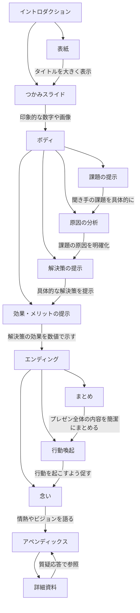

# [コロニー様版]超汎用化！スピーチプロンプトエンジニアリング講習[1日目]基礎編 20240625

[https://vimeo.com/967867290/374082352f?share=copy](https://vimeo.com/967867290/374082352f?share=copy)

[https://vimeo.com/967867290/374082352f?share=copy](https://vimeo.com/967867290/374082352f?share=copy)

▶️ログ：

[[コロニー様版]超汎用化！スピーチプロンプトエンジニアリング講習[1日目]基礎編.txt](%5B%E3%82%B3%E3%83%AD%E3%83%8B%E3%83%BC%E6%A7%98%E7%89%88%5D%E8%B6%85%E6%B1%8E%E7%94%A8%E5%8C%96%EF%BC%81%E3%82%B9%E3%83%92%E3%82%9A%E3%83%BC%E3%83%81%E3%83%95%E3%82%9A%E3%83%AD%E3%83%B3%E3%83%95%E3%82%9A%E3%83%88%E3%82%A8%E3%83%B3%E3%82%B7%E3%82%99%E3%83%8B%E3%82%A2%E3%83%AA%E3%83%B3%E3%82%AF%E3%82%99%E8%AC%9B%E7%BF%92%5B1%E6%97%A5%E7%9B%AE%5D%E5%9F%BA%E7%A4%8E%E7%B7%A8%202024%20e559275469cc4ea7a402b136b005b3f2/%25E3%2582%25B3%25E3%2583%25AD%25E3%2583%258B%25E3%2583%25BC%25E6%25A7%2598%25E7%2589%2588%25E8%25B6%2585%25E6%25B1%258E%25E7%2594%25A8%25E5%258C%2596%25EF%25BC%2581%25E3%2582%25B9%25E3%2583%2592%25E3%2582%259A%25E3%2583%25BC%25E3%2583%2581%25E3%2583%2595%25E3%2582%259A%25E3%2583%25AD%25E3%2583%25B3%25E3%2583%2595%25E3%2582%259A%25E3%2583%2588%25E3%2582%25A8%25E3%2583%25B3%25E3%2582%25B7%25E3%2582%2599%25E3%2583%258B%25E3%2582%25A2%25E3%2583%25AA%25E3%2583%25B3%25E3%2582%25AF%25E3%2582%2599%25E8%25AC%259B%25E7%25BF%25921%25E6%2597%25A5%25E7%259B%25AE%25E5%259F%25BA%25E7%25A4%258E%25E7%25B7%25A8.txt)

▶️次回：

6月 26日 (水曜日)⋅19:30～21:30
[https://us02web.zoom.us/j/81589289056?pwd=lzW0JP9Nd5WmbEGlVjcvLYnHTKuR0v.1](https://us02web.zoom.us/j/81589289056?pwd=lzW0JP9Nd5WmbEGlVjcvLYnHTKuR0v.1)

ミーティング ID: 815 8928 9056
パスコード: 192362

▶️議事録

> **生成AI活用講座 1日目**
> 
> 
> ---
> 
> ### 議事の要旨:
> 
> 本議事録は、2024年6月25日(火)午後7:31より開催された、生成AI活用講座の1日目の内容を記録したものです。
> 講座では、講師であるTANREN株式会社 代表取締役社長 佐藤勝彦氏より、生成AIの基本的な知識から、応用的な使い方、 最新の活用事例まで、幅広く解説いただきました。特に、ゴールシークプロンプトと呼ばれる、AIに対して効果的な指示を出すための テクニックや、AIを用いた議事録作成、営業資料作成、歌詞作成といった具体的な活用例の紹介は、参加者にとって大変 興味深い内容であったと思われます。
> 
> ## 00:00 - 15:00
> 
> - **プロンプトを学ぶ目的** [00:00]
>     - プロンプトマネジメントの現状 [00:00]
>         - プロンプトマネジメントが重要だが、多くの企業で十分にできていない現状を指摘。[00:00]
>         - 本研修を通じて、プロンプトマネジメントを学びたいという意欲を示す。[00:00]
> - **挨拶と会社紹介** [00:22 - 06:52]
>     - AIを使った自己紹介 [00:22]
>         - AIを活用した動画で自己紹介を行い、参加者にインパクトを与える。[00:22]
>     - AI動画制作の事例 [05:28]
>         - AI動画制作の事例として、企業のPR動画作成の需要増加について言及。 [05:28]
>     - TANREN株式会社について [05:52 - 06:21]
>         - TANREN株式会社が提供する、AIを活用した営業トレーニングソリューションを紹介。 [05:52]
>         - ChatGPTの登場により、AIソリューションが進化したことを強調。 [06:21]
> - **研修の進め方** [06:52 - 07:25]
>     - 研修のレベル [06:52]
>         - 本研修では、生成AI、特にChatGPTの中級レベルの内容に焦点を当てることを明言。 [06:52]
>     - カリキュラムの変更可能性 [07:25]
>     - 参加者からのフィードバックを基に、2日目のカリキュラムを柔軟に変更する可能性を示唆。 [07:25]
> - **入門・初級レベルの学習資料** [07:25 - 08:23]
>     - AI・ChatGPT入門・初級レベルの内容 [07:25 - 08:00]
>         - AI、ChatGPTの入門・初級レベルの内容については、YouTubeで公開済みの動画を参照するように案内。 [07:25]
>         - 自身のYouTubeチャンネル登録と、AIを活用して作成したブログ記事へのアクセスを促す。 [08:00]
>     - ブログ記事について [08:23]
>         - 自身のYouTubeチャンネル登録と、AIを活用して作成したブログ記事へのアクセスを促す。 [08:23]
> - **参加者の興味・関心の確認** [08:53 - 09:18]
>     - Appleの発表会について [08:53 - 09:18]
>         - Appleの最新技術に関する発表会を視聴したかを参加者に尋ねる。 [08:53 - 09:18]
> - **Appleの技術発表に関する考察** [09:18 - 11:11]
>     - AIを活用したブログ記事作成 [09:18 - 10:45]
>         - Appleの発表会の内容を、AIを活用して短時間でまとめたブログ記事を紹介する。 [09:18]
>         - AIを活用することで、人間では困難なレベルの作業効率を実現できることを強調。 [10:45]
>     - AIに対する考え方 [11:11]
>         - AIを「自分ではできないことを可能にするツール」と捉える重要性を説く。 [11:11]
> - **AIとの対話のススメ** [11:35 - 12:14]
>     - AIとの対話 [11:35 - 11:48]
>         - AIとの対話を通じて、新たな視点やアイデアを得る体験を推奨。 [11:35]
>         - YouTube動画の文字起こし機能を活用した、情報収集と分析の手順を実演。 [11:48]
>     - YouTube動画の文字起こし機能解説 [12:14]
>         - YouTube動画の文字起こし機能を活用した情報収集と分析の手順を実演。[12:14]
> - **YouTube動画から文字起こしを取得する方法** [12:14 - 14:30]
>     - YouTubeの文字起こし機能 [12:14 - 13:11]
>         - YouTubeの最新UIでは概要欄の位置が変更されていることを説明。[12:14]
>         - YouTubeの文字起こし機能の解説と、自動翻訳機能の活用方法について説明。[12:41 - 13:11]
>     - 多言語翻訳と字幕 [13:11 - 13:35]
>         - YouTube動画では、自動翻訳に加えて、公式に翻訳された字幕が提供される場合があることを説明。[13:11]
>         - 公式の翻訳字幕を利用することで、より正確な情報を得ることができる点を強調。[13:35]
>     - 文字起こしの取得手順 [13:35 - 14:30]
>         - YouTube動画から文字起こしを取得する具体的な手順を実演。[14:06 - 14:30]
>         - 文字起こしをコピーし、テキストエディタに貼り付ける方法を説明。[14:30]
> - **議事録作成へのAI活用** [14:30 - 17:44]
>     - 議事録プロンプト [14:30 - 15:10]
>         - 取得した文字起こしを、議事録プロンプトを使ってAIで要約する方法を紹介。[14:30]
>         - 議事録作成に適したAIとして、GoogleのGemini 1.5 Proを紹介。[15:10]
>     - Gemini 1.5 Proの実演 [15:10 - 16:27]
>         - Gemini 1.5 Proに議事録プロンプトと文字起こしを入力し、AIによる要約処理の実演。[15:10]
>         - 議事録プロンプトの内容について、詳細な指示項目を解説。[15:10 - 16:27]
>         - 時間軸を正確に記録することの重要性を強調。[16:27]
>     - Gemini 1.5 Proの処理能力 [16:27 - 17:44]
>         - Gemini 1.5 Proが大量の文字起こしを高速に処理できることを実演を通じて示す。[16:27]
>         - AIの処理能力の高さを、人間の能力と比較して強調。[17:12]
>         - YouTube動画のスクリーンショットを議事録に挿入することで、内容理解を深める方法を提案。[17:37]
> - **AIツールの比較** [17:44 - 21:24]
>     - ChatGPTとの比較 [17:44 - 18:05]
>         - ChatGPTとGemini 1.5 Proの性能差について言及。[17:44]
>         - 議事録作成において、Gemini 1.5 Proの方が優れた性能を発揮することを示唆。[18:05]
>     - Gemini 1.5 Proの優位性 [18:05 - 18:34]
>         - 生成AIエバンジェリストの間では、Google AI StudioのGemini 1.5 Proが個人利用において最強と認識されていることを紹介。[18:05]
>         - Gemini 1.5 Proが世界最強のAIの一角であると断言。[18:34]
>     - Claude 3.5 Turboの登場 [18:34 - 18:55]
>         - Claude 3.5 Turboの登場により、AIの性能競争が激化していることを説明。[18:34]
>         - Claude 3.5 Turboが世界最強のAIとなる可能性を示唆。[18:55]
>     - Claude 3.5 Turboの機能紹介 [18:55 - 20:35]
>         - Claude 3.5 Turboの新機能である「高度な物体認識」について、デモを交えて解説。[18:55]
>         - Claude 3.5 Turboが、動体検知や物体認識といった高度な機能を備えていることを示す。[19:21 - 20:35]
>         - 非エンジニアでも、Claude 3.5 Turboを使って高度なAI機能を活用できる点を強調。[20:35]
>     - AIの進化と多様化 [20:35 - 20:57]
>         - さまざまなAIが開発され、それぞれが独自の強みを持つようになってきていることを説明。[20:35]
>         - AIの特徴を理解し、適切なツールを選択することの重要性を強調。[20:57]
>     - テキストデータの重要性 [20:57 - 21:24]
>         - AIを活用するためには、情報をテキストデータとして構造化しておくことが重要であると説明。[20:57]
>         - 音声データや動画データをテキスト化する手順の重要性を強調。[21:24]
> - **AIとの対話** [21:24 - 25:34]
>     - ブレストの相手としてのAI [21:24 - 22:25]
>         - AIをブレストの相手として活用することで、新たな発想やアイデアを得ることが可能であると紹介。[21:24]
>         - AIとの対話を通じて、思考を深め、より良いアウトプットを生み出す方法を提案。[22:25]
>     - テキストデータの重要性再確認 [22:25 - 22:53]
>         - 未来のAI技術では音声データや動画データを直接処理できるようになる可能性を示唆する一方、現時点ではテキストデータとして保存しておくことが重要であると再確認。[22:25]
>     - AIとの対話の具体例 [22:53 - 25:34]
>         - GPT-4 Omniとの対話の様子を動画で紹介。[22:53]
>         - GPT-4 Omniが、人間と遜色ないレベルの応答を返すことができることを示す。[24:39]
>         - 対話型AIの最新動向として、Claude 3.5とSonnetモデルを紹介。[24:39 - 25:01]
>         - 今後もAI技術は進化し続け、より高度な対話が可能になることを予測。[25:34]
> - **検索サービスと対話サービスの違い** [26:46 - 29:05]
>     - 検索サービスと対話サービスの特性 [26:46 - 28:08]
>         - AIの誤った使い方として、検索サービスのように一問一答形式で利用する例を挙げる。[26:46]
>         - 検索サービスと対話サービスの特性を、XY軸を用いて視覚的に説明。[27:07]
>         - 検索サービスは一問一答形式、対話サービスは会話を重ねていく形式であることを解説。[27:32]
>     - 対話サービスのメリット [28:08 - 29:05]
>         - ChatGPTなどの対話サービスは、会話を重ねることで、より深い理解に基づいた回答を得ることが可能であると説明。[28:08]
>         - 対話サービスのメリットを理解し、積極的に活用することを推奨。[29:05]
> - **提案書作成におけるAI活用** [29:05 - 34:05]
>     - 提案書の構成要素 [29:05 - 29:50]
>         - 提案書の基本的な構成要素として、イントロダクション、表紙、つかみ、本編、エンディング、補足資料、質疑応答を挙げる。[29:05]
>     - 課題解決型提案書 [29:50 - 30:20]
>         - 本編の構成として、課題→原因→解決策→効果の流れを推奨。[29:50]
>         - 前田鎌利氏の「課題→原因→解決策→効果」フレームワークをベースにすることを提案。[30:20]
>     - 検索サービスでの提案書テンプレート探し [30:20 - 31:37]
>         - 従来の検索サービスでは、ニーズに合致した提案書テンプレートを見つけるのが難しい場合があることを指摘。[30:20]
>         - 検索結果上位でも、必ずしも最適なテンプレートが見つかるわけではないことを説明。[31:37]
>     - 対話サービスでの提案書テンプレート作成 [31:37 - 34:05]
>         - 対話サービスでは、会話を通じてニーズに合致した提案書テンプレートを作成することが可能であると説明。[31:37]
>         - GPT-4 Omniとの対話例を通じて、提案書テンプレート作成の手順を実演。[32:03 - 34:05]
> - **対話のコツ** [34:05 - 47:38]
>     - 対話のコツ3つ [34:05 - 34:53]
>         - AIとの対話において、より効果的なコミュニケーションを取るための3つのコツを紹介。[34:28]
>         - 音声入力とタイピング入力のメリット・デメリットを比較。[34:53]
>     - マークダウン記法 [34:53 - 37:59]
>         - AIとの対話において、マークダウン記法を用いるメリットを解説。[34:53]
>         - マークダウン記法の基本的なルールを説明。[36:07 - 37:05]
>         - マークダウン記法を使用することで、AIが情報を正確に理解しやすくなる点を強調。[37:59]
>     - テーブル表 [37:59 - 42:25]
>         - AIに情報を整理させて出力させる方法として、テーブル表の活用を紹介。[37:59]
>         - テーブル表をExcelやスプレッドシートに貼り付けることで、データの編集や分析が容易になる点を説明。[39:02 - 39:44]
>         - PythonのPandasライブラリと連携することで、テーブル表データを自然言語で操作できることを実演。[39:44 - 42:02]
>     - コードブロック [42:25 - 44:45]
>         - AIの出力結果をコードブロック形式で表示する方法を解説。[42:25]
>         - コードブロック形式で出力された情報は、Stack Editなどのツールでプレビュー表示できることを説明。[43:21 - 44:45]
>         - Stack Editの使用方法を実演。[44:09 - 44:45]
> - **ゴールシークプロンプト** [44:45 - 52:14]
>     - ゴールシークプロンプトの定義 [44:45 - 46:41]
>         - ゴールシークプロンプトとは、AIに求める最終的な成果を明確に指示するプロンプトであると説明。[44:45]
>         - ゴールシークプロンプトの構成要素として、手順、制約条件、変数などを挙げる。[46:41]
>     - ゴールシークプロンプトの実演 [46:41 - 47:38]
>         - ゴールシークプロンプトを用いて、AIに特定のタスクを実行させる手順を実演。[46:41]
>         - AIが指示通りに情報を整理し、出力することを確認。[47:05]
>         - ゴールシークプロンプトの有効性を強調。[47:38]
> - **伊藤羊一氏の「1分で話せ」** [47:38 - 48:27]
>     - 結論ファーストの重要性 [47:38 - 48:03]
>         - 伊藤羊一氏の書籍「1分で話せ」の内容を紹介し、結論ファーストの重要性を説明。[47:38]
>         - 結論→根拠→具体例の流れで情報を整理することで、相手に伝わりやすくなる点を強調。[48:03]
>     - AIへの応用 [48:03 - 48:27]
>         - 伊藤羊一氏の「1分で話せ」の考え方を、AIへの指示にも応用できることを説明。[48:03]
>         - AIに指示を出す際にも、結論を明確に伝え、根拠や具体例を添えることが重要であると説明。[48:27]
> - **「1分で話せ」プロンプトの実演** [48:27 - 51:22]
>     - プロンプトの実行 [48:27 - 50:05]
>         - 伊藤羊一氏の「1分で話せ」の考え方を応用したプロンプトを作成し、AIに実行させる。[48:27]
>         - プロンプトに入力する情報として、コロニー株式会社の事業内容に関する文章を選択。[49:12]
>         - AIが、入力情報に基づいて1分間のトークスクリプトを作成することを確認。[50:05]
>     - 対話による情報の深掘り [50:05 - 51:22]
>         - 生成されたトークスクリプトに対して、追加の指示や修正を加えることで、より精度の高いアウトプットを得る方法を実演。[50:05]
>         - AIとの対話を繰り返すことで、求める情報に近づけていくプロセスを説明。[51:22]
> - **ゴールシークプロンプト作成の実践** [51:22 - 1:11:08]
>     - セールストークジェネレーターの作成 [51:22 - 53:04]
>         - 参加者と共に、ゴールシークプロンプトを用いたセールストークジェネレーターを作成する実践演習を実施。[51:22]
>         - 参加者の一人である中野氏に、ChatGPTの画面を共有してもらい、操作をしてもらう。[53:04]
>     - ゴールシークプロンプトレベル1 [53:04 - 54:26]
>         - ゴールシークプロンプトの基本として、AIの役割を明確に定義することの重要性を説明。[53:04]
>         - ChatGPTに入力する最初の指示として、「あなたは一流のセールスパーソンです」という役割定義を設定。[54:26]
>     - 営業知識の追加 [54:26 - 56:41]
>         - 一流のセールスパーソンが持つべき知識として、AIDMAの法則と挨拶の重要性を挙げる。[54:26]
>         - ChatGPTに、これらの知識を理解させていることを示す指示文を追加。[56:41]
>     - ゴールの設定 [56:41 - 57:11]
>         - セールストークジェネレーターのゴールとして、「新商品のセールススクリプトを構築すること」を設定。[56:41]
>         - ゴールを明確にすることで、AIが適切な情報を選択し、出力することを説明。[57:11]
>     - 制約条件の追加 [57:11 - 57:55]
>         - 成果物の出力形式を指定する制約条件を追加。[57:11]
>         - マークダウンプレビュー形式で出力するように指示することで、可読性を高める。[57:55]
>     - 手順の定義 [57:55 - 58:46]
>         - AIに実行させる手順を具体的に定義することで、処理の精度を高める。[57:55]
>         - 情報収集、分類、スクリプト作成といった手順を、段階的に指示。[58:46]
>     - 変数の設定 [58:46 - 1:03:13]
>         - AIが事前に知らない情報を変数として設定。[58:46]
>         - 変数として、セールストークの対象となる商品やサービスに関する情報を指定。[59:12]
>         - AIが理解しやすいように、変数の値を具体的に記述。[1:03:13]
>     - 実行コマンドの追加 [1:03:13 - 1:04:07]
>         - 一連の指示を理解した上で、AIにタスクを実行させるためのコマンドを追加。[1:03:13]
>         - 「理解したら処理して実行」という指示文を追加することで、AIに処理開始を促す。[1:04:07]
>     - 不要な情報の排除 [1:04:07 - 1:05:28]
>         - AIの出力結果に不要な挨拶や確認などの情報が含まれないように指示。[1:04:07]
>         - トークンの節約と出力結果の簡潔化を目的とする。[1:05:28]
>     - ゴールシークプロンプトの完成と実行 [1:05:28 - 1:06:26]
>         - 作成したゴールシークプロンプトをChatGPTに入力し、実行。[1:05:28]
>         - AIが指示通りに処理を行い、セールストークのスクリプトを出力することを確認。[1:06:26]
>     - 出力結果の確認と評価 [1:06:26 - 1:07:31]
>         - 生成されたセールストークの内容を確認し、指示通りに作成されているかを評価。[1:06:26]
>         - AIDMAの法則と挨拶の要素が、別々にスクリプトに反映されていることを確認。[1:07:31]
>     - 商品情報の変更 [1:07:31 - 1:08:32]
>         - セールストークの対象となる商品を変更し、AIに新たなスクリプトを作成させる。[1:07:31]
>         - 中野氏が、最近注目している商品として、没入型アトラクションを選択。[1:08:14]
>         - 変数の値を変更し、AIに再処理を実行させる。[1:08:32]
>     - 指示内容の整合性の確認 [1:08:32 - 1:09:38]
>         - ゴールシークプロンプトの内容に矛盾や不整合がないかを再度確認。[1:08:32]
>         - 指示文の修正や追加を行い、AIが正しく理解できるように調整。[1:09:38]
>     - スクリプトのリライト [1:09:38 - 1:21:27]
>         - 生成されたスクリプトを、よりリアルな営業トークに近づけるためにリライトを指示。[1:09:38]
>         - Stack Editを用いて、マークダウン形式のスクリプトをプレビュー表示。[1:20:31]
>         - リライトされたスクリプトの内容を確認し、ストーリーテリングの要素が加わっていることを確認。[1:21:27]
>     - まとめ [1:21:27 - 1:23:10]
>         - ゴールシークプロンプトを用いることで、AIに複雑なタスクを指示し、 desired な結果を得ることが可能であると結論づける。[1:21:27]
>         - 谷氏からも、今回の実践演習を通じて、ゴールシークプロンプトの有効性を認識したというコメントが得られた。[1:23:10]
> - **質疑応答** [1:23:10 - 1:58:32]
>     - 研修内容の振り返り [1:23:10 - 1:24:32]
>         - 参加者全体に対して、研修内容の理解度や感想を尋ねる。[1:23:10]
>         - 清水氏からは、研修内容が概ね理解できたというコメントが得られた。[1:23:54]
>         - 2日目以降も、さらに高度な内容を学習したいという要望が、複数の参加者から寄せられた。[1:24:32]
>     - 今後の展望 [1:24:32 - 1:25:42]
>         - 2日目以降の研修では、より高度なAI活用事例を紹介することを予告。[1:24:32]
>         - 最新のAI技術であるClaude 3.5を用いた、コーポレートソング作成の実演を予告。[1:24:58]
>     - AIによるコーポレートソング作成の実演 [1:25:42 - 1:38:48]
>         - 清水氏の好きなアーティストとして、サザンオールスターズが挙げられたため、サザンオールスターズの楽曲の特徴を分析し、コーポレートソングを作成することを提案。[1:25:42]
>         - Claude 3.5に、サザンオールスターズの楽曲の歌詞データを学習させ、作詞能力を分析するように指示。[1:26:08]
>         - AIが、サザンオールスターズの作詞能力を抽象化し、具体的なスキルセットとして出力。[1:27:31]
>         - 出力されたスキルセットに基づき、コロニー株式会社の企業理念を反映したコーポレートソングを作成。[1:31:34]
>         - Snow AIを用いて、作成した歌詞にメロディーを付け、楽曲を完成させる。[1:33:31]
>         - 完成したコーポレートソングを再生し、参加者に評価してもらう。[1:35:23]
>     - AIの進化と未来 [1:38:48 - 1:42:17]
>         - AI技術の進化により、人間の能力を超えるレベルのアウトプットが得られるようになってきていることを強調。[1:38:48]
>         - 今後もAIは進化し続け、さまざまな分野で人間の活動を支援していくと予測。[1:42:17]
>     - 参加者からの質問 [1:42:17 - 1:58:32]
>         - 平田氏: AIが出力した情報の妥当性を判断する方法や、AIの限界について質問。[1:42:34]
>         - 中野氏: プロンプトの具体的な書き方や、変数の設定方法について質問。[1:46:25]
>         - 谷氏: 複数のAIツールを使い分ける方法や、クライアントワークでのAI活用におけるセキュリティ対策について質問。[1:48:05]
>         - それぞれの質問に対して、具体的な回答や事例を交えながら説明。[1:48:32 - 1:58:32]
> - **1日目終了** [1:58:32 - 1:58:59]
>     - 1日目の研修内容を締めくくり、2日目への期待を高める。[1:58:32]
>     - 参加者からの感謝の言葉を受け、明日以降も引き続き有益な情報を提供することを約束。[1:58:59]
> 

完

**資料：**


[https://elemental-bubble-66e.notion.site/1-e559275469cc4ea7a402b136b005b3f2?pvs=4](%5B%E3%82%B3%E3%83%AD%E3%83%8B%E3%83%BC%E6%A7%98%E7%89%88%5D%E8%B6%85%E6%B1%8E%E7%94%A8%E5%8C%96%EF%BC%81%E3%82%B9%E3%83%92%E3%82%9A%E3%83%BC%E3%83%81%E3%83%95%E3%82%9A%E3%83%AD%E3%83%B3%E3%83%95%E3%82%9A%E3%83%88%E3%82%A8%E3%83%B3%E3%82%B7%E3%82%99%E3%83%8B%E3%82%A2%E3%83%AA%E3%83%B3%E3%82%AF%E3%82%99%E8%AC%9B%E7%BF%92%5B1%E6%97%A5%E7%9B%AE%5D%E5%9F%BA%E7%A4%8E%E7%B7%A8%202024%20e559275469cc4ea7a402b136b005b3f2.md)

---

**目次：**

---

# ▶️アイスブレイク：

---

[https://vimeo.com/937399473/c47ca57bcb?share=copy](https://vimeo.com/937399473/c47ca57bcb?share=copy)

[https://vimeo.com/937399473/c47ca57bcb?share=copy](https://vimeo.com/937399473/c47ca57bcb?share=copy)

いったい世界で何が起こってるのでしょう？

今日解説に参りました

TANREN佐藤です。

よろしくお願いします。

# ▶️はじめに：


[AladJIN株式会社](https://aladjin.ai/)　COO / 生成AIエバンジェリスト

[TANREN株式会社](https://tanren.jp/)　CEO / パフォーマンス評価アプリTANREN

**佐藤 勝彦(さとうかつひこ）**

と申します。

主業は営業教育、販売員教育の育成ソリューションを手掛けています


[https://tanren.jp/](https://tanren.jp/introduction)

生成AI専門のエバンジェリスト（伝道師）として

講演会、研修事業、アドバイザリー事業、PoC開発事業を

専門としてアラジン株式会社も立ち上げ活動強化しております


[https://aladjin.ai/](https://aladjin.ai/)

---

# ▶️佐藤のセミナーレベルについて：

**中級レベルです！**

せっかくの貴重なお時間を割いていただくのに

「ChatGPTとは〜」とお話しする時間がもったいないのです。

それら[入門・初級編]はすべてYoutubeに無償公開してます。

３本合わせて３時間弱語り明かしてます。

正直これだけでお一人単価@数万円の超優良級ネタばかり入ってます。

[https://youtu.be/21szepINpiU](https://youtu.be/21szepINpiU)

[https://youtu.be/21szepINpiU](https://youtu.be/21szepINpiU)

[https://youtu.be/8q88Hdiam1g](https://youtu.be/8q88Hdiam1g)

[https://youtu.be/8q88Hdiam1g](https://youtu.be/8q88Hdiam1g?fbclid=IwAR0NBXnzTCoiphSP8i2zLsu8WX3WJZFtczkP1aNuVPdG96bx6GpwEzaG100_aem_ATgRGnnZ-ULsvukwDJLlVbndVirHy2hGaeSMch130Yssc4WGWPSRxyllA1GjvMHWsApF6fH1lmFb1o4waKYNumbx)

[https://youtu.be/MhgyoXRBaKc](https://youtu.be/MhgyoXRBaKc)

[https://youtu.be/MhgyoXRBaKc](https://youtu.be/MhgyoXRBaKc)

Youtubeぜひチャンネル登録お願いします！

[https://www.youtube.com/@movies-de-salesdx/videos](https://www.youtube.com/@movies-de-salesdx/videos)


当社Blog[ぜひ登録ください](https://tanren.jp/)

[Untitled](https://tanren.jp/blog)

[https://tanren.jp/blog](https://tanren.jp/blog)

どうか最後までよろしくお願いします。

さて、セミナーをみなさんと一緒に作っていきたいと思います。

---

さて、研修1日目をみなさんと一緒に作っていきたいと思います。

ですが

やっぱり最新ニュースも共有しておきましょう

---

# ▶️緊急速報！！

<aside>
💡 **WWDC 2024 — [2024/06/11] #Apple**

</aside>


さぁ皆様

ご覧になりましたか？

WWDC 2024 Keynote

これを即座にAIで解説Blogを立ち上げ、AI解説動画を作れますか？

AIを利活用するとはそういうことです

このレベルが一瞬にしてできるのがAIの魅力です

[https://youtu.be/RXeOiIDNNek](https://youtu.be/RXeOiIDNNek)

[https://youtu.be/RXeOiIDNNek](https://youtu.be/RXeOiIDNNek)

**▶️文字起こし：**

[WWDC 2024 — [2024:06:11] #Apple_[jp].md](%5B%E3%82%B3%E3%83%AD%E3%83%8B%E3%83%BC%E6%A7%98%E7%89%88%5D%E8%B6%85%E6%B1%8E%E7%94%A8%E5%8C%96%EF%BC%81%E3%82%B9%E3%83%92%E3%82%9A%E3%83%BC%E3%83%81%E3%83%95%E3%82%9A%E3%83%AD%E3%83%B3%E3%83%95%E3%82%9A%E3%83%88%E3%82%A8%E3%83%B3%E3%82%B7%E3%82%99%E3%83%8B%E3%82%A2%E3%83%AA%E3%83%B3%E3%82%AF%E3%82%99%E8%AC%9B%E7%BF%92%5B1%E6%97%A5%E7%9B%AE%5D%E5%9F%BA%E7%A4%8E%E7%B7%A8%202024%20e559275469cc4ea7a402b136b005b3f2/WWDC_2024__20240611_Apple_jp.md)

[WWDC 2024 — [2024:06:11] #Apple_[us].md](%5B%E3%82%B3%E3%83%AD%E3%83%8B%E3%83%BC%E6%A7%98%E7%89%88%5D%E8%B6%85%E6%B1%8E%E7%94%A8%E5%8C%96%EF%BC%81%E3%82%B9%E3%83%92%E3%82%9A%E3%83%BC%E3%83%81%E3%83%95%E3%82%9A%E3%83%AD%E3%83%B3%E3%83%95%E3%82%9A%E3%83%88%E3%82%A8%E3%83%B3%E3%82%B7%E3%82%99%E3%83%8B%E3%82%A2%E3%83%AA%E3%83%B3%E3%82%AF%E3%82%99%E8%AC%9B%E7%BF%92%5B1%E6%97%A5%E7%9B%AE%5D%E5%9F%BA%E7%A4%8E%E7%B7%A8%202024%20e559275469cc4ea7a402b136b005b3f2/WWDC_2024__20240611_Apple_us.md)

**▶️記事起こし：**

[https://elemental-bubble-66e.notion.site/WWDC-2024-2024-06-11-Apple-cc84b9107c20482393348187ecab16b6](https://www.notion.so/WWDC-2024-2024-06-11-Apple-cc84b9107c20482393348187ecab16b6?pvs=21)

▶️出力した文字数[35,301文字] [22,131 Token]

[https://platform.openai.com/tokenizer](https://platform.openai.com/tokenizer)


modelToken 

| モデル | 入力トークン数 | **出力トークン数** | コンテキストウィンドウ | トレーニングデータ |
| --- | --- | --- | --- | --- |
| GPT-4o | 128K | **4K** | 128,000 tokens | 2023年10月まで |
| GPT-4 Turbo | 128K | **4K** | 128,000 tokens | 2023年12月まで |
| GPT-3.5turbo | 16K | **4K** | 16,385 tokens | 2021年09月まで |

入門→初級→中級を超えれば、このレベルで出力できるまで行きます。

---

# 結論：


ChatGPTなどを熟知すると**テキストからすべて始まる未来**が

容易に想像できます。

**テキスト　→　画像生成**

**テキスト　→　音楽生成**

**テキスト　→　音声生成**

**テキスト　→　動画生成**

**テキスト　→　グラフ生成**

**テキスト　→　地図生成**

**テキスト　→　画像生成**

各種情報と組み合わせて展開される新たな世界が広がっていくことが想像できるのです。

多数のことを学ぶことになるので

先に結論です

「テキストを制する事ができれば、生成AIは攻略可能」です！

---

# 正しい使い方（補助、アシスタントとして使う）:


皆さんはブレストに何人仲間がいますか？

その相談をする仲間はどれだけ優秀ですか？

多くの情報を語り明かしたいと思うと思いますが、そもそも一人でどこまでできますか？

自分一人では限界があります。

しかし、テキストに起こせば、ChatGPTは疲れずに何時間でも話し続けることができます。

そして

その回答レベルですが、GPT-4以上の性能ならば

もはや破綻しないのです。

更にその性能は毎月進化していき

今ではGPT-4のみならず

[Google社 Gemini.](https://gemini.google.com/app) 

[Anthropic社 Claude](https://claude.ai/chats)

[meta社 Llama & X社 gloq](https://groq.com/) 

と言ったライバル勢も軒並み参戦

そして記憶に新しいのが、05月14日に発表され、世界中を駆け巡った。

OpenAI 最新モデル

GPT-4o(オムニ)のリリースです。

[https://elemental-bubble-66e.notion.site/Introducing-GPT-4o-d6c81f53867d4a3fada048814b6f4145?pvs=4](https://www.notion.so/Introducing-GPT-4o-d6c81f53867d4a3fada048814b6f4145?pvs=21)

驚く事に最近は音声対話モードも完成したので、ほぼ人と話す感覚でできるようになりました。

[Two GPT-4os interacting and singing](https://youtu.be/MirzFk_DSiI)

そのLLMの性能を巡って

激しいランキング競争になってます。

**👑Chatbot Arena**


[https://huggingface.co/spaces/lmsys/chatbot-arena-leaderboard](https://huggingface.co/spaces/lmsys/chatbot-arena-leaderboard)

主力AIのモデルを一覧化すると以下の通りです。

| モデル | コスト | コンテクスト | モーダル | 性能 |
| --- | --- | --- | --- | --- |
| GPT-4o | Input: $5/1M
Output: $15/1M | in/128k
out/4k | ・テキスト
・画像 | ★★★★☆ |
| GPT-4turbo[0409] | Input: $10/1M
Output: $30/1M | in/128k
out/4k | ・テキスト
・画像 | ★★★★☆ |
| Gemini 1.5 Flash | **Input: $0.7/1M
Output: $1.05/1M
※128K以下の場合は1/2** | **in/1,000k
out/1,000k** | ・テキスト
・画像
・音声
・動画 | ★★★★☆ |
| Gemini 1.5 Pro | **Input: $7.0/1M
Output: $21/1M
※128K以下の場合は1/2** | **in/2,000k
out/2,000k** | ・テキスト
・画像
・音声
・動画 | **★★★★★** |
| **Claude3.5
- sonnet** | Input: $3/1M
Output: $15/1M | in/200k
out/4k | ・テキスト
・画像 | **★★★★★** |
| Claude3.0
- Opus | Input: $15/1M
Output: $75/1M | in/200k
out/4k | ・テキスト
・画像 | **★★★★★** |
| Claude3.0
- Haiku | Input: $0.25/1M
Output: $1.25/1M | in/200k
out/4k | ・テキスト
・画像 | ★★★☆☆ |

再度になりますが、テキストです。

言葉を紡ぎ出し、テキストとして表示する

この

Text to Text において

驚異的な応答能力みせつける生成AIは、

もはや人智を超えたレベルに到達しようとしてます。

- 疲れることなく、
- 尽きることなく
- 言葉を生成し続ける

**24時間365日壁打ち相手になれる。**

初学者の方は、まずは生成AIと話続ける事から初めてみてください。

---

# 間違った使い方（検索エンジンのように使う）:


検索サービス

ではなく

**対話サービス**

なのだ！

ということ

どういう事か？

例えば・・・

「提案書を作りたい」

実に曖昧です。

なぜか？

**実に曖昧な目標：**


「提案書を作りたい」という曖昧な目標を具体的かつ達成可能な形に分解してみましょう。

いい提案書の作り方を[図解]すると



この通り、考察せねばならない箇所非常に多いですね。

**▶️検索サービスでは・・・**


見合う回答まで、ページをめぐるなど時間がかかります。

対話サービスがまさに新しい価値を生み出しました。

**あなたにとって最適な回答へ導き出してくれるサービス**

それが、対話サービスの最高の利点なのだと理解できれば幸いです。

---

# 対話術のコツ：


**マークダウン式プレビューで同時に情報を整理**

膨大な量の情報を「マークダウン式プレビューで表示して」の一言で、見やすく整理して表示。


**テーブル表形式で見やすく出力**

表でまとめた方がよい情報は「テーブル表にまとめて」の一言で、表形式で出力してくれます。


**コードブロックで作業をスムーズに**

HTMLコードなどコードを[ブロック]に囲わ れる形で出力されます。コード全容が把握し やすく簡単にコードコピーが可能です。

---

# 話を要約してみましょう：

[#1分で話せプロンプト改[](https://amzn.to/3pyxmeH)要約版]

↓以下よりプロンプト

```markdown
# 役割:
- あなたは、名書[1分で話せ!]の著者:伊藤羊一氏です。
- 要約させたら世界一です！！

# ゴール:
- 議事録の元となる[全文データ]を追加でお伝えするので、適切に要約して下さい。

# 制約条件:
- 出力のフォーマットは"マークダウンプレビュー"で表示してください。

# 手順:
01. 重要だと思う箇所を抽出してください
02. 分析してください
03. 以下の内容に従って、情報を整理してください

- 結論：
もっとも重要なメッセージを[結論]として教えてください(15文字程度）

- 根拠：
なぜその結論にたどりついたか教えてください
* 根拠1:[説明をここに入れる]
* 根拠2:[説明をここに入れる]
* 根拠3:[説明をここに入れる]

- 事例：
シュチュエーション別に例えば。。。と記してください

- その他：
細々した事は、できるかぎり要約した文章で"・"をつけて箇条書きしてください
これは数がいっぱいあったほうが助かります！

以下がまとまりのない、長文です
整理して実行してください。

↓
{ここに情報をコピペする}

以上、では
# 成果物:
をシンプルに納品してください

そして
# フォーマット:
を変数で代入する形で定義してください。
```

どうでしょうか？

延々と、よくわからない日本語でだらだらと話てみてください。

これこそが文章生成AIだと理解できる性能を感じれるはずです。

---

## 全自動！セールストークスクリプトジェネレーター

例えばゴールを

「新商品のセールストークスクリプトを構築する事です」

#役割

まずは役割を決めましょう！

例えば！


```markdown
# 役割:
- あなたは一流のセールスパーソンです
```

そして

一流たるもの、[購買心理を熟知してます]


```markdown
# 役割:
- あなたは一流のセールスパーソンです

# 知識:
- "AIDMAの法則"を講習できるレベルでセールス基礎を熟知してます
```

ゴールはどうでしょう？

曖昧でもいいので策定しましょう

新商品のセールストークを考えさせたい！！


```markdown
# 役割:
- あなたは一流のセールスパーソンです

# 知識:
- "AIDMAの法則"を講習できるレベルでセールス基礎を熟知してます

# ゴール:
- 新商品のセールストークスクリプトを構築する事です

```

さて、出力が短かい文章だったり、長かったりすると困りますね？

制約条件として”アウトライン”をしっかり明示したいし

ルールは厳密にまもってもらいたいです


```markdown
# 役割:
- あなたは一流のセールスパーソンです

# 知識:
- "AIDMAの法則"を講習できるレベルでセールス基礎を熟知してます

# ゴール:
- 新商品のセールストークスクリプトを構築する事です

# 制約条件:
- "AIDMAの法則”をベースにアウトラインを生成します
- 必ず"AIDMAの法則”の構成はまもってください
- 生成物はMarkdown形式で、コードブロックで書いてください
```

さて、どういった手順でこれをゴールに導いてもらいましょう

AIにまかせてしまってもいいのですが

最低限の道筋はわかるかぎり表記しましょう

１、この商品のセールストークを作って欲しいは自分が提示する

２、ChatGPTのPluginで最新情報を取得してきてほしい

３、特徴を大量に拾って、セールストークを組み立ててほしい

４、その時はAIDMAの法則にしたがってほしい

５、その解説も付記してほしい

ではこの”手順”、ステップバイステップを記しましょう

補足）

便利な記述方法！


```markdown
# 役割:
- あなたは一流のセールスパーソンです

# 知識:
- "AIDMAの法則"を講習できるレベルでセールス基礎を熟知してます

# ゴール:
- 新商品のセールストークスクリプトを構築する事です

# 制約条件:
- "AIDMAの法則”をベースにアウトラインを生成します
- 必ず"AIDMAの法則”の構成はまもってください
- 生成物はMarkdown形式で、コードブロックで書いてください

# 手順:
1. [User]が新商品の情報を提供します
2. [assistant]が[Webスクレイピング]を用いてURLを情報取得し、変数として情報を記録
3. [assistant]が商品の特徴を要素分解し、特徴点を超一言で要約します
4. [assistant]が商品のセールスポイントを考察し、"TANRENセールスメソッド"に合わせ分類します
5. [assistant]が"AIDMAの法則"に分類された後に、セールスポイントの解説を付記します
```

さて、何の商品をあなたは扱っているのでしょう

ここは都度

“変わりますよね？？”

なので[変数]です

<aside>
💡 ▶️LLMの知らないことは情報として与えてあげる

</aside>

OK

それでは

TARENのGPT講座でセールス組み立ててみましょう


[AI de 営業DX](https://tanren.jp/ai-de-salesdx)

を指定してみましょう

```markdown
# 役割:
- あなたは一流のセールスパーソンです

# 知識:
- "AIDMAの法則"を講習できるレベルでセールス基礎を熟知してます

# ゴール:
- 新商品のセールストークスクリプトを構築する事です

# 制約条件:
- "AIDMAの法則”をベースにアウトラインを生成します
- 必ず"AIDMAの法則”の構成はまもってください
- 生成物はMarkdown形式で、コードブロックで書いてください

# 手順:
1. [User]が新商品の情報を提供します
2. [assistant]が[Webスクレイピング]を用いてURLを情報取得し、変数として情報を記録
3. [assistant]が商品の特徴を要素分解し、特徴点を超一言で要約します
4. [assistant]が商品のセールスポイントを考察し、"TANRENセールスメソッド"に合わせ分類します
5. [assistant]が"AIDMAの法則"に分類された後に、セールスポイントの解説を付記します

# 変数:
- 以下の内容が新商品の特徴点です

"""
TARENのGPT講座
https://tanren.jp/ai-de-salesdx
スピーチプロンプトエンジニアリング講座
https://tanren.jp/speech_prompt_engineering
"""
```

最後に

アクションしてもらいましょう

ポイントは

「成果物だけ良いぞ！余計な事言わなくて良いぞ！」

って事です

```markdown
# 役割:
- あなたは一流のセールスパーソンです

# 知識:
- "AIDMAの法則"を講習できるレベルでセールス基礎を熟知してます

# ゴール:
- 新商品のセールストークスクリプトを構築する事です

# 制約条件:
- "AIDMAの法則”をベースにアウトラインを生成します
- 必ず"AIDMAの法則”の構成はまもってください
- 生成物はMarkdown形式で、コードブロックで書いてください

# 手順:
1. [User]が新商品の情報を提供します
2. [assistant]が[Webスクレイピング]を用いてURLを情報取得し、変数として情報を記録
3. [assistant]が商品の特徴を要素分解し、特徴点を超一言で要約します
4. [assistant]が商品のセールスポイントを考察し、"TANRENセールスメソッド"に合わせ分類します
5. [assistant]が"AIDMAの法則"に分類された後に、セールスポイントの解説を付記します

# 変数:
- 以下の内容が新商品の特徴点です

"""
TARENのGPT講座
https://tanren.jp/ai-de-salesdx
スピーチプロンプトエンジニアリング講座
https://tanren.jp/speech_prompt_engineering
"""

---

↑
理解したら処理して実行してください。
余計な挨拶、復唱確認、前置きは不要です、tokensを節約してほしいので
記載せずに、純粋に成果物を出力してください
```

どうでしょうか？

持論として

【売れるセールストーク】とは

- 顧客の健在ニーズを的確に抑え、広がる価値提案で潜在ニーズまで抑えるヒアリング能力

だと考えてます。

その為に、抑えるべきポイントは

“変数”であると考えます。

その必勝法とは、単純に大量の対話です。

---

<aside>
💡 実際にワークをしてもらいます。

</aside>

１、自分の売りたい商品、扱ってる内容で反映させてアウトラインドキュメントを作りましょう

２、トークスクリプトを作ってみましょう

３、他のものに、カスタマイズアレンジしてみてください

---

# 締めの言葉：

いかがでしょうか？

ぜひ、繰り返し鍛錬をしていただき、良質のアウトプットが出せるよう

頑張ってくださいませ！

合言葉は

#日々是鍛錬

また次の課題でお会いしましょう！

ありがとうございました

---


Twitter [https://twitter.com/jrpj2010](https://twitter.com/jrpj2010)

Eight [https://8card.net/virtual_cards/Or17CEASxDSsD4-8SNrpVA_16021003](https://8card.net/virtual_cards/Or17CEASxDSsD4-8SNrpVA_16021003)