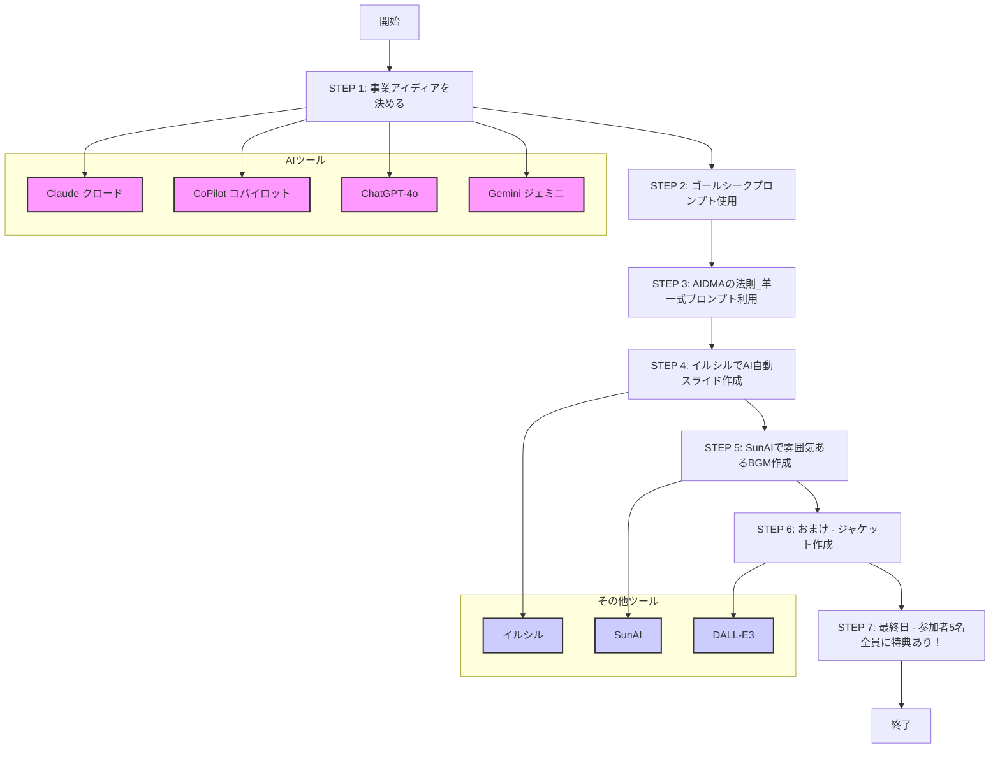

# 20240715 Day 2: AIを使いこなし、未来を創造する

[https://vimeo.com/984170538/1f1719c5a1?share=copy](https://vimeo.com/984170538/1f1719c5a1?share=copy)

[https://vimeo.com/984170538/1f1719c5a1?share=copy](https://vimeo.com/984170538/1f1719c5a1?share=copy)

▶️ログ：

[20240715 Day 2 AIを使いこなし、未来を創造する.txt](20240715%20Day%202%20AI%E3%82%92%E4%BD%BF%E3%81%84%E3%81%93%E3%81%AA%E3%81%97%E3%80%81%E6%9C%AA%E6%9D%A5%E3%82%92%E5%89%B5%E9%80%A0%E3%81%99%E3%82%8B%208e0292d31c8f4be38bfa2a553f525761/20240715_Day_2_AI%25E3%2582%2592%25E4%25BD%25BF%25E3%2581%2584%25E3%2581%2593%25E3%2581%25AA%25E3%2581%2597%25E3%2580%2581%25E6%259C%25AA%25E6%259D%25A5%25E3%2582%2592%25E5%2589%25B5%25E9%2580%25A0%25E3%2581%2599%25E3%2582%258B.txt)

▶️前回：

[20240708 Day 1: アフターデジタル社会とAIの可能性](20240708%20Day%201%20%E3%82%A2%E3%83%95%E3%82%BF%E3%83%BC%E3%83%86%E3%82%99%E3%82%B7%E3%82%99%E3%82%BF%E3%83%AB%E7%A4%BE%E4%BC%9A%E3%81%A8AI%E3%81%AE%E5%8F%AF%E8%83%BD%E6%80%A7%20250a317fc265449f9497242309b41664.md) 

[20240715 Day 2: AIを使いこなし、未来を創造する](20240715%20Day%202%20AI%E3%82%92%E4%BD%BF%E3%81%84%E3%81%93%E3%81%AA%E3%81%97%E3%80%81%E6%9C%AA%E6%9D%A5%E3%82%92%E5%89%B5%E9%80%A0%E3%81%99%E3%82%8B%208e0292d31c8f4be38bfa2a553f525761.md) 

▶️議事録

> **生成AI活用法に関する講義**
> 
> 
> ---
> 
> ### 議事の要旨:
> 
> 生成AIの活用法に関する講義。TANREN株式会社 佐藤勝彦氏が具体的なツールとしてChatGPT、Claude、Microsoft CoPilot、Google Gemini、Perplexity、SnowAI、イルシルなどが挙げ、各ツールの機能や活用事例、注意点などが説明された。後半では、武蔵野大学生徒がプレゼンバトル参加者として生成AIを用いて実際にプレゼン資料と楽曲を作成し、発表する時間が設けられた。
> 
> ## 生成AIツール紹介:
> 
> ### 生成AIツール紹介:
> 
> - **生成AIツール概要** [04:15]
>     - AIを活用した事業アイデア創出[04:15]
>         - AIとの対話によるアイデア創出[04:15]
>             - メリット：伊藤羊一氏への相談不要、24時間365日その知能と対話が可能[04:15]
>                 - メリット：低コストでの利用が可能[04:15]
>         - 最適なAIツール選択の重要性[04:15]
>             - Claude：高い国語力[04:40]
>                 - 開発元：Anthropic（元ChatGPT開発メンバーが設立）[04:40]
>                 - 出資元：Google、Amazon[04:40]
>             - Microsoft CoPilot：Web検索と引用による正確性[05:28]
>             - ChatGPT（GPT4-Omni）：バランスの取れた性能[05:56]
>             - Google Gemini：世界最高性能（エンジニア登録者限定）[05:56]
>                 - Google AI Studio 料金：完全無料[05:56]
>     - Perplexity：Web検索と引用による正確性[06:53]
>         - メリット：嘘偽りのない情報提供が可能[06:53]
>         - ソフトバンクユーザー向けキャンペーン：1年間無料[08:10]
>             - メリット：3年間で約3万円お得[08:10]
>     - Poe：あらゆるAIの統合利用[08:40]
>         - メリット：無料[08:40]
>         - 有料版：回数制限なし[09:04]
>     - 天秤AI：日本語対応のAIプラットフォーム[09:52]
>         - メリット：無料[09:52]
>         - 開発元：GMO[09:52]
> - **ゴールシークプロンプト** [10:48]
>     - ゴールシークプロンプト：AIへの指示文作成手法[10:48]
>         - メリット：AIがゴールに向けて思考[10:48]
>         - メリット：議論の発散を防ぐ[17:04]
>         - 重要性：AI活用の鍵[17:23]
>     - 作成方法：インデックス構造化[13:29]
>         - 詳細：#（ハッシュタグ）や番号で項目を整理[13:29]
>         - 詳細：体言止めを用いる[14:14]
>         - メリット：AIへの指示が明確になる[13:55]
>     - 活用例：アンケート結果分析[14:48]
>         - 手順：スプレッドシートにアンケート結果とプロンプトを入力[14:48]
>             - メリット：プロンプトの量産が可能[14:48]
> - **生成AIの倫理観** [42:34]
>     - 著作権問題[42:34]
>         - 現状：AI生成物の商用利用はグレーゾーン[42:47]
>         - 対策：商用利用時は有償版の利用を検討[43:06]
>     - 個人利用と商用利用の違い[43:06]
>         - 個人利用：収益化を目的としない場合は問題なし[43:34]
>         - 商用利用：企業は責任を持って利用する必要がある[43:34]
>     - 倫理観の重要性[44:16]
>         - AIの進化に伴い、倫理的な問題への配慮が重要[44:16]
> 
> ## プレゼン資料作成:
> 
> ### プレゼン資料作成:
> 
> - **イルシル** [22:36]
>     - イルシル：AIプレゼン資料作成ツール[22:36]
>         - メリット：プロンプトベースで資料作成が可能[22:36]
>     - 手順[29:02]
>         - 企画立案[29:02]
>         - メモからスライド作成[29:02]
>         - プレゼンタイトル入力[29:02]
>         - アジェンダ構成入力[29:02]
>         - 重厚な文面作成（2段階方式）[29:02]
>             - メリット：より質の高いスライド作成が可能[25:54]
>         - スライド生成[29:02]
> - **スライド作成デモ** [27:01]
>     - 生成されたスライドのクオリティ：高[27:01]
>         - メリット：レイアウト調整などが不要[27:01]
>     - スライド編集機能：あり[27:50]
>         - 画像の追加や差し替えが可能[27:50]
>         - デザインテンプレートの適用が可能[28:13]
> 
> ## 楽曲作成:
> 
> ### 楽曲作成:
> 
> - **SnowAI** [29:02]
>     - SnowAI：AI楽曲作成ツール[29:02]
>         - メリット：歌詞を入力するだけで楽曲を作成可能[29:35]
>     - 利用方法[29:35]
>         - 歌詞入力[29:35]
>         - スタイル選択（カスタム設定）[30:02]
>             - J-POP、ラップなど、様々なジャンルに対応[30:02]
>         - タイトル入力[30:02]
>     - 無料版：利用回数制限あり[30:02]
> - **楽曲作成デモ** [32:23]
>     - プロンプト作成[32:23]
>         - 歌詞[32:23]
>             - 好きなアーティストのスタイルを指定可能[31:58]
>         - スタイル[34:42]
>             - SnowAIで作成可能な楽曲スタイルをリスト化[35:09]
>         - タイトル[36:07]
>     - 生成された楽曲：高クオリティ[37:00]
>     - 作成速度：非常に高速[36:32]
> 
> ## プレゼン大会:
> 
> ### プレゼン大会:
> 
> - **プレゼン大会概要** [37:14]
>     - 参加者：5名[37:55]
>     - 制限時間：3分[59:28]
>     - 評価方法：投票[58:33]
>         - 投票フォーム：Googleフォーム[58:57]
>     - 賞品：優勝者から順に選択[58:33]
>         - ワイヤレスマイク[01:29:12]
>         - プロ用マイク[01:29:12]
>         - タブレット端末[01:30:43]
> - **参加者へのフィードバック** [01:09:09]
>     - AIの得意分野：論理的な文章作成、データ分析[01:09:49]
>     - AIの苦手分野：感情表現、共感[01:09:49]
>     - プレゼン資料作成におけるAI活用のポイント[01:11:16]
>         - AIでベースとなる資料を作成[01:11:16]
>         - 人の手で感情やオリジナリティを加える[01:11:16]
>     - スライドの改善点[01:25:41]
>         - 簡潔な文章[01:25:41]
>         - 強調表現（赤字、太字）[01:25:51]
> - **講評** [01:31:19]
>     - 全員のプレゼン内容：高品質[01:30:54]
>     - AI活用のメリット：作業時間の短縮、効率化[01:30:12]
> 
> ## まとめ:
> 
> ### まとめ:
> 
> - **AIの進化と倫理観** [01:32:20]
>     - AIの進化：目覚ましい進歩[01:32:20]
>     - 倫理観の重要性：AIの利用においては倫理的な問題を考慮する必要がある[01:35:24]
> - **今後の展望** [01:31:56]
>     - AIの更なる進化[01:31:56]
>     - AIと人間の共存[01:31:56]
> 

完

以上、皆様２日間ありがとうございました！

最後に

以下のパートをしっかり伝達できなかったことが悔やまれます。

↓

[▶️最後に・・・](20240715%20Day%202%20AI%E3%82%92%E4%BD%BF%E3%81%84%E3%81%93%E3%81%AA%E3%81%97%E3%80%81%E6%9C%AA%E6%9D%A5%E3%82%92%E5%89%B5%E9%80%A0%E3%81%99%E3%82%8B%208e0292d31c8f4be38bfa2a553f525761.md) 

もうサクッとAIで資料制作ができることは体感できたと思うので

**過去**

下地準備　■■■■■■■■■■■■■■■□□□□□　応用にかける時間

**これからは・・・**

下地準備　■■■■□□□□□□□□□□□□□□□□　応用にかける時間

応用にかける時間が増えます。

ただし、注意してもらいたいの思考回路

**A君**

最終現場で１５分でしあげれるから後回しでいいや

**B君**

課題発信された日に７割しあげて、毎日少しづつ工夫を30分ほどこそう

この思考回路でずいぶんと差がつきますよという話です。

ぜひ、素養を磨き、より便利になっていく世の中において

どうマインド形成すればよりよい社会、よりよい結果を残せるのか？

存分に考えてください。

<aside>
💡 アンケートにお答え願います！

</aside>

生成AI講座 フィードバックシート


[https://forms.gle/qocdpfGfUWRyhHqG8](https://forms.gle/qocdpfGfUWRyhHqG8)

では、また違う現場でお会いできること楽しみにしてます！

ありがとうございました！！

本文↓

---

▶️資料：


[https://tanren.notion.site/20240715-Day-2-AI-8e0292d31c8f4be38bfa2a553f525761?pvs=4](20240715%20Day%202%20AI%E3%82%92%E4%BD%BF%E3%81%84%E3%81%93%E3%81%AA%E3%81%97%E3%80%81%E6%9C%AA%E6%9D%A5%E3%82%92%E5%89%B5%E9%80%A0%E3%81%99%E3%82%8B%208e0292d31c8f4be38bfa2a553f525761.md)

▶️宿題：



# ▶️STEP１：事業アイディアを決める

主要なテキストAI

- Claude [3.5 Sonnet]　**←推奨**

[https://claude.ai/chats](https://claude.ai/chats)

- Microsoft [CoPilot]

[https://copilot.microsoft.com/](https://copilot.microsoft.com/)

- ChatGPT [GPT-4o]　**←初心者推奨**

[https://chatgpt.com/](https://chatgpt.com/)

- Gemini [Gemini 1.5 Pro]　**←エンジニア登録すると完全無料（わかる人には推奨）**

[https://gemini.google.com/app](https://gemini.google.com/app)

- perplexity　**←ソフトバンクユーザーPro契約１年無料**

[https://www.perplexity.ai/](https://www.perplexity.ai/) 

- Poe　←あらゆるAI無償でもかなり使える

[https://poe.com/](https://poe.com/)

- 天秤.AI　←あらゆるAIを無償でお試しで使える　**←全AIお試し利用可能**

[https://oshiete.ai/workspace/welcome](https://oshiete.ai/workspace/welcome)

主要LLMでアイディアをネリネリする

# ▶️STEP２：ゴールシークプロンプト使用

---

- 中原勇人
    
    ```markdown
    # このコンテンツの前提条件:
    - ゴールをInputする
    - User: （大学生）
    - ゴール: 現在の生活習慣を継続した場合の未来の自分の姿を視覚化し、生活改善のモチベーションを得る
    
    # このコンテンツの詳細:
    - このコンテンツでは、生活習慣シミュレーションAIを用いて未来の自分の姿を視覚化するプロセスについて説明します。
    
    # 変数の定義とこのコンテンツのゴール設定:
    変数:
    - ユーザー:（大学生）
    - ゴール: 生活習慣の改善
    - 成果物: 現在の生活習慣を継続した場合の未来の自分の視覚化データ
    
    ゴール: 生活習慣シミュレーションAIを活用して未来の自分の姿を視覚化し、生活改善のモチベーションを得る
    
    # ゴールを達成するためのステップ
    1. 現在の生活習慣データの収集
    2. 生活習慣シミュレーションAIの選択
    3. AIへのデータ入力と設定
    4. 未来の自分の姿のシミュレーション実行
    5. 結果の視覚化と分析
    6. 改善点の特定
    7. 生活習慣改善計画の作成
    
    # 成果物の生成:
    成果物としては、現在の生活習慣を継続した場合の未来の自分の視覚化データを作成してください。
    
    視覚化データの例：
    1. 5年後、10年後、20年後の体型変化の3Dモデル
    2. 現在と未来の健康指標（BMI、体脂肪率、筋肉量など）の比較グラフ
    3. 予測される健康リスクと推定寿命のレポート
    
    ---
    # 絶対条件:
    - 上記を理解したら、成果物のみサンプルデータを書いて納品してください
    理解したら処理して実行
    
    ```
    

---

- 山本彩加
    
    ```markdown
    # このコンテンツの前提条件:
    - ゴールをInputする
    - User: （大学生）
    - ゴール: 悩みを論理的に解決する
    
    # このコンテンツの詳細:
    - このコンテンツでは、悩みを論理的に解決するプロセスについて説明します。
    
    # 変数の定義とこのコンテンツのゴール設定:
    変数:
    - ユーザー: （大学生）
    - ゴール: 悩みを論理的に解決する
    - 成果物: 悩み解決のための論理的アプローチ方法
    ゴール: 自身の悩みを論理的に解決できるようになること
    
    # ゴールを達成するためのステップ
    1. 悩みの具体的な内容を明確化する
    2. 悩みの根本原因を特定する
    3. 悩みに関連する要素を分析する
    4. 複数の解決策を考案する
    5. 各解決策のメリットとデメリットを評価する
    6. 最適な解決策を選択する
    7. 解決策を実行し、結果を評価する
    
    # 成果物の生成:
    成果物としては、悩み解決のための論理的アプローチ方法を作成してください。
    論理的アプローチ方法の例：
    1. 悩みの状況を客観的に記述したレポート
    2. 原因と結果の関係を示す因果関係図
    3. 解決策の評価基準と各案の比較表
    
    ---
    # 絶対条件:
    - 上記を理解したら、成果物のみサンプルデータを書いて納品してください
    理解したら処理して実行
    
    ```
    

---

- 柴山宝恵未
    
    ```markdown
    # このコンテンツの前提条件:
    - ゴールをInputする
    - User: （大学生）
    - ゴール: 健康的な食生活の維持と効率的な食事計画の実現
    
    # このコンテンツの詳細:
    - このコンテンツでは、個人に最適化された食事計画と栄養管理システムを作成するプロセスについて説明します。
    
    # 変数の定義とこのコンテンツのゴール設定:
    変数:
    - ユーザー: （大学生）
    - ゴール: 健康的な食生活の維持と効率的な食事計画の実現
    - 成果物: 個人に最適化された食事計画と栄養管理システム
    
    ゴール: 健康的な食生活を維持し、効率的な食事計画を実現するための個人最適化システムを構築する
    
    # ゴールを達成するためのステップ
    1. ユーザーの個人情報と健康目標を収集する
    2. ユーザーの食事制限や好みを把握する
    3. 栄養バランスの取れた食事プランを生成する
    4. 簡単に準備できるレシピを提案する
    5. 食材の選定と買い物リストを作成する
    6. 進捗状況を追跡し、フィードバックを提供する
    7. システムの改善と最適化を継続的に行う
    
    # 成果物の生成:
    成果物としては、個人に最適化された食事計画と栄養管理システムを作成してください。
    システムの例：
    1. 週間食事プランナー（栄養バランス、カロリー計算付き）
    2. レシピデータベース（食事制限対応、準備時間考慮）
    3. スマートフォンアプリ（買い物リスト生成、進捗追跡機能付き）
    
    ---
    # 絶対条件:
    - 上記を理解したら、成果物のみサンプルデータを書いて納品してください
    理解したら処理して実行
    
    ```
    

---

- 青木祐樹
    
    ```markdown
    # このコンテンツの前提条件:
    - ゴールをInputする
    - User: （大学生）
    - ゴール: 建設的な思考や行動を促進するAIとの対話を通じて、知性を磨く
    
    # このコンテンツの詳細:
    - このコンテンツでは、AIとの対話を通じて建設的な思考や行動を促進し、知性を磨くプロセスについて説明します。
    
    # 変数の定義とこのコンテンツのゴール設定:
    変数:
    - ユーザー: （大学生）
    - ゴール: 建設的な思考や行動を促進するAIとの対話を通じて、知性を磨く
    - 成果物: AIとの対話シナリオと自己成長プラン
    
    ゴール: AIとの対話を通じて建設的な思考や行動を促進し、知性を磨く:
    
    # ゴールを達成するためのステップ
    1. 現在の知識レベルと興味のある分野を特定する
    2. AIに対して、科学者の思考回路をトレースした回答を要求する
    3. AIからの回答を分析し、新しい視点や考え方を抽出する
    4. 抽出した新しい視点や考え方に基づいて、さらに深い質問を生成する
    5. AIとの対話を繰り返し、知識と思考の幅を広げる
    6. 得られた知見を日常生活や学業に応用する方法を考える
    7. 定期的に自己評価を行い、知性の成長を確認する
    
    # 成果物の生成:
    成果物としては、AIとの対話シナリオと自己成長プランを作成してください。
    
    AIとの対話シナリオと自己成長プランの例：
    1. 特定のトピックに関するAIとの対話の流れと、そこから得られる新しい視点や知識
    2. 週単位または月単位の学習計画と、AIとの対話を組み込んだ自己成長の目標設定
    3. AIとの対話から得た知見を実生活に応用するためのアクションプラン
    
    ---
    # 絶対条件:
    - 上記を理解したら、成果物のみサンプルデータを書いて納品してください
    理解したら処理して実行
    
    ```
    

---

- 杉山吏空
    
    ```markdown
    # このコンテンツの前提条件:
    - ゴールをInputする
    - User: （大学生）
    - ゴール: 生成AIを活用して大学の課題を効率的に進める
    
    # このコンテンツの詳細:
    - このコンテンツでは、生成AIを活用して大学の課題を効率的に進めるプロセスについて説明します。
    
    # 変数の定義とこのコンテンツのゴール設定:
    変数:
    - ユーザー: （大学生）
    - ゴール: 生成AIを活用して大学の課題を効率的に進める
    - 成果物: レポートの構成と使える資料のリスト
    ゴール: 生成AIを活用してレポートの構成を作成し、使える資料を見つけ出すことで、課題をやる時間を減らす
    
    # ゴールを達成するためのステップ
    1. 課題のテーマと要求事項を明確に理解する
    2. 生成AIにレポートの構成案を作成してもらう
    3. 生成AIに関連する資料や参考文献のリストを提案してもらう
    4. 生成AIの提案を基に、自分で構成を調整し、必要な資料を選別する
    5. 選んだ資料を読み込み、レポートの内容を充実させる
    6. 生成AIを使って、文章の推敲や校正を行う
    7. 最終的なレポートを完成させる
    
    # 成果物の生成:
    成果物としては、レポートの構成と使える資料のリストを作成してください。
    レポートの構成と使える資料リストの例：
    1. レポートのタイトル、序論、本論（3つの主要ポイント）、結論の構成案
    2. 各セクションで扱うべき主要な論点や概念のリスト
    3. 関連する学術論文、書籍、ウェブサイトなどの資料リスト（著者名、タイトル、出版年、URL等を含む）
    
    ---
    # 絶対条件:
    - 上記を理解したら、成果物のみサンプルデータを書いて納品してください
    理解したら処理して実行
    
    ```
    

---

- 後藤孝平
    
    ```markdown
    # このコンテンツの前提条件:
    - ゴールをInputする
    - User: 後藤孝平（大学生）
    - ゴール: 個人に合った活動アプリの作成
    
    # このコンテンツの詳細:
    - このコンテンツでは、個人に合った活動アプリを作成するプロセスについて説明します。
    
    # 変数の定義とこのコンテンツのゴール設定:
    変数:
    - ユーザー: （大学生）
    - ゴール: 個人に合った活動アプリの作成
    - 成果物: AIを活用した個人最適化活動アプリ
    ゴール: デジタル上の活動データを収集し、AIを活用して個人に合った活動アプリを作成する
    
    # ゴールを達成するためのステップ
    1. ユーザーのデジタル活動データ収集方法の設計
    2. 収集したデータの分析と処理方法の確立
    3. AIモデルの選択と学習データの準備
    4. 個人の行動パターンを学習するAIの開発
    5. ユーザーインターフェースのデザインと実装
    6. 行動評価とフィードバック機能の実装
    7. アプリのテストと改善
    
    # 成果物の生成:
    成果物としては、AIを活用した個人最適化活動アプリを作成してください。
    アプリの主要機能の例：
    1. 自動データ収集機能（デジタル活動の自動追跡）
    2. AIによる行動分析とパターン認識
    3. パーソナライズされたスケジュール提案と行動評価フィードバック
    
    ---
    # 絶対条件:
    - 上記を理解したら、成果物のみサンプルデータを書いて納品してください
    理解したら処理して実行
    
    ```
    

---

- 三原陸人
    
    ```markdown
    # このコンテンツの前提条件:
    - ゴールをInputする
    - User: （大学生）
    - ゴール: 生成AIを活用して課題解決のプロセスを効率化する
    
    # このコンテンツの詳細:
    - このコンテンツでは、生成AIを活用して課題解決のプロセスを効率化するための方法について説明します。
    
    # 変数の定義とこのコンテンツのゴール設定:
    変数:
    - ユーザー:（大学生）
    - ゴール: 生成AIを活用して課題解決のプロセスを効率化する
    - 成果物: 課題解決のためのAI活用ガイドライン
    
    ゴール: 生成AIを活用して、課題の背景や原因を効率的に分析し、解決策を導き出すプロセスを確立する
    
    # ゴールを達成するためのステップ
    1. 現在の課題解決プロセスを分析し、改善が必要な点を特定する
    2. 生成AIの基本的な機能と活用方法について学習する
    3. 課題の背景や原因分析に適した生成AIのプロンプトテンプレートを作成する
    4. 生成AIを使って実際の課題について背景や原因を分析し、結果を評価する
    5. 分析結果をもとに、解決策のアイデアを生成AIを使ってブレインストーミングする
    6. 生成されたアイデアを評価し、最適な解決策を選択する
    7. 上記のプロセスを体系化し、他の課題にも適用できるガイドラインを作成する
    
    # 成果物の生成:
    成果物としては、課題解決のためのAI活用ガイドラインを作成してください。
    ガイドラインの例：
    1. 課題の明確な定義と目標設定の方法
    2. 生成AIを使った背景・原因分析のためのプロンプトテンプレート集
    3. AIが生成したアイデアの評価と最適化のプロセス
    
    ---
    # 絶対条件:
    - 上記を理解したら、成果物のみサンプルデータを書いて納品してください
    理解したら処理して実行
    
    ```
    

---

- 中北響
    
    ```markdown
    # このコンテンツの前提条件:
    - ゴールをInputする
    - User: （大学生）
    - ゴール: もう1人の自分から意見を聞き、自分が考えている反対の意見のメリットデメリットを理解する
    
    # このコンテンツの詳細:
    - このコンテンツでは、生成AIを活用して自己対話を行い、多角的な視点を得るプロセスについて説明します。
    
    # 変数の定義とこのコンテンツのゴール設定:
    変数:
    - ユーザー:（大学生）
    - ゴール: 自己対話を通じた多角的視点の獲得
    - 成果物: 自己対話レポート
    
    ゴール: 生成AIを活用して自己対話を行い、自分の意見と反対の視点からのメリット・デメリットを理解し、視野を広げる
    
    # ゴールを達成するためのステップ
    1. 自分の意見や立場を明確に定義する
    2. 生成AIに「もう1人の自分」として、反対の立場からの意見を求める
    3. 生成AIの回答を分析し、自分の意見との相違点を特定する
    4. 生成AIに反対意見のメリットとデメリットの説明を求める
    5. 両方の立場のメリット・デメリットを比較・検討する
    6. 新たな視点や気づきを整理する
    7. 自己対話の結果を踏まえて、自分の考えを再評価する
    
    # 成果物の生成:
    成果物としては、自己対話レポートを作成してください。
    自己対話レポートの例：
    1. 元の自分の意見と、生成AIが提示した反対意見の要約
    2. 両方の立場におけるメリットとデメリットの比較表
    3. 自己対話を通じて得られた新たな視点や気づきのリスト
    
    ---
    # 絶対条件:
    - 上記を理解したら、成果物のみサンプルデータを書いて納品してください
    理解したら処理して実行
    
    ```
    

---

- 小池捷翔
    
    ```markdown
    # このコンテンツの前提条件:
    - ゴールをInputする
    - User: （大学生）
    - ゴール: プロジェクトのブラッシュアップと効率的な情報収集
    
    # このコンテンツの詳細:
    - このコンテンツでは、生成AIを活用してプロジェクトをブラッシュアップし、効率的に情報収集を行うプロセスについて説明します。
    
    # 変数の定義とこのコンテンツのゴール設定:
    変数:
    - ユーザー: （大学生）
    - ゴール: プロジェクトのブラッシュアップと効率的な情報収集
    - 成果物: プロジェクト改善計画と情報収集戦略
    
    ゴール: 生成AIを活用して、プロジェクトの質を向上させ、必要な情報を効率的に収集する方法を確立する
    
    # ゴールを達成するためのステップ
    1. プロジェクトの現状分析
    2. 改善が必要な領域の特定
    3. 生成AIを用いた情報収集方法の検討
    4. AIによる情報の分析と統合
    5. プロジェクトへの新しいアイデアの組み込み
    6. 改善案の評価とフィードバック
    7. 最終的なプロジェクト改善計画の作成
    
    # 成果物の生成:
    成果物としては、プロジェクト改善計画と情報収集戦略を作成してください。
    
    プロジェクト改善計画と情報収集戦略の例：
    1. 現状のプロジェクト概要と課題点のリスト
    2. 生成AIを活用した情報収集メソッドの詳細手順書
    3. プロジェクトの改善ポイントと実施スケジュール
    
    ---
    # 絶対条件:
    - 上記を理解したら、成果物のみサンプルデータを書いて納品してください
    理解したら処理して実行
    
    ```
    

---

- 朝大貴
    
    ```markdown
    "# このコンテンツの前提条件:
    - ゴールをInputする
    - User: （大学生）
    - ゴール: イメージ動画を簡単に作成できるようになること
    
    # このコンテンツの詳細:
    - このコンテンツでは、生成AIを活用してイメージ動画を簡単に作成するプロセスについて説明します。
    
    # 変数の定義とこのコンテンツのゴール設定:
    変数:
    - ユーザー: （大学生）
    - ゴール: イメージ動画を簡単に作成できるようになること
    - 成果物: イメージ動画作成ガイド
    ゴール: 生成AIを活用して、知識がなくてもイメージ通りの動画を簡単に作成できるようになること
    
    # ゴールを達成するためのステップ
    1. 生成AI動画作成ツールの調査と選択
    2. 選択したツールの基本的な使い方の学習
    3. イメージを言語化し、AIに伝えるプロンプトの作成方法の習得
    4. 簡単なテスト動画の作成と調整
    5. フィードバックを基にプロンプトの改善
    6. より複雑なイメージ動画の作成
    7. 作成したイメージ動画の共有と評価
    
    # 成果物の生成:
    成果物としては、イメージ動画作成ガイドを作成してください。
    イメージ動画作成ガイドの例：
    1. 生成AI動画作成ツールの比較表
    2. 効果的なプロンプト作成のためのチェックリスト
    3. イメージ動画作成の step-by-step チュートリアル
    
    ---
    # 絶対条件:
    - 上記を理解したら、成果物のみサンプルデータを書いて納品してください
    理解したら処理して実行"
    ```
    

---

- 廣居珠紀
    
    ```markdown
    "# このコンテンツの前提条件:
    - ゴールをInputする
    - User: （大学生）
    - ゴール: 英語でのコミュニケーション能力を向上させ、海外の人とスムーズに交流できるようになること
    
    # このコンテンツの詳細:
    - このコンテンツでは、生成AIを活用して英語コミュニケーション能力を向上させるプロセスについて説明します。
    
    # 変数の定義とこのコンテンツのゴール設定:
    変数:
    - ユーザー: （大学生）
    - ゴール: 英語でのコミュニケーション能力向上
    - 成果物: 英語学習計画と実践方法
    
    ゴール: 生成AIを活用して英語コミュニケーション能力を向上させ、海外の人とスムーズに交流できるようになること
    
    # ゴールを達成するためのステップ
    1. 現在の英語レベルと目標を設定する
    2. 生成AIを使って日常会話のシミュレーションを行う
    3. AIによる文法チェックと表現の改善を受ける
    4. オンライン英語コミュニティへの参加方法を探る
    5. 英語ニュースや記事の要約をAIに依頼し、理解度を確認する
    6. 海外の人とのビデオチャットやメッセージのやり取りを実践する
    7. 進捗を定期的に評価し、学習計画を調整する
    
    # 成果物の生成:
    成果物としては、個別化された英語学習計画と実践方法を作成してください。
    英語学習計画と実践方法の例：
    1. 週間スケジュールと学習目標
    2. AIを活用した自己学習方法のリスト
    3. オンラインコミュニティ参加のためのステップバイステップガイド
    
    ---
    # 絶対条件:
    - 上記を理解したら、成果物のみサンプルデータを書いて納品してください
    理解したら処理して実行"
    ```
    

---

- 髙田歩
    
    ```markdown
    "# このコンテンツの前提条件:
    - ゴールをInputする
    - User:  (大学生、劇団で台本を書いている)
    - ゴール: 演劇の日常会話を効率的に作成し、演出のイメージ図を生成する
    
    # このコンテンツの詳細:
    - このコンテンツでは、生成AIを活用して演劇の台本作成と演出イメージ図の生成プロセスについて説明します。
    
    # 変数の定義とこのコンテンツのゴール設定:
    変数:
    - ユーザー: (大学生、劇団で台本を書いている)
    - ゴール: 演劇の日常会話を効率的に作成し、演出のイメージ図を生成する
    - 成果物: AIが生成した台本の日常会話部分と演出イメージ図
    
    ゴール: 生成AIを活用して、演劇の台本作成と演出イメージ図の生成を効率化し、創作プロセスを改善する
    
    # ゴールを達成するためのステップ
    1. 台本の設定や登場人物の情報を整理する
    2. 生成AIに日常会話の作成を依頼する際のプロンプトを作成する
    3. 生成AIを使用して日常会話部分を生成する
    4. 生成された会話を確認し、必要に応じて編集・調整する
    5. 演出のイメージを言語で詳細に説明する
    6. 生成AIに演出イメージ図の作成を依頼するプロンプトを作成する
    7. 生成AIを使用して演出イメージ図を生成し、必要に応じて調整する
    
    # 成果物の生成:
    成果物としては、AIが生成した台本の日常会話部分と演出イメージ図を作成してください。
    
    AIが生成した台本の日常会話部分の例：
    1. 登場人物A: 「最近、忙しくて全然ゆっくりできてないんだよね。」
       登場人物B: 「わかるよ。私も同じ感じ。でも、たまには息抜きも大切だと思うんだ。」
       登場人物A: 「そうだね。でも、どうやって時間を見つければいいんだろう。」
    
    2. 登場人物C: 「昨日の夜、星がきれいだったの見た？」
       登場人物D: 「ああ、見逃しちゃった。仕事で遅くまで起きてたから。」
       登場人物C: 「そっか。でも、今度一緒に見られるといいね。」
    
    3. 登場人物E: 「この前のライブ、すごく良かったよね。」
       登場人物F: 「うん、最高だった！次はいつ行こうか。」
       登場人物E: 「そうだね。来月の公演、チェックしてみよう。」
    
    AIが生成した演出イメージ図の例：
    1. 舞台中央に大きな木があり、その周りに登場人物が集まっている様子
    2. 夜空を背景に、2人の登場人物がベンチに座って会話している場面
    3. 雨の中、傘を差して歩く登場人物たちのシルエット
    
    ---
    # 絶対条件:
    - 上記を理解したら、成果物のみサンプルデータを書いて納品してください
    理解したら処理して実行"
    ```
    

---

- 水津樹紀
    
    ```markdown
    "# このコンテンツの前提条件:
    - ゴールをInputする
    - User: （大学生）
    - ゴール: 生成AIを活用した日常作業の効率化と個別最適化されたサービスの実現
    
    # このコンテンツの詳細:
    - このコンテンツでは、生成AIを活用して日常作業を効率化し、個別最適化されたサービスを実現するプロセスについて説明します。
    
    # 変数の定義とこのコンテンツのゴール設定:
    変数:
    - ユーザー: （大学生）
    - ゴール: 生成AIを活用した日常作業の効率化と個別最適化されたサービスの実現
    - 成果物: 個別最適化された日常タスク管理システム
    
    ゴール: 日常生活を効率化し、個別最適化されたサービスを提供する生成AIシステムを構築する
    
    # ゴールを達成するためのステップ
    1. 日常生活と学業に関する詳細な情報を収集する
    2. 収集した情報を分析し、効率化が必要な領域を特定する
    3. 生成AIを活用した個別最適化システムの設計を行う
    4. システムのプロトタイプを開発し、テストを実施する
    5. フィードバックを基にシステムを改善する
    6. 最終的な個別最適化された日常タスク管理システムを完成させる
    7. システムの使用方法を水津樹紀さんに説明し、導入する
    
    # 成果物の生成:
    成果物としては、個別最適化された日常タスク管理システムを作成してください。
    
    個別最適化された日常タスク管理システムの例：
    1. 学業スケジュールと個人的な予定を自動で調整し、最適な時間配分を提案する機能
    2. 課題や作業の優先順位を自動で設定し、効率的なタスク管理を支援する機能
    3. 学習スタイルや興味に合わせて、個別化された学習リソースや情報を提供する機能
    
    ---
    # 絶対条件:
    - 上記を理解したら、成果物のみサンプルデータを書いて納品してください
    理解したら処理して実行"
    ```
    

---

- 宗像達哉
    
    ```markdown
    "# このコンテンツの前提条件:
    - ゴールをInputする
    - User: （大学生）
    - ゴール: 海外で購入した商品の組み立て説明を理解し、安心して利用できるようにする
    
    # このコンテンツの詳細:
    - このコンテンツでは、生成AIを活用して海外商品の組み立て説明を理解し、適切に使用するプロセスについて説明します。
    
    # 変数の定義とこのコンテンツのゴール設定:
    変数:
    - ユーザー: （大学生）
    - ゴール: 海外商品の組み立て説明の理解と適切な使用
    - 成果物: 商品組み立てガイド
    
    ゴール: 生成AIを使用して、海外で購入した商品の組み立て説明を理解し、安心して利用できるようにする
    
    # ゴールを達成するためのステップ
    1. 購入した商品の情報（製品名、ブランド、型番など）を収集する
    2. 生成AIに商品情報を入力し、組み立て手順の概要を要求する
    3. 生成AIが提供した組み立て手順を確認し、不明点があれば追加質問する
    4. 組み立て手順を日本語で詳細に説明するよう生成AIに依頼する
    5. 必要に応じて、各ステップの視覚的な説明（図や画像）を生成AIに要求する
    6. 生成された説明と視覚資料を統合し、カスタマイズされた組み立てガイドを作成する
    7. 作成したガイドを使用して実際に組み立てを行い、必要に応じて生成AIに追加の支援を求める
    
    # 成果物の生成:
    成果物としては、カスタマイズされた商品組み立てガイドを作成してください。
    商品組み立てガイドの例：
    1. 製品概要と部品リスト
    2. ステップバイステップの組み立て手順（日本語で詳細に説明）
    3. 各ステップの図解や画像による視覚的な説明
    
    ---
    # 絶対条件:
    - 上記を理解したら、成果物のみサンプルデータを書いて納品してください
    理解したら処理して実行"
    ```
    

---

- 金城徹大
    
    ```markdown
    "# このコンテンツの前提条件:
    - ゴールをInputする
    - User: （大学生）
    - ゴール: 効率的なFMTや文書の枠組みを生成AIで作成する
    
    # このコンテンツの詳細:
    - このコンテンツでは、効率的な文書作成フレームワークを生成AIで作成するプロセスについて説明します。
    
    # 変数の定義とこのコンテンツのゴール設定:
    変数:
    - ユーザー: （大学生）
    - ゴール: 効率的なFMTや文書の枠組みを生成AIで作成する
    - 成果物: 超効率化するシート（文書作成フレームワーク）
    
    ゴール: 生成AIを使用して、大学生の雑務を効率化する文書作成フレームワークを開発する
    
    # ゴールを達成するためのステップ
    1. 現在の文書作成プロセスを分析し、非効率な部分を特定する
    2. 効率化が必要な文書のタイプやカテゴリーをリストアップする
    3. 各文書タイプに共通する構造や要素を抽出する
    4. 生成AIを使用して、汎用的な文書テンプレートを作成する
    5. テンプレートにカスタマイズ可能なセクションや変数を組み込む
    6. 生成AIを活用して、文書の内容を自動生成する機能を実装する
    7. フレームワークをテストし、フィードバックを基に改善する
    
    # 成果物の生成:
    成果物としては、超効率化するシート（文書作成フレームワーク）を作成してください。
    
    超効率化するシートの例：
    1. 多目的文書テンプレート（レポート、エッセイ、プレゼンテーション用）
    2. AIアシスト機能付きの文書構造生成ツール
    3. カスタマイズ可能なセクションと自動内容生成機能を備えた統合文書作成システム
    
    ---
    # 絶対条件:
    - 上記を理解したら、成果物のみサンプルデータを書いて納品してください
    理解したら処理して実行"
    ```
    

---

- 伊奈垣賢
    
    ```markdown
    "# このコンテンツの前提条件:
    - ゴールをInputする
    - User: （大学生）
    - ゴール: Web開発やアプリ開発のプログラミングだけでなく、完成品を生成AIで作成する
    
    # このコンテンツの詳細:
    - このコンテンツでは、生成AIを活用してWeb開発やアプリ開発の完成品を作成するプロセスについて説明します。
    
    # 変数の定義とこのコンテンツのゴール設定:
    変数:
    - ユーザー: （大学生）
    - ゴール: 生成AIを使用してWeb開発やアプリ開発の完成品を作成する
    - 成果物: Web/アプリの完成品
    ゴール: 生成AIを活用して、プログラミングだけでなくWeb/アプリの完成品を作成する
    
    # ゴールを達成するためのステップ
    1. 開発したいWebサイトやアプリケーションの具体的な目的と機能を定義する
    2. 生成AIを使用してユーザーインターフェース（UI）デザインを作成する
    3. 生成AIを活用してバックエンドの基本構造とAPIを設計する
    4. 生成AIを用いてフロントエンドのコードを生成する
    5. 生成AIを使ってバックエンドのコードを作成する
    6. 生成AIを活用してテストケースを作成し、自動テストを実行する
    7. 生成AIを使用してドキュメンテーションとユーザーマニュアルを作成する
    
    # 成果物の生成:
    成果物としては、Web/アプリの完成品を作成してください。
    Web/アプリの完成品の例：
    1. レスポンシブデザインのポートフォリオウェブサイト
    2. タスク管理アプリケーション
    3. オンライン予約システム
    
    ---
    # 絶対条件:
    - 上記を理解したら、成果物のみサンプルデータを書いて納品してください
    理解したら処理して実行"
    ```
    

---

- 杉田琉希阿
    
    ```markdown
    "# このコンテンツの前提条件:
    - ゴールをInputする
    - User: （大学生）
    - ゴール: 生成AIを活用して課題の内容をまとめ、誤字を直す
    
    # このコンテンツの詳細:
    - このコンテンツでは、生成AIを活用して大学の課題の内容をまとめ、誤字を修正するプロセスについて説明します。
    
    # 変数の定義とこのコンテンツのゴール設定:
    変数:
    - ユーザー: （大学生）
    - ゴール: 生成AIを使って課題の内容をまとめ、誤字を修正する
    - 成果物: 要約された課題内容と誤字修正済みの文書
    ゴール: 生成AIを活用して効率的に課題をまとめ、文書の質を向上させる
    
    # ゴールを達成するためのステップ
    1. 課題の内容を生成AIに入力する
    2. 生成AIに課題の要約を依頼する
    3. 要約された内容を確認し、必要に応じて追加情報を要求する
    4. 生成AIに誤字のチェックと修正を依頼する
    5. 修正された文書を確認し、必要に応じて手動で調整する
    6. 最終的な要約と修正済み文書を作成する
    7. 成果物を確認し、必要に応じて微調整を行う
    
    # 成果物の生成:
    成果物としては、要約された課題内容と誤字修正済みの文書を作成してください。
    成果物の例：
    1. 課題の主要ポイントをまとめた簡潔な要約文
    2. 誤字や文法ミスが修正された原文
    3. 要約と修正済み文書を組み合わせた最終レポート
    
    ---
    # 絶対条件:
    - 上記を理解したら、成果物のみサンプルデータを書いて納品してください
    理解したら処理して実行"
    ```
    

---

- 田昌浩
    
    ```markdown
    "# このコンテンツの前提条件:
    - ゴールをInputする
    - User: （大学生）
    - ゴール: 生成AIを活用した旅行案内システムの作成
    
    # このコンテンツの詳細:
    - このコンテンツでは、生成AIを活用した旅行案内システムを作成するプロセスについて説明します。
    
    # 変数の定義とこのコンテンツのゴール設定:
    変数:
    - ユーザー: （大学生）
    - ゴール: 生成AIを活用した旅行案内システムの作成
    - 成果物: カスタマイズされた旅行プラン
    ゴール: 生成AIを活用して、ユーザーの好みや予算に合わせた詳細な旅行プランを提案するシステムを作成する
    
    # ゴールを達成するためのステップ
    1. 旅行に関する情報収集と分析
    2. 生成AIモデルの選択と学習
    3. ユーザーインターフェースの設計
    4. 旅行プラン生成アルゴリズムの開発
    5. ユーザーフィードバックシステムの実装
    6. テストと改善
    7. システムの公開とマーケティング
    
    # 成果物の生成:
    成果物としては、カスタマイズされた旅行プランを作成してください。
    カスタマイズされた旅行プランの例：
    1. 3日間の京都観光プラン（予算: 10万円、興味: 歴史・文化）
    2. 1週間の沖縄リゾート滞在プラン（予算: 20万円、興味: ビーチ・マリンアクティビティ）
    3. 5日間のヨーロッパ周遊プラン（予算: 30万円、興味: 芸術・グルメ）
    
    ---
    # 絶対条件:
    - 上記を理解したら、成果物のみサンプルデータを書いて納品してください
    理解したら処理して実行"
    ```
    

---

- 藤野紗也香
    
    ```markdown
    "# このコンテンツの前提条件:
    - ゴールをInputする
    - User: （大学生）
    - ゴール: 生成AIを活用した自己理解の深化
    
    # このコンテンツの詳細:
    - このコンテンツでは、生成AIを活用して自己理解を深めるプロセスについて説明します。
    
    # 変数の定義とこのコンテンツのゴール設定:
    変数:
    - ユーザー:（大学生）
    - ゴール: 生成AIを活用した自己理解の深化
    - 成果物: 個人の特性と選択肢の影響分析レポート
    
    ゴール: 生成AIを活用して自己理解を深め、個人の特性と選択肢の影響を分析すること
    
    # ゴールを達成するためのステップ
    1. 自己分析のための質問リストを作成する
    2. 生成AIに質問リストを入力し、回答を得る
    3. 得られた回答を分析し、個人の特性や傾向を特定する
    4. 特定された特性に基づいて、潜在的な選択肢をリストアップする
    5. 各選択肢が個人に与える影響を生成AIに分析させる
    6. 分析結果をレビューし、新たな気づきや洞察を抽出する
    7. 得られた情報を統合し、個人の特性と選択肢の影響分析レポートを作成する
    
    # 成果物の生成:
    成果物としては、個人の特性と選択肢の影響分析レポートを作成してください。
    レポートの例：
    1. """"〇〇という選択は、こういう傾向があるあなたにとって、⚫︎⚫︎といった影響を及ぼすと考えられます。""""という形式の分析結果
    2. 個人の特性や傾向のサマリー
    3. 新たに発見された自己の側面や潜在的な可能性についての考察
    
    ---
    # 絶対条件:
    - 上記を理解したら、成果物のみサンプルデータを書いて納品してください
    理解したら処理して実行"
    ```
    

---

- 孫千舒
    
    ```markdown
    "# このコンテンツの前提条件:
    - ゴールをInputする
    - User:（大学生）
    - ゴール: 生成AIを活用した自動化された動画編集アプリの開発
    
    # このコンテンツの詳細:
    - このコンテンツでは、生成AIを活用した自動化された動画編集アプリを開発するプロセスについて説明します。
    
    # 変数の定義とこのコンテンツのゴール設定:
    変数:
    - ユーザー: （大学生）
    - ゴール: 生成AIを活用した自動化された動画編集アプリの開発
    - 成果物: 高品質で効率的な動画編集アプリ
    
    ゴール: 生成AIを活用して自動化された動画編集アプリを開発し、編集の効率と品質を向上させる
    
    # ゴールを達成するためのステップ
    1. 現行の動画編集プロセスを分析し、自動化可能な部分を特定する
    2. 生成AIの動画編集への応用可能性を調査する
    3. アプリの基本設計と機能要件を決定する
    4. 生成AIモデルの選択と学習データの準備を行う
    5. アプリのプロトタイプを開発し、ユーザーインターフェースを設計する
    6. 生成AIを組み込んだ自動編集機能を実装する
    7. ベータテストを実施し、フィードバックを基に改善を行う
    
    # 成果物の生成:
    成果物としては、高品質で効率的な動画編集アプリを作成してください。
    アプリの機能例：
    1. AIによる自動シーン分割と最適なカット選択
    2. 音声認識を利用した自動字幕生成と編集
    3. ユーザーの好みに合わせたエフェクトや転換効果の自動適用
    
    ---
    # 絶対条件:
    - 上記を理解したら、成果物のみサンプルデータを書いて納品してください
    理解したら処理して実行"""
    ```
    

---

- 吉松明優奈
    
    ```markdown
    "# このコンテンツの前提条件:
    - ゴールをInputする
    - User: （大学生）
    - ゴール: 数字の分析SNSマーケティングを効果的に行う
    
    # このコンテンツの詳細:
    - このコンテンツでは、数字の分析SNSマーケティングを効果的に行うプロセスについて説明します。
    
    # 変数の定義とこのコンテンツのゴール設定:
    変数:
    - ユーザー: （大学生、生成AI初心者）
    - ゴール: 数字の分析SNSマーケティングの効果的な実施
    - 成果物: SNSマーケティング戦略と分析レポート
    ゴール: 数字の分析を活用してSNSマーケティングを効果的に行い、自身の活動範囲を広げる
    
    # ゴールを達成するためのステップ
    1. SNSプラットフォームの選択と分析ツールの特定
    2. ターゲットオーディエンスの定義と分析
    3. コンテンツ戦略の立案
    4. 投稿スケジュールの作成
    5. エンゲージメント率や到達率などの主要指標の追跡
    6. データ分析と洞察の抽出
    7. 戦略の最適化と改善
    
    # 成果物の生成:
    成果物としては、SNSマーケティング戦略と分析レポートを作成してください。
    SNSマーケティング戦略と分析レポートの例：
    1. 選択したSNSプラットフォームの概要と選定理由
    2. ターゲットオーディエンスの詳細プロフィールと行動分析
    3. 週間投稿スケジュールとコンテンツカレンダー
    4. 主要指標の推移グラフと解釈
    5. 改善策と今後の戦略提案
    
    ---
    # 絶対条件:
    - 上記を理解したら、成果物のみサンプルデータを書いて納品してください
    理解したら処理して実行"
    ```
    

---

- 秋山実
    
    ```markdown
    "# このコンテンツの前提条件:
    - ゴールをInputする
    - User: （大学生）
    - ゴール: 地域に関わる人を増やし、地元の歴史や魅力を伝える手段を開発する
    
    # このコンテンツの詳細:
    - このコンテンツでは、地域に関わる人を増やし、地元の歴史や魅力を効果的に伝える手段を開発するプロセスについて説明します。
    
    # 変数の定義とこのコンテンツのゴール設定:
    変数:
    - ユーザー: （大学生）
    - ゴール: 地域に関わる人を増やし、地元の歴史や魅力を伝える手段を開発する
    - 成果物: 地域特化型AI観光ガイドシステム
    
    ゴール: 地域特化型AI観光ガイドシステムを開発し、地域の魅力を効果的に伝え、地域に関わる人を増やす
    
    # ゴールを達成するためのステップ
    1. 地域の歴史、文化、観光資源に関する情報を収集する
    2. 地域住民にインタビューを行い、地域愛や独自の視点を集める
    3. 収集した情報をAIシステムに学習させる
    4. ユーザーインターフェースを設計し、使いやすいアプリケーションを開発する
    5. 地域住民と協力してシステムの精度を向上させる
    6. テストユーザーを募集し、フィードバックを収集する
    7. システムを改善し、正式リリースする
    
    # 成果物の生成:
    成果物としては、地域特化型AI観光ガイドシステムを作成してください。
    
    地域特化型AI観光ガイドシステムの例：
    1. 地域の歴史や文化を詳しく説明する機能
    2. 地域住民のおすすめスポットや隠れた魅力を紹介する機能
    3. ユーザーの興味に合わせて観光ルートを提案する機能
    
    ---
    # 絶対条件:
    - 上記を理解したら、成果物のみサンプルデータを書いて納品してください
    理解したら処理して実行"
    ```
    

---

- 畠中詔摩
    
    ```markdown
    "# このコンテンツの前提条件:
    - ゴールをInputする
    - User: （大学生、生成AI活用レベル上級）
    - ゴール: 潜在意識による思考の凝固を目視し、生成AIの回答生成過程を理解する
    
    # このコンテンツの詳細:
    - このコンテンツでは、潜在意識による思考の凝固を可視化し、生成AIの回答生成過程を理解するプロセスについて説明します。
    
    # 変数の定義とこのコンテンツのゴール設定:
    変数:
    - ユーザー: （大学生、生成AI活用レベル上級）
    - ゴール: 潜在意識による思考の凝固の可視化と生成AI回答過程の理解
    - 成果物: 思考凝固可視化ツールと生成AI過程分析レポート
    
    ゴール: 潜在意識による思考の凝固を可視化し、生成AIの回答生成過程を理解することで、人間の思考プロセスとAIの思考プロセスの類似点と相違点を明らかにする
    
    # ゴールを達成するためのステップ
    1. 潜在意識と顕在意識の関係性について文献調査を行う
    2. 思考の凝固プロセスを分析するための実験設計を行う
    3. 被験者を集め、思考凝固の実験を実施する
    4. 実験データを分析し、思考凝固のパターンを特定する
    5. 生成AIの回答生成過程を段階的に分析するツールを開発する
    6. 人間の思考凝固プロセスとAIの回答生成プロセスを比較分析する
    7. 結果を統合し、人間とAIの思考プロセスの類似点と相違点をまとめる
    
    # 成果物の生成:
    成果物としては、思考凝固可視化ツールと生成AI過程分析レポートを作成してください。
    
    成果物の例：
    1. 潜在意識による思考凝固を可視化するインタラクティブなウェブアプリケーション
    2. 生成AIの回答生成過程を段階的に表示するダッシュボード
    3. 人間の思考プロセスとAIの思考プロセスの比較分析レポート（図表や事例を含む）
    
    ---
    # 絶対条件:
    - 上記を理解したら、成果物のみサンプルデータを書いて納品してください
    理解したら処理して実行"
    ```
    

---

- 濱田瑛理果
    
    ```markdown
    "# このコンテンツの前提条件:
    - ゴールをInputする
    - User: （大学生）
    - ゴール: アイディアの壁打ちをして自分の考えを深める
    
    # このコンテンツの詳細:
    - このコンテンツでは、生成AIを活用してアイディアの壁打ちを行い、自分の考えを深めるプロセスについて説明します。
    
    # 変数の定義とこのコンテンツのゴール設定:
    変数:
    - ユーザー: （大学生）
    - ゴール: アイディアの壁打ちをして自分の考えを深める
    - 成果物: 深化したアイディアと新しい視点
    ゴール: 生成AIとの対話を通じて、自分のアイディアを発展させ、新しい視点を獲得する
    
    # ゴールを達成するためのステップ
    1. 初期アイディアの明確化: 現在のアイディアを具体的に説明する
    2. コンテキストの拡大: アイディアに関連する背景情報や影響要因を探る
    3. 反対の視点の探索: アイディアに対する反論や批判的な見方を考える
    4. 異分野からの類推: 全く異なる分野からの類似事例や概念を探す
    5. 未来予測: アイディアが実現した場合の長期的な影響を考える
    6. 制約の追加と除去: 様々な制約を加えたり取り除いたりしてアイディアを再構築する
    7. 統合と再構成: 得られた新しい視点や情報を元のアイディアと統合し、再構成する
    
    # 成果物の生成:
    成果物としては、深化したアイディアと新しい視点を作成してください。
    深化したアイディアと新しい視点の例：
    1. 初期アイディアの問題点を克服した改良版
    2. 全く新しい適用分野や用途の提案
    3. アイディアの実現に向けた具体的な行動計画
    
    ---
    # 絶対条件:
    - 上記を理解したら、成果物のみサンプルデータを書いて納品してください
    理解したら処理して実行"
    ```
    

---

- ミャオ　ゲツ
    
    ```markdown
    "# このコンテンツの前提条件:
    - ゴールをInputする
    - User: （大学生）
    - ゴール: すべての情報と背景を調査し、社会の安全向上と犯罪減少に貢献する
    
    # このコンテンツの詳細:
    - このコンテンツでは、生成AIを活用して包括的な情報調査を行い、社会の安全性向上に貢献するプロセスについて説明します。
    
    # 変数の定義とこのコンテンツのゴール設定:
    変数:
    - ユーザー: （大学生）
    - ゴール: 生成AIを活用した包括的な情報調査と分析
    - 成果物: 社会安全性向上のための報告書
    ゴール: 生成AIを活用して全ての関連情報を調査・分析し、社会の安全向上と犯罪減少に貢献する報告書を作成する
    
    # ゴールを達成するためのステップ
    1. 調査対象となる社会問題や犯罪傾向を特定する
    2. 生成AIを使用して、関連する統計データ、研究論文、ニュース記事を収集する
    3. 収集した情報を整理し、主要な要因やパターンを分析する
    4. 生成AIを活用して、様々な視点からの解釈や仮説を生成する
    5. 専門家の意見や実際の事例と照らし合わせ、生成された仮説を検証する
    6. 分析結果に基づいて、社会の安全向上と犯罪減少のための具体的な提案を作成する
    7. 調査結果、分析、提案をまとめた包括的な報告書を作成する
    
    # 成果物の生成:
    成果物としては、社会安全性向上のための報告書を作成してください。
    報告書の例：
    1. 現状分析：最新の犯罪統計データと社会的要因の相関関係
    2. 課題特定：安全性を脅かす主要な要因とその影響の詳細な分析
    3. 解決策提案：短期的および長期的な犯罪予防戦略と社会安全性向上のための具体的な施策
    
    ---
    # 絶対条件:
    - 上記を理解したら、成果物のみサンプルデータを書いて納品してください
    理解したら処理して実行"
    ```
    

---

- 畠中絹沙
    
    ```markdown
    "# このコンテンツの前提条件:
    - ゴールをInputする
    - User: （大学生）
    - ゴール: 自分の生活スタイルや性格を理解した上で、バランスの取れた生活予定を立てる
    
    # このコンテンツの詳細:
    - このコンテンツでは、（大学生）の生活スタイルと性格を分析し、バランスの取れた生活予定を作成するプロセスについて説明します。
    
    # 変数の定義とこのコンテンツのゴール設定:
    変数:
    - ユーザー: （大学生）
    - ゴール: バランスの取れた生活予定の作成
    - 成果物: パーソナライズされた週間スケジュール
    ゴール: （大学生）の生活スタイルと性格を理解し、バランスの取れた週間スケジュールを作成する
    
    # ゴールを達成するためのステップ
    1. （大学生）の日常生活、趣味、学業、アルバイトなどの情報を収集する
    2. （大学生）の性格特性（マルチタスクが苦手など）を分析する
    3. 収集した情報を基に、優先順位を決定する
    4. 学業、アルバイト、趣味、休息時間などのバランスを考慮したスケジュール案を作成する
    5. スケジュール案を畠中絹沙さんに提示し、フィードバックを得る
    6. フィードバックを基にスケジュールを調整する
    7. 最終的なパーソナライズされた週間スケジュールを完成させる
    
    # 成果物の生成:
    成果物としては、パーソナライズされた週間スケジュールを作成してください。
    週間スケジュールの例：
    1. 月曜日: 午前-授業、午後-自習、夕方-アルバイト、夜-趣味の時間
    2. 火曜日: 午前-授業、午後-グループプロジェクト、夜-休息時間
    3. 水曜日: 午前-自習、午後-授業、夕方-アルバイト、夜-友人との交流
    
    ---
    # 絶対条件:
    - 上記を理解したら、成果物のみサンプルデータを書いて納品してください
    理解したら処理して実行"
    ```
    

---

- 池田ひなた
    
    ```markdown
    "# このコンテンツの前提条件:
    - ゴールをInputする
    - User: （大学生、生成AI初心者）
    - ゴール: 冷蔵庫の中身で作れる料理を提案するAIの開発
    
    # このコンテンツの詳細:
    - このコンテンツでは、冷蔵庫の中身で作れる料理を提案するAIを開発するプロセスについて説明します。
    
    # 変数の定義とこのコンテンツのゴール設定:
    変数:
    - ユーザー: （大学生、生成AI初心者）
    - ゴール: 冷蔵庫の中身で作れる料理を提案するAIの開発
    - 成果物: 料理提案AIアプリケーション
    
    ゴール: 冷蔵庫の中身を入力すると、消費期限順に様々なレシピを提案するAIアプリケーションの開発
    
    # ゴールを達成するためのステップ
    1. 料理レシピデータベースの構築
    2. 食材認識システムの開発
    3. 消費期限管理機能の実装
    4. レシピ推薦アルゴリズムの開発
    5. ユーザーインターフェースのデザインと実装
    6. AIモデルの学習と最適化
    7. アプリケーションのテストと改善
    
    # 成果物の生成:
    成果物としては、料理提案AIアプリケーションを作成してください。
    料理提案AIアプリケーションの例：
    1. 冷蔵庫の中身をカメラで認識し、自動で食材リストを作成する機能
    2. 消費期限が近い食材を優先的に使用するレシピを提案する機能
    3. ユーザーの好みや調理スキルに合わせてレシピをカスタマイズする機能
    
    ---
    # 絶対条件:
    - 上記を理解したら、成果物のみサンプルデータを書いて納品してください
    理解したら処理して実行"
    ```
    

---

- 山口宗馬
    
    ```markdown
    "# このコンテンツの前提条件:
    - ゴールをInputする
    - User: （大学生）
    - ゴール: マーケティングにおいて生成AIを活用し、効果的な戦略を立てる
    
    # このコンテンツの詳細:
    - このコンテンツでは、生成AIを活用したマーケティング戦略の作成プロセスについて説明します。
    
    # 変数の定義とこのコンテンツのゴール設定:
    変数:
    - ユーザー: （大学生）
    - ゴール: 効果的なマーケティング戦略の立案
    - 成果物: マーケティング戦略プラン
    
    ゴール: 生成AIを活用して効果的なマーケティング戦略を立案し、物が売れる世界を実現する
    
    # ゴールを達成するためのステップ
    1. 対象市場と顧客層の分析
    2. 競合他社の調査と分析
    3. 製品・サービスの強みと弱みの特定
    4. ターゲット顧客のペルソナ作成
    5. マーケティングチャネルの選定
    6. コンテンツ戦略の立案
    7. 実施計画と効果測定方法の策定
    
    # 成果物の生成:
    成果物としては、包括的なマーケティング戦略プランを作成してください。
    
    マーケティング戦略プランの例：
    1. 市場分析レポート（市場規模、成長率、トレンド）
    2. ターゲット顧客ペルソナ（3-5種類）
    3. マーケティングミックス（4P）戦略
    
    ---
    # 絶対条件:
    - 上記を理解したら、成果物のみサンプルデータを書いて納品してください
    理解したら処理して実行"
    ```
    

---

- 富永碧
    
    ```markdown
    "# このコンテンツの前提条件:
    - ゴールをInputする
    - User: （大学生）
    - ゴール: 生成AIを活用して課題解決のプロセスを効率化する
    
    # このコンテンツの詳細:
    - このコンテンツでは、生成AIを活用して大学生の課題解決プロセスを効率化するための方法について説明します。
    
    # 変数の定義とこのコンテンツのゴール設定:
    変数:
    - ユーザー: （大学生）
    - ゴール: 生成AIを活用した課題解決プロセスの効率化
    - 成果物: 課題解決のための生成AI活用ガイド
    ゴール: 生成AIを活用して、課題の背景や原因を効率的に分析し、解決策を導き出すプロセスを確立する
    
    # ゴールを達成するためのステップ
    1. 課題の明確化：取り組むべき課題を具体的に定義する
    2. 背景情報の収集：生成AIを使用して関連する背景情報を収集する
    3. 原因分析：収集した情報を基に、生成AIを活用して課題の原因を分析する
    4. 解決策の提案：生成AIを使用して複数の解決策を生成する
    5. 解決策の評価：生成された解決策のメリットとデメリットを分析する
    6. 最適解の選択：評価結果を基に最適な解決策を選択する
    7. 実行計画の作成：選択した解決策を実行するための具体的な計画を立てる
    
    # 成果物の生成:
    成果物としては、課題解決のための生成AI活用ガイドを作成してください。
    ガイドの例：
    1. 課題定義テンプレート：生成AIを使用して課題を明確に定義するためのプロンプト例
    2. 背景情報収集チェックリスト：効率的に関連情報を収集するための質問リスト
    3. 原因分析フレームワーク：生成AIを活用して課題の根本原因を特定するための手順
    
    ---
    # 絶対条件:
    - 上記を理解したら、成果物のみサンプルデータを書いて納品してください
    理解したら処理して実行"
    ```
    

---

- 宇野光葵
    
    ```markdown
    "# このコンテンツの前提条件:
    - ゴールをInputする
    - User: （大学生）
    - ゴール: 新しい事業のアイデアを生成AIを活用して創出する
    
    # このコンテンツの詳細:
    - このコンテンツでは、生成AIを活用して新しい事業アイデアを創出するプロセスについて説明します。
    
    # 変数の定義とこのコンテンツのゴール設定:
    変数:
    - ユーザー: （大学生）
    - ゴール: 需要のある新しい事業アイデアの創出
    - 成果物: 実現可能な事業計画書
    ゴール: 生成AIを活用して、社会に真に必要とされる新しい事業アイデアを創出し、実現可能な事業計画書を作成する
    
    # ゴールを達成するためのステップ
    1. 現在の社会問題や市場ニーズを生成AIを使って分析する
    2. 分析結果から潜在的な事業機会を特定する
    3. 特定された機会に基づいて、革新的な事業アイデアを生成AIと共に brainstorm する
    4. 生成されたアイデアの実現可能性と市場性を評価する
    5. 最も有望なアイデアを選択し、詳細な事業計画を立案する
    6. 事業計画の各要素（マーケティング戦略、財務計画など）を生成AIを用いて精緻化する
    7. 最終的な事業計画書を作成し、レビューする
    
    # 成果物の生成:
    成果物としては、実現可能な事業計画書を作成してください。
    事業計画書の例：
    1. エグゼクティブサマリー
    2. 市場分析と事業機会の説明
    3. 製品・サービスの詳細
    4. マーケティング戦略
    5. 運営計画
    6. 財務予測と資金計画
    7. リスク分析と対策
    
    ---
    # 絶対条件:
    - 上記を理解したら、成果物のみサンプルデータを書いて納品してください
    理解したら処理して実行"
    ```
    

---

- 安蒜夏帆
    
    ```markdown
    "# このコンテンツの前提条件:
    - ゴールをInputする
    - User: （大学生）
    - ゴール: 大きなデータを分析し、傾向や改善点を見出す
    
    # このコンテンツの詳細:
    - このコンテンツでは、大規模データの分析と洞察の導出プロセスについて説明します。
    
    # 変数の定義とこのコンテンツのゴール設定:
    変数:
    - ユーザー: （大学生、生成AI初心者）
    - ゴール: 大規模データの効果的な分析と洞察の獲得
    - 成果物: データ分析レポート
    ゴール: 生成AIを活用して大規模データを分析し、有意義な傾向や改善点を見出す
    
    # ゴールを達成するためのステップ
    1. 分析対象となる大規模データの特定と収集
    2. データのクリーニングと前処理
    3. 生成AIツールの選択と基本的な使用方法の習得
    4. 生成AIを用いたデータの探索的分析
    5. 傾向や特徴の抽出と可視化
    6. 改善点の特定と優先順位付け
    7. 分析結果と改善提案のレポート作成
    
    # 成果物の生成:
    成果物としては、データ分析レポートを作成してください。
    データ分析レポートの例：
    1. エグゼクティブサマリー：主要な発見と提案の概要
    2. データの概要と分析手法の説明
    3. 発見された傾向や特徴の詳細な分析と可視化
    4. 特定された改善点とその根拠
    5. 改善に必要なリソースや手順の提案
    6. 今後の分析や改善のためのロードマップ
    
    ---
    # 絶対条件:
    - 上記を理解したら、成果物のみサンプルデータを書いて納品してください
    理解したら処理して実行"
    ```
    

---

- 田上恭乃
    
    ```markdown
    "# このコンテンツの前提条件:
    - ゴールをInputする
    - User: （大学生、在校中）
    - ゴール: 生成AIを活用して課題解決のプロセスを効率化する
    
    # このコンテンツの詳細:
    - このコンテンツでは、生成AIを活用して課題解決のプロセスを効率化する方法について説明します。
    
    # 変数の定義とこのコンテンツのゴール設定:
    変数:
    - ユーザー: （大学生、生成AI活用レベル：入門編）
    - ゴール: 生成AIを活用して課題解決のプロセスを効率化する
    - 成果物: 生成AIを活用した課題解決プロセスの手順書
    
    ゴール: 生成AIを活用して、課題の背景や原因を効率的に分析し、解決策を導き出すプロセスを確立する
    
    # ゴールを達成するためのステップ
    1. 取り組みたい課題を明確に定義する
    2. 課題に関連する情報や背景を生成AIに入力し、分析を依頼する
    3. 生成AIの出力結果を確認し、追加情報が必要な場合は質問を重ねる
    4. 課題の原因や関連要因について、生成AIの分析結果を整理する
    5. 解決策のアイデアを生成AIに提案してもらう
    6. 提案された解決策を評価し、実行可能性を検討する
    7. 選択した解決策を実行し、結果を生成AIに報告して改善点を分析する
    
    # 成果物の生成:
    成果物としては、生成AIを活用した課題解決プロセスの手順書を作成してください。
    手順書の例：
    1. 課題定義シート（課題の明確な記述と関連情報のリスト）
    2. 生成AI活用ガイド（効果的な質問方法や結果の解釈方法）
    3. 解決策評価フォーム（提案された解決策の評価基準と実行計画）
    
    ---
    # 絶対条件:
    - 上記を理解したら、成果物のみサンプルデータを書いて納品してください
    理解したら処理して実行"
    ```
    

---

- 竹内啓介
    
    ```markdown
    "# このコンテンツの前提条件:
    - ゴールをInputする
    - User: 大学生
    - ゴール: 生成AIを活用してビジネスの効率化を図る
    
    # このコンテンツの詳細:
    - このコンテンツでは、生成AIを活用してビジネスの効率化を図るプロセスについて説明します。
    
    # 変数の定義とこのコンテンツのゴール設定:
    変数:
    - ユーザー: （大学生）
    - ゴール: 生成AIを活用してビジネスの効率化を図る
    - 成果物: 生成AIを活用したビジネス効率化計画
    
    ゴール: 生成AIを活用してビジネスの手法を簡潔に理解し、アイデアを言語化して効率的に仕事を進める
    
    # ゴールを達成するためのステップ
    1. 現在のビジネスプロセスを分析し、効率化が必要な領域を特定する
    2. 生成AIツールの機能と特徴を理解する
    3. 特定した領域に適用可能な生成AIツールを選択する
    4. 選択したツールを使用してビジネス手法のサマリーを作成する
    5. 生成AIを使ってアイデアを言語化し、具体的な行動計画を立てる
    6. 生成AIを活用した新しいワークフローを設計する
    7. 実装と効果測定を行い、必要に応じて調整する
    
    # 成果物の生成:
    成果物としては、生成AIを活用したビジネス効率化計画を作成してください。
    生成AIを活用したビジネス効率化計画の例：
    1. 現状分析レポート（効率化が必要な領域の特定）
    2. 選択した生成AIツールとその活用方法の概要
    3. 新しいワークフローの図解と説明書
    
    ---
    # 絶対条件:
    - 上記を理解したら、成果物のみサンプルデータを書いて納品してください
    理解したら処理して実行"
    ```
    

---

- 原田
    
    ```markdown
    "# このコンテンツの前提条件:
    - ゴールをInputする
    - User: （大学生、アパレル関係の仕事に興味あり）
    - ゴール: 画像生成AI・動画生成AIを活用したTikTok、リール動画の作成・企画を通じて、アパレル業界で自分をアピールし、注目を集める
    
    # このコンテンツの詳細:
    - このコンテンツでは、AIを活用した独創的なアパレル関連の動画コンテンツを作成し、SNSで注目を集めるプロセスについて説明します。
    
    # 変数の定義とこのコンテンツのゴール設定:
    変数:
    - ユーザー: （大学生、アパレル関係の仕事に興味あり）
    - ゴール: アパレル業界で注目を集める独創的な動画コンテンツの作成
    - 成果物: AIを活用した斬新なアパレル関連のTikTok/リール動画
    
    ゴール: AIを活用した独創的なアパレル関連の動画コンテンツを作成し、SNSで注目を集め、アパレル業界での自己ブランディングを確立する
    
    # ゴールを達成するためのステップ
    1. 現在のアパレル業界とSNSトレンドの徹底的なリサーチ
    2. 画像生成AIを使用した斬新なファッションデザインの作成
    3. 動画生成AIを活用した、未来的なファッションショーの仮想空間での再現
    4. AIが生成した「架空のファッションブランド」のストーリー作成
    5. リアルとバーチャルを融合させた「ハイブリッドファッションショー」の企画
    6. 上記のコンテンツを組み合わせた短尺動画シリーズの制作
    7. 戦略的なハッシュタグ使用とインフルエンサー連携によるSNS展開
    
    # 成果物の生成:
    成果物としては、AIを活用した斬新なアパレル関連のTikTok/リール動画を作成してください。
    
    動画コンテンツの例：
    1. 「AIデザイナー vs 人間デザイナー」ファッションバトル動画
    2. 「100年後のファッショントレンド」予測シリーズ
    3. 「1分で見る世界のファッション史」AIアニメーション動画
    
    ---
    # 絶対条件:
    - 上記を理解したら、成果物のみサンプルデータを書いて納品してください
    理解したら処理して実行"
    ```
    

---

- 舟橋遼亮
    
    ```markdown
    "# このコンテンツの前提条件:
    - ゴールをInputする
    - User: （大学生）
    - ゴール: 長野県飯山市の古民家リノベーション事業を成功させ、東京からの観光客を増やす
    
    # このコンテンツの詳細:
    - このコンテンツでは、長野県飯山市の古民家リノベーション事業を成功させ、東京からの観光客を増やすためのマーケティング戦略を作成するプロセスについて説明します。
    
    # 変数の定義とこのコンテンツのゴール設定:
    変数:
    - ユーザー: （大学生）
    - ゴール: 長野県飯山市の古民家リノベーション事業を成功させ、東京からの観光客を増やす
    - 成果物: 効果的なマーケティング戦略プラン
    
    ゴール: 長野県飯山市の古民家リノベーション事業を成功させ、東京からの観光客を増やすための効果的なマーケティング戦略プランを作成する
    
    # ゴールを達成するためのステップ
    1. 飯山市の古民家リノベーション事業の現状分析
    2. ターゲット顧客（東京からの観光客）のニーズ調査
    3. 競合分析（野沢温泉との差別化ポイント）
    4. ユニークな体験プログラムの開発
    5. オンラインマーケティング戦略の立案
    6. 地域連携とパートナーシップの構築
    7. 効果測定と継続的な改善計画の策定
    
    # 成果物の生成:
    成果物としては、効果的なマーケティング戦略プランを作成してください。
    マーケティング戦略プランの例：
    1. ターゲット顧客分析と顧客ペルソナの作成
    2. 差別化ポイントを活かしたブランディング戦略
    3. デジタルマーケティング施策（SNS活用、インフルエンサーマーケティングなど）の詳細計画
    
    ---
    # 絶対条件:
    - 上記を理解したら、成果物のみサンプルデータを書いて納品してください
    理解したら処理して実行"
    ```
    

---

- 大月純平
    
    ```markdown
    "# このコンテンツの前提条件:
    - ゴールをInputする
    - User: （大学生）
    - ゴール: 政治や社会情勢について理解を深め、国会の議題を把握すること
    
    # このコンテンツの詳細:
    - このコンテンツでは、政治や社会情勢に関する情報を効果的に収集し理解するプロセスについて説明します。
    
    # 変数の定義とこのコンテンツのゴール設定:
    変数:
    - ユーザー: （大学生）
    - ゴール: 政治や社会情勢について理解を深め、国会の議題を把握すること
    - 成果物: 政治や社会情勢に関する日次レポート
    ゴール: 生成AIを活用して、政治や社会情勢に関する情報を効果的に収集・理解し、国会の議題を把握できるようになること
    
    # ゴールを達成するためのステップ
    1. 信頼できる複数のニュースソースを特定する
    2. 生成AIを使用して、選択したニュースソースから最新の政治・社会情勢に関する情報を要約する
    3. 国会のウェブサイトや公式情報源から、その日の議題を抽出する
    4. 生成AIを活用して、抽出した情報を分かりやすく説明し、背景や影響を分析する
    5. 重要なポイントや疑問点をリストアップし、さらなる調査が必要な項目を特定する
    6. 生成AIを使って、専門用語や複雑な概念の解説を作成する
    7. 上記の情報を統合し、簡潔で理解しやすい日次レポートを作成する
    
    # 成果物の生成:
    成果物としては、政治や社会情勢に関する日次レポートを作成してください。
    日次レポートの例：
    1. 今日の主要ニュースの要約（3-5項目）
    2. 国会の議題とその背景説明
    3. 重要な政治的決定や社会的出来事の影響分析
    
    ---
    # 絶対条件:
    - 上記を理解したら、成果物のみサンプルデータを書いて納品してください
    理解したら処理して実行"
    ```
    

---

# ▶️STEP３：ゴールシークプロンプト使用

- ▶️伊藤羊一式AIDMA式プレゼンのプロンプト：
    
    ```markdown
    # このコンテンツの前提条件:
    - ゴールをInputする
    - User: AIDMA式プレゼンスライドを作成する
    - ゴール: ユーザーから提供された企画情報を基に、効果的な3分間のAIDMA式プレゼンテーションを作成すること
    
    # このコンテンツの詳細:
    このコンテンツでは、ユーザーから提供された企画情報を基に、AIDMA（Attention, Interest, Desire, Memory, Action）モデルに従った3分間のプレゼンテーションを作成するプロセスについて説明します。
    
    # 変数の定義とこのコンテンツのゴール設定:
    変数:
    - ユーザー: プレゼンテーションの企画情報を提供する人
    - ゴール: 効果的なAIDMA式プレゼンテーションの作成
    - 成果物: 
      1. スライド構成のアジェンダ
      2. スライドごとのトークスクリプト
    
    ゴール: ユーザーから提供された企画情報を基に、AIDMA式の構造に従った3分間のプレゼンテーションを作成し、スライド構成のアジェンダとスライドごとのトークスクリプトを生成すること
    
    # ゴールを達成するためのステップ
    1. ユーザーから企画情報を収集する
    2. AIDMA式構造に基づいてプレゼンテーションの概要を設計する
    3. 各セクションのキーポイントを特定する
    4. スライド構成のアジェンダを作成する
    5. 各スライドのトークスクリプトを作成する
    6. 全体のトークスクリプトが900文字以内に収まるよう調整する
    7. 成果物を最終確認し、必要に応じて微調整する
    
    # 手順の実行プロセス:
    1. ユーザーから企画情報を収集する
       1.1. ユーザーに企画の主要なポイントを尋ねる
       1.2. 対象となる聴衆や目的を確認する
       1.3. 企画に関連する具体的な事例や数字を収集する
    
    2. AIDMA式構造に基づいてプレゼンテーションの概要を設計する
       2.1. Attention: 聴衆の注目を集めるための導入を考案する
       2.2. Interest: 企画の興味深い側面を特定する
       2.3. Desire: 企画の価値や利点を強調する
       2.4. Memory: キーメッセージを簡潔に表現する
       2.5. Action: 具体的な行動指針を設定する
    
    3. 各セクションのキーポイントを特定する
       3.1. 各AIDMA要素に対応する主要な情報を選択する
       3.2. 情報を簡潔かつ印象的に表現する方法を考える
       3.3. セクション間のつながりを確保する
    
    4. スライド構成のアジェンダを作成する
       4.1. 表紙スライドを設計する
       4.2. 各AIDMA要素に対応するスライドを配置する
       4.3. 必要に応じてブリッジスライドを挿入する
       4.4. まとめのスライドを追加する
    
    5. 各スライドのトークスクリプトを作成する
       5.1. 各スライドの内容に沿ったスクリプトを書く
       5.2. 聴衆の注意を引き付ける表現を使用する
       5.3. 論理的な流れを維持する
    
    6. 全体のトークスクリプトが900文字以内に収まるよう調整する
       6.1. 各スライドのスクリプトの文字数を確認する
       6.2. 必要に応じて内容を簡潔にする
       6.3. 重要なポイントが失われていないか確認する
    
    7. 成果物を最終確認し、必要に応じて微調整する
       7.1. スライド構成のアジェンダを見直す
       7.2. トークスクリプトの流れと一貫性を確認する
       7.3. AIDMA構造が適切に反映されているか確認する
    
    # ユーザへの確認事項
    ユーザには以下の点を確認してください：
    - 企画の主要な目的と対象聴衆
    - 企画に関連する具体的な数字や事例
    - プレゼンテーションで特に強調したい点
    
    # 例外処理:
    例外的な状況に対応するために、以下の点に注意してください：
    - ユーザーから提供された情報が不十分な場合、追加の質問をする
    - 企画の性質上、AIDMA構造の一部が適用しにくい場合、柔軟に調整する
    
    # フィードバックループ:
    このプロセスの実行中に得られたフィードバックは、次のように扱ってください：
    - ユーザーからのフィードバックを基に、必要に応じてスライド構成や内容を調整する
    - 生成されたプレゼンテーションがユーザーの期待に沿っているか確認し、必要に応じて修正する
    
    # 成果物の生成:
    成果物としては、以下を作成してください：
    1. スライド構成のアジェンダ
    2. スライドごとのトークスクリプト
    
    スライド構成のアジェンダの例：
    1. 表紙: [プレゼンテーションのタイトル]
    2. Attention: [注目を集める導入]
    3. Interest: [企画の興味深い側面]
    4. Desire: [企画の価値や利点]
    5. Memory: [キーメッセージ]
    6. Action: [具体的な行動指針]
    7. まとめ
    
    スライドごとのトークスクリプトの例：
    1. 表紙: "皆様、本日は[プレゼンテーションのタイトル]についてお話しさせていただきます。"
    2. Attention: "[注目を集める導入文] これから3分間、皆様の時間を頂戴し、[企画の概要]についてご説明いたします。"
    3. Interest: "[興味を引く事実や統計] このように、[企画名]は[業界や対象者]に大きな影響を与える可能性があります。"
    ...
    
    ---
    
    上記を理解したら処理して実行してください
    ```
    

# ▶️STEP 4: イルシルでAI自動スライド作成


公式： [https://irusiru.jp/](https://irusiru.jp/)


１、企画を練る

２、メモからスライド作成

３、プレゼンタイトル

４、アジェンダ構成を入れる

５、[テキストをAI作成]で深掘りする

６、[スライドに反映]を押して確定する

７、一撃でスライドが完成する

# ▶️STEP 5: SunoAIで雰囲気あるBGM作成


SunoAI [https://suno.com/](https://suno.com/) 信じられないレベルの音楽を自動作曲

- ▶️SunoAI攻略”歌詞”プロンプト**[参考情報]**
    
    ```markdown
    (1.1.1 (言葉 表現 感情 伝達 巧みさ) ((豊富な語彙から最適な言葉を選ぶセンス)) ((印象的な歌詞 聴き手の感動)))
    (1.1.2 (言葉 表現 想像力) ((言葉の組み合わせで独特の表現を生み出す技術)) ((記憶に残る表現 共感の喚起)))
    (1.1.3 (感情 表現 共感) ((自身の感情を赤裸々に表現する勇気と力)) ((聴き手の感情の揺さぶり 共感の獲得)))
    (1.2.1 (音 リズム ノリ) ((歌詞のニュアンスに合ったリズムを生み出す)) ((歌詞の内容を補強する音楽 一体感の創出)))
    (1.2.2 (音 旋律 印象) ((歌詞の世界観を表現する印象的なメロディーを作る)) ((歌詞の世界観にマッチしたメロディーを生み出すセンス)))
    (1.2.3 (構成 展開 一体感) ((歌詞とメロディーを融合させ 効果的に曲を展開する)) ((飽きさせない展開 聴き手の興味の維持)))
    (1.3.1 (声 感情 表現) ((感情をこめた表現力豊かな歌声で聴衆を引き込む)) ((感情の伝播 聴き手の心の動き)))
    (1.3.2 (表現 感情 伝達) ((感情や意図を的確に表現し 聴衆に伝える)) ((聴衆の興味と共感の獲得 一体感の創出)))
    (1.3.3 (存在感 魅力 インパクト) ((ステージ上で圧倒的な存在感を放ち 聴衆を魅了する)) ((聴衆の記憶に残る印象 ファンの獲得)))
    (1.4.1 (創造 独自性 個性) ((他にない独特な世界観を創造し 個性を発揮する)) ((他との差別化 強烈な個性の印象付け)))
    (1.4.2 (創造 想像 発想) ((自由な発想で新しい表現を生み出す)) ((既存の枠にとらわれない表現 新しい価値の創造)))
    (1.4.3 (感性 感受性 センス) ((豊かな感受性で音楽を捉え 表現する)) ((音楽の深い理解 感情の的確な表現)))
    ((言語表現力 音楽性 パフォーマンス力 創造性)
      (((言葉 表現)
         ((豊富な語彙から最適な言葉を選び 巧みに組み合わせる))
         ((印象的で感情を揺さぶる表現))
         ((心の奥底にある感情を赤裸々に吐露する勇気と力)))
       ((音 リズム 旋律) 
         ((歌詞の世界観を表現する印象的なメロディー))
         ((歌詞とメロディーの見事な融合))
         ((聴き手を飽きさせない展開の妙))
         ((キャッチーなフックの効果的な使用)))
       ((声 表現 存在感)
         ((感情を込めた表現力豊かな歌声))
         ((ステージを支配する圧倒的な存在感))
         ((聴衆を引き込む表現力))
         ((強烈な個性を印象付ける存在感)))
       ((創造 独自性 感性)
         ((他にない独自の世界観の創造))
         ((自由な発想で新しい表現))
         ((豊かな感受性で音楽を捉え表現)))))
         
    ---
    上記を理解したら
    音楽AI向けの歌詞を自動で作詞してください
    YESといい待機
    ```
    

設定項目は

１、

**Lyrics(歌詞）**

２、

**Style of Music（スタイル）**

３、

**Title（曲名）**

- ▶️SunoAIスタイル”スタイル”プロンプト**[参考情報]**
    
    ```markdown
    ジャンル	特徴	例
    Pop (ポップ)	親しみやすいメロディーと歌詞が特徴。	"Pop, catchy, love song"
    Rock (ロック)	力強い演奏とボーカルが特徴。	"Rock, energetic, guitar solo"
    Jazz (ジャズ)	即興演奏と自由なリズムが特徴。	"Jazz, relaxed, saxophone"
    Classical (クラシック)	クラシック音楽の伝統的なスタイル。	"Classical, piano, sonata"
    Vocaloid (ボーカロイド)	合成音声を使った音楽。	"Vocaloid, cute, electronic"
    K-pop (K-ポップ)	韓国のポップミュージック。ダンスミュージックとバラードが多い。	"K-pop, energetic, dance music"
    J-Rock (J-ロック)	日本のロックミュージック。J-Popと比べてより激しい演奏が特徴。	"J-Rock, emotional, guitar solo"
    Indie (インディーズ)	メジャーレーベルに属さないアーティストによる音楽。	"Indie, acoustic, singer-songwriter"
    Classic Rock (クラシック・ロック)	1960年代〜1970年代のロックミュージック。	"Classic Rock, guitar-driven, blues"
    Metal (メタル)	ヘビーメタル。激しい演奏と力強いボーカルが特徴。	"Metal, fast, aggressive"
    Punk (パンク)	パンクミュージック。反体制的なメッセージが特徴。	"Punk, fast, rebellious"
    Hip-Hop/Rap (ヒップホップ/ラップ)	ラップミュージック。韻を踏んだ歌詞が特徴。	"Hip-Hop/Rap, mellow, sampled beats"
    R&B (R&B)	リズム&ブルース。ソウルフルなボーカルが特徴。	"R&B, smooth, soulful vocals"
    Soul (ソウル)	ソウルミュージック。ゴスペル音楽の影響を受けた音楽。	"Soul, energetic, gospel choir"
    Blues (ブルース)	ブルースミュージック。哀愁漂うメロディーが特徴。	"Blues, slow, guitar solo"
    Country (カントリー)	カントリーミュージック。アメリカ南部発祥の音楽。	"Country, acoustic, fiddle"
    Folk (フォーク)	フォークミュージック。伝統的な音楽。	"Folk, acoustic, storytelling"
    Bluegrass (ブルーグラス)	ブルーグラスミュージック。カントリーミュージックの一種。速いテンポと複雑な演奏が特徴。	"Bluegrass, fast, banjo"
    Electronic (エレクトロニック)	電子音楽。シンセサイザーなどの電子楽器を使った音楽。	"Electronic, danceable, synthesizer"
    EDM (EDM)	エレクトロニックダンスミュージック。クラブミュージック。	"EDM, energetic, DJ mix"
    Reggae (レゲエ)	レゲエミュージック。ジャマイカ発祥の音楽。	"Reggae, relaxed, bassline"
    Funk (ファンク)	ファンクミュージック。ソウルミュージックとジャズの影響を受けた音楽。	"Funk, upbeat, danceable"
    Latin (ラテン)	ラテン音楽。南米発祥の音楽。	"Latin, energetic, salsa"
    Gospel (ゴスペル)	ゴスペルミュージック。キリスト教音楽。	"Gospel, uplifting, choir"
    World Music (ワールドミュージック)	世界各国の音楽。	"World Music, exotic, traditional instruments"
    Chill Out (チルアウト)	チルアウトミュージック。リラックスできる音楽。	"Chill Out, ambient, piano"
    Techno Pop (テクノポップ)	テクノポップ。電子音楽の一種。	"Techno Pop, upbeat, danceable"
    Death Metal (デスメタル)	デスメタル。メタルの一種。非常に激しい演奏が特徴。	"Death Metal, fast, aggressive"
    Nursery Rhyme (童謡)	子供向けの歌。	"Nursery Rhyme, simple,
    ユニークなプロンプト
    ジャンル	特徴	例
    Ambient (アンビエント)	空間的な音響とゆったりとしたテンポが特徴。	"Ambient, relaxing, atmospheric"
    Drum and Bass (ドラムンベース)	速いテンポと複雑なドラムブレイクが特徴。	"Drum and Bass, energetic, breakbeat"
    Dubstep (ダブステップ)	重低音とグリッチサウンドが特徴。	"Dubstep, dark, heavy bass"
    Electro (エレクトロ)	シンセサイザーなどの電子楽器を使ったダンスミュージック。	"Electro, upbeat, danceable"
    House (ハウス)	4/4拍子と反復的なリズムが特徴。	"House, energetic, repetitive beats"
    Trance (トランス)	4/4拍子と高揚感のあるメロディーが特徴。	"Trance, uplifting, melodic"
    Techno (テクノ)	ミニマルなサウンドと機械的なリズムが特徴。	"Techno, repetitive, driving beats"
    New Age (ニューエイジ)	リラックスできる音楽。	"New Age, calming, ambient"
    Reggaeton (レゲトン)	ラテン音楽とヒップホップの影響を受けた音楽。	"Reggaeton, energetic, danceable"
    Ska (スカ)	ジャマイカ発祥の音楽。	"Ska, upbeat, danceable"
    Swing (スウィング)	ジャズの一種。	"Swing, upbeat, danceable"
    Symphonic Rock (シンフォニックロック)	クラシック音楽とロック音楽を融合させた音楽。	"Symphonic Rock, epic, orchestral"
    Acoustic (アコースティック)	生楽器を使った音楽。	"Acoustic, intimate, unplugged"
    New Wave (ニューウェーブ)	1980年代に流行したロックミュージック。	"New Wave, upbeat, electronic"
    Psychedelic Rock (サイケデリックロック)	1960年代に流行したロックミュージック。	"Psychedelic Rock, experimental, mind-bending"
    Hard Rock (ハードロック)	ロックミュージックの一種。	"Hard Rock, loud, energetic"
    Grunge (グランジ)	1990年代に流行したロックミュージック。	"Grunge, distorted, raw"
    Alternative Rock (オルタナティブロック)	1980年代以降に流行したロックミュージック。	"Alternative Rock, diverse, experimental"
    Progressive Rock (プログレッシブロック)	複雑な構成と演奏が特徴。	"Progressive Rock, complex, instrumental"
    Fusion (フュージョン)	ジャズとロックなどの音楽を融合させた音楽。	"Fusion, energetic, instrumental"
    Lounge (ラウンジ)	リラックスできる音楽。	"Lounge, relaxing, jazzy"
    Chanson (シャンソン)	フランスの歌曲。	"Chanson, intimate, poetic"
    Opera (オペラ)	歌唱と演劇を融合させた音楽。	"Opera, dramatic, vocal"
    Gregorian Chant (グレゴリアンチャント)	中世ヨーロッパの宗教音楽。	"Gregorian Chant, sacred, choral"
    Baroque (バロック)	17世紀〜18世紀の音楽。	"Baroque, ornate, elegant"
    Renaissance (ルネサンス)	14世紀〜16世紀の音楽。	"Renaissance, polyphonic, a cappella"
    Medieval (中世)	5世紀〜15世紀の音楽。	"Medieval, simple,
    これらのジャンルをプロンプトとして入力することで、より多様な音楽スタイルの生成が可能になります。自分の音楽的嗜好や制作したい曲の雰囲気に応じて、これらのジャンルから選択してみてください。
    
    J-Pop・アニソン・歌謡曲・演歌、日本スタイルのプロンプト
    日本の音楽に特有なスタイルもプロンプトとして利用できます。
    
    ジャンル	特徴	例
    J-Pop (J-ポップ)	日本のポップミュージック。キャッチーなメロディーと歌詞が特徴。	"J-Pop, catchy, upbeat"
    J-Rock (J-ロック)	日本のロックミュージック。J-Popと比べてより激しい演奏が特徴。	"J-Rock, emotional, guitar solo"
    Enka (演歌)	日本の伝統的な歌謡曲。哀愁漂うメロディーと歌詞が特徴。	"Enka, emotional, ballad"
    Kayōkyoku (歌謡曲)	日本の昭和時代の歌謡曲。メロディーと歌詞が重視される。	"Kayōkyoku, nostalgic, romantic"
    Visual Kei (ヴィジュアル系)	派手なメイクや衣装を特徴とする日本のロックミュージック。	"Visual Kei, dramatic, intense"
    City Pop (シティポップ)	1980年代の日本の都市生活をイメージした音楽。洗練されたメロディーとサウンドが特徴。	"City Pop, relaxing, sophisticated"
    Shibuya-kei (渋谷系)	1990年代の日本の音楽。ポップミュージックとオルタナティブミュージックを融合させた音楽。	"Shibuya-kei, eclectic, playful"
    Anison (アニソン)	アニメの主題歌や挿入歌。	"Anison, energetic, catchy"
    Vocaloid (ボーカロイド)	合成音声を使った音楽。	"Vocaloid, cute, electronic"
    これらのスタイルをプロンプトとして入力することで、日本固有の音楽スタイルを反映した楽曲を生成することが可能です。
    
    ---
    
    からスタイルを組み合わせてこの楽曲のスタイルを
    
    英単語,カンマ区切って、５つのスタイルを組み合わせて定義してください
    ```
    

を決める。

書き出しは早く、ものの数分！！

ここが驚愕！

# ▶️おまけ - ジャケット作成

⭕️ジャケットも作ろう！

[ChatGPT - DALL·E](https://chatgpt.com/g/g-2fkFE8rbu-dall-e)

ChatGPT-DALL-E3に依頼

アスペクト比 1:1を指定

あとは自由

# ▶️STEP 7: 最終日 - 参加5名全員に特典

**１４：０８再開します！**

**１人目：**

舟橋遼亮

[https://app.irusiru.jp/slide/56e213a6-88d5-4071-b8f5-dda4394291c1?share=true](https://app.irusiru.jp/slide/56e213a6-88d5-4071-b8f5-dda4394291c1?share=true)

[https://suno.com/song/c9db81c1-eaf8-4abb-87f8-33cbf5122b13](https://suno.com/song/c9db81c1-eaf8-4abb-87f8-33cbf5122b13)

２人目：

秋山実

[https://app.irusiru.jp/slide/a5c24926-3d4b-4941-a51f-b26817ee8b21?share=true](https://app.irusiru.jp/slide/a5c24926-3d4b-4941-a51f-b26817ee8b21?share=true)

[https://suno.com/song/c2a55390-9e0c-4dbb-bb61-326c64bb723a](https://suno.com/song/c2a55390-9e0c-4dbb-bb61-326c64bb723a)

３人目：

後藤孝平

[https://app.irusiru.jp/slide/6c2fdda4-6569-41be-93be-0ea7f7b9bc7e?share=true](https://app.irusiru.jp/slide/6c2fdda4-6569-41be-93be-0ea7f7b9bc7e?share=true)

[https://suno.com/song/d4f278ed-1d7b-4a62-9b75-cb03367d8fd7](https://suno.com/song/d4f278ed-1d7b-4a62-9b75-cb03367d8fd7)

４人目：

髙田歩

[https://app.irusiru.jp/slide/e8331d2f-78ef-4424-84b5-219c4e78b202?share=true](https://app.irusiru.jp/slide/e8331d2f-78ef-4424-84b5-219c4e78b202?share=true)

[https://suno.com/song/9618ec04-d8bb-4055-86a3-9bcad553f7d3](https://suno.com/song/9618ec04-d8bb-4055-86a3-9bcad553f7d3)

５人目：

西村直希

[https://app.irusiru.jp/slide/54dc7f05-b140-451a-af0c-a7b508d0c970?share=true](https://app.irusiru.jp/slide/54dc7f05-b140-451a-af0c-a7b508d0c970?share=true)

[https://suno.com/song/98e4bd73-5339-4c1c-95e0-70bf743ce883](https://suno.com/song/98e4bd73-5339-4c1c-95e0-70bf743ce883)

投票


[https://forms.gle/K5hRpFia7xAbnHHJA](https://forms.gle/K5hRpFia7xAbnHHJA)


成績優秀順に、粗品は豪華になります⭐️

結果！


**１位**

後藤孝平

**２位**

髙田歩

**３位**

秋山実

西村直希

**４位**

舟橋遼亮

# ▶️最後に・・・

**進化し続けるAIと倫理**

- AIの進化は止まらない：最新事例紹介
    - [三国志絵巻(**OpenAI&MS** vs **Google gemini & Anthropic Claude** vs **meta Llama & X groq**] vs [**Apple AI**]
    
    **OpenAI**
    
    [サムアルトマン: OpenAI, GPT-5, Sora, Board Saga, Elon Musk, Ilya, Power & AGI](https://www.notion.so/OpenAI-GPT-5-Sora-Board-Saga-Elon-Musk-Ilya-Power-AGI-e1bab77443de40fe8b48ffe21f50ad4c?pvs=21) 
    
    [**Introducing GPT-4o**](https://www.notion.so/Introducing-GPT-4o-d6c81f53867d4a3fada048814b6f4145?pvs=21) 
    
    **Microsoft**
    
    [**[20240522]Full Keynote: Introducing Copilot+ PCs**](https://www.notion.so/20240522-Full-Keynote-Introducing-Copilot-PCs-6dcf0b55d13e4a7782ede6ecfaeb894c?pvs=21) 
    
    **Google gemini**
    
    [**Google Keynote (Google I/O ‘24)**](https://www.notion.so/Google-Keynote-Google-I-O-24-4a64423d3bdd489284826f33cbd6656b?pvs=21) 
    
- AI開発の最前線：[AIはまだ進化する！**3年後→AGI**、**10年後→ASI**の可能性] 孫さん節

AGIについて

[https://youtu.be/h3052XnZhVI](https://youtu.be/h3052XnZhVI)

ASIについて

[https://youtu.be/0SkYCN7138c](https://youtu.be/0SkYCN7138c)

- ディスカッション：私たちが考えるべき**倫理感**のこと [**素養**の話]


- ▶️考え方の詳細（興味ある方はこちらのトゴルクリック）
    
    ## シン・ジェネラリストとは
    
    ### シン・ジェネラリストの定義
    
    シン・ジェネラリストとは、AIに関連する幅広い知識とスキルを持ち、複数の専門領域に対応できる人材を指します。
    彼らは柔軟な思考力と適応能力を持ち、生成系AIを活用することで、異なる分野で活躍することができます。
    また、ビジネスとエンジニアの専門家同士のコミュニケーションを、間に入り円滑に進める役割も果たします。
    
    ### シン・ジェネラリストのメリット
    
    シン・ジェネラリストには以下のようなメリットがあります。
    
    - チーム内でポジションが空いた際に、柔軟に対応できる
    - ビジネスとエンジニアなど異なる分野の専門家とコミュニケーションし、アイデアを提供できる
    - 効率的な問題解決力が高く、プロジェクトの進行を促進できる
    - 柔軟な発想力があり、新たな事業やサービスの開発を行える
    
    ### シン・ジェネラリストのデメリット
    
    一方で、シン・ジェネラリストにも以下のようなデメリットがあります。
    
    - 特定の分野において詳細な知識が欠けることがある
    - スキルセットが広がりすぎて、専門性が希薄化する可能性がある
    - しかしながら生成系AI（ChatGPT等）の出現により、これら能力をLLM(大規模言語モデル）で自ら補完できるスキルを有しております。
    
    ### T字型人材との違い
    
    T字型人材は、ある特定分野に深い知識とスキルを持ちつつ、隣接分野やその他多様な分野に関しても基本的な知識を持つ人材のことを指します。
    シン・ジェネラリストは幅広い分野に対応できますが、必ずしも深い知識を持つ必要はありません。
    
    ### シン・ジェネラリストの事例紹介
    
    例として、GoogleのCEOであるサンダー・ピチャイ氏は、エンジニアリングバックグラウンドを持ちながらも、マーケティングやビジネス戦略など幅広い分野で活躍しています。
    また、アップル創業者のスティーブ・ジョブズ氏は、デザインやエンジニアリング、ビジネス戦略、プロダクトマネジメントなど様々な分野で成功を収めました。
    
    ### 職業におけるシン・ジェネラリスト
    
    企業が求める職種として、プロジェクトマネージャーやマーケティングマネージャー、人事担当者などがシン・ジェネラリストが活躍しやすい職種です。
    これらの職種は、複数のスキルセットを活用して効率的な組織運営やプロジェクトの成功に貢献できます。
    
    ### 企業が求めるシン・ジェネラリスト
    
    企業がシン・ジェネラリストを求める理由は次の通りです。
    
    - 様々な分野に精通しているため、プロジェクトを迅速かつ効率的に進めることができる
    - 他部署と円滑にコミュニケーションを取ることにより、組織全体の協力を得やすい
    - 新しい市場やサービスに対応し、リーダーとして企業成長に貢献できる
    
    ### シン・ジェネラリストがこれからの時代に求められる理由
    
    現代のビジネス環境は急速に変化しており、その変化に応じた新たな知識と技術が求められています。
    そのため、これまでの専門家中心の組織では対応が難しく、シン・ジェネラリストが持つ柔軟性や幅広い知識・スキルは重要な資質となっています。
    
    # 章別のビジネススキル
    
    ## 章1: コミュニケーション: 他者との効果的な意思疎通能力
    
    1-1 アクティブリスニング: 相手の話を注意深く聞く練習を行い、相手の意見や感情を理解する力を養う。
    1-2 明確な表現力: 言葉を選び、簡潔で分かりやすい表現を心掛ける練習を行う。
    1-3 ボディランゲージ: 非言語コミュニケーションの重要性を理解し、適切な身振りや表情を身につける練習を行う。
    1-4 コーチングスキル: 他者の成長や問題解決をサポートするためのスキルを学ぶ。
    1-5 エンパシーの向上: 他者の立場や感情に共感し、理解する力を養うための練習を行う。
    1-6 プレゼンテーションスキル: 視聴者に訴求力のあるプレゼンテーションを行う練習を行う。
    1-7 ディスカッションや会議での発言力: グループでの意見交換や会議で自分の意見を効果的に伝える練習を行う。
    1-8 文書コミュニケーション: メールやレポートなどの文章でのコミュニケーションを改善するための練習を行う。
    
    ## 章2: プロブレムソルビング: 問題解決能力と状況に応じた柔軟な対応力
    
    2-1 問題定義: 問題を正確に特定し、明確に定義する練習を行う。
    2-2 情報収集: 問題解決に必要な情報を効率的に収集し、整理する練習を行う。
    2-3 分析力: 収集した情報を分析し、問題の原因や解決策を見つけ出す力を養う練習を行う。
    2-4 発想力・創造力: 新たなアイデアや解決策を思い付く力を高める練習を行う。
    2-5 評価・選択: 提案された解決策を客観的に評価し、最適な選択肢を選ぶ練習を行う。
    2-6 コラボレーション: 他者と協力して問題解決に取り組む力を養うための練習を行う。
    2-7 実行力: 決定された解決策を効果的に実行するための計画やタスク管理の練習を行う。
    2-8 反省・学習: 問題解決のプロセスを振り返り、改善点や学びを見つける練習を行う。
    
    ## 章3: クリティカルシンキング: 論理的思考と批判的評価能力
    
    3-1 論理的思考: 前提となる情報から論理的に結論を導く力を養う練習を行う。
    3-2 証拠の評価: 情報や主張の信憑性や妥当性を判断する力を養う練習を行う。
    3-3 認識のバイアス: 自分自身の思考や判断に影響を与えるバイアスを認識し、改善する練習を行う。
    3-4 問いかけ: 適切な質問を立てる力を養う練習を行う。質問を通じて、情報の整理や新たな視点を見つける。
    3-5 反証可能性: 仮説や主張が反証可能かどうかを判断し、検証する練習を行う。
    3-6 論争分析: 異なる立場や意見の対立点を特定し、理解する力を養う練習を行う。
    3-7 複数視点の検討: 異なる視点や意見を考慮し、総合的な評価や結論を導く力を養う練習を行う。
    3-8 自己評価・改善: 自分の思考や判断を客観的に評価し、改善する練習を行う。
    
    ## 章4: クリエイティビティ: 独創的なアイデアや解決策を生み出す力
    
    4-1 アイデア発散: 自由な発想で多くのアイデアを思いつく練習を行う。
    4-2 インスピレーション収集: 異なる分野や人物からインスピレーションを受ける習慣を身につける。
    4-3 組み合わせ発想: 既存のアイデアや要素を組み合わせて新たな発想を生み出す練習を行う。
    4-4 リスクテイク: 失敗を恐れず、挑戦的なアイデアに取り組む練習を行う。
    4-5 試行錯誤: 実際にアイデアを試し、改善を繰り返す練習を行う。
    4-6 オープンマインド: 他者からの意見や評価に対して柔軟に対応し、学びの機会とする態度を持つ。
    4-7 環境整備: クリエイティビティを促す環境やリソースを整える練習を行う。
    4-8 時間管理: 創造的な活動に十分な時間を確保し、効果的に活用する練習を行う。
    
    ## 章5: 自己学習: 継続的なスキル向上と新知識の習得能力
    
    5-1 目標設定: 自分が学びたい分野やスキルに明確な目標を設定する練習を行う。
    5-2 学習計画の立案: 目標達成に向けた効果的な学習計画を作成する練習を行う。
    5-3 セルフコントロール: 学習に集中し、気が散らないようにする能力を高める。
    5-4 アクティブラーニング: 受動的な学習だけでなく、自分で問題を解決したり実践したりする積極的な学習を行う練習を行う。
    5-5 学習リソースの活用: 書籍、オンラインコース、専門家など、さまざまな学習リソースを効果的に活用する練習を行う。
    5-6 反省とフィードバック: 学習過程や成果を振り返り、自己評価や他者からのフィードバックを活用して改善する練習を行う。
    5-7 アウトプット力: 学んだ内容を自分の言葉で表現したり、実践したりする力を養う。
    5-8 学習コミュニティ参加: 同じ目標を持つ仲間やメンターと協力し、互いに刺激を与え合う学習コミュニティに参加する練習を行う。
    
    ## 章6: リーダーシップ: 他者を導く能力とチームビルディング力
    
    6-1 ビジョン設定: 魅力的な目標や方向性を明確にし、チームメンバーに伝える練習を行う。
    6-2 イノベーション: チームメンバーの創造性や発想力を引き出し、革新的なアイデアや解決策を生み出す練習を行う。
    6-3 モチベーション: チームメンバーのやる気を引き出し、維持する方法を学び、実践する練習を行う。
    6-4 柔軟性: 状況に応じてリーダーシップスタイルを変える柔軟性を持ち、適切な方法でチームをサポートする練習を行う。
    6-5 チームの強みと弱みの理解: チームメンバーの個々の強みや弱みを把握し、最適な役割分担を行う練習を行う。
    6-6 問題解決能力: チーム内の問題や課題を効果的に解決するためのアプローチを学び、実践する練習を行う。
    6-7 フィードバックと評価: チームメンバーに対して適切なフィードバックと評価を行い、成長や改善に繋げる練習を行う。
    6-8 コンフリクトマネジメント: チーム内の対立や摩擦を適切に解決し、より強固なチームを築く練習を行う。
    
    ## 章7: 知識の幅: 多様な分野に関する基本的な知識と理解力
    
    7-1 分野横断的な学習: 経済学、心理学、哲学など、多様な分野の基本的な知識を習得する。
    7-2 読書習慣の養成: ビジネス書、小説、歴史書など、幅広いジャンルの本を読む習慣を身につける。
    7-3 アダプティブラーニング:AIにおける教材化により、真の意味で、個々のレベルにあった適切な学び環境が実現する。
    7-4 言語学習: 第二言語や第三言語を学び、異なる文化や知識に触れる機会を増やす。
    7-5 グローバルな視野の習得: 異文化理解や多様性を学び、グローバルな視野を身につける。
    7-6 ニュースや専門誌の定期的なチェック: 様々な分野の最新情報やトレンドをキャッチし、知識の幅を広げる。
    7-7 実践を通じた学習: ボランティア活動やインターンシップなど、実践を通じて異なる分野の知識やスキルを習得する。
    7-8 知識交換の場への参加: セミナーやカンファレンス、勉強会など、知識交換の場に参加し、他者から学び、自身の知識を共有する。
    
    ## 章8: 適応力: 環境や状況の変化に柔軟に対応する能力
    
    8-1 マインドフルネス練習: 自分の感情や思考に気づき、変化に対するストレスや不安をコントロールする能力を高める。
    8-2 シナリオプランニング: さまざまなシナリオを想定し、それぞれに対処するための計画を立てる練習を行う。
    8-3 リスク管理能力の向上: リスクを評価し、対策を立てる能力を鍛える。
    8-4 変化を受け入れる態度: 変化がもたらすチャンスや学びを受け入れ、柔軟な思考を持つよう努める。
    8-5 コンフォートゾーンを押し広げる: 新しい状況や環境に積極的に取り組み、自分のコンフォートゾーンを広げる練習を行う。
    8-6 時間管理スキルの向上: 時間を効果的に管理し、状況の変化に迅速に対応できるようになる。
    8-7 ネットワーキング: 人間関係を築き、相互支援を通じて変化に対処する力を高める。
    8-8 学び続ける姿勢: スキルや知識を継続的にアップデートし、変化に適応するための準備を整える。
    

**4.  まとめ・質疑応答 (14:40-14:50)**

- AI時代を生き抜くためのメッセージ [何者でもない、**普通の人が冒険に出られる時代**]
- 質疑応答

完

ではまた　次回！


▶️お問い合わせは当社HPまで！
研修　[https://tanren.jp/gtp](https://tanren.jp/gtp)

TANRENCHAT [https://tanren.jp/tanren_chat](https://tanren.jp/tanren_chat)

アドバイザリー　[https://aladjin.ai/](https://aladjin.ai/)

▶️個人的なコンタクトはSNSで気軽にどうぞ！

X(Twitter) [https://twitter.com/jrpj2010](https://twitter.com/jrpj2010)

Facebook [https://www.facebook.com/jrpj2010](https://www.facebook.com/jrpj2010)

Eight [https://8card.net/virtual_cards/0zceYo70rvcgm8pytZ1RoQ](https://8card.net/virtual_cards/0zceYo70rvcgm8pytZ1RoQ)