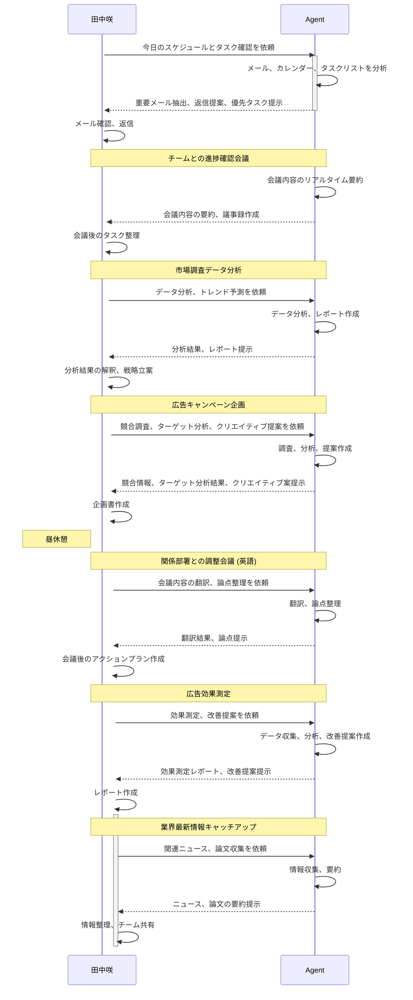

# [ペルソナモデル]田中咲 32歳

### **キャリアアップを目指す30代女性（会社員）**

- **名前:** 田中 咲 (たなか さき)
- **年齢:** 32歳
- **職業:** 大手メーカーのマーケティング部門で働く中堅社員。チームリーダーを任されている。
- **家族構成:** 独身、実家暮らし
- **年収:** 600万円
- **価値観/性格:**
    - 向上心が高く、常に新しい知識やスキルを習得したいと考えている。
    - 仕事にやりがいを感じているが、将来のキャリアに漠然とした不安を抱えている。
    - 論理的な思考が得意だが、自分の感情や直感を表現するのは苦手。
    - 流行に敏感で、SNSでの情報収集を欠かさない。
- **課題/悩み:**
    - AIの進化が速く、自分の仕事が奪われるのではないかと不安。
    - マーケティング業務が複雑化し、効率化の必要性を感じている。
    - リーダーとして、チームの生産性を向上させる方法を模索している。
    - 自分の強みや専門性を明確にし、AI時代でも活躍できる人材になりたい。
- **情報収集:**
    - 仕事関連の情報は、主にオンラインメディア、業界ニュース、専門書から収集。
    - AI関連の情報は、テック系ニュースサイト、ブログ、ウェビナーなどで収集。
    - 自己啓発系の書籍やセミナーにも関心がある。
- **ITリテラシー:**
    - 基本的なPCスキルは問題なく、ExcelやPowerPointを使いこなせる。
    - AIツールは、ChatGPTなどを試したことがあるが、本格的な活用には至っていない。
    - プログラミングの知識はない。
- **フックとなる言葉:**
    - 「AIに仕事を奪われたくない」
    - 「自分の強みをAIで最大化」
    - 「リーダーとしての武器」
    - 「キャリアの停滞を打破」

### 最終的なペルソナ提案：**田中 咲 (32歳、マーケティング職)**

- **ニーズの強さ:** AIへの危機感と、自己成長への意欲が非常に高い。
- **購買力:** 収入が安定しており、自己投資への意欲も高い。
- **講座との親和性:** マーケティングの仕事は、AIエージェントとの親和性が高い。
- **情報感度:** 積極的に情報収集をしており、講座の存在に気づきやすい。

### ペルソナ（田中 咲）の詳細設定（深掘り）

- **普段の仕事の様子:**
    - 朝はメールチェック、チームメンバーとの進捗確認からスタート。
    - 日中は、市場調査データの分析、広告キャンペーンの企画、効果測定などを行う。
    - 会議が多く、関係部署との調整に時間が取られる。
    - 夜は、業界の最新情報をキャッチアップしたり、自己啓発系の本を読んだりする。
- **休日の過ごし方:**
    - 友達とランチやカフェ巡りを楽しむ。
    - SNSで最新のトレンドをチェックする。
    - オンラインセミナーやウェビナーに参加することもある。
    - ヨガやピラティスで体を動かす。
- **具体的な悩み:**
    - 「AIに自分の仕事が奪われるのではないか」という漠然とした不安。
    - 「このままでは、AI時代に取り残されてしまう」という焦り。
    - 「もっと効率的に仕事をして、自分の時間を作りたい」という願望。
    - 「リーダーとして、チームのAI活用を推進したいが、具体的な方法がわからない」
    - 「AIのことは、なんとなくわかるけど、実際にどう使えばいいのかわからない」

この詳細なペルソナ設定に基づいて、LPの訴求ポイントや表現をさらにブラッシュアップできます。
例えば、

- 「田中咲さんのような悩みを抱えていませんか？」という問いかけ
- 田中さんの日常を想像させるようなストーリー、画像
- 田中さんが共感するような言葉遣い
- 田中さんが参加したくなるベネフィット
など、よりパーソナルな訴求が可能になります。

AIエージェントを味方にした[田中咲]の1日はこう変わる！

