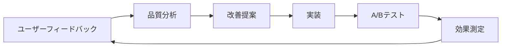
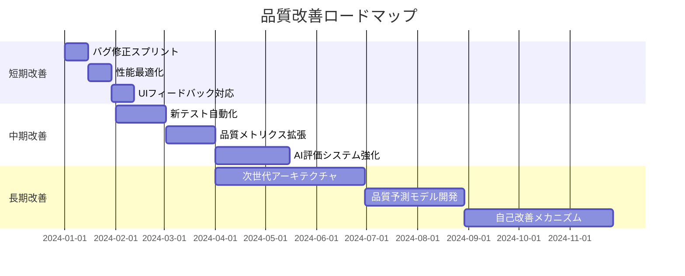

# 手塚治虫OS "ATOM" ver 4.0 品質定義書

## 1. 品質方針

本品質定義書は、手塚治虫OS "ATOM" ver 4.0が達成すべき品質基準、測定方法、保証プロセスを定義する。我々の品質方針は「手塚治虫が認める水準の創作物を、一貫して生成できるシステム」の実現である。

### 1.1 品質理念

```
「完璧ではなく、感動を。論理的でありながら、魂を揺さぶる。」

品質とは単なる不具合の少なさではない。
それは、読者の心に残る物語を紡ぐ力であり、
創作者の想像力を拡張する信頼性である。
```

### 1.2 品質目標

1. **創作品質**: 生成される物語の芸術的・論理的完成度
2. **システム品質**: 技術的信頼性とパフォーマンス
3. **ユーザー体験品質**: 使いやすさと満足度
4. **プロセス品質**: 開発・運用プロセスの成熟度

## 2. 創作物の品質基準

### 2.1 物語品質メトリクス

#### 2.1.1 論理的整合性

**定義**: 物語内の因果関係、時系列、キャラクター行動の一貫性

**測定方法**:
```python
class LogicalConsistencyMetrics:
    def __init__(self):
        self.criteria = {
            "timeline_consistency": {
                "description": "時系列の矛盾がないか",
                "weight": 0.25,
                "threshold": 0.95
            },
            "character_behavior": {
                "description": "キャラクターの行動が動機と一致するか",
                "weight": 0.30,
                "threshold": 0.90
            },
            "world_rules": {
                "description": "設定した世界観のルールが守られているか",
                "weight": 0.25,
                "threshold": 0.95
            },
            "causality_chain": {
                "description": "原因と結果の連鎖が妥当か",
                "weight": 0.20,
                "threshold": 0.90
            }
        }
    
    def calculate_score(self, story_analysis: Dict) -> float:
        total_score = 0
        for criterion, config in self.criteria.items():
            score = story_analysis.get(criterion, 0)
            weighted_score = score * config["weight"]
            total_score += weighted_score
        return total_score
```

**合格基準**: 総合スコア 0.92以上

#### 2.1.2 テーマの深度

**定義**: 設定したテーマがどれだけ深く探求されているか

**評価項目**:
1. **テーマの一貫性** (30%)
   - 全シーンでテーマが意識されているか
   - サブプロットもメインテーマに貢献しているか

2. **哲学的深度** (40%)
   - 表層的でない本質的な問いかけ
   - 複数の視点からの考察

3. **現代的関連性** (30%)
   - 現代社会への示唆
   - 普遍性と特殊性のバランス

**測定プロセス**:
```yaml
theme_evaluation_process:
  - step: automated_analysis
    tools:
      - semantic_similarity_check
      - theme_keyword_density
      - philosophical_concept_mapper
    
  - step: expert_review
    reviewers:
      - manga_critics: 2
      - philosophy_experts: 1
      - target_audience_representatives: 3
    
  - step: score_aggregation
    method: weighted_average
    minimum_score: 4.0/5.0
```

#### 2.1.3 キャラクターの魅力度

**評価マトリクス**:

| 評価軸 | 重み | 測定方法 | 合格ライン |
|--------|------|----------|-----------|
| 個性の明確さ | 25% | 特徴的な語彙・行動パターン分析 | 4.0/5.0 |
| 成長の説得力 | 30% | キャラクターアーク評価 | 4.2/5.0 |
| 感情移入度 | 25% | ユーザーテスト | 4.0/5.0 |
| 関係性の複雑さ | 20% | 関係グラフ分析 | 3.8/5.0 |

#### 2.1.4 物語構造の完成度

**起承転結評価**:

```python
class StoryStructureQuality:
    def evaluate_kishōtenketsu(self, plot: PlotStructure) -> Dict:
        return {
            "ki": {
                "criteria": "世界観とキャラクターの効果的な導入",
                "checks": [
                    "hook_effectiveness",
                    "world_building_clarity",
                    "character_introduction"
                ],
                "score": self._evaluate_ki(plot.ki)
            },
            "shō": {
                "criteria": "展開の自然さと興味の維持",
                "checks": [
                    "pacing_consistency",
                    "subplot_integration",
                    "tension_building"
                ],
                "score": self._evaluate_sho(plot.sho)
            },
            "ten": {
                "criteria": "転換の衝撃と必然性",
                "checks": [
                    "surprise_factor",
                    "logical_necessity",
                    "emotional_impact"
                ],
                "score": self._evaluate_ten(plot.ten)
            },
            "ketsu": {
                "criteria": "結末の満足度と余韻",
                "checks": [
                    "resolution_completeness",
                    "thematic_closure",
                    "lingering_questions"
                ],
                "score": self._evaluate_ketsu(plot.ketsu)
            }
        }
```

### 2.2 視覚的品質基準

#### 2.2.1 コマ割りの効果性

**評価指標**:
- **視線誘導の自然さ**: 読者の視線が自然に流れるか
- **リズムの変化**: 緩急の付け方が適切か
- **空間活用**: 余白とコマの配分バランス
- **演出効果**: 見開きや大ゴマの効果的使用

#### 2.2.2 演出指定の的確性

```yaml
visual_direction_quality:
  camera_work:
    - variety_score: "アングルの多様性"
    - appropriateness: "シーンに適したアングル選択"
    - emotional_enhancement: "感情表現の強化"
  
  expression_guidance:
    - specificity: "表情指定の具体性"
    - consistency: "キャラクターらしさの維持"
    - subtlety: "微妙な感情の表現"
```

## 3. システム品質基準

### 3.1 機能品質

#### 3.1.1 エージェント品質

**個別エージェントの品質基準**:

```python
agent_quality_criteria = {
    "producer": {
        "decision_accuracy": 0.95,  # 適切な判断の割合
        "theme_consistency": 0.98,   # テーマ維持率
        "coordination_efficiency": 0.90  # 調整の効率性
    },
    "writer": {
        "plot_coherence": 0.93,      # プロットの一貫性
        "dialogue_naturalness": 0.90, # 対話の自然さ
        "pacing_quality": 0.88        # ペーシングの質
    },
    "character": {
        "consistency_rate": 0.96,     # キャラクター一貫性
        "relationship_logic": 0.92,    # 関係性の論理性
        "growth_believability": 0.90   # 成長の信憑性
    },
    "visual": {
        "layout_effectiveness": 0.91,  # レイアウトの効果
        "camera_variety": 0.89,        # カメラワークの多様性
        "visual_storytelling": 0.92   # 視覚的物語性
    },
    "advisor": {
        "knowledge_accuracy": 0.98,    # 知識の正確性
        "relevance_score": 0.93,       # 関連性スコア
        "depth_of_insight": 0.90       # 洞察の深さ
    },
    "qa": {
        "detection_rate": 0.95,        # 問題検出率
        "false_positive_rate": 0.05,  # 誤検出率
        "suggestion_quality": 0.88     # 提案の質
    }
}
```

#### 3.1.2 統合品質

**エージェント協調メトリクス**:

| メトリクス | 説明 | 目標値 | 測定方法 |
|-----------|------|--------|----------|
| 協調成功率 | エージェント間の正常な連携 | 99.5% | 成功通信数/全通信数 |
| デッドロック発生率 | 処理の行き詰まり | <0.1% | デッドロック数/セッション数 |
| 処理効率 | 並列処理の効果 | 3.5x | 並列時間/逐次時間 |
| 状態一貫性 | 状態管理の正確性 | 99.9% | 一貫性チェック合格率 |

### 3.2 性能品質

#### 3.2.1 レスポンスタイム

```yaml
response_time_sla:
  api_endpoints:
    - endpoint: /sessions
      method: POST
      p50: 2000ms
      p95: 5000ms
      p99: 8000ms
    
    - endpoint: /sessions/{id}/interact
      method: POST
      p50: 3000ms
      p95: 6000ms
      p99: 10000ms
  
  internal_operations:
    - operation: agent_think
      p50: 1000ms
      p95: 3000ms
    
    - operation: memory_retrieval
      p50: 100ms
      p95: 500ms
    
    - operation: contradiction_check
      p50: 2000ms
      p95: 5000ms
```

#### 3.2.2 スループット

**目標処理能力**:
- 同時セッション数: 10以上
- 1時間あたりの作品生成: 50作品
- API同時接続数: 1000
- データベースクエリ/秒: 10000

#### 3.2.3 リソース効率

```python
resource_efficiency_targets = {
    "cpu_utilization": {
        "idle": "< 10%",
        "normal": "40-60%",
        "peak": "< 80%"
    },
    "memory_usage": {
        "per_session": "< 4GB",
        "system_base": "< 16GB",
        "cache_size": "< 32GB"
    },
    "network_bandwidth": {
        "average": "< 100Mbps",
        "peak": "< 1Gbps"
    },
    "storage_iops": {
        "read": "> 50000",
        "write": "> 20000"
    }
}
```

### 3.3 信頼性品質

#### 3.3.1 可用性

**サービスレベル目標（SLO）**:

```markdown
月間稼働率: 99.5%以上
- 計画停止時間: 最大4時間/月
- 計画外停止時間: 最大22分/月

コンポーネント別可用性:
- API Gateway: 99.9%
- エージェントサービス: 99.5%
- データベース: 99.9%
- キャッシュ: 99.0%
```

#### 3.3.2 障害回復性

**RTO/RPO目標**:

| 障害タイプ | RTO（復旧時間目標） | RPO（復旧時点目標） |
|-----------|-------------------|-------------------|
| 単一エージェント障害 | 30秒 | 0（データ損失なし） |
| API障害 | 5分 | 0 |
| データベース障害 | 30分 | 5分 |
| 完全システム障害 | 2時間 | 30分 |

#### 3.3.3 データ整合性

```python
data_integrity_checks = {
    "transaction_consistency": {
        "description": "トランザクションのACID特性",
        "check_method": "distributed_transaction_monitor",
        "acceptable_failure_rate": 0.001
    },
    "referential_integrity": {
        "description": "参照整合性の維持",
        "check_method": "foreign_key_validation",
        "acceptable_failure_rate": 0
    },
    "temporal_consistency": {
        "description": "時系列データの整合性",
        "check_method": "timestamp_sequence_validation",
        "acceptable_failure_rate": 0.0001
    }
}
```

### 3.4 セキュリティ品質

#### 3.4.1 機密性

**暗号化要件**:
- 保存時: AES-256-GCM
- 転送時: TLS 1.3以上
- 鍵管理: HSMまたはKMS使用

#### 3.4.2 完全性

**改ざん防止策**:
```yaml
integrity_measures:
  - measure: digital_signature
    scope: all_api_responses
    algorithm: RSA-PSS-SHA256
  
  - measure: checksum_validation
    scope: stored_content
    algorithm: SHA-256
  
  - measure: audit_trail
    scope: all_modifications
    retention: 1_year
```

#### 3.4.3 認証・認可

**セキュリティ基準**:
- 多要素認証の実装
- OAuth 2.0 / OpenID Connect準拠
- 最小権限の原則
- セッションタイムアウト: 30分

## 4. テスト戦略

### 4.1 テストレベルと範囲

#### 4.1.1 ユニットテスト

**カバレッジ目標**:
```python
unit_test_coverage = {
    "statement_coverage": 85,    # 文カバレッジ
    "branch_coverage": 80,       # 分岐カバレッジ
    "function_coverage": 95,     # 関数カバレッジ
    "class_coverage": 100,       # クラスカバレッジ
}

critical_components = {
    "agents": {"min_coverage": 90},
    "memory_systems": {"min_coverage": 95},
    "api_handlers": {"min_coverage": 85},
    "utility_functions": {"min_coverage": 80}
}
```

#### 4.1.2 統合テスト

**テストシナリオ**:

```yaml
integration_test_scenarios:
  - scenario: agent_coordination
    description: "6エージェントの完全協調動作"
    test_cases:
      - normal_flow: "通常の創作フロー"
      - conflict_resolution: "意見対立の解決"
      - error_propagation: "エラーの伝播と回復"
    success_criteria: "全ケースで正常完了"
  
  - scenario: memory_integration
    description: "メモリシステムの統合動作"
    test_cases:
      - store_and_retrieve: "保存と検索"
      - cross_memory_reference: "メモリ間参照"
      - memory_consolidation: "記憶の統合"
    success_criteria: "データ整合性100%"
```

#### 4.1.3 システムテスト

**E2Eテストカテゴリ**:

1. **機能シナリオテスト**
   - 短編作品の完全生成
   - 長編作品の章単位生成
   - インタラクティブな修正

2. **非機能テスト**
   - 負荷テスト（100同時ユーザー）
   - ストレステスト（限界性能）
   - 耐久テスト（72時間連続）

3. **異常系テスト**
   - 部分障害時の動作
   - データ不整合の処理
   - 悪意のある入力への対処

### 4.2 創作物評価テスト

#### 4.2.1 自動評価システム

```python
class CreativeOutputEvaluator:
    def __init__(self):
        self.evaluators = {
            "coherence": CoherenceEvaluator(),
            "originality": OriginalityEvaluator(),
            "emotional_impact": EmotionalImpactEvaluator(),
            "theme_depth": ThemeDepthEvaluator()
        }
    
    def evaluate_story(self, story: Story) -> EvaluationReport:
        results = {}
        for name, evaluator in self.evaluators.items():
            score = evaluator.evaluate(story)
            results[name] = {
                "score": score,
                "details": evaluator.get_detailed_analysis(),
                "suggestions": evaluator.get_improvements()
            }
        
        overall_score = self._calculate_overall_score(results)
        return EvaluationReport(
            scores=results,
            overall=overall_score,
            recommendation=self._get_recommendation(overall_score)
        )
```

#### 4.2.2 人間による評価

**評価パネル構成**:
- プロマンガ家: 3名
- 編集者: 2名
- 一般読者: 10名
- マンガ研究者: 1名

**評価プロトコル**:
```yaml
human_evaluation_protocol:
  preparation:
    - blind_test: true
    - reference_works: 3  # 比較用の既存作品
    - evaluation_time: 2_hours
  
  evaluation_items:
    - story_quality:
        weight: 40%
        criteria:
          - plot_engagement
          - character_appeal
          - theme_resonance
    
    - technical_quality:
        weight: 30%
        criteria:
          - logical_consistency
          - pacing
          - structure
    
    - creative_merit:
        weight: 30%
        criteria:
          - originality
          - artistic_vision
          - memorable_moments
```

### 4.3 継続的品質改善

#### 4.3.1 品質メトリクスダッシュボード

```python
quality_dashboard_metrics = {
    "real_time": {
        "api_response_time": "現在の応答時間",
        "active_sessions": "アクティブセッション数",
        "error_rate": "エラー率",
        "agent_health": "エージェント健全性"
    },
    "daily": {
        "story_quality_average": "生成物語の平均品質",
        "user_satisfaction": "ユーザー満足度",
        "system_availability": "システム可用性",
        "performance_trend": "性能トレンド"
    },
    "weekly": {
        "quality_improvement": "品質改善率",
        "defect_density": "欠陥密度",
        "test_coverage": "テストカバレッジ",
        "technical_debt": "技術的負債"
    }
}
```

#### 4.3.2 フィードバックループ



## 5. 品質保証プロセス

### 5.1 開発段階の品質保証

#### 5.1.1 コードレビュー基準

**レビューチェックリスト**:
```markdown
## 機能面
- [ ] 要件を満たしているか
- [ ] エッジケースが考慮されているか
- [ ] エラーハンドリングが適切か

## 品質面
- [ ] コーディング規約に準拠しているか
- [ ] テストが十分か（カバレッジ80%以上）
- [ ] ドキュメントが更新されているか

## 性能面
- [ ] パフォーマンスへの影響を考慮したか
- [ ] リソース使用は効率的か
- [ ] スケーラビリティは確保されているか

## セキュリティ面
- [ ] 入力検証は適切か
- [ ] 機密情報の扱いは適切か
- [ ] 既知の脆弱性はないか
```

#### 5.1.2 自動品質チェック

```yaml
ci_quality_gates:
  pre_commit:
    - linting:
        tools: [black, isort, pylint]
        threshold: no_errors
    - type_checking:
        tool: mypy
        threshold: no_errors
    - security_scan:
        tool: bandit
        threshold: no_high_severity
  
  pre_merge:
    - unit_tests:
        coverage: ">= 80%"
        pass_rate: "100%"
    - integration_tests:
        pass_rate: ">= 95%"
    - performance_tests:
        regression_threshold: "5%"
  
  post_merge:
    - e2e_tests:
        pass_rate: ">= 98%"
    - security_audit:
        vulnerabilities: 0
    - quality_metrics:
        all_thresholds: pass
```

### 5.2 リリース品質基準

#### 5.2.1 リリース判定基準

**Go/No-Go チェックリスト**:

| カテゴリ | 項目 | 基準 | 結果 |
|---------|------|------|------|
| 機能 | 全機能実装完了 | 100% | [ ] |
| 品質 | 重大バグゼロ | 0 | [ ] |
| 性能 | SLA達成 | 全項目 | [ ] |
| セキュリティ | 脆弱性対応完了 | 100% | [ ] |
| ドキュメント | 完備 | 100% | [ ] |
| 訓練 | 運用チーム準備完了 | 合格 | [ ] |

#### 5.2.2 段階的リリース戦略

```python
release_stages = {
    "canary": {
        "user_percentage": 1,
        "duration": "24h",
        "rollback_threshold": {
            "error_rate": 0.05,
            "response_time_increase": 0.2
        }
    },
    "staged": {
        "stages": [5, 20, 50, 100],  # パーセンテージ
        "duration_per_stage": "12h",
        "validation_metrics": [
            "story_quality_score",
            "system_stability",
            "user_satisfaction"
        ]
    }
}
```

## 6. 運用段階の品質管理

### 6.1 監視とアラート

#### 6.1.1 監視項目

```yaml
monitoring_configuration:
  application_metrics:
    - metric: api_latency
      threshold: "> 5s"
      severity: warning
      action: auto_scale
    
    - metric: error_rate
      threshold: "> 1%"
      severity: critical
      action: page_oncall
    
    - metric: story_quality_score
      threshold: "< 4.0"
      severity: warning
      action: notify_qa_team
  
  infrastructure_metrics:
    - metric: cpu_usage
      threshold: "> 80%"
      severity: warning
      action: scale_out
    
    - metric: memory_usage
      threshold: "> 90%"
      severity: critical
      action: restart_service
    
    - metric: disk_usage
      threshold: "> 85%"
      severity: warning
      action: cleanup_old_data
```

#### 6.1.2 インシデント対応

**エスカレーションマトリクス**:

| 深刻度 | 定義 | 初期対応時間 | 解決時間 | エスカレーション |
|--------|------|-------------|---------|----------------|
| P1 | サービス停止 | 15分 | 2時間 | 即時CTO通知 |
| P2 | 重大な機能障害 | 30分 | 4時間 | 1時間後マネージャー |
| P3 | 部分的な障害 | 2時間 | 24時間 | 4時間後チームリード |
| P4 | 軽微な問題 | 24時間 | 72時間 | 必要に応じて |

### 6.2 継続的改善

#### 6.2.1 品質分析サイクル

```python
class QualityAnalysisCycle:
    def __init__(self):
        self.cycle_duration = "weekly"
        self.analysis_components = [
            "defect_analysis",
            "performance_trends",
            "user_feedback_analysis",
            "cost_benefit_analysis"
        ]
    
    def run_analysis(self) -> QualityReport:
        defects = self.analyze_defects()
        performance = self.analyze_performance()
        feedback = self.analyze_feedback()
        cost_benefit = self.analyze_cost_benefit()
        
        recommendations = self.generate_recommendations(
            defects, performance, feedback, cost_benefit
        )
        
        return QualityReport(
            period=self.get_current_period(),
            findings={
                "defects": defects,
                "performance": performance,
                "feedback": feedback,
                "cost_benefit": cost_benefit
            },
            recommendations=recommendations,
            action_items=self.prioritize_actions(recommendations)
        )
```

#### 6.2.2 品質改善ロードマップ



## 7. 品質文化の醸成

### 7.1 品質意識の向上

**品質向上施策**:
1. **品質勉強会**（月1回）
   - ベストプラクティスの共有
   - 失敗事例からの学習
   - 新技術の品質への応用

2. **品質コンテスト**（四半期）
   - 最高品質コード賞
   - 最も改善されたコンポーネント賞
   - 革新的テスト手法賞

3. **品質メンタリング**
   - シニアエンジニアによる指導
   - ペアプログラミング
   - コードレビュー訓練

### 7.2 ステークホルダーとの連携

```yaml
stakeholder_quality_engagement:
  users:
    - regular_surveys: monthly
    - beta_testing_program: continuous
    - user_advisory_board: quarterly
  
  development_team:
    - quality_retrospectives: bi-weekly
    - skill_development: ongoing
    - recognition_program: quarterly
  
  management:
    - quality_dashboards: real-time
    - executive_briefings: monthly
    - roi_analysis: quarterly
  
  partners:
    - api_quality_sla: defined
    - joint_quality_reviews: monthly
    - improvement_collaboration: ongoing
```

## 8. 品質保証の成果測定

### 8.1 KPI定義

**主要品質指標（KQI）**:

| KQI | 計算式 | 目標値 | 測定頻度 |
|-----|--------|--------|----------|
| 総合品質スコア | Σ(各品質項目×重み) | ≥4.5/5.0 | 日次 |
| 欠陥密度 | 欠陥数/KLOC | <0.5 | スプリント毎 |
| 顧客満足度 | NPS+満足度調査 | ≥60 | 月次 |
| MTBF | 総稼働時間/障害数 | >720h | 月次 |
| MTTR | Σ復旧時間/障害数 | <30min | 月次 |

### 8.2 品質ROI

```python
def calculate_quality_roi():
    # 品質投資
    quality_investment = {
        "testing_tools": 500000,
        "qa_personnel": 2000000,
        "training": 300000,
        "quality_infrastructure": 800000
    }
    
    # 品質による節約
    quality_savings = {
        "defect_prevention": 3000000,  # 本番障害の予防
        "customer_retention": 2000000,  # 顧客維持
        "efficiency_gain": 1500000,     # 生産性向上
        "brand_value": 2000000          # ブランド価値
    }
    
    roi = (sum(quality_savings.values()) - sum(quality_investment.values())) / sum(quality_investment.values()) * 100
    
    return {
        "roi_percentage": roi,
        "payback_period": sum(quality_investment.values()) / (sum(quality_savings.values()) / 12),
        "quality_value": sum(quality_savings.values())
    }
```

## 9. まとめ

本品質定義書は、手塚治虫OS "ATOM" ver 4.0が達成すべき品質の全体像を定義した。創作物の芸術的品質とシステムの技術的品質の両立を目指し、継続的な改善を通じて、真に価値ある創作支援システムの実現を目指す。

品質は到達点ではなく、永続的な旅路である。我々は、手塚治虫が追求した「完璧な物語」への挑戦を、最新のAI技術で継承し、新たな地平を切り開いていく。

---

**注記**: 本品質定義書は生きた文書であり、プロジェクトの進展とともに継続的に更新される。品質基準は技術の進化と市場の要求に応じて適切に調整されるものとする。