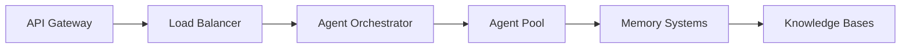

# 手塚治虫OS "ATOM" ver 4.0 工程定義書

## 1. プロジェクト概要

本工程定義書は、手塚治虫OS "ATOM" ver 4.0の開発プロジェクトにおける詳細な工程、マイルストーン、リスク管理、および品質保証プロセスを定義する。全体工期は18週間（約4.5ヶ月）を想定し、アジャイル開発手法を採用して段階的に機能を実装・検証していく。

## 2. 開発方法論

### 2.1 アジャイル開発アプローチ

**スクラム＋カンバンのハイブリッド方式**を採用：
- **2週間スプリント**：定期的なデリバリーとフィードバック
- **カンバンボード**：タスクの可視化と進捗管理
- **デイリースタンドアップ**：課題の早期発見と解決
- **スプリントレビュー**：ステークホルダーへのデモと改善

### 2.2 開発チーム構成

```
プロダクトオーナー（1名）
├── スクラムマスター（1名）
├── 開発チーム
│   ├── AIアーキテクト（2名）
│   ├── バックエンドエンジニア（3名）
│   ├── フロントエンドエンジニア（2名）
│   └── MLエンジニア（2名）
├── QAチーム（2名）
└── DevOpsエンジニア（1名）
```

## 3. 開発フェーズ詳細

### フェーズ1：基盤構築（Week 1-4）

#### Week 1-2：環境セットアップとアーキテクチャ設計

**タスク詳細**：

1. **開発環境構築**（3日）
   - Dockerコンテナ環境の設定
   - CI/CDパイプラインの構築
   - 開発用クラウドリソースのプロビジョニング
   
2. **Gemini 2.5 API統合**（4日）
   - Google AI Studio APIアカウント設定
   - API認証フローの実装
   - レート制限とエラーハンドリング
   - 基本的な疎通テスト

3. **LangGraph環境構築**（3日）
   - LangGraphフレームワークのセットアップ
   - 基本的なワークフロー定義
   - 状態管理システムの初期実装

**成果物**：
- 開発環境ドキュメント
- APIインテグレーションガイド
- 基本アーキテクチャ図

**品質基準**：
- 全開発者の環境で正常動作
- Gemini 2.5 APIの基本呼び出し成功率100%
- 自動テスト環境の稼働

#### Week 3-4：基本的なエージェント間通信の実装

**タスク詳細**：

1. **メッセージングシステム構築**（4日）
   - エージェント間通信プロトコルの定義
   - 非同期メッセージキューの実装
   - エラーリトライメカニズム

2. **状態管理システム**（3日）
   - MangaCreationStateの実装
   - 状態の永続化とリカバリ
   - 並行処理の制御

3. **基本的なオーケストレーション**（3日）
   - シンプルなワークフローの実装
   - エージェント登録システム
   - 基本的なルーティング

**成果物**：
- エージェント通信仕様書
- 状態管理設計書
- 動作するプロトタイプ（2エージェント）

**品質基準**：
- メッセージ配信成功率99%以上
- 状態復旧テスト合格
- 10並行セッションの安定動作

### フェーズ2：専門エージェント開発（Week 5-10）

#### Week 5-6：プロデューサーとライターエージェント

**プロデューサーエージェント実装**（5日）：

```python
# 実装タスクの例
class ProducerAgentTasks:
    tasks = [
        "システム指示の実装と調整",
        "テーマ管理機能の開発",
        "他エージェントへの指示システム",
        "品質チェックポイントの設定",
        "手塚イズム検証ロジック"
    ]
```

**ライターエージェント実装**（5日）：
- プロット生成アルゴリズム
- 三幕構成ジェネレーター
- 対話生成システム
- 伏線管理データベース

**統合テスト**（4日）：
- エージェント間の協調動作確認
- エンドツーエンドシナリオテスト
- パフォーマンステスト

**成果物**：
- 各エージェントの実装コード
- ユニットテストスイート
- 統合テストレポート

#### Week 7-8：デザイナーとディレクターエージェント

**キャラクターデザイナーエージェント**（5日）：

1. **スターシステムDB構築**
   - キャラクターマスターデータ
   - 出演履歴管理
   - キャラクター検索エンジン

2. **キャラクター生成ロジック**
   - パラメトリックキャラクター設計
   - 関係性グラフ生成
   - 成長曲線アルゴリズム

**ビジュアルディレクターエージェント**（5日）：
- コマ割り最適化アルゴリズム
- カメラワーク決定システム
- 視線誘導分析
- メタファー生成器

**品質検証**（4日）：
- キャラクター一貫性テスト
- ビジュアル効果の評価
- ユーザビリティテスト

#### Week 9-10：アドバイザーとQAエージェント

**哲学・科学アドバイザーエージェント**（5日）：

```yaml
実装項目:
  - 知識ベース構築:
      - 医学用語データベース
      - 歴史年表システム
      - 科学法則検証器
  - 推論エンジン:
      - 論理的整合性チェッカー
      - 倫理的問題分析器
      - 未来予測モジュール
```

**品質管理エージェント**（5日）：
- 矛盾検出アルゴリズム
- 品質メトリクス計算
- 自動修正提案システム
- レポート生成機能

**全エージェント統合**（4日）：
- 6エージェントの協調動作
- 負荷分散の最適化
- エラー伝播の防止

### フェーズ3：RAGシステム実装（Week 11-14）

#### Week 11-12：ベクトルDBとナレッジグラフ構築

**ベクトルデータベース実装**（5日）：

1. **Qdrantセットアップ**
   ```bash
   # インフラ構築スクリプト
   docker-compose up -d qdrant
   python scripts/init_vector_collections.py
   ```

2. **埋め込み生成パイプライン**
   - Gemini 2.5埋め込みAPI統合
   - バッチ処理システム
   - インデックス最適化

**ナレッジグラフ構築**（5日）：
- Neo4jクラスター構築
- グラフスキーマ設計
- 初期データ投入
- クエリ最適化

**データ品質保証**（4日）：
- データ整合性チェック
- 重複排除処理
- バックアップ・リストア検証

#### Week 13-14：検索と記憶システムの統合

**高度な検索機能**（5日）：
- ハイブリッド検索（ベクトル＋グラフ）
- コンテキスト考慮型ランキング
- 検索結果の説明生成

**メモリシステム統合**（5日）：
- エピソード記憶の実装
- 意味記憶の構造化
- 手続き記憶のパターン化
- メモリ統合パイプライン

**性能最適化**（4日）：
- キャッシング戦略
- 並列処理の実装
- メモリ使用量の最適化

### フェーズ4：統合とテスト（Week 15-18）

#### Week 15-16：システム統合と性能調整

**完全統合作業**（6日）：



**性能チューニング**（4日）：
- ボトルネック分析
- 並行処理の最適化
- リソース使用量の調整
- レスポンスタイムの改善

**セキュリティ強化**（4日）：
- 認証・認可システム
- データ暗号化
- 脆弱性スキャン
- ペネトレーションテスト

#### Week 17-18：品質保証とユーザーテスト

**システムテスト**（5日）：

1. **機能テスト**
   - 全機能の網羅的テスト
   - エッジケースの検証
   - 回帰テストの自動化

2. **非機能テスト**
   - 負荷テスト（1000同時接続）
   - 耐久性テスト（72時間連続稼働）
   - 災害復旧テスト

**ユーザー受け入れテスト**（5日）：
- プロマンガ家による評価
- 編集者フィードバック
- 一般ユーザーベータテスト
- フィードバックの収集と分析

**最終調整とドキュメント**（4日）：
- 発見された問題の修正
- ユーザーマニュアル作成
- 運用手順書の整備
- トレーニング資料の準備

## 4. マイルストーンと成果物

### 主要マイルストーン

| マイルストーン | 期日 | 成果物 | 成功基準 |
|------------|------|--------|---------|
| M1: 基盤完成 | Week 4 | 動作する基本システム | API疎通、2エージェント協調 |
| M2: 全エージェント稼働 | Week 10 | 6エージェントシステム | 全エージェント単体テスト合格 |
| M3: 知識システム統合 | Week 14 | RAG対応システム | 検索精度90%以上 |
| M4: 本番リリース準備完了 | Week 18 | 完成システム | 全受け入れ基準クリア |

### 段階的リリース計画

```yaml
アルファ版 (Week 10):
  機能: 基本的な創作機能
  対象: 内部テスター
  目的: 基本機能の検証

ベータ版 (Week 14):
  機能: RAG統合済み
  対象: 限定ユーザー100名
  目的: 実使用でのフィードバック

RC版 (Week 17):
  機能: 全機能実装完了
  対象: オープンベータ
  目的: 最終検証

GA版 (Week 18+):
  機能: 完全版
  対象: 一般公開
  目的: 正式サービス開始
```

## 5. リスク管理

### 5.1 技術的リスク

#### リスク1：Gemini 2.5 APIの制限

**リスク内容**：
- レート制限による処理遅延
- APIの仕様変更
- サービス停止

**軽減策**：
```python
class APIRiskMitigation:
    strategies = {
        "rate_limiting": "指数バックオフとキューイング",
        "api_changes": "バージョニングとアダプターパターン",
        "service_outage": "ローカルフォールバックモデル"
    }
```

**対応計画**：
- Week 2: レート制限テストと最適化
- Week 8: APIモックサーバーの構築
- Week 12: フォールバック機能の実装

#### リスク2：エージェント間の協調失敗

**リスク内容**：
- デッドロックの発生
- 循環参照による無限ループ
- 不整合な状態の発生

**軽減策**：
- タイムアウト機構の実装
- 依存関係の明確化
- 状態管理の中央集権化

**監視指標**：
```yaml
monitoring:
  - metric: agent_communication_timeout
    threshold: 5%
    action: alert_and_restart
  - metric: circular_dependency_detected
    threshold: 1
    action: immediate_investigation
```

#### リスク3：スケーラビリティの問題

**リスク内容**：
- 同時接続数の限界
- メモリ使用量の爆発
- データベースのボトルネック

**対応策**：
1. **Week 6**: 負荷テストの早期実施
2. **Week 10**: 水平スケーリングの実装
3. **Week 14**: キャッシング戦略の最適化

### 5.2 プロジェクトリスク

#### リスク4：要求の変更・追加

**リスク内容**：
- ステークホルダーからの新要求
- 市場環境の変化
- 競合サービスの出現

**管理方法**：
```markdown
変更管理プロセス：
1. 変更要求の受付（毎週金曜）
2. インパクト分析（2営業日以内）
3. 優先順位付け（プロダクトオーナー）
4. スプリント計画への反映
```

#### リスク5：チームリソースの不足

**リスク内容**：
- キーメンバーの離脱
- スキル不足
- 作業負荷の偏り

**対策**：
- クロストレーニングの実施
- 外部専門家の確保
- 作業負荷の可視化と調整

### 5.3 リスクレジスター

| ID | リスク名 | 発生確率 | 影響度 | リスクスコア | 対応戦略 | 責任者 |
|----|---------|---------|--------|------------|---------|--------|
| R1 | API制限 | 高 | 高 | 9 | 軽減 | AIアーキテクト |
| R2 | 協調失敗 | 中 | 高 | 6 | 回避 | スクラムマスター |
| R3 | スケーラビリティ | 中 | 中 | 4 | 軽減 | DevOps |
| R4 | 要求変更 | 高 | 中 | 6 | 受容 | PO |
| R5 | リソース不足 | 低 | 高 | 3 | 転嫁 | PM |

## 6. 品質保証プロセス

### 6.1 継続的品質管理

#### コード品質

```yaml
code_quality_gates:
  - stage: commit
    checks:
      - linting (pylint, black)
      - type_checking (mypy)
      - security_scan (bandit)
    threshold: 100%
    
  - stage: pull_request
    checks:
      - unit_tests (pytest)
      - coverage (>80%)
      - code_review (2 approvals)
    threshold: 100%
    
  - stage: integration
    checks:
      - integration_tests
      - performance_regression
      - api_contract_tests
    threshold: 95%
```

#### AIモデル品質

**評価メトリクス**：
```python
quality_metrics = {
    "coherence_score": {
        "target": 0.95,
        "measurement": "human_evaluation",
        "frequency": "weekly"
    },
    "creativity_index": {
        "target": 0.8,
        "measurement": "novelty_detection",
        "frequency": "per_sprint"
    },
    "consistency_rate": {
        "target": 0.98,
        "measurement": "automated_checking",
        "frequency": "per_commit"
    }
}
```

### 6.2 テスト戦略

#### テストピラミッド

```
         /\
        /  \  E2Eテスト (10%)
       /----\
      /      \ 統合テスト (30%)
     /--------\
    /          \ ユニットテスト (60%)
   /____________\
```

#### テスト自動化計画

**Week 1-4**: テストフレームワーク構築
- pytest環境のセットアップ
- モックサーバーの構築
- CI/CDパイプライン統合

**Week 5-10**: エージェント別テスト
- 各エージェントのユニットテスト
- エージェント間統合テスト
- 性能ベンチマーク

**Week 11-14**: システムテスト
- エンドツーエンドシナリオ
- 負荷テスト
- セキュリティテスト

**Week 15-18**: 受け入れテスト
- ユーザビリティテスト
- A/Bテスト
- 本番相当環境でのテスト

## 7. コミュニケーション計画

### 7.1 定例会議体

| 会議名 | 頻度 | ��加者 | 目的 |
|--------|------|---------|------|
| デイリースクラム | 毎日 | 開発チーム | 進捗共有・課題解決 |
| スプリント計画 | 2週毎 | 全員 | 次スプリントの計画 |
| スプリントレビュー | 2週毎 | 全員+ステークホルダー | 成果物のデモ |
| レトロスペクティブ | 2週毎 | 開発チーム | プロセス改善 |
| ステアリング会議 | 月次 | PO+経営層 | 戦略的意思決定 |

### 7.2 コミュニケーションツール

```yaml
communication_tools:
  daily_work:
    - tool: Slack
      purpose: 日常的なコミュニケーション
      channels:
        - "#atom-general": 全体連絡
        - "#atom-dev": 開発議論
        - "#atom-alerts": システムアラート
        
  documentation:
    - tool: Confluence
      purpose: ドキュメント管理
      spaces:
        - "ATOM-TECH": 技術文書
        - "ATOM-BIZ": ビジネス文書
        
  task_management:
    - tool: Jira
      purpose: タスク・課題管理
      projects:
        - "ATOM": メインプロジェクト
        
  code_repository:
    - tool: GitHub
      purpose: ソースコード管理
      repos:
        - "atom-core": コアシステム
        - "atom-agents": エージェント実装
```

## 8. トレーニングと知識移転

### 8.1 開発者トレーニング

**Week 1**: 基礎トレーニング
- Gemini 2.5 APIの基礎
- LangGraphフレームワーク
- プロジェクトアーキテクチャ

**Week 5**: 専門トレーニング
- エージェント開発手法
- RAGシステムの原理
- マンガ創作理論

**Week 15**: 運用トレーニング
- システム監視
- トラブルシューティング
- パフォーマンスチューニング

### 8.2 ドキュメント整備

```markdown
ドキュメント体系：
├── 開発者向け
│   ├── アーキテクチャガイド
│   ├── API仕様書
│   ├── コーディング規約
│   └── トラブルシューティングガイド
├── 運用者向け
│   ├── 運用マニュアル
│   ├── 監視設定ガイド
│   └── 障害対応手順書
└── ユーザー向け
    ├── クイックスタートガイド
    ├── 機能説明書
    └── FAQ
```

## 9. 成功要因と教訓

### 9.1 成功要因

1. **明確なビジョン**: 手塚治虫の創作哲学の具現化
2. **段階的アプローチ**: 小さく始めて段階的に拡張
3. **品質重視**: 自動テストと継続的な品質改善
4. **柔軟性**: 変化への適応力

### 9.2 想定される課題と対策

**課題1**: エージェント間の複雑な相互作用
- **対策**: 明確なインターフェース定義とモック開発

**課題2**: 大規模データの処理
- **対策**: 段階的なデータ投入と性能監視

**課題3**: ユーザー期待値の管理
- **対策**: 早期のプロトタイプ公開とフィードバック収集

## 10. プロジェクト完了基準

### 10.1 技術的完了基準

- [ ] 全機能要件の実装完了
- [ ] 全非機能要件の達成
- [ ] テストカバレッジ80%以上
- [ ] 本番環境での72時間連続稼働
- [ ] セキュリティ監査合格

### 10.2 ビジネス完了基準

- [ ] ユーザー受け入れテスト合格率95%以上
- [ ] ベータユーザー満足度4.0/5.0以上
- [ ] 運用ドキュメント完備
- [ ] サポート体制確立
- [ ] 初期ユーザー100名獲得

### 10.3 プロジェクトクロージング

**活動内容**：
1. 最終成果物の納品
2. プロジェクト振り返り会
3. 教訓の文書化
4. チーム解散と次フェーズへの移行
5. 祝賀会の開催

---

**注記**: 本工程定義書は、2025年7月2日時点でのGemini 2.5技術を前提とした開発計画である。実際の開発では、技術進化や市場環境の変化に応じて柔軟に調整を行うものとする。