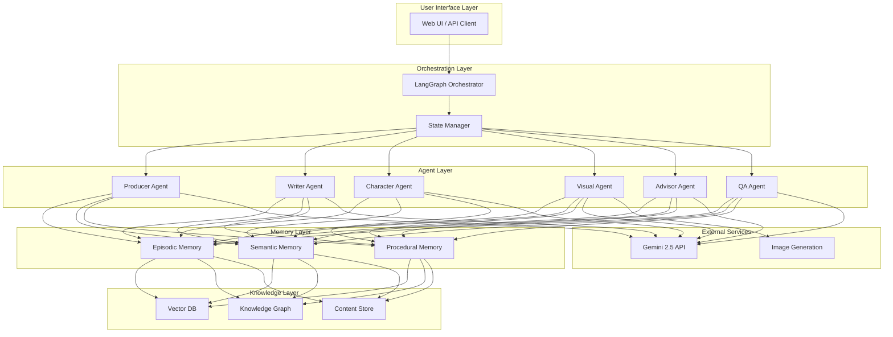

# 手塚治虫OS "ATOM" ver 4.0 技術定義書

## 1. 技術概要

本技術定義書は、手塚治虫OS "ATOM" ver 4.0の技術アーキテクチャ、実装仕様、および統合方法を詳細に定義する。システムはGemini 2.5 APIとLangGraphフレームワークを中核とし、ReActパターンに基づくマルチエージェントオーケストレーションを実現する。

**重要制約**:
- Gemini 2.5環境での構築が必須
- Google AI Studio APIを利用（2025年7月2日GA版）
- 使用可能モデルは"gemini-2.5-pro"（高品質出力）と"gemini-2.5-flash"（標準出力）のみ

## 2. システムアーキテクチャ

### 2.1 全体構成



### 2.2 コア技術スタック

- **言語**: Python 3.11+
- **フレームワーク**: LangGraph 0.2+
- **LLM**: Gemini 2.5 (gemini-2.5-pro / gemini-2.5-flash)
- **ベクトルDB**: Qdrant 1.8+ / FAISS
- **グラフDB**: Neo4j 5.0+
- **キャッシュ**: Redis 7.0+
- **API**: FastAPI 0.110+
- **非同期処理**: asyncio, aiohttp

## 3. Gemini 2.5 API統合

### 3.1 API設定と初期化

```python
import google.generativeai as genai
from typing import Literal, Optional
from dataclasses import dataclass
from datetime import datetime

@dataclass
class GeminiConfig:
    """Gemini 2.5 API設定"""
    api_key: str
    model_type: Literal["gemini-2.5-pro", "gemini-2.5-flash"]
    temperature: float = 0.7
    top_p: float = 0.95
    top_k: int = 40
    max_output_tokens: int = 65536

class GeminiManager:
    """Gemini 2.5 APIマネージャー"""

    def __init__(self, config: GeminiConfig):
        genai.configure(api_key=config.api_key)
        self.config = config
        self.model = genai.GenerativeModel(
            model_name=config.model_type,
            generation_config={
                "temperature": config.temperature,
                "top_p": config.top_p,
                "top_k": config.top_k,
                "max_output_tokens": config.max_output_tokens,
            }
        )
        self._request_count = 0
        self._last_request_time = datetime.now()

    async def generate_content(
        self,
        prompt: str,
        system_instruction: Optional[str] = None,
        tools: Optional[list] = None
    ) -> str:
        """コンテンツ生成（レート制限対応）"""
        await self._rate_limit_check()

        chat = self.model.start_chat(history=[])

        if system_instruction:
            # Gemini 2.5の新機能：システム指示の設定
            chat.send_message(
                f"System: {system_instruction}",
                generation_config={"candidate_count": 1}
            )

        response = await chat.send_message_async(
            prompt,
            tools=tools if tools else []
        )

        self._request_count += 1
        return response.text

    async def _rate_limit_check(self):
        """APIレート制限のチェックと待機"""
        # Gemini 2.5のレート制限に対応
        # GA版の制限値に基づく実装
        pass

# 使用例
config = GeminiConfig(
    api_key="GA-VERSION-API-KEY-2025-07-02",
    model_type="gemini-2.5-pro"  # 高品質出力
)
gemini = GeminiManager(config)
```

### 3.2 品質モード切り替え

```python
class QualityModeSelector:
    """出力品質に応じたモデル選択"""

    def __init__(self, api_key: str):
        self.api_key = api_key
        self.models = {
            "high": GeminiManager(GeminiConfig(
                api_key=api_key,
                model_type="gemini-2.5-pro",
                temperature=0.6,  # より正確な出力
                max_output_tokens=65536  # より長い出力
            )),
            "standard": GeminiManager(GeminiConfig(
                api_key=api_key,
                model_type="gemini-2.5-flash",
                temperature=0.8,  # より創造的
                max_output_tokens=65536
            ))
        }

    def get_model(self, quality: Literal["high", "standard"]) -> GeminiManager:
        return self.models[quality]
```

## 4. LangGraphマルチエージェント実装

### 4.1 エージェント状態定義

```python
from typing import TypedDict, Annotated, List, Dict, Any, Optional
from langgraph.graph import StateGraph, END
from langgraph.prebuilt import ToolExecutor, ToolInvocation
from langgraph.checkpoint import MemorySaver

class MangaCreationState(TypedDict):
    """マンガ創作プロセスの状態管理"""
    # 基本情報
    session_id: str
    timestamp: datetime
    quality_mode: Literal["high", "standard"]

    # エージェント間通信
    messages: Annotated[List[BaseMessage], add_messages]
    current_agent: str
    agent_history: List[str]

    # 創作要素
    theme: str
    sub_themes: List[str]
    genre: str
    target_audience: str

    # 作品構造
    plot_structure: Dict[str, Any]
    characters: Dict[str, Character]
    relationships: List[Relationship]
    scenes: List[Scene]

    # 視覚要素
    visual_elements: List[VisualElement]
    panel_layouts: List[PanelLayout]

    # 品質管理
    contradictions: List[Contradiction]
    quality_metrics: QualityMetrics

    # メモリ参照
    memory_context: Dict[str, Any]
    retrieved_knowledge: List[KnowledgeItem]
```

### 4.2 ReActエージェントの基本実装

```python
from abc import ABC, abstractmethod

class BaseReActAgent(ABC):
    """ReActパターンに基づく基本エージェント"""

    def __init__(
        self,
        name: str,
        gemini_manager: GeminiManager,
        tools: List[Tool]
    ):
        self.name = name
        self.gemini = gemini_manager
        self.tools = tools
        self.tool_executor = ToolExecutor(tools)

    async def think(self, state: MangaCreationState) -> str:
        """思考フェーズ：現状分析と次のアクション決定"""
        prompt = self._build_think_prompt(state)
        thought = await self.gemini.generate_content(
            prompt,
            system_instruction=self.get_system_instruction()
        )
        return thought

    async def act(self, state: MangaCreationState, thought: str) -> Any:
        """行動フェーズ：具体的なアクション実行"""
        action = self._parse_action(thought)
        if action.tool_name in [t.name for t in self.tools]:
            result = await self.tool_executor.execute(action)
            return result
        else:
            return await self._default_action(state, thought)

    async def observe(self, state: MangaCreationState, action_result: Any) -> str:
        """観察フェーズ：アクション結果の評価"""
        observation = await self._evaluate_result(state, action_result)
        return observation

    async def run(self, state: MangaCreationState) -> Dict[str, Any]:
        """ReActサイクルの実行"""
        max_iterations = 5

        for i in range(max_iterations):
            # Think
            thought = await self.think(state)
            state['messages'].append(AIMessage(content=f"思考: {thought}"))

            # Act
            action_result = await self.act(state, thought)
            state['messages'].append(AIMessage(content=f"行動: {action_result}"))

            # Observe
            observation = await self.observe(state, action_result)
            state['messages'].append(AIMessage(content=f"観察: {observation}"))

            # 完了判定
            if self._is_complete(observation):
                break

        return self._finalize_output(state)

    @abstractmethod
    def get_system_instruction(self) -> str:
        """エージェント固有のシステム指示"""
        pass

    @abstractmethod
    def _build_think_prompt(self, state: MangaCreationState) -> str:
        """思考プロンプトの構築"""
        pass
```

### 4.3 専門エージェントの実装

#### 4.3.1 統括プロデューサーエージェント

```python
class ProducerAgent(BaseReActAgent):
    """手塚治虫の思考回路を模倣する統括エージェント"""

    def get_system_instruction(self) -> str:
        return """
        あなたは手塚治虫の創作哲学を体現する統括プロデューサーです。
        「生命の尊厳」を根幹に、以下の原則で創作を導いてください：
        1. テーマの一貫性を最重要視する
        2. エンターテインメントと哲学的深度の両立
        3. 読者の魂を揺さぶる物語構築
        4. 各エージェントの提案を手塚イズムで統合
        """

    def _build_think_prompt(self, state: MangaCreationState) -> str:
        return f"""
        現在の創作状況:
        - テーマ: {state['theme']}
        - ジャンル: {state['genre']}
        - 対象読者: {state['target_audience']}
        - 進行状況: {self._get_progress_summary(state)}

        次に取るべきアクションを検討してください。
        他のエージェントへの指示、全体構成の調整、品質チェックなど。
        """

    async def coordinate_agents(self, state: MangaCreationState) -> Dict[str, Any]:
        """他エージェントの調整"""
        coordination_plan = {
            "writer": {"task": "プロット詳細化", "priority": 1},
            "character": {"task": "主人公の深掘り", "priority": 2},
            "visual": {"task": "クライマックスシーンの演出", "priority": 3}
        }
        return coordination_plan
```

#### 4.3.2 ストーリーライターエージェント

```python
class WriterAgent(BaseReActAgent):
    """物語構造とプロット生成の専門エージェント"""

    def get_system_instruction(self) -> str:
        return """
        あなたは手塚治虫スタイルの物語を紡ぐライターです。
        以下の要素を重視してください：
        1. 明確な起承転結構造
        2. 予想を裏切る展開と深い伏線
        3. キャラクターの内面描写
        4. テーマとプロットの有機的結合
        """

    async def generate_plot_structure(
        self,
        state: MangaCreationState
    ) -> PlotStructure:
        """三幕構成に基づくプロット生成"""

        # メモリから類似作品の構造を参照
        similar_works = await self._retrieve_similar_plots(state)

        prompt = f"""
        以下の要素でプロット構造を作成:
        テーマ: {state['theme']}
        参考構造: {similar_works}

        三幕構成（序破急）で構築し、各幕に以下を含める：
        - 主要イベント
        - キャラクターの変化
        - 伏線と回収
        - 感情曲線
        """

        plot_json = await self.gemini.generate_content(
            prompt,
            system_instruction=self.get_system_instruction()
        )

        return PlotStructure.from_json(plot_json)
```

### 4.4 エージェント間のオーケストレーション

```python
class MangaCreationWorkflow:
    """LangGraphによるワークフロー管理"""

    def __init__(self, quality_mode: Literal["high", "standard"]):
        self.quality_mode = quality_mode
        self.gemini_selector = QualityModeSelector(API_KEY)
        self.workflow = self._build_workflow()
        self.memory = MemorySaver()

    def _build_workflow(self) -> StateGraph:
        """ワークフローグラフの構築"""
        workflow = StateGraph(MangaCreationState)

        # エージェントノードの追加
        workflow.add_node("producer", self._run_producer)
        workflow.add_node("writer", self._run_writer)
        workflow.add_node("character", self._run_character)
        workflow.add_node("visual", self._run_visual)
        workflow.add_node("advisor", self._run_advisor)
        workflow.add_node("qa", self._run_qa)

        # 条件付きエッジの設定
        workflow.add_conditional_edges(
            "producer",
            self._route_from_producer,
            {
                "writer": "writer",
                "character": "character",
                "visual": "visual",
                "advisor": "advisor",
                "qa": "qa",
                "end": END
            }
        )

        # その他のエッジ
        for agent in ["writer", "character", "visual", "advisor"]:
            workflow.add_edge(agent, "qa")

        workflow.add_conditional_edges(
            "qa",
            self._route_from_qa,
            {
                "producer": "producer",
                "revise": "writer",
                "end": END
            }
        )

        workflow.set_entry_point("producer")

        return workflow.compile(checkpointer=self.memory)

    async def _run_producer(self, state: MangaCreationState) -> MangaCreationState:
        """プロデューサーエージェントの実行"""
        agent = ProducerAgent(
            "producer",
            self.gemini_selector.get_model(self.quality_mode),
            self._get_producer_tools()
        )
        result = await agent.run(state)
        state.update(result)
        return state

    def _route_from_producer(self, state: MangaCreationState) -> str:
        """プロデューサーからの分岐判定"""
        last_message = state['messages'][-1].content

        if "プロット作成" in last_message:
            return "writer"
        elif "キャラクター設定" in last_message:
            return "character"
        elif "ビジュアル指定" in last_message:
            return "visual"
        elif "知識確認" in last_message:
            return "advisor"
        elif "品質チェック" in last_message:
            return "qa"
        elif "完成" in last_message:
            return "end"
        else:
            return "writer"  # デフォルト
```

## 5. RAGシステム設計

### 5.1 ベクトルデータベース実装

```python
from qdrant_client import QdrantClient
from qdrant_client.models import Distance, VectorParams, PointStruct
import numpy as np

class MangaVectorStore:
    """マンガ創作知識のベクトル化と検索"""

    def __init__(self, host="localhost", port=6333):
        self.client = QdrantClient(host=host, port=port)
        self.collections = {
            "plots": "manga_plots",
            "characters": "manga_characters",
            "themes": "manga_themes",
            "techniques": "manga_techniques"
        }
        self._init_collections()

    def _init_collections(self):
        """コレクションの初期化"""
        for collection_name in self.collections.values():
            try:
                self.client.create_collection(
                    collection_name=collection_name,
                    vectors_config=VectorParams(
                        size=1536,  # Gemini 2.5 embedding dimension
                        distance=Distance.COSINE
                    )
                )
            except Exception:
                pass  # Already exists

    async def embed_text(self, text: str) -> np.ndarray:
        """Gemini 2.5を使用したテキスト埋め込み"""
        # Gemini 2.5の埋め込みAPI使用
        embedding_model = genai.GenerativeModel('models/text-embedding-004')
        result = await embedding_model.embed_content_async(
            content=text,
            task_type="retrieval_document"
        )
        return np.array(result['embedding'])

    async def store_knowledge(
        self,
        knowledge_type: str,
        content: Dict[str, Any],
        metadata: Dict[str, Any]
    ):
        """知識の保存"""
        collection = self.collections[knowledge_type]

        # テキスト化
        text = self._serialize_content(content)

        # 埋め込み生成
        vector = await self.embed_text(text)

        # ポイント作成
        point = PointStruct(
            id=metadata.get('id', str(uuid.uuid4())),
            vector=vector.tolist(),
            payload={
                **content,
                **metadata,
                "timestamp": datetime.now().isoformat()
            }
        )

        # 保存
        self.client.upsert(
            collection_name=collection,
            points=[point]
        )

    async def search_similar(
        self,
        query: str,
        knowledge_type: str,
        limit: int = 5,
        filters: Optional[Dict] = None
    ) -> List[Dict]:
        """類似知識の検索"""
        collection = self.collections[knowledge_type]

        # クエリの埋め込み
        query_vector = await self.embed_text(query)

        # 検索実行
        results = self.client.search(
            collection_name=collection,
            query_vector=query_vector.tolist(),
            limit=limit,
            with_payload=True,
            query_filter=filters
        )

        return [
            {
                "score": hit.score,
                "content": hit.payload
            }
            for hit in results
        ]
```

### 5.2 知識グラフ実装

```python
from neo4j import AsyncGraphDatabase
from typing import List, Dict, Any

class MangaKnowledgeGraph:
    """キャラクター関係とプロット構造の知識グラフ"""

    def __init__(self, uri: str, user: str, password: str):
        self.driver = AsyncGraphDatabase.driver(uri, auth=(user, password))

    async def create_character(self, character: Character) -> str:
        """キャラクターノードの作成"""
        async with self.driver.async_session() as session:
            result = await session.run("""
                CREATE (c:Character {
                    id: $id,
                    name: $name,
                    archetype: $archetype,
                    traits: $traits,
                    backstory: $backstory,
                    star_system_id: $star_system_id
                })
                RETURN c.id as id
            """,
            id=character.id,
            name=character.name,
            archetype=character.archetype,
            traits=character.traits,
            backstory=character.backstory,
            star_system_id=character.star_system_id
            )
            record = await result.single()
            return record["id"]

    async def create_relationship(
        self,
        char1_id: str,
        char2_id: str,
        relationship_type: str,
        properties: Dict[str, Any]
    ):
        """キャラクター間の関係性作成"""
        async with self.driver.async_session() as session:
            await session.run(f"""
                MATCH (c1:Character {{id: $char1_id}})
                MATCH (c2:Character {{id: $char2_id}})
                CREATE (c1)-[r:{relationship_type} $properties]->(c2)
            """,
            char1_id=char1_id,
            char2_id=char2_id,
            properties=properties
            )

    async def find_character_network(
        self,
        character_id: str,
        depth: int = 2
    ) -> Dict[str, Any]:
        """キャラクターの関係ネットワーク取得"""
        async with self.driver.async_session() as session:
            result = await session.run("""
                MATCH path = (c:Character {id: $character_id})-[*1..$depth]-(other)
                RETURN path
            """,
            character_id=character_id,
            depth=depth
            )

            network = {
                "nodes": [],
                "edges": []
            }

            async for record in result:
                path = record["path"]
                # パスからノードとエッジを抽出
                for node in path.nodes:
                    if node not in network["nodes"]:
                        network["nodes"].append({
                            "id": node["id"],
                            "name": node["name"],
                            "type": list(node.labels)[0]
                        })

                for rel in path.relationships:
                    network["edges"].append({
                        "source": rel.start_node["id"],
                        "target": rel.end_node["id"],
                        "type": rel.type,
                        "properties": dict(rel)
                    })

            return network

    async def analyze_plot_structure(self, plot_id: str) -> Dict[str, Any]:
        """プロット構造の分析"""
        async with self.driver.async_session() as session:
            # イベントチェーンの取得
            events = await session.run("""
                MATCH (p:Plot {id: $plot_id})-[:CONTAINS]->(e:Event)
                RETURN e
                ORDER BY e.sequence
            """, plot_id=plot_id)

            # 因果関係の分析
            causality = await session.run("""
                MATCH (p:Plot {id: $plot_id})-[:CONTAINS]->(e1:Event)
                MATCH (e1)-[:CAUSES]->(e2:Event)
                RETURN e1.id as cause, e2.id as effect
            """, plot_id=plot_id)

            return {
                "events": [record["e"] async for record in events],
                "causality": [
                    {"cause": record["cause"], "effect": record["effect"]}
                    async for record in causality
                ]
            }
```

### 5.3 階層的ナラティブ表現

```python
@dataclass
class NarrativeHierarchy:
    """階層的な物語構造"""

    # マクロレベル（作品全体）
    @dataclass
    class MacroLevel:
        theme: str
        overall_arc: str
        acts: List['ActLevel']

    # アクトレベル（幕）
    @dataclass
    class ActLevel:
        act_number: int
        purpose: str
        chapters: List['ChapterLevel']

    # チャプターレベル（章）
    @dataclass
    class ChapterLevel:
        chapter_number: int
        title: str
        scenes: List['SceneLevel']

    # シーンレベル（場面）
    @dataclass
    class SceneLevel:
        scene_id: str
        location: str
        characters: List[str]
        panels: List['PanelLevel']

    # パネルレベル（コマ）
    @dataclass
    class PanelLevel:
        panel_number: int
        size: str  # "full", "half", "quarter"
        camera_angle: str
        content: str
        dialogue: List[str]

class HierarchicalNarrativeStore:
    """階層的ナラティブの保存と検索"""

    def __init__(self, vector_store: MangaVectorStore, graph_db: MangaKnowledgeGraph):
        self.vector_store = vector_store
        self.graph_db = graph_db

    async def store_narrative(self, narrative: NarrativeHierarchy):
        """階層的ナラティブの保存"""
        # 各レベルをグラフDBに保存
        for act in narrative.acts:
            await self._store_act(act)
            for chapter in act.chapters:
                await self._store_chapter(chapter, act.act_number)
                for scene in chapter.scenes:
                    await self._store_scene(scene, chapter.chapter_number)
                    # シーンの要約をベクトルDBに保存
                    await self.vector_store.store_knowledge(
                        "plots",
                        {
                            "scene_id": scene.scene_id,
                            "summary": self._summarize_scene(scene),
                            "characters": scene.characters
                        },
                        {
                            "level": "scene",
                            "act": act.act_number,
                            "chapter": chapter.chapter_number
                        }
                    )
```

## 6. メモリ管理実装

### 6.1 長期記憶システム

```python
import redis.asyncio as redis
from typing import Optional, List, Dict, Any
import json

class LongTermMemoryManager:
    """エージェントの長期記憶管理"""

    def __init__(self, redis_url: str = "redis://localhost:6379"):
        self.redis_client = redis.from_url(redis_url)
        self.memory_types = {
            "episodic": EpisodicMemory(),
            "semantic": SemanticMemory(),
            "procedural": ProceduralMemory()
        }

    async def store_episode(
        self,
        session_id: str,
        episode: Dict[str, Any],
        importance: float = 0.5
    ):
        """エピソード記憶の保存"""
        key = f"episode:{session_id}:{datetime.now().timestamp()}"

        # 重要度に基づく保持期間の設定
        ttl = int(86400 * (1 + importance * 10))  # 1-11日

        episode_data = {
            **episode,
            "importance": importance,
            "timestamp": datetime.now().isoformat(),
            "access_count": 0
        }

        await self.redis_client.setex(
            key,
            ttl,
            json.dumps(episode_data)
        )

        # インデックスに追加
        await self.redis_client.zadd(
            f"episode_index:{session_id}",
            {key: datetime.now().timestamp()}
        )

    async def retrieve_relevant_episodes(
        self,
        query: str,
        session_id: str,
        limit: int = 5
    ) -> List[Dict[str, Any]]:
        """関連エピソードの検索"""
        # セッションのエピソード一覧を取得
        episode_keys = await self.redis_client.zrevrange(
            f"episode_index:{session_id}",
            0,
            -1
        )

        episodes = []
        for key in episode_keys:
            data = await self.redis_client.get(key)
            if data:
                episode = json.loads(data)
                # アクセスカウントを増加
                episode["access_count"] += 1
                await self.redis_client.set(key, json.dumps(episode))
                episodes.append(episode)

        # クエリとの関連性でソート（簡易実装）
        # 実際にはベクトル類似度等を使用
        relevant_episodes = sorted(
            episodes,
            key=lambda e: self._calculate_relevance(query, e),
            reverse=True
        )[:limit]

        return relevant_episodes

    async def consolidate_memories(self, session_id: str):
        """記憶の統合と圧縮"""
        # エピソード記憶から意味記憶への変換
        episodes = await self.retrieve_relevant_episodes("", session_id, limit=100)

        # パターン抽出
        patterns = self._extract_patterns(episodes)

        # 意味記憶として保存
        for pattern in patterns:
            await self.memory_types["semantic"].store(pattern)

        # 古いエピソードの削除
        await self._cleanup_old_episodes(session_id)
```

### 6.2 メモリ統合パイプライン

```python
class MemoryIntegrationPipeline:
    """異なるメモリタイプの統合"""

    def __init__(
        self,
        vector_store: MangaVectorStore,
        graph_db: MangaKnowledgeGraph,
        memory_manager: LongTermMemoryManager
    ):
        self.vector_store = vector_store
        self.graph_db = graph_db
        self.memory_manager = memory_manager

    async def integrate_creation_memory(
        self,
        state: MangaCreationState
    ) -> Dict[str, Any]:
        """創作プロセスの記憶統合"""

        # 1. エピソード記憶として保存
        episode = {
            "theme": state["theme"],
            "decisions": self._extract_decisions(state),
            "quality_score": state["quality_metrics"].overall_score
        }
        await self.memory_manager.store_episode(
            state["session_id"],
            episode,
            importance=self._calculate_importance(state)
        )

        # 2. キャラクター情報を知識グラフに追加
        for char_id, character in state["characters"].items():
            await self.graph_db.create_character(character)

        # 3. プロット構造をベクトルDBに保存
        plot_summary = self._summarize_plot(state["plot_structure"])
        await self.vector_store.store_knowledge(
            "plots",
            {
                "summary": plot_summary,
                "structure": state["plot_structure"]
            },
            {
                "session_id": state["session_id"],
                "theme": state["theme"]
            }
        )

        # 4. 成功パターンを手続き記憶として抽出
        if state["quality_metrics"].overall_score > 0.8:
            pattern = self._extract_success_pattern(state)
            await self.memory_manager.memory_types["procedural"].store(pattern)

        return {
            "integrated": True,
            "memory_ids": {
                "episode": episode.get("id"),
                "characters": list(state["characters"].keys()),
                "plot": plot_summary[:50]
            }
        }
```

## 7. システム統合とAPI

### 7.1 FastAPI実装

```python
from fastapi import FastAPI, HTTPException, BackgroundTasks
from fastapi.middleware.cors import CORSMiddleware
from pydantic import BaseModel
import asyncio

app = FastAPI(title="ATOM Manga Creation API", version="4.0.0")

# CORS設定
app.add_middleware(
    CORSMiddleware,
    allow_origins=["*"],
    allow_credentials=True,
    allow_methods=["*"],
    allow_headers=["*"],
)

# グローバルインスタンス
workflow_manager = None
memory_pipeline = None

@app.on_event("startup")
async def startup_event():
    """起動時の初期化"""
    global workflow_manager, memory_pipeline

    # Gemini 2.5 API初期化
    gemini_config = GeminiConfig(
        api_key=os.getenv("GEMINI_API_KEY"),
        model_type="gemini-2.5-pro"
    )

    # ワークフロー初期化
    workflow_manager = MangaCreationWorkflow("high")

    # メモリシステム初期化
    vector_store = MangaVectorStore()
    graph_db = MangaKnowledgeGraph(
        uri="bolt://localhost:7687",
        user="neo4j",
        password=os.getenv("NEO4J_PASSWORD")
    )
    memory_manager = LongTermMemoryManager()

    memory_pipeline = MemoryIntegrationPipeline(
        vector_store, graph_db, memory_manager
    )

class CreateSessionRequest(BaseModel):
    theme: str
    genre: str
    target_audience: str
    length: int = 32
    quality: Literal["high", "standard"] = "high"

class SessionResponse(BaseModel):
    session_id: str
    status: str
    initial_concept: Dict[str, Any]

@app.post("/api/v4/sessions", response_model=SessionResponse)
async def create_session(
    request: CreateSessionRequest,
    background_tasks: BackgroundTasks
):
    """新規創作セッションの開始"""
    session_id = str(uuid.uuid4())

    # 初期状態の作成
    initial_state = MangaCreationState(
        session_id=session_id,
        timestamp=datetime.now(),
        quality_mode=request.quality,
        messages=[],
        current_agent="producer",
        agent_history=[],
        theme=request.theme,
        sub_themes=[],
        genre=request.genre,
        target_audience=request.target_audience,
        plot_structure={},
        characters={},
        relationships=[],
        scenes=[],
        visual_elements=[],
        panel_layouts=[],
        contradictions=[],
        quality_metrics=QualityMetrics(),
        memory_context={},
        retrieved_knowledge=[]
    )

    # バックグラウンドでワークフロー開始
    background_tasks.add_task(
        run_workflow,
        session_id,
        initial_state
    )

    return SessionResponse(
        session_id=session_id,
        status="started",
        initial_concept={
            "theme": request.theme,
            "genre": request.genre,
            "estimated_time": "30-45 minutes"
        }
    )

async def run_workflow(session_id: str, initial_state: MangaCreationState):
    """バックグラウンドでのワークフロー実行"""
    try:
        # ワークフロー実行
        final_state = await workflow_manager.workflow.ainvoke(
            initial_state,
            config={"configurable": {"session_id": session_id}}
        )

        # メモリへの統合
        await memory_pipeline.integrate_creation_memory(final_state)

        # 結果の保存
        await save_session_result(session_id, final_state)

    except Exception as e:
        logger.error(f"Workflow error for session {session_id}: {str(e)}")
        await save_session_error(session_id, str(e))

@app.get("/api/v4/sessions/{session_id}/status")
async def get_session_status(session_id: str):
    """セッション状態の取得"""
    # 実装省略
    pass

@app.post("/api/v4/sessions/{session_id}/interact")
async def interact_with_session(
    session_id: str,
    message: str,
    target_agent: Optional[str] = None
):
    """セッションとの対話"""
    # 実装省略
    pass
```

### 7.2 エラーハンドリングとモニタリング

```python
from typing import Optional
import logging
from prometheus_client import Counter, Histogram, Gauge
import sentry_sdk

# メトリクス定義
session_counter = Counter('atom_sessions_total', 'Total number of sessions')
session_duration = Histogram('atom_session_duration_seconds', 'Session duration')
active_sessions = Gauge('atom_active_sessions', 'Number of active sessions')
agent_errors = Counter('atom_agent_errors_total', 'Agent errors', ['agent_name'])

class ErrorHandler:
    """統一エラーハンドリング"""

    @staticmethod
    async def handle_agent_error(
        agent_name: str,
        error: Exception,
        state: MangaCreationState
    ) -> Dict[str, Any]:
        """エージェントエラーの処理"""
        agent_errors.labels(agent_name=agent_name).inc()

        error_info = {
            "agent": agent_name,
            "error_type": type(error).__name__,
            "error_message": str(error),
            "timestamp": datetime.now().isoformat(),
            "session_id": state["session_id"],
            "recovery_action": None
        }

        # エラータイプに応じた復旧アクション
        if isinstance(error, RateLimitError):
            error_info["recovery_action"] = "retry_with_backoff"
            await asyncio.sleep(error.retry_after)
        elif isinstance(error, ValidationError):
            error_info["recovery_action"] = "request_clarification"
        else:
            error_info["recovery_action"] = "fallback_to_standard"

        # Sentryに送信
        sentry_sdk.capture_exception(error, extra=error_info)

        return error_info

class PerformanceMonitor:
    """パフォーマンス監視"""

    def __init__(self):
        self.metrics = {}

    async def monitor_agent_performance(
        self,
        agent_name: str,
        execution_time: float,
        memory_usage: float,
        success: bool
    ):
        """エージェントパフォーマンスの記録"""
        if agent_name not in self.metrics:
            self.metrics[agent_name] = {
                "executions": 0,
                "total_time": 0,
                "avg_memory": 0,
                "success_rate": 0
            }

        metrics = self.metrics[agent_name]
        metrics["executions"] += 1
        metrics["total_time"] += execution_time
        metrics["avg_memory"] = (
            metrics["avg_memory"] * (metrics["executions"] - 1) + memory_usage
        ) / metrics["executions"]

        if success:
            metrics["success_rate"] = (
                metrics["success_rate"] * (metrics["executions"] - 1) + 1
            ) / metrics["executions"]
```

## 8. デプロイメントとスケーリング

### 8.1 Docker構成

```dockerfile
# Dockerfile
FROM python:3.11-slim

WORKDIR /app

# システム依存関係
RUN apt-get update && apt-get install -y \
    build-essential \
    && rm -rf /var/lib/apt/lists/*

# Python依存関係
COPY requirements.txt .
RUN pip install --no-cache-dir -r requirements.txt

# アプリケーションコード
COPY . .

# 環境変数
ENV PYTHONUNBUFFERED=1
ENV GEMINI_API_KEY=""
ENV NEO4J_PASSWORD=""
ENV REDIS_URL="redis://redis:6379"

# ヘルスチェック
HEALTHCHECK --interval=30s --timeout=10s --start-period=5s --retries=3 \
    CMD python -c "import requests; requests.get('http://localhost:8000/health')"

# 起動
CMD ["uvicorn", "main:app", "--host", "0.0.0.0", "--port", "8000"]
```

```yaml
# docker-compose.yml
version: '3.8'

services:
  atom-api:
    build: .
    ports:
      - "8000:8000"
    environment:
      - GEMINI_API_KEY=${GEMINI_API_KEY}
      - NEO4J_PASSWORD=${NEO4J_PASSWORD}
      - REDIS_URL=redis://redis:6379
    depends_on:
      - redis
      - neo4j
      - qdrant
    volumes:
      - ./data:/app/data

  redis:
    image: redis:7-alpine
    ports:
      - "6379:6379"
    volumes:
      - redis-data:/data

  neo4j:
    image: neo4j:5
    ports:
      - "7474:7474"
      - "7687:7687"
    environment:
      - NEO4J_AUTH=neo4j/${NEO4J_PASSWORD}
    volumes:
      - neo4j-data:/data

  qdrant:
    image: qdrant/qdrant
    ports:
      - "6333:6333"
    volumes:
      - qdrant-data:/qdrant/storage

volumes:
  redis-data:
  neo4j-data:
  qdrant-data:
```

### 8.2 Kubernetes設定（本番環境）

```yaml
# atom-deployment.yaml
apiVersion: apps/v1
kind: Deployment
metadata:
  name: atom-manga-api
spec:
  replicas: 3
  selector:
    matchLabels:
      app: atom-manga-api
  template:
    metadata:
      labels:
        app: atom-manga-api
    spec:
      containers:
      - name: api
        image: atom-manga:4.0.0
        ports:
        - containerPort: 8000
        env:
        - name: GEMINI_API_KEY
          valueFrom:
            secretKeyRef:
              name: atom-secrets
              key: gemini-api-key
        resources:
          requests:
            memory: "4Gi"
            cpu: "2"
          limits:
            memory: "8Gi"
            cpu: "4"
        livenessProbe:
          httpGet:
            path: /health
            port: 8000
          initialDelaySeconds: 30
          periodSeconds: 10
```

## 9. セキュリティ実装

### 9.1 API認証

```python
from fastapi.security import HTTPBearer, HTTPAuthorizationCredentials
from jose import JWTError, jwt
from passlib.context import CryptContext

security = HTTPBearer()
pwd_context = CryptContext(schemes=["bcrypt"], deprecated="auto")

class AuthManager:
    """認証管理"""

    SECRET_KEY = os.getenv("JWT_SECRET_KEY")
    ALGORITHM = "HS256"
    ACCESS_TOKEN_EXPIRE_MINUTES = 60

    @staticmethod
    def create_access_token(data: dict):
        to_encode = data.copy()
        expire = datetime.utcnow() + timedelta(minutes=AuthManager.ACCESS_TOKEN_EXPIRE_MINUTES)
        to_encode.update({"exp": expire})
        encoded_jwt = jwt.encode(to_encode, AuthManager.SECRET_KEY, algorithm=AuthManager.ALGORITHM)
        return encoded_jwt

    @staticmethod
    async def verify_token(credentials: HTTPAuthorizationCredentials = Depends(security)):
        token = credentials.credentials
        try:
            payload = jwt.decode(token, AuthManager.SECRET_KEY, algorithms=[AuthManager.ALGORITHM])
            return payload
        except JWTError:
            raise HTTPException(status_code=401, detail="Invalid authentication credentials")
```

### 9.2 データ暗号化

```python
from cryptography.fernet import Fernet

class DataEncryption:
    """機密データの暗号化"""

    def __init__(self):
        self.key = os.getenv("ENCRYPTION_KEY").encode()
        self.cipher = Fernet(self.key)

    def encrypt_content(self, content: str) -> str:
        """コンテンツの暗号化"""
        return self.cipher.encrypt(content.encode()).decode()

    def decrypt_content(self, encrypted: str) -> str:
        """コンテンツの復号化"""
        return self.cipher.decrypt(encrypted.encode()).decode()
```

## 10. まとめ

本技術定義書では、手塚治虫OS "ATOM" ver 4.0の技術実装について詳細に定義した。Gemini 2.5とLangGraphを中核とし、6つの専門エージェントが協調するマルチエージェントシステムにより、論理的に破綻のない高品質なマンガ創作を実現する。

主要な技術的特徴：
- Gemini 2.5の高度な推論能力を活用したReActエージェント
- LangGraphによる柔軟なワークフローオーケストレーション
- 階層的なナラティブ表現とRAGシステムの統合
- 長期記憶メカニズムによる学習と改善

今後の実装では、本定義書に基づき、段階的に各コンポーネントを構築し、統合テストを通じて品質を確保していく。

---

**注記**: 本技術定義書は2025年7月2日時点のGemini 2.5 GA版APIを前提としている。実装時には最新のAPIドキュメントを参照し、必要に応じて調整を行うこと。
